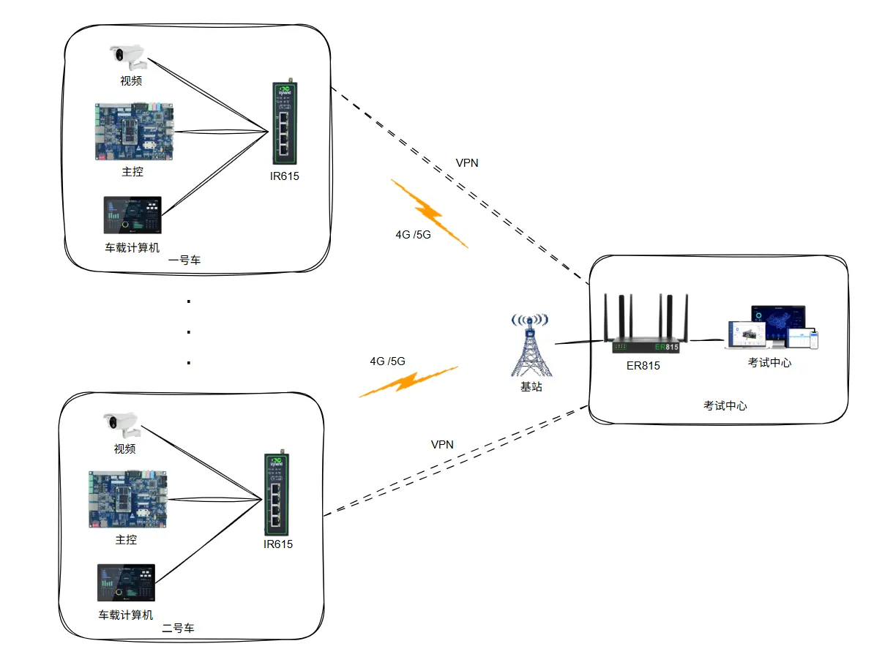

# 驾考科目三4G/5G组网方案

## 一、方案概述

### 1.1 项目背景

随着4G设备在驾校科目三项目上的广泛运用，不仅解决了科目三组网的问题，而且其可靠性和稳定性得到了实际的检验。其低故障率也得到用户广泛认可。

映翰通采用的是工业等级的4G/5G路由器，高稳定性、高环境适应性，以及采用接线端子接线，很好地解决了高低温对设备的影响，也避免了圆口插头氧化后的接触不良问题。

公安部对4G网络安全性要求很高，映翰通致力于向驾校用户提供安全级别更好的科目三4G组网方案。

### 1.2 建设目标

- 解决驾考科目三组网问题
- 提供高可靠性和稳定性的4G/5G网络连接
- 实现车载设备与数据中心的安全通信
- 满足公安部对4G网络安全性的高要求
- 实现事实数据传输和视频影像传输

### 1.3 适用场景

- 驾校科目三考试车辆联网
- 驾考监控系统
- 车载视频监控传输
- 实时数据传输场景

## 二、需求分析

### 2.1 设备现状

- 设备类型：车载服务器、串口服务器、视频服务器、4G网络路由器
- 通信接口：RJ45以太网接口
- 通信协议：IPsec VPN、L2TP VPN
- 部署环境：驾考车辆、数据中心
- 数量规模：多辆考试车辆

### 2.2 核心需求

1. **网络资源需求**：

   - 须有固定IP地址的互联网专线
   - 4G、5G上网卡，搭配专线
   - 最好与4G/5G卡是同一运营商的固定IP互联网专线

2. **设备需求**：

   - 一台接入的VPN路由器（ER815）
   - Inhand IR315 工业路由器

3. **安全性需求**：

   - 运营商自身网络安全
   - 车载路由器到数据专线的数据加密
   - 防火墙功能抵御外来网络攻击

## 三、总体架构设计

科目三4G网络系统由车载系统和中心系统组成：

- **车载系统**：由车载服务器、串口服务器、视频服务器和4G网络路由器、4G/5G上网卡等组成。车载服务器、串口服务器、视频服务器通过网线RJ45与IR315连接，接入4G/5G运营商提供的4G/5G网络中。

- **中心系统**：采用通信运营商提供的互联网专线链路，经光纤转发器接入中心VPN路由器ER815，VPN路由器通过交换机与内网服务器等设备相连。在VPN路由器中做策略使内部设备不可连接互联网，并与各车辆的车载路由器建立VPN网络，可以直接与车载设备通信。

### 3.1 四层架构

1. **感知层**：车载服务器、串口服务器、视频服务器等车载设备
2. **网络层**：IR315工业路由器（4G/5G）、VPN企业级路由器ER815、互联网专线
3. **平台层**：数据中心、内网服务器
4. **应用层**：驾考监控、视频传输、实时数据通信

### 3.2 数据流

车载设备 → IR315工业路由器（4G/5G）→ 运营商网络 → VPN隧道 → 数据中心VPN路由器（ER815） → 内网服务器

## 四、网络与接入方案

### 4.1 联网方式选型

采用4G/5G无线网络接入为主，通过VPN隧道与数据中心建立安全连接。使用固定IP地址的互联网专线作为中心接入链路。

### 4.2 分支节点选型要点

**IR615工业路由器特性**：

- 工业等级4G/5G路由器，高稳定性、高环境适应性
- 采用接线端子接线，解决高低温影响和圆口插头氧化接触不良问题
- 支持IPsec VPN或L2TP VPN技术
- 带有防火墙功能，有效抵御来自外来网络的攻击
- 通过RJ45网线与车载服务器、串口服务器、视频服务器连接
- 支持4G/5G运营商网络接入

## 五、功能需求与协议支持

### 5.1.中心端

- **VPN支持：** IpSecVPN、L2tpVPN
- **IpSecVPN吞吐量：** 300Mbps
- **接入量：** 150~200
- **其他：** 支持静态路由、ACL、NAT等设置

### 5.2. 分支端

- **网络协议**：4G/5G

- **VPN协议**：IPsec VPN、L2TP VPN

- **安全协议**：防火墙

- 支持VPN隧道建立，与数据中心VPN路由器通信

- 支持车载设备与内网服务器的直接通信

## 六、方案亮点总结

1. **工业级可靠性**：采用工业等级的4G/5G路由器，高稳定性，高环境适应性，低故障率

2. **部署和运维成本更低：** 传统的网桥方案土建以及部署成本极高，并且部分路段无部署条件。后期维护成本也高，使用该方案不需要前期土建，网络部署使用运营商的合法基建。

3. **接线端子设计**：采用接线端子接线，很好地解决了高低温对设备的影响，避免了圆口插头氧化后的接触不良问题

4. **三级安全性保障**：

   - 第一级：运营商自身网络安全
   - 第二级：车载路由器到数据专线的数据加密使用IPsec VPN或L2TP VPN技术
   - 第三级：车载电脑与VPN路由器带有防火墙功能，有效抵御来自外来网络的攻击

5. **高带宽低延迟**：4G/5G网络极大提高了带宽和降低了通信延迟，可以传输实时数据也可以传输视频影像，对于驾考科目三的要求可以完美胜任

6. **VPN组网技术**：使用VPN的组网技术，可以有效实现车载设备与数据中心的通信
