# 驾考联网路由器配置手册

## 一、文档信息

- **文档名称**：驾考联网路由器配置手册

- **产品型号**：ER815、IR315

- **固件版本**：V2.0.2（ER815）、V1.0.111（IR315）

- **适用场景**：设备联网，自建L2TP-VPN

- **编写日期**：2026年3月20日

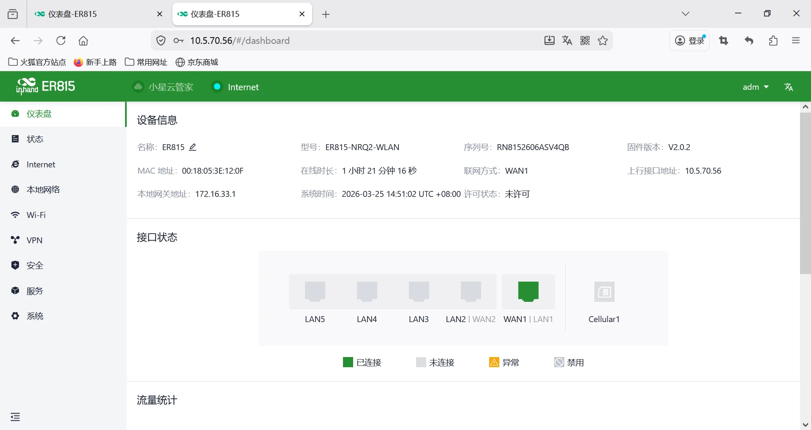

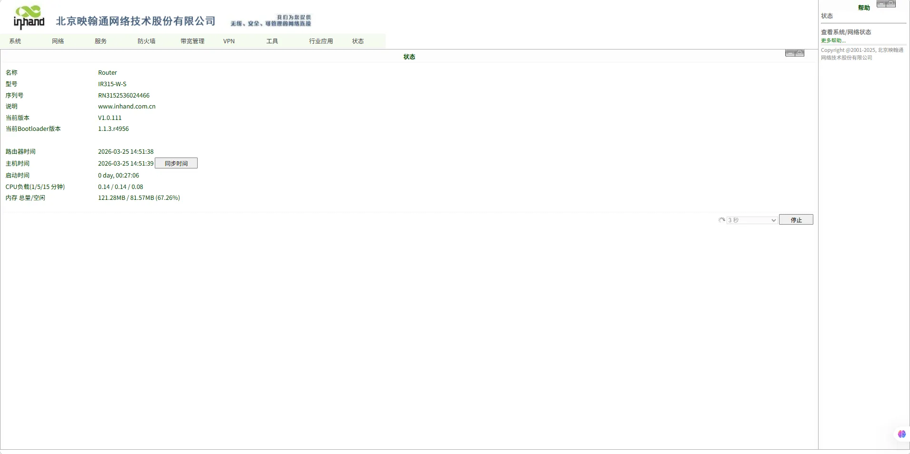

## 二、网关概述

### 2.1 产品简介

在此场景下路由器产品主要用于驾考联网场景下现场**车辆驾考设备联网**、**自建L2TP-VPN隧道**

### 2.2 主要功能

- 为车辆驾考设备提供网络

- 分支端与中心端自建VPN隧道加密传输

- 远程配置、远程诊断、远程升级

- 宽温工业级设计

### 2.3 典型应用拓扑

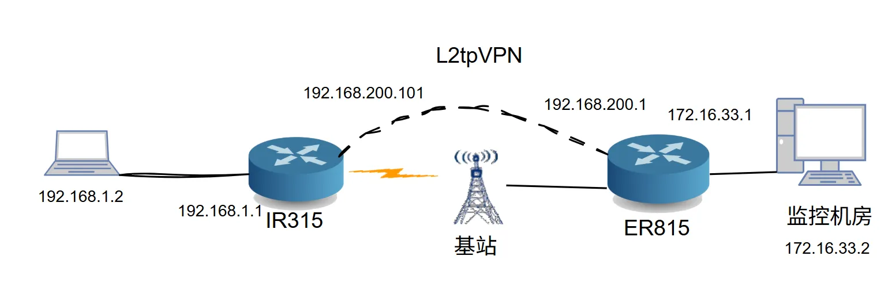

## 三、硬件说明

## 3.1 外观与接口

- 电源接口：12V/3A DC（EC815）、9-48V（IR315）
- 网口：ER815 LAN ×5路（WAN/LAN 可配置×2）、IR315 LAN×4 WAN×1
- 无线：4G/5G/Wi-Fi（可选）
- 指示灯：PWR、RUN、NET、信号强度
- 复位键：恢复出厂设置

## 3.2 接线说明

### 3.2.1 电源接线

- 正极：V+
- 负极：V-
- 注意：防反接、防雷、接地

### 3.2.2 以太网接线

直连 / 交叉自适应，建议超五类及以上网线。

## 四、出厂默认参数

- 默认 IP：192.168.2.1
- 子网掩码：255.255.255.0
- Web 用户名：adm
- Web 密码：随机密码，需对应设备铭牌

## 五、前期准备

1. 电脑设置与网关同网段 IP
2. 网线连接电脑与网关 LAN 口
3. 网关上电，等待 RUN 灯常亮
4. 浏览器输入网关 IP 进入配置页面
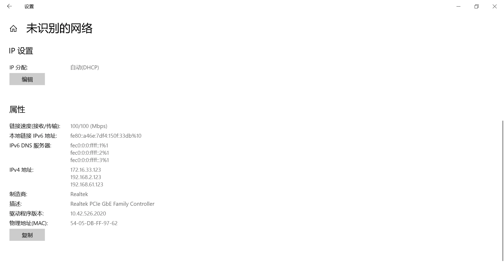

## 六、网络配置

### 6.1 IR315配置

1. 插入 SIM 卡（支持 NB-IoT/4G）
2. 开启移动网络
3. APN：自动 / 手动填写
4. 信号强度查看

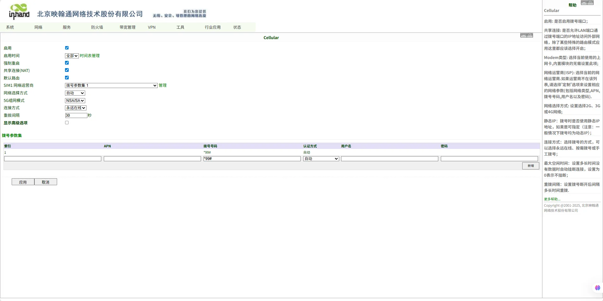

4.设置vlan地址为192.168.1.1
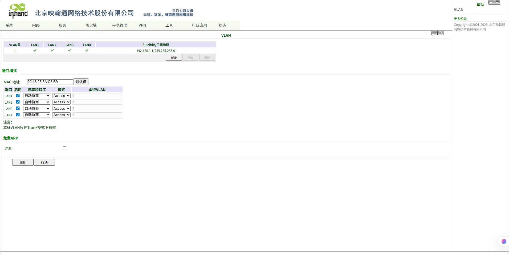
6.设置L2TP-VPN隧道
L2TP服务器地址和用户名密码需根据实际情况填写
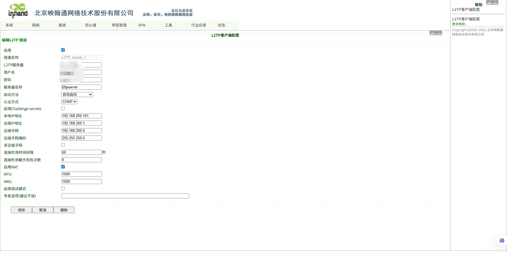
7.VPN连接成功效果如下
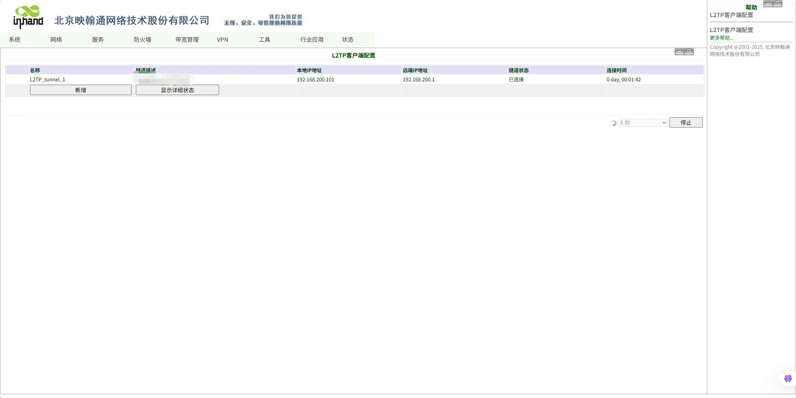

### 6.2 ER815配置

1.连接有线网络至ER815 wan1口
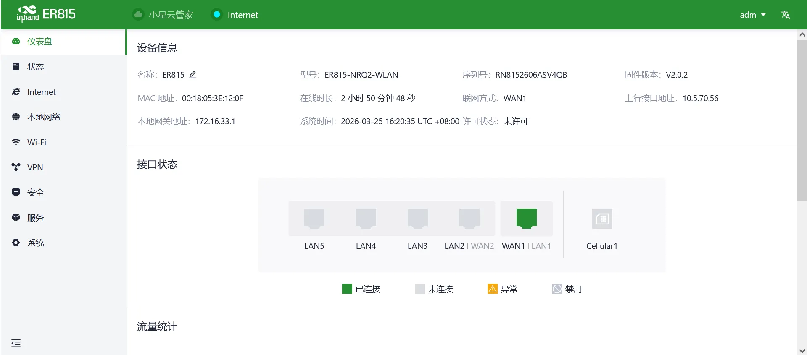
2.设置本地vlan地址为172.16.33.1
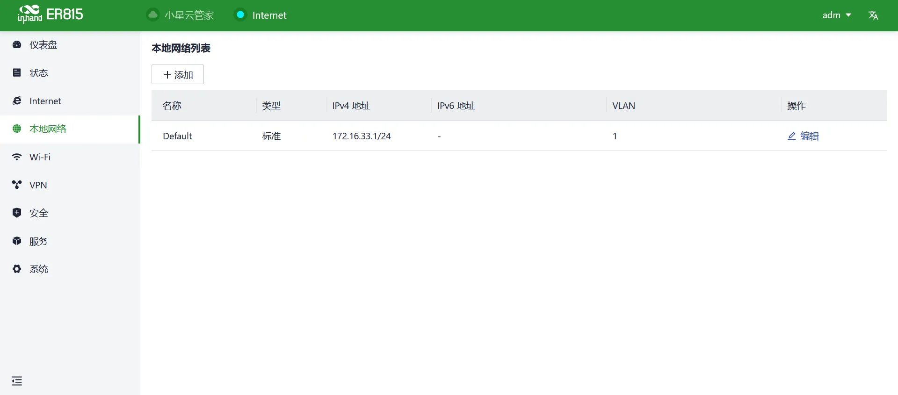
3.设置L2TP-VPN服务器
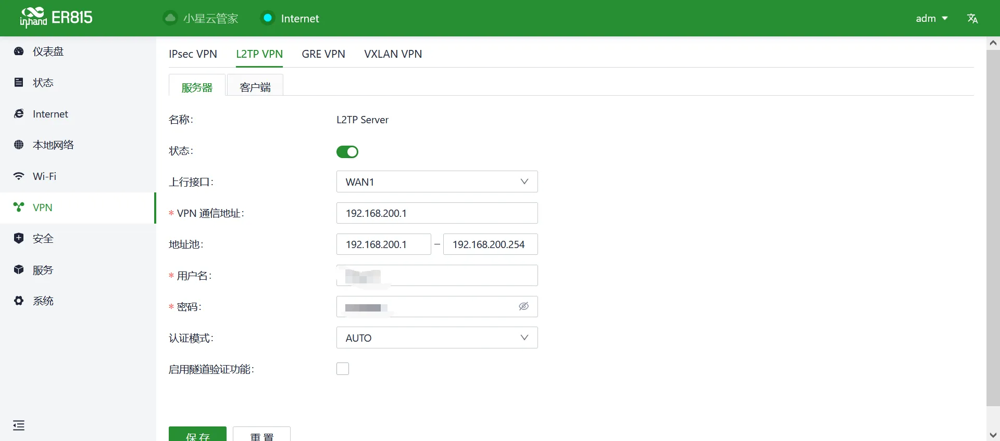
4.对端连接成功效果如下
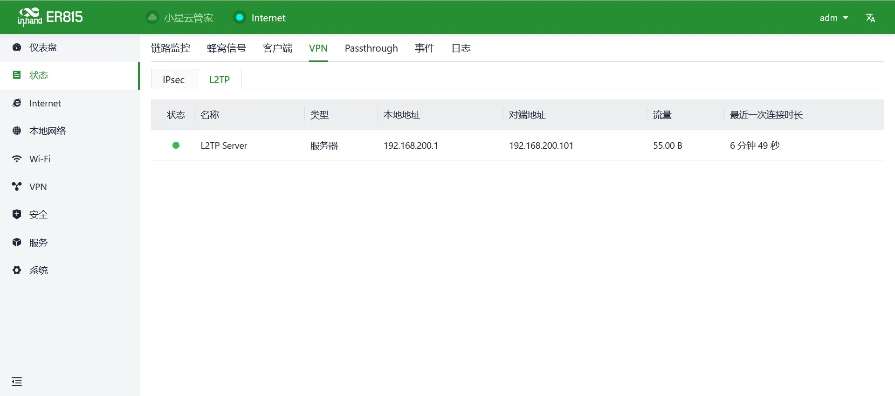

## 七、导入路由器配置

配置文件见config目录
