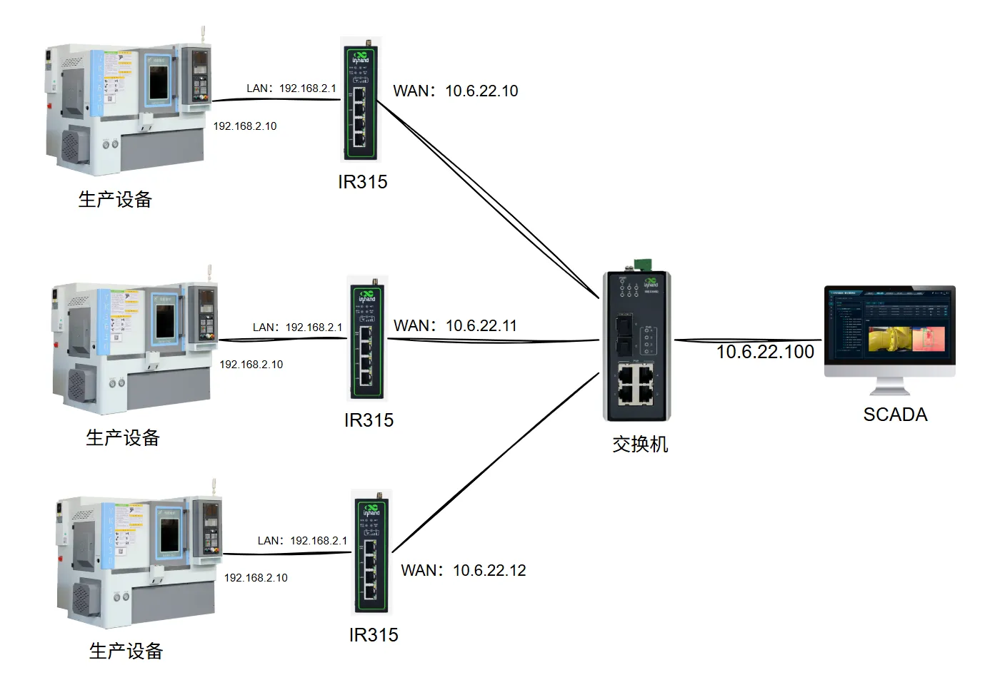

# 工厂数字化NAT组网案例

## 一、方案概述

### 1.1 项目背景

随着数字化进程的加快，工厂的数字化越来越重要了，在进行数字化过程中遇到各种问题需要解决，老旧设备已经脱保，并且不支持修改ip地址，并且大部分设备的IP地址都一样，最复杂的问题就是组网问题。现在就是为了解决组网这个问题。

### 1.2 建设目标

- 将所有设备的数据接入到本地的scada平台中
- 架构简单，容易维护
- 数据安全，设备不允洗接入互联网
- 安装设备需要符合工业化设计，具有较高的稳定性

### 1.3 适用场景

- 数字化工程网络改造
- 单设备对接多平台场景
- 解决灵活组网的问题

## 二、需求分析

### 2.1 设备现状

- 设备类型：产线、机床、工业机器人等生产设备
- 通信接口：RJ45以太网接口
- 通信协议：ModbusTCP、西门子S7、Ethernet/IP等各种PLC协议
- 部署环境：工厂车间

### 2.2 核心需求

1. **组网需求**：

   - 单个PLC需要具备可以接入多个网络系统中
   - 实现多个PLC相同地址，无法加入到组网中

2. **设备需求**：

   - 路由器（IR315）

## 三、总体架构设计

工厂数字化组网：

- **生产设备侧**：因为生产设备只有一个固定地址，并且无法修改，或者修改难度极大，这里使用IR315工业路由器的NAT功能，实现网络地址转换的功能。

- **中心系统**：使用本地部署平台软件，由服务器完成数采解析以及画面展示，该方案对网络依赖度很高，所以需要稳定度很高的网络。

## 四：数据流

现场设备 →设备控制网→ IR315工业路由器 → 内网 → 内网SCADA软件

## 五、IR路由器功能需求

- 支持NAT自由设置，可以单独设置SNAT和DNAT
- 支持多个网口并且支持划分VLAN
- 支持静态路由、ACL、NAT等设置
- 工业化设计，可以安装在工业导轨上

## 六、方案亮点总结

1. **工业级可靠性**：采用工业等级的NAT路由器，高稳定性，高环境适应性，低故障率

2. **部署和运维成本更低：** 安装NAT路由器就不需要更换产线设备的控制器，也不需要修改原先的生产程序，方便快捷，成本更低。

3. **接线端子设计**：采用接线端子接线，很好地解决了高低温对设备的影响，避免了圆口插头氧化后的接触不良问题

4. **三级安全性保障**：

   完全不接入互联网那个，杜绝了外部不安全因子接入，工业设备的控制网络与工厂内网使用NAT隔离，也有助于设备安全运行。
