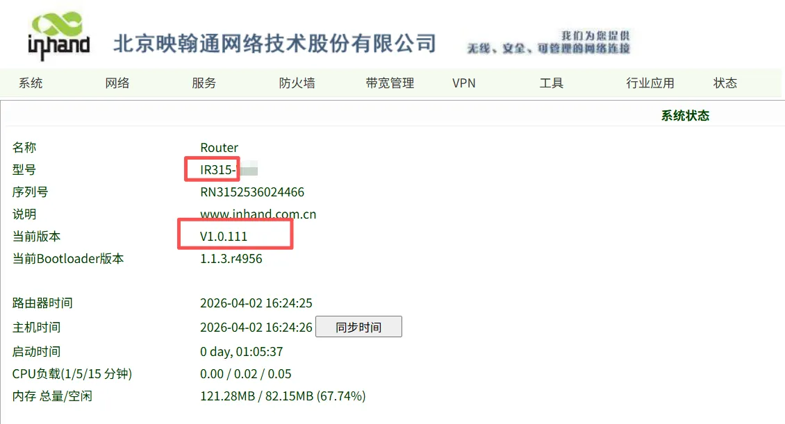
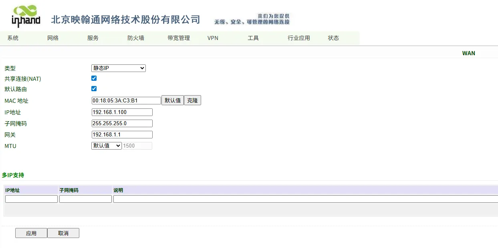
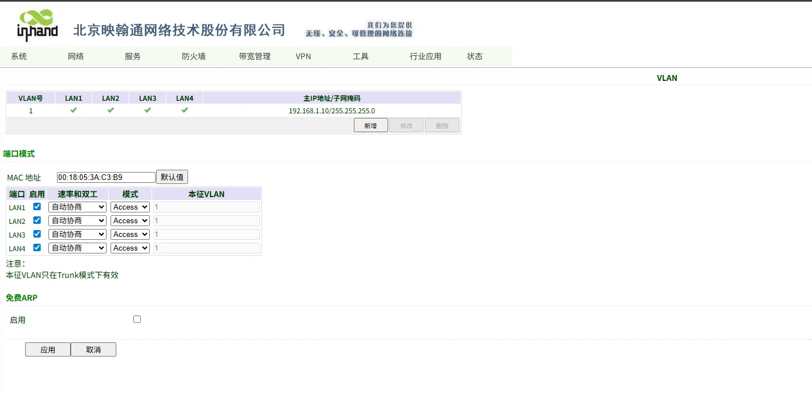
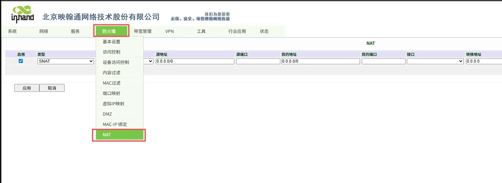
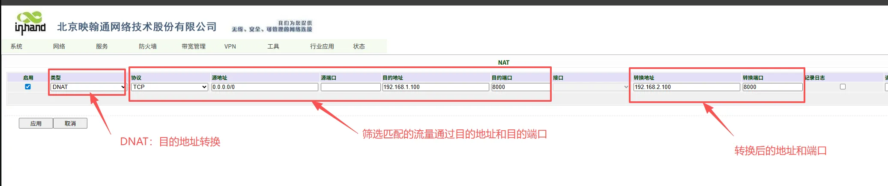
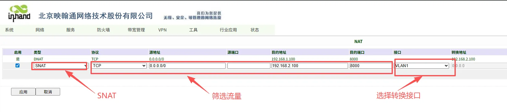
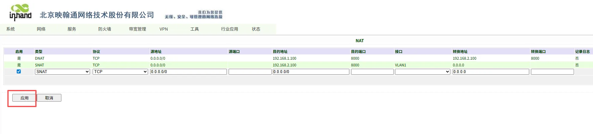
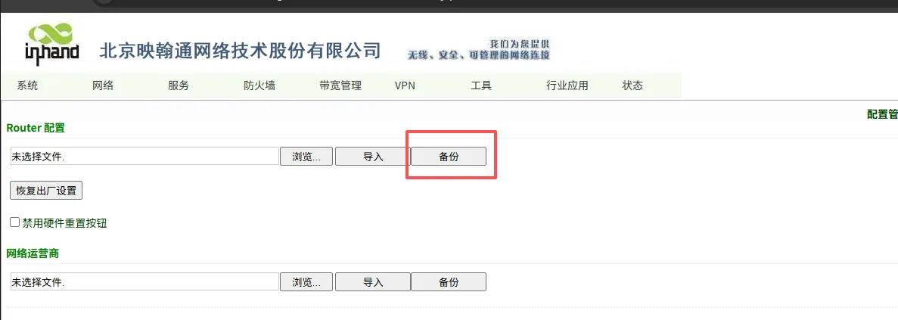
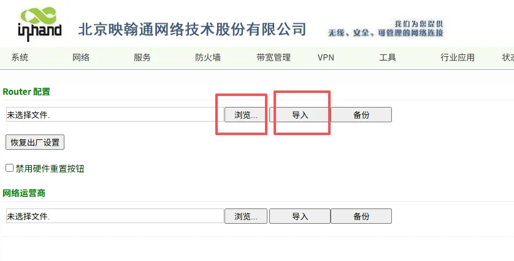

# 工厂数字化NAT路由器配置手册

## 一、文档信息

- **文档名称**：工业数字化NAT路由器配置手册
- **产品型号**：IR315-EN00
- **固件版本**：V1.0.111（IR315）
- **适用场景**：IP地址转换，NAT组网，网络隔离
- **编写日期**：2026年4月7日

## 二、网关概述

### 2.1 产品简介

在此场景下路由器产品主要用于工厂中生产设备组网**NAT网络地址转换**、**实现生产控制网络与办公网络隔离**

### 2.2 主要功能

- 为生产设备提供网络地址转换功能

- 实现生产控制网络与办公网络隔离

- 宽温工业级设计

### 2.3 典型应用拓扑

## 三、硬件说明

## 3.1 外观与接口

- 电源接口：9-48V（IR315）
- 网口：LAN×4 WAN×1
- 指示灯：PWR、RUN
- 复位键：恢复出厂设置

## 3.2 接线说明

### 3.2.1 电源接线

- 正极：V+
- 负极：V-
- 注意：防反接、防雷、接地

#### 3.2.2 以太网接线

直连 / 交叉自适应，建议超五类及以上网线。

## 四、出厂默认参数

- 默认 IP：192.168.2.1
- 子网掩码：255.255.255.0
- Web 用户名：adm
- Web 密码：随机密码，需对应设备铭牌

## 五、前期准备

1. 电脑设置与网关同网段 IP
2. 网线连接电脑与网关 LAN 口
3. 网关上电，等待 RUN 灯常亮
4. 浏览器输入网关 IP 进入配置页面

## 六、网络配置

### 6.1 IR315LAN配置

#### 6.1.1.设置接口地址

网络-WAN口
将WAN接口设置为上连的或者MES所在的网段，这里例子是192.168.1.X段的。设置为192.168.1.100

网络-VLAN接口
下联的PLC地址为192.168.2.100，将VLAN接口设置为192.168.2.1

#### 6.1.2.设置NAT

1.NAT接口
找到防火墙-NAT接口

2.DNAT设置
DNAT设置，相当于是将内部网络的IP地址映射到外部网络的IP地址上，实现NAT组网功能

3.设置SNAT
该项设置，相当于是将外部进来的流量的源地址替换为内部的LAN口地址，以实现下联设备不写网关也可以被访问的功能。

4.设置好之后要点新增，然后点后面的应用按钮，应用配置生效

## 七、导入导出路由器配置

### 7.1 导出配置文件

系统—配置管理-导出配置文件

### 7.2 导入配置文件

系统—配置管理-导入配置文件，导入配置文件后会提示重启生效

配置文件见config目录,配置文件的用户名为adm，密码为 inhand@123
