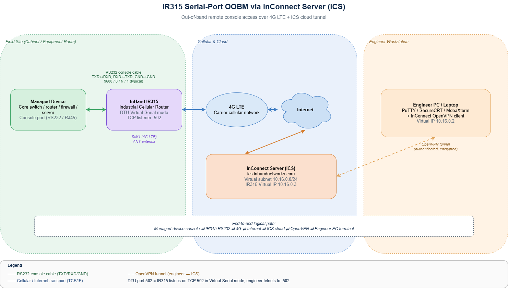

# IR315 带外管理（OOBM）方案

**产品：** InHand IR315 工业级蜂窝路由器

**云平台：** InConnect 服务器（InConnect Server, ICS）

## 1. 方案概述

### 1.1 项目背景

在现代数据中心、工厂、电信机房以及偏远户外机柜中，核心交换机、路由器、防火墙和服务器等关键基础设施必须随时可供运维工程师访问。然而在实践中，带内 SSH / Telnet 管理完全依赖生产网络。一旦生产链路中断、操作系统崩溃，或者因配置错误导致设备被锁，带内通道就会与故障一起消失——而这恰恰是最需要远程接入的时候。

传统的解决方式是派遣现场工程师携带 console 线缆前往处理。对于地理分散的站点，这种方式不仅速度慢、成本高，而且常常无法满足恢复时间目标（Recovery Time Objective, RTO）。本方案采用 InHand IR315 工业级蜂窝路由器，构建一条完全独立于生产网络的带外管理（Out-of-Band Management, OOBM）通道，使每一台关键设备的 console 端口都能通过 InConnect 服务器（ICS）云平台从任意地点远程访问。

### 1.2 目标

本方案旨在实现以下效果：

- 一条在物理和逻辑上均与生产数据网络隔离的专用管理通道。
- 通过单一云端入口，全天候访问每一台受管设备的 console 端口。
- 新设备无需派遣现场工程师即可完成零接触初始配置。
- 快速灾难恢复：即使 LAN/WAN 中断或设备操作系统崩溃，console 仍可通过蜂窝网络访问。
- 高安全性：每次会话均通过 ICS 认证，并借助 OpenVPN 隧道实现端到端加密。
- 通过 ICS 控制台集中管理设备清单、在线/离线状态以及审计视图。

### 1.3 适用场景

本方案适用于任何需要可靠远程访问网络或计算设备 console 的环境，包括：

- 数据中心核心交换机、汇聚交换机、路由器和防火墙。
- 电信机房以及基站回传设备。
- 工厂车间控制交换机、工业 PC 和 PLC 网关。
- 智能楼宇和园区网络弱电间。
- 偏远无人值守站点：泵站、变电站、油气站点、交通控制柜。
- 新设备在生产网络尚未就绪之前的首次上电开通。

## 2. 需求分析

### 2.1 当前痛点

在部署 OOBM 之前，运维团队通常面临以下一项或多项问题：

- 网络中断时无法远程访问设备，只能派工程师前往现场。
- 设备崩溃或内核 panic 后，无法建立 SSH / Telnet 会话进行排障。
- 多站点、地理分散的设备导致维护和差旅成本高昂。
- 新部署设备缺乏远程首次配置手段。
- Console 操作缺乏集中审计，事后回溯困难。

### 2.2 核心需求

OOBM 方案必须满足以下需求：

1. **独立的管理平面：** OOBM 通道不得依赖生产 LAN/WAN。
2. **多接口支持：** 至少支持 RS232（console）接口；工业设备建议同时支持 RS485。
3. **蜂窝上行链路：** 通过 4G LTE 工作，即使有线上行中断也能保持在线。
4. **基于云的访问：** 工程师可通过任意联网 PC 访问 console，无需将设备暴露在公共互联网。
5. **安全性：** 所有流量在传输过程中加密；用户必须认证；访问必须可审计。
6. **可扩展性：** 单个平台需支持数百到数千个远程站点。
7. **工业级硬件：** 宽温运行、浪涌保护、DC 9–36 V 电源输入。

## 3. 整体方案架构

### 3.1 三层架构

本方案采用三层架构：

1. **现场设备层**：需要远程访问 console 的网络或计算设备（核心交换机、路由器、防火墙、服务器、工业 PC 等）。
2. **接入层**：IR315 工业级蜂窝路由器。其 RS232 串口连接受管设备的 console；蜂窝接口上行至 ICS 平台。
3. **云端管理层**：InConnect 服务器（ICS）云平台。它作为安全汇聚点：IR315 从现场拨入，工程师 PC 通过 InConnect OpenVPN 客户端从办公室拨入。

端到端逻辑路径如下：

`受管设备 console → IR315 串口（RS232）→ 4G 蜂窝 → 互联网 → ICS 云端 → 工程师 PC（OpenVPN 客户端 + 终端工具）`

### 3.2 拓扑图

OOBM 高层拓扑如下图所示。

### 3.3 组件职责

| 层级 | 组件 | 职责 |
| --- | --- | --- |
| 现场设备 | 交换机 / 路由器 / 服务器 console | 需要远程访问其 console 输出和 CLI 的目标设备。 |
| 接入 | **IR315 工业路由器** | 提供蜂窝上行链路，端接 RS232 console 线缆，并运行 DTU（Data Transfer Unit，数据传输单元）功能，将串口流量透传至 TCP。 |
| 云端 | **InConnect 服务器（ICS）** | 承载 IR315 与工程师之间的安全汇聚隧道；为每台设备分配私有虚拟 IP；管理用户、权限和审计。 |
| 管理 | 工程师 PC / 笔记本 | 运行 InConnect OpenVPN 客户端，并使用串口终端工具（PuTTY / SecureCRT / MobaXterm）访问受管设备的 console。 |

### 3.4 数据流

1. IR315 通过 4G 与 ICS 建立持久的加密控制通道。
2. ICS 在客户的 ICS 子网中为 IR315 分配一个私有虚拟 IP（例如 `10.16.0.3`）。
3. IR315 的 RS232 端口以 **Virtual-Serial（虚拟串口）** 模式运行 DTU 功能，监听一个 TCP 端口（默认 `502`）。从受管设备接收到的串口字节被封装为 TCP 并转发；从工程师侧接收到的 TCP 字节则被写回串口。
4. 工程师在 PC 上启动 InConnect OpenVPN 客户端，与 ICS 建立 OpenVPN 隧道，并获取 ICS 子网路由。
5. 工程师使用终端工具（PuTTY / SecureCRT / MobaXterm）向 IR315 的虚拟 IP 和 DTU 监听端口发起 Telnet/Raw TCP 会话。此后，每一次按键都会送达受管设备的 console，就像直接连接本地 console 线缆一样。

---

## 4. 网络与访问设计

### 4.1 上行链路选择

IR315 支持以 4G LTE 作为 OOBM 的主用上行链路。蜂窝网络优先于有线链路，原因如下：

- 在电气和逻辑上独立于生产 WAN。
- 不受有线网络 ISP 中断影响。
- 可在尚未具备有线连接的机柜中部署。

如有可用链路，有线 WAN 也可作为可选备用上行链路。

### 4.2 选择 IR315 的理由

本方案选择 IR315 是因为其具备：

- 4G LTE 蜂窝上行链路，并支持双 SIM 卡冗余。
- 工业级 3.5 mm 间距接线端子，提供 **RS232（TXD/RXD）** 用于 console 连接，并提供 **RS485（A/B）** 用于工业协议。
- 内置 DTU 功能，实现串口到 TCP 的透明转发。
- 与 InConnect 服务器（ICS）管理平台原生集成。
- 工业级设计（宽温运行、DC 9–36 V 输入、浪涌/ESD 防护）。
- 紧凑的 DIN 导轨 / 壁挂式安装结构。

### 4.3 ICS 云平台

InConnect 服务器（ICS）是 InHand 的云端管理平台。针对 OOBM 场景，它提供：

- 在 IR315 与工程师之间建立安全的云端汇聚，无需任何一方具备公网 IP。
- 虚拟子网（示例中为 `10.16.0.0/24`），每一台 IR315 在其中获得一个私有虚拟 IP。
- 多平台 OpenVPN 客户端（Windows 7 / 8 / 10、iPhone、Android），工程师只需安装一次。
- 按用户分配的账号，具备 VPN 访问权限和审计日志。
- 设备清单、在线状态、流量统计和远程 Web 管理 Web 仪表盘。

## 5. 协议与数据流

### 5.1 南向（受管设备 ↔ IR315）

IR315 通过 RS232 连接受管设备的 console 端口。串口参数必须与受管设备严格一致：

- **波特率：** 通常为 9600 或 115200（必须与受管设备一致）。
- **数据位：** 8
- **停止位：** 1
- **校验：** 无
- **流控：** 无

接线规则：IR315 的 `TXD` 接至受管设备的 `RXD`，IR315 的 `RXD` 接至受管设备的 `TXD`，共地 `GND`。TXD/RXD 接反是导致终端无输出的最常见原因。

### 5.2 北向（IR315 ↔ ICS）

IR315 通过 `ics.inhandnetworks.com` 与 ICS 维持一条始终在线的加密隧道。DTU 功能以 **Virtual-Serial** 模式将串口字节封装为 TCP，并监听一个可配置端口（默认 `502`）。该 TCP 监听器仅可通过 ICS 隧道访问，不会暴露到公共互联网。

### 5.3 用户侧（工程师 PC ↔ ICS）

工程师 PC 运行 InConnect OpenVPN 客户端，并使用按用户分配的 `.ovpn` 配置文件向 ICS 认证。隧道建立后，工程师即可使用任意标准终端工具（PuTTY / SecureCRT / MobaXterm）连接 IR315 的虚拟 IP 和 DTU 端口。

## 6. 安全设计

OOBM 本质上属于特权管理平面，因此必须进行加固。本方案采用以下控制措施：

- **端到端加密传输：** IR315 ↔ ICS 以及工程师 ↔ ICS 均为加密隧道。
- **不暴露公网：** IR315 和受管设备的 console 均不可从公共互联网直接访问，所有访问都由 ICS 代理。
- **按用户认证：** 每位工程师拥有独立的 ICS 账号和 OpenVPN 配置文件。
- **基于角色的访问：** ICS 权限可按设备或网络标签进行范围控制。
- **默认密码修改：** IR315 的 Web 管理密码在部署后必须从出厂默认值修改。
- **可审计：** ICS 记录用户会话、设备上下线事件以及配置变更。

## 7. 方案亮点

1. **真正的带外管理：** 蜂窝管理平面与生产数据网络完全隔离；即使生产 WAN/LAN 中断，console 仍可访问。
2. **无需现场派遣：** 初始上线、日常排障和灾难恢复均可在办公桌前完成。
3. **与 ICS 即插即用：** IR315 自动注册到 ICS，获取虚拟 IP，授权工程师 PC 可立即访问。
4. **通用 console 支持：** 由于 DTU 呈现的是一个透明 TCP 套接字，任何支持标准 RS232 console 的设备均可接入——交换机、路由器、防火墙、服务器、工业控制器。
5. **工业级可靠性：** 宽温运行、DC 9–36 V 电源、浪涌/ESD 防护——专为无人值守机柜设计。
6. **从单台到数千台均可扩展：** ICS 可集中管理整个设备群的清单、状态、用户和审计。
