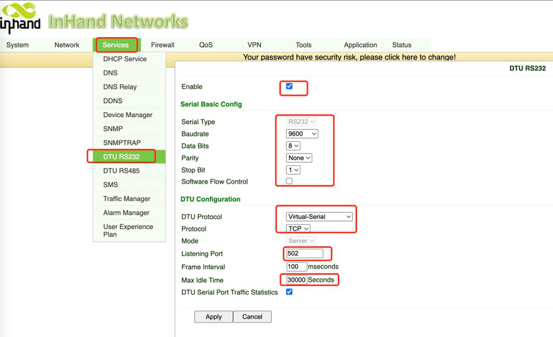
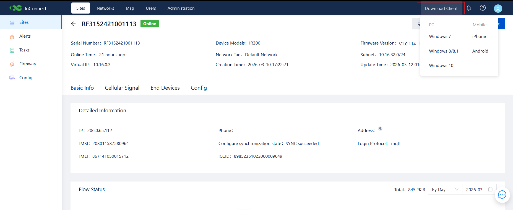
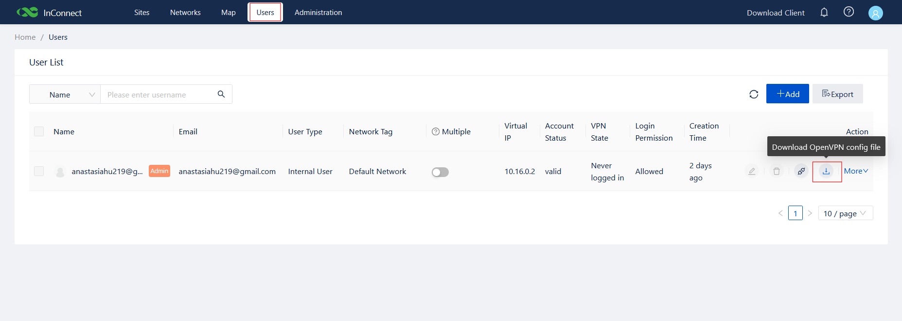

# 带外管理（Out-of-Band Management，OOBM）配置指南

**产品：** InHand IR315 工业蜂窝路由器  
**云平台：** InConnect Server（ICS）—— `ics.inhandnetworks.com`

本手册介绍如何通过 InHand IR315 工业路由器与 InConnect Server（ICS）云平台，为被管设备的 Console（控制台）端口部署带外管理（Out-of-Band Management，OOBM）的端到端配置。

## 1. 文档信息

- **产品型号：** IR315
- **云平台：** ICS（InConnect Server）—— `ics.inhandnetworks.com`
- **适用场景：** 通过 RS232 Console 端口对交换机、路由器、防火墙、服务器等设备进行带外远程 Console 访问。

## 2. 设备概述

### 2.1 产品介绍

InHand **IR315** 是一款工业蜂窝路由器，具备 4G LTE 上行链路、以太网 WAN/LAN 端口以及工业级 3.5 mm 间距端子排（引出 RS232 与 RS485）。该设备专为无人值守机柜设计，并支持 InHand InConnect Server（ICS）云平台，实现集中、安全的远程管理。本手册将 IR315 用作**串口到云端桥接器**：其 RS232 端口连接被管设备的 Console 端口，蜂窝上行链路将 Console 会话传输至工程师的 PC，后者通过 ICS 进行访问。

### 2.2 本方案使用的关键功能

- 4G LTE 蜂窝上行链路，作为带外管理平面。
- RS232 串口，用于连接交换机 / 路由器 / 服务器的 Console 端口。
- **DTU（Data Transfer Unit，数据传输单元）** 功能，实现透明串口到 TCP 转发。
- 原生 ICS 云端注册，每台设备分配独立虚拟 IP。
- 工业级设计（宽温、DC 9–36 V、浪涌 / ESD 防护）。

### 2.3 典型 OOBM 拓扑

高层拓扑如下图所示。

## 3. 硬件说明

### 3.1 本方案使用的接口

- **电源输入：** DC 9–36 V（V+ / V−），具备反接保护与浪涌保护。
- **串口：** 3.5 mm 间距工业端子排，引出 TXD / RXD / GND（RS232）以及 A / B（RS485）。用于连接被管设备的 Console 端口。
- **以太网：** RJ45 WAN / LAN（OOBM 上行链路非必需，但便于本地调试）。
- **蜂窝网络：** SIM1 卡槽 + 螺旋固定 ANT 天线。
- **LED 指示灯：** Power（电源）、Status（状态）、Cellular（蜂窝）、Signal（信号）—— 用于确认电源与 4G 状态。
- **复位按钮：** 恢复出厂默认设置。

### 3.2 IR315 串口端子引脚定义

| 引脚 | 信号 | 方向 | 说明 |
| --- | --- | --- | --- |
| 1 | V+ | 电源（+） | 电源正极 |
| 2 | V− | 电源（−） | 电源负极 |
| 3 | TXD | 输出（RS232 TX） | 发送 —— IR315 发送至被管设备的 RXD |
| 4 | RXD | 输入（RS232 RX） | 接收 —— IR315 接收来自被管设备的 TXD |
| 5 | GND | 信号地 | 信号地 —— 必须连接 |
| 6 | A | RS485+ | RS485 差分信号（+） |
| 7 | B | RS485− | RS485 差分信号（−） |

> ⚠️ **接线规则：** 作为 Console 线缆使用时，至少连接 TXD、RXD 和 GND。IR315 的 `TXD` → 被管设备的 `RXD`，IR315 的 `RXD` → 被管设备的 `TXD`，共用 `GND`（交叉连接）。TXD/RXD 接反是 Console 无输出最常见的原因。

### 3.3 接线图（Console 线缆）

## 4. 出厂默认值

- **默认 LAN IP：** `192.168.2.1`
- **子网掩码：** `255.255.255.0`
- **Web 用户名：** `adm`
- **Web 密码：** `123456`（部分批次使用随机密码，请参见设备标签）

## 5. 配置前检查清单

开始之前，请准备以下内容：

1. 一张已激活的 SIM 卡，且部署现场具备良好的蜂窝网络覆盖。
2. 第 3.3 节所述的 Console 线缆，已按照被管设备引脚预先制作完成。
3. 一个 `ics.inhandnetworks.com` 的 ICS 账户，并具备添加设备的权限。
4. 一台笔记本电脑，其网卡与 IR315 LAN 端口处于同一子网（`192.168.2.x`），用于首次 Web 登录。
5. 现代浏览器（Chrome / Edge / Firefox）。
6. 可选：串口终端工具（PuTTY / SecureCRT / MobaXterm），用于端到端测试。

上电顺序：

1. 在**设备断电**状态下，将 SIM 卡插入 SIM1 卡槽。
2. 将蜂窝天线牢固旋紧到 ANT 接口。
3. 将 Console 线缆从 IR315 串口端子连接到被管设备的 Console 端口。
4. 接入 DC 9–36 V 电源。
5. 等待 **Status** LED 常亮，且 **Signal** LED 显示信号良好（绿色 = 21–30）。

## 6. IR315 本地配置

本章所有操作均在 IR315 Web 管理界面完成。将笔记本电脑连接到 IR315 的 LAN 端口，将笔记本网卡设置为 `192.168.2.x / 24`，然后在浏览器中访问 `https://192.168.2.1`（如出现证书警告，请接受）。使用第 4 节的出厂用户名/密码登录，并在首次登录后**立即修改密码**。

### 6.1 串口参数配置

串口参数必须与被管设备 Console 端口**完全匹配**，否则会出现乱码或无输出。

1. 进入 **Services → DTU RS232**。
2. 配置以下参数并点击 **Apply**：
   - **Baud rate（波特率）：** 通常为 `9600` 或 `115200` —— 与被管设备保持一致
   - **Data bits（数据位）：** `8`
   - **Stop bit（停止位）：** `1`
   - **Parity（校验）：** `None`
   - **Software flow control（软件流控）：** 禁用

### 6.2 DTU 功能配置（串口转发）

DTU（Data Transfer Unit，数据传输单元）功能是 IR315 实现串口 OOBM 的核心机制。它将串口字节封装为 TCP 数据包，并通过蜂窝网络转发至 ICS。

1. 在 **Services → DTU RS232** 页面，启用 **DTU** 功能（切换为 Enabled）。
2. 将 **DTU Protocol** 设置为 **Virtual-Serial**。在此模式下，IR315 监听一个 TCP 端口，等待工程师的 PC 通过 ICS 隧道发起连接。
3. 将 **Protocol** 设置为 **TCP**，**Mode** 设置为 **Server**。
4. 将 **Listening Port** 设置为 `502`（也可根据需求使用 1024–65535 范围内的任意端口）。
5. （可选）按示例设置 **Frame Interval** = `100` ms，**Max Idle Time** = `30000` 秒。
6. 如需在 Web 界面查看字节计数器，请勾选 **DTU Serial Port Traffic Statistics**。
7. 点击 **Apply**，如提示重启则重启设备。

配置完成后的页面应如下所示：

## 7. ICS 云平台配置

### 7.1 在 IR315 Web 界面中将设备注册到 ICS

1. 在 IR315 Web 界面中，进入 **Services → Device Manager**（部分固件版本标注为 InConnect）。
2. 按以下方式配置：
   - **Enable：** 勾选
   - **Service Type：** `InConnect Service`
   - **Server：** `ics.inhandnetworks.com`
   - **Registered Account：** 您在 ICS 平台上创建的账户（同一页面提供注册 / 登录链接）
   - **LBS info Upload Interval / Series Info Upload Interval：** `1` 小时（默认）
   - **Channel Keepalive：** `30` 秒
3. 点击 **Apply**。IR315 将自动建立到 ICS 的安全隧道。约 30 秒后，设备应在 ICS 仪表盘上显示为**在线（Online）**。

### 7.2 在 ICS Web 控制台中添加 IR315

1. 打开浏览器，登录 ICS：`https://ics.inhandnetworks.com`。
2. 进入 **Sites → Routers/Gateways**，点击 **+ Add**。
3. 在 **Create Router/Gateway** 对话框中输入：
   - **Name：** 任意便于识别的名称（通常使用设备序列号）
   - **Device Model：** `IR315`
   - **Serial Number：** IR315 序列号（印在设备标签上）
   - **Network：** 选择目标 ICS 网络（例如 `Default Network`，启用 mesh）
   - **Subnet：** 该设备的虚拟子网（例如 `10.16.32.0/24`）
4. 点击 **Confirm**。

### 7.3 查看 IR315 虚拟 IP

IR315 上线后，ICS 会在配置的子网内为其分配一个**虚拟 IP（Virtual IP）**。工程师的终端工具将连接到这个虚拟 IP。

1. 进入 **Sites → Routers/Gateways**，在列表中找到 IR315。**VPN State** 指示器和绿色在线圆点都应显示设备已在线。

   

2. 点击设备名称进入详情页。复制 **Virtual IP** 字段（本例中为 `10.16.0.3`）。

   

### 7.4 下载并安装 InConnect OpenVPN 客户端

1. 在 ICS 任意页面，点击页面右上角页眉中的 **Download Client**。
2. 选择适合工程师 PC 的安装包 —— Windows 7、Windows 8 / 8.1、Windows 10、iPhone 或 Android。

   

3. 在工程师的 PC 上安装客户端。

### 7.5 下载每用户的 OpenVPN 配置文件（`.ovpn`）

每位工程师都需要从 ICS 获取自己的 OpenVPN 配置文件：

1. 进入 **Users**。 
2. 在列表中找到工程师的用户账户。
3. 点击 **Download OpenVPN config file** 图标（操作列中的下载图标）。

   

4. 将 `.ovpn` 文件保存到工程师的 PC，并导入 InConnect OpenVPN 客户端。

### 7.6 建立 OpenVPN 隧道

1. 在工程师的 PC 上启动 InConnect OpenVPN 客户端。
2. 选择第 7.5 节导入的配置文件，点击 **Connect**。
3. 客户端应显示已连接状态，并为 PC 分配一个与 IR315 处于同一 ICS 子网的虚拟 IP（例如 `10.16.0.2`）。

## 8. 端到端验证

OpenVPN 隧道建立后，工程师可以像访问本地 TCP 套接字一样，访问 IR315 的 DTU 监听地址 `<Virtual IP>:<Listening Port>`。

1. 打开串口终端工具 —— **PuTTY**、**SecureCRT** 或 **MobaXterm**。
2. 按以下方式配置会话：
   - **Connection type（连接类型）：** Telnet 或 Raw
   - **Host（主机）：** 第 7.3 节获取的 IR315 虚拟 IP（本例中为 `10.16.0.3`）
   - **Port（端口）：** 第 6.2 节配置的 DTU 监听端口（本例中为 `502`）
3. 点击 **Connect**。

如果接线和串口参数正确，被管设备的 Console 输出将显示在终端中 —— 按 Enter 键应出现设备的 CLI 提示符，与本地 Console 线缆直连效果一致。

以下示例使用 Windows 命令提示符中的 telnet：

本示例连接到 `10.16.0.3 502`，被管交换机显示其 `monitor#` 交互式帮助信息 —— 确认 OOBM 通道已完全正常运行。

## 9. 加固与 Day-2 运维

OOBM 通道确认正常工作后，请执行以下加固步骤：

### 9.1 修改 IR315 管理员密码

1. 进入 **System → Administration**。
2. 输入当前密码并设置新的强密码。
3. 点击 **Apply** 并保存配置。

### 9.2 限制 IR315 管理服务

1. 进入 **System → Administration → Service**。
2. 禁用 OOBM 不需要的任何服务（例如，若 HTTPS 足够则禁用 HTTP，若 SSH 足够则禁用 Telnet）。
3. 将 **Remote Management（远程管理）** 限制为仅 ICS 访问 —— 不要将 IR315 Web 界面暴露到公共互联网。

### 9.3 备份 IR315 配置

1. 进入 **Services → Configuration Management**（部分固件版本标注为 **Config Management**）。
2. 点击 **Backup Configuration**，将文件保存到安全位置。
3. 同一页面可用于 **Import Configuration**，在部署替换设备时导入配置；导入后必须重启设备才能生效。

### 9.4 定期轮换密码并审计会话

- 按固定周期轮换 IR315 管理员密码。
- 检查 ICS 审计日志，排查异常用户会话或设备断连。
- 确认每位工程师的 ICS 账户仅拥有实际需要的权限。

## 10. 故障排查

### 10.1 快速参考

| 现象 | 建议检查项 |
| --- | --- |
| IR315 无法连接 4G 网络 | SIM 卡是否插好且已激活、APN 是否正确、天线是否拧紧、信号强度（绿色 Signal LED，RSSI ≥ −90 dBm） |
| IR315 在 ICS 中长期显示离线 | ICS 服务器地址（`ics.inhandnetworks.com`）、账户凭证、网络可达性（ping 8.8.8.8）、TCP 443 / 8883 防火墙 |
| 终端连接后无 Console 输出 | 串口参数、线缆接线（TXD/RXD 是否接反）、被管设备是否已上电并输出 Console、线缆类型（部分设备需要翻转线缆） |
| Console 输出乱码 | 串口参数不匹配 —— 重新检查双方波特率、数据位、停止位、校验 |
| Console 连接频繁掉线 | 4G 信号弱、ICS 保活时间过短（建议 30–60 秒）、端子排连接松动、电源功率未满足额定要求 |
| ICS 客户端无法建立隧道 | PC 网络访问、本地防火墙 / 代理是否拦截客户端、ICS 账户权限、重启客户端或重新登录 |

### 10.2 详细问题分析

#### 10.2.1 IR315 无法连接 4G 网络

**现象：** IR315 前面板的蜂窝信号 LED 熄灭或持续闪烁；管理界面显示蜂窝状态为 **Not Connected**。

排查步骤：

1. 确认 SIM 卡已正确插入 SIM1，且未被锁定或因欠费停机。
2. 确认天线已牢固旋紧到 ANT 接口，接触良好。
3. 登录管理界面，核实 APN 设置（请联系运营商获取正确 APN）。
4. 使用移动电话核实部署位置的蜂窝网络覆盖情况。
5. 重启 IR315，观察蜂窝连接是否恢复。

> **提示：** 部分运营商 SIM 卡需先在手机中激活，或开通数据套餐后才能在路由器中使用。

#### 10.2.2 设备在 ICS 中长期显示离线

**现象：** IR315 已具备活跃的 4G 连接，但 ICS 上的设备状态仍显示 **Offline** 或 **Unregistered**。

排查步骤：

1. 确认 ICS 服务器地址（`ics.inhandnetworks.com`）配置完全正确。
2. 确认 IR315 序列号与 ICS 上的设备记录一致。
3. 在 IR315 管理界面中执行 ping 测试，确认能否到达 `8.8.8.8`。
4. 确认上游防火墙允许 IR315 通过 TCP 443 / 8883 访问 ICS。
5. 在 ICS 中确认设备账户未被禁用，且许可证未过期。

#### 10.2.3 终端连接后无 Console 输出

**现象：** 终端工具显示连接成功，但屏幕空白 —— 按 Enter 无反应。

排查步骤：

1. 确认 Console 线缆已牢固插入 IR315 的 SERIAL 端子排以及被管设备的 Console 端口。
2. 确认线缆类型 —— 部分设备需要使用翻转线缆（rollover cable），而非直通线。
3. 确认 IR315 串口参数与被管设备 Console 参数一致（尤其是波特率）。
4. 确认被管设备已上电并输出 Console 内容（先用本地直连 PC 测试）。
5. 在终端工具中尝试按 **Enter** 或 **Ctrl+C** 触发输出。

#### 10.2.4 Console 输出乱码

**现象：** 终端工具收到数据，但无法阅读（显示 `????`、`□□□` 等）。

**根本原因：** 这是典型的串口参数不匹配症状。

解决方法：

1. 重新检查 IR315 与被管设备的波特率、数据位、停止位、校验 —— 双方必须完全相同。
2. 最常见的错位：被管设备为 9600，而 IR315 为 115200（或相反）。
3. 修正后重新连接，确认输出可读。

#### 10.2.5 Console 连接频繁掉线

**现象：** Console 连接不稳定，或运行一段时间后断开。

排查步骤：

1. 检查 IR315 蜂窝信号强度。若 RSRP < −110 dBm，请调整天线位置或重新选址部署。
2. 检查 ICS / Device Manager 页面中的 **Channel Keepalive** 值 —— 建议设置为 30–60 秒。
3. 检查串口端子排或线缆应力释放处是否存在松动。
4. 确认电源功率满足 IR315 的额定要求。

#### 10.2.6 ICS 客户端无法建立隧道

**现象：** InConnect OpenVPN 客户端已安装并登录，但无法与 ICS 建立隧道。

排查步骤：

1. 确认工程师的 PC 已接入互联网，并能访问 `ics.inhandnetworks.com`。
2. 检查本地防火墙 / 终端防护软件是否拦截客户端；可临时禁用以进行测试。
3. 确认 ICS 中的用户账户具备访问目标 IR315 的权限。
4. 重启客户端，或注销后重新登录，等待隧道重新建立。
5. 若 PC 使用 HTTP 代理，请在客户端中配置正确的代理设置。

## 11. 安全注意事项

- 在工业环境中，将 IR315 机壳可靠接地。
- 设备带电时，请勿热插拔串口端子排。
- 每次成功修改配置后，备份 IR315 配置。
- 按固定周期轮换 IR315 管理员密码和 ICS 用户密码。
- 限制对 IR315 的物理访问 —— 仅授权人员可操作设备。
