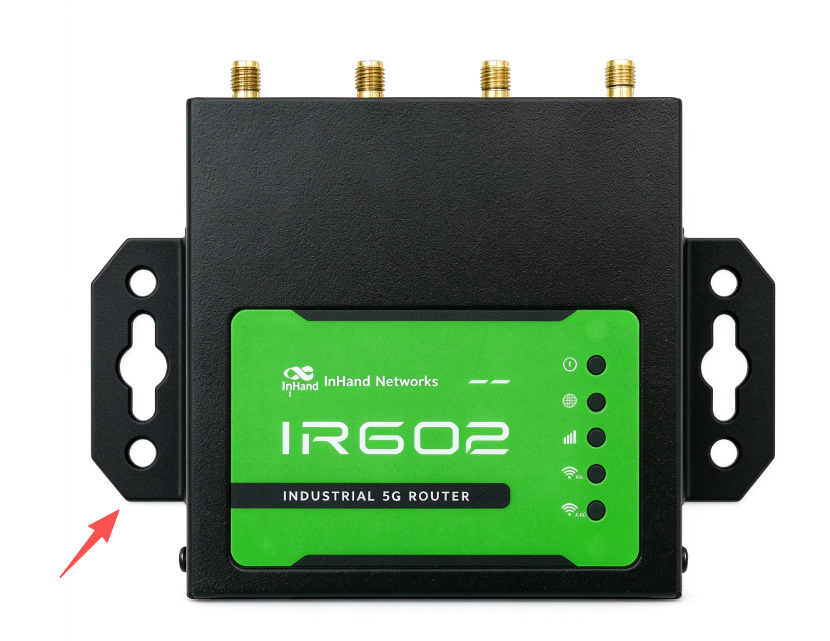
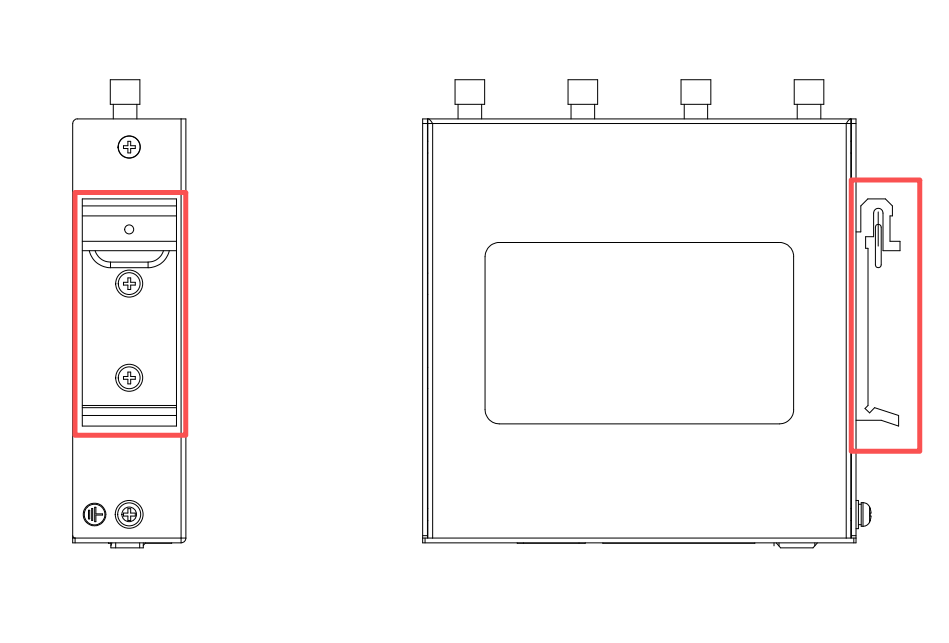
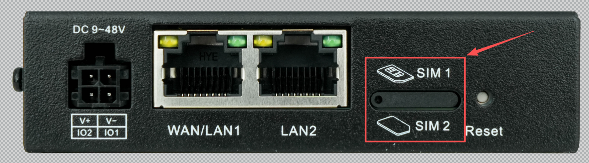
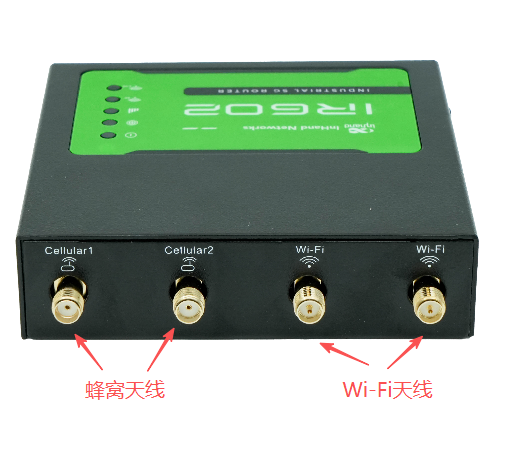
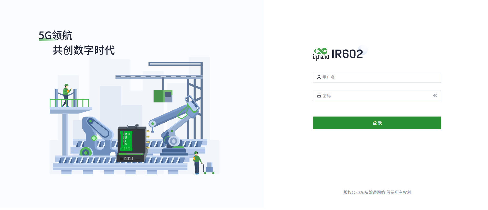
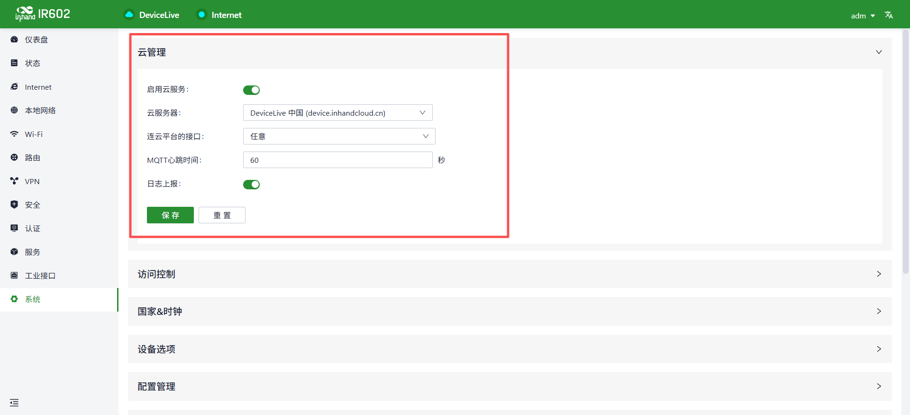
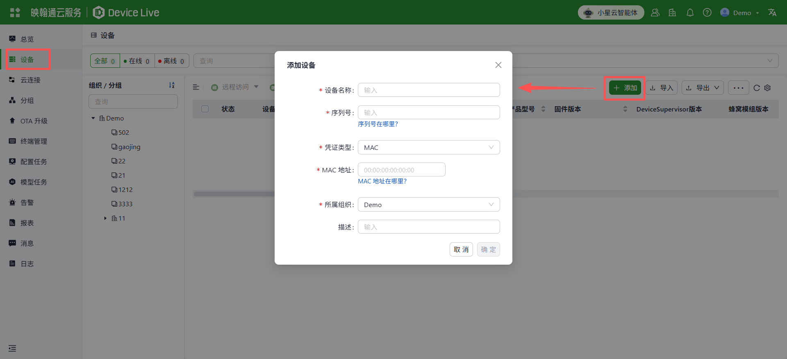
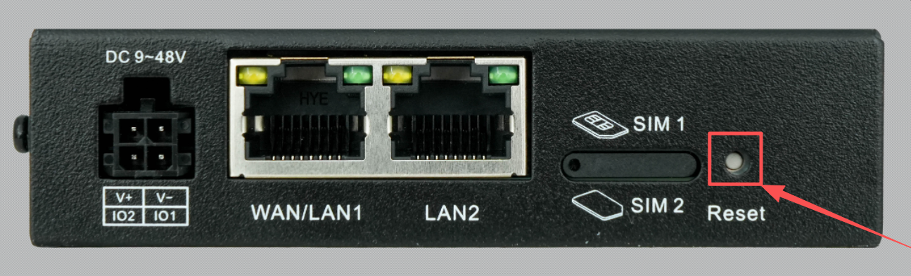

**包装清单**

IR602配有标准配件。当你收到后，请检查确认是否配齐。
如有遗漏或损失，请联系映翰通销售或技术支持人员。

| 物料名称 | 数量 | 描述 |
|------|------|------|
| IR602 | 1 | IR602路由器整机 |
| 电源 | 1 | 圆孔DC 12V适配器 |
| 网线 | 1 | 1米网线 |
| 安装套件 | 1 | 1套壁挂安装套件 |

**快速使用指南**

**1. 安装IR602**

方式一：壁挂安装

（1）用螺钉将壁挂套件固定到设备上；

<strong>图 1-1 挂耳安装</strong>

（2）用螺钉将设备固定到墙面或柜体，并确保设备无松动或晃动。

方式二：DIN导轨安装

（1）用螺钉将DIN导轨安装板固定到设备上；

<strong>图 1-2 DIN导轨安装</strong>

（2）再将DIN导轨安装板上方挂钩卡入导轨顶端，缓慢向前推进，使底端卡入到位即可。

**2. （如需使用蜂窝）装入SIM卡，并接好天线**

IR602支持双卡单待，如需使用蜂窝流量上网，请先插入Nano-SIM卡。如无需使用蜂窝流量，请忽略此步骤。

（1）SIM卡槽与以太网口位于同一侧，使用卡针取出SIM卡槽；

<strong>图 2-1 SIM卡安装</strong>

（2）将Nano-SIM卡放置在卡托上，确保缺角边对齐后，将卡托插回卡槽内。

（3）按照设备壳体丝印，将蜂窝天线、Wi-Fi天线安装到对应接口并拧紧。

<strong>图 2-2 天线安装</strong>

> 注意：**插拔SIM卡时，请务必在设备断电状态下进行，否则可能导致设备异常。**

**3. 连接电源和以太网**

将DC电源线接入IR602侧面的电源接口，再将以太网线接入WAN/LAN1口。

**4. 访问设备**

（1）使用以太网线将设备的LAN接口与电脑连接，然后在浏览器中访问https://192.168.2.1 进入设备的登录页面；

<strong>图 4-1 设备本地登录页面</strong>

（2）查看设备背面铭牌，获取登录用户名和密码。输入后，即可登录到设备本地。
> 注意：建议在首次使用后及时修改密码。

**5. 云管理设备**

（1）登录到设备本地，并在“系统 -> 云管理”页面启用云服务；

<strong>图 5-1 云管理配置</strong>

（2）登录DeviceLive（https://device.inhandcloud.cn），进入”设备“菜单，点击“添加”，并录入设备铭牌上的序列号及MAC地址；

<strong>图 5-2 添加设备到DeviceLive</strong>

（3）添加成功后，即可远程管理您的设备。

**恢复出厂**

如需重置设备，需按照以下步骤将设备恢复出厂设置：

1.设备上电，等待SYS指示灯熄灭的瞬间长按Reset按钮5-10秒，然后松开Reset按钮，此时SYS指示灯红色闪烁。

2.再次长按Reset按钮，直到SYS指示灯红色常亮，然后松开Reset按钮，设备进入恢复程序。

<strong>图 6 Reset按钮</strong>

**状态灯**

| 指示灯 | 状态 | 含义 |
|--------|------|------|
| 系统状态灯 | 常灭 | 设备未上电 |
|  | 红色常亮 | 系统启动中/系统工作正常 |
|  | 红色闪烁 | 固件升级中/系统错误 |
| 蜂窝状态灯 | 绿色闪烁 | 蜂窝连接中 |
|  | 绿色常亮 | 蜂窝连接成功 |
| 蜂窝信号灯 | 常灭 | 无蜂窝连接 |
|  | 一颗信号灯常亮 | 信号质量较差 |
|  | 一颗信号灯常亮 | 信号质量中等 |
|  | 一颗信号灯常亮 | 信号质量好 |
| Wi-Fi 2.4G | 常灭 | AP&STA未使能 |
|  | 绿色闪烁 | 2.4G正常工作 |
|  | 绿色常亮 | 工作模式为STA且未关联AP |
| Wi-Fi 5G | 常灭 | AP&STA未使能 |
|  | 绿色闪烁 | 5G正常工作 |
|  | 绿色常亮 | 工作模式为STA且未关联AP |

**常见问题**

1.状态灯不亮

请检查电源是否通电。

2.无法访问到设备本地页面

请检查PC是否与设备的LAN口连接。如已连接，请确认PC与设备同网段，并检查是否使用HTTPS。

3.设备添加到DeviceLive平台后，一直处于离线状态

先确认设备是否通电通网，然后登录设备本地检查云管理功能是否开启。