# 北京映翰通工业路由器IR602产品系列用户手册

## 声明

首先非常感谢您选择本公司产品！在使用前，请您仔细阅读本用户手册，遵守以下声明，将有助于维护知识产权和法律合规性，以确保您的使用体验与产品的最新信息相一致。如有任何疑问或需要获取书面许可，请随时联系我们的技术支持团队。

- 版权声明

本用户手册包含受版权保护的内容，版权归北京映翰通网络技术股份有限公司及其许可者所有。未经书面许可，任何单位和个人不得擅自摘抄、复制本手册的部分或全部内容，且不得以任何形式传播。

- 免责声明

由于产品技术和规格不断更新，本公司不能承诺用户手册中的资料与实际产品完全一致。因此，不承担由于实际技术参数与用户手册不符而引起的任何争议。任何关于产品的改动恕不提前通知，本公司保留最终更改权和解释权

- 版权信息

本用户手册内容受版权法律保护，版权归北京映翰通网络技术股份有限公司及其许可者所有，保留一切权利。未经书面许可，不得擅自使用、复制或传播本手册的内容。

## 图形界面约定

| 符号 | 含义 | 示例 |
|------|------|------|
| `< >` | 表示变量或参数，需替换为实际值 | `<IP地址>` 表示需填入具体IP |
| `" "` | 表示界面上的文字标签 | 点击"保存"按钮 |
| `→` | 表示菜单层级或操作顺序 | 【网络】→【蜂窝】 |
| `【 】` | 表示菜单或页面名称 | 进入【系统设置】页面 |
| 注意 | 提醒操作中应注意的事项，不当的操作可能会导致数据丢失或者设备损坏。 | - |
| 说明 | 对操作内容的描述进行必要的补充和说明。 | - |

## 技术支持

**北京映翰通网络技术股份有限公司（总部）**

电话：010-8417 0010

地址：北京市朝阳区紫月路18号院3号楼5层

**成都办事处**

电话：028-8679 8244

地址：四川省成都市武侯区天府大道北段1777号中国太平金融大厦14层

**广州办事处**

电话：020-8562 9571

地址：广州市天河区黄埔大道中660号汇金国际金融中心B栋1913单元

**武汉办事处**

电话：027-8716 3566

地址：武汉市洪山区关山大道465号光谷新发展国际中心B座5层

**上海办事处**

电话：021-5480 8501

地址：上海市普陀区国浩长风城北座326室

## 如何使用本手册

**对号入座**：
- 首次使用用户：建议按顺序阅读「认识设备」→「安装与首次使用」→「常用场景配置」→「功能说明与参数参考」
- 已有设备用户：可直接查阅「功能说明与参数参考」或「附录 故障处理」
- 云平台管理用户：可查阅「常用场景配置」中的设备远程管理平台

**按任务快速跳转**：

| 任务 | 对应章节 | 预计用时 |
|------|----------|----------|
| 了解设备外观与指示灯 | [认识设备](#第1章-认识设备) | 约5分钟 |
| 安装设备并首次联网 | [安装与首次使用](#第2章-安装与首次使用) | 约10分钟 |
| 配置蜂窝网络接入 | [常用场景配置](#第3章-常用场景配置) | 约5分钟 |
| 配置Device Live云管理 | [常用场景配置](#第3章-常用场景配置) | 约10分钟 |
| 查看设备参数与状态 | [功能说明与参数参考](#第4章-功能说明与参数参考) | 按需 |
| 排查设备故障 | [附录 故障处理](#附录-故障处理) | 按需 |

---

# 第1章 认识设备

## 1.1 概述

IR602系列是映翰通面向大规模、中速率工业物联网场景推出的轻量化5G RedCap工业路由器。产品集成5G RedCap、Wi-Fi 6和2.5G以太网，支持5G SA、链路冗余、智能链路调度、加密隧道及DeviceLive云端集中管理等功能，为跨厂区、野外及无人值守等分布式工业站点提供稳定、安全、易运维的网络连接。
产品采用工业级设计，可适应复杂工业环境，满足工业现场及分布式站点的长期稳定运行需求，为工业物联网的规模化部署提供可靠的网络基础。

<strong>图 1-1 IR602产品外观</strong>

## 1.2 指示灯说明

| 指示灯 | 状态 | 含义 |
|--------|------|------|
| 系统状态灯 | 常灭 | 设备未上电 |
|  | 红色常亮 | 系统启动中/系统工作正常 |
|  | 红色闪烁 | 固件升级中/系统错误 |
| 蜂窝状态灯 | 绿色闪烁 | 蜂窝连接中 |
|  | 绿色常亮 | 蜂窝连接成功 |
| 蜂窝信号灯 | 常灭 | 无蜂窝连接 |
|  | 一颗信号灯常亮 | 信号质量较差 |
|  | 一颗信号灯常亮 | 信号质量中等 |
|  | 一颗信号灯常亮 | 信号质量好 |
| Wi-Fi 2.4G | 常灭 | AP&STA未使能 |
|  | 绿色闪烁 | 2.4G正常工作 |
|  | 绿色常亮 | 工作模式为STA且未关联AP |
| Wi-Fi 5G | 常灭 | AP&STA未使能 |
|  | 绿色闪烁 | 5G正常工作 |
|  | 绿色常亮 | 工作模式为STA且未关联AP |

## 1.3 恢复出厂设置

<strong>图 1-2 Reset按钮</strong>

需按照以下步骤将设备恢复出厂设置：

1. 设备上电，等待SYS指示灯熄灭的瞬间长按Reset按钮5-10秒，然后松开Reset按钮，此时SYS指示灯红色闪烁。
2. 再次长按Reset按钮，直到SYS指示灯红色常亮，然后松开Reset按钮，设备进入恢复程序。

## 1.4 默认设置

| 序号 | 功能 | 默认配置 |
|------|------|----------|
| 1 | 蜂窝网络拨号 | 默认配置"仅SIM1" |
| 2 | Wi-Fi默认配置 | Wi-Fi 2.4G接入点启用，SSID：以IR602-为前缀，后面为无线MAC后6位数字；Wi-Fi 5G 接入点启用，SSID：以IR602-5G-为前缀，后面为无线MAC后6位数字；认证方式为WPA2-PSK；密码均为SN序列号后8位 |
| 3 | 以太网默认配置 | 3个LAN口启用；IP地址：192.168.2.1；子网掩码：255.255.255.0；DHCP服务器启用，地址池为192.168.2.2～192.168.2.100，可为下端设备自动分配IP地址 |
| 4 | 网络访问控制 | 本地HTTP及HTTPS启用，端口号分别是80和443；禁用来自蜂窝网络的访问 |
| 5 | 用户名和密码 | 需查看产品机身上的铭牌获取 |

---

# 第2章 安装与首次使用

## 2.1 安装前准备

### 环境要求

| 项目 | 要求 |
|------|------|
| 电源 | 使用原装电源适配器 |
| 温度/湿度 | 需满足规格书要求 |
| 安装位置 | 避免强电磁干扰环境，避免与高功率设备过于接近 |
| 工具 | SIM卡、蜂窝天线、Wi-Fi天线、网线 |

> **注意**：安装完成后需确认设备是否易发生晃动，避免因设备跌落造成设备损坏。

### 准备工作

1. 安装4G/5G、Wi-Fi天线并插入SIM卡。
2. 连接电源和网线，任意LAN口连接PC。
3. 将PC的IP地址设置为与工业路由器处于同一网段。

设备LAN口默认启用DHCP Server 功能，将PC设置为"自动获取IP地址"，PC即可通过IR624获取IP地址，需确认该地址是否处于192.168.2.0网段。若PC无法通过DHCP的方式自动获取IP地址，则需手动将PC的IP地址配置为192.168.2.2~192.168.2.254中的任一地址；默认网关为192.168.2.1，子网掩码为255.255.255.0，DNS设置为8.8.8.8或从运营商获取的DNS地址。

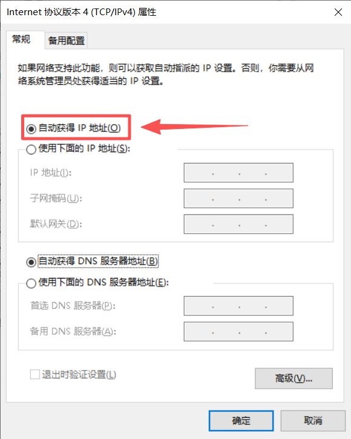

<strong>图 2-1 SIM卡安装</strong>

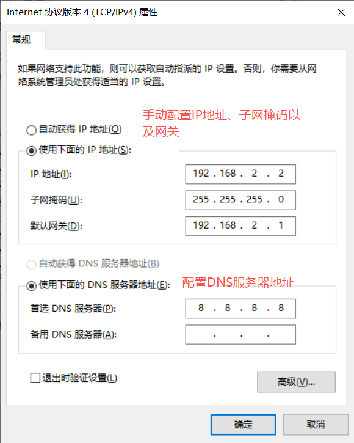

<strong>图 2-2 天线安装</strong>

## 2.2 安装指南

### Web界面登录

在浏览器地址栏中输入192.168.2.1，跳转到登录界面后输入用户名和密码（见产品机身铭牌）进入设备的网管界面。如果页面提示不安全，点击"隐藏"或"高级"，选择"继续前往"。

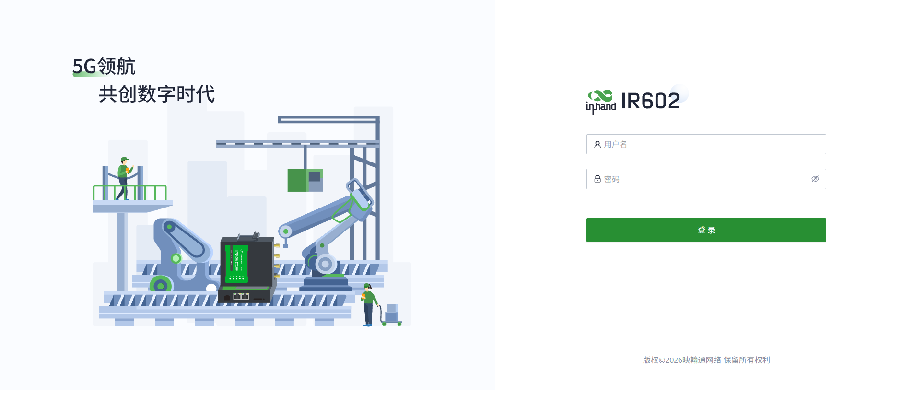

<strong>图 2-3 Web登录界面</strong>

### 网络接入方式说明

IR602支持5G/4G、有线、Wi-Fi（STA）三种网络接入方式。

#### 有线接入网络

IR602支持蜂窝、有线、Wi-Fi三种网络接入方式。设备WAN/LAN1端口支持"WAN/LAN切换"功能，该端口默认处于LAN模式，如需通过有线接入网络，需要在【Internet>上行链路列表】中手动添加WAN链路，并选择合适的联网方式（该端口支持DHCP/静态IP/PPPoE三种有线接入模式）。完成设置后，用网线将IR602的WAN口与上行设备连接即可接入网络。

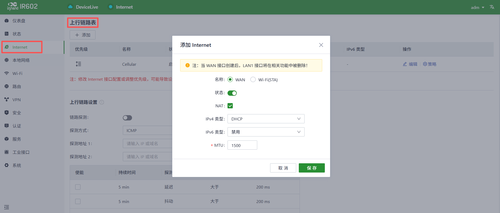

<strong>图 2-4 上行链路列表</strong>

#### 蜂窝接入网络

在通常情况下，按照说明完成天线安装并插入SIM卡后，IR602会自动创建拨号连接并连接到Internet。

## 2.3 快速检查

| 检查项 | 检查方法 | 预期结果 |
|--------|----------|----------|
| 设备上电 | 观察SYS指示灯 | 红色常亮表示系统启动中/系统工作正常 |
| 蜂窝网络连接 | 观察蜂窝状态灯 | 绿色常亮表示蜂窝连接成功 |
| Web界面访问 | 浏览器输入192.168.2.1 | 可正常打开登录界面 |
| PC获取IP | 查看PC网络状态 | IP地址在192.168.2.0网段 |

---

# 第3章 常用场景配置

## 场景1：蜂窝联网

**目标**：通过4G/5G蜂窝网络接入互联网。

**前提**：已插入SIM卡并安装天线，设备已上电。

**预计用时**：约5分钟。

**操作步骤**：
1. 插入SIM卡并安装天线。
2. 设备上电，等待系统自动拨号。
3. 在通常情况下，IR602会自动创建拨号连接并连接到Internet。
4. 当需要配置APN参数时，进入【Internet】→【上行链路列表】菜单，选择Cellular，点击"编辑"按钮进入APN参数配置界面。
5. 配置APN参数（APN参数需从运营商获取）。
6. 点击"保存"并等待连接建立。

**验证方法**：
1. 检查蜂窝状态灯，确认绿色常亮。
2. 在【状态】→【链路监控】中查看蜂窝链路状态。

**常见问题**：
- 网络连接失败：检查SIM卡是否正确插入、APN参数是否正确。
- 数据发送接收异常：检查信号强度和流量余额。
- 部分专网环境下，需手动关闭【Internet】菜单下的"链路探测"功能，避免因探测不通导致蜂窝不能正常工作。

## 场景2：有线接入网络

**目标**：通过有线方式接入互联网。

**前提**：已获取上行网络参数，设备已上电且PC已连接LAN口。

**预计用时**：约5分钟。

**操作步骤**：
1. 登录设备Web管理界面。
2. 进入【Internet】→【上行链路列表】，点击"添加"按钮。
3. 选择WAN接口类型，配置联网方式（DHCP/静态IP/PPPoE）。
4. 点击"保存"。
5. 用网线将IR602的WAN口与上行设备连接。

**验证方法**：
1. 在【状态】→【链路监控】中查看WAN链路状态。
2. 通过设备自带的Ping工具测试外网连通性。

**注意事项**：
- 添加WAN接口后，原LAN1接口角色将切换成WAN。
- 删除WAN接口后，原WAN接口角色将会切换回LAN1。
- 删除WAN接口后，与WAN接口相关的静态路由、入站/出站规则、端口转发、策略路由、流量整形相关配置都将被删除。

## 场景3：接入DeviceLive云平台

**目标**：将设备接入DeviceLive云平台，实现远程管理和监控。

**前提**：设备已接入Internet，已准备好设备的序列号和MAC地址。

**预计用时**：约10分钟。

**操作步骤**：
1. 在浏览器中（建议使用谷歌浏览器），输入网址 https://device.inhandcloud.cn 进入DeviceLive登录/注册页面。单击"立即注册"以创建平台账号。

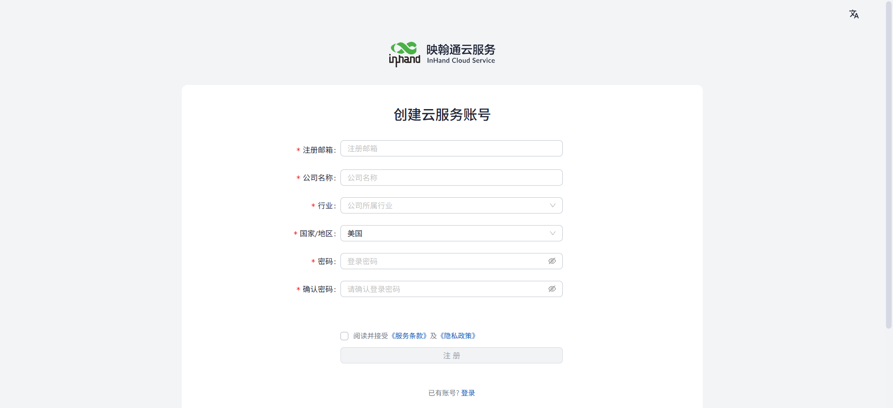

<strong>图 3-1 DeviceLive注册</strong>

2. 完成账号注册后，使用用户名和密码登录到映翰通云服务平台，并选择【DeviceLive】服务。

<strong>图 3-2 DeviceLive登录</strong>

3. 进入DeviceLive平台后，进入【设备】菜单，点击"添加"按钮，填写设备名称、序列号、MAC地址后点击"完成"。

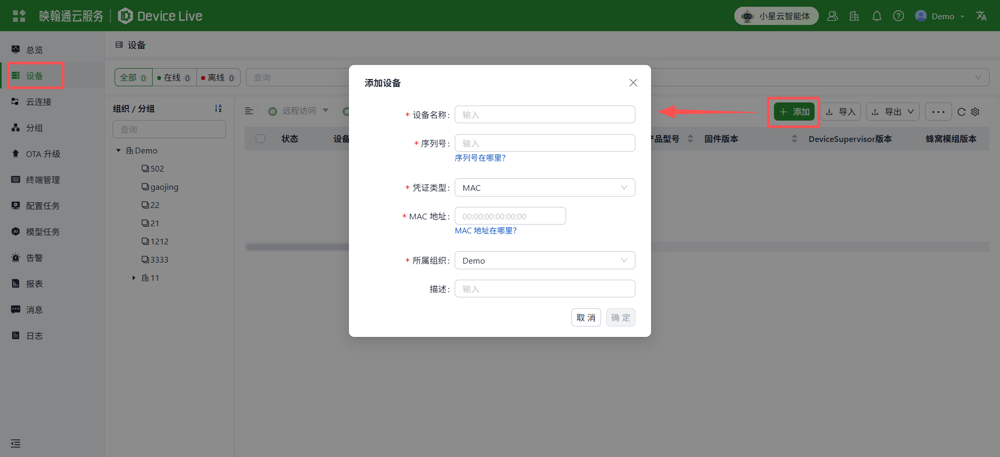

<strong>图 3-3 DeviceLive添加设备</strong>

**验证方法**：
1. 在DeviceLive平台【设备】列表中查看设备在线状态。
2. 点击"设备名称"查看设备详细信息。

**常见问题**：
- 设备显示离线：检查设备是否正常联网，确认序列号和MAC地址填写正确。
- IR602采用基础功能免费许可，高级功能收费许可的策略；常规的设备管理和监控功能可以免费使用，如需使用云连接等功能，需要在"企业管理>订阅>许可证"中购买高级许可证。

## 场景4：Wi-Fi接入点配置

**目标**：配置IR602作为AP提供无线网络接入。

**前提**：设备已上电，已登录Web管理界面。

**预计用时**：约5分钟。

**操作步骤**：
1. 进入【Wi-Fi】→【Wi-Fi列表】菜单。
2. 点击"添加/编辑"按钮，配置SSID名称、认证方式、密码等参数。
3. 点击"保存"。

**验证方法**：
1. 使用无线终端搜索配置的SSID。
2. 输入密码后确认可正常连接并访问网络。

**注意事项**：
- 设备默认有2.4G、5G两个主SSID，主SSID频段不支持修改且不可删除。
- 已添加的SSID频段不支持修改，信道将自动与所属主SSID的信道保持一致。
- 若用户在【Internet】菜单创建Wi-Fi(STA）接口，与Wi-Fi(STA）接口相同频段的SSID都无法启用直到Wi-Fi(STA）接口被删除。

---

# 第4章 功能说明与参数参考

## 4.1 设备监控

将设备添加到DeviceLive平台后，可从云平台管理和监控网络，同时支持通过云平台远程访问设备的本地Web界面。

### 4.1.1 设备总览

**概览**

在【设备】列表中，可单击"设备名称"以查看设备的详细信息，如：设备的基本信息、接口状态、流量统计信息、蜂窝信号强度以及连接Wi-Fi的客户端设备数量。

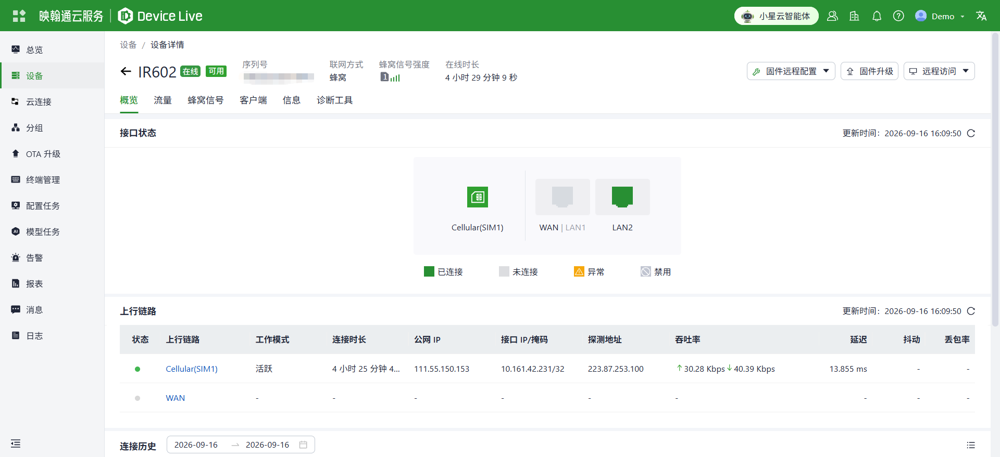

<strong>图 4-1 设备仪表盘</strong>

**流量使用情况**

在"设备>流量"界面中，可以查看各个上行端口流量使用的历史数据。

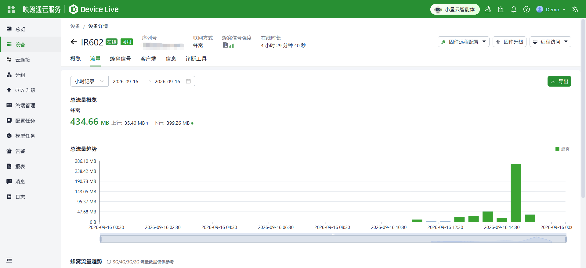

<strong>图 4-2 流量使用情况</strong>

**蜂窝信号**

在"设备>蜂窝信号"页面中，可以查看蜂窝信号各项参数的历史数据，包括信号强度、RSSI、RSRP、RSRQ以及SINR。

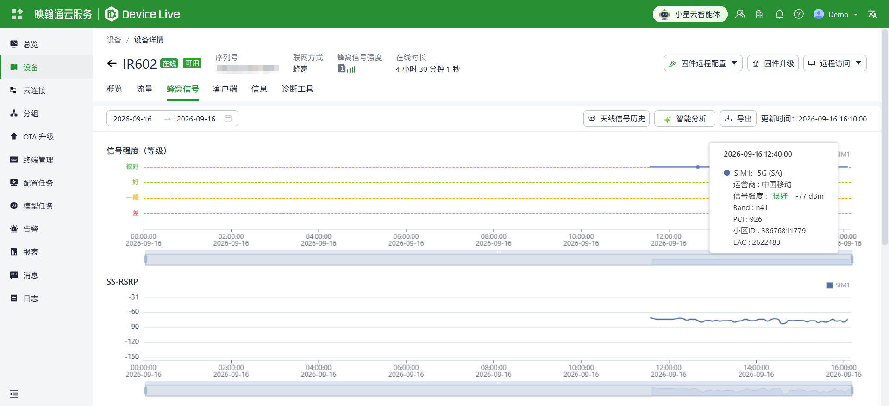

<strong>图 4-3 蜂窝信号历史</strong>

### 4.1.2 设备本地信息

通过DeviceLive的"远程访问"功能，可实时查看和配置设备。勾选目标设备，点击"远程访问"，将打开设备的本地登录界面。

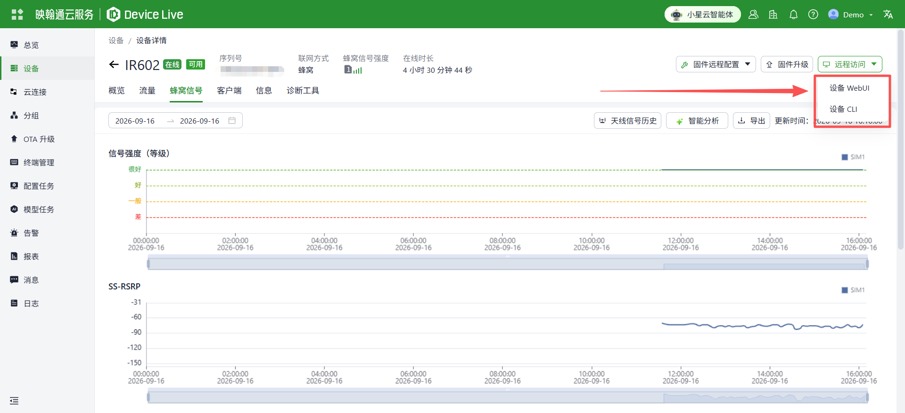

<strong>图 4-4 远程访问</strong>

**设备信息**

在【仪表盘】界面，可在顶部找到设备的基本信息，包括设备名称、设备型号、序列号、MAC地址、在线时长、上行接口地址等。

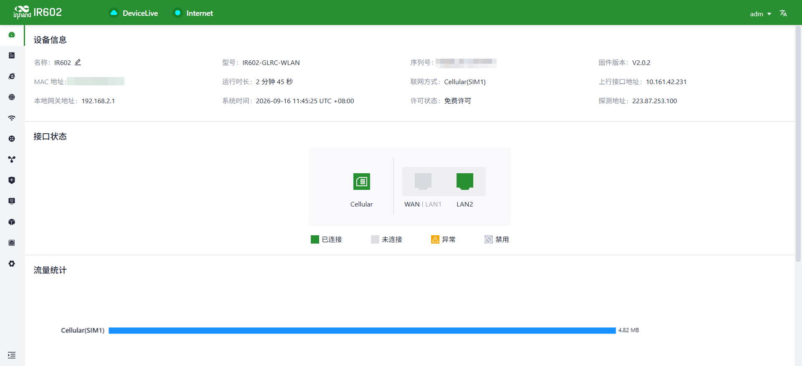

<strong>图 4-5 设备信息</strong>

| 参数 | 说明 |
|------|------|
| 名称 | 标识设备的名称，默认"IR602"，支持修改 |
| MAC地址 | 标识设备的物理MAC |
| 本地网关地址 | 设备默认子网的网关地址 |
| 型号 | 设备的具体型号，可帮助判断设备是否支持蜂窝或WLAN |
| 在线时长 | 设备上电后的运行时间 |
| 系统时间 | 显示设备所在时区以及系统时间 |
| 序列号 | 唯一标识设备的编码，可用于索引或将设备添加到平台账号 |
| 联网方式 | 设备联网时所使用的上行接口 |
| 许可状态 | 应用到设备的许可信息 |
| 固件版本 | 设备当前使用的软件版本号 |
| 上行接口地址 | 设备联网所用的上行接口的IP地址 |

**接口状态**

在"仪表盘>接口状态"功能中可以直观查看各接口的工作状态，点击"接口图标"，可以在界面右侧的弹出框查看各接口的详细信息。

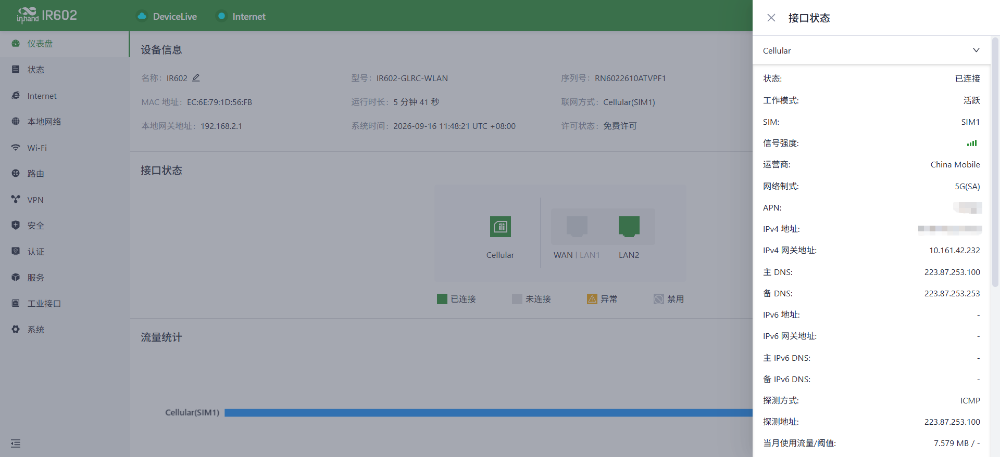

<strong>图 4-6 接口状态</strong>

**流量统计**

可通过"仪表盘>流量统计"功能查看路由器上电以来各上行接口流量的使用情况。流量统计的数据会在设备重启之后重置，如需查看历史流量记录，可在Device Live对应设备的详情页面进行查看。

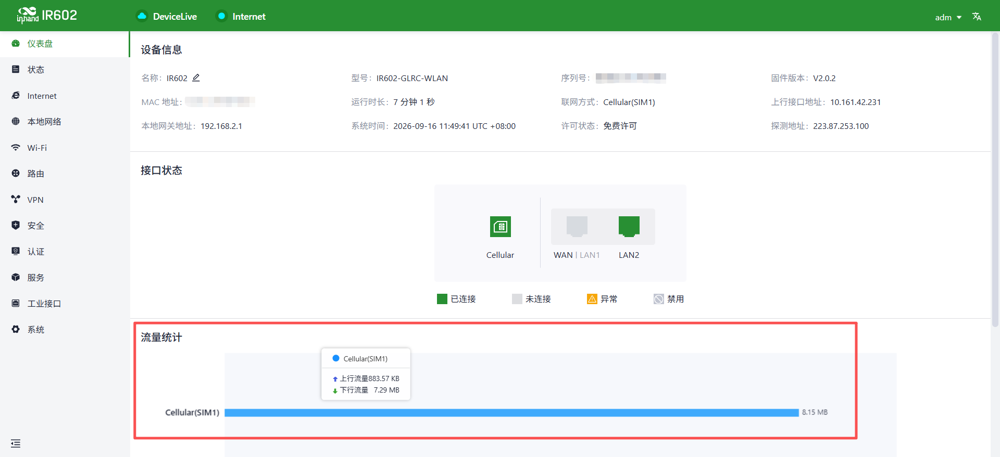

<strong>图 4-7 流量统计</strong>

**Wi-Fi连接数**

可在"仪表盘>Wi-Fi连接数"功能中查看IR624当前启用的SSID个数以及各SSID下连接的客户端数量。

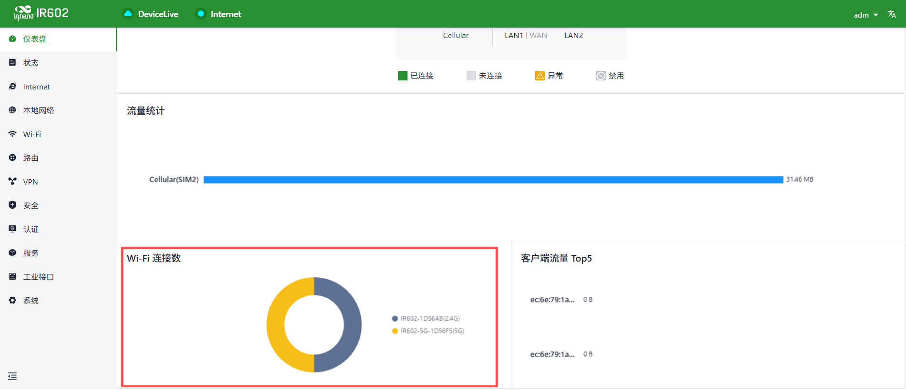

<strong>图 4-8 Wi-Fi连接数</strong>

**客户端流量Top5**

可在"仪表盘>客户端流量TOP5"功能查看当前接入路由器的客户端流量使用排名。最多显示5条记录，当客户端断开连接后，统计数据将被清除。

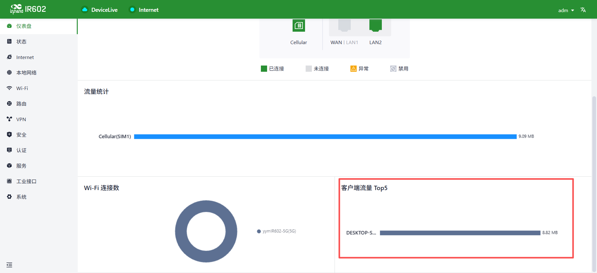

<strong>图 4-9 客户端流量Top5</strong>

**链路监控**

可通过"状态>链路监控"功能查看各上行链路的健康状态以及各接口的吞吐率、延迟、丢包、信号强度等信息。

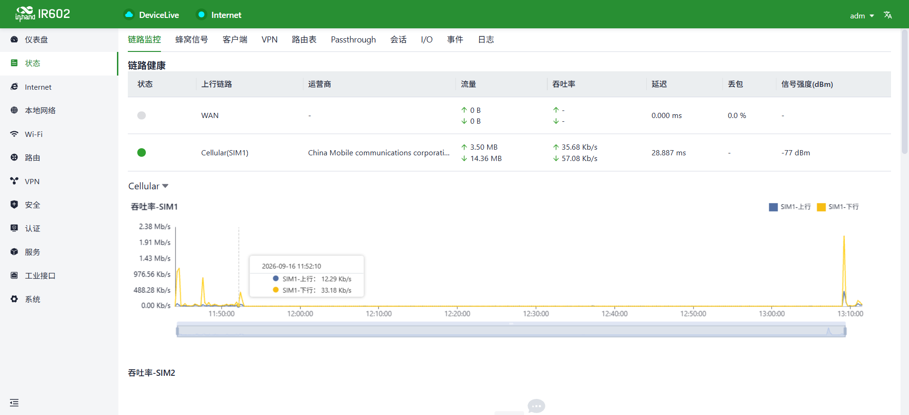

<strong>图 4-10 链路监控</strong>

**蜂窝信号**

可通过"状态>蜂窝信号"功能查看蜂窝接口下SIM卡信号强度以及RSSI、SINR、RSRP、RSRQ等参数。

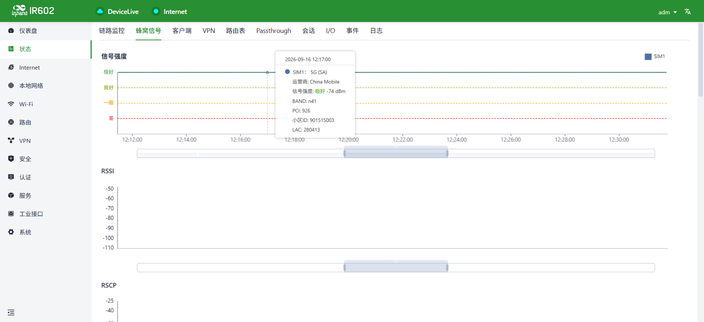

<strong>图 4-11 蜂窝信号详情</strong>

**客户端**

可通过"状态>客户端"功能查看连接到路由器的有线/无线客户端详细信息，如名称、地址、MAC地址、VLAN、连接的子网、流量使用、在线时长等信息。

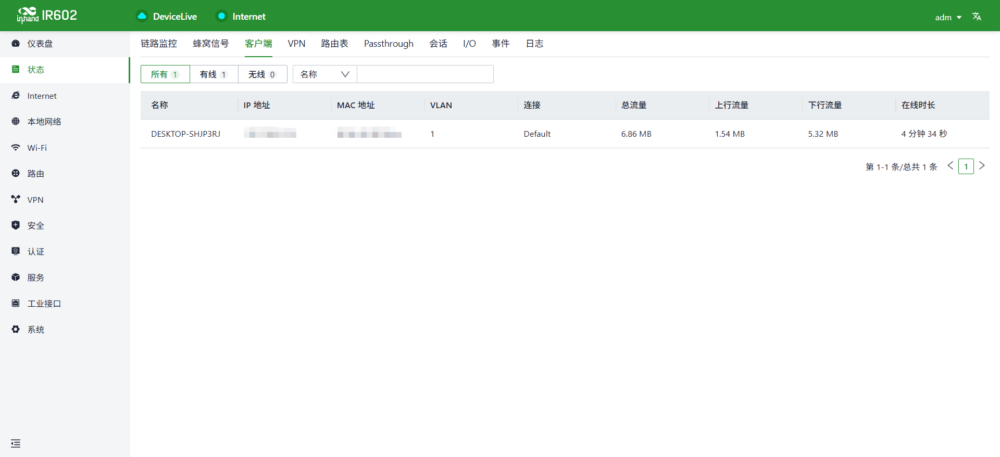

<strong>图 4-12 客户端列表</strong>

**VPN**

可通过"状态>VPN"功能查看IPSec VPN、L2TP VPN的状态名称、流量、最近一次连接时长等信息。

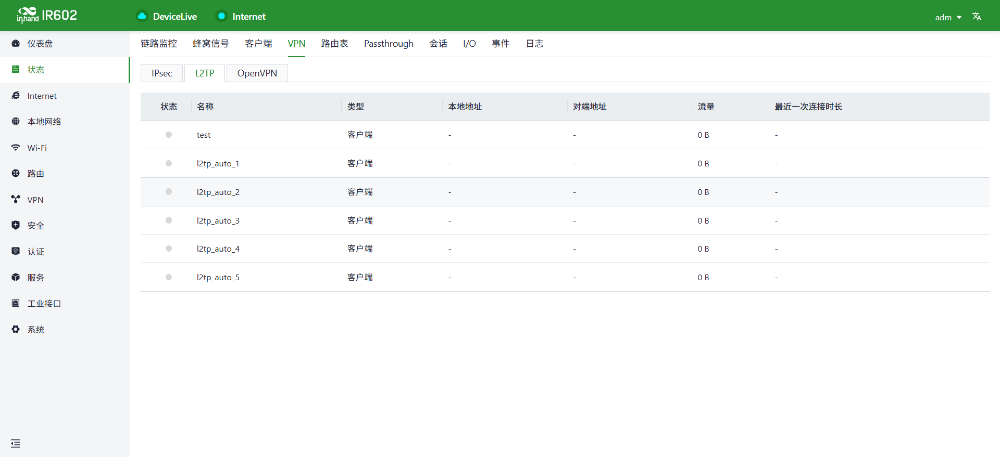

<strong>图 4-13 VPN状态</strong>

**路由表**

在"状态>路由表"中可查看路由状态，Connected代表路由是活跃的，Disconnected代表路由不活跃。

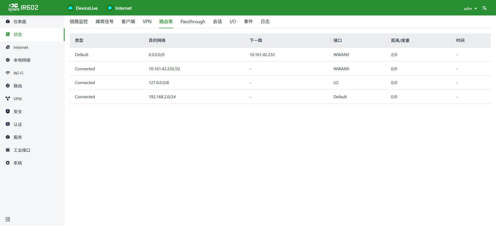

<strong>图 4-14 路由表</strong>

**Passthrough**

可通过Passthrough的配置状态判断IPPT是否正常工作。

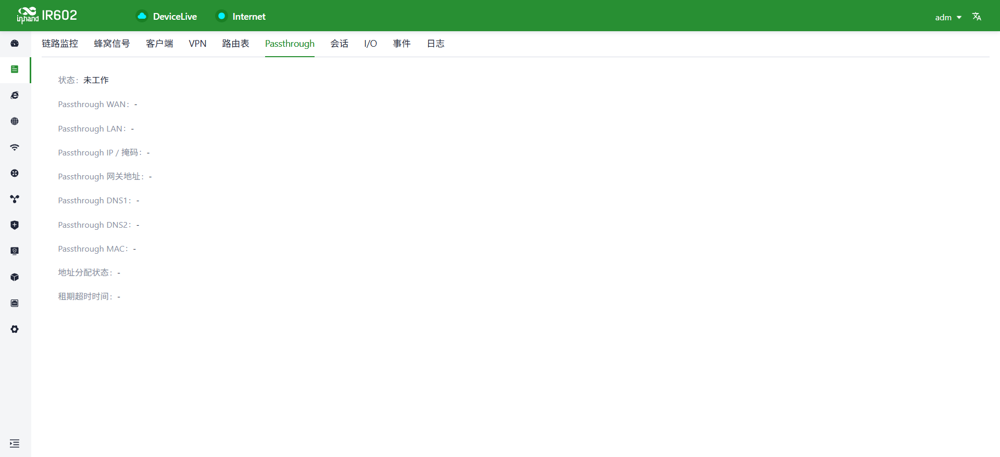

<strong>图 4-15 Passthrough状态信息</strong>

| 参数 | 说明 |
|------|------|
| 状态 | 显示Passthrough是否正常工作 |
| Passthrough WAN | 显示Passthrough工作的WAN接口 |
| Passthrough LAN | 显示Passthrough指定的物理接口获取透传IP地址 |
| Passthrough IP/掩码 | 显示Passthrough获取后的IP地址和掩码 |
| Passthrough 网关地址 | 显示Passthrough的网关地址 |
| Passthrough DNS1/2 | 显示Passthrough功能作地址解析的DNS |
| Passthrough MAC | 显示获取透传功能终端的MAC地址 |
| 地址分配状态 | 显示透传地址分配的状态 |
| 租期超时时间 | 显示Passthrough的DHCP租期时间 |

**会话**

技术人员可以通过TCP和UDP的会话信息辅助定位问题原因，也可以通过会话判断流量规则有没有匹配生效。

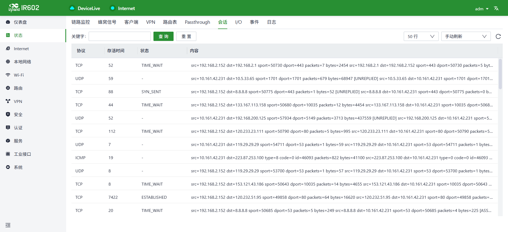

<strong>图 4-16 会话信息</strong>

**I/O**

可通过"状态>I/O"功能查看当前设备的I/O接口的工作情况。
| 参数 | 说明 |
|------|------|
| 接口 | 对应的物理IO1和IO2接口 |
| 模式 | IO工作模式：输入、输出 |
| 当前电平 | 当前IO接口电平的等级：高电平、低电平 |

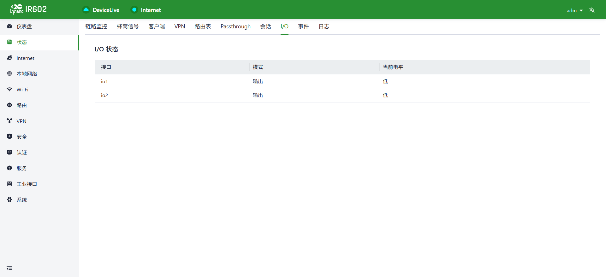

<strong>图 4-17 I/O状态</strong>

**事件**

可通过"状态>事件"功能查看设备运行的事件信息，帮助了解设备运行的状态。

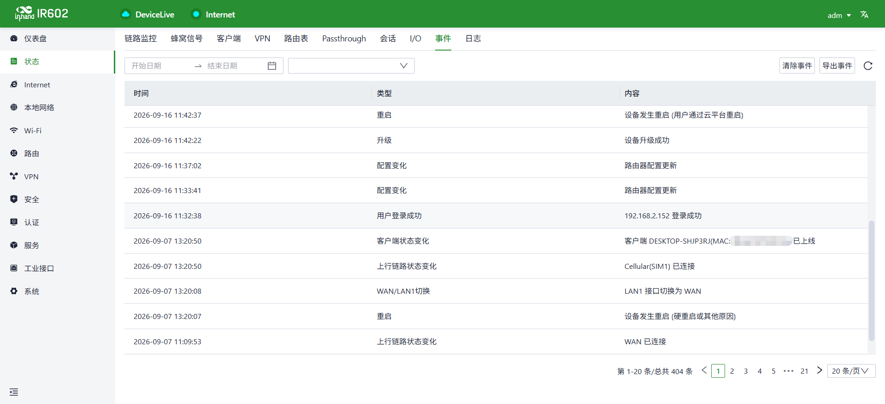

<strong>图 4-18 事件日志</strong>

当前支持事件类型：
- 用户登录成功/失败
- 配置变化
- CPU利用率过高
- 内存利用率过高
- VPN状态变化
- 上行链路状态变化
- 客户端状态变化
- 上行链路切换
- WAN/LAN1切换
- 重启
- 升级
- 探测状态变化
- 蜂窝流量到达阈值
- 运营商切换

**日志**

可通过"状态>日志"功能查看设备系统运行的日志信息，当设备出现故障时，技术人员可根据系统日志进行问题排查。

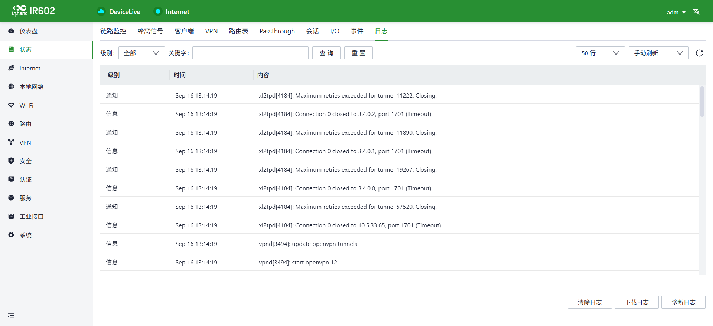

<strong>图 4-19 日志管理</strong>

支持对日志进行以下操作：

- 下载日志：下载设备的运行日志。
- 下载诊断日志：下载设备的诊断日志，包含系统运行日志、设备信息、设备配置等。
- 清除日志：清除设备的运行日志，不会清除设备的诊断日志。

## 4.2 Internet

可在"Internet"功能下配置每个上行接口的参数和操作模式。IR624支持有线、蜂窝、Wi-Fi三种接入网络模式。最多可以支持三个上行链路，包括 WAN、蜂窝和 Wi-Fi （STA）。WAN和Wi-Fi（STA）接口需要手动添加，并可根据需要删除；蜂窝上行链路不可删除。

### 4.2.1 有线连接

IR602支持三种有线连接方式接入网络：DHCP、静态 IP 和 PPPoE。可通过单击"编辑"按钮来修改连接方式。默认选中"DHCP"模式。

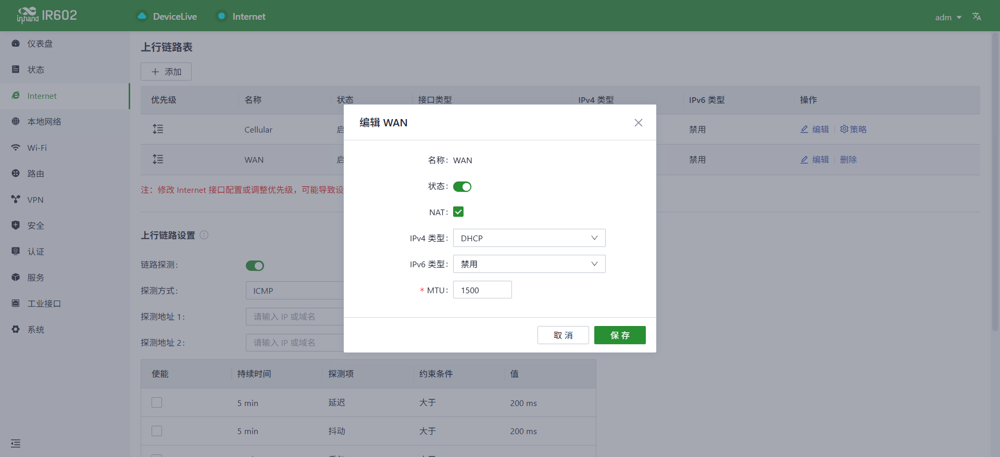

<strong>图 4-20 有线连接配置</strong>

- DHCP：设备WAN接口默认开启DHCP服务，用网线将WAN接口与互联网连接，即可自动联网。
- 静态IP：可手动配置从运营商获取或与上行设备相同网段的地址，配置完成后，路由器将通过指定的静态IP接入网络。

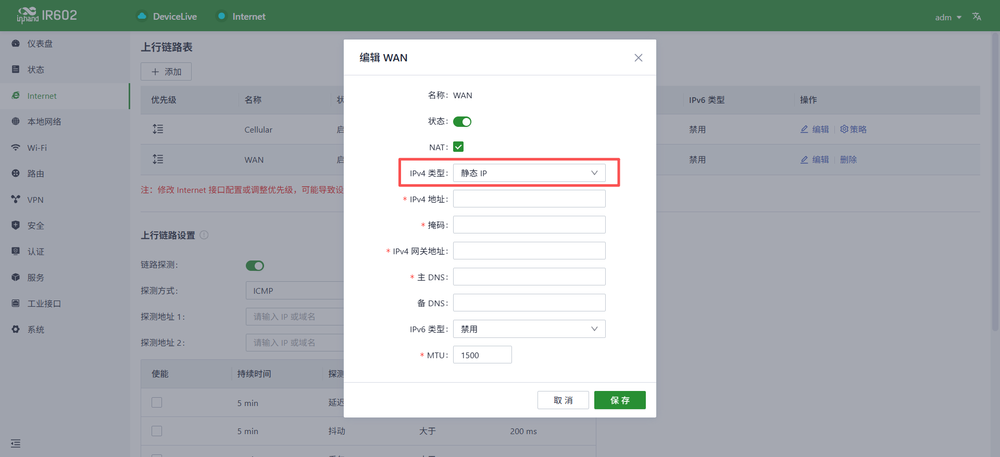

<strong>图 4-21 静态IP配置</strong>

- PPPoE：可配置宽带拨号，配置完成后，路由器将通过宽带拨号接入网络。

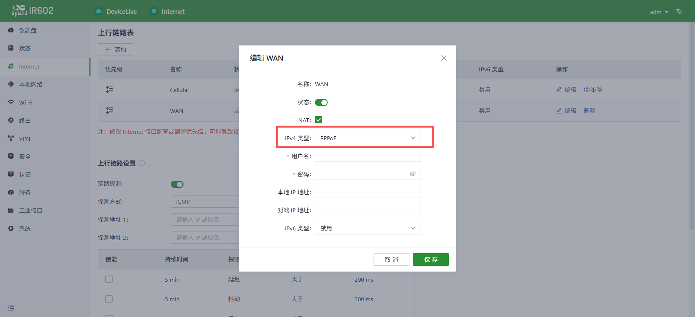

<strong>图 4-22 PPPoE配置</strong>

- 添加WAN接口后，原LAN1接口角色将切换成WAN。
- 删除WAN接口后，原WAN接口角色将会切换回LAN1。
- 删除WAN接口后，与WAN接口相关的静态路由、入站/出站规则、端口转发、策略路由、流量整形相关配置都将被删除。

### 4.2.2 无线连接

IR602支持作为客户端接入现场AP的网络，点击【Internet】菜单中"添加"按钮，选择"Wi-Fi(STA)"，填写SSID名称和密码等参数。

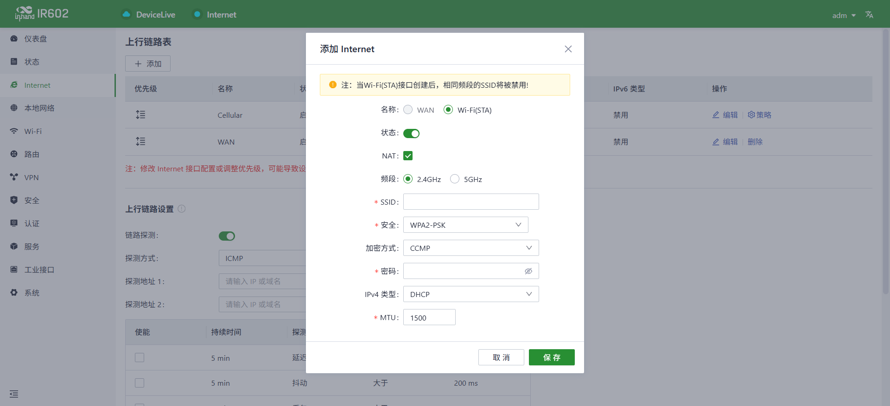

<strong>图 4-23 Wi-Fi STA添加</strong>

注意：

- Wi-Fi(STA)添加后，IR602在Wi-Fi功能中相同频段的SSID将被禁用且状态字段不可修改。
- Wi-Fi(STA)删除后，IR602在Wi-Fi功能中相同频段的SSID状态字段可以修改。
- Wi-Fi(STA)删除后，与Wi-Fi(STA)接口相关的静态路由、入站/出站规则、端口转发、策略路由、流量整形的配置都将被删除。

### 4.2.3 蜂窝连接

通常情况下，按照说明安装SIM卡和Wi-Fi天线后，IR602路由器将在上电后自动进行拨号并接入网络。当需要配置APN参数时，点击"编辑"按钮进入APN参数配置界面。

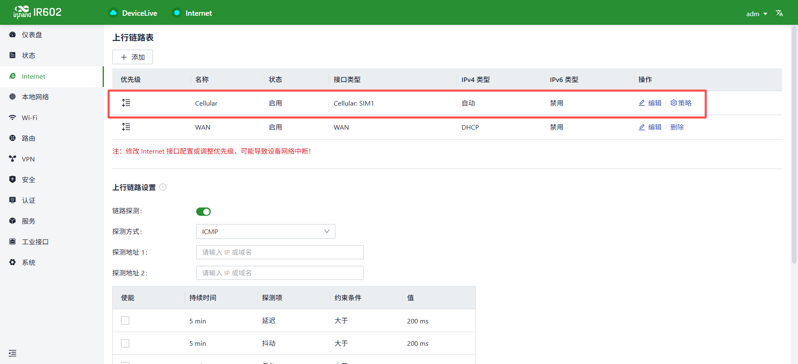

<strong>图 4-24 蜂窝</strong>

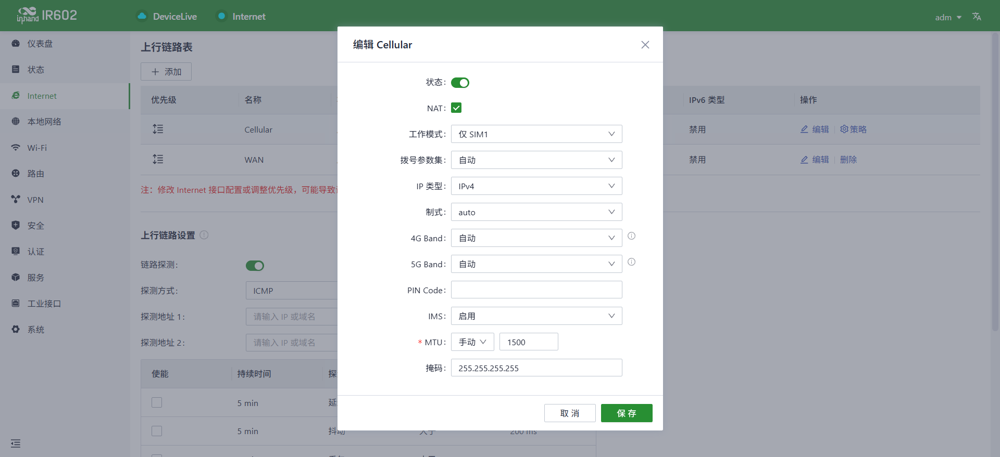

<strong>图 4-25 蜂窝APN配置详情</strong>

IR602在支持蜂窝上网的基础上，新增流量策略功能。策略启用后，SIM卡在流量到达阈值后执行对应动作，流量统计将在次月起始日重置。

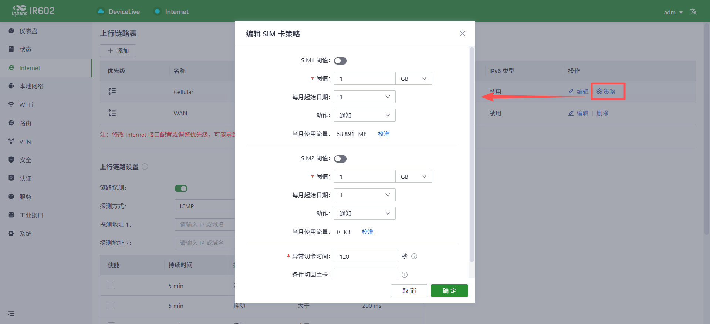

<strong>图 4-26 流量策略</strong>

- 动作：SIM卡流量到达阈值后触发的动作。
  - 通知：生成流量到达阈值的事件，但不会停止转发业务流量。
  - 仅保留云管理：生成流量到达阈值的事件，只转发云端管理流量，不转发访问Internet的业务流量。
  - 切换SIM：生成流量到达阈值的事件，并切换到另一张SIM卡拨号上网。

注意：

- 部分专网环境下，需要手动关闭【Internet】菜单下的"链路探测"功能，避免因探测不通导致蜂窝不能正常工作。
- 部分情况下，需要手动配置蜂窝接口的子网掩码，以保证ARP功能正常工作。
- 插拔SIM卡前，必须拔掉电源，以免造成数据丢失或设备损坏。

### 4.2.4 上行链路列表

可在"Internet >上行链路列表"中编辑Cellular接口，并添加/编辑/删除 WAN和Wi-Fi（STA）接口。还可通过拖动"优先级"图标来调整每个接口的优先级。接口根据其优先级从上到下排列，优先级较高的接口优先确定设备操作的当前上行接口。

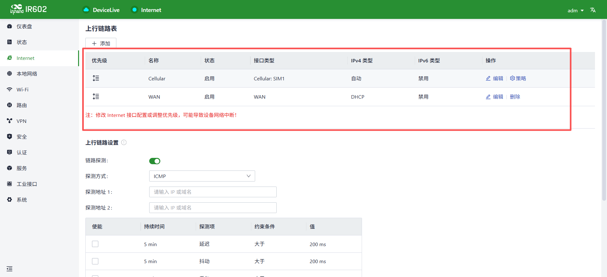

<strong>图 4-27 上行链路列表配置</strong>

### 4.2.5 上行链路设置

可通过"Internet>上行链路设置"功能配置链路检测设置，并配置不同上行接口之间的协作模式。

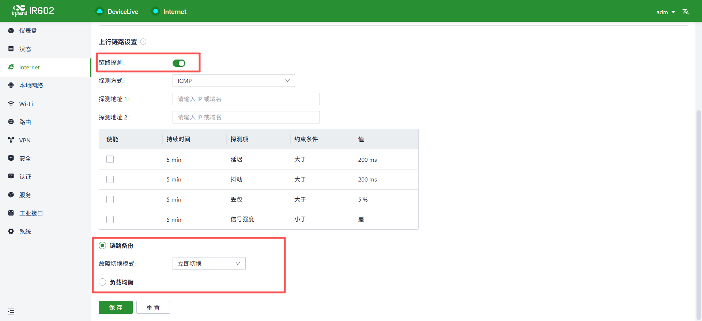

<strong>图 4-28 上行链路设置</strong>

- 链路探测开关：设备默认开启链路探测功能，在部分无法与外网通信的专网环境下使用设备时，需要手动关闭链路探测功能。当链路探测功能关闭后，用户无法在【状态】菜单下查看各上行接口的延迟、抖动、丢包、信号强度等信息。

- 对Internet菜单的修改可能导致设备联网中断，请谨慎操作！
- 当链路探测地址为空时，默认探测上行接口获取的DNS地址。填写探测地址后，所有上行接口只会探测用户填写的地址。
- 当路由器处于链路备份模式时，用户可自定义探测参数，设备将根据使能的探测项进行链路切换。未使能探测项时，上行链路切换仅根据优先级和链路连通性触发切换。
- 当设备处于负载均衡模式时，所有可以正常工作的上行链路都会转发业务流量。

## 4.3 本地网络

可在【本地网络】功能中自定义本地子网，包括配置本地局域网的地址段、VLAN ID、DHCP服务等参数。完成配置后，需进一步在【接口管理】中将这些配置应用到设备LAN口，或在Wi-Fi设置中将其应用到目标SSID。这一系列操作旨在确保客户端设备能够按照规划的网络地址顺利连接到本地网络。

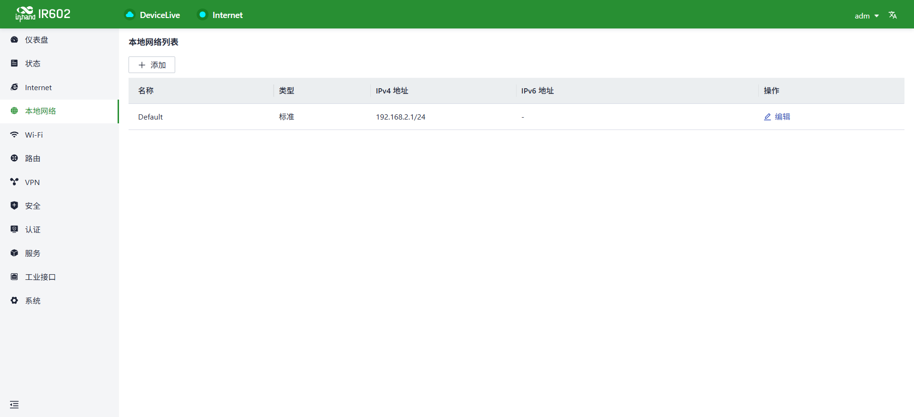

<strong>图 4-29 本地网络列表</strong>

点击"添加/编辑"按钮，添加新的本地网络或对已有本地网络进行编辑。

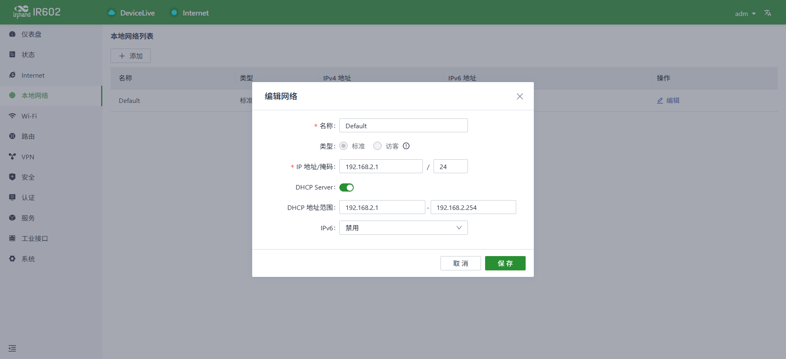

<strong>图 4-30 本地网络编辑</strong>

- 名称：用于标识网络，用户可通过此名称选择在"Wi-Fi"和"接口管理"中应用的网络。
- IP地址/掩码：通过LAN口或Wi-Fi访问路由器的网关地址，默认"192.168.2.1"。
- DHCP Server：接入路由器的客户端将通过此功能获取IP地址，默认"开启"，地址段将根据"IP地址/掩码"自动生成地址池范围。

- 默认的本地网络不可删除且仅支持修改IP地址/掩码和DHCP Server配置。
- 已添加的本地网络模式不支持修改。

## 4.4 Wi-Fi

Wi-Fi是一种广泛使用的无线通信技术，用于将计算机、智能手机、平板电脑和其它设备连接到互联网或局域网络。Wi-Fi技术允许设备通过无线信号在一定范围内传输数据，提供了无需物理连接即可访问网络的便利性。

### 4.4.1 SSIDs

IR602可以作为AP提供多SSID的无线网络接入功能，可自定义不同SSID用途和配置。

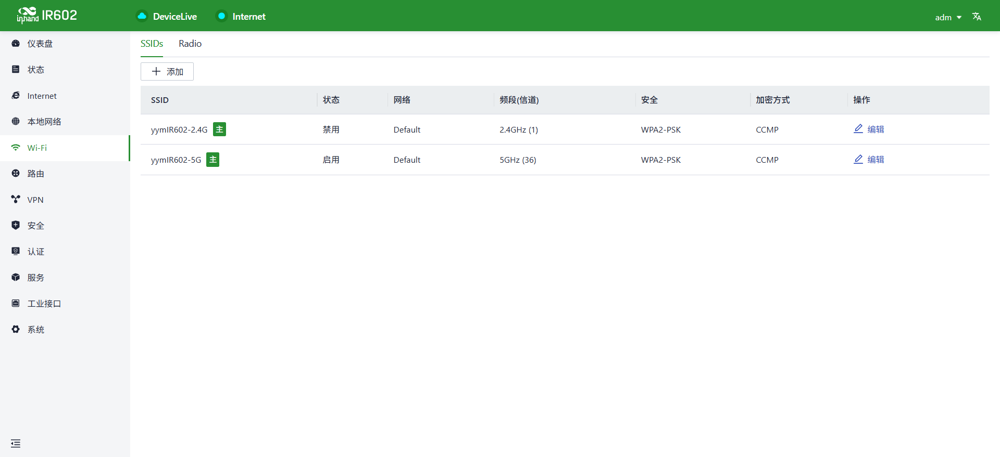

<strong>图 4-31 Wi-Fi列表</strong>

点击"Wi-Fi>Wi-Fi列表"下"添加/编辑"按钮，可添加新的SSID或对已有SSID进行编辑。

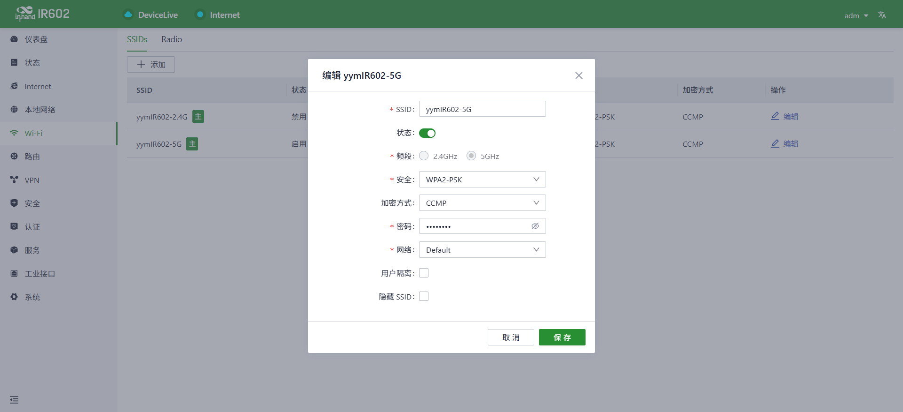

<strong>图 4-32 SSID编辑</strong>

注意：

- 设备默认有2.4G、5G两个主SSID，主SSID频段不支持修改且不可删除。
- 已添加的SSID频段不支持修改，信道将自动与所属主SSID的信道保持一致。
- 若用户在【Internet】菜单创建Wi-Fi(STA）接口，与Wi-Fi(STA）接口相同频段的SSID都无法启用直到Wi-Fi(STA）接口被删除。

### 4.4.2 Radio

进入"Radio"页面，可以配置2.4GHz和5GHz无线的射频参数。这些参数会直接影响Wi-Fi的覆盖范围、稳定性以及吞吐量。

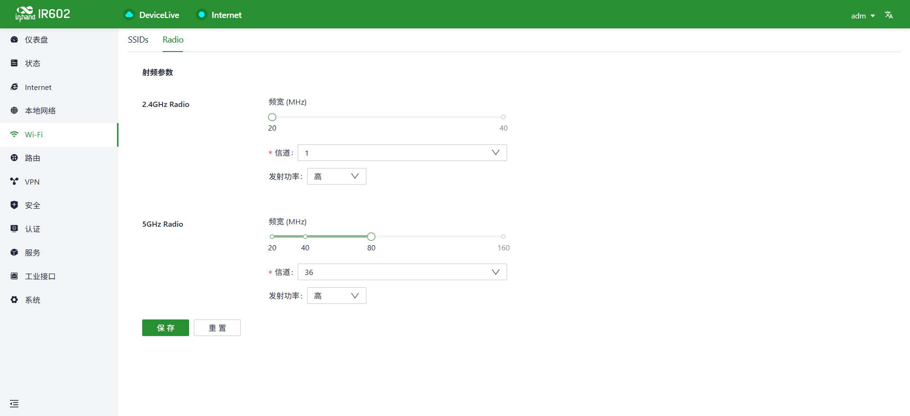

<strong>图 4-33 Radio配置</strong>

## 4.5 路由

### 4.5.1 静态路由

静态路由是由用户手动配置的固定路由规则，用于指定某个目标网络应该通过哪个下一跳网关进行转发。

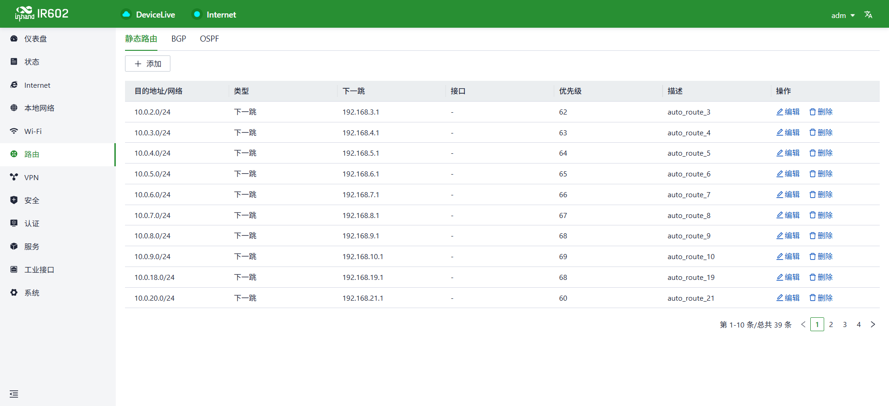

<strong>图 4-34 静态路由</strong>

### 4.5.2 BGP

BGP是一种路径向量路由协议，常用于不同自治系统（AS）之间传递可达路由信息。
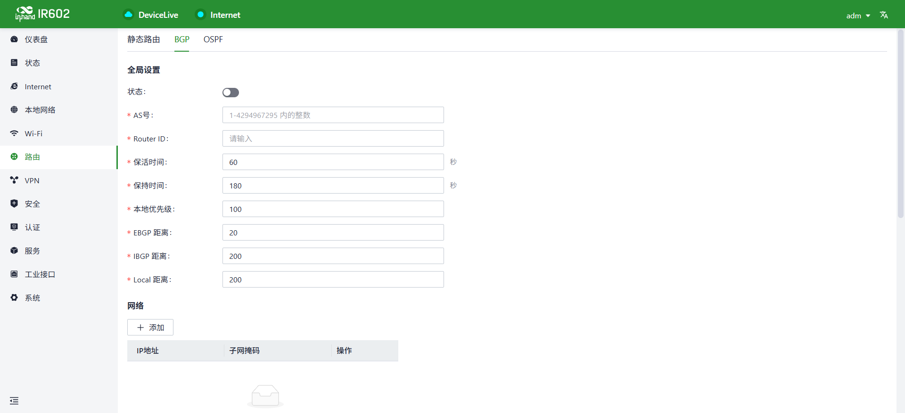

<strong>图 4-35 BGP</strong>

### 4.5.3 OSPF

OSPF是一种基于链路状态的动态路由协议，用于在大型或多网段环境中自动学习网络拓扑并计算最优路径。

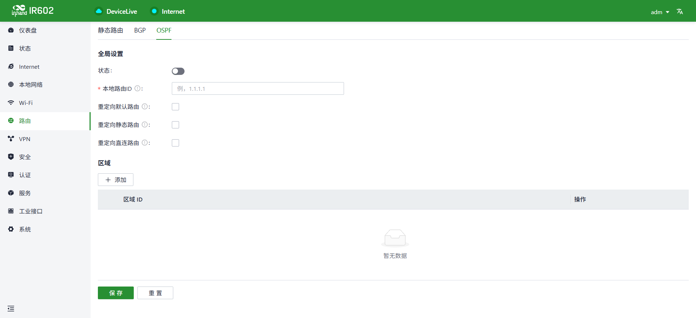

<strong>图 4-36 OSPF</strong>

## 4.6 VPN

虚拟专用网络（VPN）是一种加密技术，用于在公共互联网上创建安全的、私人的网络连接。VPN通过加密通信数据，确保通信的机密性和安全性，防止未经授权的访问。

### 4.6.1 IPSec VPN

IPSec（Internet Protocol Security）VPN 是一种用于加强网络通信安全性的协议套件，旨在通过加密和认证来保护数据的传输。广泛应用于建立安全的远程访问、站点到站点连接以及虚拟专用网络（VPN）。

点击"VPN>IPSec VPN"下的"添加"按钮，添加新的IPSec VPN。

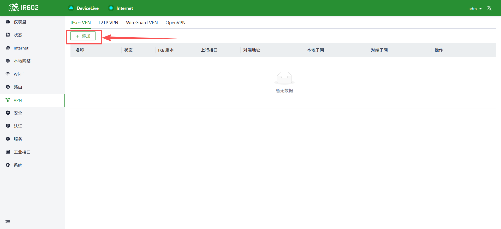

<strong>图 4-37 IPSec VPN添加</strong>

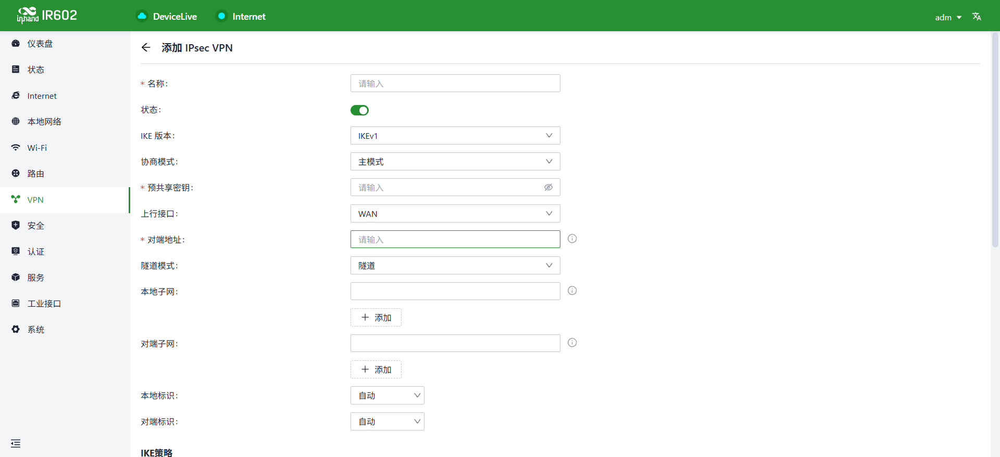

<strong>图 4-38 IPSec VPN配置</strong>

两端配置完成后，隧道即可建立。可在【状态>VPN】菜单中查看隧道建立状态。下方仅列出部分必填项的说明。

- 名称：路由器创建的IPSec VPN名称标识，主要用于本地管理。
- IKE版本：设置IKE协议使用的版本号，支持IKEv1和IKEv2。
- 预共享密钥：在IKE协商的两端设备需要配置相同的认证密钥。
- Internet接口：本地建立IPSec VPN使用的上行接口。
- 隧道模式：设置IPSec对IP报文的封装模式，支持隧道模式和传输模式。
- 对端地址：与IR624建立隧道的对端通信地址。

说明：

IR602在用IPSec VPN建立连接时，默认以使用公网地址的设备作为服务器，IPSec服务器侧的对端地址需要配置为 0.0.0.0，IPSec客户端侧的对端地址填写IPSec服务器侧的公网地址。

- 本地子网：填写需要通过IR602 IPSec VPN隧道通信的网段地址。
- 对端子网：填写隧道另一端需要通过IPSec VPN隧道通信的网段地址。
- IKE策略：支持设置IKE协议的配置。
  - 加密方式：设置IKE使用的加密算法。取值范围：DES、3DES、AES128、AES192、AES256，默认"AES128"。
  - 认证方式：设置IKE使用的认证算法。取值范围：MD5、SHA1、SHA2-256、SHA2-384、SHA2-512，默认"SHA1"。
  - DH组：设置IKE阶段密钥协商使用的DH交换参数。取值范围：1、2、5、14、15、16、19、20。
  - 超时时间：设置IKE SA存活时间，默认86400秒。
- IPSec 策略：支持设置IPSec参数配置。
  - 安全协议：设置ESP协议使用的安全协议。取值范围：DES、3DES、AES128、AES192、AES256，默认使用"AES128"。
  - 加密方式：设置ESP协议的加密算法。取值范围：MD5、SHA1、SHA2-256、SHA2-384、SHA2-512,默认"SHA1"。
  - PFS组：IPSec使用安全策略发起一个协商时，在阶段2的协商中进行一次附加的密钥交换以提高通讯的安全性参数。取值范围：1、2、5、14、15、16、19、20。
  - 超时时间：设置IPSec SA老化时间，默认86400秒。

### 4.6.2 L2TP VPN

二层隧道协议L2TP（Layer 2 Tunneling Protocol）是一种二层VPN协议，旨在提供安全的点对点或站点到站点的虚拟专用网络（VPN）连接。

**L2TP VPN客户端**

IR602可以作为L2TP客户端和位于远端的L2TP服务器建立隧道。点击"L2TP VPN>客户端"下的"添加"按钮，添加L2TP客户端。

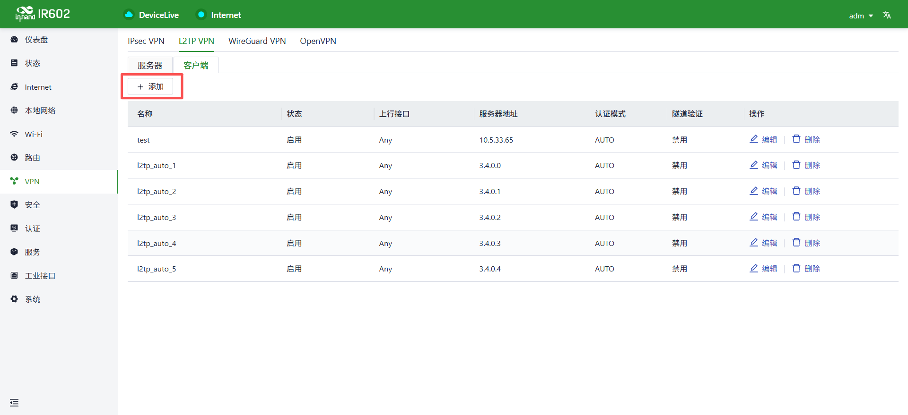

<strong>图 4-39 L2TP客户端添加</strong>

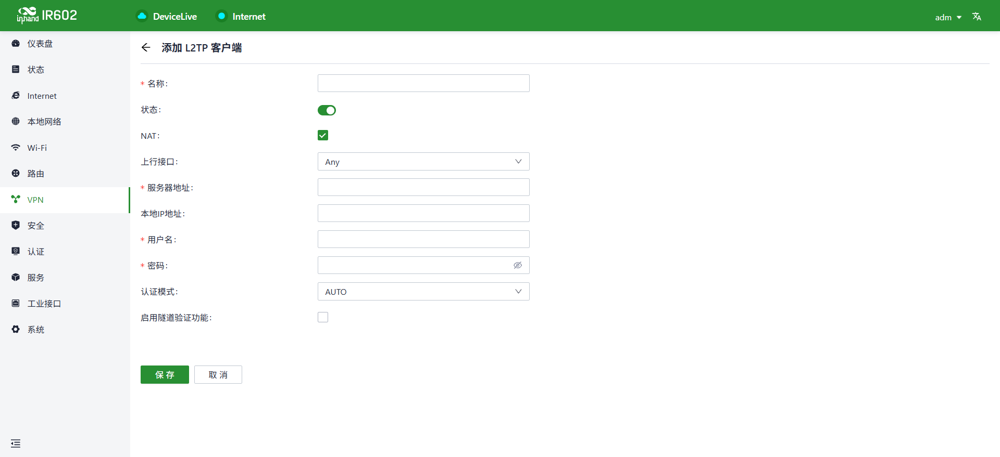

<strong>图 4-40 L2TP客户端配置</strong>

- 名称：L2TP客户端的名称，用于本地标识。
- 状态：L2TP 客户端隧道开启/禁用开关。
- NAT：L2TP 客户端转发时的NAT功能开关。
- 上行接口：L2TP客户端与服务器进行通信的上行接口。
- 服务器地址：对端L2TP服务器的通信地址。
- 用户名/密码：两端进行L2TP协商时需要配置相同的用户名/密码。
- 认证模式：设置L2TP认证模式。
- 启用隧道验证功能：启用验证功能后，两端用于隧道验证的用户名/密码需要配置相同。

**L2TP VPN服务器**

L2TP服务器一般部署于企业总部，为移动办公或分支机构提供远程访问服务。点击"VPN>L2TP VPN>服务器" 进入L2TP 服务器的编辑页面。

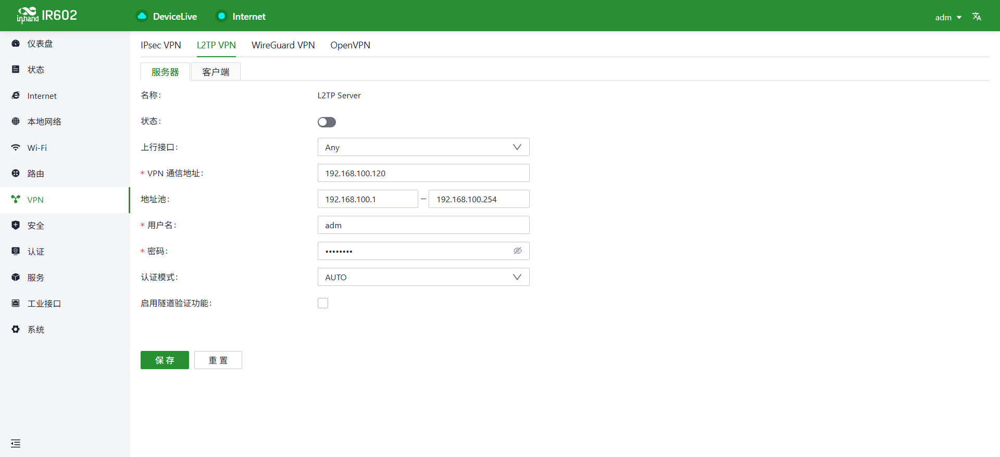

<strong>图 4-41 L2TP服务器配置</strong>

- 名称：L2TP 服务器名称，不支持修改。
- 状态：L2TP 服务器的功能开关，默认关闭。
- 上行接口：L2TP作为服务器时使用的上行接口。
- VPN通信地址：作为L2TP客户端的网关地址，可为L2TP客户端设备分配地址池内的地址。
- 地址池：L2TP客户端接入时用于通信的地址池。
- 用户名/密码：两端进行L2TP协商时需要配置相同的用户名/密码。
- 认证模式：设置L2TP认证模式。
- 启用隧道验证功能：启用后，两端用于隧道验证的用户名/密码需要配置相同。

## 4.7 安全

在【安全】菜单下，可根据需要设置防火墙、策略路由相关的高级功能。

### 4.7.1 防火墙

防火墙当前包括：入站规则、出站规则、端口转发、MAC地址过滤、域名过滤等功能，可根据具体的业务需求进行配置。

**入站/出站规则**

可通过"安全 > 防火墙 > 出站规则/入站规则"功能来实现基于接口的流量进出控制。例如，当受到来自特定源IP地址的大量攻击行为时，可以使用防火墙入站规则来限制来自该IP地址的流量。此外，还可通过防火墙出站规则来限制某些用户访问外部网络的权限。入站规则和出站规则在可配置的内容上相同，唯一的区别是默认规则。以下是添加入站规则的示例：

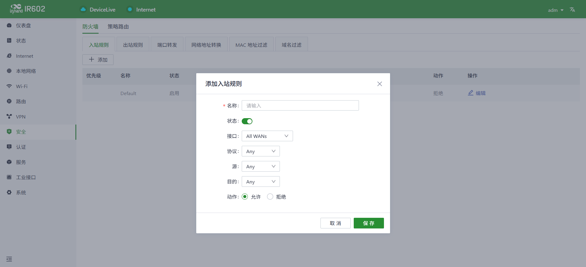

<strong>图 4-42 防火墙入站规则</strong>

- 名称：设置入站规则的名称，用于本地标识。
- 状态：规则的功能开关。
- 接口：对于出站规则，指流量流出路由器的上行接口。对于入站规则，指流量进入路由器的上行接口。
- 协议：匹配流量的协议类型，支持Any、TCP、UDP、ICMP、自定义。
- 源：匹配流量的源地址，支持自定义，默认Any。
- 目的：匹配流量的目的地址，支持自定义，默认Any。
- 动作：入站规则/出站规则的对匹配流量的动作，支持允许和拒绝。
- 入站规则：外部网络访问路由器的流量管理规则，默认拒绝所有。
- 出站规则：通过路由器访问外部的流量管理规则，默认全部放行。
- 支持通过拖动"优先级"一栏的图标调整入站规则/出站规则的优先级。

**端口转发**

端口转发也被称为端口映射或端口重定向，用于将网络数据包从一个网络端口（或地址）重定向到另一个网络端口或地址。可在"安全>防火墙>端口转发"配置端口转发规则，当外部流量访问路由器的特定端口时，设备会将数据转发至内部客户端的相应端口上，实现从外部访问路由器内部的服务。

**例如：** 当需要从外部访问内部192.168.2.10客户端的1024端口服务时，将此客户端的端口映射到WAN1接口下的1024端口，外部网络只需在浏览器输入 `https://WAN1地址:1024` 即可访问目标设备数据，其中WAN1地址为WAN1接口的IP地址。

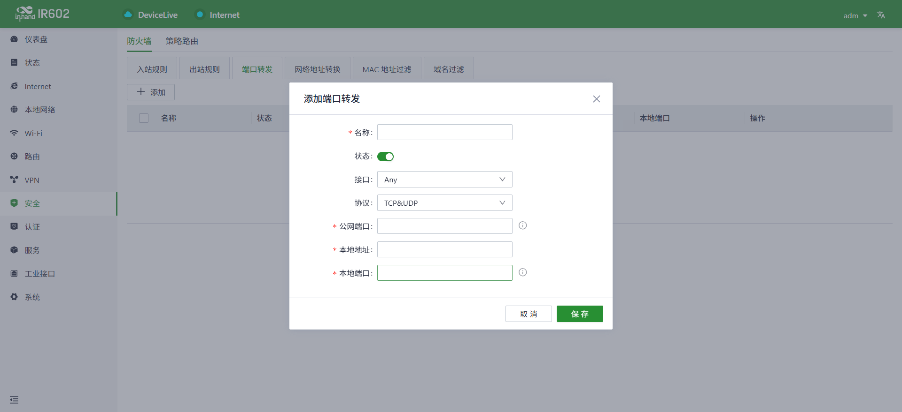

<strong>图 4-43 端口转发配置</strong>

- 名称：端口转发规则的名称，用于本地标识。
- 状态：端口转发规则的功能开关。
- 接口：对内部客户端提供映射功能的上行接口，上行接口需要公网地址支持。
- 协议：端口映射流量的协议类型，支持TCP、UDP、TCP&UDP。
- 公网端口：对内部客户端提供映射功能的上行接口的端口号，需要与本地端口输入范围保持一致。
- 本地地址：外部网络需要访问的位于路由器下的目标设备地址。
- 本地端口：外部网络需要访问的目标设备的端口，需要与公网端口输入范围保持一致。

**网络地址转换**

网络地址转换是一种将IP数据包在通过路由器时重新包内源IP地址或目的IP地址的技术，可以将私网IP地址转换为合法IP地址。可在"安全>防火墙>网络地址转换"中配置源IP地址转换或目的IP地址转换规则。

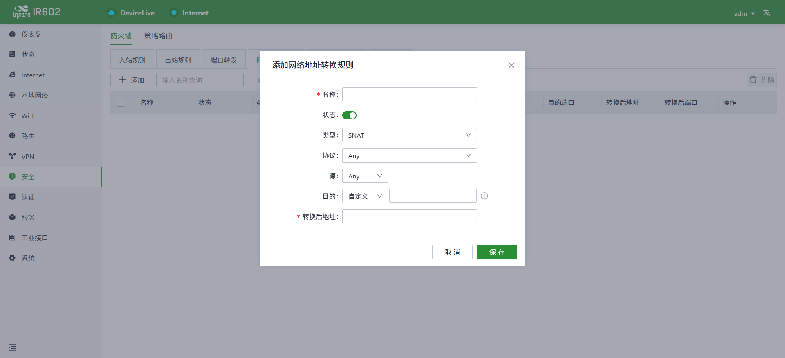

<strong>图 4-44 网络地址转换</strong>

- 名称：标识该地址转换规则。
- 状态：启用或停用该条规则。
- 类型：选择地址转换的类型。
  - SNAT：源IP地址转换，可将IP数据包中源IP地址字段的值转换为设定值。
  - DNAT：目的IP地址转换，可将IP数据包中目的IP地址字段的值转换为设定值。
- 协议：选择需要转换的IP数据包类型。
  - TCP：地址转换规则在TCP报文中生效。
  - UDP：地址转换规则在UDP报文中生效。
  - TCP&UDP：地址转换规则在TCP和UDP报文中生效。
- 源：数据包的源IP地址。
- 目的：数据包的目的IP地址。
- 转换后地址：根据所选择的地址转换类型，设置需要转换的值。

**MAC地址过滤**

MAC地址过滤是指禁止（或允许）MAC地址列表中的设备上网，即通过路由器上的MAC地址过滤功能控制局域网内设备的上网请求。可在"安全>防火墙>MAC地址过滤"中配置MAC地址过滤规则。

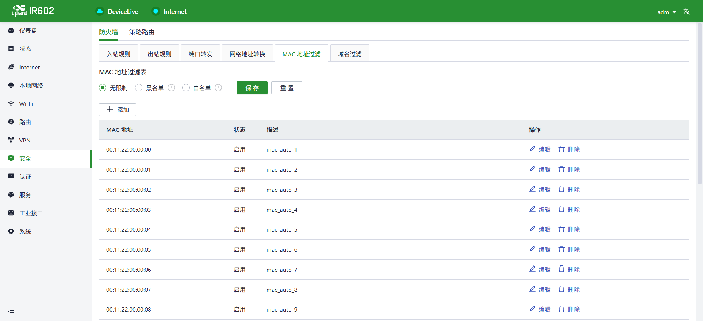

<strong>图 4-45 MAC地址过滤</strong>

可在列表中创建多个MAC地址，添加地址描述，并在列表中设置仅允许MAC地址访问网络（白名单），也可以禁止列表中的MAC地址访问网络（黑名单）。

**域名过滤**

域名过滤是指禁止（或允许）客户端访问列表中设置的域名。可在"安全>防火墙>域名过滤"中配置可以访问或禁止访问哪些域名。

可在域名过滤表中添加多条规则，并允许客户端访问这些域名（白名单），或禁止客户端访问这些域名（黑名单）。

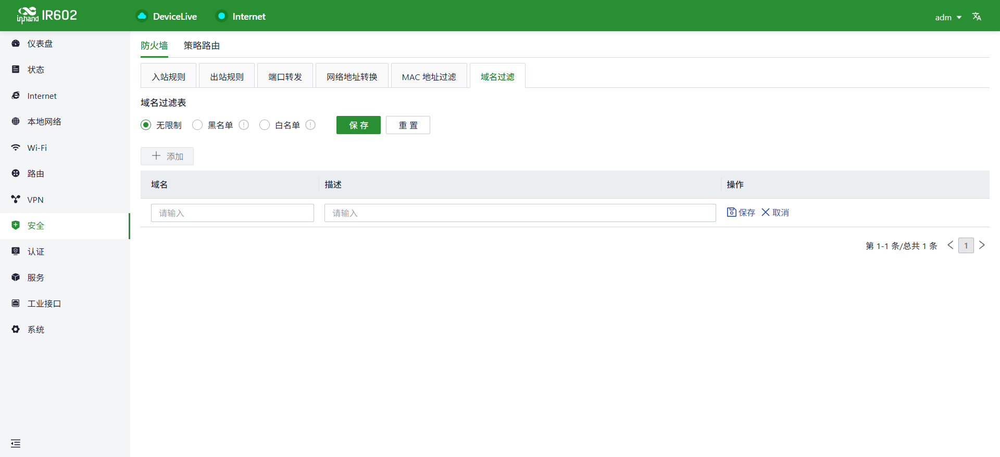

<strong>图 4-46 域名过滤</strong>

### 4.7.2 策略路由

策略路由是一种能够根据实际需求制定策略的功能，允许用户根据需要将不同的数据流通过不同的链路进行转发。这提高了路由选择的灵活性和可控性，同时提升了链路利用效率并降低了企业成本。点击"安全>策略路由"下的"添加"按钮添加新的策略路由规则。

注意，在配置时不能将源地址和目的地址同时设置为"Any"。

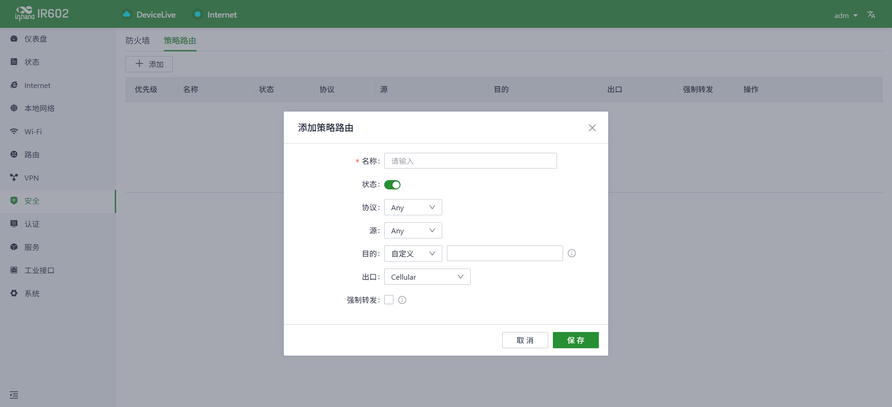

<strong>图 4-47 策略路由配置</strong>

## 4.8 认证

 目前，IR602支持配置Portal认证和802.1X认证。

### 4.8.1 Portal

IR602提供两类Portal认证：设备内部轻量级认证、外部Radius无线认证。

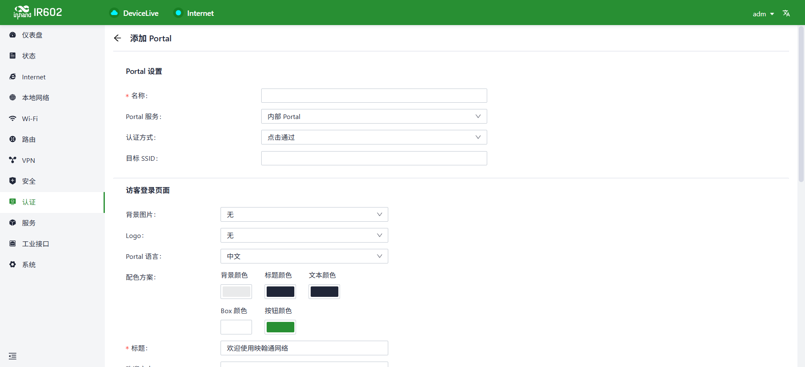

<strong>图 4-48 Portal认证配置</strong>

1.内部认证
用户可选择"点击通过、用户确认"两种本地认证方式，并支持指定SSID作认证以及自定义访问跳转页面的欢迎词、标题、Logo、背景图片等。
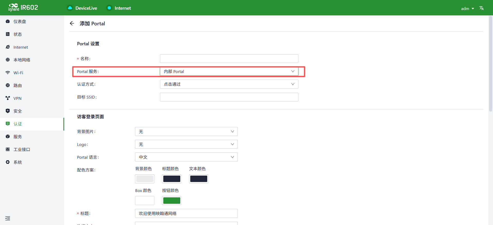

<strong>图 4-49 内部认证配置</strong>

2.radius认证
当部署了第三方RADIUS服务器时，无线终端可通过RADIUS认证方式接入网络。在【Wi-Fi→SSIDs】中选择WPA或WPA2，输入认证服务器的地址和端口密钥信息。
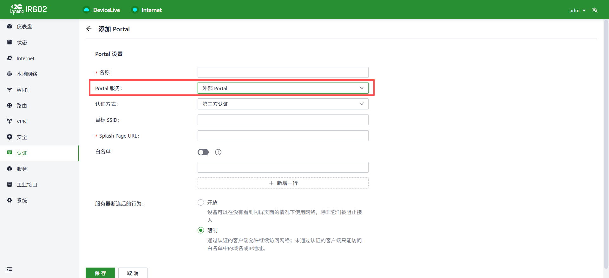

<strong>图 4-50 radius认证配置</strong>

### 4.8.2 802.1X

802.1X 是一种基于端口的网络访问控制协议，用于在局域网（LAN）或无线局域网（WLAN）中对接入设备进行身份验证。通过启用 802.1X，网络能够确保只有经过认证的设备或用户才能访问网络资源，提高网络安全性。 该功能通常应用于企业、校园或分支机构网络中，可结合 RADIUS 服务器进行集中认证和管理。

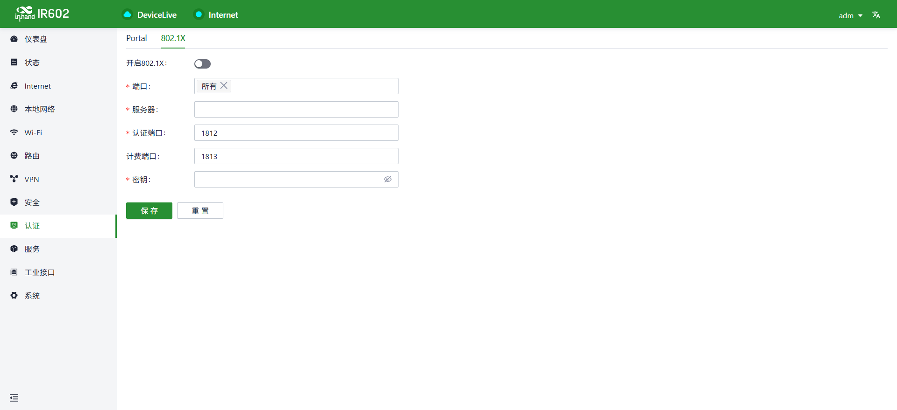

<strong>图 4-51 802.1X配置</strong>

- 802.1X 功能开关：用于启用或关闭 802.1X 功能。建议在需要控制网络访问的场景下保持开启，否则关闭。
 - 开启：启用 802.1X 认证功能，所有配置的认证端口将启用身份验证。
 - 关闭：关闭 802.1X 功能，端口不进行身份验证。
- 服务器：指定进行 802.1X 认证的 RADIUS 服务器IP或域名。
- 认证端口：用于启用 802.1X 身份验证的物理或逻辑端口。端口会在设备接入时触发认证请求，未通过认证的设备将被隔离。
- 计费端口：指定 802.1X 认证通过后计费或统计流量的端口。仅在启用计费功能的网络中使用。如果不涉及计费或流量统计，可留空或禁用。
- 密钥：用于 802.1X 与 RADIUS 服务器之间的安全通信。

## 4.9 服务

### 4.9.1 接口管理

可在"服务>接口管理"功能中设置允许通过某指定接口的本地网络以及对接口速率的设置。

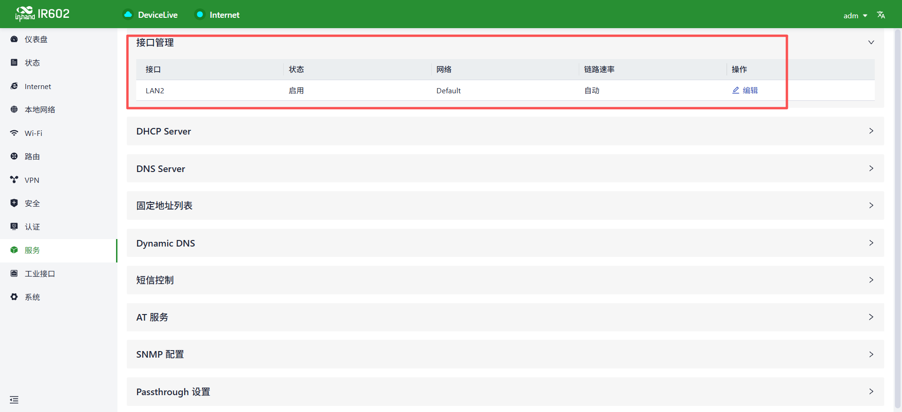

<strong>图 4-52 接口管理</strong>

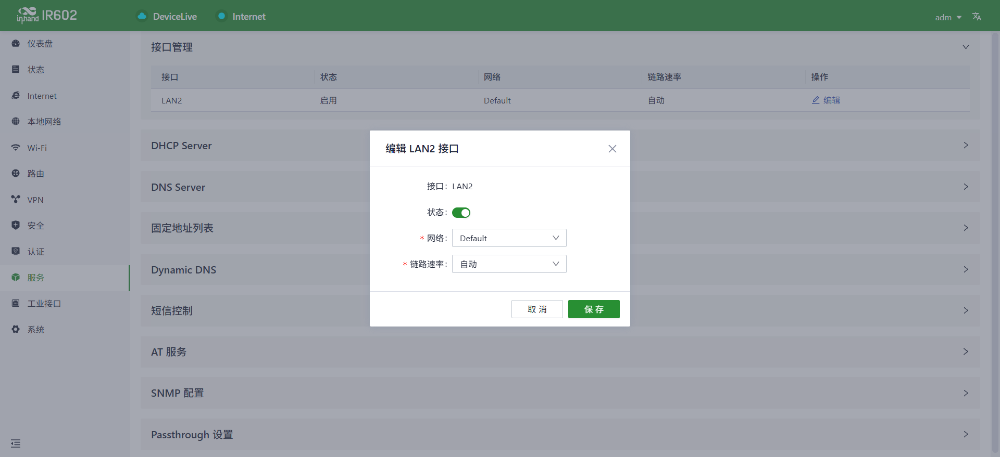

<strong>图 4-53 接口管理编辑</strong>

### 4.9.2 DHCP Server

DHCP服务采用客户端/服务器通信模式，由客户端向服务器提出地址请求，服务器响应请求并为客户端分配IP地址，以实现客户端IP地址的动态获取。

可通过"服务>DHCP Server"功能对DHCP Server地址池进行配置。

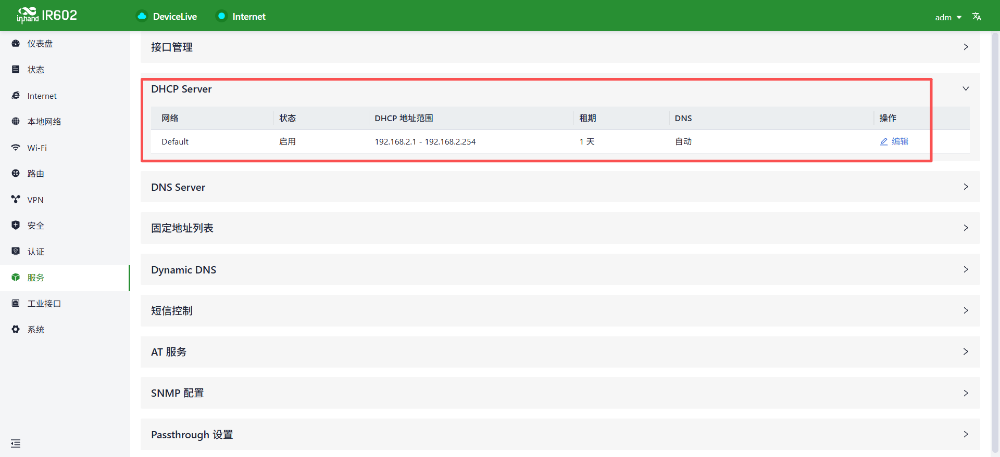

<strong>图 4-54 DHCP Server列表</strong>

说明：

- 设备的DHCP服务根据本地网络的网络信息生成，在"本地网络列表"中删除某个本地子网后，该本地子网的DHCP Server也将被删除。
- 本地网络条目需要处于IP模式，DHCP Server功能才生效，VLAN Only模式下的网络不在可选范围内。

### 4.9.3 DNS Server

DNS（Domain Name System）服务器是一种关键的网络组件，负责将人类可读的域名（如www.example.com）转换为计算机能理解的IP地址（如192.168.1.1）。DNS服务器充当了互联网上的地址簿，帮助计算机和设备找到其他设备的位置，并确保信息能够在网络上正确传递。

当在"服务>DNS Server"中没有设置DNS服务器地址时，使用设备上行接口获取到的DNS地址进行域名解析；当设置DNS服务器地址后，将使用配置的DNS地址进行域名解析。

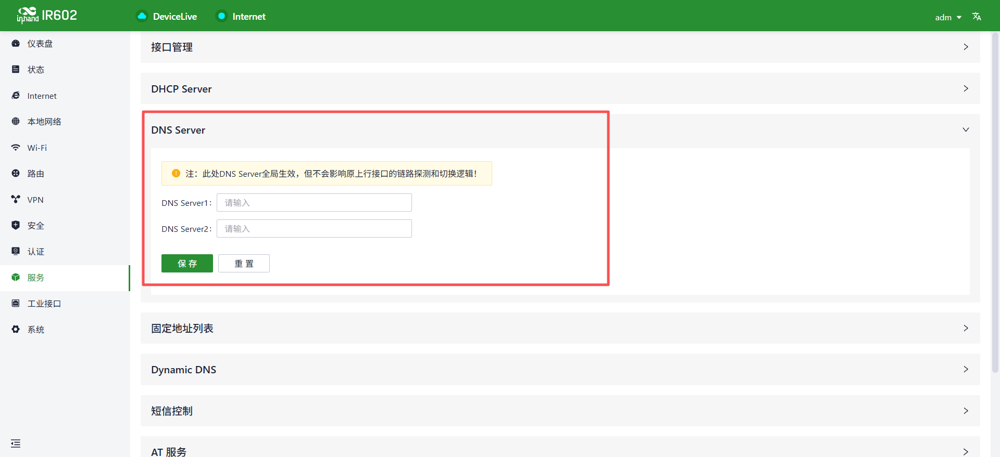

<strong>图 4-55 DNS Server配置</strong>

### 4.9.4 固定地址列表

可通过"服务>固定地址列表"功能实现根据接入设备的MAC地址为该设备分配固定的IP地址，该设备每次接入IR624时都会获取到相同的IP地址。

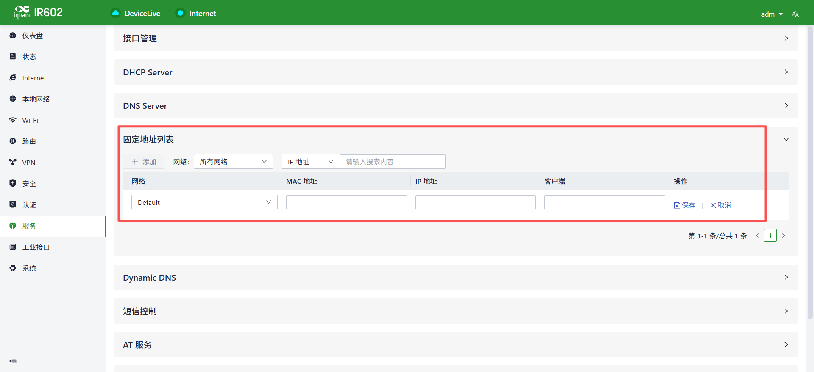

<strong>图 4-56 固定地址列表</strong>

说明：

- 可用于分配的地址必须在IP模式的本地网络的地址范围内，否则配置不生效。
- 当本地网络删除后，此本地网络地址范围内的固定地址分配规则都将被删除。

### 4.9.5 Dynamic DNS

动态DNS（Dynamic Domain Name System）用于自动更新域名系统中的名称服务器内容。根据互联网的域名规则，域名通常需要与固定的IP地址关联。动态DNS技术能够为动态IP地址的用户提供固定的名称服务器，这使得外部用户能够通过定期更新的方式连接到动态IP地址的用户的URL。

可在"服务> Dynamic DNS"功能下手动配置动态DNS服务器地址。

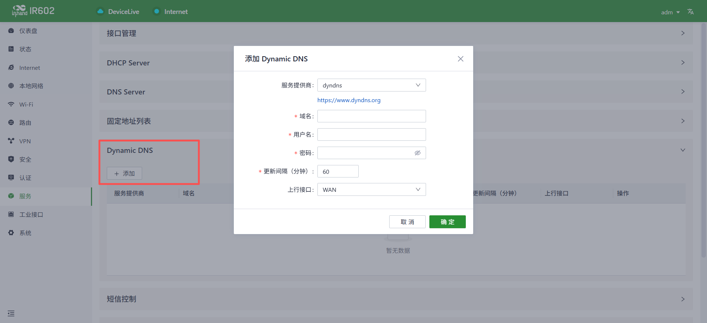

<strong>图 4-57 Dynamic DNS配置</strong>

- 服务提供商：由动态DNS运营商提供，可选择"dyndns"，"3322"，"oray"，"no-ip"或自定义（需要URL）。
- 主机名：单击服务提供商下方的 URL 进行注册以获取主机名。
- 用户名：单击服务提供商下方的 URL 进行注册以获取用户名。
- 密码：用户在注册时设置的密码。

### 4.9.6 短信控制

IR602 支持通过短信远程控制设备。用户可通过"服务 > 短信控制"菜单配置此功能。

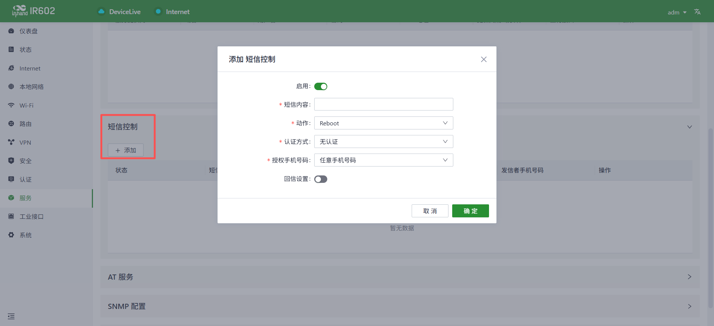

<strong>图 4-58 短信控制</strong>

### 4.9.7 AT服务
IR602支持通过AT命令与设备内置的蜂窝通信模块进行交互的功能，实现对模块的查询（如信号强度、网络状态）、配置（如网络模式、APN参数）和控制（如重启模块、拨号连接）等操作。
用户可通过"服务>AT服务"进入配置页面。
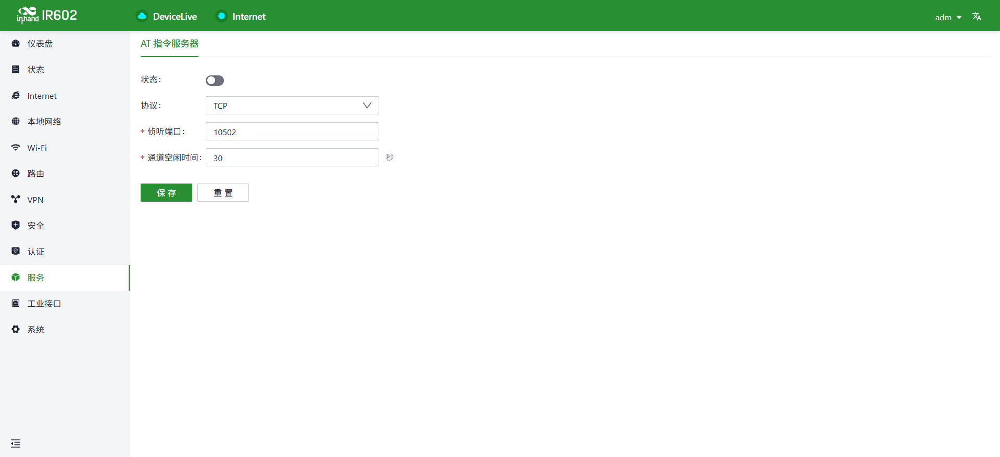

<strong>图 4-59 AT服务</strong>

### 4.9.8 SNMP配置

IR602支持SNMP协议，用户可通过点击"导出 MIB 文件"选项来导出 MIB 文件。

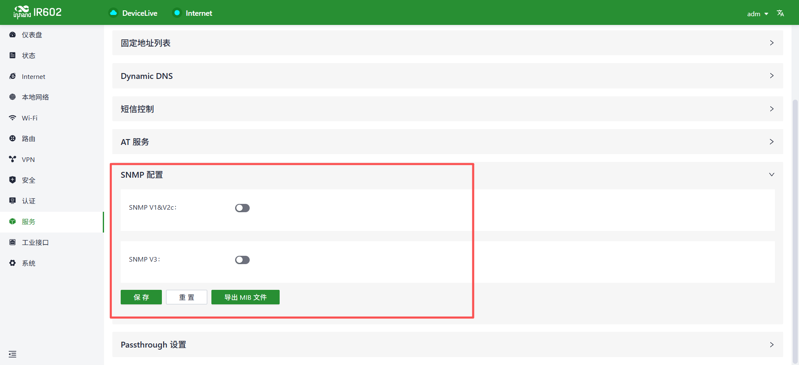

<strong>图 4-60 SNMP配置</strong>

### 4.9.9 Passthrough设置

IP Passthrough功能可将上行接口地址透传至客户端设备，访问客户端设备时需要放行入站规则。

| 参数 | 说明 |
|------|------|
| Passthrough开关 | 开启后，仅有一个客户端可以访问 Internet。以下功能将不工作：静态路由、VPN、策略路由、固定地址分配、云连接。 |
| 工作模式 | 可配置默认模式或灵活模式。 |
| Passthrough MAC | 终端的MAC，使指定MAC的终端才能透传上行接口的IP。 |
| Passthrough WAN | 选择指定的WAN口作为Passthrough透传的上行接口。 |
| Passthrough LAN | 选择指定的LAN口获取透传的IP。 |
| Passthrough IP掩码 | 支持配置IP Passthrough工作时的掩码地址。 |
| DHCP Server | 仅用于IP Passthrough的上行DHCP服务。 |
| 租期 | 有效时间。 |

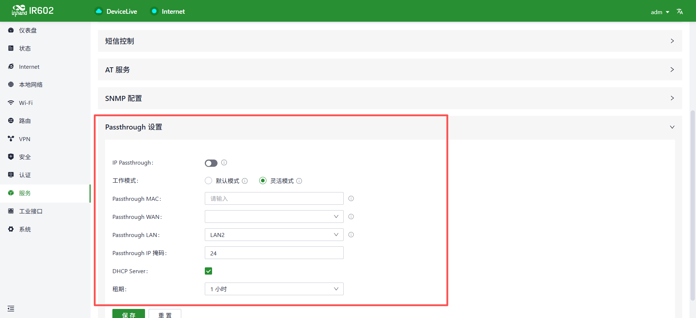

<strong>图 4-61 Passthrough设置</strong>

## 4.10 工业接口

IR602支持配置IO接口，设置IO1和IO2接口的工作模式。

| 参数 | 说明 |
|------|------|
| IO1模式 | IO1接口的工作模式，可设置输入/输出 |
| IO1默认电平 | 低电平/高电平 |
| IO2模式 | IO2接口的工作模式，可设置输入/输出 |
| IO2默认电平 | 低电平/高电平 |

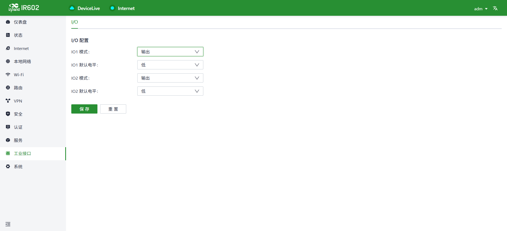

<strong>图 4-62 IO配置</strong>

## 4.11 系统

在【系统】菜单下，可以完成云管理、远程访问控制、时钟、设备选项、配置管理、设备告警、工具、日志服务器等功能的设置。

### 4.11.1 云管理

DeviceLive是映翰通专为解决工业场景面临的部署缓慢、运维复杂和业务体验不佳等问题而打造的云平台。该平台以用户需求为核心，融合了零接触部署、智能运维、安全防护以及卓越的业务体验功能。一旦设备连接到云平台，用户就能够通过该平台进行远程管理、批量配置、流量监控等操作，实现了更加便捷和高效的网络设备管理。

可在"系统>云管理"功能中选择云平台地址。IR602默认联网后自动接入DeviceLive平台，若不希望使用云管理功能，请手动关闭。

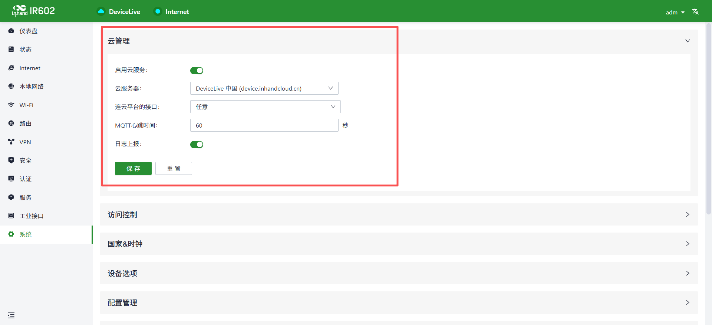

<strong>图 4-63 云管理配置</strong>

### 4.11.2 访问控制

可通过"系统>访问控制"功能设置是否允许通过Internet从外部访问路由器的Web配置界面，可设置服务端口。

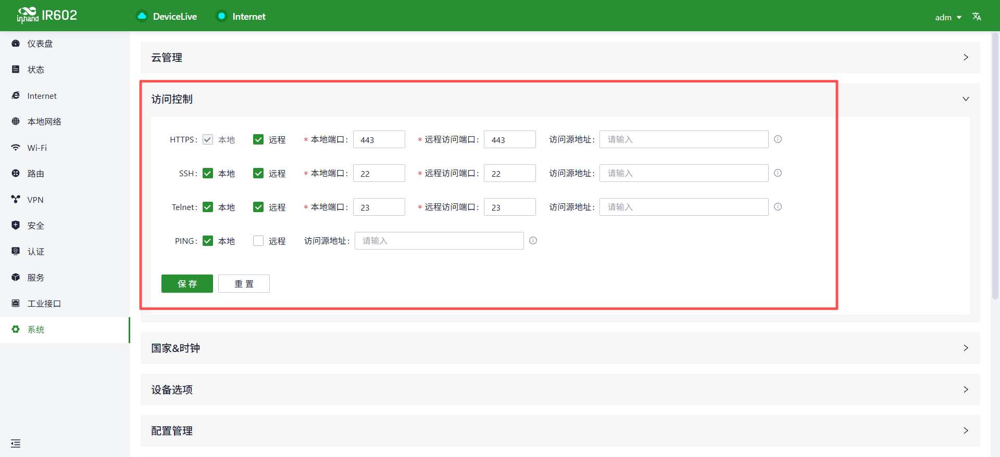

<strong>图 4-64 访问控制</strong>

- HTTPS：启用后，可以在浏览器输入上行接口的公网地址&端口，实现远程访问路由器的Web界面。
- SSH：启用后，可以在远程工具（如CRT），输入设备上行接口的公网地址&端口、用户名及密码，实现远程登录路由器后台。
- Telnet：启用后，用户可以在远程工具（如CRT），输入设备上行接口的公网地址&端口、用户名及密码，实现远程登录路由器后台。
- Ping：启用后，上行接口地址允许外部网络发起Ping请求。

### 4.11.3 国家&时钟

在网络功能中，国家&时钟功能是指用于协调和同步网络设备之间的时间的功能。网络中的时钟功能对于数据传输、日志记录、安全性、协调和故障排查非常重要。

可通过"系统>国家&时钟"功能选择当前所处的时区；配置NTP Server地址与目标NTP服务器同步设备系统时间。

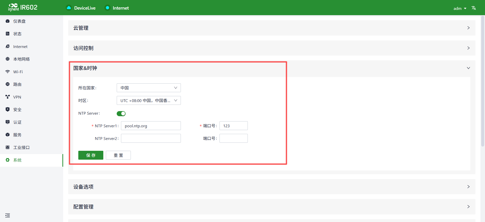

<strong>图 4-65 时钟配置</strong>

### 4.11.4 设备选项

可在"系统>设备选项"中对设备进行重启、升级固件、升级模组及恢复出厂设置等操作。

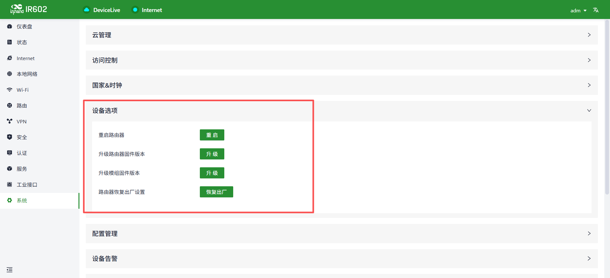

<strong>图 4-66 设备选项</strong>

注意：
- 本地升级固件或模组时请确保固件从正规渠道获取，避免因为导入错误固件导致设备不可用。
- 当设备接入云平台后，由于云端配置同步机制，平台会将恢复出厂前的配置再次推到设备上，设备仅清除历史数据。

### 4.11.5 配置管理

配置备份和备份恢复是网络管理和维护中关键的任务，涉及到保存网络设备的配置信息，以便在需要时能够快速还原或迁移配置。

可在"系统>配置管理"中导出设备配置存储在本地，当设备配置丢失或需要覆盖配置时将备份配置导入此设备。

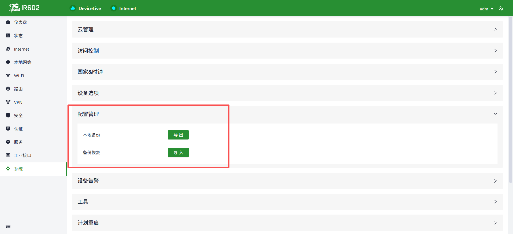

<strong>图 4-67 配置管理</strong>

### 4.11.6 设备告警

当希望特别关注设备上可能发生的某些事件时，可以勾选相应的告警事件并设置接收告警邮件的邮箱地址。一旦告警事件发生，设备会自动发送相应的邮件通知。未勾选的告警选项，相关的告警事件仍然会被记录在设备的本地日志中。

在"系统>设备告警"功能中设置告警事件类型以及告警邮件地址。

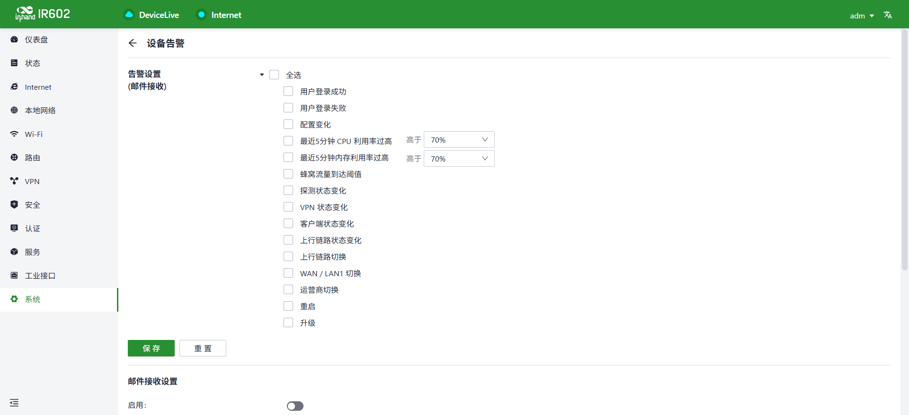

<strong>图 4-68 设备告警</strong>

配置发件邮箱的服务器地址、端口、用户名和密码后，设备将通过此邮箱发送告警邮件，可以通过发送测试邮件的选项检验发件邮箱的配置是否正确。

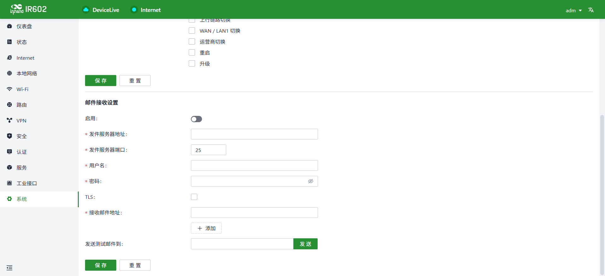

<strong>图 4-69 发件邮箱配置</strong>

### 4.11.7 工具

**Ping**

通过ICMP协议检测设备的网络连接情况。在"目标"中填入任意域名或IP地址，点击开始即可检验设备与该目标的连通情况。

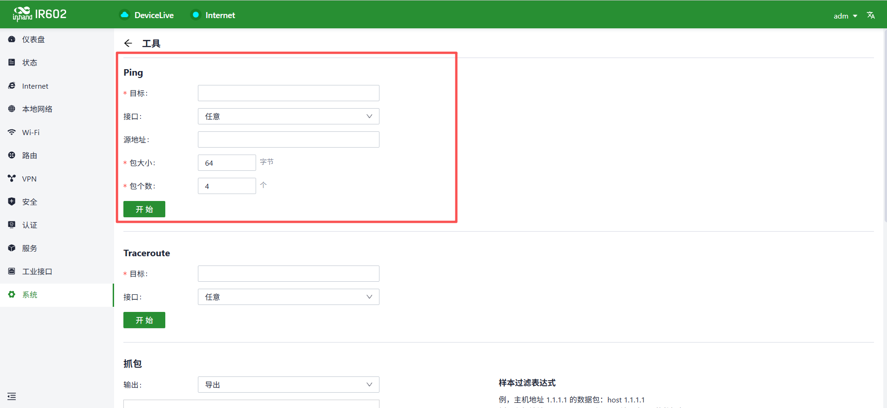

<strong>图 4-70 Ping工具</strong>

**Traceroute**

Traceroute（路由跟踪）是一种网络诊断工具，用于确定数据包从源到目的地之间经过的网络路径，以及在该路径上的每个中间路由器或跳数。

可在"系统>工具>Traceroute"中输入目标主机IP地址，选择流量的出接口，点击"开始"，检测设备到目标IP的路由连通情况。

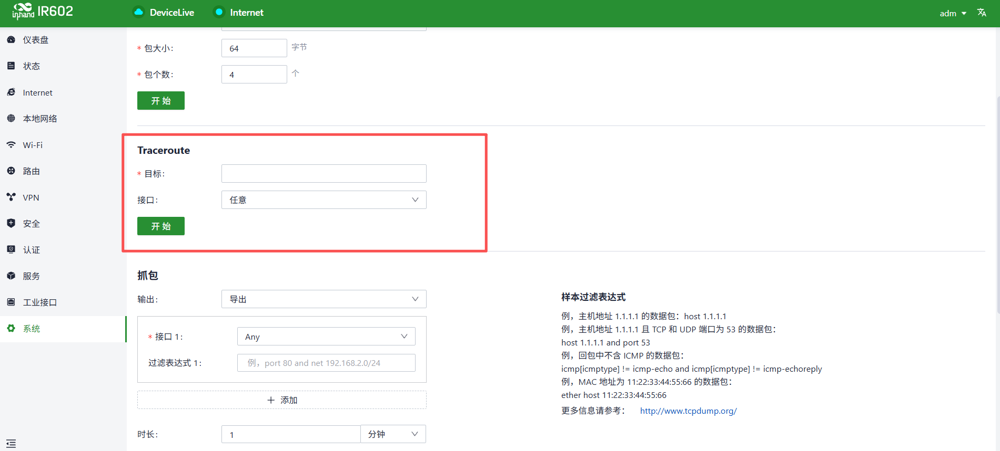

<strong>图 4-71 Traceroute工具</strong>

**抓包**

抓包是一种网络监测和分析技术，用于捕获和记录通过计算机网络传输的数据包。抓包工具通常用于网络故障排除、网络性能分析、安全审计和协议分析等用途。

可在"系统>工具>抓包"功能中抓取通过某一接口的数据包。选择"输出"选项，可以选择在界面中显示抓取到的数据或导出到本地。

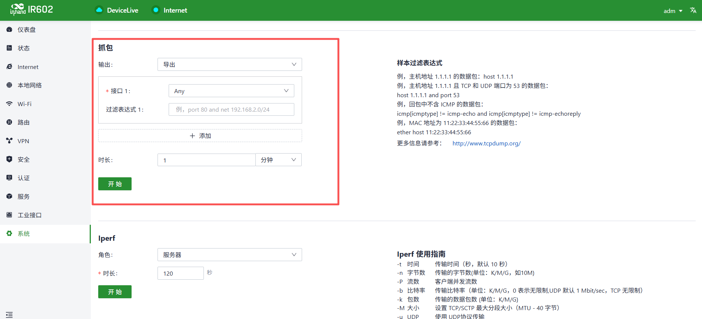

<strong>图 4-72 抓包工具</strong>

**Iperf**

Iperf常用于设备打流，测试网络带宽以及网络速率从而了解链路质量。

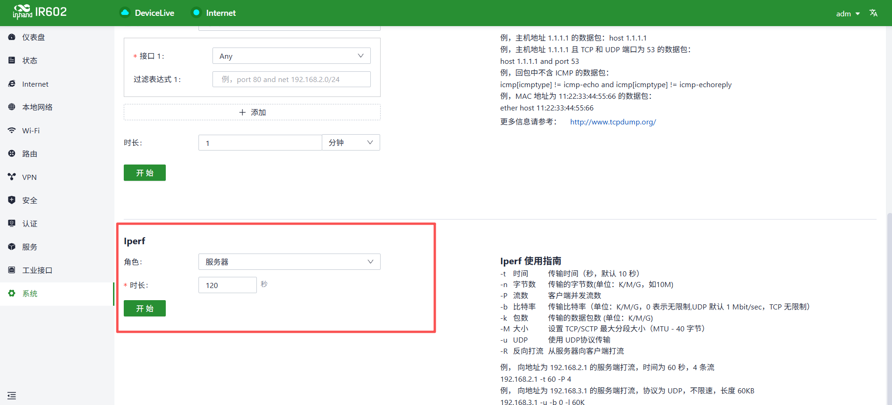

<strong>图 4-73 Iperf工具</strong>

### 4.11.8 计划重启

计划重启是一种网络设备管理的策略，允许管理员在特定时间或条件下自动重启设备，以确保设备的正常运行和性能。

可根据业务需求在"系统>计划重启"功能中设定设备定时重启的时刻，设备支持在每日、每周、每月固定时刻进行重启。

在每月重启中，当选择的重启日大于当月实际天数时，设备将在当月最后一天重启。例如，选中在每月31日重启，在只有30天的月份中会在当月30号进行重启。

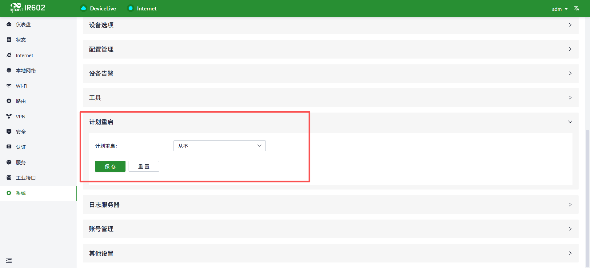

<strong>图 4-74 计划重启</strong>

### 4.11.9 日志服务器

日志服务器是一种专用服务器或软件应用程序，用于收集、存储和管理网络设备、应用程序和操作系统生成的日志信息。这些日志记录包括事件、警告、错误、活动和其他相关信息，对于监视、故障排除和性能优化非常重要。

在"系统>日志服务器"功能中启用日志文件服务器功能后，设备会定期将日志文件上传到指定的日志服务器服务器。

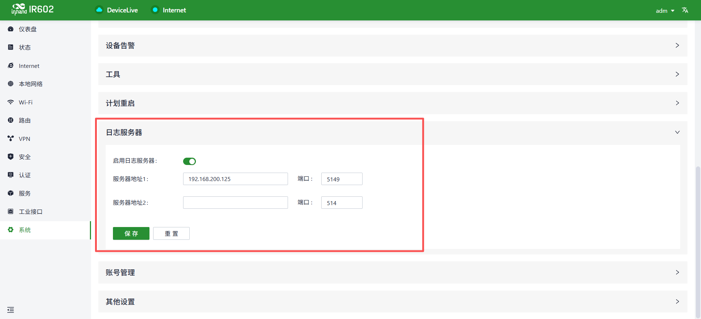

<strong>图 4-75 日志服务器配置</strong>

### 4.11.10 账号管理

在"服务>账号管理"中，设置登录设备Web页面的用户名和密码，需妥善保管密码，避免泄露。

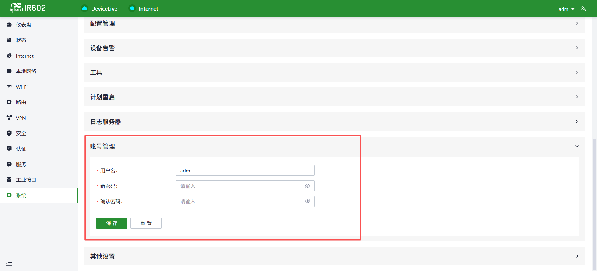

<strong>图 4-76 账号管理</strong>

### 4.11.11 其他设置

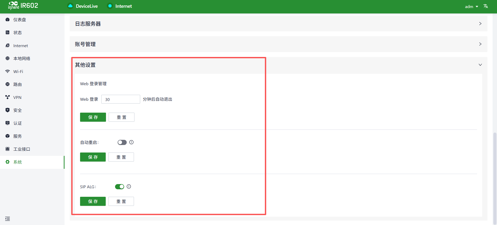

<strong>图 4-77 其他设置</strong>

**Web登录管理**

当Web登录到设备本地界面超过一定时间后，将自动登出或断开连接，以保护隐私和安全。

可在"系统 > 其他设置 > Web登录管理"中设置登出时间。一旦单次登录设备Web页面的在线时间超过设定的时间，系统会自动退出登录状态，需要重新登录以继续操作。

**自动重启**

工业路由器专门设计自动重启的机制，帮助解决现场需要人工重启以恢复网络连接的情况。在"系统>其他设置>自动重启"中开启此功能后，当设备无法联网且重试一小时后仍无法接入网络时，设备将会自动重启。

**SIP ALG**
SIP ALG（Session Initiation Protocol Application Layer Gateway）是一项用于管理通过 NAT（网络地址转换）的 VoIP（基于 IP 的语音通信）呼叫的网络功能。它能够对 SIP 信令和 RTP 媒体流进行正确的地址转换和转发，从而确保 VoIP 呼叫能够在路由器环境下正常建立并保持通信连接。

# 附录 安全注意事项

1. 请使用原装电源适配器，避免因电源适配器和设备不匹配造成设备损坏。
2. 安装设备时请勿将设备安装在强电磁干扰环境下，避免与高功率设备过于接近。安装完成后请确认设备是否易发生晃动，避免因设备跌落造成设备损坏。
3. 请确认设备使用环境满足规格书所要求的温度和湿度。
4. 请定期检查设备线缆，包括网线，电源适配器连接线，保持线材清洁，如有发生破损请及时更换。
5. 清洁设备时，避免使用化学试剂直接喷洒在设备表面，避免损害外壳或内部组件。需要使用柔性的布料清洁产品。
6. 请勿私自拆修或改装设备，这将会导致安全问题并且设备会失去保修资格。