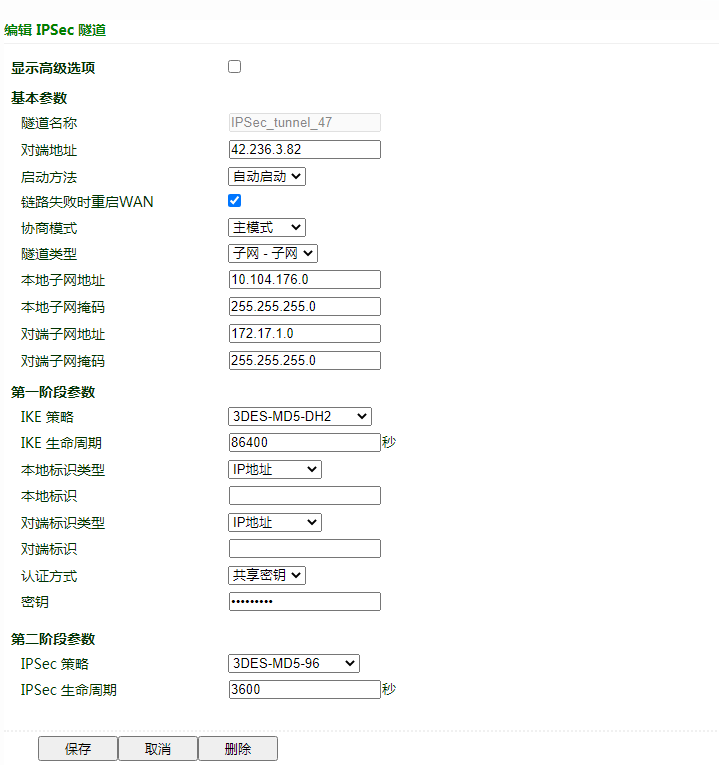
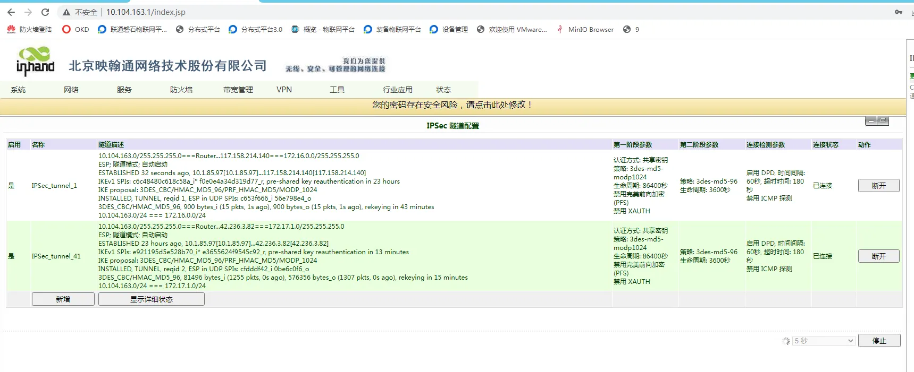

# IR615 ipsec VPN配置指导手册

## 一、文档信息

- 文档名称：VPN配置手册
- 产品型号：**IR615**
- 固件版本：**V1.0.95**
- 适用场景：设备联网、远程维护、IPSEC VPN应用
- 编写日期：2026年03月25日

## 二、网关概述

### 2.1 产品简介

映翰通IR615系列是一款面向工业物联网场景的4G工业无线路由器，主打“稳定、易用、安全”三大核心特性。它主要用于解决工业现场设备（如PLC、传感器、自助终端等）的联网问题，适用于充电桩、自助售货机、智能快递柜、广告媒体等分布式无人值守场景。

### 2.2 主要功能

- 4G上网
- VPN隧道加密
- 远程配置、远程诊断、远程升级
- 宽温工业级设计

### 2.3 典型应用拓扑

设备 → 以太网 → VPN客户端→ 4G / 以太网 → VPN服务端→云平台

## 三、硬件说明

### 3.1 外观与接口

- 电源接口：DC 9–36V
- 网口：LAN ×4路+1WAN
- 无线：4G
- 指示灯：PWR、RUN、COM、NET、信号强度
- 复位键：恢复出厂设置

### 3.2 接线说明

#### 3.2.1 电源接线

- 正极：V+
- 负极：V-
- 注意：防反接、防雷、接地

#### 3.2.2 以太网接线

直连 / 交叉自适应，建议超五类及以上网线。

## 四、出厂默认参数

- 默认 IP：10.164.176.1
- 子网掩码：255.255.255.0
- Web 用户名：**adm**
- Web 密码：123456

## 五、前期准备

- 电脑设置与网关同网段 IP
- 网线连接电脑与网关 LAN 口
- 路由器上电，等待 RUN 灯常亮
- 浏览器输入设备 IP 进入配置页面

## 六、网络配置

### 6.1 LAN 口配置（静态 / DHCP）

- 进入【网络设置】→【WAN】
- 选择静态 IP / DHCP
- 设置 IP、子网掩码、网关、DNS
- 保存并应用

### 6.2 4G 无线网络配置

- 插入 4G SIM 卡
- 开启移动网络
- APN：自动
- 信号强度查看

## 七、VPN隧道配置

**共享密钥：**HWzhsw123

## 八、配置备份与恢复

- 导出配置文件
- 恢复出厂配置

## 九、状态监控与诊断

### 9.1 运行状态

- 设备在线状态
- 网络流量、信号强度

### 9.2 日志查看

- 系统日志

## 十、常见问题与排查

- 无法打开 Web
  - 检查网段、网线、IP 是否冲突
  - 复位网关重试
- 设备在线但无数据
  - 检查点位地址、数据类型
  - 查看采集日志
  - 检查设备是否支持该协议
  - 防火墙 / 端口是否开放

## 十、安全注意事项

- 工业现场可靠接地
- LAN口地址要修改成本地子网的网关
- 配置完成后备份
- 远程密码定期修改
- 禁止非授权人员操作
