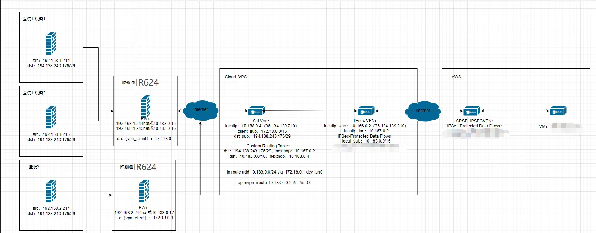

# 医疗设备数据传输解决方案

## 一、方案概述

### 1.1 项目背景

医疗设备在日常运行过程中，会产生大量的log和影相数据，这些数据需远程上传至各医院中心，在传输过程中需保证数据安全，高速传输，实时性等要求。

本方案旨在实现设备统一接入、为设备与数据中心间提供高速稳定的VPN网络、实时上传设备数据、为医疗设备等提供稳定可靠的物联网底座。

### 1.2 建设目标

- 设备统一接入管理

- 搭建VPN网络

- 支持远程配置、远程诊断、远程升级

- 实现告警、联动、可视化、报表分析

- 提升运维效率，降低人工巡检成本

- 安全稳定、易扩展、易维护

### 1.3 适用场景

- 医疗设备统一接入管理

- 边缘与中心搭建VPN组网

## 二、需求分析

### 2.1 设备现状

- 设备类型：医疗设备为主

- 通信接口：Ethernet/4G/5G/Wi-Fi/

- 部署环境：室内

### 2.2 核心需求

    1.网络需求：有线 / 4G/5G 备份，高带宽、高稳定

    2.远程需求：远程调试、远程控制、远程维护

    3.VPN组网需求：设备与数据中心端搭建VPN通道

    4.平台需求：大屏可视化、报表

## 三、总体架构设计

### 3.1 三层架构

1.感知层：医疗设备

2.网络层：边缘路由器、4G/5G、以太网、WIFI、中心端路由器

3.应用层：监控大屏、Web 管理后台、告警系统、企业数据中心

### 3.2 数据流

设备→ 边缘侧路由器 → 4G/5G/Ethernet → VPN通道 → 中心端路由器 → 数据展示

## 四、网络与接入方案

### 4.1 联网方式选型

蜂窝/Ethernet/WIFI

### 4.2 边缘路由器选型要点

- 千兆以太网口

- WIFI

- 支持4G/5G

- 支持VPN组网

- 工业级宽温、防尘、抗干扰

- 远程管理、远程升级、远程配置

## 五、方案亮点总结

1. 一站式：接入 + 网络 + 平台 + 应用全栈解决方案

2. 高兼容：多设备、多网络统一接入

3. 低成本：减少人工巡检，提升运维效率

4. 安全合规：传输加密、权限管理、操作审计
