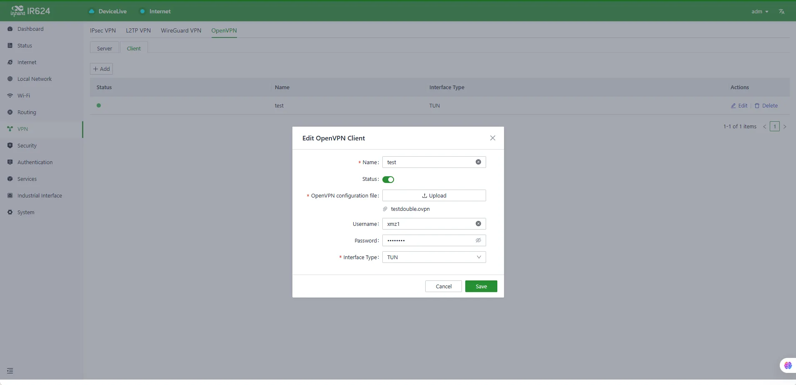
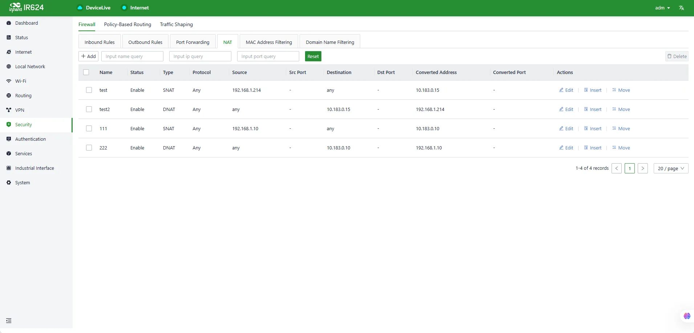

# 医疗设备数据传输解决方案配置手册

## 一、文档信息

- **文档名称**：医疗设备数据传输解决方案配置手册

- **产品型号**：IR624

- **固件版本**：V3.0.9

- **适用场景**：设备统一接入，VPN组网

- **编写日期**：2026年3月30日

## 二、网关概述

### 2.1 产品简介

在此场景下路由器产品主要用于企业分支联网场景下现场**设备统一接入**、**分支端与中心端搭建VPN组网**

### 2.2 主要功能

- 现场医疗设备统一接入

- 分支端与中心端搭建VPN组网

- 远程配置、远程诊断、远程升级

- 宽温工业级设计

### 2.3 典型应用拓扑

## 三、硬件说明

## 3.1 外观与接口

- 电源接口：DC 9-48V

- 网口：4×10/100/1000Mbps 以太网端口 支持WAN/LAN/VLAN

- 无线：4G/5G/Wi-Fi（可选）

- 指示灯：PWR、RUN、NET、信号强度

- 复位键：恢复出厂设置

## 3.2 接线说明

#### 3.2.1 电源接线

- 正极：V+

- 负极：V-

- 注意：防反接、防雷、接地

#### 3.2.2 以太网接线

直连 / 交叉自适应，建议超五类及以上网线。

## 四、出厂默认参数

- 默认 IP：192.168.2.1

- 子网掩码：255.255.255.0

- Web 用户名：adm

- Web 密码：随机密码，需对应设备铭牌

## 五、前期准备

1. 电脑设置与网关同网段 IP

2. 网线连接电脑与网关 LAN 口

3. 网关上电，等待 RUN 灯常亮

4. 浏览器输入网关 IP 进入配置页面

## 六、网络配置

1. 插入 SIM 卡（支持 NB-IoT/4G）/连接以太网，此项根据现场相应配置

2. 开启移动网络

3. APN：自动 / 手动填写

4. 信号强度查看

   5.设置vlan地址为192.168.1.104/24

   6.配置连接小星云平台

## 七、VPN和NAT配置

### 7.1 VPN配置

在设备侧添加openvpn客户端

### 7.2 NAT配置

根据客户网络组网要求配置NAT

## 八、相同配置可导入配置文件

配置文件见config目录
