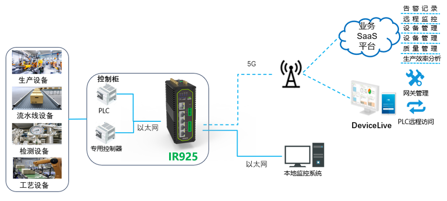

  

    

      
    

    

      拥抱 5G，共创数字时代
    

  

  

    

      IR925 工业路由器
    

    

      

        
· 5G

        
· Wi-Fi 6

      

      

        
· 安全

        
· 云管理

      

    

  

## 1. 产品概述

InRouter925（简称 IR925）系列产品是映翰通为帮助企业数字化转型而设计的工业路由器，集成 5G/4G 网络、Wi-Fi、虚拟专用网 VPN 等多种技术，为各物联网行业提供高效、安全、智能的数字化联网解决方案。IR925 通过多级链路检测机制保证通信的稳定性和可靠性，完全满足无人值守的工业现场通信需求。同时，结合映翰通 DeviceLive 云管理平台，帮助用户实现统一式集中云管理和远程维护，轻松掌控设备状态，降低部署成本，提升管理效率。

### 1.1 功能与优势

<table>
  <colgroup>
    <col style="width: 22%;" />
    <col style="width: 78%;" />
  </colgroup>
  <tr>
    <th align="left">价值维度</th>
    <th align="left">描述</th>
  </tr>
  <tr>
    <td align="left"><strong>拥抱 5G</strong></td>
    <td align="left">具备 5G 蜂窝高速网络接入能力，下行高达 3.4 Gbps，兼容 4G/3G；高带宽、低延迟助力新一代工业联网体验</td>
  </tr>
  <tr>
    <td align="left"><strong>Wi-Fi 6</strong></td>
    <td align="left">双频并发 3000 Mbps（2.4 GHz &amp; 5.8 GHz），支持 802.11 ax/ac/a/b/g/n，AP / Client 双模式，支持 Wi-Fi Portal 与多 SSID</td>
  </tr>
  <tr>
    <td align="left"><strong>永久在线</strong></td>
    <td align="left">链路备份、链路检测、双 SIM 切换、内嵌看门狗等能力，保障连接可靠稳定，降低网络故障风险</td>
  </tr>
  <tr>
    <td align="left"><strong>安全防护</strong></td>
    <td align="left">集成 VPN、防火墙、策略路由等多层次安全策略；支持 IPsec / L2TP / OpenVPN / WireGuard，以及 TPM 硬件安全能力</td>
  </tr>
  <tr>
    <td align="left"><strong>云管理</strong></td>
    <td align="left">接入 DeviceLive 平台，统一管理上万分布式站点；支持远程连接、诊断、调试与修复，降低现场维护成本</td>
  </tr>
  <tr>
    <td align="left"><strong>工业级设计</strong></td>
    <td align="left">金属外壳、无风扇散热、IP30；工作温度 -40°C ~ +70°C；DC 9~48 V 宽压；导轨 / 壁挂安装</td>
  </tr>
</table>

### 1.2 应用场景

<table>
  <colgroup>
    <col style="width: 18%;" />
    <col style="width: 22%;" />
    <col style="width: 30%;" />
    <col style="width: 30%;" />
  </colgroup>
  <tr>
    <th align="left">场景</th>
    <th align="left">典型客户</th>
    <th align="left">关键需求</th>
    <th align="left">价值主张</th>
  </tr>
  <tr>
    <td align="left"><strong>智慧工厂</strong></td>
    <td align="left">制造企业、系统集成商</td>
    <td align="left">产线设备联网、远程运维、高可用链路</td>
    <td align="left">5G / 有线多链路接入，支撑 24 小时连续生产</td>
  </tr>
  <tr>
    <td align="left"><strong>仓储自动化</strong></td>
    <td align="left">物流仓储、自动化集成商</td>
    <td align="left">AGV/AMR 联网、现场无线覆盖、集中管控</td>
    <td align="left">Wi-Fi 6 与蜂窝备份，提升作业效率、降低人力成本</td>
  </tr>
  <tr>
    <td align="left"><strong>远程医疗</strong></td>
    <td align="left">医院、医疗设备商</td>
    <td align="left">远程会诊、医疗数据安全回传</td>
    <td align="left">高带宽低延迟连接，拓展专家诊疗边界</td>
  </tr>
  <tr>
    <td align="left"><strong>巡检机器人</strong></td>
    <td align="left">电力、石化、制造巡检场景</td>
    <td align="left">实时视频与状态回传、移动连续在线</td>
    <td align="left">双 SIM 与链路检测，严密监控生产过程</td>
  </tr>
  <tr>
    <td align="left"><strong>配电自动化</strong></td>
    <td align="left">电网公司、能源服务商</td>
    <td align="left">异常信息快速上送、安全隔离通信</td>
    <td align="left">VPN 与多层防火墙，助力更快速、准确的电网控制</td>
  </tr>
  <tr>
    <td align="left"><strong>智慧城市</strong></td>
    <td align="left">市政、园区、城市运营方</td>
    <td align="left">分布式站点联网、统一云管</td>
    <td align="left">DeviceLive 集中管理，打造安全可持续的城市连接</td>
  </tr>
</table>

### 1.3 产品尺寸

  

    
    
正视图

  

**注：**

1. 所有尺寸单位为毫米。
2. 尺寸（长 × 宽 × 高）：141.2 × 118.5 × 53 mm。
3. 所有尺寸为近似值，仅供参考。

## 2. 系统架构

### 2.1 解决方案组件

IR925 解决方案由工业路由器主机与外置天线等组成，可对接本地监控系统与 DeviceLive 云平台，实现现场设备联网与远程运维。

### 2.2 部署

典型单站点标准配置如下（视型号与现场需求调整）：

<table>
  <colgroup>
    <col style="width: 22%;" />
    <col style="width: 12%;" />
    <col style="width: 66%;" />
  </colgroup>
  <tr>
    <th align="left">组件</th>
    <th align="left">数量</th>
    <th align="left">描述</th>
  </tr>
  <tr>
    <td align="left">IR925 主机</td>
    <td align="left">1</td>
    <td align="left">导轨或壁挂安装，部署于机柜 / 现场箱体</td>
  </tr>
  <tr>
    <td align="left">5G / 4G 天线</td>
    <td align="left">4 / 2</td>
    <td align="left">4 × 5G 天线或 2 × 4G 天线（蜂窝型号）</td>
  </tr>
  <tr>
    <td align="left">Wi-Fi 天线</td>
    <td align="left">0 / 2</td>
    <td align="left">WLAN 型号配置 2 × Wi-Fi 天线</td>
  </tr>
  <tr>
    <td align="left">GNSS 天线</td>
    <td align="left">0 / 1</td>
    <td align="left">WLAN 型号（含 GPS）配置 GNSS 天线</td>
  </tr>
  <tr>
    <td align="left">SIM 卡</td>
    <td align="left">1 ~ 2</td>
    <td align="left">抽屉式卡座，支持双 Nano-SIM；可选 eSIM</td>
  </tr>
  <tr>
    <td align="left">电源</td>
    <td align="left">1</td>
    <td align="left">DC 9~48 V，2 PIN 工业端子，防过流 / 防反接</td>
  </tr>
  <tr>
    <td align="left">以太网连接</td>
    <td align="left">最多 5</td>
    <td align="left">1 × 2.5GbE + 4 × 1GbE RJ45，WAN/LAN/VLAN</td>
  </tr>
</table>

## 3. 硬件规格

### 3.1 硬件概述

<table>
  <colgroup>
    <col style="width: 22%;" />
    <col style="width: 78%;" />
  </colgroup>
  <tr>
    <th align="left">参数</th>
    <th align="left">规格</th>
  </tr>
  <tr>
    <td align="left"><strong>处理器</strong></td>
    <td align="left">1 GHz</td>
  </tr>
  <tr>
    <td align="left"><strong>内存</strong></td>
    <td align="left">512 MB</td>
  </tr>
  <tr>
    <td align="left"><strong>存储</strong></td>
    <td align="left">8 GB eMMC</td>
  </tr>
  <tr>
    <td align="left"><strong>蜂窝网络</strong></td>
    <td align="left">5G 网络，下行最大 3.4 Gbps，Sub6（450 MHz ~ 6 GHz），兼容 4G/3G（具体频段见订购信息）</td>
  </tr>
  <tr>
    <td align="left"><strong>SIM 卡槽</strong></td>
    <td align="left">1 × 抽屉式卡座，支持双 Nano-SIM，1.8 V / 3 V；eSIM（可选）</td>
  </tr>
  <tr>
    <td align="left"><strong>以太网端口</strong></td>
    <td align="left">1 × 2.5GbE + 4 × 1GbE RJ45，WAN/LAN/VLAN 1.5 KV 网络隔离变压保护</td>
  </tr>
  <tr>
    <td align="left"><strong>串口</strong></td>
    <td align="left">1 × RS232，1 × RS485；ESD 防护 15 KV</td>
  </tr>
  <tr>
    <td align="left"><strong>I/O</strong></td>
    <td align="left">4 × DIO（DO/IO 可配）；1 × Relay，2 A @ 30 V DC</td>
  </tr>
  <tr>
    <td align="left"><strong>Wi-Fi</strong></td>
    <td align="left">2.4 GHz &amp; 5.8 GHz，双频并发 3000 Mbps；802.11 ax/ac/a/b/g/n（WLAN 型号）</td>
  </tr>
  <tr>
    <td align="left"><strong>Wi-Fi 发射功率</strong></td>
    <td align="left">5 GHz：21 dBm；2.4 GHz：21 dBm</td>
  </tr>
  <tr>
    <td align="left"><strong>Wi-Fi 覆盖范围</strong></td>
    <td align="left">视距 50 米（实际传输距离视现场环境而定）</td>
  </tr>
  <tr>
    <td align="left"><strong>天线接口</strong></td>
    <td align="left">4 × 5G 或 2 × 4G；2 × Wi-Fi；1 × GNSS</td>
  </tr>
  <tr>
    <td align="left"><strong>指示灯</strong></td>
    <td align="left">1 × 系统，1 × 联网，1 × 2.4G Wi-Fi，1 × 5G Wi-Fi，3 × 信号</td>
  </tr>
  <tr>
    <td align="left"><strong>接地端子</strong></td>
    <td align="left">支持</td>
  </tr>
  <tr>
    <td align="left"><strong>硬件组件</strong></td>
    <td align="left">RTC 支持；TPM 支持</td>
  </tr>
  <tr>
    <td align="left"><strong>电源</strong></td>
    <td align="left">DC 9~48 V，防过流保护，防反接，2 × PIN 工业端子</td>
  </tr>
  <tr>
    <td align="left"><strong>复位按钮</strong></td>
    <td align="left">针孔式复位按键</td>
  </tr>
  <tr>
    <td align="left"><strong>外壳</strong></td>
    <td align="left">金属外壳</td>
  </tr>
  <tr>
    <td align="left"><strong>散热</strong></td>
    <td align="left">无风扇散热</td>
  </tr>
  <tr>
    <td align="left"><strong>防护等级</strong></td>
    <td align="left">IP30</td>
  </tr>
  <tr>
    <td align="left"><strong>工作温度</strong></td>
    <td align="left">-40°C ~ +70°C</td>
  </tr>
  <tr>
    <td align="left"><strong>存储温度</strong></td>
    <td align="left">-40°C ~ +85°C</td>
  </tr>
  <tr>
    <td align="left"><strong>环境湿度</strong></td>
    <td align="left">5% ~ 95%（无凝霜）</td>
  </tr>
  <tr>
    <td align="left"><strong>尺寸</strong></td>
    <td align="left">141.2 × 118.5 × 53 mm</td>
  </tr>
  <tr>
    <td align="left"><strong>重量</strong></td>
    <td align="left">1002 g</td>
  </tr>
  <tr>
    <td align="left"><strong>安装</strong></td>
    <td align="left">导轨、壁挂</td>
  </tr>
</table>

### 3.2 接口概述

**以太网端口（×5）**

- 1 × 2.5GbE + 4 × 1GbE RJ45
- 支持 WAN/LAN/VLAN
- 1.5 KV 网络隔离变压保护

**串口**

- 1 × RS232，1 × RS485
- ESD 防护：15 KV

**I/O 与继电器**

- 4 × DIO（DO/IO 可配）
- 1 × Relay，2 A @ 30 V DC

**电源 / 天线 / SIM**

- DC 9~48 V，2 PIN 工业端子，防过流、防反接
- 天线：4 × 5G 或 2 × 4G；2 × Wi-Fi；1 × GNSS
- 抽屉式双 Nano-SIM；eSIM（可选）
- 针孔式复位按键；支持接地端子

### 3.3 环境与可靠性规格

<table>
  <colgroup>
    <col style="width: 28%;" />
    <col style="width: 36%;" />
    <col style="width: 36%;" />
  </colgroup>
  <tr>
    <th align="left">测试项目</th>
    <th align="left">标准</th>
    <th align="left">等级/结果</th>
  </tr>
  <tr>
    <td align="left"><strong>ESD（静电放电）</strong></td>
    <td align="left">EN61000-4-2</td>
    <td align="left">3 级</td>
  </tr>
  <tr>
    <td align="left"><strong>辐射抗扰度</strong></td>
    <td align="left">EN61000-4-3</td>
    <td align="left">3 级</td>
  </tr>
  <tr>
    <td align="left"><strong>EFT（电快速瞬变）</strong></td>
    <td align="left">EN61000-4-4</td>
    <td align="left">3 级</td>
  </tr>
  <tr>
    <td align="left"><strong>浪涌</strong></td>
    <td align="left">EN61000-4-5</td>
    <td align="left">3 级</td>
  </tr>
  <tr>
    <td align="left"><strong>传导抗扰度</strong></td>
    <td align="left">EN61000-4-6</td>
    <td align="left">3 级</td>
  </tr>
  <tr>
    <td align="left"><strong>振荡波</strong></td>
    <td align="left">EN61000-4-12</td>
    <td align="left">3 级</td>
  </tr>
  <tr>
    <td align="left"><strong>工频磁场</strong></td>
    <td align="left">EN61000-4-8</td>
    <td align="left">水平 / 垂直 400 A/m（≥ 2 级）</td>
  </tr>
  <tr>
    <td align="left"><strong>冲击</strong></td>
    <td align="left">IEC60068-2-27</td>
    <td align="left">符合</td>
  </tr>
  <tr>
    <td align="left"><strong>振动</strong></td>
    <td align="left">IEC60068-2-6</td>
    <td align="left">符合</td>
  </tr>
  <tr>
    <td align="left"><strong>自由跌落</strong></td>
    <td align="left">IEC60068-2-32</td>
    <td align="left">符合</td>
  </tr>
</table>

### 3.4 主要硬件优势

<table>
  <colgroup>
    <col style="width: 28%;" />
    <col style="width: 72%;" />
  </colgroup>
  <tr>
    <th align="left">优势</th>
    <th align="left">描述</th>
  </tr>
  <tr>
    <td align="left"><strong>多速率以太网</strong></td>
    <td align="left">1 × 2.5GbE + 4 × 1GbE，满足高带宽现场设备与多终端接入</td>
  </tr>
  <tr>
    <td align="left"><strong>工业接口齐全</strong></td>
    <td align="left">RS232 / RS485、4 × DIO、继电器输出，便于对接工控与现场设备</td>
  </tr>
  <tr>
    <td align="left"><strong>宽温宽压</strong></td>
    <td align="left">-40°C ~ +70°C 工作温度，DC 9~48 V 供电，适配严苛工业环境</td>
  </tr>
  <tr>
    <td align="left"><strong>双 SIM + eSIM</strong></td>
    <td align="left">双 Nano-SIM 链路切换，可选 eSIM，提升蜂窝连接可用性</td>
  </tr>
  <tr>
    <td align="left"><strong>TPM + 无风扇</strong></td>
    <td align="left">硬件 TPM 支持；无风扇被动散热，利于长期无人值守运行</td>
  </tr>
  <tr>
    <td align="left"><strong>灵活安装</strong></td>
    <td align="left">导轨、壁挂两种安装方式，便于机柜与箱体部署</td>
  </tr>
</table>

## 4. 软件功能

### 4.1 网络协议

<table>
  <colgroup>
    <col style="width: 28%;" />
    <col style="width: 72%;" />
  </colgroup>
  <tr>
    <th align="left">协议类别</th>
    <th align="left">支持的协议</th>
  </tr>
  <tr>
    <td align="left"><strong>网络接入</strong></td>
    <td align="left">APN、VPDN</td>
  </tr>
  <tr>
    <td align="left"><strong>认证</strong></td>
    <td align="left">CHAP、PAP</td>
  </tr>
  <tr>
    <td align="left"><strong>网络类型</strong></td>
    <td align="left">WCDMA、TDD LTE / FDD LTE、5G NR（SA/NSA）（具体频段见订购信息）</td>
  </tr>
  <tr>
    <td align="left"><strong>局域网协议</strong></td>
    <td align="left">ARP、Ethernet</td>
  </tr>
  <tr>
    <td align="left"><strong>广域网协议</strong></td>
    <td align="left">静态 IP、DHCP、PPPoE</td>
  </tr>
  <tr>
    <td align="left"><strong>路由</strong></td>
    <td align="left">静态路由、OSPF、BGP</td>
  </tr>
  <tr>
    <td align="left"><strong>协议与应用</strong></td>
    <td align="left">TCP、UDP、IPv4、IPv6、ICMP、NTP、DNS、HTTP、HTTPS、SSL/TLS、ARP、VRRP*、PPPoE、SSH、DHCP Server、DHCP Relay、DHCP Client、DDNS、Telnet、IP Passthrough</td>
  </tr>
</table>

### 4.2 网络安全

<table>
  <colgroup>
    <col style="width: 28%;" />
    <col style="width: 72%;" />
  </colgroup>
  <tr>
    <th align="left">安全功能</th>
    <th align="left">描述</th>
  </tr>
  <tr>
    <td align="left"><strong>防火墙</strong></td>
    <td align="left">基于 MAC / IP / 端口 / 协议的防火墙过滤；支持 NAT、端口映射；支持访问控制；支持策略路由；支持 802.1X</td>
  </tr>
  <tr>
    <td align="left"><strong>数据安全</strong></td>
    <td align="left">IPsec VPN、L2TP VPN、OpenVPN、WireGuard VPN、VXLAN*；支持 CA 证书</td>
  </tr>
  <tr>
    <td align="left"><strong>管理安全</strong></td>
    <td align="left">支持用户权限分级管理</td>
  </tr>
</table>

### 4.3 链路管理与备份

**备份功能**
- 支持接口备份、VRRP*

**双 SIM 链路切换**
- 支持双 SIM 链路切换

**链路在线检测**
- 发送心跳包检测，断线自动连接

**内嵌看门狗**
- 设备运行自检，故障自修复

### 4.4 Wi-Fi 功能

**工作模式**
- 支持 AP、Client 双模式

**安全**
- 开放系统、共享密钥、WPA / WPA2 / WPA3 认证
- WEP / TKIP / AES 加密

**其他**
- 支持 Wi-Fi Portal
- 支持多 SSID

### 4.5 GNSS

- 支持 GNSS IP 转发和串口转发
- 支持时间同步

### 4.6 DTU 功能

- 支持 TCP / UDP 透传
- 支持 Modbus RTU 转 Modbus TCP

### 4.7 监控、告警与 QoS

**仪表盘**
- 设备信息、接口状态、精细化流量统计

**链路监控**
- 链路时延、抖动、丢包、吞吐率监控

**蜂窝信号**
- 实时查看蜂窝信号强度、RSSI、RSRP、RSRQ、SINR

**日志与告警**
- 系统日志、诊断日志、设备事件、邮件告警

**QoS**
- 支持流量整形

### 4.8 系统管理

**远程访问**
- 支持 Web / CLI 远程访问

**网管功能**
- 支持映翰通 DeviceLive 设备云网管平台，批量管理，远程维护
- SNMP v1 / v2c / v3

**短信**
- 短信重启设备

**网络诊断**
- 支持 Ping、Traceroute、网络抓包、测速工具

**配置备份**
- 支持配置导入 / 导出

## 5. 云管理

### 5.1 DeviceLive 平台集成

IR925 可接入映翰通 DeviceLive 设备管理运营平台，通过统一云平台实时管理上万分布式站点设备，随时随地掌控现场设备状态。用户可通过云服务实现现场设备的远程连接，对分布式现场设备进行诊断、调试和修复，减少设备失效带来的损失，让管理更轻松、更高效、更经济。

### 5.2 云管理功能

<table>
  <colgroup>
    <col style="width: 28%;" />
    <col style="width: 72%;" />
  </colgroup>
  <tr>
    <th align="left">功能</th>
    <th align="left">描述</th>
  </tr>
  <tr>
    <td align="left"><strong>实时监控</strong></td>
    <td align="left">随时随地掌控现场设备状态</td>
  </tr>
  <tr>
    <td align="left"><strong>批量管理</strong></td>
    <td align="left">通过 DeviceLive 对分布式站点设备进行批量管理</td>
  </tr>
  <tr>
    <td align="left"><strong>远程维护</strong></td>
    <td align="left">支持远程维护，降低现场运维成本</td>
  </tr>
  <tr>
    <td align="left"><strong>远程连接</strong></td>
    <td align="left">通过云服务远程连接现场设备，进行诊断、调试和修复</td>
  </tr>
</table>

## 6. 订货指南

### 6.1 型号代码结构

**型号编号：** IR925-\<WMNN\>-\<WLAN/NA\>

- \<WMNN\>：无线通讯类型 & 模块
- \<WLAN/NA\>：WLAN = Wi-Fi 和 GPS；NA = 无 Wi-Fi 和 GPS

<table>
  <colgroup>
    <col style="width: 36%;" />
    <col style="width: 12%;" />
    <col style="width: 52%;" />
  </colgroup>
  <tr>
    <th align="left">型号</th>
    <th align="left">区域</th>
    <th align="left">网络制式</th>
  </tr>
  <tr>
    <td align="left"><strong>IR925-CNNR-&lt;WLAN/NA&gt;</strong></td>
    <td align="left"><strong>中国</strong></td>
    <td align="left"><strong>5G NR NSA</strong> n41/78/79 <strong>5G NR SA</strong> n1/3/5/8/28A/41/77/78/79 <strong>LTE FDD</strong> B1/3/5/8 <strong>LTE TDD</strong> B34/38/39/40/41 <strong>WCDMA</strong> B1/5/8</td>
  </tr>
  <tr>
    <td align="left"><strong>IR925-GLNR-&lt;WLAN/NA&gt;</strong></td>
    <td align="left"><strong>北美</strong></td>
    <td align="left"><strong>5G NR NSA</strong> n1/2/3/5/7/8/12/13/14/18/20/25/26/28/29/30/38/40/41/48/66/70/71/75/76/77/78/79 <strong>5G NR SA</strong> n1/2/3/5/7/8/12/13/14/18/20/25/26/28/29/30/38/40/41/48/66/70/71/75/76/77/78/79 <strong>LTE FDD</strong> B1/2/3/4/5/7/8/12/13/14/17/18/19/20/25/26/28/29/30/32/66/71 <strong>LTE TDD</strong> B34/38/39/40/41/42/43/48 <strong>LTE LAA</strong> B46 <strong>WCDMA</strong> B1/2/4/5/8/19</td>
  </tr>
  <tr>
    <td align="left"><strong>IR925-EN00-WLAN</strong></td>
    <td align="left">—</td>
    <td align="left">无蜂窝；WLAN：Wi-Fi</td>
  </tr>
</table>

**示例：** IR925-CNNR-WLAN 表示 IR925 系列无线路由器，支持 5G/4G 蜂窝网络，支持 Wi-Fi 6 且支持 AP & Client 模式，支持 RS232 和 RS485，支持数字 IO，支持 GPS。

## 7. 安装与部署

### 7.1 安装方式

**导轨安装**
- 支持导轨安装，适合工业机柜部署

**壁挂安装**
- 支持壁挂安装，适合箱体与墙面固定

### 7.2 安装步骤

<table>
  <colgroup>
    <col style="width: 12%;" />
    <col style="width: 88%;" />
  </colgroup>
  <tr>
    <th align="left">步骤</th>
    <th align="left">任务</th>
  </tr>
  <tr>
    <td align="left">1</td>
    <td align="left">按现场需求选择导轨或壁挂方式安装 IR925 主机</td>
  </tr>
  <tr>
    <td align="left">2</td>
    <td align="left">连接外置天线（5G/4G、Wi-Fi、GNSS，视型号配置）</td>
  </tr>
  <tr>
    <td align="left">3</td>
    <td align="left">插入 SIM 卡（双 SIM 配置时按需安装）</td>
  </tr>
  <tr>
    <td align="left">4</td>
    <td align="left">连接电源（DC 9~48 V）并做好接地</td>
  </tr>
  <tr>
    <td align="left">5</td>
    <td align="left">连接以太网、串口及 I/O 设备（按需）</td>
  </tr>
  <tr>
    <td align="left">6</td>
    <td align="left">上电并通过 Web / CLI 完成初始配置</td>
  </tr>
  <tr>
    <td align="left">7</td>
    <td align="left">（可选）接入 DeviceLive 云平台</td>
  </tr>
</table>

### 7.3 安装注意事项

- 确保天线位置以获得最佳信号接收
- 连接前确认电源电压（9~48 V DC）
- 正确接地设备
- 布线远离强干扰源与热源
- 插入前确认 SIM 卡方向
- 首次上电后建议完成基础网络安全配置（防火墙 / VPN 等）

## 8. 联系我们

- **官网：** [映翰通官网](https://www.inhand.com.cn)
- **版权声明：** ©映翰通网络 保留所有权利
