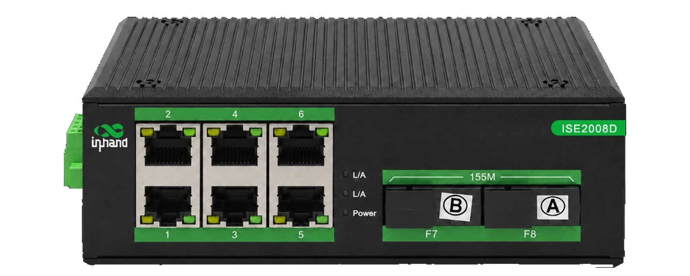
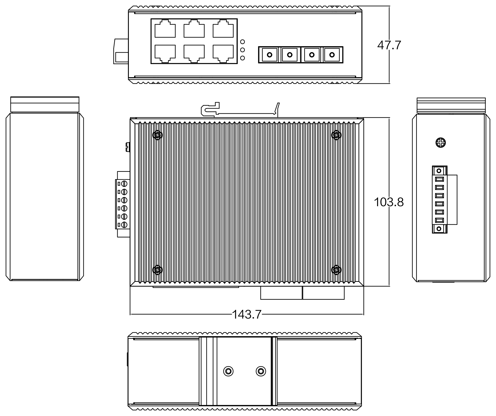

  
  

    

      非网管工业交换机
    

    

      ISE2008D-S
    

    <table style="margin: 56px auto 0 auto; border-collapse: separate; border-spacing: 12px; width: auto;">
      <tr>
        <td style="width: 200px; background-color: #4CAF50; color: #fff; padding: 8px 16px; border-radius: 16px; font-size: 16px; text-align: center; white-space: nowrap;">即插即用</td>
        <td style="width: 200px; background-color: #4CAF50; color: #fff; padding: 8px 16px; border-radius: 16px; font-size: 16px; text-align: center; white-space: nowrap;">导轨安装</td>
      </tr>
      <tr>
        <td style="width: 200px; background-color: #4CAF50; color: #fff; padding: 8px 16px; border-radius: 16px; font-size: 16px; text-align: center; white-space: nowrap;">无风扇</td>
        <td style="width: 200px; background-color: #4CAF50; color: #fff; padding: 8px 16px; border-radius: 16px; font-size: 16px; text-align: center; white-space: nowrap;">IP40</td>
      </tr>
    </table>
  

  

    
  

# 1. 产品概述

**ISE2008D-S 专为电力、交通、工业控制及其他严酷工业环境设计。**

ISE2008D-S 是 2 路百兆光口 + 6 路百兆电口的工业级以太网交换机，支持 6 个 10Base-T/100Base-TX 电口和 2 个 100Base-FX 光口。光口可选 FC / SC 接口，覆盖多模双纤、单模双纤及单模单纤等多种传输距离，具体配置见订购指南。产品符合 FCC、CE、ROHS 标准，具有 -40℃ ~ +80℃ 的宽工作温度范围，能适应各种严苛环境，也可非常方便地安置在空间紧凑的控制箱中。导轨安装特性、宽温操作及 IP40 防护等级的金属外壳与 LED 指示灯，使 ISE2008D-S 成为一款即插即用的工业级设备，为用户的以太网设备联网提供可靠、便捷的解决方案。

**产品特点：**

- **坚固设计：** 金属外壳，无风扇自然冷却，IP40 防护等级。
- **宽域适应：** 宽温（-40 ~ +80℃）、宽压（DC 12-52V）设计，支持双电源冗余备份。
- **国际标准：** 符合 FCC、CE、ROHS 标准，EMS 各项达 Level 3，具备出色的电磁兼容性。
- **智能交换：** 内带存储转发机制，支持全双工/半双工自动协商，网口全自动交叉识别（MDI/MDI-X 自适应）。
- **光纤上行：** 2 个百兆光口，采用优质光电一体化模块，保证数据传输可靠，工作寿命长。
- **可靠防护：** 电源反接保护、内置 4.0 A 过流保护、5000 A（8/20 μs）雷击浪涌冲击防护。
- **便捷部署：** 即插即用，支持 DIN 导轨式及壁挂式安装，平均无故障时间 300,000 小时。

## 核心技术参数

| 参数 | 规格 |
|-----------|---------------|
| 类型 | 二层非网管工业以太网交换机 |
| 端口 | 6 × 10/100Base-T(X) 自适应 RJ45 端口 + 2 × 100Base-FX 光口 |
| 交换性能 | 1.6 Gbps 背板带宽，存储转发，2K MAC |
| 尺寸 / 重量 | 143.7 × 103.8 × 47.7 mm / 0.64 kg |
| 电源 | DC 12-52 V，双电源冗余备份，< 5 W |
| 环境 | 工作温度 -40 至 +80 ℃，IP40 |
| 电磁兼容 | EN61000-4-2/3/4/5/6 Level 3；EMI：FCC Part 15、CISPR (EN55032) Class A |

# 2. 产品尺寸

  

    
    
ISE2008D-S

  

  

    
注意：

    
1. 所有尺寸单位为毫米（mm）。

    
2. 所有尺寸均为近似值，仅供参考。

    
3. 图示尺寸不得用于生产加工。

    
4. 尺寸需符合零件及制造公差要求。

    
5. 尺寸如有变更，恕不另行通知。

  

# 3. 硬件规格

| 类别/参数 | 规格 |
|----------------------|---------------|
| **物理性能** | |
| 外壳 | 金属外壳，IP40 防护等级 |
| 尺寸 (W × D × H) | 143.7 mm × 103.8 mm × 47.7 mm |
| 重量 | 0.64 kg |
| 安装方式 | DIN 导轨式、壁挂式安装 |
| 散热方式 | 自然冷却，无风扇 |
| 防护等级 | IP40 |
| 存储温度 | -40 °C ~ +80 °C |
| 工作温度 | -40 °C ~ +80 °C |
| 湿度 | 5 ~ 95%（无凝露） |
| **接口** | |
| 电口 | 6 × RJ45 |
| RJ45 端口 | 10/100Base-T(X) 自动侦测，全/半双工，MDI/MDI-X 自适应 |
| 光口 | 2 × 100Base-FX |
| LED 指示灯 | 电源指示灯（Power）、接口指示灯（Link/ACT） |
| **硬件性能** | |
| 背板带宽 | 1.6 Gbps |
| 处理方式 | 存储转发 |
| MAC 地址表 | 2K |
| 包缓存区大小 | 1 Mbit |
| 交换延迟 | <10 μs |
| **网络协议** | |
| 10Base-T | 遵循 IEEE 802.3、IEEE 802.3i |
| 100Base-TX/FX | 遵循 IEEE 802.3u |
| 流控 | 遵循 IEEE 802.3x |
| **电源参数** | |
| 工作电压 | DC 12-52 V（双电源冗余备份） |
| 接入端子 | 凤凰端子 |
| 功耗 | < 5 W |
| 过流保护 | 支持，内置 4.0 A 保护 |
| 反极性保护 | 支持 |
| 雷击浪涌冲击防护（电源） | 5000 A（8/20 μs） |
| **电磁特性** | |
| EMI | FCC Part 15；CISPR (EN55032) Class A |
| EMS | EN61000-4-2 (ESD), Level 3   EN61000-4-3 (RS), Level 3   EN61000-4-4 (EFT), Level 3   EN61000-4-5 (Surge), Level 3   EN61000-4-6 (CS), Level 3 |
| **机械环境** | |
| 冲击 | IEC 60068-2-27 |
| 自由落体 | IEC 60068-2-32 |
| 震动 | IEC 60068-2-6 |
| **质量保证** | |
| 质保期 | 5 年 |
| MTBF | 300,000 小时 |

# 4. 订购指南

| 型号 | 描述 |
|-------|--------|
| ISE2008D-S-2B2035-6T-FC-24 | 2 百兆光口 + 6 百兆电口，FC 接口，单模单纤 20 km（A 端）。IP40 防护等级，DIN 导轨式安装，工作温度 -40°C 至 +80°C。DC 12-52 V 电源输入，支持双电源冗余备份。 |
| ISE2008D-S-2B2035-6T-SC-24 | 2 百兆光口 + 6 百兆电口，SC 接口，单模单纤 20 km（A 端）。IP40 防护等级，DIN 导轨式安装，工作温度 -40°C 至 +80°C。DC 12-52 V 电源输入，支持双电源冗余备份。 |
| ISE2008D-S-2B2053-6T-FC-24 | 2 百兆光口 + 6 百兆电口，FC 接口，单模单纤 20 km（B 端）。IP40 防护等级，DIN 导轨式安装，工作温度 -40°C 至 +80°C。DC 12-52 V 电源输入，支持双电源冗余备份。 |
| ISE2008D-S-2B2053-6T-SC-24 | 2 百兆光口 + 6 百兆电口，SC 接口，单模单纤 20 km（B 端）。IP40 防护等级，DIN 导轨式安装，工作温度 -40°C 至 +80°C。DC 12-52 V 电源输入，支持双电源冗余备份。 |
| ISE2008D-S-2B4035-6T-FC-24 | 2 百兆光口 + 6 百兆电口，FC 接口，单模单纤 40 km（A 端）。IP40 防护等级，DIN 导轨式安装，工作温度 -40°C 至 +80°C。DC 12-52 V 电源输入，支持双电源冗余备份。 |
| ISE2008D-S-2B4035-6T-SC-24 | 2 百兆光口 + 6 百兆电口，SC 接口，单模单纤 40 km（A 端）。IP40 防护等级，DIN 导轨式安装，工作温度 -40°C 至 +80°C。DC 12-52 V 电源输入，支持双电源冗余备份。 |
| ISE2008D-S-2B4053-6T-FC-24 | 2 百兆光口 + 6 百兆电口，FC 接口，单模单纤 40 km（B 端）。IP40 防护等级，DIN 导轨式安装，工作温度 -40°C 至 +80°C。DC 12-52 V 电源输入，支持双电源冗余备份。 |
| ISE2008D-S-2B4053-6T-SC-24 | 2 百兆光口 + 6 百兆电口，SC 接口，单模单纤 40 km（B 端）。IP40 防护等级，DIN 导轨式安装，工作温度 -40°C 至 +80°C。DC 12-52 V 电源输入，支持双电源冗余备份。 |
| ISE2008D-S-2M3-6T-FC-24 | 2 百兆光口 + 6 百兆电口，FC 接口，多模双纤。IP40 防护等级，DIN 导轨式安装，工作温度 -40°C 至 +80°C。DC 12-52 V 电源输入，支持双电源冗余备份。 |
| ISE2008D-S-2M3-6T-SC-24 | 2 百兆光口 + 6 百兆电口，SC 接口，多模双纤。IP40 防护等级，DIN 导轨式安装，工作温度 -40°C 至 +80°C。DC 12-52 V 电源输入，支持双电源冗余备份。 |
| ISE2008D-S-2S203-6T-FC-24 | 2 百兆光口 + 6 百兆电口，FC 接口，单模双纤 20 km。IP40 防护等级，DIN 导轨式安装，工作温度 -40°C 至 +80°C。DC 12-52 V 电源输入，支持双电源冗余备份。 |
| ISE2008D-S-2S203-6T-SC-24 | 2 百兆光口 + 6 百兆电口，SC 接口，单模双纤 20 km。IP40 防护等级，DIN 导轨式安装，工作温度 -40°C 至 +80°C。DC 12-52 V 电源输入，支持双电源冗余备份。 |
| ISE2008D-S-2S403-6T-FC-24 | 2 百兆光口 + 6 百兆电口，FC 接口，单模双纤 40 km。IP40 防护等级，DIN 导轨式安装，工作温度 -40°C 至 +80°C。DC 12-52 V 电源输入，支持双电源冗余备份。 |
| ISE2008D-S-2S403-6T-SC-24 | 2 百兆光口 + 6 百兆电口，SC 接口，单模双纤 40 km。IP40 防护等级，DIN 导轨式安装，工作温度 -40°C 至 +80°C。DC 12-52 V 电源输入，支持双电源冗余备份。 |

# 5. 联系我们

- **官网：** [映翰通官网](https://www.inhand.com.cn)
- **版权声明：** ©映翰通网络 保留所有权利
