# B系列交换机WEB操作手册

## 1. 基本配置

### 1.1. HTTP协议配置

交换机支持通过Web浏览器对交换机进行配置，以及对HTTP服务端口的配置。

一般而言，HTTP服务端口默认为80，用户可以通过直接输入IP地址的方式访问交换机，但交换机也支持用户更改服务端口。一旦更改了服务端口，访问交换机则需要通过IP地址加端口的方式。例如配置IP地址为192.168.2.1，服务端口为1234，则HTTP的访问地址就应改为<http://192.168.2.1:1234>。建议不要使用其他公共协议所使用的端口，以免造成访问冲突，例如：FTP-20、Telnet-23、DNS-53、SNMP-161。由于很多协议所使用的端口号不便记忆，因此建议使用1024以后的端口号。

## 2. 访问交换机

### 2.1 通过HTTP访问交换机

通过Web浏览器访问交换机，请确保您所使用的浏览器能够符合以下几点要求：

-  HTML版本4.0
-  HTTP版本1.1
-  JavaScript™版本1.5

此外，请确保交换机运行的主程序文件支持Web访问，且您的计算机已经连接到交换机所在的网络。

### 2.2 初次访问交换机

如果是第一次使用交换机，无需额外配置，您已经可以使用Web访问：

1、 修改您计算机网络适配器的IP地址为“192.168.2.2”，子网掩码为“255.255.255.0”。

2、打开Web浏览器，在地址栏中输入“192.168.2.1”。注意“192.168.2.1”是交换机的默认管理地址。

3、如果使用的是Internet Explorer浏览器，可以看到类似下图的对话框。在身份验证对话框中输入用户名和密码，初始的用户名和密码均为“admin”，请注意区分字母的大小写。

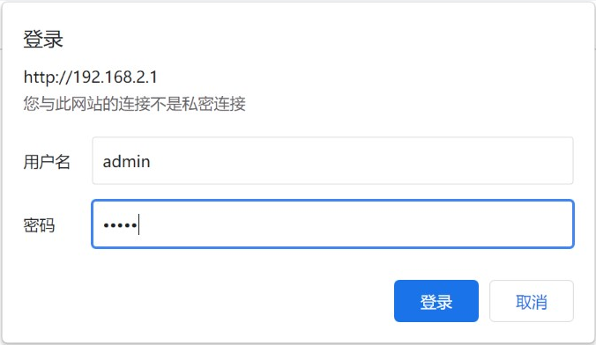

4、若认证成功，浏览器中会显示交换机的系统信息页面。

### 2.3 Web界面介绍

登录后的Web主页面分为顶部控制栏、导航栏、配置区和底部控制栏等部分。

### 2.3.1 顶部控制栏

| English | 切换界面语言为英文。 |
| --- | --- |
| 简体中文 | 切换界面语言为中文。 |

### 2.3.2 导航栏

导航栏控制配置区中显示的内容。导航栏的内容以列表形式显示，并按类别分组。默认情况下，列表定位在“系统——信息”。如需进行某项配置，请先点击组名，待列表展开后点击子项。例如，如果需要查看当前的端口流量，请先点击“监控”，然后点击“端口统计”。

### 2.3.3 配置区

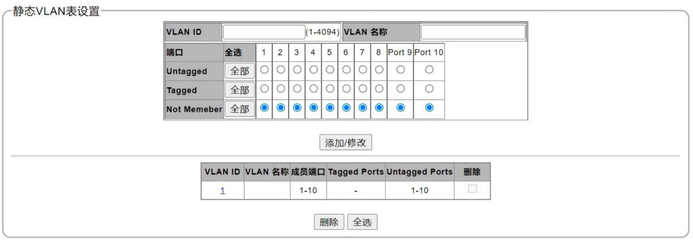

配置显示区显示设备的状态信息和配置。通过单击导航栏的列表项可以改变该区域的内容。

## 3 系统设置

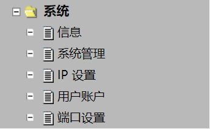

### 3.1 信息

在导航栏依次点击“系统”、“信息”，打开系统信息页面，如下图所示。

该页面仅显示设备的系统信息：设备型号、MAC地址、IP地址、子网掩码、网关、固件版本、固件日期、硬件版本，其中IP地址、子网掩码和网关可在“系统”→“IP设置”中进行设置。

### 3.2 系统管理

在导航栏依次点击“系统”、“系统管理”，进入设备的系统设置页面。

在这里可以对设备的“系统名称”、“系统位置”、“系统联系”进行修改设置，“系统OID”不可更改。设置完成后，点击下方的“应用”按键保存设置。

### 3.3 IP设置

在导航栏依次点击“系统”、“IP设置”，打开IP地址设置页面，如下图所示：

在此页面可修改“DHCP”的启用或禁止状态，并对“IP地址”、“子网掩码”、“网关”进行设置，设置完成后，点击下方的“应用”按键保存设置。应用完成后退出页面，以新的IP地址重新登录交换机，进入导航栏“工具”->“保存”保存配置。否则，更改的IP地址将无法生效。

### 3.4  用户账户

在导航栏依次点击“系统”、“用户账户”，打开用户账户设置页面，如下图所示。

该页面可以对用户的用户名和登录密码进行设置，设置完成后点击下方的“应用”按键保存设置。

### 3.5 端口设置

在导航栏依次点击“系统”、“端口设置”，打开端口设置页面如下图：

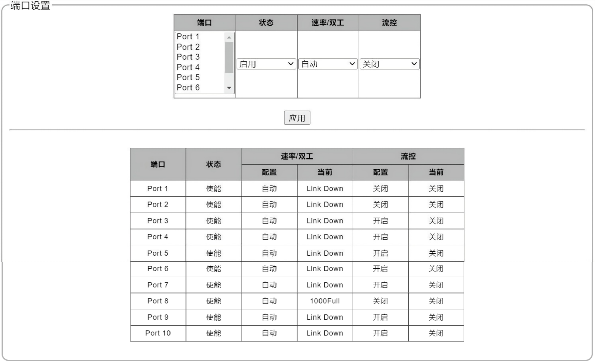

在此页面的上方可以对各端口的“状态”（启用、禁止）、“速率/双工”（自动、10M/HALF、10M/FULL、100M/HALF、100M/FULL）、“流控”（关闭、开启）进行设置，设置完成后点击其下方的“应用”按键保存设置。

此页面下方显示各端口的设置，各端口的设置完成后，可在这里查看。

## 4 配置

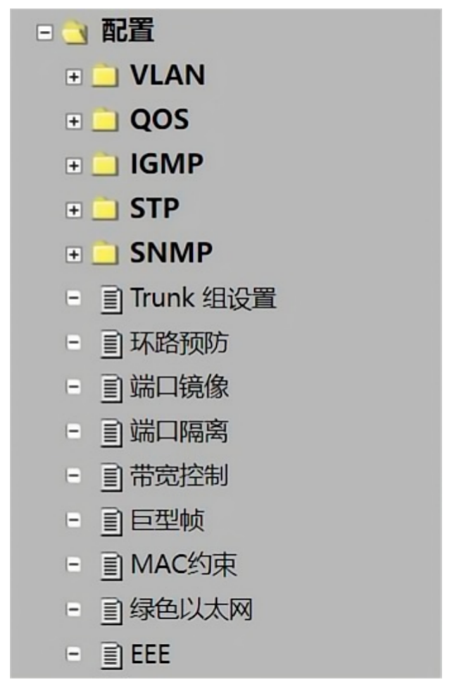

### 4.1 VLAN

### 4.1.1 静态VLAN

在导航栏依次点击“配置”、“VLAN”、“静态VLAN”，打开静态VLAN配置页面，如下图所示：

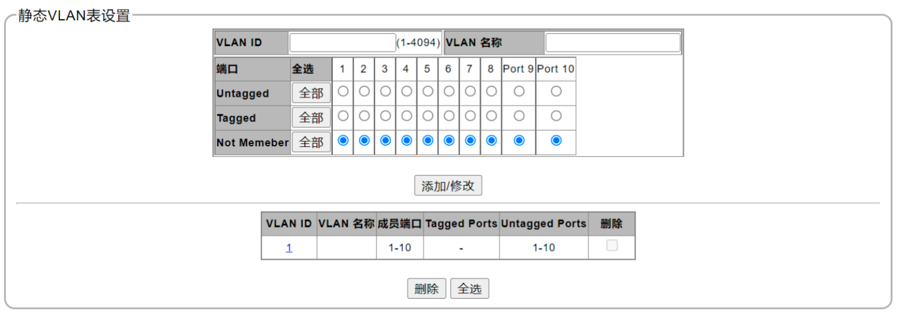

在此页面上部分可以对“静态VLAN”进行设置，设置“VLAN ID”（VLAN ID只能设置为1～4049之间的数字）和“VLAN名称”以及添加到该VLAN的成员端口、Tagged端口和Untagged端口。设置完成后，点击下方的“添加/修改”按键保存设置，即完成VLAN的新建。VLAN ID和VLAN名称不能与已有VLAN ID和VLAN名称相同。

此页面下部分显示已设置完成的VLAN，包括VLAN ID、VLAN名称、成员端口、Tagged Ports、Untagged Port，以及该VLAN的“删除”选项。点击VLAN ID的编码（如“1”），此页面上部分将显示此VLAN的信息，并可对该VLAN的“名称”、“成员端口”、“Tagged Ports”、“Untagged Ports”信息进行修改。修改完成后，点击“添加/修改”按键保存设置。若要删除某个或某些VLAN，点击需要删除的VLAN ID的最后一列的方框“”，选中该VLAN“”，然后点击下方的“删除”按键，即可将选中的VLAN设置删除。若需删除所有建立的VLAN，点击此页面下方的“全选”，然后点击“删除”，则可删除所有建立的VLAN。

注：修改VLAN信息时，VLAN ID无法修改。

### 4.1.2 VLAN设置

在导航栏依次单击“配置”、“VLAN”、“VLAN设置”，打开VLAN设置页面，如下图所示：

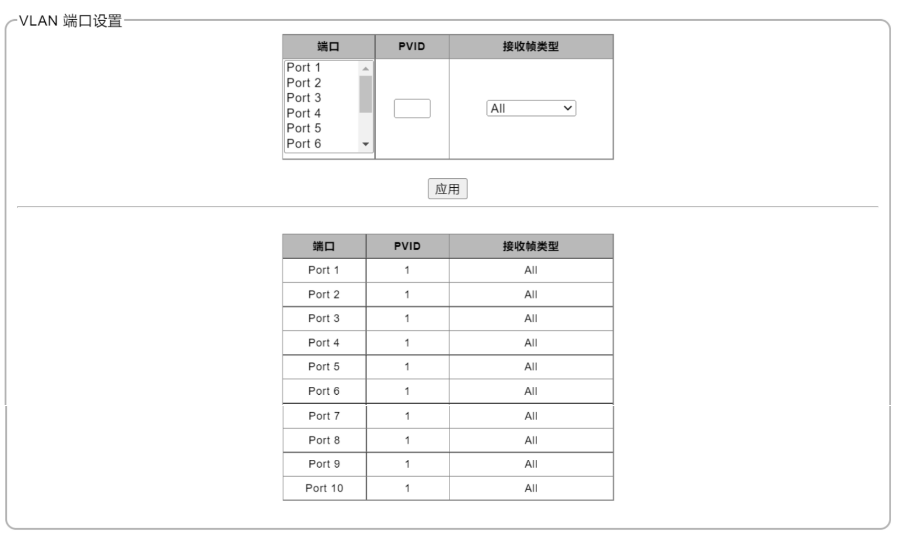

在此页面可以设置各端口所属的PVID的接收帧类型为“ALL”、“Tag-only”或“Untag-only”，设置完成后，点击“应用”按钮完成设置。此页面下方显示的是各端口的设置状态。

### 4.2  QOS

### 4.2.1 优先级选择

在导航栏依次点击“配置”、“QoS”、“优先级选择”，进入优先级选择设置页面：

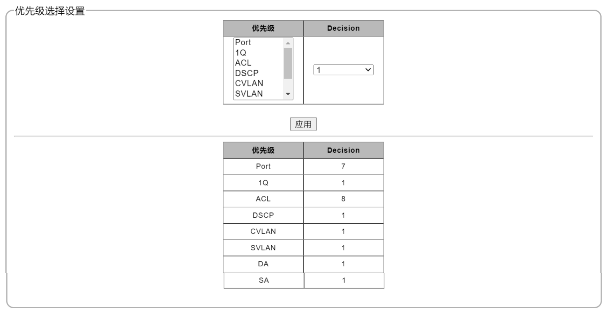

此页面可修改优先级资源的优先顺序，修改完成后，点击“应用”按键完成设置。此页面下方显示优先级资源的优先状态。

### 4.2.2 DSCP重新映射

在导航栏依次点击“配置”、“QoS”、“DSCP重新映射”，打开DSCP重新映射设置页面，如下图所示：

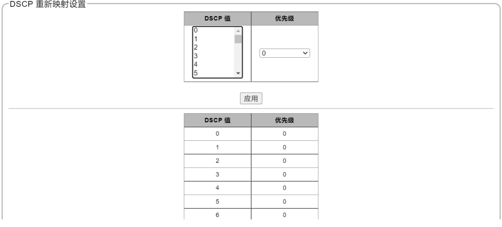

在此页面上方可以对DSCP值的优先级进行设置，选中DSCP值（0~63）后，选择右边的优先级（0,2,4,6）。设置完成后，点击“应用”按键保存设置。此页面下方显示的是DSCP值的优先级。

### 4.2.3 优先级队列

在导航栏依次点击“配置”、“QoS”、“优先级队列”，打开优先级队列ID设置页面如下图：

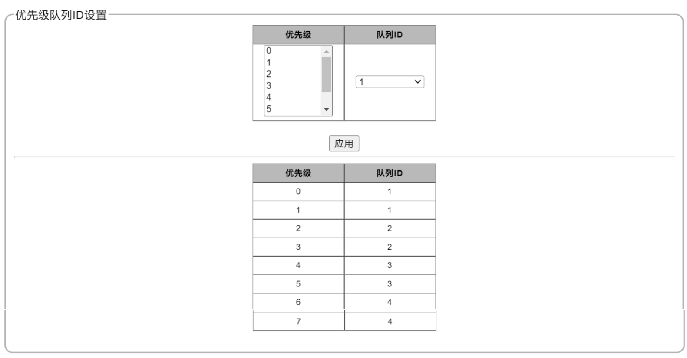

在此页面的上部分可以设置优先级的队列ID序号，选择优先级（0~7），然后选择相应的优先级队列的ID（1~4），设置完成后，点击“应用”按键保存设置。此页面下部分显示优先级的队列ID序号。

### 4.2.4 端口优先级

在导航栏依次点击“配置”、“QoS”、“端口优先级”，打开端口优先级设置页面，如下图所示：

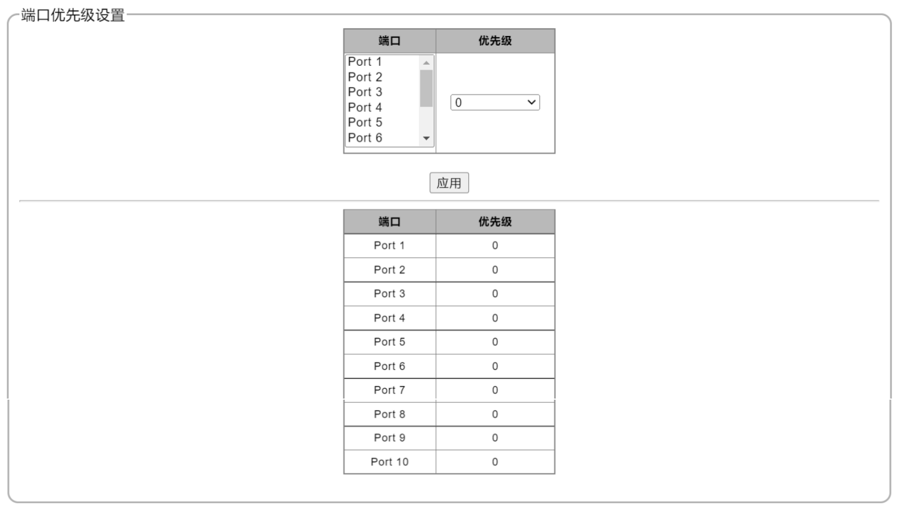

在此页面上部分可以设置各端口的优先级（0、2、4、6），设置完成后，点击“应用”按键保存设置。此页面下部分显示各端口的优先级状态。

### 4.2.5 队列权重

在导航栏依次点击“配置”、“QoS”、“队列权重”，打开队列权重设置页面，如下图所示：

在此页面上部分可以设置优先级队列（1~4）的权重（绝对优先、1、.....、15），设置完成后，点击“应用”按键保存设置。此页面下部分显示优先级队列设置的权重。

### 4.3 IGMP

### 4.3.1 IGMP

在导航栏依次点击“配置”、“IGMP”、子菜单“IGMP”，打开IGMP设置页面，如下图所示：

在此页面可以设置“IGMP使能”，点击“启用”右侧的方框““进行选中，然后点击下面的“应用”启用IGMP。

IGMP使能后，即可对各路由端口的静态参数进行设置（系统自动读取各路由端口的动态参数）：

此页面下方显示的是IGMP转发表项，包含IP地址、端口及对应的VLAN ID信息。

### 4.4 STP

### 4.4.1 全局设置

在导航栏依次点击“配置”、“STP”、“全局设置”，打开STP设置页面：

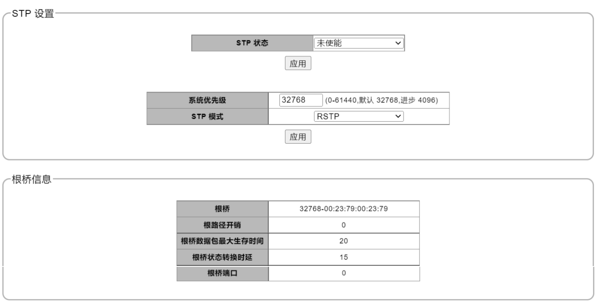

在此页面的上部分可以设置STP的状态，选择“未使能”或“启用”STP，设置完成后，点击下方的“应用”按键保存设置。还可以对系统优先级和STP模式（STP/RSTP）进行设置，设置完成后，点击下方的“应用”按键保存设置。

此页面的下部分显示的是根桥信息。

### 4.4.2 端口设置

在导航栏依次点击“配置”、“STP”、“端口设置”，打开端口设置页面：

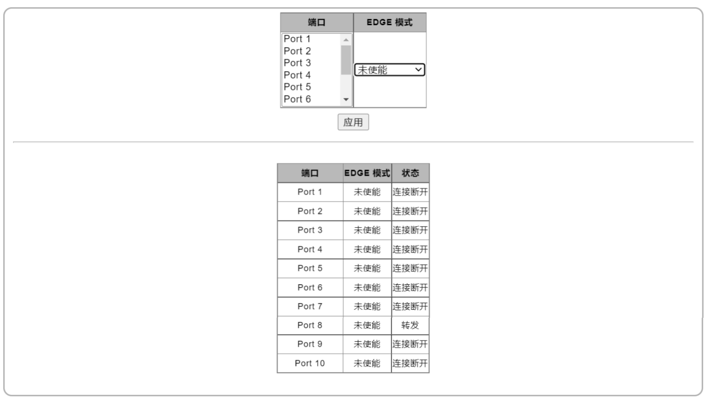

在此页面上部分可以设置各端口的EDGE模式（“未使能”或“边界”），设置完成后，点击下方的“应用”按键保存设置。

此页面下部分显示的是各端口的EDGE模式以及状态信息。

### 4.5 SNMP

### 4.5.1 全局设置

在导航栏依次点击“配置”、“SNMP”、“全局设置”，进入全局设置和Trap设置页面，如下图所示：

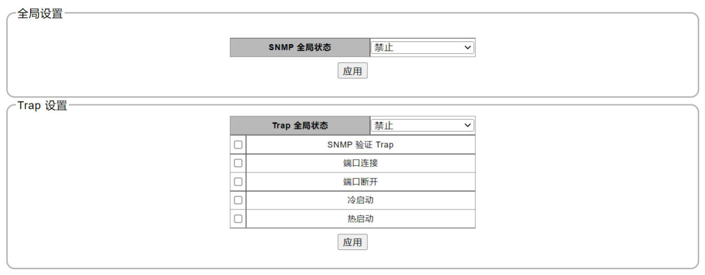

在此页面可以对SNMP全局和SNMP Trap进行设置。在此页面上方的框中，可以对SNMP全局状态进行“禁止”或“启用”设置，设置完成后，点击此框内下方的“应用”按键保存设置。

在此页面下方的框中，可以对Trap全局状态进行“禁止”或“启用”设置，以及下方功能是否开启。设置完成后，点击该框内下方的“应用”按键保存设置。

### 4.5.2 SNMP共同体

在导航栏依次点击“配置”、“SNMP”、“SNMP共同体”，打开SNMP共同体配置页面，如下图所示：

在此页面，可以对SNMP共同体配置进行设置。“访问权限”可设置为“Read Write”或“Read Only”，并可设置共同体的名称。设置完成后，点击下方的“应用”按钮保存设置。 设置保存后，此页面的下方部分将显示修改后的SNMP共同体的访问权限及共同体名称。

### 4.5.3 SNMP主机设置

在导航栏依次点击“配置”、“SNMP”、“SNMP主机设置”，打开SNMP主机设置页面，如下图所示：

在此页面可以对“IPv4地址”、“基于用户的安全模型”（SNMPv1、SNMPv2c）、“共同体字符串”进行设置，设置完成后，点击下方的“应用”按键保存设置。

### 4.6 Trunk组设置

在导航栏依次点击“配置”、“Trunk组设置”，打开Trunk组的设置页面，如下图所示：

在此页面可以对Trunk组进行设置，在页面上部分先选择Trunk组ID，然后选择相应的端口，选择完成后，点击下方的“添加/修改”按键保存设置。保存后，页面下方显示Trunk组设置的端口情况。在此页面下部分可以删除相应的Trunk组，在“选择”下方勾选相应的Trunk组，然后点击下方的“删除”，便可删除选中的Trunk组。此页面下方可以将所有的Trunk组删除，先点击下方的“全选”选中所有的Trunk组，然后点击左侧的“删除”，即可删除所有的Trunk组。

### 4.7 环路预防

在导航栏依次点击“配置”、“环路预防”，打开环路预防设置页面，如下图所示：

在此页面可以对环路预防进行设置，“环路功能”（关闭、环路预防、环路检测）、“时间间隔”（1~32767秒）、“恢复时间”（0或4~1000000秒），设置完成后，点击下方的“应用”按键保存设置。

### 4.8 端口镜像

在导航栏依次点击“配置”、“端口镜像”，打开端口镜像设置页面，如下图所示：

在此页面可以设置端口镜像。“镜像方向”下拉窗口可选择“禁止”、“接收”、“发送”、“接收和发送”，“镜像端口”下拉窗口可选择各端口，“被镜像端口列表”下拉窗口可选择各端口，镜像端口和被镜像端口不能是同一端口。设置完成后，点击下方的“应用”按键保存设置。设置完成后，此页面下方显示端口镜像的状态信息，点击下方的“删除”按键，可将端口的镜像设置删除。

### 4.9 端口隔离

在导航栏依次点击“配置”、“端口隔离”，打开端口隔离设置页面，如下图所示：

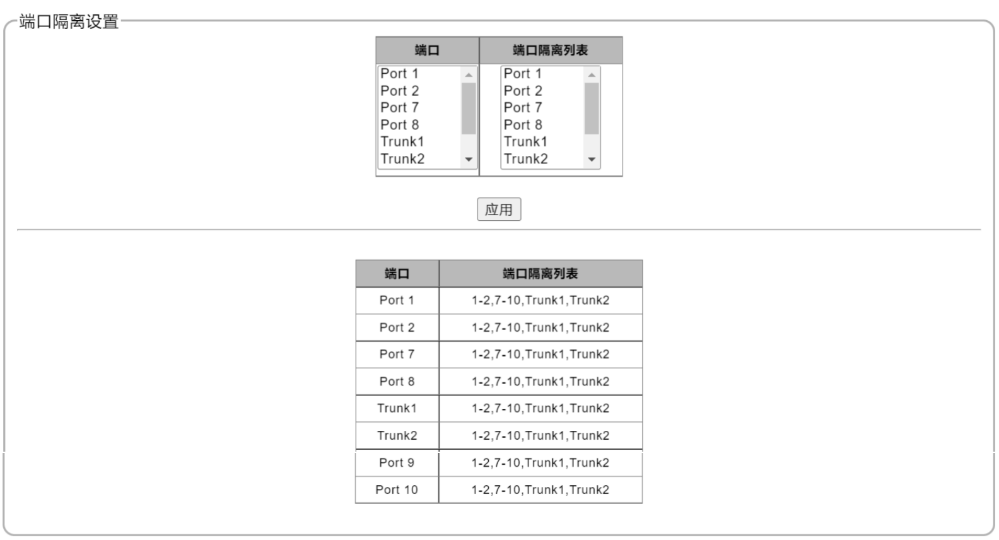

在此页面可以设置各端口隔离，设置好后点击下方的“应用”按钮保存设置。设置完成后，此页面下方显示的是所设置的隔离端口和端口隔离列表。可通过重新选择修改端口隔离列表信息。

### 4.10 带宽控制

在导航栏依次点击“配置”、“带宽控制”，打开带宽控制的设置页面，如下图所示：

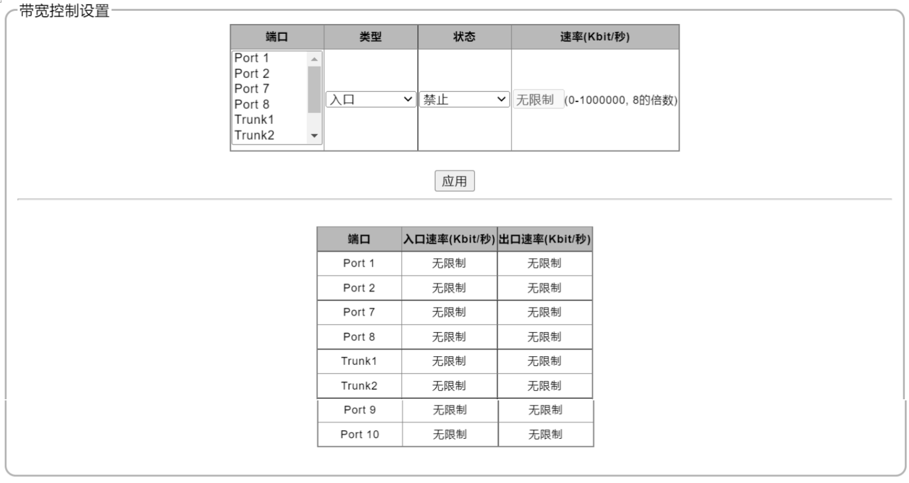

此页面可以对各端口的出口和入口的状态和速率进行设置。在“端口”列选择需要设置的端口，在“类型”列选择入口/出口，以及在“状态”列选择禁止/启用，并在“速率（Kbit/秒）”列中按照括号内的要求输入需要设定的速率。设置完成后，点击下面的“应用”按钮保存设置。设置完成后，在此页面的下部分可以查看到端口的带宽设置情况。

### 4.11 巨型帧

在导航栏依次点击“配置”、“巨型帧”，打开巨型帧设置页面，如下图所示：

在此页面可以对设备的巨型帧进行设置，在巨型帧右侧的下拉框中选择所需的巨型帧数值（1522，1536，1552，16367），选择好后，点击下方的“应用”按键保存设置。

### 4.12  MAC约束

在导航栏依次点击“配置”、“MAC约束”，打开MAC约束设置页面，如下图所示：

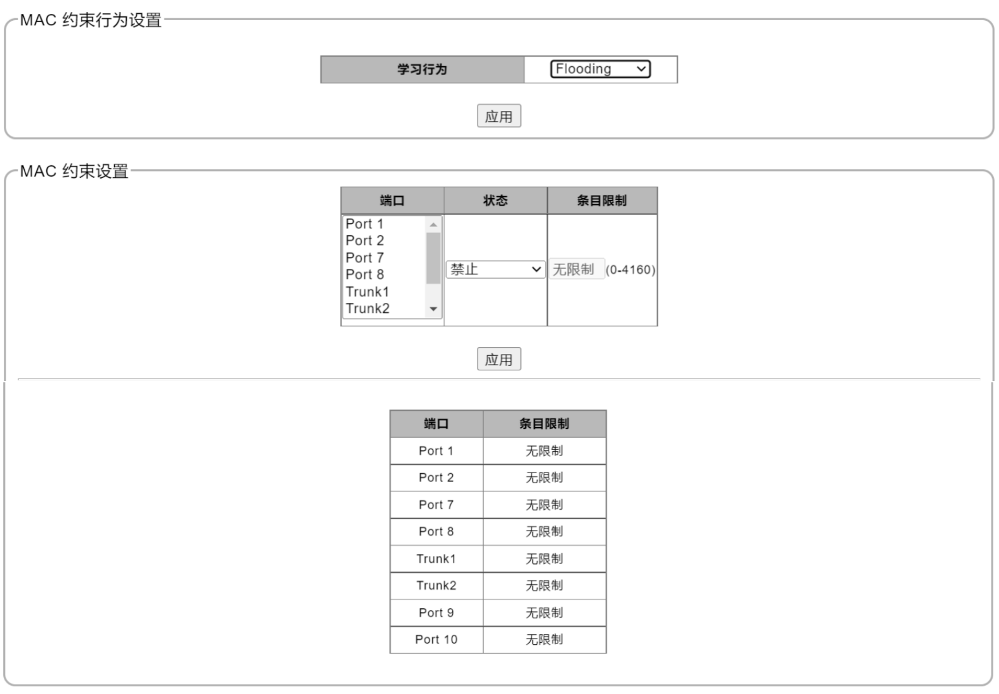

在此页面可以设置MAC约束行为以及MAC约束。在此页面上方框中，在“学习行为”右侧的下拉框中选择MAC的约束行为“Drop”或“Flooding”，选择好后点击下方的“应用”按钮保存设置。 在此页面的下方方框内，可以设置MAC约束，先选择相应的端口或Trunk组，然后选择状态（禁止或启用），再在条目限制栏下输入需要设置的数值。设置好后，点击下方的“应用”按钮保存设置。下方方框的下部分显示的是各端口或Trunk组的条目限制设置情况。

### 4.13 绿色以太网

在导航栏依次点击“配置”、“绿色以太网”，打开绿色以太网的设置页面，如下图所示：

在此页面可以设置绿色以太网的开启和禁用。在“绿色以太网”右侧的下拉框中选择“禁止”或“启用”。选择后，点击下方的“应用”按键保存设置。

### 4.14 EEE

在导航栏依次点击“配置”、“EEE”，打开EEE设置页面，如下图所示：

在此页面可以设置EEE功能。在“EEE功能”右侧的下拉框中选择“禁止”或“启用”。选择后，点击下方的“应用”按键保存设置。

## 5 安全

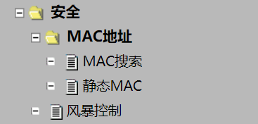

### 5.1 MAC地址

### 5.1.1 MAC搜索

在导航栏依次点击“安全”、“MAC地址”、“MAC搜索”，打开MAC地址搜索页面，如下图所示：

在此页面可以根据MAC地址和VLAN ID搜索MAC条目，在左侧“MAC地址”下的框内输入MAC地址，在右侧的“VLAN ID”下输入VLAN ID序号，然后点击下方的“搜索”按钮进行搜索。下方显示搜索结果，包括MAC地址与VLAN ID所对应的端口及其类型。

### 5.1.2 静态MAC

在导航栏依次点击“安全”、“MAC地址”、“静态MAC”，打开静态MAC设置页面，如下图所示：

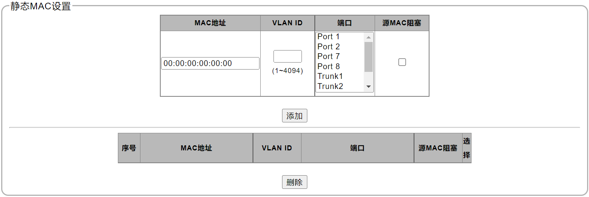

在此页面的上部分可以设置静态MAC。在“MAC地址”栏输入相应的MAC地址，在“VLAN ID”栏输入相应的VLAN ID号，在“端口”栏选择相应的端口或Trunk组，并选择是否勾选相应的“源MAC阻塞”，输入或选择完成后，点击下方的“添加”按钮添加静态MAC。 此页面的下部分显示已设置好的静态MAC信息。勾选相应的“选择”栏后，点击下方的“删除”按钮可以删除相应的MAC信息条目。

### 5.2 风暴控制

在导航栏依次点击“安全”、“风暴控制”，打开风暴控制设置页面，如下图所示：

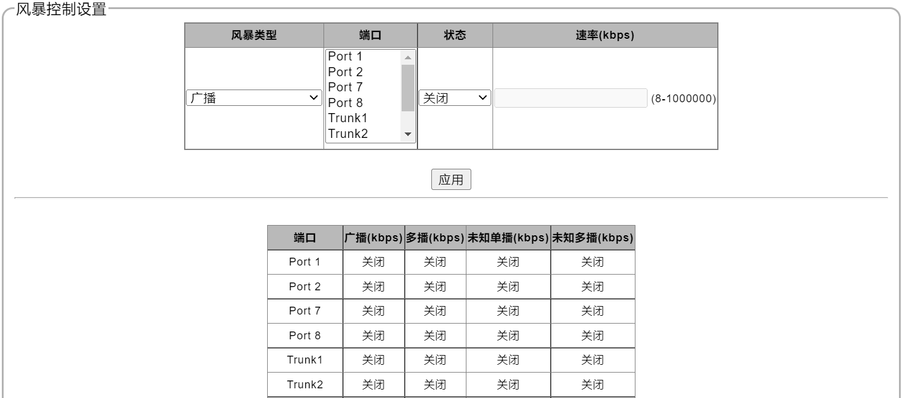

在此页面可以对风暴控制进行设置。在“风暴类型”栏的下拉框中选择相应的风暴类型（广播、多播、未知单播、未知多播），在“端口”栏选择相应的端口或Trunk组，在“状态”栏选择关闭或启用，在“速率（kbps）”栏的方框中输入需要限制的速率，设置好后，点击下方的“应用”按钮保存设置。

此页面的下部分显示的是各端口或Trunk组的风暴控制设置情况。

## 6 监控

### 6.1. 端口统计

在导航栏依次点击“监控”、“端口统计”，打开各端口和Trunk组的统计页面，如下图所示。

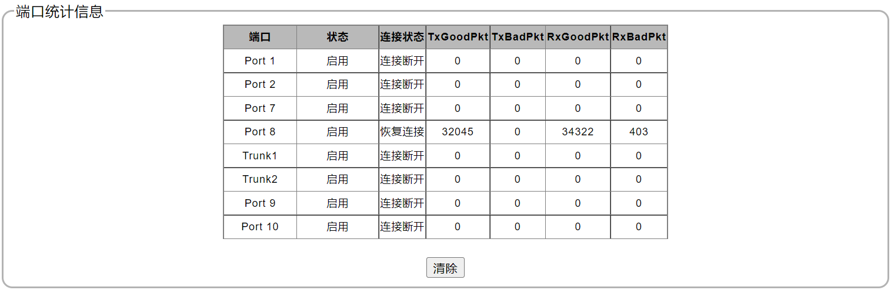

此页面显示的是端口统计信息，包括各端口和Trunk组的状态、连接状态、TxGoodPkt（正常发送包）、TxBadPkt（发送错误包）、RxGoodPkt（正常接收包）、RxBadPkt（接收错误包）。

### 6.2 电缆诊断

在导航栏依次点击“监控”、“电缆诊断”，打开电缆诊断页面，如下图所示：

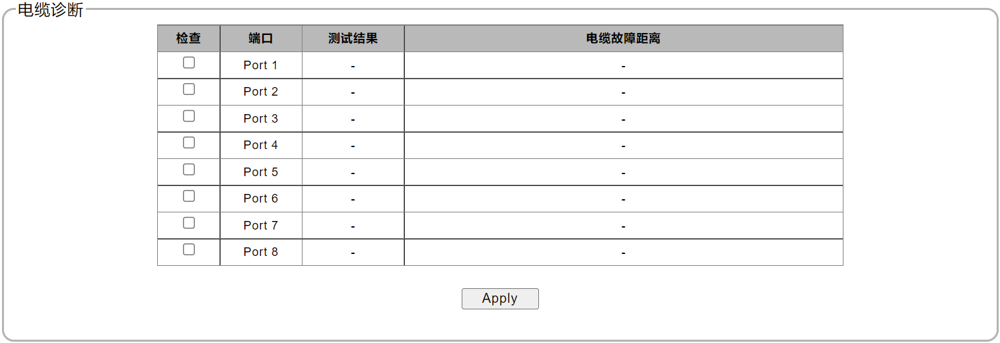

在此页面可诊断各个电口的故障。勾选需要诊断的电口，然后点击下方的“Apply”按钮开始诊断，诊断完成后，上方将显示故障的测试结果和电缆故障距离。

## 7 工具

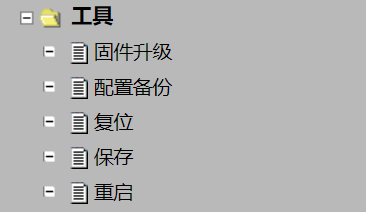

### 7.1 固件升级

在导航栏依次点击“工具”、“固件升级”，进入设备的固件升级页面，如下图所示：

如需对固件进行升级，在此页面点击“进入加载模式”进入固件升级模式，页面将进入如下图所示界面：

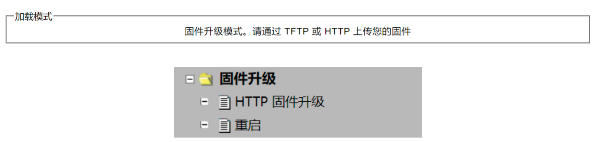

点击左侧导航栏的“固件升级”下的“HTTP固件升级”，进入HTTP固件升级页面，如下图所示：

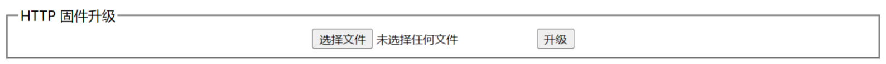

点击“选择文件”后，打开升级文件所在的文件夹，选择升级文件，然后点击此页面的“升级”，设备即进行升级。设备升级完成后，点击左侧导航栏“固件升级”下的“重启”，进入重启页面：

点击此页面的“重启”按键，等待设备重启。

### 7.2 配置备份

在导航栏依次点击“工具”、“配置备份”，进入设备的HTTP配置备份页面：

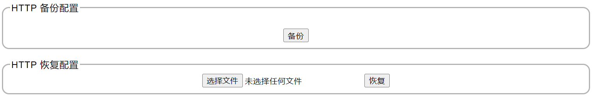

在此页面的上部分，点击框中的“备份”，可将设备的当前配置进行备份。

在此页面的下部分，点击框中的“选择文件”可选择设备之前保存的配置备份，然后点击右侧的“恢复”，可将设备的配置恢复到所需的备份版本。

### 7.3 复位

在导航栏依次点击“工具”、“复位”，打开恢复设备配置页面，如下图所示：

在此页面可将设备恢复出厂设置，点击框内的“恢复出厂默认值”按键恢复出厂设置，恢复出厂设置完成后点击“工具”--“重启”重新启动系统。

### 7.4 保存

在导航栏依次点击“工具”、“保存”，保存设备所作配置，即打开设备更新配置保存页面，如下图所示：

页面显示配置保存成功（点击此导航栏即是保存配置）。设备配置完成后，需点击“保存”以保存配置，否则所作配置均无法生效。

### 7.5 重启

在导航栏依次点击“工具”、“重启”，打开设备重启页面，如下图所示：

在此页面，点击框内的“重启”按键可以重启设备。
