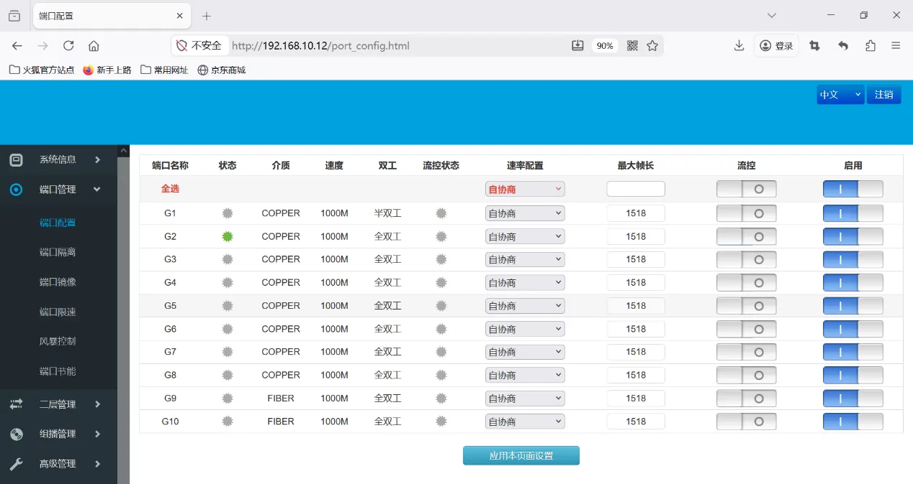
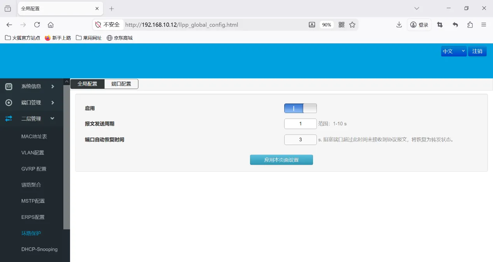

# ISM5010D环网配置指导手册

## 一、文档信息

- 文档名称：交换机组环配置手册
- 产品型号：**ISM5010D**
- 适用场景：设备组网
- 编写日期：2026年03月25日

## 二、设备概述

### 2.1 产品简介

映翰通ISM5010D是一款**网管型工业以太网交换机**，主要功能是搭建可靠、可管理的工业数据通信网络。它具备**8个千兆电口和2个千兆光口**，支持冗余电源、宽温工作（-40℃至+75℃）和无风扇散热，适用于风力发电、智能制造等严苛环境下的网络连接。

### 2.2 主要功能

- 设备环网
- 宽温工业级设计

### 2.3 典型应用拓扑

设备 → 以太网 → 储能控制器 → 以太网 → 服务器

## 三、硬件说明

### 3.1 外观与接口

- 电源接口：DC 12–48V
- 接口：2光8电
- 指示灯：PWR、RUN、网口指示灯
- 复位键：恢复出厂设置

### 3.2 接线说明

#### 3.2.1 电源接线

- 正极：V+
- 负极：V-
- 注意：防反接、防雷、接地

#### 3.2.2 以太网接线

直连 / 交叉自适应，建议超五类及以上网线。

## 四、出厂默认参数

- 默认 IP：192.168.10.12
- 子网掩码：255.255.255.0
- Web 用户名：admin
- Web 密码：admin

## 五、前期准备

- 电脑设置与网关同网段 IP
- 网线连接电脑与网关 LAN 口
- 交换机上电，等待 RUN 灯常亮
- 浏览器输入设备 IP 进入配置页面

## 六、网络配置

### 6.1 快速生成树配置

端口配置

开启环路保护

## 七、配置备份与恢复

- 导出配置文件
- 恢复出厂配置

## 八、状态监控与诊断

### 8.1 运行状态

- 设备在线状态

### 8.2 日志查看

- 系统日志

## 九、常见问题与排查

### 9.1 无法打开 Web

- 无法打开 Web
  - 检查网段、网线、IP 是否冲突
  - 复位交换机重试

## 十、安全注意事项

- 工业现场可靠接地
- 配置完成后备份
- 远程密码定期修改
- 禁止非授权人员操作
