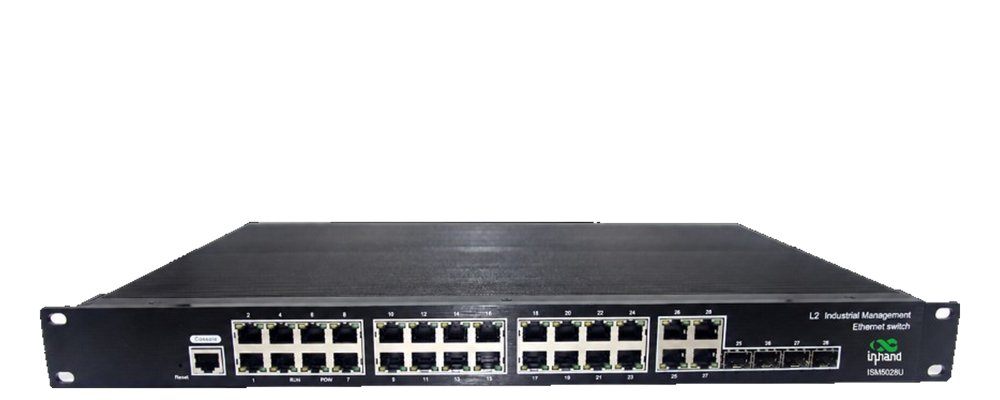
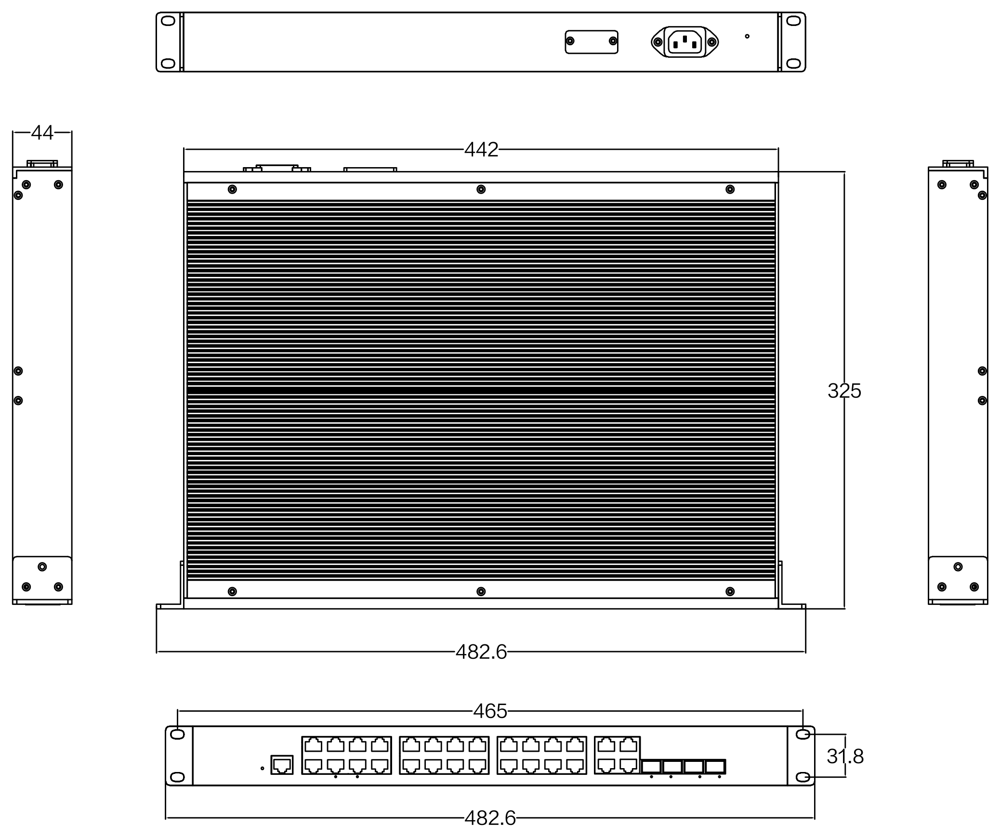

  
  

    

      网管型工业交换机
    

    

      ISM5028U-S
    

    <table style="margin: 56px auto 0 auto; border-collapse: separate; border-spacing: 12px; width: auto;">
      <tr>
        <td style="width: 200px; background-color: #4CAF50; color: #fff; padding: 8px 16px; border-radius: 16px; font-size: 16px; text-align: center; white-space: nowrap;">机架安装</td>
        <td style="width: 200px; background-color: #4CAF50; color: #fff; padding: 8px 16px; border-radius: 16px; font-size: 16px; text-align: center; white-space: nowrap;">无风扇</td>
      </tr>
      <tr>
        <td style="width: 200px; background-color: #4CAF50; color: #fff; padding: 8px 16px; border-radius: 16px; font-size: 16px; text-align: center; white-space: nowrap;">IP40</td>
        <td style="width: 200px; background-color: #4CAF50; color: #fff; padding: 8px 16px; border-radius: 16px; font-size: 16px; text-align: center; white-space: nowrap;">双电源</td>
      </tr>
    </table>
  

  

    
  

# 1. 产品概述

**ISM5028U-S 专为工厂自动化、智能交通、视频监控及其他工业应用领域设计。**

ISM5028U-S-4GC-24GT-HV-HV 是 4 路复用千兆光口 + 24 路千兆电口的网管型工业以太网交换机，支持 24 个 10/100/1000Base-T(X) 电口和 4 个 1000Base-X SFP 复用光口。光口兼容千兆/百兆，光模块需另行选配。产品符合 FCC、CE、RoHS 标准，支持工业现场所需的以太网二层协议，保证通信网络的稳定性。该系列交换机采用低功耗、无风扇设计，具有 -40℃ ~ +70℃ 的宽工作温度范围和良好的 EMC 电磁兼容性能，能适应恶劣工业环境。机架式安装特性、宽温操作、双电源输入及 IP40 防护等级的金属外壳与 LED 指示灯，使 ISM5028U-S 成为一款可靠的工业级设备，为工厂自动化、智能交通、视频监控等应用组建快速稳定的网络终端接入提供安全可靠的解决方案。

**产品特点：**

- **坚固设计：** 铝合金金属外壳，无风扇自然冷却，IP40 防护等级。
- **宽域适应：** 宽温（-40 ~ +70℃），AC 100-240 V / DC 36-72 V 双电源输入。
- **国际标准：** 符合 FCC、CE、RoHS 标准，EMS 各项达 Level 3，具备出色的电磁兼容性。
- **全千兆接入：** 24 个千兆自适应电口 + 4 个复用千兆 SFP 光口，光口兼容千兆/百兆。
- **网络冗余：** 支持 STP/RSTP/MSTP 与工业环网协议 ERPS，保障链路可靠性。
- **灵活组网：** 支持基于端口的 VLAN 与 IEEE 802.1Q VLAN，支持 IGMP Snooping。
- **便捷运维：** 支持 Web、CLI、SNMP v1/v2c/v3 管理，支持机架式安装，平均无故障时间 300,000 小时。

## 核心技术参数

| 参数 | 规格 |
|-----------|---------------|
| 类型 | 二层网管型工业以太网交换机 |
| 端口 | 24 × 10/100/1000Base-T(X) 自适应 RJ45 端口 + 4 × 1000Base-X SFP 复用光口 |
| 交换性能 | 256 Gbps 背板带宽，131 Mpps，8K MAC |
| 尺寸 / 重量 | 442 × 325 × 44 mm / 3.12 kg |
| 电源 | AC 100-240 V / DC 36-72 V，双电源，< 45 W |
| 环境 | 工作温度 -40 至 +70 ℃，IP40 |
| 电磁兼容 | EN61000-4-2/3/4/5/6 Level 3；EMI：FCC Part 15、CISPR (EN55032) Class A |

# 2. 产品尺寸

  

    
    
ISM5028U-S

  

  

    
注意：

    
1. 所有尺寸单位为毫米（mm）。

    
2. 所有尺寸均为近似值，仅供参考。

    
3. 图示尺寸不得用于生产加工。

    
4. 尺寸需符合零件及制造公差要求。

    
5. 尺寸如有变更，恕不另行通知。

  

# 3. 硬件规格

| 类别/参数 | 规格 |
|----------------------|---------------|
| **物理性能** | |
| 外壳 | 铝合金金属外壳，IP40 防护等级 |
| 尺寸 (W × D × H) | 442 mm × 325 mm × 44 mm |
| 重量 | 3.12 kg |
| 安装方式 | 机架式安装 |
| 散热方式 | 自然冷却，无风扇 |
| 防护等级 | IP40 |
| 存储温度 | -40 °C ~ +85 °C |
| 工作温度 | -40 °C ~ +70 °C |
| 湿度 | 5 ~ 95%（无凝露） |
| **接口** | |
| 电口 | 24 × RJ45 |
| RJ45 端口 | 10/100/1000Base-T(X) 自动侦测，全/半双工，MDI/MDI-X 自适应 |
| 光口 | 4 × 1000Base-X（SFP 复用 Combo 接口，兼容千兆/百兆） |
| Console | 1 × RJ45 Console 管理口 |
| LED 指示灯 | 电源指示灯（PWR）、接口指示灯（电口、光口 Link/ACT） |
| **硬件性能** | |
| 背板带宽 | 256 Gbps |
| 包转发率 | 131 Mpps |
| MAC 地址表 | 8K |
| 包缓存区大小 | 16 Mbit |
| VLAN ID | 1 ~ 4096 |
| 组播组数 | 512 |
| 交换延迟 | <5 μs |
| **以太网标准** | |
| 以太网 | IEEE 802.3-10BaseT、IEEE 802.3u-100BaseTX/100Base-FX、IEEE 802.3x-Flow Control、IEEE 802.3z-1000BaseLX、IEEE 802.3ab-1000BaseTX |
| 链路发现 | IEEE 802.1ab（LLDP） |
| 生成树 | IEEE 802.1D-STP、IEEE 802.1w-RSTP |
| VLAN 与优先级 | IEEE 802.1Q-VLAN Tagging、IEEE 802.1p-Class of Service |
| 端口认证 | IEEE 802.1X-Port Based Network Access Control |
| **电源参数** | |
| 工作电压 | AC 100-240 V / DC 36-72 V |
| 电源冗余 | 双电源（HV-HV） |
| 接入端子 | AC 电源插座 |
| 功耗 | < 45 W |
| 过流保护 | 支持，内置 4.0 A 保护 |
| 反极性保护 | 支持 |
| **电磁特性** | |
| EMI | FCC Part 15；CISPR (EN55032) Class A |
| EMS | EN61000-4-2 (ESD), Level 3   EN61000-4-3 (RS), Level 3   EN61000-4-4 (EFT), Level 3   EN61000-4-5 (Surge), Level 3   EN61000-4-6 (CS), Level 3 |
| **机械环境** | |
| 冲击 | IEC 60068-2-27 |
| 自由落体 | IEC 60068-2-32 |
| 震动 | IEC 60068-2-6 |
| **质量保证** | |
| 质保期 | 5 年 |
| MTBF | 300,000 小时 |

# 4. 软件规格

| 类别/参数 | 规格 |
|----------------------|---------------|
| **冗余** | |
| 环网协议 | STP / RSTP / MSTP |
| 工业环网 | ERPS |
| **VLAN** | |
| VLAN | 基于端口的 VLAN、IEEE 802.1Q VLAN |
| **QoS** | |
| 优先级与队列 | IEEE 802.1p/1Q、TOS/DiffServ |
| 端口限速 | 支持 |
| 端口汇聚 | 支持 |
| 端口流控 | 支持 |
| **组播** | |
| 组播过滤 | IGMP Snooping |
| **风暴抑制** | |
| 风暴抑制 | 广播风暴抑制、组播风暴抑制、未知单播风暴抑制 |
| **网络安全** | |
| 认证 | IEEE 802.1X、HTTP |
| 访问控制 | ACL 访问控制列表 |
| 地址绑定 | MAC 地址绑定 |
| **网络管理** | |
| 管理方式 | Web、CLI（Console）、Telnet |
| SNMP | SNMP v1 / v2c / v3 |
| 网络监控 | RMON |
| **诊断** | |
| 诊断方式 | 指示灯、日志管理、接口状态监控 |

# 5. 订购指南

| 型号 | 描述 |
|-------|--------|
| ISM5028U-S-4GC-24GT-HV-HV | 4 复用千兆光口 + 24 千兆自适应电口，SFP 接口（不含光模块）。IP40 防护等级，机架式安装，工作温度 -40°C 至 +70°C。DC 36-72 V 与 AC/DC 110-240 V 冗余双电源输入。 |

# 6. 联系我们

- **官网：** [映翰通官网](https://www.inhand.com.cn)
- **版权声明：** ©映翰通网络 保留所有权利
