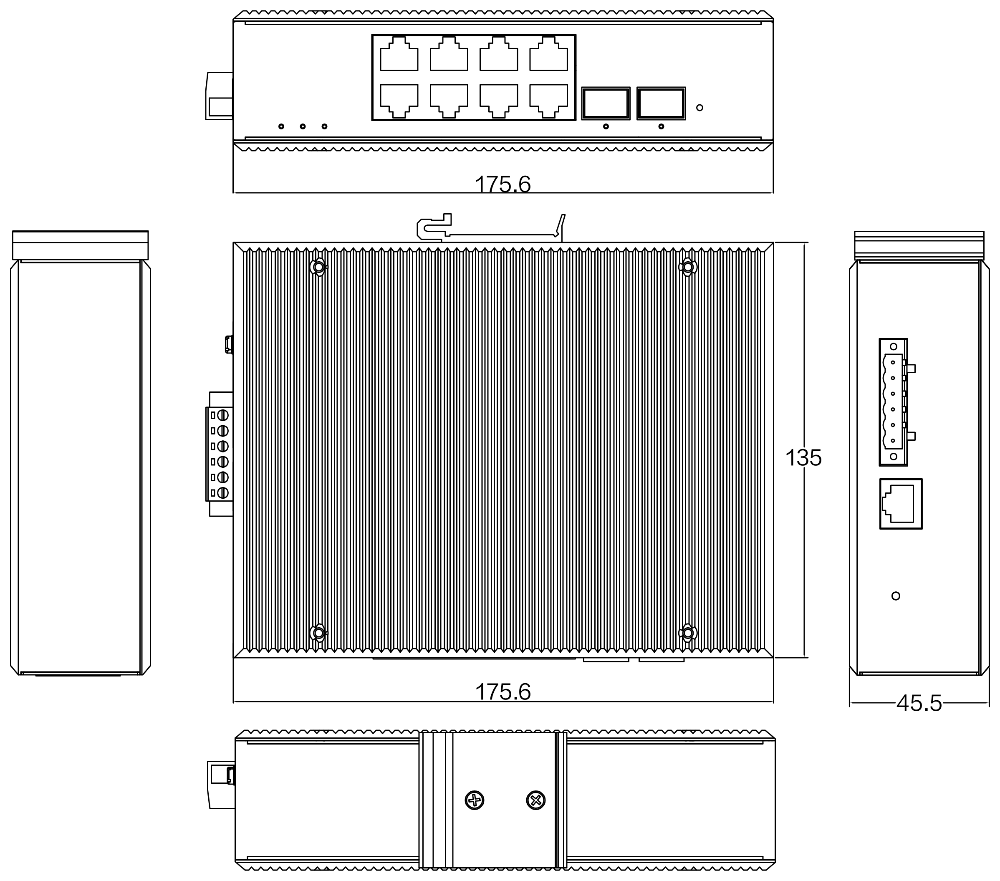

  

    

      
    

    

      简单、高可靠的网络通讯系统
    

  

  

    

      ISM7010D 网管型工业以太网交换机
    

    

      

        
· 网管型

        
· 导轨安装

      

      

        
· 无风扇

        
· IP40

      

    

  

# 1. 产品概述

**ISM7010D 专为工厂自动化、智能交通、视频监控及其他工业应用领域设计。**

ISM7010D-S-2GSFP-8GT-24 是网管型工业以太网交换机，产品符合 FCC、CE、ROHS 标准。支持 2 个千兆光口和 8 个千兆电口，并支持 1 路 Console 口；支持工业现场所需的以太网二层协议，保证通信网络的稳定性。该系列交换机采用低功耗、无风扇设计，确保无噪声干扰，同时支持 -40 \~ +85℃ 工作温度和良好的 EMC 电磁兼容性能，保证在恶劣的工业环境中保持稳定的工作，为工厂自动化、智能交通、视频监控等工业应用领域组建快速稳定的网络终端接入网络提供安全可靠的解决方案。

**产品特点：**

- **坚固设计：** 金属外壳，无风扇自然冷却，IP40 防护等级。
- **超宽温域：** 宽温（-40 \~ +85℃）、宽压（DC 12-52V）设计，支持双电源冗余备份。
- **高速转发：** 76 Gbps 背板带宽，交换延迟 < 5 μs，满足实时性要求。
- **快速自愈：** 支持 ERPS 环网技术，自愈时间 < 20 ms，兼容 ITU-T G.8032。
- **三层能力：** 支持静态路由与 IPv4/IPv6 双栈，支持 IEEE 1588 时钟同步。
- **安全管理：** 支持 ACL 访问控制列表、IEEE 802.1X、RADIUS、用户分级管理。
- **告警联动：** 支持电源异常状态继电器输出，便于现场快速响应。

## 核心技术参数

| 参数 | 规格 |
|-----------|---------------|
| 类型 | 二层网管型工业以太网交换机 |
| 端口 | 2 × 1000Base-X 光口（SFP）+ 8 × 10/100/1000BaseT(X) 电口 + 1 × Console |
| 交换性能 | 76 Gbps 背板带宽，存储转发，8K MAC |
| 尺寸 / 重量 | 175.6 × 135 × 45.5 mm / 1 kg |
| 电源 | DC 12-52 V，双电源冗余备份，< 10 W |
| 环境 | 工作温度 -40 至 +85 ℃，IP40 |
| 电磁兼容 | EN61000-4-2/3/4/5/6 Level 3；EMI：FCC Part 15、CISPR (EN55032) Class A |
| 认证 | CE、FCC、ROHS |

# 2. 产品尺寸

  

    
    
ISM7010D

  

  

    
注意：

    
1. 所有尺寸单位为毫米（mm）。

    
2. 所有尺寸均为近似值，仅供参考。

    
3. 图示尺寸不得用于生产加工。

    
4. 尺寸需符合零件及制造公差要求。

    
5. 尺寸如有变更，恕不另行通知。

  

# 3. 硬件规格

| 类别/参数 | 规格 |
|----------------------|---------------|
| **物理性能** | |
| 外壳 | 金属外壳，IP40 防护等级 |
| 尺寸 (W × D × H) | 175.6 mm × 135 mm × 45.5 mm |
| 重量 | 1 kg |
| 安装方式 | DIN 导轨式、壁挂式安装 |
| 散热方式 | 自然冷却，无风扇 |
| 防护等级 | IP40 |
| 存储温度 | -40 °C \~ +85 °C |
| 工作温度 | -40 °C \~ +85 °C |
| 湿度 | 5 \~ 95%（无凝露） |
| **接口** | |
| 端口 | 8 × RJ45 + 2 × 光纤接口 |
| RJ45 端口 | 10/100/1000M 自动侦测，全/半双工，MDI/MDI-X 自适应 |
| 光纤端口 | 1000Base-FX 端口（SFP 插槽），支持百兆，支持主板光口扩展 2.5G |
| 管理端口 | 1 × Console 口 |
| LED 指示灯 | 电源指示灯（PWR）、接口指示灯（电口、光口 Link/ACT） |
| **硬件性能** | |
| 处理方式 | 存储转发 |
| 背板带宽 | 76 Gbps |
| 包缓存区大小 | 16 Mbit |
| MAC 地址表 | 8K |
| 交换延迟 | < 5 μs |
| **以太网标准** | |
| 以太网 | IEEE 802.3-10BaseT、IEEE 802.3u-100BaseTX/100Base-FX、IEEE 802.3x-Flow Control、IEEE 802.3z-1000BaseLX、IEEE 802.3ab-1000BaseTX |
| 链路发现 | IEEE 802.1ab（LLDP） |
| 生成树 | IEEE 802.1D-STP、IEEE 802.1w-RSTP |
| 环网 | ITU-T G.8032（ERPS） |
| VLAN 与优先级 | IEEE 802.1Q-VLAN Tagging、IEEE 802.1p-Class of Service |
| 端口认证 | IEEE 802.1X-Port Based Network Access Control |
| **电源参数** | |
| 工作电压 | DC 12-52 V（双电源冗余备份） |
| 接入端子 | 凤凰端子 |
| 功耗 | < 10 W |
| 过流保护 | 支持，内置 4.0 A 保护 |
| 反极性保护 | 支持 |
| **电磁特性** | |
| EMI | FCC Part 15；CISPR (EN55032) Class A |
| EMS | EN61000-4-2 (ESD), Level 3   EN61000-4-3 (RS), Level 3   EN61000-4-4 (EFT), Level 3   EN61000-4-5 (Surge), Level 3   EN61000-4-6 (CS), Level 3 |
| **机械环境** | |
| 冲击 | IEC 60068-2-27 |
| 自由落体 | IEC 60068-2-32 |
| 震动 | IEC 60068-2-6 |
| **认证** | |
| 认证 | CE、FCC、ROHS |
| **质量保证** | |
| 质保期 | 5 年 |
| MTBF | 300,000 小时 |

# 4. 软件规格

| 类别/参数 | 规格 |
|----------------------|---------------|
| **冗余** | |
| 工业环网 | ERPS 环网技术，自愈时间 < 20 ms |
| 环网协议 | STP / RSTP / MSTP |
| **VLAN** | |
| VLAN | 基于端口的 VLAN、IEEE 802.1Q VLAN、GVRP |
| **QoS** | |
| 优先级与队列 | IEEE 802.1p/1Q、TOS/DiffServ |
| 端口限速 | 支持 |
| 端口汇聚 | 支持 |
| 端口流控 | 支持 |
| **组播** | |
| 组播协议 | IGMP v1/v2/v3、IGMP Snooping |
| 静态组播 | 支持 |
| **路由** | |
| IP 路由 | 静态路由 |
| 协议栈 | IPv4 / IPv6 |
| **风暴抑制** | |
| 风暴抑制 | 广播风暴抑制、组播风暴抑制、未知单播风暴抑制 |
| **网络安全** | |
| 认证 | IEEE 802.1X、RADIUS、HTTP |
| 访问控制 | ACL 访问控制列表 |
| 用户管理 | 用户分级管理 |
| 地址绑定 | MAC 地址绑定 |
| **网络管理** | |
| 管理方式 | Web、CLI（Console） |
| SNMP | SNMP v1 / v2 / v3 |
| 时间同步 | IEEE 1588 时钟协议 |
| 网络监控 | RMON |
| **诊断** | |
| 诊断方式 | 指示灯、日志管理、端口镜像、接口状态监控 |

# 5. 订购指南

| 型号 | 描述 |
|-------|--------|
| ISM7010D-S-2GSFP-8GT-24 | M 系列二层网管工业级交换机，2 × 千兆光口 + 8 × 千兆自适应电口，SFP 接口。IP40 防护等级，DIN 导轨式安装，DC 12-52 V 供电，工作温度 -40℃ 至 +85℃。 |

# 6. 联系我们

- **官网：** [映翰通官网](https://www.inhand.com.cn)
- **版权声明：** ©映翰通网络 保留所有权利
