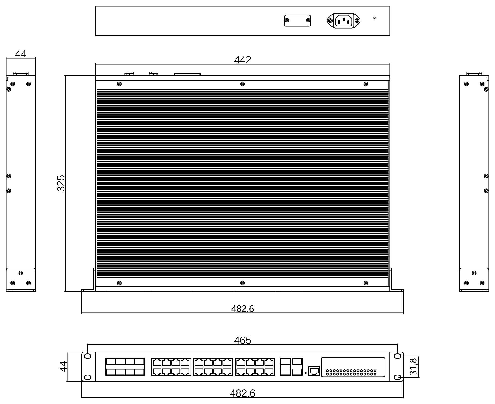

  

    

      
    

    

      简单、高可靠的网络通讯系统
    

  

  

    

      ISM8028U 万兆三层网管型工业交换机
    

    

      

        
· 万兆上行

        
· 三层路由

      

      

        
· 机架安装

        
· 宽压冗余

      

    

  

# 1. 产品概述

**ISM8028U 面向大型网络汇聚与中小型网络核心，提供万兆上行与完整三层能力。**

ISM8028U-S-8GC-4XGSFP-16GT-HV-HV 是一款万兆三层网管型工业交换机，配备 4 个万兆 SFP+ 光口、24 个 10/100/1000M Base-T 自适应电口和 8 个复用光口，具备先进的硬件处理能力和丰富的业务特性。产品支持 IPv4/IPv6 硬件双栈及线速转发，提供高容量的交换能力，使客户能够从容应对 IPv6 时代的组网需求。ISM8028U 具有 -40℃ \~ +80℃ 的工作温度，坚固度强，能适应各种严苛环境，为用户的以太网设备联网提供可靠、便捷的解决方案。

**产品特点：**

- **丰富端口：** 4 × 万兆光口 + 24 × 千兆电口 + 8 × 复用光口，端口扩展灵活，满足汇聚与核心组网需求。
- **强大处理：** 基于 VCore-III MIPS 架构 CPU，1.2 Tbps 交换容量、406 Mpps 包转发率。
- **宽温宽压：** -40℃ \~ +80℃ 超宽工作温度；DC 36-72 V 与 AC/DC 110-240 V 冗余双电源输入。
- **网络冗余：** 支持 STP/RSTP/MSTP 与 ERPS（自愈时间 < 20 ms），链路负载均衡、快速收敛。
- **三层路由：** 支持静态路由、RIP/RIPng、OSPF/OSPFv3 与 VRRP，支持 IPv4/IPv6 双栈线速转发。
- **安全控制：** 支持 IP+MAC 绑定、三/四层 ACL、IP Source Guard、ARP Detection、DHCP Snooping、802.1X。
- **时钟同步：** 支持 NTP 与 PTP（IEEE 1588v2），可自动同步网络时间。
- **便捷运维：** 支持 Web（HTTP/HTTPS）、CLI、Telnet、Console、SNMP v1/v2/v3、LLDP 与 RMON。

## 核心技术参数

| 参数 | 规格 |
|-----------|---------------|
| 类型 | 三层网管型万兆工业交换机 |
| 端口 | 4 × 万兆光口（SFP+）+ 24 × 10/100/1000BaseT 电口 + 8 × 复用光口 |
| 交换性能 | 1.2 Tbps 交换容量，406 Mpps 包转发率，32K MAC |
| 尺寸 / 重量 | 442 × 325 × 44 mm（1U 机架）/ < 4 kg |
| 电源 | DC 36-72 V 或 AC/DC 110-240 V，冗余双电源，< 30 W |
| 环境 | 工作温度 -40 至 +80 ℃ |
| 电磁兼容 | EN61000-4-2/3/4/5/6 Level 3；EMI：FCC Part 15、CISPR (EN55032) Class A |
| 认证 | CE、FCC、ROHS |

# 2. 产品尺寸

  

    
    
ISM8028U

  

  

    
注意：

    
1. 所有尺寸单位为毫米（mm）。

    
2. 所有尺寸均为近似值，仅供参考。

    
3. 图示尺寸不得用于生产加工。

    
4. 尺寸需符合零件及制造公差要求。

    
5. 尺寸如有变更，恕不另行通知。

  

# 3. 硬件规格

| 类别/参数 | 规格 |
|----------------------|---------------|
| **物理性能** | |
| 外壳 | 金属外壳 |
| 尺寸 (W × D × H) | 442 mm × 325 mm × 44 mm（含挂耳宽 482.6 mm，1U） |
| 重量 | < 4 kg |
| 安装方式 | 19 英寸机架式安装 |
| 散热方式 | 自然冷却，无风扇 |
| 存储温度 | -40 °C \~ +85 °C |
| 工作温度 | -40 °C \~ +80 °C |
| 工作湿度 | 10% \~ 90%（无凝结） |
| 存储湿度 | 5% \~ 95%（无凝结） |
| **接口** | |
| 端口 | 4 × 万兆光口（SFP+）+ 24 × 10/100/1000BaseT 电口 + 8 × 复用光口 |
| 管理端口 | 1 × Console 口 |
| 复位键 | 1 × 恢复出厂设置键 |
| 协商模式 | 电口 10/100/1000M 自协商；光口支持 1G / 2.5G / 10G 多种速率模式 |
| 网线线序 | 支持 Auto-MDIX，自动识别直通网线和交叉网线 |
| **硬件性能** | |
| 交换容量 | 1.2 Tbps |
| 包转发率 | 406 Mpps |
| MAC 地址表 | 32K，支持自动更新与双向学习 |
| CPU | VCore-III MIPS-based CPU |
| **以太网标准** | |
| 以太网 | IEEE 802.3-10BASE-T、IEEE 802.3u（快速以太网）、IEEE 802.3ab（千兆以太网）、IEEE 802.3z（千兆光纤）、IEEE 802.3ae（10G 以太网） |
| 链路聚合 | IEEE 802.3ad |
| 流控 | IEEE 802.3x（全双工数据链路层流控） |
| 节能 | IEEE 802.3az（EEE 高效节能以太网） |
| **电源参数** | |
| 工作电压 | DC 36-72 V；AC/DC 110-240 V |
| 电源冗余 | 冗余双电源 |
| 过流保护 | 支持，内置 4.0 A 保护 |
| 功耗 | < 30 W |
| **电磁特性** | |
| EMI | FCC Part 15；CISPR (EN55032) Class A |
| EMS | EN61000-4-2 (ESD), Level 3   EN61000-4-3 (RS), Level 3   EN61000-4-4 (EFT), Level 3   EN61000-4-5 (Surge), Level 3   EN61000-4-6 (CS), Level 3 |
| **机械环境** | |
| 冲击 | IEC 60068-2-27 |
| 自由落体 | IEC 60068-2-32 |
| 震动 | IEC 60068-2-6 |
| **认证** | |
| 认证 | CE、FCC、ROHS |
| **质量保证** | |
| 质保期 | 5 年 |
| MTBF | 300,000 小时 |

# 4. 软件规格

| 类别/参数 | 规格 |
|----------------------|---------------|
| **冗余** | |
| 生成树 | STP / RSTP / MSTP |
| 工业环网 | ERPS，毫秒级业务倒换 |
| 链路聚合 | 静态聚合、动态聚合（IEEE 802.3ad） |
| 环路保护 | 环路检测 / 环路避免 |
| **VLAN** | |
| VLAN | 最大 4096 个 VLAN，IEEE 802.1Q VLAN |
| 扩展 VLAN | QinQ、Voice VLAN、MAC VLAN、IP VLAN |
| **QoS** | |
| 调度算法 | SP、WRR、WFQ、RED、WRED、Best-Effort、FCFS、Head Of Line 防拥塞 |
| 标记 | CoS / ToS、IEEE 802.1p 端口队列优先级 |
| 端口限速 | 全双工基于 PAUSE 帧，支持基于端口的输入/输出带宽管理 |
| 端口流控 | 半双工基于背压式控制 |
| **组播** | |
| 组播控制 | IGMP Snooping、MLD Snooping |
| **路由** | |
| 静态路由 | 支持 |
| 动态路由 | RIP、RIPng、OSPF、OSPFv3 |
| 冗余网关 | VRRP |
| 协议栈 | IPv4 / IPv6 硬件双栈及线速转发 |
| **DHCP** | |
| DHCP | DHCP Client、DHCP Server、DHCP Snooping、DHCP Relay |
| **风暴抑制** | |
| 风暴抑制 | 广播、组播、单播风暴抑制；CPU 保护策略（流分类与流限速） |
| **网络安全** | |
| ACL | IP ACL、MAC ACL、VLAN ACL，支持基于三/四层的 ACL（硬件） |
| 地址绑定 | 基于端口的 IP+MAC 绑定（硬件） |
| 攻击防护 | IP Source Guard、ARP Detection（防 ARP 欺骗） |
| 认证 | IEEE 802.1X 端口认证、RADIUS 认证、SSH 2.0 |
| **时钟协议** | |
| 时钟同步 | NTP、PTP（IEEE 1588v2） |
| **网络管理** | |
| 管理方式 | Web（HTTP/HTTPS）、CLI、Telnet、Console |
| SNMP | SNMP v1 / v2 / v3 |
| 链路发现 | LLDP |
| 网络监控 | RMON |
| **端口镜像** | |
| 端口镜像 | 支持多对一端口镜像，镜像源端口数量不受限制 |
| **系统维护** | |
| 配置管理 | 配置文件上传/下载、升级包上传、Web 恢复出厂配置 |
| 日志 | 系统日志 |
| 诊断工具 | Ping 检测、tracert 检测、网线检测 |

# 5. 订购指南

| 型号 | 描述 |
|-------|--------|
| ISM8028U-S-8GC-4XGSFP-16GT-HV-HV | M 系列强三层网管交换机，4 × SFP+ 光口（支持千兆/万兆）+ 24 × 电口 + 8 × 复用光口。19 英寸机架式安装，DC 36-72 V 与 AC/DC 110-240 V 冗余双电源输入，工作温度 -40℃ 至 +80℃。 |

# 6. 联系我们

- **官网：** [映翰通官网](https://www.inhand.com.cn)
- **版权声明：** ©映翰通网络 保留所有权利
