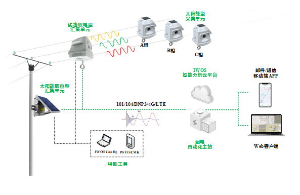
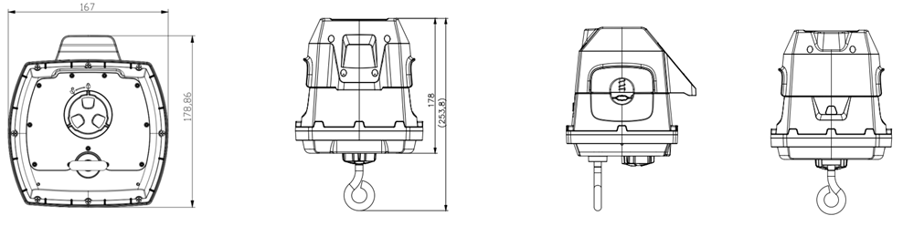

  

    

      
    

    

      智慧配网，状态感知，为供电可靠性赋能
    

  

  

    

     高精度暂态录波型故障指示器——采集单元(双电源型)
    

    

      

        
适配低负荷线路

        
三相同步采集

      

      

        
高精度录波

        
带电安装免维护

      

    

  

# 1. 产品概述

智能化配电网线路状态监测系统可实现配电线路实时监测，具备故障检测、故障波形记录、故障区段定位、线路隐患预警、电能质量分析等能力，提升配电系统可视性，缩短停电时长、降低停电频次、延长设备资产寿命，支撑数据驱动运维决策。

整套系统由**采集单元、汇集单元、智能分析平台、AI算法模块**组成。本采集单元采用太阳能取电+磁芯取电双取电方案、高精度同步采集技术，可精准检测线路工况，通过暂态录波保存线路异常数据，为线路故障分析提供原始数据支撑。

# 2. 解决方案

  
  
智能化配电网线路状态监测系统

## 特性和优势

### 高精度测量

* 专利抗干扰高精度电流传感器，线路电流测量精度可达 ±0.5%
* 优化电场传感器，精准识别电压跌落、停电事件
* 12.8ksps高频电流、电场采样，捕捉暂态故障信号
* 循环存储最长1小时历史录波，覆盖复杂故障、演化型故障
* 无线时间同步精度＜10μs，实现三相电流、对地电场波形同步采集

### 故障研判与线路状态监测

* 本地传感器完成短路故障研判；支持负荷越限、停电告警
* 采集指标：相电流幅值、2‑13次相电流谐波幅值、零序电流幅值、电流方向、电流不平衡度
* 线路状态周期上报，默认上报周期30秒，周期可配置
* 超高亮度LED故障指示，360°全方向可视

### 高可靠设计

* **太阳能+磁芯双取能**，取电功率≥0.6W；兼容低负荷间歇性线路，也支持电流≥3A常规线路
* 整机超低功耗；线路电流0A场景，依然可以研判指示短路故障，设备寿命大于8年
* 短距无线跳频通信，抗干扰能力强
* 优异EMC电磁防护；工作温度 `-40℃ ~ +70℃`；外壳防护等级IP67
* 智能故障判别，降低误动、拒动概率；识别停复电、接地、短路、负荷投切等工况
* 反时限逻辑，适配开关动作特性，规避瞬时扰动，抑制负荷波动、合闸涌流造成误判
* 丰富录波触发条件：电压/电流变化、零序越限、谐波越限、电流不平衡越限
* 适配电网接地方式：中性点不接地、小电阻接地、消弧线圈接地、直接接地系统

### 安全便利免维护设计

* 带电安装、带电拆卸，无需线路停电
* 配套手机诊断APP，自动检测安装状态
* 设备自诊断：低电量告警、通信异常告警、采集异常告警
* 故障复位：来电自动复位、定时自动复位、远程手动复位

# 3. 产品尺寸

  

    
    
尺寸（长x宽x高）：179mm x 167mm x 178mm（含丝杠整体长度254mm）

  

  

    
注意：

1.所有尺寸单位为毫米（mm）。

2.所有尺寸均为近似值，仅供参考。

3.图示尺寸不得用于生产加工。

4.尺寸需符合零件及制造公差要求。

5.尺寸如有变更，恕不另行通知。

  

# 4. 技术指标

| 规格 | 参数 | 
| :--- | :--- |
|**适用的电力系统**| |
|额定频率| 50Hz / 60Hz|
|额定电压|6‑35kV|
|工作电流范围|0 ~ 630A|
|适用导线线径|9‑26.8mm（导线截面35~240mm²）|
|适配中性点接地方式|中性点不接地、小电阻接地、消弧线圈接地、直接接地|
|**测量范围与精度**|  |
|线路电流|0‑100A：±0.5A；100‑630A：±0.5%；量程0~630A|
|对地电场|0~4095，±1%|
|自取电电量|0‑100%，±0.5%|
|电池电压|0~3.6V，±2%|
|录波采样率|每周波256点；50Hz：12.8ksps；60Hz：15.36ksps|
|三相同步对时精度|≤10μs|
|录波存储|≥1小时循环存储|
|零序电流测量范围|1~630A|
|**故障检测与研判**|  |
|可识别故障|相间短路、单相接地、断线；瞬时故障、永久故障|
|短路故障最小识别时间|40ms|
|重合闸最小识别时间|0.2s|
|录波触发方式|电压阈值越限、电流阈值越限、零序电流越限、外部信号触发|
|**线路状态显示**|  |
|LED规格|超高亮LED，单支发光强度＞13000mcd|
|可视角度|360°全向|
|可视距离|白天200m；夜间500m|
|故障复位方式|来电自动复位、定时自动复位、远程手动复位|
|定时自动复位时间|0‑48h可配置，默认24h|
|停电后闪光持续时间|≥2000h|
|**短距通信指标**|  |
|工作频段|470~510MHz|
|发射功率|≤20mW（13dBm）|
|接收灵敏度|≥‑95dBm|
|通信速率|250kbps|
|通信距离|≤50m|
|网络拓扑|星形网络|
|天线方向|全向|
|**电源系统**|  |
|电池|磷酸铁锂电池，3300mAh @3.2V|
|超级电容|满电支持全功能运行＞12小时|
|自取电条件|磁芯取能：线路电流≥3A；太阳能板取电功率≥0.6W|
|全功能运行功耗|≤2mA @3.3V|
|**机械特性**|  |
|整机尺寸(W×H×D)|167mm ×178mm ×179mm，含丝杠总长254mm|
|整机重量|＜2kg|
|防护等级|IP67|
|卡线机构抗拉力|沿线方向50N无位移|
|装卸寿命|＞50次无损伤|
|机械耐受|振动1级；倾斜跌落1米|
|**环境条件**|  |
|工作温度|-40℃ ~ +70℃|
|存储温度|-40℃ ~ +85℃|
|相对湿度|5%‑95%RH（无凝露）|
|最大海拔高度|≤4000m|
|**安规与电磁兼容EMC**|  |
|短路电流冲击耐受|20kA /2s|
|静电放电抗扰度|4级|
|快速瞬变脉冲群抗扰度|4级|
|浪涌冲击抗扰度|4级|
|射频电磁场辐射抗扰度|4级|
|阻尼振荡磁场抗扰度|5级|
|工频磁场抗扰度|5级|
|临近干扰试验|100mm|
|着火危险等级|5级|
|**设备寿命**|  |
|整机运行寿命|＞8年|
|电气动作寿命|＞2000次|

# 5. 订购信息

## 型号规则

**Model code:** JYL-FF 系列型号编码由 **类型标识代码 + 厂商代码 + 特性代码** 三部分组成

<table style="width:100%; table-layout:fixed; font-size:11px;">
  <tr><th>字段</th><th>含义说明</th></tr>
  <tr><td style="white-space: nowrap;">JYL</td><td>暂态录波型故障指示器（固定标识）</td></tr>
  <tr><td style="white-space: nowrap;">FF</td><td>厂商自定义代码，2位数字/字母</td></tr>
  <tr><td style="white-space: nowrap;">C</td><td>采集单元</td></tr>
  <tr><td style="white-space: nowrap;">&lt;C&gt;</td><td>网络制式、短距频率：C=50Hz /470‑510MHz（中国地区）</td></tr>
  <tr><td style="white-space: nowrap;">&lt;A/L/M/S/CS&gt;</td><td>取电性能、安装固定方式： A‑1A取电 /压簧固定 L‑3A取电 /压簧固定 M‑1A取电 /螺栓固定 S‑太阳能取电 /螺栓固定 CS‑太阳能+磁芯双取能(3A)/螺栓固定</td></tr>
</table>

**订购示例**：`JYL‑IH‑C‑CCS`
> 映翰通CSP版采集单元，短距470‑510MHz，中国50Hz，适配10kV线路；太阳能+磁芯双电源，螺栓固定。

# 6. 联系我们

- **官网：** [映翰通官网](https://www.inhand.com.cn)
- **版权声明：** ©映翰通网络 保留所有权利

---
