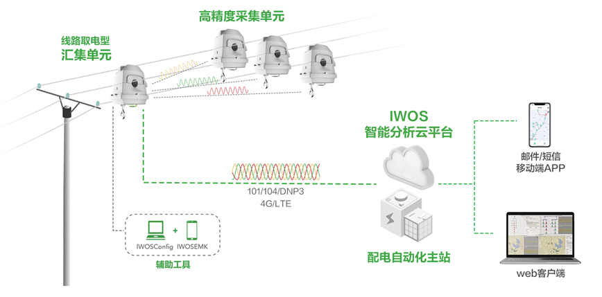
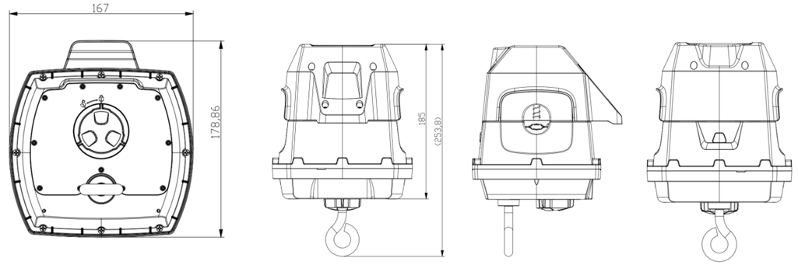

  

    

      
    

    

      智慧配网，状态感知，为供电可靠性赋能
    

  

  

    

     高精度暂态录波型故障指示器——采集单元(线路取电型)
    

    

      

        
高精度电流与电场测量

        
小电流自取电

      

      

        
三相同步采集

        
带电安装免维护

      

    

  

# 1. 产品概述

智能化配电网线路状态监测系统用于配电线路的实时监测，具备检测线路故障、记录故障波形、故障区段定位、线路隐患预警、电能质量分析等功能，提升了配电系统的可视性，帮助电力公司缩短停电时间、减少停电次数、提高资产寿命，并实现数据驱动的运营决策。该系统由采集单元、汇集单元、智能分析平台和AI算法模块构成，采集单元具备小电流自取电和高精度同步采集等多项创新技术，能可靠与准确的检测线路工况，并通过高精度录波记录线路异常，为线路分析提供数据基础。

# 2. 解决方案

  
  
智能化配电网线路状态监测系统

## 特性和优势

### 高精度测量

* 专利保护的抗干扰高精度电流传感器，线路电流测量精度 **±0.5%**
* 经过优化的电场传感器，准确识别线路电压跌落与停电
* **12.8ksps**高频电流、电场采样，精确捕获暂态故障信号
* 支持1小时历史录波，记录各种复杂故障和演化型故障
* **⾼精度(＜10μs)** 无线时间同步实现三相电流、对地电场波形同步采集

### 故障研判与线路状态监测

* 传感器自身支持短路故障研判，并支持负荷越限与停电等告警 
* 可采集相电流幅值、2~13次相电流谐波幅值、零序电流幅值、电流方向、电流不平衡度等指标 
* 定期（默认30秒，可设置）上报线路状态
* 超⾼亮的LED指示故障状态，360°全向可视

### 高可靠设计

* 创新的高效取能技术，在电流低至**1A** 的线路中可全功能运行
* 超低运行功耗，在电流低至0A的线路中可研判和指示短路故障并工作8年以上
* 短距无线采用跳频通信技术，抗干扰能力强
* 高电磁兼容防护能力，操作温度-40 ~ +70 °C，外壳防护等级达到IP67

### 安全便利的免维护设计

* 安装拆卸无需停电 
* 配套移动端诊断APP，自动诊断安装是否良好
* 具备自身诊断功能，具备低电量、通信异常和数据采集异常等告警

### 智能化检测线路故障，杜绝误动、拒动

* 可识别停复电、接地、短路、负荷投切等多种线路工况，准确监测线路状态
* 具有反时限功能，可最大限度配合开关动作特性，避开瞬时扰动，有效防止负荷波动、合闸励磁涌流等导致的误判
* 支持电压/电流变化、零序电流越限、谐波越限、电流不平衡度越限等录波触发条件，可检测种类丰富的线路异常
* 支持中性点不接地、小电阻接地、消弧线圈接地和直接接地系统

# 3. 产品尺寸

  

    
    
尺寸（长x宽x高）：179x167mmx178mm(含丝杠为 254mm)

  

  

    
注意：

1.所有尺寸单位为毫米（mm）。

2.所有尺寸均为近似值，仅供参考。

3.图示尺寸不得用于生产加工。

4.尺寸需符合零件及制造公差要求。

5.尺寸如有变更，恕不另行通知。

  

# 4. 技术指标

| 规格 | 参数 | 
| :--- | :--- |
|**适用的电力系统**| |
|额定功率| 50Hz，60Hz|
|额定电压|6~35KV|
|工作电流|0~630A|
|适用导线线径|9-26.8mm（35-240mm²）|
|适用的中性点接地方式|中性点不接地、小电阻接地、消弧线圈接地和直接接地|
|**电气参数**|  |
|线路电流|测量范围: 0~630A，测量精度: 0-100A，±0.5A；100~630A，±0.5%；|
|自取电电量|0~100%，±0.5%|
|对地电场|0~4095，±1%|
|电池电压|0~3.6V，±2%|
|录波采样率|每周波256采样点(50Hz:12.8ksps, 60Hz:15.36ksps)|
|三相对时精度|≤10μs|
|录波存储能力|≥1小时（循环存储）|
|零序电流测量范围|1~630A|
|**故障检测与研判**|  |
|可识别故障类型|相间短路、单相接地、断线；瞬时故障和永久故障|
|录波触发方式|电压变化超阈值、电流超阈值、零序电流超阈值、外部信号触发等|
|重合闸最小识别时间|0.2s|
|短路故障最小识别时间|40ms|
|**线路状态显示**|  |
|指示类型|超⾼亮LED，（单支LED发光强度>13000mcd）|
|故障复位方式|来电⾃动复位，定时⾃动复位，远程手动复位|
|定时自动复位时间|0~48h可设，默认24h|
|停电后连续闪光时间|≥2000h|
|可视角度|360°全向|
|可视距离|⽩天200m，夜间500m|
|**短距通信指标**|  |
|工作频率|470~510MHz|
|通信距离|≤50m|
|发射功率|≤20mW（13dBm）|
|通信速率|250kbps|
|网络拓扑|星形|
|接收灵敏度|≥-95dBm
|方向性|全向|
|**取能与功耗**|  |
|电池容量|3.6V，8.5Ah|
|自取电运行|≥1A|
|超级电容|充满电可全功能运行>12小时|
|全功能运行功耗|≤2mA@3.3V|
|设计寿命|＞8年|
|电气寿命|＞2000次|
|**结构参数**|  |
|尺寸|167mmx178mm(含丝杠为254mm)x179mm|
|卡线机构抗拉力|沿线方向50N不位移|
|重量|≤1.7kg|
|装卸寿命|＞50次无损伤|
|机械强度|振动1级、倾斜跌落1米|
|防护等级|IP67|
|**环境适应性**|  |
|工作温度|-40~+70°C|
|存储温度|-40~+85°C|
|环境相对湿度|5%~95%（无凝露）|
|海拔|≤4000m|
|短路电流冲击耐受|20kA@2s|
|阻尼振荡磁场抗扰度|5级|
|静电放电抗扰度|4级|
|射频电磁场辐射抗扰度|4级|
|快速瞬变脉冲群抗扰度|4级|
|浪涌冲击抗扰度|4级|
|工频磁场抗扰度|4级|
|临近干扰试验|100mm|
|着火危险等级|5级|

# 5. 订购信息

## 型号规则

**Model code:** JYL-FF 系列型号编码由 **类型标识代码 + 厂商代码 + 特性代码** 三部分组成

<table style="width:100%; table-layout:fixed; font-size:11px;">
  <tr><th>型号</th><th>类型</th><th>网络制式、线路/短距频率</th><th>取电性能/固定方式</th></tr>
  <tr><td style="white-space: nowrap;">JYL-FF</td><td>C：采集单元</td><td>C：50Hz / 470-510MHz（中国）</td><td>M-1A取电/螺栓固定</td></tr>
</table>

**订购示例**：`JYL-IH-C-CM`
> 映翰通版采集单元，适用于50Hz、470MHz线路，1A取电，悬挂型取电/螺栓固定方式。

# 6. 联系我们

- **官网：** [映翰通官网](https://www.inhand.com.cn)
- **版权声明：** ©映翰通网络 保留所有权利

---
