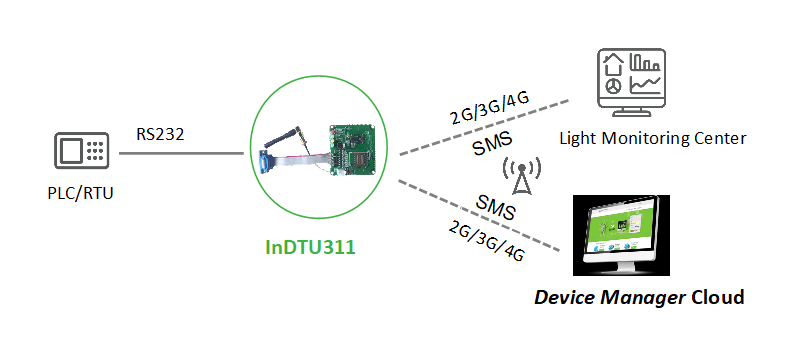
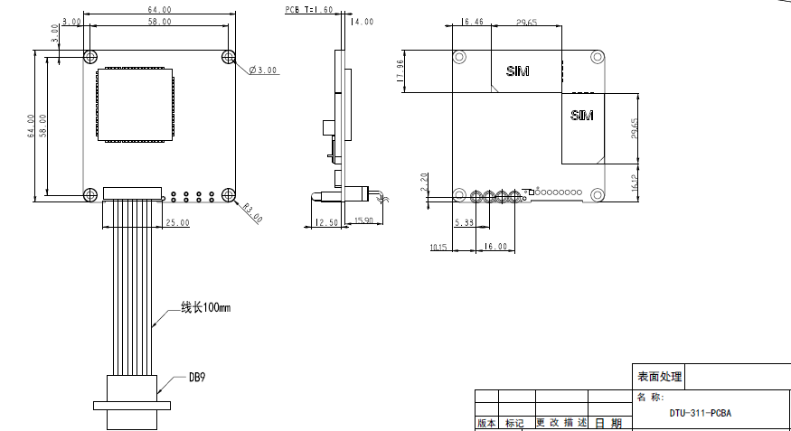

  

    

    

    

      高性能、低功耗、安全可靠
    

  

  

    

      InDTU311 系列
    

    

      

        
· 规模应用

        
· 2G/3G/4G

      

      

        
· 全工业化设计

        
· 高可靠通信

      

    

  

# 1. 产品概述

InDTU311系列是一款工业级无线数据终端产品。以无线蜂窝网络为承载网，为工业用户提供TCP/IP之上的无线数据传输通道，完成功能上远程控制站串口设备和中心控制系统间的无线数据通信，使远程工业现场控制得以实现。InDTU311是内置式产品，不带外壳，工作温度可达-40℃~70℃，支持+5-48VDC宽压供电，为环境苛刻的无人值守现场提供稳定的数据传输通道。

## 核心技术指标

|技术指标|规格|
| --- | --- |
| 蜂窝网络 | 2G/3G/4G；LTE FDD B1/3/5/8，TDD B38/39/40/41；UMTS、TD-SCDMA、EVDO/CDMA1x、GSM |
| 云管理 | 映翰通设备云、RTool、SMS、PC 配置工具 |
| 工业协议 | Modbus RTU/TCP 协议转换；透明 TCP/UDP、InHand DC |
| 网络特性 | APN/VPDN、CHAP/PAP、PPP；1–5 个中心；按需拨号 |
| 安全 | 登录安全认证；管理员/维护员分级；国网加密（选配） |
| 可靠性 | 看门狗故障自愈；PPP/ICMP/TCP Keepalive 多级链路检测 |
| 接口 | 2 × RS-232；9 PIN 排针 / DB9；SIM 卡槽（1.8 V/3 V） |
| 天线 | 50 Ω / SMA × 1 |
| 供电 / 功耗 | DC 5–48 V；待机 10.4 mA @ 12 V，工作 40.8 mA @ 12 V |
| 尺寸 / 安装 | 64 × 64 × 28 mm；无外壳内置式安装 |
| 工作环境 | -40 ~ +70 °C；湿度 5 ~ 95%（无凝霜） |
| EMC | EN 61000-4-2/4-5/4-12 level 2 |

# 2. 产品特性和优势

|                  特性和优势             |     说明                  |
| ------------------------------------- | ------------------------------ |
| 规模应用久经考验          | 产品经过大规模应用验证，成熟稳定可靠       |
| 支持2G/3G/4G网络       | 支持多种蜂窝网络制式，覆盖广泛，适应不同网络环境      |
| 全工业化设计无惧恶劣条件  | 采用全工业级芯片设计，工作温度可达-40℃~70℃，支持+5-48VDC宽压供电，符合电力行业DL/T721-2013标准    |
| 软硬件看门狗及多级链路检测           | 内嵌看门狗技术故障自愈，支持PPP层心跳、ICMP探测、TCP Keepalive及应用层心跳等多级链路检测机制，确保高可用性  |
| 多种管理工具及云平台  | 支持PC端配置工具、SMS、RTool远程管理工具、"映翰通设备云"平台，实现灵活高效的现场或远程网管 |
| 工业协议转换 | 支持Modbus RTU/Modbus TCP协议转换，支持用户自定义TCP/UDP数据报文 |

# 3. 典型应用场景

  

InDTU311系列产品特别适合应用于分布式无人值守现场设备的数据采集及监控，例如电力配网自动化、电力抄表、路灯监控、智慧水务、供暖供热监测、环保监测、气象监测等领域。在电力配网自动化场景中，FTU、DTU等配电终端通过RS232串口与InDTU311连接，设备以2G/3G/4G无线蜂窝网络为承载网，将采集到的线路工况信息、故障信息等数据实时传输至电力主站平台，实现远程监测与控制。支持PC端配置工具、SMS、RTool远程管理工具及"映翰通设备云"平台等多种配置和管理手段，简化现场施工及后期维护难度，大幅提升施工效率，降低系统运营整体成本。

# 4. 产品尺寸

  

    
  

# 5. 产品接口

  

    <table>
      <thead>
        <tr>
          <th>DB9针脚</th>
          <th>板载9PIN针脚</th>
          <th>定义</th>
          <th>说明</th>
        </tr>
      </thead>
      <tbody>
        <tr>
          <td align="center">1</td>
          <td align="center">1</td>
          <td align="center">V-</td>
          <td align="left">电源负极</td>
        </tr>
        <tr>
          <td align="center">2</td>
          <td align="center">3</td>
          <td align="center">TxD</td>
          <td align="left">串口1的RS-232发送</td>
        </tr>
        <tr>
          <td align="center">3</td>
          <td align="center">5</td>
          <td align="center">RxD</td>
          <td align="left">串口1的RS-232接收</td>
        </tr>
        <tr>
          <td align="center">4</td>
          <td align="center">7</td>
          <td align="center">RxD2</td>
          <td align="left">串口2的RS-232接收</td>
        </tr>
        <tr>
          <td align="center">5</td>
          <td align="center">9</td>
          <td align="center">GND</td>
          <td align="left">信号地</td>
        </tr>
        <tr>
          <td align="center">6</td>
          <td align="center">2</td>
          <td align="center">V+</td>
          <td align="left">电源正极</td>
        </tr>
        <tr>
          <td align="center">7</td>
          <td align="center">4</td>
          <td align="center">GND</td>
          <td align="left">信号地</td>
        </tr>
        <tr>
          <td align="center">8</td>
          <td align="center">6</td>
          <td align="center">GND</td>
          <td align="left">信号地</td>
        </tr>
        <tr>
          <td align="center">9</td>
          <td align="center">8</td>
          <td align="center">TxD2</td>
          <td align="left">串口2的RS-232发送</td>
        </tr>
      </tbody>
    </table>
  

# 6. 硬件规格

| 类别/参数    | InDTU311LQ20     |
| ----- |------- |
| **电源及功耗** |  |
| 电源输入    |  DC 5-48V     |
| 反接保护  | 支持     |
| 过载保护   |  支持    |
| 电源接口   |  排针/DB9接口    |
| 待机电流@12V |  10.4mA   |
| 工作电流@12V   | 40.8mA  |
| 启动电流@12V   | 151mA    |
| **机械特性**   |  |
| 安装方式   | 无外壳，内置式安装  |
| 产品尺寸   |64 x 64 x 28 mm  |
| **工作环境**   |  |
| 工作温度   | -40 ~ +70 °C    |
| 环境湿度     |  5 ~ 95%（无凝霜） |
| 存储温度  | -40 ~ +85 °C    |
| **EMC特性**    |  |
| 静电     | EN61000-4-2, level 2  |
| 浪涌   |  EN61000-4-5, level 2 |
| 震荡波抗扰度 | EN61000-4-12, Level 2  |
| **接口**  |   |
| 工业串行接口   |  串口1：RS-232 串口2：RS-232 RS-232信号：TXD、RXD、GND 9 PIN排针，2.5mm间距 |
| SIM卡座  |  1.8V/3V，卡槽式卡座   |
| 天线  |  50欧姆/SMA x 1 |
| **指示灯**  |  |
| LED  |  POWER, SIM, STATUS |

# 7. 软件规格

| 参数   | 规格 |
| ------- | -------|
| **网络特性** |                                                                        |
| 网络接入 | APN、VPDN  |
| 接入认证 | CHAP/PAP |
| 网络制式  | 2G/3G/4G  |
| WAN协议  | PPP 拨号动态获取（IPCP） |
| 网络协议   | Ping、DNS、透明TCP/UDP、InHand DC TCP/DC UDP、TCP Server  |
| **功能参数** |                                                                        |
| 用户自定义  | 支持用户自定义登录/心跳数据包  |
| 协议转换  | 支持Modbus RTU/TCP协议转换 |
| 多中心支持  | 支持1-5个中心  |
| 配置备份  | 支持配置文件的导入和导出  |
| 升级方式  | 支持专用升级机制，利用本地串口或远程方式进行固件升级 |
| 日志功能  | 支持本地在线查看日志，方便工程人员判断设备运行状态  |
| 集中管理  | 支持"映翰通设备云"远程集中管理 |
| 按需拨号  | 支持长连接模式；短连接模式，本地数据激活，短信激活、电话激活，定时激活/定时下线 |
| 配置方式  | 支持配置工具本地串口配置，RTool、SMS、"映翰通设备云"平台远程配置 |
| **通讯参数** |   |
| 频段  | LTE (FDD): Bands 1,3,5,8 LTE (TDD): Bands 38,39,40,41 UMTS: Bands 1,8 TD-SCDMA: Bands 34,39 EVDO/CDMA1x：800MHz GSM：900/1800MHz |
| **规约协议** |     |
| 通信协议  | 支持透明TCP/UDP协议；支持InHand DC协议（传输优化）；支持用户自定义TCP/UDP数据报文 |
| 电力规约  | 符合DL/T721-2013配网自动化系统远方终端标准  |
| **安全** |   |
| 分级管理    | 管理用户分级：管理员，维护员  |
| 认证安全  | 支持登录安全认证   |
| **使用寿命** |    |
| 链路在线检测   | 发送心跳包检测，断线自动连接   |
| 内嵌看门狗  | 设备运行自检技术，设备运行故障自修复   |
| 可靠升级  | 专用升级机制，确保可靠升级  |

# 8. 订购信息

## 型号规则

**Model code:** InDTU311\<WMNN\>-\<232D\>-\<DS/空\>-\<SEC/空\>

\<WMNN\>: 无线通讯类型 & 模块

\<232D\>: 串口类型（232D 为 RS232，DB9 公头）

\<DS/空\>: SIM 卡（DS 为双卡）

\<SEC/空\>: 国网加密（SEC 为支持国网加密）

## 产品型号

<table style="font-size: 10px; width: 100%;">
  <thead>
    <tr>
      <th style="width: 26%; white-space: nowrap; text-align: center;">型号</th>
      <th style="text-align: center;">&lt;WMNN&gt;</th>
      <th style="text-align: center;">串口</th>
      <th style="text-align: center;">SIM 卡</th>
      <th style="text-align: center;">国网加密</th>
    </tr>
  </thead>
  <tbody>
    <tr>
      <td style="white-space: nowrap;">InDTU311LQ20-232D-DS</td>
      <td>LTE (FDD): Bands 1,3,5,8 LTE (TDD): Bands 38,39,40,41 UMTS: Bands 1,8 TD-SCDMA: Bands 34,39 EVDO/CDMA1x：800 MHz GSM：900/1800 MHz</td>
      <td>RS232，DB9 公头</td>
      <td>双卡</td>
      <td>—</td>
    </tr>
    <tr>
      <td style="white-space: nowrap;">InDTU311LQ20-232D-DS-SEC</td>
      <td>LTE (FDD): Bands 1,3,5,8 LTE (TDD): Bands 38,39,40,41 UMTS: Bands 1,8 TD-SCDMA: Bands 34,39 EVDO/CDMA1x：800 MHz GSM：900/1800 MHz</td>
      <td>RS232，DB9 公头</td>
      <td>双卡</td>
      <td>✓</td>
    </tr>
  </tbody>
</table>

# 9. 联系我们

- **官网：** [映翰通官网](https://www.inhand.com.cn)
- **版权声明：** ©映翰通网络 保留所有权利
