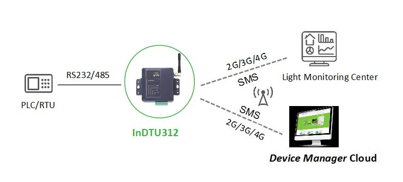
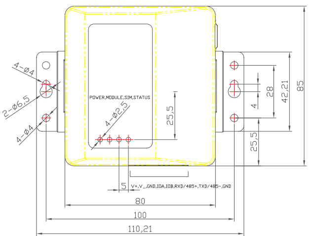
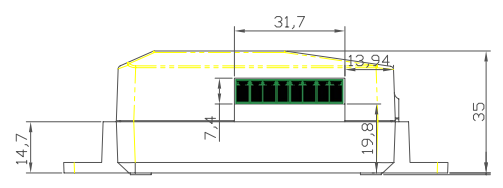
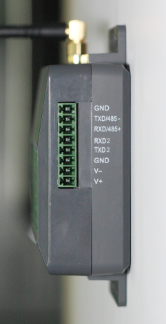

  

    

    

    

      工业化设计、低功耗、安全可靠
    

  

  

    

      InDTU312 系列
    

    

      

        
· 工业化设计

        
· 高可靠通信

      

      

        
· 灵活管理

        
· 超低功耗

      

    

  

# 1. 产品概述

InDTU312系列是一款工业级无线数据终端产品，以无线蜂窝网络为承载网，为工业用户提供TCP/IP之上的无线数据传输通道，完成远程控制站串口设备和中心控制系统间的无线数据通信，使远程工业现场控制得以实现。产品采用工程塑料外壳，工作温度可达-40°C~70°C，支持+5~48V DC宽压供电，为环境苛刻的无人值守现场提供稳定的数据传输通道。支持PC端配置工具、SMS、RTool远程管理工具及映翰通设备云平台等多种配置和管理手段，简化现场施工及后期维护难度，大幅提升施工效率，降低系统运营成本。

## 核心技术指标

|技术指标|规格|
| --- | --- |
| 蜂窝网络 | 2G/3G/4G；LTE FDD B1/3/5/8，TDD B38/39/40/41；UMTS、TD-SCDMA、EVDO/CDMA1x、GSM |
| 云管理 | 映翰通设备云、RTool、SMS、PC 配置工具 |
| 工业协议 | Modbus RTU/TCP 协议转换；透明 TCP/UDP、InHand DC |
| 网络特性 | APN/VPDN、CHAP/PAP；按需拨号；SMS 与 IP 链路互备 |
| 安全 | 登录安全认证；管理员/维护员分级；国网加密（选配） |
| 可靠性 | 看门狗故障自愈；PPP/ICMP/TCP Keepalive 多级链路检测 |
| 接口 | 串口1：RS-232/RS-485（选配）；串口2：RS-232；8 PIN 工业端子 |
| 天线 | 50 Ω / SMA × 1 |
| 供电 / 功耗 | DC 5–48 V；待机 11 mA @ 12 V，工作 41 mA @ 12 V |
| 尺寸 / 安装 | 110 × 85 × 35 mm；壁挂；ABS 工程塑料；IP30 |
| 工作环境 | -40 ~ +70 °C；湿度 5 ~ 95%（无凝露） |
| EMC / 认证 | EN 61000-4-2/4-5/4-12 level 2；中国电科院检测认证 |

# 2. 产品特性和优势

|                  特性和优势             |     说明                  |
| ------------------------------------- | ------------------------------ |
| 工业化设计          | 全工业级芯片设计，工作温度-40°C~70°C，支持+5-48V DC宽压供电，防护等级IP30，符合电力行业DL/T721-2013配网自动化系统远方终端标准       |
| 高可靠设计       | 内嵌看门狗技术实现故障自愈；支持SMS与IP数据链路互备；多级链路检测机制（PPP层心跳、ICMP探测、TCP Keepalive等）确保无线连接"永久在线"      |
| 灵活管理  | 支持本地串口配置、RTOOL远程配置、SMS配置及映翰通设备云平台远程批量管理    |
| 功能丰富           | 支持透明TCP/UDP协议、InHand DC协议、Modbus RTU/TCP协议转换、用户自定义数据报文  |

# 3. 典型应用场景

  

InDTU312系列产品适用于分布式无人值守现场设备的数据采集及监控。应用领域包括电力配网自动化、电力抄表、路灯监控、智慧水务、供暖供热监测、环保监测、气象监测等。该产品通过无线蜂窝网络为工业现场提供TCP/IP之上的数据传输通道，远程控制站串口设备通过InDTU312与中心控制系统建立无线数据通信，实现远程工业现场的数据采集与控制。借助PC端配置工具、SMS、RTool远程管理工具以及映翰通设备云平台，工程人员可在本地或远程对设备进行配置、管理和固件升级，显著提升运维效率，降低现场施工和系统运营的整体成本。

# 4. 产品尺寸

  

    
  

  

    
  

# 5. 产品接口

  

    
  

  

    <table>
      <thead>
        <tr>
          <th>针脚</th>
          <th>定义</th>
          <th>说明</th>
        </tr>
      </thead>
      <tbody>
        <tr>
          <td align="center">1</td>
          <td align="center">GND</td>
          <td align="left">信号地</td>
        </tr>
        <tr>
          <td align="center">2</td>
          <td align="center">TXD/485-</td>
          <td align="left">串口1的RS232发送或RS485-</td>
        </tr>
        <tr>
          <td align="center">3</td>
          <td align="center">RXD/485+</td>
          <td align="left">串口1的RS232接收或RS485+</td>
        </tr>
        <tr>
          <td align="center">4</td>
          <td align="center">TXD2</td>
          <td align="left">串口2的RS232发送</td>
        </tr>
        <tr>
          <td align="center">5</td>
          <td align="center">RXD2</td>
          <td align="left">串口2的RS232接收</td>
        </tr>
        <tr>
          <td align="center">6</td>
          <td align="center">GND</td>
          <td align="left">信号地</td>
        </tr>
        <tr>
          <td align="center">7</td>
          <td align="center">V-</td>
          <td align="left">电源负极</td>
        </tr>
        <tr>
          <td align="center">8</td>
          <td align="center">V+</td>
          <td align="left">电源正极</td>
        </tr>
      </tbody>
    </table>
  

# 6. 硬件规格

| 类别/参数                                         | 规格                          |
| ------------------------------------------------- | ----------------------------- |
| **电源及功耗** |                               |
| 电源输入                                            | DC 5~48V                     |
| 反接保护                                            | 支持                          |
| 过载保护                                            | 支持                          |
| 电源接口   |  工业端子    |
| 待机电流                                            | 11mA @ 12V                   |
| 工作电流                                            | 41mA @ 12V                   |
| 启动电流                                            | 144mA @ 12V                  |
| **接口**  |   |
| 工业串行接口   |  串口1：RS-232/RS485(选配) 串口2：RS-232 RS-232信号：TXD、RXD、GND  8 PIN工业端子，3.81mm间距 |
| SIM卡座  |  1.8V/3V，卡槽式卡座   |
| 天线  |  50欧姆/SMA x 1 |
| **机械特性**   |                               |
| 尺寸(L×W×H)                                       | 110mm × 85mm × 35mm          |
| 安装方式                                            | 壁挂                          |
| 防护等级                                            | IP30                          |
| 外壳                                                | ABS工程塑料                   |
| 散热方式                                            | 无风扇散热                    |
| **工作环境**   |                               |
| 工作温度                                            | -40 ~ +70 °C                  |
| 相对湿度                                            | 5%~95%（无凝露）              |
| 存储温度                                            | -40 ~ +85 °C                  |
| **EMC特性**    |                               |
| 静电放电抗扰度                                      | EN61000-4-2, Level 2          |
| 浪涌冲击抗扰度                                      | EN61000-4-5, Level 2          |
| 震荡波抗扰度                                        | EN61000-4-12, Level 2         |
| **认证**    |                               |
| 认证  | 具备中国电科院检测认证            |

# 7. 软件规格

| 类别/参数                                       | 规格                                                         |
| ----------------------------------------------- | ------------------------------------------------------------ |
| **网络特性** |                                                              |
| 网络接入                                        | APN、VPDN                                                    |
| 接入认证                                        | CHAP/PAP                                                     |
| 网络制式                                        | 2G/3G/4G，具体频段信息请参考订购信息                         |
| 网络协议                                        | Ping、DNS、透明TCP/UDP、InHand DC TCP/DC UDP、TCP server     |
| **功能参数** |                                                              |
| 用户自定义数据报文                              | 支持自定义登录/心跳数据包                                    |
| 协议转换                                        | 支持Modbus RTU/TCP协议转换                                   |
| 日志功能                                        | 支持本地在线查看日志，方便工程人员判断设备运行状态           |
| 集中管理                                        | 支持映翰通设备云远程集中管理                                 |
| 配置备份                                        | 支持配置文件的导入和导出                                     |
| 升级方式                                        | 支持专用升级机制，利用本地串口或远程方式进行固件升级         |
| 按需拨号                                        | 支持长连接模式、短连接模式，支持本地数据激活、短信激活、电话激活、定时激活/定时下线 |
| **安全** |                                                              |
| 设备管理安全                                    | 支持管理用户分级：管理员，维护员； 支持登录安全认证       |
| **使用寿命** |                                                              |
| 链路在线检测                                    | 发送心跳包检测，断线自动连接                                 |
| 内嵌看门狗                                      | 设备运行自检技术，设备运行故障自修复                         |

# 8. 订购信息

## 型号规则

**Model code:** InDTU312\<WMNN\>-\<S\>-\<DS/空\>-\<SEC/空\>

\<WMNN\>: 无线通讯类型 & 模块

\<S\>: 串口类型（232 为 RS232，485 为 RS485）

\<DS/空\>: SIM 卡（DS 为双卡）

\<SEC/空\>: 国网加密（SEC 为支持国网加密）

## 产品型号

<table style="font-size: 10px; width: 100%;">
  <thead>
    <tr>
      <th style="width: 26%; white-space: nowrap; text-align: center;">型号</th>
      <th style="text-align: center;">&lt;WMNN&gt;</th>
      <th style="text-align: center;">串口</th>
      <th style="text-align: center;">SIM 卡</th>
      <th style="text-align: center;">国网加密</th>
    </tr>
  </thead>
  <tbody>
    <tr>
      <td style="white-space: nowrap;">InDTU312LQ20-232-DS</td>
      <td>LTE (FDD): B1/3/5/8 LTE (TDD): B38/39/40/41 UMTS: B1/8 TD-SCDMA: B34/39 EVDO/CDMA1x: 800 MHz GSM: 900/1800 MHz</td>
      <td>RS232</td>
      <td>双卡</td>
      <td>—</td>
    </tr>
    <tr>
      <td style="white-space: nowrap;">InDTU312LQ20-485-DS</td>
      <td>LTE (FDD): B1/3/5/8 LTE (TDD): B38/39/40/41 UMTS: B1/8 TD-SCDMA: B34/39 EVDO/CDMA1x: 800 MHz GSM: 900/1800 MHz</td>
      <td>RS485</td>
      <td>双卡</td>
      <td>—</td>
    </tr>
    <tr>
      <td style="white-space: nowrap;">InDTU312LQ20-485-DS-SEC</td>
      <td>LTE (FDD): B1/3/5/8 LTE (TDD): B38/39/40/41 UMTS: B1/8 TD-SCDMA: B34/39 EVDO/CDMA1x: 800 MHz GSM: 900/1800 MHz</td>
      <td>RS485</td>
      <td>双卡</td>
      <td>✓</td>
    </tr>
    <tr>
      <td style="white-space: nowrap;">InDTU312LQ20-232-DS-SEC</td>
      <td>LTE (FDD): B1/3/5/8 LTE (TDD): B38/39/40/41 UMTS: B1/8 TD-SCDMA: B34/39 EVDO/CDMA1x: 800 MHz GSM: 900/1800 MHz</td>
      <td>RS232</td>
      <td>双卡</td>
      <td>✓</td>
    </tr>
  </tbody>
</table>

# 9. 联系我们

- **官网：** [映翰通官网](https://www.inhand.com.cn)
- **版权声明：** ©映翰通网络 保留所有权利
