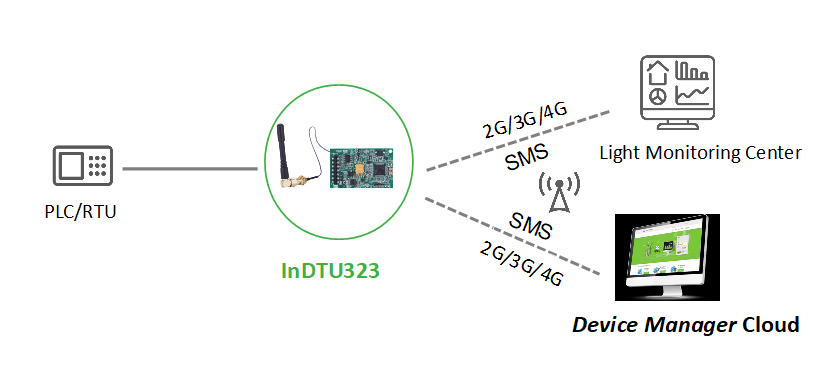
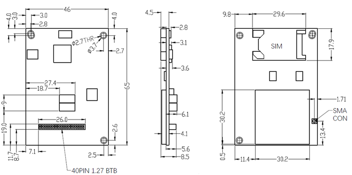
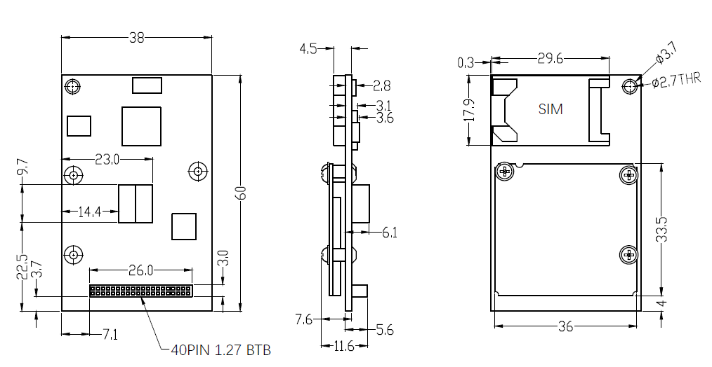

  

    

    

    

      工业级嵌入式数据终端
    

  

  

    

      InDTU323 系列
    

    

      

        
· 超低功耗

        
· 尺寸小巧

      

      

        
· 工业级设计

        
· 全网通

      

    

  

# 1. 产品概述

InDTU323系列是映翰通InDTU产品线中体积最小的工业级嵌入式TTL电平无线数据终端，依托2G/3G/4G蜂窝无线网络，在远端串口设备与数据中心之间搭建稳定无线通信链路，实现现场设备远程监控、数据采集。

## 核心技术指标

|技术指标|规格|
| --- | --- |
| 蜂窝网络 | 2G/3G/4G 全网通；SMS 与 IP 链路互备 |
| 云管理 | 映翰通设备云、RTOOL、SMS、本地串口配置 |
| 工业协议 | Modbus RTU/TCP；IEC 101/104；透明 TCP/UDP、InHand DC |
| 网络特性 | APN/VPDN、CHAP/PAP；最多 5 路中心；按需拨号 |
| 安全 | 管理员/维护员分级；登录认证 |
| 嵌入式接口 | 2×20 PIN 1.27 mm 排母；3.3 V TTL 双路 UART |
| 天线 | 50 Ω / SMA × 1 |
| 供电 / 功耗 | DC 5 V；待机 25 mA，工作 150 mA，启动 165 mA |
| 尺寸 / 安装 | 无外壳，板载内置式安装 |
| 工作环境 | -40 ~ +70 °C；湿度 5 ~ 95%（无凝霜） |
| EMC | EN 61000-4-2/4-5/4-12 level 2 |
| SIM | 单卡，1.8 V / 3 V 卡槽式卡座 |

# 2. 产品特性和优势

| 特性和优势 | 说明 |
| ---------- | ---- |
| 全网通通信 |支持4G/3G/2G全制式蜂窝网络 SMS短信、IP数据链路互备冗余，短信备份通道在 IP 链路失败时自动接管,保障数据传输连续不中断 |
| 全工业化设计 | 全工业级芯片，工作温度：-40℃-70℃，存储温度：-40℃-85℃ 超低功耗设计，标准DC5V供电 软硬件看门狗，故障自动自愈  多级链路检测机制：PPP层心跳、ICMP探测、TCP Keepalive、应用层心跳，维持设备永久在线 多中心：最多5路中心，第5路为维护通道，支持"轮询"和"同时连接"两种策略 |
| 便捷设备管理 | 本地管理：配置软件串口本地登录配置 远程工具管理：RTOOL工具TCP/IP远程配置、SMS短信配置 云端批量管理：映翰通设备云平台远程统一运维 |
| 工业互联互通 | 基础传输：透明TCP/UDP、InHand DC优化传输协议 |

# 3. 典型应用场景

  

InDTU323系列产品以嵌入式方式集成于PLC/RTU串口设备中，设备通过2G/3G/4G蜂窝网络、SMS短信双传输通道，分别对接路灯监控中心、映翰通设备云管理平台，完成双向无线数据传输。

# 4. 产品尺寸

  

    
InDTU323L

    
  

  

    
InDTU323G

    
  

# 5. 产品接口

InDTU323L采用2×20PIN SMD排母，塑高3.4mm，间距1.27mm；所有串口电平为3.3V TTL。

| 接口分类 | 管脚号 | 信号名称 | 信号方向 | 电气与功能描述 |
| -------- | ------ | -------- | -------- | -------------- |
| GPIO通用输入输出 | 1~4 | NC | - | 空脚，无功能 |
| | 5 | GPIO1 | I | （预留）输入管脚，内部10K上拉；VIL≤0.8V，VIH≥2.0V |
| | 6 | GPIO2 | I | （预留）同GPIO1电气参数 |
| | 7 | GPIO3 | O | （预留）输出管脚；VOL≤0.5V，VOH≥2.5V |
| | 8 | GPIO4 | O | （预留）同GPIO3电气参数 |
| 模拟信号采集 | 24 | AI0 | I | 模拟量输入通道 |
| 无线信号强度指示 | 9 | CSQ1 | O | 信号强度档位输出： 0 < CSQ < 10 → 仅 CSQ1 10 ≤ CSQ < 20 → CSQ1、CSQ2 20 ≤ CSQ < 32 → 三路全高 CSQ == 0 或 CSQ ≥ 32（如 99 表示无信号/未知）→ 三路全低 |
| | 11 | CSQ2 | O | 同9电气参数 |
| | 10 | CSQ3 | O | 同9电气参数 |
| MCU硬件复位 | 12 | RST | I | 高电平有效，复位保持时间≥100ms；VIH≥2.0V，VIL≤0.8V |
| SIM卡接口 | 15 | SIMDATA | I/O | SIM卡数据通信 |
| | 16 | SIMRST | O | SIM卡复位信号 |
| | 17 | SIMVCC | O | SIM卡供电，自动适配1.8V/3V |
| | 18 | SIMCLK | O | SIM卡时钟信号 |
| IIC总线 | 21 | SCL | O | IIC时钟信号 |
| | 22 | SDA | I/O | IIC数据信号；VIL≤0.8V，VIH≥2.0V |
| 信号地 | 23 | GND | - | 模拟/信号公共地 |
| 设备状态指示输出 | 26 | Online | O | 在线指示；设备无线上线后输出高电平 |
| | 27 | LED_MODULE | O | 模组状态指示灯，低电平有效 |
| | 29 | LED_SIM | O | 数据/拨号指示：拨号中或有数据收发时快闪，其余状态常灭 |
| | 30 | LED_STATUS | O | 拨号状态指示；拨号成功常亮，正在拨号/有数据收发常灭 |
| 双路UART串口 | 31 | TXD(UART1) | O | 串口1发送，3.3V TTL电平 |
| | 32 | RXD(UART1) | I | 串口1接收，3.3V TTL电平 |
| | 25 | TXD2(UART2) | O | 串口2发送，3.3V TTL电平 |
| | 28 | RXD2(UART2) | I | 串口2接收，3.3V TTL电平 |
| 电源地 | 13/14/19/20/34/35/36 | GND | - | 整机功率地、信号地 |
| 机型专用电源控制 | 33 | GND(323G) SHUTDOWN(323L) | -/I | 323G：专用地； 323L：整机断电控制，高电平断电，闲置可悬空 |
| 供电输入 | 37~40 | VIN | POWER | DC5V主供电正极输入 |

# 6. 硬件规格

| 类别/参数 | 规格 |
| --------- | ---- |
| **电源及功耗** | |
| 电源输入 | DC 5V |
| 反接保护 | 支持 |
| 过载保护 | 支持 |
| 电源接口 | 40PIN 排母 VIN 电源管脚 |
| 待机电流 | 25 mA |
| 工作电流 | 150 mA |
| 启动电流 | 165 mA |
| **接口** | |
| 工业串口 | 2×20PIN 1.27mm间距排母，3.3V TTL双路UART |
| SIM卡座 | 兼容1.8V/3V，卡槽式卡座 |
| 天线接口 | 50Ω阻抗 SMA天线座 ×1 |
| **机械特性** | |
| 安装方式 | 无外壳，板载内置式安装 |
| **工作环境** | |
| 工作温度 | -40℃ ~ 70℃ |
| 存储温度 | -40℃ ~ 85℃ |
| 环境湿度 | 5% ~ 95%RH（无凝霜） |
| **EMC特性** | |
| 静电抗扰 | EN61000-4-2 Level 2 |
| 浪涌抗扰 | EN61000-4-5 Level 2 |
| 震荡波抗扰 | EN61000-4-12 Level 2 |
| **指示灯** | |
| LED | POWER、MODULE、SIM、STATUS |

# 7. 软件规格

| 参数 | 规格 |
| ---- | ------ |
| **网络特性** | |
| 网络接入 | APN、VPDN 专网 |
| 接入认证 | CHAP/PAP |
| 网络制式 | 2G/3G/4G 多频段（详见订购型号表） |
| 网络协议 | Ping、DNS、透明TCP/UDP、InHand DC TCP/UDP、TCP Server |
| **功能参数** | |
| 用户自定义 | 自定义登录数据包、自定义心跳数据包 |
| 协议转换 | Modbus RTU ↔ Modbus TCP 双向互转；电力 IEC 101/104 协议互转 |
| 多中心支持 | 最多 5 路中心，第 5 路为维护通道，支持“轮询”和“同时连接”两种策略 |
| 按需拨号 | 支持长连接永久在线；短连接按需激活（本地数据激活、短信激活、电话激活、定时上下线） |
| 配置方式 | 本地串口配置、RTOOL 远程 TCP 配置、短信配置、映翰通设备云平台远程配置 |
| 配置备份 | 配置文件导入、导出备份 |
| 升级方式 | 本地串口升级、远程云端升级 |
| 日志功能 | 本地实时查看运行日志，快速定位故障 |
| 集中管理 | 映翰通设备云平台批量统一管理设备 |
| **安全** | |
| 分级管理 | 管理员、维护员两级账号 |
| 认证安全 | 全操作登录身份安全认证 |
| **使用寿命** | |
| 链路在线检测 | 多层心跳链路检测，断线自动重连 |
| 内嵌看门狗 | 硬件看门狗，设备运行故障自动修复 |
| 可靠升级 | 专用固件升级机制，升级过程防损坏 |

# 8. 订购信息

## 型号规则

**Model code:** InDTU323\<WMNN\>-\<S\>-\<K\>-\<GW/空\>

\<WMNN\>: 无线通信模组与频段规格

\<S\>: 串口规格（固定 3.3V TTL 排母、5V 供电）

\<K\>: SIM 卡配置（全系单卡）

\<GW/空\>: 国网专用版本（GW 为国网版）

## 产品型号

<table style="font-size: 10px; width: 100%;">
  <thead>
    <tr>
      <th style="width: 26%; white-space: nowrap; text-align: center;">型号</th>
      <th style="text-align: center;">&lt;WMNN&gt;</th>
      <th style="text-align: center;">串口</th>
      <th style="text-align: center;">SIM 卡</th>
      <th style="text-align: center;">版本</th>
    </tr>
  </thead>
  <tbody>
    <tr>
      <td style="white-space: nowrap;">InDTU323LQ20-5V</td>
      <td>LTE FDD：B1/B3/B5/B8；LTE TDD：B38/B39/B40/B41 UMTS B1/B8、TD-SCDMA B34/B39、EVDO 800 MHz、GSM 900/1800 MHz</td>
      <td>3.3V TTL 排母、5V 供电</td>
      <td>单卡</td>
      <td>标准版</td>
    </tr>
  </tbody>
</table>

# 9. 联系我们

- **官网：** [映翰通官网](https://www.inhand.com.cn)
- **版权声明：** ©映翰通网络 保留所有权利
