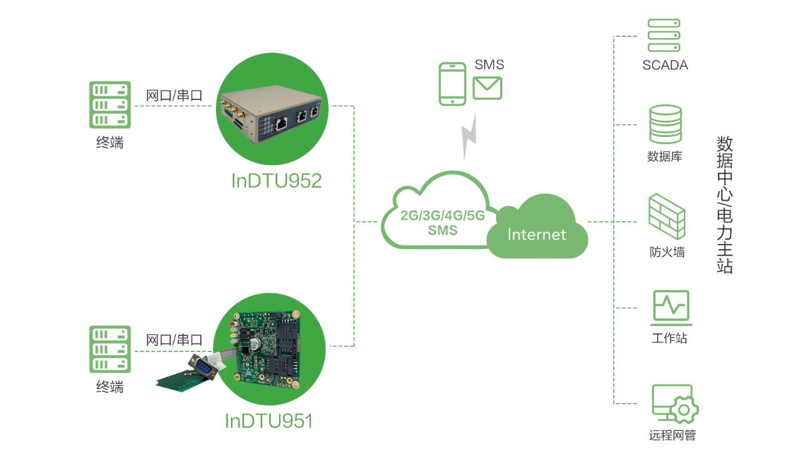
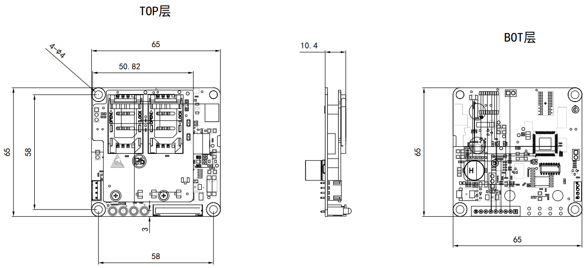

  

    

    

    

      嵌入式配网5G数据传输单元
    

  

  

    

      InDTU951 系列
    

    

      

        
· 5G全网通

        
· 网串一体

      

      

        
· 工业级设计

        
· 安全可靠

      

    

  

# 1. 产品概述

InDTU951-NR是一款嵌入式配网5G数据传输单元，同时支持5G NSA和SA两种组网模式，可选支持5G RedCap Sub-6 GHz。支持TDD和FDD两种网络制式，支持双卡，同时向下兼容4G/3G。产品定位于电力行业，通过串口和网口与终端设备通信，以无线蜂窝网络为承载网，无缝对接各种电力主站平台。采用工业级芯片解决方案，工作温度可达-40℃~70℃，支持DC 5-48V宽压供电，为环境苛刻的无人值守现场提供稳定的数据传输通道。支持Web/Telnet/SSH远程管理、SMS远程配置、本地控制台等多种管理方式，简化现场施工及后期维护难度。

## 核心技术指标

|技术指标|规格|
| --- | --- |
| 蜂窝网络 | 5G NSA/SA，可选 RedCap；向下兼容 4G/3G；双卡 |
| 网串一体 | RS-232 × 1 + 10/100M 以太网 × 1，DB9 |
| 云管理 | Web / CLI / SMS；基于 UDP/5588 远程集中管理 |
| VPN / 安全 | IPsec VPN、SPI 防火墙、ACL、证书与密钥管理 |
| 低功耗 | 待机 1.2 W @ 12 V，工作 2.4 W @ 12 V |
| 接口 | DB9 网串一体；SIM 翻盖式，单卡/双卡 |
| 天线 | 蜂窝 2/4 × IPEX 内置 |
| 供电 | DC 5–48 V |
| 安装 | 螺栓固定，无外壳嵌入式 |
| 工作环境 | -40 ~ +70 °C；湿度 5 ~ 95%（无凝霜） |
| EMC | EN 61000-4-2/3/4/5 level 2 |
| 可靠性 | 看门狗故障自愈；心跳检测，断线自动连接 |

# 2. 产品特性和优势

| 特性和优势 | 说明 |
| ---------- | ---- |
| 5G全网通 | 支持3G/4G/5G全网通高速网络服务，支持5G NSA和SA两种组网方式，可选支持5G RedCap Sub-6 GHz |
| 网串一体 | 支持网口和串口同时通信，透明TCP/UDP协议传输，支持Modbus RTU/TCP协议转换 |
| 嵌入式高可靠设计 | 采用工业级芯片设计，工作温度可达-40℃~70℃，支持宽压供电，符合电力行业DL/T634.5101-2002标准；内嵌看门狗技术，故障自愈 |
| 完备安全性 | 支持IPsec VPN、证书与密钥管理；多种防火墙策略、ACL访问控制；支持国网加密传输，符合国密GM/T 0022-2014规范 |
| 灵活管理 | 支持Web界面、CLI、SMS等多种配置方式；支持基于UDP/5588端口的远程集中管理；支持配置导入导出及远程固件升级 |
| 低功耗设计 | 低功耗设计，特别适合电池供电环境；待机功耗1.2W@12V，工作功耗2.4W@12V |

# 3. 典型应用场景

  

InDTU951-NR系列产品特别适合应用于分布式无人值守现场设备的数据采集及监控。在电力配网自动化领域，产品以嵌入式方式集成于配电终端设备中，通过DB9接口提供网串一体的通信能力，利用5G/4G无线蜂窝网络将数据实时传输至电力主站平台，实现对配电网运行状态的远程监控和故障快速定位。产品支持透明数据传输和协议转换功能，可无缝对接各类电力自动化设备，为智能电网建设提供稳定可靠的通信保障。

# 4. 产品尺寸

  

    
  

# 5. 产品接口

  

    <table>
      <thead>
        <tr>
          <th>DB9管脚号</th>
          <th>对应板载9Pin</th>
          <th>信号定义</th>
          <th>备注</th>
        </tr>
      </thead>
      <tbody>
        <tr>
          <td align="center">1</td>
          <td align="center">1</td>
          <td align="center">VG</td>
          <td align="left">通信电源地</td>
        </tr>
        <tr>
          <td align="center">2</td>
          <td align="center">3</td>
          <td align="center">TXD</td>
          <td align="left">串口通信发送</td>
        </tr>
        <tr>
          <td align="center">3</td>
          <td align="center">5</td>
          <td align="center">RXD</td>
          <td align="left">串口通信接收</td>
        </tr>
        <tr>
          <td align="center">4</td>
          <td align="center">7</td>
          <td align="center">LAN-RX+</td>
          <td align="left">网口收信号+</td>
        </tr>
        <tr>
          <td align="center">5</td>
          <td align="center">9</td>
          <td align="center">VG/PPS/B</td>
          <td align="left">默认串口通信收发地</td>
        </tr>
        <tr>
          <td align="center">6</td>
          <td align="center">2</td>
          <td align="center">V+</td>
          <td align="left">通信电源正（5~48V）</td>
        </tr>
        <tr>
          <td align="center">7</td>
          <td align="center">4</td>
          <td align="center">LAN-TX-</td>
          <td align="left">网口发信号-</td>
        </tr>
        <tr>
          <td align="center">8</td>
          <td align="center">6</td>
          <td align="center">LAN-TX+</td>
          <td align="left">网口发信号+</td>
        </tr>
        <tr>
          <td align="center">9</td>
          <td align="center">8</td>
          <td align="center">LAN-RX-</td>
          <td align="left">网口收信号-</td>
        </tr>
      </tbody>
    </table>
  

# 6. 硬件规格

| 类别/参数 | 规格 |
| --------- | ---- |
| **电源及功耗** | |
| 电源输入 | DC 5-48V |
| 正负极反接保护 | 支持 |
| 电源接口 | DB9接头 |
| 待机功耗@12V | 1.2W |
| 工作功耗@12V | 2.4W |
| 峰值功耗@12V | 5W |
| **机械特性** | |
| 安装方式 | 螺栓固定 |
| 外壳 | 嵌入式，无外壳 |
| **工作环境** | |
| 工作温度 | -40 ~ 70℃ |
| 存储温度 | -40 ~ 85℃ |
| 环境湿度 | 5 ~ 95%（无凝霜） |
| **EMC特性** | |
| 静电 | EN61000-4-2, level 2 |
| 辐射电场 | EN61000-4-3, level 2 |
| 脉冲电场 | EN61000-4-4, level 2 |
| 浪涌 | EN61000-4-5, level 2 |
| **接口** | |
| 以太网端口 | 1个10/100M以太网口（4pin，DB9接头），全双工，自适应MDI/MDIX，内置1.5KV电磁隔离保护 |
| 工业串行接口 | RS-232 x 1，DB9接头 |
| SIM卡座 | 标准翻盖式卡座接口，支持1.8/3V SIM/UIM卡，内置15KV ESD保护，单卡/双卡 |
| 天线接头 | 蜂窝天线：2/4 x IPEX接口，PCB天线，内置 |
| **指示灯** | |
| LED | POWER, MODULE, SIM, STATUS |

# 7. 软件规格

| 类别/参数 | 规格 |
| --------- | ---- |
| **网络特性** | |
| 网络接入 | 支持APN、VPDN接入 |
| 接入认证 | CHAP/PAP |
| 网络制式 | 5G/4G/3G，具体见订购列表 |
| LAN协议 | ARP、Ethernet |
| WAN协议 | 支持静态IP、DHCP |
| 工作方式 | 支持透明工作方式和网关工作方式，支持NAT |
| IP路由 | 静态路由 |
| 按需拨号 | 数据激活、短信激活、电话激活、定时上下线 |
| IP应用 | 透明TCP/UDP、InHand DC TCP/UDP、TCP Server |
| **功能参数** | |
| 协议转换 | 串口数据透传；支持透明TCP/UDP协议；支持InHand DC TCP/UDP、TCP Server |
| 可靠性 | 发送心跳包检测，断线自动连接；内嵌看门狗，设备运行自检技术，设备运行故障自修复 |
| QoS | 带宽管理；支持流量优先级，可支持协议控制数据流 |
| 配置管理 | 支持CLI、WEB、SMS配置方式；支持配置文件导入和导出；支持本地或远程固件升级 |
| 日志功能 | 支持本地系统日志、远程日志输出，重要日志掉电保存 |
| 短信功能 | 状态查询、配置、重启 |
| 网络诊断 | Ping、Traceroute、Sniffer（网络抓包工具） |
| 时钟 | 在不具备外部时钟源的情况下，支持主站规约对时，实现时钟校对 |
| **规约协议** | |
| 串口数据透传 | 支持 |
| **安全** | |
| 防火墙 | 全状态包检测（SPI）、防范拒绝服务（DoS）攻击；过滤多播/Ping数据包、访问控制列表（ACL）；NAT、DMZ、端口映射；具备防御常见网络攻击的能力，包括ARP Attack、Ping Attack、Ping of Death Attack、Smurf Attack、Unreachable Host Attack、Land Attack、Teardrop Attack、Syn Attack等 |
| 多级用户 | 支持系统管理员、安全管理员、设计管理员的分权管理 |
| 访问控制 | 支持基于IP、传输协议、应用端口号的综合报文过滤与访问控制功能 |
| 证书管理 | 支持设备认证，兼容主流厂家电力调度证书系统 |
| 其他技术 | 具备防物理攻击设计；具备对带有系统控制命令和参数设置指令的下行数据包进行识别，并对配电应用层认证装置的签名进行验签的功能 |

# 8. 订购信息

## 型号规则

**Model code:** InDTU951-\<WMNN\>-\<232/空\>-\<GNSS/空\>-\<SEC/空\>

\<WMNN\>: 无线通讯类型 & 模块

\<232/空\>: 串口类型（232D 为 RS232，DB9 公头）

\<GNSS/空\>: 北斗/GPS 定位授时（GNSS 为支持定位授时）

\<SEC/空\>: 国密加密（SEC 为支持国密）

## 产品型号

<table style="font-size: 10px; width: 100%;">
  <thead>
    <tr>
      <th style="width: 26%; white-space: nowrap; text-align: center;">型号</th>
      <th style="text-align: center;">&lt;WMNN&gt;</th>
      <th style="text-align: center;">接口</th>
      <th style="text-align: center;">GNSS</th>
      <th style="text-align: center;">加密</th>
    </tr>
  </thead>
  <tbody>
    <tr>
      <td style="white-space: nowrap;">InDTU951-NRQ2-232D</td>
      <td>3GPP Release 15，5G NR NSA：n78/n79，5G NR SA：n1/3/5/8/28/41/77/78/79 LTE-FDD: B1/B3/B5/B8，LTE-TDD: B34/B38/B39/B40/B41，WCDMA: B1/B8</td>
      <td>RS232×1，网口×1，DB9 公头</td>
      <td>—</td>
      <td>—</td>
    </tr>
    <tr>
      <td style="white-space: nowrap;">InDTU951-NRQ3-232D</td>
      <td>RedCap，3GPP Release 17 SA，5G NR SA：n1/3/5/8/28A/41/78/79 LTE-FDD: B1/B3/B5/B8，LTE-TDD: B34/B38/B39/B40/B41</td>
      <td>RS232×1，网口×1，DB9 公头</td>
      <td>—</td>
      <td>—</td>
    </tr>
  </tbody>
</table>

# 9. 联系我们

- **官网：** [映翰通官网](https://www.inhand.com.cn)
- **版权声明：** ©映翰通网络 保留所有权利
