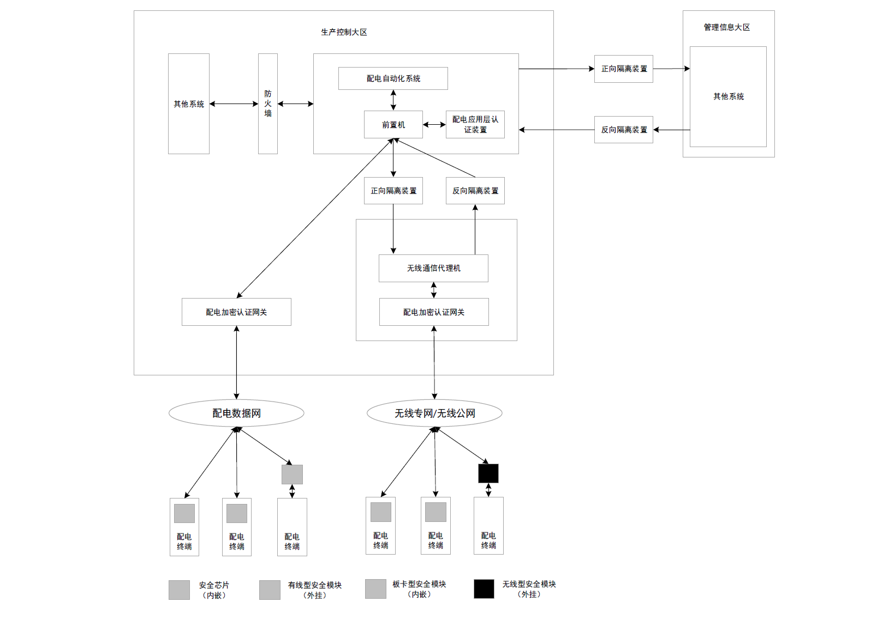
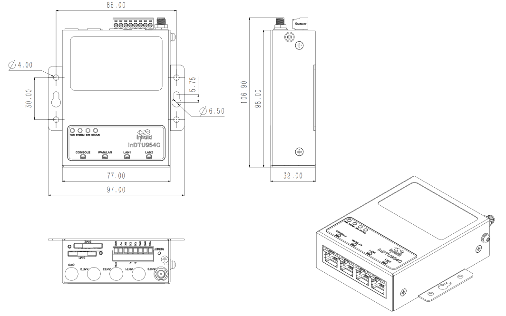
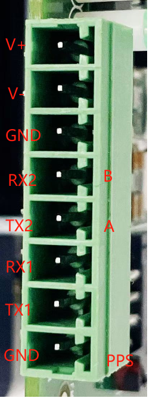

  

    

    

    

      安全稳定通信
    

  

  

    

      InDTU954C 系列
    

    

      

        
· 5G/4G

        
· 多接口

      

      

        
· 工业级设计

        
· 国密加密

      

    

  

# 1. 产品概述

InDTU954C系列工业安全数据终端是配电终端安全防护设备（简称配电终端安全模块），采用全国产化硬件平台，支持5G/4G/3G/2G蜂窝网络和有线接入，内置国密加密芯片可选，防火墙、ACL等多重安全防护。设备体积小巧，可安装于配电室、配电柜、架空线等各类配电终端箱体中，为配电终端提供数据保护，满足配电网数据安全实时传输要求，无缝对接各类电力主站平台。广泛应用于智能电网配电自动化、工业物联网边缘通信等场景。

## 核心技术指标

|技术指标|规格|
| --- | --- |
| 蜂窝网络 | 5G SA/NSA、LTE Cat4；有线与蜂窝互备；双 SIM |
| 云管理 | Web / SSH；南网网管、TR069 |
| VPN / 安全 | 国密 IPSec、防火墙、ACL、NAT |
| 加密性能 | 并发隧道 ≥8；网口密文吞吐量 ≥0.8 Mbps |
| 操作系统 | Linux |
| 接口 | 4×10/100M 以太网；1×RS-232/485 + 1×RS-232 |
| 天线 | 5G SMA × 2；GNSS SMA × 1（可选） |
| 供电 / 功耗 | 9–48 V DC；静态 1.16 W @ 12 V，工作 1.31 W @ 12 V |
| 尺寸 / 安装 | 77 × 98 × 32 mm；挂耳 / 导轨；金属外壳；IP30 |
| 工作环境 | -40 ~ +70 °C；湿度 5 ~ 95%（无凝霜） |
| EMC | 3 级 |
| 可靠性 | 看门狗故障自愈；双 SIM 链路切换；心跳检测 |

# 2. 产品特性和优势

| 特性和优势 | 说明 |
| ---------- | ---- |
| 通信可靠，传输稳定 | 支持5G/4G/3G/2G蜂窝网络，有线与蜂窝互备份，双SIM卡故障切换，独立软硬件看门狗，多级链路检测，通信自愈 |
| 多接口，适配更多应用场景 | 4路10/100M以太网接口，1路RS-232/RS-485+1路RS-232串口 |
| 电力级设计，适用各种恶劣场景 | 全工业级芯片，工作温度-40℃ ~ +70℃，低功耗设计，EMC 3级 |
| 安全加固，数据保护 | 支持国密、防火墙、NAT、ACL、IP-MAC绑定 |

# 3. 典型应用场景

  

InDTU954C系列工业安全数据终端广泛应用于智能电网配电自动化系统、工业物联网边缘通信等场景。在配电自动化领域，设备部署于配电室、配电柜及架空线等位置的配电终端箱体中，通过5G/4G蜂窝网络或以太网有线方式接入电力通信网络，建立与电力主站平台的安全加密隧道。设备内置国密IPSec VPN模块，对配电终端与主站之间的数据进行加密传输和身份认证，防止数据被窃取或篡改。同时支持双SIM卡链路冗余备份，当主链路故障时自动切换至备用链路，保障通信不中断。通过软硬件看门狗和多级链路检测机制，实现设备故障自修复和通信自愈，确保配电网数据安全、实时、可靠传输，为配电自动化系统提供坚实的网络安全保障。

# 4. 产品尺寸

  

    
  

# 5. 产品接口

  

    
  

  

    <table>
      <thead>
        <tr>
          <th>针脚</th>
          <th>定义</th>
          <th>说明</th>
        </tr>
      </thead>
      <tbody>
        <tr>
          <td align="center">1</td>
          <td align="center">V+</td>
          <td align="left">电源正极</td>
        </tr>
        <tr>
          <td align="center">2</td>
          <td align="center">V-</td>
          <td align="left">电源负极</td>
        </tr>
        <tr>
          <td align="center">3</td>
          <td align="center">GND</td>
          <td align="left">信号地</td>
        </tr>
        <tr>
          <td align="center">4</td>
          <td align="center">RX2或B</td>
          <td align="left">串口RS232接收或RS485-</td>
        </tr>
        <tr>
          <td align="center">5</td>
          <td align="center">TX2或A</td>
          <td align="left">串口RS232发送或RS485+</td>
        </tr>
        <tr>
          <td align="center">6</td>
          <td align="center">RX1</td>
          <td align="left">RS232接收</td>
        </tr>
        <tr>
          <td align="center">7</td>
          <td align="center">TX1</td>
          <td align="left">RS232发送</td>
        </tr>
        <tr>
          <td align="center">8</td>
          <td align="center">GND或PPS</td>
          <td align="left">信号地或PPS</td>
        </tr>
      </tbody>
    </table>
  

# 6. 硬件规格

| 类别/参数 | 规格 |
| --------- | ---- |
| **接口** | |
| 以太网端口 | 4×10/100Mbps以太网端口 |
| 串行接口 | 1×RS-232/485+1×RS-232 |
| SIM卡座 | 2×标准SIM，抽屉式卡座 |
| 天线接头 | 5G型号：SMA×2；GNSS（可选）：SMA×1 |
| 按键 | 针孔式复位按键×1 |
| **安全** | |
| 国密芯片（选配） | 国网加密芯片可选 |
| **电源及功耗** | |
| 输入电压 | 9-48V DC |
| 静态功耗（@12V） | 1.16 W |
| 工作功耗（@12V） | 1.31 W |
| 峰值功耗（@12V） | 4.80 W |
| **机械特性** | |
| 安装方式 | 挂耳，导轨 |
| 防护等级 | IP30 |
| 产品尺寸 | 77×98×32 mm |
| 散热方式 | 无风扇散热 |
| 外壳 | 金属 |
| **工作环境** | |
| 工作温度 | -40℃ ~ +70℃ |
| 存储温度 | -40℃ ~ +85℃ |
| 环境湿度 | 5%~95%（无凝霜） |
| **EMC特性** | |
| EMC等级 | 3级 |

# 7. 软件规格

| 类别/参数 | 规格 |
| --------- | ---- |
| **网络特性** | |
| 网络接入 | 支持APN、VPDN |
| 接入认证 | 支持CHAP/PAP认证 |
| 网络制式 | 5G SA/NSA、LTE Cat4 |
| LAN协议 | 支持ARP、Ethernet |
| WAN协议 | 支持静态IP、DHCP |
| IP应用 | ICMP、DNS、TCP/UDP、InHand DC TCP/UDP、TCP Server、DHCP |
| IP路由 | 静态路由 |
| NTP | 支持NTP网络对时 |
| **功能参数** | |
| 操作系统 | Linux |
| 配置方式 | Web、SSH |
| 升级方式 | 支持Web本地升级 |
| 日志功能 | 支持本地系统日志、远程日志、syslog日志协议 |
| 配置备份 | 支持配置文件的导入和导出 |
| 平台功能 | 支持南网网管平台、南网远程管理协议、TR069协议 |
| 链路在线检测 | 发送心跳包检测，断线自动连接 |
| 双SIM链路切换 | 支持双SIM链路切换 |
| 内嵌看门狗 | 设备运行自检技术，设备运行故障自修复 |
| **安全** | |
| 多级用户 | 支持多级管理权限 |
| 防火墙 | 全状态包检测（SPI）、防范拒绝服务（DoS）攻击；过滤多播/Ping数据包、访问控制列表（ACL）；NAT、PAT、DMZ、端口映射、虚拟服务器；具备防御常见网络攻击的能力 |
| 访问控制 | 支持基于IP、传输协议、应用端口号的综合报文过滤与访问控制功能 |
| 证书管理 | 支持设备认证，兼容主流厂家电力调度证书系统 |
| 国密IPSec | 支持GM/T 0022-2014《IPSec VPN技术规范》 |
| 其他技术 | 具备防物理攻击设计；具备对带有系统控制命令和参数设置指令的下行数据包进行识别，并对配电应用层认证装置的签名进行验签的功能 |
| **加密性能** | |
| 并发隧道数量 | ≥8 |
| 建立隧道时间 | ≤5秒（不含网络对时） |
| 网口双向明文吞吐量 | ≥2Mbps |
| 网口双向密文吞吐量 | ≥0.8Mbps |
| 串口双向明文吞吐量 | ≥7kbps |
| 串口双向密文吞吐量 | ≥7kbps |
| 明文转发平均时延 | ≤10ms |
| 密文转发平均时延 | ≤10ms |

# 8. 订购信息

## 型号规则

**Model code:** InDTU954C-\<WMNN\>-\<485/空\>-\<VPN/SEC/空\>

\<WMNN\>: 无线通讯类型 & 模块

\<485/空\>: 串口组合（485 为含 RS-485）

\<VPN/SEC/空\>: 国密加密方式（VPN 为南网加密，SEC 为国网加密）

## 产品型号

<table style="font-size: 10px; width: 100%;">
  <thead>
    <tr>
      <th style="width: 26%; white-space: nowrap; text-align: center;">型号</th>
      <th style="text-align: center;">&lt;WMNN&gt;</th>
      <th style="text-align: center;">串口</th>
      <th style="text-align: center;">网口</th>
      <th style="text-align: center;">加密</th>
    </tr>
  </thead>
  <tbody>
    <tr>
      <td style="white-space: nowrap;">InDTU954C-LQA8</td>
      <td>中国 LTE CAT4 LTE (FDD): Bands 1,3,5,8 LTE (TDD): Bands 34,38,39,40,41 WCDMA: Bands 1,5,8 GSM/EDGE：Bands 3,8</td>
      <td>2×RS-232</td>
      <td>3×10/100M</td>
      <td>—</td>
    </tr>
    <tr>
      <td style="white-space: nowrap;">InDTU954C-LQA8-VPN</td>
      <td>中国 LTE CAT4 LTE (FDD): Bands 1,3,5,8 LTE (TDD): Bands 34,38,39,40,41 WCDMA: Bands 1,5,8 GSM/EDGE：Bands 3,8</td>
      <td>2×RS-232</td>
      <td>3×10/100M</td>
      <td>南网加密</td>
    </tr>
    <tr>
      <td style="white-space: nowrap;">InDTU954C-NRQ2</td>
      <td>中国 5G NR 5G NR NSA: n78/n79 5G NR SA: n1/3/5/8/28/41/77/78/79 LTE-FDD: B1/B3/B5/B8 LTE-TDD: B34/B38/B39/B40/B41 WCDMA: B1/B8</td>
      <td>2×RS-232</td>
      <td>3×10/100M</td>
      <td>—</td>
    </tr>
    <tr>
      <td style="white-space: nowrap;">InDTU954C-NRQ2-VPN</td>
      <td>中国 5G NR 5G NR NSA: n78/n79 5G NR SA: n1/3/5/8/28/41/77/78/79 LTE-FDD: B1/B3/B5/B8 LTE-TDD: B34/B38/B39/B40/B41 WCDMA: B1/B8</td>
      <td>2×RS-232</td>
      <td>3×10/100M</td>
      <td>南网加密</td>
    </tr>
    <tr>
      <td style="white-space: nowrap;">InDTU954C-NRQ2-SEC</td>
      <td>中国 5G NR 5G NR NSA: n78/n79 5G NR SA: n1/3/5/8/28/41/77/78/79 LTE-FDD: B1/B3/B5/B8 LTE-TDD: B34/B38/B39/B40/B41 WCDMA: B1/B8</td>
      <td>2×RS-232</td>
      <td>3×10/100M</td>
      <td>国网加密</td>
    </tr>
  </tbody>
</table>

# 9. 联系我们

- **官网：** [映翰通官网](https://www.inhand.com.cn)
- **北京总部：** 北京市朝阳区紫月路18号院3号楼5层501，电话：010-84170010
- **智慧能源事业部：** 电话 13671069091，邮箱 daiqin@inhand.com.cn
- **版权声明：** ©映翰通网络 保留所有权利
