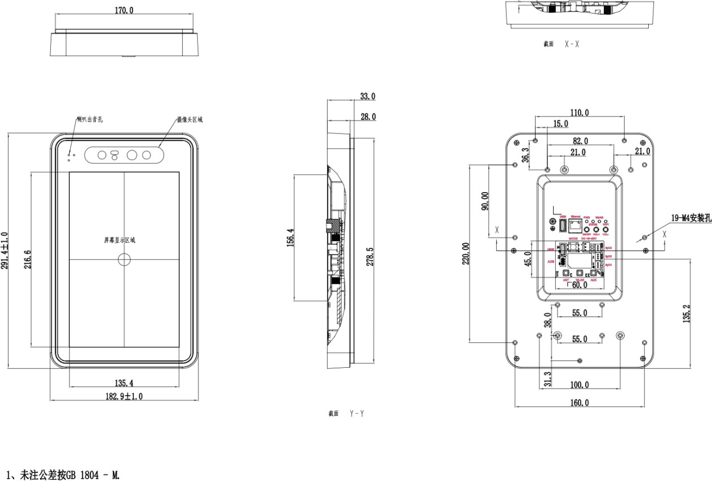

  

    

      
    

    

      10.1寸屏安卓一体机
    

  

  

    

      InPAD101S 系列
    

    

      

        
· 高通八核

        
· 4G全网通

        
· 10.1寸屏

        
· 刷脸支付

      

      

        
      

    

  

# 1. 产品概述

**InPAD101S 系列安卓一体机面向智慧商业领域，提供高性能数据处理、人机交互与设备联网能力。**

**产品特点：**
- **强劲配置:** 高通八核处理器，2GB/16GB存储，10.1寸高清显示屏
- **刷脸支付:** 可选微信/支付宝刷脸摄像头，支持多种非现金支付
- **稳定连接:** 支持4G、WiFi、蓝牙，保障设备通讯不间断
- **工业品质:** IP55防护、Level 3级EMC、宽温宽压工业设计
- **平台管理:** 云平台远程监控、远程升级，信息安全可靠

## 核心技术指标

| 项目          | 规格                                       |
|---------------|--------------------------------------------|
| 操作系统      | Android 7.1                                |
| 蜂窝网络      | 4G 全网通                                  |
| Wi-Fi         | 802.11 b/g/n                               |
| 蓝牙          | 蓝牙 4.2                                   |
| 网络接入      | 4G / WiFi                                  |
| 显示屏        | 10.1寸，800×1280，电容触摸                 |
| 接口          | 2×RS232、1×RS485、USB、以太网、音频        |
| 供电          | 12 V DC（2A）                              |
| 尺寸 (W × D × H) | 291.4 × 182.9 × 33 mm                   |
| 工作温度      | -10 °C ~ +60 °C                            |
| 防护等级      | IP55（不含背面接口处）                     |

# 2. 产品尺寸

  

  
注意：

  
1.所有尺寸单位为毫米（mm）。

  
2.所有尺寸均为近似值，仅供参考。

  
3.图示尺寸不得用于生产加工。

  
4.尺寸需符合零件及制造公差要求。

  
5.尺寸如有变更，恕不另行通知。

# 3. 硬件规格

| 类别/参数 | 规格 |
|--------------------------|------|
| **处理器** | |
| CPU | 高通八核处理器，主频 1.8 GHz |
| 内存 | 2 GB RAM |
| 存储 | 16 GB eMMC Flash |
| **显示屏** | |
| 显示屏 | 10.1 寸（分辨率 800 × 1280） |
| 触摸屏 | 电容屏 |
| **摄像头** | |
| 摄像头 | 可选，无 / 微信刷脸 / 支付宝刷脸摄像头 |
| **连接与联网** | |
| 蜂窝网络 | 4G 全网通 |
| SIM 卡槽 | 1 × SIM 卡槽 |
| 蜂窝天线 | 2 × SMA 接口 |
| Wi-Fi | 802.11 b/g/n |
| Wi-Fi 天线 | 1 × RP-SMA 接口 |
| 蓝牙 | 蓝牙 4.2 |
| **接口** | |
| 串口 | 2 × RS232、1 × RS485（3 针白色插座） |
| USB | 外部 Type-A USB 2.0 × 2；Micro-AB USB 2.0 × 1（OTG）；内部 Type-A USB 3.0 × 1 |
| 以太网 | 1 × Ethernet 接口 |
| 供电接口 | 12 V DC（2A）× 1 |
| 音频接口 | 内置喇叭 × 1 |
| 按键 | 电源键(Power) × 1；模式键(Mode) × 1；音量加(+) × 1；音量减(-) × 1 |
| **指示灯** | |
| 电源指示灯 | 供电指示灯，上电后常亮 |
| 运行状态指示灯 | 状态指示灯，正常运行时闪烁 |
| 3G/4G 状态灯 | 3G/4G 连接指示灯，正常连接时常亮 |
| Wi-Fi 状态灯 | Wi-Fi 连接指示灯，正常连接时常亮 |
| **机械** | |
| 外形尺寸 | 291.4 × 182.9 × 33 mm |
| 防护等级 | IP55（不包含产品背面接口处） |
| 散热方式 | 无风扇散热 |
| 外壳工艺 | 塑料外壳 |
| **电源** | |
| 电源输入 | 12 V（2A） |
| **环境** | |
| 工作温度 | -10 °C ~ +60 °C |
| 储存温度 | -40 °C ~ +85 °C |
| 环境湿度 | 5 ~ 95 %（无凝霜） |
| **其他** | |
| 看门狗 | 支持 |
| 实时时钟 | 内置 RTC |
| 功率 | 整机小于 15 W |
| **电磁兼容** | |
| EMC 指标 | 静电 Level 3；浪涌 Level 3；EFT Level 3 |
| **认证** | |
| 认证 | 3C 认证 |

# 4. 软件规格

| 类别/参数 | 规格 |
|--------------------------|------|
| **操作系统** | |
| 操作系统 | Android 7.1 |
| **应用软件** | |
| 应用软件 | 兼容 Android 系统丰富的应用软件；支持远程升级、静默安装等 API；可选微信/支付宝刷脸支付 |
| **网络特性** | |
| 网络 | 4G 全网通，WiFi |
| 蓝牙 | 蓝牙 4.2 |
| **图形处理** | |
| 2D/3D 加速器 | OpenCL 2.0 FP，DX12，OpenGL ES 3.1+，AEP，Adreno 506 650MHz |
| 视频编解码 | H.264 HP，MPEG4 ASP，MPEG2 MP |
| 图像处理 | BMP, JPG, PNG, GIF |
| **配置管理** | |
| 配置操作 | 提供配置软件 |
| 升级功能 | 本地 USB 升级，平台远程升级（可选） |

# 5. 订购信息

## 型号规则

**Model code:** InPAD101S-\<WMNN\>-\<STD/PLAT\>-\<CAM\>-\<ETH\>

\<WMNN\>: 无线通讯类型 & 模块
\<STD/PLAT\>: 版本（STD: 标准安卓版本；PLAT: 支持智能售货机平台，带售卖软件版本）
\<CAM\>: 摄像头（NA: 无摄像头；ZFB: 内嵌支付宝刷脸摄像头；WX-GJ: 内嵌微信刷脸摄像头）
\<ETH\>: 网口

## 产品型号

| 型号 | 区域 | \<WMNN\>: 无线通讯类型 & 模块 | \<STD/PLAT\>: 版本 | \<CAM\>: 摄像头 | \<ETH\>: 网口 |
|---------|-------|-----------|------------|------------|------------|
| InPAD101S-DQ60-STD-ETH | 中国 | LTE-FDD/LTE-TDD HSPA+ UMTS TD-HSDPA/HSUPA TD-SCDMA | STD | — | ETH |
| InPAD101S-DQ60-PLAT-ETH | 中国 | LTE-FDD/LTE-TDD HSPA+ UMTS TD-HSDPA/HSUPA TD-SCDMA | PLAT | — | ETH |
| InPAD101S-DQ60-STD-ZFB-ETH | 中国 | LTE-FDD/LTE-TDD HSPA+ UMTS TD-HSDPA/HSUPA TD-SCDMA | STD | ZFB | ETH |
| InPAD101S-DQ60-PLAT-ZFB-ETH | 中国 | LTE-FDD/LTE-TDD HSPA+ UMTS TD-HSDPA/HSUPA TD-SCDMA | PLAT | ZFB | ETH |
| InPAD101S-DQ60-STD-WX-GJ-ETH | 中国 | LTE-FDD/LTE-TDD HSPA+ UMTS TD-HSDPA/HSUPA TD-SCDMA | STD | WX-GJ | ETH |
| InPAD101S-DQ60-PLAT-WX-GJ-ETH | 中国 | LTE-FDD/LTE-TDD HSPA+ UMTS TD-HSDPA/HSUPA TD-SCDMA | PLAT | WX-GJ | ETH |

# 6. 联系我们

- **官网：** [映翰通官网](https://www.inhand.com.cn)
- **版权声明：** ©映翰通网络 保留所有权利
