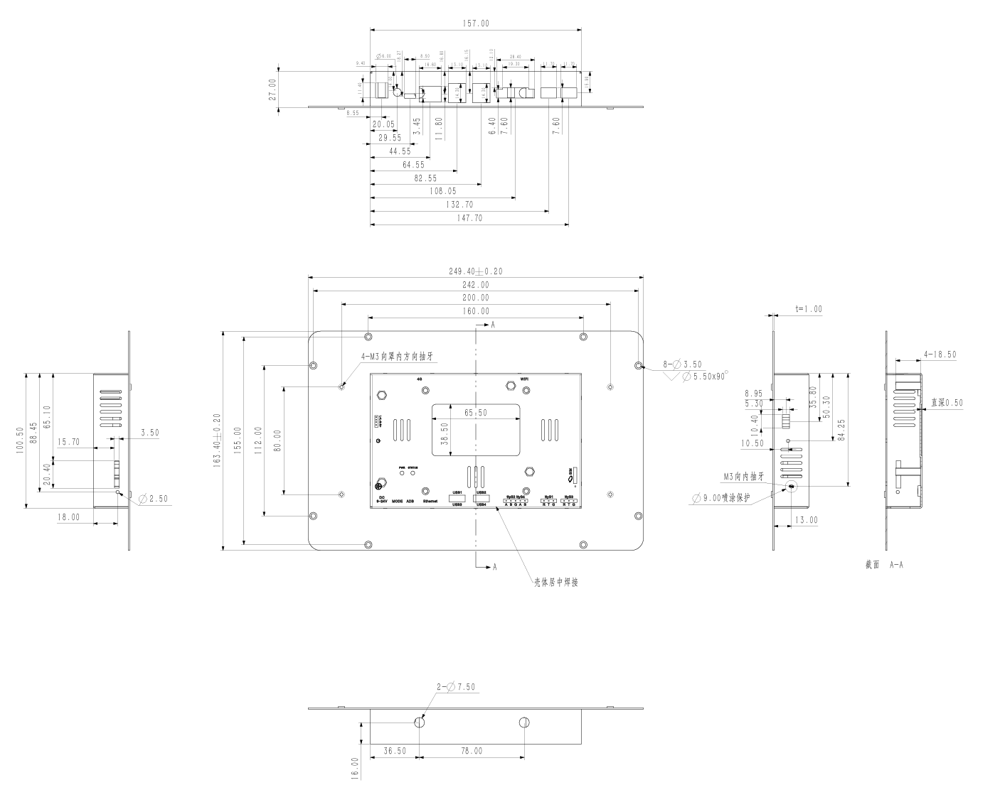

  
  

    

      10.1寸安卓工业触控一体机, 高亮电容交互, 全接口免转换直驱
    

    

      InPAD5101 工业平板
    

    <table style="margin: 56px auto 0 auto; border-collapse: separate; border-spacing: 12px; width: auto;">
      <tr>
        <td style="width: 250px; background-color: #4CAF50; color: #fff; padding: 8px 16px; border-radius: 16px; font-size: 16px; text-align: center; white-space: nowrap;">Android 11</td>
        <td style="width: 250px; background-color: #4CAF50; color: #fff; padding: 8px 16px; border-radius: 16px; font-size: 16px; text-align: center; white-space: nowrap;">1 TOPS NPU</td>
      </tr>
      <tr>
        <td style="width: 250px; background-color: #4CAF50; color: #fff; padding: 8px 16px; border-radius: 16px; font-size: 16px; text-align: center; white-space: nowrap;">RK3566四核</td>
        <td style="width: 250px; background-color: #4CAF50; color: #fff; padding: 8px 16px; border-radius: 16px; font-size: 16px; text-align: center; white-space: nowrap;">10.1寸450cd/㎡高亮触控0</td>
      </tr>
    </table>
  

  

    
  

# 1. 产品概述

**InPAD5101 系列 10.1 寸安卓工业触控一体机面向智能零售、工业制造、医疗健康、新能源等场景，兼具工业级高可靠耐受架构与商业级高灵敏图形交互，提供稳定可靠的人机交互与商业闭环能力。**

**产品特点：**

- **强劲配置:** RK3566 四核 Cortex-A55 1.8 GHz，内置 1 TOPS NPU，2GB+16GB 存储，Android 11
- **丰富接口:** 2路RS232、2路RS485、4路USB、百兆网口，读卡器/扫码枪/打印机/柜控板免转换直驱
- **高亮触控:** 10.1寸 1280×800 IPS 全视角屏，450 cd/㎡ 高亮，G+G 工业电容触控，支持水雾环境操作
- **工业品质:** 全金属外壳无风扇被动散热，屏幕面 IP65 防护，-10 °C ~ +60 °C 宽温，EMC Level 2 抗扰
- **开放生态:** 硬件定时开关机、看门狗自动复位、Kiosk 单应用锁定、本地 USB 批量升级

## 核心技术指标

| 项目             | 规格                                 |
| -------------- | ---------------------------------- |
| 操作系统           | Android 11                         |
| 显示屏            | 10.1寸，1280 × 800，450 cd/㎡          |
| 接口             | 2×RS232 + 2×RS485 + 4×USB + 1×百兆网口 |
| AI 算力          | 1 TOPS NPU                         |
| 尺寸 (W × D × H) | 258 × 172 × 36 mm                  |
| 供电             | DC 12V输入，5525圆形锁紧接口                |
| 工作温度           | -10 °C ~ +60 °C                    |
| 防护等级           | IP65（屏幕面）                          |

# 2. 典型应用

| 应用场景             | 应用要点                                                     |
| ---------------- | -------------------------------------------------------- |
| 智能现磨咖啡机与零售       | 高清触控选品、萃取动态展现、聚合扫码支付核销与后厨/清洗维护面板联动                        |
| 自助取件柜与智能货柜       | RS485 直驱多级锁控板，条码/二维码扫码取件、刷卡核验与实时状态上报                      |
| 新能源充换电与储能        | 充放电工况数据可视化图表动态呈现、用户充电结算交互与 BMS 状态监控                       |
| 医疗与诊所自助终端        | 诊前预约挂号、就诊卡/社保卡读取核验、医保缴费凭条与化验单外接打印                        |
| 工业机台与制造 MES 看板   | 产线工单流转确认、工艺参数实时下发、PLC 运行数据图表与 MES 系统互联                    |
| 智慧楼宇与会议考勤        | 工牌门禁考勤打卡、会议室实时日程看板、暖通温控与智能照明联动控制                          |

**外设免拓展直驱：** 扫码模组 · 身份证/IC读卡器 · 票据打印机 · 电子秤 · 串口继电器 · 柜控板

# 3. 产品尺寸

  

    
    
产品尺寸图

  

  
注意：

  
1.所有尺寸单位为毫米（mm）。

  
2.所有尺寸均为近似值，仅供参考。

  
3.图示尺寸不得用于生产加工。

  
4.未注公差参照 GB/T 1804-m 级执行。

  
5.尺寸如有变更，恕不另行通知；支持针对大批量 OEM 客户进行开模改型定制。

## 结构参数

| 项目             | 规格                                       |
| -------------- | ---------------------------------------- |
| 尺寸 (W × D × H) | 258 × 172 × 36 mm                        |
| 前置边框厚度         | 6.0 mm / 10.0 mm 边缘                      |
| 背部主体尺寸         | 157.0 × 100.5 / 106.7 mm                 |
| VESA 孔距        | 75 × 75 mm（4-M4 螺纹孔）                     |
| 壁挂孔位           | 200.0 × 80.0 mm（4-M3 螺丝孔）                |
| 安装方式           | 标准壁挂 / VESA 悬臂 / 嵌入式固定                    |
| 外壳材质           | 钣金+铝合金精密压铸                               |
| 散热架构           | 全密闭无风扇自然对流被动散热                           |
| 屏幕表面           | 纯平钢化防刮触摸玻璃，IP65 密封                       |

# 4. 硬件规格

| 类别/参数                                        | 规格                                        |
| -------------------------------------------- | ----------------------------------------- |
| **计算平台**  |                                           |
| CPU                                          | RK3566 四核 64位 Cortex-A55，主频最高 1.8 GHz     |
| RAM                                          | 2 GB LPDDR4（可选配更大容量扩展）                    |
| 存储                                           | 16 GB eMMC 5.1 工业闪存                       |
| NPU                                          | 1 TOPS                                    |
| **显示屏**   |                                           |
| 尺寸                                           | 10.1 寸                                    |
| 分辨率                                          | 1280 × 800                                |
| 亮度                                           | 450 cd/㎡（典型值）                             |
| 对比度                                          | 800:1                                     |
| 可视角度                                         | 全视角 IPS                                   |
| 触摸屏                                          | 多点电容触摸屏（G+G 钢化玻璃），抗划伤防水雾，屏幕面 IP65         |
| **接口**    |                                           |
| 以太网                                          | 10/100 Mbps × 1，LAN/WAN                   |
| USB                                          | USB 2.0 × 4，Host                          |
| RS232                                        | 2 路，3 pin 工业端子，间距 3.5 mm，无法兰（ttyS1、ttyS3） |
| RS485                                        | 2 路，5 pin 工业端子，间距 3.5 mm，带法兰（ttyS2、ttyS4） |
| Audio                                        | SPK × 1，可外接 2 声道 8 Ω 5 W 扬声器，2.0 mm 4 Pin |
| 天线接口                                         | Wi-Fi：RP-SMA × 1                          |
| 调试接口                                         | ADB 接口 × 1                                |
| 按键                                           | 电源键 × 1，模式切换键 × 1                         |
| **无线**    |                                           |
| Wi-Fi                                        | 802.11 b/g/n，支持 Client / AP 模式            |
| 蓝牙                                           | Bluetooth 4.2                             |
| **指示灯**   |                                           |
| 电源灯                                          | 供电指示灯，上电后常亮                               |
| 状态灯                                          | 状态指示灯，系统就绪及正常运行时闪烁                        |
| **电源**    |                                           |
| 输入电源                                         | DC 12 V，5525 圆形锁紧接口                       |
| 通电自启                                         | 来电时机器自动启动                                 |
| 功耗                                           | 整机小于 10 W（不带外设）                           |
| 实时时钟                                         | 内置 RTC，纽扣电池供电                             |
| **机械**    |                                           |
| 尺寸 (W × D × H)                               | 258 × 172 × 36 mm                         |
| 外壳                                           | 全金属（钣金+铝合金压铸）                             |
| 散热                                           | 无风扇散热                                     |
| 防护等级                                         | IP65（屏幕面）                                 |
| **环境**    |                                           |
| 工作温度                                         | -10 °C ~ +60 °C                           |
| 储存温度                                         | -40 °C ~ +85 °C                           |
| 湿度                                           | 5 % ~ 95 % RH（无凝露）                        |
| **EMC**   |                                           |
| 静电                                           | Level 2                                   |
| EFT                                          | Level 2                                   |
| 浪涌                                           | Level 2                                   |

**说明：**

- 所有串口驱动及通信协议均已在官方系统镜像中完成底层封装与接口映射

# 5. 软件规格

| 类别/参数                                       | 规格                                                                                                                       |
| ------------------------------------------- | ------------------------------------------------------------------------------------------------------------------------ |
| **操作系统** |                                                                                                                          |
| 操作系统                                        | Android 11，支持深度定制精简与系统加固                                                                                                  |
| **图形处理** |                                                                                                                          |
| GPU                                         | Mali-G52 2EE，支持 OpenGL ES 1.1/2.0/3.2、OpenCL 2.0、Vulkan 1.1，内置 2D 硬件加速                                                     |
| 视频编解码                                       | 解码：4K@60fps H.265 / H.264 / VP9；编码：1080P@60fps H.265 / H.264；内置 ISP（800W）                                                  |
| AI 处理                                       | 独立 NPU，1.0 TOPS 边缘端侧算力，赋能端侧 AI 视觉与语音算法                                                                                     |
| **配置管理** |                                                                                                                          |
| 定时开关机                                       | 支持（硬件级）                                                                                                                   |
| 看门狗                                         | 支持，故障自动复位                                                                                                                 |
| 应用锁定                                        | 支持开机单一应用（Kiosk）锁定                                                                                                         |
| 系统升级                                        | 本地 USB 快速升级，支持批量部署                                                                                                        |

# 6. 订购信息

## 型号规则

**Model code:** InPAD5101-\<EN00\>-\<STD\>

\<EN00\>: Cellular Networks（蜂窝网络）

\<STD\>: 系统配置

## 产品型号

<table style="width: 100%; border-collapse: collapse;">
  <colgroup>
    <col style="width: 32%;" />
    <col style="width: 38%;" />
    <col style="width: 30%;" />
  </colgroup>
  <thead>
    <tr>
      <th>型号</th>
      <th>蜂窝网络</th>
      <th>系统配置</th>
    </tr>
  </thead>
  <tbody>
    <tr>
      <td style="white-space: nowrap;">InPAD5101-EN00-STD</td>
      <td>—（标配不带 4G/5G 蜂窝模组，支持按需选配定制）</td>
      <td>STD：标准 Android 11，2GB RAM + 16GB Flash</td>
    </tr>
  </tbody>
</table>

**标准配置型号 InPAD5101-EN00-STD：**

- 处理器：RK3566 四核 Cortex-A55 1.8 GHz + 1T NPU
- 存储配置：2GB LPDDR4 内存 + 16GB eMMC 闪存
- 网络通信：百兆以太网口 ×1 + WiFi 802.11 b/g/n + 蓝牙 4.2
- 显示规格：10.1寸 1280×800 450 cd/㎡ 高亮电容触控
- 接口配备：2×RS232 + 2×RS485 + 4×USB + 功放 SPK

# 7. 联系我们

- **官网：** [映翰通官网](https://www.inhand.com.cn)
- **商务咨询：** info@inhand.com.cn
- **服务热线：** 400-888-5252
- **版权声明：** ©2026 北京映翰通网络技术股份有限公司 映翰通网络 保留所有权利
