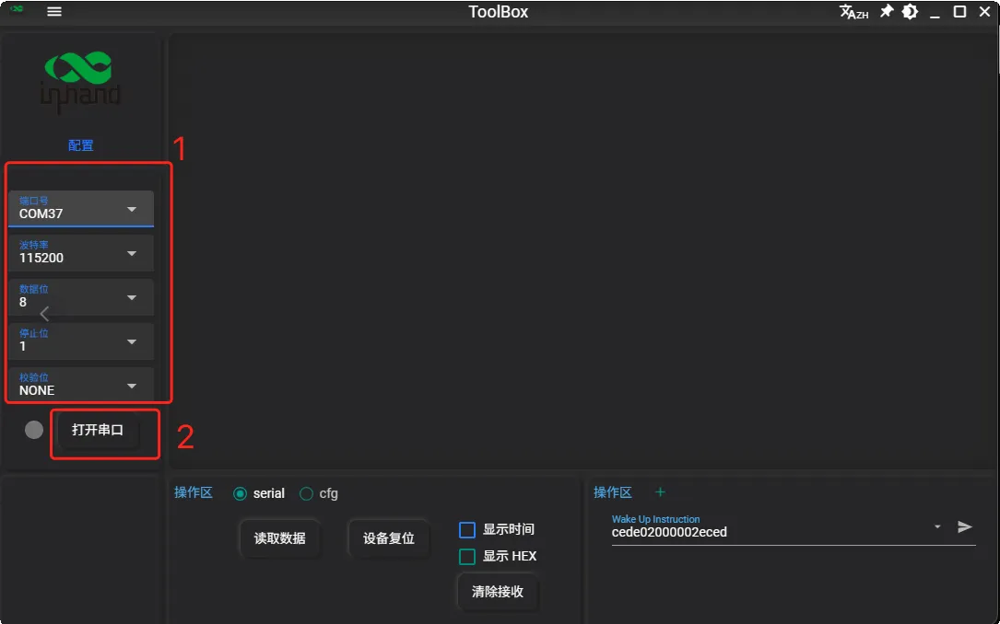
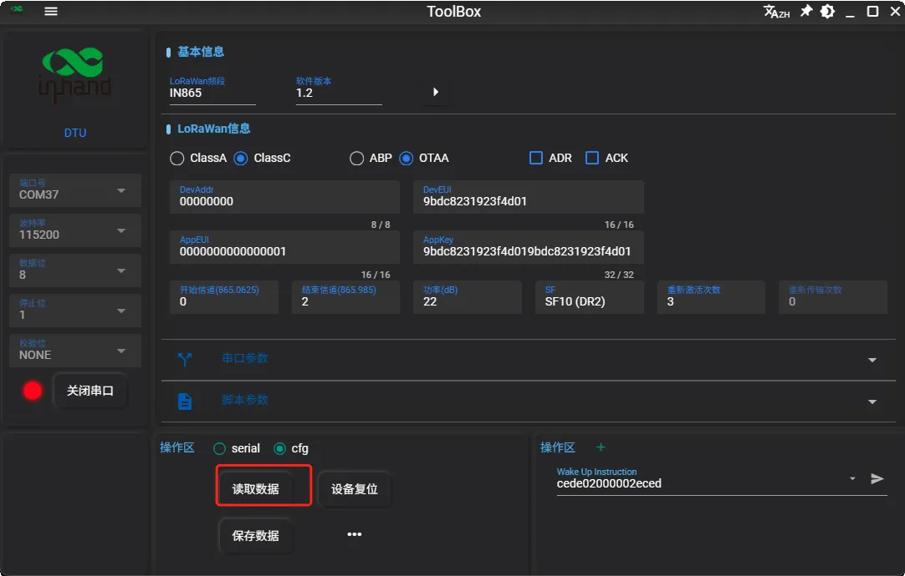
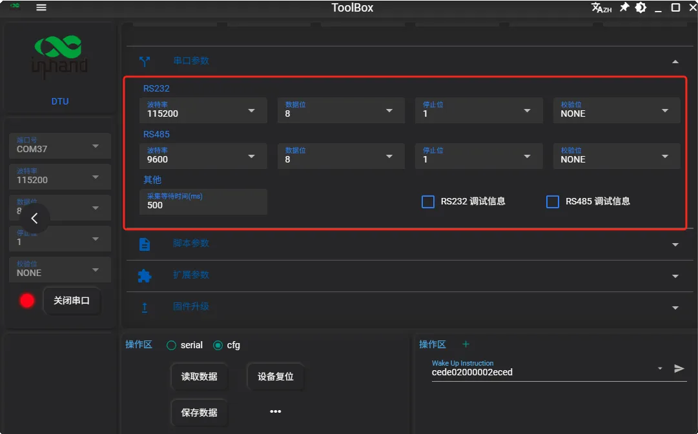
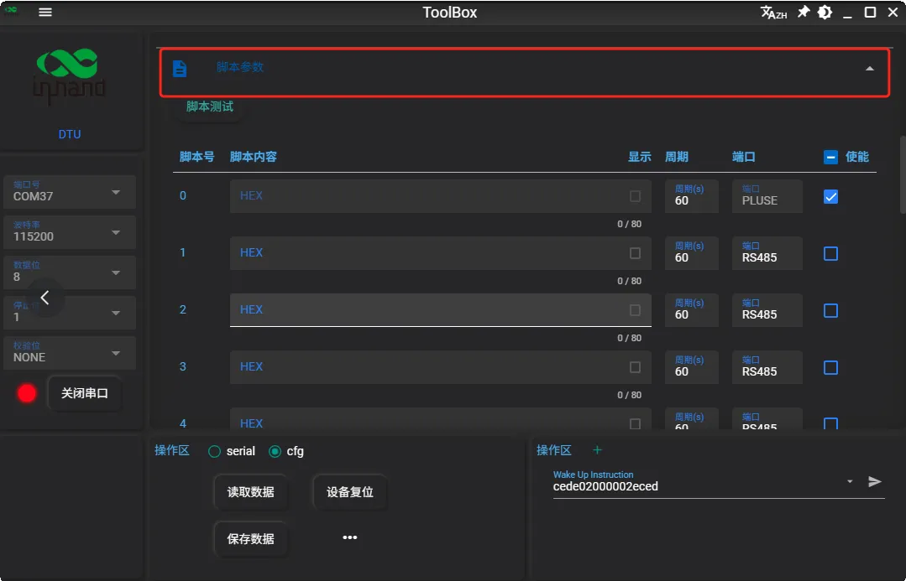
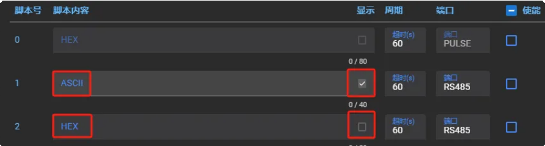
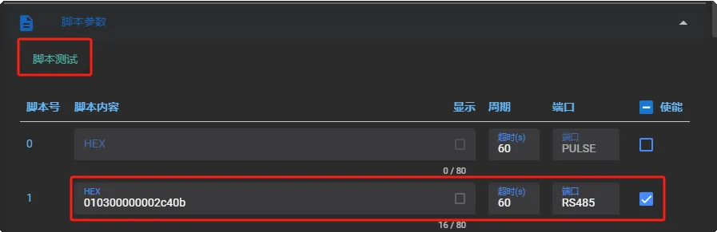
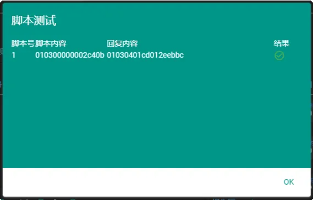
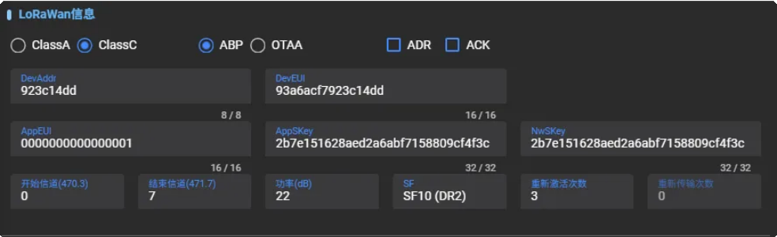

# LT312用户手册

**LoRaWAN  DTU系列** **用户手册**

Version1.0 | www.inhand.com.cn

本手册中描述的软件是根据许可协议提供的，  只能按照该协议的条款使用。

## 版权声明

© 2025 映翰通网络 保留所有权利。

## 商标

InHand标志是映翰通网络的注册商标。

本手册中的所有其他商标或注册商标属于其各自的制造商。

## 免责声明

本公司保留对此手册更改的权利，产品后续相关变更时，恕不另行通知。对于任何因安装、 用不当而导致的直接、间接、有意或无意的损坏及隐患概不负责。

## 1 导言

本用户手册将指导用户如何使用本产品，请在使用产品之前，仔细阅读本用户指南。

本文档的所有内容受法律保护，未经许可，任何组织或个人不得以任何方式复制或传播此文件。

我们尽最大努力使此文档准确无误，但有可能仍然存在不可避免的错误。我们会定期检查这份文件的内容，使得本文档的内容与相应的产品相符。您的建议我们将不胜感激。

下面是关于产品的正确使用方法为预防危险、防止财产受到损失等内容，使用设备前请仔细阅读本说明书并在使用时严格遵守。

## 2  安全说明

- 避免将设备放置在阳光直射、 发热源、 易燃易爆、 潮湿、 多灰尘或煤烟环境中

- 远离火源、 强电场、 强磁场及复杂干扰源，  以免造成永久性损坏

- 安装时请避开大型金属设备，  天线不得置于金属箱体内

- 不可安装在高振动设备上，  避免外部撞击或震动。

- 禁止液体滴落或溅入设备，  户外安装需做好防水处理。

- 设备接线须在关机状态下进行，  并严格按照说明书操作。

- 本产品会发射无线电频率，  可能对其他无线通信造成干扰，  特定环境下无法完全避免。

- 使用中应严格遵守本手册要求，  本公司不对不当操作造成的损坏负责。

- 禁止改装本产品，  避免在超出规定温湿度范围的环境下使用

- 拆卸外壳时注意勿遗漏或损坏内部元件。

## 3 使用指南

### 3.1、配置LT312

配置准备：

1. LT312设备；

2. RS485或RS232设备（简称：  应用设备）  ；

3. USB转RS485/USB转RS232数据线；

4. 电脑；

5. Inhand-Toolbox配置工具软件；

配置步骤：

1. 设置LT312串口参数，  使LT312设备与应用设备串口通信参数一致；

2. 设置LT312透明传输或定时采集上报；

3. 设置LT312的通信频点，  使LT312设备和LoRaWAN网关通信频点保持一致；

4. 在LoRaWAN服务器/LoRaWAN边缘网关（带LoRaWAN服务器的网关） 上填写入网参数对LT312设备进行入网。

#### 3.1.1 获取设备信息

1. 将LT312与电脑通过USB转RS485或者RS232连接后打开Toolbox工具；

2. 设置好串口参数，  点击打开串口，  点击“读取数据”，  获得LT312所有参数；

#### 默认串口参数

| 串口参数 | RS485 | RS232 |
| --- | --- | --- |
| 波特率 | 9600 | 115200 |
| 数据位 | 8 | 8 |
| 停止位 | 1 | 1 |
| 校验位 | None | None |

#### 3.1.2 串口参数设置

此步骤需要将LT312设备串口参数配置成和应用设备一致的串口参数，使LT312设备和应用设备建立串口通信。

1. 串口采集延时：

低波特率，  多脚本采集时，  采集串口延时需要适当加长，否则可能会出现采集失败的情况。  适用于波特率低于1200的情况下使用。

2. 波特率设置：

110/300/600/1200/2400/4800/9600/14400/19200/38400/43000/57600/76800/115200

3. RS485调试信息：

开启后可以打印485接口更加详细的串口数据，  便于测试，  调试。

4）  RS232调试信息：

开启后可以打印232接口更加详细的串口数据，  便于测试，  调试。

> 注意：  部分传感器可能会因为DTU调试打印信息导致采集失败，因此建议脚本采集时关闭串口调试信息

#### 3.1.3 工作模式设置

透传模式：

LT312设备出厂默认开启透传模式，  LT312在透传模式下获取应用设备数据有两种方式：

- 应用设备主动上报数据，  LT312收到数据即上发至关；

- 网关下发指令至LT312去获取应用设备的数据。

主动采集模式：

由于大多数LoRaWAN网关下发通道较少，  LT312设备具有脚本采集功能，  该功能由LT312设备按设置周期并使用配置指令去获取应用设备的数据，  以此减少网关下发压力。

> 注意：  脚本是发送给应用设备读取数据指令，  编写需要参考应用设备通信协议。

1、  脚本0为心跳包， 用于定期上报设备信息， 确定设备是否在线使用，  支持设置周期。  （具体解析内容参考通信协议3.3节）  （此心跳包不支持修改内容）

2、  脚本支持HEX和ASCII两种方式，  脚本最大长度40字节。

3. 最大支持16个脚本采集，  多脚本采集时，  请合理分配采集周期。

4. 脚本最短采集周期10s，  最⻓采集周期86400s。

> 注意：  脚本最短采集周期，  请结合传感器设备状态进行设定，  设置过快，  可能导致采集失败。

5. 设置脚本后，可检查脚本正确性。  填入脚本，勾选脚本使能，点击脚本测试。

> 注意：  脚本测试需要对应串口接入对应的传感器设备，  也请注意检查线路是否正确。

以上步骤完成了LT312与应用设备的通信配置，  接下来需要进行LT312与LoRaWAN网络的通信配置

#### 3.1.4 LoRaWAN基本配置

设备连接到 LoRaWAN网络前需要设置相关网络通信参数，

请根据如下步骤完成 LoRaWAN网络配置

如不了解LoRaWAN各种常用参数，  参数含义可参考下表：

| 参数 | 说明 |
| --- | --- |
| DevAddr | 设备短地址：  用于ABP入网使用，  可在产品标签上查看。 |
| DevEUI | 设备的唯一识别标识符：  用于OTAA入网使用，  可在产品标签上查看。 |
| AppEUI | 应用标识： 64位的全局唯一标识符，  用于标识和管理LoRaWAN网络中的特定应用程序。 默认：  0000000000000001 |
| AppSKey | 应用会话秘钥： ABP模式使用，  用于加密和解密设备与应用服务器之间传输数据的密钥。 默认秘钥：  2b7e151628aed2a6abf7158809cf4f3c |
| NwkSKey | 网络会话秘钥： ABP模式使用，  用于加密和解密设备与网络服务器之间传输数据的密钥，  并用于设备认证。 默认秘钥：  2b7e151628aed2a6abf7158809cf4f3c |
| AppKey | 应用秘钥： OTAA模式使用，  用于加密和解密设备与应用服务器之间传输秘钥，  并用于设备认证。 默认秘钥：  2b7e151628aed2a6abf7158809cf4f3c |
| ABP模式 | 本地激活： LoRaWAN设备入网方式， 设备的网络会话密钥、 应用会话密钥和短地址在出厂时预先配置， 允许设备即插即用地进行通信， 适用于不需要频繁更换密钥的应用场景。 |
| OTAA模式 | 空中激活： LoRaWAN设备入网方式， 通过动态密钥协商和空中传输进行设备激活， 提供更高的安全性和灵活性， 适合移动和跨网络操作的应用场景 。 |
| Class A | 设备类别A： 采用标准的 ALOHA 通信模式，  包含上行通信、  下行通信和固定的接收窗口，  适用于大多数低功耗传感器和应用场景。 |
| Class C | 设备类别C： 一直开启接收窗口2， 确保随时可以接收下行消息，  适用于需要低延迟和高频下行通信的应用场景。 |
| ADR | 速率自适应： 启用后网络服务器可以调节终端的数据速率和功耗，  建议在设备没有移动的情况下使用。 |
| ACK | 确认包： 确认数据包成功接收的消息，  确保可靠数据传输，  适用于需要高可靠性的应用场景。 |
| 初始信道 | 设备加入LoRaWAN网络或首次通信时使用的第一个频率信道。 |
| 结束信道 | 设备在设定的频率范围内使用的最后一个频率信道，  确保在规定的频谱范 围内通信 。 |
| 功率 | 设备发送功率： PA版本默认： 27dBm， 普通版本默认： 22dBm |
| SF | 扩频因子：  禁用 ADR 的情况下设备将根据设置的SF传输数据。  SF越 小，  传输速率越快，  适合近距离传输，  反之亦然。 设置范围：  7-12 |
| 重新激活次数 | OTAA模式下，  入网失败情况下，  重新入网次数。 |

### 3.2、扩展参数

| 功能 | 说明 |
| --- | --- |
| 休眠模式 | DTU发送完数据之后自动进低功耗，  适用于电池供电模式使用。 注：  LT312为非低功耗DTU设备，  请勿开启。 |
| 快速发送模式 | 牺牲下发接收性能，  最快采集上发，  特殊情况下，  透传模式最快1s发送1个 数据包 。 注：  快速发送模式下，  可能无法接收下行数据。 |
| OTAA热加载 | OTAA模式下入网成功后，  断电重启无需再次入网，  即可通信。 |
| 简易计数器 | 上行计数65535， 默认关闭。 注：  如需使用，  需要LoRaWAN服务器配合一起使。 |
| 连续接收 | 开启后，  功耗增大，  可提高接收数据稳定性。 |
| 信道活动检测 | 快速判断当前 LoRa 信道是否有正在进行的 LoRa 信号传输， 若检测到信道空闲， 则立即发送数据， 若检测到信道忙碌， 则等待一段时间后重新尝试。 |
| 上行计数持久化 | 终端上行计数断电不清零，  恢复出厂设置可清零计数。 |
| 窗口1开启时间 | 默认1s，  不建议更改，  有问题可以联系技术人员。 |
| 窗口1持续时间 | 默认3s，  不建议更改，  有问题可以联系技术人员。 |
| 窗口2开启时间 | 默认2s，  不建议更改，  有问题可以联系技术人员。 |
| 窗口2持续时间 | 默认3s，  不建议更改，  有问题可以联系技术人员。 |
| 窗口2 SF | 接收窗口2扩频因子，  默认SF12， 可设置SF7-SF12， DTU修改后，  服务器窗口2扩频因子对应修改，  用于Class C多设备频繁下发数据包使用。 注：  如需修改，  需要LoRaWAN服务器配合一起使用。 |
| 窗口2下发信道 | 默认25信道（505.3） ，  用于Class C多设备频繁下发数据包使用。 注：  如需修改，  需要LoRaWAN服务器配合一起使用。 |
| 组播开关 | 开启后，  可对DTU进行批量配置。 |
| 组播信道 | 默认25信道（505.3Mhz） ，  窗口2下发频率 |
| 组播窗口2 SF | 默认SF12(DR0)， 窗口2下发扩频因子 |
| 组播地址 | 默认： ffffffff， 组播短地址 |
| 组播AppSKey | 组播应用秘钥 默认：  2b7e151628aed2a6abf7158809cf4f3c |
| 组播Nwskey | 组播网络秘钥： 默认：  2b7e151628aed2a6abf7158809cf4f3c |

### 3.3、通信协议

设备上/下行数据均基于十六进制格式。

**1、重启包**

重启包端口：  214

数据包：

01表示硬件重启

03表示软件重启

04表示硬件看⻔狗重启

05表示软件看⻔狗重启

**2、上行数据包**

心跳包解析

心跳包端口：  40

心跳包： cede3400003c0a8201460000000100000000c6eced

| cede | 包头 |
| --- | --- |
| 34 | 数据包类型，  34代表心跳包 |
| 00003c | 心跳包周期，单位 s，十进制：  60s |
| 0a82 | 模组温度，单位℃，十 进 制 / 100： 26.9℃ |
| 0146 | 模组电压，单位 V ，十进制  / 100： 3.26V |
| 00000001 | 脚本1开启 4个字节，32位数据，1位表示1个脚本开关，0表示关闭，1表示开启 |
| 00000000 | 当前脚本采集成功数量 如：设置3个脚本均采集成功，则显示00000003 |
| C6 | XOR校验 |
| eced | 包尾 |

#### 上电包解析

上电包端口：  215

上电包：  110401020000000104

| 11 | 设备类型：  功率增强DTU 10：  普通版本DTU |
| --- | --- |
| 04 | 通信协议：  04 |
| 0102 | 软件版本：  1.2 |
| 00000001 | 表示脚本1开启 4个字节，  32位数据，  1位表示1个脚本开关，  0表示关闭，  1表示开启 |
| 04 | 设备电量 04：  满格 |

#### 数据包端口说明

| 端口号 | 说明 |
| --- | --- |
| 214 | 重启包 |
| 215 | DTU上电包 |
| 40 | 心跳包 |
| 42 | 获取指令返回数据包 |
| 43 | 下发配置数据回复包 |
| 51 | RS232透传上发数据包 |
| 52 | RS485透传上发数据包 |
| 1 | 脚本1数据包 |
| 2 | 脚本2数据包 |
| 3 | 脚本3数据包 |
| … | … |
| 15 | 脚本15数据包 |
| 16 | 脚本16数据包 |
