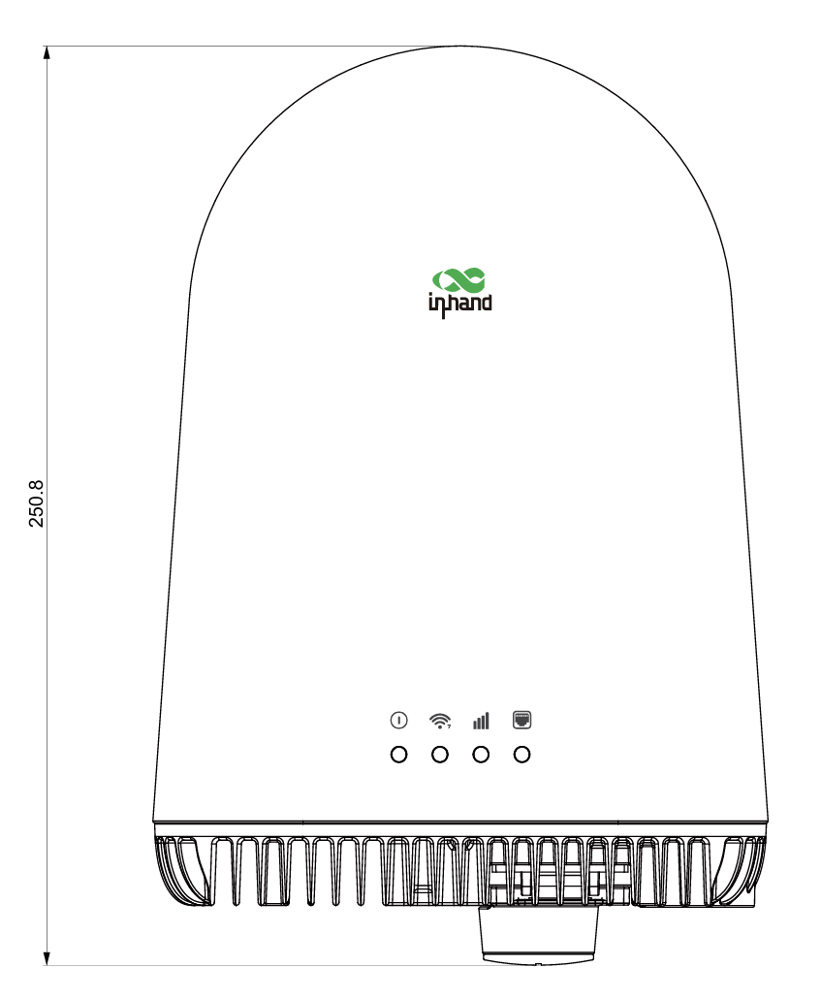
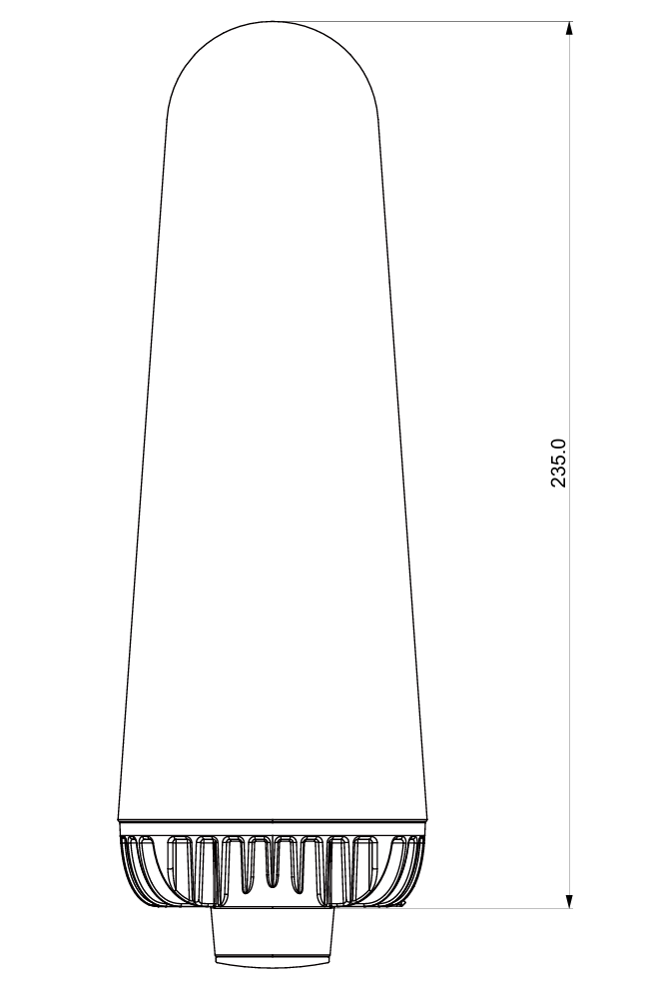
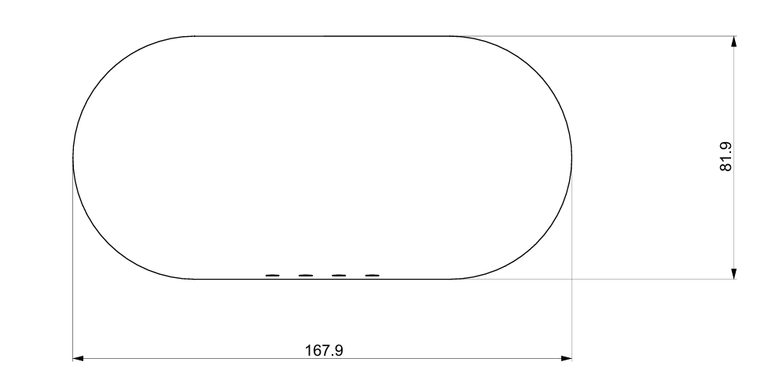

  

    

      
    

    

      形制至简，畅联无限
    

  

  

    

      ODU12 5G 户外 AI 原生路由器
    

    

      

        
· 5G

        
· Wi-Fi 6

      

      

        
· 户外 IP65

        
· AI 原生

      

    

  

# 1. 产品概述

ODU12 是一款创新的户外 5G 路由器——基于开创性的结构-散热一体化设计打造的高性能、云管理网络接入设备。它将高性能连接与建筑美学完美融合，专为住宅和轻商用场景而设计。5G SA/NSA 双模蜂窝、Wi-Fi 6 双频无线和 2.5 Gbps 有线组网等先进能力，被集成于紧凑的 IP65 防护等级外壳之中。

ODU12 突破了传统户外路由器笨重的外观和杂乱的外置天线设计。其极简的一体化设计采用全集成 360° 全向天线，在极端天气下仍能提供可靠性能，同时最大限度减少视觉影响，与建筑环境和谐融为一体。

ODU12 是真正的 AI Agent 原生路由器，专为未来数字化办公场景而设计。

## 主要特性

- **超快 5G 连接：** 5G SA/NSA 双模支持，下行速率最高 2.6 Gbps
- **Wi-Fi 6：** AX3000 双频并发，最多支持 128 个连接客户端
- **Agent 原生路由器：** 支持 Agent CLI，实现基于意图的配置
- **丰富技能库：** 支持智能诊断
- **全集成天线设计：** 4 根 5G 蜂窝天线 + 3 根 Wi-Fi 天线，实现 360° 覆盖
- **结构-散热一体化：** 压铸铝散热片兼具结构框架功能；无风扇被动散热
- **极简美学设计：** 一体式几何外观，低调融入任何建筑环境
- **PoE 便捷受电：** IEEE 802.3at PoE 受电
- **云端管理与运维：** 通过 InCloud 平台统一管理；随时随地通过手机 APP 操作

## 典型应用场景

### 住宅

**别墅与独栋住宅：** 庭院、车库、泳池等户外区域

**高端社区与公寓：** 户外公共区域（花园、健身区、停车场）

### 轻商用

**农贸市场**

**度假村与露营地**

**户外咖啡厅与餐厅**

**酒庄**

**临时摊位与快闪店**

**乡村旅游 / 农家乐**

### 企业分支机构

**企业分支机构：** 室内覆盖不佳时提供强大的户外信号

**工厂、仓库与物流园区：** 大面积户外区域，满足 AGV 调度、安防监控和员工通信需求

**临时施工现场网络**

### 智慧城市

**户外数字标牌**

**广场、车站、公园与海滩：**

- 户外监控安防

- 为市民和游客提供免费 Wi-Fi

## 产品尺寸

  

    

      
    

    
俯视图

  

  

    

      
    

    
侧视图

  

  

    

      
    

    
底部图

  

  
<strong>说明：</strong>

  
1. 所有尺寸单位为毫米（mm），括号内为英寸（in）。

  
2. 所有尺寸均为近似值，仅供参考。

  
3. 图纸不得用于生产制造。

  
4. 尺寸受零部件及制造公差影响。

  
5. 规格如有变更，恕不另行通知。

# 2. 产品创新

## 创新一：结构-散热一体化

**压铸铝散热片**同时作为被动散热元件和主要结构框架：

- 取消风扇和冗余的内部支撑结构，实现无风扇静音运行
- 在保持 IP65 防护的同时显著缩小体积
- 增强耐用性和长期可靠性，延长元器件使用寿命
- 大幅降低物料清单（BOM）成本和装配复杂度

### 创新二：全集成天线美学

**360° 全向高增益天线**完全集成于一体式外壳内：

- 8 根 5G 蜂窝天线 + 3 根 Wi-Fi 天线的集成布局
- 无外置天线部件，消除视觉杂乱
- 紧凑低矮外观下保持均匀的信号覆盖
- 与建筑环境无缝融合，减少视觉干扰

### 创新三：统一安装接口

**单一接口**支持多种安装方式：

- 壁挂、立杆和屋顶安装
- 无需专业技能或专业安装人员
- 用户可在几分钟内完成安装部署
- 一个 SKU 覆盖所有安装场景，优化库存管理

### 创新四：AI Agent 云管理

AI Agent 云管理实现统一的远程运维：

- 一键云端上线；远程批量配置下发
- 实时监控设备状态、流量和信号
- **AI Agent：** 网络优化与故障早期发现
- 手机 APP：二维码设备上线、告警推送通知，随时随地管理

### 创新五：AI 原生路由器

- 支持 Agent CLI
- 基于意图的配置
- 丰富技能库
- 支持智能诊断

# 3. 硬件规格

| 项目 | 规格 |
| ------------- | --------------------------------------- |
| **处理器** | 双核 Cortex-A53 @ 1.3 GHz |
| **内存** | 512MB DDR3 |
| **存储** | 128MB SPI Flash |
| **5G 模块** | MTK 830 平台，3GPP Release 16 |
| **SIM 卡槽** | 2 × 4FF Nano-SIM + 1 × eSIM（预留） |
| **WAN 口** | 1 × 1 Gbps RJ45，支持WAN/LAN切换 |
| **LAN 口** | 1 × 2.5 Gbps RJ45, PoE 受电 |
| **Wi-Fi** | Wi-Fi 6（802.11ax）双频 AX3000 |
| **5G 天线** | 4 根集成高性能蜂窝天线，360° 全向覆盖 |
| **Wi-Fi 天线** | 3 根集成天线（2.4 GHz × 2 + 5 GHz × 3） |
| **供电方式** | IEEE 802.3at PoE 受电（兼容 802.3af） |
| **功耗** | ≤ 18 W |
| **复位按键** | 1 个 Reset 按键 |
| **散热方式** | 结构-散热一体化被动散热，无风扇设计 |
| **防护等级** | IP65 |
| **外壳材质** | 压铸铝散热片 + 抗紫外线聚合物外壳 |
| **颜色** | 白色 |
| **工作温度** | -30 °C ~ +70 °C（-22 °F ~ +158 °F） |
| **存储温度** | -40 °C ~ +85 °C（-40 °F ~ +185 °F） |
| **相对湿度** | 5% ~ 95%，无凝结 |
| **尺寸** | 235 mm x 167.93 mm x 81.93 mm |
| **重量** | 约 1.5 kg（3.31 lb）（参考） |
| **安装方式** | 壁挂、立杆和屋顶安装 |

## LED 指示灯

ODU12 配备 4 个多色 LED（红/蓝/绿），分别用于系统、Wi-Fi、信号和端口。每个 LED 均保留三色能力，可灵活配置。指示灯布局简洁直观，使用户能够快速了解设备运行状态。

# 4. 网络连接

## 4.1 5G/4G 蜂窝网络

- **网络制式：**
  - 5G：NR SA/NSA，Sub-6 GHz，3GPP Release 15
  - 4G：LTE-FDD/LTE-TDD，Cat.12/13
- **速率规格：**
  - 5G SA：下行 2 Gbps / 上行 766 Mbps
  - 5G NSA：下行 2.6 Gbps / 上行 458 Mbps
  - 4G Cat.12/13：下行 600M bps / 上行 150 Mbps

| 网络类型 | 支持频段 |
| ---------- | ------------------------------------------------------------ |
| **5G NR** | N1/N8/N28/N41/N78/N79 |
| **4G LTE** | B1/B3/B5/B8/B34/B38/B39/B40/B41 |

## 4.2 SIM 管理

- **双卡双待：** 双 Nano-SIM 热备份支持
- **eSIM 支持：** 预留 eSIM 贴片位置
- **智能切换：**
  - 数据阈值达限自动切换 SIM
  - 拨号失败自动切换
  - 异常时段自动切换
  - 探测失败自动切换
  - 智能 SIM 回切

## 4.3 有线网络

- **WAN 口：** 1 × 1 RJ45；支持 PPPoE/DHCP/静态 IP；支持WAN/LAN切换
- **LAN 口：** 支持双LAN
- **PoE 支持：** LAN2 支持 PoE 受电
- **IPv6 支持：** 完整 IPv6 功能，支持 5 种接入模式
- **吞吐量：** 最高 2 Gbps

## 4.4 Wi-Fi 7 无线接入

- **标准：** IEEE 802.11ax（Wi-Fi 6）
- **频段：** 2.4 GHz + 5 GHz 双频并发
- **无线规格：** AX3000
- **最大连接客户端数：** 128
- **并发连接：** 128 个并发客户端，每客户端 20 Mbps 吞吐量
- **覆盖范围：** 有效 Wi-Fi 覆盖最远 50 m（视距参考）
- **MIMO：** 2.4 GHz 2×2 + 5 GHz 3×3 MIMO
- **安全：** WPA3-PSK/WPA3-Enterprise/WPA2-PSK/WPA2-Enterprise
- **多 SSID：** 支持多个虚拟 AP，主/副 AP 灵活配置

# 5. 链路管理与备份

## 5.1 智能链路备份

- **备份模式：** 主备模式、负载均衡模式
- **探测方式：** ICMP/TCP/DNS 探测
- **切换策略：**
  - 立即切换：链路故障时毫秒级切换
  - 延时切换：可配置延迟，避免频繁切换
  - 不切换模式：仅告警，不切换
- **负载均衡：** 多链路流量分配，提升带宽利用率
- **最大用户数：** 200（Wi-Fi：128）

## 5.2 链路质量监控

- **实时监控：** 实时显示链路状态、时延和丢包
- **质量趋势：** 历史链路质量趋势图
- **健康检查：** 自动化链路健康评估
- **告警通知：** 链路异常即时告警

# 6. 安全特性

## 6.1 防火墙

- **状态检测：** 基于连接状态的报文检测
- **入站规则：** 精细的入站访问控制
- **出站规则：** 出站流量策略管理
- **端口转发：** 支持端口映射和 NAT 穿透
- **NAT：** 支持 SNAT/DNAT 及 NAPT
- **MAC 过滤：** 基于 MAC 地址的访问控制
- **域名过滤：** 基于域名的内容过滤
- **LAN 防火墙：** 东西向流量安全隔离

## 6.2 策略路由

- **智能流量调度：** 基于源/目的地址、端口和协议的策略路由
- **强制路由：** 指定流量强制走指定链路
- **域名路由：** 基于域名的智能选路

## 6.3 流量整形

- **带宽限制：** 接口级带宽控制
- **流量整形：** 基于队列的精细化流量管理
- **QoS 保障：** 关键业务流量优先级保障

## 6.4 VPN 支持

- IPsec VPN

- L2TP VPN

## 6.5 认证上网（Portal 认证）

- **内置 Portal：** 支持本地 Portal 服务器
- **多种认证方式：** 用户名/密码、短信、微信等
- **免认证设置：** 白名单和免认证时段

# 7. 本地网络服务

## 7.1 接口管理

- **接口配置：** 支持 VLAN 子接口和桥接模式
- **接口状态：** 实时 UP/DOWN 状态显示
- **灵活启停：** 按需启停接口

## 7.2 DHCP 服务

- **DHCP 服务器：** 多地址池配置
- **DHCP 中继：** 跨子网 DHCP 服务
- **租约管理：** 灵活配置 IP 租约
- **Option 配置：** 支持自定义 DHCP Option

## 7.3 DNS 服务

- **DNS 代理：** 本地 DNS 缓存和转发
- **DNS 过滤：** 恶意域名拦截
- **自定义 DNS：** 多 DNS 服务器配置

## 7.4 静态地址分配

- **IP-MAC 绑定：** 静态地址分配
- **地址预留：** 为特定设备预留 IP 地址
- **冲突检测：** IP 地址冲突自动检测

## 7.5 静态路由

- **路由条目：** 多静态路由配置
- **路由优先级：** 灵活的路由优先级设置
- **路由监控：** 实时路由状态显示

## 7.6 动态域名（DDNS）

- **多服务商支持：** 支持主流 DDNS 服务商
- **自动更新：** IP 变化时自动更新域名解析
- **状态监控：** 实时 DDNS 更新状态显示

## 7.7 IP 透传（IP Passthrough）

- **桥接模式：** 蜂窝网络 IP 透传
- **灵活配置：** 支持拨号和 WAN 口 IPPT
- **模式选择：** 支持多种透传模式

# 8. 云管理与运维

ODU12 由 InCloud Manager AI 云管理平台提供支持。通过 AI 网络助手，用户可通过自然语言交互管理设备的完整生命周期——无需专业网络知识。

## 8.1 9 大核心 AI 云管理能力

- **设备监控：** 自然语言查询；AI 自动检索并返回结果——无需逐页浏览
- **故障诊断：** AI 执行多步诊断并提供完整分析与修复建议
- **信号分析：** AI 评估蜂窝信号质量，自动标记低于阈值的设备——无需人工核对技术标准
- **远程诊断：** 通过自然语言指令运行诊断命令并即时返回结果——无需登录设备 Web 界面
- **配置管理：** 用自然语言读取或修改配置；通过自然语言将配置复制到其他设备
- **固件升级：** AI 管理从版本选择到完成的整个过程，降低人为失误风险
- **告警管理：** 自然语言查询告警；AI 自动汇总并展示结果
- **远程终端：** 通过自然语言发起，直接访问
- **批量操作：** 自然语言批量下发——无需逐台执行

## 8.2 移动 APP 管理

- **设备上线：** 扫码快速添加设备
- **上行配置：** 通过 APP 配置蜂窝网络参数
- **状态查看：** 实时设备状态和流量数据
- **告警推送：** APP 推送告警通知

## 8.3 位置服务

- **基站定位：** 基于蜂窝基站的粗略定位
- **位置追踪：** 基于云端的设备位置追踪

# 9. 系统管理与维护

## 9.1 设备管理

- **Web 管理：** 直观的 Web 配置界面
- **CLI 管理：** 高级命令行配置（支持 Type-C 接口）
- **配置导入/导出：** 配置文件备份与恢复
- **恢复出厂设置：** 一键恢复出厂
- **固件升级：** Web/云端/自动多模式升级
- **模块升级：** 蜂窝模块固件独立升级

## 9.2 日志与诊断

- **系统日志：** 详细的系统运行日志
- **事件日志：** 设备事件记录与查询
- **日志过滤：** 按级别和模块过滤日志
- **日志导出：** 本地/云端日志下载
- **诊断工具：**
  - Ping：网络连通性测试
  - Traceroute：路由追踪
  - 抓包：网络报文抓取与分析
  - Iperf：网络性能测试

## 9.3 告警管理

- **告警规则：** 可配置的告警触发条件
- **告警类型：** 链路告警、信号告警、温度告警等
- **告警通知：** 邮件告警通知
- **告警事件：** 告警自动记录为事件

## 9.4 定时任务

- **定时重启：** 定时自动重启
- **异常自动重启：** 异常状态下自动重启
- **时钟同步：** NTP 时间同步，支持自定义服务器

## 9.5 账号安全

- **多用户管理：** 管理员/操作员多级权限
- **密码策略：** 密码强度和变更管理
- **登录超时：** Web 会话超时自动登出
- **访问控制：** 登录访问控制

# 10. 订购信息

## 10.1 产品型号

<table style="width:100%; table-layout:fixed; font-size:11px;">
  <colgroup>
    <col style="width:18%;">
    <col style="width:16%;">
    <col style="width:66%;">
  </colgroup>
  <tr><th>型号</th><th>区域</th><th>蜂窝频段</th></tr>
  <tr><td style="white-space: nowrap;">ODU12-CNNR</td><td>中国</td><td>5G Sub-6：N1/N8/N28/N41/N78/N79 LTE：B1/B3/B5/B8/B34/B38/B39/B40/B41</td></tr>
</table>

## 10.2 包装清单

- ODU12 × 1
- IEEE 802.3at PoE 电源适配器 × 1
- 1 m RJ45 网线 × 1
- 安装套件（壁挂/立杆/桌面）× 1
- 快速入门指南 × 1

## 10.3 可选配件

- 浪涌保护器
- 工业级以太网线缆
- 延长线缆

# 11. 可靠性标准与认证

## 11.1 防护等级

- **IP 防护等级：** IP65
- **盐雾测试：** 48 小时；PCBA 三防涂覆；符合 IEC 60068-2-52

## 11.2 机械可靠性

- **振动：** 整机包装 1.0/4.0/100.0/200.0 Hz 振动；符合 IEC 60068-2-6
- **跌落：** 裸机 75 cm；包装整机 1 m；符合 IEC 60068-2-32
- **冲击：** 符合 IEC 60068-2-27

# 12. 联系我们

- **官网：** [映翰通网络](https://www.inhand.com.cn)
- **版权：** © 映翰通网络。保留所有权利。
