# 5G室外路由器ODU12用户手册

## 前置信息

### 声明

首先非常感谢您选择本公司产品！在使用前，请您仔细阅读本用户手册，遵守以下声明，将有助于维护知识产权和法律合规性，以确保您的使用体验与产品的最新信息相一致。如有任何疑问或需要获取书面许可，请随时联系我们的技术支持团队。

- 版权声明

本用户手册包含受版权保护的内容，版权归北京映翰通网络技术股份有限公司及其许可者所有。未经书面许可，任何单位和个人不得擅自摘抄、复制本手册的部分或全部内容，且不得以任何形式传播。

- 免责声明

由于产品技术和规格不断更新，本公司不能承诺用户手册中的资料与实际产品完全一致。因此，不承担由于实际技术参数与用户手册不符而引起的任何争议。任何关于产品的改动恕不提前通知，本公司保留最终更改权和解释权

- 版权信息

本用户手册内容受版权法律保护，版权归北京映翰通网络技术股份有限公司及其许可者所有，保留一切权利。未经书面许可，不得擅自使用、复制或传播本手册的内容。

### 图形界面约定

| 符号 | 含义 | 示例 |
|------|------|------|
| `< >` | 表示变量或参数，需替换为实际值 | `<IP地址>` 表示需填入具体IP |
| `" "` | 表示界面上的文字标签 | 点击"保存"按钮 |
| `→` | 表示菜单层级或操作顺序 | 【网络】→【蜂窝】 |
| `【 】` | 表示菜单或页面名称 | 进入【系统设置】页面 |
| 注意 | 提醒操作中应注意的事项，不当的操作可能会导致数据丢失或者设备损坏 | - |
| 说明 | 对操作内容的描述进行必要的补充和说明 | - |

## 技术支持

**北京映翰通网络技术股份有限公司（总部）**

电话：010-8417 0010

地址：北京市朝阳区紫月路18号院3号楼5层

**成都办事处**

电话：028-8679 8244

地址：四川省成都市武侯区天府大道北段1777号中国太平金融大厦14层

**广州办事处**

电话：020-8562 9571

地址：广州市天河区黄埔大道中660号汇金国际金融中心B栋1913单元

**武汉办事处**

电话：027-8716 3566

地址：武汉市洪山区关山大道465号光谷新发展国际中心B座5层

**上海办事处**

电话：021-5480 8501

地址：上海市普陀区国浩长风城北座326室

### 如何使用本手册

#### 对号入座

- 首次使用用户：建议按顺序阅读「认识设备」→「安装与首次使用」→「常用场景配置」→「功能说明与参数参考」
- 已有设备用户：可直接查阅「功能说明与参数参考」或「附录 故障处理」
- 云平台管理用户：可查阅「常用场景配置」中的设备接入InCloud Manager云平台章节

#### 按任务快速跳转

| 任务 | 对应章节 | 预计用时 |
|------|----------|----------|
| 首次安装并登录设备 | [第2章 安装与首次使用](#第2章-安装与首次使用) | 约15分钟 |
| 通过蜂窝网络接入互联网 | [场景1：蜂窝联网](#场景1蜂窝联网) | 约5分钟 |
| 通过有线宽带接入互联网 | [场景2：有线宽带联网](#场景2有线宽带联网) | 约5分钟 |
| 配置Wi-Fi无线接入 | [场景3：Wi-Fi无线接入](#场景3wi-fi无线接入) | 约5分钟 |
| 通过手机App添加设备 | [场景4：手机App快速添加设备](#场景4手机app快速添加设备) | 约5分钟 |
| 接入InCloud Manager云平台 | [场景5：接入InCloud Manager云平台](#场景5接入incloud-manager云平台) | 约10分钟 |
| 配置访客Wi-Fi Portal认证 | [场景6：访客Wi-Fi Portal认证](#场景6访客wi-fi-portal认证) | 约10分钟 |
| 建立IPSec VPN站点互联隧道 | [场景7：IPSec VPN站点互联](#场景7ipsec-vpn站点互联) | 约15分钟 |
| 查看设备状态与流量 | [第4章 功能说明与参数参考](#第4章-功能说明与参数参考) | 约10分钟 |
| 排查网络连接故障 | [附录 故障处理](#附录-故障处理) | 按需 |

## 第1章 认识设备

### 1.1 概述

ODU12是一款室外5G路由器，支持云管理的高性能网络接入设备，采用"结构-热一体化"设计理念，将高性能联接与建筑美学相结合，面向家庭及轻商用场景。设备在IP65防护等级的紧凑机身内集成了5G NSA/SA双模蜂窝联网、双频Wi-Fi 7和2.5Gbps有线网络等特性。ODU12摒弃了传统室外路由器体积大、外置天线暴露的造型，采用一体化极简设计，集成360°全向天线系统，可在极端天气条件下保持可靠性能，同时降低视觉影响，与建筑环境和谐融合。ODU12还是原生支持AI Agent的路由器，面向数字化工作场景设计。

<strong>图 1-1 ODU12应用案例</strong>

### 1.2 接口说明

| 接口/部件 | 功能说明 |
|-----------|----------|
| PoE LAN1 | 局域网接口，连接PC或局域网设备。默认启用，IP地址为192.168.1.1，DHCP服务器默认开启 |
| WAN/LAN2 | 有线上行接口，默认工作于WAN模式（DHCP客户端）。删除WAN接口后该端口将作为LAN口使用，重新添加WAN接口后恢复为WAN口 |
| SIM卡插槽 | 插入运营商SIM卡，需在上电前完成插入，默认启用SIM1 |
| Reset按钮 | 设备上电状态下长按10秒，可恢复出厂设置 |
| 5G天线 | 360°全向天线系统，集成于机身内部，上电前需确认天线已连接 |

### 1.2 指示灯说明

| 指示灯 | 状态 | 含义 |
|--------|------|------|
| 系统 | 常灭 | 设备未上电 |
|  | 红色常亮 | 系统启动中 |
|  | 红色闪烁 | 系统错误 |
|  | 绿色常亮 | 系统运行中 |
|  | 蓝色闪烁 | 系统升级中 |
| Wi-Fi | 常灭 | Wi-Fi禁用 |
|  | 绿色闪烁 | Wi-Fi驱动加载中 |
|  | 绿色常亮 | AP正常工作 |
| 蜂窝信号 | 常灭 | 蜂窝功能禁用 |
|  | 红色闪烁 | 已拨号连接 |
|  | 红色常亮 | 信号值≤9 |
|  | 蓝色常亮 | 10≤信号值≤19 |
|  | 绿色常亮 | 信号值≥20 |
| 以太网口 | 常灭 | 以太网未连接 |
|  | 红色常亮 | 仅WAN口已连接 |
|  | 绿色常亮 | 仅LAN口已连接 |
|  | 蓝色常亮 | LAN口和WAN口均已连接 |

### 1.3 恢复出厂设置

设备支持通过Reset按钮或Web页面恢复出厂设置。

**方式一：通过Reset按钮恢复出厂设置**

1. 在设备上电状态下，长按Reset按钮10秒。
2. 系统指示灯由蓝色常亮变为蓝色闪烁，表明设备已恢复出厂设置。
3. 设备稍后将正常启动。

**方式二：通过Web页面恢复出厂设置**

1. 登录设备Web管理界面。
2. 进入【系统】→【设备选项】页面，执行恢复出厂设置操作。

> **注意**：若设备已接入InCloud Manager，恢复出厂设置前云平台会同步设备配置，设备仅清除历史数据。

### 1.4 默认设置

| 功能 | 默认设置 |
|------|----------|
| 蜂窝 | 启用SIM1 |
| Wi-Fi 2.4G | AP模式启用；SSID：ODU12-MAC地址后6位；认证方式：WPA2-PSK；密码：S/N后8位 |
| Wi-Fi 5G | AP模式启用；SSID：ODU12-5G-MAC地址后6位；认证方式：WPA2-PSK；密码：S/N后8位 |
| 以太网 | PoE LAN1启用，IP地址：192.168.1.1，子网掩码：255.255.255.0；DHCP服务器启用，地址范围：192.168.1.2~192.168.1.254；WAN/LAN2启用为WAN，DHCP客户端模式 |
| 管理服务 | HTTPS（443）启用；禁止从蜂窝/WAN接口进行HTTPS/SSH/ping访问 |
| 用户名和密码 | 见产品铭牌 |

## 第2章 安装与首次使用

### 2.1 安装前准备

| 项目 | 要求 |
|------|------|
| SIM卡 | 有效的运营商SIM卡，需在上电前插入设备 |
| 天线 | 设备集成360°全向天线系统，上电前需确认5G天线已连接 |
| 网线 | 用于连接PoE LAN1与PC，或连接WAN/LAN2与上行网络设备 |
| 手机（可选） | 安装InCloud APP，用于通过手机方式添加设备 |
| PC（可选） | 带浏览器的电脑，推荐使用Chrome浏览器 |

> **注意**：上电前需插入SIM卡并连接5G天线，或将以太网线连接至WAN/LAN2接口。

### 2.2 安装指南

#### 2.2.1 方式一：通过手机App配置

1. 使用手机扫描下方二维码，安装InCloud APP。

<strong>图 2-1 InCloud APP下载二维码</strong>

2. 点击下方"设备"目录进入【设备】页面，点击右上角菜单按钮，选择【添加设备】，扫描ODU12机身上的二维码添加设备。

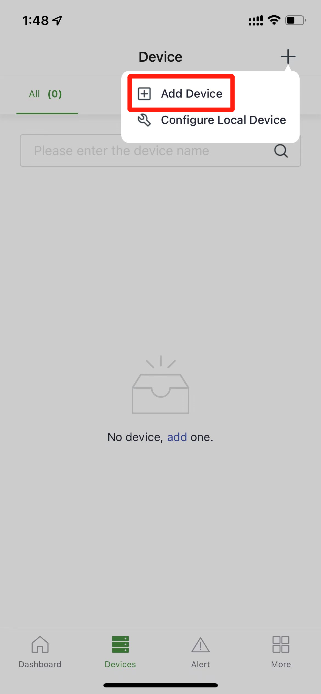

<strong>图 2-2 添加设备页面</strong>

<strong>图 2-3 扫描设备二维码</strong>

3. 扫码成功后，配置设备名称、序列号和描述信息。

4. 若ODU12无法连接互联网，在【设备】页面点击"配置本地设备"，再次扫描设备机身上的二维码，随后配置设备连接互联网。扫码后手机将连接至ODU12的Wi-Fi。

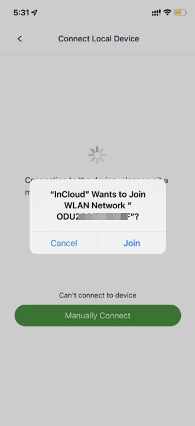

<strong>图 2-4 配置本地设备（一）</strong>

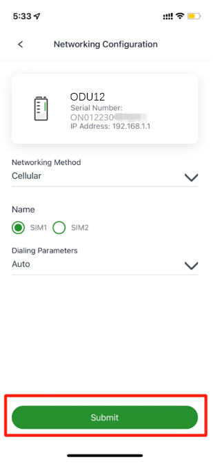

<strong>图 2-5 配置本地设备（二）</strong>

#### 2.2.2 方式二：通过PC登录Web管理界面

1. 使用以太网线连接ODU12的PoE LAN1接口与PC。

2. 配置PC的IP地址，使PC与ODU12处于同一网段，支持以下两种方式：

   - **DHCP自动获取（推荐）**：ODU12的LAN口默认开启DHCP服务器，PC设置为自动获取IP地址即可。

<strong>图 2-6 网络配置（DHCP自动获取）</strong>

   - **静态IP**：PC的IP地址需配置为192.168.1.2~192.168.1.254范围内的任意地址，网关为192.168.1.1，子网掩码为255.255.255.0，DNS服务器为8.8.8.8或运营商DNS服务器地址。

<strong>图 2-7 网络配置（静态IP）</strong>

3. 打开浏览器，在地址栏输入设备默认地址192.168.1.1，输入用户名和密码（见产品铭牌）后进入设备Web管理界面。若页面提示网页不安全，打开隐藏或高级选项，选择"继续访问"。

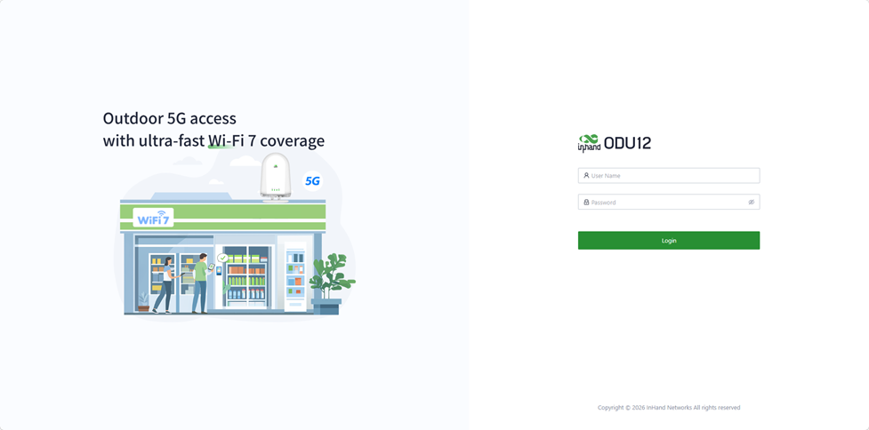

<strong>图 2-8 登录页面</strong>

### 2.3 快速检查

安装完成后，按以下清单检查设备状态：

- [ ] 系统指示灯绿色常亮，表明系统正常运行。
- [ ] 蜂窝信号指示灯不为红色常亮，表明信号值正常（信号值>9）。
- [ ] 登录Web管理界面，在【Dashboard】→【接口状态】中查看"Cellular"或"WAN"图标为绿色，表明设备已成功连接互联网。
- [ ] 点击对应图标，可查看信号强度、IP地址、流量消耗等接口信息。

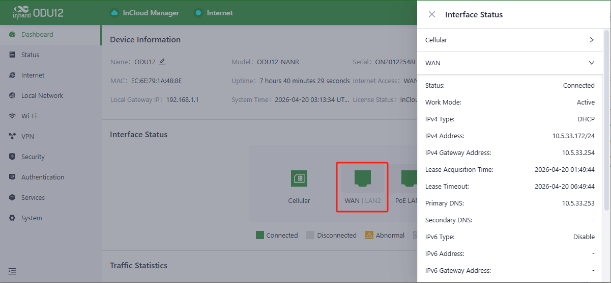

<strong>图 2-9 接口状态</strong>

若设备无法联网，点击左侧导航栏"Internet"，点击"Cellular"或"WAN"后的编辑按钮设置网络参数。设备默认启用拨号功能和WAN口，联网需等待数分钟；若未拨号成功，可重新启用拨号。

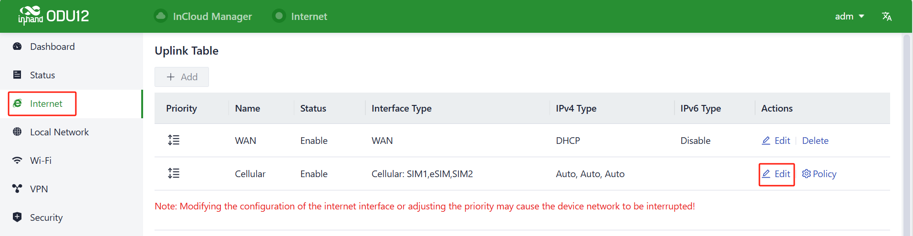

<strong>图 2-10 上行接口配置</strong>

## 第3章 常用场景配置

### 场景1：蜂窝联网

**目标**：通过5G蜂窝网络接入互联网。

**前提**：已在上电前插入有效SIM卡并确认天线连接，设备已上电。

**预计用时**：约5分钟。

**操作步骤**：

1. 登录设备Web管理界面（见[第2章 安装与首次使用](#第2章-安装与首次使用)）。
2. 点击左侧导航栏【Internet】，在"Cellular"后点击编辑按钮。
3. 配置SIM卡工作模式和APN等拨号参数（拨号参数默认为自动，也可选择自定义APN，APN参数需从运营商获取），参数详细说明见[4.3.3 蜂窝设置](#433-蜂窝设置)。
4. 点击"保存"，等待拨号连接建立。设备默认启用SIM1和拨号功能，联网需等待数分钟；若未拨号成功，可重新启用拨号。

**验证方法**：

1. 检查蜂窝信号指示灯，红色闪烁表示已拨号连接；信号值≥20时指示灯为绿色常亮。
2. 登录Web管理界面，在【Dashboard】→【接口状态】中确认"Cellular"图标为绿色。
3. 接入设备访问任意互联网网站，确认能够正常打开。

**常见问题**：

- 拨号失败：检查SIM卡是否正确插入、是否欠费，APN参数是否与运营商提供的一致。
- 信号差：检查天线是否连接，信号值≤9时蜂窝信号指示灯为红色常亮。

### 场景2：有线宽带联网

**目标**：通过有线宽带（DHCP/静态IP/PPPoE）接入互联网。

**前提**：已将以太网线连接设备的WAN/LAN2接口与上行网络设备或光猫，设备已上电。

**预计用时**：约5分钟。

**操作步骤**：

1. 登录设备Web管理界面，点击左侧导航栏【Internet】。
2. 在"WAN"后点击编辑按钮，选择上网方式：
   - **DHCP**（默认）：WAN口默认启用DHCP客户端，连接启用DHCP服务器的上行网络设备后可立即联网。
   - **静态IP**：手动填入从运营商或上行网络设备获取的IP地址。
   - **PPPoE**：填入宽带账号和密码，通过宽带业务拨号上网。
3. 点击"保存"，等待连接建立。

**验证方法**：

1. 登录Web管理界面，在【Dashboard】→【接口状态】中确认"WAN"图标为绿色。
2. 接入设备访问任意互联网网站，确认能够正常打开。

**常见问题**：

- 无法联网：确认上网方式与线路类型匹配，静态IP方式需核对IP地址、网关、子网掩码参数，PPPoE方式需核对宽带账号密码。

### 场景3：Wi-Fi无线接入

**目标**：配置ODU12作为Wi-Fi AP，为无线终端提供网络接入。

**前提**：设备已上电并完成联网配置（见[场景1：蜂窝联网](#场景1蜂窝联网)或[场景2：有线宽带联网](#场景2有线宽带联网)）。

**预计用时**：约5分钟。

**操作步骤**：

1. 登录设备Web管理界面，点击左侧导航栏【Wi-Fi】。
2. 在Wi-Fi列表中点击右侧编辑按钮，配置SSID、密码等参数。设备默认提供2.4G和5G两个AP（默认设置见[1.4 默认设置](#14-默认设置)）。
3. 在【Radio】部分可配置带宽、信道和发射功率。
4. 点击"保存"。

**验证方法**：

1. 无线终端搜索并连接对应SSID，输入密码完成关联。
2. 登录Web管理界面，在【Dashboard】→【Wi-Fi客户端数】中查看活跃SSID数量。

**常见问题**：

- 终端无法连接Wi-Fi：核对SSID名称和密码是否正确，确认认证方式与终端兼容。

### 场景4：手机App快速添加设备

**目标**：通过InCloud APP在手机上完成设备添加和联网配置。

**前提**：手机已安装InCloud APP，设备已上电。

**预计用时**：约5分钟。

**操作步骤**：

1. 扫描InCloud APP下载二维码安装APP（二维码见[2.2.1 方式一：通过手机App配置](#221-方式一通过手机app配置)中的图 2-1）。
2. 在【设备】页面点击右上角菜单按钮，选择【添加设备】，扫描ODU12机身上的二维码。
3. 扫码成功后，配置设备名称、序列号和描述信息。
4. 若设备无法连接互联网，在【设备】页面点击"配置本地设备"，再次扫描设备二维码，手机将连接至ODU12的Wi-Fi，随后配置设备连接互联网。

详细操作步骤和截图见[2.2.1 方式一：通过手机App配置](#221-方式一通过手机app配置)。

### 场景5：接入InCloud Manager云平台

**目标**：将ODU12接入InCloud Manager云平台，实现批量配置部署、软件升级和远程监控。

**前提**：设备已通过蜂窝或有线方式接入互联网。

**预计用时**：约10分钟。

**操作步骤**：

1. 注册账号：在浏览器（推荐Chrome）中输入 `https://star.inhandcloud.com`，页面将自动跳转至门户页面，选择"InCloud Manager"进入面向企业分支组网的SaaS平台，点击"Create now"创建平台账号。

<strong>图 3-1 创建平台账号</strong>

2. 登录平台：完成邮箱注册后，使用注册时的用户名和密码登录InCloud Manager。

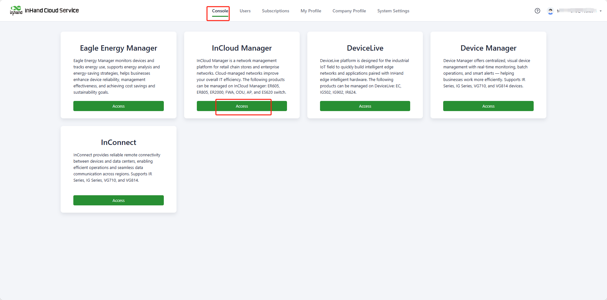

<strong>图 3-2 登录并选择SaaS服务</strong>

3. 添加设备：登录后进入"Devices"菜单，点击"Add"按钮，填写设备名称、序列号和MAC地址，点击"Finish"完成添加。

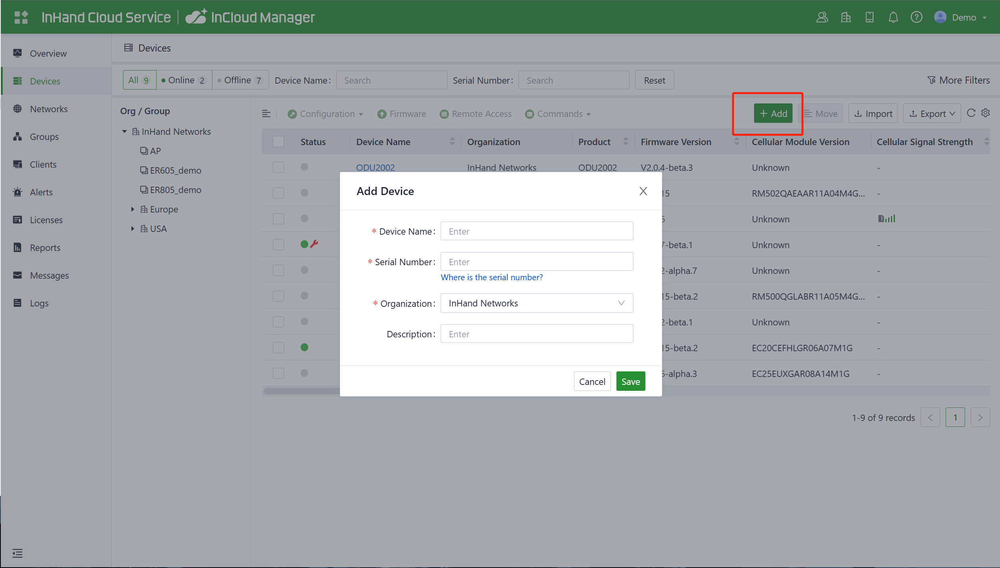

<strong>图 3-3 添加设备</strong>

> **说明**：设备初次添加至平台账号时，将自动获赠1年Essential许可，后续可通过"License"菜单续费。

**验证方法**：

1. 在平台"Devices"列表中确认设备已上线。
2. 点击设备名称进入详情页，查看设备状态。

### 场景6：访客Wi-Fi Portal认证

**目标**：为目标SSID启用Portal认证，访客连接Wi-Fi后需通过认证页面完成验证方可上网。

**前提**：设备已上电并完成Wi-Fi配置（见[场景3：Wi-Fi无线接入](#场景3wi-fi无线接入)）。

**预计用时**：约10分钟。

**操作步骤**：

1. 登录设备Web管理界面，进入【Security】→【Authentication】的Portal认证配置页面（功能说明见[4.8 接入认证](#48-接入认证)）。
2. 在Portal Service下拉菜单中选择"Internal Portal"（内部认证页，可直接在路由器上定制）或"External Portal"（外部认证页，对接第三方认证系统）。
3. 填写策略名称、目标SSID（如访客Wi-Fi）等必填项；内部Portal方式可定制认证页背景、Logo、标题、欢迎语、按钮文字、配色等，并可设置认证后行为；外部Portal方式需配置第三方提供的认证页URL，并可启用Walled Garden放行未认证用户访问特定域名/IP。
4. 点击"保存"，目标SSID的Portal认证随即启用。

**验证方法**：

1. 无线终端连接目标SSID，浏览器应跳转至认证页面。
2. 完成认证（如点击放行或输入账号凭证）后，确认终端可正常访问互联网。

**常见问题**：

- 认证页无法打开：检查Portal策略是否绑定正确的SSID，外部Portal方式需确认认证服务器地址已加入Walled Garden白名单。

### 场景7：IPSec VPN站点互联

**目标**：在ODU12与对端设备之间建立IPSec VPN加密隧道，实现站点间数据的安全传输。

**前提**：设备已联网并获得可通信的上行接口，对端设备IPSec参数（预共享密钥、子网规划等）已确认。

**预计用时**：约15分钟。

**操作步骤**：

1. 登录设备Web管理界面，进入【VPN】→【IPSec VPN】页面，点击左侧"Add"按钮新建IPSec隧道（参数说明见[4.6.1 IPSec VPN](#461-ipsec-vpn)）。
2. 配置隧道名称、IKE版本、预共享密钥（两端必须一致）和本地上行接口。
3. 配置对端设备IP地址（若本端作为IPSec服务器，对端IP地址需设置为0.0.0.0）。
4. 配置隧道模式、本地子网和对端子网，本地子网为通过隧道发送流量的本端网段，对端子网为隧道对端用于通信的网段。
5. 按需调整IKE策略（加密算法、认证算法、DH组、生存时间）和IPSec策略（安全协议、加密算法、认证算法、PFS组、生存时间）。
6. 点击"保存"并启用隧道，两端参数需保持一致。

**验证方法**：

1. 在本地网络中使用终端ping对端子网内的地址，确认隧道连通。
2. 登录Web管理界面，在【Dashboard】→【VPN】页面查看VPN状态和消耗的流量。

**常见问题**：

- 隧道无法建立：核对两端预共享密钥、IKE/IPSec策略是否一致，对端地址是否可达。

## 第4章 功能说明与参数参考

### 4.1 云平台侧设备监控

设备添加至平台后，可通过平台管理和监控网络，同时支持用户通过设备本地界面远程查看实时状态信息。

#### 4.1.1 设备概览

在"Devices"页面点击设备名称进入设备详情页。点击左侧菜单"Dashboard"，可查看设备信息、接口状态、流量统计和Wi-Fi信息。

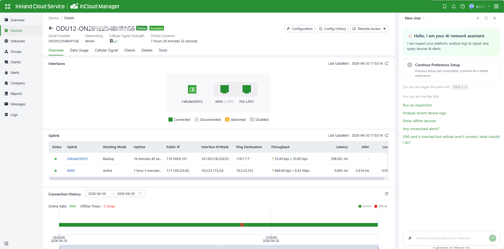

<strong>图 4-1 状态总览</strong>

#### 4.1.2 流量使用

在"Data Usage"功能中，可查看各上行链路的流量使用情况和历史数据。

<strong>图 4-2 流量使用</strong>

#### 4.1.3 蜂窝信号

在"Cellular Signal"功能中，可查看RSSI、RSRP、RSRQ、SINR等蜂窝信号曲线。

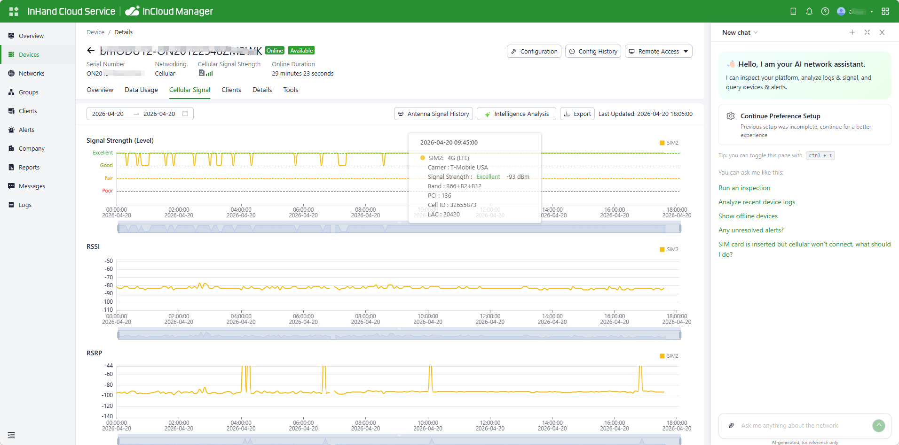

<strong>图 4-3 蜂窝信号</strong>

### 4.2 本地Web界面监控

通过平台的"Remote Access"远程访问功能，可实时查看和配置设备。选中目标设备，点击"Remote Access"，将打开设备本地登录界面。

<strong>图 4-4 远程访问设备</strong>

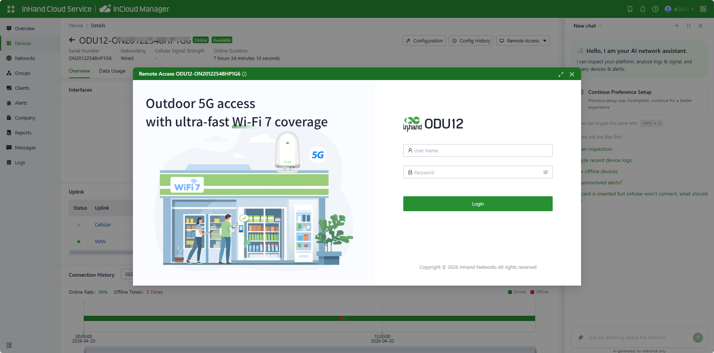

<strong>图 4-5 本地界面</strong>

#### 4.2.1 设备信息

在【Dashboard】界面上方为设备基本信息，包括设备名称、设备型号、序列号、MAC地址、在线时长和上行接口地址。

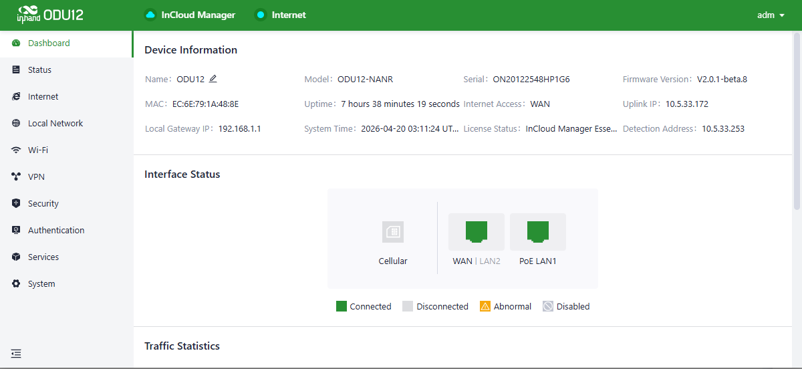

<strong>图 4-6 设备信息</strong>

1. **名称（Name）**：设备名称，初始为"ODU12"，可自定义。
2. **MAC地址（MAC Address）**：设备的物理MAC地址。
3. **本地网关地址（Local Gateway Address）**：设备子网的默认网关地址。
4. **型号（Model）**：设备具体型号，可用于判断设备是否支持蜂窝和WLAN功能。
5. **运行时长（Uptime）**：设备自上电以来的运行时间。
6. **系统时间（System Time）**：设备的时区和系统时间。
7. **序列号（Serial）**：设备的唯一标识编码，可用于索引设备或将设备添加至平台账号。
8. **互联网接入（Internet Access）**：设备用于联网的上行接口。
9. **许可状态（License Status）**：设备已应用的许可信息，区分InCloud Manager Essential和InCloud Manager Professional。
10. **固件版本（Firmware Version）**：设备当前软件版本。
11. **上行IP（Uplink IP）**：设备联网所使用的上行接口IP地址。
12. **探测地址（Detection Address）**：系统用于探测设备网络连通性的探测地址。

#### 4.2.2 接口状态

在【Dashboard】→【接口状态】功能中，可直观查看各接口的运行状态。点击接口图标，可在界面右侧弹出的信息框中查看各接口的详细信息。

#### 4.2.3 流量统计

通过【Dashboard】→【流量统计】功能，用户可查看各上行接口自设备上电以来的流量使用情况。流量统计数据在设备重启后清零，如需查看历史流量记录，可在InCloud Manager的设备详情页中获取。

<strong>图 4-7 流量统计</strong>

#### 4.2.4 Wi-Fi连接数

在【Dashboard】→【Wi-Fi客户端数】功能中，用户可查看ODU12上活跃SSID的数量。

<strong>图 4-8 Wi-Fi连接数</strong>

#### 4.2.5 客户端流量Top5

在【Dashboard】→【客户端流量Top5】功能中，用户可查看连接路由器的设备当前的流量使用排名，最多显示5条记录。客户端断开连接后，其统计数据将被清除。

#### 4.2.6 链路监测

链路监测页面显示各上行链路的健康状况，以及各上行接口的吞吐量、时延和丢包率。

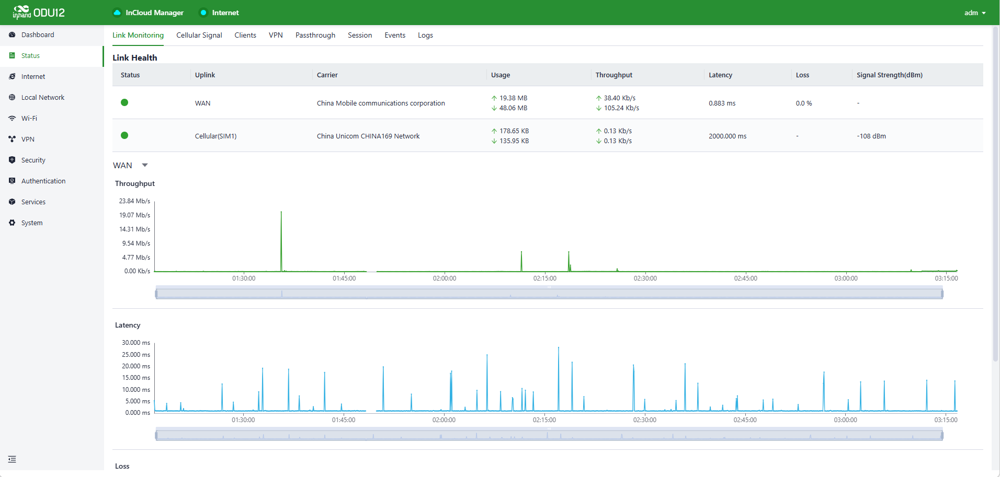

<strong>图 4-9 链路监测</strong>

#### 4.2.7 蜂窝信号

蜂窝信号页面显示蜂窝接口的SIM卡信号强度，以及RSSI、SINR、RSRP等参数。

<strong>图 4-10 蜂窝信号</strong>

#### 4.2.8 客户端

客户端页面显示连接到ODU12的每个客户端的详细信息，如设备名称、IP地址、MAC地址、流量统计和在线时长。

<strong>图 4-11 客户端</strong>

#### 4.2.9 VPN

在VPN页面可查看ODU12上VPN的状态及其消耗的流量。

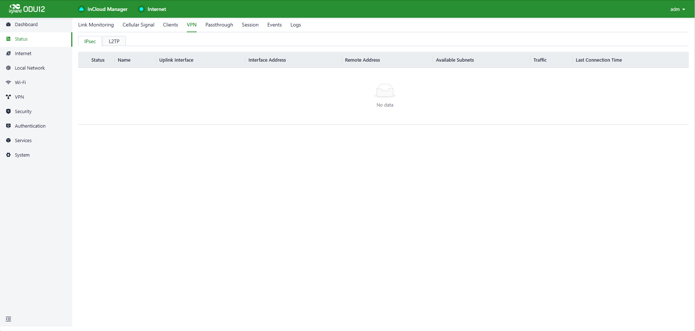

<strong>图 4-12 VPN状态</strong>

#### 4.2.10 直通状态

通过该页面，可查看直通（Passthrough）是否已成功将WAN或蜂窝地址传递给终端设备的详细信息。

<strong>图 4-13 直通状态</strong>

#### 4.2.11 会话

通过该页面，可查看流量中的TCP/ICMP/UDP协议会话是否生效。

<strong>图 4-14 会话</strong>

#### 4.2.12 事件

ODU12会在事件页面记录用户登录、配置变更、链路变化、重启等事件日志。通过选择开始日期、结束日期和事件类型，可缩小检索范围并查看某类事件。

<strong>图 4-15 事件</strong>

#### 4.2.13 日志

日志页面记录设备运行期间产生的日志，可用于ODU12无法正常工作时的故障排查。

1. **清除日志（Clear Logs）**：清除当前运行日志。
2. **下载日志（Download Logs）**：下载运行日志。
3. **下载诊断日志（Download Diagnostic Logs）**：下载用于故障排查的日志信息，包含系统运行日志、设备信息和设备配置。

<strong>图 4-16 日志</strong>

### 4.3 联网设置

点击左侧菜单【Internet】，可查看和配置ODU12的上行接口及多链路工作模式。

> **注意**：修改联网设置可能导致网络中断，操作需谨慎。

<strong>图 4-17 上行接口设置</strong>

#### 4.3.1 上行接口列表

在上行接口列表中可查看和编辑WAN、蜂窝接口，支持在本页面编辑蜂窝阈值策略，并可通过拖动优先级列中的图标重新排列接口优先级。

> **说明**：
>
> 1. 在本页面删除WAN接口后，WAN/LAN2端口将作为LAN口工作。
> 2. 重新添加WAN接口后，WAN/LAN2端口将恢复为WAN口。
> 3. 删除WAN接口时，该接口上的所有配置（如静态路由、入站和出站规则、端口转发等）将被移除。

#### 4.3.2 WAN设置

ODU12支持三种WAN接口类型：

1. **DHCP**：WAN接口默认启用DHCP服务，ODU12连接启用了DHCP服务器的上行网络设备后可立即联网。
2. **静态IP**：手动填入从运营商或上行网络设备获取的IP地址。

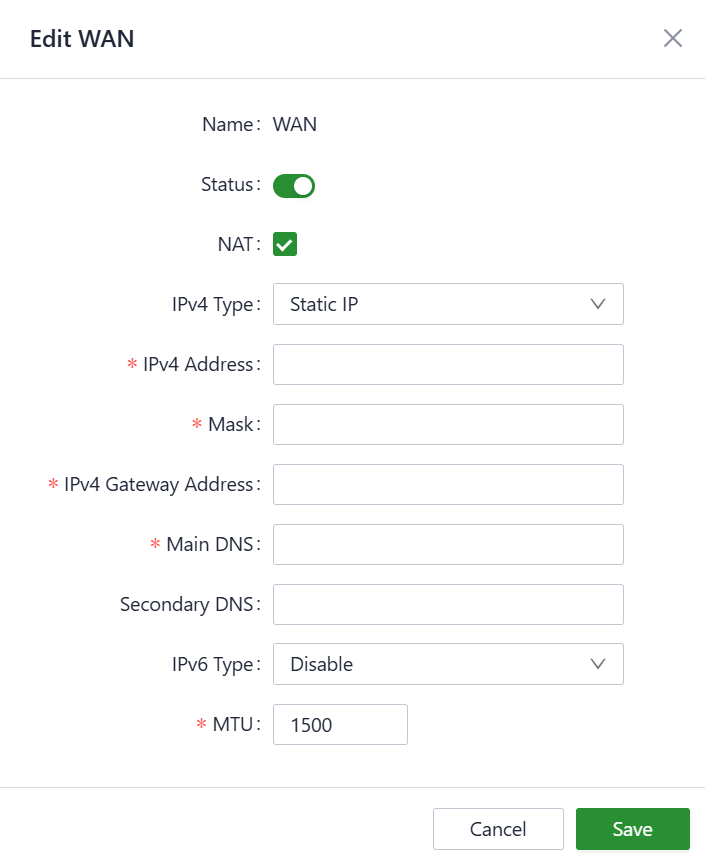

<strong>图 4-18 静态IP设置</strong>

3. **PPPoE**：在WAN口设置PPPoE业务，ODU12可通过宽带业务拨号上网。

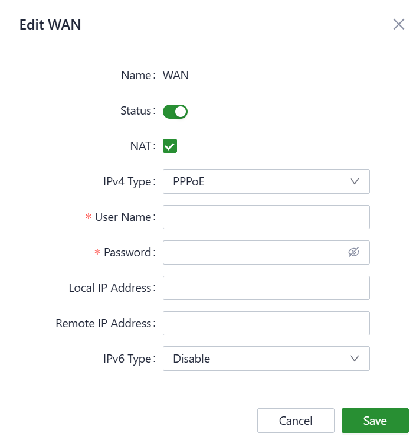

<strong>图 4-19 PPPoE设置</strong>

#### 4.3.3 蜂窝设置

在蜂窝设置页面可配置SIM卡的工作模式，默认仅启用SIM1，切换为多SIM模式后可支持多张SIM卡。此外，ODU12支持频段锁定（Band Locking）。

<strong>图 4-20 蜂窝设置</strong>

1. **状态（Status）**：蜂窝接口的启用开关，默认开启。禁用后，蜂窝相关的所有功能将不再生效。
2. **NAT**：内网发往外部网络的流量将经过NAT转发，默认启用。
3. **工作模式（Work Mode）**：设置SIM卡工作模式。设备默认为多SIM模式，支持SIM卡自动切换，也可选择仅使用单张SIM卡。
4. **MTU**：支持自定义蜂窝接口的MTU。
5. **子网掩码（Mask）**：支持设置蜂窝接口的子网掩码。
6. **拨号参数（Dialing Parameters）**：配置两种APN拨号方式，默认为自动（Automatic），也支持自定义APN（Custom APN）。
7. **IP类型（IP Type）**：支持配置IPv4、IPv6或IPv4 & IPv6模式。
8. **APN**：填入APN名称。
9. **认证（Authentication）**：设置APN认证方式。
10. **用户名（User Name）**：填入APN认证用户名。
11. **密码（Password）**：填入APN认证密码。
12. **服务类型（Service Type）**：选择蜂窝接口服务类型，默认为Auto，可选择4G或4G & 5G。
13. **4G频段（4G Band）**：4G频段锁定，默认为All，可指定4G频段。
14. **5G频段（5G Band）**：5G频段锁定，默认为All，可指定5G频段。
15. **PIN码（PIN Code）**：主要用于验证用户身份。
16. **IMS**：将语音流量和视频数据转换为IP数据包。
17. **漫游（Roaming）**：支持跨运营商的蜂窝漫游。

#### 4.3.4 链路检测设置

配置上行接口的链路检测项和最优转发模式。

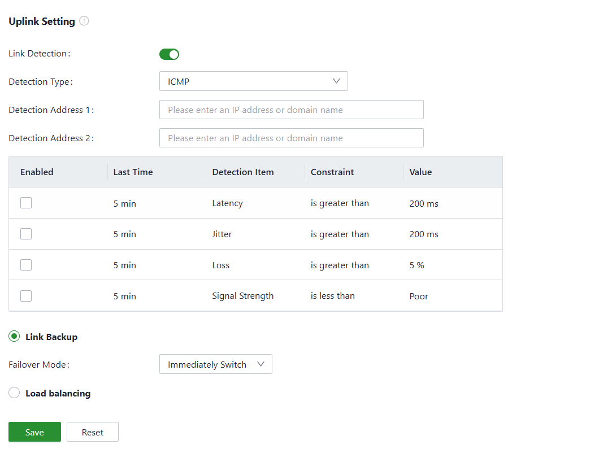

<strong>图 4-21 链路检测设置</strong>

链路检测默认启用。在专网环境中，需手动配置"Test Connectivity to"中的地址，或禁用链路检测功能，以避免蜂窝接口工作异常。

1. 若禁用检测功能，状态页面将不再显示时延、抖动、丢包率或信号强度。
2. 若"Test Connectivity to"地址为空，系统将检测各接口获取的主DNS服务器地址；否则，系统将该地址作为所有上行接口的检测地址。
3. 在链路备份模式下，ODU12将监测启用的检测项，任一检测项超过阈值时触发链路切换；若未启用任何检测项，则仅根据链路优先级和连通性触发链路切换。
4. 在负载均衡模式下，ODU12会将数据流量分发至所有可用链路。

### 4.4 局域网设置

在【本地网络】功能中，用户可自定义本地子网，包括配置本地LAN的地址范围、VLAN ID、DHCP服务等参数。配置完成后，需通过【接口管理】将设置应用到设备的LAN口，或在Wi-Fi设置中将设置应用到目标SSID，以确保客户端设备按规划的网络地址顺利接入本地网络。

<strong>图 4-22 局域网列表</strong>

编辑网络：点击右侧编辑按钮，可编辑LAN IP、启用/禁用DHCP服务器、修改DHCP地址范围。

<strong>图 4-23 网络设置</strong>

1. **名称（Name）**：用于标识网络，用户可在【Wi-Fi】和【接口管理】中选择该名称来应用此网络。
2. **模式（Mode）**：选择当前子网工作在二层透明模式还是三层IP模式，默认为"IP mode"。
3. **VLAN**：用于将本地网络划分为不同的虚拟逻辑网络，所有接口和Wi-Fi的默认VLAN为"default (VLAN1)"。
4. **IP地址/子网掩码（IP Address/Subnet Mask）**：通过LAN口或Wi-Fi访问路由器的网关地址，默认为"192.168.2.1"。
5. **DHCP服务器（DHCP Server）**：连接路由器的客户端可通过该功能获取IP地址，默认启用，地址范围根据"IP地址/子网掩码"自动生成。

> **说明**：
>
> 1. 默认本地网络不可删除，仅可修改IP地址/子网掩码和DHCP服务器设置。
> 2. 本地网络添加后，不可更改其模式。
> 3. VLAN Only模式用于二层透明传输，无需配置IP地址/子网掩码和DHCP服务器。

### 4.5 Wi-Fi设置

配置ODU12作为Wi-Fi AP，为无线网络接入提供SSID。

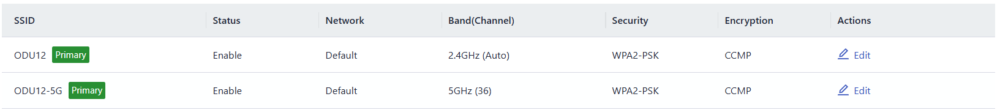

<strong>图 4-24 Wi-Fi列表</strong>

编辑Wi-Fi：点击右侧编辑按钮，配置该Wi-Fi的SSID、密码等参数。

<strong>图 4-25 Wi-Fi设置</strong>

在【Radio】部分，可选择带宽、信道和发射功率。

<strong>图 4-26 射频设置</strong>

### 4.6 VPN

VPN用于在公用网络上建立专用网络，实现加密通信。VPN路由器通过加密数据包和转换数据包的目的地址实现远程访问。VPN可由服务器、硬件或软件实现。与传统DDN专线或帧中继相比，VPN提供了更安全、便捷的远程接入方案。

#### 4.6.1 IPSec VPN

IPsec是IETF开发的一组开放式网络安全协议。IPsec在IP层提供数据源认证、数据加密、数据完整性和防重放功能，保障通信双方在Internet上数据传输的安全性，降低信息泄露和被窃听的风险，确保数据的完整性和保密性，以及用户业务传输的安全性。

在IPSec VPN页面，点击左侧"Add"按钮新建IPSec隧道。

<strong>图 4-27 IPSec设置</strong>

IPSec隧道需设置以下参数：

1. **名称（Name）**：指定设备上创建的IPSec VPN名称，用于本地VPN管理。
2. **IKE版本（IKE Version）**：指定ODU12使用的IKE协议版本，IKEv1或IKEv2。
3. **预共享密钥（Pre-Shared Key）**：指定IKE协商的认证密钥，两端必须一致。
4. **上行接口（Uplink Interface）**：指定用于建立IPSec VPN隧道的本地上行接口。
5. **对端地址（Peer Address）**：指定对端设备的IP地址。

   > **说明**：本端作为IPSec服务器时，对端IP地址需设置为0.0.0.0。

6. **隧道模式（Tunnel Mode）**：指定IPSec VPN隧道上的IP数据包封装模式，可为隧道模式（tunnel mode）或传输模式（transmission mode）。
7. **本地子网（Local Subnet）**：指定ODU12通过IPSec VPN隧道向外发送流量的IP网段。
8. **对端子网（Peer Subnet）**：指定IPSec VPN隧道对端用于通信的IP网段。

**IKE策略（IKE Policy）**：

1. **加密（Encryption）**：指定IKE的加密算法。
2. **认证（Authentication）**：指定IKE的认证算法。
3. **DH组（DH Groups）**：指定DH密钥交换方式。
4. **生存时间（Lifetime）**：指定IKE SA的生存时间，默认值为86400秒。

**IPSec策略（IPSec Policy）**：

1. **安全协议（Security Protocol）**：指定ESP使用的安全协议。
2. **加密（Encryption）**：指定ESP协议的加密算法。
3. **认证（Authentication）**：指定ESP的认证算法。
4. **PFS组（PFS Groups）**：指定完美前向保密（PFS）模式，通过第二阶段协商中的额外密钥交换提高通信安全性。
5. **生存时间（Lifetime）**：指定IPSec SA的生存时间，默认值为86400秒。

#### 4.6.2 L2TP VPN

第二层隧道协议（L2TP）是一种用于虚拟专用拨号网络（VPDN）的隧道协议。该协议通过PPP协商，经由公用交换电话网（PSTN）或综合业务数字网（ISDN），建立从远程站点到企业总部的隧道，允许远程用户安全地接入企业内网。

##### 4.6.2.1 服务器

L2TP服务器一般部署在企业总部，为员工提供远程接入。在VPN页面选择 L2TP VPN > 服务器，显示L2TP服务器配置页面。

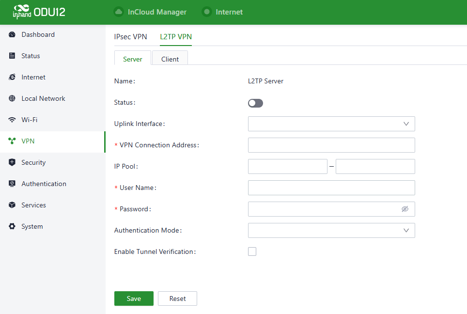

<strong>图 4-28 L2TP服务器设置</strong>

1. **名称（Name）**：L2TP服务器的名称，不可更改。
2. **状态（Status）**：启用或禁用L2TP服务器，默认禁用。
3. **上行接口（Uplink Interface）**：指定L2TP服务器用于建立隧道的上行接口。
4. **VPN连接地址（VPN Connection Address）**：指定L2TP客户端的网关地址。
5. **地址池（IP Pool）**：系统将从指定的IP地址池中为L2TP客户端分配IP地址。
6. **用户名/密码（User Name/Password）**：指定L2TP协商的用户名和密码，隧道两端必须一致。
7. **认证模式（Authentication Mode）**：指定L2TP隧道的认证模式。
8. **启用隧道认证（Enable Tunnel Authentication）**：启用该选项后，需确保隧道两端配置相同的用户名和密码。

##### 4.6.2.2 客户端

点击左侧"Add"按钮，配置L2TP客户端参数，与远程L2TP服务器建立隧道。

<strong>图 4-29 L2TP客户端设置</strong>

1. **名称（Name）**：指定L2TP客户端隧道的本地名称。
2. **状态（Status）**：启用或禁用L2TP客户端隧道。
3. **NAT**：启用或禁用ODU12为局域网设备转发的数据包执行的NAT。
4. **上行接口（Uplink Interface）**：指定用于建立L2TP隧道的上行接口。
5. **服务器地址（Server Address）**：指定远程L2TP服务器使用的IP地址。
6. **用户名/密码（User Name/Password）**：指定L2TP协商的用户名和密码，隧道两端必须一致。
7. **认证模式（Authentication Mode）**：指定L2TP隧道的认证模式。
8. **启用隧道验证（Enable Tunnel Verification）**：启用该选项后，需确保隧道两端配置相同的服务器名称和验证密钥。

### 4.7 安全

在【Security】菜单中，用户可配置防火墙、策略路由、流量整形等相关高级功能。

#### 4.7.1 防火墙

防火墙当前包含入站规则、出站规则、端口转发、MAC地址过滤等功能。

##### 4.7.1.1 入站/出站规则

用户可设置规则基于接口控制数据流量。

1. **出站规则**：内网访问外网，默认允许所有数据。
2. **入站规则**：外网访问内网，默认禁止所有数据。

<strong>图 4-30 防火墙设置</strong>

点击左侧"Add"按钮可添加新规则。

<strong>图 4-31 入站规则设置</strong>

1. **名称（Name）**：设置入站/出站规则名称，用于本地标识。
2. **状态（Status）**：规则功能开关。
3. **接口（Interface）**：出站规则指定流量流出路由器的上行接口；入站规则指定流量流入路由器的上行接口。
4. **协议（Protocol）**：基于协议类型匹配流量，可选Any、TCP、UDP、ICMP或自定义。
5. **源地址（Source）**：匹配流量的源地址，支持自定义，默认为Any。
6. **目的地址（Destination）**：匹配流量的目的地址，支持自定义，默认为Any。
7. **动作（Action）**：入站/出站规则对匹配流量执行的动作，支持允许（allow）和拒绝（deny）。
8. **入站规则**：外部网络访问路由器的流量管理规则，默认全部拒绝。
9. **出站规则**：经由路由器外发的流量管理规则，默认全部允许。
10. 支持调整入站和出站规则的优先级。

##### 4.7.1.2 端口转发

当外部网络访问ODU12的特定端口时，系统根据端口转发规则将该数据转发至内网设备的对应端口，使部署在局域网内的服务可在公网访问；同一个公网IP地址可通过多条端口转发规则访问多个服务。

例如，配置如下端口转发规则后，公网用户访问ODU12在WAN口的2000端口时，系统将请求转发至局域网内192.168.1.23的8080端口。

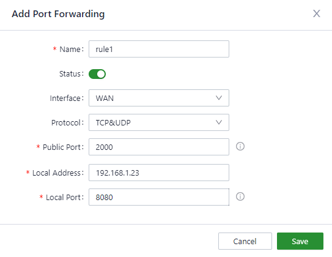

<strong>图 4-32 端口转发设置</strong>

1. **名称（Name）**：设置端口转发规则的本地标识。
2. **状态（Status）**：启用或禁用端口转发规则。
3. **接口（Interface）**：设置为内部客户端提供端口映射的上行接口，该接口必须具有公网IP地址。
4. **协议（Protocol）**：设置端口映射应用的协议类型，TCP、UDP和TCP&UDP。
5. **公网端口（Public Port）**：设置上行接口上被映射的协议端口。
6. **本地地址（Local Address）**：设置外部用户需要访问的目标客户端IP地址。
7. **本地端口（Local Port）**：设置外部用户需要访问的目标客户端上的协议端口。

##### 4.7.1.3 NAT

NAT（Network Address Translator，网络地址转换）是一种在本地网络中使用私有地址、在连接互联网时转换为全局IP地址的技术。用户可在"Security > Firewall > NAT"中按需设置源地址或目的地址转换。

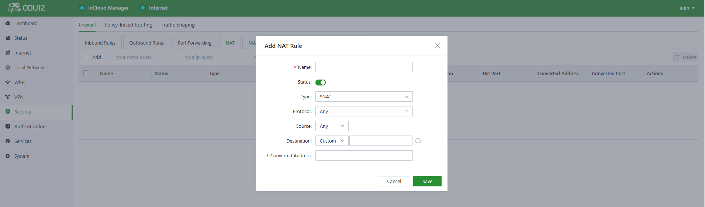

<strong>图 4-33 NAT设置</strong>

1. **名称（Name）**：用户为规则设置的名称。
2. **类型（Type）**：规则的类型。
   - SNAT：转换源IP地址。
   - DNAT：转换目的IP地址。
3. **协议（Protocol）**：规则的生效范围。
   - Any：该规则对所有协议生效。
   - TCP：该规则仅对TCP协议生效。
   - UDP：该规则仅对UDP协议生效。
   - TCP&UDP：该规则仅对TCP和UDP协议生效。
4. **源地址（Source）**：需要转换的源IP地址。
5. **目的地址（Destination）**：需要转换的目的IP地址。
6. **转换地址（Converted Address）**：转换后的地址。

##### 4.7.1.4 MAC地址过滤

为局域网设备配置MAC地址过滤规则，允许或禁止局域网设备访问互联网。

<strong>图 4-34 MAC地址过滤设置</strong>

1. **黑名单（Blacklist）**：黑名单中的设备将无法访问互联网。
2. **白名单（Whitelist）**：仅白名单中的设备允许访问互联网。

##### 4.7.1.5 域名过滤

按需允许或禁止（白/黑名单）客户端访问的域名。

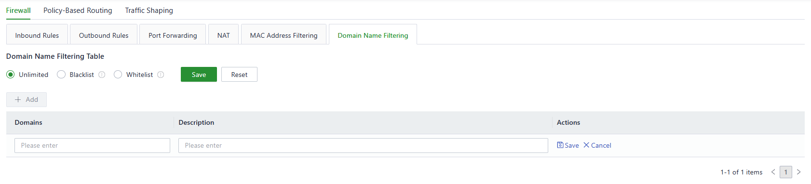

<strong>图 4-35 域名过滤设置</strong>

#### 4.7.2 策略路由

策略路由（PBR）允许ODU12根据配置的策略将不同数据流通过不同链路转发。该功能支持灵活的路由选择和控制，从而提高链路利用率、降低企业运营成本。选择 Security > Policy-based Routing，点击"Add"添加PBR规则。

<strong>图 4-36 策略路由</strong>

> **说明**：PBR的源地址和目的地址不可同时设置为Any。

#### 4.7.3 流量整形

创建整形策略，按用户、按协议实施控制以优化网络。该功能还可降低娱乐流量的带宽占用，为关键业务流量保障带宽。

选择 Security > Traffic Shaping，点击"Edit"修改上行接口的带宽。

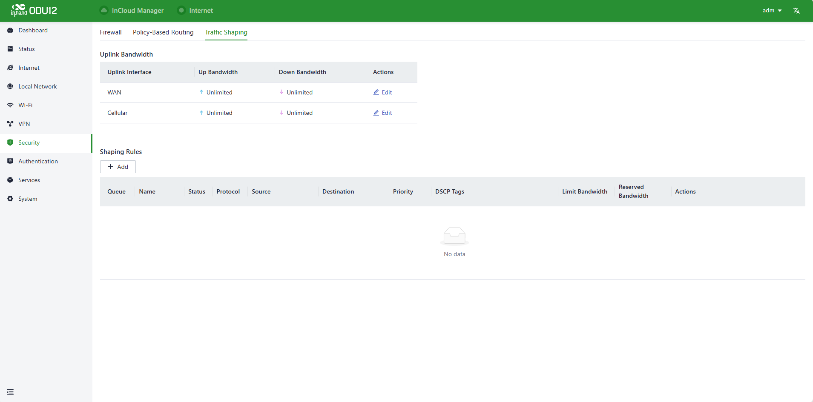

<strong>图 4-37 流量整形</strong>

点击"Add"创建新的流量整形规则。流量整形策略由一系列按顺序执行的规则组成，类似自定义防火墙规则。每条规则包含两个主要部分：需要限制或整形的流量类型（规则定义），以及对该流量进行限制或整形的方式（规则动作）。

<strong>图 4-38 流量整形规则配置</strong>

> **说明**：
>
> 1. 未匹配规则的流量转发优先级为中（medium）。
> 2. 限制带宽（Limit Bandwidth）设置为0时，系统不限速。
> 3. 保留带宽（Reserved Bandwidth）的值不应大于限制带宽（Limit Bandwidth）。

### 4.8 接入认证

ODU12支持的网络接入认证方式为**Portal**：配置Web Portal认证。用户连接网络后，需通过浏览器跳转至认证页面，输入账号凭证或完成验证（如二维码扫描）后获得网络访问权限。

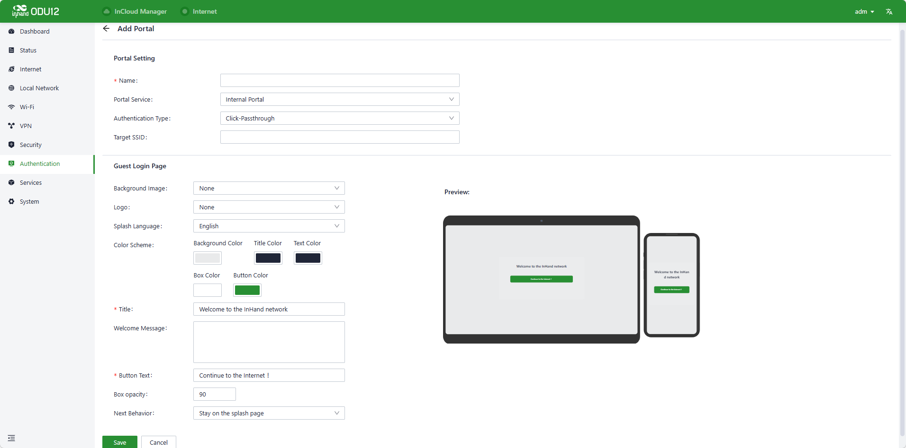

<strong>图 4-39 Portal设置</strong>

在酒店、餐馆等场所为顾客提供短时Wi-Fi的场景中，Wi-Fi Portal功能可在一定程度上保障无线接入的安全性，商家还可在认证页面上自定义宣传语和背景进行宣传。

**1. 内部Portal（Internal Portal）**

适用于无需与外部系统集成的场景，可直接在路由器上定制认证页面。

内部Portal设置：

1. 命名策略并指定目标SSID（如访客Wi-Fi）。
2. 选择认证类型，如点击放行（Click-Passthrough）或用户名/密码认证。

访客登录页定制：

- 自定义背景图片、Logo、标题、欢迎语和按钮文字。
- 调整配色方案和透明度，可实时预览页面在桌面端和移动端的显示效果。
- 设置认证后行为（如停留在当前页面或跳转至指定URL）。

适用场景：酒店、餐馆、工业园区等场所的访客Wi-Fi，可快速部署带品牌标识的认证入口。

**2. 外部Portal（External Portal）**

适用于需要与第三方认证系统（如企业SSO）集成的场景。

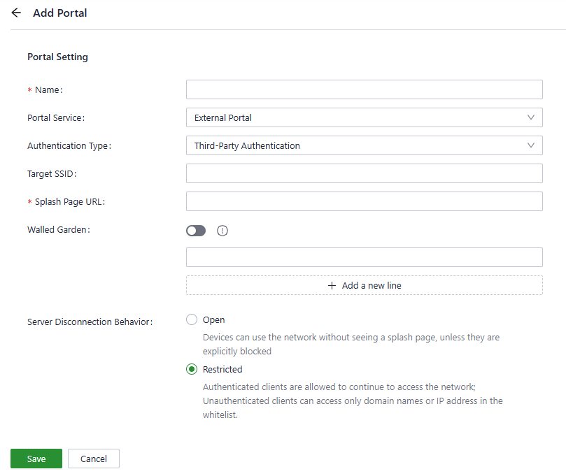

<strong>图 4-40 外部Portal设置</strong>

外部Portal设置：

1. 配置外部认证页面的URL（由第三方系统提供）。
2. 启用Walled Garden，允许未认证用户访问特定的白名单域名/IP（如认证服务器地址）。
3. 定义服务器断开时的行为：
   - Open：未认证用户可直接访问互联网。
   - Restricted：仅认证用户和白名单地址可获准访问。

适用场景：需要与现有企业身份系统或第三方营销认证对接的场景。

**3. 操作步骤**

1. 在Portal Service下拉菜单中选择Internal Portal或External Portal。
2. 填写必填项（如名称、目标SSID），并根据模式定制页面或配置外部参数。
3. 点击"Save"创建策略，目标SSID的Portal认证随即启用。

### 4.9 服务

#### 4.9.1 接口管理

在"Services > Interface Management"功能中，可配置指定接口允许通过的本地网络，并设置接口速率。

<strong>图 4-41 接口管理</strong>

#### 4.9.2 DHCP服务器

DHCP采用客户端/服务器模型实现动态IP地址分配。局域网设备向ODU12发送请求，ODU12回复并分配IP地址给客户端。

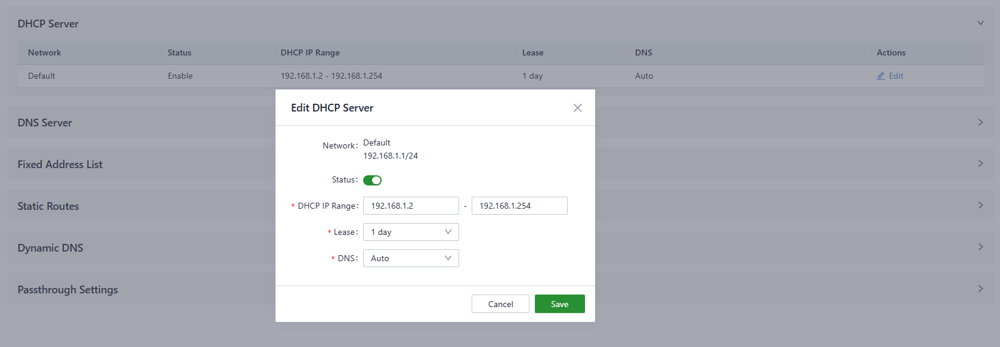

<strong>图 4-42 DHCP设置</strong>

#### 4.9.3 DNS服务器

为ODU12设置全局DNS服务器。当上行接口获取的原DNS服务器无法工作时，系统将使用本页面设置的DNS服务器。

<strong>图 4-43 DNS设置</strong>

#### 4.9.4 固定地址列表

ODU12可基于客户端设备的MAC地址，通过固定地址列表分配IP地址。分配的IP地址应在本本地网络的IP地址范围内。

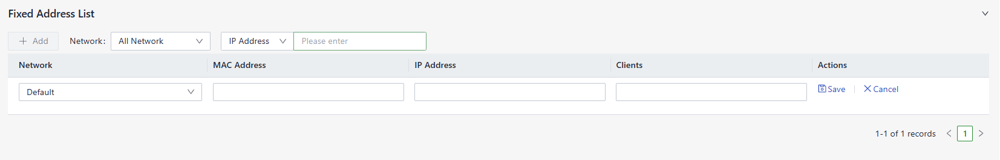

<strong>图 4-44 固定地址设置</strong>

#### 4.9.5 静态路由

配置静态路由，使数据通过指定路由或接口转发。该列表仅显示用户创建的规则，不显示修改WAN或LAN接口后自动生成的路由。

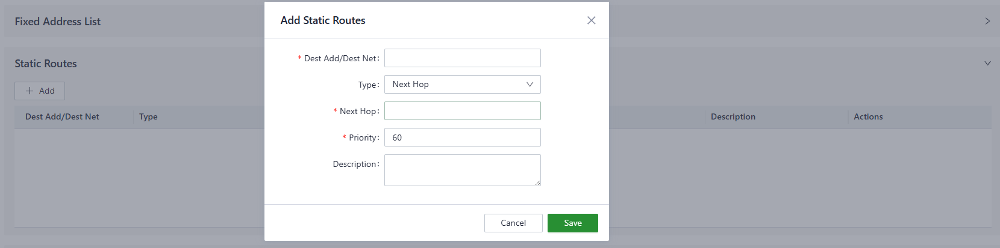

<strong>图 4-45 静态路由设置</strong>

> **说明**：目的IP地址或网络相同的静态路由，不可使用相同的下一跳地址、出接口或优先级。

#### 4.9.6 DDNS

动态DNS（Dynamic Domain Name System，动态域名系统）用于自动更新域名系统中域名服务器的内容。按照互联网域名规则，域名通常与固定IP地址关联。动态DNS技术使使用动态IP地址的用户拥有固定的域名服务器，通过定期更新，外部用户可连接到动态IP地址用户的URL。

可在"Services > Dynamic DNS"功能中手动配置动态DNS服务器地址。

<strong>图 4-46 DDNS设置</strong>

1. **服务提供商（Service Provider）**：由动态DNS服务商提供，可选择dyndns、3322、oray、no-ip，或使用自定义选项（需提供URL）。
2. **主机名（Hostname）**：点击服务提供商下方的URL注册主机名。
3. **用户名（Username）**：点击服务提供商下方的URL注册用户名。
4. **密码（Password）**：注册时设置的密码。

#### 4.9.7 直通设置

配置IP直通（IP Passthrough），将上行接口的数据透明转发给一个客户端设备。

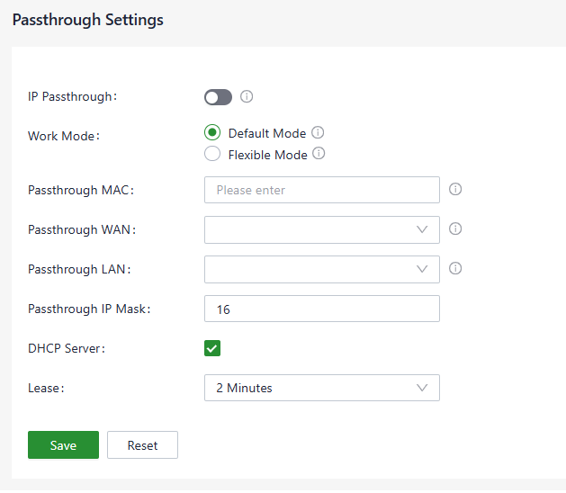

<strong>图 4-47 IP直通设置</strong>

> **说明**：
>
> 1. 启用IP直通模式后，仅一个客户端可访问互联网，且静态路由、VPN、端口转发和策略路由功能将失效。
> 2. 访问该客户端设备时需放行入站规则。

### 4.10 系统

#### 4.10.1 修改密码

ODU12的默认用户名和密码见产品铭牌。首次登录后应修改密码以确保安全。点击网页右上角"adm"，在菜单中点击"Modify Password"修改密码。

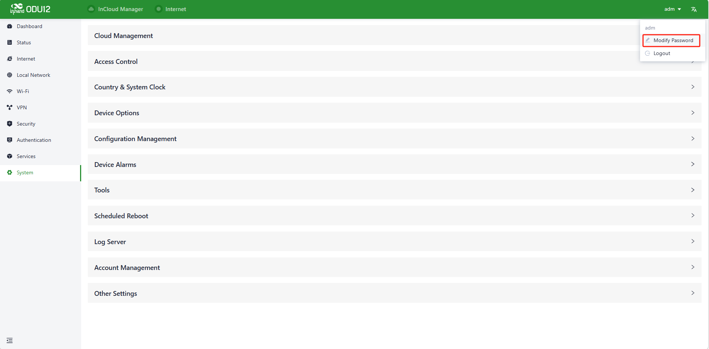

<strong>图 4-48 修改密码入口</strong>

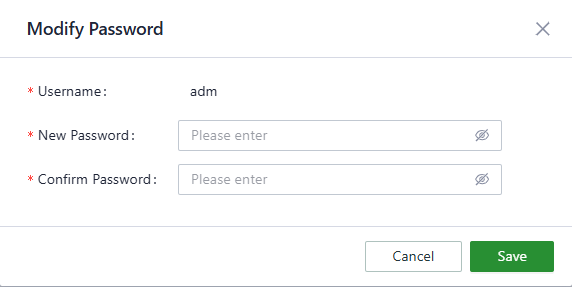

<strong>图 4-49 修改密码</strong>

#### 4.10.2 云管理

InCloud Manager（star.inhandcloud.com）是映翰通开发的云平台，帮助企业加速网络部署、简化网络维护、提升服务体验。该平台提供零接触部署、智能维护和安全特性。用户可登录平台远程管理设备、批量配置并监控设备流量。

ODU12自动连接InCloud Manager。用户可在本页面选择要连接的映翰通平台，也可在本页面禁用InCloud Manager。

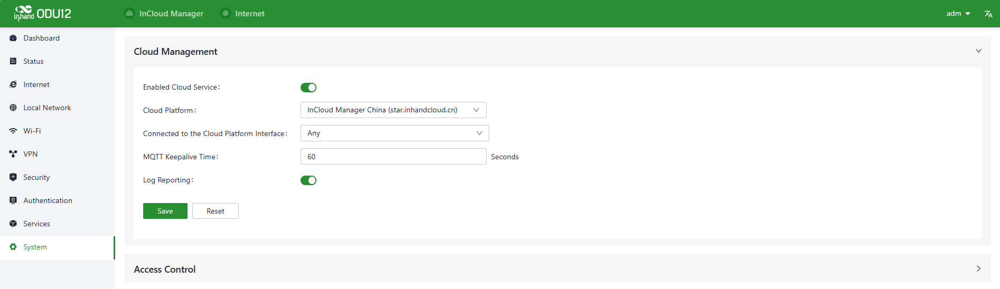

<strong>图 4-50 云管理设置</strong>

#### 4.10.3 访问控制

在本页面，用户可允许或禁止公网访问ODU12，以及指定公网访问ODU12的端口。本页面的规则不影响局域网设备访问ODU12。ODU12的Web配置页面访问支持HTTPS。

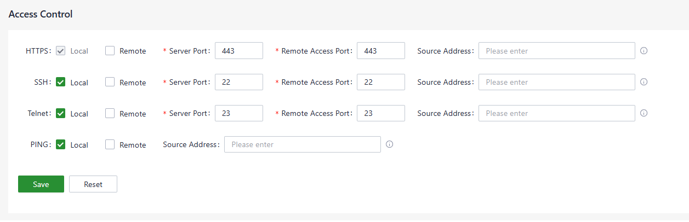

<strong>图 4-51 访问控制设置</strong>

#### 4.10.4 国家与系统时钟

为系统选择时区，启用NTP服务器与目标NTP服务器同步时间。

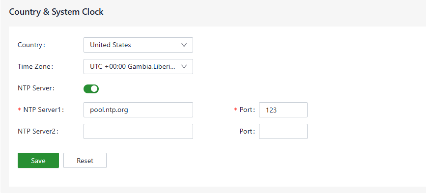

<strong>图 4-52 国家与系统时钟设置</strong>

#### 4.10.5 设备选项

在本页面可重启、升级固件或将ODU12恢复出厂设置。

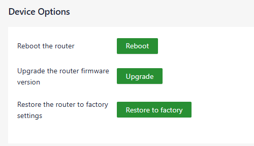

<strong>图 4-53 设备选项</strong>

> **说明**：
>
> 1. 升级固件前，需确认新固件来自官方渠道。
> 2. 若ODU12已接入InCloud Manager，恢复出厂设置前平台将同步设备配置，设备仅清除历史数据。

#### 4.10.6 配置管理

用户可将系统配置导出至本地PC作为备份，并将配置导入设备以恢复配置。

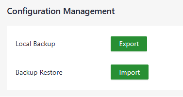

<strong>图 4-54 配置管理</strong>

#### 4.10.7 设备告警

当用户需要关注设备可能发生的某些事件时，可选择对应的告警事件并设置告警邮件地址。选定事件发生时ODU12将发出告警，未选定的事件将记录在日志中。

ODU12当前支持记录和告警以下事件：

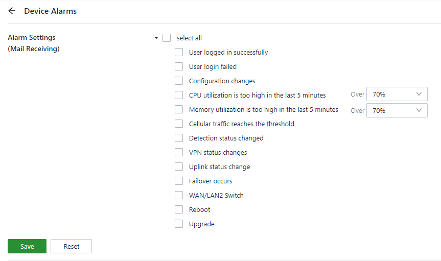

<strong>图 4-55 告警选项</strong>

配置邮件服务器地址、端口、用户名和密码后，ODU12将通过该邮箱发送告警邮件。配置收件邮箱地址，并向该地址发送测试邮件，以检查上述配置的正确性。

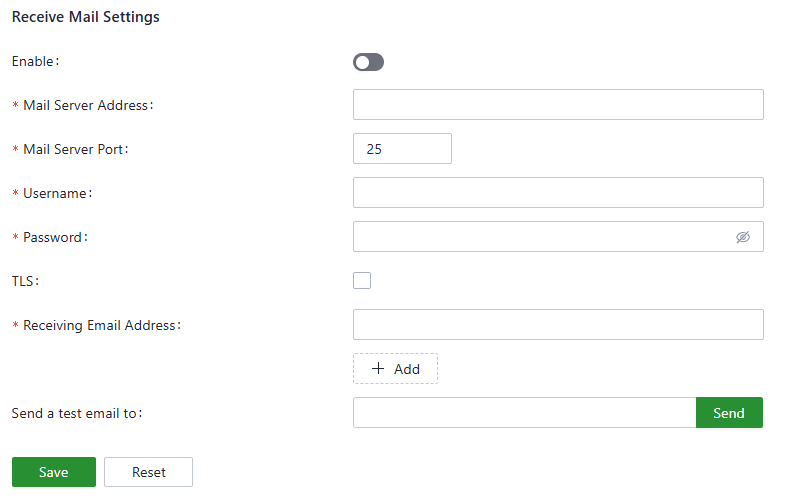

<strong>图 4-56 收件邮箱设置</strong>

#### 4.10.8 工具

##### 4.10.8.1 Ping

使用ICMP协议检查源地址（Source为空时为ODU12自身）与Target中其他IP地址或域名之间的连通性。

在Target中输入IP地址或域名，点击"Start"开始ping。

<strong>图 4-57 Ping工具</strong>

##### 4.10.8.2 Traceroute

输入目标IP地址或域名，选择接口，点击"Start"，测试并追踪从ODU12到目标的链路情况。

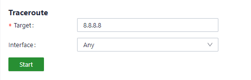

<strong>图 4-58 Traceroute工具</strong>

##### 4.10.8.3 抓包

用户可使用该功能捕获通过指定接口转发的数据。

在Output下拉列表中选择选项，可查看捕获的数据包信息，或将信息导出至PC。

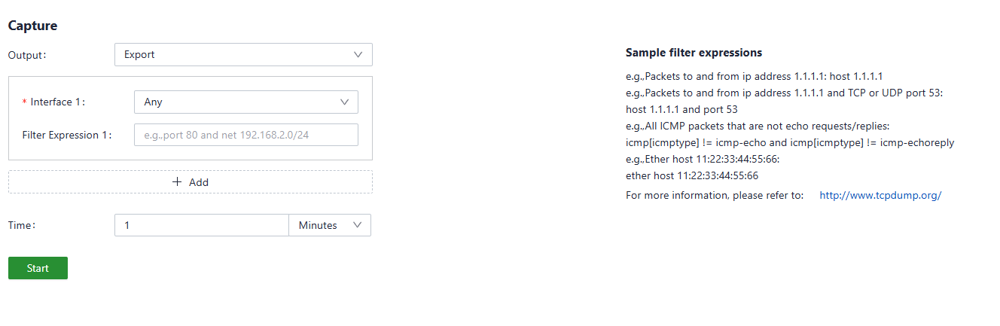

<strong>图 4-59 抓包工具</strong>

#### 4.10.9 定时重启

定时重启是一种网络设备管理策略，允许管理员在特定时间或特定条件下自动重启设备，以保障设备的正常运行和性能。实际使用中，用户可在"System > Scheduled Reboot"功能中按业务需求设置定时重启。设备支持按日、按周或按月定时重启。按月重启时，若所选重启日超过当月实际天数，设备将在当月最后一天重启。例如，选择每月31日重启，则仅有30天的月份将在30日重启。

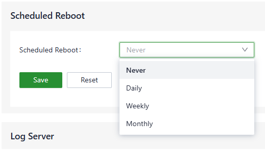

<strong>图 4-60 定时重启</strong>

#### 4.10.10 日志服务器

设置远程日志服务器，ODU12将系统日志上传至该远程日志服务器。

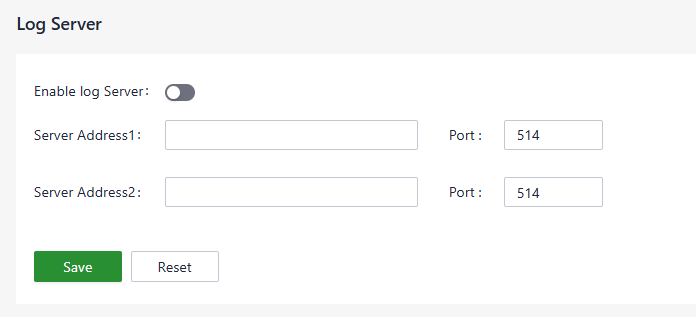

<strong>图 4-61 日志服务器</strong>

#### 4.10.11 其他设置

在本页面可设置Web登录超时时间、启用或禁用加速转发，并配置其他系统设置。

<strong>图 4-62 其他设置</strong>

> **说明**：启用加速转发（Accelerated Forwarding）后，蜂窝转发速度将显著提升，但流量整形、IPSec等其他功能将失效。

## 第5章 典型应用

### 案例1：家庭及轻商业场所5G上网与云管理

**场景描述**：家庭、商铺等场所缺乏有线宽带资源或需要快速开通网络时，可部署ODU12作为室外5G接入点，为室内PC、手机、摄像头等终端提供有线和Wi-Fi网络接入，并接入InCloud Manager云平台实现远程运维。

**网络拓扑**：

<strong>图 5-1 ODU12家庭及轻商业场所部署拓扑</strong>

**设备角色**：ODU12作为室外边缘5G路由器，通过5G蜂窝上行接入互联网，通过PoE LAN1和WAN/LAN2提供有线接入，通过双频Wi-Fi 7提供无线覆盖，同时接入InCloud Manager接受远程集中管理。

**配置步骤**：

1. 上电前插入SIM卡、确认天线连接，按[第2章 安装与首次使用](#第2章-安装与首次使用)完成设备安装并登录Web管理界面。
2. 按[场景1：蜂窝联网](#场景1蜂窝联网)配置蜂窝参数，建立5G上行链路。
3. 按[场景3：Wi-Fi无线接入](#场景3wi-fi无线接入)配置SSID和密码，为室内无线终端提供接入。
4. 按[场景5：接入InCloud Manager云平台](#场景5接入incloud-manager云平台)注册平台账号并添加设备，实现远程监控和批量配置。
5. （可选）按[场景6：访客Wi-Fi Portal认证](#场景6访客wi-fi-portal认证)为访客SSID启用Portal认证；按[场景7：IPSec VPN站点互联](#场景7ipsec-vpn站点互联)建立与总部网络的加密隧道。

**参考章节**：

- [第2章 安装与首次使用](#第2章-安装与首次使用)
- [场景1：蜂窝联网](#场景1蜂窝联网)
- [场景3：Wi-Fi无线接入](#场景3wi-fi无线接入)
- [场景5：接入InCloud Manager云平台](#场景5接入incloud-manager云平台)
- [4.10.2 云管理](#4102-云管理)

## 附录 故障处理

### 1 蜂窝网络问题

| 现象 | 可能原因 | 排查步骤 | 对应章节 |
|------|----------|----------|----------|
| 无法连接蜂窝网络 | SIM卡未正确安装或无效 | 1. 确认SIM卡正确安装且有效 2. 重新插拔SIM卡 | [场景1：蜂窝联网](#场景1蜂窝联网) |
| 无法连接蜂窝网络 | 蜂窝信号弱 | 1. 检查蜂窝网络信号强度 2. 将路由器移至信号覆盖较好的区域 | [1.2 指示灯说明](#12-指示灯说明) |
| 无法连接蜂窝网络 | 流量套餐失效或超限 | 1. 确认流量套餐仍在有效期内且未超出流量限制 2. 联系运营商确认套餐状态 | [场景1：蜂窝联网](#场景1蜂窝联网) |
| 无法连接蜂窝网络 | 设备未建立连接 | 重启设备，等待其建立连接 | [场景1：蜂窝联网](#场景1蜂窝联网) |
| 无法连接蜂窝网络 | APN配置错误 | 1. 核对APN配置是否与运营商提供的信息一致 2. 重新配置拨号参数 | [4.3.3 蜂窝设置](#433-蜂窝设置) |

### 2 上网与链路问题

| 现象 | 可能原因 | 排查步骤 | 对应章节 |
|------|----------|----------|----------|
| 无法连接有线WAN网络 | 蜂窝网络连接异常或信号不足 | 1. 检查蜂窝网络连接是否正常 2. 确认信号强度充足 | [场景1：蜂窝联网](#场景1蜂窝联网) |
| 无法连接有线WAN网络 | 设备配置错误 | 1. 核对设备配置，包括APN设置、用户名/密码 2. 重新保存联网参数 | [4.3 联网设置](#43-联网设置) |
| 设备自身无法访问互联网 | 设备到互联网的链路异常 | 使用ping工具检查设备自身与互联网的连通性 | [4.10.8.1 Ping](#41081-ping) |
| 终端无法上网 | 防火墙规则或MAC过滤阻止 | 1. 检查防火墙入站/出站规则和MAC地址过滤配置 2. 确认未禁止该地址访问网络 | [4.7.1 防火墙](#471-防火墙) |
| 终端无法上网 | 客户端地址异常 | 将客户端与设备重新连接，重新获取地址 | [场景3：Wi-Fi无线接入](#场景3wi-fi无线接入) |

### 3 网络性能问题

| 现象 | 可能原因 | 排查步骤 | 对应章节 |
|------|----------|----------|----------|
| 网速慢或不稳定 | 蜂窝信号弱 | 1. 检查蜂窝网络信号强度 2. 将路由器置于信号接收良好的位置 | [4.2.7 蜂窝信号](#427-蜂窝信号) |
| 网速慢或不稳定 | 终端连接在2.4G频段 | 将设备连接至5GHz频段 | [场景3：Wi-Fi无线接入](#场景3wi-fi无线接入) |
| 网速慢或不稳定 | 固件版本较旧 | 更新路由器固件，获取最新的性能和稳定性改进 | [4.10.5 设备选项](#4105-设备选项) |

### 4 Web访问与账号问题

| 现象 | 可能原因 | 排查步骤 | 对应章节 |
|------|----------|----------|----------|
| 无法登录Web管理界面 | PC与设备不在同一网段 | 1. 确认PC IP地址在192.168.1.2~192.168.1.254范围内 2. 网关为192.168.1.1 | [2.2.2 方式二：通过PC登录Web管理界面](#222-方式二通过pc登录web管理界面) |
| 登录页面提示网页不安全 | 浏览器证书提示 | 打开隐藏或高级选项，选择"继续访问" | [2.2.2 方式二：通过PC登录Web管理界面](#222-方式二通过pc登录web管理界面) |
| 忘记管理密码 | 密码被修改后遗忘 | 1. 长按Reset按钮10秒恢复出厂设置 2. 使用铭牌默认用户名和密码重新登录 | [1.3 恢复出厂设置](#13-恢复出厂设置) |
| 云平台上无法远程访问设备 | 未使用远程访问功能 | 选中目标设备，点击"Remote Access"打开设备本地登录界面 | [4.2 本地Web界面监控](#42-本地web界面监控) |

## 附录 安全注意事项

1. 修改联网设置可能导致网络中断，变更【Internet】相关配置前需谨慎评估。
2. 升级固件前，需确认新固件来自官方渠道。
3. 设备为室外安装设备，需在安装后确认设备固定牢靠，避免因跌落造成设备损坏。
4. 非专业人员请勿打开设备外壳，存在触电风险。

> **警告**：设备应在规定的工作环境条件下使用，避免在极端条件之外的环境中部署，以确保IP65防护性能和长期可靠运行。

## FAQ 常见问题解答

### 问题1：4G/5G无法联网？

1. 物理环境：首先检查SIM卡是否插入正确的卡槽位，蜂窝天线是否全部安装。
2. APN设置：确保APN的配置信息与运营商提供的一致。
3. 检查设备连通性：登录到设备本地界面，通过系统自带的ICMP工具，ping 8.8.8.8测试是否连通。若可连通，则检查接入设备（如电脑、手机）与路由器的连通性。
4. 判断SIM卡是否正常：取出SIM卡，安装在手机中查看是否可以正常联网。
5. 重启：将路由器断电，等待几秒钟，然后重新连接电源，重试网络连接。
6. 恢复出厂：将路由器恢复出厂，然后重新尝试。

### 问题2：云平台是否收费？

映翰通一直致力于为中小型连锁机构提供优质的网络服务。用户使用云平台服务时，需要为每台设备购买许可，以使用丰富的云端功能。

### 问题3：如何添加设备到云平台？

1. 首先在 `https://star.inhandcloud.com` 注册InCloud Manager账号。
2. 使用注册账号登录云平台，在设备菜单下点击"Add"，按照提示填写设备的序列号和MAC地址，完成设备添加。设备首次添加时，默认赠送1年免费Essential许可，后续用户可按需续费。

### 问题4：不使用云平台能否使用设备？

可以。用户可在本地完成绝大多数配置任务。但批量配置部署、固件升级、SD-WAN、Connector等功能，需要结合本地设备设置与云平台使用。

若无法通过上述步骤解决问题或遇到其他问题，需联系北京映翰通网络技术股份有限公司获取技术支持。可访问 `www.inhandnetworks.com` 获取更多信息。
