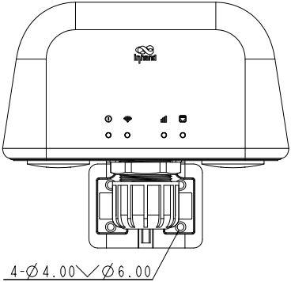

  

    

      
    

    

      一步到位，告别天线
    

  

  

    

      ODU302 4G 工业级户外无线路由器
    

    

      

        
· 4G LTE

        
· 天线路由一体

      

      

        
· IP65 防护

        
· 链路备份

      

    

  

# 1. 产品概述

ODU302 是一款打破传统的全集成工业级户外无线路由器，将高性能路由器与高增益天线合二为一，IP65 防护等级。专为 ATM、充电桩、自助终端及各类控制柜设计，整机可直接安装于设备顶部，无需在柜内放置路由器、再用馈线将天线引至户外，从根本上解决布线复杂、馈线信号损耗和柜内空间占用等痛点。

## 功能与优势

| 价值维度 | 描述 |
| :--- | :--- |
| **天线路由一体化** | 路由器集成于天线外壳内，整机顶部安装；无需单独采购室外天线，无需穿墙走线 |
| **零馈线损耗** | 射频与天线一体化，消除长馈线衰减；4G 环境下信号更强、通信更稳定 |
| **PoE 单线供电** | 支持 IEEE 802.3af PoE 受电，一根网线同时传输电力与数据；亦可选用 DC 9~36 V 工业端子供电 |
| **双 SIM 4G 冗余** | 双 Nano SIM 智能切换，蜂窝/有线链路可备份，保障 7×24 小时在线 |
| **企业级安全与 VPN** | SPI 防火墙、ACL、IPSec、OpenVPN、WireGuard、ZeroTier |
| **云平台管理** | 映翰通 Device Manager 云管理平台，远程监控、配置下发、固件升级与批量运维 |
| **专为户外环境设计** | IP65 防护，-20 °C ~ +70 °C 宽温工作 |

## 典型应用场景

### 金融自助（ATM）
柜内空间有限、馈线信号衰减、可靠性要求高。ODU302 顶部安装释放柜内空间，零馈线损耗带来更稳定的交易连接。

### 智慧能源（充电桩）
户外暴露、防水防尘、远程运维需求。IP65 + 宽温设计、PoE 单线供电、Device Manager 批量运维。

### 自助零售（售货机）
快速部署、防破坏、降低 BOM。集成天线无需室外天线，减少柜内走线，一致采购。

### 工业控制（户外控制柜）
多开孔密封复杂、数字 I/O 采集控制。仅需一根以太网线入柜，2 路可配置 DI/DO。

## 产品尺寸

  

    
    
正视图

  

  

    
    
侧视图

  

  

    
    
底部视图

  

  

    
    
后面视图

  

 

    
注意：

    
1. 所有尺寸单位为毫米（mm）。

    
2. 尺寸（长 × 宽 × 高）：164 × 50 × 129.7 mm。

    
3. 所有尺寸均为近似值，仅供参考。

    
4. 图示尺寸不得用于生产加工。

    
5. 尺寸如有变更，恕不另行通知。

  

  

# 2. 产品创新

## 创新一：天线路由一体，顶部安装
路由器直接集成于天线外壳内，安装于 ATM、充电桩、控制柜等设备顶部。无需单独采购室外天线，无需穿墙走馈线。单一 SKU、单一安装步骤，显著降低现场施工与系统集成复杂度。

## 创新二：零馈线损耗，信号更强
射频模块与天线一体化设计，信号以零馈线衰减传输——在馈线损耗严重的高频 LTE 波段优势尤为明显。同时省去室外天线的采购与匹配成本，ODU302 出厂即配备优化的内置天线与 IP65 防护。

## 创新三：PoE 单线部署
ODU302 支持 IEEE 802.3af PoE 受电，从顶部安装单元到柜内仅需一根以太网线即可同时传输电力和数据。布线从"电源 + 以太网 + 馈线"缩减为一根网线。同时也支持 DC 9~36 V 端子供电。

## 创新四：专为严苛户外环境打造
IP65 防护等级，防尘且耐受高压水枪冲击。工作温度 -20 °C ~ +70 °C。通过 IEC 60068-2-27 冲击、IEC 60068-2-6 振动和 EN 61000-4-x EMC Level 2 测试。顶部安装后直接暴露于户外，常规雨尘无需额外防护罩。

## 创新五：成熟的 IR302 软件平台
ODU302 搭载与久经验证的 InRouter302 相同的软件平台。双 SIM 故障切换、企业级防火墙、VPN、链路备份、数字 I/O 及映翰通 Device Manager 云管理——全线功能继承，学习成本为零。现有 IR302 用户可无缝迁移配置与工作流。

# 3. 硬件规格

## 3.1 硬件概述

| 参数 | 规格 |
| :--- | :--- |
| **处理器** | 580 MHz |
| **内存** | 128 MB DDR2 SDRAM |
| **存储** | 32 MB SPI NOR Flash |
| **4G 模块** | 4G LTE Cat.4，下行 150 Mbps / 上行 50 Mbps |
| **推荐用户数** | 32 |
| **以太网端口** | 2 × 10/100 Mbps RJ45，WAN/LAN 可切换，LAN2 支持 PoE |
| **SIM 卡槽** | 2 × Nano SIM（抽屉式卡座），双卡故障切换 |
| **数字 I/O** | 2 × 可配置 DI 或 DO |
| **蜂窝天线** | 2 × 内置 4G 天线（ANT_4G_1，ANT_4G_2） |
| **Wi-Fi 天线** | 1 × 内置 Wi-Fi 天线 |
| **Wi-Fi** | IEEE 802.11 b/g/n，2.4 GHz，最高 150 Mbps |
| **Wi-Fi 发射功率** | 802.11b：16 dBm ± 2 dBm（11 Mbps） 802.11g：16 dBm ± 2 dBm（54 Mbps） 802.11n@2.4 GHz HT20 MCS7：16 dBm ± 2 dBm 802.11n@2.4 GHz HT40 MCS7：16 dBm ± 2 dBm |
| **LED 指示灯** | System、Wi-Fi、Cellular、Ethernet |
| **复位按钮** | 针孔式 Reset 按键 |
| **供电输入** | DC 9~36 V（4PIN 电源与 I/O 合并端子，防过流、防反接） IEEE 802.3af PoE 受电（Mode A 或 Mode B） |
| **待机功耗** | 90~110 mA @ 12 V |
| **工作功耗** | 280~300 mA @ 12 V |
| **峰值功耗** | 340~360 mA @ 12 V |
| **防护等级** | IP65 |
| **外壳** | 工业级塑料 |
| **工作温度** | -20 °C ~ +70 °C |
| **存储温度** | -40 °C ~ +85 °C |
| **湿度** | 5% ~ 95%（无凝露） |
| **尺寸** | 164 × 50 × 129.7 mm |
| **重量** | 约 500 g |
| **安装** | 壁挂、抱杆、顶部安装 |

## 3.2 接口概述

### RJ45 端口

| 端口 | 默认 | 说明 |
| :---: | :---: | :--- |
| WAN/LAN1（左侧） | WAN/LAN | 10/100 Mbps，软件可切换 |
| LAN2（中间） | LAN | 10/100 Mbps，PoE PD 受电端，Mode A（数据线对 1/2、3/6）或 Mode B（空闲线对 4/5、7/8）均可受电。符合 IEEE 802.3af 标准 |

### SIM 卡槽

| 卡槽 | 说明 |
| :---: | :--- |
| SIM1（上方） | 主 SIM 卡（Nano SIM，抽屉式卡座） |
| SIM2（下方） | 备用 SIM 卡（Nano SIM，抽屉式卡座） |

### 复位按钮

- **硬件 RST：** 针孔式复位按键

### 电源与 I/O 端子（4PIN，2×2 布局）

| 位置 | 上方引脚 | 下方引脚 |
| :---: | :---: | :---: |
| 左侧 | IO1（DI/DO1，可配置） | GND |
| 右侧 | IO2（DI/DO2，可配置） | DC 9-36V 直流输入正极 |

## 3.3 环境与可靠性

| 测试项目 | 标准 | 等级/结果 |
| :--- | :--- | :--- |
| **ESD（静电放电）** | EN 61000-4-2 | Level 2 |
| **辐射电场抗扰度** | EN 61000-4-3 | Level 2 |
| **脉冲电场（EFT）** | EN 61000-4-4 | Level 2 |
| **浪涌（Surge）** | EN 61000-4-5 | Level 2 |
| **传导骚扰抗扰度** | EN 61000-4-6 | Level 2 |
| **振荡波抗扰度** | EN 61000-4-12 | Level 2 |
| **工频磁场抗扰度** | EN 61000-4-8 | 400 A/m（≥ Level 2） |
| **冲击** | IEC 60068-2-27 | 符合 |
| **振动** | IEC 60068-2-6 | 符合 |
| **自由跌落** | IEC 60068-2-32 | 符合 |

# 4. 网络连接能力

## 4.1 蜂窝网络

- **网络制式：** GSM/GPRS/EDGE、UMTS/HSPA+/EVDO、TD-SCDMA、FDD LTE/TDD LTE
- **网络接入：** APN、VPDN
- **接入认证：** CHAP/PAP
- **连接模式：** 永远在线、按需拨号、手动拨号
- **激活方式：** 数据触发、短信触发

## 4.2 SIM 卡管理

- **双卡支持：** 抽屉式双 Nano SIM 卡槽
- **双卡故障切换：** 主/备 SIM 自动切换支持
- **智能切换：**
  - 拨号失败自动切换 SIM 卡
  - 信号低于阈值自动切换
  - 可配置主卡/备卡及最大拨号次数
- **SIM 绑定：** ICCID 绑定、PIN 码管理

## 4.3 有线网络

- **WAN 协议：** 静态 IP、DHCP、PPPoE
- **LAN 协议：** ARP、Ethernet
- **接口模式：** 2 × RJ45 端口，WAN/LAN 可配置
- **NAT：** 网络地址转换（NAPT）

## 4.4 Wi-Fi 4 无线接入

- **标准：** IEEE 802.11 b/g/n（Wi-Fi 4）
- **频段：** 2.4 GHz 单频
- **最高速率：** 150 Mbps
- **模式：** 接入点（AP）、客户端（STA）
- **安全：** 开放系统、共享密钥、WPA/WPA2
- **加密：** WEP/TKIP/AES

# 5. 链路管理与备份

## 5.1 智能链路备份

- **备份模式：** 蜂窝拨号与 WAN 端口可互为主备
- **探测方式：** ICMP/TCP/DNS 链路质量探测（可配置）
- **切换策略：** 链路故障自动切换，断线自动重拨

## 5.2 VRRP 热备份

- **协议支持：** VRRP（虚拟路由器冗余协议）
- **应用场景：** 双机热备，提升业务连续性

## 5.3 链路质量保障

- **链路检测：** 心跳包监控，断线自动重连
- **双 SIM 切换：** 蜂窝链路或拨号异常自动切换备份 SIM
- **内置看门狗：** 设备自检，故障自动恢复

# 6. 安全特性

## 6.1 防火墙

- **状态检测：** SPI 全状态包检测
- **DoS 防护：** 拒绝服务攻击防御
- **访问控制：** ACL 访问控制列表
- **内容过滤：** URL 内容过滤
- **端口映射：** 端口转发、虚拟 IP 映射
- **IP-MAC 绑定：** IP-MAC 绑定；组播/Ping 包过滤
- **NAT：** NAPT 支持

## 6.2 VPN 支持

- IPsec VPN（IKEv1、IKEv2）
- L2TP VPN（客户端）
- PPTP VPN（客户端）
- GRE 隧道
- OpenVPN（客户端/服务器）
- WireGuard
- ZeroTier
- CA 数字证书支持

## 6.3 流量整形（QoS）

- **带宽控制：** 接口级带宽限制
- **IP 限速：** 基于 IP 的上/下行速率限制
- **QoS 策略：** 带宽和速率限制策略

# 7. 本地网络服务

## 7.1 DHCP 服务

- **DHCP 服务器：** 动态 IP 地址分配
- **DHCP 中继：** 跨子网 DHCP 中继
- **DHCP 客户端：** 客户端地址获取

## 7.2 DNS 服务

- **DNS 中继/代理：** 本地缓存与转发
- **自定义 DNS：** 可配置 DNS 服务器

## 7.3 动态 DNS（DDNS）

- **多供应商支持：** 主流 DDNS 服务商
- **自动更新：** WAN/蜂窝 IP 变化时自动更新域名解析

## 7.4 静态路由

- **路由表项：** 静态路由配置
- **默认路由：** 蜂窝/WAN 默认路由支持

## 7.5 IP Passthrough

- **桥接模式：** WAN/拨号 IP 透传至下游设备
- **灵活配置：** 拨号和 WAN 端口上的透传模式

# 8. 云端管理与运维

ODU302 搭载映翰通 Device Manager 云管理平台，实现对大规模分布式户外设备的统一远程运维。

## 8.1 Device Manager 云管理

| 功能 | 描述 |
| :--- | :--- |
| **设备接入** | Device Manager 云平台及自定义服务器支持 |
| **远程管理** | 设备状态查询、远程配置下发、固件升级、远程重启 |
| **批量运维** | 大规模设备批量配置与维护 |
| **SNMP 网管** | SNMP v1/v2c/v3，支持 Trap 告警上报 |
| **流量管理** | 流量阈值、流量统计与流量告警 |
| **告警类型** | 系统重启、LAN 端口上下线、流量告警、SIM 卡故障 |
| **通知方式** | 邮件告警（可配置） |

# 9. 系统管理与维护

## 9.1 设备管理

- **Web 管理：** 图形化 Web 配置界面
- **CLI 管理：** Telnet、SSH、Console
- **配置导入/导出：** 备份与恢复
- **恢复出厂：** 针孔复位或 Web 恢复出厂
- **固件升级：** Web 或 Device Manager 远程升级

## 9.2 日志与诊断

- **系统日志：** 本地 syslog、远程日志、串口日志导出；关键日志断电持久化
- **诊断工具：** Ping（网络连通性）、Traceroute（路由追踪）、网络测速（链路性能）

## 9.3 短信功能

- **状态查询：** 短信查询设备状态
- **远程重启：** 短信触发设备重启

## 9.4 其他系统能力

- **按需拨号：** 按需拨号；数据/短信激活
- **状态查询：** 系统状态、Modem 状态、网络连接状态、路由状态
- **计划维护：** NTP 时间同步；故障自动恢复（内置看门狗）

# 10. 订购信息

## 10.1 型号代码结构

**型号编码：** ODU302–\<WMNN\>

| 字段 | 代码 | 说明 |
| :--- | :--- | :--- |
| 类型与模块 | CNC4 | 中国，4G LTE Cat.4，Wi-Fi，I/O |
| | NAC4 | 北美，4G LTE Cat.4，Wi-Fi，I/O |
| | EUC4 | 欧洲/亚太，4G LTE Cat.4，Wi-Fi，I/O |

## 10.2 产品型号

| 型号 | 区域 | 说明 |
| :---: | :---: | :--- |
| **ODU302-CNC4** | 中国 | LTE-FDD: B1/B3/B5/B8 LTE-TDD: B34/B38/B39/B40/B41 WCDMA: B1/B8 GSM: B3/B8 CDMA: BC0 TD-SCDMA: B34/B39 Wi-Fi: 802.11 b/g/n I/O: 2× 可配置 DI/DO |
| **ODU302-NAC4** | 北美 | LTE-FDD: B2/B4/B5/B12/B13/B14/B66/B71 WCDMA: B2/B4/B5 Wi-Fi: 802.11 b/g/n I/O: 2× 可配置 DI/DO |
| **ODU302-EUC4** | 欧洲/亚太 | LTE-FDD: B1/B3/B5/B7/B8/B20/B28 LTE-TDD: B38/B40/B41 WCDMA: B1/B5/B8 GSM/EDGE: B3/B8 Wi-Fi: 802.11 b/g/n I/O: 2× 可配置 DI/DO |

## 10.3 包装内容

- ODU302 主机 × 1
- IEEE 802.3af PoE 适配器 × 1
- 1M 网线 × 1
- 安装套件（壁挂/抱杆/顶部安装）× 1
- 快速入门指南 × 1

# 11. 可靠性标准与认证

## 11.1 防护等级

- **IP 防护：** IP65（防尘、防高压水枪喷射）

## 11.2 机械可靠性

| 测试项目 | 标准 |
| :--- | :--- |
| 冲击 | IEC 60068-2-27 |
| 振动 | IEC 60068-2-6 |
| 自由跌落 | IEC 60068-2-32 |

## 11.3 EMC 电磁兼容抗扰度

| 测试项目 | 标准 |
| :--- | :--- |
| ESD（静电放电） | EN 61000-4-2，Level 2 |
| 辐射电场抗扰度 | EN 61000-4-3，Level 2 |
| EFT/脉冲群 | EN 61000-4-4，Level 2 |
| 浪涌 | EN 61000-4-5，Level 2 |
| 传导骚扰抗扰度 | EN 61000-4-6，Level 2 |
| 振荡波抗扰度 | EN 61000-4-12，Level 2 |
| 工频磁场抗扰度 | EN 61000-4-8，400 A/m |

## 11.4 认证与合规

| 认证 | 状态 |
| :--- | :--- |
| FCC | 已取得 |
| IC | 已取得 |
| PTCRB | 已取得 |
| AT&T | 已取得 |
| Verizon | 已取得 |
| T-Mobile | 已取得 |

> 注：认证状态以发布时为准，具体 SKU 最新认证情况请与映翰通销售团队确认。

# 12. 联系我们

**映翰通网络（InHand Networks）**

- **官网：** [www.inhand.com](https://www.inhand.com)
- **版权声明：** © 映翰通网络 保留所有权利
