# 北京映翰通户外4G蜂窝路由器 ODU302 产品用户手册
---

## 前言
### 声明
感谢您选用本公司产品。在使用本产品前，请仔细阅读本用户手册。遵守以下声明有助于维护知识产权与法律合规性，确保您的使用体验与最新产品信息保持一致。如有任何疑问或需获取书面许可，请随时联系我们的技术支持团队。

**版权声明**

本用户手册内容受版权保护，归北京映翰通网络技术股份有限公司及其许可方所有。未经书面许可，本手册任何部分不得以任何形式摘录、复制或翻印，亦不得以任何形式传播。

**免责声明**

鉴于产品技术与规格持续更新，映翰通网络无法保证本用户手册中的信息与实物产品完全一致。因此，因实际技术参数与本手册不一致而产生的任何争议，映翰网络不承担任何责任。产品如有变更，恕不另行通知。映翰网络保留最终修改与解释权。

**版权信息**

本用户手册内容受版权法保护。版权归映翰网络科技有限公司及其许可方所有。保留所有权利。未经书面许可，本手册任何部分不得被使用、复制或传播。

### 图形界面约定
| 符号 | 含义 | 示例 |
| --- | --- | --- |
| `< >` | 表示需以实际取值替换的变量或参数 | `<IP地址>` 表示应输入具体的 IP 地址 |
| `" "` | 表示界面上的文字标签 | 单击"保存"按钮 |
| `>` | 表示菜单层级或操作顺序 | 【网络】>【蜂窝】 |
| `【 】` | 表示菜单或页面名称 | 进入【系统设置】页面 |

### 技术支持

**北京映翰通网络技术股份有限公司（总部）**

电话：010-8417 0010

地址：北京市朝阳区紫月路18号院3号楼5层

**成都办事处**

电话：028-8679 8244

地址：四川省成都市武侯区天府大道北段1777号中国太平金融大厦14层

**广州办事处**

电话：020-8562 9571

地址：广州市天河区黄埔大道中660号汇金国际金融中心B栋1913单元

**武汉办事处**

电话：027-8716 3566

地址：武汉市洪山区关山大道465号光谷新发展国际中心B座5层

**上海办事处**

电话：021-5480 8501

地址：上海市普陀区国浩长风城北座326室

### 如何使用本手册
**a) 找到您的起点**

+ 首次使用用户：建议按顺序阅读：认识设备 → 安装与首次使用 → 常见场景配置 → 功能说明与参数参考。
+ 已安装设备的用户：可直接查阅功能说明与参数参考，或查阅附录 A 故障排查。
+ 云平台管理用户：可参阅常见场景配置中的 DM 云平台接入章节。

**b) 快速任务索引**

| 任务 | 对应章节 | 预计耗时 |
| --- | --- | --- |
| 安装设备硬件 | [安装与首次使用](#chapter-2-安装与首次使用) | 约 10 分钟 |
| 通过蜂窝网络接入互联网 | [蜂窝网络接入互联网](#scenario-1-蜂窝网络接入互联网) | 约 5 分钟 |
| 通过有线方式接入互联网 | [有线网络接入互联网](#scenario-2-有线网络接入互联网) | 约 5 分钟 |
| 通过 Wi-Fi 接入互联网 | [Wi-Fi 接入互联网](#scenario-3-wi-fi-接入互联网) | 约 5 分钟 |
| 连接 DM 云平台 | [DM 云平台接入](#scenario-4-dm-云平台接入) | 约 10 分钟 |
| 配置 VPN | [VPN](#46-vpn) | 视需要而定 |
| 恢复出厂设置 | [恢复出厂设置](#15-恢复出厂设置) | 约 3 分钟 |
| 排查网络问题 | [附录 A 故障排查](#appendix-a-故障排查) | 视需要而定 |


---

# 第 1 章 认识设备
## 1.1 概述
ODU302 是一款户外型蜂窝路由器，集成 4G 蜂窝、以太网及 Wi‑Fi 局域网等多种通信技术。设备内置硬件看门狗、链路检测、链路备份、故障自愈与自动重启功能，能够为无人值守站点提供稳定可靠的通信保障。设备支持多种 VPN 技术，保障敏感业务数据安全传输。ODU302 支持多样化远程管理方式，包含 Web 管理界面，以及可实现批量配置、设备监控的映翰通设备管理云平台。

ODU302 达到 IP65 防护等级，支持 PoE 供电输入与9~36V DC电源输入，同时支持顶装、壁挂、抱杆三种安装方式，十分适合各类户外部署应用场景。

## 1.2 包装清单
每台 ODU302 产品均包含以下标准配件。请您在收到产品时仔细核对。如有缺失或损坏，请联系映翰销售人员。

此外，映翰可根据不同站点特点，为客户提供选配配件。

**表 1-2-1 标准配件**

| 物品 | 数量 | 说明 |
| --- | --- | --- |
| ODU302 | 1 | 户外路由器 |
| 以太网线缆 | 1 | 1 m 以太网线缆 |
| 取卡针 | 1 | 金属卡针 |
| 壁挂支架 | 1 | 安装件 |
| 抱杆安装夹 | 1 | 安装件 |
| 膨胀螺栓和螺丝套件 | 1 | 安装件 |
| 室外防水连接器 | 2 | 防水器件 |
| 室外防水盖 | 2 | 防水器件 |
| 室外防水螺母 | 1 | 防水器件 |


**表 1-2-2 选配配件**

| 物品 | 数量 | 说明 |
| --- | --- | --- |
| PoE供电组件 | 1 | PoE供电盒+交流电源线 |
| 12V/1A电源适配器 | 1 | 直流电源适配器 |


## 1.3 外观与接口
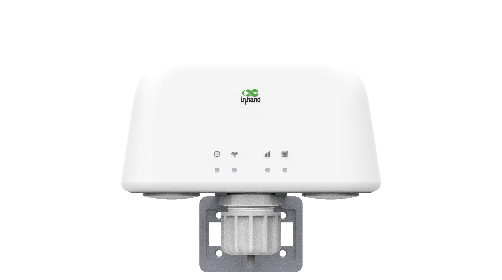

**图 1-1 设备面板（正面视图）**


**图 1-2 设备面板（背面视图）**

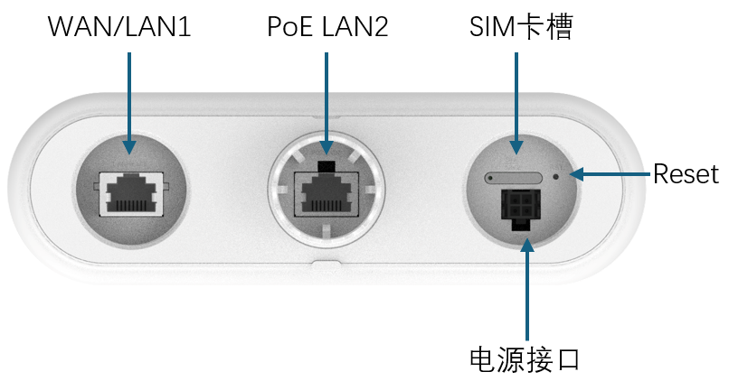

**图 1-3 设备面板（底部视图）**

**表 1-3-1 接口说明**

| 接口 | 位置 | 功能说明 |
| --- | --- | --- |
| 电源 | 底部 | DC 电源输入端子（9~36V DC） |
| WAN/LAN1 | 底部 | 可配置为 WAN 或 LAN1 |
| PoE LAN2 | 底部 | 支持 PoE 的 LAN2 以太网端口 |
| SIM 卡槽 | 底部 | 双 SIM 卡槽 |
| Reset | 底部 | 用于恢复出厂设置的复位按钮 |


## 1.4 LED 指示灯
**表 1-4-1 LED 指示灯说明**

| LED 指示灯 | 状态 | 含义 |
| --- | --- | --- |
| 系统 | 熄灭 | 断电 |
| | 红色常亮 | 系统已上电 |
| | 红色闪烁 | 系统故障 |
| | 绿色常亮 | 系统正常运行 |
| | 蓝色闪烁 | 系统升级中 |
| Wi-Fi | 熄灭 | 未启用 Wi-Fi |
| | 绿色闪烁 | Wi-Fi 驱动加载中 |
| | 绿色常亮 | AP 工作正常 |
| 蜂窝 | 熄灭 | 未启用蜂窝 |
| | 红色闪烁 | 拨号进行中 |
| | 绿色常亮 | 信号值 21~30 |
| | 蓝色常亮 | 信号值 11~20 |
| | 红色常亮 | 信号值 0~10 |
| 以太网端口 | 熄灭 | 以太网未连接 |
| | 红色常亮 | 仅 WAN 口连接 |
| | 绿色常亮 | 仅 LAN 口连接 |
| | 蓝色常亮 | LAN 与 WAN 口均已连接 |


## 1.5 恢复出厂设置
使用复位按钮将设备恢复为默认设置，步骤如下：

当路由器处于上电状态时，**按住复位按钮 10 秒**，系统 LED 将由蓝色常亮变为蓝色闪烁。设备已恢复为默认设置，随后将正常启动。

此外，用户也可通过 Web 界面恢复出厂设置：

1. 登录 Web 页面。
2. 在导航树中单击 **系统 >> 配置管理**。
3. 单击 **恢复出厂设置** 按钮。
4. 确认恢复。系统将重启并恢复出厂设置。

## 1.6 默认设置
**表 1-6-1 默认设置**

| 参数 | 默认值 |
| --- | --- |
| LAN IP 地址 | 192.168.2.1 |
| LAN 子网掩码 | 255.255.255.0 |
| DHCP 服务器 | 启用 |
| DHCP IP 地址池范围 | 192.168.2.2 ~ 192.168.2.100 |
| Web 登录用户名 | adm |
| Web 登录密码 | 见产品铭牌 |
| WAN/LAN1 模式 | LAN |
| 蜂窝拨号 | 启用 |
| Wi-Fi 模式 | AP |
| Wi-Fi SSID | inhand |
| Wi-Fi 认证 | 开放方式 |
| 设备管理器 | 禁用 |


---

# 第 2 章 安装与首次使用
## 2.1 安装前准备
**表 2-1-1 安装环境要求**

| 项目 | 要求 |
| --- | --- |
| 供电 | 9~36V DC 或 PoE（802.3af） |
| 工作温度 | -20℃ ~ +70℃ |
| 存储温度 | -40℃ ~ +85℃ |
| 相对湿度 | 5% ~ 95%（无凝露） |
| 网络覆盖 | 确保安装现场有 3G/4G 蜂窝网络覆盖 |


**所需工具与材料：**

+ 1 台 PC
+ 1 张 SIM 卡（确保已开通数据业务且未被停机）
+ 电源（9~36V DC 或 PoE（802.3af））

> **注意**：设备应在断电状态下安装与操作。安装时应充分考虑周边环境。
>

## 2.2 安装指南
 安装与部署前，请提前插入有效的 SIM 卡。

### 2.2.1 壁挂安装
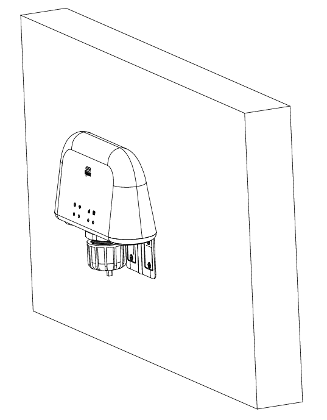


1. 部件清单

+ 4G ODU 主机
+ 壁挂支架
+ 电缆防水接头组件：M30×1.5 螺母、线缆橡胶密封圈、接头卡爪、接头锁母
+ 膨胀螺钉套件

2. 安装步骤

**步骤 1**：根据壁挂支架的孔位，在坚固的墙面上钻出安装孔。

**步骤 2**：按顺序组装电缆防水接头：接头锁母 → 接头卡爪 → 线缆橡胶密封圈 → M30×1.5 螺母。将整个接头组件从户外侧穿过预先在墙上钻好的孔。

将 ODU 主机底部螺纹与电缆防水接头的 M30 螺母连接，并充分拧紧，以保持 IP65 防水等级。

**步骤 3**：使用随附的膨胀螺钉将壁挂支架固定到墙面。将支架卡入 ODU 机壳侧面的卡槽并锁紧。

**步骤 4**：将以太网线缆从户外穿过接头引入室内。紧固接头卡爪，使线缆入口完全密封，防止雨水渗入。

3. 注意事项

+ 本设备为 IP65 户外防护等级，所有螺纹接头与接头组件必须充分拧紧，以保证防水性能。
+ 仅可安装在坚固平整的墙面上，严禁安装于空心或松软墙面，以免支架脱落。
+ 线缆布放后务必拧紧接头卡爪，消除缝隙，防止进水。

### 2.2.2 杆装安装


1. 部件清单

+ 4G ODU 主机
+ 通用壁挂/杆装支架
+ 电缆防水接头组件：M30×1.5 螺母、线缆橡胶密封圈、接头卡爪、接头锁母
+ 0~100mm 不锈钢喉箍
+ 电线杆

2. 安装步骤

**步骤 1**：按顺序组装电缆防水接头：接头锁母 → 接头卡爪 → 线缆橡胶密封圈 → M30×1.5 螺母。将以太网线缆从接头中心穿过并预留余量。

**步骤 2**：将 ODU 底部端口旋入 M30×1.5 螺母并充分拧紧，以保持 IP65 防水等级。

**步骤 3**：将通用安装支架卡入 ODU 机壳侧面的卡槽并牢固锁紧。

**步骤 4**：将 0~100mm 喉箍穿过支架，环绕电线杆后拧紧喉箍，将支架牢固固定在杆体表面。

**步骤 5**：调整 ODU 主机的朝向。拧紧接头卡爪，使橡胶密封圈压紧线缆，防止进水。

3. 注意事项

+ 本设备为 IP65 户外防护等级，所有螺纹接头与接头组件必须充分拧紧，以避免进水损坏。
+ 适用于直径 0 mm ~ 100 mm 的圆柱杆。
+ 户外部署时应定期检查喉箍的紧固程度，防止设备脱落。
+ 设备应安装于易涝区域之上，且线缆端口朝下，以减少雨水积聚。

### 2.2.3 机柜顶装


1. 包含部件

+ 4G ODU 主机
+ 机柜安装背板
+ M30×1.5 锁紧螺母

2. 安装步骤

**步骤 1**：在机柜安装背板上钻出 M30 标准通孔，以适配 ODU 底部的螺纹接头。

**步骤 2**：将 4G ODU 的螺纹底端从机柜安装背板外侧穿入机柜内部。

**步骤 3**：将 M30×1.5 锁紧螺母旋入内螺纹并充分拧紧，将 ODU 牢固固定在背板上，以保持 IP65 防水性能。

**步骤 4**：将以太网线缆穿过 ODU 接头引入机柜内部走线。组装完整的电缆防水接头组件，并压紧橡胶密封圈防止进水。

3. 重要提示

+ 应完全拧紧 M30 锁紧螺母，防止户外振动下设备松动及漏水。
+ 机柜安装背板应具有足够的结构刚度；薄钢板需加设加强筋，以免发生弯曲变形。
+ 不得拆除螺纹接头处的密封垫圈，否则会丧失户外防护性能。

### 2.2.4 登录路由器
完成硬件安装后，请确保管理 PC 已安装以太网适配器，再登录路由器 Web 设置页面。

**一、自动获取 IP 地址（推荐）**

将管理计算机设置为"自动获得 IP 地址"和"自动获得 DNS 服务器地址"（计算机操作系统的默认配置），由设备自动为管理计算机分配 IP 地址。

**二、设置静态 IP 地址**

将管理 PC 的 IP 地址（如 192.168.2.2）设置为与设备 LAN 接口处于同一网段（LAN 接口初始 IP 地址：192.168.2.1，子网掩码：255.255.255.0）。

**三、取消代理服务器**

若管理 PC 使用代理服务器访问互联网，必须关闭代理服务。步骤如下：

1. 在浏览器窗口中，选择"工具 >> Internet 选项"。
2. 选择"连接"选项卡，单击"局域网设置"按钮进入"局域网设置"窗口。确认"为 LAN 使用代理服务器"选项是否被勾选；若已勾选，则取消勾选并单击 `<确定>` 按钮。

**四、登录 Web 设置页面**

打开浏览器，在地址栏中输入 ODU302 的 IP 地址，例如 `http://192.168.2.1`（ODU302 的默认设置）。连接后，从登录界面以管理员身份登录。在登录界面输入用户名和密码（默认用户名和密码请查看设备铭牌）。

> **注意**：出于安全考虑，建议首次登录后修改默认登录密码，并妥善保管密码信息。
>

---

# 第 3 章 常见场景配置
## 场景 1：蜂窝网络接入互联网
**目标**：通过 4G/3G 蜂窝网络接入互联网。

**前提条件**：已插入 SIM 卡且设备已上电。

**预计耗时**：约 2 分钟。

**操作步骤**：

1. 将 SIM 卡插入卡槽 1。连接网线与电源线，然后给设备上电。

> **注意**：更换或插入 SIM 卡时，必须先断电并重启设备，以免数据丢失或设备损坏。
>

2. 打开浏览器并登录设备 Web 界面。（Web 登录步骤参见 2.2.4 节。）
3. 在导航树中单击 **网络 >> 蜂窝**，设置拨号接入参数。设备默认已启用拨号功能。等待数分钟使设备接入互联网。（若未拨号，可重启蜂窝业务。）

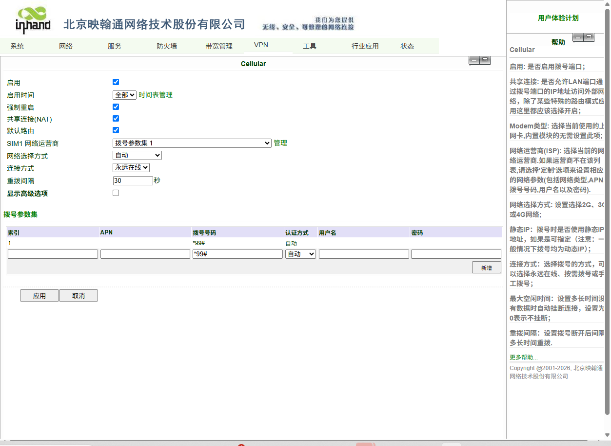

**图 3-1 SIM 卡拨号配置**

4. 设备支持双 SIM 卡模式。当 SIM 卡插入卡槽 2 时，必须在高级设置中启用双 SIM 卡功能。可在拨号参数设置中配置专网拨号参数。单击 **应用**，然后选择蜂窝网络运营商。

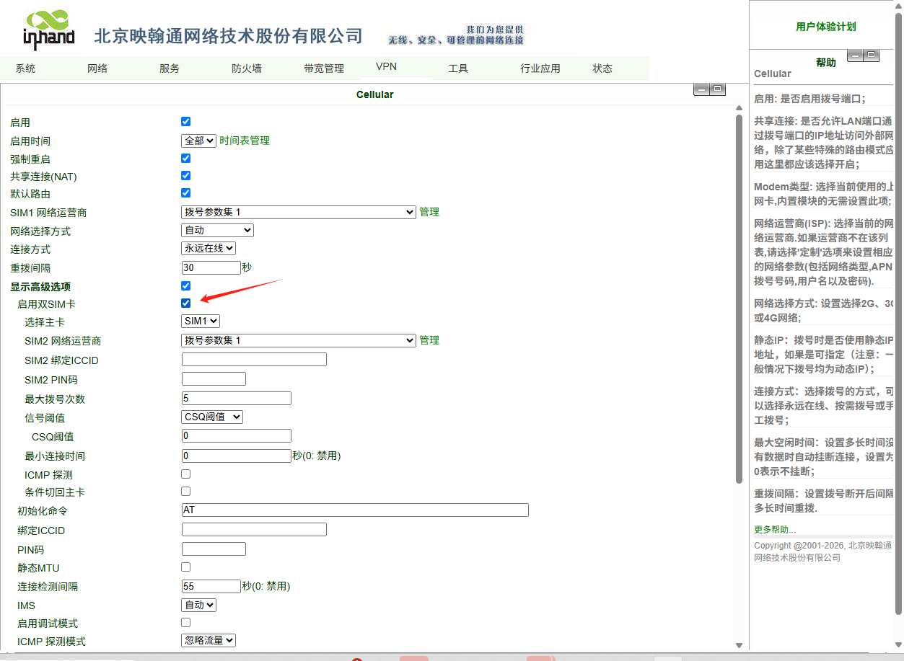

**图 3-2 拨号参数**

5. 在导航树中单击 **状态 >> 网络连接**，查看网络状态。若状态显示为"已连接"且已分配 IP 地址，表明 SIM 卡已成功接入互联网。


**图 3-3 拨号连接状态**

**验证方法**：

1. 检查设备面板上的蜂窝 LED，常亮则拨号成功。
2. 在 **状态 >> 网络连接** 页面，确认拨号接口已获取 IP 地址。
3. 使用 **工具 >> Ping 检测** 页面中的 ping 工具测试到外部地址（如 8.8.8.8）的连通性。

**常见问题**：

+ 拨号失败：检查 SIM 卡是否插好、APN 参数是否正确配置，以及 SIM 卡余额是否充足且已开通数据业务。
+ 频繁重连：检查 ICMP 检测服务器是否可达，以及信号强度是否稳定。

## 场景 2：有线网络接入互联网
**目标**：通过有线以太网连接接入互联网。

**前提条件**：具备以太网线缆且上行网络提供互联网接入；设备已上电。

**预计耗时**：约 5 分钟。

**操作步骤**：

1. 按图示接好电源线和网线。将 WAN 口连接至互联网，将 LAN2 口连接至 PC。
2. 将 PC 设置为与网关设备 IP 地址处于同一网段。

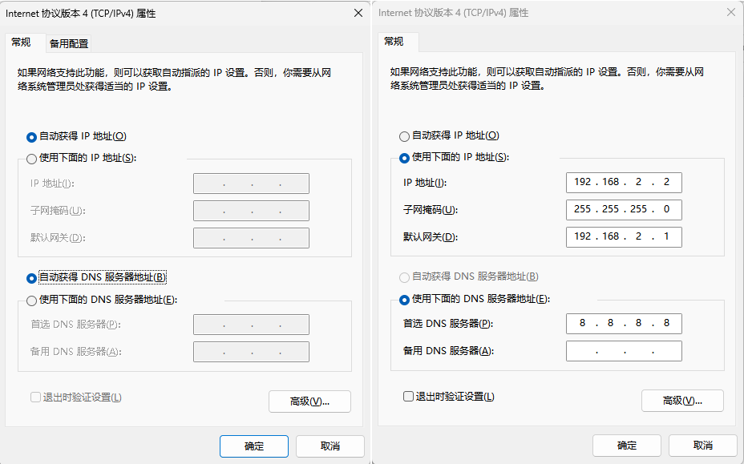

**图 3-4 动态获取 / 手动配置**

PC 的 IP 地址应设置为 "192.168.2.2 ~ 192.168.2.254" 范围内的任意取值。网关为 "192.168.2.1"，子网掩码为 "255.255.255.0"。DNS 应配置为运营商的 DNS 服务器地址。

    - **方式一**：DHCP 自动获取地址（推荐）。
    - **方式二**：使用固定 IP 地址。将 PC 与网关设置于同一地址段（LAN2 端口的 DHCP 服务器默认启用）。
3. 在浏览器中输入设备默认地址 `192.168.2.1`，进入设备 Web 管理页面。（若页面提示连接不安全，可展开隐藏或高级选项并选择继续。）

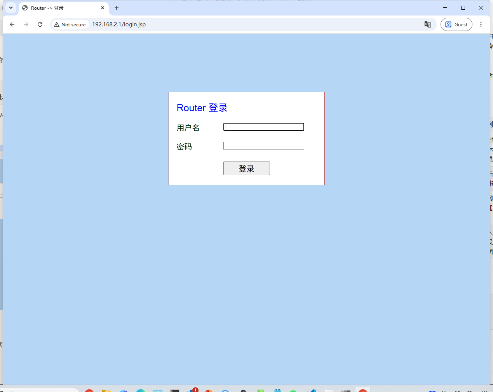

**图 3-5 登录 Web 页面管理**

4. 配置 WAN 口。在导航栏中单击 **网络 >> WAN/LAN 切换**，选择 WAN 模式，并配置 WAN 口的 IP 地址，使设备能够接入互联网。（请确保接口处于 WAN 模式；初始默认为 LAN 模式。）


**图 3-6 WAN 口设置**

5. 提供三种地址分配方式：动态 DHCP（推荐）、静态 IP、以及 ADSL 拨号（PPPoE）。配置完成后单击 **应用**。

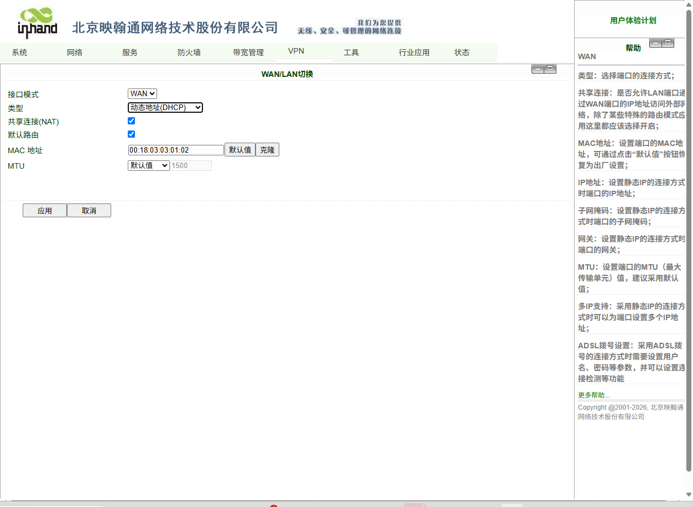

**图 3-7-a WAN 动态 IP 配置**

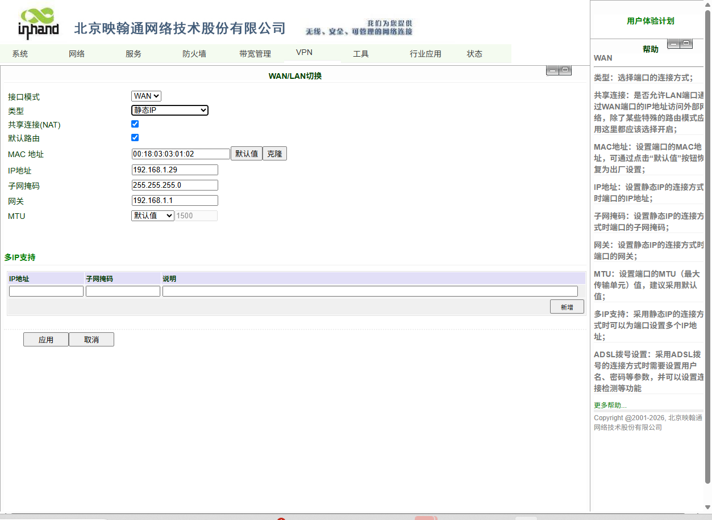

**图 3-7-b WAN 静态 IP 配置**

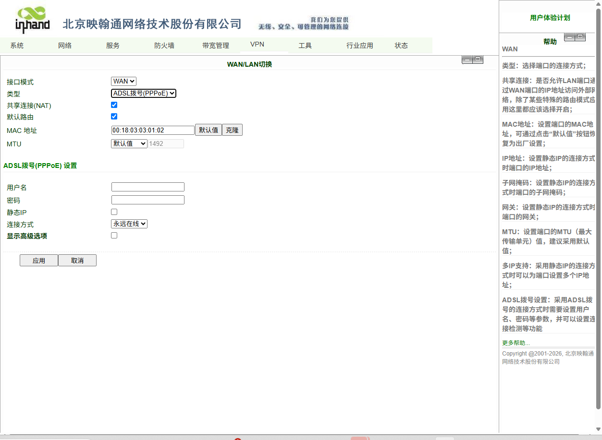

**图 3-7-c WAN ADSL 拨号**

6. 使用 ping 工具验证网络连接。

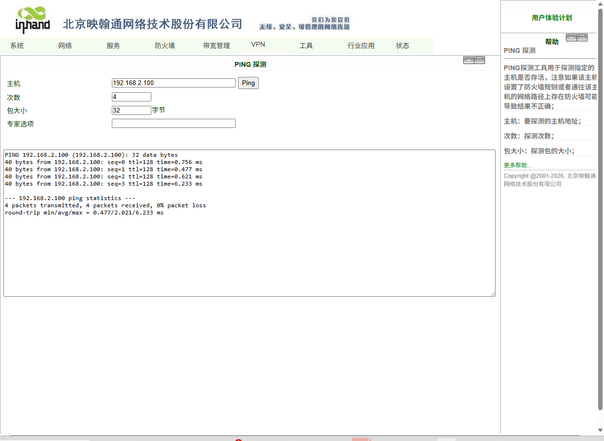

**图 3-8 Ping 结果示意图**

**验证方法**：

1. 在 **状态 >> 网络连接** 页面，确认 WAN 接口已获取 IP 地址。
2. 使用 **工具 >> Ping 探测** 页面中的 ping 工具测试到外部地址的连通性。

**常见问题**：

+ 无法获取 IP 地址：检查上行 DHCP 服务器是否工作正常，或静态 IP 参数是否正确配置。
+ WAN 口无互联网接入：检查 WAN/LAN 切换是否设置为 WAN 模式。
+ ADSL 拨号失败：检查用户名和密码是否正确。

## 场景 3：DM 云平台接入
**目标**：将设备连接至映翰 DM 云管理平台，实现远程管理。

**前提条件**：设备已成功接入互联网；已注册 DM 云平台账号。

**预计耗时**：约 10 分钟。

**操作步骤**：

1. 确保设备已成功接入互联网。在导航菜单中单击 **服务 >> 设备远程管理平台**，配置 DM 云平台的接入。服务器地址即设备管理器的地址。映翰提供的地址如下：

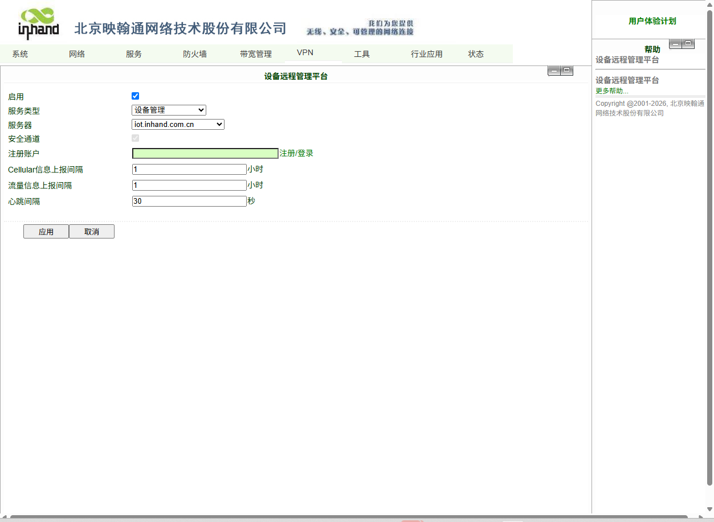

**图 3-9 远程平台配置**

    - 设备管理器：iot.iniot.inhand.com.cn
    - InConnect：ics.inhandiot.com
2. 注册或登录 DM 云平台账号。通过以下链接访问注册/登录页面：https://iot.inhand.com.cn。

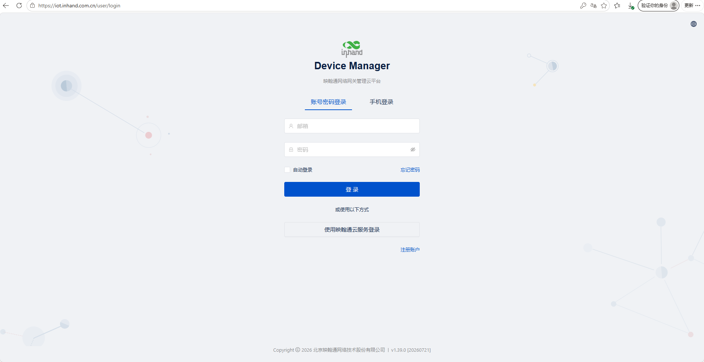

**图 3-10 账号注册/登录**

3. 登录 DM 平台，单击 **网关管理 >> 新增** 添加设备。为设备命名并填写序列号，将设备添加至云平台。

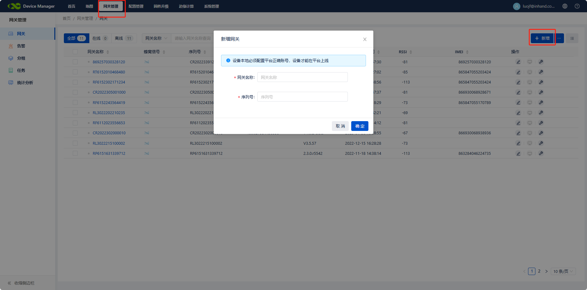

**图 3-11 添加设备至平台**

4. 添加设备并成功连接平台后，在 **网关** 列表中选择相应设备，然后单击 **操作** 下的 **Web 管理**，远程访问设备配置页面。

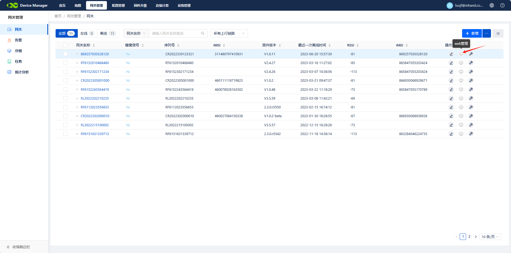

**图 3-12 远程访问设备配置页面**

**验证方法**：

1. 在 **状态 >> 设备管理器** 页面，检查路由器与设备管理器之间的连接状态是否正常。
2. 在 DM 云平台上，确认设备在线且正在上报数据。

**常见问题**：

+ 设备无法连接平台：检查设备是否已接入互联网，以及服务器地址是否正确配置。
+ 平台显示设备离线：检查注册的账号是否正确，以及序列号是否匹配。

---

# 第 4 章 功能说明与参数参考
本章说明 ODU302 的功能模块，并提供各配置页面的详细参数参考。用户可通过 Web 界面导航树进入相应页面。

## 4.1 系统
### 4.1.1 基本设置
**路径**：导航树 >> **系统 >> 基本设置**

**功能说明**：选择路由器配置界面的显示语言，并设置个性化的主机名。

**表 4-1-1 基本设置参数**

| **参数** | **说明** | **默认值** |
| --- | --- | --- |
| 语言 | 配置 Web 配置界面的语言 | 英文 |
| 主机名 | 为连接到路由器的主机或设备设置名称，用于标识 | Router |


### 4.1.2 时间
**路径**：导航树 >> **系统 >> 时间**

**功能说明**：设置本地时区，并通过 NTP 自动更新时间。

**表 4-1-2 系统时间参数**

| **参数** | **说明** | **默认值** |
| --- | --- | --- |
| 路由器时间 | 显示路由器当前时间 | 2015/12/12 上午 8:00:00 |
| PC 时间 | 显示 PC 当前时间 | 当前时间 |
| 时区 | 设置路由器的时区 | 自定义 |
| 自定义 TZ 字符串 | 设置路由器的 TZ 字符串 | CST-8 |
| 自动更新时间 | 选择是否自动更新时间；选项包括启动时或每 1/2/... 小时 | 启动时 |
| NTP 时间服务器 | 设置通过 NTP 服务器同步网络时间 | 114.80.81.1 |


### 4.1.3 管理员访问
**路径**：导航树 >> **系统 >> 管理员访问**

**功能说明**：修改路由器的用户名和密码。路由器可通过 HTTP、HTTPS、Telnet、SSHD 及 Console 进行访问。设置登录超时时间。

**表 4-1-3 管理员访问参数**

| **参数** | **说明** | **默认值** |
| --- | --- | --- |
| **用户名/密码** |  |  |
| 用户名 | 设置登录 Web 配置的用户名 | adm |
| 旧密码 | 访问 Web 配置的原密码 | 无 |
| 新密码 | 访问 Web 配置的新密码 | 无 |
| 确认新密码 | 再次确认新密码 | 无 |
| **管理功能** |  |  |
| 服务端口 | HTTP/HTTPS/TELNET/SSHD/Console 的服务端口 | 80/443/23/22 |
| 本地访问 | 启用 —— 允许本地 LAN 以相应服务（如 HTTP）管理路由器。禁用 —— 本地 LAN 不能以相应服务管理路由器。 | 启用 |
| 远程访问 | 启用 —— 允许远程主机以相应服务管理路由器。禁用 —— 远程主机不能以相应服务管理路由器。 | 启用 |
| 允许从 WAN 访问（可选） | 设置允许从 WAN 访问（仅限 HTTP/HTTPS/TELNET/SSHD）。可设置当前控制该服务的主机，如 192.168.2.1/30 或 192.168.2.1-192.168.2.10。 | 无 |
| 描述 | 用于记录管理功能各项参数的用途（不影响路由器配置） | 无 |
| **其他参数** |  |  |
| 日志超时 | 设置登录超时时间（登录超时后路由器将自动断开配置界面） | 500 秒 |


### 4.1.4 系统日志
**路径**：导航树 >> **系统 >> 系统日志**

**功能说明**：配置将记录路由器日志的远程日志服务器的 IP 地址和端口号。

**表 4-1-4 系统日志参数**

| **参数** | **说明** | **默认值** |
| --- | --- | --- |
| 记录到远程系统 | 启用日志服务器 | 禁用 |
| 日志服务器地址和端口（UDP） | 设置远程日志服务器的地址和端口 | 无:514 |
| 记录到控制台 | 通过串口输出设备日志 | 禁用 |


### 4.1.5 配置管理
**路径**：导航树 >> **系统 >> 配置管理**

**功能说明**：导入、导出及恢复路由器配置参数。

**表 4-1-5 配置管理参数**

| **参数** | **说明** | **默认值** |
| --- | --- | --- |
| 浏览 | 选择配置文件 | 无 |
| 导入 | 将配置文件导入路由器 | 无 |
| 备份 | 将配置文件备份到主机 | 无 |
| 恢复默认配置 | 选择恢复默认配置（重启后生效） | 无 |
| 调制解调器驱动程序 | 用于配置模组的驱动程序 | 无 |
| 网络运营商（ISP） | 用于配置全球各地网络运营商的 APN、用户名、密码等参数 | 无 |


> **注意**：应保证导入配置的有效性与顺序。有效的配置将在系统重启后按顺序依次执行。若配置文件未按有效顺序排布，系统将无法进入预期状态。
>

> **注意**：为不影响当前系统的运行，执行导入配置或恢复默认配置时，需重启设备使新配置生效。
>

### 4.1.6 计划任务
**路径**：导航树 >> **系统 >> 计划任务**

**功能说明**：设置系统重启的定时计划。

**表 4-1-6 计划任务参数**

| **参数** | **说明** | **默认值** |
| --- | --- | --- |
| 启用 | 启用/禁用该功能 | 禁用 |
| 时间 | 选择重启时间 | 0:00 |
| 日期 | 每天重启路由器 | 每天 |
| 显示高级选项 | 启用更详细的计划规则，可设置多条规则在特定时间或间隔重启路由器。启用该功能后将禁用上述每日重启功能。 | 禁用 |
| 拨号后重启 | 拨号成功后路由器将重启。该参数留空时不生效。 | 无 |


### 4.1.7 升级
**路径**：导航树 >> **系统 >> 升级**

**功能说明**：升级路由器固件。

升级过程可分为两步。第一步，将固件写入备用文件区。第二步，将备用文件区的固件复制到主固件区，该步骤在系统重启期间执行。软件升级过程中，不允许在 Web 页面上进行任何操作，否则可能中断软件升级。

升级系统时，先单击 `<浏览>` 选择升级文件，再单击 `<升级>` 并单击 `<确定>` 开始升级。固件升级成功后，单击 `<重启>` 重启设备。

### 4.1.8 重启
**路径**：导航树 >> **系统 >> 重启**

**功能说明**：重启路由器。

重启前请保存配置，否则未保存的配置将在重启后丢失。

重启系统，单击 **系统 >> 重启**，然后单击 `<确定>`。

### 4.1.9 注销
**路径**：导航树 >> **系统 >> 注销**

**功能说明**：注销 Web 管理界面。

注销时，单击 **系统 >> 注销**，然后单击 `<确定>`。

## 4.2 网络
### 4.2.1 蜂窝
**路径**：导航树 >> **网络 >> 蜂窝**

**功能说明**：配置 PPP 拨号参数。一般情况下，用户仅需设置基本配置，无需设置高级选项。

**表 4-2-1-1 拨号/蜂窝参数**

| **参数** | **说明** | **默认值** |
| --- | --- | --- |
| 启用 | 启用蜂窝拨号 | 启用 |
| 时间计划 | 设置时间计划 | 全天 |
| 强制重启 | 若长时间无法拨号且达到最大重试次数，路由器将重启 | 启用 |
| 共享连接（NAT） | 启用 —— 连接到路由器的本地设备可通过路由器访问互联网。禁用 —— 连接到路由器的本地设备不可通过路由器访问互联网。 | 启用 |
| 默认路由 | 启用默认路由 | 启用 |
| SIM1 网络运营商 | 为 SIM1 选择网络运营商配置文件 | Profile 1 |
| 网络类型 | 选择网络类型；若选择自动，路由器将按顺序尝试 4G、3G、2G | 自动 |
| 连接模式 | 选项包括永久在线、按需连接、手动。选择按需连接模式时可配置短信触发。 | 永久在线 |
| 重拨间隔 | 设置登录失败时的重拨时间 | 30 s |
| **显示高级选项** |  |  |
| 双 SIM 启用 | 启用双 SIM 卡功能 | 禁用 |
| SIM2 网络运营商 | 为 SIM2 卡选择网络运营商 | Profile 1 |
| SIM2 绑定 ICCID | 设置 SIM2 的 ICCID | 无 |
| SIM2 PIN 码 | 用于设置 SIM2 的 PIN 码 | 无 |
| SIM2 SIM 卡运营商 | 设置 SIM2 卡所连接的 ISP | 自动 |
| 主 SIM | 设置优先用于拨号的 SIM 卡 | SIM1 |
| 最大拨号次数 | 设置最大拨号尝试次数；若达到该次数仍未拨号成功，路由器将切换 SIM 卡 | 5 |
| CSQ 阈值 | 设置信号阈值；若当前信号电平低于该值，路由器将切换 SIM 卡 | 0（禁用） |
| 最小连接时间 | 设置每次拨号尝试的最小连接时间 | 0（禁用） |
| 初始命令 | 设置自定义的初始 AT 命令，将在拨号开始时执行 | AT |
| 绑定 ICCID | 设置 SIM 卡的 ICCID | 无 |
| PIN 码 | 用于设置 SIM 卡的 PIN 码 | 无 |
| MTU | 启用后设置最大传输单元 | 1500 |
| 使用对端 DNS | 单击以接收 ISP 分配的对端 DNS | 启用 |
| 链路检测间隔 | 设置链路检测间隔 | 55 s |
| 调试 | 启用调试模式；在系统日志中打印调试日志 | 禁用 |
| 调试调制解调器* | 将调制解调器调试数据发送至控制台 | 禁用 |
| ICMP 检测模式 | 设置 ICMP 检测模式。忽略流量：无论蜂窝接口是否有流量，路由器均发送 ICMP 报文。监控流量：若蜂窝接口有流量，路由器不发送 ICMP 报文。 | 忽略流量 |
| ICMP 检测服务器 | 设置 ICMP 检测服务器。无 表示未启用 ICMP 检测。 | 无 |
| ICMP 检测间隔 | 设置 ICMP 检测间隔 | 30 s |
| ICMP 检测超时 | 设置 ICMP 检测超时（ICMP 超时则视为链路中断） | 20 s |
| ICMP 检测重试 | 设置 ICMP 失败的最大重试次数（达到最大值路由器将重拨） | 5 |


**表 4-2-1-2 拨号/蜂窝计划参数**

| **参数** | **说明** | **默认值** |
| --- | --- | --- |
| 计划名称 | 计划名称 | schedule1 |
| 周日 ~ 周六 | 单击启用 |  |
| 时间范围 1 | 设置时间范围 1 | 9:00-12:00 |
| 时间范围 2 | 设置时间范围 2 | 14:00-18:00 |
| 时间范围 3 | 设置时间范围 3 | 0:00-0:00 |
| 描述 | 设置描述内容 | 无 |


### 4.2.2 WAN/LAN 切换
**路径**：导航树 >> **网络 >> WAN/LAN 切换**

**功能说明**：WAN/LAN1 端口支持 WAN 和 LAN 两种工作模式。

WAN 支持三种有线接入方式：静态 IP、动态地址（DHCP）及 ADSL（PPPoE）拨号。

**表 4-2-2-1 WAN 静态 IP 参数**

| **参数** | **说明** | **默认值** |
| --- | --- | --- |
| 共享连接（NAT） | 启用 —— 连接到路由器的本地设备可通过路由器访问互联网。<br/>禁用 —— 连接到路由器的本地设备不可通过路由器访问互联网。 | 启用 |
| 默认路由 | 启用默认路由 | 启用 |
| MAC 地址 | 设备的 MAC 地址 | 设备的 MAC 地址 |
| IP 地址 | 设置 WAN 的 IP 地址 | 192.168.1.29 |
| 子网掩码 | 设置 WAN 的子网掩码 | 255.255.255.0 |
| 网关 | 设置 WAN 的网关 | 192.168.1.1 |
| MTU | 最大传输单元，默认/手动设置 | 默认（1500） |
| **多 IP 支持（最多可设置 8 个附加 IP 地址）** |  |  |
| IP 地址 | 设置 WAN 的附加 IP 地址 | 无 |
| 子网掩码 | 设置子网掩码 | 无 |
| 描述 | 用于记录附加 IP 地址的用途 | 无 |


**表 4-2-2-2 WAN 动态地址（DHCP）参数**

| **参数** | **说明** | **默认值** |
| --- | --- | --- |
| 共享连接（NAT） | 启用 —— 连接到路由器的本地设备可通过路由器访问互联网。<br/>禁用 —— 连接到路由器的本地设备不可通过路由器访问互联网。 | 启用 |
| 默认路由 | 启用默认路由 | 启用 |
| MAC 地址 | 设备的 MAC 地址 | 设备的 MAC 地址 |
| MTU | 最大传输单元，默认/手动设置 | 默认（1500） |


**表 4-2-2-3 WAN ADSL 拨号（PPPoE）参数**

| **参数** | **说明** | **默认值** |
| --- | --- | --- |
| 共享连接 | 启用 —— 连接到路由器的本地设备可通过路由器访问互联网。<br/>禁用 —— 连接到路由器的本地设备不可通过路由器访问互联网。 | 启用 |
| 默认路由 | 启用默认路由 | 启用 |
| MAC 地址 | 设备的 MAC 地址 | 设备的 MAC 地址 |
| MTU | 最大传输单元，默认/手动设置 | 默认（1492） |
| **WAN - ADSL 拨号（PPPoE）** |  |  |
| 用户名 | 设置拨号用户名 | 无 |
| 密码 | 设置拨号密码 | 无 |
| 静态 IP | 单击启用静态 IP | 禁用 |
| 连接模式 | 设置拨号连接方式（永久在线、按需拨号、手动拨号） | 永久在线 |
| **高级选项参数** |  |  |
| 服务名称 | 设置服务名称 | 无 |
| 设置发送队列长度 | 设置发送队列长度 | 3 |
| 启用 IP 头压缩 | 单击启用 IP 头压缩 | 禁用 |
| 使用对端 DNS | 单击启用使用对端 DNS | 启用 |
| 链路检测间隔 | 设置链路检测间隔 | 55 s |
| 链路检测最大重试 | 设置链路检测最大重试次数 | 10 |
| 启用调试 | 单击启用调试模式 | 禁用 |
| 专家选项 | 设置专家选项 | 无 |
| ICMP 检测服务器 | 设置 ICMP 检测服务器 | 无 |
| ICMP 检测间隔 | 设置 ICMP 检测间隔 | 30 s |
| ICMP 检测超时 | 设置 ICMP 检测超时 | 20 s |
| ICMP 检测重试 | 设置 ICMP 检测最大重试次数 | 3 |


### 4.2.3 LAN
**路径**：导航树 >> **网络 >> LAN**

**功能说明**：LAN 中的设备使用静态 IP 接入网络。

**表 4-2-3 LAN 参数**

| **参数** | **说明** | **默认值** |
| --- | --- | --- |
| MAC 地址 | 路由器 LAN 网关的 MAC 地址 | 路由器的 LAN MAC 地址 |
| IP 地址 | 路由器 LAN 网关的 IP 地址 | 192.168.2.1 |
| 子网掩码 | LAN 网关的子网掩码 | 255.255.255.0 |
| MTU | 最大传输单元，默认/手动设置 | 默认（1500） |
| LAN 模式 | 设置 LAN 接口的传输模式 | 自动协商 |
| **多 IP 设置（最多可设置 8 个附加 IP 地址）** |  |  |
| IP 地址 | 设置 LAN 的附加 IP 地址 | 无 |
| 子网掩码 | 设置子网掩码 | 无 |
| 描述 | 用于记录附加 IP 地址的用途 | 无 |
| **LAN 端口启用** |  |  |
| 端口 1/端口 2 | 启用相应 LAN 端口 | 启用 |
| **GARP** |  |  |
| 启用 | 路由器将自动向 LAN 设备发送 ARP 广播 | 禁用 |
| 广播次数 | 设置 ARP 广播次数 | 5 |
| 广播超时 | 设置 ARP 广播超时时间 | 10 |


### 4.2.4 切换 WLAN 模式
**路径**：导航树 >> **网络 >> 切换 WLAN 模式**

**功能说明**：ODU302-WLAN 支持 AP 和 STA 两种 WLAN 模式。更改并保存配置后，需重启设备使配置生效。

### 4.2.5 WLAN 客户端（AP 模式）
**路径**：导航树 >> **网络 >> WLAN**

**功能说明**：工作于 AP 模式时，ODU302 的 WLAN 将为其他无线网络设备提供接入点。请确保 ODU302 已通过 WAN 或蜂窝拨号接入互联网。

**表 4-2-5 WLAN 接入点参数**

| **参数** | **说明** | **默认值** |
| --- | --- | --- |
| SSID 广播 | 启用后，用户可通过 SSID 名称搜索到该 WLAN | 启用 |
| 模式 | 可选六种类型：802.11g/n、802.11g、802.11n、802.11b、802.11b/g、802.11b/g/n | 802.11b/g/n |
| 信道 | 选择信道 | 11 |
| SSID | 用户定义的 SSID 名称 | inhand |
| 认证方式 | 支持开放方式、共享方式、WEP 自动选择、WPA-PSK、WPA、WPA2-PSK、WPA2、WPA/WPA2、WPAPSK/WPA2PSK | 开放方式 |
| 加密 | 支持 NONE、WEP | NONE |
| 无线带宽 | 可选 20MHz 和 40MHz | 20MHz |
| 启用 WDS | 单击启用 WDS | 禁用 |
| 默认路由 | 单击启用路由 | 禁用 |
| 桥接 SSID | 设置桥接 SSID | 无 |
| 桥接 BSSID | 设置桥接 BSSID | 无 |
| 扫描 | 单击"扫描"以扫描附近的可用 AP |  |
| 认证模式 | 开放方式、共享方式、WPA-PSK、WPA2-PSK | 开放方式 |
| 加密方式 | 支持 NONE、WEP | 无 |


### 4.2.6 WLAN 客户端（STA 模式）
**路径**：导航树 >> **网络 >> WLAN 客户端**

**功能说明**：工作于 STA 模式时，路由器可通过连接其他 AP 接入互联网。

**表 4-2-6 WLAN 客户端参数**

| **参数** | **说明** | **默认值** |
| --- | --- | --- |
| 模式 | 支持 802.11b/g/n 等多种模式 | 802.11b/g/n |
| SSID | 待连接的 SSID 名称 | inhand |
| 认证方式 | 与待连接的接入点保持一致 | 开放方式 |
| 加密 | 与待连接的接入点保持一致 | NONE |


### 4.2.7 链路备份
**路径**：导航树 >> **网络 >> 链路备份**

**功能说明**：系统运行时，首先启用主链路进行通信。当主链路断开时，系统将自动切换至备份链路，以保证通信连续性。

**表 4-2-7-1 链路备份参数**

| **参数** | **说明** | **默认值** |
| --- | --- | --- |
| 启用 | 单击启用链路备份 | 禁用 |
| 备份模式 | 选项包括热备份、冷备份或负载均衡 | 热备份 |
| 主链路 | 可选 WAN 或拨号接口 | WAN |
| ICMP 检测服务器 | 设置 ICMP 检测服务器 | 无 |
| 备份链路 | 可选蜂窝或 WAN | 蜂窝 1 |
| ICMP 检测间隔 | 设置 ICMP 检测间隔 | 10 s |
| ICMP 检测超时 | 设置 ICMP 检测超时 | 3 s |
| ICMP 检测重试 | 设置 ICMP 检测最大重试次数 | 3 |
| ICMP 失败时重启接口 | ICMP 失败时重启主链路 | 禁用 |


**表 4-2-7-2 链路备份 - 备份模式参数**

| **参数** | **说明** |
| --- | --- |
| 热备份 | 主链路与备份链路同时在线；当前链路离线时即发生切换。 |
| 冷备份 | 仅当主链路断开时，备份链路才上线。 |
| 负载均衡 | ICMP 检测成功后，经由相应路由传输数据。 |


### 4.2.8 VRRP
**路径**：导航树 >> **网络 >> VRRP**

**功能说明**：VRRP（虚拟路由器冗余协议）将一组可承担网关功能的路由器加入备份组，构成一个虚拟路由器。

**表 4-2-8 VRRP 参数**

| **参数** | **说明** | **默认值** |
| --- | --- | --- |
| 启用 VRRP-I | 单击启用 VRRP 功能 | 禁用 |
| 组 ID | 选择路由器组的 ID（范围：1-255） | 1 |
| 优先级 | 选择优先级（范围：1-254） | 20（数值越大，优先级越高） |
| 通告间隔 | 设置通告间隔 | 60 s |
| 虚拟 IP | 设置虚拟 IP | 无 |
| 认证方式 | 选择"无"或"密码"类型 | 无（选择密码类型时需填写密码） |
| 监控 | 设置监控项 | 无 |
| VRRP-II | 设置同上 | 禁用 |


### 4.2.9 IP 透传
**路径**：导航树 >> **网络 >> IP 透传**

**功能说明**：LAN 端口设备获取 WAN 端口地址；用于从外部访问路由器下游设备。

**表 4-2-9 IP 透传参数**

| **参数** | **说明** | **默认值** |
| --- | --- | --- |
| IP 透传 | 启用 IP 透传 | 禁用 |
| IP 透传模式 | 选择工作模式（DHCP 动态 / DHCP 固定 MAC） | DHCP 动态 |
| 固定 MAC 地址 | 在 DHCP 固定 MAC 模式下设置固定 MAC 地址 | 00:00:00:00:00:00 |
| DHCP 租期 | 设置 DHCP 租期；到期后地址将重新获取 | 120S |


### 4.2.10 静态路由
**路径**：导航树 >> **网络 >> 静态路由**

**功能说明**：添加/删除路由器的附加静态路由。一般情况下用户无需设置。

**表 4-2-10 静态路由参数**

| **参数** | **说明** | **默认值** |
| --- | --- | --- |
| 目的地址 | 设置目的 IP 地址 | 0.0.0.0 |
| 子网掩码 | 设置目的子网掩码 | 255.255.255.0 |
| 网关 | 设置目的网关 | 无 |
| 接口 | 选择目的 LAN/CELLULAR/WAN/WAN(STA) 接口 | 无 |
| 描述 | 用于记录静态路由地址的用途（不支持中文字符） | 无 |


## 4.3 业务
### 4.3.1 DHCP 业务
**路径**：导航树 >> **业务 >> DHCP 业务**

**功能说明**：若连接到路由器的主机选择自动获取 IP 地址，则必须启用本业务。静态指定 DHCP 分配可帮助特定主机获取指定 IP 地址。

**表 4-3-1 DHCP 业务参数**

| **参数** | **说明** | **默认值** |
| --- | --- | --- |
| 启用 DHCP | 启用 DHCP 业务并动态分配 IP 地址 | 启用 |
| IP 地址池起始地址 | 设置动态分配的起始 IP 地址 | 192.168.2.2 |
| IP 地址池结束地址 | 设置动态分配的结束 IP 地址 | 192.168.2.100 |
| 租期 | 设置动态分配 IP 的租期 | 60 分钟 |
| DNS | 设置 DNS 服务器 | 192.168.2.1 |
| Windows 名称服务器 | 设置 Windows 名称服务器 | 无 |
| **静态指定 DHCP 分配（最多可设置 20 条 DHCP 静态分配）** |  |  |
| MAC 地址 | 设置静态指定的 DHCP MAC 地址（须与其他 MAC 不同以避免冲突） | 无 |
| IP 地址 | 设置静态指定的 IP 地址 | 192.168.2.2 |
| 主机 | 设置主机名 | 无 |


### 4.3.2 DNS
**路径**：导航树 >> **业务 >> 域名服务**

**功能说明**：配置 DNS 参数。

**表 4-3-2 DNS 参数**

| **参数** | **说明** | **默认值** |
| --- | --- | --- |
| 主 DNS | 设置主 DNS | 0.0.0.0 |
| 备用 DNS | 设置备用 DNS | 0.0.0.0 |
| 禁用本地 DNS 服务器 | 不转发本地 DNS 服务器地址 | 禁用 |


### 4.3.3 DNS 中继
**路径**：导航树 >> **业务 >> DNS 中继**

**功能说明**：若连接到路由器的主机选择自动获取 DNS 地址，则必须启用本业务。

**表 4-3-3 DNS 中继参数**

| **参数** | **说明** | **默认值** |
| --- | --- | --- |
| 启用 DNS 中继业务 | 单击启用 DNS 业务 | 启用（启用 DHCP 业务时 DNS 可用。） |
| **指定 [IP 地址 <=> 域名] 对（最多可指定 20 对 IP 地址 <=> 域名）** |  |  |
| IP 地址 | 设置指定 IP 地址 <=> 域名对中的 IP 地址 | 无 |
| 主机 | 域名 | 无 |
| 描述 | 用于记录 IP 地址 <=> 域名对的用途 | 无 |


> **注意**：启用 DHCP 时，DNS 中继也会自动启用。不禁用 DHCP 则无法禁用该中继。
>

### 4.3.4 DDNS
**路径**：导航树 >> **业务 >> 动态域名**

**功能说明**：设置动态域名绑定。

**表 4-3-4-1 动态域名参数**

| **参数** | **说明** | **默认值** |
| --- | --- | --- |
| 当前地址 | 显示路由器当前 IP | 无 |
| 服务类型 | 选择域名服务商 | 禁用 |


**表 4-3-4-2 动态域名主参数**

| **参数** | **说明** | **默认值** |
| --- | --- | --- |
| 服务类型 | QDNS（3322）- 动态 | 禁用 |
| URL | [http://www.3322.org/](http://www.3322.org/) | [http://www.3322.org/](http://www.3322.org/) |
| 用户名 | 申请动态域名时分配的用户名 | 无 |
| 密码 | 申请动态域名时分配的密码 | 无 |
| 主机名 | 申请动态域名时分配的主机名 | 无 |
| 通配符 | 启用通配符 | 禁用 |
| MX | 设置 MX | 无 |
| 备用 MX | 启用备用 MX | 禁用 |
| 强制更新 | 启用强制更新 | 禁用 |


### 4.3.5 设备管理器
**路径**：导航树 >> **业务 >> 设备管理器**

**功能说明**：将路由器连接至平台进行云管理。

**表 4-3-5 设备远程管理平台参数**

| **参数** | **说明** | **默认值** |
| --- | --- | --- |
| 启用 | 启用设备管理器 | 禁用 |
| 服务类型 | 平台工作模式：设备管理器、InConnect 或自定义 | 设备管理器 |
| 服务器 | 选择云平台地址。DM：iot.inhand.com.cn（中国）、iot.inhandnetworks.com（全球）。InConnect：ics.inhandiot.com（中国）、ics.inhandnetworks.com（全球）。 | iot.inhandnetworks.com |
| 安全通道 | 在路由器与平台之间使用加密协议进行安全数据传输 | 启用 |
| 注册账号 | 在设备管理器中注册的账号 | 无 |
| LBS 信息上报间隔 | 蜂窝信息上报间隔 | 1 小时 |
| 序列信息上报间隔 | 流量信息上报间隔 | 1 小时 |
| 通道保活 | 保活报文间隔 | 30 秒 |


### 4.3.6 SNMP
**路径**：导航树 >> **业务 >> SNMP**

**功能说明**：配置简单网络管理协议（SNMP），用于远程设备管理。

**表 4-3-6-1 SNMPv1 与 SNMPv2c 参数**

| **参数** | **说明** | **默认值** |
| --- | --- | --- |
| 启用 | 启用/禁用 SNMP 功能。 | 禁用 |
| 版本 | 设置用于管理路由器的 SNMP 协议版本。SNMPv1 适用于组网简单、安全性要求低的小型网络。SNMPv2c 适用于安全性要求中等及大型网络。SNMPv3 适用于安全性要求严格的各种规模网络。 | v1 |
| 联系信息 | 填写联系信息。 | 空 |
| 位置信息 | 填写位置信息。 | 空 |
| **团体管理** |  |  |
| 团体名 | 用户自定义的团体名。SNMPv1 与 SNMPv2c 的团体名是 NMS 读写 Agent 数据的密码。 | public 和 private |
| 访问限制 | 访问限制包括 NMS 可只读或读/写的 MIB 对象。 | 只读 |
| MIB 视图 | 选择可由 NMS 监控和管理的 MIB 对象。当前仅支持默认视图。 | defaultView |


**表 4-3-6-2 SNMPv3 参数**

| **参数** | **说明** | **默认值** |
| --- | --- | --- |
| **用户组管理** |  |  |
| 组名 | 用户自定义的用户组名。长度为 1 ~ 32 个字符。 | 无 |
| 安全级别 | 为组选择安全级别。取值包括无认证/无加密、有认证/无加密、有认证/有加密。 | 无认证/无加密 |
| 只读视图 | 选择 SNMP 只读视图。当前仅支持默认视图。 | defaultView |
| 读写视图 | 选择 SNMP 读写视图。当前仅支持默认视图。 | defaultView |
| 告警视图 | 选择 SNMP 告警（Inform）视图。当前仅支持默认视图。 | defaultView |
| **USM 管理** |  |  |
| 用户名 | 用户自定义的用户名。长度为 1 ~ 32 个字符。 | 无 |
| 组名 | 用户所属组必须已在用户组管理表中配置。 | 无 |
| 认证 | 选择认证方式。提供 MD5、SHA 和 None 三种认证方式。选择 None 则禁用认证。 | None |
| 认证密码 | 仅当认证方式不为 None 时可用。长度为 8 ~ 32 个字符。 | 无 |
| 加密 | 选择加密方式。取值为 None、AES 和 DES。 | None |
| 加密密码 | 仅当认证方式不为 None 时可用。长度为 8 ~ 32 个字符。 | 无 |


### 4.3.7 SNMP 告警
**路径**：导航树 >> **业务 >> SNMP 告警**

**功能说明**：配置向 NMS 的 SNMP 告警（Trap）上报。

**表 4-3-7 SNMP 告警配置参数**

| **参数** | **说明** | **默认值** |
| --- | --- | --- |
| 告警信号等级 | 设置告警信号阈值。达到该阈值时，Agent 向 NMS 输出日志。 | 10 |
| 目的地址 | 填写 NMS 的 IP 地址。 | 无 |
| 安全名 | 填写 SNMPv1 或 SNMPv2c 的团体名，以及 SNMPv3 的用户名。长度为 1 ~ 32 个字符。 | 无 |
| UDP 端口 | 填写 UDP 端口号，范围为 1 ~ 65535。 | 162 |


### 4.3.8 I/O
**路径**：导航树 >> **业务 >> I/O**

**功能说明**：配置设备的 I/O 模式与中继。

电压范围：

+ DI：0~30V，0~3V 为低电平，10~30V 为高电平，最大输入电压为 30V。
+ DO：湿节点，低电平为 0V，高电平为 13V（上拉，不能直接作为其他设备的电源）。

仅 ODU302-IO 支持该功能。

**表 4-3-8 I/O 参数**

| **参数** | **说明** | **默认值** |
| --- | --- | --- |
| I/O 模式 | 设置 I/O 模式，输入或输出 | 输出 |
| I/O 默认输出电平 | 设置 I/O 模式为输出时的 I/O 输出电平，低或高 | 低 |
| 干/湿节点 | 设置 I/O 模式为输入时的 I/O 输入类型，干节点或湿节点 | 干节点 |
| 输入触发上报 | 在特定情况下输入触发时上报 | 禁用 |
| 触发边沿 | 设置中继的触发边沿 | 下降沿 |


### 4.3.9 短信
**路径**：导航树 >> **业务 >> 短信**

**功能说明**：配置短信功能，以短信形式管理路由器。

**表 4-3-9 短信参数**

| **参数** | **说明** | **默认值** |
| --- | --- | --- |
| 启用 | 单击启用短信功能 | 禁用 |
| 状态查询 | 用户自定义英文查询指令，用于查询路由器当前工作状态。 | 无 |
| 重启 | 用户自定义英文查询指令，用于重启路由器。 | 无 |
| **短信访问控制** |  |  |
| 默认策略 | 选择访问控制的处理方式。 | 接受 |
| 手机号码 | 填写可访问的手机号码 | 无 |
| 动作 | 接受或拦截 | 接受 |
| 描述 | 描述短信控制。 |  |


### 4.3.10 流量管理
**路径**：导航树 >> **业务 >> 流量管理**

**功能说明**：监控并管理路由器的流量使用。

**表 4-3-10 流量管理 - 基本配置参数**

| **参数** | **说明** | **默认值** |
| --- | --- | --- |
| 启用 | 单击启用流量管理功能。 | 禁用 |
| 起始日 | 每月开始统计数据流量的日期 | 1 |
| 月阈值 | 每月数据流量阈值 | 0MB |
| 超过月阈值时 | 月内数据流量使用达到阈值时的操作：仅上报、拦截（管理除外）（不影响 DM 及管理需求）、关闭接口 | 仅上报 |
| 近 24 小时阈值 | 近 24 小时数据流量阈值 | 0KB |
| 超过 24 小时阈值时 | 24 小时内数据流量使用达到阈值时的操作 | 仅上报 |
| 高级 | 对最近若干小时的自定义统计与操作 | 禁用 |


### 4.3.11 告警设置
**路径**：导航树 >> **业务 >> 告警管理**

**功能说明**：针对系统事件配置告警通知设置。

发生异常时，路由器将按设置上报告警。当前路由器支持在以下场景发送告警：系统业务故障、内存不足、WAN/LAN1 链路通/断、LAN2 链路通/断、蜂窝通/断、流量告警、流量断开告警、SIM/UIM 卡切换、主用链路切换、SIM/UIM 卡故障、信号质量故障。

在告警管理界面中，可执行以下操作：

1. 在"告警输入"区域选择告警类型。
2. 在"告警输出"区域设置控制台的告警通知方式。

### 4.3.12 用户体验计划
**路径**：导航树 >> **业务 >> 用户体验计划**

**功能说明**：启用或禁用用户体验计划，以协助改善产品用户体验与客户服务质量。

用户可在 **业务 >> 用户体验计划** 中禁用或启用用户体验计划。

## 4.4 防火墙
### 4.4.1 基本设置
**路径**：导航树 >> **防火墙 >> 基本设置**

**功能说明**：设置基本防火墙规则。

**表 4-4-1 防火墙 - 基本设置参数**

| **参数** | **说明** | **默认值** |
| --- | --- | --- |
| 默认过滤策略 | 选择接受/拦截 | 接受 |
| 过滤来自 Internet 的 PING 探测 | 选择过滤 PING 探测 | 禁用 |
| 过滤组播 | 选择过滤组播功能 | 启用 |
| 防御 DoS 攻击 | 选择防御 DoS 攻击 | 启用 |
| SIP ALG | 选择启用 SIP ALG | 禁用 |


### 4.4.2 过滤
**路径**：导航树 >> **防火墙 >> 过滤**

**功能说明**：控制经过路由器的网络报文的协议、源/目的地址及源/目的端口，以提供安全的内部网络。

**表 4-4-2 过滤参数**

| **参数** | **说明** | **默认值** |
| --- | --- | --- |
| 启用 | 勾选以启用过滤。 | 启用 |
| 协议 | 选择 ALL/TCP/UDP/ICMP | ALL |
| 源地址 | 设置访问控制的源地址 | 0.0.0.0/0 |
| 源端口 | 设置访问控制的源端口 | 不可用 |
| 目的地址 | 设置目的地址 | 无 |
| 目的端口 | 设置访问控制的目的端口 | 不可用 |
| 动作 | 选择接受/拦截 | 接受 |
| 日志 | 单击启用日志，访问控制相关日志将记录于系统。 | 禁用 |
| 描述 | 便于记录访问控制参数 | 无 |


### 4.4.3 设备访问过滤
**路径**：导航树 >> **防火墙 >> 设备访问过滤**

**功能说明**：控制对路由器本身的访问协议、源/目的地址及源/目的端口。

**表 4-4-3 设备访问过滤参数**

| **参数** | **说明** | **默认值** |
| --- | --- | --- |
| 启用 | 勾选以启用设备访问过滤。 | 启用 |
| 协议 | 选择 ALL/TCP/UDP/ICMP | ALL |
| 源 | 设置网络访问的源地址 | 0.0.0.0/0 |
| 源端口 | 设置网络访问的源端口 | 不可用 |
| 目的 | 设置目的地址 | 无 |
| 目的端口 | 设置网络访问的目的端口 | 不可用 |
| 接口 | 设置网络访问的接口 | 所有 WAN |
| 动作 | 选择接受/拦截 | 接受 |
| 日志 | 单击启用日志，访问控制相关日志将记录于系统。 | 禁用 |
| 描述 | 便于记录访问控制参数 | 无 |


### 4.4.4 内容过滤
**路径**：导航树 >> **防火墙 >> 内容过滤**

**功能说明**：设置与过滤相关的防火墙规则；一般用于设置禁止访问的 URL。

**表 4-4-4 内容过滤参数**

| **参数** | **说明** | **默认值** |
| --- | --- | --- |
| 启用 | 单击启用过滤 | 启用 |
| URL | 设置需要过滤的 URL | 无 |
| 动作 | 选择接受/拦截 | 接受 |
| 日志 | 单击写入日志，过滤相关日志将记录于系统。 | 禁用 |
| 描述 | 记录过滤各项参数的含义 | 无 |


### 4.4.5 端口映射
**路径**：导航树 >> **防火墙 >> 端口映射**

**功能说明**：配置端口映射参数。最多可设置 50 条端口映射。

**表 4-4-5 防火墙 - 端口映射参数**

| **参数** | **说明** | **默认值** |
| --- | --- | --- |
| 启用 | 勾选以启用端口映射。 | 启用 |
| 协议 | 选择 TCP/UDP/ICMP | TCP |
| 源地址 | 设置端口映射的源地址 | 0.0.0.0/0 |
| 服务端口 | 设置端口映射的服务端口号 | 8080 |
| 内部地址 | 设置端口映射的内部地址 | 无 |
| 内部端口 | 设置端口映射的内部端口 | 8080 |
| 日志 | 单击启用日志，端口映射相关日志将记录于系统。 | 禁用 |
| 外部地址（可选） | 设置端口映射的外部地址/隧道名 | 无 |
| 描述 | 用于记录各端口映射规则的用途 | 无 |


### 4.4.6 虚拟 IP 映射
**路径**：导航树 >> **防火墙 >> 虚拟 IP 映射**

**功能说明**：配置虚拟 IP 地址参数。

**表 4-4-6 防火墙 - 虚拟 IP 映射参数**

| **参数** | **说明** | **默认值** |
| --- | --- | --- |
| 路由器虚拟 IP 地址 | 设置路由器的虚拟 IP 地址 | 无 |
| 源地址范围 | 设置外部源 IP 地址的范围 | 无 |
| 启用 | 单击启用虚拟 IP 地址 | 启用 |
| 虚拟 IP | 设置虚拟 IP 映射的虚拟 IP 地址 | 无 |
| 真实 IP | 设置虚拟 IP 映射的真实 IP 地址 | 无 |
| 日志 | 单击启用日志，虚拟 IP 地址相关日志将记录于系统。 | 禁用 |
| 描述 | 用于记录各虚拟 IP 地址规则的用途 | 无 |


### 4.4.7 DMZ
**路径**：导航树 >> **防火墙 >> DMZ**

**功能说明**：配置 DMZ 设置。

**表 4-4-7 防火墙 - DMZ 参数**

| **参数** | **说明** | **默认值** |
| --- | --- | --- |
| 启用 DMZ | 勾选以启用 DMZ。 | 禁用 |
| DMZ 主机 | 设置 DMZ 主机的地址 | 无 |
| 源地址范围 | 输入源地址范围 | 无 |
| 接口 | 选择作为 DMZ 的接口：CELLULAR/WAN/VPN 接口 | 无 |


### 4.4.8 MAC-IP 绑定
**路径**：导航树 >> **防火墙 >> MAC-IP 绑定**

**功能说明**：配置 MAC-IP 参数。最多可设置 20 条 MAC-IP 绑定。

**表 4-4-8 防火墙 - MAC-IP 绑定参数**

| **参数** | **说明** | **默认值** |
| --- | --- | --- |
| MAC 地址 | 设置绑定的 MAC 地址 | 00:00:00:00:00:00 |
| IP 地址 | 设置绑定的 IP 地址 | 192.168.2.2 |
| 描述 | 用于记录各 MAC-IP 绑定配置的用途 | 无 |


### 4.4.9 NAT
**路径**：导航树 >> **防火墙 >> NAT**

**功能说明**：配置 NAT 参数。

**表 4-4-9 NAT 参数**

| **参数** | **说明** | **默认值** |
| --- | --- | --- |
| 启用 | 启用 NAT | 启用 |
| 类型 | 设置转换类型 | SNAT |
| 协议 | 选择协议 | TCP |
| 源 IP | 设置 NAT 规则的源 IP | 0.0.0.0/0 |
| 源端口 | 设置 NAT 规则的源端口 | 无 |
| 目的 | 设置 NAT 规则的目的 IP | 0.0.0.0/0 |
| 目的端口 | 设置 NAT 规则的目的端口 | 0.0.0.0/0 |
| 接口 | 设置 NAT 规则的接口 | 无 |
| 转换后地址 | 若匹配规则则转换 IP 地址 | 0.0.0.0 |
| 转换后端口 | 若匹配规则则转换端口 | 无 |


## 4.5 QoS
### 4.5.1 IP 带宽限制
**路径**：导航树 >> **QoS >> 带宽控制**

**功能说明**：配置 IP 带宽限制参数。

**表 4-5-1 IP 带宽限制参数**

| **参数** | **说明** | **默认值** |
| --- | --- | --- |
| 启用 | 单击启用 IP 带宽限制 | 禁用 |
| 下载带宽 | 设置总下载带宽 | 1000kbit/s |
| 上传带宽 | 设置总上传带宽 | 1000kbit/s |
| 流量控制端口 | 选择 CELLULAR/WAN | CELLULAR |
| **主机下载带宽** |  |  |
| 启用 | 单击启用 | 启用 |
| IP 地址 | 设置 IP 地址 | 无 |
| 保证速率（kbit/s） | 设置速率 | 1000kbit/s |
| 优先级 | 选择优先级 | 中 |
| 描述 | 描述 IP 带宽限制 | 无 |


## 4.6 VPN
### 4.6.1 IPSec 设置
**路径**：导航树 >> **VPN >> IPSec 设置**

**功能说明**：选择 IPSec 的日志级别。

**表 4-6-1 IPSec 设置参数**

| **参数** | **说明** | **默认值** |
| --- | --- | --- |
| 日志级别 | 单击选择日志级别。普通：仅关键日志打印至系统日志。调试：打印更多调试级别日志。数据：打印 IPSec 的所有日志。 | 普通 |


### 4.6.2 IPSec 隧道
**路径**：导航树 >> **VPN >> IPSec 隧道**

**功能说明**：配置 IPSec 隧道。

**表 4-6-2 IPSec 隧道参数**

| **参数** | **说明** | **默认值** |
| --- | --- | --- |
| 显示高级选项 | 单击启用高级选项 | 禁用（启用后打开高级选项） |
| **基本参数** |  |  |
| 隧道名称 | 用户自定义的隧道名称 | IPSec_tunnel_1 |
| 目的地址 | 设置目的 IP 地址或域名 | 0.0.0.0 |
| IKE 版本 | 设置 IKE 版本：IKEv1/IKEv2 | IKEv1 |
| 启动模式 | 选择自动激活/数据触发/被动/手动激活 | 自动激活 |
| 失败时重启 WAN | 单击启用 | 启用 |
| 协商模式（IKEv1） | 选择主模式或野蛮模式 | 主模式 |
| IPSec 协议（高级选项） | 选择 ESP/AH | ESP |
| IPSec 模式（高级选项） | 选择隧道模式/传输模式 | 隧道模式 |
| VPN over IPSec（高级选项） | 选择 L2TP over IPSec/GRE over IPSec/无 | 无 |
| 隧道类型 | 选择主机-主机/主机-子网/子网-主机/子网-子网 | 子网-子网 |
| 本地子网地址 | 设置本地子网 IP 地址 | 192.168.2.1 |
| 本地子网掩码 | 设置本地子网掩码 | 255.255.255.0 |
| 对端子网地址 | 设置对端子网 IP 地址 | 0.0.0.0 |
| 对端子网掩码 | 设置远端子网掩码 | 255.255.255.0 |
| **第一阶段参数** |  |  |
| IKE 策略 | 提供多种策略 | 3DES-MD5-DH2 |
| IKE 生命周期 | 设置 IKE 生命周期 | 86400 s |
| 本地 ID 类型 | 选择 IP 地址/用户 FQDN/FQDN。根据 ID 类型填写 ID（USERFQDN 为标准邮件格式）。 | IP 地址 |
| 对端 ID 类型 | 选择 IP 地址/用户 FQDN/FQDN | IP 地址 |
| 认证方式 | 选择共享密钥/数字证书 | 共享密钥 |
| 密钥 | 设置 IPSec VPN 密钥 | 无 |
| **XAUTH 参数（高级选项）** |  |  |
| XAUTH 模式 | 单击启用 XAUTH 模式 | 禁用 |
| XAUTH 用户名 | 用户自定义的 XAUTH 用户名 | 无 |
| XAUTH 密码 | 用户自定义的 XAUTH 密码 | 无 |
| MODECFG | 单击启用 MODECFG | 禁用 |
| **第二阶段参数** |  |  |
| IPSec 策略 | 提供多种策略 | 3DES-MD5-96 |
| IPSec 生命周期 | 设置 IPSec 生命周期 | 3600 s |
| 完美前向保密（PFS）（高级选项） | 选择禁用/组 1/组 2/组 5 | 禁用（需与服务器匹配） |
| **链路检测参数（高级选项）** |  |  |
| DPD 间隔 | 设置时间间隔 | 60 s |
| DPD 超时 | 设置丢包超时时间 | 180 s |
| ICMP 检测服务器 | 设置 ICMP 检测服务器 | 无 |
| ICMP 检测本地 IP | 设置 ICMP 检测本地 IP | 无 |
| ICMP 检测间隔 | 设置 ICMP 检测间隔 | 60 s |
| ICMP 检测超时 | 设置 ICMP 检测超时 | 5 s |
| ICMP 检测重试 | 设置 ICMP 检测最大重试次数 | 10 |


> **注意**：三种加密算法的安全强度依次为 AES、3DES、DES。安全性更严格的加密算法实现机制复杂、运算速度较慢。DES 算法可满足一般的安全要求。
>

### 4.6.3 GRE 隧道
**路径**：导航树 >> **VPN >> GRE 隧道**

**功能说明**：配置 GRE 隧道。

**表 4-6-3 GRE 隧道参数**

| **参数** | **说明** | **默认值** |
| --- | --- | --- |
| 启用 | 单击启用 GRE | 启用 |
| 名称 | 用户自定义的 GRE 隧道名称 | tun0 |
| 本地虚拟 IP | 设置本地虚拟 IP | 0.0.0.0 |
| 目的地址 | 设置远端 IP 地址 | 0.0.0.0 |
| 对端虚拟 IP | 设置对端虚拟 IP | 0.0.0.0 |
| 对端子网地址 | 设置对端子网 IP 地址 | 0.0.0.0 |
| 对端子网掩码 | 设置远端子网掩码 | 255.255.255.0 |
| 密钥 | 配置 GRE 隧道的密钥 | 无 |
| NAT | 单击启用 NAT | 禁用 |
| 描述 | 用于记录各 GRE 隧道配置的用途 | 无 |


### 4.6.4 L2TP 客户端
**路径**：导航树 >> **VPN >> L2TP 客户端**

**功能说明**：配置 L2TP 客户端参数。

**表 4-6-4 L2TP 客户端参数**

| **参数** | **说明** | **默认值** |
| --- | --- | --- |
| 启用 | 单击启用 L2TP 客户端 | 禁用 |
| 隧道名称 | 用户自定义的 L2TP 客户端隧道名称 | L2TP_tunnel_1 |
| L2TP 服务器 | 设置 L2TP 服务器地址 | 无 |
| 用户名 | 设置服务器用户名 | 无 |
| 密码 | 设置服务器密码 | 无 |
| 服务器名 | 设置服务器名 | l2tpserver |
| 启动模式 | 选择自动激活/数据触发/被动/手动激活/L2TPOverIPSec | 自动激活 |
| 认证方式 | 选择 CHAP/PAP | CHAP |
| 启用挑战密钥 | 单击启用挑战密钥 | 禁用 |
| 挑战密钥（启用后） | 设置挑战密钥 | 无 |
| 本地 IP 地址 | 设置本地 IP 地址 | 无 |
| 远端 IP 地址 | 设置远端 IP 地址 | 无 |
| 远端子网 | 设置远端子网地址 | 无 |
| 远端子网掩码 | 设置远端子网掩码 | 255.255.255.0 |
| 链路检测间隔 | 设置链路检测间隔 | 60 s |
| 链路检测最大重试 | 设置最大重试次数 | 5 |
| 启用 NAT | 单击启用 NAT | 禁用 |
| MTU | 设置最大传输单元 | 1500 |
| MRU | 设置最大接收单元 | 1500 |
| 启用调试 | 启用调试模式。 | 禁用 |
| 专家选项（不推荐） | 设置专家选项；不推荐 | 无 |


### 4.6.5 PPTP 客户端
**路径**：导航树 >> **VPN >> PPTP 客户端**

**功能说明**：配置 PPTP 客户端参数。

**表 4-6-5 PPTP 客户端参数**

| **参数** | **说明** | **默认值** |
| --- | --- | --- |
| 启用 | 单击启用 PPTP 客户端 | 禁用 |
| 隧道名称 | 用户自定义的隧道名称 | PPTP_tunnel_1 |
| PPTP 服务器 | 设置 PPTP 服务器地址 | 无 |
| 用户名 | 设置 PPTP 服务器用户名 | 无 |
| 密码 | 设置 PPTP 服务器密码 | 无 |
| 启动模式 | 选择自动激活/数据触发/被动/手动激活 | 自动激活 |
| 认证方式 | 选择自动/CHAP/PAP/MS-CHAPv1/MS-CHAPv2 | 自动 |
| 本地 IP 地址 | 设置本地 IP 地址 | 无 |
| 远端 IP 地址 | 设置远端 IP 地址 | 无 |
| 远端子网 | 设置远端子网地址 | 无 |
| 远端子网掩码 | 设置远端子网掩码 | 255.255.255.0 |
| 链路检测间隔 | 设置链路检测间隔 | 60 s |
| 链路检测最大重试 | 设置最大重试次数 | 5 |
| 启用 NAT | 单击启用 NAT | 禁用 |
| 启用 MPPE | 单击启用 MPPE | 禁用 |
| 启用 MPPC | 单击启用 MPPC | 禁用 |
| MTU | 设置最大传输单元 | 1500 |
| MRU | 设置最大接收单元 | 1500 |
| 启用调试 | 启用调试模式。 | 禁用 |
| 设置专家选项（不推荐） | 设置专家选项；不推荐 | 无 |


### 4.6.6 OpenVPN
**路径**：导航树 >> **VPN >> OpenVPN**

**功能说明**：配置 OpenVPN 参数。

**表 4-6-6 OpenVPN 参数**

| **参数** | **说明** | **默认值** |
| --- | --- | --- |
| 隧道名称 | OpenVPN 隧道名称；系统不可更改 | OpenVPN_T_1 |
| 启用 | 单击启用 | 启用 |
| 模式 | 客户端/服务端 | 客户端 |
| 协议 | UDP/ICMP | UDP |
| 端口 | 设置端口 | 1194 |
| OPENVPN 服务器 | 设置 OPENVPN 服务器地址 | 无 |
| 认证方式 | 无、预共享密钥、用户名/密码、数字证书（多客户端）、数字证书、用户名+数字证书 | 无 |
| 本地 IP 地址 | 设置本地 IP 地址 | 无 |
| 远端 IP 地址 | 设置远端 IP 地址 | 无 |
| 远端子网 | 设置远端子网地址 | 无 |
| 远端子网掩码 | 设置远端子网掩码 | 255.255.255.0 |
| 链路检测间隔 | 设置链路检测间隔 | 60 s |
| 链路检测超时 | 设置链路检测超时 | 300 s |
| 启用 NAT | 单击启用 NAT | 启用 |
| 启用 LZO | 单击启用 LZO 压缩 | 启用 |
| 加密算法 | Blowfish(128)/DES(128)/3DES(192)/AES(128)/AES(192)/AES(256) | Blowfish(128) |
| MTU | 设置最大传输单元 | 1500 |
| 最大分片大小 | 设置最大分片大小 | 无 |
| 调试级别 | 错误/警告/信息/调试 | 警告 |
| 接口类型 | TUN/TAP | TUN |
| 专家选项（不推荐） | 设置专家选项；不推荐 | 无 |


### 4.6.7 OpenVPN 高级
**路径**：导航树 >> **VPN >> OpenVPN 高级**

**功能说明**：配置 OpenVPN 高级参数。

**表 4-6-7 OpenVPN 高级参数**

| **参数** | **说明** | **默认值** |
| --- | --- | --- |
| 启用客户端互访（仅服务端模式） | 单击启用 | 禁用 |
| **客户端管理** |  |  |
| 启用 | 单击启用客户端管理 | 启用 |
| 隧道名称 | 设置隧道名称 | OpenVPN_T_1 |
| 用户名/通用名 | 设置用户名/通用名 | 无 |
| 密码 | 设置客户端密码 | 无 |
| 客户端 IP（第 4 字节须为 4n+1） | 设置客户端 IP 地址 | 无 |
| 本地静态路由 | 设置本地静态路由 | 无 |
| 远端静态路由 | 设置远端静态路由 | 无 |


### 4.6.8 WireGuard 隧道
**路径**：导航树 >> **VPN >> WireGuard 隧道**

**功能说明**：配置 WireGuard VPN。

**表 4-6-8 WireGuard 配置参数**

| **参数** | **说明** | **默认值** |
| --- | --- | --- |
| 隧道名称 | 设置 WireGuard 隧道名称 | WireGuard_tun_1 |
| 启用 | 启用/禁用隧道 | 启用 |
| 地址 | 本地虚拟 IP 地址及掩码，采用 CIDR 格式，例如 192.168.2.1/24 | 无 |
| 共享连接（NAT） | 启用 —— 连接到路由器的本地设备可通过该隧道访问互联网。禁用 —— 连接到路由器的本地设备不可通过该隧道访问互联网。 | 启用 |
| 监听端口 | VPN 端口；该参数留空时系统将监听默认端口（51820）。不同隧道需使用不同监听端口。 | 51820 |
| 私钥 | WireGuard 生成的私钥 | 无 |
| MTU | VPN 报文的 MTU | 1500 |
| **对端参数** |  |  |
| 名称 | VPN 对端名称 | 无 |
| 端点 | 远端 IP 地址和端口，例如 1.2.3.4:51820 | 无 |
| 允许 IP | 限制可通过该隧道访问的本地地址 | 0.0.0.0/0（全部） |
| 公钥 | 由 WireGuard 生成；与本地私钥对应 | 无 |
| 预共享密钥（可选） | 由 WireGuard 生成；可提升隧道安全性 | 无 |
| 持久保活 | 启用 NAT 时的保活间隔；0 表示禁用 | 25 |
| **WireGuard 密钥生成器** |  |  |
| 单击生成按钮，通过 WireGuard 创建私钥、公钥或预共享密钥。也支持在输入私钥后创建公钥。私钥用于本地隧道参数；公钥用于对端公钥。 |  |  |


### 4.6.9 ZeroTier VPN
**路径**：导航树 >> **VPN >> ZeroTier VPN**

**功能说明**：配置 ZeroTier VPN 参数。

**表 4-6-9 ZeroTier VPN 参数**

| **参数** | **说明** | **默认值** |
| --- | --- | --- |
| 启用 | 单击启用/禁用 ZeroTier VPN | 禁用 |
| 隧道名称 | 设置本地 VPN 隧道名称以标识隧道 | 无 |
| 网络类型 | 选择网络类型：planet 或 moon | planet |
| 网络 ID | 设置用于连接 VPN 服务器的网络 ID（16 个字符） | 无 |


### 4.6.10 证书管理
**路径**：导航树 >> **VPN >> 证书管理**

**功能说明**：配置证书管理参数。

**表 4-6-10 证书管理参数**

| **参数** | **说明** | **默认值** |
| --- | --- | --- |
| 启用 SCEP（简单证书注册协议） | 单击启用 | 禁用 |
| 保护密钥 | 设置保护密钥 | 无 |
| 确认保护密钥 | 确认保护密钥 | 无 |
| **启用 SCEP（简单证书注册协议）** |  |  |
| 强制重新注册 | 单击启用强制重新注册 | 禁用 |
| 请求状态 | 系统为"准备重新提交注册"；不可更改 | 准备重新提交注册 |
| 服务器 URL | 设置服务器 URL | 无 |
| 通用名 | 设置通用名 | 无 |
| FQDN | 设置 FQDN | 无 |
| 单位 1 | 设置单位 1 | 无 |
| 单位 2 | 设置单位 2 | 无 |
| 域 | 设置域 | 无 |
| 序列号 | 设置序列号 | 无 |
| 挑战 | 设置挑战 | 无 |
| 确认挑战 | 确认挑战 | 无 |
| 保护密钥 | 设置保护密钥 | 无 |
| 确认保护密钥 | 确认保护密钥 | 无 |
| 非结构化地址 | 设置非结构化地址 | 无 |
| RSA 密钥长度 | 设置 RSA 密钥长度 | 1024 |
| 轮询间隔 | 设置轮询间隔 | 60 s |
| 轮询超时 | 设置轮询超时 | 3600 s |
| **导入/导出证书** |  |  |
| 导入 CA 证书 | 手动将本地 CA 导入路由器 | 无 |
| 导出 CA 证书 | 手动将 CA 导出至本地计算机 | 无 |
| 导入 CRL | 手动将 CRL 导入路由器 | 无 |
| 导出 CRL | 手动将 CRL 导出至本地计算机 | 无 |
| 导入公钥证书 | 手动将公钥证书导入路由器 | 无 |
| 导出公钥证书 | 手动将公钥证书导出至本地计算机 | 无 |
| 导入私钥证书 | 手动将私钥证书导入路由器 | 无 |
| 导出私钥证书 | 手动将私钥证书导出至本地计算机 | 无 |
| 导入 PKCS12 | 手动将 PKCS12 导入路由器 | 无 |
| 导出 PKCS12 | 手动将 PKCS12 导出至本地计算机 | 无 |


> **注意**：使用证书时，请确保路由器时间与真实时间同步。
>

## 4.7 工具
### 4.7.1 PING
**路径**：导航树 >> **工具 >> Ping 检测**

**功能说明**：对外部网络执行 PING。

**表 4-7-1 PING 检测参数**

| **参数** | **说明** | **默认值** |
| --- | --- | --- |
| 主机 | 必填，PING 检测目的主机的地址。 | 无 |
| PING 次数 | 设置 PING 次数 | 4 |
| 报文大小 | 设置 PING 检测的大小 | 32 字节 |
| 专家选项 | 提供 PING 的高级参数。 | 无 |


### 4.7.2 Traceroute
**路径**：导航树 >> **工具 >> Traceroute**

**功能说明**：用于网络路由故障检测。

**表 4-7-2 Traceroute 参数**

| **参数** | **说明** | **默认值** |
| --- | --- | --- |
| 主机 | 必填，待检测目的主机的地址。 | 无 |
| 最大跳数 | 设置 traceroute 的最大跳数 | 20 |
| 超时 | 设置 traceroute 的超时时间 | 3 s |
| 协议 | ICMP/UDP | UDP |
| 专家选项 | 提供 traceroute 的高级参数。 | 无 |


### 4.7.3 链路速率测试
**路径**：导航树 >> **工具 >> 链路速率测试**

**功能说明**：测试网络链路的上行与下行速率。

在本地选择一个文件并单击上传/下载，然后在日志中查看网络速率。

### 4.7.4 TCPDUMP
**路径**：导航树 >> **工具 >> TCPDUMP**

**功能说明**：抓取通过特定接口的报文。

**表 4-7-4 TCPDUMP 参数**

| **参数** | **说明** | **默认值** |
| --- | --- | --- |
| 接口 | 选择抓包的接口 | ANY |
| 抓取数量 | 抓取到该数量报文后停止 TCP 抓包 | 10 |
| 专家选项 | 提供 TCPDUMP 的高级参数 | 无 |


## 4.8 应用
### 4.8.1 智能 ATM
**路径**：导航树 >> **应用 >> 智能 ATM**

**功能说明**：配置对接智能 ATM 云平台的参数。

**表 4-8-1 智能 ATM 参数**

| **参数** | **说明** | **默认值** |
| --- | --- | --- |
| 智能 ATM | 启用智能 ATM | 禁用 |
| 服务器 | 配置服务器参数；单击编辑可显示更多信息 | iot.inhand.com.cn |
| 启用 SSL 代理 | 启用 SSL 代理 | 禁用 |
| 多服务器 | 单击添加可设置多个服务器 | 无 |
| 协议 | 配置监听协议类型：标准 1/3、Visa 标准 3 | 标准 1/3 |
| TLS 加密 | 启用 TLS 加密 | 启用 |
| 获取 TID | 匹配 TID | 禁用 |
| 入方向 TCP 端口 | 设置入方向的 TCP 端口 | 无 |
| 出方向 IP/主机 | 设置出方向的 IP/主机名 | 无 |
| 出方向 TCP 端口 | 设置出方向的 TCP 端口 | 无 |
| 出方向备份 TCP 端口 | 设置出方向的备份 TCP 端口 | 无 |
| 出方向 TCP 源端口 | 设置出方向的 TCP 源端口 | 0（全部） |


### 4.8.2 状态上报
**路径**：导航树 >> **应用 >> 状态上报**

**功能说明**：监控设备状态并上报至云平台。

**表 4-8-2 状态上报参数**

| **参数** | **说明** | **默认值** |
| --- | --- | --- |
| 状态上报 | 启用状态上传业务 | 禁用 |
| 服务器 | 设置服务器名 | 无 |
| 服务器端口 | 设置服务器端口 | 无 |
| 用户名 | 设置用户名 | test |
| 用户密码 | 设置用户密码 | test |
| 状态信息上报间隔 | 上报间隔时长 | 60 秒 |
| 协议 | 监控协议类型 | TCP |
| 日志启用 | 启用日志 | 关闭 |
| HTTP API | 启用 HTTP API | 开启 |
| 显示路由器上报参数设置 | 设置状态上报消息 | 禁用 |
| 路由器主机名 | 显示路由器名称 | 禁用 |
| 路由器序列号 | 显示路由器序列号 | 启用 |
| 蜂窝 IP 地址 | 显示蜂窝 IP 地址 | 启用 |
| 信号强度 | 显示信号强度 | 启用 |
| 终端 ID | 显示终端 ID | 禁用 |
| MNC、MCC、小区 ID、LAC、运行时长 | 显示 MNC、MCC、小区 ID、LAC、运行时长 | 禁用 |
| 当前固件版本 | 显示当前固件版本 | 禁用 |
| 时间戳 | 显示时间戳 | 禁用 |
| 建议配置 | 设置高级配置 | 无 |


### 4.8.3 智能 EMS
**路径**：导航树 >> **应用 >> 智能 EMS**

**功能说明**：配置对接智能 Smart-EMS 云平台的参数。

**表 4-8-3 智能 EMS 参数**

| **参数** | **说明** | **默认值** |
| --- | --- | --- |
| 服务器 URL | 填写服务器地址 | 无 |
| 用户名 | 填写用户名 | 无 |
| 密码 | 填写用户密码 | 无 |
| 联系间隔 | 设置联系间隔时长 | 无 |
| 发送运行配置 | 启用发送运行配置 | 禁用 |
| 写入启动 | 启用写入启动 | 禁用 |


## 4.9 状态
### 4.9.1 系统
**路径**：导航树 >> **状态 >> 系统**

**功能说明**：显示系统统计信息。

本页面显示系统统计信息，包括名称、型号、序列号、描述、当前版本、当前 Bootloader 版本、路由器时间、PC 时间、运行时长、CPU 负载及内存占用。技术人员可单击 `<同步时间>` 按钮，将路由器与主机系统时间同步。

### 4.9.2 调制解调器
**路径**：导航树 >> **状态 >> 调制解调器**

**功能说明**：显示拨号的基本信息。

本页面显示拨号的基本信息，包括状态、信号电平、注册状态、IMEI（ESN）码、IMSI 码、LAC 及小区 ID。

### 4.9.3 流量统计
**路径**：导航树 >> **状态 >> 流量统计**

**功能说明**：查询流量统计。

本页面显示拨号接口的流量统计，包括最近一个月接收流量、最近一个月发送流量、最近一天接收流量、最近一天发送流量、最近一小时接收流量及最近一小时发送流量。

### 4.9.4 告警
**路径**：导航树 >> **状态 >> 告警**

**功能说明**：查看并管理系统告警。

本页面显示系统上电以来产生的所有告警。用户可清除或确认告警。

告警具有以下状态：

1. **产生（Raise）**：表示告警已产生但尚未确认。
2. **确认（Confirm）**：表示当前无法解决该告警。
3. **全部（All）**：表示所有已产生的告警。

告警分为以下级别：

1. **紧急（EMERG）**：设备发生严重错误，导致系统重启。
2. **严重（CRIT）**：设备发生不可恢复的错误。
3. **警告（WARN）**：设备发生影响系统功能的错误。
4. **注意（NOTICE）**：设备发生影响系统性能的错误。
5. **信息（INFO）**：发生正常事件。

### 4.9.5 WLAN 状态
**路径**：导航树 >> **状态 >> WLAN**

**功能说明**：查询 WLAN 连接状态。

本页面显示 WLAN 连接信息，包括信道、SSID、BSSID、安全、信号（%）、模式及状态。

### 4.9.6 网络连接
**路径**：导航树 >> **状态 >> 网络连接**

**功能说明**：查看拨号与 LAN 的连接状态。

+ **WAN**：包括 MAC 地址、连接类型、IP 地址、子网掩码、网关、DNS、MTU、状态等。
+ **拨号**：包括连接类型、IP 地址、子网掩码、网关、DNS、MTU、状态及连接时间。
+ **LAN**：包括连接类型、MAC 地址、IP 地址、子网掩码、网关、MTU 及 DNS。

### 4.9.7 设备管理器
**路径**：导航树 >> **状态 >> 设备管理器**

**功能说明**：查看路由器与设备管理器之间的连接状态。

### 4.9.8 路由表
**路径**：导航树 >> **状态 >> 路由表**

**功能说明**：查看活动路由表。

本页面显示活动路由表，包括目的地址、子网掩码、网关、度量值及接口。

### 4.9.9 设备列表
**路径**：导航树 >> **状态 >> 设备列表**

**功能说明**：查询设备列表。

本页面显示设备列表，包括接口、MAC 地址、IP 地址、主机及租期（单击 MAC 地址可链接至 IEEE 查询该地址的有效性）。

### 4.9.10 日志
**路径**：导航树 >> **状态 >> 日志**

**功能说明**：查看并下载系统日志。

本页面显示日志，包括选择查看日志行数（20/50/....../全部）、日志级别（信息、调试、警告）、时间、模块及内容的选项。用户可清除日志、下载日志文件及下载系统诊断记录（本页面默认刷新速率为 5/10/…/1 分钟）。

### 4.9.11 第三方软件声明
**路径**：导航树 >> **状态 >> 第三方软件声明**

**功能说明**：查看路由器系统所使用的第三方软件。

---

# 附录 A 故障排查
## A.1 网络连接问题
| 现象 | 可能原因 | 排查步骤 | 参考章节 |
| --- | --- | --- | --- |
| 无法通过蜂窝接入互联网 | SIM 卡未插入或接触不良 | 1. 检查 SIM 卡是否正确插入。   2. 重新插入 SIM 卡。 | [SIM 卡安装](#225-sim-卡安装) |
| 无法通过蜂窝接入互联网 | APN 参数配置错误 | 1. 核实 APN 参数是否正确。   2. 联系运营商获取正确的 APN。 | [蜂窝网络接入互联网](#scenario-1-蜂窝网络接入互联网) |
| 无法通过蜂窝接入互联网 | 信号弱或无信号 | 1. 检查天线是否连接。   2. 调整设备位置。 | [天线安装](#226-天线安装) |
| 无法通过有线方式接入互联网 | WAN 口未切换为 WAN 模式 | 1. 检查 **网络 >> WAN/LAN 切换**。   2. 将接口设置为 WAN 模式。 | [有线网络接入互联网](#scenario-2-有线网络接入互联网) |
| 无法通过有线方式接入互联网 | 上行网络故障 | 1. 检查上行路由器是否工作正常。   2. 核实 WAN IP 配置。 | [WAN/LAN 切换](#422-wanlan-切换) |
| 找不到 Wi-Fi | Wi-Fi 天线未连接 | 1. 检查 Wi-Fi 天线是否连接到 WLAN 接口。   2. 检查 Wi-Fi 功能是否启用。 | [Wi-Fi 接入互联网](#scenario-3-wi-fi-接入互联网) |


## A.2 Web 界面访问问题
| 现象 | 可能原因 | 排查步骤 | 参考章节 |
| --- | --- | --- | --- |
| 无法打开 Web 界面 | IP 地址错误 | 1. 确认 PC 与设备处于同一子网。   2. 检查设备默认 IP（192.168.2.1）。 | [登录路由器](#229-登录路由器) |
| 无法打开 Web 界面 | 浏览器兼容性问题 | 1. 更换浏览器（推荐使用 Chrome）。   2. 清除浏览器缓存。 | [登录路由器](#229-登录路由器) |
| 忘记登录密码 | 密码丢失 | 1. 通过 RESET 按钮将设备恢复出厂设置。   2. 使用默认密码登录。 | [恢复出厂设置](#15-恢复出厂设置) |


## A.3 VPN 连接问题
| 现象 | 可能原因 | 排查步骤 | 参考章节 |
| --- | --- | --- | --- |
| 无法建立 VPN 隧道 | 对端地址错误 | 1. 检查目的地址是否正确。   2. 核实对端设备是否可达。 | [IPSec 隧道](#462-ipsec-隧道) |
| 无法建立 VPN 隧道 | 预共享密钥不一致 | 1. 核实两端密钥是否一致。   2. 重新配置密钥。 | [IPSec 隧道](#462-ipsec-隧道) |
| VPN 已连接但数据不通 | 防火墙拦截 | 1. 检查防火墙规则。   2. 为 VPN 流量添加允许规则。 | [防火墙](#44-防火墙) |


## A.4 设备硬件问题
| 现象 | 可能原因 | 排查步骤 | 参考章节 |
| --- | --- | --- | --- |
| 电源 LED 不亮 | 保险管烧毁 | 1. 检查保险管是否烧毁。   2. 检查电源电压范围及极性。 | [电源连接](#228-电源连接) |
| 频繁自动重启 | 供电不稳定 | 1. 检查电源电压是否在额定范围内。   2. 检查模组是否工作正常。 | [安装环境](#21-安装前准备) |
| 设备过热 | 散热不良 | 1. 确保设备安装于通风良好的环境。   2. 避免阳光直射及热源。 | [安装环境](#21-安装前准备) |


---

# 附录 B 安全注意事项
## B.1 通用安全
1. ODU302 路由器须遵守所有适用的国家及国际法律法规，以及针对通信模块在特定应用与环境中的使用所设定的特殊限制。

## B.2 射频暴露
本设备满足射频波暴露的官方要求。本设备的设计与制造不超过授权机构设定的射频（RF）能量暴露发射限值。为确保符合射频暴露准则，设备使用时须与人体保持至少 20 cm 的间距。

## B.3 工作条件
1. 工作温度：-30℃ ~ +70℃。
2. 湿度应处于 5% ~ 95%（无凝露）范围。
3. 仅在干燥环境中使用设备。
4. 避免阳光直射。
5. 远离热源、腐蚀性物质、盐类及易燃气体。

> **注意**：超出允许范围运行会显著缩短设备使用寿命。
>

## B.4 故障及损坏产品
1. 请勿尝试拆卸设备或附件。
2. 仅允许具备资质的人员维修或维护设备或附件。
3. 若设备或附件进水、被刺穿或遭受严重跌落，须经授权服务中心检测后方可使用。

## B.5 电气安全
1. 仅使用经认可的附件。
2. 不得连接不兼容的产品或附件。
3. 确保电源的电压与额定电流符合设备要求。
4. 雷雨天气时，不得对设备及线缆进行任何操作。

## B.6 产品搬运
1. 勿将设备或附件暴露于明火、点燃的烟草制品、液体、潮湿或高湿环境。
2. 勿跌落、抛掷或弯折设备或附件。
3. 勿使用强腐蚀性化学品、清洁溶剂或气溶胶清洁设备或附件。
4. 勿在设备或附件上涂漆。
5. 勿尝试拆卸设备或附件：其内部不含任何用户可维修部件。
6. 勿在散热不良的封闭环境中使用设备。
7. 勿在通风受限的场所操作设备。
8. 勿在水边使用或安装本产品，以免发生火灾或触电危险。
9. 避免设备遭受雨淋或处于潮湿区域。
10. 妥善布放电源线与以太网线缆，避免被踩踏或堆放物品。

---

# 附录 C 命令行参考
## C.1 帮助命令
**命令：** `help [<cmd>]`

**功能：** 获取命令的帮助。

**视图：** 所有视图

**参数：**

+ `<cmd>` — 命令名称

**示例：**

输入： `help`

获取当前所有可用命令的列表。

输入： `help show`

显示 show 命令的全部参数及用法说明。

## C.2 视图切换命令
### Enable
**命令：** `enable [15 [<password>]]`

**功能：** 切换至特权用户级别。

**视图：** 普通用户视图

**参数：**

+ `15` — 用户权限级别；目前仅支持权限级别 15（超级用户）。
+ `<password>` — 与特权用户级别对应的密码。

**示例：**

在普通用户视图中输入： `enable 123456`

以密码 123456 切换至超级用户。

### Disable
**命令：** `disable`

**功能：** 退出特权用户级别。

**视图：** 超级用户视图、配置视图

**示例：**

在超级用户视图中输入： `disable`

返回普通用户视图。

### End 与 !
**命令：** `end` 或 `!`

**功能：** 退出当前视图并返回上一视图。

**视图：** 配置视图

**示例：**

在配置视图中输入： `end`

返回超级用户视图。

### Exit
**命令：** `exit`

**功能：** 退出当前视图并返回上一视图（若为普通用户视图则退出控制台）。

**视图：** 所有视图

**示例：**

在配置视图中输入： `exit`

返回超级用户视图。

在普通用户视图中输入 `exit`：

退出控制台。

## C.3 系统状态查看命令
### Show Version
**命令：** `show version`

**功能：** 显示路由器的软件类型与版本。

**视图：** 所有视图

**示例：**

输入： `show version`

显示如下信息：

+ 类型：显示设备当前出厂类型。
+ 序列号：显示设备当前出厂序列号。
+ 描述：[www.inhand.com.cn](http://www.inhand.com.cn)
+ 当前版本：显示设备当前版本。
+ 当前 Bootloader 版本：显示设备当前 Bootloader 版本。

### Show System
**命令：** `show system`

**功能：** 显示路由器的系统信息。

**视图：** 所有视图

**示例：**

输入： `show system`

示例输出：00:00:38 up 0 min, load average: 0.00, 0.00, 0.00

### Show Clock
**命令：** `show clock`

**功能：** 显示路由器的系统时间。

**视图：** 所有视图

**示例：**

输入： `show clock`

示例输出：Sat Jan 1 00:01:28 UTC 2000

### Show Modem
**命令：** `show modem`

**功能：** 显示路由器的调制解调器状态。

**视图：** 所有视图

**示例：**

输入： `show modem`

显示如下信息：

+ 调制解调器类型
+ 状态
+ 制造商
+ 产品名称
+ 信号电平
+ 注册状态
+ IMSI 号码
+ 网络类型

### Show Log
**命令：** `show log [lines <n>]`

**功能：** 显示路由器的系统日志，默认显示最近 100 条日志。

**视图：** 所有视图

**参数：**

+ `lines <n>` — 限制显示的日志条数。若 `n` 为正整数，表示最近 `n` 条日志；若 `n` 为负整数，表示最早 `n` 条日志；若 `n` 为 0，表示全部日志。

**示例：**

输入： `show log`

显示最近 100 条日志记录。

### Show Users
**命令：** `show users`

**功能：** 显示路由器的用户列表。

**视图：** 所有视图

**示例：**

输入： `show users`

系统显示的用户列表如下：

```plain
User:
-------------------------------------------------
* adm
------
```

其中，标有 * 的用户为超级用户。

### Show Startup-Config
**命令：** `show startup-config`

**功能：** 显示路由器的启动配置。

**视图：** 超级用户视图与配置视图

**示例：**

输入： `show startup-config`

显示系统的启动配置。

### Show Running-Config
**命令：** `show running-config`

**功能：** 显示路由器的运行配置。

**视图：** 超级用户视图与配置视图

**示例：**

输入： `show running-config`

显示系统的运行配置。

## C.4 网络状态查看命令
### Show Interface
**命令：** `show interface`

**功能：** 显示路由器的端口状态信息。

**视图：** 所有视图

**示例：**

输入： `show interface`

显示所有端口的状态。

### Show IP
**命令：** `show ip`

**功能：** 显示路由器的 IP 信息。

**视图：** 所有视图

**示例：**

输入： `show ip`

显示系统 IP 状态。

### Show Route
**命令：** `show route`

**功能：** 显示路由器的路由列表。

**视图：** 所有视图

**示例：**

输入： `show route`

显示系统的路由列表。

### Show ARP
**命令：** `show arp`

**功能：** 显示路由器的 ARP 列表。

**视图：** 所有视图

**示例：**

输入： `show arp`

显示系统的 ARP 列表。

## C.5 网络测试命令
### Ping
**命令：** `ping <hostname> [count <n>] [size <n>] [source <ip>]`

**功能：** 对指定主机执行 ICMP 测试。

**视图：** 所有视图

**参数：**

+ `<hostname>` — 待测试主机的地址或域名。
+ `count <n>` — 测试次数。
+ `size <n>` — 测试数据包大小（字节）。
+ `source <ip>` — 指定测试的源 IP 地址。

**示例：**

输入： `ping www.g.cn`

测试 [www.g.cn](http://www.g.cn) 并显示测试结果。

### Telnet
**命令：** `telnet <hostname> [<port>] [source <ip>]`

**功能：** 通过 Telnet 登录指定主机。

**视图：** 所有视图

**参数：**

+ `<hostname>` — 待登录主机的地址或域名。
+ `<port>` — Telnet 端口。
+ `source <ip>` — 指定 Telnet 登录的 IP 地址。

**示例：**

输入： `telnet 192.168.2.2`

通过 Telnet 登录 192.168.2.2。

### Traceroute
**命令：** `traceroute <hostname> [maxhops <n>] [timeout <n>]`

**功能：** 测试指定主机的路由路径。

**视图：** 所有视图

**参数：**

+ `<hostname>` — 待测试主机的地址或域名。
+ `maxhops <n>` — 测试的最大路由跳数。
+ `timeout <n>` — 每一跳测试的超时时间（秒）。

**示例：**

输入： `traceroute www.g.cn`

对 [www.g.cn](http://www.g.cn) 执行路由测试并显示测试结果。

## C.6 配置命令
### Configure
**命令：** `configure terminal`

**功能：** 切换至配置视图。

**视图：** 超级用户视图

**示例：**

在超级用户视图中输入： `configure terminal`

切换至配置视图。

### Hostname
**命令：** `hostname [<hostname>]`、`default hostname`

**功能：** 显示或设置路由器的主机名。

**视图：** 配置视图

**参数：**

+ `<hostname>` — 新的主机名。

**示例：**

在配置视图中输入： `hostname`

显示路由器的主机名。

在配置视图中输入： `hostname MyRouter`

将路由器的主机名设置为 MyRouter。

在配置视图中输入： `default hostname`

将路由器的主机名恢复为出厂设置。

### Clock Timezone
**命令：** `clock timezone <timezone><n>`、`default clock timezone`

**功能：** 设置路由器的时区信息。

**视图：** 配置视图

**参数：**

+ `<timezone>` — 时区名称，3 个大写英文字母。
+ `<n>` — 时区偏移值，-12 ~ +12。

**示例：**

在配置视图中输入： `clock timezone CST -8`

路由器的时区为东八区，名称为 CST（中国标准时间）。

在配置视图中输入： `default clock timezone`

将路由器的时区恢复为出厂设置。

### NTP Server
**命令：**

+ `ntp server <hostname>`
+ `no ntp server`
+ `default ntp server`

**功能：** 设置互联网时间服务器的客户端。

**视图：** 配置视图

**参数：**

+ `<hostname>` — 时间服务器主机的地址或域名。

**示例：**

在配置视图中输入： `ntp server pool.ntp.org`

将互联网时间服务器的地址设置为 pool.ntp.org。

在配置视图中输入： `no ntp server`

禁止路由器通过网络获取系统时间。

在配置视图中输入： `default ntp server`

将路由器的网络时间服务器恢复为出厂设置。

### Config Export
**命令：** `config export`

**功能：** 导出配置。

**视图：** 配置视图

**示例：**

在配置视图中输入： `config export`

导出当前配置。

### Config Import
**命令：** `config import`

**功能：** 导入配置。

**视图：** 配置视图

**示例：**

在配置视图中输入： `config import`

导入配置。

## C.7 系统管理命令
### Reboot
**命令：** `reboot`

**功能：** 系统重启。

**视图：** 超级用户视图与配置视图

**示例：**

在超级用户视图中输入： `reboot`

系统重启。

### Enable Username
**命令：** `enable password [<name>]`

**功能：** 修改超级用户的用户名。

**视图：** 配置视图

**参数：**

+ `<name>` — 新的超级用户用户名。

**示例：**

在配置视图中输入： `enable username admin`

将超级用户的用户名修改为 admin。

### Enable Password
**命令：** `enable password [<password>]`

**功能：** 修改超级用户的密码。

**视图：** 配置视图

**参数：**

+ `<password>` — 新的超级用户密码。

**示例：**

在配置视图中输入： `enable password`

根据提示输入密码。

### Username
**命令：** `username <name> [password [<password>]]`、`no username <name>`、`default username`

**功能：** 设置用户名和密码。

**视图：** 配置视图

**示例：**

1. 在配置视图中输入： `username abc password 123` 添加一个普通用户；名称为 abc，密码为 123。
2. 在配置视图中输入： `no username abc` 删除名称为 abc 的普通用户。
3. 在配置视图中输入： `default username` 删除所有普通用户。

---

# 附录 D 常见问题
### 问题 1：ODU302 与普通家用路由器有何区别？
1. ODU302 为户外型路由器，具备 IP65 防护等级，工作温度范围为 -30℃ ~ +70℃。
2. 支持多种互联网接入方式，包括 4G LTE、有线 WAN 及 Wi-Fi STA 模式。
3. 支持工业级 VPN 协议（IPSec、GRE、L2TP、PPTP、OpenVPN、WireGuard），可实现安全的远程接入。
4. 支持通过映翰设备管理器平台进行远程云管理。

### 问题 2：无法连接 4G/3G 网络，如何排查？
1. **物理环境**：检查 SIM 卡是否插入正确的卡槽，以及蜂窝天线是否安装到位。
2. **APN 设置**：确保 APN 配置信息与运营商提供的一致。
3. **检查设备连通性**：登录设备本地界面，使用内置 ICMP 工具 ping 8.8.8.8 测试连通性。若可达，则检查终端设备（如 PC 或手机）与路由器之间的连通性。
4. **检查 SIM 卡状态**：将 SIM 卡取出装入手机，检查是否能正常上网。
5. **重启**：尝试关闭路由器电源，等待数秒后重新上电，重试网络连接。
6. **恢复出厂设置**：将路由器恢复出厂设置后重试。

### 问题 3：如何将设备恢复为出厂默认设置？
使用复位按钮将设备恢复为默认设置，步骤如下：

当路由器处于上电状态时，**按住复位按钮 10 秒**，系统 LED 将由蓝色常亮变为蓝色闪烁。设备已恢复为默认设置，随后将正常启动。

此外，登录 Web 界面，进入 **系统 >> 配置管理**，单击 **恢复出厂设置** 即可。

### 问题 4：修改 IP 地址后遗忘设置，导致设备无法配置，怎么办？
通过Reset键重置设备至出厂配置。然后以产品铭牌上的信息登录设备重新配置。

### 问题 5：设备已上电，但电源 LED 不亮，应检查什么？
1. 检查PoE供电端是否正常。
2. 若是DC直流供电，则检查电源电压范围及正负极是否正确连接，并确保电源在 9~36V DC 额定范围内。

### 问题 6：设备已上电，但连接 PC 时网络 LED 不亮，应检查什么？
1. 当 PC 与设备通过网线连接时，检查是否正确使用了标准的直通线或交叉线。
2. 检查网线是否完好。
3. 将 PC 网卡设置为 10/100M 全双工。

### 问题 7：为何升级固件总是失败？
1. 本地升级时，检查本地 PC 与设备是否处于同一网段。
2. 远程升级时，首先确保设备可接入互联网。
3. 确保固件文件适用于该设备型号。

### 问题 8：设备与 VPN 服务器建立 VPN隧道后，设备下端的 PC 无法通过 ping 连接服务器，应检查什么？
请确保在 **网络 >> WAN** 或 **网络 >> 拨号** 配置中启用了设备的"共享连接"。

### 问题 9：设备频繁自动重启，原因是什么？
请检查以下各项：

+ 模组是否工作正常。
+ 设备是否插入了 SIM 卡。
+ SIM 卡是否开通数据业务，以及是否因欠费被停机。
+ 拨号参数（如 APN、拨号号码、用户名、密码）是否正确配置。
+ 信号是否正常。
+ 供电电压是否正常。

### 问题 10：设备拨号总是失败，怎么办？
请将设备恢复出厂为默认设置并重新配置参数。若问题仍然存在，请检查 SIM 卡状态、信号强度及 APN 参数。

---

**文档结束**
