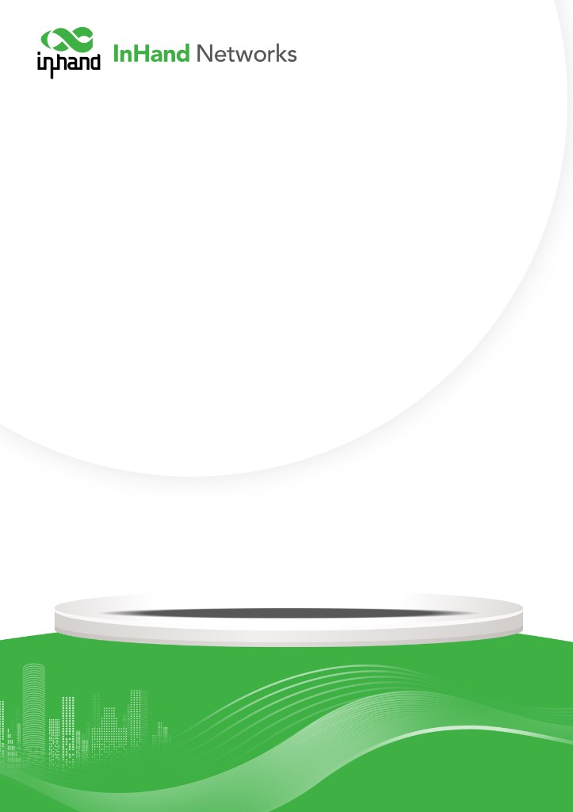
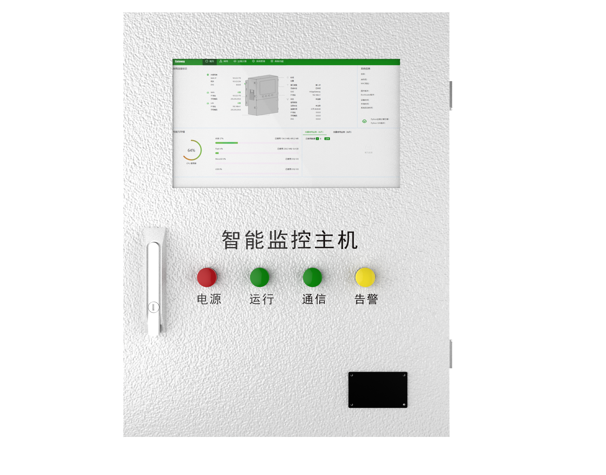
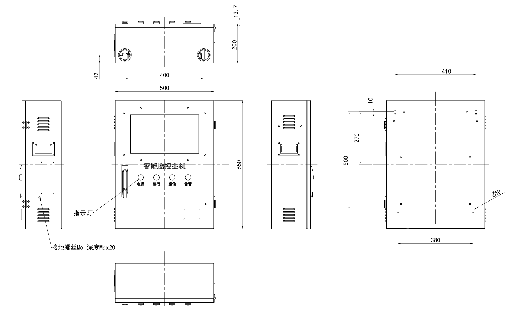
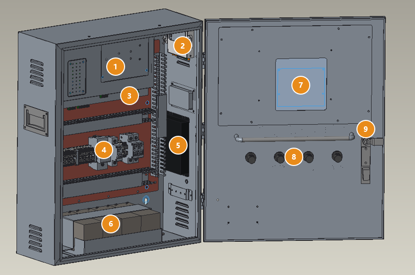
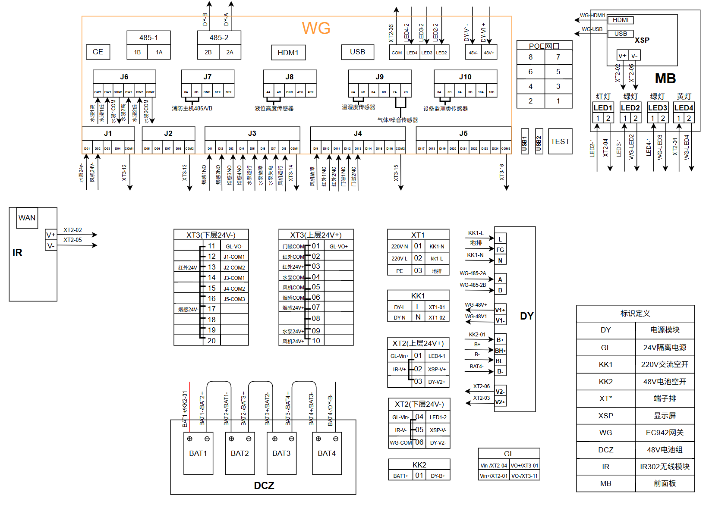

  
  

    

      配电站房一体化监控整机，挂墙接线即可投运
    

    

      SG300 智能监控主机
    

    <table style="margin: 56px auto 0 auto; border-collapse: separate; border-spacing: 12px; width: auto;">
      <tr>
        <td style="width: 250px; background-color: #4CAF50; color: #fff; padding: 8px 16px; border-radius: 16px; font-size: 16px; text-align: center; white-space: nowrap;">整机交付</td>
        <td style="width: 250px; background-color: #4CAF50; color: #fff; padding: 8px 16px; border-radius: 16px; font-size: 16px; text-align: center; white-space: nowrap;">断电不停机</td>
      </tr>
      <tr>
        <td style="width: 250px; background-color: #4CAF50; color: #fff; padding: 8px 16px; border-radius: 16px; font-size: 16px; text-align: center; white-space: nowrap;">15 英寸触控</td>
        <td style="width: 250px; background-color: #4CAF50; color: #fff; padding: 8px 16px; border-radius: 16px; font-size: 16px; text-align: center; white-space: nowrap;">DeviceLive 运维</td>
      </tr>
    </table>
  

  

    
  

# 1. 产品概述

**SG300 智能监控主机面向配电站房、开闭所 / 环网室、中小型机房及无人值守环境的智能辅助监控，以 SGB300 为核心单元，将触摸屏、电源管理、48V 蓄电池、24V 传感器电源与配电端子集成在壁挂控制箱内，出厂完成柜内接线。现场接入 220V 交流、网线与传感器信号线即可投运。**

**产品特点：**

- **整机交付:** 网关、触摸屏、电源、蓄电池、端子排装进一个控制箱，柜内预接线，开箱挂墙即可投运
- **断电不停机:** 电源管理模块 + 4 × 12V 9Ah 蓄电池组（串联 48V），市电 / 电池自动切换，状态上传主站
- **本地可视可控:** 15 英寸工业触摸屏实时显示遥测遥信、视频与告警，可手动控制水泵、风机等设备
- **接线简单:** 信号线直接接入网关端子，传感器 24V 电源统一取自端子排，点位按出厂默认分配
- **远程运维:** 支持主机设备管理、远程配置、远程升级，对接映翰通 DeviceLive

## 核心技术指标

| 项目 | 规格 |
| --- | --- |
| 核心单元 | SGB300 智能监控网关（详见《SGB300 产品规格书》） |
| 显示屏 | 15 英寸工业触摸屏，1920 × 1080；电容触控或组态屏可选 |
| 以太网 / PoE | 10 路以太网，其中 PoE 4 路或 8 路（按网关型号）；整机 PoE 最大输出 93 W |
| 串口 / IO | 8 路 RS-485（其中 2 路可选 RS-232）；24 路 DI；8 路 DO；2 路水浸 |
| 无线上行 | 标配 4G LTE Cat4；WiFi / 蓝牙 / LoRa / GNSS 选配；5G 需外接路由器 |
| 备用电源 | 4 × 12V 9Ah 铅酸蓄电池串联 48V，低压 / 内阻 / 过放保护 |
| 主站协议 | DL/T 634.5-101/104、MQTT、Modbus TCP、ONVIF、GB28181、RTSP |
| 尺寸 | 650 × 500 × 200 mm（高 × 宽 × 深） |
| 交流输入 | AC 220 V（容差 −20% ~ +20%），50 Hz（±5%）；空载功耗 &lt; 80 VA |
| 防护等级 | IP50 |
| 工作温度 | −40 ℃ ~ +70 ℃ |
| 安装方式 | 壁挂；箱内安装孔 + M6 J 型螺栓 |

# 2. 典型应用

| 应用场景 | 应用要点 |
| --- | --- |
| 配电站房 | 智能辅助监控：视频、环境、安防、消防及水泵 / 风机联动 |
| 开闭所 / 环网室 | 箱变、环网柜室监控，遥信遥测与图像上送主站 |
| 中小型机房 | 动环监控：温湿度、水浸、烟感、门禁与设备状态 |
| 仓库 / 泵房 | 无人值守环境监控与本地手动控制 |

# 3. 配电站房智能监控系统拓扑

SG300 挂装在站房内，向下接入各类传感器、摄像机和受控设备，向上对接主站、视频平台和云管理平台。

  
平台层

  

    

      
电力公司主站

      
DL/T 634.5-101/104

      
遥信 · 遥测 · 图像

    

    

      
视频平台

      
GB28181 / ONVIF

      
实时视频 · 回放

    

    

      
DeviceLive 云平台

      
设备管理

      
远程配置 · 远程升级

    

  

↓

  
网络

  

    
4G（5G 需外接路由器）

    
电力专网 · 有线以太网

  

↓

  
边缘层

  

    
SG300 智能监控主机

    

      

        
SGB300 核心单元

        
采集 · 存储 · 联动 · 上送

      

      

        
15 英寸触摸屏

        
本地显示与操作

      

      

        
电源管理 + 48V 电池

        
交直流切换 · 电池管理

      

      

        
24V 隔离电源 · 端子排

        
传感器供电

      

    

  

↓

  
感知执行层

  

    

      
视频监控

      
接口：PoE 网口

      
网络摄像机；声纹监测装置

    

    

      
环境监测

      
接口：RS-485 · 水浸

      
温湿度、气体、噪声；液位、水浸

    

    

      
安防监测

      
接口：DI

      
红外入侵探测器；门磁

    

    

      
消防监测

      
接口：DI · RS-485

      
烟感探测器；消防主机

    

    

      
设备监测与控制

      
接口：DI · DO

      
水泵、风机运行 / 故障；除湿机、空调、照明

    

    

      
无线传感（选配）

      
接口：LoRa

      
无线测温等；微功率无线传感器

    

  

> 注：各类外设的具体接线位置见「现场接线指引」。

# 4. 产品亮点与优势

| 对比项 | 一代主机 | SG300 二代主机 |
| --- | --- | --- |
| 核心架构 | 边缘计算网关 + IO 模块 + 串口模块 + 溢水变送器 + 硬盘录像机，多台拼装 | SGB300 一体化核心单元 |
| 箱体尺寸 | 700 × 550 × 250 mm | 650 × 500 × 200 mm |
| 信号接线 | 信号线经端子排转接 | 信号线直接进网关，减少故障点 |
| 门板与锁 | 侧面锁扣，现场易干涉 | 一体式门板，正面平开锁 |
| 安装与铭牌 | 挂耳安装，铭牌在侧面 | 内孔安装，铭牌移到正面 |
| 运维 | — | 新增主机设备管理、远程配置、远程升级 |

1. **整机交付，开箱即用**  
   出厂完成柜内接线与调试。现场挂墙后，接 220V 交流、网线和传感器信号线即可投运，交付质量不再依赖施工人员。

2. **断电不停机**  
   电源管理模块 + 4 × 12V 9Ah 蓄电池组，市电与电池自动切换；电池低压、内阻异常、过放保护，状态上传主站。

3. **本地可视可控**  
   15 英寸触摸屏实时显示遥测遥信、视频和告警，可手动控制水泵、风机等设备；柜门四色指示灯，状态一眼可见。

4. **现场接线简单**  
   外部接线集中在接线区：信号线直接插网关端子，传感器 24V 电源统一取自端子排，点位按出厂默认分配。

5. **更小更好装**  
   体积比一代更小；一体式门板、正面平开锁、内孔壁挂、正面铭牌，解决了一代现场安装中的干涉问题。

6. **维护方便**  
   开盖即可更换硬盘、安装 SIM 卡；调试区预留网口 × 1、USB × 2；支持远程配置、远程升级。

## 关键数据

| 小型化 | 15 英寸 | 48V | 10 | 24 / 8 | 出厂 |
| --- | --- | --- | --- | --- | --- |
| 650 × 500 × 200 mm | 触摸屏 | 4 × 12V 9Ah 备电 | 网口 · PoE 4/8 | DI / DO | 柜内预接线 |

# 5. 产品尺寸

  

    
    
尺寸图

  

| 项目 | 说明 |
| --- | --- |
| 外形尺寸 | 650 × 500 × 200 mm（高 × 宽 × 深） |
| 触摸屏开窗 | 384 × 247 mm（15 英寸） |
| 柜门指示灯 | 电源 / 运行 / 通信 / 告警，4 × Φ23 |
| 进线孔 | 底部 Φ50 + Φ60，带护线套 |
| 门锁 / 铭牌 | 一体式门板，正面平开锁；铭牌位于门板右下方 |
| 箱体 | SGCC / SPCC 钢板 1.0 mm，浅灰 RAL 7035 橘皮纹喷涂 |
| 接地 / 散热 | 侧面 M6 接地螺丝；两侧散热百叶、隐藏提手 |

  
注意：

  
1.所有尺寸单位为毫米（mm）。

  
2.所有尺寸均为近似值，仅供参考。

  
3.图示尺寸不得用于生产加工。

  
4.尺寸需符合零件及制造公差要求。

  
5.尺寸如有变更，恕不另行通知。

# 6. 整机组成

  
  
开门后柜内布局（示意）

| 编号 | 组件 | 说明 |
| --- | --- | --- |
| 1 | SGB300 智能监控核心单元 | 数据采集、视频存储、联动控制、上送主站；开盖可换硬盘、装 SIM 卡 |
| 2 | 5G 路由器（选配） | 需要 5G 上行时外接 |
| 3 | 调试接口区 | 网口 × 1、USB × 2 |
| 4 | 配电导轨 | KK1 2P 交流空开、KK2 1P 电池空开、XT1 交流端子、GL 24V 隔离电源、XT3 端子排 |
| 5 | 电源管理模块（DY） | 220V 交流输入；输出 48V（网关）、24V（屏 / 指示灯 / 传感器）；蓄电池充放电管理，经 RS-485 上报 |
| 6 | 蓄电池组（DCZ） | 4 × 12V 9Ah 铅酸蓄电池串联 48V，带固定支架 |
| 7 | 触摸屏 | 15 英寸工业触摸屏，1920 × 1080（柜门内侧） |
| 8 | 柜门指示灯 | 电源、运行、通信、告警 |
| 9 | 平开锁 | 正面操作 |

# 7. 硬件规格

| 类别/参数 | 规格 |
| --- | --- |
| **整机组成** | |
| 核心单元 | SGB300 智能监控网关（规格详见《SGB300 产品规格书》） |
| 显示屏 | 15 英寸工业触摸屏，1920 × 1080；电容触摸屏或组态屏可选 |
| 电源管理 | 48V 电源管理模块：交流输入，输出 48V / 24V，蓄电池充放电管理 |
| 备用电池 | 4 × 12V 9Ah 铅酸蓄电池串联（48V） |
| 电池管理 | 低压告警、内阻异常告警、过放保护，信息上传主站 |
| 传感器电源 | 24V 隔离电源 + XT3 端子排（24V+ / 24V- 各 10 位） |
| 配电 | KK1 2P 交流空开、KK2 1P 电池空开、XT1 交流端子、XT2 24V 配电端子 |
| 5G 上行（选配） | 外接 5G 路由器（标配为 SGB300 内置 4G LTE Cat4） |
| 语音对讲（选配） | 麦克风 + 扬声器 |
| **对外接口（由 SGB300 提供）** | |
| 以太网 | 10 路，其中 PoE 4 路或 8 路（按网关型号）；整机 PoE 最大输出 93 W；单口 ≤ 30 W |
| 串口 | 8 路 RS-485，其中 2 路可选 RS-232 |
| 开关量 | 24 路 DI（24 VDC 湿节点）；8 路 DO |
| 水浸 | 2 路，高 / 低水位 |
| 无线 | 4G LTE Cat4；WiFi、蓝牙、LoRa、GNSS 选配；5G 需外接路由器 |
| 调试接口 | 网口 × 1、USB 2.0 × 2 |
| **电源** | |
| 交流输入 | AC 220 V，电压容差 −20% ~ +20%；50 Hz，频率容差 ±5% |
| 整机功耗 | 空载 &lt; 80 VA |
| **机械规格** | |
| 尺寸 | 650 × 500 × 200 mm（高 × 宽 × 深） |
| 箱体 | SGCC / SPCC 钢板 1.0 mm，浅灰 RAL 7035 橘皮纹喷涂 |
| 防护等级 | IP50 |
| 安装方式 | 壁挂；箱内安装孔 + M6 J 型螺栓 |
| 柜门 | 一体式门板，正面平开锁 |
| 进线 | 底部进线孔 Φ50 + Φ60，带护线套 |
| 指示灯 | 柜门：电源、运行、通信、告警 |
| 其他 | 两侧隐藏提手、散热百叶，M6 接地螺丝，正面铭牌 |
| **环境与可靠性** | |
| 工作温度 | −40 ℃ ~ +70 ℃ |
| 存储温度 | −45 ℃ ~ +85 ℃ |
| 绝缘电阻 | 额定绝缘电压 ≤ 60 V：250 V 兆欧表测 ≥ 5 MΩ；&gt; 60 V：500 V 兆欧表测 ≥ 5 MΩ |
| 介质强度 | ≤ 60 V：0.5 kV；(60, 125] V：1 kV；(125, 250] V：1.5 kV（试验电压有效值） |
| EMC | 静电 / EFT / 浪涌 / 射频辐射：Level 3；阻尼振荡磁场 / 工频磁场：Level 4 |

# 8. 软件规格

| 类别/参数 | 规格 |
| --- | --- |
| **本地显示与操作** | |
| 实时监视 | 环境、设备、消防、安防遥测遥信实时显示，遥测图形化 |
| 视频 | 实时视频、历史回放、手动抓拍、云台控制 |
| 查询 | 遥测遥信历史曲线；告警记录按类别、时间查询 |
| 手动控制 | 水泵、风机、除湿机、空调、照明 |
| 参数设置 | 告警规则与传感器阈值 |
| **协议与联动** | |
| 主站对接 | DL/T 634.5-101 / 104、MQTT、Modbus TCP、ONVIF、GB28181、RTSP；遥信、遥测、图像上送，接收主站联动指令 |
| 联动控制 | 按传感器状态联动水泵、风机、除湿机、空调、照明、摄像机 |
| **安全与可靠性** | |
| 安全 | Secure Boot、TPM 2.0；可选国网加密芯片 |
| 可靠性 | 多级链路检测，断线自动重连；看门狗，故障自恢复 |
| **配置管理** | |
| 远程运维 | 主机设备管理、远程配置、远程升级；HTTP / HTTPS / SSH；映翰通 DeviceLive |
| 日志 | 本地日志、远程日志，重要日志掉电保存 |

# 9. 现场接线指引

出厂默认点位分配；DI 为 24V 湿节点（DI 公共端已接 24V-），DO 为低边输出（DO 公共端已接 24V-）。J1–J10 为可插拔端子，可拔下接线后再插回。点位如需调整，以项目接线图和网关配置为准。

| 外部设备 | 接入位置 | 接线方法 |
| --- | --- | --- |
| 220V 交流电源 | XT1：01 N、02 L、03 PE | 从底部进线孔穿入；接好后合 KK1 |
| 蓄电池 | KK2 电池空开 | 出厂已接好；投运时合 KK2 |
| 机箱接地 | 侧面 M6 接地螺丝 | 接站房接地网 |
| 有线上行 | SGB300 GE 口 | 接站房交换机 / 电力专网；4G 上行插 SIM 卡，5G 需外接路由器 |
| 摄像机、声纹装置 | SGB300 PoE 网口 1–8 | 网线直连，网关 PoE 供电（单口 ≤ 30 W） |
| 烟感 1–4 | J3：DI1–DI4 | NO 接 DIx，COM 接 XT3-06；电源 24V+ 接 XT3-07，24V- 接 XT3-17 |
| 水泵运行 / 故障 / 失电 | J3：DI5 / DI6 / DI7 | 状态触点一端接 DIx，另一端接 XT3-04（水泵 COM） |
| 风机运行 / 故障 | J3：DI8；J4：DI9 | 状态触点一端接 DIx，另一端接 XT3-05（风机 COM） |
| 红外 1–2 | J4：DI10 / DI11 | NO 接 DIx，COM 接 XT3-02；电源 24V+ 接 XT3-03，24V- 接 XT3-13 |
| 门磁 1–2 | J4：DI12 / DI13 | NO 接 DIx，COM 接 XT3-01 |
| DI 备用 | J4：DI14–DI16；J5：DI17–DI24 | 触点一端接 DIx，另一端接 XT3 上层备用位（24V+） |
| 水浸 1 / 2 | J6 | 高、低水位探头分别接入，公共端接对应公共位 |
| 水泵 / 风机控制 | J1：DO1 / DO2 | 控制回路 24V+ 接 XT3-09 / XT3-10，24V- 端接对应 DO |
| DO 备用 | J1：DO3–DO4；J2：DO5–DO8 | 可接除湿机、空调、照明、声光报警器等 |
| 消防主机 | J7：1A / 1B | A 接 A，B 接 B；屏蔽线单端接地 |
| 液位传感器 | J8：2A / 2B | 同上 |
| 温湿度传感器 | J9：3A / 3B | 同上 |
| 气体 / 噪声传感器 | J9：4A / 4B、5A / 5B | 同上 |
| 设备监测类传感器 | J10：6A / 6B – 8A / 8B | 同上 |

## 柜内端子摘要（出厂接线，现场无需改动）

| 端子 / 模块 | 定义摘要 |
| --- | --- |
| XT1 | 01 / 02 / 03 = 220V N / L / PE；经 KK1 接 DY |
| XT2 | 上层 01–03：24V+；下层 04–06：24V-（屏、指示灯、路由器、DY 24V 输出） |
| XT3 | 上层 01–10：24V+；下层 11–20：24V-（传感器供电与 DI/DO 公共端） |
| DY | L/N/FG 交流；A/B = RS-485（接 SGB300 485-2）；V1± = 48V（接网关）；V2± = 24V；B+/BH+/BL-/B- = 蓄电池（B+ 经 KK2） |

  
  
接线图

# 10. 订购信息

## 型号规则

**Model code:** SG300-&lt;XX&gt;-&lt;XXXX&gt;

依次为：厂商代码 - 供电方式、屏幕类型、语音交互、匹配网关

| 字段 | 代码 | 说明 |
| --- | --- | --- |
| 厂商代码 | IH | 映翰通 |
| 供电方式 | A | 48V 电源管理模块 + 4 × 12V 9Ah 铅酸电池 |
| 屏幕类型 | B / C | B：电容触摸屏；C：组态屏 |
| 语音交互 | A / N | A：支持麦克风、扬声器对讲；N：无 |
| 匹配网关 | 3 | SGB300 |

**示例：** `SG300-IH-ABN3` — SG300 智能监控主机（映翰通版），48V 电源管理模块，4 节 12V 9Ah 铅酸电池串联，电容触摸屏，无语音对讲，匹配 SGB300 网关。

## 标准配置清单

| 项目 | 说明 | 数量 |
| --- | --- | --- |
| 控制箱 | 650 × 500 × 200 mm 壁挂箱体（含门锁、铭牌、护线套） | 1 |
| 核心单元 | SGB300 智能监控网关（按订购型号） | 1 |
| 显示屏 | 15 英寸工业触摸屏 | 1 |
| 电源 | 48V 电源管理模块、24V 隔离电源 | 各 1 |
| 蓄电池 | 12V 9Ah 铅酸蓄电池 | 4 |
| 配电 | 2P / 1P 空开、XT1 / XT2 / XT3 端子排 | 1 套 |
| 安装附件 | M6 J 型螺栓 | 2 |

# 10. 联系我们

- **官网：** [映翰通官网](https://www.inhand.com.cn)
- **商务咨询：** info@inhand.com.cn
- **服务热线：** 400-888-5252
- **版权声明：** ©2026 北京映翰通网络技术股份有限公司 映翰通网络 保留所有权利
