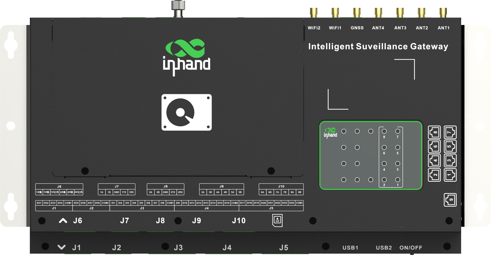
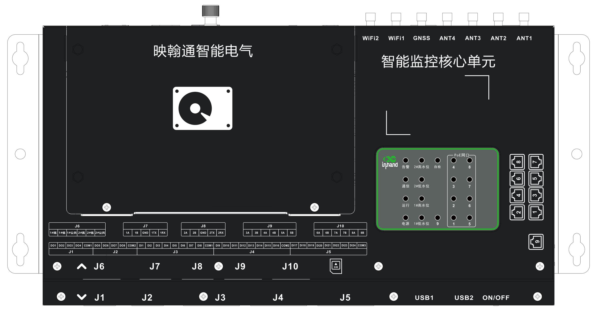
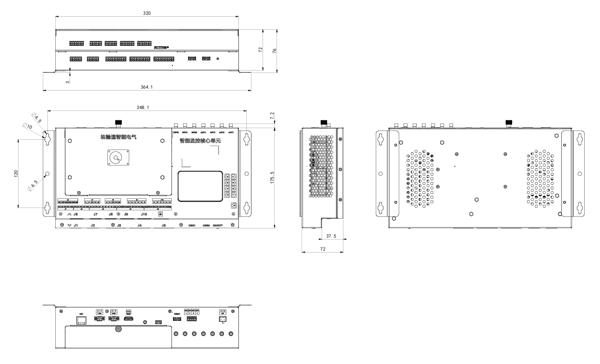

  
  

    

      配电站房一体化边缘智能网关
    

    

      SGB300 智能监控网关
    

    

      一台设备，替代「边缘网关 + 硬盘录像机 + 串口服务器 + IO 模块 + PoE 交换机」
    

    <table style="margin: 40px auto 0 auto; border-collapse: separate; border-spacing: 12px; width: auto;">
      <tr>
        <td style="width: 250px; background-color: #4CAF50; color: #fff; padding: 8px 16px; border-radius: 16px; font-size: 16px; text-align: center; white-space: nowrap;">边缘计算 + AI</td>
        <td style="width: 250px; background-color: #4CAF50; color: #fff; padding: 8px 16px; border-radius: 16px; font-size: 16px; text-align: center; white-space: nowrap;">NVR 视频存储</td>
      </tr>
      <tr>
        <td style="width: 250px; background-color: #4CAF50; color: #fff; padding: 8px 16px; border-radius: 16px; font-size: 16px; text-align: center; white-space: nowrap;">就地联动控制</td>
        <td style="width: 250px; background-color: #4CAF50; color: #fff; padding: 8px 16px; border-radius: 16px; font-size: 16px; text-align: center; white-space: nowrap;">电力主站协议</td>
      </tr>
    </table>
  

  

    
  

# 1. 产品概述

**市场背景：** 配电站房数量多、分布散，大多无人值守。电网公司正在推进站房智能辅助监控建设：环境、安防、消防、视频、设备状态要统一采集，异常要就地联动，数据要上送主站。传统做法是用边缘网关、硬盘录像机、串口服务器、IO 模块、交换机多台设备拼装，接线点多、故障点多、柜体大、成本高，装配和运维都费事。

**SGB300 智能监控网关**把边缘计算、NVR 视频存储、8 路串口、24 DI / 8 DO、2 路水浸、10 个网口（4 路或 8 路 PoE）和 4G 上行集成在一台设备里，专为配电站房监控设计。它是 SG300 智能监控主机的核心单元，也可单独装进用户自有控制箱。

**核心竞争力：** 集成度高、接线少、本地联动快、原生支持电力主站协议。

**产品特点：**

- **五合一集成:** 网关、NVR、串口服务器、IO 模块、PoE 交换机合为一台，信号线直接进网关
- **接口按站房配置:** 24 DI、8 DO、2 路水浸、8 路串口、10 网口（4 / 8 路 PoE）、LoRa 等无线选配
- **就地联动:** 按传感器状态联动水泵、风机、除湿机、空调、照明与摄像机，断网仍可执行
- **电力主站直连:** 支持 DL/T 634.5-101/104、DL/T 860、MQTT、Modbus、GB28181 等，可选国网加密芯片
- **工业可靠与云运维:** −40 ℃ ~ +70 ℃ 宽温，Secure Boot / TPM 2.0，DeviceLive 远程配置与升级

## 核心技术指标

| 项目 | 规格 |
| --- | --- |
| 处理器 / NPU | 四核 ARM Cortex-A55 @ 2.0 GHz；NPU 1 TOPS（可选 26 TOPS 独立模组） |
| 内存 / 存储 | 4 GB RAM；16 GB eMMC；3.5 寸 SATA 机械硬盘 2 TB（可换更大容量）；Micro SD 扩展 |
| 以太网 / PoE | 10 × RJ45（1 × GE 上联 + 网口 1–9）；PoE 4 路或 8 路（按型号）；IEEE 802.3af/at，单口最大 30 W |
| 串口 / IO | 8 路串口（1–2 为 RS-485/RS-232 可选，3–8 为 RS-485）；24 路 DI；8 路 DO；2 路水浸 |
| 无线上行 | 4G LTE Cat4，1 × Micro SIM；WiFi / 蓝牙 / LoRa / GNSS 选配 |
| 视频 | 内置 NVR；GB28181 / ONVIF / RTSP；硬件编解码 |
| 主站协议 | DL/T 634.5-101/104、DL/T 860、MQTT、Modbus TCP、ONVIF、GB28181、RTSP |
| 尺寸 | 365 × 176 × 76 mm（含挂耳）；外壳宽 320 mm |
| 供电 | DC 18–53 V（使用 PoE 时 DC 44–53 V）；额定电流 3 A；空载功耗 15 W（不含 PoE 负载） |
| 工作温度 | −40 ℃ ~ +70 ℃ |
| 安全 | Secure Boot、TPM 2.0；可选国网标准加密芯片 |
| 安装方式 | 壁挂（两侧挂耳） |

# 2. 典型应用

| 应用场景 | 应用要点 |
| --- | --- |
| 配电站房 | 智能辅助监控：视频、环境、安防、消防及水泵 / 风机联动 |
| 开闭所 / 环网室 | 箱变、环网柜室监控，遥信遥测与图像上送主站 |
| 中小型机房 | 动环监控：温湿度、水浸、烟感、门禁与设备状态 |
| 仓库 / 泵房 | 无人值守环境监控与就地联动控制 |

# 3. 配电站房智能监控方案拓扑

SGB300 部署在站房内，就地采集各类传感器与视频，执行联动，并通过 4G / 专网 / 有线上送主站。

  
电力公司主站 / 云平台

  
DL/T 634.5-104 · GB28181 · MQTT · DeviceLive

↓

  
4G（LTE Cat4）

  
电力专网

  
有线以太网

↓

  
SGB300

  
边缘计算 · AI 分析　|　NVR 视频存储　|　就地联动 · 协议转换

↓

  

    
PoE 网口 × 4 / 8

    
网络摄像机（GB28181 / ONVIF / RTSP）；声纹监测装置；AI 识别摄像机

  

  

    
RS-485/232 × 8

    
消防主机；温湿度传感器；气体 / 噪声 / 液位传感器；设备监测类传感器

  

  

    
LoRa 微功率无线（选配）

    
无线测温等；符合《输变电设备物联网微功率无线网通信协议》

  

  

    
HDMI · USB · 音频

    
本地触摸屏；麦克风 / 扬声器语音对讲；U 盘、调试

  

  

    
DI × 24（24V 湿节点）

    
烟感探测器；红外入侵探测器、门磁；水泵 / 风机运行与故障状态

  

  

    
水浸 × 2

    
水浸传感器（高 / 低水位）；电缆沟、站房地面积水

  

  

    
DO × 8

    
水泵、风机；除湿机、空调；照明、声光报警器

  

  

    
DC 48V 电源 + RS-485

    
电源管理模块；48V 蓄电池组（状态上报）；柜门状态指示灯

  

  
本地联动示例

  

    水浸高水位 → 启动水泵　·　温湿度超限 → 开风机 / 除湿机　·　红外 / 门磁告警 → 摄像机抓拍 + 声光报警　·　所有告警同步上送主站
  

> 注：SGB300 共 10 个网口，PoE 为 4 路或 8 路（按订购型号）。

# 4. 产品亮点与优势

| 对比项 | 一代：多设备拼装 | 二代：一台 SGB300 |
| --- | --- | --- |
| 组成 | EC942 边缘网关 + IO 模块 + 串口模块 + 溢水变送器 + 硬盘录像机 | SGB300 智能监控核心单元 |
| 能力 | 多台拼装，功能分散 | 计算 + 视频 + 串口 + IO + PoE 合一 |
| 接线 | 经中间端子排转接 | 信号线直接进网关，不再经过中间端子排 |

1. **五合一，省设备省接线**  
   网关、NVR、串口服务器、IO 模块、PoE 交换机合为一台。柜内设备少了，接线点和故障点同步减少，装配更快。

2. **接口按站房需求配置**  
   24 DI、8 DO、2 路水浸、8 路串口、10 网口（4 / 8 路 PoE）、LoRa 无线，一台覆盖环境、安防、消防、视频、设备五类监测。

3. **本地联动，断网也能执行**  
   按传感器状态就地联动水泵、风机、除湿机、空调、照明和摄像机，响应快，不依赖主站下发。

4. **视频与 AI 一体**  
   内置 3.5 寸 2TB 硬盘录像，支持 GB28181 / ONVIF / RTSP；四核 A55 + 1 TOPS NPU，可选 26 TOPS 独立 NPU 模组。

5. **直连电力主站**  
   支持 DL/T 634.5-101/104、DL/T 860、Modbus、MQTT、GB28181，遥信、遥测、图像直接上送电力公司主站；可选国网加密芯片。

6. **工业级可靠与安全**  
   −40 ~ 70 ℃ 宽温，EMC 3 ~ 4 级；Secure Boot、TPM 2.0；看门狗与多级链路检测；DeviceLive 远程配置与升级。

## 关键数据

| 10 | 4 / 8 | 8 | 24 / 8 | 2 TB | −40~70℃ |
| --- | --- | --- | --- | --- | --- |
| 以太网口 | PoE 网口 | 串口 | DI / DO | NVR 硬盘 | 工作温度 |

# 5. 产品机械结构

## 正面（顶盖）

  
  
正面（顶盖）：硬盘仓、指示灯面板、SIM 卡槽及端子丝印

| 编号 | 部位 | 说明 |
| --- | --- | --- |
| 1 | 硬盘仓 | 内置 3.5 寸 SATA 机械硬盘（标配 2TB），开盖即可更换 |
| 2 | 指示灯面板 | 电源、运行、通信、告警、自检；1# / 2# 高低水位；PoE 网口 1–8 状态 |
| 3 | 网口丝印 | 对应右侧面网口 1–8 与网口 9（PoE 4 路或 8 路，按型号） |
| 4 | SIM 卡槽 | Micro SIM，用于 4G 上行 |
| 5 | J6 水浸 | 2 路：1#高 / 1#低 / 1#公共，2#高 / 2#低 / 2#公共 |
| 6 | J7 / J8 串口 1–2 | RS-485（A/B）或 RS-232（TX/RX/GND）可选 |
| 7 | J9 / J10 串口 3–8 | 6 路 RS-485（A/B） |
| 8 | J1–J5 开关量 | J1/J2：DO1–DO8；J3/J4/J5：DI1–DI24（每组独立 COM） |
| 9 | 天线接口 | 7 × SMA：ANT1–ANT4（蜂窝）、GNSS、WiFi1、WiFi2 |
| 10 | USB1 / USB2 / ON/OFF | 2 × USB 2.0 Host（调试 / U 盘），电源开关 |
| 11 | 挂耳 | 两侧挂耳，壁挂安装 |

端子插头位于底部端面，丝印标在顶盖下沿，方便对照接线。

## 端面接口与尺寸

  
  
尺寸图

**顶部端面：** 从左到右为 7 × SMA 天线、48V 电源输入（V+/V-）、柜门指示灯驱动（COM / LED2 / LED3 / LED4）、USB、SPK、MIC、HDMI、485-2、485-1、GE 千兆上联口；右上为硬盘仓盖板。

**底部端面：** 上排为 J6 水浸、J7–J10 串口、SIM 卡槽；下排为 J1–J2（DO）、J3–J5（DI）、USB1、USB2、ON/OFF。全部为可插拔端子，可先接线后插入。

| 项目 | 说明 |
| --- | --- |
| 外形尺寸 | 365 × 176 × 76 mm（含挂耳）；外壳宽 320 mm |
| 右侧面接口 | 网口 1–8、网口 9；其中 4 路或 8 路支持 PoE（按型号） |
| 安装方式 | 壁挂安装（两侧挂耳） |
| 外壳 | SECC 镀锌钢板 1.0 mm，黑色细砂纹喷塑，白色丝印 |
| 散热 | 侧面蜂窝散热孔 |

  
注意：

  
1.所有尺寸单位为毫米（mm）。

  
2.所有尺寸均为近似值，仅供参考，以实物为准。

  
3.图示尺寸不得用于生产加工。

  
4.尺寸需符合零件及制造公差要求。

  
5.尺寸如有变更，恕不另行通知。

# 6. 硬件规格

| 类别/参数 | 规格 |
| --- | --- |
| **计算与存储** | |
| 处理器 | 四核 ARM Cortex-A55，主频 2.0 GHz |
| GPU | Mali-G52 2EE |
| NPU | 1 TOPS；可选 26 TOPS 独立 NPU 模组 |
| 视频编解码 | 硬件编解码 |
| 内存 | 4 GB |
| 存储 | 16 GB eMMC；3.5 寸 SATA 机械硬盘 2 TB（可换更大容量）；Micro SD 扩展 |
| **网络与无线** | |
| 以太网 | 10 × RJ45：1 × GE 上联口、网口 1–8、网口 9；PoE 4 路或 8 路（按型号，见订购信息） |
| PoE | IEEE 802.3af / at，自动识别受电设备；单口最大 30 W；供电引脚 1、2（V+），3、6（V-） |
| 蜂窝 | 4G LTE Cat4；1 × Micro SIM |
| GNSS（选配） | GPS / 北斗，定位与授时 |
| 本地无线（选配） | WiFi、蓝牙、LoRa（符合《输变电设备物联网微功率无线网通信协议》） |
| 天线接口 | 7 × SMA：ANT1–ANT4、GNSS、WiFi1、WiFi2 |
| **现场接口** | |
| 串口 | 8 路：串口 1–2 为 RS-485 / RS-232 可选，串口 3–8 为 RS-485；可插拔端子 |
| 系统 RS-485 | 2 路（485-1、485-2），用于电源管理模块等柜内设备通信 |
| 开关量输入 | 24 路 DI，24 VDC 湿节点，分 3 组独立 COM |
| 开关量输出 | 8 路 DO，分 2 组独立 COM |
| 水浸检测 | 2 路，每路高 / 低水位双点检测 |
| USB | 3 × USB 2.0 Host |
| 显示 | 1 × HDMI |
| 音频 | SPK × 1、MIC × 1（语音对讲） |
| 指示灯驱动 | 3 路（LED2–LED4），驱动柜门状态指示灯 |
| 指示灯 | 电源、运行、通信、告警、自检、1# / 2# 高低水位、PoE 网口状态 |
| **电源** | |
| 输入电压 | DC 18–53 V；使用 PoE 时 DC 44–53 V；额定电流 3 A |
| 功耗 | 空载 15 W（不含 PoE 负载） |
| **机械规格** | |
| 尺寸 | 365 × 176 × 76 mm（含挂耳）；外壳宽 320 mm |
| 外壳 | SECC 镀锌钢板 1.0 mm，黑色细砂纹喷塑 |
| 安装 | 壁挂 |
| **环境与可靠性** | |
| 工作温度 | −40 ℃ ~ +70 ℃ |
| 存储温度 | −45 ℃ ~ +85 ℃ |
| 静电放电抗扰度 | Level 3 |
| 电快速瞬变脉冲群抗扰度 | Level 3 |
| 浪涌（冲击）抗扰度 | Level 3 |
| 射频电磁场辐射抗扰度 | Level 3 |
| 阻尼振荡磁场抗扰度 | Level 4 |
| 工频磁场抗扰度 | Level 4 |

# 7. 软件规格

| 类别/参数 | 规格 |
| --- | --- |
| **操作系统** | |
| 操作系统 | Linux，支持 Docker 容器部署 |
| **网络特性** | |
| 网络接入 | APN / VPDN；CHAP / PAP；IPv4 / IPv6；静态 IP / DHCP；内置 Web 配置 |
| **协议** | |
| 本地通信协议 | Modbus RTU / TCP、DL/T 634.5-101 / 104、HTTP、MQTT、JSON、输变电设备物联网微功率无线网通信协议、ONVIF、GB28181、RTSP |
| 上行通信协议 | DL/T 634.5-101 / 104、DL/T 860、MQTT、Modbus TCP、ONVIF、GB28181、RTSP |
| 二次开发 | Device Supervisor Agent 零代码 / 低代码数据采集与上云；DSA 二次开发 |
| **监测与联动** | |
| 数据采集 | 开关量、RS-485、以太网、微功率无线、IEC 101 等方式采集传感器数据 |
| 视频 | 图片、视频采集、存储、转发；实时查看、回放、抓拍 |
| 告警 | 告警规则与优先级可设置；告警记录按类别、时间查询 |
| 联动控制 | 按传感器状态联动水泵、风机、除湿机、空调、照明、摄像机；支持手动控制 |
| 主站对接 | 遥信、遥测、图像数据上送主站；接收并执行主站下发的联动指令 |
| 历史数据 | 遥测、遥信历史查询，图形化展示 |
| **安全与可靠性** | |
| 安全启动 | Secure Boot |
| 加密 | TPM 2.0；可选国网标准加密芯片 |
| 可靠性 | 多级链路检测，断线自动重连；看门狗，故障自恢复 |
| **运维管理** | |
| 升级 | 本地 / 远程固件升级 |
| 日志 | 本地日志、远程日志输出，重要日志掉电保存 |
| 远程管理 | HTTP、HTTPS、Telnet、SSH；映翰通 DeviceLive 云管理 |
| 运行状态 | 网络制式、信号强度、CPU、内存、磁盘占用、软硬件版本 |

# 8. 订购信息

## 型号规则

**Model code:** SGB300-&lt;XXXX&gt;-&lt;XXXXXX&gt;

第一段：蜂窝信息（4 位）；第二段：接口配置及附加功能（6 位）

| 字段 | 代码 | 说明 |
| --- | --- | --- |
| 网络制式 | L | 4G LTE（国内） |
| 模组厂商 | Q | 移远 |
| 蜂窝覆盖区域 | A | 中国大陆 |
| 蜂窝速率 | 8 | Cat4 |
| 接口配置 | A | 2TB 硬盘、10 × LAN（4 × PoE）、8 × 串口（2 路 RS-232/485 可选）、24 DI、8 DO、3 × USB |
|  | B | 2TB 硬盘、10 × LAN（8 × PoE）、8 × 串口（2 路 RS-232/485 可选）、24 DI、8 DO、3 × USB |
| 加密方式 | N / S | N：无加密；S：国网标准版（加密芯片） |
| GNSS | A / B / C / N | A：GPS；B：北斗；C：GPS + 北斗；N：无 |
| 本地无线 | A–G / N | A：WiFi；B：蓝牙；C：LoRa；D：WiFi + 蓝牙；E：WiFi + LoRa；F：蓝牙 + LoRa；G：WiFi + 蓝牙 + LoRa；N：无 |
| NVR 功能 | A / N | A：有；N：无 |
| AI 能力 | B / E / N | B：基础版；E：增强版；N：无 |

**示例：** `SGB300-LQA8-BNCDAB` — LTE Cat4（移远），2TB 3.5 寸硬盘，10 网口 / 8 路 PoE，8 路串口，24 DI / 8 DO，3 × USB，无加密，GPS + 北斗，WiFi + 蓝牙，带 NVR，基础版 AI。

# 9. 联系我们

- **官网：** [映翰通官网](https://www.inhand.com.cn)
- **商务咨询：** info@inhand.com.cn
- **服务热线：** 400-888-5252
- **北京总部：** 北京市朝阳区紫月路 18 号院 3 号楼 5 层 501　电话：010-8417 0010
- **版权声明：** ©2026 北京映翰通网络技术股份有限公司 映翰通网络 保留所有权利
