# InHand VG710系列车载网关用户手册

## 声明

首先非常感谢您选择本公司产品！在使用前，请您仔细阅读本用户手册，遵守以下声明，将有助于维护知识产权和法律合规性，以确保您的使用体验与产品的最新信息相一致。如有任何疑问或需要获取书面许可，请随时联系我们的技术支持团队。

- 版权声明

本用户手册包含受版权保护的内容，版权归北京映翰通网络技术股份有限公司及其许可者所有。未经书面许可，任何单位和个人不得擅自摘抄、复制本手册的部分或全部内容，且不得以任何形式传播。

- 免责声明

由于产品技术和规格不断更新，本公司不能承诺用户手册中的资料与实际产品完全一致。因此，不承担由于实际技术参数与用户手册不符而引起的任何争议。任何关于产品的改动恕不提前通知，本公司保留最终更改权和解释权

- 版权信息

本用户手册内容受版权法律保护，版权归北京映翰通网络技术股份有限公司及其许可者所有，保留一切权利。未经书面许可，不得擅自使用、复制或传播本手册的内容。

## 图形界面约定

| 符号 | 含义 | 示例 |
|------|------|------|
| `< >` | 表示按钮名称 | 点击`<确定>`按钮 |
| `" "` | 表示窗口名、菜单名 | 弹出"新建用户"窗口 |
| `→` | 表示菜单层级或操作顺序 | 【网络】→【拨号接口】 |
| `【 】` | 表示菜单或页面名称 | 进入【系统设置】页面 |
|  | 提醒操作中应注意的事项，不当的操作可能会导致数据丢失或者设备损坏。 | - |
|  | 对操作内容的描述进行必要的补充和说明。 | - |

## 技术支持

**北京映翰通网络技术股份有限公司（总部）**

电话：010-8417 0010

地址：北京市朝阳区紫月路18号院3号楼5层

**成都办事处**

电话：028-8679 8244

地址：四川省成都市武侯区天府大道北段1777号中国太平金融大厦14层

**广州办事处**

电话：020-8562 9571

地址：广州市天河区棠东东路5号远洋新三板创意园B-130单元

**武汉办事处**

电话：027-8716 3566

地址：湖北省武汉市洪山区珞瑜东路2号巴黎豪庭11栋2001室

**上海办事处**

电话：021-5480 8501

地址：上海市普陀区顺义路18号1103室

## 如何使用本手册

**对号入座**：

- 首次使用用户：建议按顺序阅读「认识设备」→「安装与首次使用」→「常用场景配置」→「功能说明与参数参考」
- 已有设备用户：可直接查阅「功能说明与参数参考」或「附录 故障处理」
- 云平台管理用户：可查阅「常用场景配置」中的云平台连接场景

**按任务快速跳转**：

| 任务 | 对应章节 | 预计用时 |
|------|----------|----------|
| 了解设备外观和接口 | [认识设备](#第1章-认识设备) | 约5分钟 |
| 首次安装和上电 | [安装与首次使用](#第2章-安装与首次使用) | 约10分钟 |
| 通过蜂窝网络联网 | [场景1：蜂窝联网](#场景1蜂窝联网) | 约5分钟 |
| 通过Wi-Fi联网 | [场景2：Wi-Fi联网](#场景2wi-fi联网) | 约5分钟 |
| 建立IPsec VPN隧道 | [场景3：IPsec VPN隧道建立](#场景3ipsec-vpn隧道建立) | 约15分钟 |
| 连接云平台 | [场景4：连接设备远程监控平台](#场景4连接设备远程监控平台) | 约5分钟 |
| 配置车辆诊断 | [车辆诊断](#42-车辆诊断) | 约10分钟 |
| 查看功能详细参数 | [功能说明与参数参考](#第4章-功能说明与参数参考) | 按需 |
| 排查故障 | [附录 故障处理](#附录-故障处理) | 按需 |

# 第1章 认识设备

## 1.1 概述

InHand VG710系列车载网关是面向车联网领域的新一代4G车载网关产品。该设备为汽车和运输服务车辆提供高速安全的网络连接，适用于警用车辆、应急指挥车辆、工程车辆、医疗车辆及物流车辆等移动高速网络场景。VG710支持蜂窝网络（4G/5G）、Wi-Fi（2.4G/5G双频）、以太网等多种联网方式，内置GNSS卫星定位及惯性导航功能，并具备OBD-II（On-Board Diagnostics，可以理解为：车辆自诊断系统的标准接口）/J1939车辆诊断能力，可实时采集车况数据和故障码信息。搭配基于云的远程车辆管理平台，为物流管理、资产跟踪、移动办公以及政府安全等应用提供随处可达的网络和不间断的运营监管。

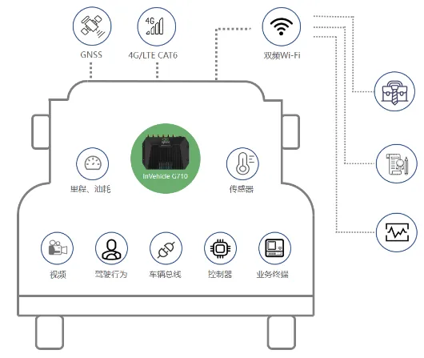

<strong>图 1-1 VG710应用方案图</strong>

## 1.2 外观与接口

### 1.2.1 VG710 4G版本 IO接口

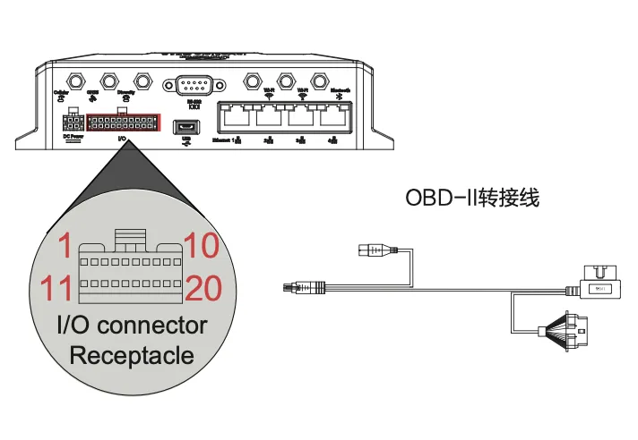

<strong>图 1-2 VG710 4G版本IO接口</strong>

**20PIN端子功能定义：**

| PIN | Definition | PIN | Definition |
| --- | --- | --- | --- |
| 1 | 485- | 11 | 485+ |
| 2 | CANL | 12 | CANH |
| 3 | 1-Wire | 13 | GND |
| 4 | DO4 | 14 | DO3 |
| 5 | DO2 | 15 | DO1 |
| 6 | GND | 16 | GND |
| 7* | AI6/DI6 | 17* | AI5/DI5 |
| 8 | AI4/DI4 | 18 | AI3/DI3 |
| 9 | AI2/DI2 | 19 | AI1/DI1 |
| 10 | GND | 20 | GND |

**VG710 4G版本选配线缆说明：**

| 物料编码 | 线材名称 | 功能描述 | 可选/标配 |
| --- | --- | --- | --- |
| SCAB000219 | 线材-VG710的20P的IO测试线 | A端有20针连接VG710，B端为裸线端。适用于现场工程项目和测试，电缆长度500毫米。 | 可选 |
| SCAB000215 | 线材-VG710的ODBII转接线 | VG710的20P IO端子转接ODBII接口，长度5米，同时两端扩展一个20P端子和ODBII接口。 | 可选 |
| SCAB000235 | 线材-VG710组合线缆-OBD取电 | VG710组合线缆-OBD取电和CAN。 | 可选 |
| SCAB000234 | 线材-VG710组合线缆-J1939取电 | VG710组合线缆-J1939取电和CAN。 | 可选 |
| SCAB000233 | VG710组合线缆-J1939_6P取电 | VG710组合线缆-J1939_6P取电和CAN。 | 可选 |
| SCAB000394 | M12 5PIN CAN | M12 5PIN至20PIN CAN-H/L设计，带屏蔽层的接地螺孔。 | 可选 |

> **注意**：线缆设计图可咨询InHand销售经理或FAE获取。

### 1.2.2 VG710-H 5G版本 IO接口

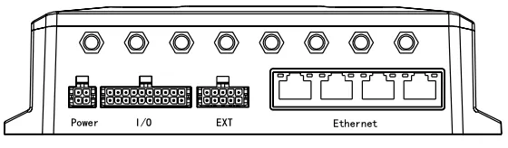

<strong>图 1-3 VG710-H 5G版本IO接口</strong>

**ETX 10PIN端子功能定义：**

| PIN | Definition | PIN | Definition |
| --- | --- | --- | --- |
| 1 | J1708_A | 6 | J1708_B |
| 2 | CAN_H | 7 | CAN_L |
| 3 | GND | 8 | GND |
| 4 | ODB_CAN_H | 9 | ODB_CAN_L |
| 5 | K_LINE | 10 | L_LINE |

**IO 20PIN端子功能定义：**

| PIN | Definition | PIN | Definition |
| --- | --- | --- | --- |
| 1 | AI1/DI1 | 11 | AI2/DI2 |
| 2 | AI3/DI3 | 12 | AI4/DI4 |
| 3 | GND | 13 | GND |
| 4 | DO1 | 14 | DO2 |
| 5 | DO3 | 15 | DO4 |
| 6 | RS232_RX | 16 | 1Wire |
| 7 | RS232_TX | 17 | GND |
| 8 | RS485_A_1 | 18 | RS485_A_2 |
| 9 | RS485_B_1 | 19 | RS485_B_2 |
| 10 | GND | 20 | GND |

**VG710 5G版本选配线缆说明：**

| 物料编码 | 线材名称 | 功能描述 | 可选/标配 |
| --- | --- | --- | --- |
| SCAB000390 | 线材-VG710-5G带3.5mm耳机接口麦克线缆（瀚荃插头） | VG710-H版本带3.5mm耳机接口麦克线缆（瀚荃插头）。 | 可选 |
| SCAB000400 | 线材 VG710-H 10PIN ETX | VG710-H版本带2CAN、LINE、J1708接口，电缆长度1000mm。 | 可选 |

> **注意**：线缆设计图可咨询InHand销售经理或FAE获取。

### 1.2.3 VG710-M版本 IO接口

<strong>图 1-4 VG710-M版本IO接口</strong>

VG710-M电源连接器采用8针设计，包含VIN+、VIN-、CAN-H、CAN-L、AI/DI（Analog Input/Digital Input，可以理解为：模拟输入/数字输入接口）。该版本无IGT/ACC信号，设备连接到直流电源的正极和负极端子后可正常运行。

<strong>图 1-5 VG710-M电源线缆连接器</strong>

为VG710-M版本供电：将电缆P2的红线连接到直流（DC）电源的正极端子，将黑线连接到负极端子。电源的可接受电压范围为9至36V DC。

**8PIN端子功能定义：**

| PIN | 5 | 6 | 7 | 8 |
| :---: | :---: | :---: | :---: | :---: |
| Def. | V- | AI/DI | GND | CAN-L |
| PIN | 1 | 2 | 3 | 4 |
| Def. | V+ | IGT | GND | CAN-H |

> **警告**：IGT是车辆点火信号。在办公室测试期间，需将IGT与电源的正极（V+）连接在一起。在车辆上使用时，需连接车辆IGT或ACC点火信号。

## 1.3 指示灯说明

| 指示灯 | 状态 | 含义 |
|--------|------|------|
| System | 常灭 | 设备未上电 |
|  | 红色常亮 | 系统启动中 |
|  | 绿色闪烁 | 系统正常运行 |
|  | 红色闪烁 | 系统故障 |
|  | 蓝色闪烁 | 系统升级 |
| Cellular | 常灭 | 拨号功能处于关闭状态 |
|  | 绿色闪烁 | 正在拨号 |
|  | 绿色常亮 | 拨号成功 |
|  | 红色闪烁 | 拨号故障（未探测到模块或SIM卡） |
| Signal | 常灭 | 当前拨号卡无信号 |
|  | 红色常亮 | 当前拨号卡信号弱（信号值≤9asu） |
|  | 蓝色常亮 | 当前拨号卡信号一般（信号值10～19asu） |
|  | 绿色常亮 | 当前拨号卡信号强（信号值≥20asu） |
| GNSS | 常灭 | GNSS处于关闭状态 |
|  | 绿色闪烁 | 定位中 |
|  | 绿色常亮 | 已定位 |
| Wi-Fi 2.4G（AP模式） | 常灭 | 处于关闭状态 |
|  | 绿色闪烁 | 正常工作 |
| Wi-Fi 2.4G（STA模式） | 常灭 | 处于关闭状态或未关联上AP |
|  | 绿色常亮 | 关联上AP后，因密码错误无法连接 |
|  | 绿色闪烁 | 已关联上AP |
| Wi-Fi 5G（AP模式） | 常灭 | 处于关闭状态 |
|  | 蓝色闪烁 | 正常工作 |
| Wi-Fi 5G（STA模式） | 常灭 | 处于关闭状态或未关联上AP |
|  | 蓝色常亮 | 关联上AP后，因密码错误无法连接 |
|  | 蓝色闪烁 | 已关联上AP |
| U1 | 常灭 | APP处于关闭状态 |
|  | 绿色常亮 | APP为启用状态 |
| U2 | 常灭 | VPN处于关闭状态或VPN工作异常 |
|  | 绿色常亮 | VPN正常工作 |

## 1.4 恢复出厂设置

通过Reset按钮恢复出厂默认值的操作步骤：

1. 设备上电，立即按下复位按钮（保持复位按钮按下状态）。约15秒后，System灯红色常亮。
2. 当System灯关闭后再次变红时，立即松开复位按钮。
3. 当System灯关闭时，再次按下复位按钮（System灯红色闪烁2次），随后松开复位按钮。设备恢复到出厂默认状态。

## 1.5 默认设置

| 序号 | 功能 | 默认配置 |
| :---: | --- | --- |
| 1 | 蜂窝网络拨号 | 启用（拨号成功则Cellular灯为绿色常亮）；缺省状态下禁用双SIM卡，默认使用SIM1 |
| 2 | 卫星定位及惯性导航服务 | 启用（定位成功则GNSS灯为绿色常亮）；惯性导航功能启用 |
| 3 | OBD车辆诊断 | 启用；自动探测CANbus波特率；自动探测车辆诊断协议；自动扫描车辆诊断数据 |
| 4 | Wi-Fi默认配置 | Wi-Fi 2.4G AP启用，SSID以VG710-为前缀后接6位数字；Wi-Fi 5G AP启用，SSID以VG710-5G-为前缀后接6位数字；认证方式WPA2-PSK；密码为SN序列号后8位 |
| 5 | 以太网默认配置 | 4个LAN口启用；IP地址：192.168.2.1；子网掩码：255.255.255.0；DHCP服务器启用，地址池192.168.2.2～192.168.2.100 |
| 6 | 网关的网络访问控制 | HTTP及HTTPS启用，端口号分别为80和443；Telnet禁用；SSH禁用；来自蜂窝网络的访问仅允许HTTPS方式 |
| 7 | 用户名和密码 | adm/123456（超级管理员） |
| 8 | 电源管理 | shutdown-delay 30（下电延时30秒）；standby-mode 1（下电功能启用）；standby-check-interval 20（待机模式下电源检查间隔）；standby-voltage 90（待机门限电压9V）；standby-resume-voltage 105（恢复正常工作门限电压10.5V） |
| 9 | IO | 4路数字输出默认输出低电平，上拉电阻禁用；6路数字输入的上拉电阻禁用 |
| 10 | 串口 | RS232：波特率9600，数据位8bits，校验位无，停止位1bit；RS485：波特率9600，数据位8bits，校验位无，停止位1bit |

# 第2章 安装与首次使用

## 2.1 安装前准备

**环境要求**：

| 项目 | 要求 |
|------|------|
| 电源输入 | DC 9~36V，建议功率18W |
| 取电方式 | 车辆电瓶、蓄电池、点烟器、电源适配器（室内使用） |
| 天线 | Cellular天线（必须）、GNSS天线（必须）、Diversity天线（信号弱时加装）、Wi-Fi天线（使用Wi-Fi功能时） |
| 工具 | SIM卡、网线、PC |

> **注意**：插拔SIM卡操作时，必须拔掉电源，以免造成数据丢失或设备损坏。

> **注意**：如果不接点火线（IGT），设备无法启动。

## 2.2 安装指南

### 2.2.1 连接电源

设备标配电源线为3芯，包含V+、GND、IGT（Ignition，点火信号）信号。

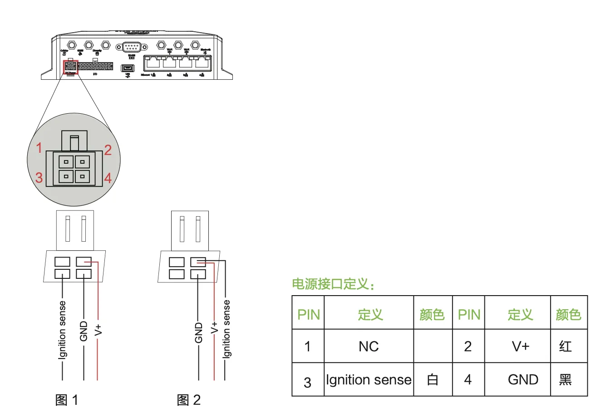

<strong>图 2-1 VG710电源线接线示意图</strong>

**正常工程环境下**：分别接入电源V+、GND和点火线（Ignition sense），点火信号线接在车辆的点火线上。

**测试状态接线**：点火线和正极并在一起接入。

### 2.2.2 安装SIM卡和天线并联网

1. 插入SIM（Subscriber Identity Module，可以理解为：设备的"身份凭证"，存储了接入移动网络所需的认证信息）卡，连接GNSS和Cellular天线，连接电源和PC。拨号卡信号不佳时需同时插入Diversity拨号天线。

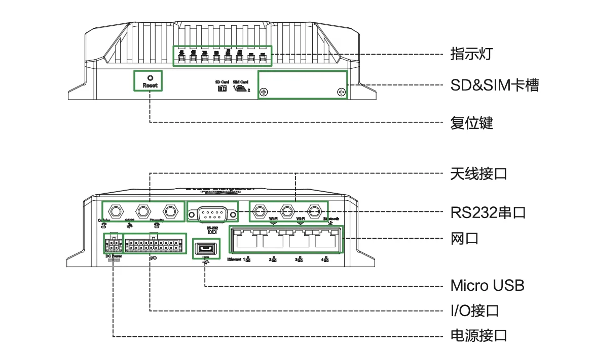

<strong>图 2-2 SIM卡和天线安装示意图</strong>

|  插拔SIM卡操作时，必须拔掉电源，以免造成数据丢失或设备损坏。 |
| --- |

2. 设置PC与网关的IP地址在同一网段。

   **方法一（推荐）**：自动获取IP地址。

   **方法二**：使用固定IP地址。选择"使用下面的IP地址"，输入IP地址（在192.168.2.2~192.168.2.254中任意值，避免与设备初始IP地址192.168.2.1冲突），子网掩码（255.255.255.0），默认网关（192.168.2.1），配置DNS服务器地址，点击确定。

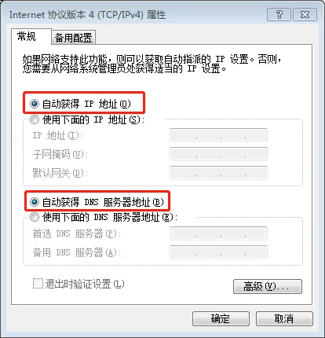

<strong>图 2-3 自动获取IP地址</strong>

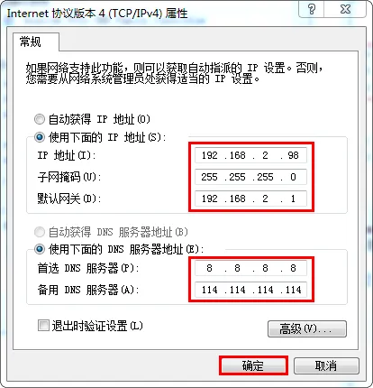

<strong>图 2-4 使用固定IP地址</strong>

3. 打开浏览器，在地址栏中输入网关设备默认IP地址192.168.2.1，回车。

<strong>图 2-5 浏览器输入IP地址</strong>

4. 登录设备（如果提示拦截，点击"高级"→"继续前往"）。默认用户名/密码：adm/123456。

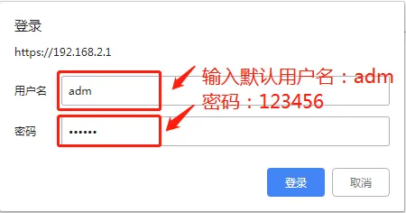

<strong>图 2-6 登录界面</strong>

5. 进入【网络】→【拨号接口】，勾选"启用"，点击"应用并保存"。待网络连接状态显示为"已连接"并显示已分配的IP地址等状态时，表示SIM卡已成功接入网络。专网卡还需填写APN（Access Point Name，可以理解为：运营商网络的"门牌号"）参数。

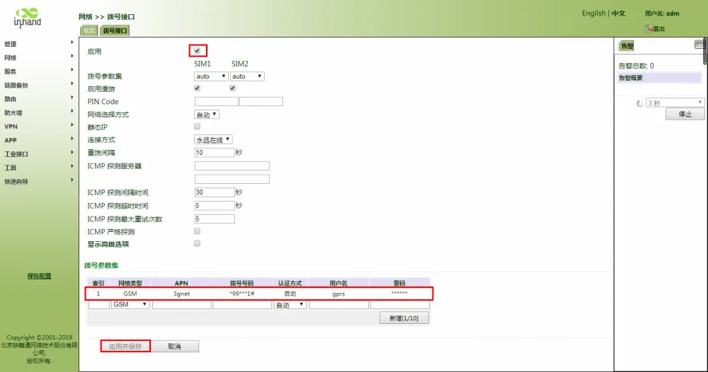

<strong>图 2-7 拨号接口配置</strong>

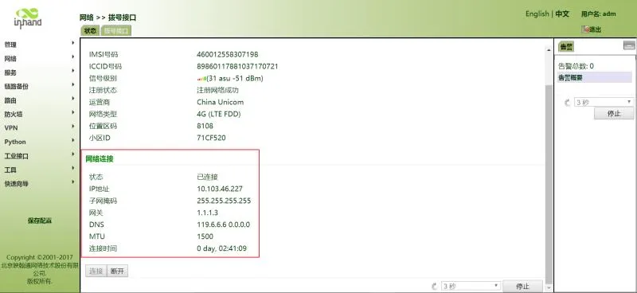

<strong>图 2-8 拨号连接状态</strong>

6. 使用PING探测工具PING国内常用网址，有数据传输表明设备已成功上网。

<strong>图 2-9 PING探测验证联网</strong>

7. 使用双卡时，需启用双SIM卡功能。

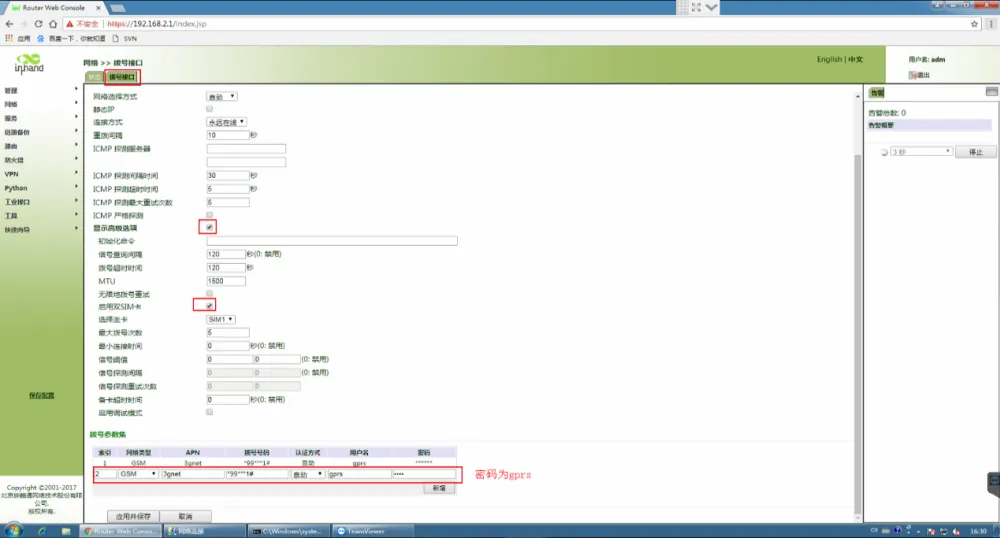

<strong>图 2-10 双SIM卡配置</strong>

## 2.3 快速检查

安装完成后，需按以下清单逐项检查：

- [ ] 电源线正确连接（V+、GND、IGT），供电电压在DC 9~36V范围内
- [ ] SIM卡已正确插入（断电状态下操作）
- [ ] Cellular天线和GNSS天线已连接
- [ ] System指示灯状态为绿色闪烁（系统正常运行）
- [ ] Cellular指示灯状态为绿色常亮（拨号成功）
- [ ] PC能通过浏览器访问192.168.2.1管理界面
- [ ] PING测试网络连通性正常

# 第3章 常用场景配置

## 场景1：蜂窝联网

**目标**：通过4G蜂窝网络接入互联网。

**前提**：已插入SIM卡并安装Cellular天线，设备已上电并通过网线连接PC。

**预计用时**：约5分钟。

**操作步骤**：

1. 插入SIM卡，连接Cellular和GNSS天线，连接电源和PC。拨号卡信号不佳时需同时插入Diversity拨号天线。

<strong>图 3-1 SIM卡和天线安装</strong>

2. 设置PC与网关IP地址在同一网段（自动获取IP地址或手动设置192.168.2.x网段地址）。
3. 打开浏览器，输入192.168.2.1访问Web管理界面，使用默认账户adm/123456登录。
4. 进入【网络】→【拨号接口】，勾选"启用"，点击"应用并保存"。

<strong>图 3-2 拨号接口配置</strong>

5. 如使用专网卡，还需填写APN参数（从运营商获取）。
6. 等待网络连接状态显示为"已连接"并显示已分配的IP地址。

<strong>图 3-3 拨号连接成功状态</strong>

**验证方法**：

1. 使用PING探测工具PING国内常用网址，有数据传输表明设备已成功上网。

<strong>图 3-4 PING探测验证联网</strong>

**双SIM卡说明**：

使用双卡时，需启用双SIM卡功能。

<strong>图 3-5 双SIM卡配置</strong>

**常见问题**：
- 网络连接失败：检查SIM卡是否正确插入、APN参数是否正确。
- 信号弱：检查Cellular天线是否正确连接，必要时加装Diversity天线。
- 拨号故障（Cellular灯红色闪烁）：检查是否探测到模块或SIM卡。

## 场景2：Wi-Fi联网

**目标**：通过Wi-Fi接入现有无线网络实现上网。

**前提**：已安装Wi-Fi天线，设备已上电并登录Web管理界面，已知可用无线接入点的SSID（Service Set Identifier，可以理解为：WiFi网络的"名字"）和密钥。

**预计用时**：约5分钟。

**操作步骤**：

1. 将Wi-Fi天线连接到设备Wi-Fi SMA接口。

<strong>图 3-6 Wi-Fi天线连接示意图</strong>

2. 设置PC与网关设备的IP地址在同一网段，登录Web管理界面（参考[场景1：蜂窝联网](#场景1蜂窝联网)中的登录步骤）。
3. 进入【网络】→【Wi-Fi】，选择2.4G或5G Wi-Fi作为客户端使用，输入可用无线接入点的SSID、认证方式、密钥，点击"应用并保存"。

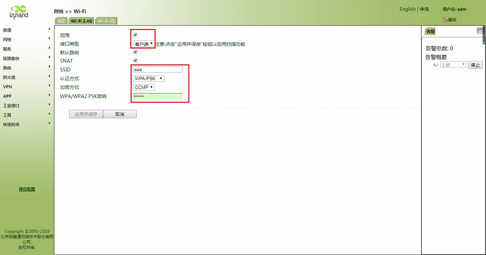

<strong>图 3-7 Wi-Fi客户端配置</strong>

**验证方法**：

1. 进入"状态"栏，查看当前网络状态为"已连接"，表示Wi-Fi已成功接入网络。

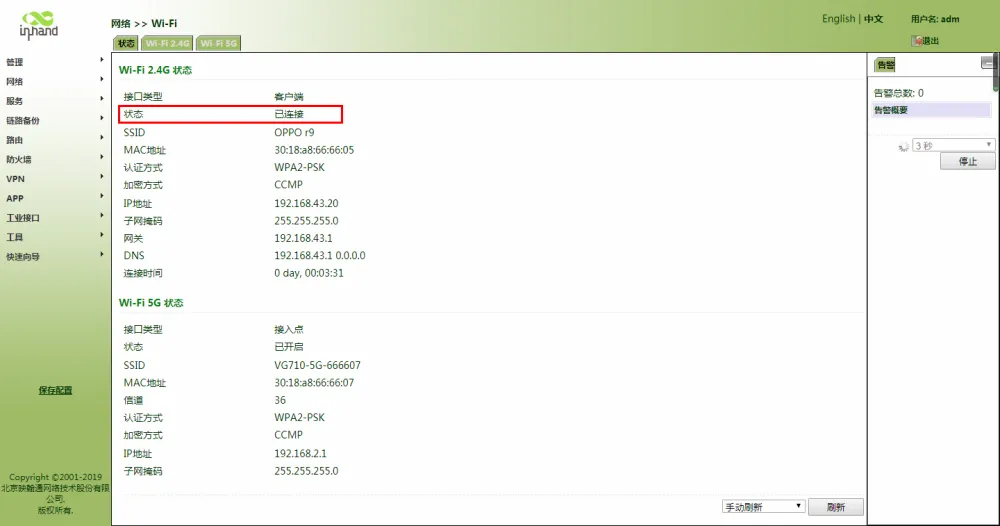

<strong>图 3-8 Wi-Fi连接状态</strong>

**常见问题**：
- Wi-Fi无法连接：检查SSID和密钥是否输入正确。
- Wi-Fi天线未连接：确认天线已正确安装到Wi-Fi SMA接口。

## 场景3：IPsec VPN隧道建立

**目标**：在两个VG710网关之间建立IPsec（Internet Protocol Security，可以理解为：网络层的"加密保镖"，为IP通信提供安全和验证保护）加密隧道，保护站点间数据传输安全。

**前提**：两端网关均已联网并获取公网IP地址，已规划好子网地址和加密参数。

**预计用时**：约15分钟。

**操作步骤**：

本场景以总部A（子网192.168.1.0/24）与分支机构B（子网172.16.1.0/24）之间建立IPsec加密隧道为例。

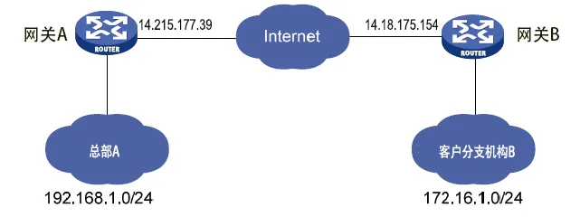

<strong>图 3-9 IPsec VPN拓扑图</strong>

1. 登录网关A的Web管理界面。
2. 进入【VPN】→【IPsec】，新增IKE策略：设置标识、加密算法（AES128）、哈希算法（SHA1）、Diffie-Hellman密钥交换（Group2）、生命周期（86400）。
3. 新增IPsec策略：设置名称、封装（ESP）、加密算法（AES128）、认证方式（SHA1）、IPsec模式（隧道模式）。
4. 新增IPsec隧道：填写对端地址（网关B的IP）、选择接口、设置IKE版本、认证方式（共享密钥）、本地子网和对端子网，点击"应用并保存"。

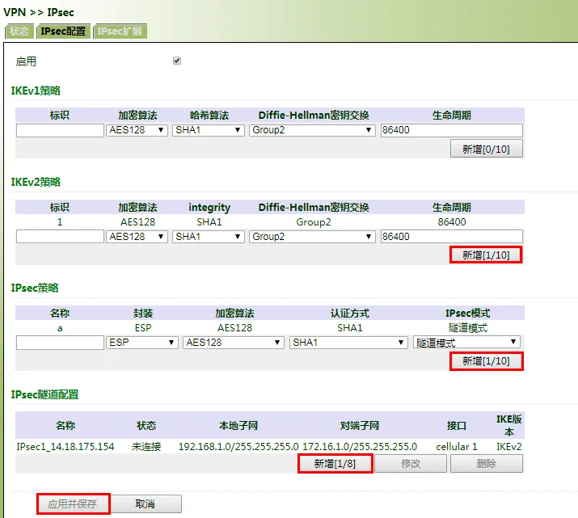

<strong>图 3-10 IPsec配置界面</strong>

5. 以相同方式配置网关B，其中本地/对端子网与网关A对应，加密参数保持一致。

**验证方法**：

1. 配置完成后，进入IPsec"状态"页面，查看隧道建立状态。

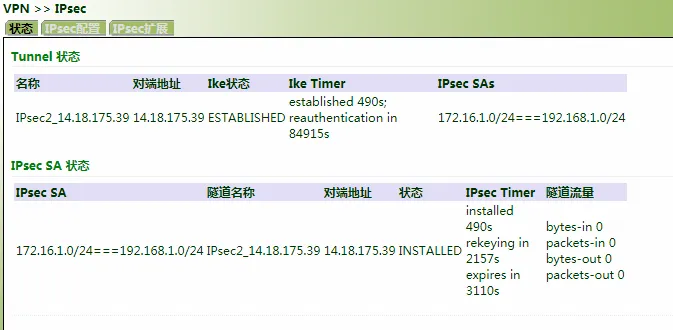

<strong>图 3-11 IPsec隧道状态</strong>

|  建立IPsec VPN时，IPsec Profile不用配置，仅在DMVPN时使用。 |
| --- |

**常见问题**：
- 隧道无法建立：检查两端加密参数（IKE、IPsec策略）是否一致。
- 对端不可达：检查两端公网IP是否能互相访问。

## 场景4：连接设备远程监控平台

**目标**：将VG710网关连接到InHand设备远程监控云平台，实现远程管理和监控。

**前提**：设备已联网（蜂窝或Wi-Fi），已获取云平台注册账户。

**预计用时**：约5分钟。

**操作步骤**：

1. 登录Web管理界面，进入【管理】→【设备远程监控平台】→【设备远程监控平台】。
2. 勾选"启用"。
3. 选择云平台服务器地址，输入云平台注册账户及车牌号。
4. 点击"应用并保存"。

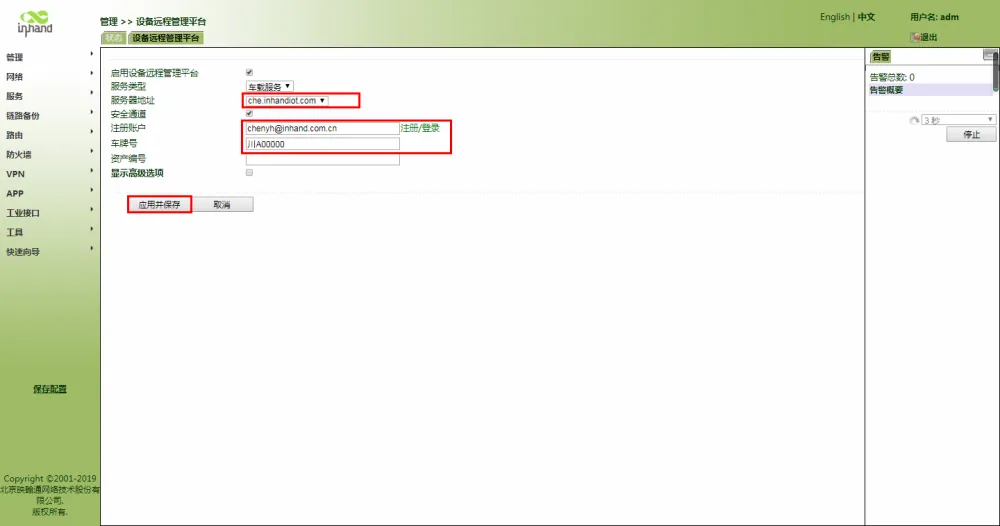

<strong>图 3-12 设备远程监控平台配置</strong>

**验证方法**：

1. 点击"状态"，显示"Connected"表示连接云平台成功。

**常见问题**：
- 无法连接云平台：检查设备是否已成功联网，服务器地址是否正确，账户信息是否匹配。

# 第4章 功能说明与参数参考

## 4.1 网络

在配置参数时，带绿色的填写框表示必填项，纯白色填写框表示选填项。

### 4.1.1 桥接口

桥接口用于通过网桥将两个不同的物理局域网连接起来，是一种在链路层实现局域网互连的存储转发机制。

**修改桥接口的IP地址和网桥成员的操作方法：**

1. 进入【网络】→【桥接口】，选中桥接口，点击"修改"。

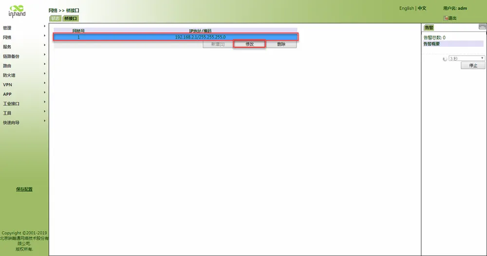

<strong>图 4-1 桥接口列表</strong>

2. 修改桥接口的IP地址或网桥成员。网桥成员中，dot11radio1和dot11radio2分别为Wi-Fi 2.4G和Wi-Fi 5G接口。

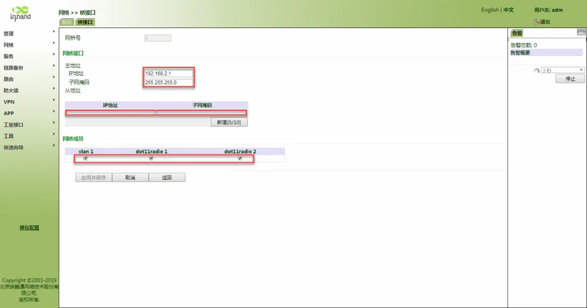

<strong>图 4-2 修改桥接口</strong>

### 4.1.2 VLAN接口

VLAN（Virtual Local Area Network，可以理解为：虚拟局域网，将不同物理位置的设备组织为逻辑上同一网段的技术）是一组逻辑上的设备和用户，不受物理位置限制，可根据功能、部门及应用等因素组织。

**新增一个VLAN2接口的操作方法：**

1. 进入【网络】→【VLAN接口】→【VLAN配置】→【新增】，按需求设置VLAN2接口的虚拟IP地址和选择VLAN2成员接口，点击"应用并保存"。

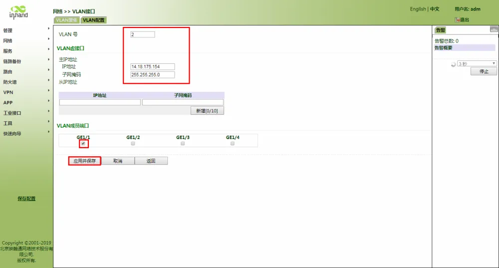

<strong>图 4-3 新增VLAN接口</strong>

2. 返回VLAN列表，VLAN2接口已新增成功。

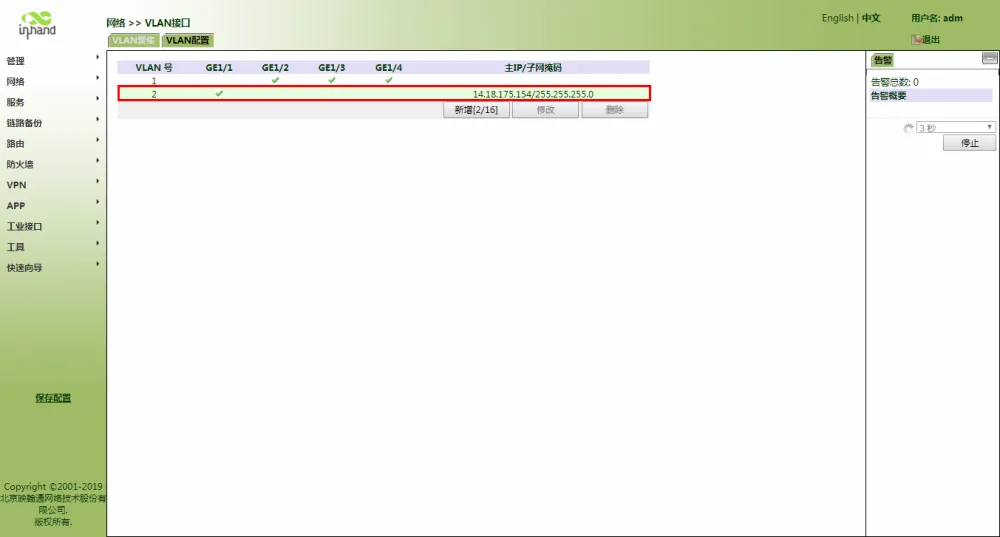

<strong>图 4-4 VLAN列表</strong>

VG710 VLAN端口支持Access和Trunk两种链路类型。Access类型端口只能属于1个VLAN，一般用于连接计算机；Trunk类型端口可允许多个VLAN通过，可接收和发送多个VLAN报文，用于交换机之间的连接或连接用户计算机。可通过VLAN聚集页面选择链路类型。

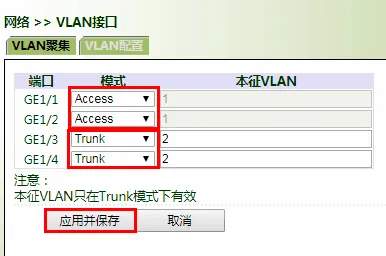

<strong>图 4-5 VLAN聚集配置</strong>

### 4.1.3 ADSL拨号(PPPoE)

PPPoE（Point-to-Point Protocol over Ethernet，可以理解为：宽带拨号上网的"握手协议"，用于验证账号密码并建立网络连接）配置方法：

1. 进入【网络】→【ADSL拨号(PPPoE)】，在"拨号池"栏选择连接PPPoE服务器的VG710接口，点击"新增"。
2. 在"PPPoE列表"栏填入PPPoE服务器的用户名、密码和池标识，池标识必须与"拨号池"中池标识相同，点击"新增"，然后点击"应用并保存"。

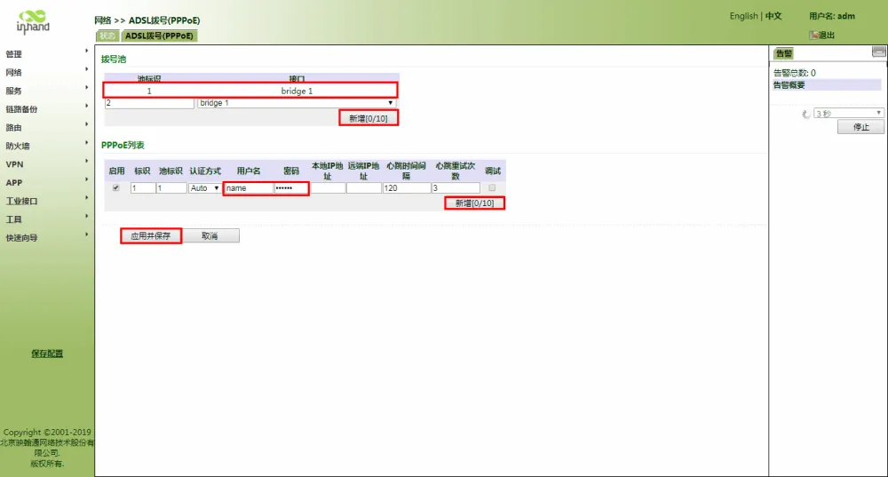

<strong>图 4-6 PPPoE配置</strong>

### 4.1.4 Wi-Fi

网关可作为接入点（AP模式，可以理解为："热点模式"，设备自身发射Wi-Fi信号供其他设备连接）或客户端（STA模式，可以理解为："客户端模式"，设备作为客户端连接其他WiFi热点）使用。作为接入点使用时，其他用户可通过网关设备Wi-Fi上网；作为客户端使用时，设备连接接入点上网。

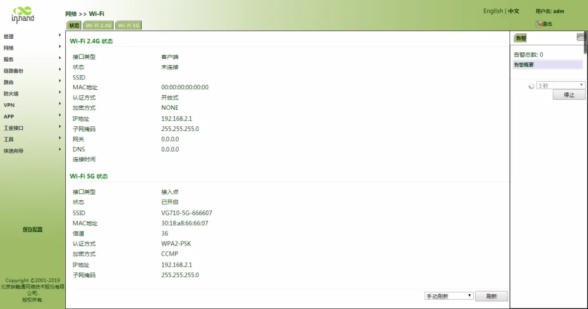

<strong>图 4-7 Wi-Fi状态页面</strong>

**设备作为接入点（AP）的配置方法：**

进入【Wi-Fi】→【Wi-Fi 2.4/5G】，"接口类型"选择"接入点"，填入SSID、认证方式、加密方式和密钥，点击"应用并保存"。

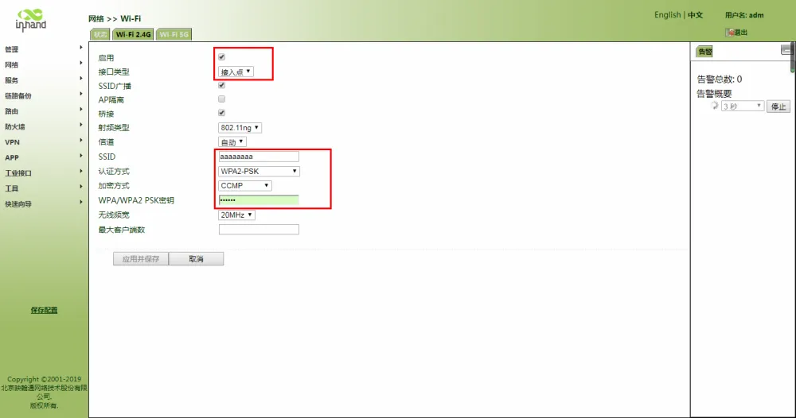

<strong>图 4-8 Wi-Fi接入点配置</strong>

**设备作为客户端（STA）的配置方法：**

选择"客户端"，填入Wi-Fi的SSID和密钥，点击"应用保存"。

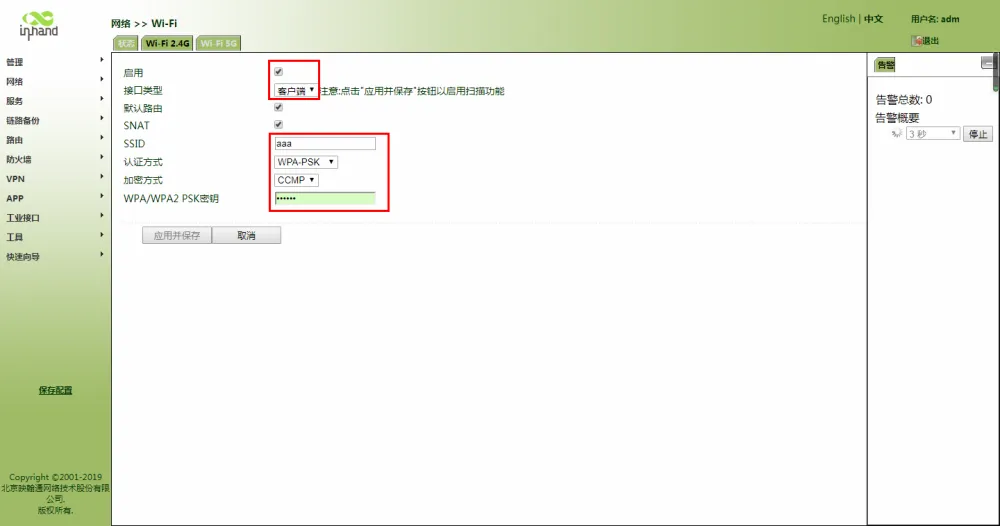

<strong>图 4-9 Wi-Fi客户端配置</strong>

### 4.1.5 环回接口

**新增多个从IP的配置方法：**

进入【网络】→【环回接口】→【多IP支持】，为网关配置任意IP地址，点击"新增"，然后点击"应用并保存"。

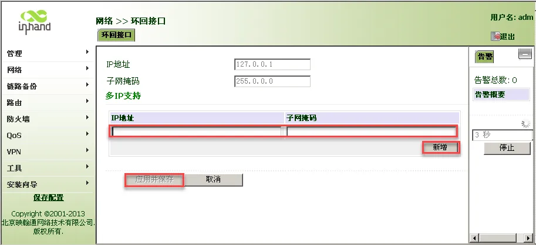

<strong>图 4-10 环回接口配置</strong>

### 4.1.6 二层交换

查看GE1~4口的网络连接状态，LINK UP表示连接，LINK DOWN表示断开。

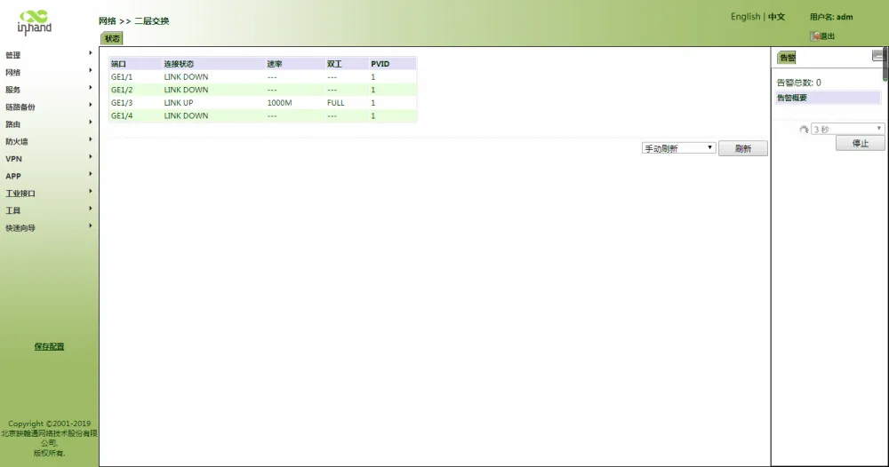

<strong>图 4-11 二层交换状态</strong>

## 4.2 车辆诊断

车辆诊断服务用于实时的车况数据采集、排放信息获取及故障诊断。车况数据包括油位、里程、行驶速度、发动机转速、发动机负荷、冷却液温度、制动压力等关键参数。排放信息包括车用尿素（AdBlue）容积、多种尾气后处理传感器（废气传感器、柴油颗粒过滤器等）和催化剂的工作情况及监测状态等信息。故障诊断可实时获取车辆标准的故障码及描述信息，便于车辆维护人员及时了解车辆健康状况，辅助故障定位。

车辆数据采集通过OBD-II（On-Board Diagnostics II，可以理解为：车辆自诊断系统的标准接口）或J1939线缆从网关的I/O端口接入到车辆的诊断接口。线缆配件可在购买时选配或定制，具体接入方法可参考《VG710快速入门指南》4.4节。网关启动后自动启用车辆诊断服务，采集关键车况数据和故障码信息。

|  注意：应在车辆处于熄火状态下完成网关电源和OBD线缆的安装。 |
| --- |

### 4.2.1 OBD状态信息

车辆诊断的状态页面显示以下状态信息：

- **CAN接口状态**：ERROR-ACTIVE表示网关成功接入车辆的诊断接口，其他状态表示连接异常或未能识别出车辆的诊断接口
- **CAN波特率**：在车辆诊断中，CAN（Controller Area Network，可以理解为：车辆内部设备之间通信的"总线"）波特率自动适配，一般为250kbps或500kbps
- **CAN接口的应用方式**：车辆诊断|定制，默认为车辆诊断
- **OBD连接状态**：未连接|正在连接|已连接
- **OBD协议类型**：OBD-II|J1939

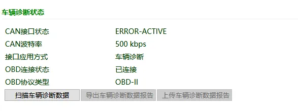

<strong>图 4-12 OBD状态信息</strong>

### 4.2.2 手动扫描与报告

通过点击"扫描车辆诊断数据"按钮可生成包含详细车况数据和诊断信息的车辆诊断数据报告文件，点击"导出车辆诊断数据报告"按钮可将生成的诊断数据报告保存到本地。

### 4.2.3 OBD数据流

显示实时的车况数据。

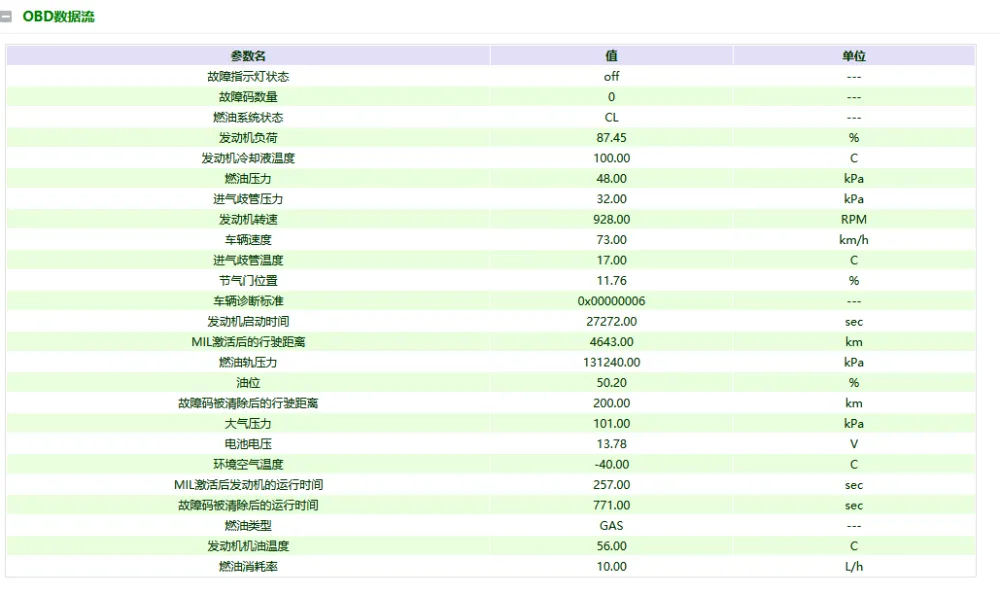

<strong>图 4-13 OBD数据流</strong>

### 4.2.4 车辆诊断能力

显示以下信息：
- 车辆诊断能力的版本号
- 诊断协议类型
- 车辆识别码
- 网关可采集的有效变量和参考值

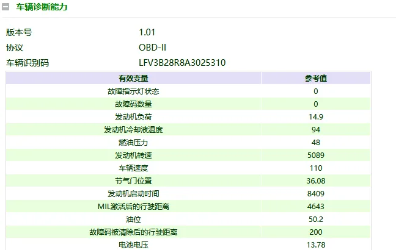

<strong>图 4-14 车辆诊断能力</strong>

## 4.3 VPN应用

VPN（Virtual Private Network，可以理解为：在公共网络上搭建的一条"专属秘密通道"，让远程设备能够安全地访问内部网络）的功能是在公用网络上建立专用网络，进行加密通讯。VPN网关通过对数据包的加密和数据包目标地址的转换实现远程访问。VPN可通过服务器、硬件、软件等多种方式实现。相比传统DDN专线或帧中继的方法，VPN提供了一种更加安全的远程访问方案。

### 4.3.1 IPsec

IPsec是IETF制定的一组开放的网络安全协议，在IP层通过数据来源认证、数据加密、数据完整性和抗重放功能来保证通信双方Internet上传输数据的安全性，减少泄漏和被窃听的风险，保证数据的完整性和机密性。

**情景**：总部A所在的子网为192.168.1.0/24，分支机构B所在的子网为172.16.1.0/24，通过网关A和网关B进行数据传输，为两端传输通道进行IPsec加密，保护数据传输安全。

<strong>图 4-15 IPsec VPN组网拓扑</strong>

**配置参数表：**

| 参数 | 网关A | 网关B |
| --- | --- | --- |
| **IKEv1/v2参数** | | |
| 标识 | 自定义填写 | 自定义填写 |
| 加密算法 | AES128 | 与网关A相同 |
| 哈希算法 | SHA1 | 与网关A相同 |
| Diffie-Hellman密钥交换 | Group2 | 与网关A相同 |
| 生命周期 | 86400 | 与网关A相同 |
| **IPsec策略** | | |
| 名称 | 自定义填写 | 自定义填写 |
| 封装 | ESP | 与网关A相同 |
| 加密算法 | AES128 | 与网关A相同 |
| 认证方式 | SHA1 | 与网关A相同 |
| IPsec模式 | 隧道模式 | 与网关A相同 |
| **IPsec隧道配置** | | |
| 对端地址 | 网关B建立IPsec服务的地址 | 网关A建立IPsec服务的地址 |
| 接口 | 建立IPsec服务的接口 | 建立IPsec服务的接口 |
| IKE版本 | 所使用的IKE版本 | 与网关A相同 |
| 认证方式 | 共享密钥 | 与网关A相同 |
| 本地子网 | 网关A子网的IP地址 | 网关B子网的IP地址 |
| 对端子网 | 网关B子网的IP地址 | 网关A子网的IP地址 |

**详细配置步骤：**

1. 分别设置网关A和网关B：新增IKE策略、IPsec策略，点击"应用并保存"。
2. 新增IPsec隧道，点击"应用并保存"。

<strong>图 4-16 IPsec配置界面</strong>

3. 网关A、B配置完成后，进入IPsec"状态"页面查看隧道状态。

<strong>图 4-17 IPsec隧道建立成功状态</strong>

|  注意：建立IPsec VPN时，IPsec Profile不用配置，仅在DMVPN时使用IPsec Profile。 |
| --- |

### 4.3.2 GRE

GRE（Generic Routing Encapsulation，通用路由封装协议）可对某些网络层协议的数据报进行封装，使被封装的数据报能够在IPv4网络中传输。

**情景**：VG710_A和VG710_B通过公网建立GRE协议封装。

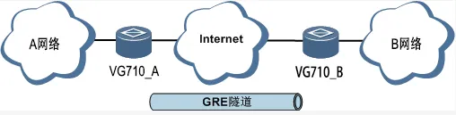

<strong>图 4-18 GRE组网拓扑</strong>

**配置步骤：**

1. 进入【VPN】→【GRE】，点击"新增"。

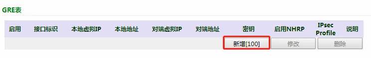

<strong>图 4-19 GRE新增</strong>

2. "标识"自定义填写，"网络类型"支持"点对点"和"子网"类型，"本地和对端虚拟IP"自定义填写但必须在同一网段，填写源和对端网络地址或接口及密钥，点击"应用并保存"。

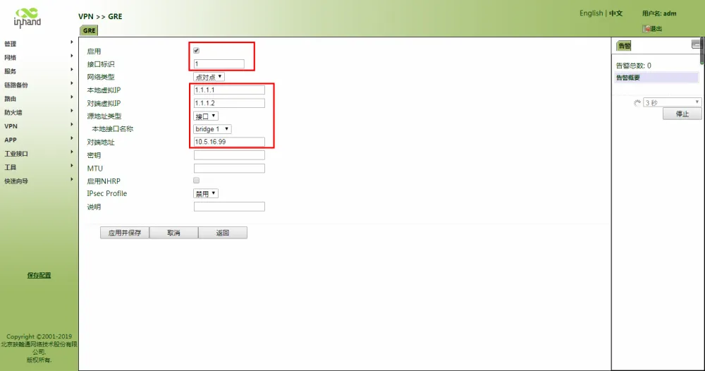

<strong>图 4-20 GRE配置</strong>

3. 以相同方法设置VG710_B，其中VG710_B的虚拟IP、对端地址必须与VG710_A对应，密钥必须相同。

### 4.3.3 L2TP

L2TP（Layer 2 Tunneling Protocol）是一种工业标准的Internet隧道协议，可对网络数据流进行加密。

**网关作为L2TP客户端的配置方法：**

1. 进入【VPN】→【L2TP】→【L2TP客户端】→【L2TP Class】，填入一个L2TP Class名称，点击"新增"。

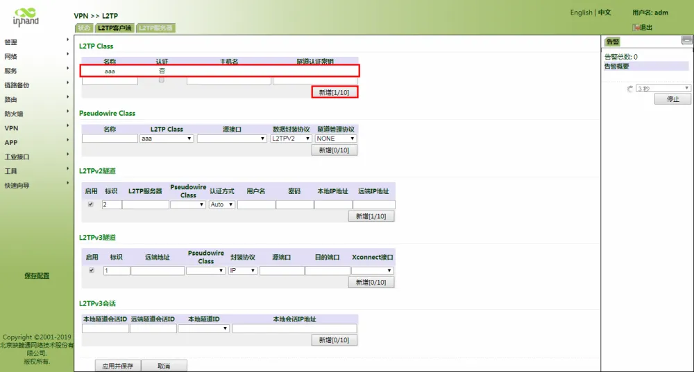

<strong>图 4-21 L2TP Class配置</strong>

2. 配置Pseudowire Class：填写名称，"L2TP Class"与上述名称相同，"源接口"填写与服务器建立连接的接口，"协议"选择L2TPv2，点击"新增"。

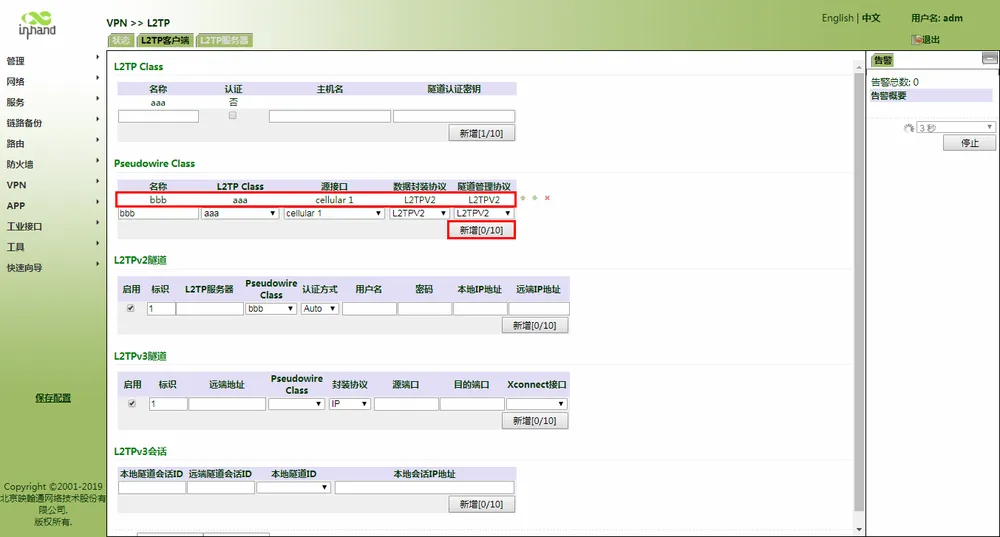

<strong>图 4-22 Pseudowire Class配置</strong>

3. 配置L2TPv2隧道参数："L2TP服务器"填入服务器域名或IP地址，"Pseudowire Class"与上述名称相同，填写在服务器创建的用户名/密码，其他参数根据需求配置，点击"应用并保存"。

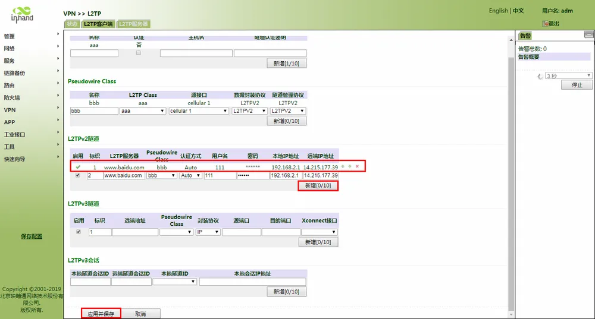

<strong>图 4-23 L2TPv2隧道参数配置</strong>

### 4.3.4 OpenVPN

OpenVPN是基于OpenSSL库的应用层VPN实现，支持证书、密钥或用户名/密码等多种认证方式。

**认证方式列表：**

| 认证方式 | Web页面操作说明 |
| --- | --- |
| 无 | 无需认证。 |
| 用户名/密码 | 输入OpenVPN服务器上设置的用户名和密码，并在【VPN】→【证书管理】导入CA证书、公钥、私钥进行认证。 |
| 预共享密钥 | 输入OpenVPN服务器上设置的预共享密钥。 |
| 数字证书 | 在【VPN】→【证书管理】导入CA证书、公钥、私钥。 |
| 数字证书/用户名/密码 | 输入用户名和密码，并导入CA证书、公钥、私钥进行认证。 |
| 数字证书/TLS认证 | 输入预共享密钥，并导入CA证书、公钥、私钥进行认证。 |
| 数字证书/TLS认证/用户名/密码 | 输入预共享密钥、用户名和密码，并导入CA证书、公钥、私钥进行认证。 |

**网关作为客户端连接OpenVPN服务器的配置方法（以数字证书认证为例）：**

1. 配置设备的OpenVPN参数，确保隧道两端网络参数保持一致，点击"应用并保存"。

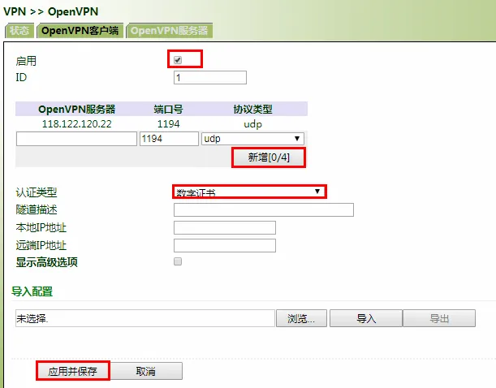

<strong>图 4-24 OpenVPN配置</strong>

2. "认证类型"选择"数字证书"，进入【VPN】→【证书管理】导入CA证书、公钥、私钥。
3. 点击"应用并保存"，返回"状态"页面查看隧道建立状态。

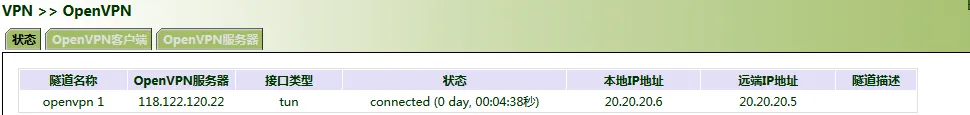

<strong>图 4-25 OpenVPN隧道状态</strong>

### 4.3.5 证书管理

本页面用于导入、导出证书，证书用于IPsec和OpenVPN服务。

**导入证书的操作方法：**

进入【VPN】→【证书管理】→【浏览】，选择从证书服务器获得的证书文件，点击"导入XX证书"按钮，然后点击"应用并保存"。

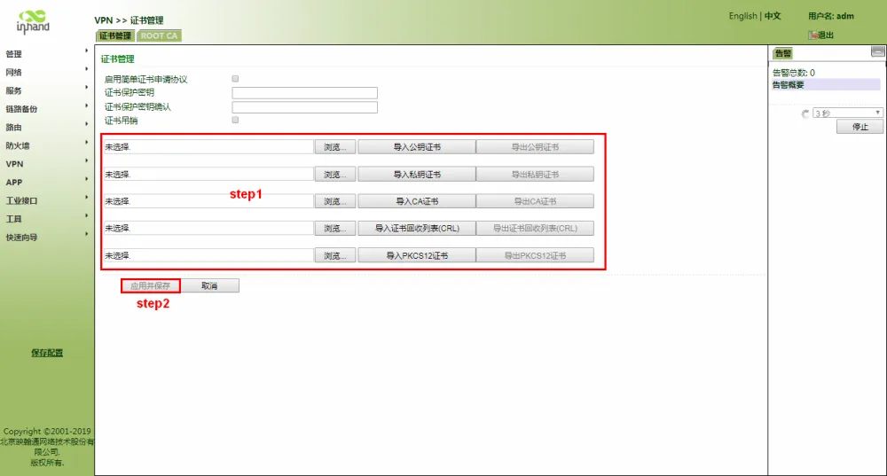

<strong>图 4-26 证书导入</strong>

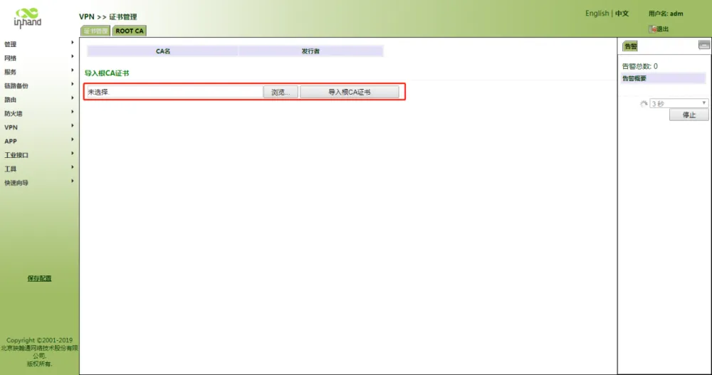

<strong>图 4-27 证书管理界面</strong>

如果没有本地证书，可勾选"启用简单证书申请协议"（SCEP）在线申请证书。

**在线申请证书的操作方法：**

1. 进入【VPN】→【证书管理】，勾选"启用简单证书申请协议"和"强制重新申请"，填入证书保护密钥及密钥确认，填入证书服务器URL地址、证书名和FQDN，点击"应用并保存"。

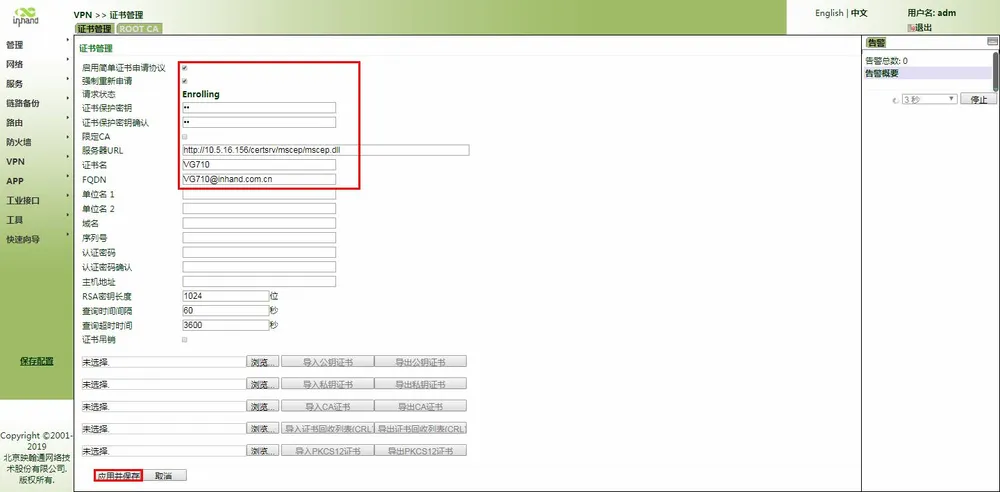

<strong>图 4-28 SCEP在线申请证书</strong>

2. 待服务器颁发证书后，请求状态显示为"Completion"表示证书申请成功。

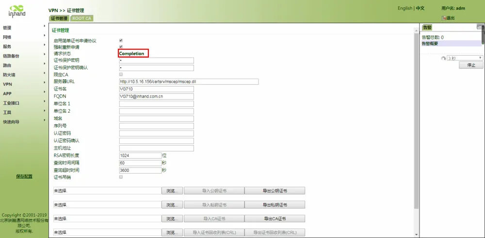

<strong>图 4-29 证书申请成功</strong>

## 4.4 服务

### 4.4.1 DHCP

DHCP（Dynamic Host Configuration Protocol，可以理解为：网络中的"自动分配员"，自动为接入的设备分配IP地址等网络参数）采用客户端/服务器通信模式，由客户端向服务器提出配置申请，服务器返回为客户端分配的IP地址，实现IP地址的动态配置。

> **注意**：DHCP服务器与DHCP转发功能互斥。

**网关作为DHCP服务器的配置方法：**

进入【服务】→【DHCP服务】→【DHCP服务器】，在DHCP服务栏勾选"启用"，选择接口，设置起始和结束IP地址，点击"新增"，然后点击"应用并保存"。

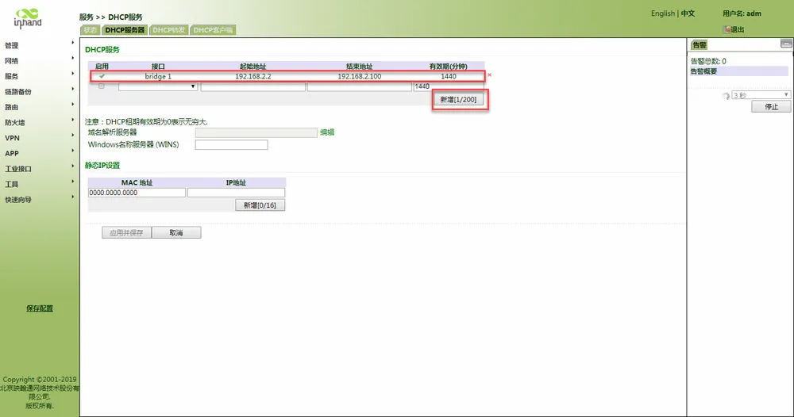

<strong>图 4-30 DHCP服务器配置</strong>

**网关作为DHCP客户端的配置方法：**

进入【服务】→【DHCP服务】→【DHCP客户端】，勾选网关接口，点击"应用并保存"。

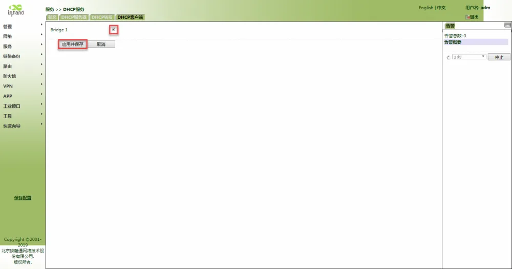

<strong>图 4-31 DHCP客户端配置</strong>

**DHCP转发的配置方法：**

DHCP转发（也称DHCP中继代理）实现在不同子网和物理网段之间处理和转发DHCP信息的功能。

进入【服务】→【DHCP服务】→【DHCP转发】，勾选"启用"，填入服务器地址，选择网关接口，点击"应用并保存"。

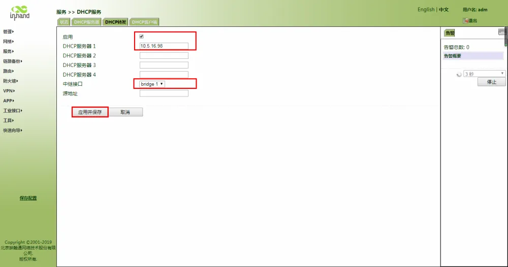

<strong>图 4-32 DHCP转发配置</strong>

### 4.4.2 DNS

DNS（Domain Name System，可以理解为：互联网的"电话簿"，将网站域名翻译成计算机能识别的IP地址）是一种分布式网络目录服务，主要用于域名与IP地址的相互转换。

**DNS服务的配置方法：**

进入【服务】→【DNS服务】→【域名服务器】，输入域名服务器地址，点击"应用并保存"。

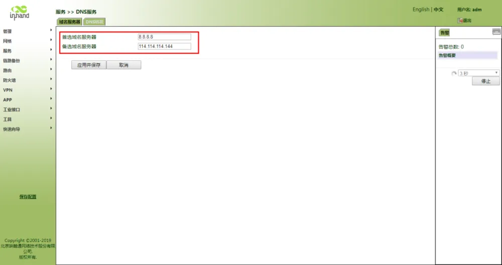

<strong>图 4-33 DNS服务配置</strong>

**DNS转发服务的配置方法：**

设备作为DNS代理，在DNS客户端和DNS服务器之间转发DNS请求和应答报文，代替DNS客户端进行域名解析。

> **注意**：如果网关开启了DHCP服务，会默认开启DNS转发功能且不能关闭。

进入【服务】→【DNS服务】→【域名服务器】，启用DNS转发服务，设置域名和IP地址对应关系，点击"新增"，然后点击"应用并保存"。配置完成后，当局域网内DNS客户端请求列表中的主机域名时，DNS代理服务器会将对应的IP地址应答给客户端。

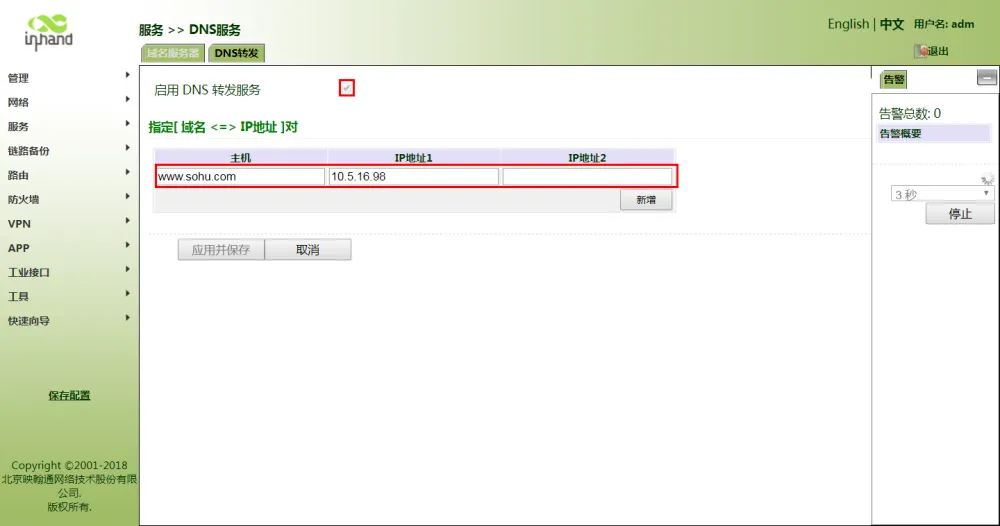

<strong>图 4-34 DNS转发配置</strong>

### 4.4.3 DDNS

DDNS（Dynamic DNS，动态域名）将设备动态IP地址映射到一个固定的域名解析服务上。用户每次连接网络时，客户端程序会将该主机的动态IP地址传送给服务商主机上的服务器程序，服务器程序负责提供DDNS服务并实现动态域名解析。

**DDNS服务的配置方法：**

1. 如使用定制服务（Custom）："方法名称"自定义填写，"服务类型"选择Custom，"Url"输入服务器DDNS表达式（实际Url由服务商提供），点击"新增"。

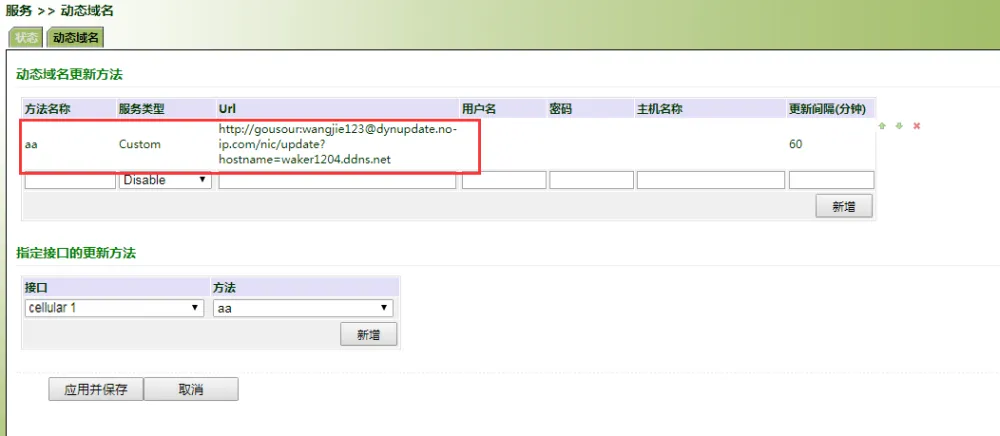

<strong>图 4-35 DDNS Custom配置</strong>

如使用Custom之外的其他普通域名服务器："方法名称"自定义填写，选择"服务类型"后，用户名、密码和主机名称从服务器获取并填入，点击"新增"。选择Disable表示不使用DDNS服务。

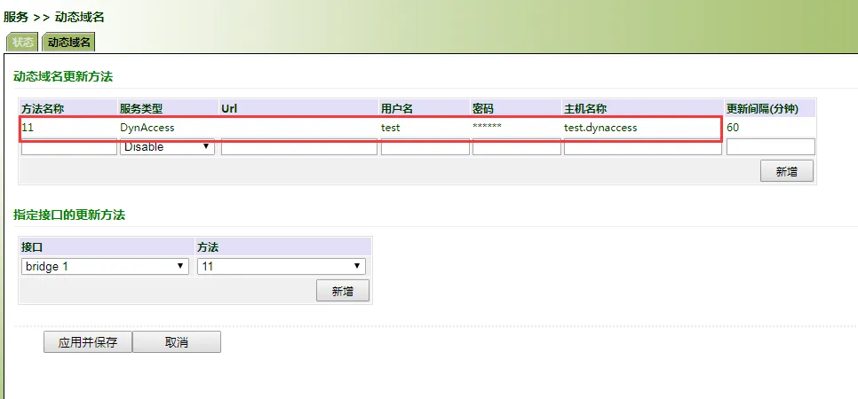

<strong>图 4-36 DDNS服务类型选择</strong>

2. 选择网关接口，填入"动态域名更新方法"中的方法名称，点击"新增"，然后点击"应用并保存"，将动态域名更新方法应用给网关接口。

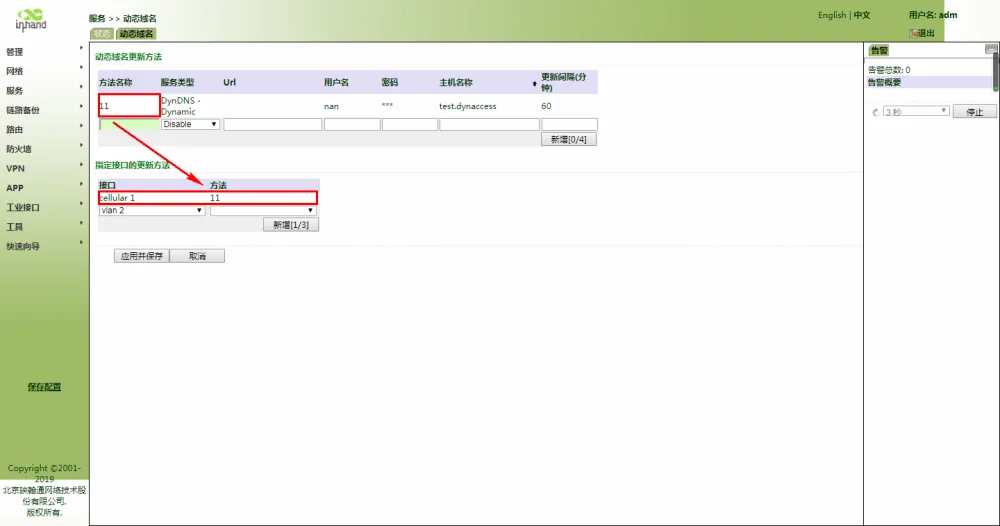

<strong>图 4-37 DDNS应用到接口</strong>

3. 配置完成并保存后等待几分钟，ping域名服务器的主机名称（域名），确认动态域名服务功能生效。

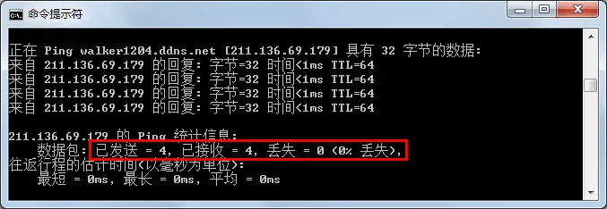

<strong>图 4-38 DDNS验证</strong>

### 4.4.4 短信服务

启用短信服务可实现手机短信重启设备和手工拨号，部分设备还支持接收短信白名单中的告警信息。

**短信控制网关的配置方法：**

当拨号口选择短信激活方式时，进入【服务】→【短信服务】，勾选"启用"，在短信访问控制列表中"ID"自定义填写，"动作"选择"允许"并输入手机号码，点击"应用并保存"。配置完成后可通过该手机号发送 `reboot` 指令重启设备，或发送 `cellular 1 ppp up/down` 指令使网关重新拨号或断开拨号。

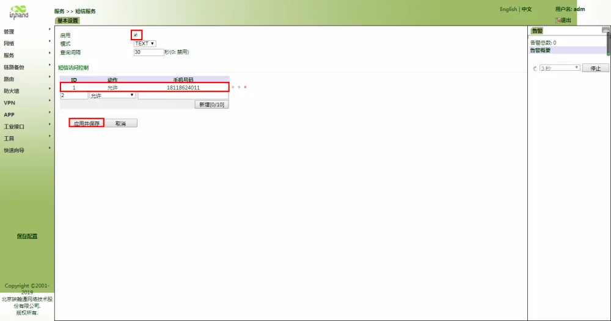

<strong>图 4-39 短信服务配置</strong>

### 4.4.5 GPS

**位置查看**：用于查看设备的位置数据。

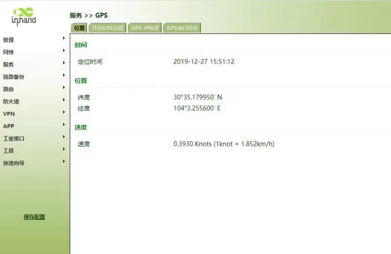

<strong>图 4-40 GPS位置信息</strong>

**开启GPS功能的配置方法：**

进入【服务】→【开启GPS功能】，勾选"启用"，点击"应用并保存"。缺省状态下GPS功能保持开启。

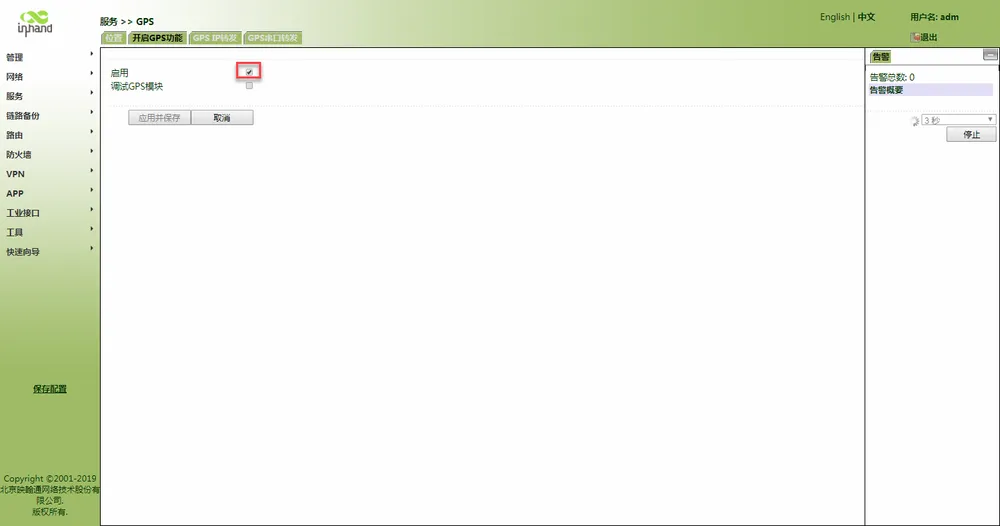

<strong>图 4-41 GPS功能启用</strong>

**作为客户端使用IP转发GPS数据到服务器的配置方法：**

进入【服务】→【GPS IP转发】，勾选"启用"，"类型"选择"客户端"，在目的IP栏输入服务器地址和端口，点击"新增"，然后点击"应用并保存"。

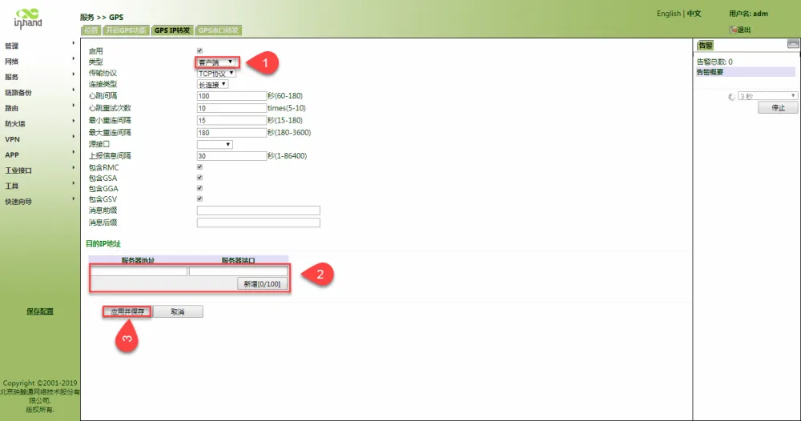

<strong>图 4-42 GPS IP转发（客户端模式）</strong>

**作为服务器使用IP转发GPS数据的配置方法：**

进入【服务】→【GPS IP转发】，勾选"启用"，"类型"选择"服务器端"，点击"应用并保存"。

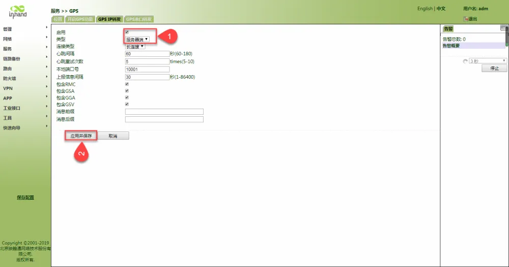

<strong>图 4-43 GPS IP转发（服务器模式）</strong>

**使用串口转发GPS数据的配置方法：**

进入【服务】→【GPS串口转发】，勾选"启用"，根据使用的数据传输接口选择串口类型，波特率、数据位、校验位和停止位必须与当前串口相同，点击"应用并保存"。

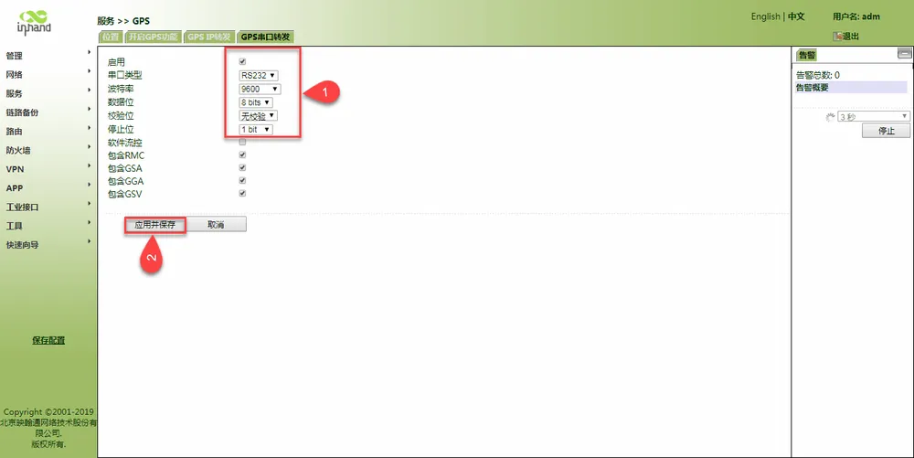

<strong>图 4-44 GPS串口转发配置</strong>

### 4.4.6 QoS

QoS（Quality of Service，服务质量）利用各种基础技术为指定的网络通信提供更好的服务能力，是用来解决网络延迟和阻塞等问题的一种技术。

**设置最大输出带宽的配置方法：**

进入【QoS】→【流量控制】→【应用QoS】，选择网关接口，填入最大输出带宽，点击"新增"，然后点击"应用并保存"。

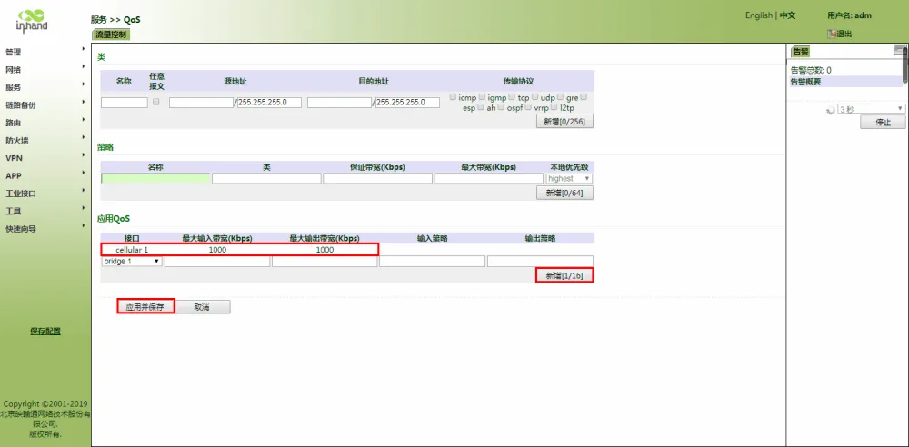

<strong>图 4-45 QoS最大输出带宽配置</strong>

**应用输入/输出策略的配置方法：**

1. 新增网络链路分类：进入【QoS】→【流量控制】→【类】，设置链路源/目的地址，勾选传输协议，点击"新增"。
2. 设置传输策略：进入【QoS】→【流量控制】→【策略】，输入名称，填入类名称，设置保证带宽和最大带宽参数及策略优先级，点击"新增"。
3. 进入【QoS】→【流量控制】→【应用QoS】，选择网关接口，"输出策略"填入策略名称，点击"新增"，然后点击"应用并保存"。

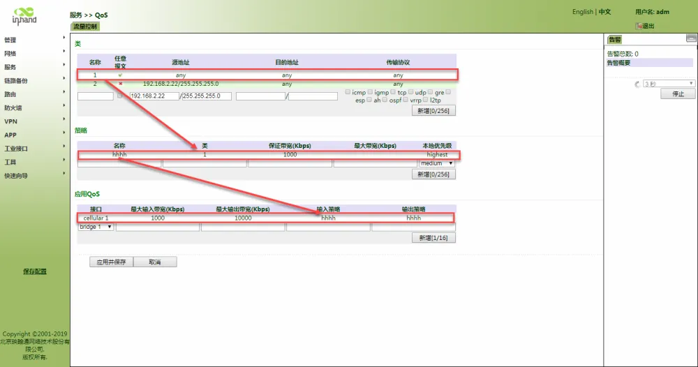

<strong>图 4-46 QoS策略配置</strong>

### 4.4.7 流量控制

**流量控制的配置方法：**

进入【服务】→【流量控制】，启用流量控制，设置控制流量使用的参数，点击"应用并保存"。配置完成后，系统根据设置参数在流量超过限额后进行告警、停止转发或关闭接口等处理。

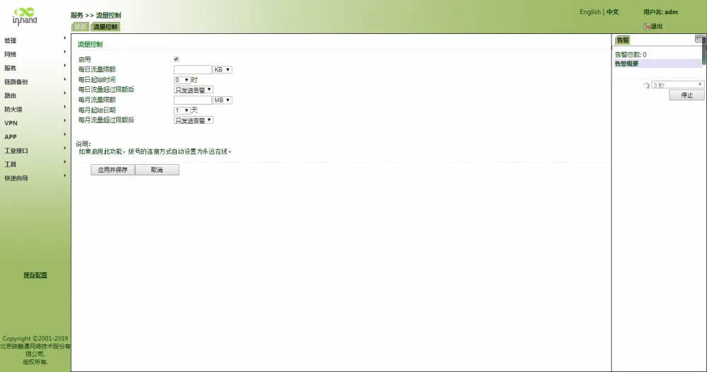

<strong>图 4-47 流量控制配置</strong>

## 4.5 防火墙

### 4.5.1 访问控制（ACL）

ACL（Access Control List，访问控制列表，可以理解为：网络数据包的"安检规则"，根据设定条件决定允许或拒绝数据包通过）是一种基于包过滤的访问控制技术，可根据设定的条件对接口上的数据包进行过滤。

**情景**：默认局域网内（Bridge 1）的设备均可访问外部网络，需禁止192.168.2.100设备访问外部网络。

**配置步骤：**

1. 点击"新增"访问控制列表，填入ID和序号（序号数值越小优先级越高），动作选择"拒绝"，填入源地址192.168.2.100，源地址反掩码为0.0.0.0，目的地址不填写代表0.0.0.0/0（所有地址），点击"应用并保存"。

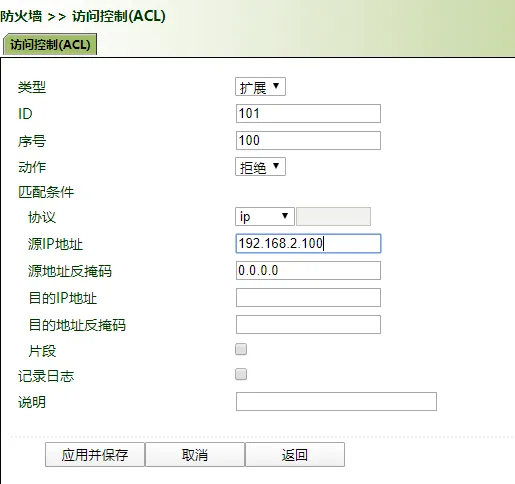

<strong>图 4-48 ACL规则配置</strong>

2. 回到访问控制页面，将上述配置的ID为101的规则加入到Bridge 1接口的管理规则中，点击"新增"，然后点击"应用并保存"。

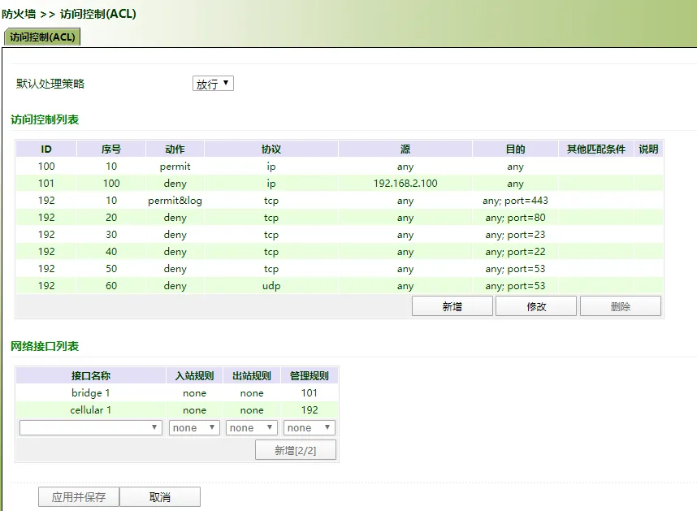

<strong>图 4-49 ACL应用到接口</strong>

### 4.5.2 网络地址转换（NAT）

NAT（Network Address Translation，可以理解为：网络中的"翻译官"，将内部设备的私有IP地址转换成公网可识别的地址）用于内网主机与外网通信。

**情景**：通过公共网络访问设备局域网内的摄像头（地址192.168.2.100，端口18000提供视频服务），查看当前车辆行驶路况。

**配置步骤：**

1. 点击"新增"网络地址转换（NAT）规则，选择动作为DNAT，源网络为Outside。转换类型选择INTERFACE PORT to IP PORT（因拨号上网获取的公网地址不固定，此方式更适用）。传输协议选择TCP，接口选择cellular 1（蜂窝网络拨号接口），端口配置为20000。转换成的IP地址和端口配置为192.168.2.100和18000，点击"应用并保存"。

设备会将访问cellular 1接口20000端口的TCP服务转换到内部192.168.2.100的18000端口上，实现外部访问内部服务的目的。

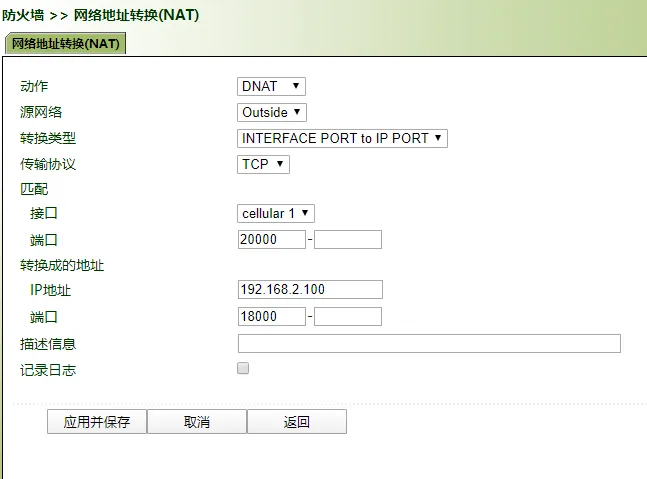

<strong>图 4-50 NAT DNAT配置</strong>

### 4.5.3 MAC-IP绑定

绑定MAC-IP后，PC仅能使用绑定本机MAC（Media Access Control Address，可以理解为：设备网卡的"身份证号"）的IP才可通过设备上网，其他情况均无法上网。

**配置步骤：**

1. 进入防火墙控制，将默认控制规则设置为"阻止"。

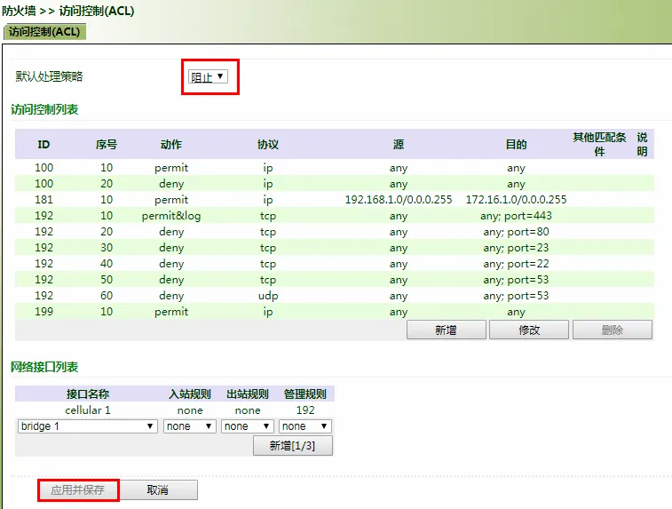

<strong>图 4-51 防火墙默认规则设置</strong>

2. 进入【防火墙】→【MAC-IP绑定】，启用MAC-IP绑定，输入下接设备的MAC地址和IP地址，点击"新增"，然后点击"应用并保存"。

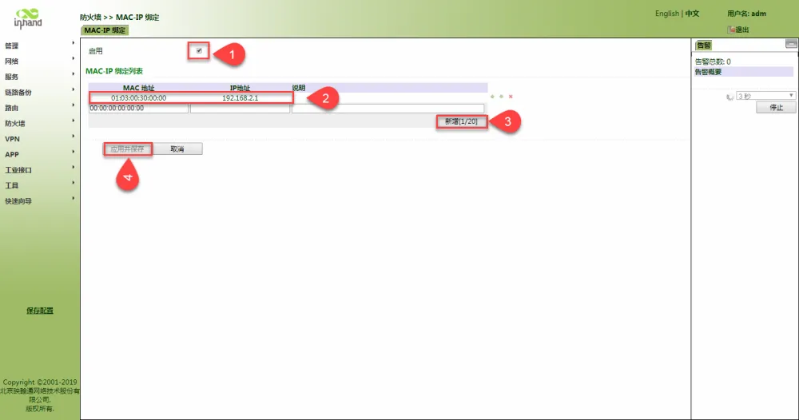

<strong>图 4-52 MAC-IP绑定配置</strong>

## 4.6 路由

### 4.6.1 静态路由

根据实际需求填写目的网络、子网掩码、接口或网关。

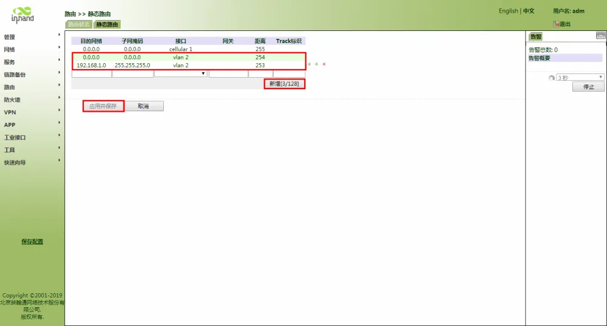

<strong>图 4-53 静态路由配置</strong>

### 4.6.2 动态路由

**情景**：两个局域网之间建立动态路由，使其可以相互通信。

<strong>图 4-54 动态路由组网拓扑</strong>

### RIP

RIP（Routing Information Protocol）是一种较为简单的内部动态路由协议，主要用于规模较小的网络中。

**配置步骤（以VG710_A和VG710_B为例）：**

1. 配置VG710_A网关：进入【路由】→【动态路由】→【RIP】，启用RIP协议，在"网络"中配置VG710_A，宣告路由条目。

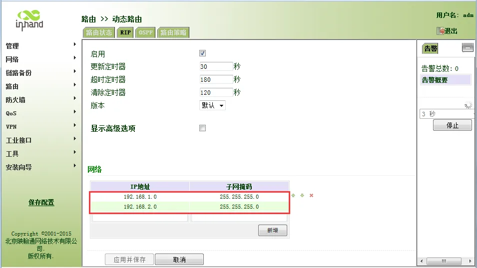

<strong>图 4-55 RIP配置（网关A）</strong>

2. 配置VG710_B网关。

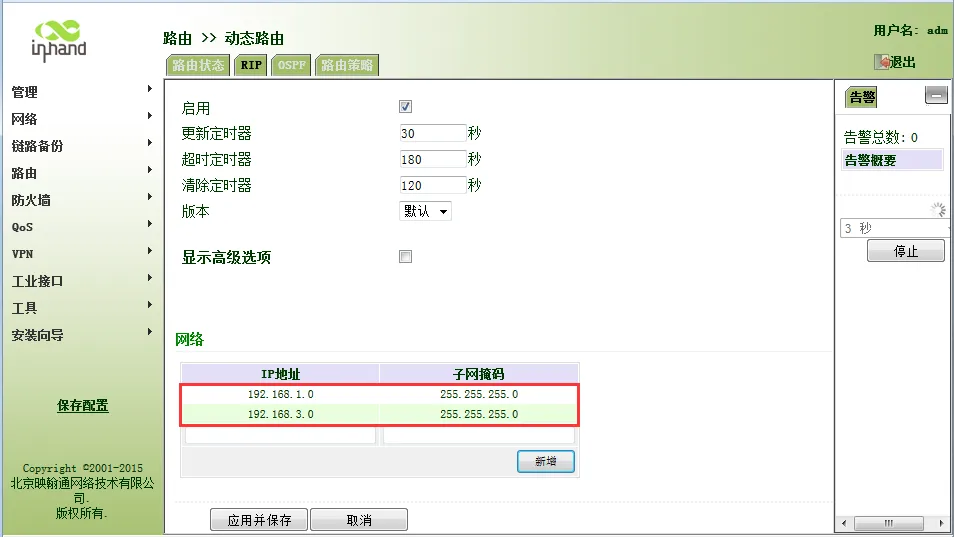

<strong>图 4-56 RIP配置（网关B）</strong>

3. 配置完成后，如果PC1和PC2可以相互通信，则动态路由添加成功。

### OSPF

OSPF（Open Shortest Path First，开放最短路径优先）是一个基于链路状态的内部网关协议，主要用于规模较大的网络中。

**配置步骤：**

1. 配置VG710_A网关：进入【路由】→【动态路由】→【OSPF】，"路由ID"自定义填写（必须为IP格式），在"网络"表中配置VG710_A，宣告路由条目。

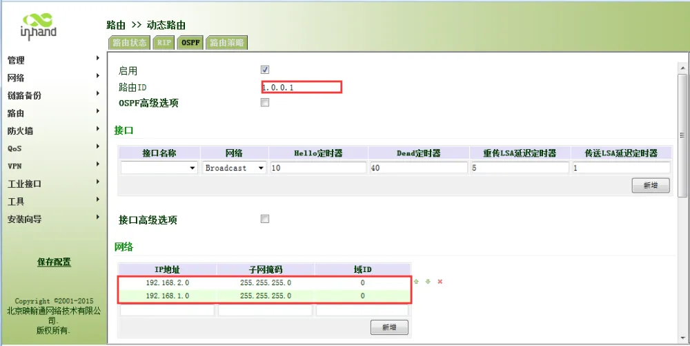

<strong>图 4-57 OSPF配置（网关A）</strong>

2. 配置VG710_B参数。

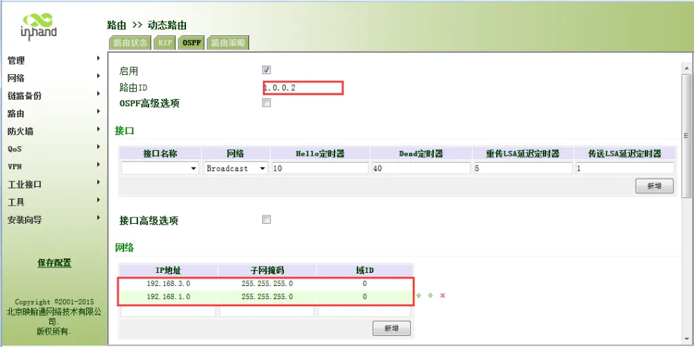

<strong>图 4-58 OSPF配置（网关B）</strong>

3. 配置完成后，如果PC1和PC2可以相互通信，则动态路由添加成功。

### BGP

BGP（Border Gateway Protocol，边界网关协议）配置步骤：

1. 配置VG710_A网关：进入【路由】→【动态路由】→【BGP】，勾选"启用"，"AS"号自定义填写。

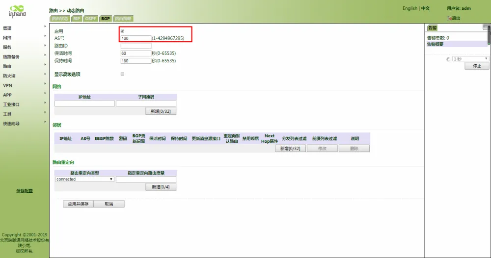

<strong>图 4-59 BGP启用</strong>

2. 在"邻居"栏点击"新增"，配置VG710_B的IP（192.168.1.2）和AS号，点击"应用并保存"。

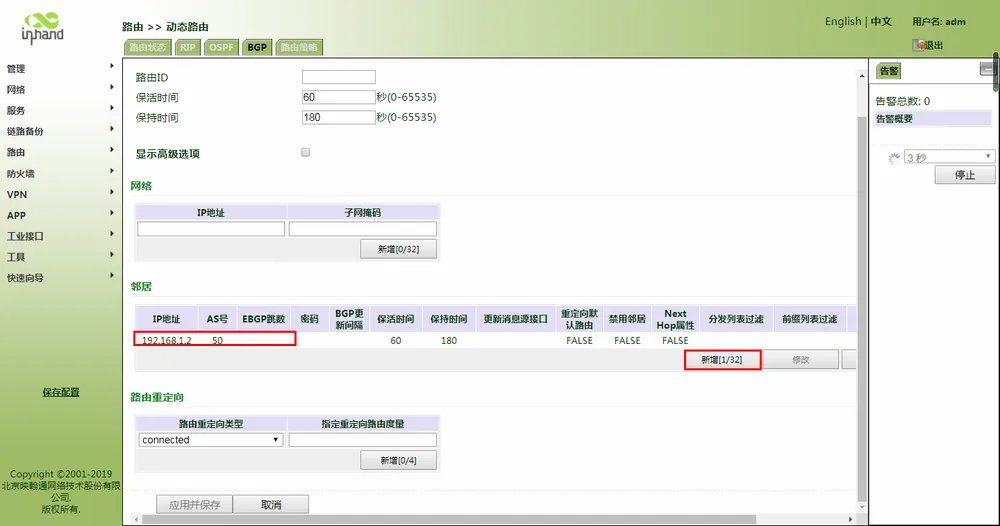

<strong>图 4-60 BGP邻居配置</strong>

3. "路由ID"自定义填写（必须为IP格式），在"网络"栏配置VG710_A，点击"新增"，宣告路由条目，然后点击"应用并保存"。

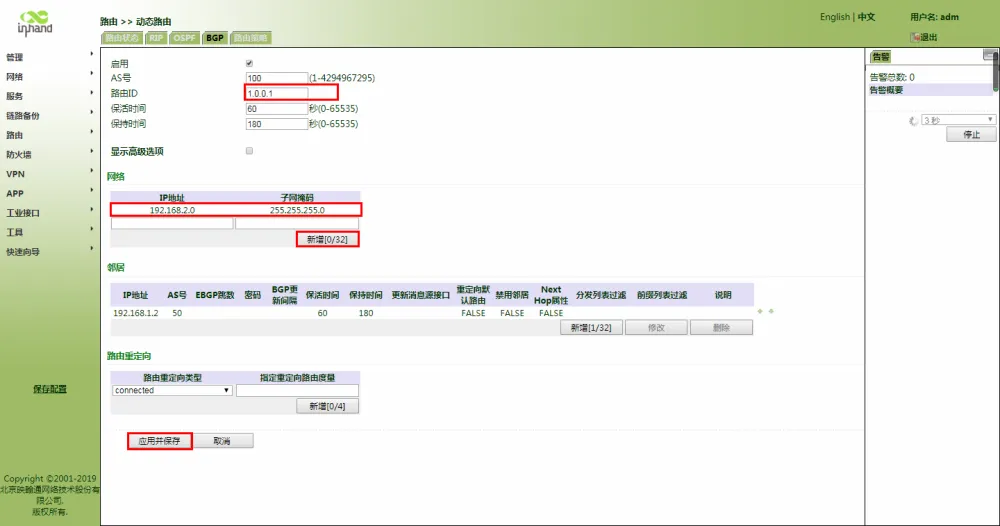

<strong>图 4-61 BGP网络配置（网关A）</strong>

4. 配置VG710_B参数，与VG710_A参数相同或对应。

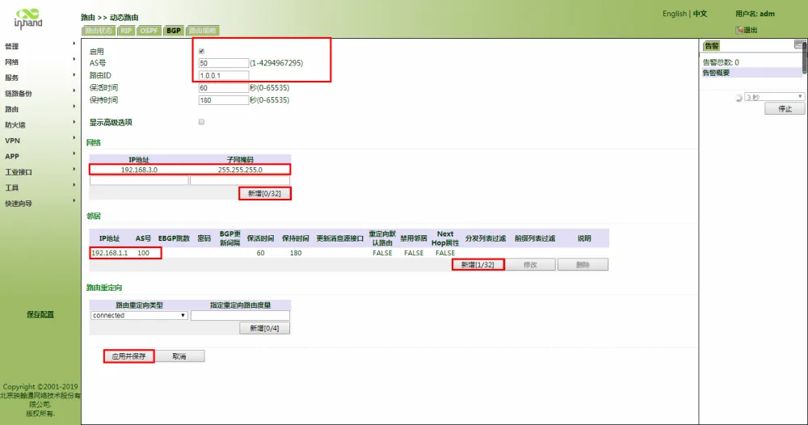

<strong>图 4-62 BGP配置（网关B）</strong>

5. 配置完成后，如果PC1和PC2可以相互通信，则动态路由添加成功。

## 4.7 链路备份

### 4.7.1 SLA

SLA（Service Level Agreement）用于探测网关连接到ISP的链路是否出现故障。

**新增SLA探测的配置方法：**

进入【链路备份】→【SLA】→【新增】，"目的地址"输入被探测IP地址，其他参数自定义填写，点击"新增"，然后点击"应用并保存"。

- **超时**（单位：毫秒）：超时多长时间算一次探测失败
- **次数**：探测失败多少次判定为链路故障

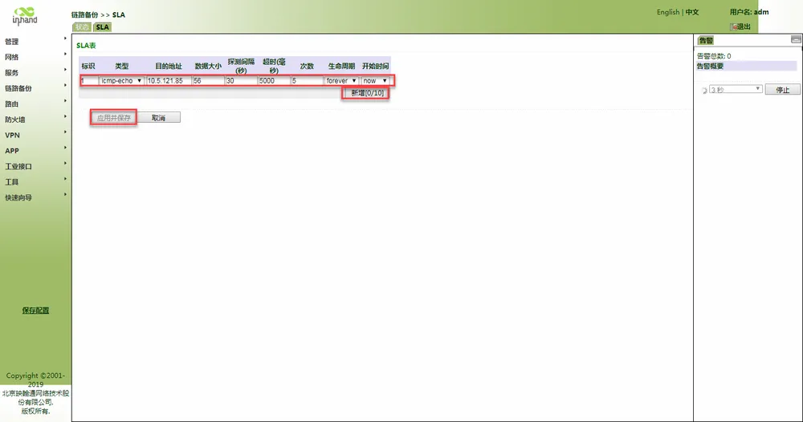

<strong>图 4-63 SLA探测配置</strong>

### 4.7.2 Track模块

可与Track模块实现联动功能的应用模块包括：VRRP、静态路由、接口备份。探测成功时，对应Track项的状态为Positive；失败时为Negative。

**新增Track的配置方法：**

进入【链路备份】→【Track模块】→【Track表】，"标识"自定义填写，"类型"选择sla/interface/vrrp，"SLA/VRRP标识"根据SLA表中的标识填写，"异常状态延时"和"正常状态延时"自定义填写（0代表立即切换），点击"新增"，然后点击"应用并保存"。

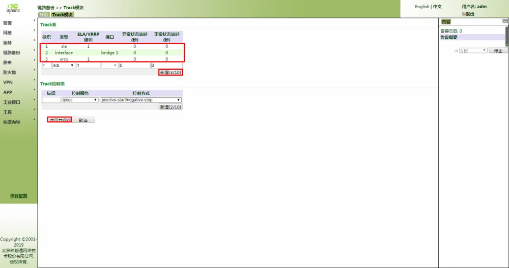

<strong>图 4-64 Track模块配置</strong>

**新增IPsec Track的配置方法：**

进入【链路备份】→【Track模块】→【Track表】，"标识"自定义填写。"positive-start/negative-stop"表示Track探测状态为Positive时启动IPsec服务，状态为Negative时停止IPsec服务。

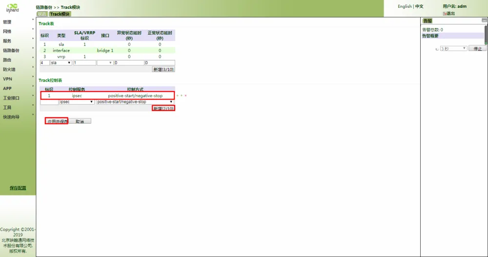

<strong>图 4-65 IPsec Track配置</strong>

### 4.7.3 VRRP

VRRP（Virtual Router Redundancy Protocol，虚拟路由冗余协议）用于在多个网关之间实现主备切换。

**情景**：多个网关同时连接到一个网络中，其中A作为主网关使用，B作为备份。当A网关出现故障时，B网关可替代A暂时作为主网关使用。

**组网需求**：

- 备份组号为1
- 备份组虚拟网关IP地址为192.168.2.254/24
- 网关A做Master
- 网关B做备份路由，允许抢占

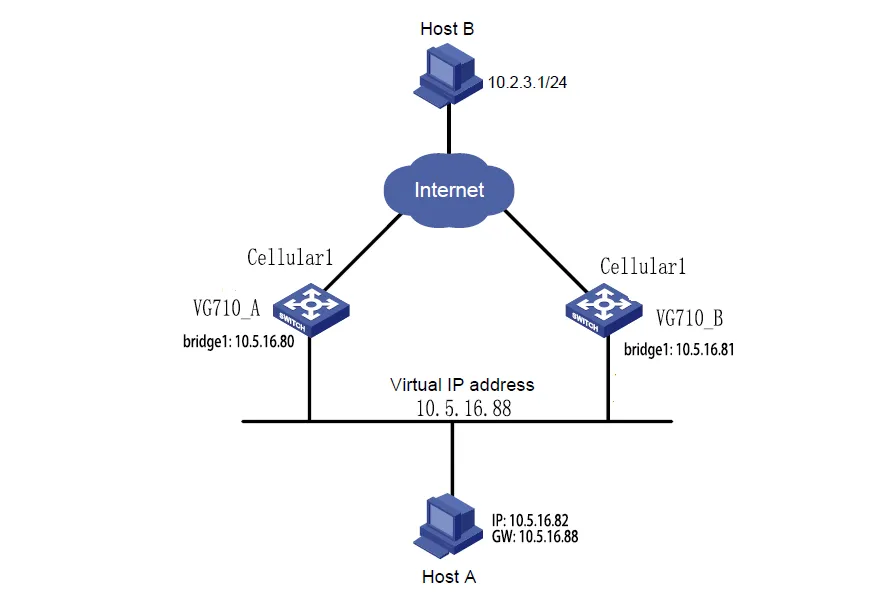

<strong>图 4-66 VRRP组网图</strong>

| 网关 | 与Host A相连以太网接口 | 接口IP地址 | 优先级 | 工作模式 |
| :---: | :---: | :---: | :---: | :---: |
| VG710_A | bridge1 | 10.5.16.80 | 110 | 抢占 |
| VG710_B | bridge1 | 10.5.16.81 | 100 | 抢占 |

**配置步骤：**

1. 配置VG710_A：进入【链路备份】→【VRRP】，"虚拟路由ID"自定义填写，选择网关接口，输入虚拟IP地址，配置接口优先级为110，点击"新增"。

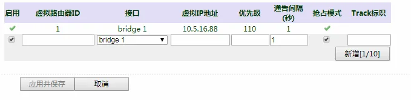

<strong>图 4-67 VRRP配置（网关A）</strong>

进入"VRRP状态"界面查看状态。

<strong>图 4-68 VRRP状态（网关A）</strong>

2. 配置VG710_B：进入【链路备份】→【VRRP】，配置接口优先级为100，点击"新增"。

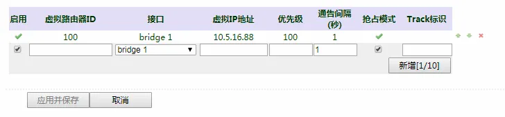

<strong>图 4-69 VRRP配置（网关B）</strong>

<strong>图 4-70 VRRP状态（网关B）</strong>

正常情况下，VG710_A行使网关职能。当VG710_A关机或出现故障时，VG710_B接替网关职能。设置抢占方式的目的是当VG710_A恢复工作后，能继续成为Master行使网关职能。

### 4.7.4 接口备份

**情景**：VG710通过Wi-Fi上网，创建网关接口备份，使VG710在Wi-Fi故障时通过蜂窝拨号上网。

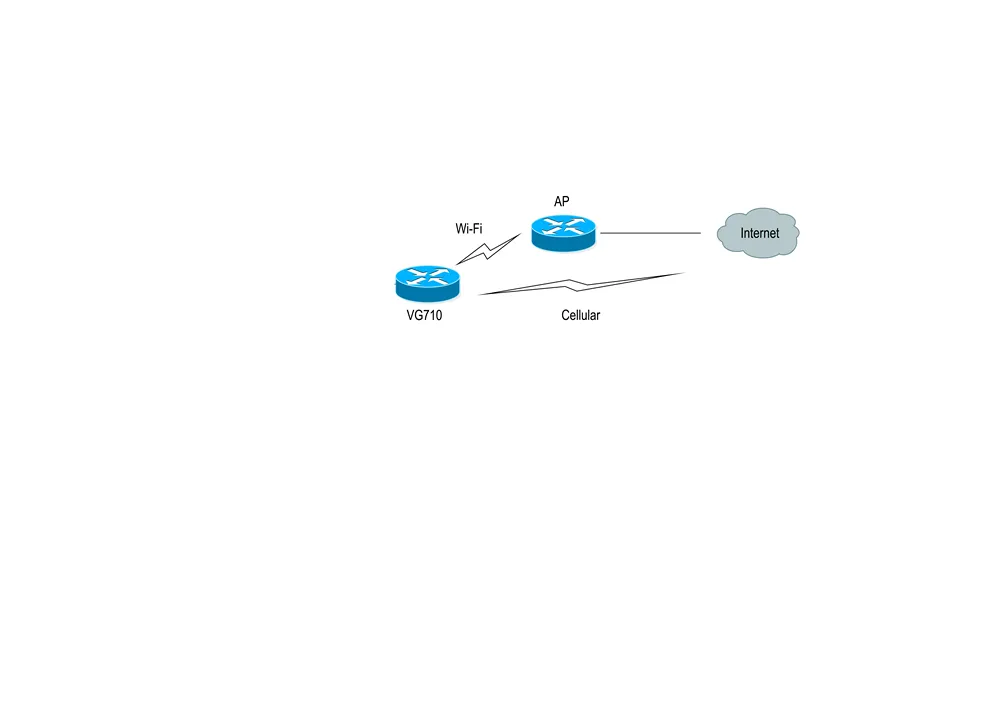

<strong>图 4-71 接口备份拓扑</strong>

**配置步骤：**

1. 使VG710通过Wi-Fi上网。

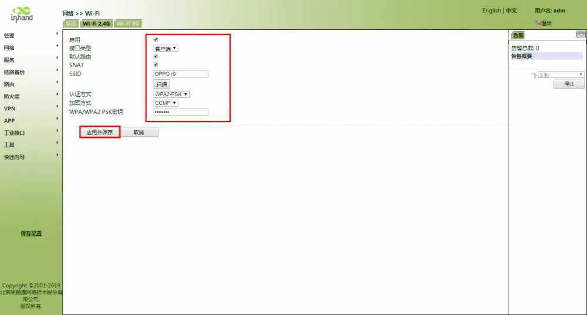

<strong>图 4-72 Wi-Fi联网</strong>

2. 进入【链路备份】→【SLA】→【SLA表】→【新增】，新增一条ICMP探测，IP地址设置为公网或专网内可ICMP探测的主机地址（如119.75.217.109），点击"应用并保存"。

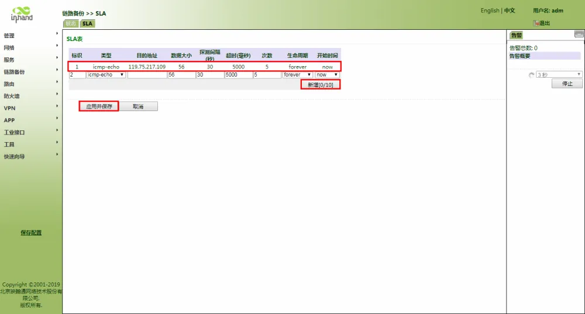

<strong>图 4-73 SLA ICMP探测配置</strong>

3. 进入【链路备份】→【Track模块】→【Track表】→【新增】，新增一条Track，"类型"选择interface，"接口"选择dot11radio1，点击"新增"，然后点击"应用并保存"。

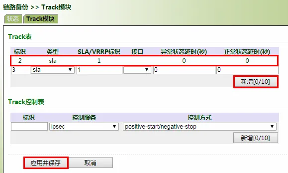

<strong>图 4-74 Track接口配置</strong>

4. 进入【链路备份】→【接口备份】→【新增】，设置dot11radio1为主接口，cellular1为备份接口，点击"应用并保存"。

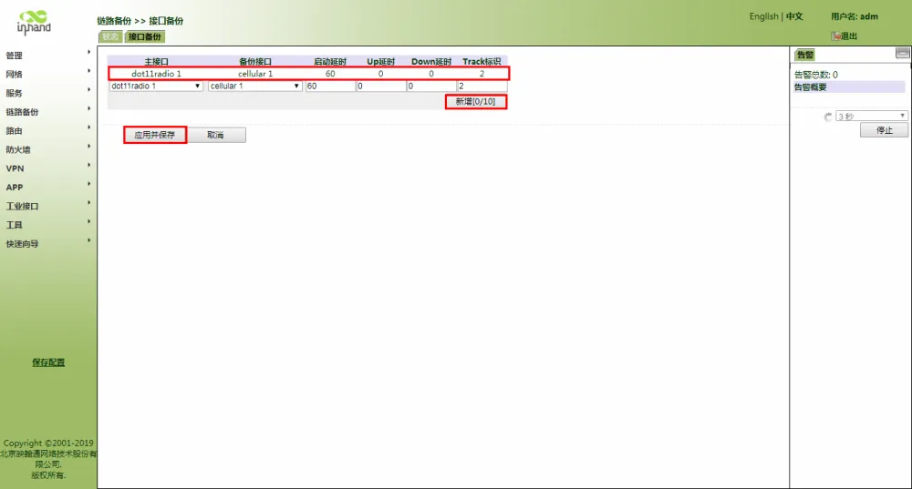

<strong>图 4-75 接口备份配置</strong>

5. 进入【路由】→【静态路由】→【新增】，新增2条dot11radio1和cellular1接口访问网络的路由，其中"距离"数值越小越优先。

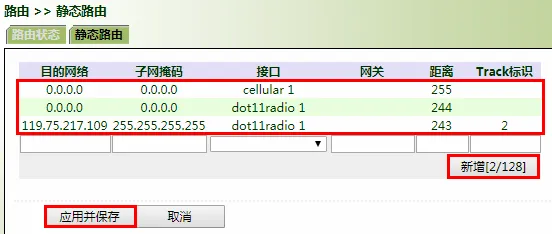

<strong>图 4-76 静态路由配置</strong>

6. 制造Wi-Fi上网故障后，根据预设的链路探测策略，VG710会立刻通过cellular口拨号上网；当Wi-Fi恢复正常后，VG710又会立即切换到通过Wi-Fi上网。

## 4.8 快速向导

快速向导模块将常用的通讯参数设置集中在此处，以简化操作流程。

### 4.8.1 新建拨号

普通上网卡插入后，进入【快速向导】→【新建拨号】，点击"应用并保存"。完成后进入系统状态栏查看设备网络状态为"已连接"。

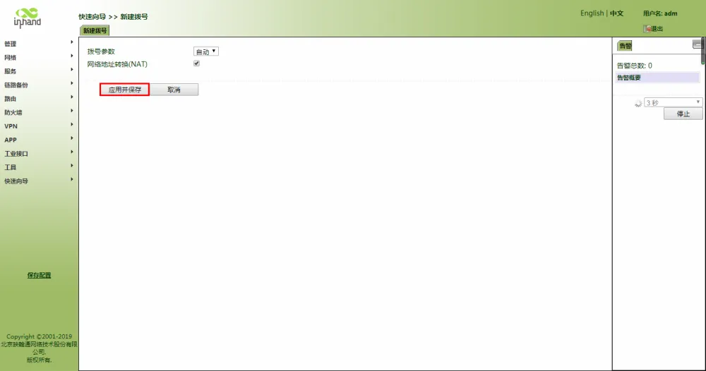

<strong>图 4-77 新建拨号配置</strong>

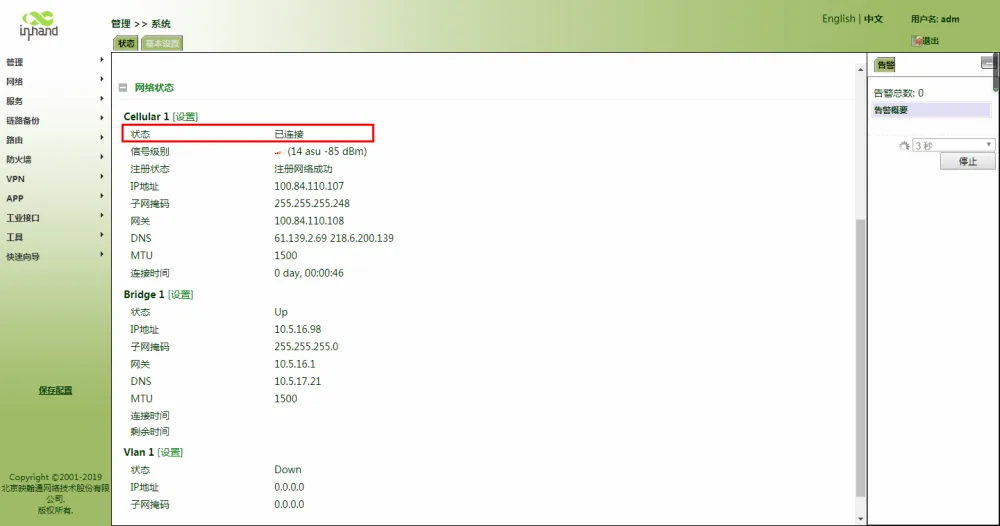

<strong>图 4-78 拨号成功状态</strong>

### 4.8.2 新建IPsec隧道

用于使网关与网络中的其他设备或云平台建立专用虚拟隧道。

**配置方法：**

进入【快速向导】→【新建IPsec隧道】，"接口名称"选择要建立隧道的接口（bridge：桥接口；cellular：拨号口；dot11radio：Wi-Fi接口），"对端地址"输入对端IP地址，输入隧道两端的子网地址和掩码。在第一阶段填写隧道两端的标识名和连接密钥，点击"应用并保存"。

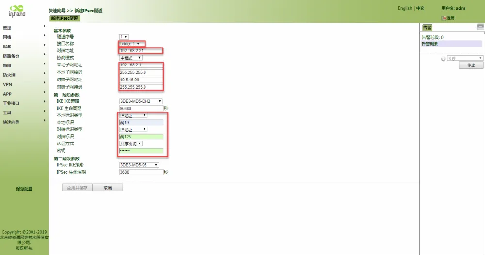

<strong>图 4-79 快速新建IPsec隧道</strong>

### 4.8.3 IPsec专家配置

本功能仅供特定用户使用，如需使用此功能，可联系技术支持。

### 4.8.4 新建L2TPv2隧道

**配置方法：**

填写L2TP服务器参数、本地/远端地址等，点击"应用并保存"。

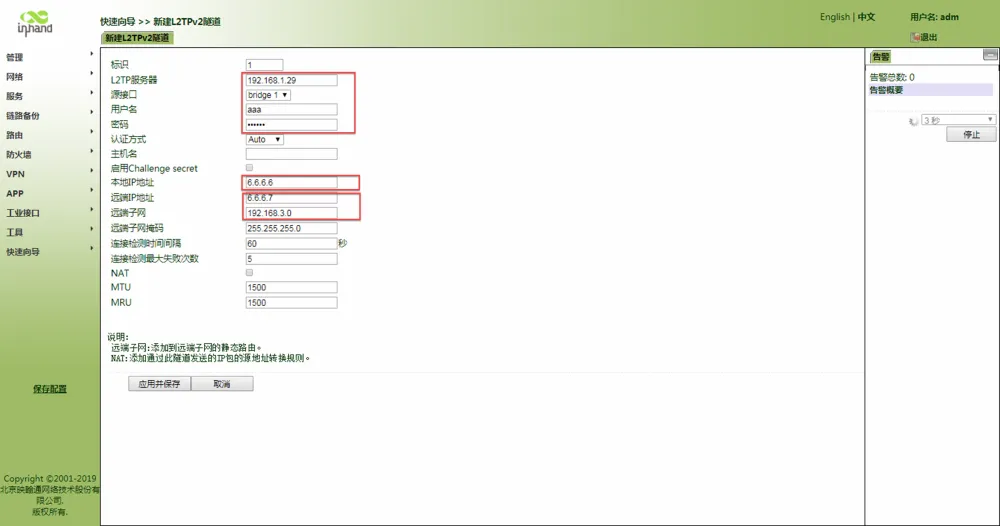

<strong>图 4-80 新建L2TPv2隧道</strong>

### 4.8.5 新建端口映射

端口映射（可以理解为："电话转分机"，将外部对特定端口的访问请求转发到内部指定的设备上）将内网中主机的一个端口映射到外网主机的一个端口，提供相应服务。

**情景**：内网中有一台Web服务器，外网用户无法直接访问。通过在网关上设置端口映射，外网用户从网关cellular接口访问1000端口时，网关自动将数据转发到内网Web服务器的80端口。

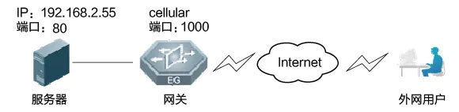

<strong>图 4-81 端口映射拓扑</strong>

**配置方法：**

进入【快速向导】→【新建端口映射】，"外部接口"填入网关接口，"服务端口"填入网关端口，"内端地址"填入内部主机地址，"内部端口"填入内部主机端口，点击"应用并保存"。

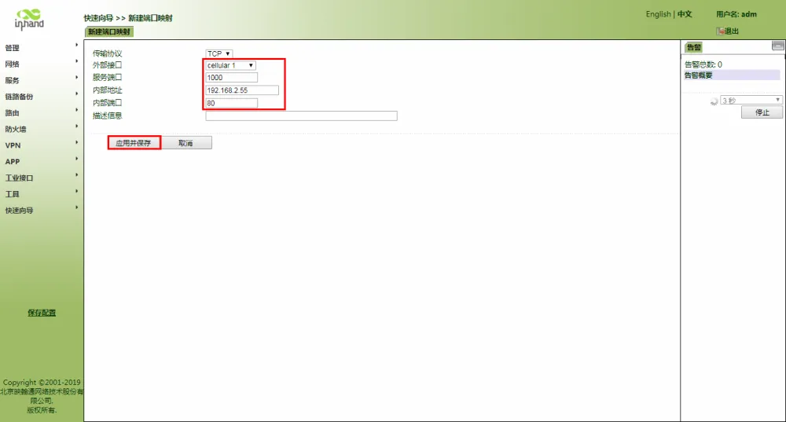

<strong>图 4-82 端口映射配置</strong>

## 4.9 APP管理

### 4.9.1 APP（Python APP管理）

1. 进入【APP】→【APP】→【APP管理】，点击"开启Python APP管理"，点击"应用并保存"。

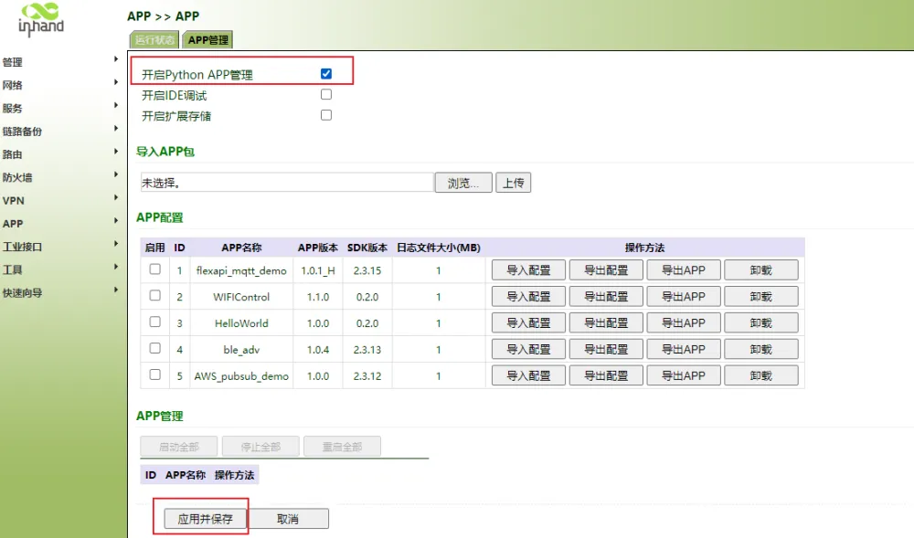

<strong>图 4-83 Python APP管理启用</strong>

2. 点击"运行状态"，APP管理运行状态显示"在运行"，表示运行成功。

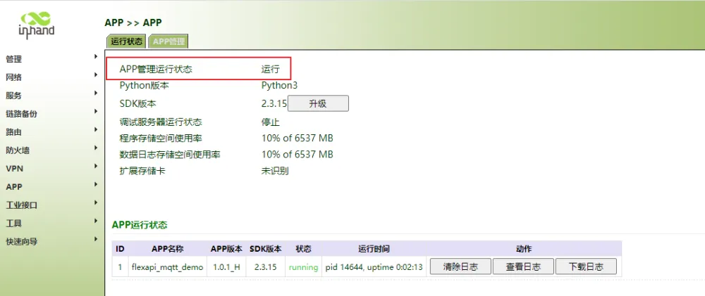

<strong>图 4-84 APP运行状态</strong>

### 4.9.2 Docker

1. 进入【APP】→【Docker】→【启用】，在输入框中输入用户名、密码和端口号，点击"应用并保存"。

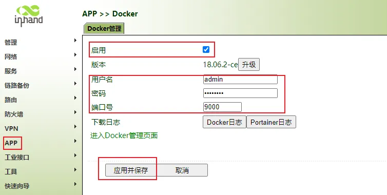

<strong>图 4-85 Docker配置</strong>

### 4.9.3 第三方云平台

网关设备以客户端形式连接云平台实现通信，根据配置实时获取数据，达到数据交互的目的。

### 通过MQTT协议连接云平台

1. 进入【APP】→【第三方云平台】→【MQTT】→【启用】，选择云平台服务器地址和端口，点击"应用并保存"。

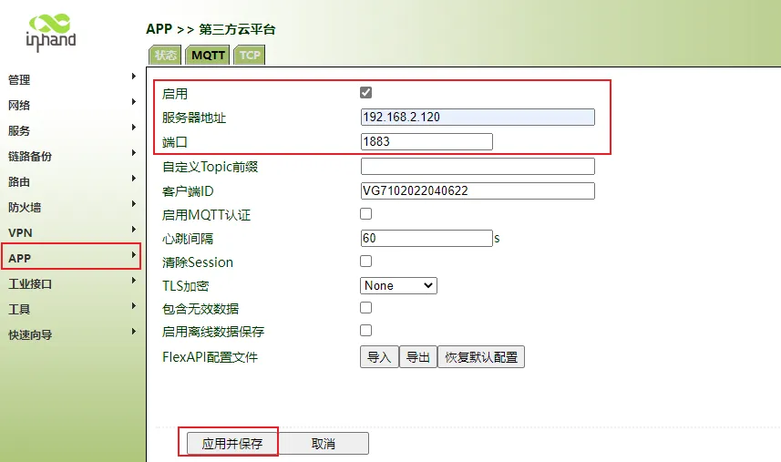

<strong>图 4-86 MQTT连接配置</strong>

2. 点击"状态"，连接状态为"已连接"表示连接成功。

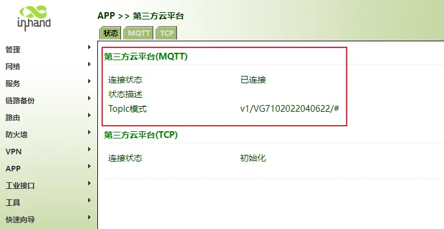

<strong>图 4-87 MQTT连接状态</strong>

> **注意**：如果服务器需要认证和加密，需在MQTT配置中启用MQTT认证和TLS加密。

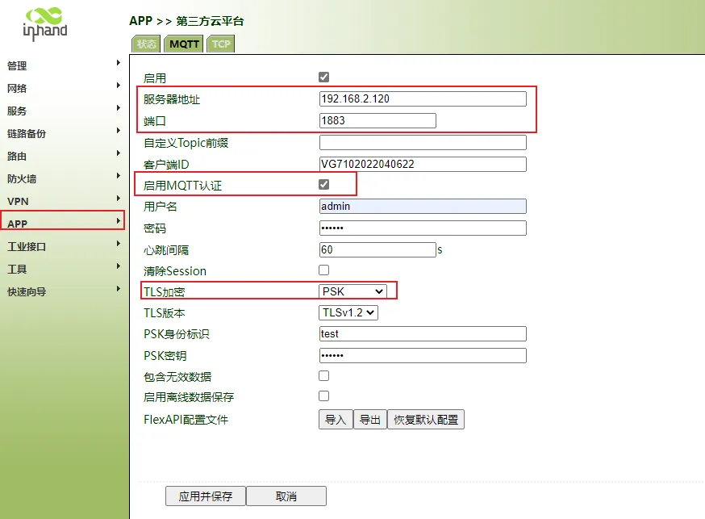

<strong>图 4-88 MQTT认证和TLS加密配置</strong>

### 通过TCP协议连接云平台

1. 进入【APP】→【第三方云平台】→【TCP】→【启用】，选择云平台服务器地址和端口，点击"应用并保存"。

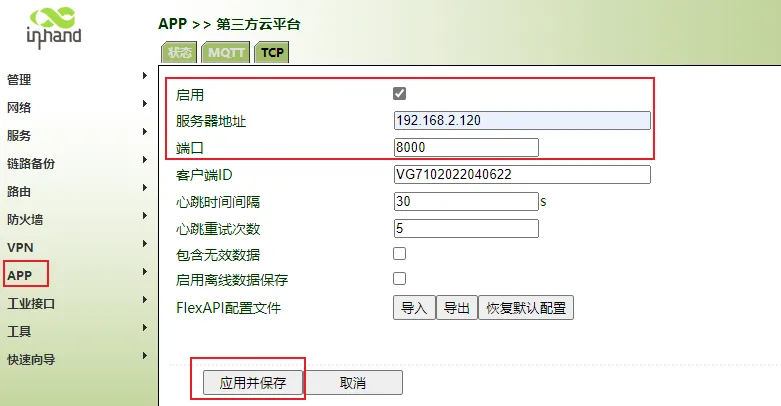

<strong>图 4-89 TCP连接配置</strong>

2. 点击"状态"，连接状态为"已连接"表示连接成功。

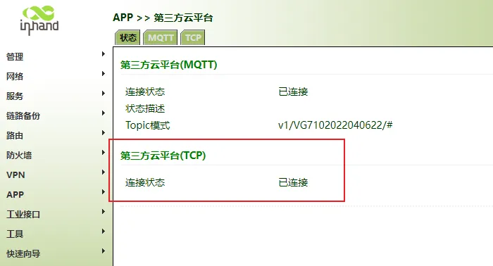

<strong>图 4-90 TCP连接状态</strong>

### 4.9.4 本地MQTT代理

网关设备作为MQTT（Message Queuing Telemetry Transport，可以理解为：物联网设备之间轻量级的"消息传递协议"）服务器代理消息，用户通过MQTT客户端订阅信息。

1. 进入【APP】→【本地MQTT代理】，选择"启用本机/本机 & LAN"，点击"应用并保存"。

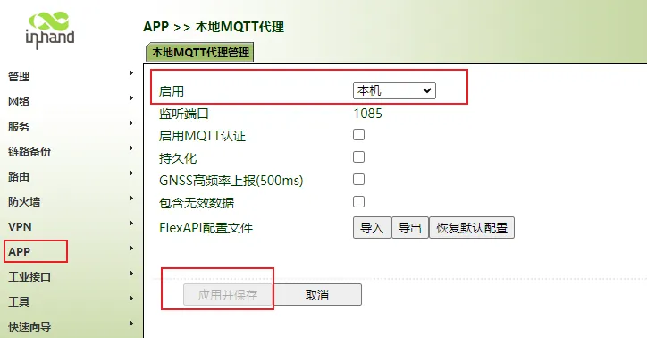

<strong>图 4-91 本地MQTT代理启用</strong>

2. 使用MQTT客户端填入服务器地址、端口、认证等信息。

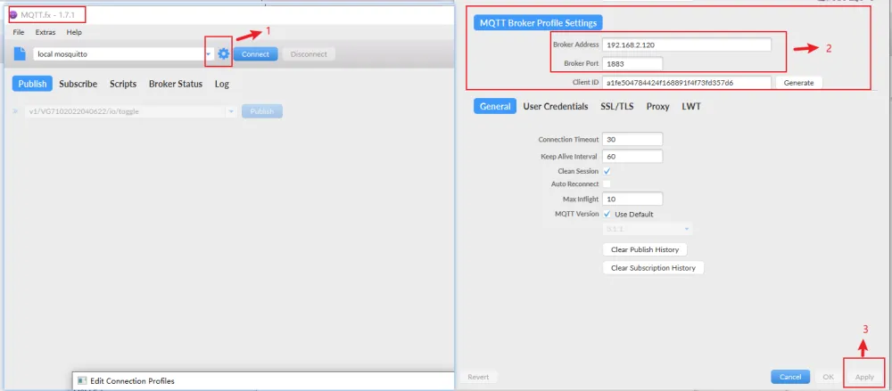

<strong>图 4-92 MQTT客户端信息</strong>

3. 点击"connect"连接，图标变绿表示连接成功。根据topic文档订阅信息，网关以JSON格式返回数据。

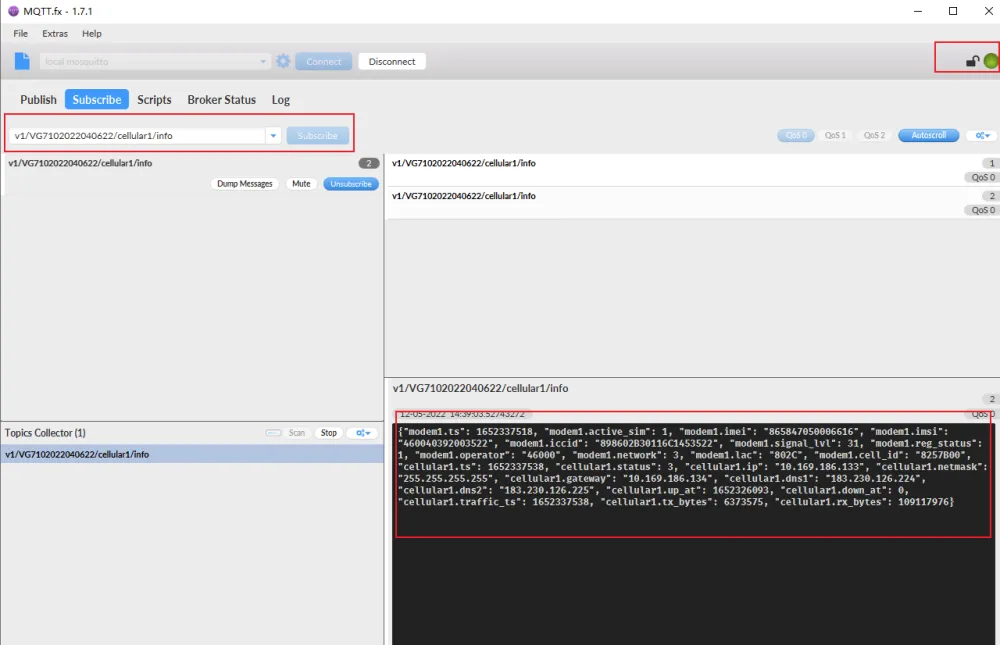

<strong>图 4-93 MQTT订阅蜂窝信息</strong>

### 4.9.5 REST API

除使用MQTT和TCP获取数据外，用户还可使用REST API根据接口文档调用数据。

1. 进入【APP】→【REST API】，选择"启用本机 & LAN"，点击"应用并保存"。

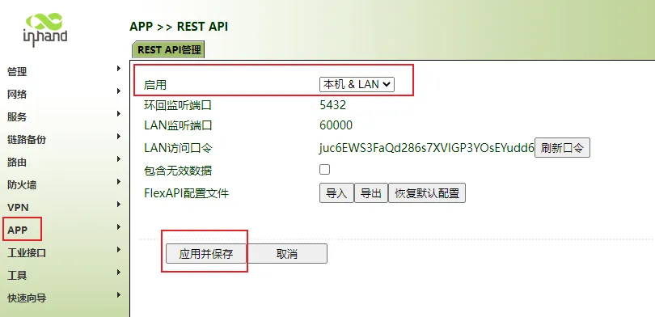

<strong>图 4-94 REST API启用</strong>

2. 根据接口文档使用工具（如Postman）调用接口获取数据：填写接口文档中的URL和TOKEN，注意请求类型（GET/POST），点击发送，网关以JSON格式返回对应数据。

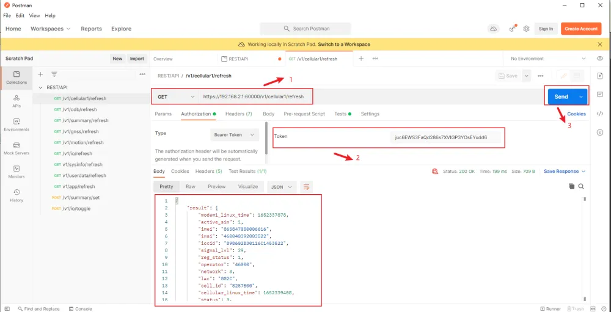

<strong>图 4-95 REST API调用示例</strong>

### 4.9.6 Azure IoT Edge

进入【APP】→【Azure IoT Edge】→【启用】，点击"应用并保存"。

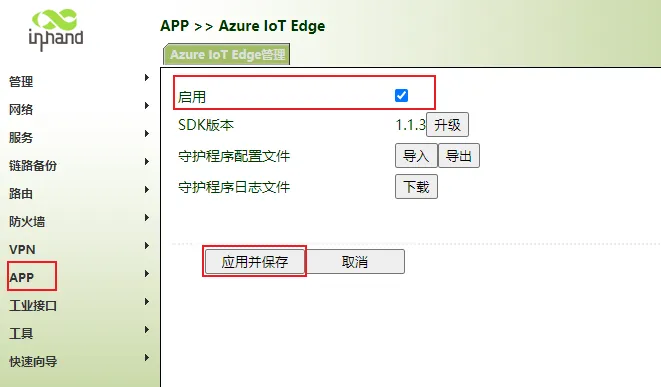

<strong>图 4-96 Azure IoT Edge配置</strong>

> **注意**：此功能依赖Docker，启用前需先开启Docker功能。

### 4.9.7 自定义数据

1. 进入【APP】→【自定义数据】→【自定义数据管理】，输入名称和对应的值，点击"新增"，然后点击"应用并保存"。

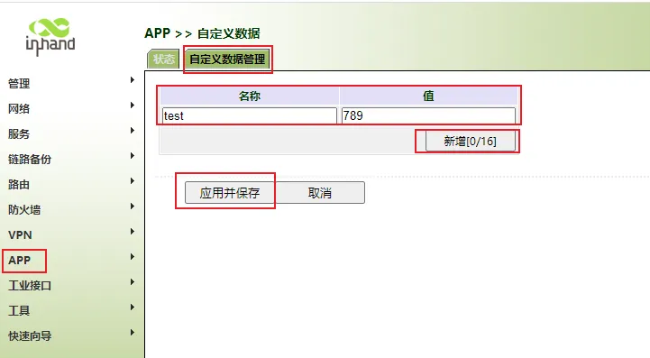

<strong>图 4-97 自定义数据配置</strong>

2. 点击"状态"，如果数据存在于状态栏中，表示添加成功。

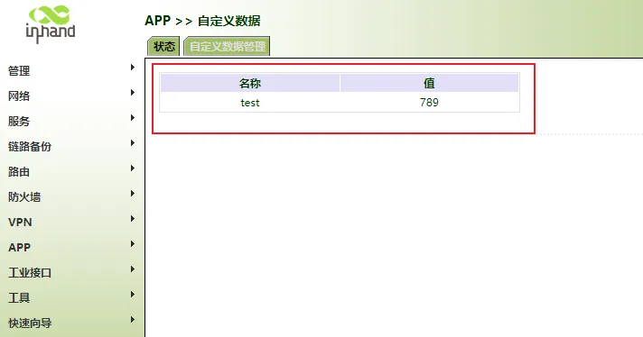

<strong>图 4-98 自定义数据状态</strong>

## 4.10 设备远程监控平台

**配置方法：**

1. 进入【管理】→【设备远程监控平台】→【设备远程监控平台】，勾选"启用"，选择云平台服务器地址并输入云平台注册账户及车牌号，点击"应用并保存"。

<strong>图 4-99 设备远程监控平台配置</strong>

2. 点击"状态"，显示"Connected"表示连接云平台成功。

## 4.11 工业接口（串口）

VG710工业接口包括RS232（可以理解为：一种"短距离点对点"的串口通信标准）串口、RS485（可以理解为：一种"远距离多节点"的串口通信标准）串口和IO接口。

### 4.11.1 DTU

DTU（Data Transfer Unit，可以理解为："数据搬运工"，负责将串口数据转换成网络数据进行传输）功能说明：RS232采用全串口通讯，支持硬件流控；RS485采用半双工通信，能远距离传输串行通信数据。

**DTU功能的配置方法：**

1. 启用DTU1（RS232）或DTU2（RS485）。
2. 配置网关接口与工业设备的连接参数，网络链路两端参数保持一致才能通信。

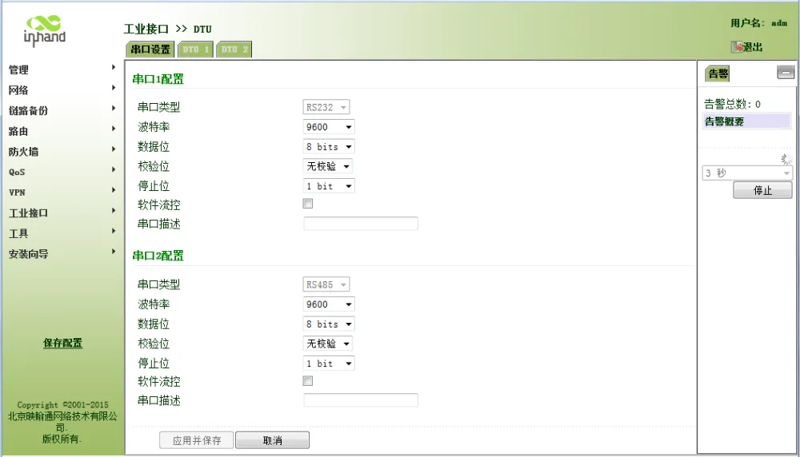

<strong>图 4-100 DTU连接参数配置</strong>

3. 填入服务器的IP地址和传输协议（TCP/UDP）。

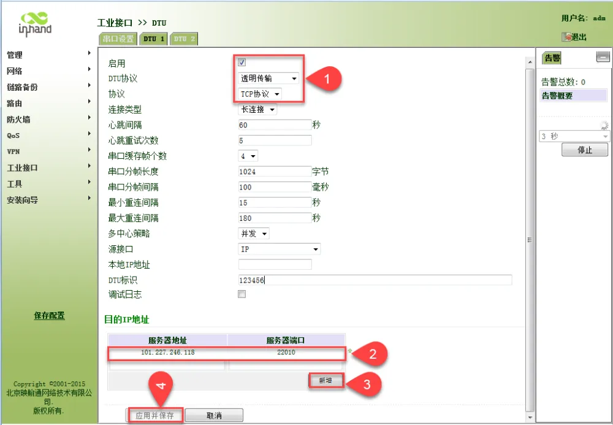

<strong>图 4-101 DTU服务器参数</strong>

4. 创建并启用服务器，网关通过DTU功能连接服务器，连接成功后网关自动向服务器发送DTU标识（DTU标识参数为空则不发送）。

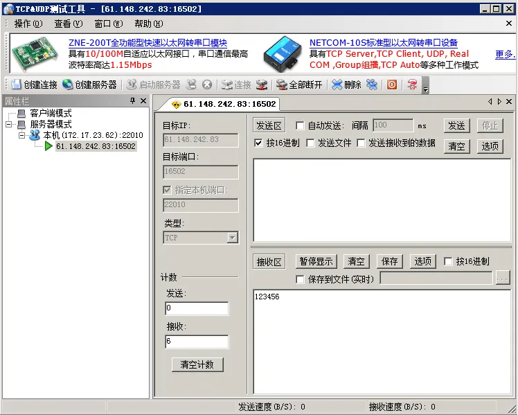

<strong>图 4-102 DTU服务器启用</strong>

5. 连接网关的PC通过DTU功能和服务器可以相互发送数据。

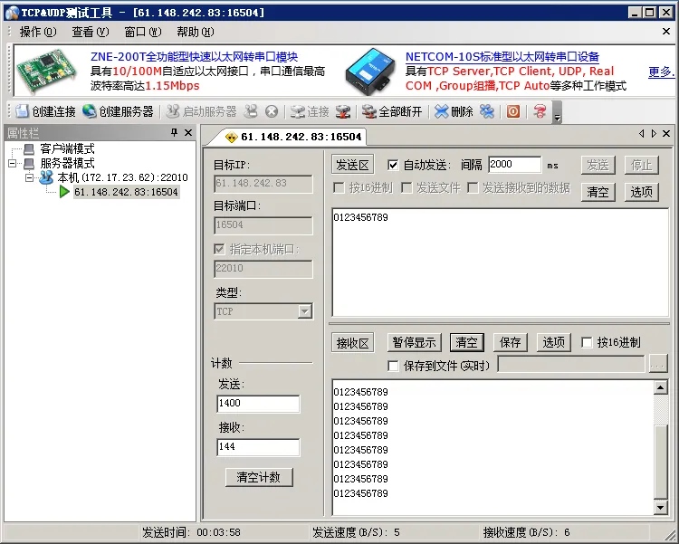

<strong>图 4-103 DTU数据发送</strong>

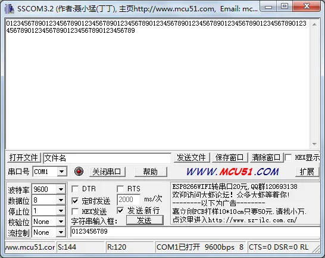

<strong>图 4-104 DTU数据接收</strong>

### 4.11.2 IO接口

IO（Input/Output，可以理解为：设备的"感官和手脚"，用于接收外部信号输入或控制外部设备输出）接口支持6路模拟输入（AI）、6路数字输入（DI）、4路数字输出（DO），模拟输入与数字输入共用接口。数字量对应两个状态：高（1）、低（0）。

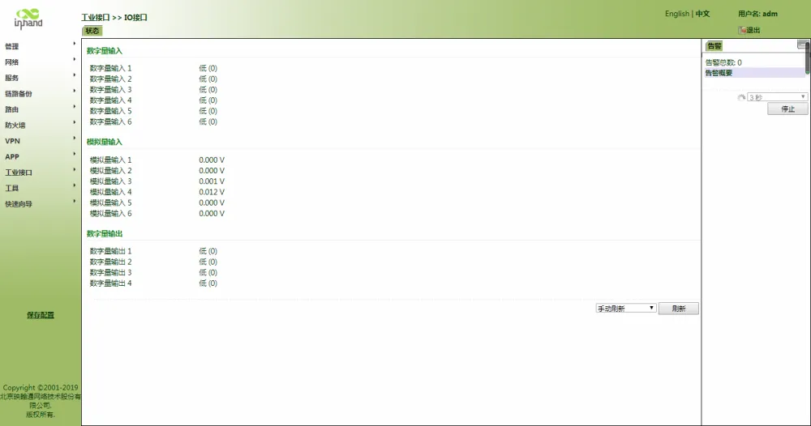

<strong>图 4-105 IO接口状态</strong>

## 4.12 系统管理

### 4.12.1 系统状态

进入【管理】→【系统】→【状态】查看设备当前系统状态和网络状态。

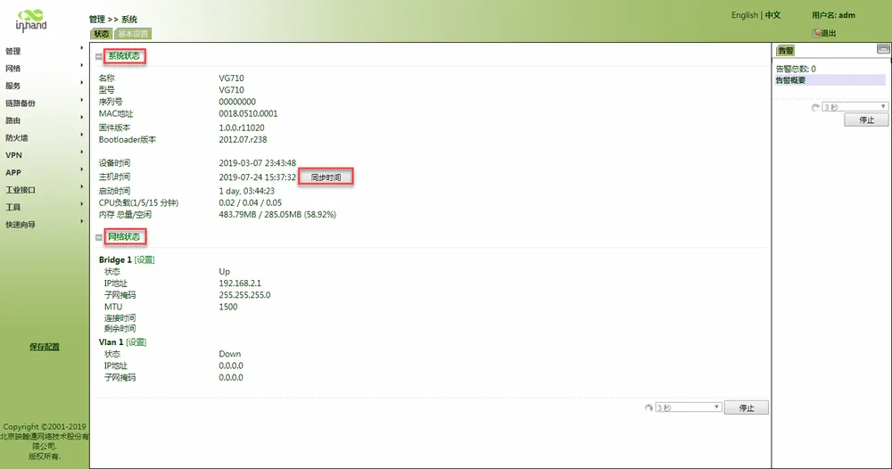

<strong>图 4-106 系统状态</strong>

进入"基本设置"可修改系统语言和网关名称。

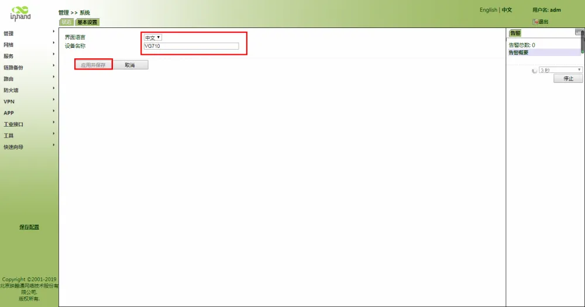

<strong>图 4-107 基本设置</strong>

### 4.12.2 系统时间

为保证设备与其他设备协调工作，需将系统时间配置准确。

**手动同步时间**：进入【管理】→【系统时间】→【系统时间】→【同步时间】，使网关和相连主机时间一致。

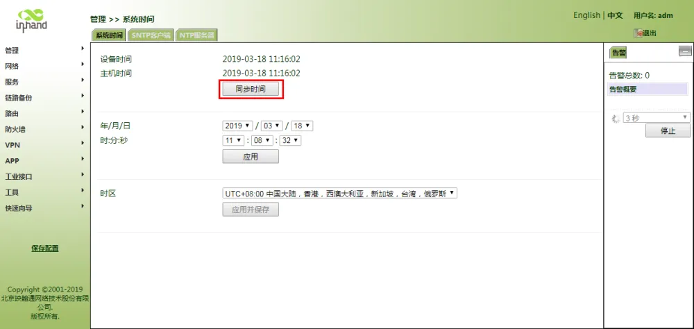

<strong>图 4-108 手动同步时间</strong>

也可通过【管理】→【系统】→【状态】同步时间。

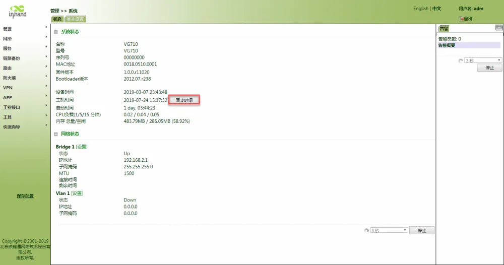

<strong>图 4-109 通过状态页同步时间</strong>

**自动同步时间**：进入【管理】→【系统时间】→【SNTP或NTP】→【启用】，同步设备与SNTP/NTP服务器时间。启用NTP可使网关对网络内所有设备进行时间同步。

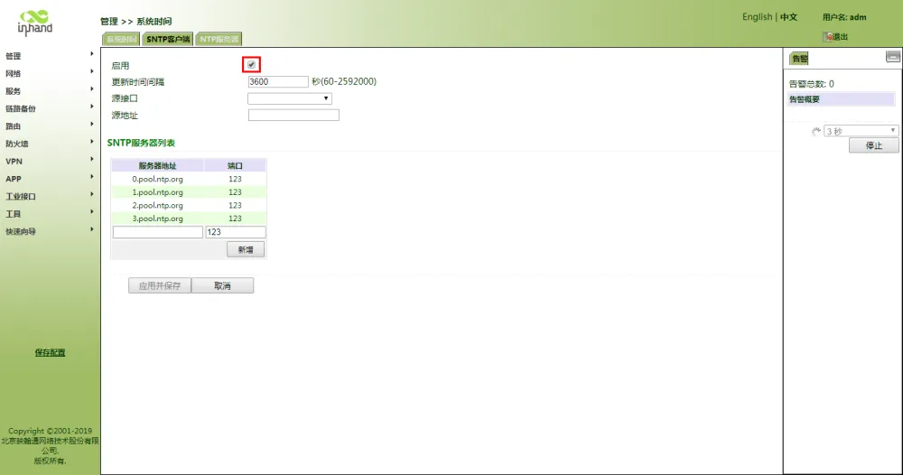

<strong>图 4-110 NTP自动同步配置</strong>

### 4.12.3 管理服务

当网关需使用HTTP、HTTPS、TELNET和SSH功能时，进入【管理】→【管理服务】启用对应服务，点击"应用并保存"。

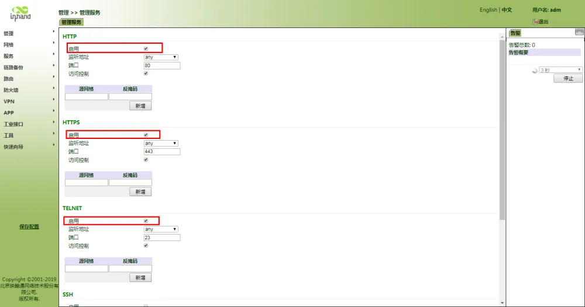

<strong>图 4-111 管理服务配置</strong>

### 4.12.4 用户管理

进入【管理】→【用户管理】，可创建用户、修改密码和删除用户。

- **超级用户**：由系统自动创建，用户名为adm，默认密码123456，具有所有访问权限。不能修改用户名或删除，但可修改密码。
- **普通用户**：由超级用户创建，可查看或修改网关配置。

|  说明：对于超级用户（adm），不能修改其用户名，也不能删除，但可以修改密码。 |
| --- |

### 4.12.5 AAA

AAA（Authentication, Authorization, Accounting，可以理解为：网络访问的"身份验证+权限管理+使用记录"三合一安全机制）提供认证、授权和计费三种安全服务。

- 认证：验证用户是否可获得网络访问权
- 授权：授权用户可使用哪些服务
- 计费：记录用户使用网络资源的情况

AAA通常采用"客户端—服务器"结构，具有良好的可扩展性，便于集中管理用户信息。

<strong>图 4-112 AAA架构</strong>

|  说明：radius、tacacs+、ldap指认证及授权服务器。local：网关本地用户名和密码。 |
| --- |

### Radius

Radius是一种分布式的、客户端/服务器结构的信息交互协议，能保护网络不受未授权访问的干扰。

**配置方法**：进入【管理】→【AAA】→【Radius】→【服务器列表】，填入服务器地址（域名/IP）、端口、认证密钥，点击"新增"，然后点击"应用并保存"。

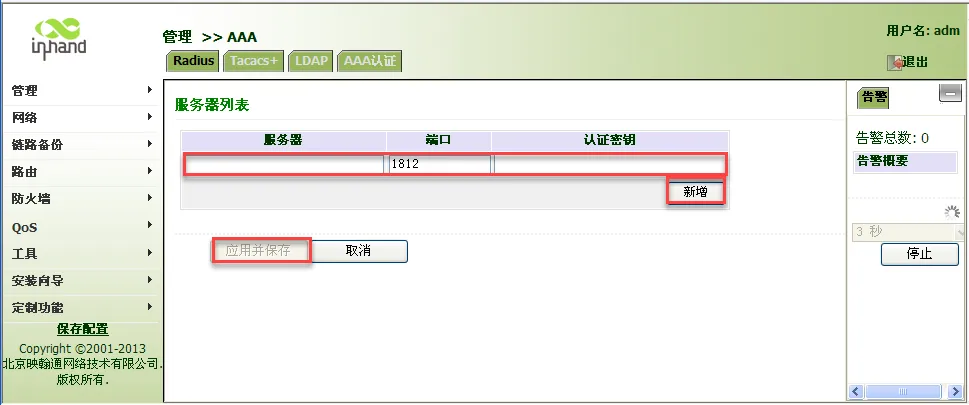

<strong>图 4-113 Radius服务器配置</strong>

### Tacacs+

Tacacs+是终端访问控制器访问控制系统，与Radius类似但使用TCP协议（Radius使用UDP）。主要用于PPP和VPDN接入用户及终端用户的认证、授权和计费。

**配置方法**：进入【管理】→【AAA】→【Tacacs+】→【服务器列表】，填入服务器地址（域名/IP）、端口、认证密钥，点击"新增"，然后点击"应用并保存"。

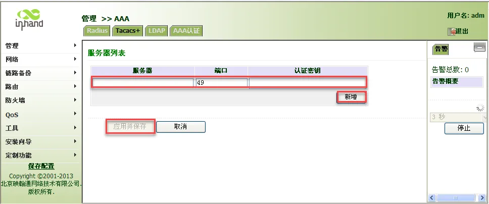

<strong>图 4-114 Tacacs+服务器配置</strong>

### LDAP

LDAP能够快速响应用户的查找需求，适用于大量并发认证场景。

**配置方法**：进入【管理】→【AAA】→【LDAP】→【服务器列表】，输入名称，填写服务器地址（域名/IP）和端口号，获取基准DN，设置用户名和密码，选择加密方式（None/SSL/StartTLS），点击"新增"，然后点击"应用并保存"。

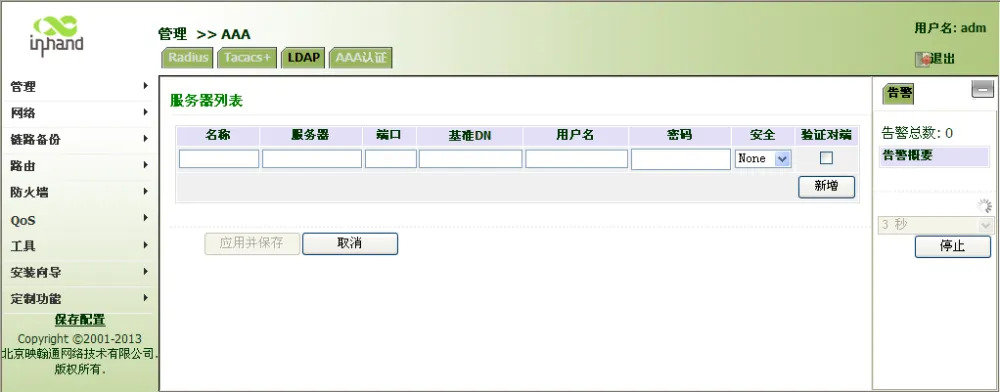

<strong>图 4-115 LDAP服务器配置</strong>

### AAA认证配置

**支持的认证方式**：不认证(none)、本地认证(local)、远端认证（Radius/Tacacs+/LDAP）。

**支持的授权方式**：不授权(none)、本地授权(local)、Tacacs+授权、Radius认证成功后授权、LDAP授权。

**配置方法**：进入【管理】→【AAA】→【AAA认证】。1/2/3分别对应Radius/Tacacs+/LDAP；认证1/2/3和授权1/2/3必须一一对应；同时配置多种认证时，优先级顺序为1>2>3。

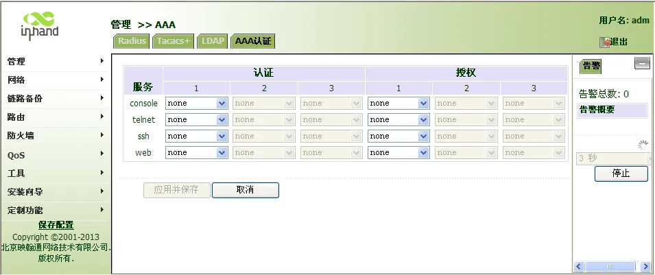

<strong>图 4-116 AAA认证配置</strong>

### 4.12.6 配置管理

- **导入配置**：进入【管理】→【配置管理】→【浏览】，选择配置文件，点击"导入"
- **备份运行配置到PC**：点击"备份running-config"
- **备份启动文件到PC**：点击"备份startup-config"
- **恢复出厂设置**：点击"恢复出厂设置"，点击"确认"

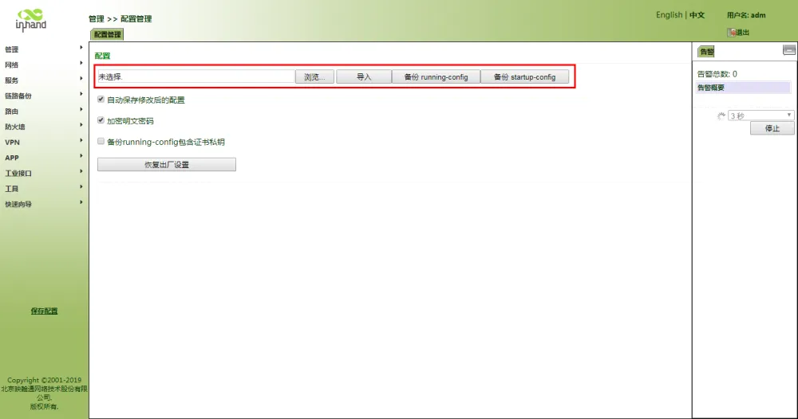

<strong>图 4-117 配置管理</strong>

### 4.12.7 SNMP

SNMP（Simple Network Management Protocol，可以理解为：网络设备的"远程监控协议"）Agent支持SNMPv1、SNMPv2c和SNMPv3版本。SNMPv1/v2c采用团体名认证，SNMPv3采用用户名和密码认证加密方式。

**启用SNMP的配置方法**：进入【管理】→【SNMP】→【SNMP】，勾选"启用SNMP功能"，选择v1c或v2c版本，点击"应用并保存"。

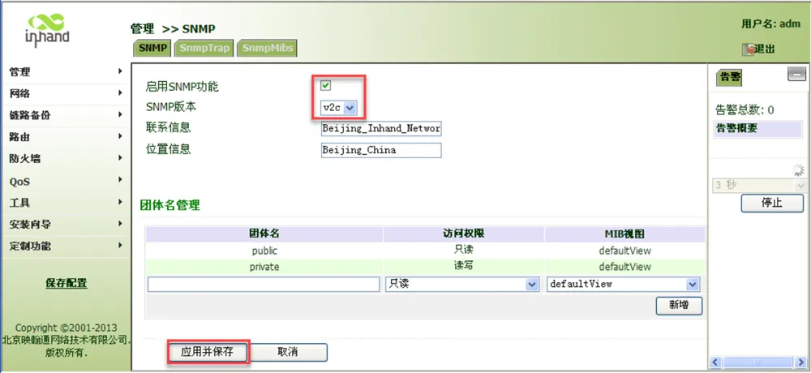

<strong>图 4-118 SNMP启用</strong>

选择v3版本时，需配置用户和用户组：用户组填入组名和安全级别后点击"新增"；用户填入用户名和组名，填写认证/密码参数后点击"新增"，最后点击"应用并保存"。

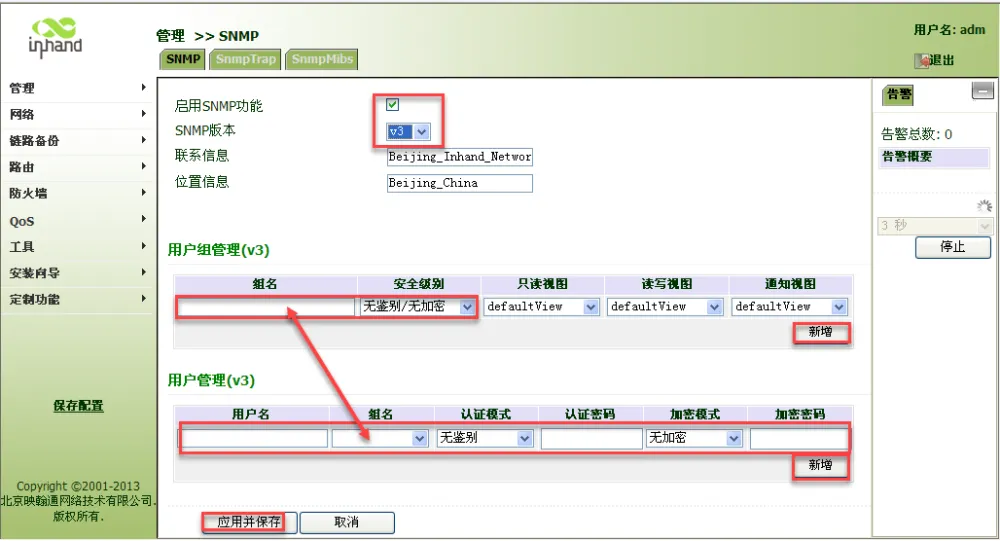

<strong>图 4-119 SNMPv3用户和用户组配置</strong>

### SnmpTrap（告警）

SNMP Trap使被管设备主动通知SNMP管理器，无需等待管理器轮询。

**配置方法**：进入【管理】→【SNMP】→【SnmpTrap】，填入管理站(NMS)的IP地址；v1/v2c版本填写团体名，v3版本填写用户名（长度1-32字符）；UDP默认端口号范围1-65535。

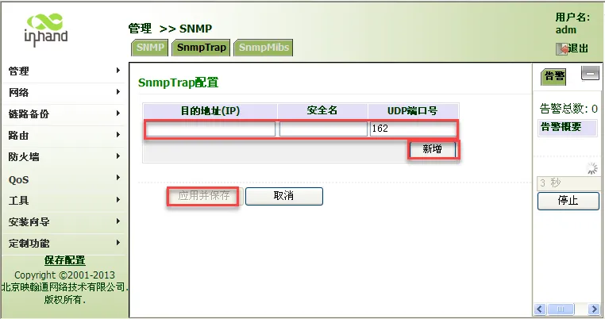

<strong>图 4-120 SnmpTrap配置</strong>

### SnmpMibs

MIB（Management Information Base，管理信息库）描述SNMP管理对象的层次结构，每个管理对象由OID（Object Identifier，对象标识符）唯一标识。

<strong>图 4-121 MIB树结构</strong>

**下载SnmpMibs文件**：进入【管理】→【SNMP】→【SnmpMibs】，选择文件夹，点击"download"下载到PC，将所需文件夹导入管理站使用。

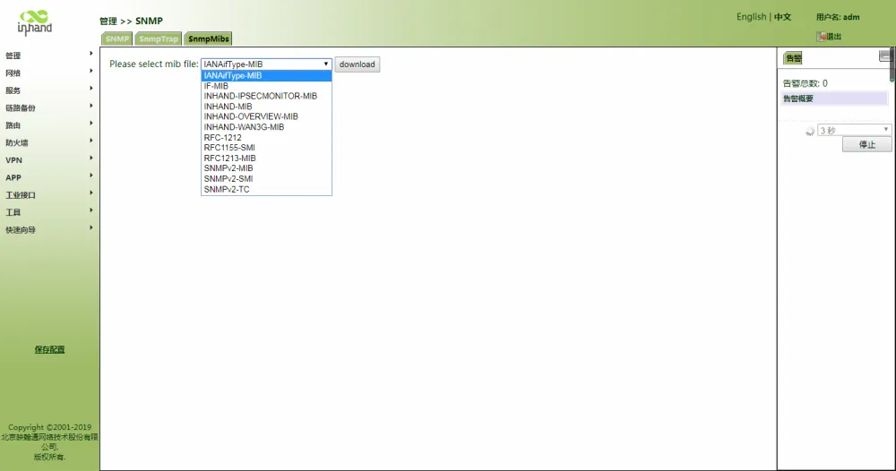

<strong>图 4-122 SnmpMibs下载</strong>

### 4.12.8 告警

告警功能使用户及时获知网关异常。异常产生时网关发出告警，所有告警记录在告警日志中。

**告警状态**：存在（Raise，告警发生未确认）、确认（Confirm，告警暂时无法解决）、全部（All）

**告警等级**：EMERG（严重错误）、CRIT（不可恢复错误）、WARN（影响功能错误）、NOTICE（影响性能错误）、INFO（正常事件）

**查看告警**：进入【管理】→【告警】→【状态】，查看上电以来系统产生的所有告警。

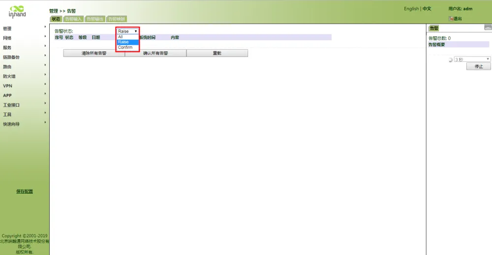

<strong>图 4-123 告警状态</strong>

**告警输入**：选择关心的告警类型，勾选后该项异常时产生报警。

**告警输出**：告警产生时，系统自动以邮件形式发送告警内容到目的邮箱。"Email告警"填写发送邮箱信息，"邮件地址"填写接收告警的邮箱地址。

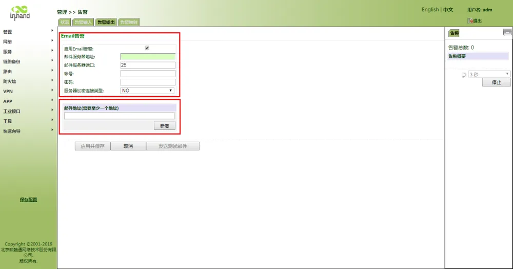

<strong>图 4-124 告警输出配置</strong>

**告警映射**：接收告警的方式有CLI（console口）和Email。启用Email映射需先在告警输出部分配置好邮箱地址。

### 4.12.9 系统日志

进入【管理】→【系统日志】查看系统日志，支持"清除日志"、"下载日志"、"清除历史日志"、"下载历史日志"操作。

"系统诊断记录"文件为加密文件，需使用专用解密工具解密后查看。

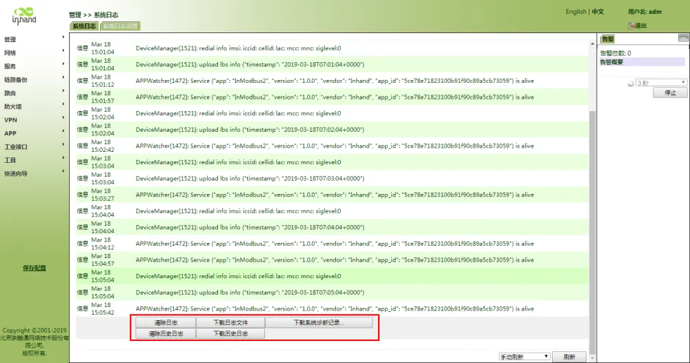

<strong>图 4-125 系统日志</strong>

由于网关存储容量有限（默认512KB），如需保存完整日志，可配置远程日志服务器（如Kiwi Syslog Daemon）。在Web中设置日志服务器地址和端口后，网关会将所有系统日志上传到远程日志服务器。

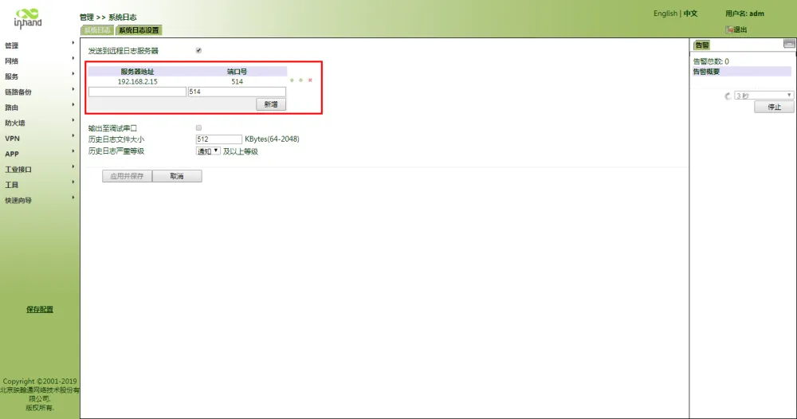

<strong>图 4-126 远程日志服务器配置</strong>

### 4.12.10 系统升级

进入【管理】→【系统升级】→【浏览】，选择升级文件，点击"升级"，升级完成后重启系统。

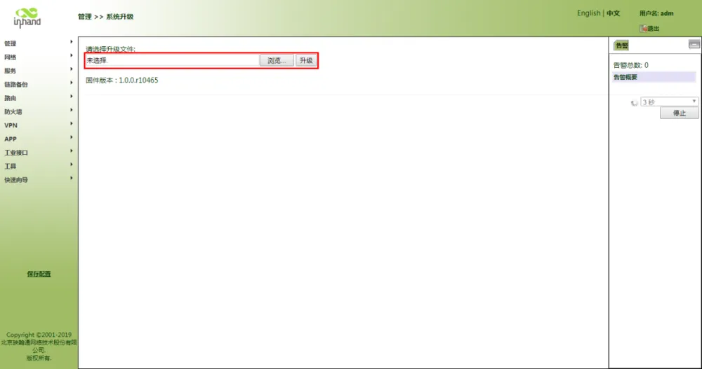

<strong>图 4-127 系统升级</strong>

|  注意：在软件升级过程中，不要在Web上进行任何操作，否则可能导致软件升级中断。 |
| --- |

### 4.12.11 重启系统

进入【管理】→【系统重启】，点击"确定"重启系统。

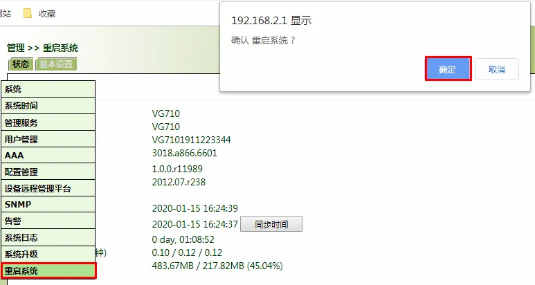

<strong>图 4-128 重启系统</strong>

## 4.13 诊断工具

诊断工具用于探测网关网络连接情况，包括PING探测、路由探测、网络抓包和网速测试。

### 4.13.1 PING探测

用于检测设备外网连通情况。在"主机"栏填入任意国内常用网站地址，点击"ping"，有数据传输表示网络连通。

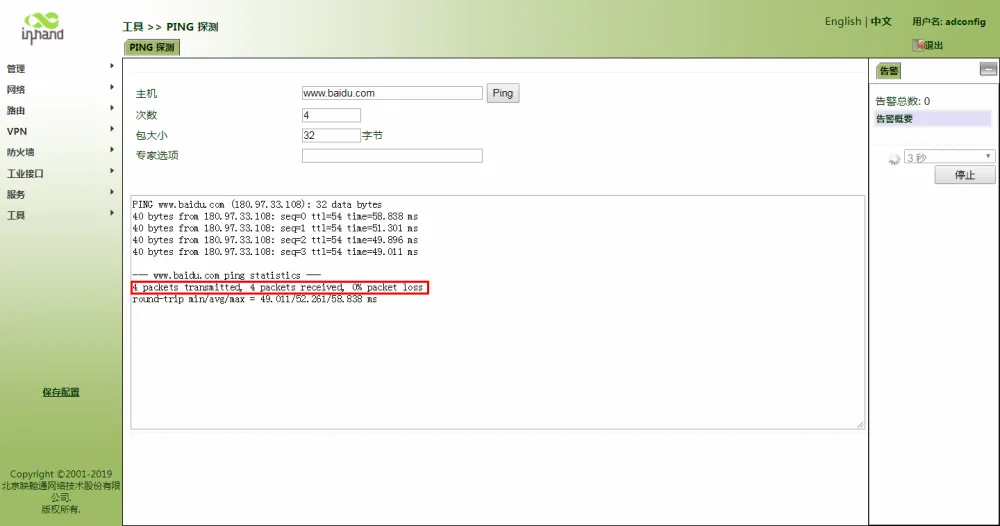

<strong>图 4-129 PING探测</strong>

### 4.13.2 路由探测

输入对端主机IP地址，点击"Trace"，检测路由连通情况。

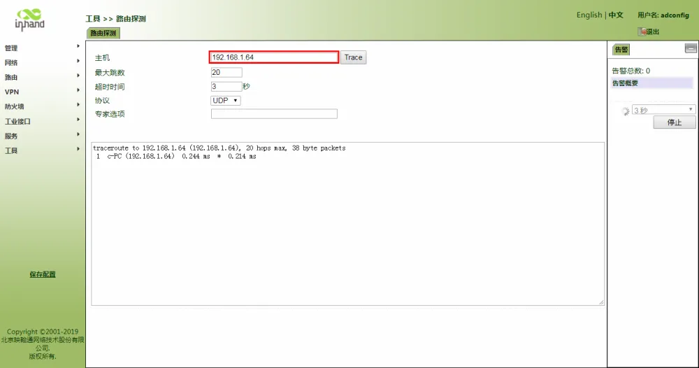

<strong>图 4-130 路由探测</strong>

### 4.13.3 网络抓包

选择要抓包的接口（any/bridge1）和抓包个数，点击"开始抓包"→"停止抓包"→"下载抓包文件"。可使用Wireshark软件打开抓包文件，分析接口网络情况。

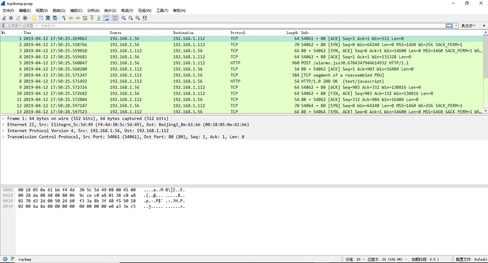

<strong>图 4-131 网络抓包</strong>

### 4.13.4 网速测试

通过上传或下载文件来测试网速。

# 第5章 典型应用

## 案例1：IPsec VPN站点间互联

**场景描述**：总部A（子网192.168.1.0/24）与分支机构B（子网172.16.1.0/24）之间需通过公网安全传输数据，使用IPsec加密隧道保护两个站点之间的通信。

**网络拓扑**：

<strong>图 5-1 IPsec VPN站点间互联拓扑</strong>

**设备角色**：VG710作为IPsec VPN网关，负责建立加密隧道并转发两端子网之间的加密流量。

**配置步骤**：

1. 登录网关A的Web管理界面，进入【VPN】→【IPsec】。
2. 新增IKE策略：设置标识、加密算法（AES128）、哈希算法（SHA1）、Diffie-Hellman密钥交换（Group2）、生命周期（86400）。
3. 新增IPsec策略：设置名称、封装（ESP）、加密算法（AES128）、认证方式（SHA1）、IPsec模式（隧道模式）。
4. 新增IPsec隧道：填写对端地址（网关B的IP）、选择接口、设置IKE版本、认证方式（共享密钥）、本地子网（192.168.1.0/24）和对端子网（172.16.1.0/24），点击"应用并保存"。

<strong>图 5-2 IPsec配置界面</strong>

5. 以相同方式配置网关B，本地子网和对端子网互换，加密参数保持一致。
6. 配置完成后，进入IPsec"状态"页面验证隧道建立状态。

<strong>图 5-3 IPsec隧道建立成功状态</strong>

**参考章节**：
- [4.3.1 IPsec](#431-ipsec)
- [4.8.2 新建IPsec隧道](#482-新建ipsec隧道)

## 附录 故障处理

### 1 网络连接问题

| 现象 | 可能原因 | 排查步骤 | 对应章节 |
|------|----------|----------|----------|
| 无法连接蜂窝网络 | SIM卡未插入或接触不良 | 1. 断电后检查SIM卡是否正确插入 2. 重新插拔SIM卡 | [安装SIM卡和天线](#222-安装sim卡和天线并联网) |
| 无法连接蜂窝网络 | APN参数配置错误 | 1. 核对APN参数是否与运营商提供的一致 2. 联系运营商获取正确APN | [场景1：蜂窝联网](#场景1蜂窝联网) |
| 无法连接蜂窝网络 | 信号弱或无信号 | 1. 检查Cellular天线是否连接 2. 加装Diversity天线 3. 查看Signal指示灯状态 | [指示灯说明](#14-指示灯说明) |
| Cellular灯红色闪烁 | 未探测到模块或SIM卡 | 1. 检查SIM卡是否正确插入 2. 确认SIM卡是否有效 3. 重启设备 | [指示灯说明](#14-指示灯说明) |
| Wi-Fi无法连接 | SSID或密钥输入错误 | 1. 确认SSID名称和密钥正确 2. 检查认证方式是否匹配 | [场景2：Wi-Fi联网](#场景2wi-fi联网) |
| Wi-Fi无法连接 | Wi-Fi天线未安装 | 1. 确认Wi-Fi天线已正确安装到SMA接口 | [场景2：Wi-Fi联网](#场景2wi-fi联网) |

### 2 Web管理界面问题

| 现象 | 可能原因 | 排查步骤 | 对应章节 |
|------|----------|----------|----------|
| 无法打开Web管理界面 | PC与设备不在同一网段 | 1. 检查PC的IP地址是否在192.168.2.x网段 2. 使用自动获取IP地址或手动配置 | [安装指南](#22-安装指南) |
| 无法打开Web管理界面 | 浏览器兼容性问题 | 1. 更换浏览器（推荐Chrome） 2. 清除浏览器缓存 | [安装指南](#22-安装指南) |
| 登录失败 | 用户名或密码错误 | 1. 确认使用默认账户adm/123456 2. 如密码已修改，使用修改后的密码 3. 必要时恢复出厂设置 | [用户管理](#4124-用户管理) |

### 3 VPN连接问题

| 现象 | 可能原因 | 排查步骤 | 对应章节 |
|------|----------|----------|----------|
| IPsec隧道无法建立 | 两端加密参数不一致 | 1. 检查IKE策略参数两端是否一致 2. 检查IPsec策略参数两端是否一致 3. 确认共享密钥相同 | [4.3.1 IPsec](#431-ipsec) |
| IPsec隧道无法建立 | 对端公网IP不可达 | 1. 检查两端设备是否已联网 2. 使用PING工具测试对端IP连通性 | [4.13 诊断工具](#413-诊断工具) |
| OpenVPN连接失败 | 证书问题 | 1. 检查CA证书、公钥、私钥是否正确导入 2. 确认认证类型选择正确 | [4.3.4 OpenVPN](#434-openvpn) |

### 4 车辆诊断问题

| 现象 | 可能原因 | 排查步骤 | 对应章节 |
|------|----------|----------|----------|
| CAN接口状态异常 | OBD线缆未正确连接 | 1. 确认在车辆熄火状态下安装线缆 2. 检查OBD-II/J1939线缆连接 | [4.2 车辆诊断](#42-车辆诊断) |
| 无法读取车辆数据 | 车辆诊断协议不匹配 | 1. 检查CAN波特率是否自动适配 2. 确认OBD协议类型（OBD-II/J1939） | [4.2 车辆诊断](#42-车辆诊断) |

### 5 设备系统问题

| 现象 | 可能原因 | 排查步骤 | 对应章节 |
|------|----------|----------|----------|
| 设备无法启动 | 点火线（IGT）未连接 | 1. 确认IGT信号已正确连接 2. 测试环境下将IGT与V+并接 | [安装前准备](#21-安装前准备) |
| 设备无法启动 | 电源电压不在范围内 | 1. 确认供电电压在DC 9~36V范围内 2. 检查电源线V+和GND连接 | [连接电源](#221-连接电源) |
| System灯红色闪烁 | 系统故障 | 1. 尝试重启设备 2. 恢复出厂设置 3. 联系技术支持 | [指示灯说明](#14-指示灯说明) |

### 6 云平台连接问题

| 现象 | 可能原因 | 排查步骤 | 对应章节 |
|------|----------|----------|----------|
| 无法连接云平台 | 设备未联网 | 1. 确认设备已通过蜂窝或Wi-Fi联网 2. 使用PING工具测试网络连通性 | [场景4：连接设备远程监控平台](#场景4连接设备远程监控平台) |
| 无法连接云平台 | 服务器地址或账户信息错误 | 1. 确认云平台服务器地址正确 2. 核对注册账户和车牌号信息 | [4.10 设备远程监控平台](#410-设备远程监控平台) |
