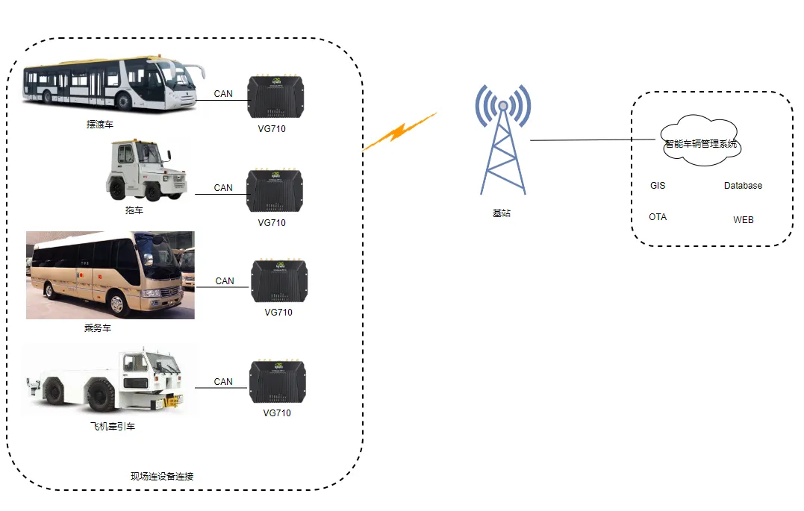

# 航空地勤车辆数字化解决方案

## 一、方案概述

### 1.1 项目背景

某航空公司致力于提升机坪运营效率和安全性，需要对地勤车辆进行全面数字化管理。机坪车辆种类繁多、作业频繁，如何实现高效调度和安全监控是重要课题。

### 1.2 建设目标

- 实现地勤车辆的实时定位和追踪
- 监控车辆运行状态和作业情况
- 提升机坪运营效率和安全性
- 优化车辆调度和资源配置

### 1.3 适用场景

- 机场地勤车辆管理
- 机坪作业调度
- 车辆安全监控
- 航空物流运输

## 二、需求分析

### 2.1 设备现状

- 设备类型：地勤车辆（行李车、加油车、食品车等）、车载终端
- 通信接口：4G/5G、GPS
- 通信协议：多种通信协议
- 部署环境：机场机坪
- 数量规模：多辆地勤车辆

### 2.2 核心需求

1. **实时定位需求**：实时定位地勤车辆位置
2. **作业监控需求**：监控车辆作业状态和轨迹
3. **调度管理需求**：优化车辆调度和任务分配
4. **安全监控需求**：车辆行驶安全监控
5. **数据分析需求**：运营数据分析和优化

## 三、总体架构设计

本方案采用车载终端+4G/5G通信+云平台的架构，实现地勤车辆的全面数字化管理。

### 3.1 四层架构

1. **感知层**：地勤车辆、车载终端、GPS定位器
2. **网络层**：4G/5G通信网络
3. **平台层**：车辆管理平台、云平台
4. **应用层**：定位追踪、作业调度、安全监控

### 3.2 数据流

地勤车辆（位置/状态）→ 4G/5G → 云平台 → 调度中心

## 四、网络与接入方案

### 4.1 联网方式选型

采用4G/5G全网通接入，确保机场范围内的网络覆盖。

### 4.2 边缘网关选型要点

- 支持4G/5G全网通
- 支持GPS/北斗定位
- 支持车载环境应用
- 抗震设计

## 五、协议与数据采集方案

### 5.1 支持协议

- **网络协议**：4G/5G
- **定位协议**：GPS/北斗
- **传输协议**：标准物联网协议

### 5.2 北向协议支持

- 支持车辆管理平台接入
- 支持机场调度系统对接

## 六、方案亮点总结

1. **实时定位**：精准定位地勤车辆，实时掌握位置信息

2. **作业监控**：全面监控车辆作业状态和轨迹

3. **智能调度**：基于实时数据的智能调度优化

4. **安全管控**：车辆行驶安全监控，预防事故

5. **效率提升**：优化资源配置，提升机坪运营效率
