# 航空地勤车VG710车载网关配置手册

## 一、文档信息

- **文档名称**：航空地勤车VG710车载网关配置手册
- **产品型号**：VG710
- **固件版本**：V1.2.5
- **适用场景**：智慧机坪，商用车辆联网，政务车辆，医疗救护车
- **编写日期**：2026年4月14日

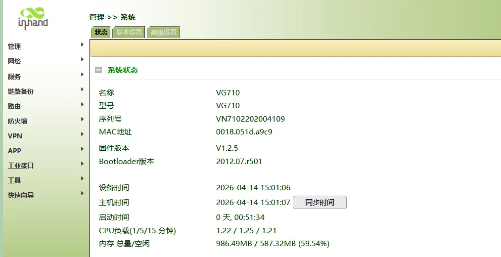

## 二、VG710车载网关概述

### 2.1 产品简介

InVehicle G710⻋载⽹关是⾯向⻋联⽹领域推出的新⼀代⻋载⽹关，该产品为
汽⻋和运输服务提供⾼速安全的⽹络，满⾜特种⻋辆、执法、应急、⼯程、救护、
移动资产管理的需求，搭配基于云的远程⻋队管理平台，为物流管理、资产跟踪、
移动办公、政府安全⼯作提供随处可达的⽹络和不间断的运营监管。

### 2.2 主要功能

- 集成⻋载OBD-II/J1939诊断接⼝
- ⽀持Python⼆次开发
- ⽀持Docker容器技术
- ⼯业级芯⽚、通讯模组及电⼦元件
- 宽温工业级设计
- 集成了惯性导航系统
- 集成3D加速度计和陀螺仪

### 2.3 典型应用拓扑

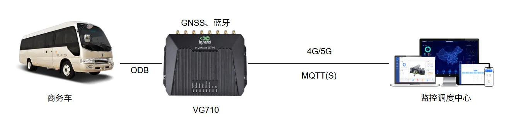

## 三、硬件说明

## 3.1 外观与接口

- 电源接口：9-48V（IR315）
- 网口：LAN×4 WAN×1
- 指示灯：PWR、RUN
- 复位键：恢复出厂设置

4G版本：
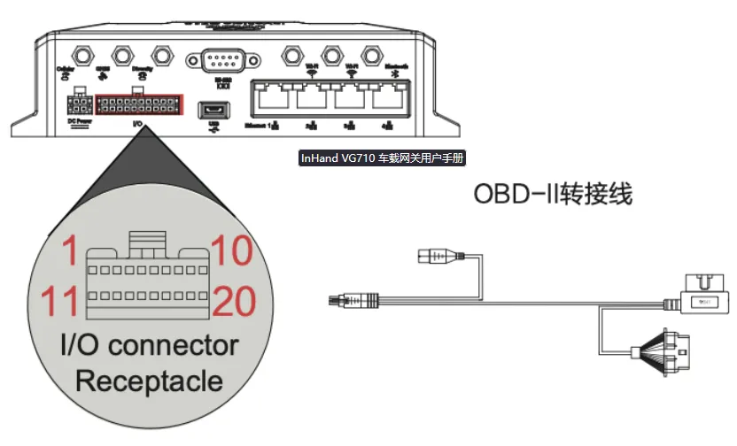
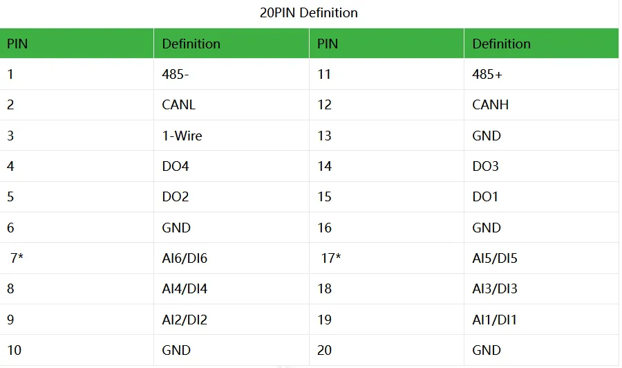
5G版本：
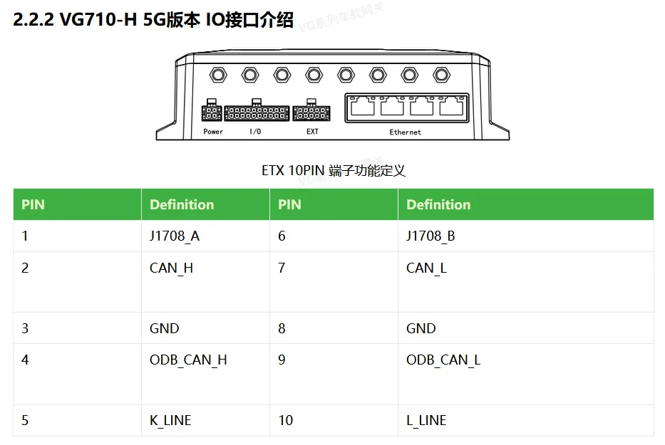
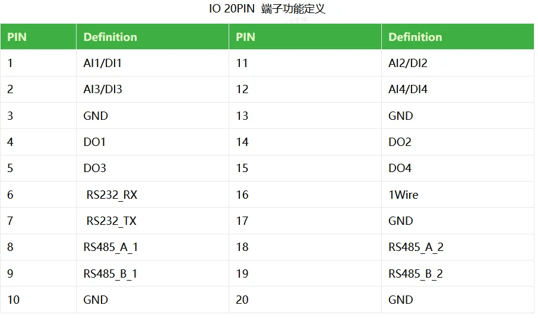

## 3.2 接线说明

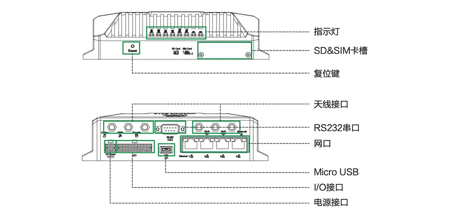

### 3.2.1 电源接线

- 正极：V+
- 负极：V-
- lgnition sense：点火信号
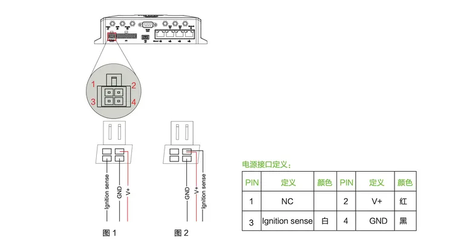
电源输入范围:DC 9~36V 建议功率18W。 取电方式:
● 车辆电瓶;
● 蓄电池;
● 点烟器;
● 电源适配器(室内使用)

正常工程环境下:分别接入电源V+，GND和点火线(Ignition sense)，点火信号线接在车的点火线上 如图1;
测试状态接线:点火线和正极并在一起接入，如图2

***注意：如果不接点火信号线，设备无法启动***

#### 3.2.2 以太网接线

直连 / 交叉自适应，建议超五类及以上网线。

## 四、出厂默认参数

- 默认 IP：192.168.2.1
- 子网掩码：255.255.255.0
- Web 用户名：adm
- Web 密码：123456，如果是随机密码，需对应设备铭牌

## 五、前期准备

1. 电脑设置与VG710同网段 IP
2. 网线连接电脑与VG710 LAN 口
3. VG710上电，等待设备正常运行
4. 浏览器输入VG710 IP 进入配置页面

## 六、网络配置

### 6.1 VG710 LAN配置

#### 6.1.1.设置接口地址

网络-桥接口
下联的设备地址为192.168.2.100，将桥接口设置为192.168.2.1
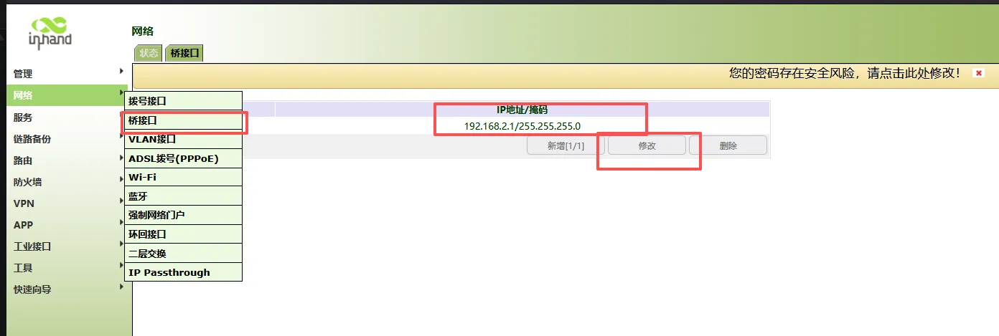
如果桥接口中没有初始地址，或者没有桥接口，则选择下边的VLAN接口设置。

#### 6.1.2.设置诊断协议

1.找到服务-车辆诊断
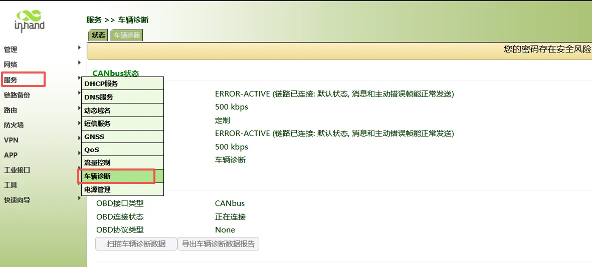
2.将对应接口设置上车辆诊断
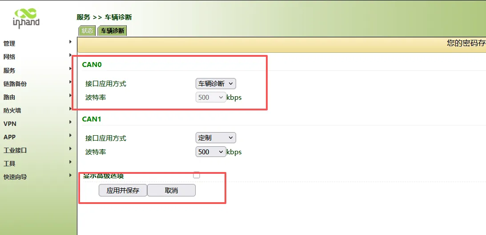
3.安装客户定制开发的APP，用于将监控车辆状态和诊断信息上报到云平台。
APP-APP管理-导入APP
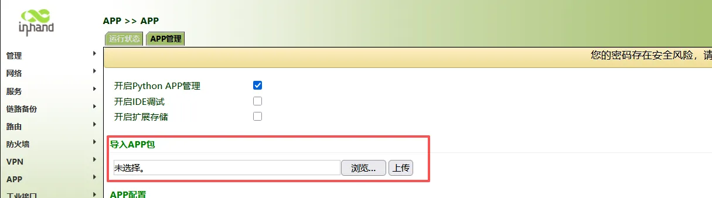
APP部分属于客户私有设备，不提供下载链接。客户需要根据自己的需求，开发对应的APP。

## 七、导入导出路由器配置

### 7.1 导出配置文件

管理—配置管理-备份startup-config
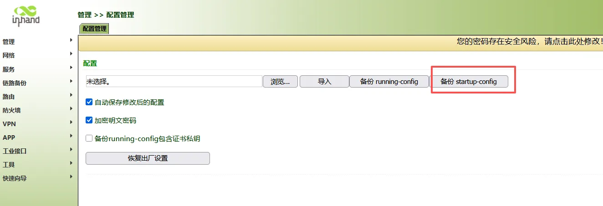

### 7.2 导入配置文件

管理—配置管理-导入配置文件，导入配置文件后会提示重启生效
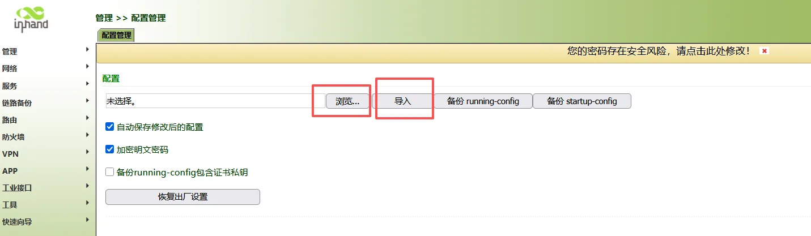
