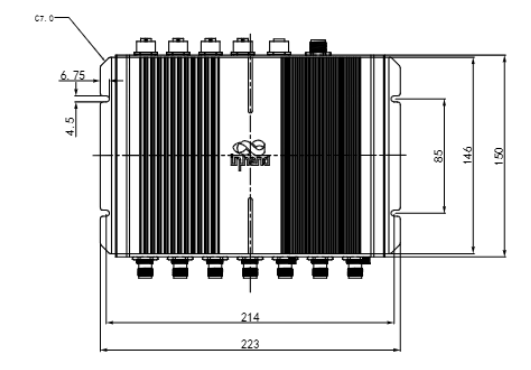
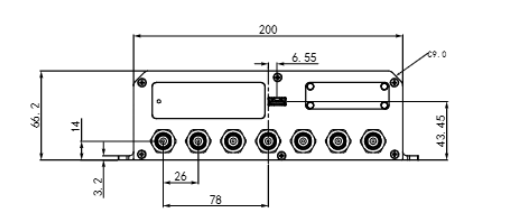
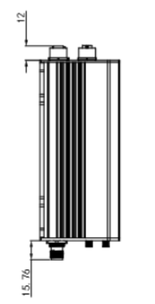
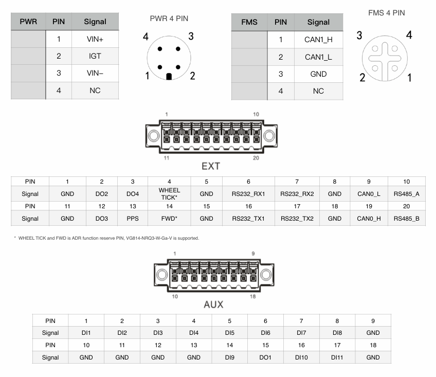

  

    

      
    

    

      高性能、一体化、EN50155 轨道标准
    

  

  

    

      VG814 系列蜂窝网关
    

    

      

        
· 5G/LTE CAT6

        
· 双频 Wi-Fi 5

      

      

        
· GNSS + 惯性导航

        
· TNC + M12

      

    

  

# 1. 产品概述

**VG814 是一款专为地铁、轻轨和列车部署设计的符合EN50155标准和欧洲公共交通 ITxPT 认证网关，提供安全可靠的车载网络。**

**定位：** 坚固耐用的多功能车载轨道交通网关，支持高速 5G蜂窝、Wi-Fi、GNSS 和边缘计算

**主要特性：**
- **轨道交通标准：** TNC 天线接口和 M12 连接器，适应振动和恶劣环境
- **高速连接：** 5G/LTE-A、双 SIM 和链路备份，保障服务不间断
- **全球定位：** 多星座 GNSS 配合 ADR，最高支持 10 Hz 更新率
- **开放边缘平台：** 支持 C/C++、Python、Docker 和云 SDK 集成
- **车队运维支持：** 支持诊断数据采集和 OTA 全生命周期管理

## 核心技术规格

|技术指标|规格|
|---|---|
|蜂窝网络|5G SA/NSA (Sub-6) + LTE Cat6/Cat4，双 SIM（2 x Mini SIM）|
|定位|GPS/GLONASS/Galileo/Beidou，10 Hz，支持惯性导航|
|云管理|InHand Device Live 远程运维管理|
|VPN 与安全|IPsec/OpenVPN/L2TP/GRE，SPI 防火墙，ACL，AAA|
|网络功能|APN/VPDN，静态路由/RIP/OSPF/BGP，VRRP，链路备份|
|边缘计算|C/C++、Python、Docker、MQTT/HTTP/TCP FlexAPI|
|尺寸|223 x 177.76 x 66.2 mm|
|重量|1438 g|
|接口|4 x 千兆以太网，2 x RS232，1 x RS485，1 x USB 3.0，2 x CAN，11DI/4DO|
|电源输入|9-36 VDC（M12 A-coded）|
|工作环境|-30 ℃ ~ +70 ℃；存储 -40 ℃ ~ +85 ℃；40 ℃ 时 95% RH|
|防护与结构|IP53，铝合金外壳，无风扇|

# 2. 产品尺寸

  

    
    
正视图

  

  

    
    
接口图

  

  

    
    
侧视图

  

  

    
备注：

    
1. 所有尺寸单位为毫米（mm）。

    
2. 所有尺寸均为近似值，仅供参考。

    
3. 图纸不得用于生产制造。

    
4. 尺寸受零件及制造公差影响。

    
5. 规格因具体型号不同，略有不同。

  

# 3. 硬件规格

| 类别 / 参数 | 规格 |
|--------------------------|------|
| **核心平台** | |
| CPU | ARM Cortex-A7（四核） |
| 主频 | 717 MHz |
| RAM | 1 GB DDR3L |
| Flash | 8 GB eMMC |
| **蜂窝与网络** | |
| 蜂窝网络 | 5G SA/NSA (Sub-6)，LTE Cat6 |
| SIM | 2 x Mini SIM (2FF) |
| 以太网 | 4 x 千兆以太网，M12 X-coded 母头 |
| 天线连接器 | TNC |
| **卫星定位 GNSS** | |
| GNSS 接收机 | GPS、GLONASS、Galileo、Beidou |
| 航位推算 | 内置加速度计和陀螺仪 |
| 定位精度 | 2.5 m CEP |
| 跟踪灵敏度 | -160 dBm |
| 更新率 | 最高 10 Hz |
| **车载接口** | |
| CAN 总线 | 1 x CAN 2.0B + 1 x CAN 2.0B (FMS) |
| 串口 | 2 x RS232，1 x RS485 |
| USB | 1 x USB 3.0 (Type-A) |
| I/O | 11 x DI，4 x DO |
| **Wi-Fi** | |
| 频率 | 2.4 / 5 GHz 双频 |
| 协议 | Wi-Fi 5 |
| 最大输出 | 2.4G: 17 dBm；5G: 17 dBm |
| 工作模式 | AP / Client |
| MIMO | 2 x 2 MU-MIMO |
| **电源** | |
| 电源连接器 | M12 A-coded 公头 |
| 输入电压 | 9-36 VDC |
| 引脚定义 | V+、V-、Ignition、NC（4 针） |
| 待机功耗 | 0.006 W（仅点火监测） |
| 工作功耗 | 16.00 W（平均，RF 满载） |
| 峰值功耗 | 20.0 W（RF 满载） |
| **机械与环境** | |
| 尺寸（宽 x 高 x 深） | 223 x 177.76 x 66.2 mm |
| 重量 | 1438 g |
| 安装方式 | 壁挂安装 |
| 防护等级 | IP53 |
| 散热方式 | 无风扇散热 |
| 外壳 | 铝合金 |
| 工作温度 | -30 ℃ ~ +70 ℃ |
| 存储温度 | -40 ℃ ~ +85 ℃ |
| 湿度 | 40 ℃ 时 95% RH |
| **合规与认证** | |
| 轨道交通标准 | EN50155、EN50121-3-2、EN61373、 EN45545-2、ISO16750 |
| 认证 | CE、RoHS、E-Mark、ITxPT |

# 4. 软件规格

| 类别 / 参数 | 规格 |
|--------------------------|------|
| **网络功能** | |
| 网络接入 | APN、VPDN |
| LAN 协议 | ARP、Ethernet |
| 接入认证 | CHAP/PAP/MS-CHAP/MS-CHAP V2 |
| VLAN | VID：1-127 |
| IP 应用 | Ping、Traceroute、DHCP server/relay/client、DNS relay、 DDNS、Telnet、SSH、HTTP、HTTPS、MQTT |
| IP 路由 | 静态路由、RIP、OSPF、BGP |
| **安全** | |
| 防火墙 | SPI、DoS 防御、组播/Ping 过滤、ACL |
| NAT | NAT、NAPT、DMZ、端口映射 |
| 用户级别 | 管理员和只读用户 |
| AAA | 本地认证、Radius、TACACS+、LDAP |
| 证书 | PEM、PKCS12、SCEP、CRL |
| VPN | IPsec VPN、OpenVPN、L2TP、GRE |
| **可靠性** | |
| 冗余 | 浮动静态路由、VRRP、接口备份 |
| 链路检测 | 可配置的目标可达性检测，用于故障切换 |
| 看门狗 | 设备故障自动恢复 |
| 离线存储 | 网络不可用时关键数据本地存储 |
| **WLAN 功能** | |
| 协议 | IEEE 802.11 a/b/g/n/ac |
| 安全 | 共享密钥、WPA/WPA2 Personal/Enterprise |
| 加密 | WEP/TKIP/AES |
| 其他 | 多 SSID、强制门户 |
| **边缘计算与服务** | |
| 可编程 | C/C++、Python、Docker |
| SDK | Python 3 SDK、Docker SDK、Azure IoT Edge SDK |
| IDE | Visual Studio Code |
| API | 基于 MQTT/HTTP/TCP 的 FlexAPI |
| 云集成 | Microsoft Azure、AWS IoT 及第三方云平台 |
| 内置服务 | 库存、时间、GNSS、FMStoIP、MQTT broker |
| 管理平台 | InHand Device Live（云端部署和远程运维） |

# 5. 订购信息
## 型号规则
**型号编码：** VG814-\<WMNN\>-W-G-R
\<WMNN\>：蜂窝类型与模组
## 产品型号
<table style="width:100%; table-layout:fixed;">
  <colgroup>
    <col style="width:32%;">
    <col style="width:28%;">
    <col style="width:40%;">
  </colgroup>
  <tr><th>型号</th><th>区域</th><th>&lt;WMNN&gt;：蜂窝类型与模组</th></tr>
  <tr><td align="center" style="white-space: nowrap;">VG814-FQ09-W-G-R</td><td align="center">LTE CAT6 全球</td><td align="left">LTE-FDD B1/2/3/4/5/7/8/12/13/14/17/18/19/20/25/26/28/29/30/32/66/71 LTE-TDD B34/38/39/40/41/42/43/46(LAA)/48(CBRS)；WCDMA B1/2/3/4/5/6/8/19</td></tr>
  <tr><td align="center" style="white-space: nowrap;">VG814-NRQ3-W-G-R</td><td align="center">5G 全球</td><td>5G NSA n1/2/3/5/7/8/12/20/25/28/38/40/41/48/66/71/77/78/79 5G SA n1/2/3/5/7/8/12/20/25/28/38/40/41/48/66/71/77/78/79 LTE-FDD B1/2/3/4/5/7/8/9/12(17)/13/14/ 18/19/20/25/26/28/29/30/32/66/71 LTE-TDD B34/38/39/40/41/42/43/48 LAA B46 WCDMA B1/2/3/4/5/6/8/19</td></tr>
</table>

# 6. 联系我们

- **官网：** [映翰通官网](https://www.inhand.com.cn)
- **版权：** © 映翰通网络 保留所有权利
- 
# 7. 端子定义

  

    
    

  

