# InHand VG814 用户手册 V1.0

### 修订记录

| 版本 | 修订时间 | 说明 |
| :---: | :---: | --- |
| V1.0 | 2023-11-23 | 初始版本发布 |

首先非常感谢您选择本公司产品！在使用前，请您仔细阅读本用户手册，遵守以下声明，将有助于维护知识产权和法律合规性，以确保您的使用体验与产品的最新信息相一致。如有任何疑问或需要获取书面许可，请随时联系我们的技术支持团队。

- 版权声明

本用户手册包含受版权保护的内容，版权归北京映翰通网络技术股份有限公司及其许可者所有。未经书面许可，任何单位和个人不得擅自摘抄、复制本手册的部分或全部内容，且不得以任何形式传播。

- 免责声明

由于产品技术和规格不断更新，本公司不能承诺用户手册中的资料与实际产品完全一致。因此，不承担由于实际技术参数与用户手册不符而引起的任何争议。任何关于产品的改动恕不提前通知，本公司保留最终更改权和解释权

- 版权信息

本用户手册内容受版权法律保护，版权归北京映翰通网络技术股份有限公司及其许可者所有，保留一切权利。未经书面许可，不得擅自使用、复制或传播本手册的内容。

## 本手册图形界面约定

| 符号 | 含义 | 示例 |
|------|------|------|
| `< >` | 表示变量或参数，需替换为实际值 | `<IP地址>` 表示需填入具体IP |
| `" "` | 表示界面上的文字标签 | 弹出“新建用户”窗口 |
| `>>` | 表示菜单层级或操作顺序 | 【文件】>>【新建】>>【文件夹】 |
| `【 】` | 表示菜单或页面名称 | 进入【新建用户】页面 |
|  | 提醒操作中应注意的事项，不当的操作可能会导致数据丢失或者设备损坏 | - |
|  | 对操作内容的描述进行必要的补充和说明 | - |

## 技术支持

**北京映翰通网络技术股份有限公司（总部）**

电话：010-8417 0010

地址：北京市朝阳区紫月路18号院3号楼5层

**成都办事处**

电话：028-8679 8244

地址：四川省成都市武侯区天府大道北段1777号中国太平金融大厦14层

**广州办事处**

电话：020-8562 9571

地址：广州市天河区棠东东路5号远洋新三板创意园B-130单元

**武汉办事处**

电话：027-8716 3566

地址：湖北省武汉市洪山区珞瑜东路2号巴黎豪庭11栋2001室

**上海办事处**

电话：021-5480 8501

地址：上海市普陀区顺义路18号1103室

## 如何使用本手册

- 首次使用用户：建议按顺序阅读「认识设备」→「安装与首次使用」→「常用场景配置」→「功能说明与参数参考」
- 已有设备用户：可直接查阅「功能说明与参数参考」或「附录 故障处理」
- 云平台管理用户：可查阅「常用场景配置」中的设备远程管理平台（如适用）

| 任务 | 对应章节 | 预计用时 |
|------|----------|----------|
| 了解设备外观和接口 | [认识设备](#认识设备) | 约5分钟 |
| 安装和登录设备 | [安装与首次使用](#安装与首次使用) | 约10分钟 |
| 配置蜂窝网络和Wi-Fi | [安装与首次使用](#安装与首次使用) | 约10分钟 |
| 配置常用功能场景 | [常用场景配置](#常用场景配置) | 按需 |
| 查阅系统所有功能 | [功能说明与参数参考](#功能说明与参数参考) | 按需 |
| 排查设备故障 | [附录 故障处理](#附录-故障处理) | 按需 |

# 第1章 认识设备

## 1.1 概述

InHand VG814是面向车联网（IoV）的新一代4G/5G车载网关。该设备为汽车和运输服务车辆提供快速安全的网络，满足警车、应急指挥车、工程车、医疗车和物流车对快速移动网络的需求。配合基于云的远程车辆管理平台使用，可为物流管理、资产跟踪、移动办公和政府安全提供无处不在的可访问网络和不间断的运营监督。

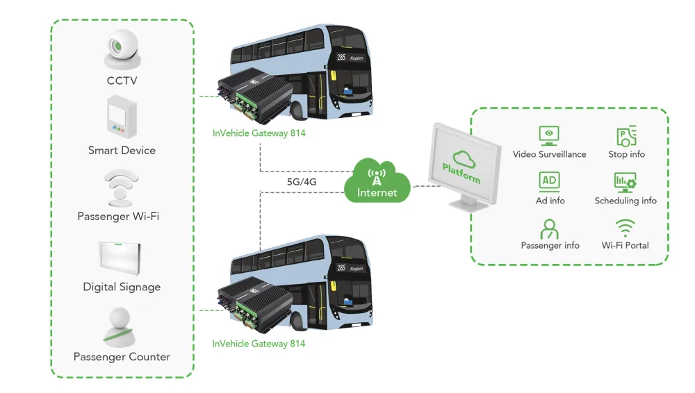

<strong>图 1-1 应用实例</strong>

## 1.2 包装清单

| 物品 | 数量 | 说明 |
|------|------|------|
| 设备 | 1 | VG814车载网关（公路版/铁路版可选） |
| 电源线 | 1 | 12-24VDC 输入 |
| GPS/GNSS天线 | 1 | FAKRA C母头 |
| WiFi/BT天线 | 1 | FAKRA I母头 |
| Cellular天线 | 2-4 | FAKRA D母头，取决于4G/5G版本 |
| FMS车身控制线束 | 1 | M12 A-Code公头 |
| ETX 20Pin连接器 | 1 | 工业级连接器 |
| AUX 18Pin连接器 | 1 | 工业级连接器 |
| 用户手册 | 1 | 在线查阅 |
| 快速入门指南 | 1 | 印刷版 |
| 产品合格证 | 1 | 随附 |

## 1.3 外观与接口

### 1.3.1 VG814 公路版本

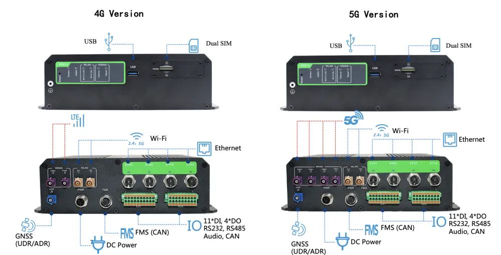

<strong>图 1-2 VG814 公路版本天线面板</strong>

| 天线和SIM | 接口类型 |
| --- | --- |
| GNSS Connector | FAKRA C-coded male |
| Wi-Fi Connector | FAKRA I-coded male |
| Cellular Connector | 4G版本：2*FAKRA D-coded male 5G版本：4* FAKRA D-coded male |
| SIM | 2* Mini SIM 2FF |

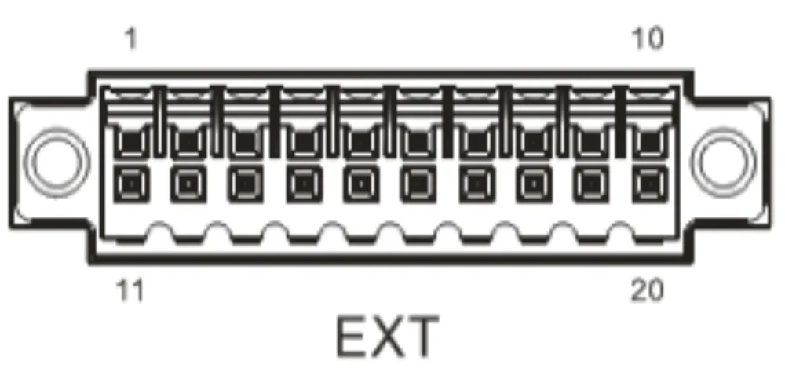

<strong>图 1-3 VG814 公路版本接口面板</strong>

| 接口信息 | 接口类型 |
| --- | --- |
| Gigabit Ethernet（以太网口） | M12 X-Coded female |
| FMS | M12 A-Coded female |
| Power | M12 A-Coded male |
| ETX | 20 Pin industrial segment |
| AUX | 18 Pin industrial segment |

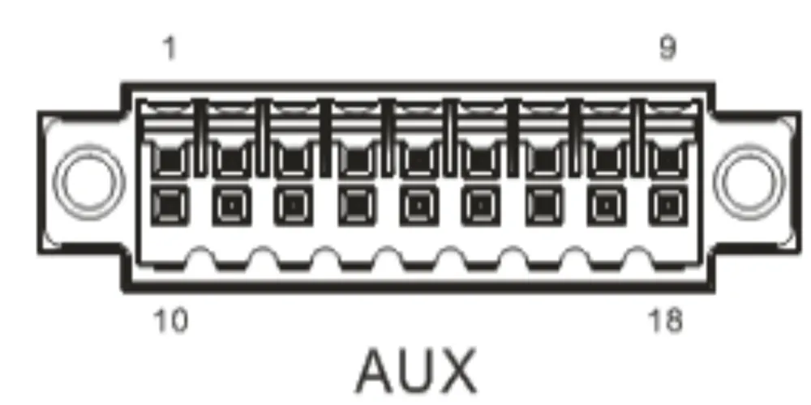

<strong>图 1-4 VG814 公路版本引脚定义</strong>

ETX 20 Pin 接口定义：

| PIN | 1 | 2 | 3 | 4 | 5 | 6 | 7 | 8 | 9 | 10 |
| :---: | :---: | :---: | :---: | :---: | :---: | :---: | :---: | :---: | :---: | :---: |
| Signal | GND | DO2 | DO4 | WHEELTICK | GND | RS232_RX1 | L- Channel | GND | CAN1_L | RS485_B |
| **PIN** | **11** | **12** | **13** | **14** | **15** | **16** | **17** | **18** | **19** | **20** |
| Signal | GND | DO3 | PPS | FWD | GND | RS232_TX1 | R- Channel | Mic In | CAN1_H | RS485_A |

AUX 18 Pin 接口定义：

| PIN | 1 | 2 | 3 | 4 | 5 | 6 | 7 | 8 | 9 |
| --- | --- | --- | --- | --- | --- | --- | --- | --- | --- |
| Signal | DI1 | DI2 | DI3 | DI4 | DI5 | DI6 | DI7 | DI8 | GND |
| **PIN** | **10** | **11** | **12** | **13** | **14** | **15** | **16** | **17** | **18** |
| Signal | GND | GND | GND | GND | DI9 | DO1 | DI10 | DI11 | GND |

### 1.3.2 VG814 铁路版本

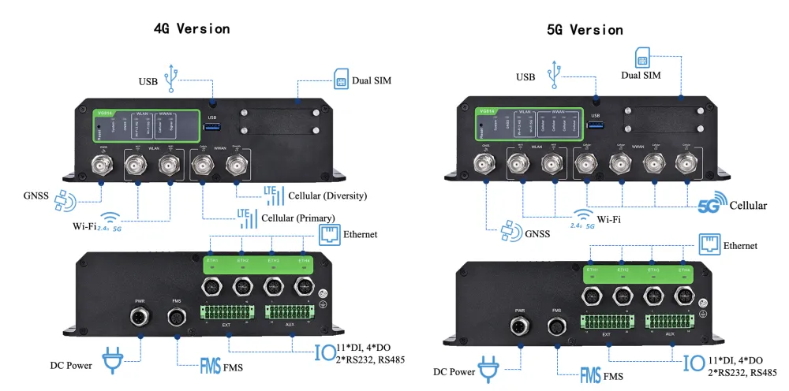

<strong>图 1-5 VG814 铁路版本天线面板</strong>

| 天线和SIM | 接口类型 |
| --- | --- |
| GNSS Connector | TNC Female |
| Wi-Fi Connector | TNC Female |
| Cellular Connector | TNC Female |
| SIM | 2* Mini SIM 2FF |

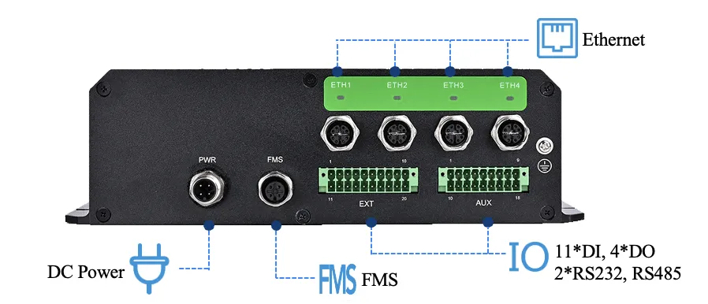

<strong>图 1-6 VG814 铁路版本接口面板</strong>

| 接口信息 | 接口类型 |
| --- | --- |
| Gigabit Ethernet | M12 X-Coded female |
| FMS | M12 A-Coded female |
| Power | M12 A-Coded male |
| ETX | 20 Pin industrial segment |
| AUX | 18 Pin industrial segment |

<strong>图 1-7 VG814 铁路版本引脚定义</strong>

ETX 20 Pin 接口定义：

| PIN | 1 | 2 | 3 | 4 | 5 | 6 | 7 | 8 | 9 | 10 |
| --- | --- | --- | --- | --- | --- | --- | --- | --- | --- | --- |
| Signal | GND | DO2 | DO4 | DO6 | GND | RS232_RX1 | RS232_RX2 | GND | CAN_L | RS485_B |
| **PIN** | **11** | **12** | **13** | **14** | **15** | **16** | **17** | **18** | **19** | **20** |
| Signal | GND | DO3 | DO5 | DO7 | GND | RS232_TX1 | RS232_TX2 | GND | CAN_H | RS485_A |

AUX 18 Pin 接口定义：

<strong>图 1-8 VG814 铁路版本AUX引脚定义</strong>

| PIN | 1 | 2 | 3 | 4 | 5 | 6 | 7 | 8 | 9 |
| --- | --- | --- | --- | --- | --- | --- | --- | --- | --- |
| Signal | DI1 | DI2 | DI3 | DI4 | DI5 | DI6 | DI7 | DI8 | GND |
| **PIN** | **10** | **11** | **12** | **13** | **14** | **15** | **16** | **17** | **18** |
| Signal | GND | GND | GND | GND | DI9 | DO1 | DI10 | DI11 | GND |

### 1.3.3 电源与 FMS 接口定义

VG814 公路版本和铁路版本的电源连接器与 FMS 接口定义完全一致。

**电源连接器 (PWR)**

<strong>图 1-9 电源连接器引脚定义</strong>

| 引脚 (PIN) | 信号 (Signal) | 说明 |
| :---: | :---: | --- |
| 1 | VIN+ | 电源正极 (9-48V DC) |
| 2 | IGT (ACC) | 点火信号输入 |
| 3 | VIN- | 电源负极 (GND) |
| 4 | NC | 悬空 |

**FMS (车身管理系统) 连接器**

<strong>图 1-10 FMS 连接器引脚定义</strong>

| 引脚 (PIN) | 信号 (Signal) | 说明 |
| :---: | :---: | --- |
| 1 | CAN_H | CAN 总线高 |
| 2 | CAN_L | CAN 总线低 |
| 3 | GND | 信号地 |
| 4 | NC | 悬空 |

## 1.4 指示灯说明

| 指示灯 | 状态 | 含义 |
|--------|------|------|
| System | 熄灭 | 设备断电 |
| | 常亮红色 | 系统正在启动 |
| | 常亮蓝色 | IGT/点火信号未连接 |
| | 闪烁绿色 | 系统运行正常 |
| | 闪烁红色 | 系统有故障 |
| | 闪烁蓝色 | 系统正在升级 |
| Cellular | 熄灭 | 拨号功能被禁用 |
| | 闪烁绿色 | 拨号正在进行中 |
| | 稳定的绿色 | 拨号成功 |
| | 闪烁红色 | 拨号失败 (未检测到模块或SIM卡) |
| Signal | 熄灭 | 当前拨号卡没有信号 |
| | 常亮红色 | 当前拨号卡信号微弱 (信号强度: 低于 9 asu) |
| | 常亮蓝色 | 当前的拨号卡具有中等信号 (信号强度: 10-19 asu) |
| | 常亮绿色 | 当前拨号卡信号强 (信号强度: 高于20 asu) |
| GNSS | 熄灭 | GNSS被禁用 |
| | 闪烁绿色 | 定位正在进行中 |
| | 常亮绿 | 定位完成 |
| Wi-Fi 2.4G | 熄灭 | AP模式：AP被禁用；STA模式：STA被禁用，或没有关联AP |
| | 闪烁绿色 | AP模式：AP运行正常；STA模式：关联了一个AP |
| | 常亮绿色 | STA模式：连接失败 (AP关联后密码错误) |
| Wi-Fi 5G | 熄灭 | AP模式：AP被禁用；STA模式：STA被禁用，或没有关联AP |
| | 闪烁蓝色 | AP模式：AP正常运行；STA模式：关联了一个AP |
| | 常亮蓝色 | STA模式：连接失败 (AP关联后密码错误) |

## 1.5 恢复出厂设置

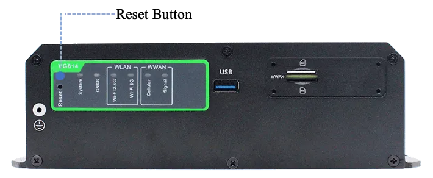

<strong>图 1-11 重置按钮</strong>

重置按钮用于恢复设备的出厂默认设置，操作步骤如下：

1. 打开设备电源，并立即按住Reset复位按钮。大约15秒后，系统指示灯将稳定显示为红色。
2. 当系统指示灯关闭并再次变为红色时，立即松开复位按钮。
3. 当系统指示灯关闭时，按下Reset按钮（确保其闪烁红色两次），然后松开。设备随后恢复到默认设置。

## 1.6 默认设置

| No. | 功能 | 默认设置 |
| --- | --- | --- |
| 1 | 通过蜂窝网络拨号 | - 启用 (拨号成功后，Cellular指示灯常亮绿色) - 默认情况下禁用双SIM卡功能，并启用SIM1 |
| 2 | 卫星定位和惯性导航服务 | - 启用 (定位成功后，GNSS指示灯常亮绿色) - 启用惯性导航功能 |
| 3 | 车载诊断（OBD） | - 启用 - 自动检测CANbus波特率 - 自动检测OBD协议 - 自动扫描OBD数据 |
| 4 | Wi-Fi的默认设置 | - 启用Wi-Fi 2.4G AP。SSID以VG814-开头，后跟六位数字 - 启用Wi-Fi 5G AP。SSID以VG814-5G-开头，后跟六位数 - 认证方式使用WPA2-PSK - 密码为SN的最后八位数字 |
| 5 | 以太网的默认设置 | - 启用了四个局域网端口 - IP地址为192.168.2.1 - 子网掩码为255.255.255.0 - DHCP服务器已启用，IP地址池为192.168.2.2-192.168.2.100，可自动为下游设备分配IP地址 |
| 6 | 网关的网络访问控制 | - 启用HTTP和HTTPS，端口号分别为80和443 - 禁用Telnet - 禁用SSH - 蜂窝网络仅允许通过HTTPS方式访问 |
| 7 | 用户名和密码 | - 默认超级用户为 adm / 123456 |
| 8 | 电源管理 | - 关机延时：30秒 - 待机模式1：开启关机功能 - 待机检查间隔：20 (表示待机模式下的电源检查间隔) - 待机电压：90 (待机阈值电压为9V) - 待机恢复电压：105 (在待机模式下恢复正常操作的阈值电压为10.5V) |
| 9 | IO | - 默认情况下，四个数字输出通道以低电平生成输出，上拉电阻器被禁用 - 十一个数字输入通道的上拉电阻器被禁用 |
| 10 | 串行端口 | - RS232：波特率9600，数据位8位，奇偶校验位无，停止位1位 - RS485：波特率9600，数据位8位，奇偶校验位无，停止位1位 |

# 第2章 安装与首次使用

## 2.1 安装前准备

> **注意**：安装和操作设备前，需确保了解相关的安全注意事项，避免不当操作导致的设备损坏或数据丢失。网关的电源和OBD电缆应在车辆关闭时安装。

本设备建议安装在车辆的空调管道中，以获得更好的散热和信号收发效果。

 **警告**：插入或拔下SIM卡之前，必须先拔下电源线；否则，该操作将导致数据丢失或直接损坏网关。

## 2.2 硬件安装

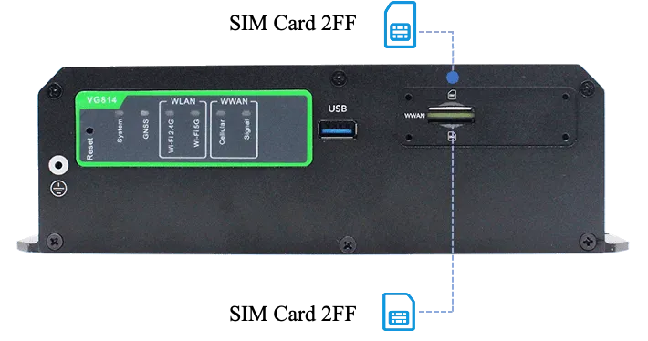

<strong>图 2-1 VG814 铁路版本蜂窝网络模块外观</strong>

设备安装位置建议参考下图中关于空调管道的安装方式：

<strong>图 2-2 安装位置建议 1</strong>

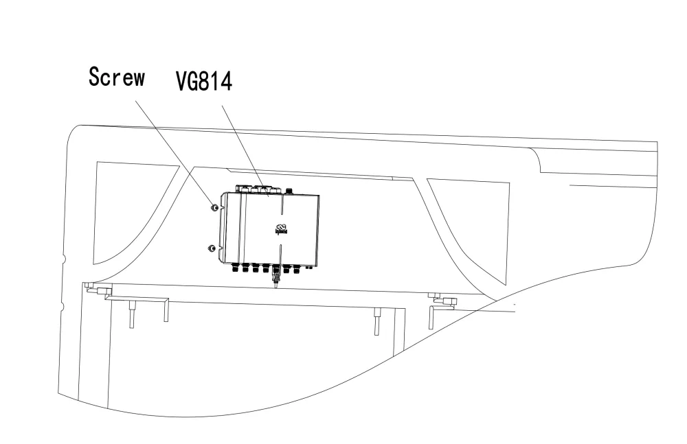

<strong>图 2-3 安装位置建议 2</strong>

### 2.2.1 电源接线方式

在办公室或测试环境中测试VG814时，应将红色的V+线和白色的IGT（点火）线同时连接到直流电源的正极。黑色的V-线应连接到直流电源的负极。

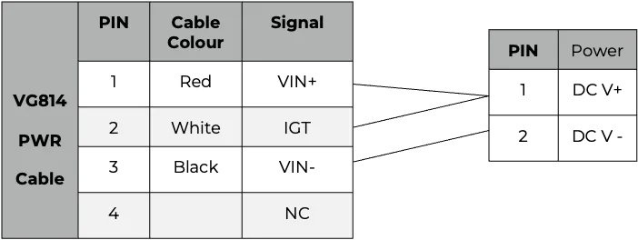

<strong>图 2-4 电源线连接示意图</strong>

电源线设计参考附件：[SCAB000339 Power Cable 9 VG814 M12 A Code 4PIN-EN.pdf](./attachments/SjaCF6S1qHLlz5BP/SCAB000339 Power Cable 9 VG814 M12 A Code 4PIN-EN.pdf)

### 2.2.2 网线接口定义

网关设备端使用M12 X-coded网线连接器进行以太网连接。连接VG814以太网接口与其他设备时，请使用以下接口定义：

<strong>图 2-5 M12 以太网连接器 (Female)</strong>

<strong>图 2-6 M12 以太网连接器 (Male)</strong>

| M12 PINs | T568B Colour | Data |
| --- | --- | --- |
| 1 | white/orange stripe  | TxRx A +  |
| 2 | orange solid  | TxRx A -  |
| 3 | white/green stripe  | TxRx B + |
| 8 | blue solid  | TxRx C +   |
| 7 | white/blue stripe  | TxRx C - |
| 4 | green solid  | TxRx B - |
| 5 | white/brown stripe  | TxRx D + |
| 6 | brown solid  | TxRx D - |

线缆设计参考附件：[AETH050002 M12-8PIN X Coded to RJ45.pdf](./attachments/SjaCF6S1qHLlz5BP/AETH050002 M12-8PIN X Coded to RJ45.pdf)

## 2.3 登录设备管理界面

要登录设备的Web管理界面，需执行以下操作：

1. 为用于管理设备的电脑分配一个IP地址，使该地址与网关的IP地址位于同一网段。

   **方法一（推荐）**：使电脑自动获取IP地址。由于设备默认开启了DHCP服务器，电脑将自动获取 `192.168.2.2-192.168.2.100` 范围内的IP。
    
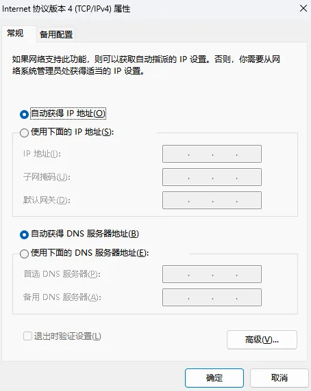

    
<strong>图 2-7 自动获取 IP 地址</strong>

   **方法二**：为电脑配置固定IP地址。选择”使用下面的IP地址”，输入 `192.168.2.2` 到 `192.168.2.254` 范围内的任何IP地址（需与网关的初始IP `192.168.2.1` 不同）、子网掩码 `255.255.255.0` 和默认网关地址 `192.168.2.1`，点击确定。
    
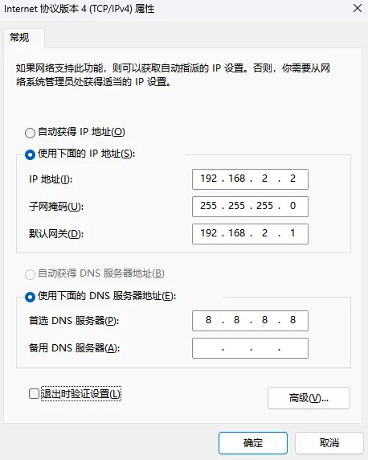

    
<strong>图 2-8 使用固定IP地址</strong>

2. 打开浏览器，在地址栏中输入网关的默认IP地址 `192.168.2.1`，按Enter键。
   

   
<strong>图 2-9 访问设备默认IP地址</strong>

3. 登录界面出现后（如果浏览器显示安全连接阻止提示，需点击“高级” >> “继续”），输入默认用户名与密码：`adm` / `123456`。
   
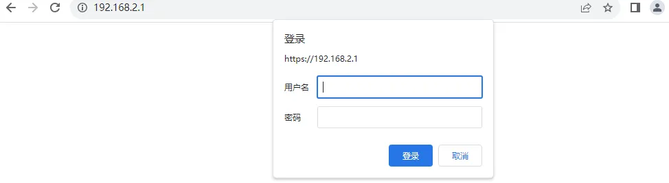

   
<strong>图 2-10 登录界面</strong>

## 2.4 首次网络访问

### 2.4.1 通过SIM卡访问网络

1. 确保设备在断电状态下已插入SIM卡，并连接好GNSS天线、蜂窝天线（如果拨号信号不佳，请插入分集拨号天线）。
2. 将设备上电并连接电脑。
3. 登录Web界面，进入【网络】>>【拨号接口】菜单，选中“启用”，然后点击“应用并保存”。若连接专网卡，可能需要在此界面设置APN（Access Point Name，可以理解为：运营商网络的"门牌号"，告诉设备应该通过哪个入口连接到移动网络）等参数。
   
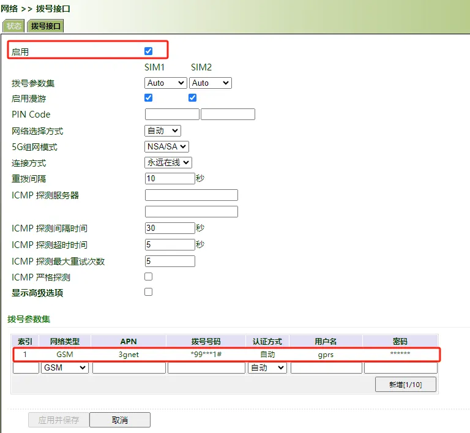

   
<strong>图 2-11 启用拨号接口</strong>

   
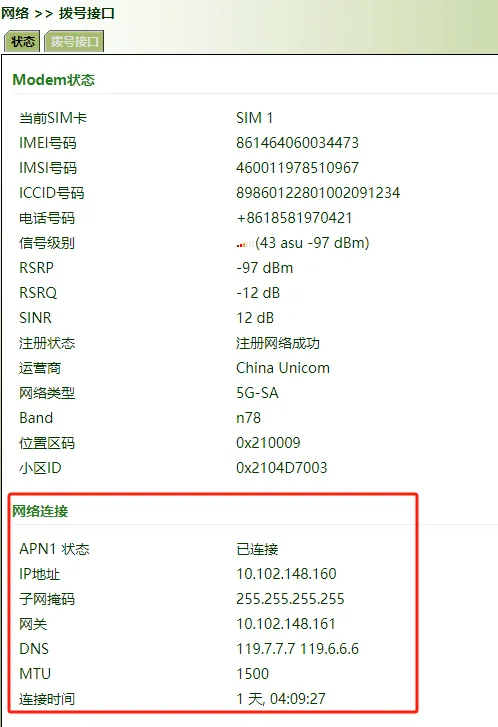

   
<strong>图 2-12 拨号参数配置</strong>

4. 验证网络连接。在操作系统的命令行中使用Ping工具，如果能接收到数据回复，则表示设备已成功连接到外部网络。
   
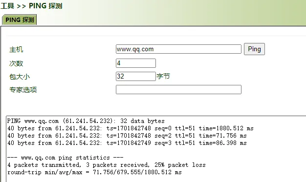

   
<strong>图 2-13 使用Ping命令验证网络</strong>

5. 如果设备中插入了两张SIM卡，可以进入相应配置页面启用双SIM卡备份功能。
   
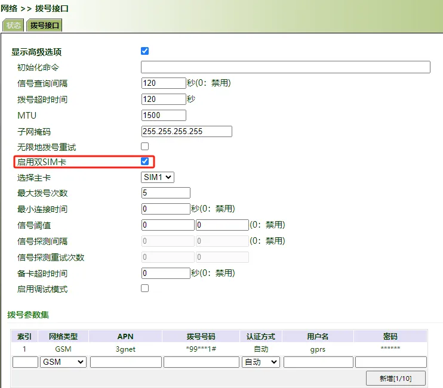

   
<strong>图 2-14 启用双SIM卡</strong>

### 2.4.2 通过Wi-Fi访问网络

1. 组装设备时，请先连接好Wi-Fi天线，然后再开机并登录设备。
   
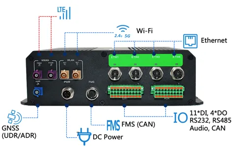

   
<strong>图 2-15 Wi-Fi天线连接示意</strong>

2. 登录Web界面。进入【网络】>>【Wi-Fi】菜单，选择Wi-Fi 2.4G或Wi-Fi 5G。
3. 选择工作模式为“客户端”（STA模式，可以理解为："客户端模式"，设备作为客户端连接其他WiFi热点）。
4. 填入可用的无线接入点（AP）名称、身份验证方法和密钥，最后点击“应用并保存”。
   
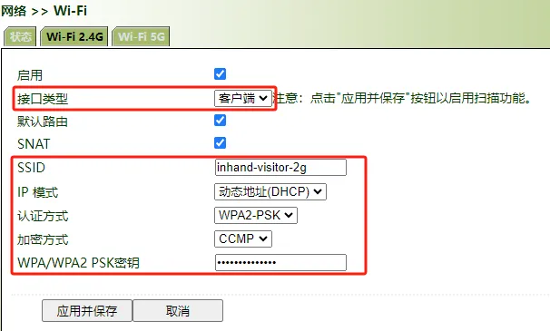

   
<strong>图 2-16 Wi-Fi 客户端连接配置</strong>

5. 进入【状态】页面查看。当当前网络状态显示为“已连接”，并成功获取到IP地址时，表明设备已通过Wi-Fi成功接入网络。
   
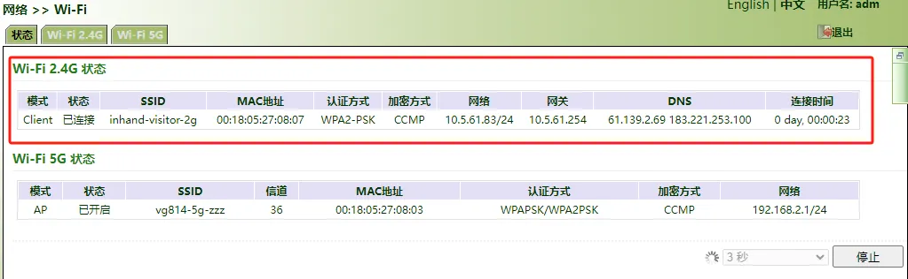

   
<strong>图 2-17 查看网络连接状态</strong>

# 第3章 常用场景配置

## 场景1：OBD车辆诊断接入

**目标**：通过OBD-II或J1939协议从车辆的CAN或LIN总线上收集车辆状态数据并实时进行故障诊断。

**前提**：

- 网关已断电。
- 车辆处于关闭状态。
- 准备好OBD-II或J1939专用诊断电缆（可在此前购买时选择或定制）。

**预计用时**：约5分钟。

**操作步骤**：

1. 在车辆关闭状态下，通过OBD-II或J1939电缆，将网关的I/O端口连接到车辆的诊断端口。
2. 将网关通电启动，OBD服务将自动启用以收集关键车辆数据。
3. 登录网关Web界面，进入OBD状态页面查看当前状态。此时可观察：
   - **CAN接口状态**：显示为“ERROR-ACTIVE”表示网关已成功连接到车辆诊断端口（其他状态表示连接异常或未识别）。
   - **CAN波特率**：系统会自动调整并显示当前波特率（通常为250 kbps或500 kbps）。
   - **CAN接口应用方式**：CAN0通常显示为“定制”，CAN1显示为“车辆诊断”。
   - **OBD连接状态**：显示为“已连接”。
   - **OBD协议类型**：显示当前生效的协议（OBD-II或J1939）。

  
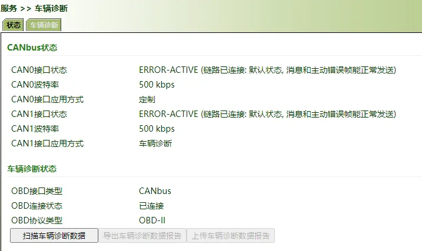

  
<strong>图 3-1 OBD状态页面</strong>

4. 在OBD数据流页面中，点击”扫描车辆诊断数据”按钮，生成包含详细车辆状况和诊断信息的报告。
5. 点击”导出OBD报告”，可将数据报表保存至本地计算机。

  
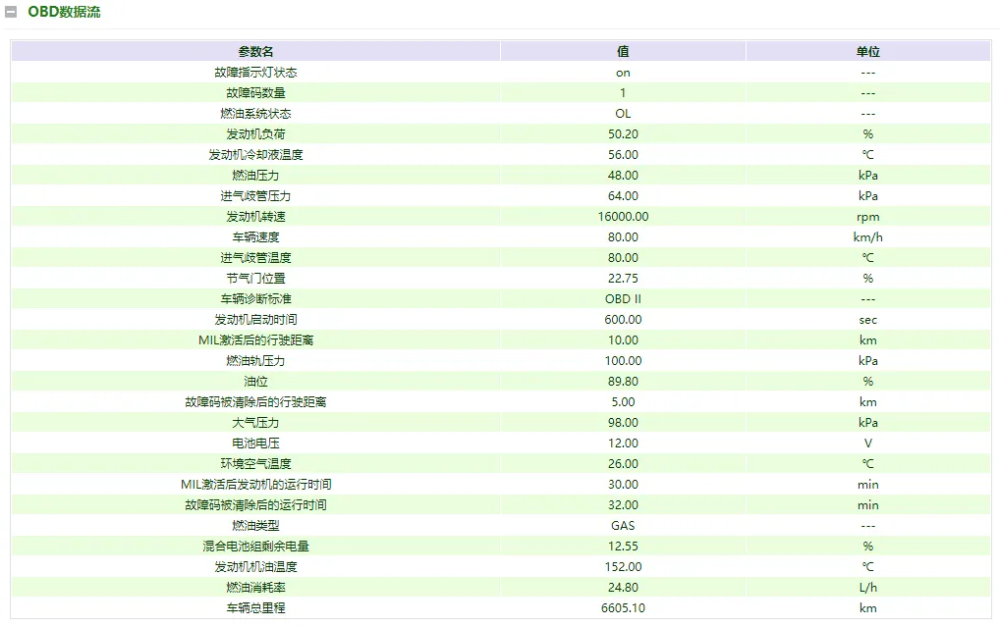

  
<strong>图 3-2 OBD实时数据流</strong>

  
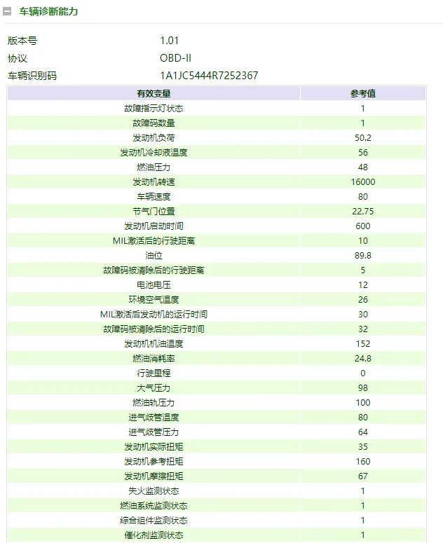

  
<strong>图 3-3 车辆诊断能力列表</strong>

**验证方法**：
查看OBD状态中的连接状态是否为“已连接”，并在数据流页面确认能接收到油位、里程、车速、发动机转速等实时车辆数据。

## 场景2：建立IPsec VPN隧道

**目标**：通过IPsec（Internet Protocol Security，可以理解为：网络层的"加密保镖"，为IP通信提供安全和验证保护）在两个网关间建立安全的加密隧道。

**前提**：网关A和网关B均已接通互联网，并已知双方的公网地址及各自所在子网。

**预计用时**：约10分钟。

**操作步骤**：
假设中心端子网为 `192.168.1.0/24`，分客户端子网为 `172.16.1.0/24`。

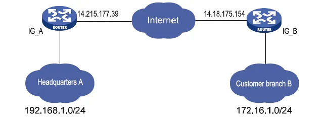

<strong>图 3-4 IPsec隧道拓扑</strong>

1. 登录网关A界面，配置IKEv1/v2参数与IPsec策略，并应用保存：
   - IKE加密/哈希算法：AES128 / SHA1
   - 迪菲-赫尔曼密钥交换：Group2
   - IPsec封装/模式：ESP / 隧道模式
   
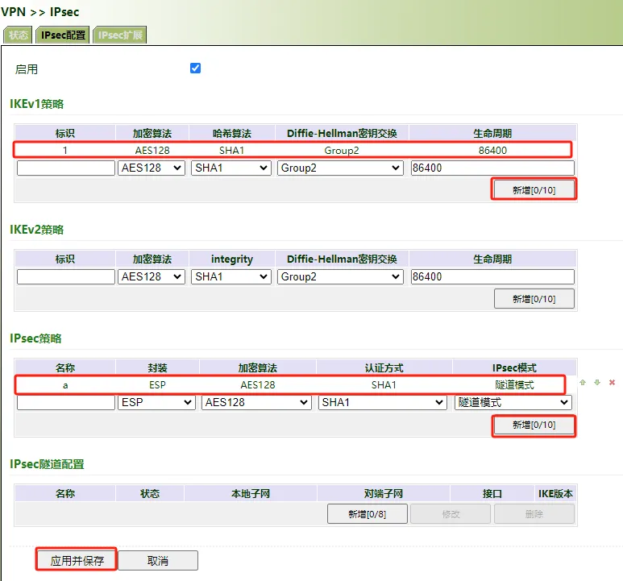

   
<strong>图 3-5 网关A的IPsec策略配置</strong>

2. 配置网关A的IPsec隧道：
   - 对端地址：填入网关B的公网建立地址
   - 认证策略：共享密钥
   - 本地子网：网关A的子网地址
   - 对端子网：网关B的子网地址
   
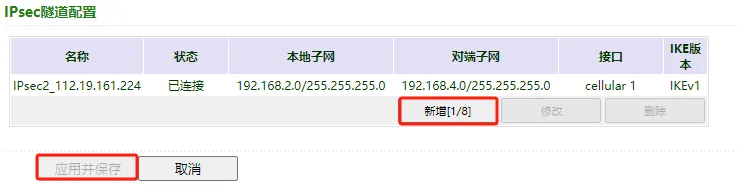

   
<strong>图 3-6 网关A的IPsec隧道配置</strong>

3. 登录网关B，按照同样的方式进行对称配置（注意将对端地址、本地/对端子网做对应交换）。

**验证方法**：
访问双方设备的IPsec状态页。若状态显示为“已连接（Connected）”等正常标识，则隧道已成功建立。

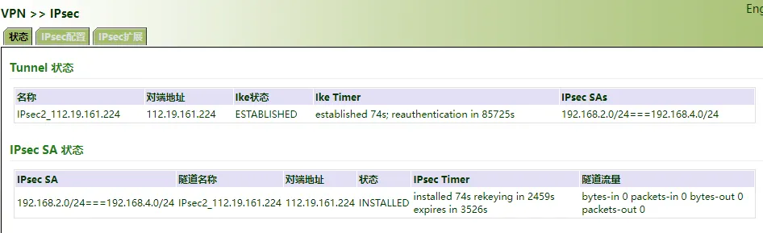

<strong>图 3-7 IPsec 状态页面</strong>

> **说明**：建立IPsec VPN无需另外配置IPsec配置文件，但如果需要动态多点VPN（DM VPN）则需要另行配置。

## 场景3：连接 DeviceManager 平台

**目标**：将设备接入InHand Cloud（Device Manager），以便在云端统一监控和管理设备状态。

**前提**：

- 已在 [InHand Cloud](https://iot.inhand.com.cn) 完成账户注册。
- 设备已成功连接至互联网。

**预计用时**：约5分钟。

**操作步骤**：

1. 登录网关界面，进入【管理】>>【设备远程管理平台】>>【设备远程管理平台】菜单。
2. 勾选“启用设备远程监控平台”，配置相关参数：
   - 服务类型：选择“Device Manager”。
   - 服务器地址：填写“iot.inhand.com.cn”（若是私有化部署请选择“自定义”并填入私有IP或域名）。
   - 注册帐户：填入在平台注册的电子邮件地址。
   - 安全通道：勾选（将使用SSL加密传输）。
   - 根据需求填写自定义的站点名称和资产编号。
3. 点击“应用并保存”，网关将自动向云服务器发起连接。

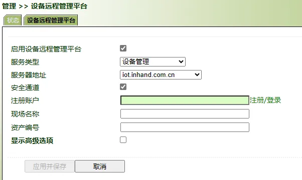

<strong>图 3-8 Device Manager 接入配置</strong>

**验证方法**：

1. 观察网关本地界面的“状态”，若显示“Connected”表示连接成功。
2. 使用网页浏览器登录Device Manager云端平台，在设备列表中核对是否已发现该网关并处于在线状态。

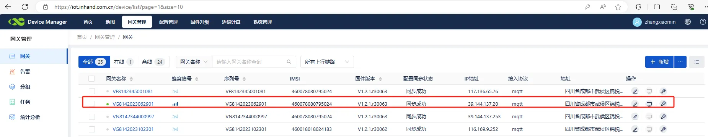

<strong>图 3-9 云端平台设备展示</strong>

> **说明**：原手册中提到的智能车队服务 (Smart Fleet) 功能在当前版本中已删除，推荐使用 DeviceManager 进行统一的资产与链路监控。

## 场景 4：InConnect 远程安全网络服务

**目标**：为您的终端机器（IPC、服务器、PLC、HMI 等）构建即插即用的安全远程网络。

**前提**：
- 已在 [InConnect 平台](https://ics.inhandiot.com) 完成账户注册。
- 设备已成功连接至互联网。

**预计用时**：约 8 分钟。

**操作步骤**：

1. 登录网关界面，进入【管理】>>【设备远程管理平台】>>【设备远程管理平台】菜单。
2. 配置服务参数：
   - **服务类型**：选择“InConnect Service”。
   - **服务器地址**：填写“ics.inhandiot.com”（若为私有部署请填写对应 IP/域名）。
   - **注册帐户**：填入在平台注册的电子邮件地址。
   - **安全通道**：勾选开启 SSL 加密。
3. 点击“应用并保存”，网关将自动尝试连接 InConnect 平台。

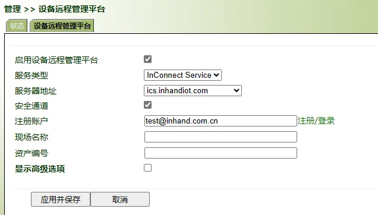

<strong>图 3-10 InConnect 接入配置</strong>

**验证方法**：

1. 登录 InConnect 平台管理页面，在设备列表中点击“添加设备”并填入网关的序列号。
2. 确认设备状态显示为“在线”，此时即可建立子网到子网的 VPN 连接，安全地远程访问您的机器。

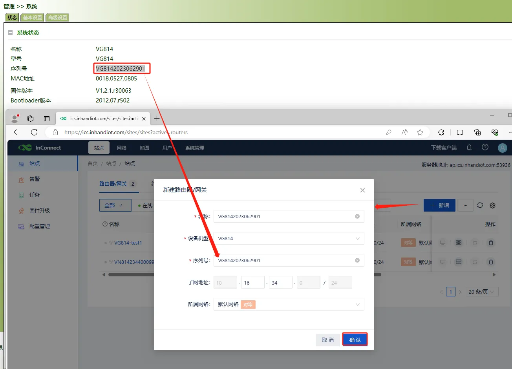

<strong>图 3-11 在平台中关联设备</strong>

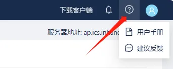

<strong>图 3-12 InConnect 参考资料</strong>

# 第4章 功能说明与参数参考

> **说明**：在系统的参数设置中，绿色文本框  表示必填项，纯白色文本框  表示可选项目。

## 4.1 网络配置

### 4.1.1 桥接口配置

桥接口用于通过网桥连接两个不同的物理LAN（局域网），以实现链路层数据在两个LAN之间的存储和转发。

1. 进入【网络】>>【桥接口】菜单，选择“桥接口”>>“修改”。
   
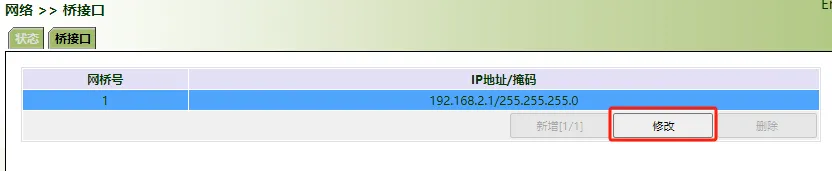

   
<strong>图 4-1 网桥修改入口</strong>

2. 修改网桥端口或网桥成员的IP地址（其中“dot11radio1”和“dot11radio2”分别是Wi-Fi 2.4G和Wi-Fi 5G端口）。
   
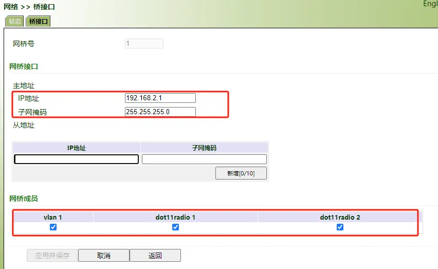

   
<strong>图 4-2 编辑网桥成员</strong>

### 4.1.2 VLAN接口

VLAN（虚拟LAN）包括一组逻辑设备和用户，使得这些设备不受物理位置限制地进行通信，就如同在同一个网段上一样。
设备的VLAN端口支持Access和Trunk两种链路类型。Access端口通常连接到计算机，Trunk端口则可接收和发送多个VLAN的消息，通常连接到交换机。

**新增VLAN接口操作**：

1. 进入【网络】>>【VLAN接口】>>【VLAN配置】菜单，点击“新增”。
2. 设置VLAN端口的虚拟IP地址，根据需要选择VLAN成员端口，点击”应用并保存”。
   
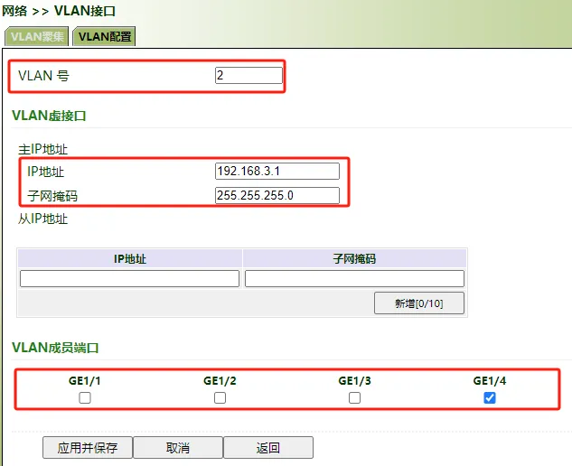

   
<strong>图 4-3 新增VLAN配置</strong>

3. 返回VLAN列表，确认已成功添加VLAN端口。
   
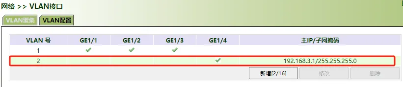

   
<strong>图 4-4 VLAN 添加成功</strong>

4. 可在”VLAN Trunk”页面选择接口的链路类型。
   
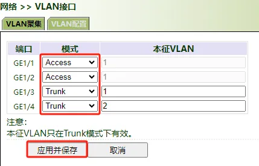

   
<strong>图 4-5 VLAN Trunk配置</strong>

### 4.1.3 ADSL拨号（PPPoE）

PPPoE（Point-to-Point Protocol over Ethernet，可以理解为：宽带拨号上网的"握手协议"）配置。

1. 进入【网络】>>【ADSL拨号(PPPoE)】菜单。
2. 在“拨号池”栏中选择用于连接的接口，点击“添加”。
3. 在“PPPoE列表”栏输入用户名、密码及池标识（池标识需与拨号池ID一致），点击“新增”，再点击“应用并保存”。
   
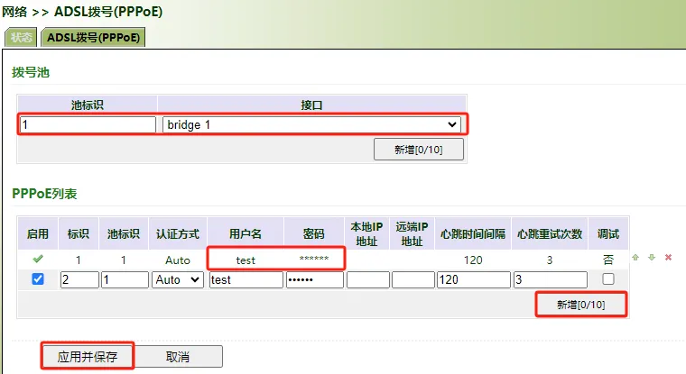

   
<strong>图 4-6 PPPoE配置</strong>

### 4.1.4 Wi-Fi

网关可用作AP（接入点）或客户端（STA）。当用作AP时，其他用户可通过Wi-Fi经由网关访问互联网。当用作客户端时，网关连接到AP以进行互联网访问。状态栏显示网关的当前Wi-Fi连接状态。

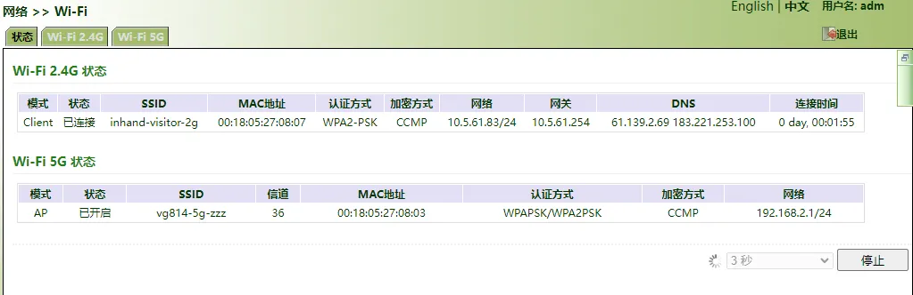

<strong>图 4-7 Wi-Fi 连接状态</strong>

**AP模式配置**：进入【网络】>>【Wi-Fi】>>【Wi-Fi 2.4G或Wi-Fi 5G】，选择”AP”作为接入点模式，输入SSID、身份验证方法和密钥，点击”应用并保存”。

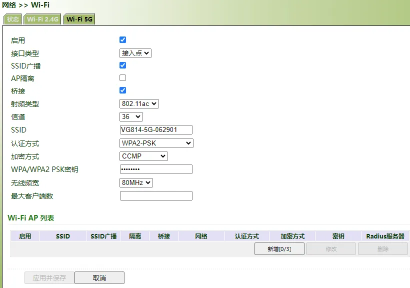

<strong>图 4-8 Wi-Fi AP 模式配置</strong>

**客户端模式配置**：选择”客户端”模式，输入Wi-Fi SSID和密钥，点击”应用并保存”。

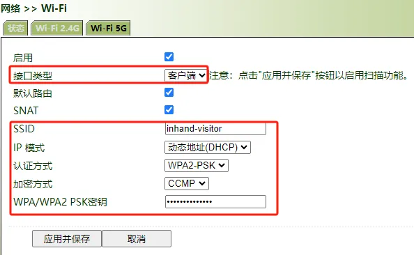

<strong>图 4-9 Wi-Fi 客户端模式配置</strong>

### 4.1.5 环回接口

多IP支持配置允许添加多个环回端口。
进入【网络】>>【环回接口】>>【多IP支持】菜单，配置IP地址，点击”新增”，再点击”应用并保存”。

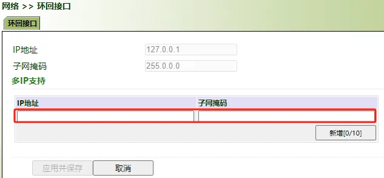

<strong>图 4-10 环回接口配置</strong>

### 4.1.6 二层交换机状态

可检查GE1至GE4的网络连接状态。LINK UP表示已连接，LINK DOWN表示断开。

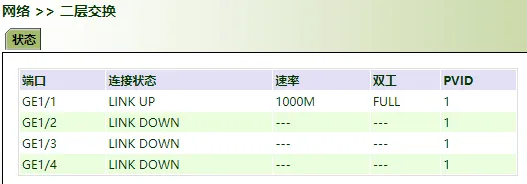

<strong>图 4-11 二层交换机状态</strong>

## 4.2 基础服务

### 4.2.1 DHCP服务

DHCP（Dynamic Host Configuration Protocol，可以理解为：网络中的"自动分配员"，自动为接入的设备分配IP地址等网络参数）支持作为服务器或客户端使用，且与DHCP转发功能互斥。

- **配置DHCP服务器**：进入【服务】>>【DHCP服务】>>【DHCP服务器】菜单，选中“启用”，选择接口并设置起始、结束IP地址，点击“新增”和“应用并保存”。
  
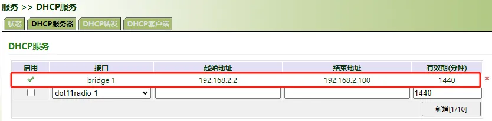

  
<strong>图 4-12 DHCP服务器配置</strong>

- **配置DHCP转发**：进入【服务】>>【DHCP服务】>>【DHCP转发】菜单，启用并输入中继服务器地址。
  
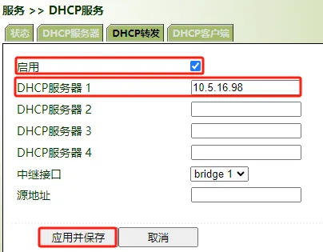

  
<strong>图 4-13 DHCP 转发配置</strong>

- **配置DHCP客户端**：进入【网络】>>【DHCP服务】>>【DHCP客户端】，选择网关接口，点击"应用并保存"。
  
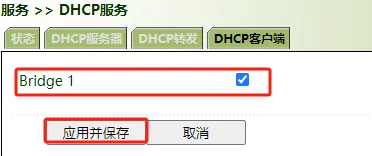

  
<strong>图 4-14 DHCP 客户端配置</strong>

### 4.2.2 DNS与DDNS

- **DNS服务**：进入【服务】>>【DNS服务】>>【域名服务器】菜单，输入DNS服务器的地址，点击"应用并保存"。
  
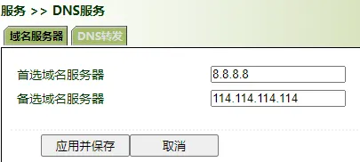

  
<strong>图 4-15 DNS 域名服务器配置</strong>

- **DNS转发**：若需开启DNS转发（如充当DNS代理），进入【DNS转发】启用并配置域名映射。如果已启用DHCP服务，DNS转发默认启用且不可禁用。
  
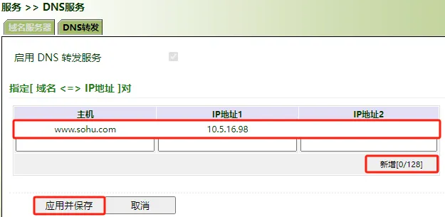

  
<strong>图 4-16 DNS 转发配置</strong>

- **DDNS服务**：DDNS将网关的动态IP地址映射到固定域名，即使IP地址发生变化，也可通过域名访问设备。
  - 若使用自定义服务，设置"方法名称"，在"服务类型"中选择"Custom"，在"Url"中输入DDNS URL表达式（实际URL由服务提供商提供），点击"新增"。
  - 若使用标准域名服务商，设置"方法名称"和"服务类型"，输入从服务器获得的用户名、密码和主机名，点击"新增"。
  - 选择网关接口，输入DDNS更新方法的名称，点击"新增"，然后点击"应用并保存"，将DDNS更新方式应用到网关接口。
  
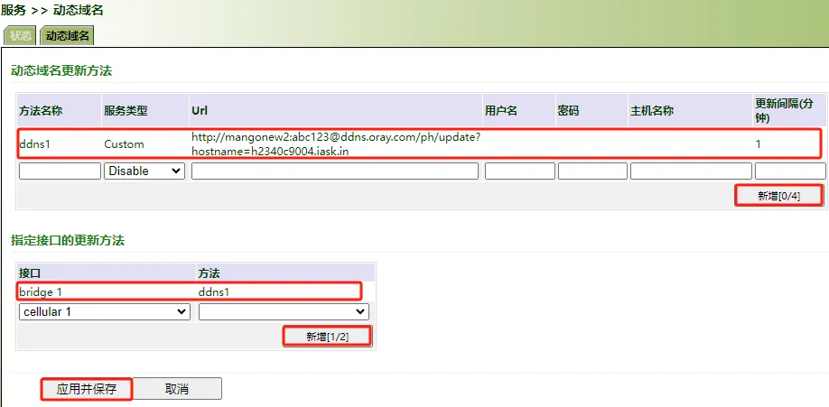

  
<strong>图 4-17 DDNS 配置</strong>

  - 应用并保存DDNS设置后，等待几分钟，然后通过Ping域名服务器的主机名确认DDNS服务是否生效。
  
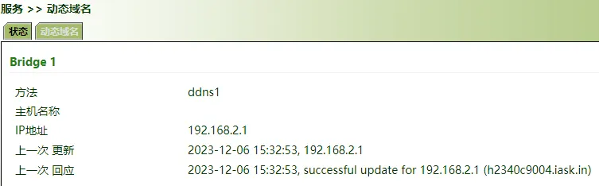

  
<strong>图 4-18 DDNS 验证一</strong>

  
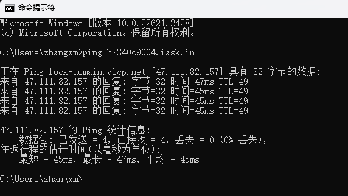

  
<strong>图 4-19 DDNS 验证二</strong>

### 4.2.3 SMS短消息控制

通过SMS（短信）接收白名单命令，实现重启设备或手动拨号。进入【服务】>>【短信服务】启用功能，并在“短信访问控制”中添加授权的手机号码。

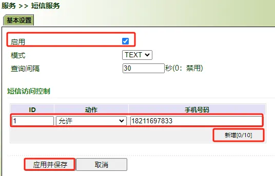

<strong>图 4-20 短信控制配置</strong>

### 4.2.4 GNSS位置服务

设备默认启用定位功能。

- **查看状态**：显示当前经纬度及搜星信息。
  
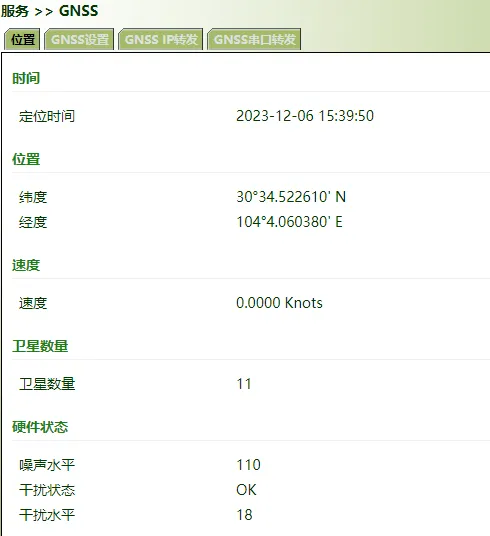

  
<strong>图 4-21 GNSS状态展示</strong>

- **GNSS IP转发**：支持通过IP（客户端/服务端）将NMEA数据转发至监控平台。
  
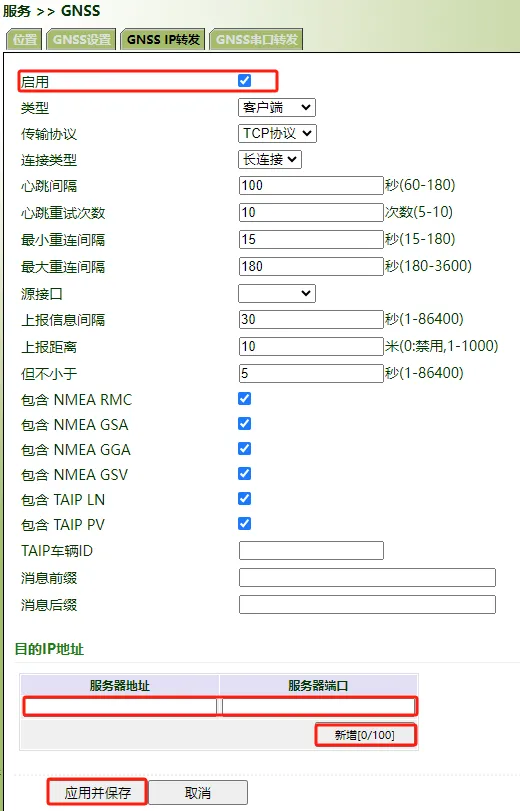

  
<strong>图 4-22 GNSS IP转发配置</strong>

- **GNSS串口转发**：进入【服务】>>【GNSS】>>【GNSS串口转发】，启用后选择串行端口类型，确保波特率、数据位、奇偶校验位和停止位设置一致，点击"应用并保存"。
  
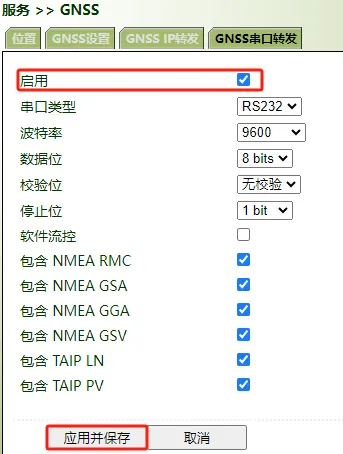

  
<strong>图 4-23 GNSS 串口转发配置</strong>

### 4.2.5 QoS与流量控制

- **QoS配置**：用于限制带宽或优先处理特定协议数据流。

  - 进入【服务】>>【QoS】>>【流量控制】>>【应用QoS】，选择网关接口，输入出口最大带宽，点击"新增"，再点击"应用并保存"。

    
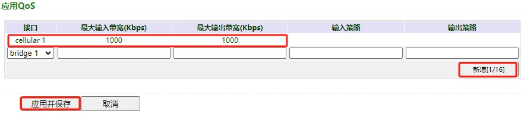

    
<strong>图 4-24 QoS 出口带宽控制</strong>

  - 添加网络链接分类器：进入【QoS】>>【流量控制】>>【类】，勾选"任意报文"，设置链接的源地址和目标地址，选择传输协议，点击"新增"。

  - 设置传输策略：进入【QoS】>>【流量控制】>>【策略】，输入自定义策略名称，设置认证策略、保证带宽、最大带宽和策略优先级，点击"新增"。
  - 在"应用QoS"中，选择网关接口，在"输入策略"和"输出策略"中输入策略名称，点击"新增"，然后点击"应用并保存"。

    
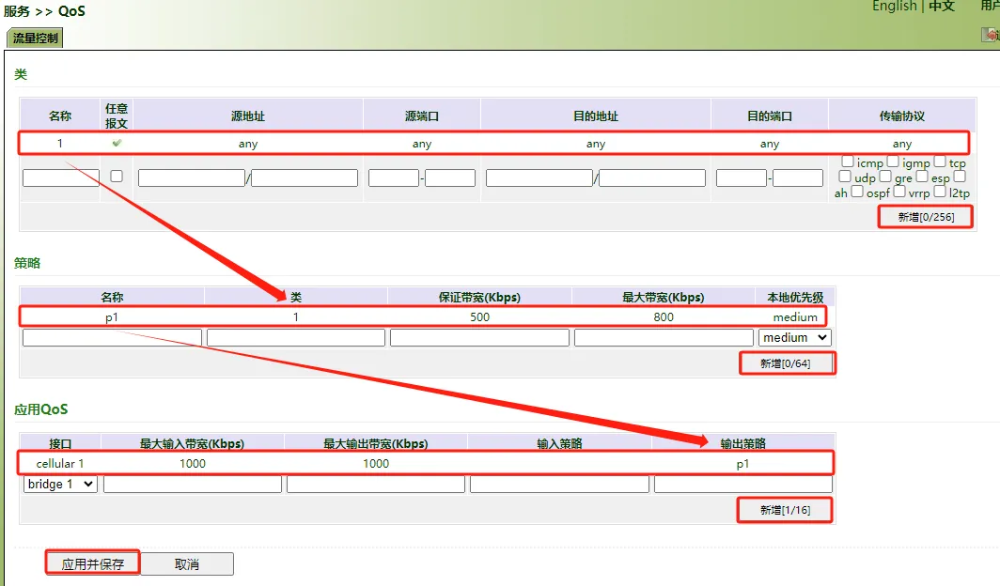

    
<strong>图 4-25 QoS 策略配置</strong>

- **流量控制**：用于超额限制。在【服务】>>【流量控制】中设定配额，超限后系统可触发警告或断网。
    
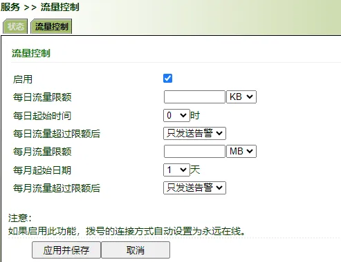

    
<strong>图 4-26 流量控制配置</strong>

## 4.3 VPN协议参考

VPN（Virtual Private Network，可以理解为：在公共网络上搭建的一条"专属秘密通道"）用于在公网上加密通信。除了IPsec之外，设备还支持以下VPN：

### 4.3.1 GRE隧道

GRE协议支持封装网络层协议数据报。以下示例通过公共网络为VG814_A和VG814_B启用GRE。

<strong>图 4-27 GRE 隧道组网拓扑</strong>

进入【VPN】>>【GRE】菜单：

1. 点击"新增"。
   
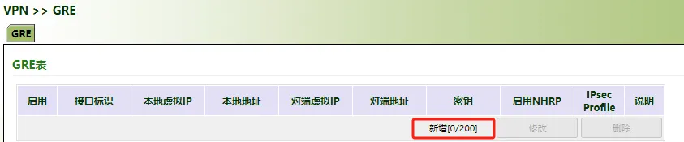

   
<strong>图 4-28 GRE 新增隧道入口</strong>

2. 根据需要设置"接口标识"，选择"点对点"或"子网"作为"网络类型"。设置"本地虚拟IP"和"对端虚拟IP"，确保它们位于同一网段上。输入源和对端地址及密钥，点击"应用并保存"。
   
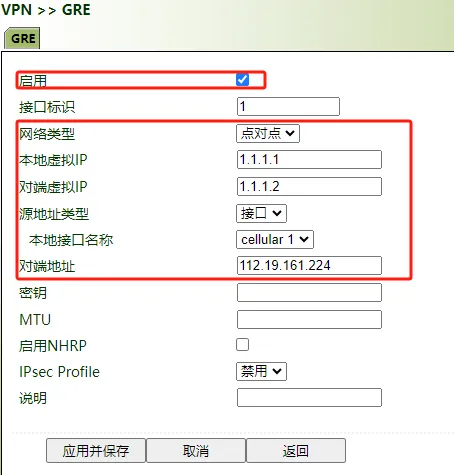

   
<strong>图 4-29 GRE 隧道参数配置</strong>

3. 以相同方式设置VG814_B。VG814_B的虚拟IP和对端IP地址必须与VG814_A的对应，且密钥必须一致。

### 4.3.2 L2TP隧道

设备可作为L2TP客户端：

1. 进入【VPN】>>【L2TP】>>【L2TP客户端】>>【L2TP Class】，输入L2TP类的名称，点击"新增"。
   
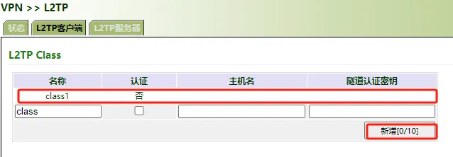

   
<strong>图 4-30 L2TP Class 配置</strong>

2. 配置Pseudowire Class：输入名称，"L2TP类"选择与上一步创建的类相同，将"源接口"设置为连接到服务器的接口，选择L2TPV2作为"数据封装协议"，点击"新增"。
   
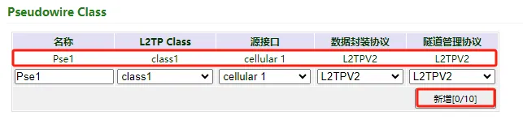

   
<strong>图 4-31 Pseudowire Class 配置</strong>

3. 设置L2TPV2隧道参数：输入L2TP服务器的域名或IP地址，"Pseudowire Class"选择上一步创建的条目，输入在服务器上创建的用户名和密码，点击"应用并保存"。
   
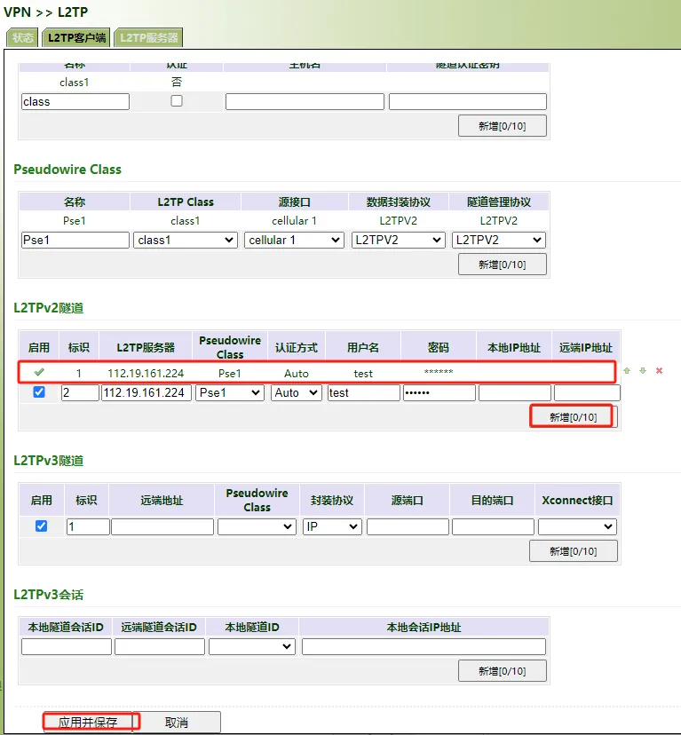

   
<strong>图 4-32 L2TP 隧道参数配置</strong>

4. 配置完成后，访问L2TP状态页面查看连接状态。
   
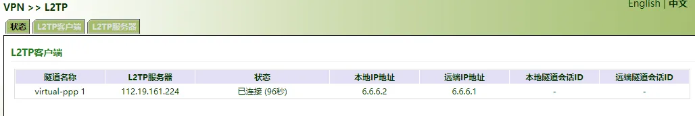

   
<strong>图 4-33 L2TP 连接状态</strong>

### 4.3.3 OpenVPN

基于OpenSSL库的应用层VPN，支持多种身份验证方法。

| 身份验证方法 | 操作说明 |
| --- | --- |
| None | 不需要身份验证 |
| 用户名/密码 | 输入OpenVPN服务器上的用户名和密码，并导入CA证书、公钥和私钥 |
| 预共享密钥 | 输入OpenVPN服务器上的预共享密钥 |
| 数字证书 | 导入CA证书、公钥和私钥 |
| 数字证书/用户名/密码 | 输入用户名和密码，并导入CA证书、公钥和私钥 |
| 数字证书/TLS认证 | 输入预共享密钥，并导入CA证书、公钥和私钥 |
| 数字证书/TLS认证/用户名/密码 | 输入预共享密钥、用户名和密码，并导入CA证书、公钥和私钥 |

1. 在OpenVPN配置中填写服务器端参数，确保证书或密钥与服务端匹配。
   
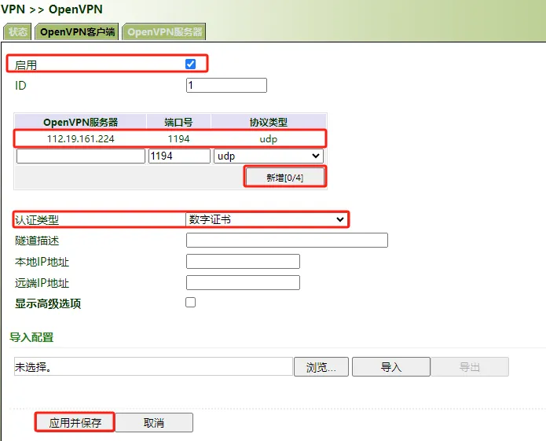

   
<strong>图 4-34 OpenVPN参数设置</strong>

2. 若使用数字证书验证，需进入【证书管理】导入或在线申请CA/公钥/私钥。
   
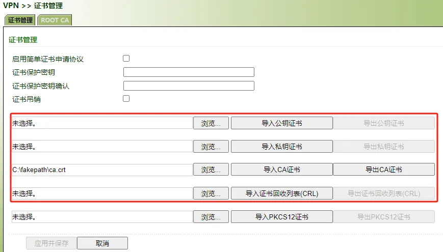

   
<strong>图 4-35 证书导入管理</strong>

## 4.4 防火墙

### 4.4.1 访问控制列表（ACL）

ACL（访问控制列表）可根据预设条件过滤数据包。

- **示例场景**：阻止局域网中IP为192.168.2.100的设备访问外网。
- **配置方法**：进入【防火墙】>>【访问控制(ACL)】，动作选择“拒绝”，源IP填入192.168.2.100，目的IP留空（表示所有），保存后添加应用到网桥规则中。
  
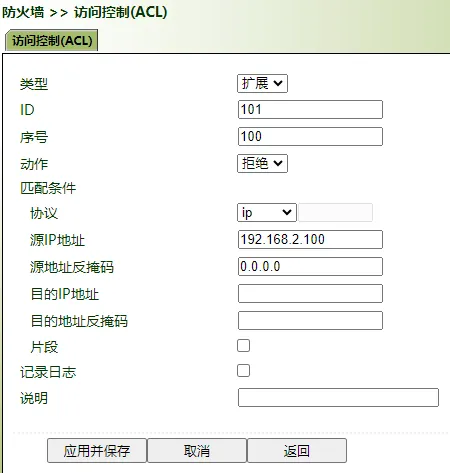

  
<strong>图 4-36 ACL规则配置</strong>

### 4.4.2 网络地址转换（NAT）

NAT（Network Address Translation，可以理解为：网络中的"翻译官"）常用于端口映射。

- **配置方法**：进入【防火墙】>>【网络地址转换(NAT)】，添加规则。动作选择DNAT，将拨号口的外部端口（如20000）映射到内部摄像头的IP及端口（如192.168.2.100:18000）。
  
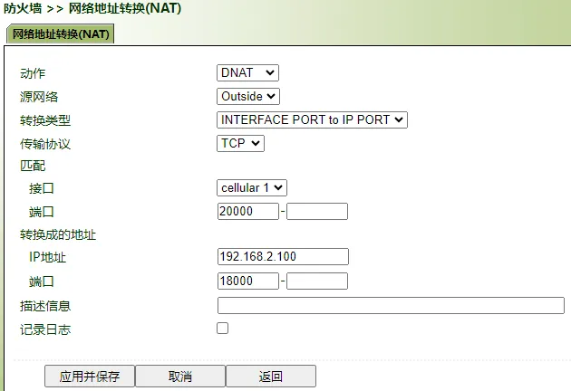

  
<strong>图 4-37 NAT端口映射配置</strong>

### 4.4.3 MAC-IP 绑定

将设备的MAC地址（Media Access Control Address，可以理解为：设备网卡的"身份证号"）与IP绑定，未绑定的设备将无法通过网关上网。
在【访问控制(ACL)】中将默认策略设为阻止，然后在【MAC-IP绑定】中添加允许上网的设备信息。

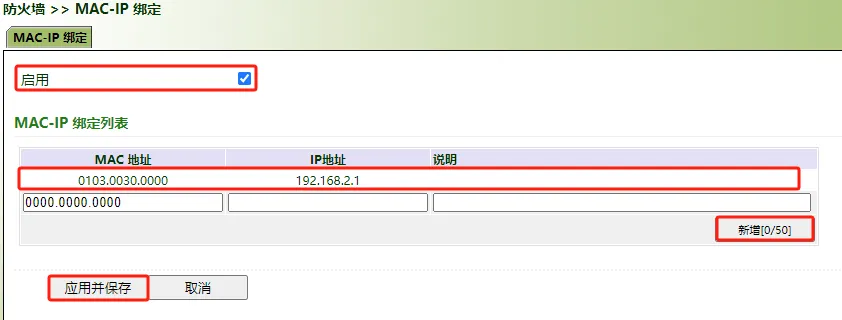

<strong>图 4-38 MAC-IP绑定配置</strong>

## 4.5 路由设置

### 4.5.1 静态路由

进入【路由】>>【静态路由】>>【新增】，设置目标网络地址、子网掩码以及转发的接口或网关地址。

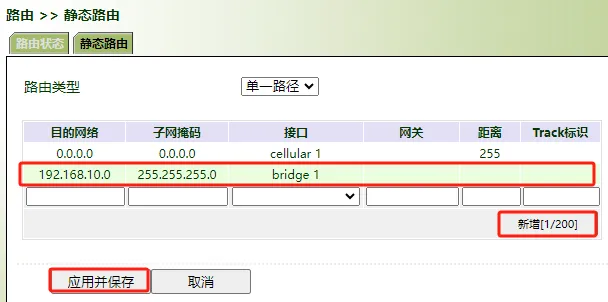

<strong>图 4-39 静态路由配置</strong>

### 4.5.2 动态路由

网关支持RIP、OSPF和BGP三种内部或边界网关协议。

1. **RIP配置**：在【路由】>>【动态路由】>>【RIP】中启用，并添加本地参与路由的网络地址。
   
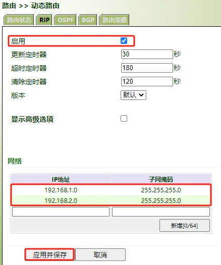

   
<strong>图 4-40 RIP动态路由配置</strong>

2. **OSPF配置**：在【OSPF】中配置Route ID及网络地址段即可。
   
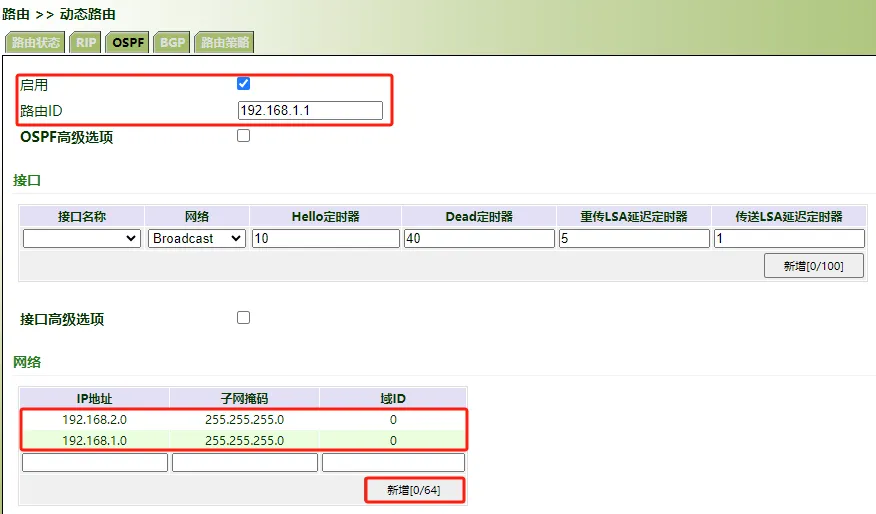

   
<strong>图 4-41 OSPF动态路由配置</strong>

3. **BGP配置**：在【BGP】中设定自身的AS号，并在“邻居”列表中加入对端路由器的IP及对应AS号。
   
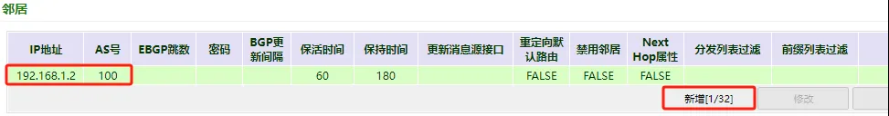

   
<strong>图 4-42 BGP邻居配置</strong>

## 4.6 链路备份机制

### 4.6.1 SLA 与 Track

SLA用于探测网络链路是否正常响应，Track模块则将探测结果应用于路由或VPN备份。

- **SLA检测**：进入【链路备份】>>【SLA】，配置目标检测IP和超时及次数参数。
  
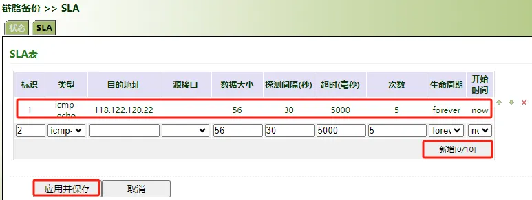

  
<strong>图 4-43 SLA检测配置</strong>

- **Track配置**：在【Track模块】中关联SLA条目，并可配置故障恢复切换的延迟时间。
  
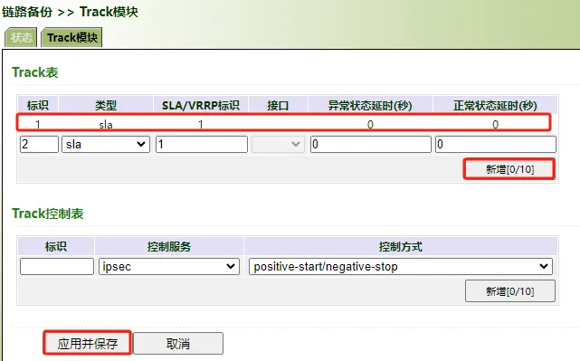

  
<strong>图 4-44 Track联动配置</strong>

### 4.6.2 VRRP

多网关环境中使用VRRP可实现硬件级别的高可用冗余。主网关（优先级高）故障时，备用网关接管IP。

- **配置方法**：在两台网关的【链路备份】>>【VRRP】中配置相同的虚拟路由器ID及虚拟IP，为主网关设置较高的优先级（如110），备网关设置100，并勾选“抢占”模式。
  
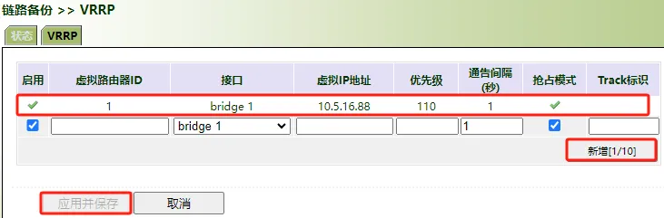

  
<strong>图 4-45 VRRP主网关配置</strong>

### 4.6.3 接口备份

实现不同上网方式的自动切换（如Wi-Fi断开自动切换到蜂窝数据）。

1. 添加SLA和Track规则以检测Wi-Fi网关状态。
2. 在【接口备份】中，将主接口设为“dot11radio1”（Wi-Fi），备份接口设为“cellular1”。

  
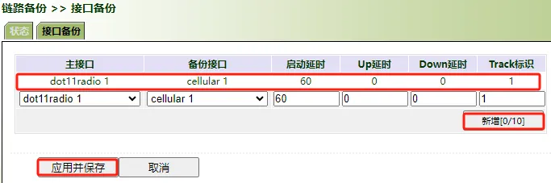

  
<strong>图 4-46 接口备份配置</strong>

## 4.7 快速向导

“向导”模块整合了常规功能的一键配置入口。

- **新建蜂窝/端口映射/IPsec隧道**：可在此菜单下通过简化版的参数直接建立相关服务，降低配置复杂度。
  
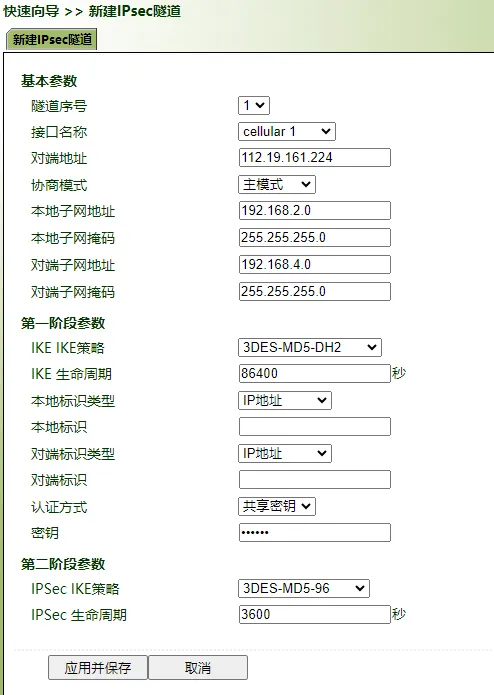

  
<strong>图 4-47 向导快速建立 IPsec 隧道</strong>

  
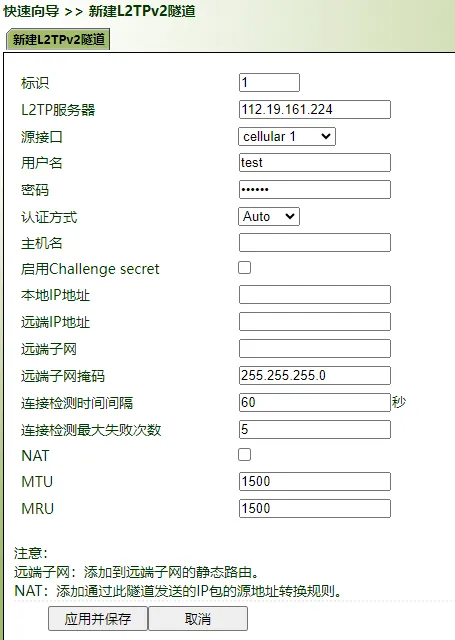

  
<strong>图 4-48 向导快速建立 L2TP 隧道</strong>

## 4.8 边缘计算与应用功能

设备支持边缘计算能力，可运行Python程序或Docker容器，处理并上报数据。使用此功能需预先安装相应的Python SDK或启用Docker引擎。

### 4.8.1 Python APP 状态与管理

- **APP状态**：在【APP状态】页面可查看当前Python环境、升级SDK并监控应用运行情况。
  
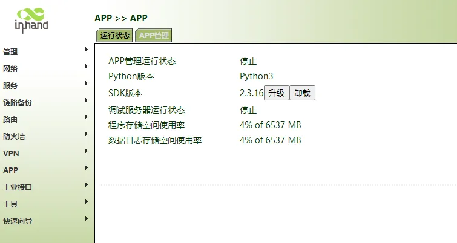

  
<strong>图 4-49 APP 状态页面</strong>

- **APP管理**：用于导入并管理第三方Python应用。如果需要进行二次开发调试，可在此开启IDE调试功能。选中导入的应用并点击“应用并保存”即可运行。有关二次开发的详细说明请参考：[映翰通开发资源下载](https://www.inhandnetworks.com/downlist/cid-114)
  
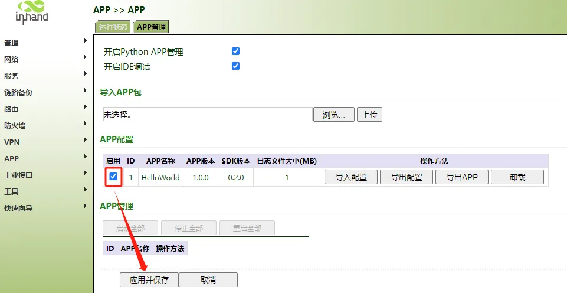

  
<strong>图 4-50 APP 管理界面</strong>

  
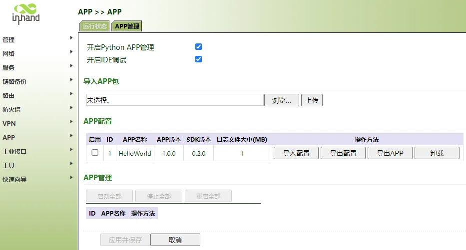

  
<strong>图 4-51 IDE 开发调试界面</strong>

### 4.8.2 Docker 容器支持

设备可开启Docker引擎来运行容器化应用。

- **启用Docker**：进入页面开启Docker引擎并分配存储空间。
  
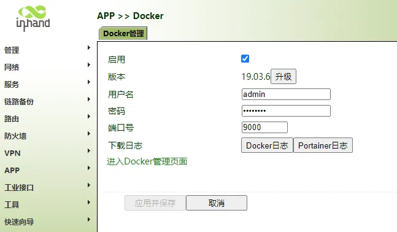

  
<strong>图 4-52 开启 Docker 功能</strong>

- **容器管理**：内置 [Portainer](https://www.portainer.io/) 管理工具。通过分配的端口登录（默认账号/密码通常为 `admin`/`12345678`）即可进行可视化的容器部署和监控。
  
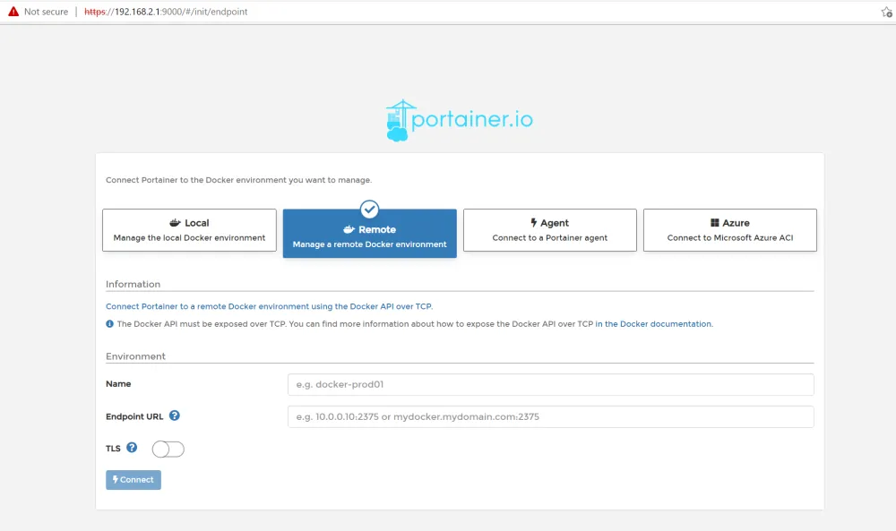

  
<strong>图 4-53 Portainer 登录管理页面</strong>

  
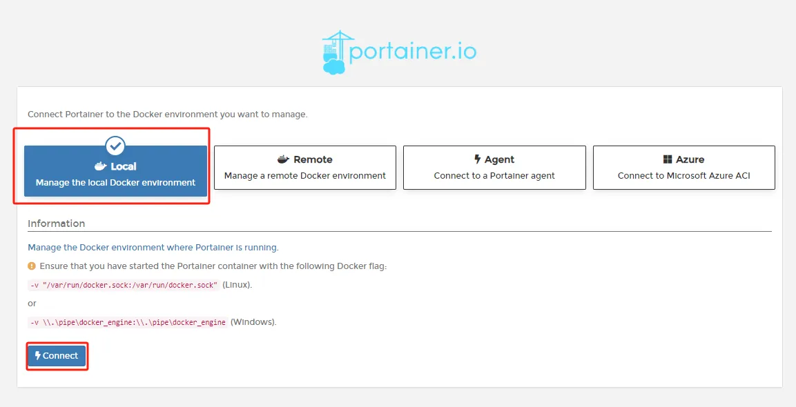

  
<strong>图 4-54 容器可视化管理入口</strong>

### 4.8.3 第三方云平台对接

支持通过MQTT或TCP/UDP协议将采集到的数据直接上报至第三方IoT云平台。

- **MQTT连接**：进入【第三方云平台】>>【MQTT】，填入云服务器的IP和端口。如果云平台要求认证和加密，可在此处一并开启TLS/认证参数。配置生效后，在“状态”页面确认是否显示为已连接。
  
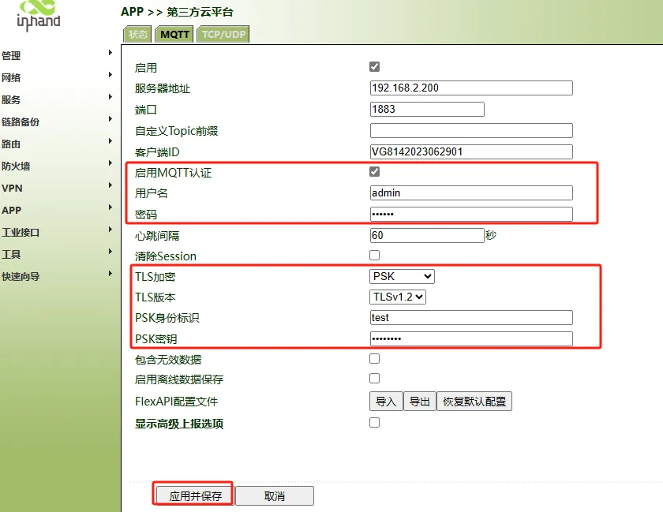

  
<strong>图 4-55 MQTT 云端连接配置</strong>

- **TCP/UDP连接**：适用于需要透传报文至固定服务器的场景。设定目标IP与端口即可建立长连接。
  
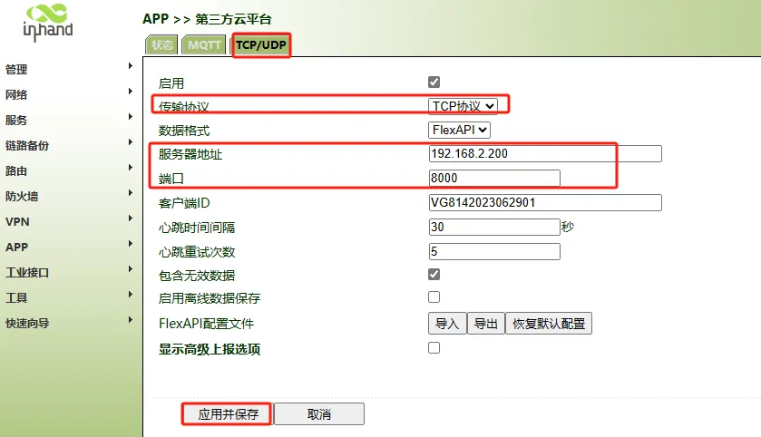

  
<strong>图 4-56 TCP/UDP 连接配置</strong>

### 4.8.4 本地MQTT代理与REST API

设备自身可充当MQTT Broker或提供RESTful接口供局域网内其他设备或本地App调用以获取状态数据。

- **本地MQTT代理**：启用该功能后，本地应用（如使用MQTT.fx等工具）即可作为客户端连接到设备的代理端口并订阅各类数据（如蜂窝信息等，将以JSON格式返回）。
  
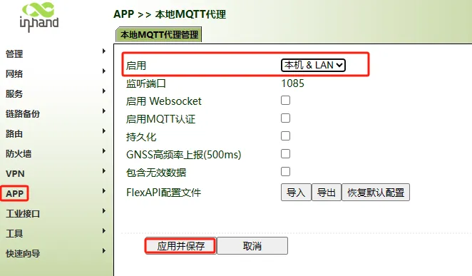

  
<strong>图 4-57 启用本地 MQTT 代理</strong>

- **REST API**：开启该服务后，可使用Postman等HTTP请求工具调用设备提供的API读取配置与运行状态。
  
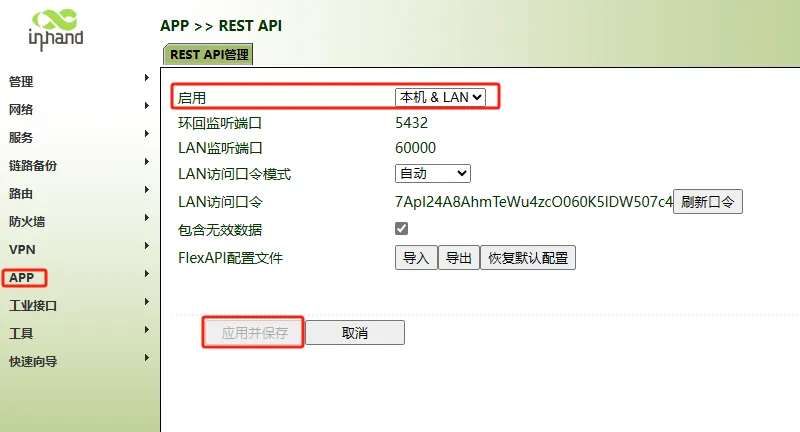

  
<strong>图 4-58 启用 REST API</strong>

### 4.8.5 Azure IoT Edge 与 自定义数据

- **Azure IoT Edge**：由于该组件底层基于Docker运行，需确保Docker服务已先行启动，随后勾选“启用”并配置IoT Hub的连接串。
  
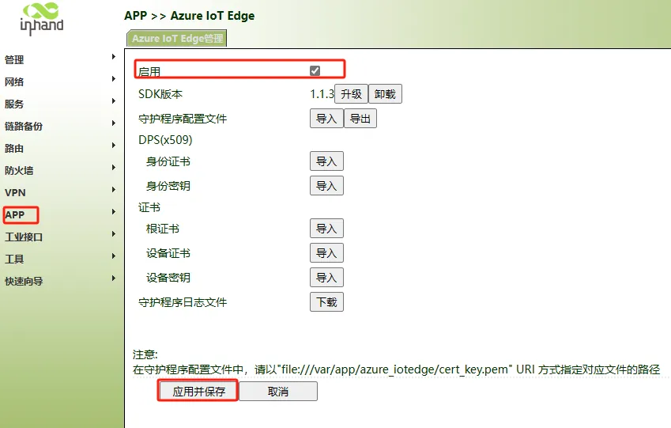

  
<strong>图 4-59 Azure IoT Edge 配置</strong>

- **自定义数据（用户数据）**：用户可在此录入静态的键值对信息（如资产编号等），便于脚本调用或云端读取。
  
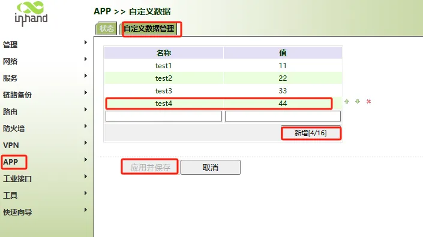

  
<strong>图 4-60 自定义数据维护</strong>

## 4.9 工业通信端口

VG814的工业端口包括RS-232、RS-485以及工业I/O端口。通过使用这些接口，设备可实现工业现场设备的串口透传（可以理解为："透明传输"，设备将串口收到的原封不动地通过网络发出去）与开关量控制。

### 4.9.1 DTU（数据传输单元）

DTU（Data Transfer Unit，可以理解为："数据搬运工"，专门负责将串口数据转换成网络数据进行传输）功能可将RS-232或RS-485接收到的串口数据封装为TCP/UDP报文并发送至远端服务器。

- **开启通道**：支持多达3个串口通道的独立映射（DTU1对应RS232-1，DTU2对应RS232-2，DTU3对应RS-485）。
  
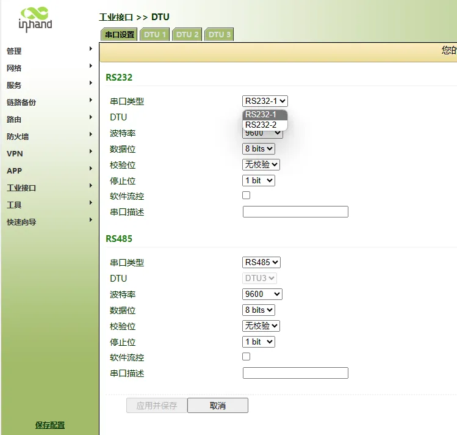

  
<strong>图 4-61 启用 DTU 通道</strong>

- **配置远端服务器**：指定目标服务器的IP地址和传输协议。
  
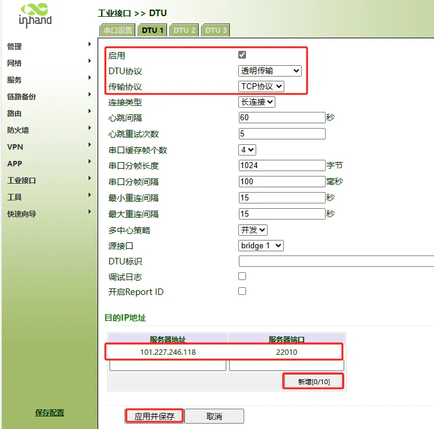

  
<strong>图 4-62 配置目标服务器参数</strong>

- **注册包与心跳**：创建并启用服务器后，网关通过DTU功能连接服务器，连接成功后网关会自动向服务器发送DTU标识（若DTU标识参数为空则不发送）。
  
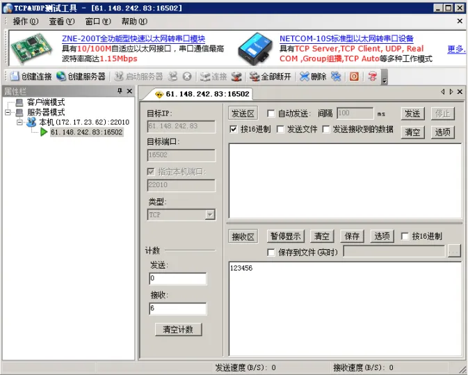

  
<strong>图 4-63 DTU 注册包与心跳配置</strong>

- **数据交换**：连接网关的PC可通过DTU功能与服务器相互发送数据。
  
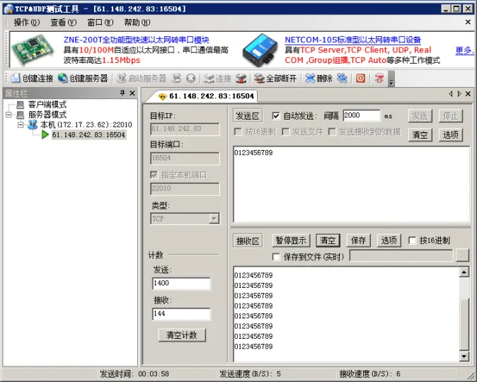

  
<strong>图 4-64 DTU 数据交换示例一</strong>

  
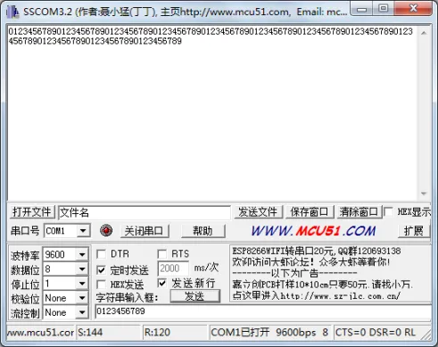

  
<strong>图 4-65 DTU 数据交换示例二</strong>

### 4.9.2 数字输入/输出（DI/DO）

设备的I/O接口（Input/Output，可以理解为：设备的"感官和手脚"）支持11路数字输入（DI）和4路数字输出（DO），对应高（1）与低（0）两种逻辑状态。

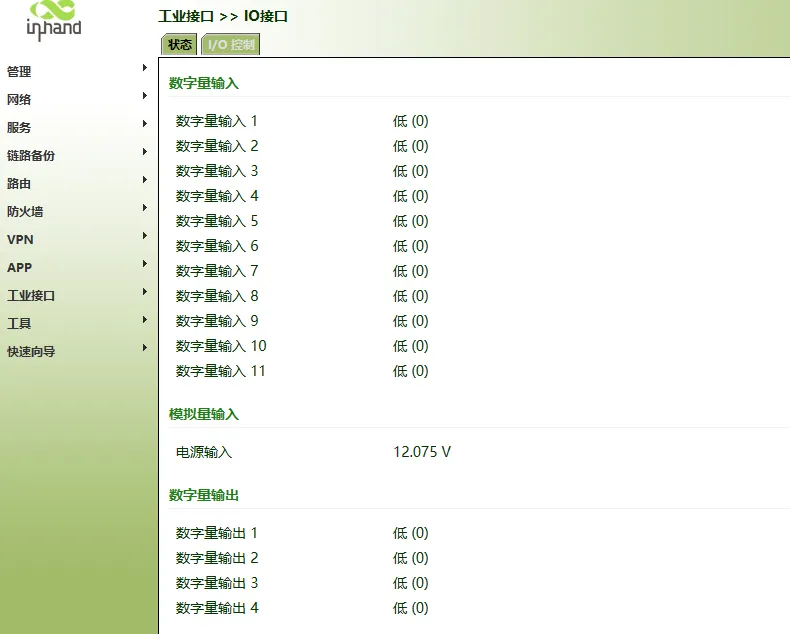

<strong>图 4-66 I/O 配置管理页面</strong>

**电气特性说明**

- **VG814 铁路版本**：
  - **电源输入范围**：DC 9V ~ 36V
  - **DI（湿触点）**：最大耐受电压为系统供电电压。输入 < 5V 视为低电平（L），> 7.2V 视为高电平（H）。
  - **DI（干触点）**：内部提供 12V 上拉电平（20KΩ 上拉电阻）。需通过命令行开启相应端口的内部上拉。
  - **DO（漏极开路模式）**：最大耐压DC 36V，典型灌入电流 450mA。
  - **DO（上拉输出模式）**：开路测试电压为12V，通过20KΩ上拉，无实际负载驱动能力。

- **VG814 公路版本**：
  - **电源输入范围**：DC 9V ~ 48V
  - **DI（湿触点）**：最大耐受电压为系统供电电压。输入 < 1V 视为低电平，> 2.7V 视为高电平。
  - **DI（干触点）**：内部提供等同于供电电压的上拉电平（20KΩ 上拉电阻）。
  - **DO（漏极开路模式）**：最大耐压DC 48V，典型灌入电流 450mA。
  - **DO（上拉输出模式）**：开路测试电压等同于系统供电电压，通过20KΩ上拉，无负载能力。

**接线模式与上拉配置**

针对干接点场景，用户需使用CLI命令行启用特定DI端口的内部上拉（如设置DI1为 `On` 或 `1`）。湿接点模式下需禁用内部上拉（`Off` 或 `0`）。

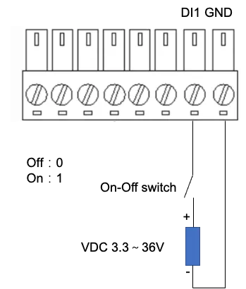

<strong>图 4-67 湿接点配置（关闭上拉）示例</strong>

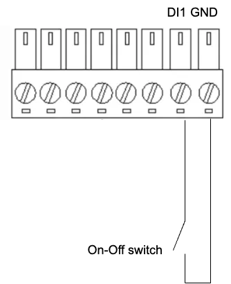

<strong>图 4-68 干接点配置（开启上拉）示例一</strong>

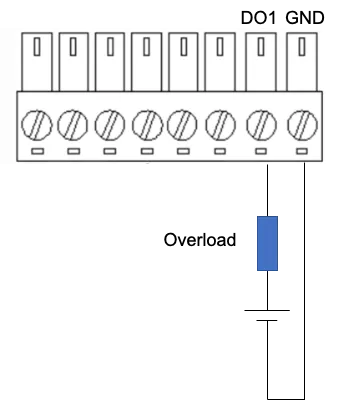

<strong>图 4-69 干接点配置（开启上拉）示例二</strong>

## 4.10 系统管理与诊断

### 4.10.1 基础系统设置

- **系统状态与基本设置**：进入【管理】>>【系统】>>【状态】可查看设备当前的整体运行和网络状态。在【基本设置】页签中，可修改系统的显示语言和设备名称。
  
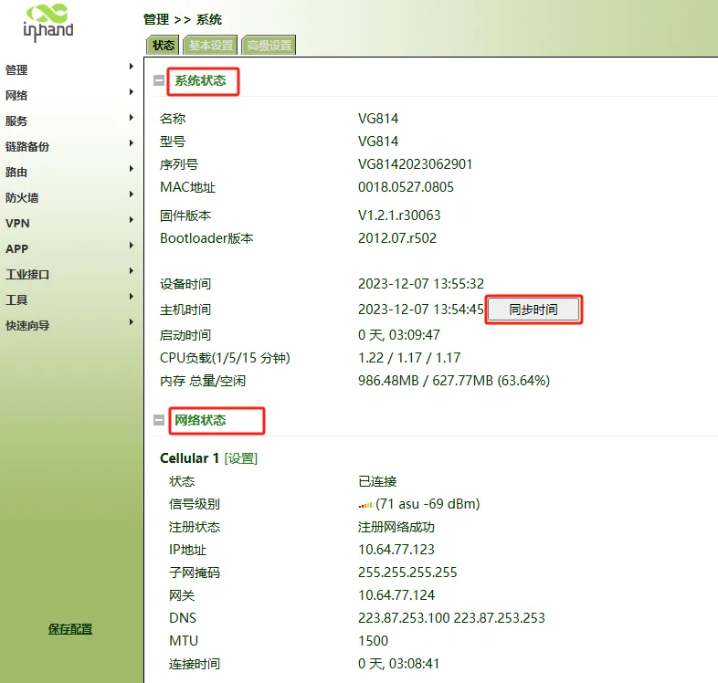

  
<strong>图 4-70 系统状态监控</strong>

- **系统时间**：为确保设备间协同，需准确设置时间。
  - **手动同步**：在【管理】>>【系统时间】中点击“同步时间”，使设备与当前操作电脑的时间对齐。
  - **自动同步**：勾选“启用”SNTP客户端或NTP服务器功能，配置服务器地址。若启用NTP服务器，网关也可为局域网内的其他下游设备提供时间同步服务。
  
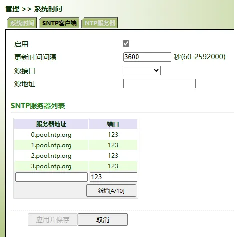

  
<strong>图 4-71 自动时间同步配置</strong>

- **管理服务控制**：在【管理】>>【管理服务】中，可独立开启或关闭HTTP、HTTPS、Telnet与SSH服务。
  
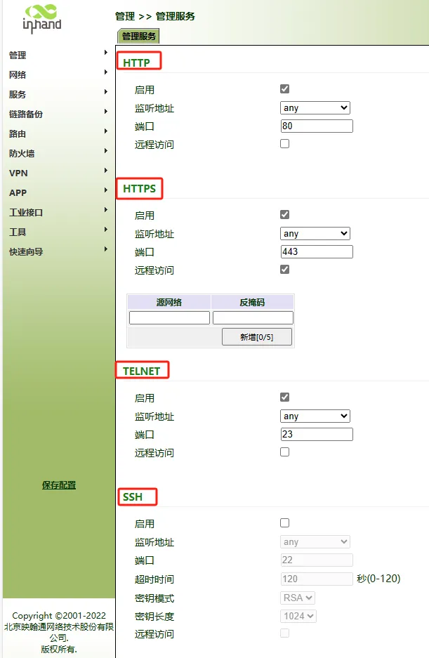

  
<strong>图 4-72 开启或关闭系统管理服务</strong>

- **配置管理**：在【管理】>>【配置管理】中，可将当前配置“备份运行配置”或“备份启动配置”至本地电脑，也可通过上传文件“导入”原有配置。点击“恢复出厂设置”可将设备初始化为默认参数。
  
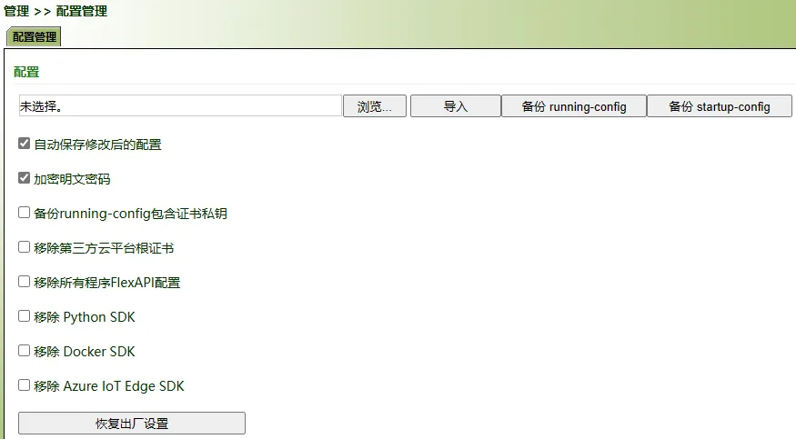

  
<strong>图 4-73 系统配置导入导出与恢复</strong>

### 4.10.2 用户与AAA安全管理

- **本地用户管理**：进入【管理】>>【用户管理】，可管理两类用户权限：
  - **超级用户**：系统默认存在的用户（`adm`），拥有全部权限，不可删除或修改用户名，但可修改密码。
  - **普通用户**：由超级用户创建，拥有查看或修改部分配置的受限权限。
  
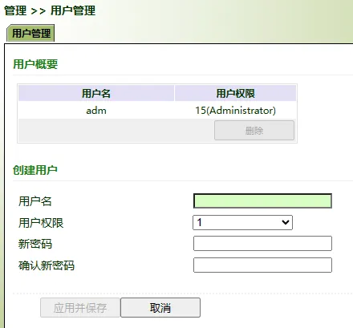

  
<strong>图 4-74 本地用户维护</strong>

- **AAA认证授权服务**：系统支持通过AAA（Radius、Tacacs+、LDAP）实现集中的认证（Authentication）、授权（Authorization）与计费（Accounting）。AAA通常采用客户端/服务器结构，可扩展性强，便于对用户信息进行集中管理。
  
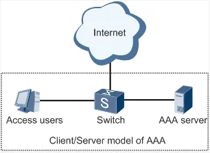

  
<strong>图 4-75 AAA 客户端/服务器架构</strong>

  
- **配置Radius/Tacacs+/LDAP服务器**：分别进入相应的菜单下添加服务器的IP、端口与密钥。

  
- **配置AAA认证优先级**：在【AAA认证】页面中组合本地认证与远程认证的优先级。当配置了多个远程服务时，其默认生效优先级通常为Radius > Tacacs+ > LDAP。
  
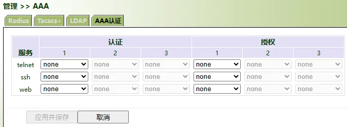

  
<strong>图 4-76 设定 AAA 认证授权顺序</strong>

### 4.10.3 SNMP 网络管理

通过SNMP代理可对设备进行远程监控与网络管理，支持v1、v2c及安全的v3版本。

- **开启与配置**：在【管理】>>【SNMP】菜单中启用并选择对应的版本。如选用v3版本，需在页面配置用户组与相关的认证/加密密码。
  
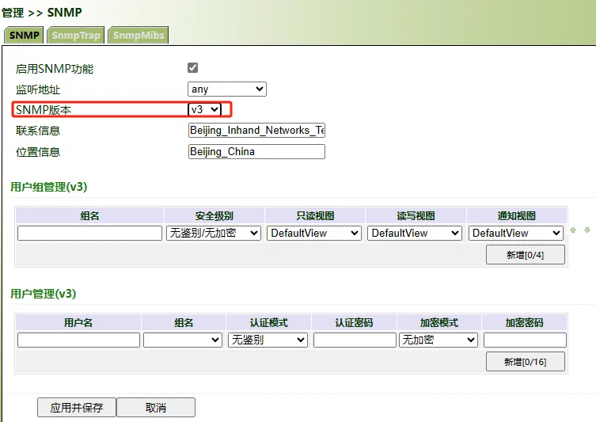

  
<strong>图 4-77 SNMP v3 用户配置</strong>

- **SnmpTrap（告警通知）**：网关可主动向管理站（NMS）报告设备错误。在“SnmpTrap”页面填入NMS的IP地址及对应的团体名或用户名即可生效。
  
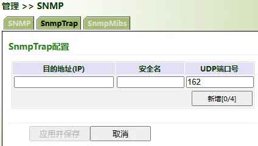

  
<strong>图 4-78 设定 SnmpTrap 接收端</strong>

- **SnmpMibs 文件下载**：在“SnmpMibs”页面可将设备支持的标准MIBs和私有MIBs文件打包下载至本地电脑，随后导入至网管软件中。
  
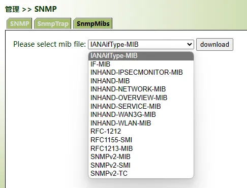

  
<strong>图 4-79 下载 SnmpMibs 文件</strong>

  

  
<strong>图 4-80 SNMP OID 树状结构参考</strong>

### 4.10.4 告警与日志

- **告警（Alarm）管理**：
  - **查看状态**：在【管理】>>【告警】>>【状态】页面，可查看系统自上电以来的事件（EMERG、CRIT、WARN、NOTICE、INFO级别），包含已产生未确认（Raise）或已确认（Confirm）的告警。
  - **告警配置与邮件输出**：在“告警输入”中勾选需要关注的异常事件。如需邮件通知，可在“Email告警”配置SMTP发件服务器参数，并在“邮件地址”中填入接收者信息。
  
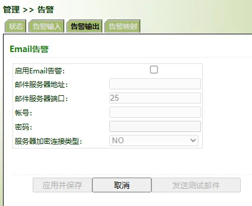

  
<strong>图 4-81 配置 Email 告警</strong>

- **系统日志**：
  - 在【管理】>>【系统日志】页面可实时查看、清除或下载日志文件及历史诊断记录。
  - 由于设备内部存储空间有限（默认512KB），为确保记录完整，推荐在页面下方配置远程日志服务器（如Kiwi Syslog）的IP与端口进行外部持久化存储。
  
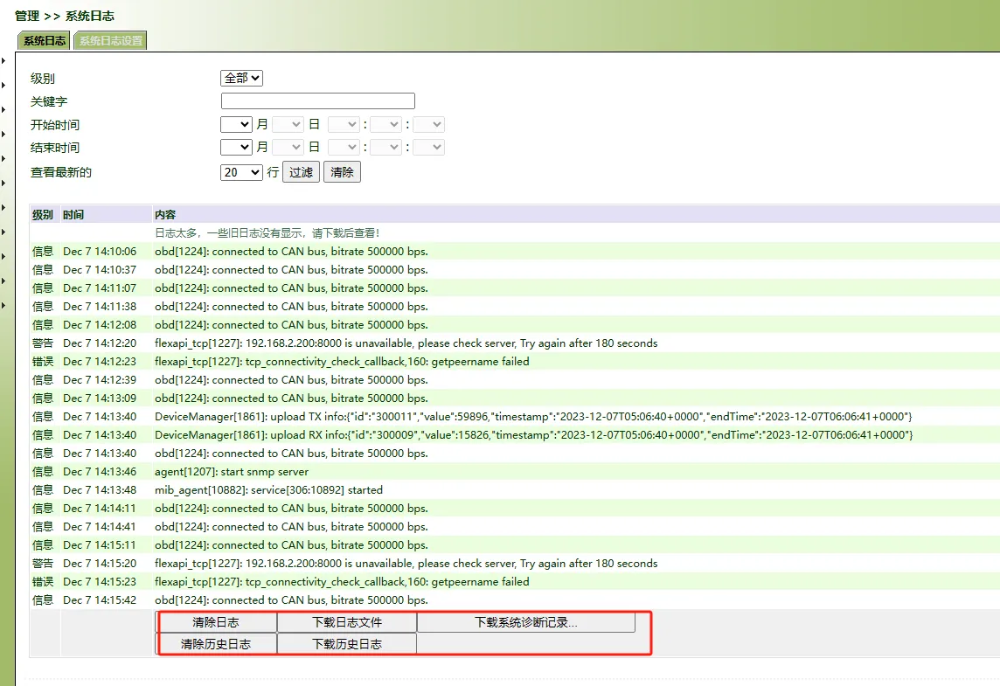

  
<strong>图 4-82 系统日志查看与导出</strong>

  
  > **注意**：“系统诊断记录”文件包含了设备的加密配置信息。若需查看，必须联系原厂技术支持获取专用解密工具。

### 4.10.5 系统维护与诊断工具

- **系统升级与重启**：
  - **升级**：进入【管理】>>【系统升级】>>【浏览】选择升级包文件，点击“升级”。
  > **警告**：软件升级过程中严禁断电或对当前网页进行任何其他操作，否则可能导致设备固件损坏或服务中断。
  - **重启**：在【管理】>>【重启系统】菜单下执行软重启。

- **诊断工具**：设备内置了多种诊断工具以帮助快速排查网络故障：
  - **PING探测**：填入目标网站或IP测试外部网络是否连通。
    
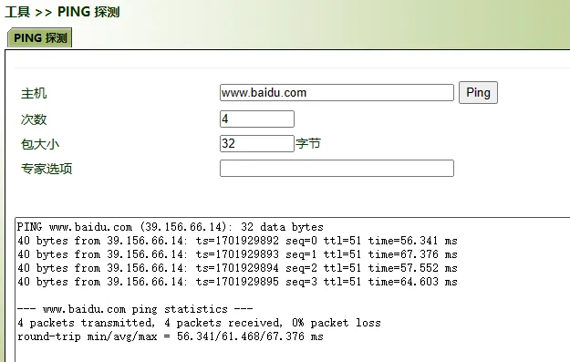

    
<strong>图 4-83 执行 PING 探测</strong>

  - **路由探测（Trace）**：跟踪到达目标主机经过的路由跳数与延迟情况。
    
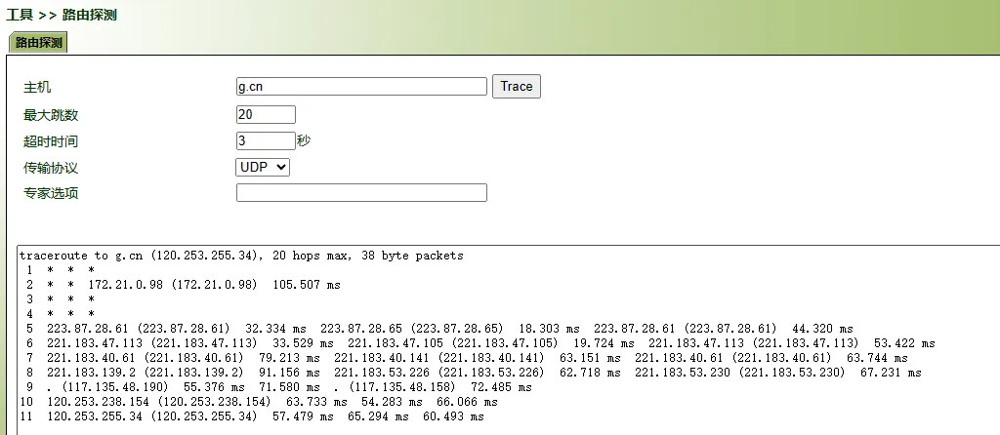

    
<strong>图 4-84 执行路由探测</strong>

  - **网络抓包**：选择接口并设置抓包数量后可在线抓取报文，并下载 `.pcap` 文件使用Wireshark等软件分析。
    
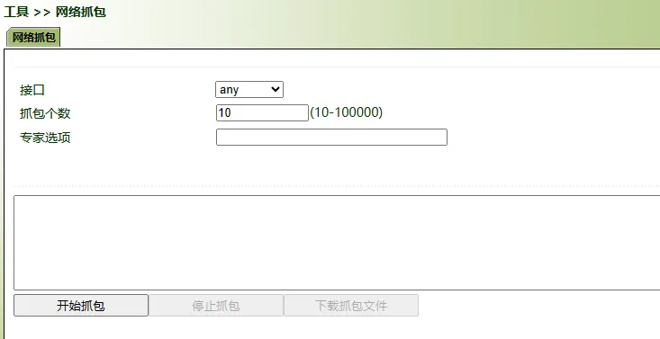

    
<strong>图 4-85 执行网络抓包</strong>

    
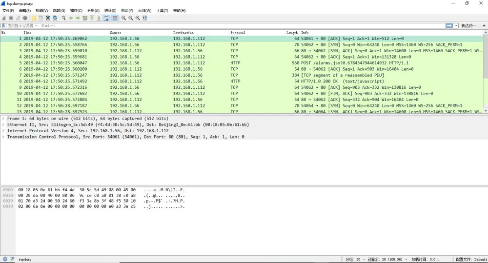

    
<strong>图 4-86 使用 Wireshark 分析抓包文件</strong>

  - **网速测试**：在设备端执行本地的上传/下载带宽测试。
    
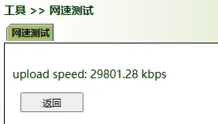

    
<strong>图 4-87 执行本地网速测试</strong>

# 第5章 典型应用

## 案例1：典型联网与云端管理应用

**场景描述**：
本案例展示如何将 VG814 部署在警用车辆中，通过 5G 蜂窝网络实现实时视频回传，并利用 InHand DeviceManager 云平台进行车辆轨迹跟踪和远程配置维护。

**网络拓扑**：
- **前端设备**：车载摄像头、执法终端（通过 M12 以太网口或 Wi-Fi 接入）。
- **传输层**：VG814 开启 5G 拨号，通过安全隧道连接至中心服务器。
- **管理层**：DeviceManager 平台监控车辆位置（GNSS）与链路状态。

**配置步骤**：
1. 参照 [2.3 登录设备管理界面](#23-登录设备管理界面) 进入网关后台。
2. 开启 5G 拨号，确认系统指示灯转为绿色常亮。
3. 进入【服务】>>【GNSS】启用定位服务，并设置上报间隔。
4. 参照 [场景 3](#场景-3device-manager-远程管理) 关联云平台。

**参考章节**：

- [设备登录](#登录设备管理界面)
- [功能说明与参数参考](#功能说明与参数参考)

# 附录 故障处理

### 1 网络连接问题

| 现象 | 可能原因 | 排查步骤 |
|------|----------|----------|
| 蜂窝指示灯常亮红色 | 拨号失败 | 1. 检查 SIM 卡是否插好或已激活； 2. 确认天线连接牢固； 3. 在【拨号接口】查看是否有错误码（如 PIN 码错）。 |
| 无法通过以太网访问网关 | IP 段不一致 | 1. 确认电脑设置为“自动获取 IP”； 2. 尝试使用默认地址 `192.168.2.1`； 3. 检查网线及 M12 接口连接是否松动。 |
| GNSS 指示灯常亮/不灭 | 定位超时 | 1. 确认 GNSS 天线安装在室外开阔地带； 2. 检查天线极性是否匹配。 |

### 2 Web 访问问题

| 现象 | 可能原因 | 排查步骤 |
|------|----------|----------|
| 浏览器显示“连接不安全” | 证书问题 | 点击“高级”并选择“继续访问”，这是由于 HTTPS 协议的自签名证书导致的正常提示。 |
| 登录界面不跳转 | 缓存或配置错 | 1. 清除浏览器缓存或更换浏览器（推荐 Chrome）； 2. 若修改过 IP 导致无法进入，请长按 Reset 键恢复出厂设置。 |

## 附录 命令行参考

设备支持通过 Console 或 SSH 登录后使用 CLI（命令行界面）进行高级配置。详细命令手册请参考：[VG814 CLI Reference Guide](https://www.inhandnetworks.com/)。

## 更多参考资料

有关第三方平台整合及边缘计算的高级开发文档，可参考以下资料：

- [InVehicle-Docs (GitHub)](https://github.com/inhandnet/InVehicle-Docs)
- FlexAPI_Reference_for_3rd_party_platform_v1.0.8.pdf
- FlexAPI_Reference_for_3rd_party_platform_TCP_version_v1.0.2.pdf
- FlexAPI_Reference_for_LAN_application_v1.0.8.pdf
- FlexAPI_Reference_for_LAN_application_REST_API_Version_v1.0.5.pdf
