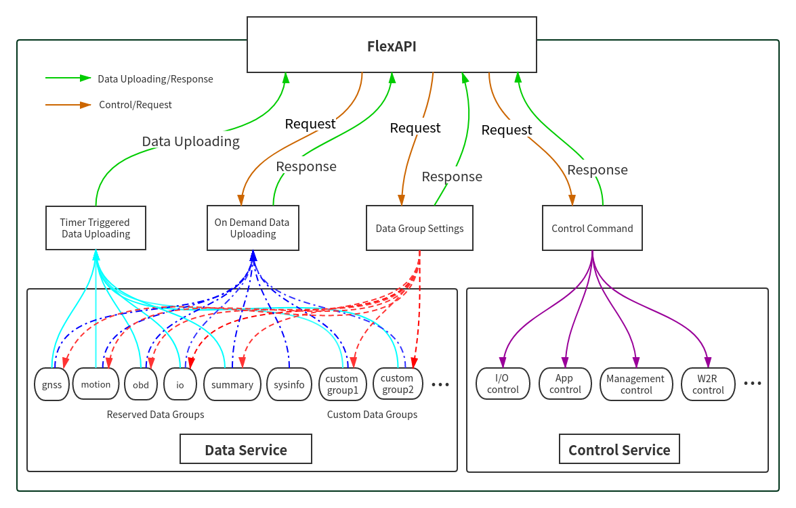
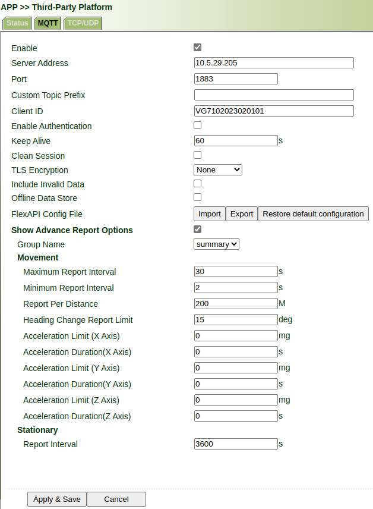
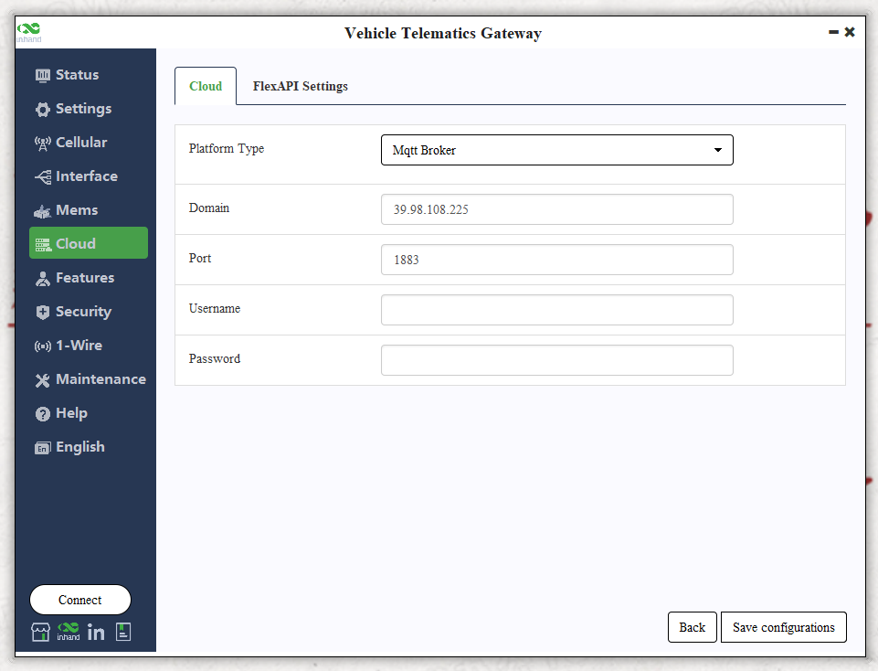
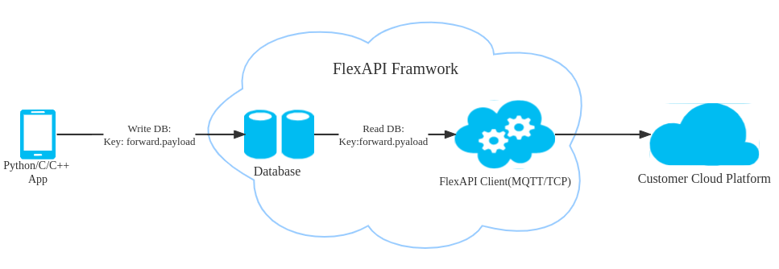

# FlexAPI_MQTT_for_3rd_party_platform

## For VT300/VT200  and VG700/VG814 series

Revision History

| Revision | Date | Author | Item(s) changed | Note |
| :--- | :--- | :--- | :--- | :--- |
| 1.0.1 | 8/2/2021 | Liyb | Created this document based on \<FlexAPI\_Reference\_for\_3rd\_party\_platform> | |
| 1.0.2 | 18/1/2022 | Liyb | Added  ID description for OBD parameters. | |
| 1.0.3 | 20/1/2022 | Tianmh | Added  Sensor parameters and  W2R parameters. | |
| 1.0.4 | 24/1/2022 | Liyb | Fixed some errors. | |
| 1.0.5 | 8/4/2022 | Tianmh | Added Mgmt. | |
| 1.0.6 | 11/4/2022 | Fanc | Added more EVENTs. | |
| 1.0.7 | 5/22/2023 | Caimh | Added custom topic for Custom Group and added some new parameters for OBD parameters. | |
| 1.0.8 | 6/23/2023 | Tianmh | Added v1/{sn}/r2w/write topic to do Modbus write. | |
| 1.0.9 | 24/08/2023 | Fanc | Added some events about vehicle behavior, HARSH\_ACCELERATION, HARSH\_BRAKING, TURN\_LEFT,TURN\_RIGHT, IDLE, IDLE\_END events. | In this events, the param "time" modified to "CUR\_TM". |
| 1.0.10 | 07/04/2024 | Tianmh | Supported the topic: v1/{client\_id}/w2r/can/raw to reported the data of CAN raw data. | |
| 1.0.11 | 11/04/2024 | Fanc | CAN raw data add time stamp. Added section Configuring CAN Filters through  topic "v1/{client\_id}/CANFilter/set" . | |
| 1.0.12 | 28/06/2024 | dengzt,yangming | Add Vehicle Gateway related content | |
| 1.0.13 | 01/13/2025 | Tianmh | Add Device certificates update (AWS provision) | |

## 1. Introduction

We introduced FlexAPI for the fast evolving IoT applications, which highly value easy integration, openness, flexibility, extensibility and programmability.

FlexAPI is designed to be efficient, clean and ready to use. It's network oriented and programming language independent, and is ideal for cloud platform integration.

FlexAPI provides unified data and control services via MQTT topics for 3rd party platforms.

For data service, each MQTT topic corresponds to a group of data, and we have ready to use reserved groups such as: Summary, GNSS, Motion, IO, OBD, Cellular, Sensor, W2R(Modbus), App, Userdata, Forward, 1-Wire.

Besides, user can use sysinfo group to obtain device basic information.

In general, reserved groups are enough for user's need.

Users can subscribe to these topics to get the latest data, and they can also set the data uploading intervals.

FlexAPI specially provides MQTT topics for users to actively get data on demand.

For advanced users, they can even define their interested groups and set their uploading intervals.

We employ a request & response scheme for user initiated service requests.

Request & response scheme means users need to subscribe to the response topics, and they request service by publishing a message to the request topics.

### 1.1 Architecture



### 1.2 MQTT Intro

MQTT is a widely adopted, lightweight messaging protocol designed for constrained devices.

Our MQTT implementation is based on MQTT version 3.1.1, and supports QoS 0 and 1.

For more information, see [MQTT](http://docs.oasis-open.org/mqtt/mqtt/v3.1.1/os/mqtt-v3.1.1-os.html).

### 1.3 MQTT Topics Rules

- Topics are `UTF-8` encoded hierarchical strings. The forward slash (/) is used to separate levels in the topic hierarchy.
- Topic Wildcards:

| Wildcard | Description |
| :--- | :--- |
| # | Must be the last character in the topic to which you are subscribing.   Works as a wildcard by matching the current tree and all subtrees.   For example, a subscription to Sensor/# receives messages published to Sensor/,   Sensor/temp,Sensor/temp/room1, but not the messages published to Sensor. |
| + | Matches exactly one item in the topic hierarchy.   For example, a subscription to Sensor/+/room1 receives messages published to    Sensor/temp/room1,Sensor/moisture/room1, but not the messages published to Sensor/room1. |

### 1.4 MQTT Server Settings

#### 1.4.1 MQTT Server Address and Port

FlexAPI needs remote MQTT broker address and port to connect to.

#### 1.4.2 MQTT Authentication

##### 1.4.2.1 Username/Password(Default)

FlexAPI needs username and password for authentication.

After network connection is established, FlexAPI will send MQTT CONNECT Control Packet to remote MQTT broker.

The payload must contain Username, Password and `unique` Client Identifier fields. see [MQTT CONNECT](http://docs.oasis-open.org/mqtt/mqtt/v3.1.1/os/mqtt-v3.1.1-os.html#_Toc398718028).

FlexAPI will use `unique` Client Identifier`{client_id}` as part of MQTT topics. see [FlexAPI supported Topics](#22-flexapi-supported-topics).

##### 1.4.2.2 Certificate

Certificate authentication is Non Normative. However, it is strongly recommended that Server implementations that offer [TLS](https://www.ietf.org/rfc/rfc5246.txt) should use TCP port 8883. see [Security](http://docs.oasis-open.org/mqtt/mqtt/v3.1.1/os/mqtt-v3.1.1-os.html#_Toc398718111).

### 1.5 VG710/VG814 Third-Party Platform Settings

**Note**: only supported by InVehicel Gateway VG710, VG814 series device.

According to the MQTT server settings, do the corresponding configuration on the device web page.

For summary and custom groups, we also support advanced reporting options.



- **Enable**: Turn on or off this service.
- **Server Address**: IP addresses of MQTT server.
- **Port**：Port of MQTT server.
- **Custom Topic Prefix**:  Topic prefix will be perpend the general topic.
- **Client ID**: The ID of the MQTT client that connects to a MQTT server, the default Client ID is the device serial number.\
  Note: The Client ID is the unique ID used to identify the device.  The server can use this ID to determine which device to send the request to.
- **Enable Authentication**: Enable User\&password authentication
- **Keep Alive**:  The keepalive interval of MQTT connection.
- **Clear Session**: Each time you connect to the MQTT Server, the previous Topic settings are not used.
- **TLS Encryption**: Configure using PSK or certificate to connect to MQTT Server
- **Include Invalid Data**:  if enabled, FlexAPI will also return invalid data items with `null` value besides valid data items.
- **Offline Data Store**: Save data when service disconnect to MQTT server and report the saved data when service connect to MQTT server again.
- **FlexAPI Config File**: Mange FlexAPI configuration file of Third-Party Platform(MQTT).
- \*\*Advanced Report Options: \*\* display or hidden advanced report options
  - **Group Name**: choose summary or custom group
  - **Movement**: Indicates parameters that will take effect when the vehicle moves.
    - **Maximum Report Interval**: Maximum interval between two reports
    - **Minimum Report Interval**: Minimum interval between two reports
    - **Report Per Distance**: Report every distance traveled
    - **Heading Change Report Limit**: Heading changes greater than a certain angle will be reported
    - **Acceleration Limit and Duration(X/Y/Z Axis)**: If the set acceleration is exceeded for a certain period of time, group data will be reported.
  - **Stationary**: Parameters that will take effect when the vehicle is stationary
    - **Report Interval**: Report data once every set interval.

### 1.6 VT300/VT200 Third-Party Platform Settings

Cloud Platform >> Platform Type >> Mqtt Broker: Enable, configure domain name, port, username, and password ". Click "Save configuration" and restart, as is shown below.



## 2. FlexAPI Overview

### 2.1 FlexAPI Return Information and Errors

#### 2.1.1 General Information

| Parameter Name | Description | Type | Note |
| :--- | :--- | :--- | :--- |
| client\_token | client token | string | A unique string for users to match responses with the corresponding requests. |
| result | result | object | When the request succeeds, there will be result field in response message body.   API callers should check the content of the result field to    determine whether the request has been successfully processed. |
| error | error code | string | When the request fails, it is added to the response message body.   For more information, see [General Error Codes](#212-general-error-codes) |
| error\_desc | error description | string | When the request fails, it is added to the response message body.   For more information, see [General Error Codes](#212-general-error-codes) |
| ts | time stamp | number | UNIX timestamp since Epoch. Indicates when the message was occured by device. |
| ul\_ts | time stamp | number | UNIX timestamp since Epoch. Indicates when the message was trasimited by device.(VG only) |

#### 2.1.2 General Error Codes

| Error Code | Description | Error Handling | Note |
| :--- | :--- | :--- | :--- |
| auth\_failed | authentication failed | check username and password |  |
| invalid\_parameter | invalid parameter | check request parameter |  |
| not\_found | resource not exist | make sure related service is enabled and running |  |
| device\_busy | device busy | retry request |  |
| device\_error | device internal error | retry request |  |
| data\_invalid | resource invalid | retry request |  |
| invalid\_token | token non-existent or expired | retry request | <br/><br/><br/><br/><br/><br/><br/>Vehicle Gatewa Only |
| data\_empty | request resource is empty | retry request | |
| over\_group\_num | group number exceeds limit | check request parameter | |
| over\_data\_num | keys of interest number exceeds limit | check request parameter | |
| over\_data\_num | keys of interest number exceeds limit | check request parameter | |
| find\_same\_key | can not insert same key | check request parameter | |
| interval\_invalid | interval range is invalid | check request parameter | |
| not\_support | operation is not support | check request parameter | |

### 2.2 FlexAPI Supported Topics

#### 2.2.1 Data Service

##### 2.2.1.1 Timer Triggered Reserved Group Data Get

When using generic MQTT broker, users can subscribe to the following topics listed with **Topic for generic MQTT broker** to get the latest data.\
*Note: The  properties  for Azure Iot Hub is only for users using Azure Iot Hub.*

| Topic for generic MQTT broker | properties  for Azure Iot Hub   (key:value) | Data direction | Description | Note |
| :--- | :--- | :--- | :--- | :--- |
| v1/{client\_id}/summary/info |  | Device to Cloud | Timer triggered Summary data uploading.   see [Summary Data](#311-summary-data). | Vehicle Gateway Only |
| v1/{client\_id}/obd/info | group:obd   type:info | Device to Cloud | Timer triggered OBD data uploading.     See [OBD data](#311-obd-data). | Default |
| v1/{client\_id}/obd1/info | group:obd1   type:info | Device to Cloud | Timer triggered OBD data uploading.     See [OBD data](#311-obd-data). | Extend for two CAN |
| v1/{client\_id}/gnss/info | group:gnss   type:info | Device to Cloud | Timer triggered GNSS data uploading.   see [GNSS Data](#312-gnss-data). |  |
| v1/{client\_id}/motion/info | group:motion   type:info | Device to Cloud | Timer triggered Motion data uploading.   see [Motion Data](#313-motion-data). |  |
| v1/{client\_id}/io/info | group:io   type:info | Device to Cloud | Timer triggered IO data uploading.   see [IO Data](#314-io-data). |  |
| v1/{client\_id}/cellular1/info | group:cellular1   type:info | Device to Cloud | Timer triggered Cellular1 data uploading.   see [Cellular1 Data](#315-cellular1-data). |  |
| v1/{client\_id}/sysinfo/info | group:sysinfo   type:info | Device to Cloud | Timer triggered sysinfo data uploading.   see [Sysinfo Data](#316-sysinfo-data). |  |
| v1/{client\_id}/sensor/info | group:sensor   type:info | Device to Cloud | see [Sensor Data](#317-sensor-data). | Vehicle Tracker Only |
| v1/{client\_id}/w2r/info | group:w2r   type:info | Device to Cloud | see [W2R Data](#318-w2r-data). | Vehicel Tracker Only |
| v1/{client\_id}/userdata/info |  | Device to Cloud | Timer triggered User data uploading.   see [User Data](#319-user-data). | Vehicle Gateway Only |
| v1/{client\_id}/forward/info |  | Device to Cloud | Timer triggered Forward data uploading.   see [Forward Data](#3110-forward-data). | Vehicle Gateway Only |
| v1/{client\_id}/1-wire/info |  | Device to Cloud | Timer triggered 1-wire data uploading.   see [1-wire Data](https://inhandnetworks.yuque.com/betu7s/dmb2wu/hql80db4qqn8ygoq#318-1-wire-data). | Vehicle Gateway Only |

##### 2.2.1.2 Reserved Group Settings

Users can use the following topics to set the data uploading intervals and define their interested data.

*Note: The  properties*\_\*\*  for Azure Iot Hub\*\*\_\_ is only for users using Azure Iot Hub.\_

| Topic for generic MQTT broker | properties  for Azure Iot Hub   (key:value) | Data direction | Description | Note |
| :--- | :--- | :--- | :--- | :--- |
| v1/{client\_id}/summary/set |  | Device to Cloud | Set Summary group request.   see [Summary settings](#322-summary-settings). | Vehicle Gateway Only |
| v1/{client\_id}/summary/set/resp |  | Cloud to Device | Set Summary group response. | Vehicle Gateway Only |
| v1/{client\_id}/obd/set | group:obd   cmd:set | Cloud to Device | Set OBD group request.   see [OBD settings](#322-obd-settings). |  |
| v1/{client\_id}/obd/set/resp | group:obd   type:setRsp | Device to Cloud | Set OBD group response. |  |
| v1/{client\_id}/obd1/set | group:obd1   cmd:set | Cloud to Device | Set OBD group request.   see [OBD settings](#322-obd-settings). |  |
| v1/{client\_id}/obd1/set/resp | group:obd1   type:setRsp | Device to Cloud | Set OBD group response. |  |
| v1/{client\_id}/gnss/set | group:gnss   cmd:set | Cloud to Device | Set GNSS group request.   see [GNSS settings](#323-gnss-settings). |  |
| v1/{client\_id}/gnss/set/resp | group:gnss   type:setRsp | Device to Cloud | Set GNSS group response. |  |
| v1/{client\_id}/motion/set | group:motion   cmd:set | Cloud to Device | Set Motion group request.   see [Motion settings](#324-motion-settings). |  |
| v1/{client\_id}/motion/set/resp | group:motion   type:setRsp | Device to Cloud | Set Motion group response. |  |
| v1/{client\_id}/io/set | group:io   cmd:set | Cloud to Device | Set IO group request.   see [IO settings](#325-io-settings). |  |
| v1/{client\_id}/io/set/resp | group:io   type:setRsp | Device to Cloud | Set IO group response. |  |
| v1/{client\_id}/cellular1/set | group:cellular1   cmd:set | Cloud to Device | Set Celluar1 group request.   see [Cellular1 settings](#326-cellular1-settings). |  |
| v1/{client\_id}/cellular1/set/resp | group:cellular1   type:setRsp | Device to Cloud | Set Celluar1 group response. |  |
| v1/{client\_id}/userdata/set |  | Cloud to Device | Set User data group request.   see [User data settings](#328-user-data-settings). | Vehicle Gateway Only |
| v1/{client\_id}/userdata/set/resp |  | Device to Cloud | Set User data group response. | Vehicle Gateway Only |
| v1/{client\_id}/1-wire/set |  |  | See [1-wire settings](https://inhandnetworks.yuque.com/betu7s/dmb2wu/hql80db4qqn8ygoq#329-1-wire-data-settings). | Vehicle Gateway Only |
| v1/{client\_id}/1-wire/set/resp |  |  | Set 1-wire group response. | Vehicle Gateway Only |

##### 2.2.1.3 On Demand Reserved Group Data Get

Users can use the following topics to actively get data on demand.

*Note: The  properties  for Azure Iot Hub is only for users using Azure Iot Hub.*

| Topic for generic MQTT broker | properties  for Azure Iot Hub   (key:value) | Data direction | Description | Note |
| :--- | :--- | :--- | --- | --- |
| v1/{client\_id}/summary/refresh | vgroup:summary   cmd:refresh |  | Refresh Summary data request.   see [Summary Data](https://inhandnetworks.yuque.com/betu7s/dmb2wu/hql80db4qqn8ygoq#331-summary-data)**.** | Vehicle Gateway Only |
| v1/{client\_id}/summary/refresh/resp | group:summary   type:refresh |  | Refresh Summary data response. | Vehicle Gateway Only |
| v1/{client\_id}/obd/refresh | group:obd   cmd:refresh | Cloud to Device | Refresh OBD data request.    see [OBD data](#311-obd-data). |  |
| v1/{client\_id}/obd/refresh/resp | group:obd   type:refresh | Device to Cloud | Refresh OBD data response. |  |
| v1/{client\_id}/obd1/refresh | group:obd   cmd:refresh | Cloud to Device | Refresh OBD data request.    see [OBD data](#311-obd-data). |  |
| v1/{client\_id}/obd1/refresh/resp | group:obd   type:refresh | Device to Cloud | Refresh OBD data response. |  |
| v1/{client\_id}/gnss/refresh | group:gnss   cmd:refresh | Cloud to Device | Refresh GNSS data request.   see [GNSS Data](#312-gnss-data). |  |
| v1/{client\_id}/gnss/refresh/resp | group:gnss   type:refresh | Device to Cloud | Refresh GNSS data response. |  |
| v1/{client\_id}/motion/refresh | group:motion   cmd:refresh | Cloud to Device | Refresh Motion data request.   see [Motion Dat](#313-motion-data). |  |
| v1/{client\_id}/motion/refresh/resp | group:motion   type:refresh | Device to Cloud | Refresh Motion data response. |  |
| v1/{client\_id}/io/refresh | group:io   cmd:refresh | Cloud to Device | Refresh IO data request.   see [IO Data](#314-io-data). |  |
| v1/{client\_id}/io/refresh/resp | group:io   type:refresh | Device to Cloud | Refresh IO data response. |  |
| v1/{client\_id}/cellular1/refresh | group:cellular1   cmd:refresh | Cloud to Device | Refresh Cellular1 data request.   see [Cellular1 Data](#315-cellular1-data). |  |
| v1/{client\_id}/cellular1/refresh/resp | group:cellular1   type:refresh | Device to Cloud | Refresh Cellular1 data response. |  |
| v1/{client\_id}/sysinfo/refresh | group:sysinfo   cmd:refresh | Cloud to Device | Refresh system info request.   see [System Info](#316-sysinfo-data). |  |
| v1/{client\_id}/sysinfo/refresh/resp | group:sysinfo   type:refresh | Device to Cloud | Refresh system info response. |  |
| v1/{client\_id}/userdata/refresh |  |  | Refresh User data request.   see [User data](https://inhandnetworks.yuque.com/betu7s/dmb2wu/hql80db4qqn8ygoq#338-user-data). | Vehicle Gateway Only |
| v1/{client\_id}/userdata/refresh/resp |  |  | Refresh user data info response. | Vehicle Gateway Only |
| v1/{client\_id}/app/refresh |  |  | Refresh APP data request.   see [APP settings](https://inhandnetworks.yuque.com/betu7s/dmb2wu/hql80db4qqn8ygoq#339-app-settings). | Vehicle Gateway Only |
| v1/{client\_id}/app/refresh/resp |  |  | Refresh APP data info response. | Vehicle Gateway Only |
| v1/{client\_id}/1-wire/refresh |  |  | Refresh 1-wire data request.   see [1-wire data](https://inhandnetworks.yuque.com/betu7s/dmb2wu/hql80db4qqn8ygoq#3310-1-wire-data). | Vehicle Gateway Only |
| v1/{client\_id}/1-wire/refresh/resp |  |  | Refresh 1-wire data info response. | Vehicle Gateway Only |

#### 2.2.2 Control Service

##### 2.2.2.1 IO Control

Users can use the following topics to turn on/off the digital output.

*Note: The  properties  for Azure Iot Hub is only for users using Azure Iot Hub.*

| properties  for Azure Iot Hub   (key:value) | Topic for generic MQTT broker | Data direction | Description |
| :--- | :--- | :--- | :--- |
| group:io   cmd:control | v1/{client\_id}/io/control | Cloud to Device | IO control request.    see [IO Control](#341-io-control). |
| group:io   type:controlRsp | v1/{client\_id}/io/control/resp | Device to Cloud | IO control response. |

##### 2.2.2.2 Management Control

Users can use the following topics to do some management control.

| properties  for Azure Iot Hub    (key:value) | Topic for generic MQTT broker | Data direction | Description | Note |
| :--- | :--- | :--- | :--- | :--- |
| group: mgmt   cmd:control | v1/{client\_id}/mgmt/control | Cloud to Device | Management control request.     see [Management Control](#343-management-control). | Vehicel Tracker Only |
| group:mgmt    type:controlRsp | v1/{client\_id}/mgmt/control/resp | Device to Cloud | Management control response. | Vehicel Tracker Only |

##### 2.2.2.3 APP Control

Users can use the following topics to notify APP to do something.

| Topic | Allowed Operations | Description | Note |
| :--- | :--- | :--- | :--- |
| v1/{client\_id}/app/control | Publish | APP control request.    see [APP Control](https://inhandnetworks.yuque.com/betu7s/dmb2wu/hql80db4qqn8ygoq#342-app-control). | Vehicle Gateway Only |
| v1/{client\_id}/app/control/resp | Subscribe | APP control response. | Vehicle Gateway Only |

#### 2.2.3 Advanced Usage

Advanced users can use the following topics to define their interested groups and set their uploading intervals.

*Note: The  properties  for Azure Iot Hub is only for users using Azure Iot Hub.*

\_\_

##### 2.2.3.1 Custom Group Settings

###### 2.2.3.1.1 Create/Update Custom Group

| Topic for generic MQTT broker | properties  for Azure Iot Hub   (key:value) | Data direction | Description |
| :--- | :--- | :--- | :--- |
| v1/{client\_id}/group/set | group:group   cmd:set | Cloud to Device | Create/Update group request.   see [Create/Update custom group](#411-createupdate-custom-group). |
| v1/{client\_id}/group/set/resp | group:group   type:setRsp | Device to Cloud | Create/Update group response. |

###### 2.2.3.1.2 Get Custom Group Settings

| Topic for generic MQTT broker | properties  for Azure Iot Hub   (key:value) | Data direction | Description |
| :--- | :--- | :--- | :--- |
| v1/{client\_id}/group/get | group:group   cmd:get | Cloud to Device | Get group settings request.   see [Get custom group settings](#412-get-custom-group-settings). |
| v1/{client\_id}/group/get/resp | group:group   type:getRsp | Device to Cloud | Get group settings response. |

###### 2.2.3.1.3 Remove Custom Group

| Topic | Allowed Operations | Description | Note |
| :--- | :--- | :--- | :--- |
| v1/{client\_id}/group/set | Publish | Remove group request.   see [Remove custom group](https://inhandnetworks.yuque.com/betu7s/dmb2wu/hql80db4qqn8ygoq#413-remove-custom-group). | Vehicle Gateway Only |
| v1/{client\_id}/group/set/resp | Subscribe | Remove group response. | Vehicle Gateway Only |

##### 2.2.3.2 Timer Triggered Custom Group Data Get

| Topic for generic MQTT broker | properties  for Azure Iot Hub   (key:value) | Data direction | Description |
| :--- | :--- | :--- | :--- |
| v1/{client\_id}/{group\_name}/info | group:{group\_name}   type:info | Device to Cloud | Timer triggered custom group data uploading.   see [Timer triggered custom group data get](#42-timer-triggered-custom-group-data-get). |

##### 2.2.3.3 On Demand Custom Group Data Get

| Topic for generic MQTT broker | properties  for Azure Iot Hub   (key:value) | Data direction | Description |
| :--- | --- | :--- | :--- |
| v1/{client\_id}/{group\_name}/refresh | group:{group\_name}   cmd:refresh | Cloud to Device | Refresh group data request.   see [On demand custom group data get](#43-on-demand-custom-group-data-get)<br/>. |
| v1/{client\_id}/{group\_name}/refresh/resp | group:{group\_name}   type:refresh | Device to Cloud | Refresh group data response. |

### 2.3 FlexAPI Limits

| Resource | Vehicel Tracker Limit | Vehicle Gateway Limit |
| :--- | :--- | :--- |
| Minimum retry interval of `settings`<br/>, `refresh`<br/>, `get`<br/> requests | 3 s | 1s |
| Minimum retry interval of `io control`<br/> request | 5 s | 5s |
| `client_id`<br/> size | SN of VT series | up to 128 bytes of `UTF-8`<br/> encoded characters |
| `client_token`<br/> size | up to 32 bytes of arbitrary string | up to 256 bytes of arbitrary string |
| Available custom groups | up to 8 | up to 16 |
| Maximum data items per group | 32 | 256 |

### 3.1 Timer Triggered Reserved Group Data Get

When data available that can be received the related data.

#### 3.1.1 Summary Data

Once you have subscribed to this topic, you will periodically receive the related data.

**Topic**：v1/{client\_id}/summary/info

**Payload**：

```json
{
  "summary.ul_ts" : 1592820540,
  "gnss.ts" : 1592820539,
  "gnss.latitude": 40.232213,
  "gnss.longitude": 116.34366,
  "gnss.altitude": 346.0,
  "gnss.speed": 87.6,
  "gnss.heading": 234.0,
  "gnss.hdop": 1.2,
  "gnss.pdop": 2.1,
  "gnss.hacc": 1.0,
  "gnss.fix": 3,
  "gnss.num_sv": 7,
  "gnss.date": "2020-4-17",
  "gnss.time": "10:16:21",
  "obd.ts" : 1592820539,
  "obd.rpm" : 1234, 
  "obd.speed" : 20,
  "obd.odo": 1400,
  "obd.up_time": 3600,
  "io.ts" : 1592820539,
  "io.AI1": 0.0,
  "io.AI2": 0.0,
  "io.AI3": 0.0,
  "io.AI4": 0.0,
  "io.AI5": 0.0,
  "io.AI6": 0.0,
  "io.DI1": 0,
  "io.DI1_pullup": 0,
  "io.DI2": 0,
  "io.DI2_pullup": 0,
  "io.DI3": 0,
  "io.DI3_pullup": 0,
  "io.DI4": 0,
  "io.DI4_pullup": 0,
  "io.DI5": 0,
  "io.DI5_pullup": 0,
  "io.DI6": 0,
  "io.DI6_pullup": 0,
  "io.DO1": 0,
  "io.DO1_pullup": 0,
  "io.DO2": 0,
  "io.DO2_pullup": 0,
  "io.DO3": 0,
  "io.DO3_pullup": 0,
  "io.DO4": 0,
  "io.DO4_pullup": 0
}
```

Parameter description, See [General Information](#211-general-information) & [Summary Parameters](#a1-summary-parameters).

Use [Summary settings](#322-summary-settings) to modify group setting(interval & interest).

#### 3.1.1 OBD Data

Once you have subscribed to this topic, you will periodically receive the related data. **If CAN1 and CAN2, topic **<code>** v1/{client_id}/obd1/info**</code>**is used for CAN1, topic **<code>** v1/{client_id}/obd/info**</code>**is used for CAN2. If only one CAN, topic **<code>** v1/{client_id}/obd/info**</code>**is used for CAN.**

**Note: Vehicle Gateway currently uses only one CAN for OBD even if the device supports dual CAN**

**Topic**：`v1/{client_id}/obd/info`

**Payload**：

```json
{
    "obd.ts" : 1592820539,
    "obd.rpm" : 1234, 
    "obd.speed" : 20,
    "obd.bitrate": 250000,
    "obd.iftype": "CAN",
    "obd.status": "Connected",
    "obd.protocol": "J1939"
}
```

Parameter description, See [General Information](#211-general-information) & [OBD Parameters](#a5-obd-parameters).

Use [OBD settings](#322-obd-settings) to modify group setting(`interval` & `interest`).

#### 3.1.2 GNSS Data

Once you have subscribed to this topic, you will periodically receive the related data.

**Topic**：`v1/{client_id}/gnss/info`

**Payload**：

```json
{
    "gnss.ts" : 1592820539,
    "gnss.latitude": 40.232213,
    "gnss.longitude": 116.34366,
    "gnss.altitude": 346.0,
    "gnss.speed": 87.6,
    "gnss.heading": 234.0,
    "gnss.hdop": 1.2,
    "gnss.fix": 3,
    "gnss.num_sv": 7
}
```

Parameter description, See [General Information](#211-general-information) & [GNSS Parameters](#a2-gnss-parameters).

Use [GNSS settings](#323-gnss-settings) to modify group setting(`interval` & `interest`).

#### 3.1.3 Motion Data

Once you have subscribed to this topic, you will periodically receive the related data.

**Topic**：`v1/{client_id}/motion/info`

**Payload**：

```json
{
    "motion.ts": 1592820539,
    "motion.ax": 0.08,
    "motion.ay": 0.0,
    "motion.az": 0.0,
    "motion.gx": 0.15,
    "motion.gy": 0.03,
    "motion.gz": -0.47
}
```

Parameter description, See [General Information](#211-general-information) & [Motion Parameters](#a3-motion-parameters).

Use [Motion settings](#324-motion-settings) to modify group setting(`interval` & `interest`).

#### 3.1.4 IO Data

Once you have subscribed to this topic, you will periodically receive the related data.

**Topic**：`v1/{client_id}/io/info`

**Payload**：

```json
{
    "io.ts": 1592820539,
    "io.AI1": 0.0,
    "io.DI1": 0,
    "io.DI1_pullup": 0,
    "io.DI2": 0,
    "io.DI2_pullup": 0,
    "io.DI3": 0,
    "io.DI3_pullup": 0,
    "io.DI4": 0,
    "io.DI4_pullup": 0,
    "io.DO1": 0,
    "io.DO2": 0,
    "io.DO3": 0,
    "io.IGT": 0
}
```

Parameter description, See [General Information](#211-general-information) & [IO Parameters](#a4-io-parameters).

Use [IO settings](#325-io-settings) to modify group setting(`interval` & `interest`).

#### 3.1.5 Cellular1 Data

Once you have subscribed to this topic,  you will periodically receive the related data.

**Topic**：`v1/{client_id}/cellular1/info`

**Payload**：

```json
{
    "modem1.ts": 1598425365,
    "modem1.imei": "862104021247207",
    "modem1.imsi": "460013231603009",
    "modem1.iccid": "89860118802836799717",
    "modem1.signal_lvl": 28,
    "modem1.reg_status": 1,
    "modem1.operator": "46001",
    "modem1.network": 3,
    "modem1.lac": "EA00",
    "modem1.cell_id": "71CF520",
    "cellular1.status": 3,
    "cellular1.ip": "10.210.255.168",
    "cellular1.netmask": "255.255.255.255",
    "cellular1.gateway": "1.1.1.3",
    "cellular1.dns1": "119.7.7.7",
    "cellular1.up_at": 1598424985,
    "cellular1.down_at": 0,
    "cellular1.traffic_ts": 60
}
```

Parameter description, See [General Information](#211-general-information) & [Cellular Parameters](#a6-cellular-parameters).

Use [Cellular settings](#326-cellular1-settings) to modify group setting(`interval` & `interest`).

#### 3.1.6 Sysinfo Data

Once you have subscribed to this topic,  the MQTT broker will periodically receive the related data.

**Topic**：`v1/{client_id}/sysinfo/info`

**Payload**：

```json
#VT series
{
    "sysinfo.ts": 1598424935,
    "sysinfo.model_name": "VT310",
    "sysinfo.oem_name": "inhand",
    "sysinfo.serial_number": "VF3102020122201",
    "sysinfo.firmware_version": "VT3_V1.0.22",
    "sysinfo.product_number": "FQ58",
    "sysinfo.description": "www.inhand.com.cn"
}

#VG series
{
    "client_token": "3bzJQ200UkLS606lMhW3muUv73ycUT7J",
    "result": {
        "sysinfo.ul_ts" : 1592820540,
        "sysinfo.ts": 1598424935,
        "sysinfo.language": "Chinese",
        "sysinfo.hostname": "VG710",
        "sysinfo.timezone": "UTC-8",
        "sysinfo.model_name": "VG710",
        "sysinfo.oem_name": "inhand",
        "sysinfo.serial_number": "VG7102019052101",
        "sysinfo.firmware_version": "1.0.0.r13083",
        "sysinfo.bootloader_version": "2012.07.r235",
        "sysinfo.product_number": "TL01",
        "sysinfo.description": "www.inhand.com.cn",
        "sysinfo.lan_mac": "00:18:05:10:99:66",
        "sysinfo.wlan_mac": "00:18:05:10:99:03",
        "sysinfo.wlan_5g_mac": "00:18:05:10:99:04",
        "sysinfo.power_management_version": "VG710-5G-Ga-GD.V2.2.0"
    }
}
```

Parameter description, See [General Information](#211-general-information) & [System Parameters](#a7-sysinfo-parameters).

Use [Sysinfo settings](#329-sysinfo-settings) to modify group setting(`interval` & `interest`).

#### 3.1.7 Sensor Data

Once you have subscribed to this topic, the MQTT broker will periodically receive the related data.

The VT series uses group sensor to upload the data from sensors to  MQTT broker.At present, only iButton/temperature sensor connected with 1-wire bus are supported.

**Topic**：`v1/{client_id}/sensor/info`

**Payload**：

```json
{
  "sensor.ts" : 1642662299,
  "sensor.data" : [ {
    "type" : "1W_TP",
    "id" : "7c00000c0370db28",
    "value" : 25
  } ]
}
```

Parameter description, See [Sensor Parameters](#a8-sensor-parameters).

#### 3.1.8 W2R Data

**Topic**：`v1/{client_id}/w2r/info`

Once you have subscribed to this topic, the MQTT broker will periodically receive the related data.\
The VT series use this topic to upload the data from wired or wireless interface to MQTT broker. At present, **only  modbus(interface: serial4) is supported**.

**Payload**：

```json
{
  "w2r.ts" : 1642665195,
  "w2r.if" : "serial4",
  "w2r.proto" : "modbus",
  "w2r.rmt" : [ [ 1, 3, 31, 0 ], [ 1, 3, 30, 0 ], [ 1, 3, 26, 0 ], [ 1, 3, 25, 0 ], [ 1, 3, 24, 0 ], [ 1, 3, 23, 0 ], [ 1, 3, 22, 0 ], [ 1, 3, 21, 0 ], [ 1, 3, 20, 0 ], [ 1, 3, 19, 0 ], [ 1, 3, 18, 0 ], [ 1, 3, 17, 0 ], [ 1, 3, 13, 0 ], [ 1, 3, 12, 0 ], [ 1, 3, 11, 0 ], [ 1, 3, 10, 0 ], [ 1, 3, 8, 0 ], [ 1, 3, 7, 0 ], [ 1, 3, 5, 0 ], [ 1, 3, 4, 0 ], [ 1, 3, 3, 0 ], [ 1, 3, 2, 0 ], [ 1, 3, 1, 0 ] ]
}
```

The format of the w2r.rmt value is as follows,

> \[\[slave address,function code,register address,data], \[slave address,function code,register address,data], \[slave address,function code,register address,data], ...,\[slave address,function code,register address,data]]

Parameter description, See [W2R Parameters](#a9-w2r-paramters).

**Topic**：`v1/{client_id}/w2r/can/raw`

Once you have subscribed to this topic, the MQTT broker will receive the related data.\
The VT series use this topic to upload the data from CAN raw data to MQTT broker.

**Payload**：

```json
1028 323032342D30342D31315430383A33373A30355A0000 0CFEF500 1122334455667788
```

or

```json
2028 323032342D30342D31315430383A33373A30355A0000 0CFEF500 1122334455667788
```

The format of the payload is as follows,

> 1028 means the data is from CAN1 and it data len is 8 bytes.
>
> 2028 means the data is from CAN2 and it data len is 8 bytes.
>
> 0cfef500 means CAN id.
>
> 1122334455667788 is raw data of CAN.

#### 3.1.9 User Data

Once you have subscribed to this topic, you will periodically receive the related data.

**Topic**：`v1/{client_id}/userdata/info`

**Payload**：

```json
{
    "userdata.ul_ts": 1598425380,
    "userdata.custom_key": "custom_value",
    "userdata.serial_number":"SN0125"
}
```

Parameter description, See [General Information](#211-general-information).

Use [User data settings](#328-user-data-settings) to modify group setting(`interval` & `interest`).

#### 3.1.10 Forward Data

Once you have subscribed to this topic, you will periodically receive the related data(Only for VG).

**Topic**：`v1/{client_id}/forward/info`

**Payload**：

```json
## Payload is customized by the customer, usually written by the APP
```

**Note**:

APP can set any collected data to berkeley db with predefined key (database home: `/tmp/dbhome/daq.env`, database file: [Forward Parameters](#a11-forward-parameters)) , then use the FlexAPI client(MQTT/TCP) to send the data out. APP does not need to implement an independent client, so that it can focus on the specific business.




Parameter description, See [Forward Parameters](#a11-forward-parameters).

#### 3.1.11  1-Wire Data

Once you have subscribed to this topic, you will periodically receive the related data(only for VG).

**Topic**：v1/{client\_id}/1-wire/info

**Payload**：

```plain
{ 
    "1-wire.ul_ts" : 1592820540,
    "1-wire.ts": 1644560984,
    "1-wire.status" : "Connected",
    "1-wire.type" : "Temperature & ROM Code",
    "1-wire.temp_num" : 2,
    "1-wire.rom_num" : 1,
    "1-wire.temp1_data" : 24.56,
    "1-wire.temp1_id" : "aa012029901e7928",
    "1-wire.temp1_name" : "Inside",
    "1-wire.temp2_data" : 24.75,
    "1-wire.temp2_id" : "27012029cf6a8328",
    "1-wire.temp2_name" : "Outside",
    "1-wire.rom_code1" : "cc00001b559ae001"
}
```

Parameter description, See [1-Wire Parameters](#a12-1-wire-parameters).

### 3.2 Reserved Group Settings

#### 3.2.1 General Settings

| Parameter Name | Description | Type | Range | Units | Optional | Note |
| :--- | :--- | :--- | :--- | :--- | :--- | :--- |
| client\_token | A unique string for users to match responses with the corresponding requests. | string | | | mandatory | |
| interval | uploading interval | int | \[0,3600] | s | optional | 0: disable timer upload |
| interest | interest parameter   List of interested item, each item is represented as key: alias.   alias is used in reported messages to rewrite key,   a value of "" means no alias.   For example,   set interest with alias: {"obd.mil": "MIL", "obd.dtcs": "dtcNum"}   reported data: {"MIL": "1", "dtcNum": "3"}      set interest without alias: {"obd.mil": "", "obd.dtcs": ""}   reported data: {"obd.mil": "1", "obd.dtcs": "3"}    | object | | | optional | 'key': FlexAPI Supported parameters    'alias': parameter alias    OBD group, see [OBD Parameters](#a5-obd-parameters)<br/>GNSS group, see [GNSS Parameters](#a2-gnss-parameters)<br/>Motion group, see [Motion Parameters](#a3-motion-parameters)<br/>IO group, see [IO Parameters](#a4-io-parameters)<br/>Cellular1 group, see [Cellular Parameters](#a6-cellular-parameters)<br/>Sysinfo group, see [System Parameters](#a7-sysinfo-parameters) |

**For **<code>** interval**</code>**and **<code>** interest**</code>**parameters, there are four use cases which apply to both reserved and custom groups.**

**Case 1. Disable Group Data Uploading**

Specify only `interval` field and set its value to 0 in message body.

**Request Topic**：`v1/{client_id}/{group_name}/set`

**Note**: `group_name` is obd, gnss, motion, io, or custom group name.

**Request Payload**：

```json
{ 
   "client_token": "3bzJQ200UkLS606lMhW3muUv73ycUT7J",
   "interval": 0
}
```

**Response Topic**： `v1/{client_id}/{group_name}/set/resp`

**Response Payload**：

Success：

```json
{
   "client_token": "3bzJQ200UkLS606lMhW3muUv73ycUT7J",
   "result": {
      "interval": 0
   }
}
```

Failure：

```json
{
    "client_token": "3bzJQ200UkLS606lMhW3muUv73ycUT7J",
    "error": "invalid_parameter",
    "error_desc": "Invalid request parameter"
}
```

Parameter description, see [General Information](#211-general-information).

**Case 2. Change Only Group Data Uploading Interval**

Specify only `interval` field in message body.

**Request Topic**：`v1/{client_id}/{group_name}/set`

**Request Payload**：

```json
{ 
    "client_token": "3bzJQ200UkLS606lMhW3muUv73ycUT7J",
    "interval": 60
}
```

**Response Topic**： `v1/{client_id}/{group_name}/set/resp`

**Response Payload**：

Success：

```json
{
    "client_token": "3bzJQ200UkLS606lMhW3muUv73ycUT7J",
    "result": {
     "interval": 60
    }
}
```

Failure：

```json
{
    "client_token": "3bzJQ200UkLS606lMhW3muUv73ycUT7J",
    "error": "invalid_parameter",
    "error_desc": "Invalid request parameter"
}
```

Parameter description, see [General Information](#211-general-information).

**Case 3. Change only group data interest**

Specify only `interest` field in message body.

**Request Topic**：`v1/{client_id}/{group_name}/set`

**Request Payload**：

```json
{ 
    "client_token": "3bzJQ200UkLS606lMhW3muUv73ycUT7J",
    "interest": {"gnss.latitude": "lat", "gnss.longitude": "lon", "obd.speed": "speed", "obd.odo": ""}
}
```

**Response Topic**： `v1/{client_id}/{group_name}/set/resp`

**Response Payload**：

Success：

```json
{
    "client_token": "3bzJQ200UkLS606lMhW3muUv73ycUT7J",
    "result": {
     "interest": {"gnss.latitude": "lat", "gnss.longitude": "lon", "obd.speed": "speed", "obd.odo": ""}
    }
}
```

Failure：

```json
{
    "client_token": "3bzJQ200UkLS606lMhW3muUv73ycUT7J",
    "error": "invalid_parameter",
    "error_desc": "Invalid request parameter"
}
```

Parameter description, see [General Information](#211-general-information).

**Case 4. Change Both Interest and Uploading Interval**

Specify both `interest` and `interval` fields in message body.

**Request Topic**：`v1/{client_id}/{group_name}/set`

**Request Payload**：

```json
{ 
    "client_token": "3bzJQ200UkLS606lMhW3muUv73ycUT7J",
    "interval": 60,
    "interest": {"gnss.latitude": "lat", "gnss.longitude": "lon", "obd.speed": "speed", "obd.odo": ""}
}
```

**Response Topic**： `v1/{client_id}/{group_name}/set/resp`

**Response Payload**：

Success：

```json
{
    "client_token": "3bzJQ200UkLS606lMhW3muUv73ycUT7J",
    "result": {
       "interval": 60,
       "interest": {"gnss.latitude": "lat", "gnss.longitude": "lon", "obd.speed": "speed", "obd.odo": ""}
    }
}
```

Failure：

```json
{
    "client_token": "3bzJQ200UkLS606lMhW3muUv73ycUT7J",
    "error": "invalid_parameter",
    "error_desc": "Invalid request parameter"
}
```

Parameter description, see [General Information](#211-general-information).

#### 3.2.2 Summary Settings

Publish a message to this topic to set your interested data and uploading interval.

Default interval is 10s. Default interest is available parameters from the [FlexAPI supported Parameters](#appendix-a-flexapi-supported-parameters).

**Request Topic**：`v1/{client_id}/summary/set`

**Request payload**：

```json
{ 
    "client_token": "3bzJQ200UkLS606lMhW3muUv73ycUT7J",
    "interval": 60,
    "interest": {"gnss.latitude": "lat", "gnss.longitude": "lon", "obd.speed": "speed", "obd.odo": ""}
}
```

**Response Topic**： `v1/{client_id}/summary/set/resp`

**Response Payload**：

Success：

```json
{
    "client_token": "3bzJQ200UkLS606lMhW3muUv73ycUT7J",
    "result": {
     "interval": 60,
     "interest": {"gnss.latitude": "lat", "gnss.longitude": "lon", "obd.speed": "speed", "obd.odo": ""}
    }
}
```

Failure：

```json
{
    "client_token": "3bzJQ200UkLS606lMhW3muUv73ycUT7J",
    "error": "invalid_parameter",
    "error_desc": "Invalid request parameter"
}
```

Parameter description, see [General Information](#211-general-information).

#### 3.2.2 OBD Settings

Publish a message to this topic to set your interested data and uploading interval.

Default interval is 60s. Default interest is available parameters from the [OBD Parameters](#a5-obd-parameters).

**Request Topic**：`v1/{client_id}/obd/set`

**Request Payload**：

```json
{ 
    "client_token": "3bzJQ200UkLS606lMhW3muUv73ycUT7J",
    "interval": 60,
    "interest": {"obd.mil": "MIL", "obd.dtcs": "dtcNum", "obd.rpm": "engineSpeed"}
}
```

**Response Topic**： `v1/{client_id}/obd/set/resp`

**Response Payload**：

Success：

```json
{
    "client_token": "3bzJQ200UkLS606lMhW3muUv73ycUT7J",
    "result": {
     "interval": 60,
     "interest": {"obd.mil": "MIL", "obd.dtcs": "dtcNum", "obd.rpm": "engineSpeed"}
    }
}
```

Failure：

```json
{
    "client_token": "3bzJQ200UkLS606lMhW3muUv73ycUT7J",
    "error": "invalid_parameter",
    "error_desc": "Invalid request parameter"
}
```

Parameter description,  see [General Information](#211-general-information).

#### 3.2.3 GNSS Settings

Publish a message to this topic to set your interested data and uploading interval.

Default interval is Auto. Default interest is available parameters from the [GNSS Parameters](#a2-gnss-parameters).

**Request Topic**：`v1/{client_id}/gnss/set`

**Request Payload**：

```json
{ 
    "client_token": "3bzJQ200UkLS606lMhW3muUv73ycUT7J",
    "interval": 60,
    "interest": {"gnss.latitude": "lat", "gnss.longitude": "lon", "gnss.altitude": "alt"}
}
```

**Response Topic**： `v1/{client_id}/gnss/set/resp`

**Response Payload**：

Success：

```json
{
    "client_token": "3bzJQ200UkLS606lMhW3muUv73ycUT7J",
    "result": {
     "interval": 60,
     "interest": {"gnss.latitude": "lat", "gnss.longitude": "lon", "gnss.altitude": "alt"}
    }
}
```

Failure：

```json
{
    "client_token": "3bzJQ200UkLS606lMhW3muUv73ycUT7J",
    "error": "invalid_parameter",
    "error_desc": "Invalid request parameter"
}
```

Parameter description,  see [General Information](#211-general-information).

#### 3.2.4 Motion Settings

Publish a message to this topic to set your interested data and uploading interval.

Default interval is 60s. Default interest is available parameters from the [Motion Parameters](#a3-motion-parameters).

**Request Topic**：`v1/{client_id}/motion/set`

**Request Payload**：

```json
{ 
    "client_token": "3bzJQ200UkLS606lMhW3muUv73ycUT7J",
    "interval": 60,
    "interest": {"motion.ax": "acceleration_x", "motion.ay": "acceleration_y", "motion.az": "acceleration_z"}
}
```

**Response Topic**： `v1/{client_id}/motion/set/resp`

**Response Payload**：

Success：

```json
{
    "client_token": "3bzJQ200UkLS606lMhW3muUv73ycUT7J",
    "result": {
     "interval": 60,
     "interest": {"motion.ax": "acceleration_x", "motion.ay": "acceleration_y", "motion.az": "acceleration_z"}
    }
}
```

Failure：

```json
{
    "client_token": "3bzJQ200UkLS606lMhW3muUv73ycUT7J",
    "error": "invalid_parameter",
    "error_desc": "Invalid request parameter"
}
```

Parameter description,  see [General Information](#211-general-information).

#### 3.2.5 IO Settings

Publish a message to this topic to set your interested data and uploading interval.

Default interval is 60s. Default interest is available parameters from the [IO Parameters](#a4-io-parameters).

**Request Topic**：`v1/{client_id}/io/set`

**Request Payload**：

```json
{ 
    "client_token": "3bzJQ200UkLS606lMhW3muUv73ycUT7J",
    "interval": 60,
    "interest": {"io.AI1": "ai1", "io.AI2": "ai2", "io.AI3": "ai3"}
}
```

**Response Topic**： `v1/{client_id}/io/set/resp`

**Response Payload**：

Success：

```json
{
    "client_token": "3bzJQ200UkLS606lMhW3muUv73ycUT7J",
    "result": {
     "interval": 60,
     "interest": {"io.AI1": "ai1", "io.AI2": "ai2", "io.AI3": "ai3"}
    }
}
```

Failure：

```json
{
    "client_token": "3bzJQ200UkLS606lMhW3muUv73ycUT7J",
    "error": "invalid_parameter",
    "error_desc": "Invalid request parameter"
}
```

Parameter description, see [General Information](#211-general-information).

#### 3.2.6 Cellular1 Settings

Publish a message to this topic to set your interested data and uploading interval.

Default interval is 60s. Default interest is available parameters from the [Cellular Parameters](#a6-cellular-parameters).

**Request Topic**：`v1/{client_id}/cellular1/set`

**Request Payload**：

```json
{ 
    "client_token": "3bzJQ200UkLS606lMhW3muUv73ycUT7J",
    "interval": 60,
    "interest": {"modem1.active_sim": "active_sim", "modem1.signal_lvl": "signal_lvl", "cellular1.status": "status"}
}
```

**Response Topic**： `v1/{client_id}/cellular1/set/resp`

**Response Payload**：

Success：

```json
{
    "client_token": "3bzJQ200UkLS606lMhW3muUv73ycUT7J",
    "result": {
     "interval": 60,
     "interest": {"modem1.active_sim": "active_sim", "modem1.signal_lvl": "signal_lvl", "cellular1.status": "status"}
    }
}
```

Failure：

```json
{
    "client_token": "3bzJQ200UkLS606lMhW3muUv73ycUT7J",
    "error": "invalid_parameter",
    "error_desc": "Invalid request parameter"
}
```

Parameter description, see [General Information](#211-general-information).

#### 3.2.8 User Data Settings

##### 3.2.8.1 Insert User Data

Publish a message to this topic to insert new user data.

**Request Topic**：`v1/{client_id}/userdata/set`

**Request Payload**：

```json
{ 
    "client_token": "3bzJQ200UkLS606lMhW3muUv73ycUT7J",
    "insert": {
        "userdata.custom_key": "custom_value",
     "userdata.serial_number": "SN0125"
 }
}
```

**Response Topic**： `v1/{client_id}/userdata/set/resp`

**Response Payload**：

Success：

```json
{
    "client_token": "3bzJQ200UkLS606lMhW3muUv73ycUT7J",
    "result": {
        "inserted": {
            "userdata.custom_key": "custom_value",
         "userdata.serial_number": "SN0125"
        }
    }
}
```

Failure：

```json
{
    "client_token": "3bzJQ200UkLS606lMhW3muUv73ycUT7J",
    "error": "invalid_parameter",
    "error_desc": "Invalid request parameter"
}
```

Parameter description, see [General Information](#211-general-information).

##### 3.2.8.2 Update User Data

Publish a message to this topic to update your user data.

Note: The data to be updated must be data that has already been created.

**Request Topic**：`v1/{client_id}/userdata/set`

**Request Payload**：

```json
{ 
    "client_token": "3bzJQ200UkLS606lMhW3muUv73ycUT7J",
    "update": {
     "userdata.serial_number": "SN0232"
 }
}
```

**Response Topic**： `v1/{client_id}/userdata/set/resp`

**Response Payload**：

Success：

```json
{
    "client_token": "3bzJQ200UkLS606lMhW3muUv73ycUT7J",
    "result": {
        "updated": {
         "userdata.serial_number": "SN0232"
        }
    }
}
```

Failure：

```json
{
    "client_token": "3bzJQ200UkLS606lMhW3muUv73ycUT7J",
    "error": "invalid_parameter",
    "error_desc": "Invalid request parameter"
}
```

##### 3.2.8.3 Set User Data report interval

Publish a message to this topic to set your uploading interval.

default interval is 10s.

**Request Topic**：`v1/{client_id}/userdata/set`

**Request Payload**：

```json
{ 
    "client_token": "3bzJQ200UkLS606lMhW3muUv73ycUT7J",
    "interval": 60
}
```

**Response Topic**： `v1/{client_id}/userdata/set/resp`

**Response Payload**：

Success：

```json
{
    "client_token": "3bzJQ200UkLS606lMhW3muUv73ycUT7J",
    "result": {
     "interval": 60
    }
}
```

Failure：

```json
{
    "client_token": "3bzJQ200UkLS606lMhW3muUv73ycUT7J",
    "error": "invalid_parameter",
    "error_desc": "Invalid request parameter"
}
```

Parameter description, see [General Information](#211-general-information).

##### 3.2.8.4 Delete User Data

Publish a message to this topic to delete your user data.

Note: The data to be deleted must be data that has already been created.

**Request Topic**：`v1/{client_id}/userdata/set`

**Request Payload**：

```json
{ 
    "client_token": "3bzJQ200UkLS606lMhW3muUv73ycUT7J",
    "delete": {
        "userdata.serial_number":"serial_number"
 }
}
```

**Response Topic**： `v1/{client_id}/userdata/set/resp`

**Response Payload**：

Success：

```json
{
    "client_token": "3bzJQ200UkLS606lMhW3muUv73ycUT7J",
    "result": {
        "deleted": {
            "userdata.serial_number":"serial_number"
        }
    }
}
```

Failure：

```json
{
    "client_token": "3bzJQ200UkLS606lMhW3muUv73ycUT7J",
    "error": "invalid_parameter",
    "error_desc": "Invalid request parameter"
}
```

Parameter description, see [General Information](#211-general-information).

#### 3.2.9 Sysinfo Settings

Publish a message to this topic to set your interested data and uploading interval.

Default interval is 600s. Default interest is available parameters from the [System Parameters](#a7-sysinfo-parameters).

**Request Topic**：`v1/{client_id}/sysinfo/set`

**Request Payload**：

```json
{ 
    "client_token": "3bzJQ200UkLS606lMhW3muUv73ycUT7J",
    "interval": 60,
    "interest": {"sysinfo.firmware_version": "firmware_version"}
}
```

**Response Topic**： `v1/{client_id}/sysinfo/set/resp`

**Response Payload**：

Success：

```json
{
    "client_token": "3bzJQ200UkLS606lMhW3muUv73ycUT7J",
    "result": {
     "interval": 60,
     "interest": {"sysinfo.firmware_version": "firmware_version"}
    }
}
```

Failure：

```json
{
    "client_token": "3bzJQ200UkLS606lMhW3muUv73ycUT7J",
    "error": "invalid_parameter",
    "error_desc": "Invalid request parameter"
}
```

Parameter description, see [General Information](#211-general-information).

#### 3.2.10 1-Wire Data Settings

Publish a message to this topic to set your interested data and uploading interval.

default interval is 10s. default interest is available parameters from the [1-wire Parameters](#a12-1-wire-parameters).

**Request Topic**：`v1/{client_id}/1-wire/set`

**Request Payload**：

```json
{ 
    "client_token": "3bzJQ200UkLS606lMhW3muUv73ycUT7J",
    "interval": 20,
    "interest": {
        "1-wire.temp1_data" : "data1",
        "1-wire.temp1_id" : "ID1",
        "1-wire.temp1_name" : "name1"
    }
}
```

**Response Topic**： v1/{client\_id}/1-wire/set/resp

**Response Payload**：

Success：

```json
{
    "client_token" : "3bzJQ200UkLS606lMhW3muUv73ycUT7J",
    "result" : {
        "interval" : 20,
        "interest" : {
            "1-wire.temp1_data" : "data1",
            "1-wire.temp1_id" : "ID1",
            "1-wire.temp1_name" : "name1"
        }
    }
}
```

Failure：

```json
{
    "client_token": "3bzJQ200UkLS606lMhW3muUv73ycUT7J",
    "error": "invalid_parameter",
    "error_desc": "Invalid request parameter"
}
```

Parameter description, see [General Information](#211-general-information).

### 3.3 On Demand Reserved Group Information Get

#### 3.3.1 Summary Data

Publish a message to get summary data on demand.

**Request Topic**：`v1/{client_id}/summary/refresh`

**Request Payload**：

```json
{ 
    "client_token": "3bzJQ200UkLS606lMhW3muUv73ycUT7J"
}
```

**Response Topic**： `v1/{client_id}/summary/refresh/resp`

**Response Payload**：

Success：

```json
{
    "client_token": "3bzJQ200UkLS606lMhW3muUv73ycUT7J",
    "result": {
        "summary.ul_ts" : 1592820540,
        "gnss.latitude": 40.232213,
        "gnss.longitude": 116.34366,
        "gnss.altitude": 346.0,
        "gnss.speed": 87.6,
        "gnss.heading": 234.0,
        "gnss.hdop": 1.2,
        "gnss.pdop": 2.1,
        "gnss.hacc": 1.0,
        "gnss.fix": 3,
        "gnss.num_sv": 7,
        "gnss.date": "2020-4-17",
        "gnss.time": "10:16:21",
        "obd.rpm" : 1234, 
        "obd.speed" : 20,
        "obd.odo": 1400,
        "obd.up_time": 3600,
        "io.AI1": 0.0,
        "io.AI2": 0.0,
        "io.AI3": 0.0,
        "io.AI4": 0.0,
        "io.AI5": 0.0,
        "io.AI6": 0.0,
        "io.DI1": 0,
        "io.DI1_pullup": 0,
        "io.DI2": 0,
        "io.DI2_pullup": 0,
        "io.DI3": 0,
        "io.DI3_pullup": 0,
        "io.DI4": 0,
        "io.DI4_pullup": 0,
        "io.DI5": 0,
        "io.DI5_pullup": 0,
        "io.DI6": 0,
        "io.DI6_pullup": 0,
        "io.DO1": 0,
        "io.DO1_pullup": 0,
        "io.DO2": 0,
        "io.DO2_pullup": 0,
        "io.DO3": 0,
        "io.DO3_pullup": 0,
        "io.DO4": 0,
        "io.DO4_pullup": 0
    }
}
```

Failure：

```json
{
    "client_token": "3bzJQ200UkLS606lMhW3muUv73ycUT7J",
    "error": "invalid_parameter",
    "error_desc": "Invalid request parameter"
}
```

Parameter description, see [General Information](#211-general-information) & [FlexAPI supported Parameters](#appendix-a-flexapi-supported-parameters).

#### 3.3.1 OBD Data

Publish a message to get OBD data on demand.

**Request Topic**：`v1/{client_id}/obd/refresh`

**Request Payload**：

```json
{ 
    "client_token": "3bzJQ200UkLS606lMhW3muUv73ycUT7J"
}
```

**Response Topic**： `v1/{client_id}/obd/refresh/resp`

**Response Payload**：

Success：

```json
{
    "client_token": "3bzJQ200UkLS606lMhW3muUv73ycUT7J",
    "result": {
     "obd.rpm": 34245,
        "obd.speed": 53255
    }
}
```

Failure：

```json
{
    "client_token": "3bzJQ200UkLS606lMhW3muUv73ycUT7J",
    "error": "invalid_parameter",
    "error_desc": "Invalid request parameter"
}
```

Parameter description,  reference [General Information](#211-general-information) & [OBD Parameters](#a5-obd-parameters).

#### 3.3.2 GNSS Data

Publish a message to get GNSS data on demand.

**Request Topic**：`v1/{client_id}/gnss/refresh`

**Request Payload**：

```json
{ 
    "client_token": "3bzJQ200UkLS606lMhW3muUv73ycUT7J"
}
```

**Response Topic**： `v1/{client_id}/gnss/refresh/resp`

**Response Payload**：

Success：

```json
{
    "client_token": "3bzJQ200UkLS606lMhW3muUv73ycUT7J",
    "result": {
     "gnss.latitude": 40.232213,
        "gnss.longitude": 116.34366,
        "gnss.altitude": 346.0,
        "gnss.speed": 87.6,
        "gnss.heading": 234.0,
        "gnss.hdop": 1.2,
        "gnss.pdop": 2.1,
        "gnss.hacc": 1.0,
        "gnss.fix": 3,
        "gnss.num_sv": 7,
        "gnss.date": "2020-4-17",
        "gnss.time": "10:16:21"
    }
}
```

Failure：

```json
{
    "client_token": "3bzJQ200UkLS606lMhW3muUv73ycUT7J",
    "error": "invalid_parameter",
    "error_desc": "Invalid request parameter"
}
```

Parameter description,  reference [General Information](#211-general-information) & [GNSS Parameters](#a2-gnss-parameters).

#### 3.3.3 Motion Data

Publish a message to get motion data on demand.

**Request Topic**：`v1/{client_id}/motion/refresh`

**Request Payload**：

```json
{ 
    "client_token": "3bzJQ200UkLS606lMhW3muUv73ycUT7J"
}
```

**Response Topic**： `v1/{client_id}/motion/refresh/resp`

**Response Payload**：

Success：

```json
{
    "client_token": "3bzJQ200UkLS606lMhW3muUv73ycUT7J",
    "result": {
     "motion.ax": 0.08,
        "motion.ay": 0.0,
        "motion.az": 0.0,
        "motion.gx": 0.15,
        "motion.gy": 0.03,
        "motion.gz": -0.47,
        "motion.roll": -0.65,
        "motion.pitch": 1.03,
        "motion.yaw": 302.49
    }
}
```

Failure：

```json
{
    "client_token": "3bzJQ200UkLS606lMhW3muUv73ycUT7J",
    "error": "invalid_parameter",
    "error_desc": "Invalid request parameter"
}
```

Parameter description,  reference [General Information](#211-general-information) & [Motion Parameters](#a3-motion-parameters).

#### 3.3.4 IO Data

Publish a message to get IO data on demand.

**Request Topic**：`v1/{client_id}/io/refresh`

**Request Payload**：

```json
{ 
    "client_token": "3bzJQ200UkLS606lMhW3muUv73ycUT7J"
}
```

**Response Topic**： `v1/{client_id}/io/refresh/resp`

**Response Payload**：

Success：

```json
{
    "client_token": "3bzJQ200UkLS606lMhW3muUv73ycUT7J",
    "result": {
     "io.AI1": 0.0,
        "io.DI1": 0,
        "io.DI1_pullup": 0,
        "io.DI2": 0,
        "io.DI2_pullup": 0,
        "io.DI3": 0,
        "io.DI3_pullup": 0,
        "io.DI4": 0,
        "io.DI4_pullup": 0,
        "io.DO1": 0,
        "io.DO2": 0,
        "io.DO3": 0
    }
}
```

Failure：

```json
{
    "client_token": "3bzJQ200UkLS606lMhW3muUv73ycUT7J",
    "error": "invalid_parameter",
    "error_desc": "Invalid request parameter"
}
```

Parameter description,  reference [General Information](#211-general-information) & [IO Parameters](#a4-io-parameters).

#### 3.3.5 Cellular1 Data

Publish a message to get cellular data on demand.

**Request Topic**：`v1/{client_id}/cellular1/refresh`

**Request Payload**：

```json
{ 
    "client_token": "3bzJQ200UkLS606lMhW3muUv73ycUT7J"
}
```

**Response Topic**： `v1/{client_id}/cellular1/refresh/resp`

**Response Payload**：

Success：

```json
{
    "client_token": "3bzJQ200UkLS606lMhW3muUv73ycUT7J",
    "result": {
        "modem1.ts": 1598425245,
        "modem1.imei": "862104021247207",
        "modem1.imsi": "460013231603009",
        "modem1.iccid": "89860118802836799717",
        "modem1.signal_lvl": 29,
        "modem1.reg_status": 1,
        "modem1.operator": "46001",
        "modem1.network": 3,
        "modem1.lac": "EA00",
        "modem1.cell_id": "71CF520",
        "cellular1.ts": 1598425316,
        "cellular1.status": 3,
        "cellular1.ip": "10.210.255.168",
        "cellular1.netmask": "255.255.255.255",
        "cellular1.gateway": "1.1.1.3",
        "cellular1.dns1": "119.7.7.7",
        "cellular1.up_at": 1598424985
    }
}
```

Failure：

```json
{
    "client_token": "3bzJQ200UkLS606lMhW3muUv73ycUT7J",
    "error": "invalid_parameter",
    "error_desc": "Invalid request parameter"
}
```

Parameter description,  reference [General Information](#211-general-information) & [Cellular Parameters](#a6-cellular-parameters).

#### 3.3.6 Sysinfo Data

Publish a message to get system info on demand.

**Request Topic**：`v1/{client_id}/sysinfo/refresh`

**Request Payload**：

```json
{ 
    "client_token": "3bzJQ200UkLS606lMhW3muUv73ycUT7J"
}
```

**Response Topic**： `v1/{client_id}/sysinfo/refresh/resp`

**Response Payload**：

Success：

```json
{
    "client_token": "3bzJQ200UkLS606lMhW3muUv73ycUT7J",
    "result": {
        "sysinfo.ts": 1598424935,
        "sysinfo.model_name": "VT310",
        "sysinfo.oem_name": "inhand",
        "sysinfo.serial_number": "VF3102020122201",
        "sysinfo.firmware_version": "VT3_V1.0.22",
        "sysinfo.product_number": "FQ58",
        "sysinfo.description": "www.inhand.com.cn"
    }
}
```

Failure：

```json
{
    "client_token": "3bzJQ200UkLS606lMhW3muUv73ycUT7J",
    "error": "invalid_parameter",
    "error_desc": "Invalid request parameter"
}
```

Parameter description,  reference [General Information](#211-general-information) & [System Parameters](#a7-sysinfo-parameters).

#### 3.3.8 User Data

Publish a message to get user data on demand.

**Request Topic**：`v1/{client_id}/userdata/refresh`

**Request Payload**：

```json
{ 
    "client_token": "3bzJQ200UkLS606lMhW3muUv73ycUT7J"
}
```

**Response Topic**： `v1/{client_id}/userdata/refresh/resp`

**Response Payload**：

Success：

```json
{
    "client_token": "3bzJQ200UkLS606lMhW3muUv73ycUT7J",
    "result": {
        "userdata.custom_key":"custom_value",
        "userdata.serial_number":"SN0125"
    }
}
```

Failure：

```json
{
    "client_token": "3bzJQ200UkLS606lMhW3muUv73ycUT7J",
    "error": "invalid_parameter",
    "error_desc": "Invalid request parameter"
}
```

Parameter description,  reference [General Information](#211-general-information).

#### 3.3.9 APP Settings

Publish a message to get APP data on demand.

**Request Topic**：`v1/{client_id}/app/refresh`

**Request Payload**：

```json
{ 
    "client_token": "3bzJQ200UkLS606lMhW3muUv73ycUT7J"
}
```

**Response Topic**： `v1/{client_id}/app/refresh/resp`

**Response Payload**：

Success：

```json
{
    "client_token": "3bzJQ200UkLS606lMhW3muUv73ycUT7J",
    "result": {
        "app.ul_ts" : 1592820540,
  "app.wifi_mode_2g": 0,
  "app.wifi_mode_5g": 0
    }
}
```

Failure：

```json
{
    "client_token": "3bzJQ200UkLS606lMhW3muUv73ycUT7J",
    "error": "invalid_parameter",
    "error_desc": "Invalid request parameter"
}
```

Parameter description,  reference [General Information](#211-general-information) & [APP Parameters](#a10-app-parameters).

**Note**:\
We can use the specified key to control the behavior of APP.

#### 3.3.10 1-Wire Data

Publish a message to get 1-wire data on demand.

**Request Topic**：v1/{client\_id}/1-wire/refresh

**Request Payload**：

```json
{ 
  "client_token": "3bzJQ200UkLS606lMhW3muUv73ycUT7J"
}
```

**Response Topic**： v1/{client\_id}/1-wire/refresh/resp

**Response Payload**：

Success：

```json
{
    "1-wire.ul_ts" : 1592820540,
    "1-wire.ts": 1644560984",
    "1-wire.status" : "Connected",
    "1-wire.type" : "Temperature & ROM Code",
    "1-wire.temp_num" : 2,
    "1-wire.rom_num" : 1,
    "1-wire.temp1_data" : 24.06,
    "1-wire.temp1_id" : "aa012029901e7928",
    "1-wire.temp1_name" : "Inside",
    "1-wire.temp2_data" : 23.69,
    "1-wire.temp2_id" : "27012029cf6a8328",
    "1-wire.temp2_name" : "Outside",
    "1-wire.rom_code1" : "cc00001b559ae001"
}
```

Failure：

```json
{
    "client_token": "3bzJQ200UkLS606lMhW3muUv73ycUT7J",
    "error": "invalid_parameter",
    "error_desc": "Invalid request parameter"
}
```

Parameter description, reference [General Information](#211-general-information)  & [1-Wire Parameters](#a12-1-wire-parameters).

### 3.4 Control Service

#### 3.4.1 IO Control

Publish a message to this topic to turn on/off the digital output.

**Request Topic**： `v1/{client_id}/io/control`

**Request Payload**：

```json
{ 
    "client_token": "3bzJQ200UkLS606lMhW3muUv73ycUT7J",
    "io.DO1": 0,
    "io.DO2": 0,
    "io.DO3": 0
}
```

**Response Topic**： `v1/{client_id}/io/control/resp`

**Response Payload**：

Success：

```json
{
    "client_token": "3bzJQ200UkLS606lMhW3muUv73ycUT7J",
    "result": {
        "io.DO1": 0,
        "io.DO2": 0,
        "io.DO3": 0
 }
}
```

Failure：

```json
{
    "client_token": "3bzJQ200UkLS606lMhW3muUv73ycUT7J",
    "error": "invalid_parameter",
    "error_desc": "Invalid request parameter"
}
```

Parameter description,  see [General Information](#211-general-information) & [IO Parameters](#a4-io-parameters) digital output part.

#### 3.4.2 APP Control

Publish a message to this topic to notify APP to do something.

**Request Topic**： `v1/{client_id}/app/control`

**Request Payload**：

```json
{ 
    "client_token": "3bzJQ200UkLS606lMhW3muUv73ycUT7J",
 "app.wifi_mode_2g": 0,
 "app.wifi_mode_5g": 0
}
```

**Response Topic**： `v1/{client_id}/app/control/resp`

**Response Payload**：

Success：

```json
{
    "client_token": "3bzJQ200UkLS606lMhW3muUv73ycUT7J",
    "result": {
  "app.wifi_mode_2g": 0,
  "app.wifi_mode_5g": 0
 }
}
```

Failure：

```json
{
    "client_token": "3bzJQ200UkLS606lMhW3muUv73ycUT7J",
    "error": "invalid_parameter",
    "error_desc": "Invalid request parameter"
}
```

Parameter description,  see [General Information](#211-general-information) & [APP Parameters](#a10-app-parameters) digital output part.

#### 3.4.3 Management Control

At the same time, only one of the following management control tasks can be executed.

##### 3.4.3.1 General Parameters Description

| Parameter Name | Description | Type | Optional | Note |
| :--- | :--- | :--- | :--- | :--- |
| client\_token | A unique string for users to match responses with the corresponding requests | string | | |
| operation | Task type | string | | |
| target | Operation object | string | | |
| params | Information needed by the task | object | Optional | |
| status | Task execution status | string | | |
| desc | Task failure reason | string | Optional | |

Currently Supported Tasks are As Follows:

| Task | Operation | Target | Response | Reference | Note |
| --- | :--- | --- | --- | --- | --- |
| Upgrade device firmware | upgrade | dev-fw | process | see [Upgrade device firmware](#3432-upgrade-device-firmware) | |
| Device configuration get | cfg-get | dev-cfg | result | see [Device configuration get](#3433-device-configuration-get) | |
| Device configuration set | cfg-set | dev-cfg | result | see [Device configuration set](#3434-device-configuration-set) | |
| Aws provision certs refresh | certs-refresh | target | result | see [Device certificates update (AWS provision)](Device%20certificates%20update%20\(AWS%20provision\)) | |

##### 3.4.3.2 Upgrade Device Firmware

Publish a message to this topic to execute a firmware upgrade.

**Request Topic**: `v1/{client_id}/mgmt/control`

**Request Payload**:

```json
{
    "client_token": "3bzJQ200UkLS606lMhW3muUv73ycUT7J",
    "operation":"upgrade",
    "target":"dev-fw",
    "params":{
        "len":"123132",
        "url":"http://154.8.173.184/VT3_V1.1.34.IHD",
        "md5":"0ed4037cee6ef8f91ac7e9397a0ed30a"
    }
}
```

Parameters description in ***params*** are described as follows:

| Parameter Name | Description | Type | Value | Units | Optional |
| :--- | :--- | :--- | :--- | :--- | :--- |
| len | Device firmware length | int | | byte | |
| url | Device firmware location to download | string | | | |
| md5 | Device firmware md5 checksum | string | | | |

**Response Topic**: `v1/{client_id}/mgmt/control/resp`

**Response Payload**:

If the task is accepted, the stage status information will be reported about every 3 seconds in response topic.

Downloading:

```json
{
    "client_token": "3bzJQ200UkLS606lMhW3muUv73ycUT7J",
    "operation": "upgrade",
    "target": "dev-fw",
    "status": "downloading",
    "desc": "50%"
}
```

Upgrading:

```json
{
    "client_token": "3bzJQ200UkLS606lMhW3muUv73ycUT7J",
    "operation": "upgrade",
    "target": "dev-fw",
    "status": "upgrading",
    "desc": "50%"
}
```

Rebooting:

```json
{
    "client_token": "3bzJQ200UkLS606lMhW3muUv73ycUT7J",
    "operation": "upgrade",
    "target": "dev-fw",
    "status": "rebooting"
}
```

If any errors occur during the upgrade process, the following message will be reported.

Failure：

```json
{
    "client_token": "3bzJQ200UkLS606lMhW3muUv73ycUT7J",
    "operation": "upgrade",
    "target": "dev-fw",
    "status": "failed",
    "desc": "firmware md5sum error"
}
```

For detailed parameter description,  see [General parameters description](#3431-general-parameters-description).

##### 3.4.3.3 Device configuration get

**Note**: VT series only

Publish a message to this topic to Obtain the current device configuration.

**Request Topic**: `v1/{client_id}/mgmt/control`

**Request Payload**:

```json
{
    "client_token": "3bzJQ200UkLS606lMhW3muUv73ycUT7J",
    "operation":"cfg-get",
    "target":"dev-cfg"
}
```

**Response Topic**: `v1/{client_id}/mgmt/control/resp`

**Response Payload**:

```json
{
    "client_token": "3bzJQ200UkLS606lMhW3muUv73ycUT7J",
    "operation":"cfg-get",
    "target":"dev-cfg",
    "status":"s1BR=460800&cDialNum=*99***1#&apn=internet&apn_usr=gprs&apn_pw=gprs&cAuth=0&cOperator=0&mSrvHost=che.inhandiot.com&mSrvHost=che.inhandiot.com&mSrvHost=che.inhandiot.com&fmLbsInt=60&fmSerInt=3600&fmKpAlive=60&azureEn=0&azureConStr=HostName=VT310.azure-devices.cn;DeviceId=;SharedAccessKey=&wcEn=1&wcSrvHost=nl.gpsgsm.org&wcSrvPort=21000&wcLbsInt=10&stdMqttEn=0&stdMqttHost=154.8.173.184&stdMqttPort=1883&tcpClientEn=1&tcpSrvHost=193.193.165.236&tcpSrvPort=22402&aliAuType=0&aliDevName=test1&can1Proto=2&obdProto=1&obdUpMe=0&can1UpMe=0&can1EldEn=0&sleepUseIgt=0&sleepWkUpItv=0&sleepWkUpRT=2&mCltType=3&1WUpItv=0&mbPT=0>3>1>5;&caFile=No certificate&pkFile=No certificate&dcFile=No certificate"
}
```

##### 3.4.3.4 Device configuration set

**Note**: VT series only

Publish a message to this topic to set device configuration.

**Request Topic**: `v1/{client_id}/mgmt/control`

**Request Payload**:

```json
{
    "client_token": "3bzJQ200UkLS606lMhW3muUv73ycUT7J",
    "operation":"cfg-set",
    "target":"dev-cfg",
    "params":"pubInDEn=1&mCltType=3&stdMqttHost=154.8.173.184&stdMqttPort=1883&stdMqttEn=1"
}
```

**Response Topic**: `v1/{client_id}/mgmt/control/resp`

**Response Payload**:

```json
{
  "client_token" : "3bzJQ200UkLS606lMhW3muUv73ycUT7J",
  "operation" : "cfg-set",
  "target" : "dev-cfg",
  "status" : "success"
}
```

The device will restart in 10 seconds.

Failure：

```json
{
  "client_token" : "3bzJQ200UkLS606lMhW3muUv73ycUT7J",
  "operation" : "cfg-set",
  "target" : "dev-cfg",
  "status" : "failed"
}
```

##### 3.4.3.5 Device certificates update (AWS provision)

**Note**: VT series only

When cloud platform set to aws iot, and enable device certificate, user can update the provision certificates in device by following method.

**Request Topic**: `v1/{client_id}/mgmt/control`

**Request Payload**:

```json
{
  "client_token":"3bzJQ200UkLS606lMhW3muUv73ycUT7J",
  "operation":"certs-refresh",
  "target":"dev-cert",
  "params":{
    "certLen":1223,
    "certType":6,
    "md5":"0ed4037cee6ef8f91ac7e9397a0ed30a",
    "certContent":"-----BEGIN CERTIFICATE-----
MIIDWjCCAkKgAwIBAgIVALIwegncyH+Hef7BdKEocZkdm1IQMA0GCSqGSIb3DQEB
CwUAME0xSzBJBgNVBAsMQkFtYXpvbiBXZWIgU2VydmljZXMgTz1BbWF6b24uY29t
IEluYy4gTD1TZWF0dGxlIFNUPVdhc2hpbmd0b24gQz1VUzAeFw0yNDEyMjUwMzQ1
MTRaFw00OTEyMzEyMzU5NTlaMB4xHDAaBgNVBAMME0FXUyBJb1QgQ2VydGlmaWNh
dGUwggEiMA0GCSqGSIb3DQEBAQUAA4IBDwAwggEKAoIBAQDHasNyVHAr+WY5hMHg
NJ9EjITz4mA0b+EDWq58ynXKNJOstWtmpViCrym+pbq/9WeZ/qTfAad13ieqB5HO
s/mSuZGBwxCPX0oE9oZkyvfZW8BRAVFhK2WVm3DIWf9b3NHGawOhmIVFyqzwQjGW
JMsalL1csY6gUAekk+egwtUCKGuephdmoEnu9rdS3ciO5zlvp04gkJ+iyhbjPBIi
CzJHb/XPU/NAnNv3VLslyToxV7hG6zfvMOCqWFLQqodrRTib7IoghdZhOSsVSFZi
xWcSpW4/ELXhqERi4ERrkiBxtIzdIDBuNX8lMfiu0jNKmvn6+r6AeCmnHHIItWnu
fol9AgMBAAGjYDBeMB8GA1UdIwQYMBaAFLOKa2AoOkto4dVk6oVMgwNEfuVMMB0G
A1UdDgQWBBT/Oo+dWofvgNJTsfJYYE1NJhzdgDAMBgNVHRMBAf8EAjAAMA4GA1Ud
DwEB/wQEAwIHgDANBgkqhkiG9w0BAQsFAAOCAQEAbWrLKYz2g6NoS+6WmarR0t+k
R0fjej/CHDPJgWg4J+r4SNkqr4iwOr3OcT9GjuI5nvssSQgHPOwx7/lZn+sOOoMP
mapv43U0TXYsI8eSv8nvO2xYoX1zSHfQNF2yzfBqTq4b1ZoRU8OIHguU4DhrhndK
5y8B2WpCHcSbAZTeWMwGp4tBuiHL1MaS2CXYJ3Q/kwwG6uBLRmutM/XO2Vz8Y8b4
lUG3iENnZDvx3zVMMrpDTUO+vU6B40oVMjRPuWCIL9YI/XYNlJZvszB/FMZD7zxr
JF+G5gAJV3yA7rkXs5muD0O86Tb0xRGpynw72cozvF4m3S/DWQ+gBvembST65w==
-----END CERTIFICATE-----
"
  }
}
```

Parameters description in ***params*** are described as follows:

| Parameter Name | Description | Type | Value | Units | Optional |
| :--- | :--- | :--- | --- | :--- | --- |
| certLen | cert length | int | | byte | |
| certType | cert type | string |  | | 6 - public key<br/>7 - private key<br/>8 - CA |
| md5 | cert md5 checksum | string | | | |
| certContent | cert |  | | | |

**Response Topic**：`v1/{client_id}/mgmt/control/resp`

**Response Payload**：

```json
{
  "have handled": "public certificate.",
  "still need refresh": "CA file and privateKey."
}
```

If all certificates are received, the device will reboot and response certificates update result.

```json
{
  "notfify": "all certificates refresh success, reboot device now."
}
```

Certificates update success:

```json
{
  "certRefresh result": "success."
}
```

Certificates update failed, use old certificates to connect:

```json
{
  "certRefresh result": "failed."
}
```

Failure：

```json
{
    "client_token": "3bzJQ200UkLS606lMhW3muUv73ycUT7J",
    "operation":"certs-refresh",
    "target":"dev-cert",
    "status": "failed",
    "desc": "cert md5sum or length error"
}
```

#### 3.4.4 Modbus write

**Note**: VT series only

Publish a message to do Modbus write.

**Request Topic**: `v1/{client_id}/r2w/write`

**Request Payload**:

```json
{
    "client_token":"3bzJQ200UkLS606lMhW3muUv73ycUT7J",
    "w2r.proto":"modbus-rtu",
    "w2r.rmt":[[1,5,0,0],[1,6,0,1]]
}
```

The format of the w2r.rmt value is as follows,

> \[\[slave address,function code,register address,data], \[slave address,function code,register address,data], \[slave address,function code,register address,data], ...,\[slave address,function code,register address,data]]

Parameter description, See [W2R Parameters](#a9-w2r-paramters).

**Response Topic**： `v1/{client_id}/r2w/write/resp`

**Response Payload**：

Success：

```json
{
    "client_token": "3bzJQ200UkLS606lMhW3muUv73ycUT7J",
    "result": {
     "w2r.rmt":[[1,5,0,0],[1,6,0,1]]
    },
    "w2r.ts":16856932263,
    "w2r.proto":"modbus-rtu",
    "w2r.if":"serial4",
}
```

Failure：

```json
{
    "client_token": "3bzJQ200UkLS606lMhW3muUv73ycUT7J",
    "result": {
     "para_error":[1,5,1,3],
        "para_error_desc":"function code 5, register value range(0 or 1)",
        "para_error":[1,7,1,3],
        "para_error_desc":"function code range(5 or 6)",
        "para_error":[17,6,100,65536],
        "para_error_desc":"function code 6, register value range(0-65535)",
        "error":[[1,5,0,0]],
        "error_desc":"modbus write register failed",
        "w2r.rmt":[[1,5,0,0],[1,6,0,1]]
    },
    "w2r.ts":16856932263,
    "w2r.proto":"modbus-rtu",
    "w2r.if":"serial4",
}
```

#### 3.4.5 CAN filter set

**Note**: VT series only

Publish message to set CAN filters to receive the CAN data care about for CAN1 and CAN2.

**Request Topic**: `v1/{client_id}/CANFilter/set`

**Set a filter for CAN1 and CAN2 respectively Request Payload**:

```json
{
 "client_token":"3bzJQ200UkLS606lMhW3muUv73ycUT7J",
    "filters": [
        {
            "devnum": 1,
            "mode": 1,
            "id": "0x0",
            "ide": 1,
            "mask": "0x0",
            "rtr": 0
        },{
            "devnum": 2,
            "mode": 1,
            "id": "0x0",
            "ide": 1,
            "mask": "0x0",
            "rtr": 0
        }
    ]
}
```

**CAN1 sets two filters, CAN2 sets up three filters Request Payload:**

```json
{
 "client_token":"3bzJQ200UkLS606lMhW3muUv73ycUT7J",
    "filters": [
        {
            "devnum": 1,
            "mode": 1,
            "id": "0x0",
            "ide": 1,
            "mask": "0x0",
            "rtr": 0
        },{
            "devnum": 1,
            "mode": 1,
            "id": "0x0",
            "ide": 1,
            "mask": "0x0",
            "rtr": 0
        },{
            "devnum": 2,
            "mode": 1,
            "id": "0x0",
            "ide": 1,
            "mask": "0x0",
            "rtr": 0
        },{
            "devnum": 2,
            "mode": 1,
            "id": "0x0",
            "ide": 1,
            "mask": "0x0",
            "rtr": 0
        },{
            "devnum": 2,
            "mode": 1,
            "id": "0x0",
            "ide": 1,
            "mask": "0x0",
            "rtr": 0
        }
    ]
}
```

**Clear the filter configuration Request Payload:**

```json
{
 "client_token":"3bzJQ200UkLS606lMhW3muUv73ycUT7J",
    "filters": []
}
```

> **Parameter explanation**:
>
> devnum: 1 represents the configuration of CAN1 and 2 represents the configuration of CAN2.
>
> mode: Default set to 1.
>
> id: CAN filter id configuration.
>
> ide: 0 represents standard frame and 1 represents extended frame.
>
> mask: CAN filter mask configuration.
>
> rtr: Default set to 0.
>
> **Note**: CAN1 and CAN2 can each be configured with up to 14 hardware filters. If need to set specific filtering requirements, need to calculate the specific filtering range by using the filed "id", "ide" and "mask".

**Response Topic**： `v1/{client_id}/CANFilter/set/resp`

**Response Payload**：

Success：

```json
{
  "client_token":"3bzJQ200UkLS606lMhW3muUv73ycUT7J",
  "result" : "Configuration save success."
}
```

Others represent failed:

```json
{
  "client_token":"3bzJQ200UkLS606lMhW3muUv73ycUT7J",
  "error" : "Check field {devnum} whether exists."
}
```

```json
{
  "client_token":"3bzJQ200UkLS606lMhW3muUv73ycUT7J",
  "error" : "Check  whether more than max filter count size of CAN1/CAN2."
}
```

```json
{
  "client_token":"3bzJQ200UkLS606lMhW3muUv73ycUT7J",
  "error" : "The configuration is too large, Please reduce it."
}
```

```json
{
  "client_token":"3bzJQ200UkLS606lMhW3muUv73ycUT7J",
  "error" : "The configuration didn't save to device."
}
```

### 4. Advanced Usage

### 4.1 Custom Group Settings

#### 4.1.1 Create/Update Custom Group

Use the following topics to define your interested groups and set their uploading intervals.

For `interval` and `interest` parameters, there are four use cases. See [General settings](#321-general-settings).

**Request Topic**：`v1/{client_id}/group/set`

**Request Payload**：

```json
{ 
    "client_token": "3bzJQ200UkLS606lMhW3muUv73ycUT7J",
    "settings": [{
            "group_name": "group1",
            "interval": 60,
            "interest": {"gnss.latitude": "lat","gnss.longitude": "lon","gnss.altitude": "alt","obd.speed": "speed","obd.odo": "odo"}
        },{
            "group_name": "group2",
         "interval": 30,
         "interest": {"io.DI1": "DI1","io.DI2": "DI2","io.DI3": "DI3","io.DI4": "DI4","io.DO1": "DO1","io.DO2": "DO2","io.DO3": "DO3"}
        }
    ]
}
```

**Response Topic**： `v1/{client_id}/group/set/resp`

**Response Payload**：

Success：

```json
{
    "client_token": "3bzJQ200UkLS606lMhW3muUv73ycUT7J",
    "result": [{
            "group_name": "group1",
            "interval": 60,
            "interest": {"gnss.latitude": "lat","gnss.longitude": "lon","gnss.altitude": "alt","obd.speed": "speed","obd.odo": "odo"}
        },{
            "group_name": "group2",
         "interval": 30,
         "interest": {"io.DI1": "DI1","io.DI2": "DI2","io.DI3": "DI3","io.DI4": "DI4","io.DO1": "DO1","io.DO2": "DO2","io.DO3": "DO3"}
        }
    ]
}
```

Failure：

```json
{
    "client_token": "3bzJQ200UkLS606lMhW3muUv73ycUT7J",
    "error": "invalid_parameter",
    "error_desc": "Invalid request parameter"
}
```

Parameter description,  see [General Information](#211-general-information) & [General settings](#321-general-settings).

#### 4.1.2 Get Custom Group Settings

Use the following topics to get custom group settings.

**Request Topic**：`v1/{client_id}/group/get`

**Request Payload**：

```json
{ 
    "client_token": "3bzJQ200UkLS606lMhW3muUv73ycUT7J"
}
```

**Response Topic**： `v1/{client_id}/group/get/resp`

**Response Payload**：

Success：

```json
{
    "client_token": "3bzJQ200UkLS606lMhW3muUv73ycUT7J",
    "result": [{
        "group_name": "group1",
     "interval": 60,
     "interest": {"gnss.latitude": "lat","gnss.longitude": "lon","gnss.altitude": "alt","obd.speed": "speed","obd.odo": "odo"}  
    },{
        "group_name": "group2",
     "interval": 30,
     "interest": {"io.DI1": "DI1","io.DI2": "DI2","io.DI3": "DI3","io.DI4": "DI4","io.DO1": "DO1","io.DO2": "DO2","io.DO3": "DO3"} 
    }]
}
```

Failure：

```json
{
    "client_token": "3bzJQ200UkLS606lMhW3muUv73ycUT7J",
    "error": "invalid_parameter",
    "error_desc": "Invalid request parameter"
}
```

Parameter description,  see [General Information](#211-general-information) & [General settings](#321-general-settings).

#### 4.1.3 Remove Custom Group

Use the following topics to remove group(Only for VG).

**Request Topic**：`v1/{client_id}/group/set`

**Request Payload**：

```json
{ 
    "client_token": "3bzJQ200UkLS606lMhW3muUv73ycUT7J",
    "settings": [{
            "group_name": "group1",
            "interest": null
        },{
            "group_name": "group2",
         "interest": null
        }
    ]
}
```

### 4.2 Timer Triggered Custom Group Data Get

Once you have subscribed to this topic, you will periodically receive the related data.

**Topic**：`v1/{client_id}/{group_name}/info`

**Payload**：

```json
{
    "lat": 40.232213,
    "ai1": 1.0,
    "obd.speed": 50
}
```

Parameter description, see [General Information](#211-general-information) & [FlexAPI supported Parameters](#appendix-a-flexapi-supported-parameters).

### 4.3 On Demand Custom Group Data Get

Publish a message to get `group_name` data on demand.

**Request Topic**：`v1/{client_id}/{group_name}/refresh`

**Request Payload**：

```json
{ 
    "client_token": "3bzJQ200UkLS606lMhW3muUv73ycUT7J"
}
```

**Response Topic**： `v1/{client_id}/{group_name}/refresh/resp`

**Response Payload**：

Success：

```json
{
    "client_token": "3bzJQ200UkLS606lMhW3muUv73ycUT7J",
    "result": {
        "lat": 40.232213,
        "ai1": 1.0,
        "obd.speed": 50
    }
}
```

Failure：

```json
{
    "client_token": "3bzJQ200UkLS606lMhW3muUv73ycUT7J",
    "error": "invalid_parameter",
    "error_desc": "Invalid request parameter"
}
```

Parameter description, see [General Information](#211-general-information) & [FlexAPI supported Parameters](#appendix-a-flexapi-supported-parameters).

### 4.4 Custom Topic Settings

#### 4.4.1 Create/Update Custom Topic

Use the following topics to setup your own mqtt topic for a custom group and set their uploading intervals.

For `interval` and `interest` parameters, there are four use cases. See [General settings](#321-general-settings).

**Request Topic**：`v1/{client_id}/group/set`

**Request Payload**：

```json
{
     "client_token": "3bzJQ200UkLS606lMhW3muUv73ycUT7J",
     "settings": [
     {
     "group_name": "group1",
     "topic":"v1/telematry/info",
     "interval": 10,
     "interest": {
     "gnss.latitude": "lat","gnss.longitude":"lon","gnss.altitude": "alt",
    "obd.speed": "speed","obd.rpm":"rpm"}
     }
] }
```

**Response Topic**： `v1/{client_id}/group/set/resp`

**Response Payload**：

Success：

```json
{
     "client_token" : "3bzJQ200UkLS606lMhW3muUv73ycUT7J",
     "result" : [ {
     "interval" : 20,
     "topic" : "v1/telematry/info",
     "interest" : {
     "obd.speed" : "speed",
     "obd.rpm":"rpm",
     "gnss.latitude" : "lat",
     "gnss.longitude" : "lon",
     "gnss.altitude" : "alt"
     },
     "group_name" : "group1"
     } 
] }
```

Failure：

```json
{
    "client_token": "3bzJQ200UkLS606lMhW3muUv73ycUT7J",
    "error": "invalid_parameter",
    "error_desc": "Invalid request parameter"
}
```

##### 4.4.2  Timer Triggered Custom Topic Data Get

Once you have subscribed to this topic, you will periodically receive the related data.

**Topic**：`v1/{topic_name}/info`

**Payload**：

```json
{
    "lat": 40.232213,
    "lon": 116.34366,
    "alt": 346.0,
    "speed": 87.6,
    "rpm": 8656
}
```

Parameter description, See [General Information](#211-general-information) &  [FlexAPI supported Parameters](#appendix-a-flexapi-supported-parameters).

Use  [General Settings](#321-general-settings) to modify group setting(`interval` & `interest`).

##### 4.4.3  On Demand Custom Topic Information Get

Publish a message to get `topic_name` data on demand.

**Request Topic**：`v1/{topic_name}/refresh`

**Request Payload**：

```json
{ 
    "client_token": "3bzJQ200UkLS606lMhW3muUv73ycUT7J"
}
```

**Response Topic**： `v1/{topic_name}/refresh/resp`

**Response Payload**：

Success：

```json
{
    "client_token": "3bzJQ200UkLS606lMhW3muUv73ycUT7J",
    "result": {
        "lat": 40.232213,
        "lon": 116.34366,
        "alt": 346.0,
        "speed": 87.6,
        "rpm": 8656
    }
}
```

Failure：

```json
{
    "client_token": "3bzJQ200UkLS606lMhW3muUv73ycUT7J",
    "error": "invalid_parameter",
    "error_desc": "Invalid request parameter"
}
```

Parameter description, see [General Information](#211-general-information) & [FlexAPI supported Parameters](#appendix-a-flexapi-supported-parameters).

### 5. Event Service

### 5.1 Event Level

| Level Name | Value | Description |
| :--- | :---: | :--- |
| Emergency | 5 | System is unusable. |
| Alert | 4 | Action must be taken immediately. |
| Error | 3 | Error conditions. |
| Warning | 2 | Warning conditions. |
| General | 1 | Normal but significant condition. |

### 5.2 Event Types

#### 5.2.1 General event Types

| Event Type | Description | Level | Note |
| :--- | :--- | :--- | :--- |
| IGON | The ignition input has transitioned from low to high. | 1 | Vehicel Tracker Only |
| IGOFF | The ignition input has transitioned from high to low. | 1 | Vehicel Tracker Only |
| SYS\_SLEEP | The device entered deep sleep mode. | 1 | Vehicel Tracker Only |
| DI\_CHG | The value of Digital Input pin is changed. | 1 | |
| OVERSPEED | The device detects the occurrence of a overspeed event. | 1 | Vehicel Tracker Only |

#### 5.2.2 DTC event Types

| Event Type | Description | Level | Note |
| :--- | :--- | :--- | :--- |
| OBDII\_DTC\_{dtc} | OBDII diagnostic trouble code event. | 2 | dtc: diagnostic trouble code string. see [OBD-II DTC](#522-dtc-event-types)<br/>Vehicel Tracker Only |
| J1939\_DTC\_{spn} | J1939 diagnostic trouble code event. | 2 | spn: see [J1939 DTC](#522-dtc-event-types)<br/>Vehicel Tracker Only |

#### 5.2.3 HARSH event Types

| Event Type | Description | Level | Note |
| :--- | --- | --- | --- |
| COLLISION | The device detects the occurrence of a collision event. | 2 | see [COLLISION event](#523-harsh-event-types).<br/>Vehicel Tracker Only |
| HARSH\_ACCELERATION | The device detects the occurrence of a acceleration event | 2 | see [HARSH ACCELERATION event](#523-harsh-event-types).<br/>Vehicel Tracker Only |
| HARSH\_BRAKING | The device detects the occurrence of a braking event | 2 | see [HARSH BRAKING event](#523-harsh-event-types).<br/>Vehicel Tracker Only |

#### 5.2.4 VEHICLE\_MOVED event Types

| Event Type | Description | Level | Note |
| :--- | :--- | :--- | :--- |
| VEHICLE\_MOVED | The device detects the occurrence of a moving event. | 2 | see VEHICLE\_MOVED.<br/>Vehicel Tracker Only |

#### 5.2.5 TURN event Types

| Event type | Description | Level | Note |
| --- | --- | --- | --- |
| TURN\_LEFT | The device detects the occurrence of a turn left event. | 2 | see [TURN\_LEFT](#525-turn-event-types).<br/>Vehicel Tracker Only |
| TURN\_RIGHT | The device detects the occurrence of a turn right event. | 2 | see [TURN\_RIGHT](#525-turn-event-types).<br/>Vehicel Tracker Only |

#### 5.2.6 IDLE event Types

| Event type | Description | Level | Note |
| --- | --- | --- | --- |
| IDLE | The device detects that the vehicle changes from moving to stationary state. | 2 | see [IDLE](#526-idle-event-types).<br/>Vehicel Tracker Only |
| IDLE\_END | The device detects that the vehicle changes from stationary to moving state. | 2 | see [IDLE\_END](#526-idle-event-types).<br/>Vehicel Tracker Only |

### 5.3 Event parameters

| Parameter Name | Description | Type | Range | Units | Optional | Note |
| :--- | :--- | :--- | :--- | :--- | :--- | :--- |
| starts\_at | Event start time | number | | s | Optional | UNIX timestamp, in seconds since the epoch |
| ends\_at | Event end time | number | | s | Optional | UNIX timestamp, in seconds since the epoch.   When the event is cleared, it is added to the event message body |
| status | Event status | string | `raise/clear` | | | raise：event  occur   clear：event recovery |
| type | Event type | string | | | | see [Event Types](#52-event-types) |
| level | Event level | number | | | | see [Event Level](#51-event-level) |
| gnss.xxx | Additional location information(if any) | | | | Optional | Location information associated with the event. see [GNSS Parameters](#a2-gnss-parameters) |
| motion.xxx | Additional motion information(if any) | | | | Optional | Motion information associated with the event. see [Motion Parameters](#a3-motion-parameters) |
| obd.xxx | Additional obd information(if any) | | | | Optional | OBD information associated with the event. see [OBD Parameters](#a5-obd-parameters) |
| io.xxx | Additional io information(if any) | | | | Optional | IO information associated with the event. see [IO Parameters](#a4-io-parameters) |

### 5.4 Event examples

#### 5.4.1 General event

Once you have subscribed to this topic, you will receive the related event information.

**Topic**：`v1/{client_id}/event/notice`

**Payload**：

```json
{
  "starts_at" : 1642666533,
  "status" : "raise",
  "type" : "IGON",
  "level" : 1,
  "gnss.latitude" : 30.587996,
  "gnss.longitude" : 104.053223,
  "gnss.altitude" : 460.100006,
  "gnss.speed" : 0,
  "gnss.heading" : 0,
  "gnss.hdop" : 1.6,
  "io.ts" : 1642666533,
  "io.AI1" : 0,
  "io.DI1" : 0,
  "io.DI2" : 1,
  "io.DI3" : 0,
  "io.DI4" : 0,
  "io.DI1_pullup" : 0,
  "io.DI2_pullup" : 1,
  "io.DI3_pullup" : 0,
  "io.DI4_pullup" : 0,
  "io.DO1" : 0,
  "io.DO2" : 0,
  "io.DO3" : 0,
  "io.IGT" : 1,
  "motion.ax" : 0.171776,
  "motion.ay" : 0.127612,
  "motion.az" : -0.959652,
  "motion.gx" : 0.35,
  "motion.gy" : 0.56,
  "motion.gz" : -0.49,
  "obd.odo": 100
}
```

Parameter description, See [Event parameters](#53-event-parameters) & [FlexAPI supported Parameters](#appendix-a-flexapi-supported-parameters).

#### 5.4.2 DTC event

Once you have subscribed to this topic, you will receive the related event information.

##### 5.4.2.1 OBD-II DTC

**Topic**：`v1/{client_id}/event/notice`

**Event occur**:

**Payload**：

```json
{
    "starts_at": 1609901565,
    "status": "raise",
    "type": "OBDII_DTC_P070F",
    "level": 2,
    "dtc": "P070F",
    "desc": "Transmission Fluid Level Too Low",
    "gnss.longitude": -111.33,
    "gnss.latitude": 38.2222,
    "gnss.altitude": 230,
    "gnss.heading": 42.5,
    "gnss.speed": 55,
    "gnss.hdop": 2.1,
    "obd.speed": 55,
    "obd.f_lvl": 21,
    "obd.odo": 2025,
    "motion.ax": 0.0,
    "motion.ay": 0.0,
    "motion.az": 0.0,
    "motion.gx": 0.0,
    "motion.gy": 0.0,
    "motion.gz": 0.0
}
```

**Event recovery**:

**Payload**：

```json
{
    "starts_at": 1609901565,
    "ends_at": 1609901820,
    "status": "clear",
    "type": "OBDII_DTC_P070F",
    "level": 2,
    "dtc": "P070F",
    "desc": "Transmission Fluid Level Too Low",
    "gnss.longitude": -111.33,
    "gnss.latitude": 38.2222,
    "gnss.altitude": 230,
    "gnss.heading": 42.5,
    "gnss.speed": 0,
    "gnss.hdop": 2.1,
    "obd.speed": 0,
    "obd.f_lvl": 21,
    "obd.odo": 2025,
    "motion.ax": 0.0,
    "motion.ay": 0.0,
    "motion.az": 0.0,
    "motion.gx": 0.0,
    "motion.gy": 0.0,
    "motion.gz": 0.0
}
```

**Parameter description:**

| Parameter Name | Description | Type | Range | Units | Optional | Note |
| :--- | :--- | :--- | :--- | :--- | :--- | :--- |
| dtc | Diagnostic trouble code | string | | | | |
| desc | Diagnostic trouble code description | string | | | optional | |

More parameter description, See [Event parameters](#53-event-parameters) & [FlexAPI supported Parameters](#appendix-a-flexapi-supported-parameters).

##### 5.4.2.2 J1939 DTC

**Topic**：`v1/{client_id}/event/notice`

**Event occur**:

**Payload**：

```json
{
    "starts_at": 1609901565,
    "status": "raise",
    "type": "J1939_DTC_173",
    "level": 2,
    "src_addr": 0,
    "fmi": 3,
    "oc": 1,
    "spn": 173,
    "gnss.longitude": -111.33,
    "gnss.latitude": 38.2222,
    "gnss.altitude": 230,
    "gnss.heading": 42.5,
    "gnss.speed": 0,
    "gnss.hdop": 2.1,
    "obd.speed": 0,
    "obd.f_lvl": 21,
    "obd.odo": 2000,
    "motion.ax": 0.0,
    "motion.ay": 0.0,
    "motion.az": 0.0,
    "motion.gx": 0.0,
    "motion.gy": 0.0,
    "motion.gz": 0.0
}
```

**Event recovery**:

**Payload**：

```json
{
    "starts_at": 1609901565,
    "ends_at": 1609901820,
    "status": "clear",
    "type": "J1939_DTC_173",
    "level": 2,
    "src_addr": 0,
    "fmi": 3,
    "oc": 1,
    "spn": 173,
    "gnss.longitude": -111.33,
    "gnss.latitude": 38.2222,
    "gnss.altitude": 230,
    "gnss.heading": 42.5,
    "gnss.speed": 0,
    "gnss.hdop": 2.1,
    "obd.speed": 0,
    "obd.f_lvl": 21,
    "obd.odo": 2000,
    "motion.ax": 0.0,
    "motion.ay": 0.0,
    "motion.az": 0.0,
    "motion.gx": 0.0,
    "motion.gy": 0.0,
    "motion.gz": 0.0
}
```

**Parameter description:**

| Parameter Name | Description | Type | Range | Units | Optional | Note |
| :--- | :--- | :--- | :--- | :--- | :--- | :--- |
| src\_addr | Source Address | int | | | | |
| fmi | Failure Mode Indicator | int | | | | |
| oc | Occurrence Count | int | | | | |
| spn | Suspect Parameter Number | int | | | | |

More parameter description, See [Event parameters](#53-event-parameters) & [FlexAPI supported Parameters](#appendix-a-flexapi-supported-parameters).

#### 5.4.3 HARSH EVENT

##### 5.4.3.1 COLLISION event

**Topic**：`v1/{client_id}/event/notice`

**Event occur**:

**Payload**：

```json
{
  "starts_at" : 1649923563,
  "status" : "raise",
  "type" : "COLLISION",
  "CUR_ACC" : -8,
  "CUR_TM" : "2022-04-14 08:06:03",
  "level" : 2,
  "gnss.latitude" : 30.588526,
  "gnss.longitude" : 104.053398,
  "gnss.altitude" : 510.799988,
  "gnss.speed" : 1.01,
  "gnss.heading" : 0,
  "gnss.hdop" : 1.2,
  "motion.ax" : -2.113772,
  "motion.ay" : -0.019276,
  "motion.az" : -0.67222,
  "motion.gx" : -42.77,
  "motion.gy" : -49.98,
  "motion.gz" : 42.490002
}
```

##### 5.4.3.2 HARSH\_ACCELERATION event

**Topic**：`v1/{client_id}/event/notice`

**Event occur**:

**Payload**：

```json
{
  "starts_at" : 1649933565,
  "status" : "raise",
  "type" : "HARSH_ACCELERATION",
  "CUR_ACC" : 7,
  "CUR_TM" : "2022-05-16 08:06:03",
  "level" : 2,
  "gnss.latitude" : 30.588526,
  "gnss.longitude" : 104.053398,
  "gnss.altitude" : 510.799988,
  "gnss.speed" : 1.01,
  "gnss.heading" : 0,
  "gnss.hdop" : 1.2,
  "motion.ax" : -2.113772,
  "motion.ay" : -0.019276,
  "motion.az" : -0.67222,
  "motion.gx" : -42.77,
  "motion.gy" : -49.98,
  "motion.gz" : 42.490002
}
```

##### 5.4.3.3 HARSH\_BRAKING event

**Topic**：`v1/{client_id}/event/notice`

**Event occur**:

**Payload**：

```json
{
  "starts_at" : 1649933569,
  "status" : "raise",
  "type" : "HARSH_BRAKING",
  "CUR_ACC" : -7,
  "CUR_TM" : "2022-05-19 09:06:03",
  "level" : 2,
  "gnss.latitude" : 30.588526,
  "gnss.longitude" : 104.053398,
  "gnss.altitude" : 510.799988,
  "gnss.speed" : 1.01,
  "gnss.heading" : 0,
  "gnss.hdop" : 1.2,
  "motion.ax" : -2.113772,
  "motion.ay" : -0.019276,
  "motion.az" : -0.67222,
  "motion.gx" : -42.77,
  "motion.gy" : -49.98,
  "motion.gz" : 42.490002
}
```

**Parameter description:**

| Parameter Name | Description | Type | Range | Units | Optional | Note |
| --- | --- | --- | --- | --- | --- | --- |
| CUR\_ACC | The Acceleration when event occur. | double | | | | |
| CUR\_TM | Time of event  occurrence | string | | | | GMT+0 |

More parameter description, See [Event parameters](#53-event-parameters) & [FlexAPI supported Parameters](#appendix-a-flexapi-supported-parameters).

#### 5.4.4 VEHICLE\_MOVED EVENT

##### 5.4.4.1 VEHICLE\_MOVED event

**Topic**：`v1/{client_id}/event/notice`

**Event occur**:

**Payload**：

```json
{
  "starts_at" : 1649923563,
  "status" : "raise",
  "type" : "MOTION",
  "level" : 2,
  "gnss.latitude" : 30.588526,
  "gnss.longitude" : 104.053398,
  "gnss.altitude" : 510.799988,
  "gnss.speed" : 1.01,
  "gnss.heading" : 0,
  "gnss.hdop" : 1.2,
  "motion.ax" : -2.113772,
  "motion.ay" : -0.019276,
  "motion.az" : -0.67222,
  "motion.gx" : -42.77,
  "motion.gy" : -49.98,
  "motion.gz" : 42.490002
}
```

#### 5.4.5 TURN events

##### 5.4.5.1 TURN LEFT event

**Topic**：`v1/{client_id}/event/notice`

**Event occur**:

**Payload**：

```json
{
  "starts_at" : 1649923563,
  "status" : "raise",
  "type" : "TURN_LEFT",
  "cur_mdps": 5488,
  "last_heading": 120.468876,
  "CUR_TM": "2023-08-25 02:11:18",
  "level" : 2,
  "gnss.latitude" : 30.588526,
  "gnss.longitude" : 104.053398,
  "gnss.altitude" : 510.799988,
  "gnss.speed" : 1.01,
  "gnss.heading" : 30.695234,
  "gnss.hdop" : 1.2,
  "motion.ax" : -2.113772,
  "motion.ay" : -0.019276,
  "motion.az" : -0.67222,
  "motion.gx" : -42.77,
  "motion.gy" : -49.98,
  "motion.gz" : 42.490002
}
```

##### 5.4.5.2 TURN RIGHT event

**Topic**：`v1/{client_id}/event/notice`

**Event occur**:

**Payload**：

```json
{
  "starts_at" : 1649923563,
  "status" : "raise",
  "type" : "TURN_RIGHT",
  "cur_mdps": 5688,
  "last_heading": 230.468876,
  "CUR_TM": "2023-08-25 03:11:18",
  "level" : 2,
  "gnss.latitude" : 30.588526,
  "gnss.longitude" : 104.053398,
  "gnss.altitude" : 510.799988,
  "gnss.speed" : 1.01,
  "gnss.heading" : 280.695234,
  "gnss.hdop" : 1.2,
  "motion.ax" : -2.113772,
  "motion.ay" : -0.019276,
  "motion.az" : -0.67222,
  "motion.gx" : -42.77,
  "motion.gy" : -49.98,
  "motion.gz" : 42.490002
}
```

**Parameter description:**

| Parameter Name | Description | Type | Range | Units | Optional | Note |
| --- | --- | --- | --- | --- | --- | --- |
| cur\_mdps | Angular velocity when cornering occurs. | float | | | | |
| last\_heading | GPS heading before turning. | float | | | | |
| CUR\_TM | Time of event  occurrence | string | | | | GMT+0 |

#### 5.4.6 IDLE and IDLE\_END events

##### 5.4.6.1 IDLE event

**Topic**：`v1/{client_id}/event/notice`

**Event occur**:

**Payload**：

```json
{
  "starts_at" : 1692929478,
  "status" : "raise",
  "type" : "IDLE",
  "duration" : 32,
  "CUR_TM" : "2023-08-25 02:11:18",
  "level" : 1,
  "gnss.latitude" : 30.588802,
  "gnss.longitude" : 104.053673,
  "gnss.altitude" : 527.5,
  "gnss.speed" : 0,
  "gnss.heading" : 226.580002,
  "gnss.hdop" : 1.3,
  "motion.ax" : -0.088572,
  "motion.ay" : -0.052948,
  "motion.az" : -0.986248,
  "motion.gx" : 0.07,
  "motion.gy" : -0.105,
  "motion.gz" : -0.49
}
```

##### 5.4.6.2 IDLE\_END event

**Topic**：`v1/{client_id}/event/notice`

**Event occur**:

**Payload**：

```json
{
  "starts_at" : 1692930513,
  "status" : "raise",
  "type" : "IDLE_END",
  "duration" : 1035,
  "CUR_TM" : "2023-08-25 02:28:33",
  "level" : 1,
  "gnss.latitude" : 30.588802,
  "gnss.longitude" : 104.053322,
  "gnss.altitude" : 460.200012,
  "gnss.speed" : 0,
  "gnss.heading" : 226.580002,
  "gnss.hdop" : 2.6,
  "motion.ax" : -0.091012,
  "motion.ay" : -0.032696,
  "motion.az" : -0.986736,
  "motion.gx" : -0.21,
  "motion.gy" : -0.175,
  "motion.gz" : -0.42
}
```

**Parameter description:**

| Parameter Name | Description | Type | Range | Units | Optional | Note |
| --- | --- | --- | --- | --- | --- | --- |
| duration | If this param in IDLE event, it indicates that the device varied from motion status to rest status, it's the motion status's duration. So, in IDLE\_END event, it indicates that the device varied from rest status to motion status, it's the reset status's duration. | DWORD | 0~4294967295 | second | | |
| CUR\_TM | Time of event occurrence | string | | | | |

### Appendix A. FlexAPI Supported Parameters

### A.1 Summary Parameters

Currently, the Summary group parameters include the relevant parameters in A2-A6.

### A.2 GNSS Parameters

| Parameter Name | Description | Type | Range | Units | Optional | Note |
| :--- | :--- | :--- | :--- | :--- | :--- | :--- |
| gnss.ts | The last time the GNSS info was updated | int | | s | | UNIX timestamp, in seconds since the epoch |
| gnss.type | Type of GNSS constellation used | string | Beidou   GPS+Beidou   GPS+Glonass   GPS+Galileo |  | | Vehicle Gatewa Only |
| gnss.latitude | latitude | float | | deg | mandatory | |
| gnss.longitude | longitude | float | | deg | mandatory | |
| gnss.altitude | altitude | float | | deg | mandatory | |
| gnss.speed | speed | float | | km/h | mandatory | |
| gnss.heading | heading | float | \[0.0,360.0] | ° | | |
| gnss.hacc | heading accuracy estimate | float |  | m | | Vehicle Gatewa Only |
| gnss.hdop | Horizontal DOP | float | | | | |
| gnss.pdop | Position DOP | float | | | | Vehicle Gatewa Only |
| gnss.fix | GNSS fix status | int | 0: NoFix; 1: DR Only   2: 2D; 3: 3D   4: GNSS+DR; 5: Time Only    | | | |
| gnss.num\_sv | number of satellites used | int | \[0,12] | | | |
| gnss.date | date | string | format: yy-mm-dd | | | Vehicle Gatewa Only |
| gnss.time | time | string | format: hh:mm:ss | | | Vehicle Gatewa Only |

### A.3 Motion Parameters

| Parameter Name | Description | Type | Range | Units | Optional | Note |
| :--- | :--- | :--- | :--- | :--- | :--- | :--- |
| motion.ts | The last time the Motion info was updated | int | | s | | UNIX timestamp, in seconds since the epoch |
| motion.ax | x-axis accelerometer | float | | g | mandatory | accelerometer |
| motion.ay | y-axis accelerometer | float | | g | mandatory | accelerometer |
| motion.az | z-axis accelerometer | float | | g | mandatory | accelerometer |
| motion.gx | x-axis gyroscope | float | | deg/s | mandatory | gyroscope |
| motion.gy | y-axis gyroscope | float | | deg/s | mandatory | gyroscope |
| motion.gz | z-axis gyroscope | float | | deg/s | mandatory | gyroscope |
| motion.roll | roll angle | float | | deg | mandatory | Vehicle Gatewa Only |
| motion.pitch | pitch angle | float | | deg | mandatory | Vehicle Gatewa Only |
| motion.yaw | yaw angle | float | | deg | mandatory | Vehicle Gatewa Only |

### A.4 IO Parameters

| Parameter Name | Description | Type | Range | Units | Optional | Note |
| --- | --- | --- | --- | --- | --- | --- |
| io.ts | The last time the IO info was updated | int | | s | | UNIX timestamp, in seconds since the epoch |
| io.AI{n} | Analog Input n | float | \[0,36.0]   null：invalid | V | mandatory | n: \[1,6] |
| io.DI{n} | Digital Input n | int | 0: low   1: high   null：invalid | | mandatory | n: \[1,11] |
| io.DI{n}\_pullup | Digital Input pullup n | int | 0: down   1: up   null：invalid | | mandatory | n: \[1,11] |
| io.DO{n} | Digital Output n | int | 0: low   1: high   null：invalid | | mandatory | n: \[1,7] |
| io.DO{n}\_pullup | Digital Output pullup n | int | 0: down   1: up   null：invalid | | mandatory | n:\[1,7]<br/>Vehicle Gatewa Only |
| io.igt\_status | Ignition signal | int | 0:off1:on |  | Ignition signal | int |
| io.power\_input | Supply voltage | float | \[0,36.0] | V | | |
| io.battery\_lvl | Battery capacity percentage | int | \[0,100] |  | | Vehicel Tracker Only |

### A.5 OBD Parameters

| Parameter Name | Description | Type | J1939 PGN:SPN | J1979 SID: PID | J1708  MID:PID | Range | Units | Note |
| --- | --- | --- | --- | --- | --- | --- | --- | --- |
| obd.ts | The last time the OBD info was updated | int | N/A | N/A | N/A | N/A | s | UNIX timestamp, in seconds since the epoch |
| obd.bitrate | OBD Interface bitrate | int | N/A | N/A | N/A | 250000/500000 | bps |  |
| obd.iftype | OBD Interface type | string | N/A | N/A | N/A | CAN |  |  |
| obd.status | OBD connection status | string | N/A | N/A | N/A | Disconnected/Connecting/Connected |  |  |
| obd.protocol | OBD protocol type | string | N/A | N/A |  | J1939/OBD-II |  |  |
| obd.vin | Vehicle Identification Number | string | 65260:237 | 09h:02h | 128:237 | | | |
| obd.e\_load | Engine Load | double | 61443:92 | 01h:04h | 128:92 | \[0,250.00] 0: stopped >0: started | % | |
| obd.c\_temp | Engine Coolant Temp | int | 65262:110 | 01h:05h | 128:110 | \[-40,215] | ℃ | |
| obd.rpm | Engine Speed | double | 61444:190 | 01h:0Ch | 128:190 | \[0,16383.75] | RPM | |
| obd.speed | Vehicle Speed | int | 65265:84 | 01h:0Dh | 128:84 | \[0,255] | km/h | |
| obd.f\_lvl | Fuel Level | double | 65276:96 | 01h:2Fh | 140:96 | \[0,100.00] | % | |
| obd.f\_rate | Fuel Rate | double | 65266:183 | 01h:5Eh | 128:183 | \[0,3276.75] | l/h | |
| obd.dtcs | DTC Count | int | 65230:1218 | 01h:01h | Not Supported | \[0,250] | | |
| obd.mil | MIL Status | boolean | 65226:1213 | 01h:01h | Not Supported | 0:off 1:on | | |
| obd.b\_volt | Battery Voltage | double | 65271:168 | 0x01:0x42 | 128:168 | \[0,3212.75] | V | |
| obd.a\_temp | Ambient Air Temp | int | 65269:171 | 01h:46h | 140:171 | \[-273,1734] | ℃ | |
| obd.o\_temp | Engine Oil Temp | int | 65262:175 | 01h:5Ch | 128:175 | \[-273,1734] | ℃ | |
| obd.up\_time | Engine Start Time | int | 64952:3301 | 01h:1Fh | Not Supported | \[0,65535] | sec | |
| obd.m\_dist | Distance traveled while MIL is Activated | int | 49408:3069 | 01h:21h | Not Supported | \[0,65535] | km | |
| obd.d\_dist | Distance traveled since DTCs cleared | int | 49408:3294 | 01h:31h | Not Supported | \[0,65535] | km | |
| obd.m\_time | Engine run time while MIL activated | int | 49408:3295 | Not Supported | Not Supported | \[0,65535] | min | |
| obd.d\_time | Engine run time since DTCs cleared | int | 49408:3296 | Not Supported | Not Supported | \[0,65535] | min | |
| obd.f\_press | Fuel Pressure | int | 64929:3480 | 01h:0Ah | 128:94 | \[0,6425] | kPa | |
| obd.t\_pos | Throttle Position | double | 65266:51 | 01h:11h | 128:51 | \[0,100.00] | % | |
| obd.brake | Brake Switch Status | boolean | 65265:597 | Not Supported | 128:65 | 0:brake pedal released 1:brake pedal depressed | | |
| obd.parking | Parking Brake Switch Status | boolean | 65265:70 | Not Supported | 128:70 | 0:parking brake not set 1:parking brake set | | |
| obd.s\_w\_angle | Steering Wheel Angle | double | 61449:1807 | Not Supported | Not Supported | \[-31.374,31.374] | rad | |
| obd.f\_econ | Fuel Economy | double | 65266:185 | Not Supported | 128:185 | \[0,125.50] | km/L | |
| obd.odo | Odometer | double | 65248:245 | 01h:a6h | 128:245 | \[0,526385151.875] | km | PGN 65248 or 65217  for VG |
| obd.a\_pos | Accelerator Pedal Position | double | 61443:91 | Not Supported | 128:91 | \[0,100.00] | % | |
| obd.t\_dist | trip distance | double | 65248:244 | 01h：21h | 128:244 | \[0,526385151.875] | km | PGN 65248 or 65217  for VG |
| obd.i\_temp | Intake Manifold Temp | int | 65270:105 | 01h:0Fh | 128:105 | \[-40,215] | ℃ | |
| obd.i\_press | Intake Manifold Pressure | int | 65270:102 | 01h:0Bh | Not Supported | \[0,255] | kPa | |
| obd.b\_press | Barometirc Pressure | int | 65269:108 | 01h:33h | 128:108 | \[0,255] | kPa | |
| obd.f\_r\_press | Fuel Rail Pressure | int | 64765:5313 | 01h:23h | Not Supported | \[0,65530] | kPa | |
| obd.r\_torque | Engine reference Torque | int | 65251:544 | 01h:63h | Not Supported | \[0,64255] | Nm | |
| obd.f\_torque | Engine friction Torque | float | 65247:514 | 01h:8Eh | Not Supported | \[-125.00,125.00] | % | |
| obd.max\_avl\_torque | Engine Maximum Available Torque | float | 61443:3357 | Not Supported | Not Supported | \[0,100.00] | % | |
| obd.a\_torque | Engine actual Torque | float | 61444:513 | 01h:62h | 128:93 | \[-125.00,125.00] | % | |
| obd.e\_p\_d\_torque | Engine Demand-Percent Torque | float | 61444:2432 | Not Supported | Not Supported | \[-125.00,125.00] | % | Vehicel Tracker Only |
| obd.f\_t\_used\_h\_res | Engine Total Fuel Used (High Resolution) | float | 64777:2432 | Not Supported | Not Supported | \[0,4,211,081.215] | l | Vehicel Tracker Only |
| obd.d\_e\_f\_vol | Diesel Exhaust Fluid Volume | float | 65110:1761 | Not Supported | Not Supported | \[0,100.00] | % | |
| obd.d1\_id | Driver 1 identification | int | 65131:1625 | Not Supported | Not Supported | \[0,255] | per byte | Vehicel Tracker Only |
| obd.d2\_id | Driver 2 identification | int | 65131:1626 | Not Supported | Not Supported | \[0,255] | per byte | Vehicel Tracker Only |
| obd.drv\_state1 | Driver 1 working state | int | 65132:1612 | Not Supported | Not Supported | \[0,7] | | Vehicel Tracker Only |
| obd.drv\_state2 | Driver 2 working state | int | 65132:1613 | Not Supported | Not Supported | \[0,7] | | Vehicel Tracker Only |
| obd.v\_motion | Vehicle motion | int | 65132:1611 | Not Supported | Not Supported | \[0,3] | | Vehicel Tracker Only |
| obd.t\_r\_state1 | Driver 1 Time Related States | int | 65132:1617 | Not Supported | Not Supported | \[0,15] | | Vehicel Tracker Only |
| obd.d\_card1 | Driver Card , Driver 1 | int | 65132:1615 | Not Supported | Not Supported | \[0,3] | | Vehicel Tracker Only |
| obd.v\_overspeed | Vehicle Oversspeed | int | 65132:1614 | Not Supported | Not Supported | \[0,3] | | Vehicel Tracker Only |
| obd.t\_r\_state2 | Driver 2 Time Related States | int | 65132:1618 | Not Supported | Not Supported | \[0,15] | | Vehicel Tracker Only |
| obd.d\_card2 | Driver Card , Driver 2 | int | 65132:1616 | Not Supported | Not Supported | \[0,3] | | Vehicel Tracker Only |
| obd.sys\_evt | System event | int | 65132:1622 | Not Supported | Not Supported | \[0,3] | | Vehicel Tracker Only |
| obd.h\_info | Handing information | int | 65132:1621 | Not Supported | Not Supported | \[0,3] | | Vehicel Tracker Only |
| obd.tco\_perf | Tachograph performance | int | 65132:1620 | Not Supported | Not Supported | \[0,3] | | Vehicel Tracker Only |
| obd.v\_direction | Direction Indicator | int | 65132:1619 | Not Supported | Not Supported | \[0,3] | | Vehicel Tracker Only |
| obd.tco\_o\_speed | Tachograph output shaft speed | float | 65132:1623 | Not Supported | Not Supported | \[0,8,031.875] | | Vehicel Tracker Only |
| obd.tco\_v\_speed | Tachograph vehicle speed | float | 65132:1624 | Not Supported | Not Supported | \[0,250.996] | | Vehicel Tracker Only |
| obd.h\_t\_dist | Trip Distance(High Resolution) | int | 65217:918 | Not Supported | Not Supported | \[0,21,055,406,075] | m | Vehicel Tracker Only |
| obd.mf\_mon | Misfire Monitor Status | int | 65230:1221 | 01h:01h | Not Supported | 0:not completed 1:completed | | |
| obd.f\_s\_mon | Fuel System Monitor Status | int | 65230:1221 | 01h:01h | Not Supported | 0:not completed 1:completed | | |
| obd.c\_c\_mon | Comprehensive Component Monitor Status | int | 65230:1221 | 01h:01h | Not Supported | 0:not completed 1:completed | | |
| obd.c\_mon | Catalyst Monitor Status | int | 65230:1222 | 01h:01h | Not Supported | 0:not completed 1:completed | | |
| obd.h\_c\_mon | Heated Catalyst Monitor Status | int | 65230:1222 | 01h:01h | Not Supported | 0:not completed 1:completed | | |
| obd.e\_s\_mon | Evaporative System Monitor Status | int | 65230:1222 | 01h:01h | Not Supported | 0:not completed 1:completed | | |
| obd.s\_a\_s\_mon | Secondary Air System Monitor Status | int | 65230:1222 | 01h:01h | Not Supported | 0:not completed 1:completed | | |
| obd.a\_s\_r\_mon | A/C System Refrigerant Monitor Status | int | 65230:1222 | 01h:01h | Not Supported | 0:not completed 1:completed | | |
| obd.e\_g\_s\_mon | Exhaust Gas Sensor Monitor Status | int | 65230:1222 | 01h:01h | Not Supported | 0:not completed 1:completed | | |
| obd.e\_g\_s\_h\_mon | Exhaust Gas Sensor heater Monitor Status | int | 65230:1222 | 01h:01h | Not Supported | 0:not completed 1:completed | | |
| obd.e\_v\_s\_mon | EGR/VVT System Monitor Status | int | 65230:1222 | 01h:01h | Not Supported | 0:not completed 1:completed | | |
| obd.c\_s\_a\_s\_mon | Cold Start Aid System Monitor Status | int | 65230:1222 | Not Supported | Not Supported | 0:not completed 1:completed | | |
| obd.b\_p\_c\_s\_mon | Boost Pressure Control System Monitor Status | int | 65230:1222 | 01h:01h | Not Supported | 0:not completed 1:completed | | |
| obd.dpf\_mon | DPF Monitor Status | int | 65230:1222 | Not Supported | Not Supported | 0:not completed 1:completed | | |
| obd.n\_c\_mon | NOx Catalyst Monitor Status | int | 65230:1222 | 01h:01h | Not Supported | 0:not completed 1:completed | | |
| obd.nmhc\_mon | NMHC Catalyst Monitor Status | int | 65230:1222 | 01h:01h | Not Supported | 0:not completed 1:completed | | |
| obd.pf\_mon   |  PF Monitor Status   | int | 65230:1222<br/> | Not Supported |  | 0:not completed 1:completed |  | Vehicle Gatewa Only |
| obd.t\_v\_hours | Total Vehicle Hours | float | 65255:246 | Not Supported | Not Supported | \[0,210,554,060.75] | h | Vehicel Tracker Only |
| obd.t\_o\_hours | Total Power Takeoff Hours | float | 65255:248 | Not Supported | Not Supported | \[0,210,554,060.75] | h | Vehicel Tracker Only |
| obd.f\_t\_used | Engine Total Fuel Used | float | 65257:250 | Not Supported | Not Supported | \[0,2,105,540,607.5] | I | obd.e\_t\_fuel  for VG |
| obd.axle\_loc | Axle location | int | 65258:928 | Not Supported | Not Supported | \[0,255] | | Vehicel Tracker Only |
| obd.axle\_weight | Axle Weight | float | 65258:582 | Not Supported | Not Supported | \[0,32,127.5] | kg | Vehicel Tracker Only |
| obd.t\_weight | Trailer Weight | int | 65258:180 | Not Supported | Not Supported | \[0,128,510] | kg | Vehicel Tracker Only |
| obd.c\_weight | Cargo Weight | int | 65258:181 | Not Supported | Not Supported | \[0,128,510] | kg | Vehicel Tracker Only |
| obd.cruise\_c\_on | Cruise Control Active | int | 65265:595 | Not Supported | Not Supported | \[0,3] | | Vehicel Tracker Only |
| obd.cruise\_p\_switch | Cruise Control Pause Switch | int | 65265:1633 | Not Supported | Not Supported | \[0,3] | | Vehicel Tracker Only |
| obd.o\_s\_mon | Oxygen Sensor Monitor Status | int | Not Supported | 01h:01h | Not Supported | 0:not completed 1:completed | | |
| obd.o\_s\_h\_mon | Oxygen Sensor heater Monitor Status | int | Not Supported | 01h:01h | Not Supported | 0:not completed 1:completed | | |
| obd.brake\_prim\_press | Brake Primary Pressure | float | Not Supported | Not Supported | 140:117 | | kPa | Vehicel Tracker Only |
| obd.brake\_sec\_press | Brake Secondary Pressure | float | Not Supported | Not Supported | 140:118 | | kPa | Vehicel Tracker Only |
| obd.e\_hours | "Engine Total Hours of Operation | int | 65253:247 | Not  Supported | Not Supported | | h | obd.e\_t\_hours  for VG |
| obd.ab\_level | Aftertreatment 1 Diesel Exhaust Fluid Tank Volume | float | 65110:1761 | Not  Supported | Not Supported | | % | Vehicel Tracker Only |
| obd.e\_o\_level | Engine Oil Level | int | 65263:98 | Not Supported |  | \[0 ,100] | % | Vehicle Gatewa Only |
| obd.e\_o\_press<br/> | Engine Oil Pressure 1 | int | 65263:100 | Not Supported |  | \[0,1000] |  kPa   | Vehicle Gatewa Only |
| obd.t\_o\_temp1<br/> | Transmission Oil Temperature 1 | float | 65272:177 | Not Supported |  | \[-273,1734.96875] |  ℃   | Vehicle Gatewa Only |
| obd.h\_b\_r\_charge | Hybrid Battery Pack Remaining Charge | float | 64695:5464 | 01:5Bh |  | \[0,160.6375] |  %   | Vehicle Gatewa Only |

### A.6 Cellular Parameters

| Parameter Name | Description | Type | Range | Units | Optional | Note |
| :--- | :--- | :--- | :--- | :--- | :--- | --- |
| modem1.ts | The last time the modem1 info was updated | int | | s | | UNIX timestamp, in seconds since the epoch |
| modem1.active\_sim | active SIM card | number | \[1,2] | | | 1: SIM1, 2: SIM2<br/>Vehicle Gatewa Only |
| modem1.imei | IMEI code | string | | | | |
| modem1.imsi | IMSI code | string | | | | |
| modem1.iccid | ICCID code | string | | | | |
| modem1.phone\_num | phone number | string | | | | |
| modem1.signal\_lvl | signal level | number | | asu | | |
| modem1.reg\_status | register status | number | \[0,6] | | | 0: Not registered, ME is not currently searching an operator to register to   1: Registered, home network   2: Not registered, but ME is currently trying to attach or searching an operator to register to   3: Registration denied   4: Unknown, e.g. out of LTE coverage   5: Registered, roaming |
| modem1.operator | operator | string | | | | |
| modem1.network | network type | number | \[0,4] | | | 0: NA, 1: 2G, 2: 3G, 3: 4G, 4:5G |
| modem1.submode | network subtype | string | | | | "SA"/"NSA"<br/>Vehicle Gatewa Only |
| modem1.lac | LAC | string | | | | hexadecimal |
| modem1.cell\_id | Cell ID | string | | | | hexadecimal |
| modem1.rssi | RSSI(Received Signal Strength Indication) | number | | dBm | | |
| modem1.rsrp | RSRP(Reference Signal Receiving Power) | number | | dBm | | |
| modem1.rsrq | RSRQ(Reference Signal Receiving Quality) | number | | dB | | |
| modem1.sinr | SINR(Signal to Interference plus Noise Ratio) | number | | dB | | |
| cellular1.ts | The last time the cellular1 network info was updated | int | | s | | UNIX timestamp, in seconds since the epoch<br/>Vehicle Gatewa Only |
| cellular1.status | cellular1 APN1 network status | number | \[0,3] | | Deprecated and will be replaced by cellular1.apn1\_status | 0: destroy   1: create   2: down   3: up    |
| cellular1.ip | cellular1APN1 ip address | string | | | Deprecated and will be replaced by cellular1.apn1\_ip | |
| cellular1.netmask | cellular1 APN1 netmask | string | | | Deprecated and will be replaced by cellular1.apn1\_netmask | |
| cellular1.gateway | cellular1 APN1 gateway | string | | | Deprecated and will be replaced by cellular1.apn1\_gateway | |
| cellular1.dns1 | cellular1 APN1 dns1 | string | | | Deprecated and will be replaced by cellular1.apn1\_dns1 | |
| cellular1.dns2 | cellular1 APN1 dns2 | string | | | Deprecated and will be replaced by cellular1.apn1\_dns2 | Vehicle Gatewa Only |
| cellular1.up\_at | cellular1 APN1 connected timestamp | number | | s | Deprecated and will be replaced by cellular1.apn1\_up\_at | UNIX timestamp, in seconds since the epoch |
| cellular1.down\_at | cellular1 APN1 disconnected timestamp | number | | s | Deprecated and will be replaced by cellular1.apn1\_down\_at | UNIX timestamp, in seconds since the epoch |
| cellular1.traffic\_ts | duration of cellular1 APN1 connection | int | | s | Deprecated and will be replaced by cellular1.apn1\_traffic\_ts | |
| cellular1.tx\_bytes | cellular1 APN1 TX bytes | int | | byte | Deprecated and will be replaced by cellular1.apn1\_tx\_bytes | Vehicle Gatewa Only |
| cellular1.rx\_bytes | cellular1 APN1 RX bytes | int | | byte | Deprecated and will be replaced by cellular1.apn1\_rx\_bytes | Vehicle Gatewa Only |
| cellular1.apn1\_ifname | cellular1 APN1 interface name | string | | | | Vehicle Gatewa Only |
| cellular1.apn1\_name | cellular1 APN1 name | string | | | | Vehicle Gatewa Only |
| cellular1.apn2\_status | cellular1 APN2 network status | number | \[0,3] | | | 0: destroy   1: create   2: down   3: up<br/>Vehicle Gatewa Only    |
| cellular1.apn2\_ip | cellular1 APN2  ip address | string | | | | Vehicle Gatewa Only |
| cellular1.apn2\_netmask | cellular1 APN2 netmask | string | | | | Vehicle Gatewa Only |
| cellular1.apn2\_gateway | cellular1 APN2  gateway | string | | | | Vehicle Gatewa Only |
| cellular1.apn2\_dns1 | cellular1 APN2  dns1 | string | | | | Vehicle Gatewa Only |
| cellular1.apn2\_dns2 | cellular1 APN2  dns2 | string | | | | Vehicle Gatewa Only |
| cellular1.apn2\_up\_at | cellular1 APN2 connected timestamp | number | | s | | UNIX timestamp, in seconds since the epoch.<br/>Vehicle Gatewa Only |
| cellular1.apn2\_down\_at | cellular1 APN2   disconnected timestamp | number | | s | | UNIX timestamp, in seconds since the epoch<br/>Vehicle Gatewa Only |
| cellular1.apn2\_traffic\_ts | duration of cellular1 APN2 connection | int | | s | | Vehicle Gatewa Only |
| cellular1.apn2\_tx\_bytes | cellular1 APN2 TX bytes | int | | byte | | Vehicle Gatewa Only |
| cellular1.apn2\_rx\_bytes | cellular1 APN2 RX bytes | int | | byte | | Vehicle Gatewa Only |
| cellular1.apn2\_ifname | cellular1 APN2 name | string | | | | Vehicle Gatewa Only |
| cellular1.apn2\_name | cellular1 APN2 name | string | | | | Vehicle Gatewa Only |

### A.7 Sysinfo Parameters

| Parameter Name | Description | Type | Range | Units | Optional | Note |
| :--- | :--- | :--- | :--- | :--- | :--- | --- |
| sysinfo.ts | The last time the modem1 info was updated | int | | s | | UNIX timestamp, in seconds since the epoch |
| sysinfo.language | language | string | | | | Chinese/English<br/>Only for VG. |
| sysinfo.hostname | hostname | string | | | | Only for VG. |
| sysinfo.timezone | timezone | string | | | | Only for VG. |
| sysinfo.model\_name | model name | string | | | | |
| sysinfo.oem\_name | OEM name | string | | | | |
| sysinfo.serial\_number | serial number | string | | | | |
| sysinfo.firmware\_version | firmware version | string | | | | |
| sysinfo.bootloader\_version | bootloader version | string | | | | Vehicle Gateway Only |
| sysinfo.product\_number | product number | string | | | | |
| sysinfo.description | description | string | | | | |
| sysinfo.lan\_mac | MAC address of bridge1, is the same with device label | string | | | | Vehicle Gateway Only |
| sysinfo.wlan\_mac | MAC address of 2G WiFi | string | | | | Vehicle Gateway Only |
| sysinfo.wlan\_5g\_mac | MAC address of 5G WiFi | string | | | | Vehicle Gateway Only |
| sysinfo.power\_management\_version | Firmware version for power manage board | string | | | | Vehicle Gateway Only |

### A.8 Sensor Parameters

| Parameter Name | Description | Type | Range | Units | Optional | Note |
| :--- | :--- | :--- | :--- | :--- | :--- | :--- |
| sensor.ts | The last time the sensor info was updated | int | | s | | UNIX timestamp, in seconds since the epoch |
| sensor.data | sensor data | string | | | | |
| type | sensor type | string | | | | 1W\_TP：temperature sensor    |
| id | sensor id | string | | | | |
| value | sensor value | string | | ℃ | | This parameter is sent only when the sensor type is temperature sensor |

### A.9 W2R Paramters

| Parameter Name | Description | Type | Range | Units | Optional | Note |
| :--- | :--- | :--- | :--- | :--- | :--- | :--- |
| w2r.ts | The last time the w2r info was updated | int | | s | | UNIX timestamp, in seconds since the epoch |
| w2r.if | interface name | string | | | | |
| w2r.proto | protocol type | string | | | | Only modbus-rtu(RS485) is supported. |
| w2r.rmt | data  from interface. | | | | | Only modbus-rtu(RS485) is supported. |

### A.10 APP Parameters

| **Parameter Name** | **Description** | **Type** | **Range** | **Units** | **Optional** | **Note** |
| :--- | :--- | :--- | :--- | :--- | :--- | --- |
| app.wifi\_mode\_2g | Notify WIFIControl APP to change 2.4G Wi-Fi mode | int | 0:AP1:STA-1:N/A(status only) | | |  |
| app.wifi\_mode\_5g | Notify WIFIControl APP to change 5G Wi-Fi mode | int | 0:AP1:STA-1:N/A(status only) | | |  |

### A.11 Forward Parameters

| Parameter Name | Description | Type | Range | Units | Note |
| :--- | :--- | :--- | :--- | :--- | --- |
| forward.payload | Content is customized by the customer, usually written by the APP | string | | | DB file: forward.db |
| forward.payload\_bt | Content is customized by the customer, usually written by the APP(BT information) | string | | | DB file: forward\_bt.db |
| forward.payload\_can | Content is customized by the customer, usually written by the APP(CAN information) | string | | | DB file: forward\_can.db |
| forward.payload\_obdcan | | | | | |

### A.12 1-Wire Parameters

| **Parameter Name** | **Description** | **Type** | **Range** | **Units** | **Optional** | **Note** |
| :--- | :--- | :--- | :--- | :--- | :--- | :--- |
| 1-wire.status | The connection state of 1-wire bus | string | "Connected""Disconnected" | | | |
| 1-wire.type | The type of device on 1-wire bus | string | "Temperature""ROM Code""Temperature & ROM Code" | | | |
| 1-wire.temp\_num | The number of temperature sensor devices on 1-wire bus | int | \[1, 4] | | | |
| 1-wire.rom\_num | The number of electronic registration code devices on 1-wire bus | int | \[1, 4] | | | |
| 1-wire.tempN\_data | The temperature value of one of the temperature sensors on 1-wire bus | float | | °Ｃ | | |
| 1-wire.tempN\_id | The ID of one of the temperature sensors on 1-wire bus | string | | | | |
| 1-wire.tempN\_name | The custom name of one of the temperature sensors on 1-wire bus | string | | | Optional | |
| 1-wire.rom\_codeN | The value of one of the electronic registration codes on 1-wire bus | string | | | | |

Note: The letter N in a parameter like "1-wire.tempN\_data" and "1-wire.rom\_codeN" represents the number of sensors on 1-wire, on a scale of 1 to 4.
