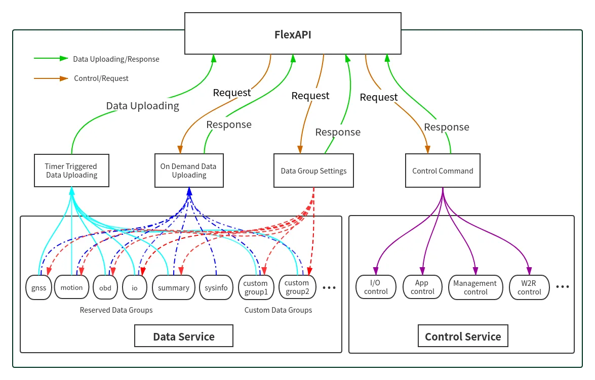
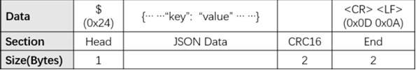

# FlexAPI_TCP_for_3rd_party_platform

FlexAPI TCP Integration Guide for Third-Party Platforms for VT

## *For VT series*

## Revision History

| Revision | Date | Author | Item(s) changed | Note |
| :--- | :--- | :--- | :--- | :--- |
| 1.0.1 | 2021-07-21 | liyb | Created this document based on . |  |
| 1.0.1 | 2024-08-16 | Tianmh | Update. |  |

## 1. Introduction

We introduced FlexAPI for the fast evolving IoT applications, which highly value easy integration, openness, flexibility, extensibility and programmability.

FlexAPI is designed to be efficient, clean and ready to use. It's network oriented and programming language independent, and is ideal for cloud platform integration.

FlexAPI provides unified data and control services via TCP messages for 3rd party platforms.

For data service, each topic corresponds to a group of data, and we have ready to use reserved groups such as: GNSS, Motion, IO, OBD, Cellular, Sensor, W2R(Modbus).

Besides, user can use sysinfo group to obtain device basic information.

In general, reserved groups are enough for user's need.

For advanced users, they can even define their interested groups and set their uploading intervals.

We employ a request & response scheme for user initiated service requests.

### 1.1 Architecture




## 2. FlexAPI Overview

FlexAPI organizes data as groups and provides ready to use reserved groups for users to develop their applications.

FlexAPI allow users to change reserved and custom group settings.

Users can get timer triggered group data periodically and event triggered data. Besides, FlexAPI also allow users to actively get group data on demand.

For user initiated service requests we employ a request & response scheme.

Request & response scheme means users need to subscribe to the response topics, and they request service by publishing a message to the request topics.

This overview part gives summary on: FlexAPI general information, error codes and supported topics.

For Basic Usage, see [3. Basic usage](#3-basic-usage).

For Advanced Usage, see [4. Advanced usage](#4-advanced-usage).

For FlexAPI supported Parameters, see [Appendix A. FlexAPI supported Parameters](#appendix-a-flexapi-supported-parameters).

### 2.1 FlexAPI Return Information and Errors

### 2.1.0 FlexAPI Message Format




**Head**: The start character of packet.\
**JSON Data**: The message in JSON format in packet.\
**CRC16**: Checksum, Only the JSON data part is calculated. CRC parameter: POLY: 0x8005\
(x<sup>16 + x</sup>15 + x^2 + 1), INIT: 0x0000, XOROUT: 0x0000.\
**End**: The end sequence of packet.

#### 2.1.1 General Information

| Parameter Name | Description | Type | Note |
| :--- | :--- | :--- | :--- |
| client\_token | client token | string | A unique string for users to match responses with the corresponding requests. |
| result | result | object | When the request succeeds, there will be result field in response message body.   API callers should check the content of the result field to    determine whether the request has been successfully processed. |
| error | error code | string | When the request fails, it is added to the response message body.   For more information, see [General Error Codes](#212-general-error-codes) |
| error\_desc | error description | string | When the request fails, it is added to the response message body.   For more information, see [General Error Codes](#212-general-error-codes) |
| ts | time stamp | number | UNIX timestamp since Epoch. Indicates when the message was transmitted by device. |

#### 2.1.2 General Error Codes

| Error Code | Description | Error Handling |
| :--- | :--- | :--- |
| auth\_failed | authentication failed | check username and password |
| invalid\_parameter | invalid parameter | check request parameter |
| not\_found | resource not exist | make sure related service is enabled and running |
| device\_busy | device busy | retry request |
| device\_error | device internal error | retry request |
| data\_invalid | resource invalid | retry request |

### 2.3 FlexAPI Limits

| Resource | Limit |
| :--- | :--- |
| Minimum retry interval of `settings`, `refresh`, `get` requests | 3 s |
| Minimum retry interval of `io control` request | 5 s |
| `client_id` size | SN of VT series |
| `client_token` size | up to 32 bytes of arbitrary string |
| Available custom groups | up to 8 |
| Maximum data items per group | 32 |

## 3. Basic Usage

### 3.1 Timer Triggered Reserved Group Data Get

#### 3.1.1 OBD Data

**JSON data**：

```json
{
  "topic":"v1/{client_id}/obd/info",
  "payload":{
    "obd.ts" : 1592820539,
    "obd.status":"Connected",
    "obd.rpm" : 1234,
    "obd.speed" : 20
  }

```

Parameter description, See [General Information](#211-general-information) & [OBD Parameters](#a4-obd-parameters).

Use [OBD settings](#322-obd-settings) to modify group setting(`interval` & `interest`).

#### 3.1.2 GNSS Data

You will periodically receive the related data by default.

\*\*JSON data \*\*

```json
{
  "topic":"v1/{client_id}/gnss/info",
  "payload":{
    "gnss.ts" : 1592820539,
    "gnss.latitude": 40.232213,
    "gnss.longitude": 116.34366,
    "gnss.altitude": 346.0,
    "gnss.speed": 87.6,
    "gnss.heading": 234.0,
    "gnss.hdop": 1.2,
    "gnss.fix": 3,
    "gnss.num_sv": 7
  }
}
```

Parameter description, See [General Information](#211-general-information) & [GNSS Parameters](#a1-gnss-parameters).

Use [GNSS settings](#323-gnss-settings) to modify group setting(`interval` & `interest`).

#### 3.1.3 Motion Data

You will periodically receive the related data by default.

**JSON data**：

```json
{
  "topic":"v1/{client_id}/motion/info",
  "payload":{
    "motion.ts": 1592820539,
    "motion.ax": 0.08,
    "motion.ay": 0.0,
    "motion.az": 0.0,
    "motion.gx": 0.15,
    "motion.gy": 0.03,
    "motion.gz": -0.47
  }
}
```

Parameter description, See [General Information](#211-general-information) & [Motion Parameters](#a2-motion-parameters).

Use [Motion settings](#324-motion-settings) to modify group setting(`interval` & `interest`).

#### 3.1.4 IO Data

You will periodically receive the related data by default.

**JSON data**：

```json
{
  "topic":"v1/{client_id}/io/info",
  "payload":{
    "io.ts": 1592820539,
    "io.AI1": 0.0,
    "io.DI1": 0,
    "io.DI1_pullup": 0,
    "io.DI2": 0,
    "io.DI2_pullup": 0,
    "io.DI3": 0,
    "io.DI3_pullup": 0,
    "io.DI4": 0,
    "io.DI4_pullup": 0,
    "io.DO1": 0,
    "io.DO2": 0,
    "io.DO3": 0,
    "io.IGT": 0
  }
}
```

Parameter description, See [General Information](#211-general-information) & [IO Parameters](#a3-io-parameters).

Use [IO settings](#325-io-settings) to modify group setting(`interval` & `interest`).

#### 3.1.5 Cellular1 Data

You will periodically receive the related data by default.

\*\*JSON data \*\*：

```json
{
  "topic":"v1/{client_id}/cellular1/info",
  "payload":{
    "modem1.ts": 1598425365,
    "modem1.imei": "862104021247207",
    "modem1.imsi": "460013231603009",
    "modem1.iccid": "89860118802836799717",
    "modem1.signal_lvl": 28,
    "modem1.reg_status": 1,
    "modem1.operator": "46001",
    "modem1.network": 3,
    "modem1.lac": "EA00",
    "modem1.cell_id": "71CF520",
    "cellular1.status": 3,
    "cellular1.ip": "10.210.255.168",
    "cellular1.netmask": "255.255.255.255",
    "cellular1.gateway": "1.1.1.3",
    "cellular1.dns1": "119.7.7.7",
    "cellular1.up_at": 1598424985
  }
}
```

Parameter description, See [General Information](#211-general-information) & [Cellular Parameters](#a5-cellular-parameters).

Use [Cellular settings](#326-cellular1-settings) to modify group setting(`interval` & `interest`).

#### 3.1.6 Sysinfo Data

\*\*JSON data \*\*：

```json
{
  "topic": "v1/VL2002346000360/sysinfo/info",
  "payload": {
    "sysinfo.ts": 1723778702,
    "sysinfo.model_name": "200",
    "sysinfo.oem_name": "global",
    "sysinfo.serial_number": "VL2002346000360",
    "sysinfo.firmware_version": "VT2_V1.2.59.0",
    "sysinfo.product_number": "FQ32",
    "sysinfo.description": "www.inhandnetworks.com"
  }
}
```

Parameter description, See [General Information](#211-general-information) & [System Parameters](#a6-system-parameters).

Use [Sysinfo Settings](#327-sysinfo-settings) to modify group setting(`interval` & `interest`).

#### 3.1.7 Sensor info

The VT series uses group sensor to upload the data from sensors to  MQTT broker.At present, only iButton/temperature sensor connected with 1-wire bus are supported.

\*\*JSON data \*\*：

```json
{
  "topic": "v1/{client_id}/sensor/info",
  "payload": {
    "sensor.ts" : 1642662299,
    "sensor.data" : [ {
      "type" : "1W_TP",
      "id" : "7c00000c0370db28",
      "value" : 25
    } ]
  }
}
```

Parameter description, See [General Information](#211-general-information) & [Sensor Parameters](#a7-sensor-parameters).

#### 3.1.8 W2R info

The VT series use this topic to upload the data from wired or wireless interface to MQTT broker. At present, **only  modbus(interface: serial4) is supported**.

\*\*JSON data \*\*：

```json
{
  "topic": "v1/{client_id}/w2r/info",
  "payload": {
    "w2r.ts" : 1642665195,
    "w2r.if" : "serial4",
    "w2r.proto" : "modbus",
    "w2r.rmt" : [ [ 1, 3, 31, 0 ], [ 1, 3, 30, 0 ], [ 1, 3, 26, 0 ], [ 1, 3, 25, 0 ], [ 1, 3, 24, 0 ], [ 1, 3, 23, 0 ], [ 1, 3, 22, 0 ], [ 1, 3, 21, 0 ], [ 1, 3, 20, 0 ], [ 1, 3, 19, 0 ], [ 1, 3, 18, 0 ], [ 1, 3, 17, 0 ], [ 1, 3, 13, 0 ], [ 1, 3, 12, 0 ], [ 1, 3, 11, 0 ], [ 1, 3, 10, 0 ], [ 1, 3, 8, 0 ], [ 1, 3, 7, 0 ], [ 1, 3, 5, 0 ], [ 1, 3, 4, 0 ], [ 1, 3, 3, 0 ], [ 1, 3, 2, 0 ], [ 1, 3, 1, 0 ] ]
  }
}
```

The format of the w2r.rmt value is as follows,

:::tips
\[\[slave address,function code,register address,data], \[slave address,function code,register address,data], \[slave address,function code,register address,data], ...,\[slave address,function code,register address,data]]

:::

Parameter description, See [General Information](#211-general-information) & [W2R Parameters](#a8-w2r-parameters).

### 3.2 Reserved Group Settings

#### 3.2.1 General Settings

| Parameter Name | Description | Type | Range | Units | Optional | Note |
| :--- | :--- | :--- | :--- | :--- | :--- | :--- |
| client\_token | A unique string for users to match responses with the corresponding requests. | string |  |  | mandatory |  |
| interval | uploading interval | int | \[0,3600] | s | optional | 0: disable timer upload |
| interest | interest parameter   List of interested item, each item is represented as key: alias.   alias is used in reported messages to rewrite key,   a value of "" means no alias.   For example,   set interest with alias: {"obd.mil": "MIL", "obd.dtcs": "dtcNum"}   reported data: {"MIL": "1", "dtcNum": "3"}      set interest without alias: {"obd.mil": "", "obd.dtcs": ""}   reported data: {"obd.mil": "1", "obd.dtcs": "3"}    | object |  |  | optional | 'key': FlexAPI Supported parameters   'alias': parameter alias    OBD group, see [OBD Parameters](#a4-obd-parameters)   GNSS group, see [GNSS Parameters](#a1-gnss-parameters)   Motion group, see [Motion Parameters](#a2-motion-parameters)   IO group, see [IO Parameters](#a3-io-parameters)    |

**For **`interval`** and **`interest`** parameters, there are four use cases which apply to both reserved and custom groups.**

**Case 1. Disable Group Data Uploading**

Specify only `interval` field and set its value to 0 in message body.

**Note**: `group_name` is obd, gnss, motion, io, summary, or custom group name.

**Request JSON data**：

```json
{ 
  "topic":"v1/{client_id}/{group_name}/set",
  "payload":{
    "interval": 0
  }
}
```

**Response JSON data**：

Success：

```json
{
  "topic":"v1/{client_id}/{group_name}/set/resp",
  "result": {
    "interval": 0
  }
}
```

Failure：

```json
{
  "topic":"v1/{client_id}/{group_name}/set/resp",
  "result":{
    "error": "invalid_parameter",
    "error_desc": "Invalid request parameter"
  }
}
```

Parameter description, see [General Information](#211-general-information).

**Case 2. Change Only Group Data Uploading Interval**

Specify only `interval` field in message body.

**Request JSON data**：

```json
{ 
  "topic":"v1/{client_id}/{group_name}/set",
  "payload":{
    "interval": 60
  }
}
```

**Response Topic**： `v1/{client_id}/{group_name}/set/resp`

**Response JSON data**：

Success：

```json
{
  "topic":"v1/{client_id}/{group_name}/set/resp",
  "result": {
    "interval": 60
  }
}
```

Failure：

```json
{
  "topic":"v1/{client_id}/{group_name}/set/resp",
  "result": {
    "error": "invalid_parameter",
    "error_desc": "Invalid request parameter"
  }
}
```

Parameter description, see [General Information](#211-general-information).

**Case 3. Change only group data interest**

Specify only `interest` field in message body.

**Request JSON data**：

```json
{ 
  "topic":"v1/{client_id}/{group_name}/set",
  "payload":{
    "interest": {"gnss.latitude": "lat", "gnss.longitude": "lon", "obd.speed": "speed", "obd.odo": ""}
  }
}
```

**Response JSON data**：

Success：

```json
{
  "topic":"v1/{client_id}/{group_name}/set/resp",
  "result": {
    "interest": {"gnss.latitude": "lat", "gnss.longitude": "lon", "obd.speed": "speed", "obd.odo": ""}
  }
}
```

Failure：

```json
{
  "topic":"v1/{client_id}/{group_name}/set/resp",
  "result":{
    "error": "invalid_parameter",
    "error_desc": "Invalid request parameter"
  }
}
```

Parameter description, see [General Information](#211-general-information).

**Case 4. Change Both Interest and Uploading Interval**

Specify both `interest` and `interval` fields in message body.

**Request JSON data**：

```json
{ 
  "topic":"v1/{client_id}/{group_name}/set",
  "payload":{
    "interval": 60,
    "interest": {"gnss.latitude": "lat", "gnss.longitude": "lon", "obd.speed": "speed", "obd.odo": ""}
  }
}
```

**Response JSON data**：

Success：

```json
{
  "topic":"v1/{client_id}/{group_name}/set/resp",
  "result": {
    "interval": 60,
    "interest": {"gnss.latitude": "lat", "gnss.longitude": "lon", "obd.speed": "speed", "obd.odo": ""}
  }
}
```

Failure：

```json
{
  "topic":"v1/{client_id}/{group_name}/set/resp",
  "result":{
    "error": "invalid_parameter",
    "error_desc": "Invalid request parameter"
  }
}
```

Parameter description, see [General Information](#211-general-information).

#### 3.2.2 OBD Settings

Publish a message to this topic to set your interested data and uploading interval.

Default interval is 60s. Default interest is available parameters from the [OBD Parameters](#a4-obd-parameters).

**Request JSON data**：

```json
{ 
  "topic": "v1/{client_id}/obd/set",
  "payload":{
    "interval": 10,
    "interest": {"obd.mil": "MIL", "obd.dtcs": "dtcNum", "obd.rpm": "engineSpeed"}
  }
}
```

**Response JSON data**：

Success：

```json
{
  "topic":"v1/{client_id}/obd/set/resp",
  "result": {
    "interval": 10,
    "interest": {"obd.mil": "MIL", "obd.dtcs": "dtcNum", "obd.rpm": "engineSpeed"}
  }
}
```

Failure：

```json
{
  "topic":"v1/{client_id}/obd/set/resp",
  "result":{
    "error": "invalid_parameter",
    "error_desc": "Invalid request parameter"
  }
}
```

Parameter description,  see [General Information](#211-general-information).

#### 3.2.3 GNSS Settings

Publish a message to this topic to set your interested data and uploading interval.

Default interval is Auto. Default interest is available parameters from the [GNSS Parameters](#a1-gnss-parameters).

**Request Topic**：`v1/{client_id}/gnss/set`

**Request  JSON data**：

```json
{ 
  "topic": "v1/{client_id}/gnss/set",
  "payload":{
    "interval": 60,
    "interest": {"gnss.latitude": "lat", "gnss.longitude": "lon", "gnss.altitude": "alt"}
  }
}
```

**Response Topic**： `v1/{client_id}/gnss/set/resp`

**Response  JSON data**：

Success：

```json
{
  "topic":"v1/{client_id}/gnss/set/resp",
  "result": {
    "interval": 60,
    "interest": {"gnss.latitude": "lat", "gnss.longitude": "lon", "gnss.altitude": "alt"}
  }
}
```

Failure：

```json
{
  "topic":"v1/{client_id}/gnss/set/resp",
  "result":{
    "error": "invalid_parameter",
    "error_desc": "Invalid request parameter"
  }
}
```

Parameter description,  see [General Information](#211-general-information).

#### 3.2.4 Motion Settings

Publish a message to this topic to set your interested data and uploading interval.

Default interval is 60s. Default interest is available parameters from the [Motion Parameters](#a2-motion-parameters).

**Request Topic**：`v1/{client_id}/motion/set`

**Request  JSON data**：

```json
{ 
  "topic": "v1/{client_id}/motion/set",
  "payload":{
    "interval": 60,
    "interest": {"motion.ax": "acceleration_x", "motion.ay": "acceleration_y", "motion.az": "acceleration_z"}
  }
}
```

**Response Topic**： `v1/{client_id}/motion/set/resp`

**Response  JSON data**：

Success：

```json
{
  "topic":"v1/{client_id}/motion/set/resp",
  "result": {
    "interval": 60,
    "interest": {"motion.ax": "acceleration_x", "motion.ay": "acceleration_y", "motion.az": "acceleration_z"}
  }
}
```

Failure：

```json
{
  "topic":"v1/{client_id}/motion/set/resp",
  "result":{
    "error": "invalid_parameter",
    "error_desc": "Invalid request parameter"
  }
}
```

Parameter description,  see [General Information](#211-general-information).

#### 3.2.5 IO Settings

Publish a message to this topic to set your interested data and uploading interval.

Default interval is 60s. Default interest is available parameters from the [IO Parameters](#a3-io-parameters).

**Request  JSON data**：

```json
{ 
  "topic": "v1/{client_id}/io/set",
  "payload":{
    "interval": 60,
    "interest": {"io.AI1": "ai1", "io.AI2": "ai2", "io.AI3": "ai3"}
  }
}
```

**Response  JSON data**：

Success：

```json
{
  "topic":"v1/{client_id}/io/set/resp",
  "result": {
    "interval": 60,
    "interest": {"io.AI1": "ai1", "io.AI2": "ai2", "io.AI3": "ai3"}
  }
}
```

Failure：

```json
{
  "topic":"v1/{client_id}/io/set/resp",
  "result":{
    "error": "invalid_parameter",
    "error_desc": "Invalid request parameter"
  }
}
```

Parameter description, see [General Information](#211-general-information).

#### 3.2.6 Cellular1 Settings

Publish a message to this topic to set your interested data and uploading interval.

Default interval is 60s. Default interest is available parameters from the [Cellular Parameters](#a5-cellular-parameters).

**Request  JSON data**：

```json
{ 
  "topic": "v1/{client_id}/cellular1/set",
  "payload":{
    "interval": 60,
    "interest": {"modem1.active_sim": "active_sim", "modem1.signal_lvl": "signal_lvl", "cellular1.status": "status"}
  }
}
```

**Response  JSON data**：

Success：

```json
{
  "topic":"v1/{client_id}/cellular1/set/resp",
  "result": {
    "interval": 60,
    "interest": {"modem1.active_sim": "active_sim", "modem1.signal_lvl": "signal_lvl", "cellular1.status": "status"}
  }
}
```

Failure：

```json
{
  "topic":"v1/{client_id}/cellular1/set/resp",
  "result":{
    "error": "invalid_parameter",
    "error_desc": "Invalid request parameter"
  }
}
```

Parameter description, see [General Information](#211-general-information).

#### 3.2.7 Sysinfo Settings

Publish a message to this topic to set your interested data and uploading interval.

Default interval is 600s. Default interest is available parameters from the [System Parameters](#a6-system-parameters).

**Request  JSON data**：

```json
{ 
  "topic": "v1/{client_id}/sysinfo/set",
  "payload":{
    "interval": 60,
    "interest": {"sysinfo.model_name": "model_name", "sysinfo.serial_number": "sn"}
  }
}
```

**Response  JSON data**：

Success：

```json
{ 
  "topic": "v1/{client_id}/sysinfo/set",
  "payload":{
    "interval": 60,
    "interest": {"sysinfo.model_name": "model_name", "sysinfo.serial_number": "sn"}
  }
}
```

Failure：

```json
{
  "topic":"v1/{client_id}/sysinfo/set/resp",
  "result":{
    "error": "invalid_parameter",
    "error_desc": "Invalid request parameter"
  }
}
```

Parameter description, see [General Information](#211-general-information).

### 3.3 On Demand Reserved Group Information Get

#### 3.3.1 OBD Data

**Request  JSON data**：

```json
{ 
  "topic": "v1/{client_id}/obd/refresh"
}
```

\*\*Response  JSON data：

Success：

```json
{
  "topic":"v1/{client_id}/obd/refresh/resp",
  "result": {
    "obd.rpm": 34245,
    "obd.speed": 53255
  }
}
```

Failure：

```json
{
  "topic":"v1/{client_id}/obd/refresh/resp",
  "result":{
    "error": "invalid_parameter",
    "error_desc": "Invalid request parameter"
  }
}
```

Parameter description,  reference [General Information](#211-general-information) & [OBD Parameters](#a4-obd-parameters).

#### 3.3.2 GNSS Data

Publish a message to get GNSS data on demand.

**Request  JSON data**：

```json
{ 
  "topic": "v1/{client_id}/gnss/refresh"
}
```

**Response Topic**： `v1/{client_id}/gnss/refresh/resp`

**Response  JSON data**：

Success：

```json
{
  "topic":"v1/{client_id}/gnss/refresh/resp",
  "result": {
    "gnss.latitude": 40.232213,
    "gnss.longitude": 116.34366,
    "gnss.altitude": 346.0,
    "gnss.speed": 87.6,
    "gnss.heading": 234.0,
    "gnss.hdop": 1.2,
    "gnss.pdop": 2.1,
    "gnss.hacc": 1.0,
    "gnss.fix": 3,
    "gnss.num_sv": 7,
    "gnss.date": "2020-4-17",
    "gnss.time": "10:16:21"
  }
}
```

Failure：

```json
{
  "topic":"v1/{client_id}/gnss/refresh/resp",
  "result":{
    "error": "invalid_parameter",
    "error_desc": "Invalid request parameter"
  }
}
```

Parameter description,  reference [General Information](#211-general-information) & [GNSS Parameters](#a1-gnss-parameters).

#### 3.3.3 Motion Data

Publish a message to get motion data on demand.

\*\*Request  JSON data：

```json
{ 
  "topic": "v1/{client_id}/motion/refresh"
}
```

**Response  JSON data**：

Success：

```json
{
  "topic":"v1/{client_id}/motion/refresh/resp",
  "result": {
    "motion.ax": 0.08,
    "motion.ay": 0.0,
    "motion.az": 0.0,
    "motion.gx": 0.15,
    "motion.gy": 0.03,
    "motion.gz": -0.47,
    "motion.roll": -0.65,
    "motion.pitch": 1.03,
    "motion.yaw": 302.49
  }
}
```

Failure：

```json
{
  "topic":"v1/{client_id}/motion/refresh/resp",
  "result":{
    "error": "invalid_parameter",
    "error_desc": "Invalid request parameter"
  }
}
```

Parameter description,  reference [General Information](#211-general-information) & [Motion Parameters](#a2-motion-parameters).

#### 3.3.4 IO Data

Publish a message to get IO data on demand.

**Request  JSON data**：

```json
{ 
  "topic": "v1/{client_id}/io/refresh"
}
```

**Response Topic**： `v1/{client_id}/io/refresh/resp`

**Response  JSON data**：

Success：

```json
{
  "topic":"v1/{client_id}/io/refresh/resp",
  "result": {
    "io.AI1": 0.0,
    "io.DI1": 0,
    "io.DI1_pullup": 0,
    "io.DI2": 0,
    "io.DI2_pullup": 0,
    "io.DI3": 0,
    "io.DI3_pullup": 0,
    "io.DI4": 0,
    "io.DI4_pullup": 0,
    "io.DO1": 0,
    "io.DO2": 0,
    "io.DO3": 0
  }
}
```

Failure：

```json
{
  "topic":"v1/{client_id}/io/refresh/resp",
  "result":{
    "error": "invalid_parameter",
    "error_desc": "Invalid request parameter"
  }
}
```

Parameter description,  reference [General Information](#211-general-information) & [IO Parameters](#a3-io-parameters).

#### 3.3.5 Cellular1 Data

Publish a message to get cellular data on demand.

**Request  JSON data**：

```json
{ 
  "topic": "v1/{client_id}/cellular1/refresh"
}
```

**Response Topic**： `v1/{client_id}/cellular1/refresh/resp`

**Response  JSON data**：

Success：

```json
{
  "topic":"v1/{client_id}/cellular1/refresh/resp",
  "result": {
    "modem1.ts": 1598425245,
    "modem1.imei": "862104021247207",
    "modem1.imsi": "460013231603009",
    "modem1.iccid": "89860118802836799717",
    "modem1.signal_lvl": 29,
    "modem1.reg_status": 1,
    "modem1.operator": "46001",
    "modem1.network": 3,
    "modem1.lac": "EA00",
    "modem1.cell_id": "71CF520",
    "cellular1.ts": 1598425316,
    "cellular1.status": 3,
    "cellular1.ip": "10.210.255.168",
    "cellular1.netmask": "255.255.255.255",
    "cellular1.gateway": "1.1.1.3",
    "cellular1.dns1": "119.7.7.7",
    "cellular1.up_at": 1598424985
  }
}
```

Failure：

```json
{
  "topic":"v1/{client_id}/cellular1/refresh/resp",
  "result":{
    "error": "invalid_parameter",
    "error_desc": "Invalid request parameter"
  }
}
```

Parameter description,  reference [General Information](#211-general-information) & [Cellular Parameters](#a5-cellular-parameters).

#### 3.3.6 System Info

Publish a message to get system info on demand.

**Request  JSON data**：

```json
{ 
  "topic": "v1/{client_id}/sysinfo/refresh"
}
```

**Response  JSON data**：

Success：

```json
{
  "topic":"v1/{client_id}/sysinfo/refresh/resp",
  "result": {
    "sysinfo.ts": 1598424935,
    "sysinfo.model_name": "VT310",
    "sysinfo.oem_name": "inhand",
    "sysinfo.serial_number": "VF3102020122201",
    "sysinfo.firmware_version": "VT3_V1.0.22",
    "sysinfo.product_number": "FQ58",
    "sysinfo.description": "www.inhand.com.cn"
  }
}
```

Failure：

```json
{
  "topic":"v1/{client_id}/sysinfo/refresh/resp",
  "result":{
    "error": "invalid_parameter",
    "error_desc": "Invalid request parameter"
  }
}
```

Parameter description,  reference [General Information](#211-general-information) & [System Parameters](#a6-system-parameters).

### 3.4 Control Service

#### 3.4.1 IO Control

Publish a message to this topic to turn on/off the digital output.

**Request  JSON data**：

```json
{ 
  "topic": "v1/{client_id}/io/control",
  "payload":{
    "io.DO1": 0,
    "io.DO2": 0,
    "io.DO3": 0
  }
}
```

**Response  JSON data**：

Success：

```json
{
  "topic":"v1/{client_id}/io/control/resp",
  "result": {
    "io.DO1": 0,
    "io.DO2": 0,
    "io.DO3": 0
  }
}
```

Failure：

```json
{
  "topic":"v1/{client_id}/io/control/resp",
  "result":{
    "error": "invalid_parameter",
    "error_desc": "Invalid request parameter"
  }
}
```

Parameter description,  see [General Information](#211-general-information) & [IO Parameters](#a3-io-parameters) digital output part.

#### 3.4.2 Management control

##### 3.4.2.1 General Parameters Description

| Parameter Name | Description | Type | Optional | Note |
| :--- | :--- | :--- | :--- | :--- |
| client\_token | A unique string for users to match responses with the corresponding requests | string | | |
| operation | Task type | string | | |
| target | Operation object | string | | |
| params | Information needed by the task | object | Optional | |
| status | Task execution status | string | | |
| desc | Task failure reason | string | Optional | |

Currently Supported Tasks are As Follows:

| Task | Operation | Target | Response | Reference | Note |
| --- | :--- | --- | --- | --- | --- |
| Upgrade device firmware | upgrade | dev-fw | process | see [Upgrade device firmware](https://inhandnetworks.yuque.com/zi6a4d/go8wrn/uc33r715ekqhvgpm#3422-upgrade-device-firmware) | |
| Device configuration get | cfg-get | dev-cfg | | see [Device configuration get](https://inhandnetworks.yuque.com/zi6a4d/go8wrn/uc33r715ekqhvgpm#3423-device-configuration-get) | |
| Device configuration set | cfg-set | dev-cfg | | see [Device configuration set](https://inhandnetworks.yuque.com/zi6a4d/go8wrn/uc33r715ekqhvgpm#3424-device-configuration-set) | |

##### 3.4.2.2 Upgrade Device Firmware

Publish a message to this topic to execute a firmware upgrade.

**Request  JSON data**：

```json
{
  "topic":"v1/{client_id}/mgmt/control",
  "paload":{
    "operation":"upgrade",
    "target":"dev-fw",
    "params":{
      "len":"123132",
      "url":"http://154.8.173.184/VT2_V1.1.34.IHD",
      "md5":"0ed4037cee6ef8f91ac7e9397a0ed30a"
    }
  }
}
```

Parameters description in ***params*** are described as follows:

| Parameter Name | Description | Type | Value | Units | Optional |
| :--- | :--- | :--- | :--- | :--- | :--- |
| len | Device firmware length | int | | byte | |
| url | Device firmware location to download | string | | | |
| md5 | Device firmware md5 checksum | string | | | |

**Response  JSON data**：

If the task is accepted, the stage status information will be reported about every 3 seconds in response topic.

Downloading:

```json
{
  "topic":"v1/{client_id}/mgmt/control/resp",
  "result":{
    "operation": "upgrade",
    "target": "dev-fw",
    "status": "downloading",
    "desc": "50%"
  }
}
```

Upgrading:

```json
{
  "topic":"v1/{client_id}/mgmt/control/resp",
  "result":{
    "operation": "upgrade",
    "target": "dev-fw",
    "status": "Upgrading",
    "desc": "50%"
  }
}
```

Rebooting:

```json
{
  "topic":"v1/{client_id}/mgmt/control/resp",
  "result":{
    "operation": "upgrade",
    "target": "dev-fw",
    "status": "rebooting"
  }
}
```

If any errors occur during the upgrade process, the following message will be reported.

Failure：

```json
{
  "topic":"v1/{client_id}/mgmt/control/resp",
  "result":{
    "operation": "upgrade",
    "target": "dev-fw",
    "status": "failed",
    "desc": "firmware md5sum error"
  }
}
```

For detailed parameter description,  see [General parameters description](#3421-general-parameters-description).

##### 3.4.2.3 Device configuration get

Publish a message to this topic to Obtain the current device configuration.

**Request  JSON data**：

```json
{
  "topic":"v1/{client_id}/mgmt/control",
  "paload":{
    "operation":"cfg-get",
    "target":"dev-cfg"
  }
}
```

**Response  JSON data**：

```json
{
  "topic":"v1/{client_id}/mgmt/control/resp",
  "paload":{  
    "operation":"cfg-get",
    "target":"dev-cfg",
    "status":"s1BR=460800&cDialNum=*99***1#&apn=internet&apn_usr=gprs&apn_pw=gprs&cAuth=0&cOperator=0&mSrvHost=che.inhandiot.com&mSrvHost=che.inhandiot.com&mSrvHost=che.inhandiot.com&fmLbsInt=60&fmSerInt=3600&fmKpAlive=60&azureEn=0&azureConStr=HostName=VT310.azure-devices.cn;DeviceId=;SharedAccessKey=&wcEn=1&wcSrvHost=nl.gpsgsm.org&wcSrvPort=21000&wcLbsInt=10&stdMqttEn=0&stdMqttHost=154.8.173.184&stdMqttPort=1883&tcpClientEn=1&tcpSrvHost=193.193.165.236&tcpSrvPort=22402&aliAuType=0&aliDevName=test1&can1Proto=2&obdProto=1&obdUpMe=0&can1UpMe=0&can1EldEn=0&sleepUseIgt=0&sleepWkUpItv=0&sleepWkUpRT=2&mCltType=3&1WUpItv=0&mbPT=0>3>1>5;"
  }
}
```

##### 3.4.2.4 Device configuration set

Publish a message to this topic to set device configuration.

**Request  JSON data**：

```json
{
  "topic":"v1/{client_id}/mgmt/control",
  "paload":{
    "operation":"cfg-set",
    "target":"dev-cfg"
  }
}
```

**Response  JSON data**：

Success：

```json
{
  "topic":"v1/{client_id}/mgmt/control/resp",
  "paload":{
    "operation":"cfg-set",
    "target":"dev-cfg",
    "params":"pubInDEn=1&mCltType=3&stdMqttHost=154.8.173.184&stdMqttPort=1883&stdMqttEn=1"
  }
}
```

The device will restart in 10 seconds.

Failure：

```json
{
  "topic":"v1/{client_id}/mgmt/control/resp",
  "paload":{
    "operation" : "cfg-set",
    "target" : "dev-cfg",
    "status" : "failed"
  }
}
```

## 4. Advanced Usage

### 4.1 Custom Group Settings

#### 4.1.1 Create/Update Custom Group

Use the following topics to define your interested groups and set their uploading intervals.

For `interval` and `interest` parameters, there are four use cases. See [General settings](#321-general-settings).

**Request  JSON data**：

```json
{ 
    "topic": "v1/{client_id}/group/set",
    "payload":{
        "settings": [{
            "group_name": "group1",
            "interval": 60,
            "interest": {"gnss.latitude": "lat","gnss.longitude": "lon","gnss.altitude": "alt","obd.speed": "speed","obd.odo": "odo","userdata.custom_key":"custom_key"}
        },{
            "group_name": "group2",
            "interval": 30,
            "interest": {"io.DI1": "DI1","io.DI2": "DI2","io.DI3": "DI3","io.DI4": "DI4","io.DO1": "DO1","io.DO2": "DO2","io.DO3": "DO3"}
        }
        ]
    }
}
```

**Response  JSON data**：

Success：

```json
{
   "topic":"v1/{client_id}/group/set/resp",
    "result": [{
            "group_name": "group1",
            "interval": 60,
            "interest": {"gnss.latitude": "lat","gnss.longitude": "lon","gnss.altitude": "alt","obd.speed": "speed","obd.odo": "odo","userdata.custom_key":"custom_key"}
        },{
            "group_name": "group2",
            "interval": 30,
            "interest": {"io.DI1": "DI1","io.DI2": "DI2","io.DI3": "DI3","io.DI4": "DI4","io.DO1": "DO1","io.DO2": "DO2","io.DO3": "DO3"}
        }
    ]
}
```

Failure：

```json
{
    "topic":"v1/{client_id}/group/set/resp",
    "result":{
        "error": "invalid_parameter",
        "error_desc": "Invalid request parameter"
    }
}
```

Parameter description,  see [General Information](#211-general-information) & [General settings](#321-general-settings).

#### 4.1.2 Get Custom Group Settings

Use the following topics to get custom group settings.

**Request  JSON data**：

```json
{ 
    "topic": "v1/{client_id}/group/get"
}
```

**Response  JSON data**：

Success：

```json
{
    "topic":"v1/{client_id}/group/get/resp",
    "result": [{
        "group_name": "group1",
        "interval": 60,
        "interest": {"gnss.latitude": "lat","gnss.longitude": "lon","gnss.altitude": "alt","obd.speed": "speed","obd.odo": "odo","userdata.custom_key":"custom_key"}  
    },{
        "group_name": "group2",
        "interval": 30,
        "interest": {"io.DI1": "DI1","io.DI2": "DI2","io.DI3": "DI3","io.DI4": "DI4","io.DO1": "DO1","io.DO2": "DO2","io.DO3": "DO3"} 
    }]
}
```

Failure：

```json
{
    "topic":"v1/{client_id}/group/get/resp",
    "result":{
        "error": "invalid_parameter",
        "error_desc": "Invalid request parameter"
    }
}
```

Parameter description,  see [General Information](#211-general-information) & [General settings](#321-general-settings).

### 4.2 Timer Triggered Custom Group Data Get

Once you have subscribed to this topic, you will periodically receive the related data.

**JSON data**：

```json
{ 
    "topic":"v1/{client_id}/{group_name}/info",
    "payload":{
        "lat": 40.232213,
        "ai1": 1.0,
        "obd.speed": 50,
        "userdata.custom_key":"custom_value"
    }
}
```

Parameter description, see [General Information](#211-general-information) & [FlexAPI supported Parameters](#appendix-a-flexapi-supported-parameters).

### 4.3 On Demand Custom Group Data Get

Publish a message to get `group_name` data on demand.

**Request  JSON data**：

```json
{ 
    "topic": "v1/{client_id}/{group_name}/refresh"
}
```

**Response  JSON data**：

Success：

```json
{
    "topic":"v1/{client_id}/{group_name}/refresh/resp",
    "result": {
        "lat": 40.232213,
        "ai1": 1.0,
        "obd.speed": 50,
        "userdata.custom_key":"custom_value"
    }
}
```

Failure：

```json
{
    "topic":"v1/{client_id}/{group_name}/refresh/resp",
    "result":{
        "error": "invalid_parameter",
        "error_desc": "Invalid request parameter"
    }
}
```

Parameter description, see [General Information](#211-general-information) & [FlexAPI supported Parameters](#appendix-a-flexapi-supported-parameters).

## 5. Event Service

### 5.1 Event Level

| Level Name | Value | Description |
| :--- | :---: | :--- |
| Emergency | 5 | System is unusable. |
| Alert | 4 | Action must be taken immediately. |
| Error | 3 | Error conditions. |
| Warning | 2 | Warning conditions. |
| Notice | 1 | Normal but significant condition. |

### 5.2 Event Types

#### 5.2.1 General event Types

| Event Type | Description | Level | Note |
| :--- | :--- | :--- | --- |
| IGON | The ignition input has transitioned from low to high. | 1 |  |
| IGOFF | The ignition input has transitioned from high to low. | 1 |  |
| SYS\_SLEEP | The device entered deep sleep mode. | 1 |  |
| DI\_CHG | The value of Digital Input pin is changed. | 1 | |
| OVERSPEED | The device detects the occurrence of a overspeed event. | 1 |  |

#### 5.2.2 DTC event Types

| Event Name | Event Type | Description | Level | Note |
| :--- | :--- | :--- | :--- | :--- |
| OBDII DTC | OBDII\_DTC\_{dtc} | OBDII diagnostic trouble code event. | 2 | dtc: diagnostic trouble code string. see [OBD-II DTC](#5421-obd-ii-dtc) |
| J1939 DTC | J1939\_DTC\_{spn} | J1939 diagnostic trouble code event. | 2 | spn: see [J1939 DTC](#5422-j1939-dtc) |

#### 5.2.3 HARSH event Types

| Event Type | Description | Level | Note |
| :--- | --- | --- | --- |
| COLLISION | The device detects the occurrence of a collision event. | 2 | see [COLLISION event](https://inhandnetworks.yuque.com/zi6a4d/go8wrn/uc33r715ekqhvgpm#collision). |
| HARSH\_ACCELERATION | The device detects the occurrence of a acceleration event | 2 | see [HARSH ACCELERATION event](https://inhandnetworks.yuque.com/zi6a4d/go8wrn/uc33r715ekqhvgpm#harsh-acc-event). |
| HARSH\_BRAKING | The device detects the occurrence of a braking event | 2 | see [HARSH BRAKING event](https://inhandnetworks.yuque.com/zi6a4d/go8wrn/uc33r715ekqhvgpm#harsh-braking-event). |

#### 5.2.4 TURN event Types

| Event type | Description | Level | Note |
| --- | --- | --- | --- |
| TURN\_LEFT | The device detects the occurrence of a turn left event. | 2 | see [TURN\_LEFT](https://inhandnetworks.yuque.com/zi6a4d/go8wrn/uc33r715ekqhvgpm#turn-left-event). |
| TURN\_RIGHT | The device detects the occurrence of a turn right event. | 2 | see [TURN\_RIGHT](https://inhandnetworks.yuque.com/zi6a4d/go8wrn/uc33r715ekqhvgpm#turn-right-event). |

#### 5.2.5 IDLE event Types

| Event type | Description | Level | Note |
| --- | --- | --- | --- |
| IDLE | The device detects that the vehicle changes from moving to stationary state. | 2 | see [IDLE](https://inhandnetworks.yuque.com/zi6a4d/go8wrn/uc33r715ekqhvgpm#idle-event). |
| IDLE\_END | The device detects that the vehicle changes from stationary to moving state. | 2 | see [IDLE\_END](https://inhandnetworks.yuque.com/zi6a4d/go8wrn/uc33r715ekqhvgpm#idle-end-event). |

### 5.3 Event parameters

| Parameter Name | Description | Type | Range | Units | Optional | Note |
| :--- | :--- | :--- | :--- | :--- | :--- | :--- |
| starts\_at | Event start time | number |  | s |  | UNIX timestamp, in seconds since the epoch |
| ends\_at | Event end time | number |  | s | Optional | UNIX timestamp, in seconds since the epoch.   When the event is cleared, it is added to the event message body |
| status | Event status | string | `raise\|clear` |  |  | raise：event  occur   clear：event recovery |
| type | Event type | string |  |  |  | see [Event Types](#52-event-types) |
| level | Event level | number |  |  |  | see [Event Level](#51-event-level) |
| gnss.xxx | Additional location information(if any) |  |  |  | Optional | Location information associated with the event. see [GNSS Parameters](#a1-gnss-parameters) |
| motion.xxx | Additional motion information(if any) |  |  |  | Optional | Motion information associated with the event. see [Motion Parameters](#a2-motion-parameters) |
| obd.xxx | Additional obd information(if any) |  |  |  | Optional | OBD information associated with the event. see [OBD Parameters](#a4-obd-parameters) |
| io.xxx | Additional io information(if any) | | | | Optional | IO information associated with the event. see [IO Parameters](https://inhandnetworks.yuque.com/zi6a4d/go8wrn/uc33r715ekqhvgpm#A.3) |

### 5.4 Event examples

#### 5.4.1 General event

Once you have subscribed to this topic, you will receive the related event information.

**JSON data**：

```json
{ 
  "topic": "v1/{client_id}/event/notice",
  "payload":{
    "starts_at" : 1642666533,
    "status" : "raise",
    "type" : "IGON",
    "level" : 1,
    "gnss.latitude" : 30.587996,
    "gnss.longitude" : 104.053223,
    "gnss.altitude" : 460.100006,
    "gnss.speed" : 0,
    "gnss.heading" : 0,
    "gnss.hdop" : 1.6,
    "io.ts" : 1642666533,
    "io.AI1" : 0,
    "io.DI1" : 0,
    "io.DI2" : 1,
    "io.DI3" : 0,
    "io.DI4" : 0,
    "io.DI1_pullup" : 0,
    "io.DI2_pullup" : 1,
    "io.DI3_pullup" : 0,
    "io.DI4_pullup" : 0,
    "io.DO1" : 0,
    "io.DO2" : 0,
    "io.DO3" : 0,
    "io.IGT" : 1,
    "motion.ax" : 0.171776,
    "motion.ay" : 0.127612,
    "motion.az" : -0.959652,
    "motion.gx" : 0.35,
    "motion.gy" : 0.56,
    "motion.gz" : -0.49,
    "obd.odo": 100
  }
}
```

Parameter description, See [Event parameters](#53-event-parameters) & [FlexAPI supported Parameters](#appendix-a-flexapi-supported-parameters).

#### 5.4.2 DTC event

Once you have subscribed to this topic, you will receive the related event information.

##### 5.4.2.1 OBD-II DTC

**Event occur**:

**JSON data**：

```json
{
    "topic": "v1/{client_id}/event/notice",
    "payload":{
        "starts_at": 1609901565,
        "status": "raise",
        "type": "OBDII_DTC_P070F",
        "level": 2,
        "dtc": "P070F",
        "desc": "Transmission Fluid Level Too Low",
        "gnss.longitude": -111.33,
        "gnss.latitude": 38.2222,
        "gnss.altitude": 230,
        "gnss.heading": 42.5,
        "gnss.speed": 55,
        "gnss.hdop": 2.1,
        "obd.speed": 55,
        "obd.f_lvl": 21,
        "obd.odo": 2025,
        "motion.ax": 0.0,
        "motion.ay": 0.0,
        "motion.az": 0.0,
        "motion.gx": 0.0,
        "motion.gy": 0.0,
        "motion.gz": 0.0
    }
}
```

**Event clear**:

**JSON data**：

```json
{
    "topic": "v1/{client_id}/event/notice",
    "payload":{
        "starts_at": 1609901565,
        "ends_at": 1609901820,
        "status": "clear",
        "type": "OBDII_DTC_P070F",
        "level": 2,
        "dtc": "P070F",
        "desc": "Transmission Fluid Level Too Low",
        "gnss.longitude": -111.33,
        "gnss.latitude": 38.2222,
        "gnss.altitude": 230,
        "gnss.heading": 42.5,
        "gnss.speed": 0,
        "gnss.hdop": 2.1,
        "obd.speed": 0,
        "obd.f_lvl": 21,
        "obd.odo": 2025,
        "motion.ax": 0.0,
        "motion.ay": 0.0,
        "motion.az": 0.0,
        "motion.gx": 0.0,
        "motion.gy": 0.0,
        "motion.gz": 0.0
    }
}
```

**Parameter description:**

| Parameter Name | Description | Type | Range | Units | Optional | Note |
| :--- | :--- | :--- | :--- | :--- | :--- | :--- |
| dtc | Diagnostic trouble code | string |  |  |  |  |
| desc | Diagnostic trouble code description | string |  |  | optional |  |

More parameter description, See [Event parameters](#53-event-parameters) & [FlexAPI supported Parameters](#appendix-a-flexapi-supported-parameters).

##### 5.4.2.2 J1939 DTC

**Event occur**:

**JSON data**：

```json
{
    "topic": "v1/{client_id}/event/notice",
    "payload":{
        "starts_at": 1609901565,
        "status": "raise",
        "type": "J1939_DTC_173",
        "level": 2,
        "src_addr": 0,
        "fmi": 3,
        "oc": 1,
        "spn": 173,
        "gnss.longitude": -111.33,
        "gnss.latitude": 38.2222,
        "gnss.altitude": 230,
        "gnss.heading": 42.5,
        "gnss.speed": 0,
        "gnss.hdop": 2.1,
        "obd.speed": 0,
        "obd.f_lvl": 21,
        "obd.odo": 2000,
        "motion.ax": 0.0,
        "motion.ay": 0.0,
        "motion.az": 0.0,
        "motion.gx": 0.0,
        "motion.gy": 0.0,
        "motion.gz": 0.0
    }
}
```

**Event clear**:

**JSON data**：

```json
{
    "topic": "v1/{client_id}/event/notice",
    "payload":{
        "starts_at": 1609901565,
        "ends_at": 1609901820,
        "status": "clear",
        "type": "J1939_DTC_173",
        "level": 2,
        "src_addr": 0,
        "fmi": 3,
        "oc": 1,
        "spn": 173,
        "gnss.longitude": -111.33,
        "gnss.latitude": 38.2222,
        "gnss.altitude": 230,
        "gnss.heading": 42.5,
        "gnss.speed": 0,
        "gnss.hdop": 2.1,
        "obd.speed": 0,
        "obd.f_lvl": 21,
        "obd.odo": 2000,
        "motion.ax": 0.0,
        "motion.ay": 0.0,
        "motion.az": 0.0,
        "motion.gx": 0.0,
        "motion.gy": 0.0,
        "motion.gz": 0.0
    }
}
```

**Parameter description:**

| Parameter Name | Description | Type | Range | Units | Optional | Note |
| :--- | :--- | :--- | :--- | :--- | :--- | :--- |
| src\_addr | Source Address | int |  |  |  |  |
| fmi | Failure Mode Indicator | int |  |  |  |  |
| oc | Occurrence Count | int |  |  |  |  |
| spn | Suspect Parameter Number | int |  |  |  |  |

More parameter description, See [Event parameters](#53-event-parameters) & [FlexAPI supported Parameters](#appendix-a-flexapi-supported-parameters).

#### 5.4.3 HARSH event

##### 5.4.3.1 COLLISION event

**Event occur**:

**JSON data**：

```json
{
  "topic": "v1/{client_id}/event/notice",
  "payload":{
    "starts_at" : 1649923563,
    "status" : "raise",
    "type" : "COLLISION",
    "CUR_ACC" : -800.945679,
    "CUR_TM" : "2022-04-14 08:06:03",
    "level" : 2,
    "gnss.latitude" : 30.588526,
    "gnss.longitude" : 104.053398,
    "gnss.altitude" : 510.799988,
    "gnss.speed" : 1.01,
    "gnss.heading" : 0,
    "gnss.hdop" : 1.2,
    "motion.ax" : -2.113772,
    "motion.ay" : -0.019276,
    "motion.az" : -0.67222,
    "motion.gx" : -42.77,
    "motion.gy" : -49.98,
    "motion.gz" : 42.490002
  }
}
```

##### 5.4.3.2 HARSH\_ACCELERATION event

**Event occur**:

**JSON data**：

```json
{
  "topic": "v1/{client_id}/event/notice",
  "payload":{
    "starts_at" : 1649933565,
    "status" : "raise",
    "type" : "HARSH_ACCELERATION",
    "CUR_ACC" : 70.945679,
    "CUR_TM" : "2022-05-16 08:06:03",
    "level" : 2,
    "gnss.latitude" : 30.588526,
    "gnss.longitude" : 104.053398,
    "gnss.altitude" : 510.799988,
    "gnss.speed" : 1.01,
    "gnss.heading" : 0,
    "gnss.hdop" : 1.2,
    "motion.ax" : -2.113772,
    "motion.ay" : -0.019276,
    "motion.az" : -0.67222,
    "motion.gx" : -42.77,
    "motion.gy" : -49.98,
    "motion.gz" : 42.490002
  }
}

```

##### 5.4.3.3 HARSH\_BRAKING event

**Event occur**:

**JSON data**：

```json
{
  "topic": "v1/{client_id}/event/notice",
  "payload":{
    "starts_at" : 1649933565,
    "status" : "raise",
    "type" : "HARSH_BRAKING",
    "CUR_ACC" : 70.945679,
    "CUR_TM" : "2022-05-16 08:06:03",
    "level" : 2,
    "gnss.latitude" : 30.588526,
    "gnss.longitude" : 104.053398,
    "gnss.altitude" : 510.799988,
    "gnss.speed" : 1.01,
    "gnss.heading" : 0,
    "gnss.hdop" : 1.2,
    "motion.ax" : -2.113772,
    "motion.ay" : -0.019276,
    "motion.az" : -0.67222,
    "motion.gx" : -42.77,
    "motion.gy" : -49.98,
    "motion.gz" : 42.490002
  }
}
```

**Parameter description:**

| Parameter Name | Description | Type | Range | Units | Optional | Note |
| --- | --- | --- | --- | --- | --- | --- |
| CUR\_ACC | The Acceleration when event occur. | double |  |  |  |  |
| CUR\_TM | Time of event  occurrence | string |  |  |  | GMT+0 |

More parameter description, See [Event parameters](https://inhandnetworks.yuque.com/zi6a4d/go8wrn/uc33r715ekqhvgpm#53-event-parameters) & [FlexAPI supported Parameters](https://inhandnetworks.yuque.com/zi6a4d/go8wrn/uc33r715ekqhvgpm#appendix-a-flexapi-supported-parameters).

#### 5.4.4 TURN event

##### 5.4.4.1 TURN LEFT event

**Event occur**:

**JSON data**：

```json
{
  "topic": "v1/{client_id}/event/notice",
  "payload":{
    "starts_at" : 1649923563,
    "status" : "raise",
    "type" : "TURN_LEFT",
    "cur_mdps": 5488,
    "last_heading": 120.468876,
    "CUR_TM": "2023-08-25 02:11:18",
    "level" : 2,
    "gnss.latitude" : 30.588526,
    "gnss.longitude" : 104.053398,
    "gnss.altitude" : 510.799988,
    "gnss.speed" : 1.01,
    "gnss.heading" : 30.695234,
    "gnss.hdop" : 1.2,
    "motion.ax" : -2.113772,
    "motion.ay" : -0.019276,
    "motion.az" : -0.67222,
    "motion.gx" : -42.77,
    "motion.gy" : -49.98,
    "motion.gz" : 42.490002
  }
}
```

##### 5.4.4.2 TURN RIGHT event

**Event occur**:

**JSON data**：

```json
{
  "topic": "v1/{client_id}/event/notice",
  "payload":{
    "starts_at" : 1649923563,
    "status" : "raise",
    "type" : "TURN_RIGHT",
    "cur_mdps": 5488,
    "last_heading": 120.468876,
    "CUR_TM": "2023-08-25 02:11:18",
    "level" : 2,
    "gnss.latitude" : 30.588526,
    "gnss.longitude" : 104.053398,
    "gnss.altitude" : 510.799988,
    "gnss.speed" : 1.01,
    "gnss.heading" : 30.695234,
    "gnss.hdop" : 1.2,
    "motion.ax" : -2.113772,
    "motion.ay" : -0.019276,
    "motion.az" : -0.67222,
    "motion.gx" : -42.77,
    "motion.gy" : -49.98,
    "motion.gz" : 42.490002
  }
}
```

**Parameter description:**

| Parameter Name | Description | Type | Range | Units | Optional | Note |
| --- | --- | --- | --- | --- | --- | --- |
| cur\_mdps | Angular velocity when cornering occurs. | float | | | | |
| last\_heading | GPS heading before turning. | float | | | | |
| CUR\_TM | Time of event  occurrence | string | | | | GMT+0 |

#### 5.4.5 IDLE and IDLE\_END event

##### 5.4.5.1 IDLE event

**Event occur**:

**JSON data**：

```json
{
  "topic": "v1/{client_id}/event/notice",
  "payload":{
    "starts_at" : 1692929478,
    "status" : "raise",
    "type" : "IDLE",
    "duration" : 32,
    "CUR_TM" : "2023-08-25 02:11:18",
    "level" : 1,
    "gnss.latitude" : 30.588802,
    "gnss.longitude" : 104.053673,
    "gnss.altitude" : 527.5,
    "gnss.speed" : 0,
    "gnss.heading" : 226.580002,
    "gnss.hdop" : 1.3,
    "motion.ax" : -0.088572,
    "motion.ay" : -0.052948,
    "motion.az" : -0.986248,
    "motion.gx" : 0.07,
    "motion.gy" : -0.105,
    "motion.gz" : -0.49
  }
}
```

##### 5.4.5.2 IDLE\_END event

**Event occur**:

**JSON data**：

```json
{
  "topic": "v1/{client_id}/event/notice",
  "payload":{
    "starts_at" : 1692930513,
    "status" : "raise",
    "type" : "IDLE_END",
    "duration" : 1035,
    "CUR_TM" : "2023-08-25 02:28:33",
    "level" : 1,
    "gnss.latitude" : 30.588802,
    "gnss.longitude" : 104.053322,
    "gnss.altitude" : 460.200012,
    "gnss.speed" : 0,
    "gnss.heading" : 226.580002,
    "gnss.hdop" : 2.6,
    "motion.ax" : -0.091012,
    "motion.ay" : -0.032696,
    "motion.az" : -0.986736,
    "motion.gx" : -0.21,
    "motion.gy" : -0.175,
    "motion.gz" : -0.42
  }
}
```

**Parameter description:**

| Parameter Name | Description | Type | Range | Units | Optional | Note |
| --- | --- | --- | --- | --- | --- | --- |
| duration | If this param in IDLE event, it indicates that the device varied from motion status to rest status, it's the motion status's duration. So, in IDLE\_END event, it indicates that the device varied from rest status to motion status, it's the reset status's duration. | DWORD | 0~4294967295 | second | | |
| CUR\_TM | Time of event occurrence | string | | | | |

## Appendix A. FlexAPI Supported Parameters

### A.1 GNSS Parameters

| Parameter Name | Description | Type | Range | Units | Optional | Note |
| :--- | :--- | :--- | :--- | :--- | :--- | :--- |
| gnss.ts | The last time the GNSS info was updated | int |  | s |  | UNIX timestamp, in seconds since the epoch |
| gnss.latitude | latitude | float |  | deg | mandatory |  |
| gnss.longitude | longitude | float |  | deg | mandatory |  |
| gnss.altitude | altitude | float |  | m | mandatory |  |
| gnss.speed | speed | float |  | knots | mandatory |  |
| gnss.heading | heading | float | \[0.0,360.0] | ° |  |  |
| gnss.hdop | Horizontal DOP | float |  |  |  |  |
| gnss.fix | GNSS fix status | int | 0: NoFix; 1: DR Only   2: 2D; 3: 3D   4: GNSS+DR; 5: Time Only    |  |  |  |
| gnss.num\_sv | number of satellites used | int | \[0,12] |  |  |  |

### A.2 Motion Parameters

| Parameter Name | Description | Type | Range | Units | Optional | Note |
| :--- | :--- | :--- | :--- | :--- | :--- | :--- |
| motion.ts | The last time the Motion info was updated | int |  | s |  | UNIX timestamp, in seconds since the epoch |
| motion.ax | x-axis accelerometer | float |  | g | mandatory | accelerometer |
| motion.ay | y-axis accelerometer | float |  | g | mandatory | accelerometer |
| motion.az | z-axis accelerometer | float |  | g | mandatory | accelerometer |
| motion.gx | x-axis gyroscope | float |  | deg/s | mandatory | gyroscope |
| motion.gy | y-axis gyroscope | float |  | deg/s | mandatory | gyroscope |
| motion.gz | z-axis gyroscope | float |  | deg/s | mandatory | gyroscope |

### A.3 IO Parameters

| Parameter Name | Description | Type | Range | Units | Optional | Note |
| --- | --- | --- | --- | --- | --- | --- |
| io.ts | The last time the IO info was updated | int |  | s |  | UNIX timestamp, in seconds since the epoch |
| io.AI{n} | Analog Input n | float | \[0,36.0]   null：invalid | V | mandatory | n: \[1,1] |
| io.DI{n} | Digital Input n | int | 0: low   1: high   null：invalid |  | mandatory | n: \[1,4] |
| io.DI{n}\_pullup | Digital Input pullup n | int | 0: down   1: up   null：invalid |  | mandatory | n: \[1,4] |
| io.DO{n} | Digital Output n | int | 0: low   1: high   null：invalid |  | mandatory | n: \[1,3] |
| io.igt\_status | Ignition signal | int | 0:off1:on |  | Ignition signal |  |
| io.power\_input | Supply voltage | float | \[0,36.0] | V | | |
| io.battery\_lvl | Battery capacity percentage | int | \[0,100] |  | |  |

### A.4 OBD Parameters

| Parameter Name | Description | Type | J1939 PGN:SPN | J1979 SID: PID | J1708  MID:PID | Range | Units | Note |
| --- | --- | --- | --- | --- | --- | --- | --- | --- |
| obd.ts | The last time the OBD info was updated | int | N/A | N/A | N/A | N/A | s | UNIX timestamp, in seconds since the epoch |
| obd.bitrate | OBD Interface bitrate | int | N/A | N/A | N/A | 250000/500000 | bps |  |
| obd.iftype | OBD Interface type | string | N/A | N/A | N/A | CAN |  |  |
| obd.status | OBD connection status | string | N/A | N/A | N/A | Disconnected/Connecting/Connected |  |  |
| obd.protocol | OBD protocol type | string | N/A | N/A |  | J1939/OBD-II |  |  |
| obd.vin | Vehicle Identification Number | string | 65260:237 | 09h:02h | 128:237 | | | |
| obd.e\_load | Engine Load | double | 61443:92 | 01h:04h | 128:92 | \[0,250.00] 0: stopped >0: started | % | |
| obd.c\_temp | Engine Coolant Temp | int | 65262:110 | 01h:05h | 128:110 | \[-40,215] | ℃ | |
| obd.rpm | Engine Speed | double | 61444:190 | 01h:0Ch | 128:190 | \[0,16383.75] | RPM | |
| obd.speed | Vehicle Speed | int | 65265:84 | 01h:0Dh | 128:84 | \[0,255] | km/h | |
| obd.f\_lvl | Fuel Level | double | 65276:96 | 01h:2Fh | 140:96 | \[0,100.00] | % | |
| obd.f\_rate | Fuel Rate | double | 65266:183 | 01h:5Eh | 128:183 | \[0,3276.75] | l/h | |
| obd.dtcs | DTC Count | int | 65230:1218 | 01h:01h | Not Supported | \[0,250] | | |
| obd.mil | MIL Status | boolean | 65226:1213 | 01h:01h | Not Supported | 0:off 1:on | | |
| obd.b\_volt | Battery Voltage | double | 65271:168 | 0x01:0x42 | 128:168 | \[0,3212.75] | V | |
| obd.a\_temp | Ambient Air Temp | int | 65269:171 | 01h:46h | 140:171 | \[-273,1734] | ℃ | |
| obd.o\_temp | Engine Oil Temp | int | 65262:175 | 01h:5Ch | 128:175 | \[-273,1734] | ℃ | |
| obd.up\_time | Engine Start Time | int | 64952:3301 | 01h:1Fh | Not Supported | \[0,65535] | sec | |
| obd.m\_dist | Distance traveled while MIL is Activated | int | 49408:3069 | 01h:21h | Not Supported | \[0,65535] | km | |
| obd.d\_dist | Distance traveled since DTCs cleared | int | 49408:3294 | 01h:31h | Not Supported | \[0,65535] | km | |
| obd.m\_time | Engine run time while MIL activated | int | 49408:3295 | Not Supported | Not Supported | \[0,65535] | min | |
| obd.d\_time | Engine run time since DTCs cleared | int | 49408:3296 | Not Supported | Not Supported | \[0,65535] | min | |
| obd.f\_press | Fuel Pressure | int | 64929:3480 | 01h:0Ah | 128:94 | \[0,6425] | kPa | |
| obd.t\_pos | Throttle Position | double | 65266:51 | 01h:11h | 128:51 | \[0,100.00] | % | |
| obd.brake | Brake Switch Status | boolean | 65265:597 | Not Supported | 128:65 | 0:brake pedal released 1:brake pedal depressed | | |
| obd.parking | Parking Brake Switch Status | boolean | 65265:70 | Not Supported | 128:70 | 0:parking brake not set 1:parking brake set | | |
| obd.s\_w\_angle | Steering Wheel Angle | double | 61449:1807 | Not Supported | Not Supported | \[-31.374,31.374] | rad | |
| obd.f\_econ | Fuel Economy | double | 65266:185 | Not Supported | 128:185 | \[0,125.50] | km/L | |
| obd.odo | Odometer | double | 65248:245 | 01h:a6h | 128:245 | \[0,526385151.875] | km |  |
| obd.a\_pos | Accelerator Pedal Position | double | 61443:91 | Not Supported | 128:91 | \[0,100.00] | % | |
| obd.t\_dist | trip distance | double | 65248:244 | 01h：21h | 128:244 | \[0,526385151.875] | km |  |
| obd.i\_temp | Intake Manifold Temp | int | 65270:105 | 01h:0Fh | 128:105 | \[-40,215] | ℃ | |
| obd.i\_press | Intake Manifold Pressure | int | 65270:102 | 01h:0Bh | Not Supported | \[0,255] | kPa | |
| obd.b\_press | Barometirc Pressure | int | 65269:108 | 01h:33h | 128:108 | \[0,255] | kPa | |
| obd.f\_r\_press | Fuel Rail Pressure | int | 64765:5313 | 01h:23h | Not Supported | \[0,65530] | kPa | |
| obd.r\_torque | Engine reference Torque | int | 65251:544 | 01h:63h | Not Supported | \[0,64255] | Nm | |
| obd.f\_torque | Engine friction Torque | float | 65247:514 | 01h:8Eh | Not Supported | \[-125.00,125.00] | % | |
| obd.max\_avl\_torque | Engine Maximum Available Torque | float | 61443:3357 | Not Supported | Not Supported | \[0,100.00] | % | |
| obd.a\_torque | Engine actual Torque | float | 61444:513 | 01h:62h | 128:93 | \[-125.00,125.00] | % | |
| obd.e\_p\_d\_torque | Engine Demand-Percent Torque | float | 61444:2432 | Not Supported | Not Supported | \[-125.00,125.00] | % |  |
| obd.f\_t\_used\_h\_res | Engine Total Fuel Used (High Resolution) | float | 64777:2432 | Not Supported | Not Supported | \[0,4,211,081.215] | l |  |
| obd.d\_e\_f\_vol | Diesel Exhaust Fluid Volume | float | 65110:1761 | Not Supported | Not Supported | \[0,100.00] | % | |
| obd.d1\_id | Driver 1 identification | int | 65131:1625 | Not Supported | Not Supported | \[0,255] | per byte |  |
| obd.d2\_id | Driver 2 identification | int | 65131:1626 | Not Supported | Not Supported | \[0,255] | per byte |  |
| obd.drv\_state1 | Driver 1 working state | int | 65132:1612 | Not Supported | Not Supported | \[0,7] | |  |
| obd.drv\_state2 | Driver 2 working state | int | 65132:1613 | Not Supported | Not Supported | \[0,7] | |  |
| obd.v\_motion | Vehicle motion | int | 65132:1611 | Not Supported | Not Supported | \[0,3] | |  |
| obd.t\_r\_state1 | Driver 1 Time Related States | int | 65132:1617 | Not Supported | Not Supported | \[0,15] | |  |
| obd.d\_card1 | Driver Card , Driver 1 | int | 65132:1615 | Not Supported | Not Supported | \[0,3] | |  |
| obd.v\_overspeed | Vehicle Oversspeed | int | 65132:1614 | Not Supported | Not Supported | \[0,3] | |  |
| obd.t\_r\_state2 | Driver 2 Time Related States | int | 65132:1618 | Not Supported | Not Supported | \[0,15] | |  |
| obd.d\_card2 | Driver Card , Driver 2 | int | 65132:1616 | Not Supported | Not Supported | \[0,3] | |  |
| obd.sys\_evt | System event | int | 65132:1622 | Not Supported | Not Supported | \[0,3] | |  |
| obd.h\_info | Handing information | int | 65132:1621 | Not Supported | Not Supported | \[0,3] | |  |
| obd.tco\_perf | Tachograph performance | int | 65132:1620 | Not Supported | Not Supported | \[0,3] | |  |
| obd.v\_direction | Direction Indicator | int | 65132:1619 | Not Supported | Not Supported | \[0,3] | |  |
| obd.tco\_o\_speed | Tachograph output shaft speed | float | 65132:1623 | Not Supported | Not Supported | \[0,8,031.875] | |  |
| obd.tco\_v\_speed | Tachograph vehicle speed | float | 65132:1624 | Not Supported | Not Supported | \[0,250.996] | |  |
| obd.h\_t\_dist | Trip Distance(High Resolution) | int | 65217:918 | Not Supported | Not Supported | \[0,21,055,406,075] | m |  |
| obd.mf\_mon | Misfire Monitor Status | int | 65230:1221 | 01h:01h | Not Supported | 0:not completed 1:completed | | |
| obd.f\_s\_mon | Fuel System Monitor Status | int | 65230:1221 | 01h:01h | Not Supported | 0:not completed 1:completed | | |
| obd.c\_c\_mon | Comprehensive Component Monitor Status | int | 65230:1221 | 01h:01h | Not Supported | 0:not completed 1:completed | | |
| obd.c\_mon | Catalyst Monitor Status | int | 65230:1222 | 01h:01h | Not Supported | 0:not completed 1:completed | | |
| obd.h\_c\_mon | Heated Catalyst Monitor Status | int | 65230:1222 | 01h:01h | Not Supported | 0:not completed 1:completed | | |
| obd.e\_s\_mon | Evaporative System Monitor Status | int | 65230:1222 | 01h:01h | Not Supported | 0:not completed 1:completed | | |
| obd.s\_a\_s\_mon | Secondary Air System Monitor Status | int | 65230:1222 | 01h:01h | Not Supported | 0:not completed 1:completed | | |
| obd.a\_s\_r\_mon | A/C System Refrigerant Monitor Status | int | 65230:1222 | 01h:01h | Not Supported | 0:not completed 1:completed | | |
| obd.e\_g\_s\_mon | Exhaust Gas Sensor Monitor Status | int | 65230:1222 | 01h:01h | Not Supported | 0:not completed 1:completed | | |
| obd.e\_g\_s\_h\_mon | Exhaust Gas Sensor heater Monitor Status | int | 65230:1222 | 01h:01h | Not Supported | 0:not completed 1:completed | | |
| obd.e\_v\_s\_mon | EGR/VVT System Monitor Status | int | 65230:1222 | 01h:01h | Not Supported | 0:not completed 1:completed | | |
| obd.c\_s\_a\_s\_mon | Cold Start Aid System Monitor Status | int | 65230:1222 | Not Supported | Not Supported | 0:not completed 1:completed | | |
| obd.b\_p\_c\_s\_mon | Boost Pressure Control System Monitor Status | int | 65230:1222 | 01h:01h | Not Supported | 0:not completed 1:completed | | |
| obd.dpf\_mon | DPF Monitor Status | int | 65230:1222 | Not Supported | Not Supported | 0:not completed 1:completed | | |
| obd.n\_c\_mon | NOx Catalyst Monitor Status | int | 65230:1222 | 01h:01h | Not Supported | 0:not completed 1:completed | | |
| obd.nmhc\_mon | NMHC Catalyst Monitor Status | int | 65230:1222 | 01h:01h | Not Supported | 0:not completed 1:completed | | |
| obd.t\_v\_hours | Total Vehicle Hours | float | 65255:246 | Not Supported | Not Supported | \[0,210,554,060.75] | h |  |
| obd.t\_o\_hours | Total Power Takeoff Hours | float | 65255:248 | Not Supported | Not Supported | \[0,210,554,060.75] | h |  |
| obd.f\_t\_used | Engine Total Fuel Used | float | 65257:250 | Not Supported | Not Supported | \[0,2,105,540,607.5] | I |  |
| obd.axle\_loc | Axle location | int | 65258:928 | Not Supported | Not Supported | \[0,255] | |  |
| obd.axle\_weight | Axle Weight | float | 65258:582 | Not Supported | Not Supported | \[0,32,127.5] | kg |  |
| obd.t\_weight | Trailer Weight | int | 65258:180 | Not Supported | Not Supported | \[0,128,510] | kg |  |
| obd.c\_weight | Cargo Weight | int | 65258:181 | Not Supported | Not Supported | \[0,128,510] | kg |  |
| obd.cruise\_c\_on | Cruise Control Active | int | 65265:595 | Not Supported | Not Supported | \[0,3] | |  |
| obd.cruise\_p\_switch | Cruise Control Pause Switch | int | 65265:1633 | Not Supported | Not Supported | \[0,3] | |  |
| obd.o\_s\_mon | Oxygen Sensor Monitor Status | int | Not Supported | 01h:01h | Not Supported | 0:not completed 1:completed | | |
| obd.o\_s\_h\_mon | Oxygen Sensor heater Monitor Status | int | Not Supported | 01h:01h | Not Supported | 0:not completed 1:completed | | |
| obd.brake\_prim\_press | Brake Primary Pressure | float | Not Supported | Not Supported | 140:117 | | kPa |  |
| obd.brake\_sec\_press | Brake Secondary Pressure | float | Not Supported | Not Supported | 140:118 | | kPa |  |
| obd.e\_hours | "Engine Total Hours of Operation | int | 65253:247 | Not  Supported | Not Supported | | h |  |
| obd.ab\_level | Aftertreatment 1 Diesel Exhaust Fluid Tank Volume | float | 65110:1761 | Not  Supported | Not Supported | | % |  |

### A.5 Cellular Parameters

| Parameter Name | Description | Type | Range | Units | Optional | Note |
| :--- | :--- | :--- | :--- | :--- | :--- | :--- |
| modem1.ts | The last time the modem1 info was updated | int |  | s |  | UNIX timestamp, in seconds since the epoch |
| modem1.imei | IMEI code | string |  |  |  |  |
| modem1.imsi | IMSI code | string |  |  |  |  |
| modem1.iccid | ICCID code | string |  |  |  |  |
| modem1.phone\_num | phone number | string |  |  |  |  |
| modem1.signal\_lvl | signal level | number |  | asu |  |  |
| modem1.reg\_status | register status | number | \[0,6] |  |  | 0: Not registered, ME is not currently searching an operator to register to   1: Registered, home network   2: Not registered, but ME is currently trying to attach or searching an operator to register to   3: Registration denied   4: Unknown, e.g. out of LTE coverage   5: Registered, roaming |
| modem1.operator | operator | string |  |  |  |  |
| modem1.network | network type | number | \[0,3] |  |  | 0: NA, 1: 2G, 2: 3G, 3: 4G |
| modem1.lac | LAC | string |  |  |  | hexadecimal |
| modem1.cell\_id | Cell ID | string |  |  |  | hexadecimal |
| modem1.rssi | RSSI(Received Signal Strength Indication) | number |  | dBm |  |  |
| modem1.rsrp | RSRP(Reference Signal Receiving Power) | number |  | dBm |  |  |
| modem1.rsrq | RSRQ(Reference Signal Receiving Quality) | number |  | dB |  |  |
| modem1.sinr | SINR(Signal to Interference plus Noise Ratio) | number |  | dB |  |  |
| cellular1.status | cellular1 network status | number | \[0,3] |  |  | 0: destroy   1: create   2: down   3: up |
| cellular1.ip | cellular1 ip address | string |  |  |  |  |
| cellular1.netmask | cellular1 netmask | string |  |  |  |  |
| cellular1.gateway | cellular1 gateway | string |  |  |  |  |
| cellular1.dns1 | cellular1 dns1 | string |  |  |  |  |
| cellular1.up\_at | cellular1 APN1 connected timestamp | number | | s | Deprecated and will be replaced by cellular1.apn1\_up\_at | UNIX timestamp, in seconds since the epoch |
| cellular1.down\_at | cellular1 APN1 disconnected timestamp | number | | s | Deprecated and will be replaced by cellular1.apn1\_down\_at | UNIX timestamp, in seconds since the epoch |
| cellular1.traffic\_ts | The last time the info was updated | int | | s |  |  |

### A.6 System Parameters

| Parameter Name | Description | Type | Range | Units | Optional | Note |
| :--- | :--- | :--- | :--- | :--- | :--- | :--- |
| sysinfo.ts | The last time the modem1 info was updated | int |  | s |  | UNIX timestamp, in seconds since the epoch |
| sysinfo.hostname | hostname | string |  |  |  |  |
| sysinfo.model\_name | model name | string |  |  |  |  |
| sysinfo.oem\_name | OEM name | string |  |  |  |  |
| sysinfo.serial\_number | serial number | string |  |  |  |  |
| sysinfo.firmware\_version | firmware version | string |  |  |  |  |
| sysinfo.product\_number | product number | string |  |  |  |  |
| sysinfo.description | description | string |  |  |  |  |

### A.7 Sensor Parameters

| Parameter Name | Description | Type | Range | Units | Optional | Note |
| :--- | :--- | :--- | :--- | :--- | :--- | :--- |
| sensor.ts | The last time the sensor info was updated | int | | s | | UNIX timestamp, in seconds since the epoch |
| sensor.data | sensor data | string | | | | |
| type | sensor type | string | | | | 1W\_TP：temperature sensor    |
| id | sensor id | string | | | | |
| value | sensor value | string | | ℃ | | This parameter is sent only when the sensor type is temperature sensor |

### A.8 W2R Parameters

| Parameter Name | Description | Type | Range | Units | Optional | Note |
| :--- | :--- | :--- | :--- | :--- | :--- | :--- |
| w2r.ts | The last time the w2r info was updated | int | | s | | UNIX timestamp, in seconds since the epoch |
| w2r.if | interface name | string | | | | |
| w2r.proto | protocol type | string | | | | Only modbus-rtu(RS485) is supported. |
| w2r.rmt | data  from interface. | | | | | Only modbus-rtu(RS485) is supported. |
