# 车载追踪网关 VT200系列用户手册

关于文档

修订历史

| 版本 | 日期 | 作者 | 描述 |
| :--- | :--- | :--- | :--- |
| 1.0  | 2022-12-10 | Sun Zhandong | 创建文档 |

## 第一章产品介绍和准备

## 1.导言

VT200系列车辆跟踪网关是一款具有成本效益、接口丰富、性能强的资产跟踪产品。适用于物流运输、工程车辆监控等行业。它提供了与GNSS的精确定位，跟踪和监视车辆和驾驶员的状态，历史跟踪，地理围栏，异常警报等功能，并结合了车载网络云平台，可以实现远程车辆管理，资产跟踪，预防性维护，帮助车队运营商节省成本，提高效率。该设备提供支持各种速度的无线网络访问的子型号，例如LTE CatM1，Cat1，Cat4等。

## 开始使用VT200

### 检查一些必要的配件

购买产品时需要订购不同的配件。建议您在购买时咨询销售经理或技术支持工程师。

为了帮助客户在办公室测试和登录设备，InHand提供测试套件: 12v适配器或交流至直流12v电源，RS232转USB，如下表所示。

| 物料号 | 线缆名称 | 配件外观 |
| :--- | :--- | --- |
| SCAB000381 | 20PIN All-in-one Test Cable  |  |
| ECON000047 | DC 5.5*2.1mm Female Connector |  |
| APWR000122/121 | Power adapter 12V/2A |  |

### 关于VT200接口

### RS232 Serial Port

VT200的RS232串行端口用于仅数据传输，不用于配置设备。配置设备需要USB-Type C接口。连接VT200的USB类型C可以像RS232串行端口一样配置设备。在设备侧边打开橡胶塞，可以看到USB-Type C接口。

### 数字输入 (DI)

DI可以检测开关值，例如按钮是否被按下或反弹，以及开关是否打开或关闭。VT200提供可配置的上拉。DI有一个默认的10k&Omega; 电阻下拉到GND。当DI被配置为上拉时，有一个20k&Omega; 电阻上拉至电源电压。使用DI时，有必要区分上拉和无上拉。

当DI没有上拉电源时，外部电路连接如下:

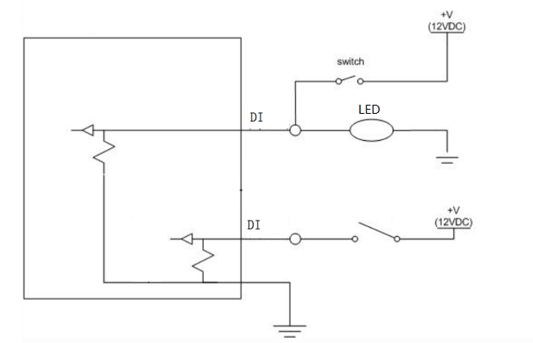

当DI具有上拉电源时，外部电路的连接如下:

### 数字输出 (DO)

DO可以输出直流电压。DO是支持300mA电流的开路漏电输出，通常与继电器配合使用。

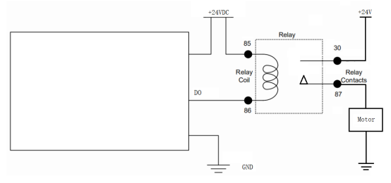

### 模拟输入 (AI)

AI可以检测直流电压，客户可以直接访问电压的模拟量。外部电路连接如下:

### 1-Wire

1-Wire类型设备通常用于小型通信设备，例如数字温度计和iButton设备。使用前，客户需要将1线设备的DQ引脚 (信号线) 连接到VT200 PIN13，并将1线设备的VDD和GND引脚连接到vt200的GND。传感器是DS18B20型。下图为32数字式温度传感器探头的水温检测线。

### 点火信号

IGT (点火感应): IGT用于连接车辆的点火开关。VT200可以检测连接的车辆是否点火。使用20针电缆进行测试时，将IGT电缆和V + 电缆连接到DC电源。

## 启动VT200

客户按照上述步骤完成安装后，即可启动设备进行调试。可以通过状态指示器告知设备的状况。为了避免在运输过程中消耗电池电量，该设备在出厂状态下处于运输模式。VT200需要通过外部电源或车辆诊断接口激活。

### 使用步骤

步骤:

1. 将P1的20PIN母头插入VT200；
2. 将PIN20 CONN-x-v-和PIN10 CONN-x-v + 分别连接到电源适配器的负极和正极。PIN9 CONN-X-IGT和V + 都连接到电源的正极侧；

1. 连接USB-Type C进行调试和配置vt200。下载配置工具，用USB-Type C连接计算机和VT200。第2章 登录和设备配置” 章节进行配置。

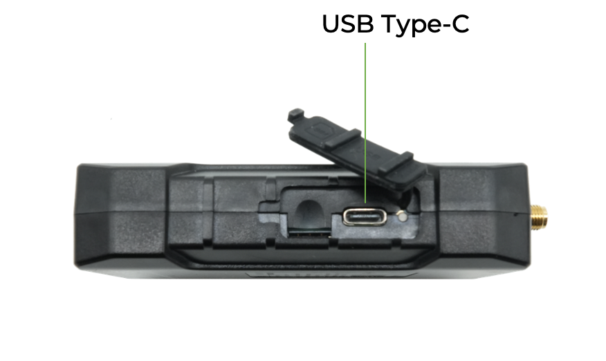

1. 如图所示，插入微型sim卡。确保Micro-SIM卡截止角指向插槽。

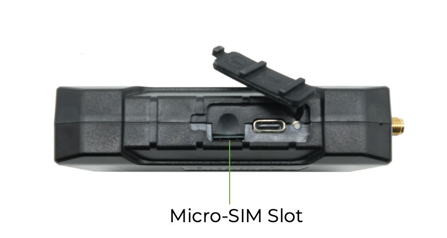

1. 对于外部天线型号，请将4g天线连接到设备的ANT天线接口。GNSS天线连接到设备的GNSS天线接口。
2. 配置后，将设备顶盖和底盖连接回去。

### GNSS状态灯（绿色）

| 指示器状态 | 功能状态 |
| :--- | :--- |
| 长期熄灭 | 设备未启动或GNSS模组工作不正常。 |
| 快速闪光 (频率: 0.5Hz) | 全球导航卫星系统对时服务成功 |
| 慢速闪光 (频率: 1Hz) | GNSS功能已启用 |
| 常亮 | 定位成功 |

### 3.3 Cellular 状态灯（橙黄色）

| 指示器状态 | 功能状态 |
| :--- | :--- |
| 长期熄灭 | 设备被禁用或拨号模组工作不正常。 |
| 快速闪光 (频率: 0.5Hz) | 成功拨号 |
| 慢速闪光 (频率: 1Hz) | 拨号已启用 |

## 第二章登录和设备配置

## 1 .配置工具安装

### 1.1 下载配置工具

进入官网下载中心[https://www.inhand.com.cn](https://www.inhand.com.cn/resources-center/#/Mobility/InVehicleTelematicsGateways/VT200) 在[支持中心>>资源中心>>车辆与运输>>VT车载追踪网关>>VT200](https://www.inhand.com.cn/resources-center/#/Mobility/InVehicleTelematicsGateways/VT200) 栏目下载VTCofig Tool Setup 2.1.2.exe 或更新版本配置工具。在产品文档处下载配置工具安装包。选择默认路径完成安装即可。如下图所示。

- 安装完成之后若出现如下错误，请使用“以管理员方式运行”打开软件，如下图所示。

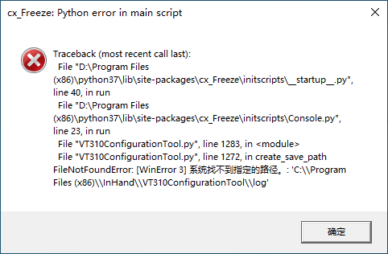

### 1.2 查找COM端口号

通过26PIN 多合一测试线缆外接适配器给VT310供电。电脑使用USB转串口线与设备链接。当观察到GNSS或者Cellular灯闪烁则表明设备启动成功。

进入电脑的设备管理页面，观察电脑“设备管理器”>>“端口（COM和LPT）”中的COM口号。如下图所示。

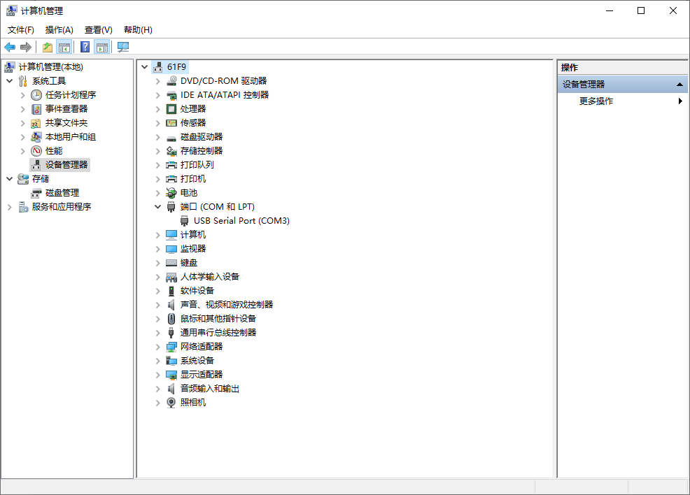

### 1.3 登录设备

打开VT310配置工具，⚠️ 出现错误提示，请使用“以管理员方式打开”。

打开后，可点击“English”切换英文。

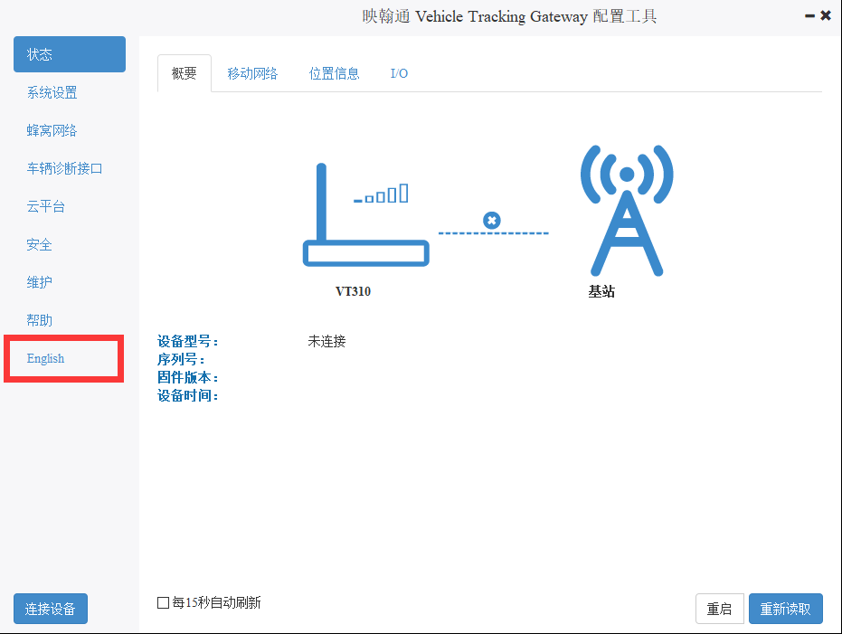

切换英文

点击“连接设备”，输入用户名和密码（默认admin/123456），选择记录的串口，波特率（默认115200）并点击“连接”。如下图所示。

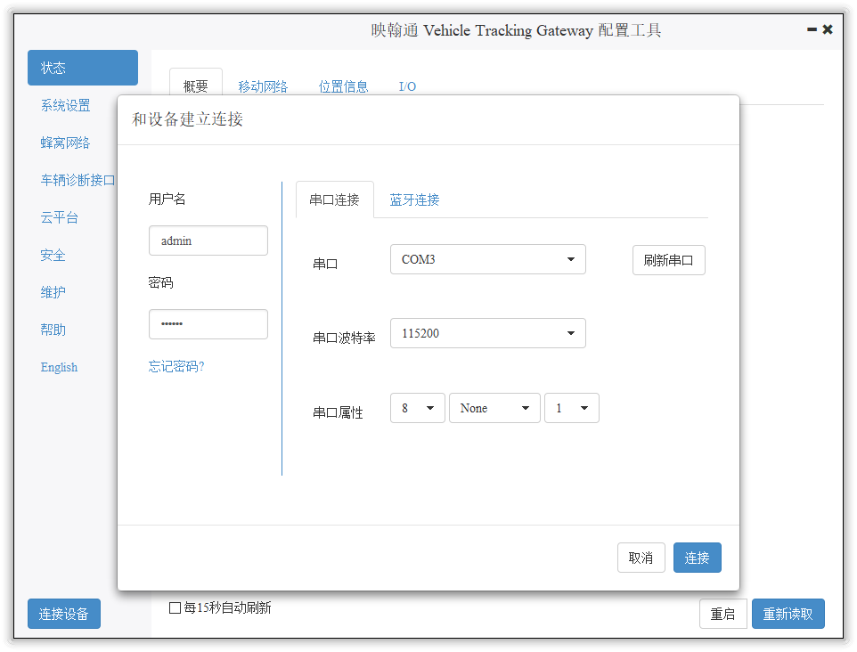

也可使用电脑蓝牙（4.2以上）连接设备。点击“连接设备”，输入用户名和密码（默认admin/123456），选择与设备SN名称相同的蓝牙设备（SN可在设备铭牌上找到），并点击“连接”。如下图所示。

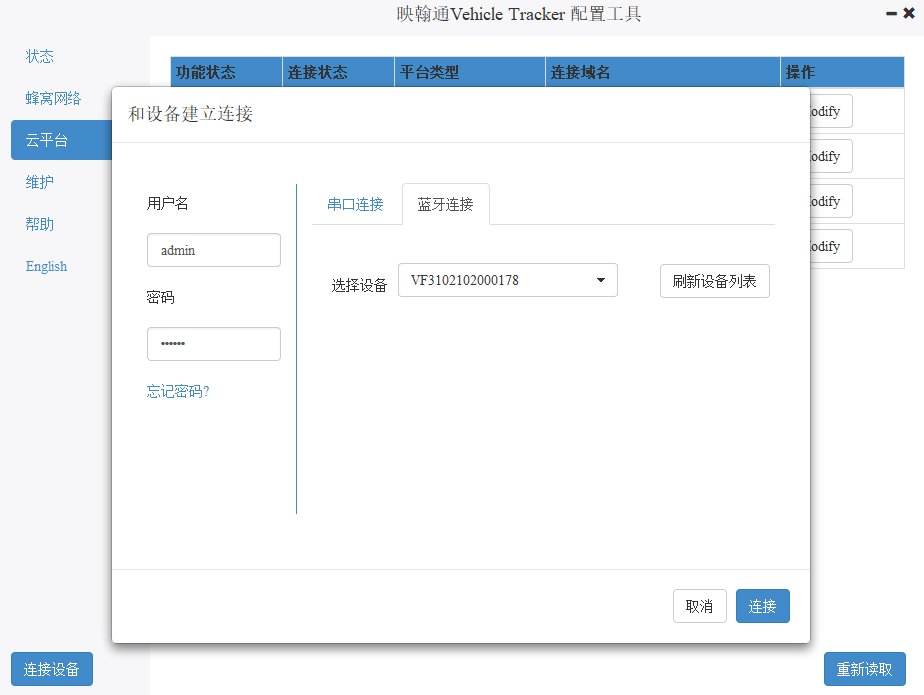

当弹出“现在可以查看设备状态，并对设备进行操作”后就可以预览或修改配置。如下图所示。

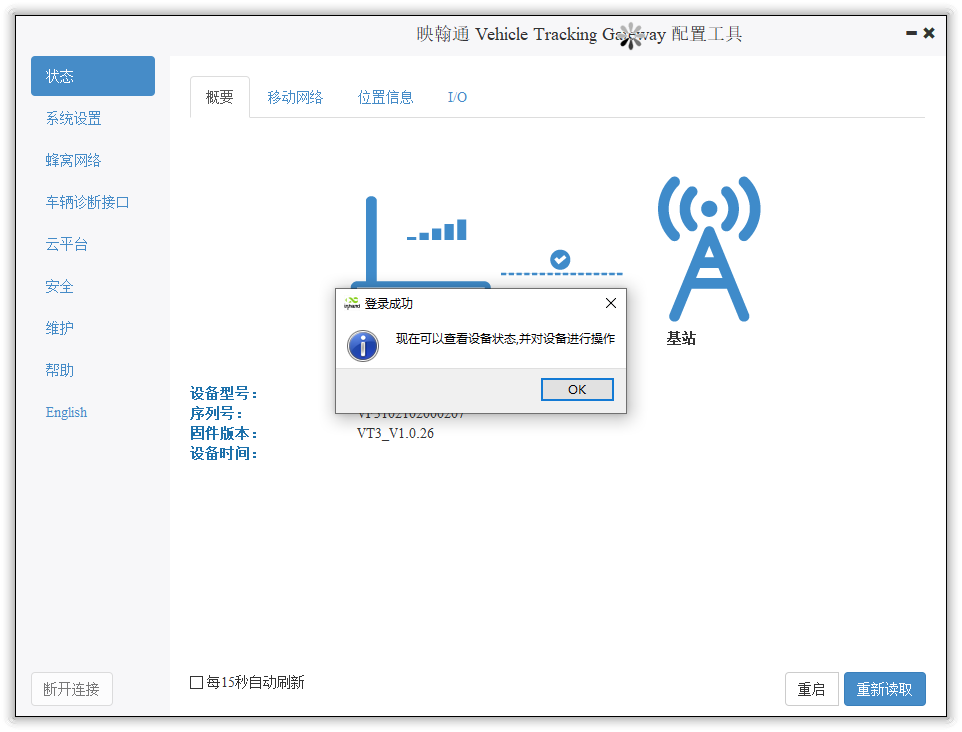

登录成功

## 2. 状态信息查询

### 2.1 概要页面

该页面信息为设备概要信息，主要功能是显示设备网络链接状态和设备基础信息。在网络链接正常时，VT310和基站中间链接为√，否则为×。 勾选 ☑️开启每15自动刷新所有显示信息。关于概要页面参数请核对设备铭牌。

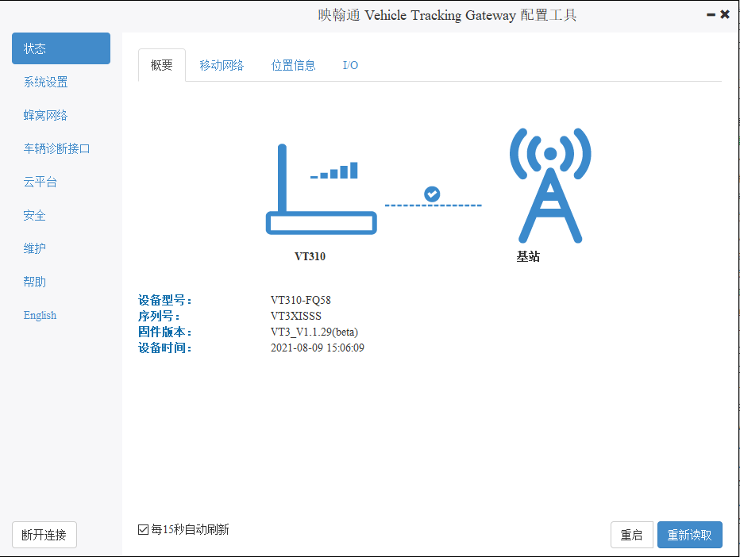

设备概要信息

### 2.2 移动网络参数

该页面信息为移动网络链接参数，主要功能是通过查看具体参数，查看无线网络链接是否正常。在没有插入SIM时读取到的参数都为默认参数。当设备通过SIM卡拨号联网成功后，可以获得IP地址，进行数据传输。关于移动网络参数的配置 [4 节配置蜂窝网络](https://bv5df8.yuque.com/bv5df8/manual/txmoi2#Ea387)。

| 参数名称 | 参数说明 |
| --- | --- |
| 信号值 | 代表链接无线网络的信号强度，取值范围0～31 |
| MCC/NMC | 移动网络代码 MCC （Mobile Country Code ）移动国家代码 MNC （Mobile Network Code ），该参数从SIM卡内读取 |
| SIM卡状态 | 正常/未识别 |
| IMEI | 国际移动设备识别码（International Mobile Equipment Identity）为车载网关内置拨号模组代码 |
| 注册状态 | 已注册/未注册 |
| LAC | 位置区码 LAC（Location area code ） ，拨号成功后从基站获得该参数 |
| IMSI | 国际移动用户识别码IMSI（International Mobile Subscriber Identity）该参数从SIM卡内读取 |
| CELL ID | 小区号，拨号成功后从基站获得该参数 |
| ICCID | 集成电路卡识别码即SIM卡卡号，ICCID（Integrate circuit card identity ），该参数从SIM卡内读取 |
| IP地址 | 拨号成功后，运营商分配网络接入的IP地址 |
| 蜂窝状态 | 已连接/未连接 |
| 认证方式 | CHAP/PAP |

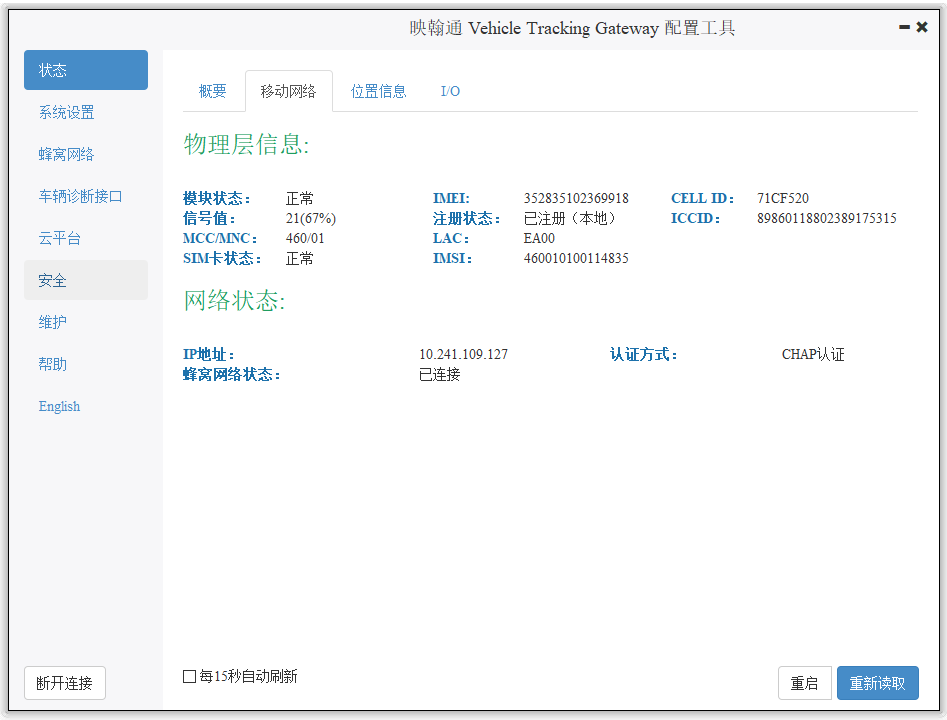

查看网络链接

### 2.3 位置信息

位置信息页面显示的是GNSS模组获得的最新参数。其中包括位置信息与惯性传感器的相关参数。如下图所示。

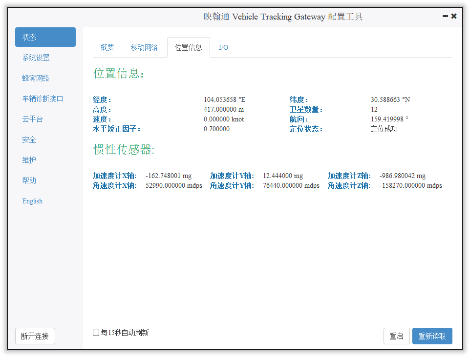

### 2.4 I/O信息

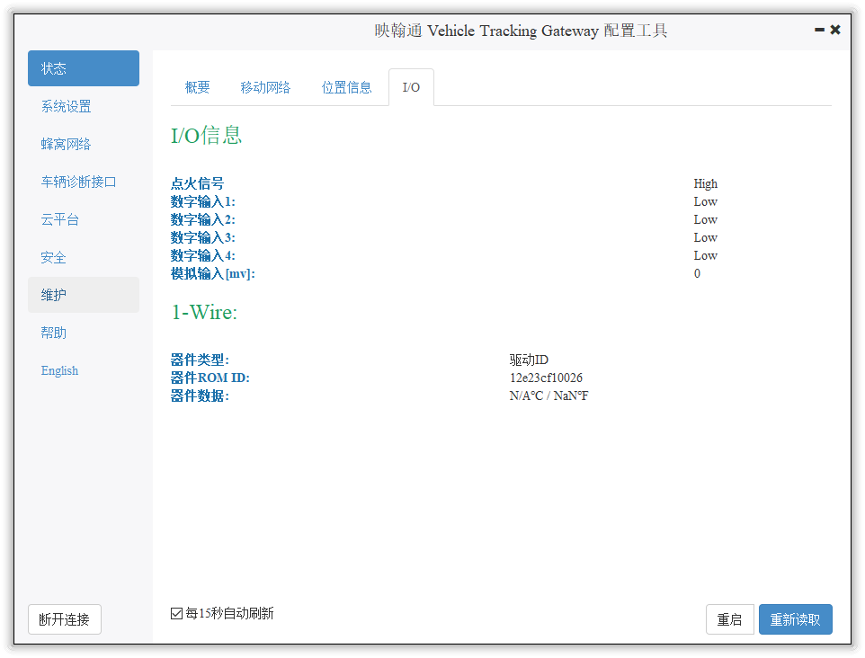

## 3.系统设置

### 3.1 休眠模式

休眠模式保证熄火后保持续航，为特殊环境提供持续保障。状态机如下：

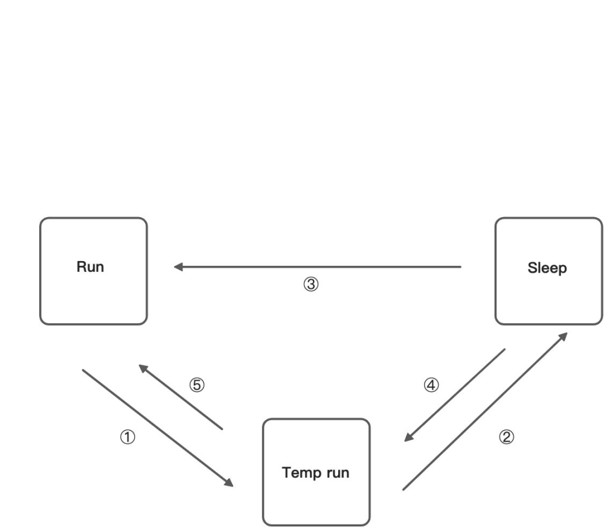

状态机说明：

Run、Sleep、Temp run分别代表正常运行状态、休眠状态和临时运行状态。

① 对应状态机，从Run进入Temp run条件为没有外接电源（电源电压小于休眠电压）或者IGT OFF（需在配置中使能IGT），第一次进入休眠时，设备会默认持续10s的延时休眠时间（用于上报信息）后进入Sleep；

②对应状态机，从Temp run进入Sleep条件为设备在Temp run运行一个唤醒运行时间周期后或者设备从Run运行15sTemp run后，会进入Sleep；

③对应状态机，从Sleep进入Run条件为外接电源（电源电压大于休眠电压）和IGT ON（需在配置中使能IGT）；

④对应状态机，从Sleep进入Temp run条件为设备在Sleep运行一个唤醒间隔周期后，会进入Temp run；

⑤对应状态机，从Temp run进入Run条件为外接电源（电源电压大于休眠电压）和IGT ON（需在配置中使能IGT）；

配置休眠模式：

| 参数 | 参数说明 |
| :--- | :--- |
| 使能IGT | 使能IGT后，设备会将IGT状态作为进入、退出休眠条件，默认不勾选 |
| 唤醒间隔 | 进入休眠后，设备自动唤醒的时间间隔，默认120分钟 |
| 唤醒运行时间 | 休眠唤醒后，设备进入下一次休眠的时间间隔，默认5分钟 |
| 延时休眠时间 | 进入休眠后，用于上报数据的等待时间 |

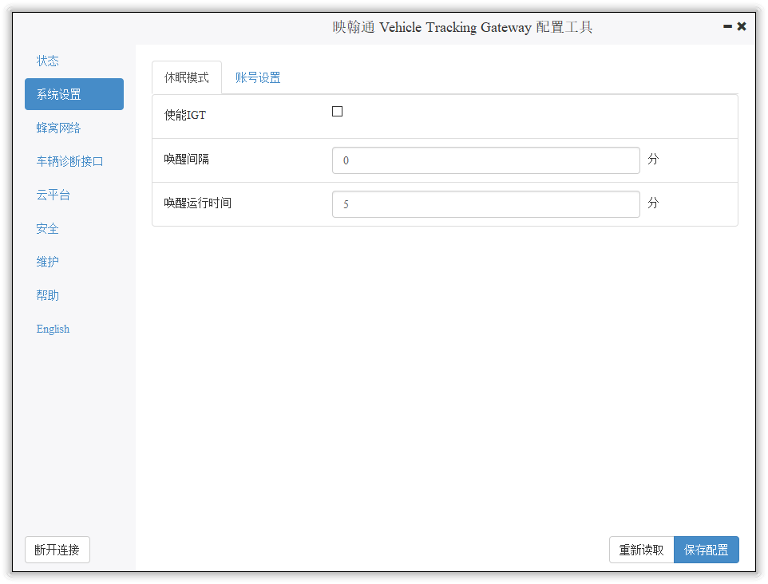

### 3.2 账号设置

该功能是提供设备管理者修改设备管理员登录信息的配置选项。默认管理员账户admin，管理员密码 123456。设备管理员可根据实际情况进行修改。修改后设备提示重启，点击确认重启之后，使用修改之后的管理员账号与管理员密码登录。如下图所示。

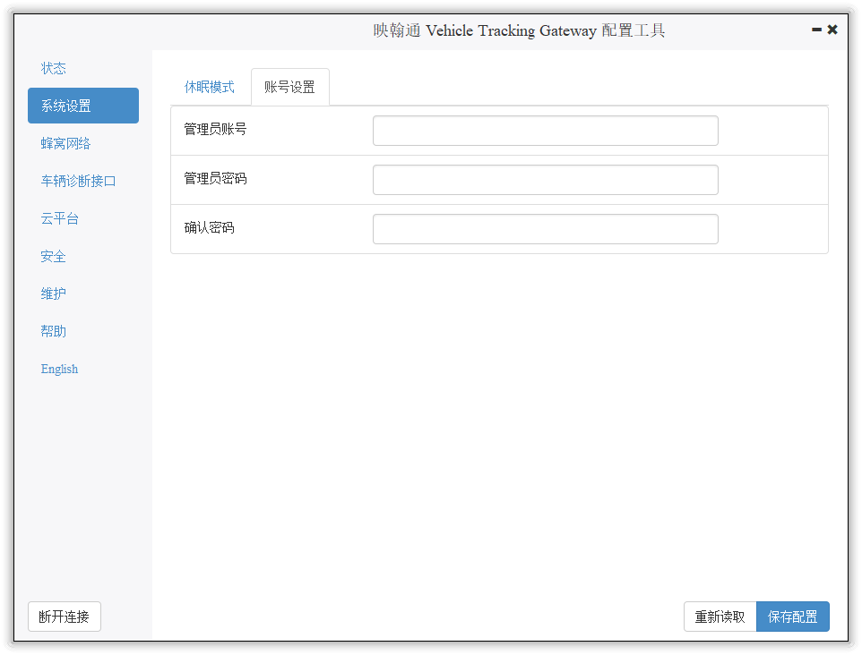

## 4. 配置蜂窝网络

点击“蜂窝网络”进入配置页面，通常情况下客户仅需要配置“网络接入点名称（APN）”、“网络拨号用户名”、“网络拨号密码”以及“认证模式”并点击“保存配置”，设备重启后生效。

如果客户试用场景特殊，可以点击“显示高级选型”展开隐藏配置项。根据需求配置“网络拨号号码”、“PIN”以及“默认承载APN”。如下图所示：

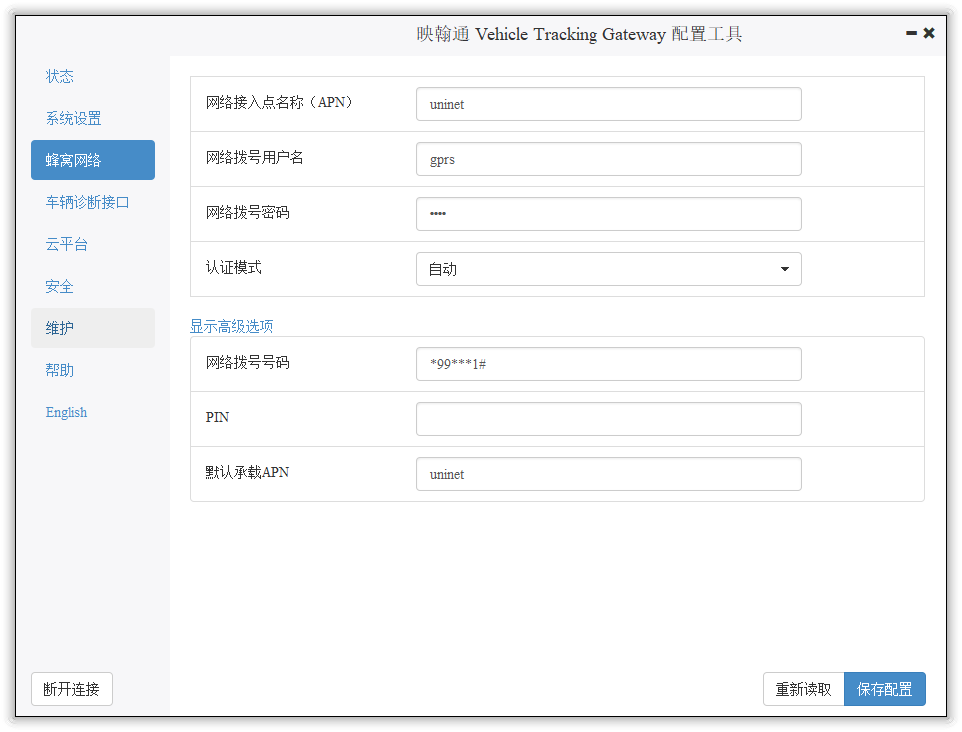

| 参数 | 参数说明 |
| :--- | :--- |
| 网络接入点名称（APN） | APN专网接入移动网络时需要运营商提供此参数。大部分公网业务的SIM卡拨号时不对APN进行认证。 |
| 网络拨号用户名 | 默认参数“gprs”，专网AAA认证时，移动网络运营商需要提供此参数。 |
| 网络拨号密码 | 默认参数“gprs”，专网AAA认证时，移动网络运营商需要提供此参数。 |
| 认证模式 | 自动/CHAP/PAP，专网AAA认证时，运营商需要提供此参数。自动：轮流使用 PAP 和 CHAP 认证方式来拨号(上电第 一次使用 pap 认证，如果拨号失败，再次拨号时就使用 chap 认证，再下一次拨号又使用 pap 认证，以此类推)。如果认证模式不选择“自动”，而是选择 PAP 或 CHAP， 那就仅仅使用 PAP 或 CHAP 认证方式来拨号。 |
| 网络拨号号码 | 默认参数“*99***1#”，移动网络运营商需要提供此参数。 |
| PIN | PIN （Personal Identification Number）是指SIM卡的个人识别密码，当SIM开启PIN验证时，填入SIM卡对应PIN吗。移动网络运营商需要提供此参数。 |
| 默认承载APN | 运营商提供此参数。 |

**⚠️** 默认承载设置是针对某些运营商的网络数据传输特殊情况设置的功能，一般情况不用配置。如需配置，请询问运营商默认承载的相关参数。

## 5. 车载诊断接口配置

车载诊断接口为车载追踪器的南向接口与协议的配置选项。

### 5.1 ODB接口配置

配置工具中诊断协议选择OBD，ODB协议为车载追踪器的CAN2接口和J1708接口。

| 参数 | 参数说明 | 其他 |
| :--- | :--- | --- |
| J1939/J1979 | CAN2 接口协议，对应物理层PIN CAN_2L(PIN 12)和CAN_2H(PIN25) | OBD 默认配置 |
| J1939 | CAN2 接口协议，对应物理层PIN CAN_2L(PIN 12)和CAN_2H(PIN25) |  |
| J1939 | CAN2 接口协议，对应物理层PIN CAN_2L(PIN 12)和CAN_2H(PIN25) |  |
| J1708 | J1708 接口协议，对应物理层PIN J1708_B（PIN13）和J1708_A (PIN 26) | |
| Auto | 当设置为Auto模式是，车载追踪器会进行轮询链接，自动轮询发送以上4个选项的协议数据，进行链接测试。当收到对应协议的数据包时，车载追踪器会选择该协议进行通讯。 | 使用Auto模式时，CAN1接口和J1708接口同时被打开。 |
| Disable | 关闭CAN2接口和J1708接口 |  |

### 5.2 CAN1接口配置

配置工具中诊断协议选择CAN1，车载追踪器的CAN1接口。

| 参数 | 说明 | |
| :--- | :--- | --- |
| J1939/J1979 | CAN1 接口协议，对应物理层PIN CAN_1L(PIN 11)和CAN_1H(PIN24) | CAN1 默认配置 |
| J1939 | CAN1 接口协议，对应物理层PIN CAN_1L(PIN 11)和CAN_1H(PIN24) |  |
| J1939 | CAN1 接口协议，对应物理层PIN CAN_1L(PIN 11)和CAN_1H(PIN24) |  |
| Disable | 关闭CAN1接口 |  |

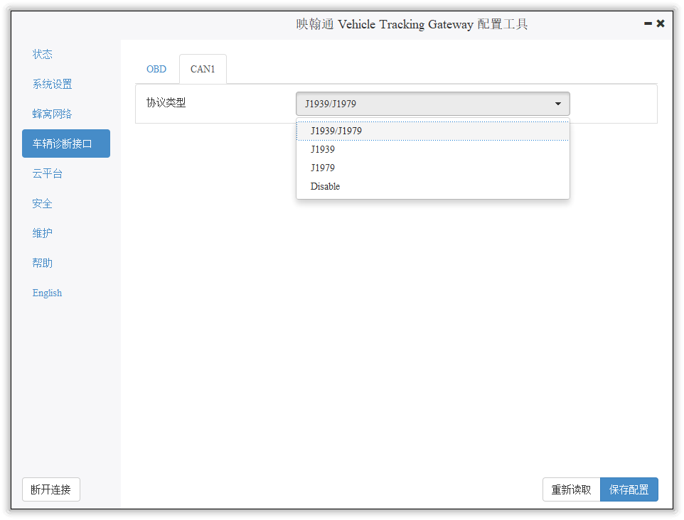

CAN1的功能可以与OBD功能同时打开。

## 6. 链接云平台配置

云平台的配置为为车载追踪器的北向向接口与协议的配置选项。VT310最大支持连接一个云平台。平台的配置需要重启设备后才能生效。点击“云平台”进入配置页面。点击“Modify”进入配置页面。如下图所示。

### 6.1 Smartfleet 云平台

SmartFleet平台是北京映翰通推出的针对车联网市场的SAAS平台。主要包括车辆档案信息，车量报警信息、驾驶行为监控、行车信息统计分析、电子围栏等功能。通过可视化的用户界面和简易的使用流程，管理和监视映翰通车载网关等硬件设备，实现设备快速集成、海量设备一键管理；云端部署满足用完即走的轻松体验，让您专注自己的核心业务，为您的企业发展赋能。平台登录地址 [https://che.inhandiot.com](https://che.inhandiot.com) ，了解平台更多功能，可以访问映翰通官网[https://www.inhand.com.cn](https://www.inhand.com.cn/)咨询在线客服。

云平台 >> 平台类型：StmatFleet， 勾选 ☑️开启，选择平台域名：che.inhand.com (中国用户地址)，填写平台的注册账户，填写车牌号码。

点击“显示高级选项”显示隐藏配置项。根据需求配置 “LBS上报间隔”，“流量上报间隔”以及“心跳上报间隔”，上报时间间隔单位：秒，如下图所示。点击“保存配置”并“重启”设备。如下图所示。

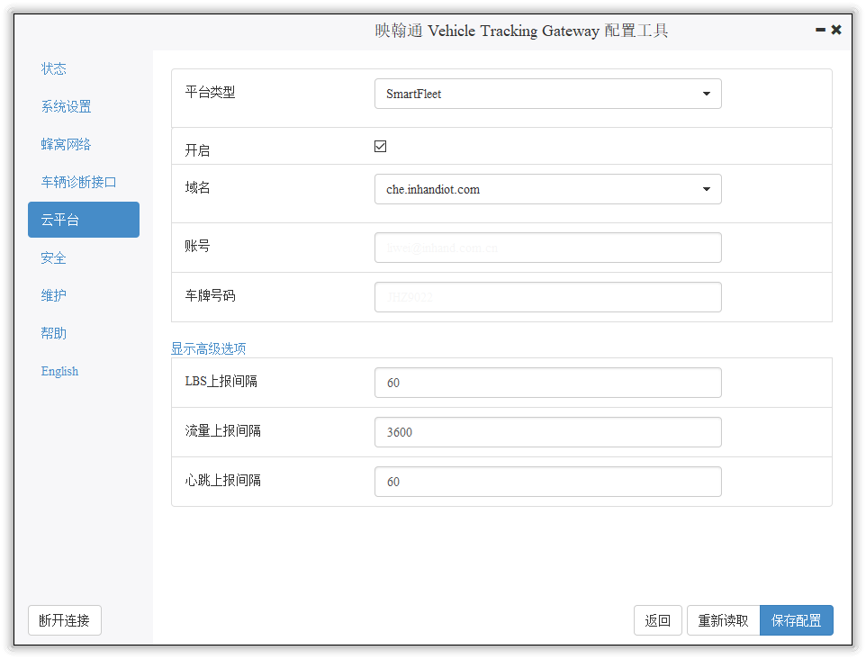

设备链接平台如下图显示，链接状态为“已链接”。如下图所示。

登录平台, 网关>>网关列表，可以查看车载查看车载追踪器是否上线。如下图所示。

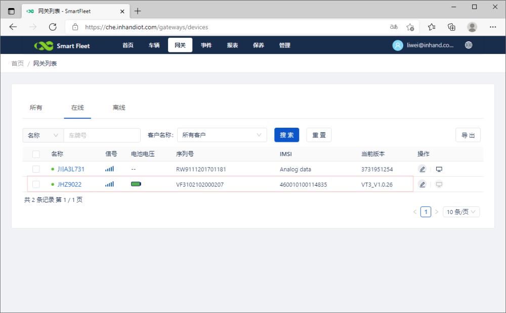

### 6.2 Wialon 平台

Wialon拥有超过18年的GPS车辆跟踪领域软件开发和应用经验，以及一支致力于共同目标的优秀专家团队。通过不断推进专利产品的开发和在世界各地的五个办事处—明斯克的总部和开发中心以及莫斯科、波士顿、迪拜和布宜诺斯艾利斯的销售办事处，社区团结在一起。如今，Wialon的解决方案占据了独联体国家商业运营商市场的36%左右，并积极拓展到欧洲、中东、美国、南美、非洲和澳大利亚，甚至还有新西兰市场。了解更多平台内容请访问[https://gurtam.com/en/wialon](https://gurtam.com/en/wialon)。您希望测试Wialon平台可以与映翰通孙经理 <sunzd@inhand.com.cn>联系获得更多支持。

云平台>>平台类型：Wialon

勾选 ☑️开启，域名下拉菜单中选择：nl.gpsgsm.org ，端口号：21000 。点击“保存配置”并“重启”如下图所示。

如果客户需要调整上报频率，可以点击“显示高级选项”显示隐藏配置项。配置“上报间隔”上报间隔单位：秒。如下图所示。

若用户已经获得了Wialon提供的独立域名请填入自定义域名及端口号。如下图所示。

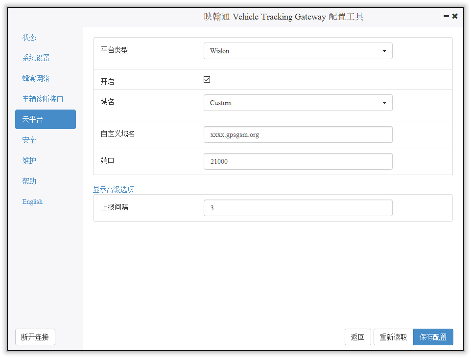

### 6.2.1 登录Wialon平台

平台登录网址： [https://hosting.wialon.com](https://hosting.wialon.com)

新增设备：

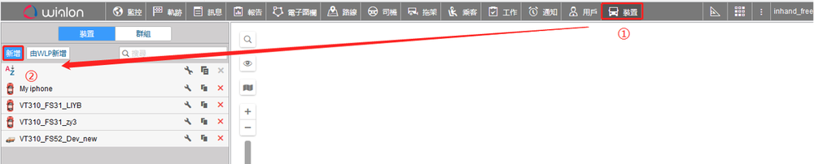

设备添加信息如下：

- 名称：自定义
- 装置类型：选择“Wialon Combine”
- 特制ID：此处应填写设备特有的序列号。设备序列号的查看设备标签或配置工具的状态页面的“序列号”，下图中的信息仅为例子。

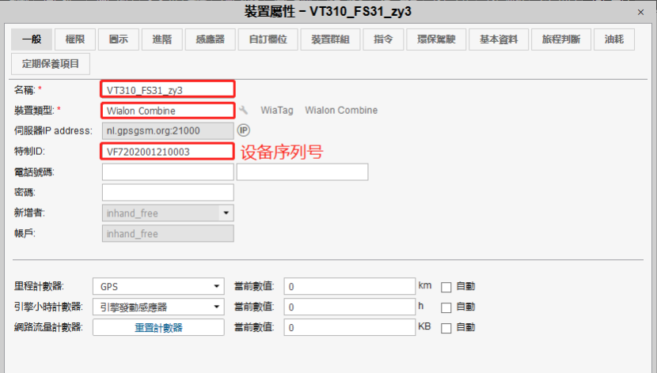

### 6.2.3 查看设备上传数据

①选择“Message”

②选择待查看目标装置的名称

③选择感兴趣时间区间

④选择数据类型，目前IO数据的采集通过“Raw data”显示

⑤点击“Execute”按钮即可在⑥的位置查看到目标装置的信息，如下图所示。

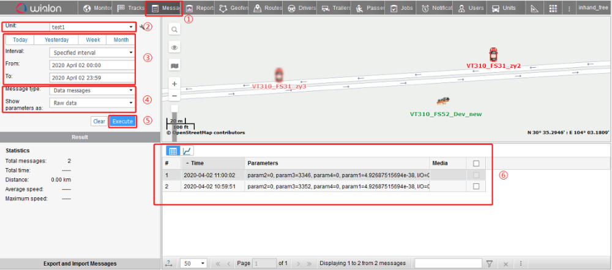

备注：目标装置的信息展示可通过点击图下图的配置方式，自主选择，如下图所示。

### 6.3 Azure IoT Hub

Azure IoT 构建支持双向通信的 IoT 应用程序在物联网 (IoT) 应用程序及其管理的设备之间实现高度安全、可靠的通信。Azure IoT 中心提供云托管解决方案后端，几乎可连接任何设备。通过每台设备的身份验证、内置设备管理和扩展配置，将解决方案从云端扩展到边缘。更多信息请访问：[https://azure.microsoft.com/zh-cn/services/iot-hub](https://azure.microsoft.com/zh-cn/services/iot-hub)

云平台>>平台类型：Azure IoT

配置置“连接字符串”，该信息从Azure IoT的控制台获得，请查看[下一小节](https://bv5df8.yuque.com/bv5df8/manual/txmoi2#srqQm)。配置之后点击“保存配置”并“重启”，如图下所示。

如果客户需要显示无效数据，可以点击“显示高级选项”显示隐藏配置项。勾选“显示无效数据”，如下图所示。

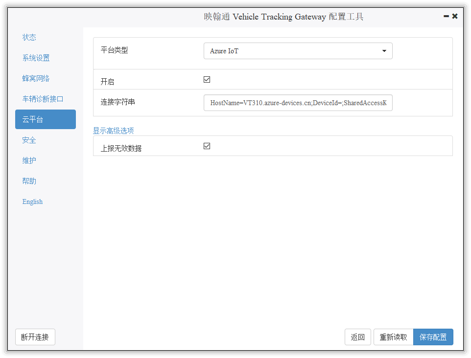

### 6.3.1 Azure IoT 平台配置

1. 在配置链接字符串之前，需要登录Azure IoT平台进行设备创建。在 IoT 中心导航菜单中，打开“IoT 设备”，然后选择“新建”（+New），在 IoT 中心添加设备 。如下图所示。

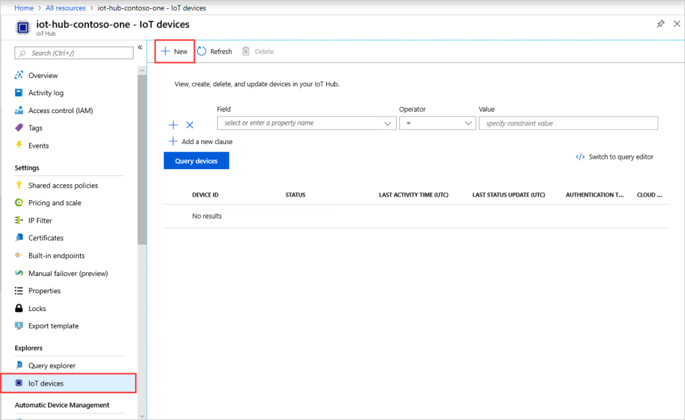

1. 在“创建设备”中，提供新设备的名称（例如 myDeviceId），然后选择“保存”。 此操作会为 IoT 中心创建设备标识。如下图所示。

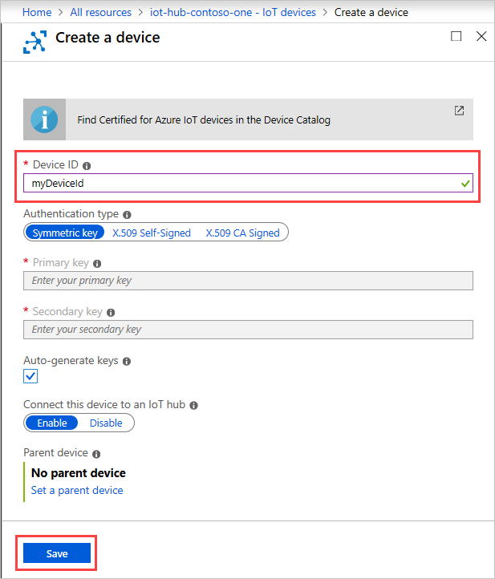

1. 创建设备后，在“IoT 设备”窗格的列表中打开该设备。 复制“主连接字符串”（ Primary Connection String）以供稍后粘贴至配置工具“链接字符串中”。如下图所示。

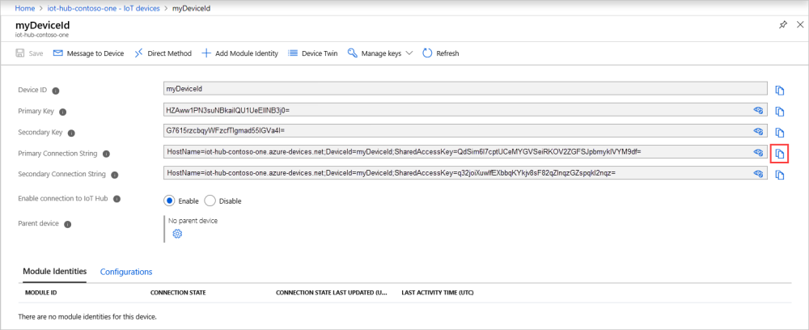

### 6.4 AWS IoT 平台

使用 AWS IoT Core，您可以将 IoT 设备连接到 AWS 云，而无需配置或管理服务器。AWS IoT Core 可以支持数十亿台设备和数万亿条消息，并且可以对这些消息进行处理并将其安全可靠地路由至 AWS 终端节点和其他设备。借助 AWS IoT Core，您的应用程序可以随时跟踪所有设备并与其通信，即使这些设备未处于连接状态也不例外。借助 Amazon 服务的各个服务来构建 IoT 应用程序，以便收集、处理和分析互联设备生成的数据并据之采取行动，而无需管理任何基础设施。更多信息可以可以访问 [https://aws.amazon.com/cn/iot-core](https://aws.amazon.com/cn/iot-core/)。

### 6.4.1 AWS登录配置

#### 配置方式一：AWS创建物品方式链接

1. 进入Amazon IoT控制台>>Things页面，点击“Create”创建物品。如下图所示。

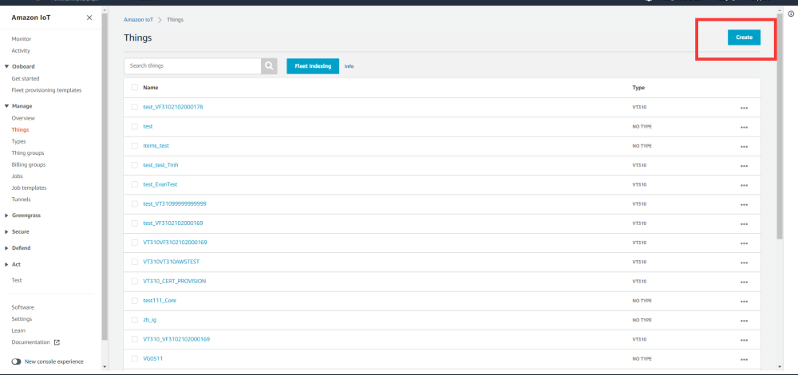

Amazon IoT >> Things >> Create a single things 如下图所示。

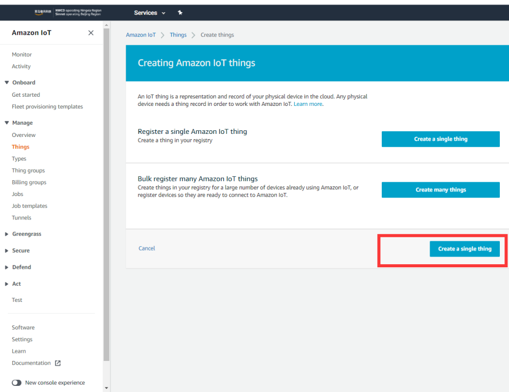

Amazon IoT >> Things >> Create a single things >> Add your device to the thing registry >> Add certificate 在该页面为刚才创建的物品创建一个证书。如下图所示。

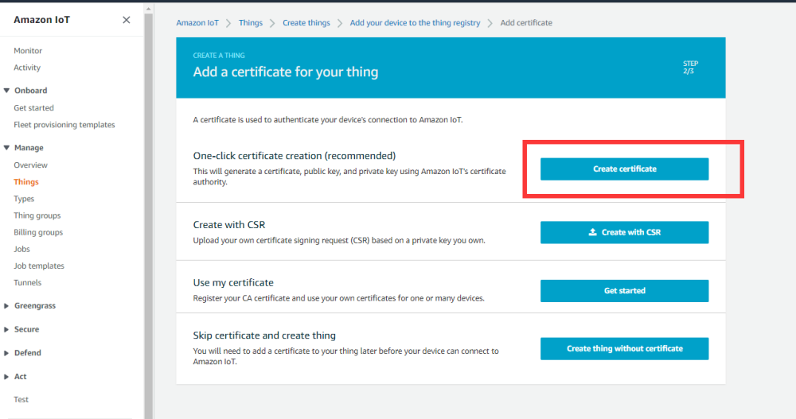

1. 下载证书文件

- 下载数字证书文件 >> A certificate for the things >> Download 下载文件格式为：***.cert.pem ；
- 下载私钥文件 >> A private key >> Download 下载文件格式为：***.private.key；
- 车载追踪器内已经内置了AWS 的CA文件，所以不需要下载CA文件，若需要更新请在图内点击“A root CA for Amazon IoT Download”；
- 点击 “Activate ”对证书进行激活；
- 点击 “Attache a policy”，进入附加策略页面。如下图所示。

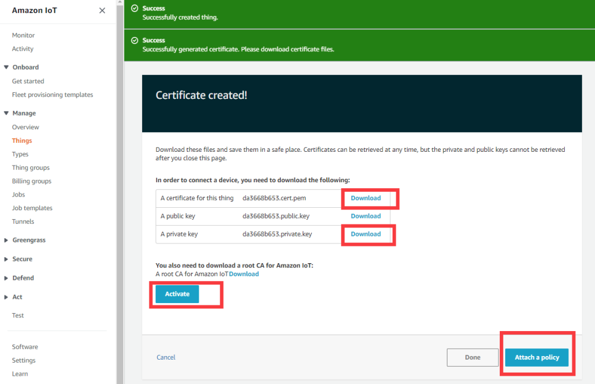

- 在附加页面内勾选该证书的附加策略，同时点击“Register Thing”注册该物品，如下图所示。
- 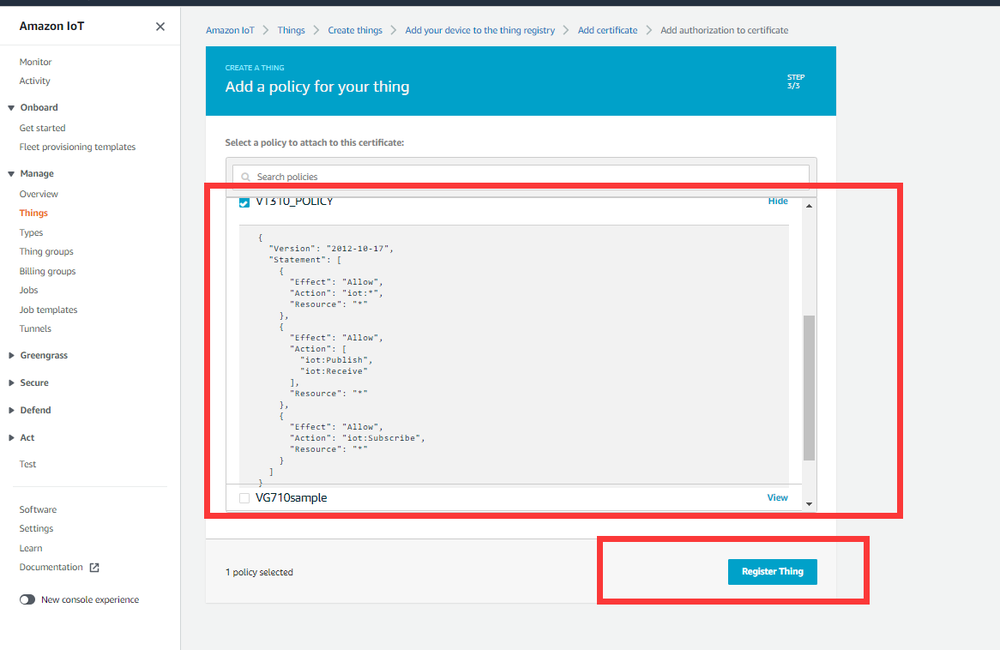

1. 配置工具导入证书文件至车载追踪器

- 安全 >> 导入数字证书 >> 选择证书 (在弹出对话框中选择下载的数字证书 ***.cert.pem）；选择之后然后点击“导入证书”
- 安全 >> 导入私钥证书 >> 选择文件 (在弹出对话框中选择下载的数字证书 ***.private.key ）；选择之后然后点击“导入文件” ；
- 车载追踪器内已经内置了AWS 的CA文件，所以不需要下载CA文件，若需要更新。安全 >> 导入CA证书 >> 选择文件 (在弹出对话框中选择下载的数字证书 ***.private.key ）；选择之后然后点击“导入证书” ；如下图所示。

1. 启用链接AWS 平台

云平台 >> 平台类型：AWS IoT， 勾选 ☑️开启，填写域名。如下图所示。

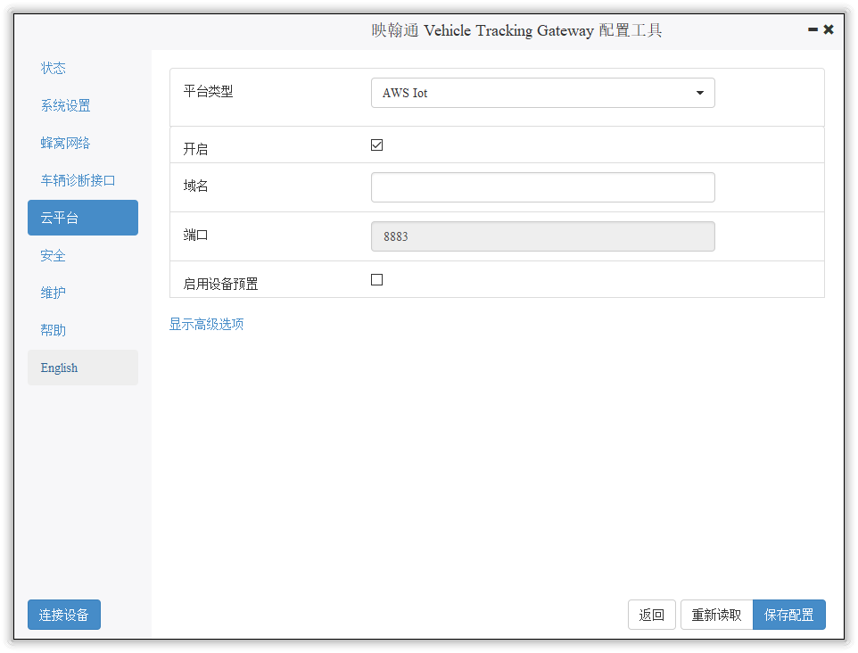

填入的域名在AWS IoT >> Things >> 选择被创建的物品 >> Interact 选项内复制该地址。填入AWS IoT 页面的域名中。 如下图所示。

保存配置后重启设备，在Cloud Plateform 云平台页面观察连接状态：

默认不上报不存在的数据，如需上报，请勾选显示高级选项中的上报无效数据，勾选后，上报不存在的数据值为NULL 如下图所示。

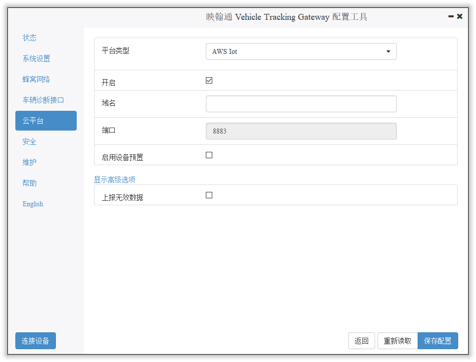

#### 配置方式二：AWS创建预置模板连接

1. 创建预置模版 Amazon IoT >> Fleet provisioning templates >> Create 如下图所示。

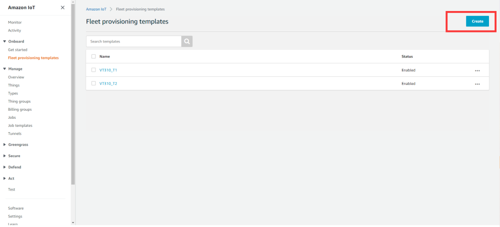创建证书 Amazon IoT >> Certificates 如下图所示。

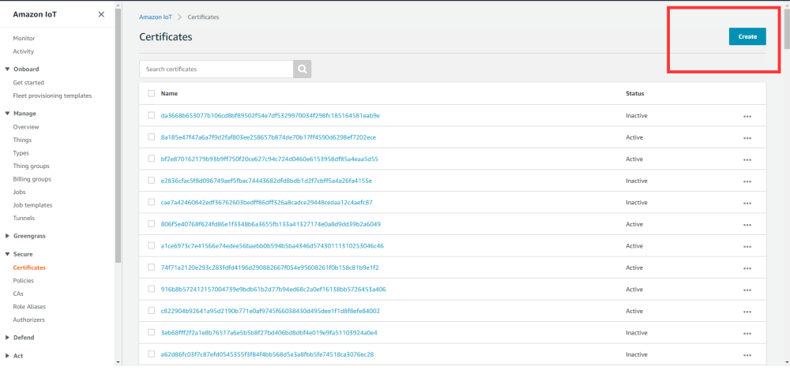

Amazon IoT >> Things >> Create a single things >> Add your device to the thing registry >> Add certificate 在该页面为刚才创建的物品创建一个证书。如下图所示。

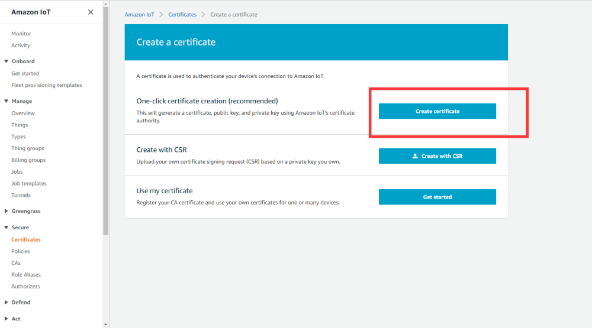

1. 下载证书文件

- 下载数字证书文件 >> A certificate for the things >> Download 下载文件格式为：***.cert.pem ；
- 下载私钥文件 >> A private key >> Download 下载文件格式为：***.private.key；
- 车载追踪器内已经内置了AWS 的CA文件，所以不需要下载CA文件，若需要更新请在图内点击“A root CA for Amazon IoT Download”；
- 点击 “Activate ”对证书进行激活；
- 点击 “Attache a policy”，进入附加策略页面。如下图所示。

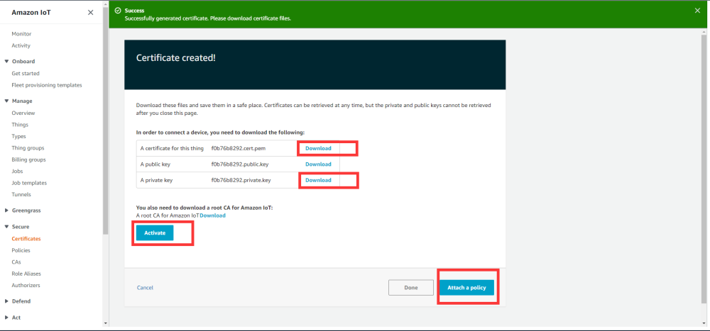

- 上一个页面点击Activate 进入证书列表里点击Down 完成认证

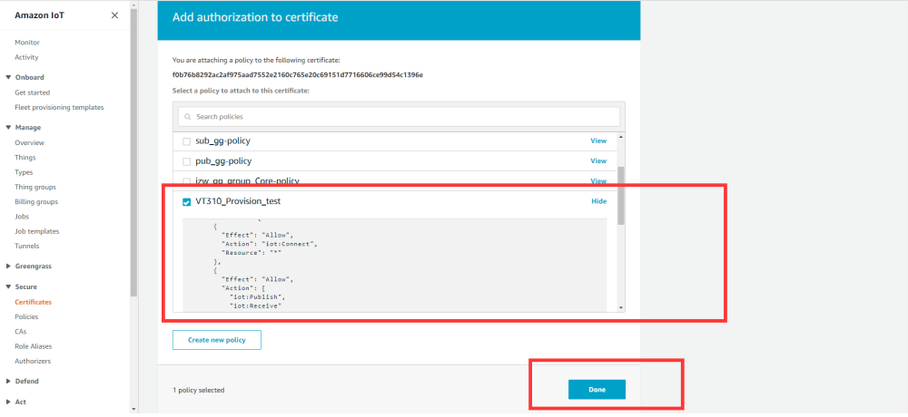

- 上一个页面点击Attache a policy 进入Amazon IoT >> Policy 列表里完成添加策略，如下图所示。

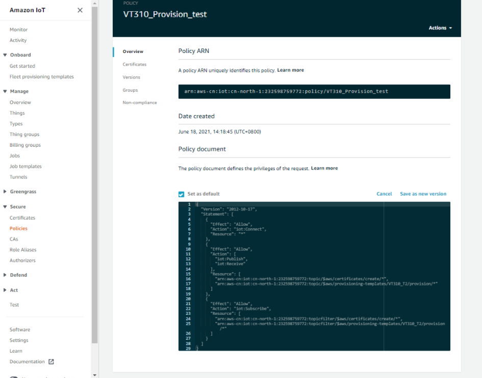

1. 配置工具导入证书文件至车载追踪器

- 安全 >> 导入数字证书 >> 选择证书 (在弹出对话框中选择下载的数字证书 ***.cert.pem）；选择之后然后点击“导入证书”
- 安全 >> 导入私钥证书 >> 选择文件 (在弹出对话框中选择下载的数字证书 ***.private.key ）；选择之后然后点击“导入文件” ；
- 车载追踪器内已经内置了AWS 的CA文件，所以不需要CA文件，若需要更新CA 文件。进入 安全 >> 导入CA证书 >> 选择文件 (在弹出对话框中选择下载的数字证书 ***.cert ）；选择之后然后点击“导入证书” ；

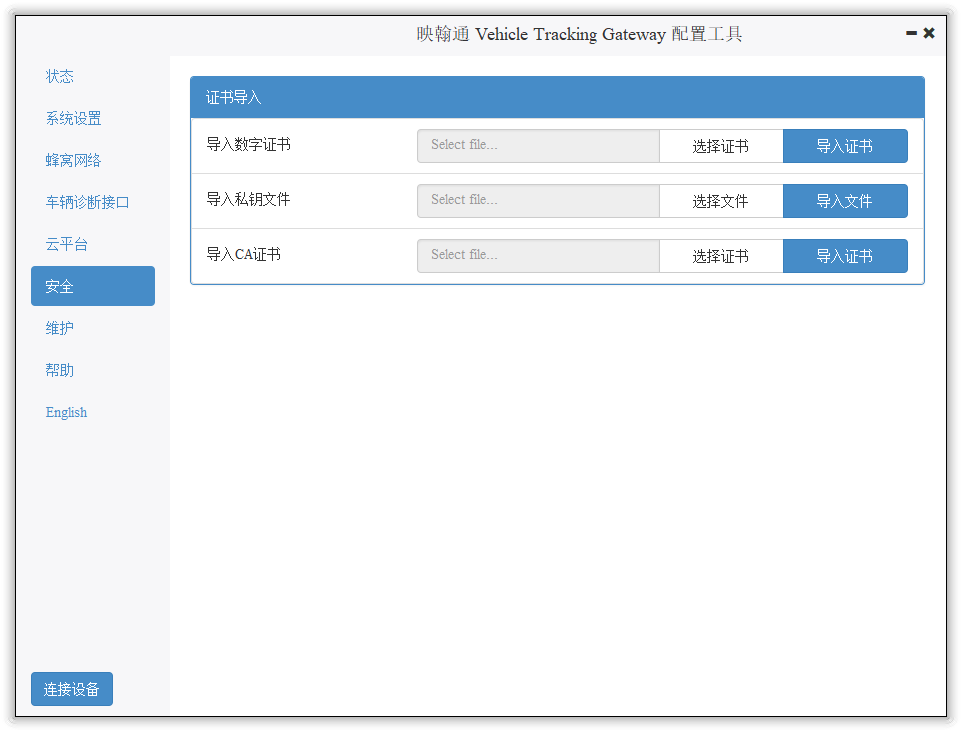

1. 启用链接AWS 平台

云平台 >> 平台类型：AWS IoT， 勾选 ☑️开启，填写域名。

⚠️ 当在AWS平台创建的是预置模版，则配置工具中应启用设备预置， 勾选 ☑️开启，填入预置模板名称。填入的预置模板名称在AWS IoT >>[Fleet provisioning templates](https://bv5df8.yuque.com/bv5df8/manual/txmoi2#krcDJ)。

在AWS IoT >> Things >> 选择被创建的物品 >> Interact 选项内复制该地址。填入AWS IoT 页面的域名中。

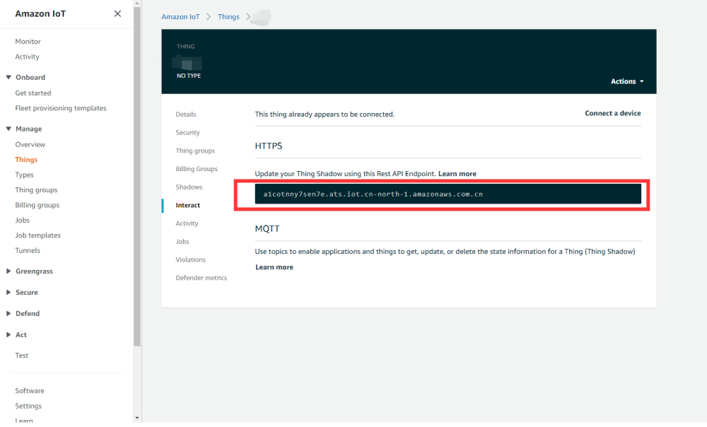

保存配置后重启设备，在Cloud Platform 云平台页面观察连接状态：

### 6.4.2 AWS订阅和发布

#### 1. 使用测试订阅VT310上报消息和发布消息

Amazon IoT >> Test 进行配置

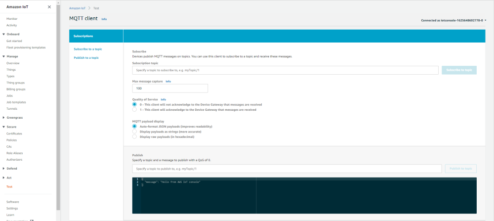

Amazon IoT >> Test >> Subscription topic 文本框内填入发布的topic 如下图所示。

例：v1/VT310 SN/motion/info

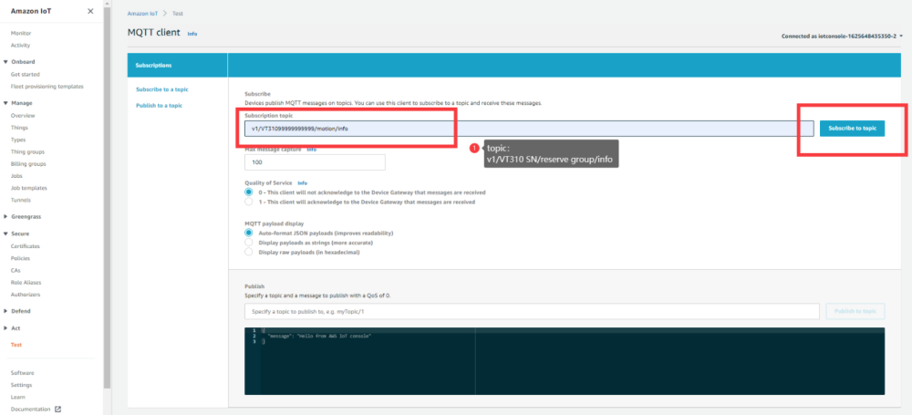

 VT310默认会上报GNSS、Sysinfo、Motion、Cellular1、IO、OBD这几个保留组的消息，只需订阅topic即可接收。如下图所示。

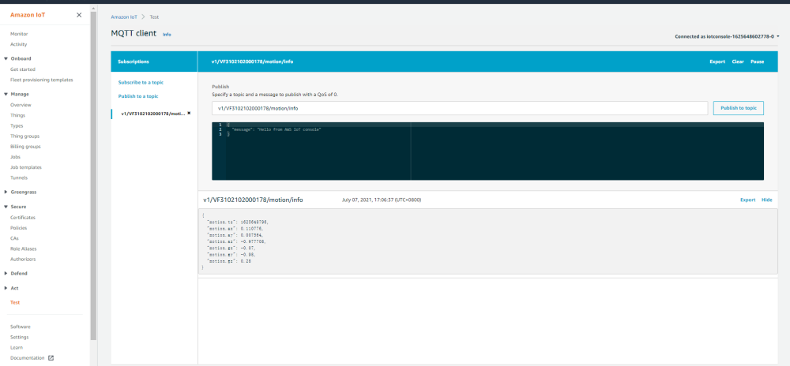

更需多参数请参考API文档《FlexAPI_over_MQTT_Reference_for_3rd_party_platform_VT310.pdf》

### 6.5 Aliyun IoT 平台

阿里云企业物联网平台提供全托管的实例服务，无需自建物联网的基础设施即可便捷地接入和管理设备，具有低成本、高可靠、高性能、易运维的优势，强大的数据处理能力可以更好地对设备数据进行分析和可视化展示，实时的安全威胁检测可以保证每个实例都是安全可靠的，是每个企业设备上云的可靠之选。了解更多请访问阿里云产品页面 [https://www.aliyun.com/product/iot](https://www.aliyun.com/product/iot)。

#### 配置方式一：一机一密方式链接

详细使用方式可以参考：[https://help.aliyun.com/document_detail/74006.html](https://help.aliyun.com/document_detail/74006.html)

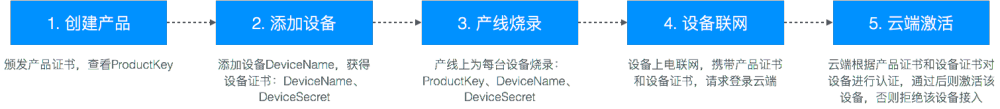

1. 进入阿里云控制台 IoT Platfrom >> Device >> Devices >> Device Details 创建设备，查看设备DeviceSeret如下图所示。

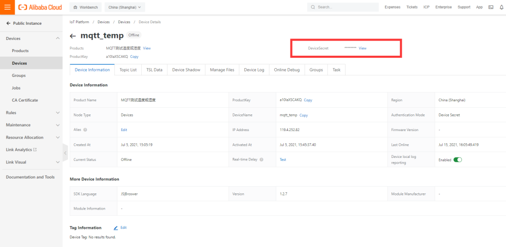

复制设备的 Device Certificate 包括，ProductKey 、DeviceName、DeviceSecret 三个参数。如下图所示。

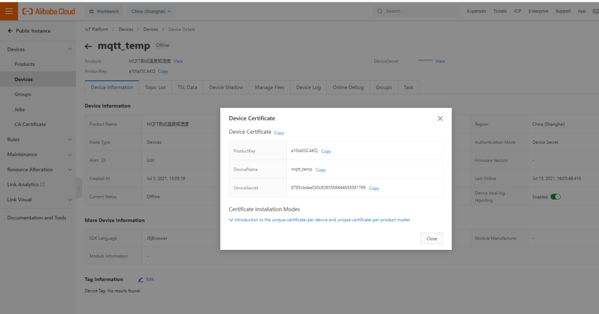

1. 打开配置工具进入 云平台 >> 平台类型 >> Aliyun IoT ， 勾选 ☑️开启，安全认证模式：选一机一密

从阿里云获得的3个参数 ProductKey 、DeviceName、DeviceSecret，分别对应填入配置工具内的对应参数。请在物联网平台控制台左上角，查看您服务所在的地域。Region ID的取值，请参见[地域和可用区](https://help.aliyun.com/document_detail/40654.htm#concept-2459516)。

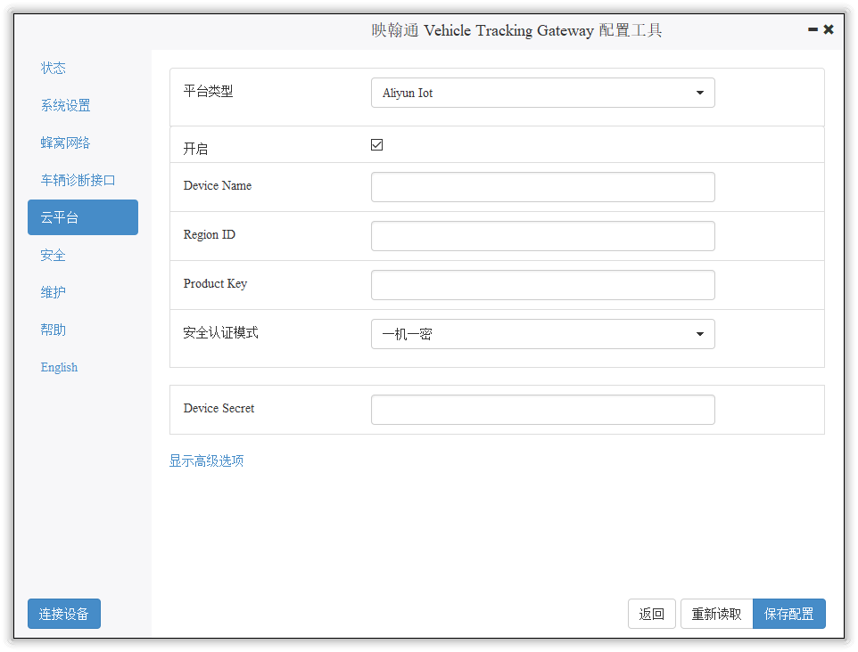

#### 配置方式二：一型一密方式链接

详细使用方式可以参考：[https://help.aliyun.com/document_detail/74006.html](https://help.aliyun.com/document_detail/74006.html)

1. 进入阿里云控制台 IoT Platfrom >> Devices >> Product Details 创建设备，查看设备ProductSeret

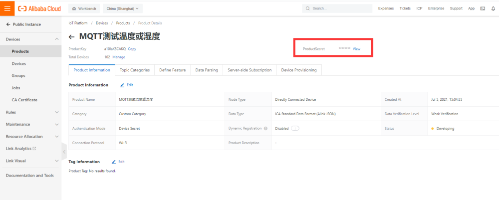

复制 Product Certificate 包括 ProductSerect 和Productkey。如下图所示。

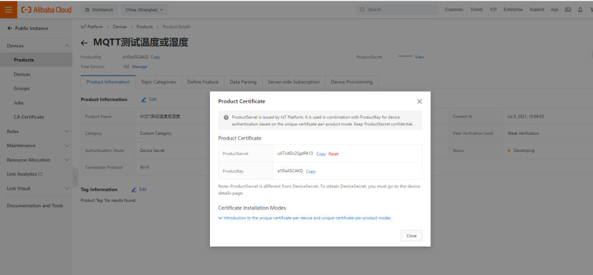

1. 打开配置工具进入 云平台 >> 平台类型 >> Aliyun IoT ， 勾选 ☑️开启，安全认证模式：选一型一密

[批量添加设备](https://help.aliyun.com/document_detail/89261.htm?spm=a2c4g.11186623.2.11.6f8d1f00hIJEXj#task-av2-fcw-y2b)或[单个添加设备](https://help.aliyun.com/document_detail/73729.htm?spm=a2c4g.11186623.2.12.6f8d1f00hIJEXj#task-yk1-rnl-vdb)：若使用一型一密预注册认证方式接入设备，您需在已创建产品下添加设备。因设备激活时会校验DeviceName，建议您采用可以直接从设备中读取到的ID，如设备的MAC地址、IMEI或SN码等，作为DeviceName使用。添加设备成功后，物联网平台为设备颁发DeviceSecret。设备初始状态为**未激活**。

从阿里云获得的DeviceName、ProductSerect 和Productkey。分别对应填入配置工具内的对应参数。请在物联网平台控制台左上角，查看您服务所在的地域。Region ID的取值，请参见[地域和可用区](https://help.aliyun.com/document_detail/40654.htm#concept-2459516)。

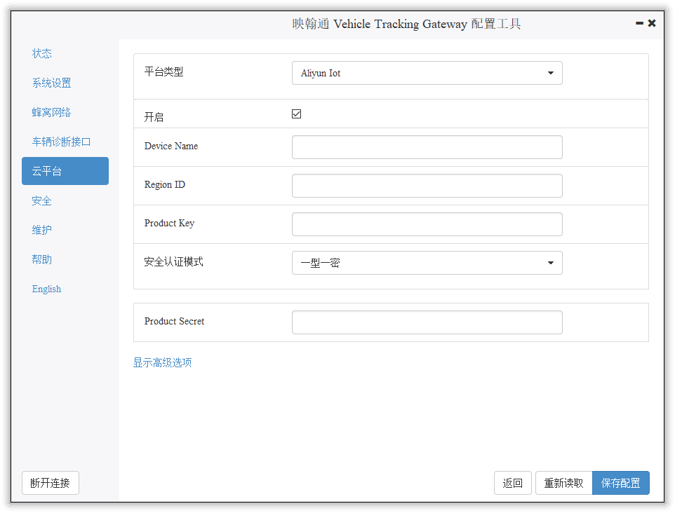

### 6.6 MQTT 协议平台链接配置

MQTT 遥测传输 (MQTT) 是轻量级基于代理的发布/订阅的消息传输协议，设计思想是开放、简单、轻量、易于实现。这些特点使它适用于受限环境。例如，但不仅限于此：网络代价昂贵，带宽低、不可靠。在嵌入设备中运行，处理器和内存资源有限。该协议的特点有：使用发布/订阅消息模式，提供一对多的消息发布，解除应用程序耦合。对负载内容屏蔽的消息传输，使用 TCP/IP 提供网络连接。支持MQTT的开源软件ThingsBoard、EMQ等，客户可以基于这些开源软件开发物联网平台。

### 6.6.1 MQTT Boker 平台配置

平台类型 >> Mqtt Broker：勾选“开启”，配置 “域名”、“端口”、“用户名“和“密码”。点击“保存配置”并“重启”，如图下图所示。

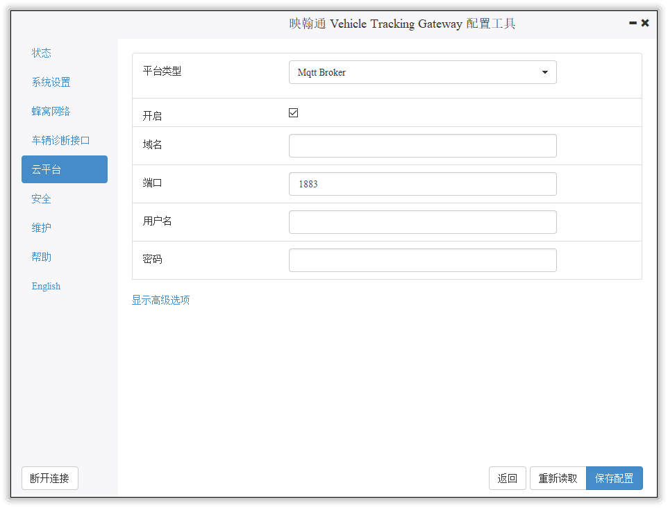

如果客户需要显示无效数据，可以点击“显示高级选项”显示隐藏配置项。勾选“显示无效数据”，如下图所示。

### 6.6.2 ThingBoard 开源IoT平台链接配置

ThingsBoard是一个开源物联网平台，可实现物联网项目的快速开发、管理和扩展。用于数据收集、处理、可视化和设备管理的开源物联网平台。 它通过行业标准的物联网协议 - MQTT、CoAP和HTTP实现设备连接,并支持云和本地部署。更多信息可访问 [https://thingsboard.io](https://thingsboard.io/)。

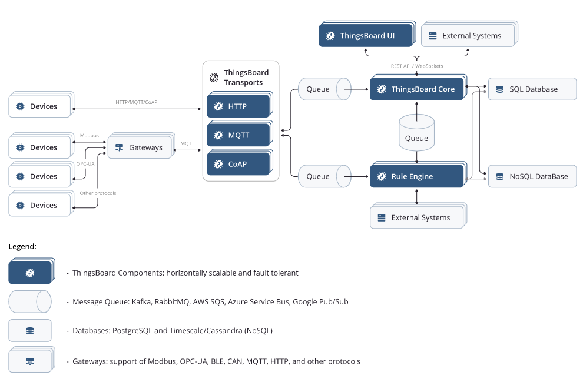

Thinsboard 架构

1. 注册账号及添加设备，添加设备后使用打开设备 Device Credentials >> MQTT Basic 填写 Client ID、User Name 、Password 参数。更多配置信息请访问：[https://thingsboard.io/docs/getting-started-guides](https://thingsboard.io/docs/getting-started-guides)。

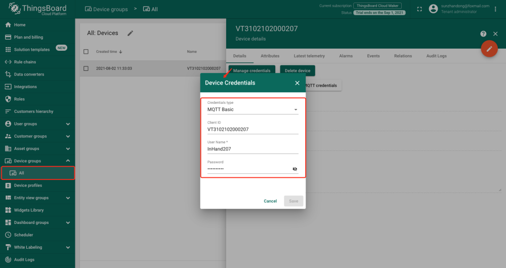

平台设备参数

1. 配置工具中填入平台添加的设备参数 域名 thingsboard.cloud、端口号 1883、用户名 User Name 、密码 Password。

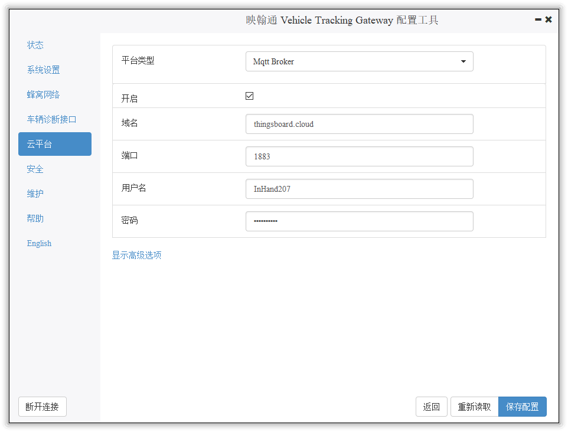

## 7. 维护

 固件升级主要有通过以下几种方式升级：通过本地升级配置工具方式升级、使用串口链接设备使用xshell 方式升级，通过OTA升级。OTA升级包括 阿里云标准OTA升级、Smartfleet 平台OTA升级，通过flexAPI批量升级。下面仅对本地配置工具升级进行介绍。更多升级方式可以咨询映翰通技术支持人员。

### 7.1 固件升级

步骤 1：点击“维护”进入维护功能页面。维护 >> InTracker固件升级 进入升级页面。如下图所示：

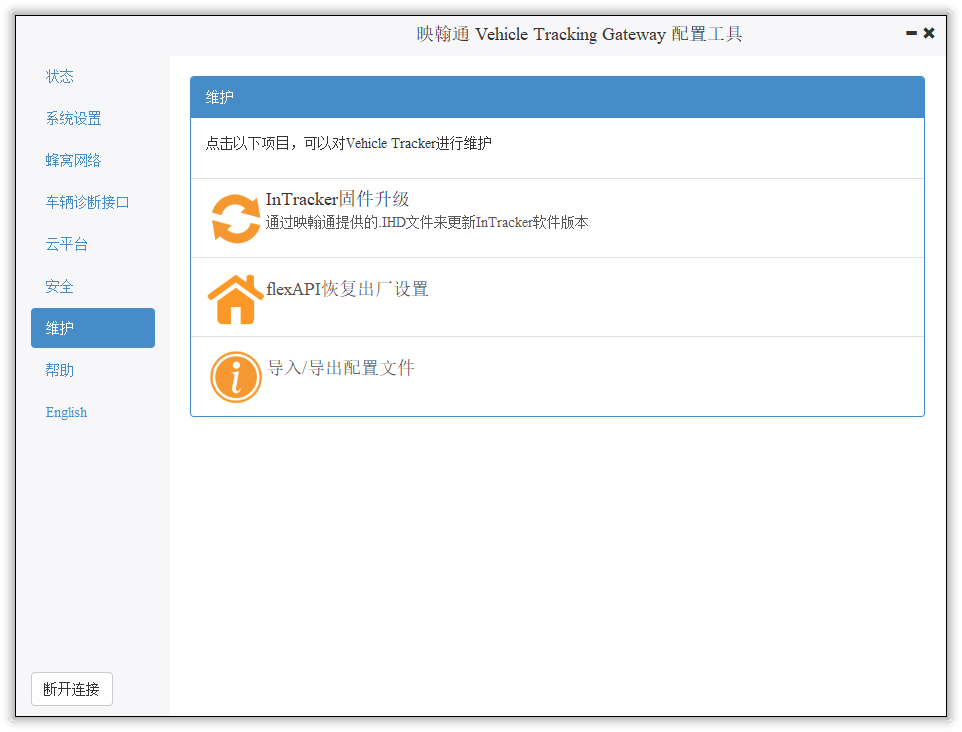

步骤 2：点击“浏览文件”选择固件。然后点击“升级”后等待固件安装。如下图所示：

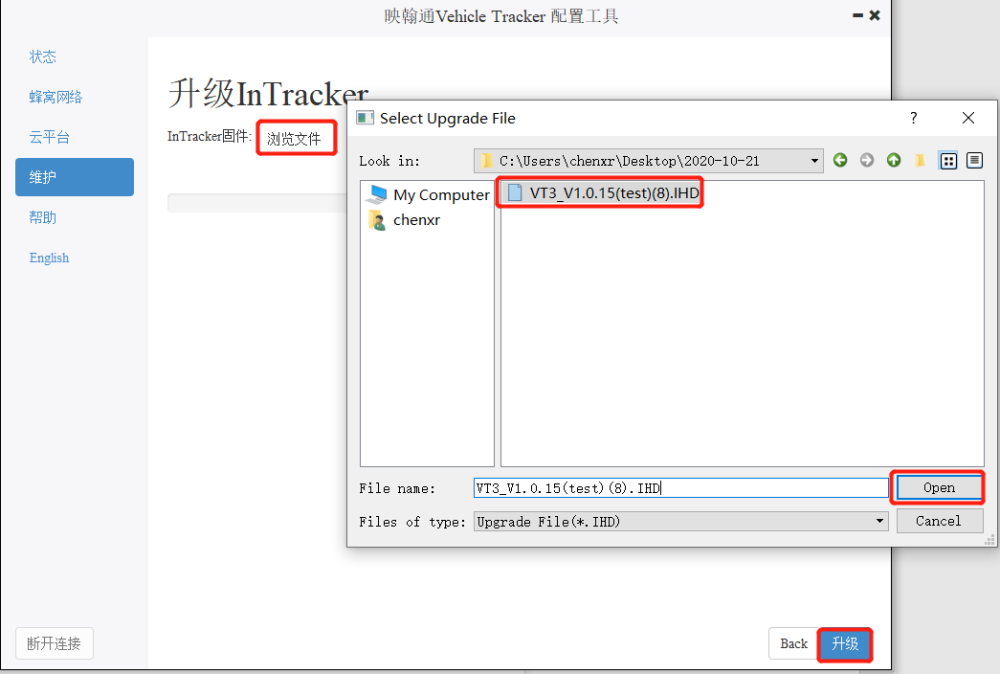

当弹出提示框“将在重启InTrackerVT310后切换到最新版本”就表示新固件导入成功，请点击重启后进行固件升级。如图7-3所示。

注意：设备升级完成后，请重启再进行配置使用。

### 7.2 FleAPI 恢复出厂设置

维护 >> fleAPI 恢复出厂设置，用于重置fleAPI 设置。

### 7.3 导入/导出配置

设备的配置备份，配置的导入使用 维护 >> 导入/配置文件 , 如下图备份配置点击“导出配置”，加载配置文件点击“导入配置”

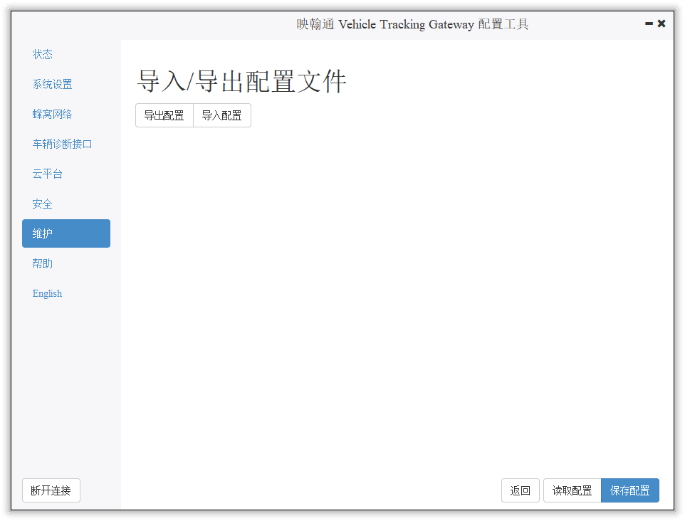

备份配置点击“导出配置”，配置工具会读取设备配置，弹出文件存储窗口，在File name 文本框填写备份文件的名称。然后点击 Open 按钮。

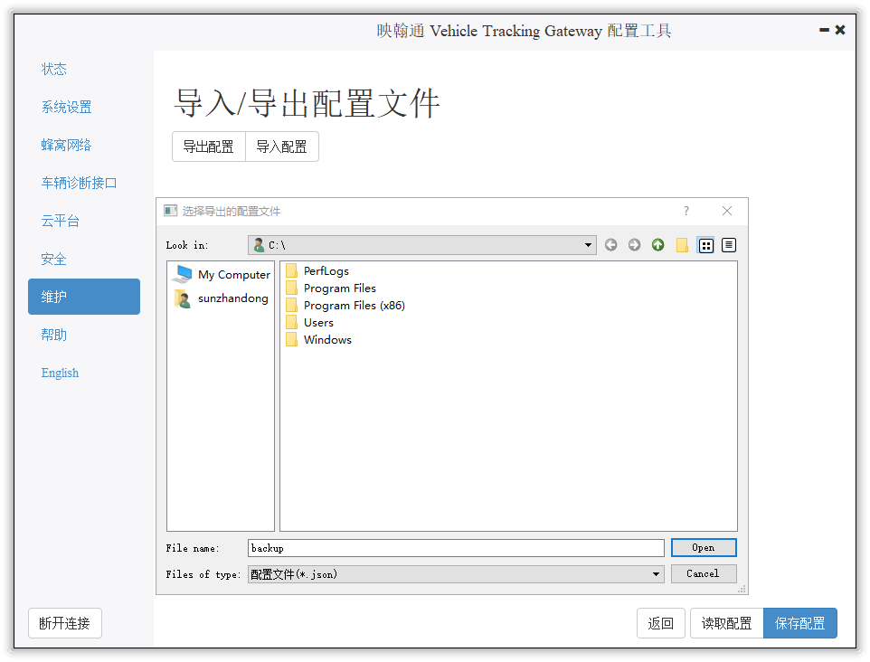

⚠️ 在导出的配置文件中，没有导出用户名密码，若用户希望在新的设备中导入修改的用户名密码，则可以在导出的配置文件中添加。在 "user":"" 的""内填入管理员账户，在 "passwd":"" 的。"内填入管理员账号的密码。修改配置文件保存之后，导入到新设备之后，设备重启。使用新的管理员账号和密码登录设备。

## 8. 恢复默认账号密码

由于配置中往往包含设备证书文件，设备通过硬件恢复出厂时，只恢复用户名密码为admin/123456。如下图，用螺丝刀或其他工具按住Reset 按键超过8s，松开即可。

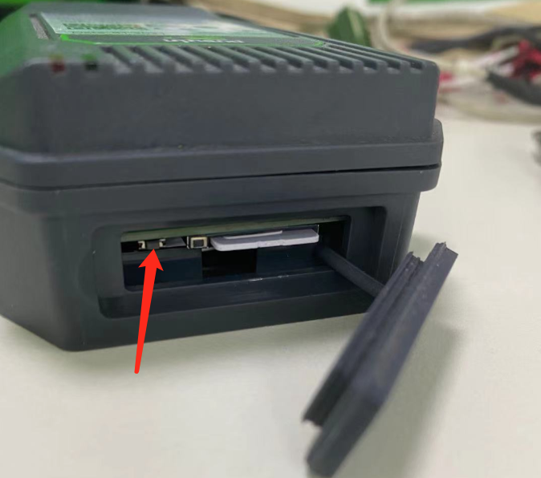

ps：双击Reset 按键可在设备运行出错时重启设备。

## 9. 如何获取日志

确保电脑通过USB转串口通过配置线与VT310 相连接，打开一串口链接工具例如串口调试软件。串口调试软件可以在Mircrosoft Store 下载。

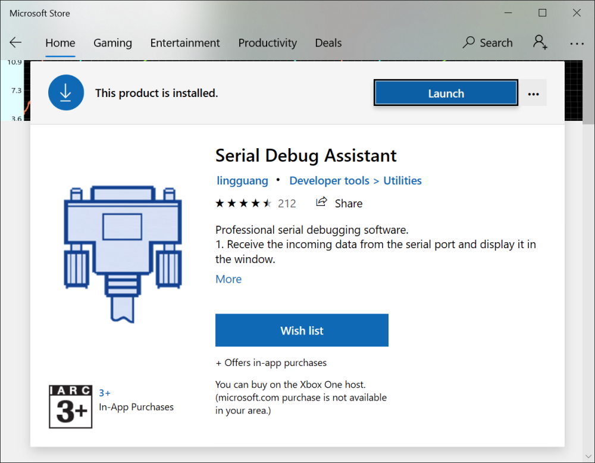

1. 打开串口调试软件，选择链接串口，串口默认波特率为115200/8/n/1。点击Open serial port 打开串口。注意 字符编码模式(Character encoding )选择ASCII，断行模式（Linet break）选择 \n(LF) 。

1. 在内容发送串口输入 +++ ，激活CLI模式，如下图；

输入用户名 admin （回车键），点击发送，输入密码 123456 （回车键），点击发送，进入命令行模式。

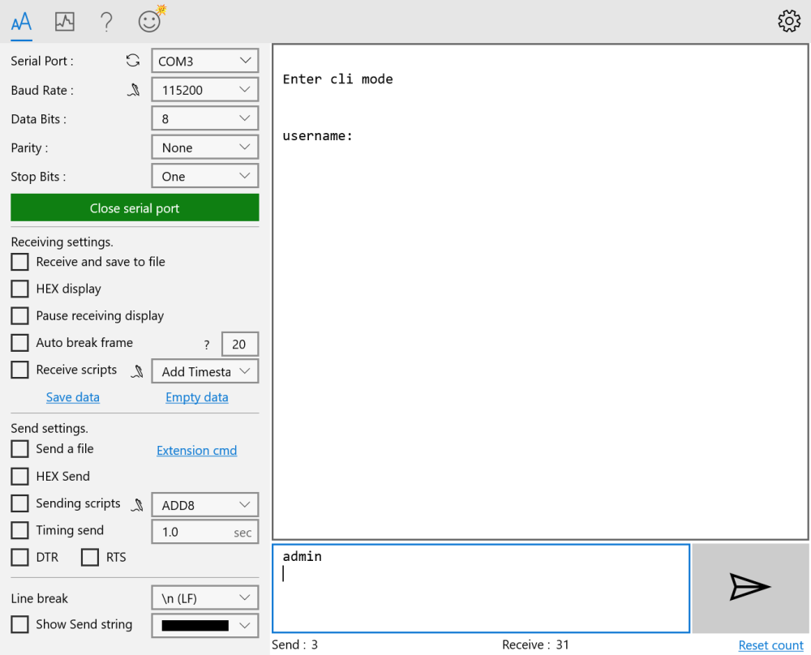

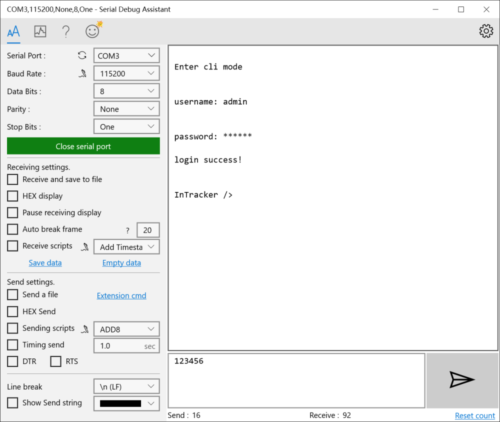

1. 开启日志功能，在发送文本框中写入 log console enable (回车)，点击发送。如下图可以看到接收窗口的日志信息。

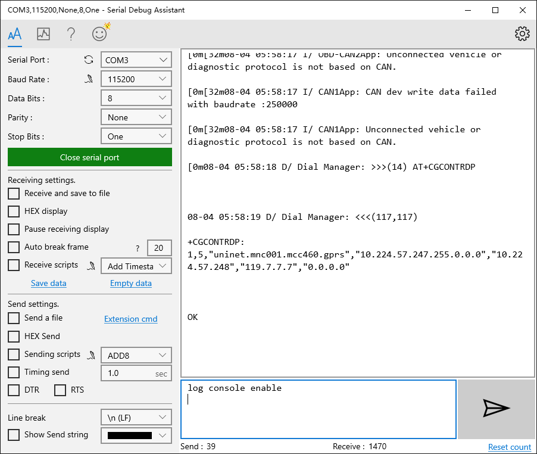

1. 关闭日志功能，在发送文本框中写入 log console disable (回车)，点击发送。接收窗口停止收到日志。

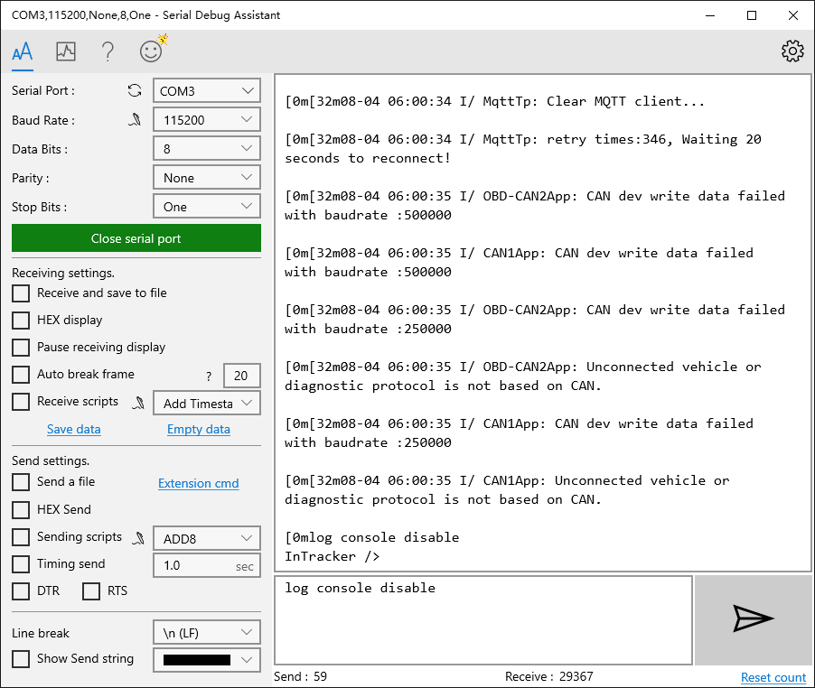

1. 若需要在退出串口后链接配置工具，请在发送文本框中写入 exit (回车)，点击发送，（用于退出CLI模式），然后关闭串口；或等待180s，设备会自动退出CLI模式模式。

## 附录

### 1. ODB协议已适配车型

东风天龙 北汽欧曼(BJ4259SNHKB-AA) 依维柯(NJ1045EFCS)

东风天锦 依维柯(NJ6725DC) 依维柯(NJ6605DC)

中国重汽豪沃 依维柯(NJ6605DC) 宇通重工

北汽福田

### 2. J1939 协议介绍

J1708是专门针对重型车辆（卡车和客车）开发的一种SAE规范。协议旨在推广用于带微控制器的模块之间通信的标准。标准规范以更经济的方式在设备之间进行数据传送。J1708主要定义了物理层，常见的运行在J1708之上的高层协议是SAE J1587（TMC/SAE 联合的供电子数据交换的微机系统在重型车）和SAE J1922（用于中型和重型公路用柴油车电控传动接口）。

### 3. J1708 协议介绍

J1708是专门针对重型车辆（卡车和客车）开发的一种SAE规范。协议旨在推广用于带微控制器的模块之间通信的标准。标准规范以更经济的方式在设备之间进行数据传送。J1708主要定义了物理层，常见的运行在J1708之上的高层协议是SAE J1587（TMC/SAE 联合的供电子数据交换的微机系统在重型车）和SAE J1922（用于中型和重型公路用柴油车电控传动接口）。
