# 车载追踪网关 VT200系列用户手册

修订历史

| 版本 | 日期 | 作者 | 描述 |
| :--- | :--- | :--- | :--- |
| 1.0 | 2022-12-10 | Sun Zhandong | 创建文档 |

---

## 前置信息

首先非常感谢您选择本公司产品！在使用前，请您仔细阅读本用户手册，遵守以下声明，将有助于维护知识产权和法律合规性，以确保您的使用体验与产品的最新信息相一致。如有任何疑问或需要获取书面许可，请随时联系我们的技术支持团队。

- 版权声明

本用户手册包含受版权保护的内容，版权归北京映翰通网络技术股份有限公司及其许可者所有。未经书面许可，任何单位和个人不得擅自摘抄、复制本手册的部分或全部内容，且不得以任何形式传播。

- 免责声明

由于产品技术和规格不断更新，本公司不能承诺用户手册中的资料与实际产品完全一致。因此，不承担由于实际技术参数与用户手册不符而引起的任何争议。任何关于产品的改动恕不提前通知，本公司保留最终更改权和解释权

- 版权信息

本用户手册内容受版权法律保护，版权归北京映翰通网络技术股份有限公司及其许可者所有，保留一切权利。未经书面许可，不得擅自使用、复制或传播本手册的内容。

### 图形界面约定

| 符号 | 含义 | 示例 |
|------|------|------|
| `< >` | 表示变量或参数，需替换为实际值 | `<IP地址>` 表示需填入具体IP |
| `" "` | 表示界面上的文字标签 | 点击"保存"按钮 |
| `→` | 表示菜单层级或操作顺序 | 【云平台】→【平台类型】 |
| `【 】` | 表示菜单或页面名称 | 进入【蜂窝网络】页面 |
| `☑️` | 表示勾选启用的复选框 | 勾选 ☑️开启 |

### 技术支持

**北京映翰通网络技术股份有限公司（总部）**

电话：010-8417 0010

地址：北京市朝阳区紫月路18号院3号楼5层

**成都办事处**

电话：028-8679 8244

地址：四川省成都市武侯区天府大道北段1777号中国太平金融大厦14层

**广州办事处**

电话：020-8562 9571

地址：广州市天河区棠东东路5号远洋新三板创意园B-130单元

**武汉办事处**

电话：027-8716 3566

地址：湖北省武汉市洪山区珞瑜东路2号巴黎豪庭11栋2001室

**上海办事处**

电话：021-5480 8501

地址：上海市普陀区顺义路18号1103室

### 如何使用本手册

- 首次使用用户：建议按顺序阅读「认识设备」→「安装与首次使用」→「常用场景配置」→「功能说明与参数参考」
- 已有设备用户：可直接查阅「功能说明与参数参考」或「附录 故障处理」
- 云平台管理用户：可查阅「常用场景配置」中的云平台接入相关场景

| 任务 | 对应章节 | 预计用时 |
|------|----------|----------|
| 了解设备接口及外观 | [第1章 认识设备](#第1章-认识设备) | 约5分钟 |
| 安装设备并首次启动 | [第2章 安装与首次使用](#第2章-安装与首次使用) | 约10分钟 |
| 配置蜂窝网络联网 | [场景3：配置蜂窝网络](#场景3配置蜂窝网络) | 约5分钟 |
| 配置车载诊断接口 | [场景4：车载诊断接口配置](#场景4车载诊断接口配置) | 约5分钟 |
| 接入Smartfleet云平台 | [场景5：Smartfleet云平台接入](#场景5smartfleet云平台接入) | 约5分钟 |
| 接入AWS/Azure/Aliyun平台 | [场景7～9](#场景7azure-iot-hub接入) | 约10分钟 |
| 固件升级与配置备份 | [4.1 系统维护与管理](#41-系统维护与管理) | 约5分钟 |


---

## 第1章 认识设备

### 概述

VT200系列车辆跟踪网关是一款面向物流运输、工程车辆监控等行业的资产跟踪产品。该设备集成GNSS（Global Navigation Satellite System，可以理解为：全球卫星导航系统，用于精确定位设备所在位置）定位功能，支持车辆及驾驶员状态的实时跟踪与监视、历史轨迹回放、地理围栏（可以理解为：在电子地图上划定的虚拟边界，当设备进出该区域时可触发告警）以及异常警报等功能。VT200结合车载网络云平台，可实现远程车辆管理、资产跟踪和预防性维护，有助于车队运营降低成本、提高效率。该设备提供多种子型号，支持LTE CatM1、Cat1、Cat4等不同速率的无线网络接入。

### 可选配件

| 物料号 | 线缆名称 | 配件外观 |
| :--- | :--- | --- |
| SCAB000381 | 20PIN All-in-one Test Cable |  |
| ECON000047 | DC 5.5*2.1mm Female Connector |  |
| APWR000122/121 | Power adapter 12V/2A | 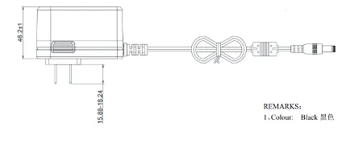 |

> **说明**：购买产品时需根据实际需求订购不同配件，建议联系销售经理或技术支持工程师确认。InHand提供测试套件（含12V适配器或交流转直流12V电源、RS232转USB线缆），便于在办公环境中进行设备测试和登录。

### 外观与接口

#### 接口分布

<p align="center">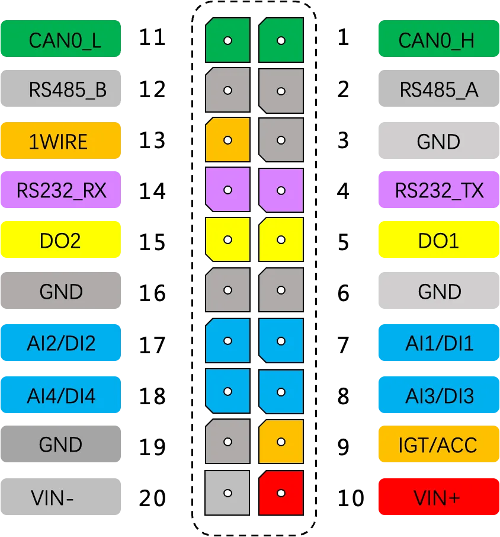</p>

<p align="center"><strong>图 1-1 VT200接口分布图</strong></p>

#### 接口说明

| 接口 | 功能说明 |
| :--- | :--- |
| RS232串行端口 | 用于数据传输，不用于设备配置。配置设备需使用USB Type-C接口。 |
| USB Type-C | 位于设备侧边（橡胶塞下方），用于连接计算机配置设备，功能等同于RS232串行端口。 |
| DI（Digital Input，数字输入，可以理解为：检测开关状态的"传感器"，判断是否有信号输入） | 用于检测开关值（如按钮按下/弹起、开关开/关状态）。VT200提供可配置的上拉功能，DI默认含10kΩ下拉至GND的电阻；配置为上拉时，含20kΩ上拉至电源电压的电阻。 |
| DO（Digital Output，数字输出，可以理解为：控制开关的"遥控器"，用于控制外部设备的开关状态） | 用于输出直流电压，为开漏输出，支持300mA电流，通常与继电器配合使用。 |
| AI（Analog Input，模拟输入，可以理解为：测量连续变化的"仪表"，如温度、压力等模拟量信号） | 用于检测直流电压，可直接接入电压模拟量。 |
| 1-Wire | 用于连接小型通信设备（如DS18B20数字温度计、iButton设备）。需将1-Wire设备的DQ引脚连接至VT200 PIN13，VDD和GND引脚连接至VT200的GND。 |
| IGT（点火感应） | 用于连接车辆点火开关，VT200可检测车辆是否点火。测试时需将IGT线缆和V+线缆连接至直流电源。 |

#### 接口电路图

**DI无上拉电源时的外部电路连接：**

<p align="center"></p>

<p align="center"><strong>图 1-2 DI无上拉电源时的外部电路</strong></p>

**DI有上拉电源时的外部电路连接：**

<p align="center"></p>

<p align="center"><strong>图 1-3 DI有上拉电源时的外部电路</strong></p>

**DO外部电路连接：**

<p align="center"></p>

<p align="center"><strong>图 1-4 DO外部电路</strong></p>

**AI外部电路连接：**

<p align="center"></p>

<p align="center"><strong>图 1-5 AI外部电路</strong></p>

**1-Wire温度传感器探头连接：**

<p align="center"></p>

<p align="center"><strong>图 1-6 1-Wire温度传感器探头连接</strong></p>

### 指示灯说明

VT200设备配有GNSS状态灯（绿色）和Cellular状态灯（橙黄色），各指示灯状态含义如下：

| 指示灯 | 状态 | 含义 |
|--------|------|------|
| GNSS状态灯（绿色） | 长期熄灭 | 设备未启动或GNSS模组工作不正常 |
|  | 快速闪烁（频率: 0.5Hz） | GNSS对时服务成功 |
|  | 慢速闪烁（频率: 1Hz） | GNSS功能已启用 |
|  | 常亮 | 定位成功 |
| Cellular状态灯（橙黄色） | 长期熄灭 | 设备被禁用或拨号模组工作不正常 |
|  | 快速闪烁（频率: 0.5Hz） | 拨号成功 |
|  | 慢速闪烁（频率: 1Hz） | 拨号已启用 |

### 恢复出厂设置

由于设备配置中往往包含设备证书文件，通过硬件方式恢复出厂设置时，仅恢复用户名和密码为默认值（admin/123456），其余配置不受影响。

操作步骤如下：

1. 找到设备上的Reset按键。
2. 使用螺丝刀或其他尖细工具按住Reset按键，持续超过8秒。
3. 松开按键，设备将恢复默认用户名和密码。

<p align="center"></p>

<p align="center"><strong>图 1-7 Reset按键位置</strong></p>

> **提示**：双击Reset按键可在设备运行异常时重启设备。

### 默认参数

| 参数 | 默认值 |
|------|--------|
| 管理用户名 | admin |
| 管理密码 | 123456 |
| 串口波特率 | 115200 |


---

## 第2章 安装与首次使用

### 2.1 安装前准备

- **环境要求**：为避免运输过程中消耗电池电量，设备在出厂状态下处于运输模式。VT200 需通过外部电源或车辆诊断接口进行激活。
- **工具与配件准备**：
  - VT200 主设备
  - 20PIN 电缆或测试线缆（如 SCAB000381）
  - 电源适配器（如需办公室测试）
  - Micro-SIM 卡
  - 4G 与 GNSS 外部天线（若为外部天线型号）

### 2.2 安装与启动指南

1. 将 20PIN 母头（P1）插入 VT200 设备接口。
2. 将 PIN20 `CONN-x-v-` 和 PIN10 `CONN-x-v+` 分别连接到电源适配器的负极和正极。将 PIN9 `CONN-X-IGT` 与 `V+` 共同连接到电源的正极侧。

<p align="center"></p>

<p align="center"><strong>图 2-1 电源与接口线缆连接</strong></p>

3. 通过 USB-Type C 接口连接计算机进行调试与配置。需事先下载 VTConfig Tool 配置工具，并通过 USB-Type C 线缆连接计算机与 VT200 设备。

<p align="center">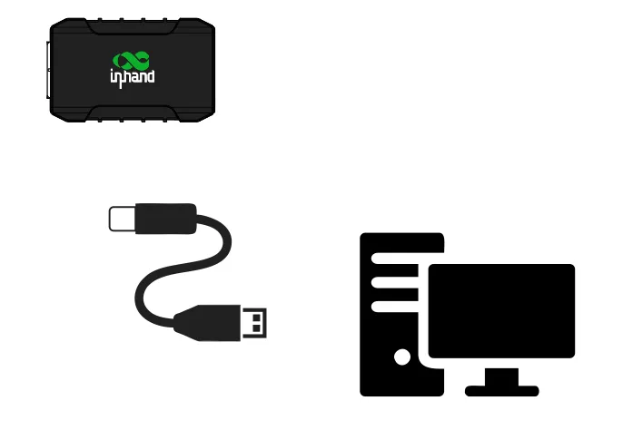</p>

<p align="center"><strong>图 2-2 USB-Type C 接口位置</strong></p>

<p align="center"></p>

<p align="center"><strong>图 2-3 USB 线缆连接计算机</strong></p>

4. 插入 Micro-SIM 卡，需确保 Micro-SIM 卡的截止角指向插槽内侧。

<p align="center">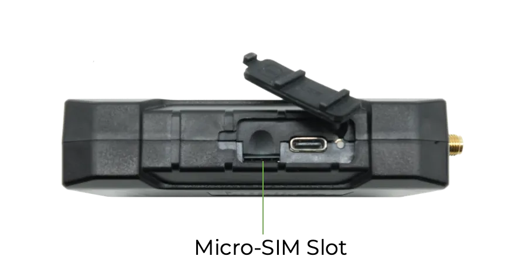</p>

<p align="center"><strong>图 2-4 安装 Micro-SIM 卡</strong></p>

5. 对于外部天线型号设备，将 4G 天线连接至设备的 ANT 天线接口，将 GNSS 天线连接至设备的 GNSS 天线接口。
6. 配置及连线完成后，将设备顶盖与底盖重新连接复位。

### 2.3 登录配置工具

#### 2.3.1 下载安装配置工具

进入映翰通官网下载中心 [https://www.inhand.com.cn](https://www.inhand.com.cn/resources-center/#/Mobility/InVehicleTelematicsGateways/VT200)，在 [支持中心 → 资源中心 → 车辆与运输 → VT车载追踪网关 → VT200](https://www.inhand.com.cn/resources-center/#/Mobility/InVehicleTelematicsGateways/VT200) 栏目下载 VTConfig Tool Setup 2.1.2.exe 或更新版本配置工具。选择默认路径完成安装。

<p align="center">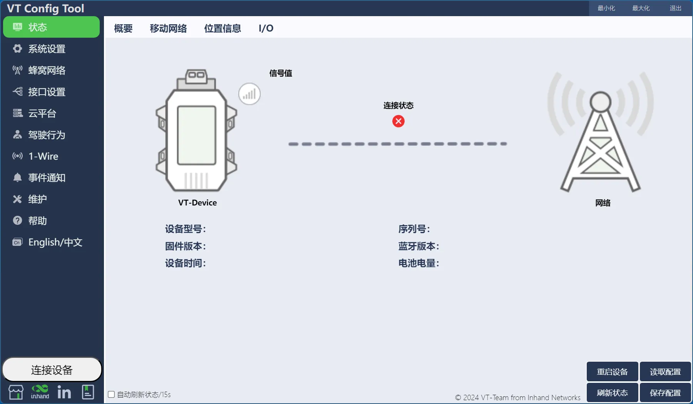</p>

<p align="center"><strong>图 2-5 下载安装配置工具</strong></p>

> **注意**：安装完成后若出现错误提示，需右键选择"以管理员身份运行"打开软件。

<p align="center">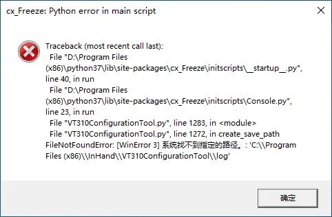</p>

<p align="center"><strong>图 2-6 错误提示——需以管理员身份运行</strong></p>

#### 2.3.2 查找 COM 端口号

通过 20PIN 多合一测试线缆外接适配器给 VT200 供电。电脑使用 USB 转串口线与设备连接。当观察到 GNSS 或 Cellular 灯闪烁，则表明设备启动成功。

进入电脑的"设备管理器"→"端口（COM和LPT）"中查看对应的 COM 端口号。

<p align="center"></p>

<p align="center"><strong>图 2-7 设备管理器查找串口号</strong></p>

#### 2.3.3 登录设备

打开 VT200 配置工具 。若出现错误提示，需使用"以管理员方式"打开。

打开后，可点击"English"切换为英文界面。

<p align="center">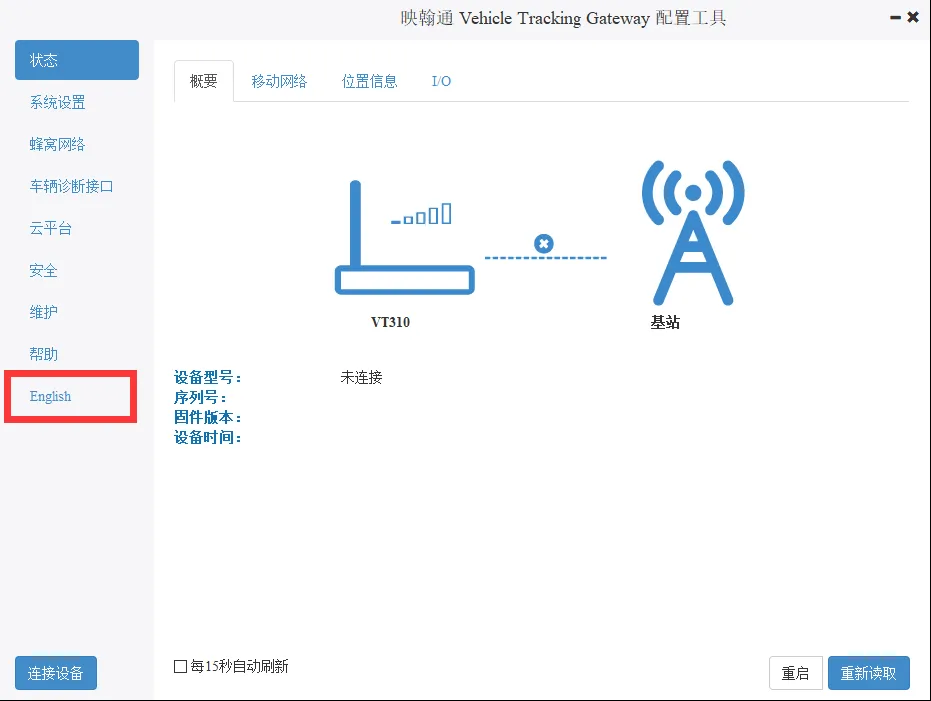</p>

<p align="center"><strong>图 2-8 配置工具语言切换</strong></p>

**串口连接方式**：点击"连接设备"，输入用户名和密码（默认 `admin` / `123456`），选择记录的串口号与波特率（默认 `115200`），点击"连接"。

<p align="center"></p>

<p align="center"><strong>图 2-9 串口登录设备</strong></p>

**蓝牙连接方式**：也可使用电脑蓝牙（4.2及以上版本）连接设备。点击"连接设备"，输入用户名和密码（默认 `admin` / `123456`），选择与设备 SN 名称相同的蓝牙设备（SN 可在设备铭牌上查看），点击"连接"。

<p align="center"></p>

<p align="center"><strong>图 2-10 蓝牙连接设备</strong></p>

当弹出"现在可以查看设备状态，并对设备进行操作"提示后，即可预览或修改配置。

<p align="center"></p>

<p align="center"><strong>图 2-11 登录成功提示</strong></p>

### 2.4 查看设备状态

#### 2.4.1 概要页面

概要页面用于显示设备网络链接状态与基础信息。网络链接正常时，VT200 与基站之间显示为"√"，否则为"×"。勾选"开启每15秒自动刷新"可实时更新显示信息。概要页面的参数可与设备铭牌信息核对。

<p align="center"></p>

<p align="center"><strong>图 2-12 设备概要信息</strong></p>

#### 2.4.2 移动网络参数

移动网络参数页面用于查看无线网络链接状态。未插入 SIM 卡时显示为默认参数。当设备通过 SIM 卡拨号联网成功后，可获得 IP 地址并进行数据传输。

| 参数名称 | 参数说明 |
| --- | --- |
| 信号值 | 代表无线网络的信号强度，取值范围 0～31 |
| MCC/MNC | MCC（Mobile Country Code，移动国家代码）和 MNC（Mobile Network Code，移动网络代码），从 SIM 卡内读取 |
| SIM卡状态 | 正常/未识别 |
| IMEI | 国际移动设备识别码（International Mobile Equipment Identity，可以理解为：设备的"全球唯一序列号"），为车载网关内置拨号模组代码 |
| 注册状态 | 已注册/未注册 |
| LAC | 位置区码（Location Area Code），拨号成功后从基站获得 |
| IMSI | 国际移动用户识别码（International Mobile Subscriber Identity），从 SIM 卡内读取 |
| CELL ID | 小区号，拨号成功后从基站获得 |
| ICCID | 集成电路卡识别码（Integrate Circuit Card Identity），即 SIM 卡卡号，从 SIM 卡内读取 |
| IP地址 | 拨号成功后，运营商分配的网络接入 IP 地址 |
| 蜂窝状态 | 已连接/未连接 |
| 认证方式 | CHAP/PAP |

<p align="center"></p>

<p align="center"><strong>图 2-13 移动网络参数查看</strong></p>

#### 2.4.3 位置信息

位置信息页面显示 GNSS 模组获取的最新参数，包括位置信息与惯性传感器的相关参数。

<p align="center">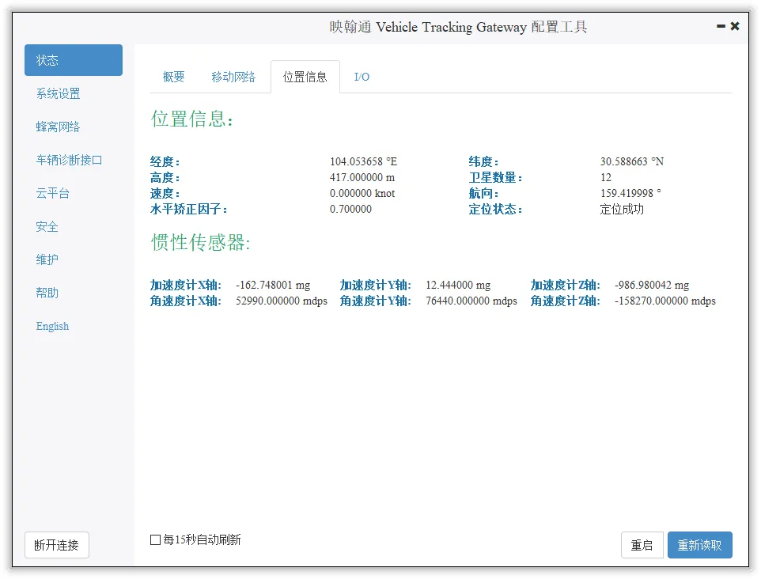</p>

<p align="center"><strong>图 2-14 位置信息页面</strong></p>

#### 2.4.4 I/O 信息

I/O（Input/Output，可以理解为：设备的"感官和手脚"，用于接收外部信号输入或控制外部设备输出）信息页面显示数字输入、模拟输入等接口的当前状态。

<p align="center"></p>

<p align="center"><strong>图 2-15 I/O 信息页面</strong></p>

### 2.5 快速检查

安装完成后，建议按以下清单进行检查：

- 检查设备电源指示灯及运行灯状态是否正常。
- 检查能否通过配置工具顺利登录设备。
- 检查移动网络参数页面，确认 SIM 卡是否已被识别并获取 IP 地址。
- 检查 GNSS 状态灯是否常亮（表示定位成功）。
- 检查 Cellular 状态灯是否快速闪烁（表示拨号成功）。


---

## 第3章 常用场景配置

### 场景1：休眠模式配置

**目标**：配置设备休眠模式，使车辆熄火后设备自动进入低功耗休眠状态，延长电池续航，并支持定时唤醒上报数据。

**前提**：设备已上电并完成基本网络配置，已通过配置工具登录设备。

**预计用时**：约5分钟。

#### 工作原理

休眠模式通过状态机控制设备在三种运行状态之间切换，保障车辆熄火后的电池续航能力。状态机如下：

<p align="center"></p>

<p align="center"><strong>图 3-1 休眠模式状态机</strong></p>

#### 状态机说明

设备包含三种运行状态：**Run**（正常运行）、**Sleep**（休眠）和 **Temp run**（临时运行）。各状态之间的转换条件如下：

1. **Run → Temp run（转换 ①）**：当满足以下任一条件时，设备从正常运行状态进入临时运行状态：
   - 外接电源断开（电源电压低于休眠电压阈值）；
   - IGT 信号变为 OFF（需在配置中使能 IGT 功能）。
   首次进入休眠流程时，设备默认保持 10 秒的延时休眠时间（用于上报信息），随后进入 Sleep 状态。

2. **Temp run → Sleep（转换 ②）**：当满足以下任一条件时，设备从临时运行状态进入休眠状态：
   - 设备在 Temp run 状态下运行满一个"唤醒运行时间"周期；
   - 设备从 Run 状态经过 15 秒 Temp run 后自动转入。

3. **Sleep → Run（转换 ③）**：当同时满足以下条件时，设备从休眠状态恢复为正常运行状态：
   - 外接电源恢复（电源电压高于休眠电压阈值）；
   - IGT 信号变为 ON（需在配置中使能 IGT 功能）。

4. **Sleep → Temp run（转换 ④）**：设备在 Sleep 状态下运行满一个"唤醒间隔"周期后，自动进入 Temp run 状态（用于定时唤醒上报数据）。

5. **Temp run → Run（转换 ⑤）**：当同时满足以下条件时，设备从临时运行状态恢复为正常运行状态：
   - 外接电源恢复（电源电压高于休眠电压阈值）；
   - IGT 信号变为 ON（需在配置中使能 IGT 功能）。

#### 操作步骤

1. 登录配置工具，进入【系统设置】→【休眠模式】页面。
2. 根据实际需求配置以下参数：

| 参数 | 说明 |
| :--- | :--- |
| 使能IGT | 使能后，设备将 IGT 状态作为进入和退出休眠的判断条件之一。默认不勾选。 |
| 唤醒间隔 | 设备进入休眠后，自动唤醒的时间间隔。默认值为 120 分钟。 |
| 唤醒运行时间 | 设备唤醒后，维持运行状态的持续时间（超过该时间后重新进入休眠）。默认值为 5 分钟。 |
| 延时休眠时间 | 设备进入休眠前，用于上报数据的等待时间。 |

3. 配置完成后，点击"保存配置"使设置生效。

<p align="center"></p>

<p align="center"><strong>图 3-2 休眠模式配置界面</strong></p>


### 场景2：账号设置与密码修改

**目标**：修改设备管理员的登录账号和密码，提升设备访问安全性。

**前提**：已通过配置工具登录设备，已知当前管理员账号与密码（出厂默认账号 `admin`，密码 `123456`）。

**预计用时**：约2分钟。

**操作步骤**：

1. 在配置工具中，进入【账号设置】页面。
2. 在"管理员账号"栏中输入新的账号名称，在"管理员密码"栏中输入新密码。
3. 点击"保存配置"，设备将提示需要重启。
4. 在弹出的确认对话框中，点击"确认"执行重启。
5. 设备重启完成后，使用修改后的管理员账号和密码重新登录。

<p align="center"></p>

<p align="center"><strong>图 3-3 账号设置界面</strong></p>

> **注意**：修改密码后需妥善保管新的登录凭据。如遗忘密码，需通过设备硬件复位恢复出厂设置（详见 [恢复出厂设置](#15-恢复出厂设置与默认参数)）。


### 场景3：配置蜂窝网络

**目标**：配置设备的蜂窝网络拨号参数，使设备通过 SIM 卡接入移动网络。

**前提**：已通过配置工具登录设备，设备已正确安装 SIM 卡，已从运营商处获取 APN（Access Point Name，可以理解为：运营商网络的"门牌号"，告诉设备应该通过哪个入口连接到移动网络）等拨号参数（专网场景下需要；公网 SIM 卡通常无需额外配置）。

**预计用时**：约3分钟。

**操作步骤**：

1. 在配置工具中，点击"蜂窝网络"进入配置页面。
2. 根据运营商提供的信息，填写以下基本参数：
   - 网络接入点名称（APN）
   - 网络拨号用户名
   - 网络拨号密码
   - 认证模式
3. 如使用场景有特殊要求，点击"显示高级选项"展开隐藏配置项，按需填写"网络拨号号码"、"PIN"及"默认承载APN"。
4. 确认参数无误后，点击"保存配置"。设备重启后配置生效。

<p align="center">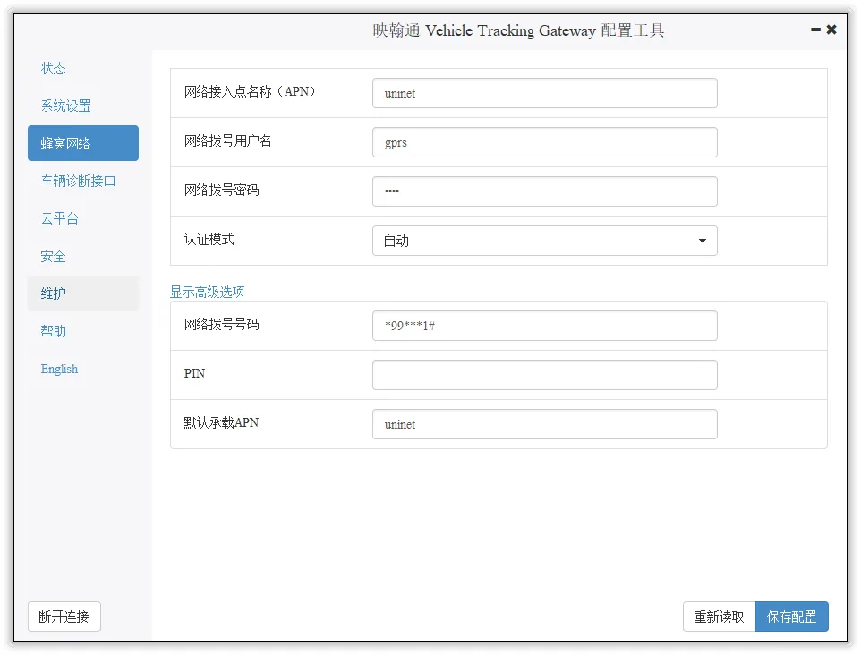</p>

<p align="center"><strong>图 3-4 蜂窝网络配置界面</strong></p>

**参数说明**：

| 参数 | 说明 |
| :--- | :--- |
| 网络接入点名称（APN） | 专网接入移动网络时需由运营商提供。大部分公网 SIM 卡拨号时不对 APN 进行认证，可留空。 |
| 网络拨号用户名 | 默认值为 `gprs`。专网 AAA 认证场景下，需由运营商提供。 |
| 网络拨号密码 | 默认值为 `gprs`。专网 AAA 认证场景下，需由运营商提供。 |
| 认证模式 | 可选"自动"/"CHAP"/"PAP"。选择"自动"时，设备将交替使用 PAP 和 CHAP 方式尝试拨号；选择 PAP 或 CHAP 则仅使用对应方式。专网场景下需由运营商指定。 |
| 网络拨号号码 | 默认值为 `*99***1#`，需由运营商提供。 |
| PIN | SIM 卡的个人识别密码（Personal Identification Number）。当 SIM 卡开启 PIN 验证时，需在此填入对应 PIN 码。 |
| 默认承载APN | 由运营商提供。一般情况下无需配置；如需使用，需咨询运营商获取相关参数。 |

**验证方法**：返回概要页面，确认网络链接状态为"√"，或观察 Cellular 指示灯闪烁状态。


### 场景4：车载诊断接口配置

**目标**：配置车载追踪器的 OBD（CAN2/J1708）接口和 CAN1 接口，使设备能够通过车载诊断协议采集车辆数据。

**前提**：已通过配置工具登录设备，车辆端诊断接口物理接线正确。

**预计用时**：约5分钟。

车载诊断接口是 VT200 车载追踪器与车辆之间进行数据交互的南向接口。VT200 支持两组独立的诊断通道——OBD 接口（CAN2 + J1708）和 CAN1 接口，二者可同时启用。

**操作步骤**：

#### 步骤一：配置 OBD 接口

在配置工具中，将诊断协议设置为 OBD，然后根据车辆支持的协议选择相应选项。

| 参数 | 说明 | 备注 |
| :--- | :--- | :--- |
| J1939/J1979 | CAN2 接口协议，对应物理层 PIN CAN_2L (PIN 12) 和 CAN_2H (PIN 25) | OBD 默认配置 |
| J1939 | CAN2 接口协议，对应物理层 PIN CAN_2L (PIN 12) 和 CAN_2H (PIN 25) | |
| J1979 | CAN2 接口协议，对应物理层 PIN CAN_2L (PIN 12) 和 CAN_2H (PIN 25) | |
| J1708 | J1708 接口协议，对应物理层 PIN J1708_B (PIN 13) 和 J1708_A (PIN 26) | |
| Auto | 自动轮询模式。设备依次发送上述协议的数据包进行连接测试，收到有效响应后自动锁定该协议进行通讯。 | 使用 Auto 模式时，CAN1 接口和 J1708 接口将同时被打开。 |
| Disable | 关闭 CAN2 接口和 J1708 接口 | |

<p align="center">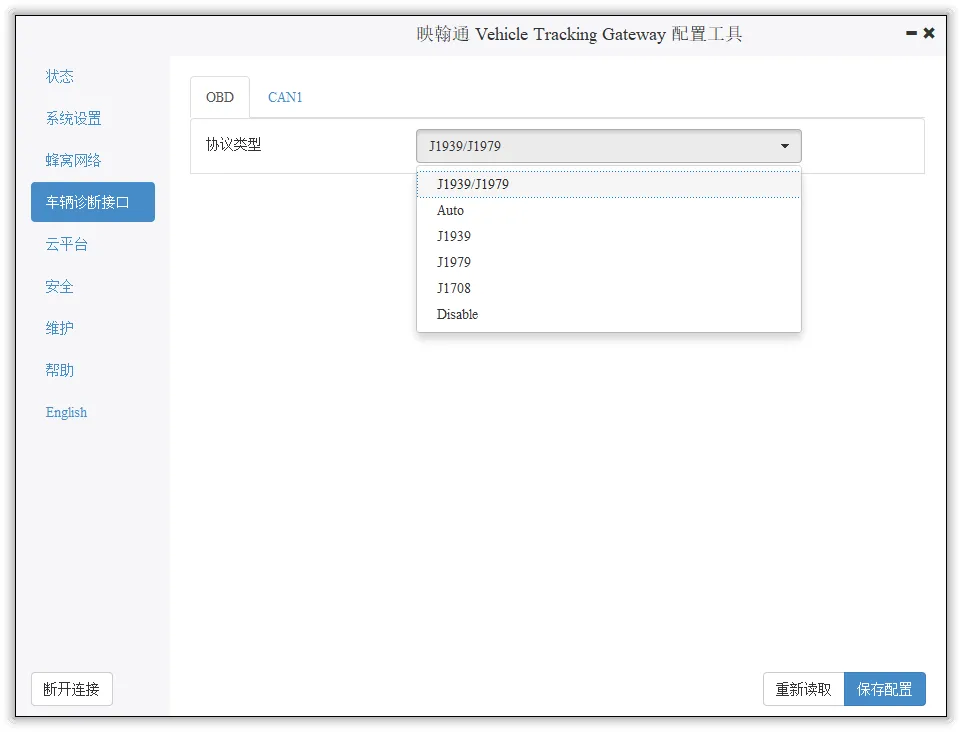</p>

<p align="center"><strong>图 3-5 OBD 接口配置界面</strong></p>

#### 步骤二：配置 CAN1 接口

CAN1 是 VT200 的独立 CAN 总线通道。在配置工具中将诊断协议切换为 CAN1，然后选择所需的协议类型。

| 参数 | 说明 | 备注 |
| :--- | :--- | :--- |
| J1939/J1979 | CAN1 接口协议，对应物理层 PIN CAN_1L (PIN 11) 和 CAN_1H (PIN 24) | CAN1 默认配置 |
| J1939 | CAN1 接口协议，对应物理层 PIN CAN_1L (PIN 11) 和 CAN_1H (PIN 24) | |
| J1979 | CAN1 接口协议，对应物理层 PIN CAN_1L (PIN 11) 和 CAN_1H (PIN 24) | |
| Disable | 关闭 CAN1 接口 | |

<p align="center">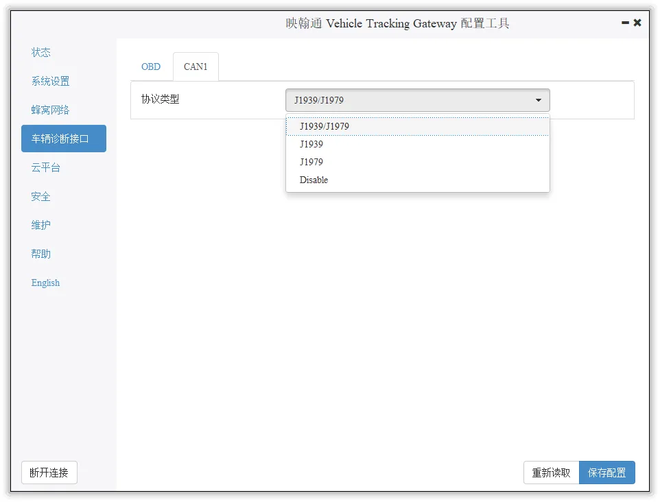</p>

<p align="center"><strong>图 3-6 CAN1 接口配置界面</strong></p>

> **提示**：CAN1 接口可与 OBD 接口同时启用。当应用场景需要同时从两路 CAN 总线采集数据时，分别配置 OBD 和 CAN1，两个通道互不影响。


### 场景5：Smartfleet云平台接入

**目标**：将 VT200 车载追踪器接入 SmartFleet 云平台，实现车辆远程监控与管理。

**前提**：VT200 已完成基本网络配置并可正常联网，已在 SmartFleet 平台注册账户，已准备好车辆的车牌号码信息。

**预计用时**：约5分钟。

> 云平台是 VT200 车载追踪器的北向接口与协议配置入口。VT200 最多支持连接一个云平台。平台配置变更后需重启设备方可生效。
>
> SmartFleet 平台是映翰通针对车联网市场推出的 SaaS 平台，提供车辆档案管理、报警信息推送、驾驶行为监控、行车信息统计分析、电子围栏等功能。平台登录地址：[https://che.inhandiot.com](https://che.inhandiot.com)。如需了解更多功能，可访问映翰通官网 [https://www.inhand.com.cn](https://www.inhand.com.cn/) 咨询在线客服。

**操作步骤**：

1. 在配置工具中，点击"云平台"进入配置页面，然后点击"Modify"进入编辑模式。

<p align="center">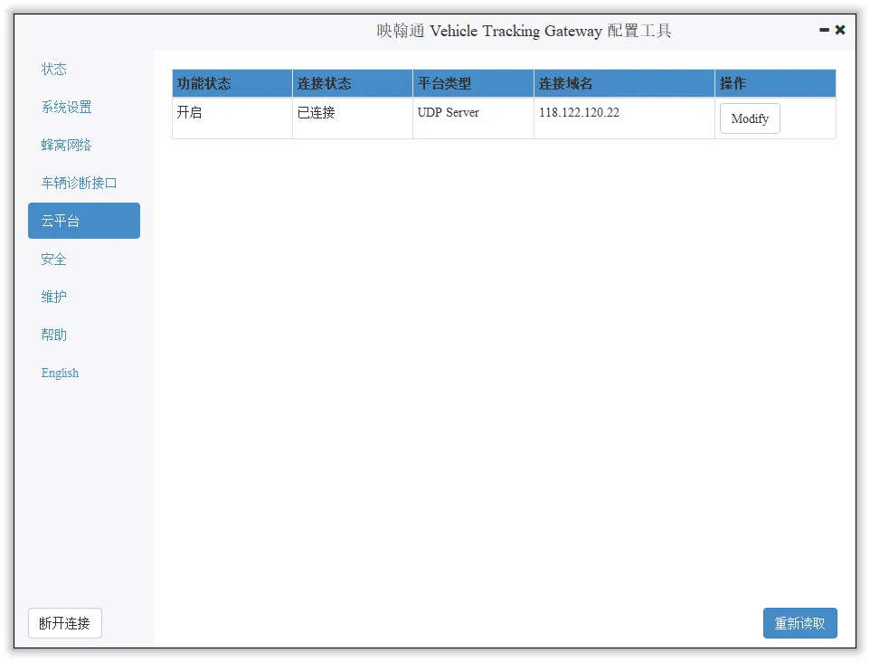</p>

<p align="center"><strong>图 3-7 云平台总览界面</strong></p>

2. 按照以下内容填写各项参数：

| 参数 | 设置值 |
|---|---|
| 平台类型 | StmatFleet |
| 启用状态 | 勾选开启 |
| 平台域名 | `che.inhand.com`（中国用户地址） |
| 平台账户 | 填写在 SmartFleet 平台注册的账户 |
| 车牌号码 | 填写车辆实际车牌号 |

3. 点击"显示高级选项"可展开以下隐藏配置项（上报时间间隔单位为秒）：
   - LBS 上报间隔：基站定位数据的上报周期
   - 流量上报间隔：流量统计数据的上报周期
   - 心跳上报间隔：设备心跳包的发送周期

4. 根据实际需求调整各项间隔参数后，点击"保存配置"，然后点击"重启"使配置生效。

<p align="center"></p>

<p align="center"><strong>图 3-8 SmartFleet 接入配置</strong></p>

**验证方法**：

- **方法一**：设备重启完成后，返回云平台配置页面，检查连接状态。当显示为"已链接"时，表示 VT200 已成功接入 SmartFleet 平台。

<p align="center"></p>

<p align="center"><strong>图 3-9 确认设备已链接</strong></p>

- **方法二**：登录 SmartFleet 平台，依次进入"网关"→"网关列表"，确认该 VT200 车载追踪器显示为在线状态。

<p align="center">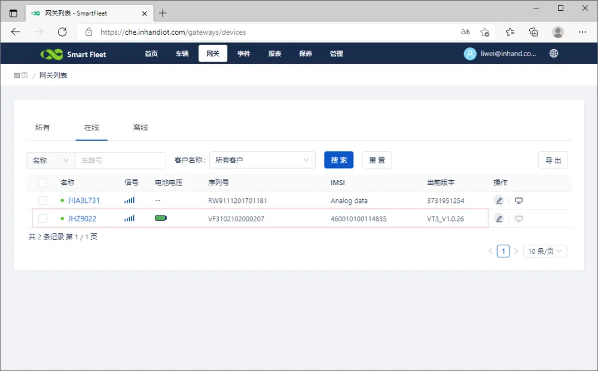</p>

<p align="center"><strong>图 3-10 SmartFleet 平台设备上线显示</strong></p>


### 场景6：Wialon平台接入

**目标**：将 VT200 设备接入 Wialon 车辆追踪平台，实现位置与 IO 数据的远程查看。

**前提**：设备已通电并获取 GNSS 定位，已获得 Wialon 平台账号，已通过配置工具登录设备。

**预计用时**：约10分钟。

> Wialon 是一款拥有超过 18 年 GPS 车辆跟踪领域经验的专业平台，覆盖独联体、欧洲、中东、美洲、非洲及大洋洲等市场。如需了解更多信息，可访问 [https://gurtam.com/en/wialon](https://gurtam.com/en/wialon)。如需测试 Wialon 平台，可联系映翰通孙经理 <sunzd@inhand.com.cn> 获取支持。

**操作步骤**：

#### 第一部分：设备端配置

1. 在配置工具中，进入【云平台】页面，将"平台类型"设置为"Wialon"。
2. 勾选"开启"，在"域名"下拉菜单中选择 `nl.gpsgsm.org`，端口号填写 `21000`。
3. 如需调整数据上报频率，点击"显示高级选项"，在"上报间隔"字段中输入所需秒数。
4. 点击"保存配置"，然后点击"重启"使配置生效。

<p align="center">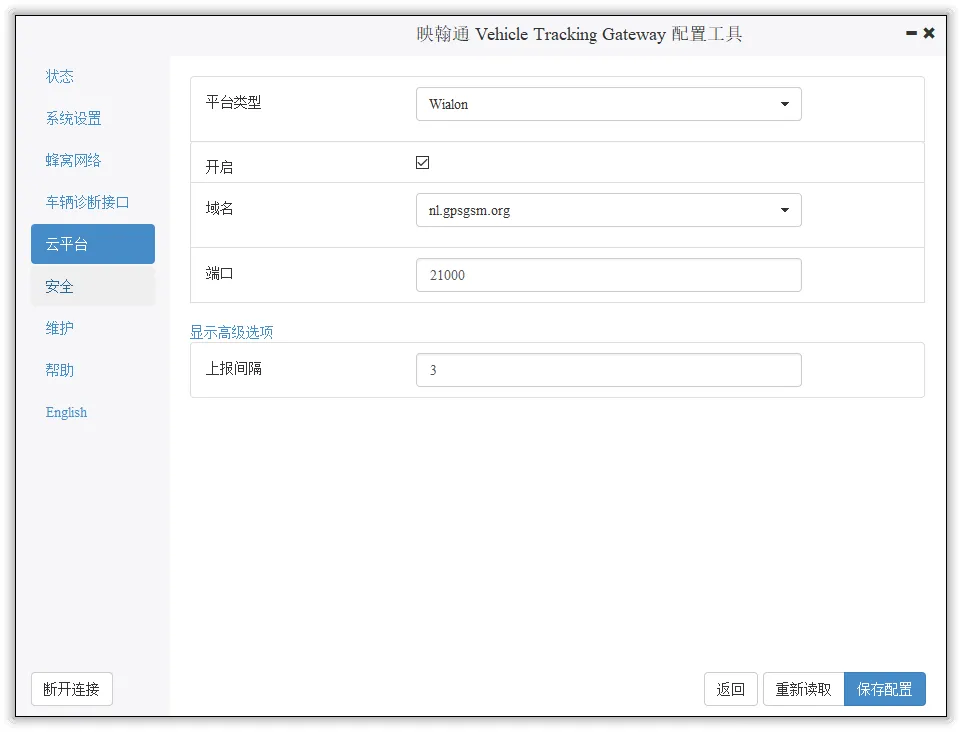</p>

<p align="center"><strong>图 3-11 Wialon 平台常规配置</strong></p>

> **提示**：若用户已获得 Wialon 提供的独立域名，应在"自定义域名"字段中填写该域名及对应端口号，而非从下拉菜单选择。

<p align="center"></p>

<p align="center"><strong>图 3-12 Wialon 自定义域名配置</strong></p>

#### 第二部分：Wialon 平台端操作

5. 打开浏览器，访问 Wialon 平台登录地址：[https://hosting.wialon.com](https://hosting.wialon.com)，使用已有账号登录。
6. 在平台中新增设备，按以下信息填写设备添加表单：

| 字段 | 填写说明 |
|------|----------|
| 名称 | 自定义，建议使用便于识别的设备名称 |
| 装置类型 | 选择"Wialon Combine" |
| 特制ID | 填写设备序列号（SN）。序列号可在设备标签或配置工具"状态"页面的"序列号"字段中查看 |

<p align="center"></p>

<p align="center"><strong>图 3-13 Wialon 平台新增设备界面</strong></p>

<p align="center"></p>

<p align="center"><strong>图 3-14 填写特制 ID（SN）</strong></p>

#### 第三部分：查看设备上传数据

7. 在 Wialon 平台中，按以下顺序操作查看设备上报数据：
   - 选择"Message"菜单。
   - 选择待查看的目标装置名称。
   - 设置感兴趣的时间区间。
   - 选择数据类型（IO 数据通过"Raw data"类型显示）。
   - 点击"Execute"按钮，即可在下方区域查看目标装置的信息。

<p align="center"></p>

<p align="center"><strong>图 3-15 平台查看上传数据</strong></p>

> **提示**：用户可通过下图所示的配置方式，自主选择需要展示的信息列。

<p align="center">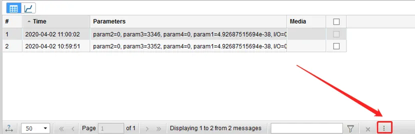</p>

<p align="center"><strong>图 3-16 平台端信息显示配置</strong></p>


### 场景7：Azure IoT Hub接入

**目标**：将 VT200 设备通过 Azure IoT Hub 云平台接入，实现设备与云端的双向通信与数据上报。

**前提**：VT200 设备已完成基本网络配置可正常联网，已注册 Microsoft Azure 账号并创建 IoT Hub 实例。

**预计用时**：约10分钟。

> Azure IoT Hub 是微软提供的云托管解决方案后端，支持 IoT 应用程序与设备之间的双向安全通信。该平台提供每台设备的身份验证、内置设备管理和弹性扩展能力，可将解决方案从云端扩展到边缘。更多信息可访问：[https://azure.microsoft.com/zh-cn/services/iot-hub](https://azure.microsoft.com/zh-cn/services/iot-hub)

**操作步骤**：

#### 第一部分：Azure IoT 平台端配置

1. 登录 Azure IoT 平台。在 IoT 中心导航菜单中，打开"IoT 设备"，然后选择"新建"（+New）以添加设备。

<p align="center">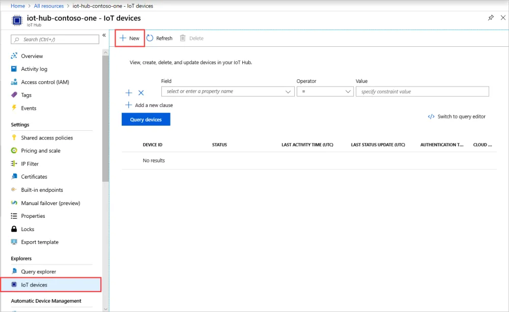</p>

<p align="center"><strong>图 3-17 Azure 平台新建 IoT 设备</strong></p>

2. 在"创建设备"页面中，输入新设备的名称（例如 `myDeviceId`），然后选择"保存"。此操作将为 IoT 中心创建一个设备标识。

<p align="center"></p>

<p align="center"><strong>图 3-18 Azure 平台填写设备名称</strong></p>

3. 设备创建完成后，在"IoT 设备"窗格的列表中打开该设备，复制"主连接字符串"（Primary Connection String）。该字符串将在后续设备端配置中使用。

<p align="center">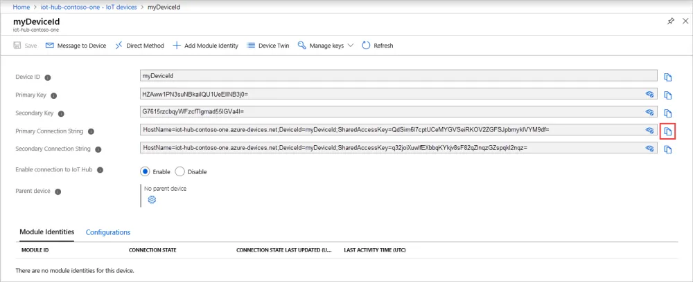</p>

<p align="center"><strong>图 3-19 复制主连接字符串</strong></p>

#### 第二部分：设备端配置

4. 打开配置工具，进入【云平台】页面，将"平台类型"设置为"Azure IoT"。在"连接字符串"字段中，粘贴上一步从 Azure IoT 平台复制的主连接字符串。完成后点击"保存配置"并"重启"设备。

<p align="center">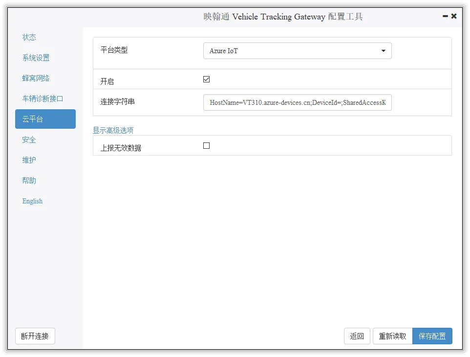</p>

<p align="center"><strong>图 3-20 设备端填写连接字符串</strong></p>

5. （可选）若需要显示无效数据，可点击"显示高级选项"展开隐藏配置项，勾选"显示无效数据"。

<p align="center"></p>

<p align="center"><strong>图 3-21 勾选显示无效数据选项</strong></p>

**验证方法**：设备重启后，在云平台页面确认连接状态显示为"已连接"。


### 场景8：AWS IoT平台接入

**目标**：配置 VT200 设备接入 Amazon AWS IoT Core 平台，实现云端数据通信与消息订阅。

**前提**：拥有可用的 AWS IoT Core 控制台访问权限，设备已完成基本网络配置。

**预计用时**：约15分钟。

> AWS IoT Core 支持将 IoT 设备连接到 AWS 云，无需配置或管理服务器，可支持数十亿台设备和数万亿条消息的安全路由。借助 AWS IoT Core，应用程序可随时跟踪所有设备并与其通信，即使设备未处于连接状态。更多信息可访问 [https://aws.amazon.com/cn/iot-core](https://aws.amazon.com/cn/iot-core/)。

**操作步骤**：

#### 方式一：AWS 创建物品方式连接

1. 进入 Amazon IoT 控制台 → Things 页面，点击"Create"创建物品。

<p align="center">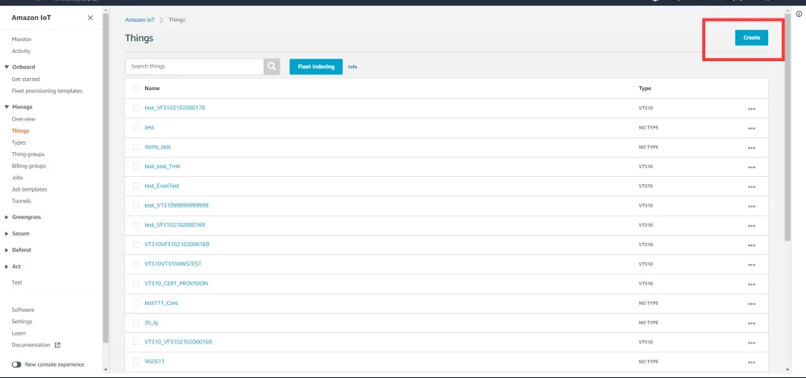</p>

<p align="center"><strong>图 3-22 AWS 控制台创建物品</strong></p>

选择 Amazon IoT → Things → Create a single thing。

<p align="center">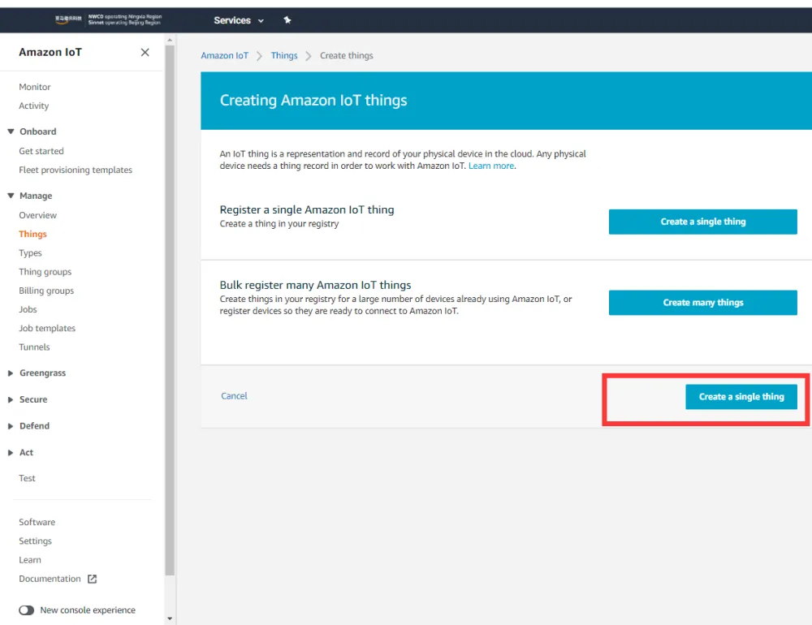</p>

<p align="center"><strong>图 3-23 创建单个物品</strong></p>

在 Add your device to the thing registry → Add certificate 页面中，为该物品创建证书。

<p align="center"></p>

<p align="center"><strong>图 3-24 创建设备证书</strong></p>

2. 下载证书文件：
   - 下载数字证书文件（A certificate for the thing），格式为 `***.cert.pem`。
   - 下载私钥文件（A private key），格式为 `***.private.key`。
   - 车载追踪器内已内置 AWS 的 CA 文件，通常无需下载。若需更新，可点击"A root CA for Amazon IoT Download"。
   - 点击"Activate"对证书进行激活。
   - 点击"Attach a policy"，进入附加策略页面。

<p align="center"></p>

<p align="center"><strong>图 3-25 下载证书并激活</strong></p>

在附加页面内勾选该证书的附加策略，同时点击"Register Thing"注册该物品。

<p align="center"></p>

<p align="center"><strong>图 3-26 附加策略并注册物品</strong></p>

3. 配置工具导入证书文件至车载追踪器：
   - 进入【安全】→【导入数字证书】，选择已下载的 `***.cert.pem` 文件，点击"导入证书"。
   - 进入【安全】→【导入私钥证书】，选择已下载的 `***.private.key` 文件，点击"导入文件"。
   - 若需更新 CA 证书，进入【安全】→【导入CA证书】，选择对应文件并导入。

<p align="center"></p>

<p align="center"><strong>图 3-27 配置工具导入证书和私钥</strong></p>

4. 启用 AWS 平台连接：
   - 进入【云平台】页面，平台类型选择"AWS IoT"，勾选"开启"。
   - 填写域名（从 AWS IoT → Things → 选择被创建的物品 → Interact 选项内复制 Endpoint 地址）。

<p align="center">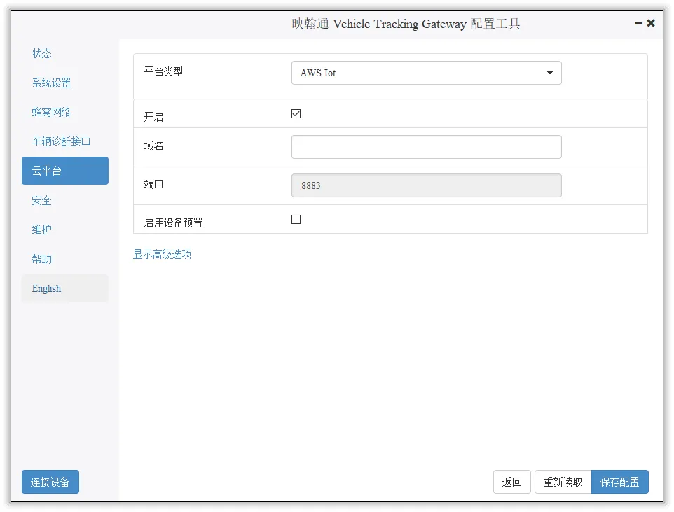</p>

<p align="center"><strong>图 3-28 开启 AWS IoT 连接</strong></p>

<p align="center"></p>

<p align="center"><strong>图 3-29 AWS 控制台获取 Endpoint 域名</strong></p>

5. 保存配置后重启设备，在云平台页面观察连接状态。

<p align="center"></p>

<p align="center"><strong>图 3-30 检查云平台连接状态</strong></p>

6. （可选）默认不上报不存在的数据。如需上报，可点击"显示高级选项"，勾选"上报无效数据"，勾选后不存在的数据值将显示为 NULL。

<p align="center"></p>

<p align="center"><strong>图 3-31 上报无效数据选项</strong></p>

#### 方式二：AWS 创建预置模板连接

1. 创建预置模板：进入 Amazon IoT → Fleet provisioning templates → Create。

<p align="center"></p>

<p align="center"><strong>图 3-32 创建预置模板</strong></p>

创建证书：进入 Amazon IoT → Certificates。

<p align="center"></p>

<p align="center"><strong>图 3-33 创建证书</strong></p>

在 Add certificate 页面为物品创建证书。

<p align="center"></p>

<p align="center"><strong>图 3-34 为物品添加证书</strong></p>

2. 下载证书文件：
   - 下载数字证书文件（`***.cert.pem`）和私钥文件（`***.private.key`）。
   - 车载追踪器内已内置 AWS CA 文件，若需更新可点击下载。
   - 点击"Activate"激活证书，点击"Attach a policy"进入附加策略页面。

<p align="center"></p>

<p align="center"><strong>图 3-35 下载证书并激活</strong></p>

进入证书列表，完成认证。

<p align="center"></p>

<p align="center"><strong>图 3-36 证书列表认证</strong></p>

进入 Amazon IoT → Policy 列表，完成添加策略。

<p align="center"></p>

<p align="center"><strong>图 3-37 添加策略</strong></p>

3. 配置工具导入证书文件至车载追踪器：
   - 进入【安全】→【导入数字证书】，选择 `***.cert.pem` 文件导入。
   - 进入【安全】→【导入私钥证书】，选择 `***.private.key` 文件导入。
   - 若需更新 CA 文件，进入【安全】→【导入CA证书】，选择对应 `***.cert` 文件导入。

<p align="center"></p>

<p align="center"><strong>图 3-38 配置工具导入证书</strong></p>

4. 启用 AWS 平台连接：
   - 进入【云平台】页面，平台类型选择"AWS IoT"，勾选"开启"，填写域名。

<p align="center"></p>

<p align="center"><strong>图 3-39 开启 AWS IoT 连接（预置模板）</strong></p>

> **注意**：当在 AWS 平台创建的是预置模板时，配置工具中应启用"设备预置"，勾选开启并填入预置模板名称（名称可在 AWS IoT → Fleet provisioning templates 中查看）。

在 AWS IoT → Things → 选择被创建的物品 → Interact 选项内复制 Endpoint 地址，填入域名字段。

<p align="center"></p>

<p align="center"><strong>图 3-40 获取 Endpoint 域名</strong></p>

5. 保存配置后重启设备，在云平台页面观察连接状态。

<p align="center">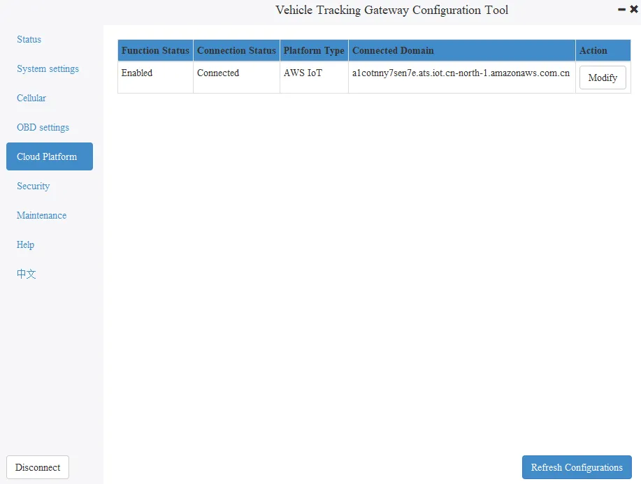</p>

<p align="center"><strong>图 3-41 检查云平台连接状态</strong></p>

#### 连通性测试：订阅与发布

完成配置后，可通过 AWS IoT 控制台的 Test 功能进行连通性验证。

1. 进入 Amazon IoT → Test 页面。

<p align="center"></p>

<p align="center"><strong>图 3-42 AWS IoT 测试页面</strong></p>

2. 在 Subscription topic 文本框内填入需订阅的 topic。例如：`v1/<设备SN>/motion/info`。

<p align="center"></p>

<p align="center"><strong>图 3-43 填入订阅 Topic</strong></p>

3. VT200 默认会上报 GNSS、Sysinfo、Motion、Cellular1、IO、OBD 这几个保留组的消息，订阅对应 topic 即可接收数据。

<p align="center"></p>

<p align="center"><strong>图 3-44 接收订阅消息</strong></p>

> **参考**：更多参数信息可查阅 API 文档《FlexAPI_over_MQTT_Reference_for_3rd_party_platform_VT310.pdf》。


### 场景9：Aliyun IoT平台接入

**目标**：通过阿里云物联网平台实现 VT200 设备托管与安全通信。

**前提**：已创建阿里云账户并开通物联网实例服务，设备已完成基本网络配置。

**预计用时**：约10分钟。

> 阿里云企业物联网平台提供全托管的实例服务，无需自建物联网基础设施即可接入和管理设备，具有低成本、高可靠、高性能、易运维的优势，支持数据分析与可视化展示以及实时安全威胁检测。了解更多可访问阿里云产品页面 [https://www.aliyun.com/product/iot](https://www.aliyun.com/product/iot)。

**操作步骤**：

#### 方式一：一机一密认证

详细使用方式可参考：[https://help.aliyun.com/document_detail/74006.html](https://help.aliyun.com/document_detail/74006.html)

<p align="center"></p>

<p align="center"><strong>图 3-45 一机一密认证配置概览</strong></p>

1. 登录阿里云控制台，进入 IoT Platform → Device → Devices → Device Details，创建设备并查看 DeviceSecret。

<p align="center">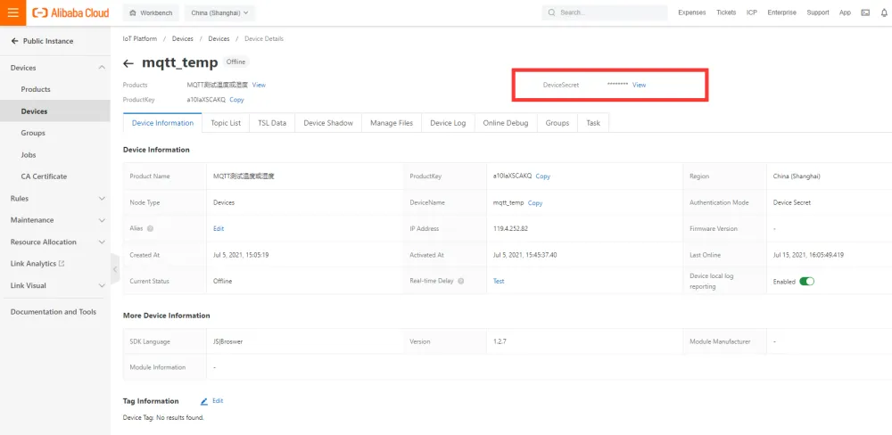</p>

<p align="center"><strong>图 3-46 阿里云创建设备查看详情</strong></p>

2. 复制设备的 Device Certificate，包括 `ProductKey`、`DeviceName`、`DeviceSecret` 三个参数。

<p align="center"></p>

<p align="center"><strong>图 3-47 获取设备三元组参数</strong></p>

3. 打开配置工具，进入【云平台】页面，平台类型选择"Aliyun IoT"，勾选"开启"，安全认证模式选择"一机一密"。将从阿里云获得的 `ProductKey`、`DeviceName`、`DeviceSecret` 分别填入配置工具对应字段。需在物联网平台控制台左上角确认服务所在地域，Region ID 的取值可参见[地域和可用区](https://help.aliyun.com/document_detail/40654.htm#concept-2459516)。

<p align="center"></p>

<p align="center"><strong>图 3-48 设备端填写一机一密参数</strong></p>

4. 点击"保存配置"并重启设备。

#### 方式二：一型一密认证

详细使用方式可参考：[https://help.aliyun.com/document_detail/74006.html](https://help.aliyun.com/document_detail/74006.html)

1. 登录阿里云控制台，进入 IoT Platform → Devices → Product Details，创建设备并查看 ProductSecret。

<p align="center"></p>

<p align="center"><strong>图 3-49 阿里云产品详情页面</strong></p>

<p align="center"></p>

<p align="center"><strong>图 3-50 查看产品 Secret</strong></p>

2. 复制 Product Certificate，包括 `ProductSecret` 和 `ProductKey`。

<p align="center">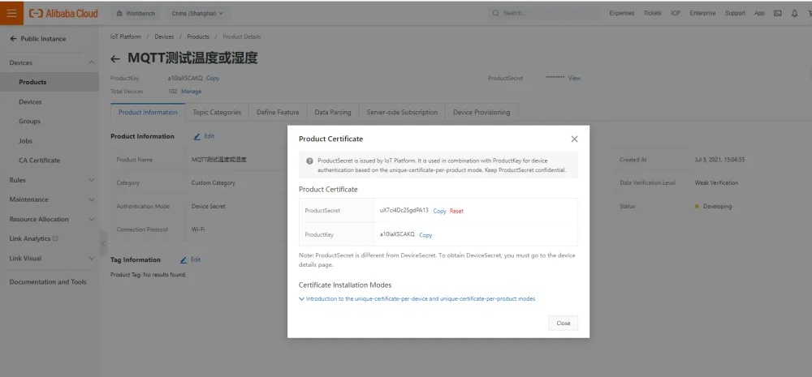</p>

<p align="center"><strong>图 3-51 获取一型一密产品级参数</strong></p>

3. 打开配置工具，进入【云平台】页面，平台类型选择"Aliyun IoT"，勾选"开启"，安全认证模式选择"一型一密"。

> **说明**：若使用一型一密预注册认证方式接入设备，需在已创建产品下[批量添加设备](https://help.aliyun.com/document_detail/89261.htm?spm=a2c4g.11186623.2.11.6f8d1f00hIJEXj#task-av2-fcw-y2b)或[单个添加设备](https://help.aliyun.com/document_detail/73729.htm?spm=a2c4g.11186623.2.12.6f8d1f00hIJEXj#task-yk1-rnl-vdb)。因设备激活时会校验 DeviceName，建议采用可直接从设备中读取到的 ID（如 MAC 地址、IMEI 或 SN 码）作为 DeviceName。添加设备成功后，物联网平台为设备颁发 DeviceSecret，设备初始状态为**未激活**。

4. 将从阿里云获得的 `DeviceName`、`ProductSecret` 和 `ProductKey` 分别填入配置工具对应字段。需在物联网平台控制台左上角确认服务所在地域，Region ID 的取值可参见[地域和可用区](https://help.aliyun.com/document_detail/40654.htm#concept-2459516)。

<p align="center"></p>

<p align="center"><strong>图 3-52 设备端填写一型一密参数</strong></p>

5. 点击"保存配置"并重启设备。


### 场景10：MQTT / ThingsBoard接入

**目标**：配置设备直接连接至标准 MQTT Broker 或开源 ThingsBoard 平台，实现数据上报。

**前提**：MQTT（Message Queuing Telemetry Transport，可以理解为：一种专为物联网设备设计的轻量级"消息投递协议"，让设备与服务器之间通过发布/订阅模式高效传输数据）服务端已部署，或已注册 ThingsBoard 账号。设备已完成基本网络配置。

**预计用时**：约5分钟。

> MQTT 是轻量级基于代理的发布/订阅消息传输协议，设计思想是开放、轻量、易于实现，适用于网络带宽低、设备资源有限的受限环境。支持 MQTT 的开源平台包括 ThingsBoard、EMQ 等，用户可基于这些开源软件构建物联网平台。

**操作步骤**：

#### 子部分A：标准 MQTT Broker 接入

1. 在配置工具中，进入【云平台】页面，将"平台类型"设置为"Mqtt Broker"。
2. 勾选"开启"，填写服务端的"域名"、"端口"、"用户名"和"密码"。
3. 点击"保存配置"并"重启"设备使配置生效。

<p align="center">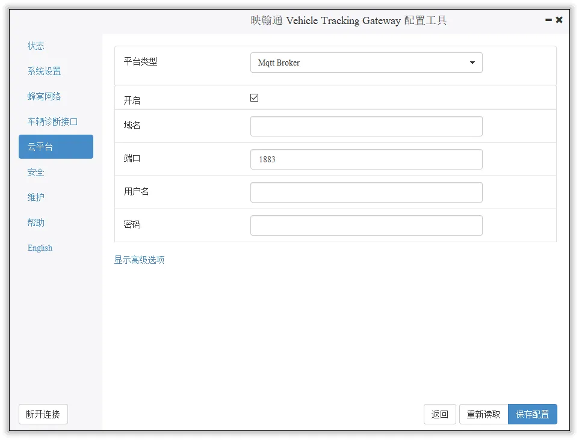</p>

<p align="center"><strong>图 3-53 标准 MQTT Broker 接入配置</strong></p>

4. （可选）若需显示无效数据，可点击"显示高级选项"展开隐藏配置项，勾选"显示无效数据"。

<p align="center"></p>

<p align="center"><strong>图 3-54 MQTT 高级选项</strong></p>

#### 子部分B：ThingsBoard 平台接入

ThingsBoard 是一个开源物联网平台，用于数据收集、处理、可视化和设备管理，通过 MQTT、CoAP 和 HTTP 等行业标准协议实现设备连接，支持云和本地部署。更多信息可访问 [https://thingsboard.io](https://thingsboard.io/)。

<p align="center">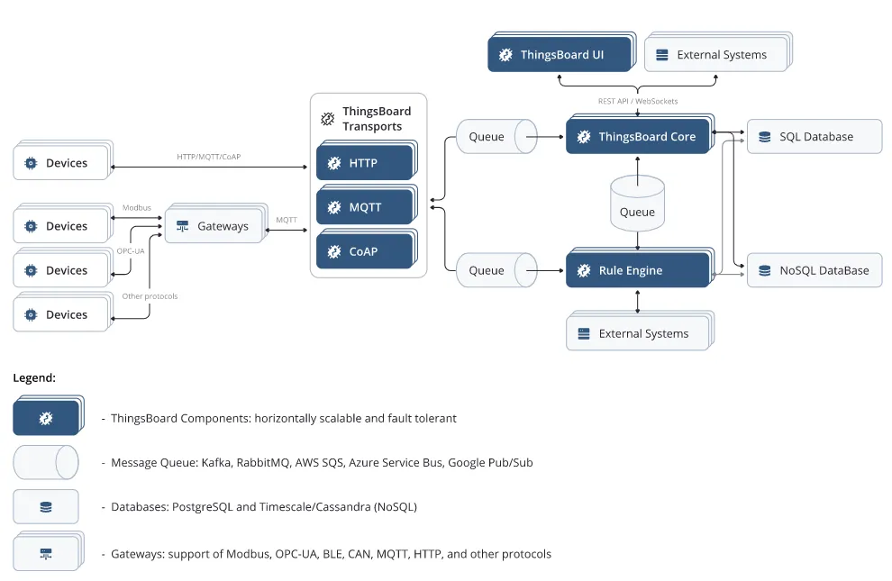</p>

<p align="center"><strong>图 3-55 ThingsBoard 平台架构</strong></p>

1. 登录 ThingsBoard 平台，注册账号并添加设备。添加设备后，打开设备的 Device Credentials → MQTT Basic，获取 `Client ID`、`User Name` 和 `Password` 参数。更多配置信息可访问：[https://thingsboard.io/docs/getting-started-guides](https://thingsboard.io/docs/getting-started-guides)。

<p align="center"></p>

<p align="center"><strong>图 3-56 ThingsBoard 平台获取设备凭证</strong></p>

2. 返回配置工具，在【云平台】页面填入 ThingsBoard 服务端域名（如 `thingsboard.cloud`）、端口号（`1883`）、用户名及密码。点击"保存配置"并"重启"设备。

<p align="center">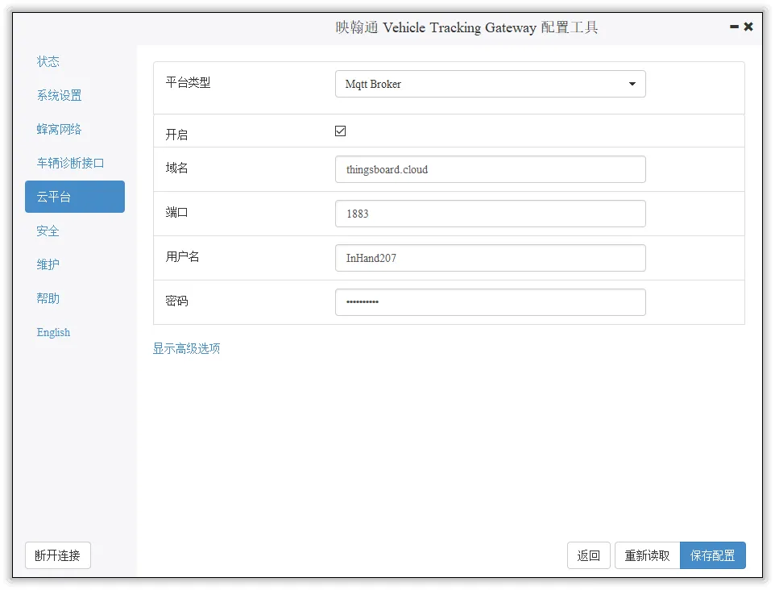</p>

<p align="center"><strong>图 3-57 设备端填写 ThingsBoard 参数</strong></p>


---

## 第4章 功能说明与参数参考

### 4.1 系统维护与管理

VT200 支持多种固件升级方式，包括本地配置工具升级、串口连接 xshell 升级以及 OTA（Over-The-Air）升级（阿里云标准 OTA、SmartFleet 平台 OTA、FlexAPI 批量升级等）。本节仅介绍本地配置工具升级方式。更多升级方式可咨询映翰通技术支持人员。

#### 4.1.1 固件升级

1. 点击"维护"进入维护功能页面，选择【InTracker固件升级】进入升级页面。

<p align="center"></p>

<p align="center"><strong>图 4-1 固件升级入口页面</strong></p>

2. 点击"浏览文件"选择固件文件，然后点击"升级"并等待固件安装完成。

<p align="center">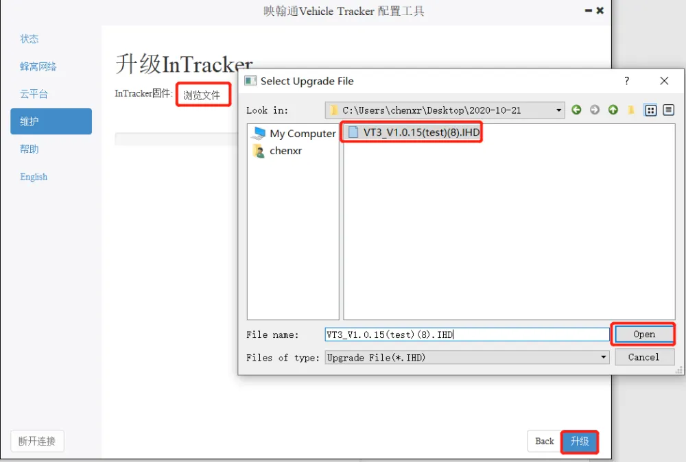</p>

<p align="center"><strong>图 4-2 浏览并选择固件文件</strong></p>

3. 当弹出提示框"将在重启 InTracker VT200 后切换到最新版本"时，表示新固件导入成功。点击"重启"执行固件升级。

<p align="center">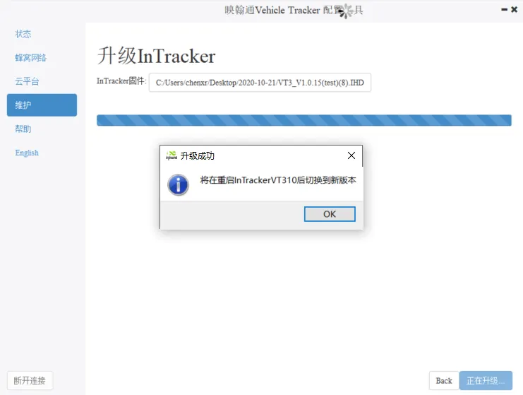</p>

<p align="center"><strong>图 4-3 固件导入成功提示</strong></p>

> **注意**：设备升级完成后，需重启再进行配置使用。

#### 4.1.2 FlexAPI 恢复出厂设置

进入【维护】→【FlexAPI 恢复出厂设置】，点击执行可重置 FlexAPI 相关设置。

<p align="center"></p>

<p align="center"><strong>图 4-4 FlexAPI 恢复出厂设置</strong></p>

#### 4.1.3 导入/导出配置

设备配置支持备份与恢复功能，通过【维护】→【导入/配置文件】页面操作。

<p align="center">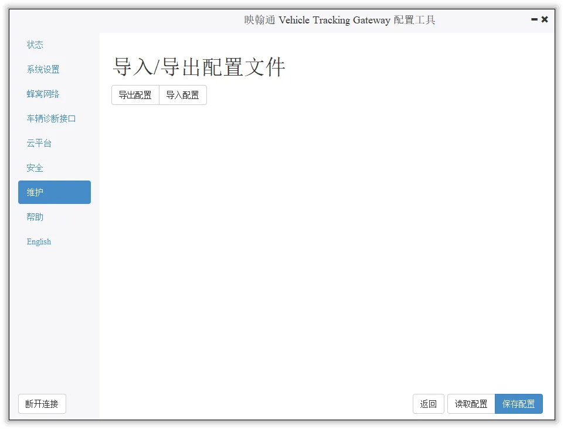</p>

<p align="center"><strong>图 4-5 导入导出配置文件界面</strong></p>

**导出配置**：

1. 点击"导出配置"，配置工具将读取设备当前配置。
2. 在弹出的文件存储窗口中，在 File name 文本框填写备份文件名称，然后点击"Open"按钮保存。

<p align="center">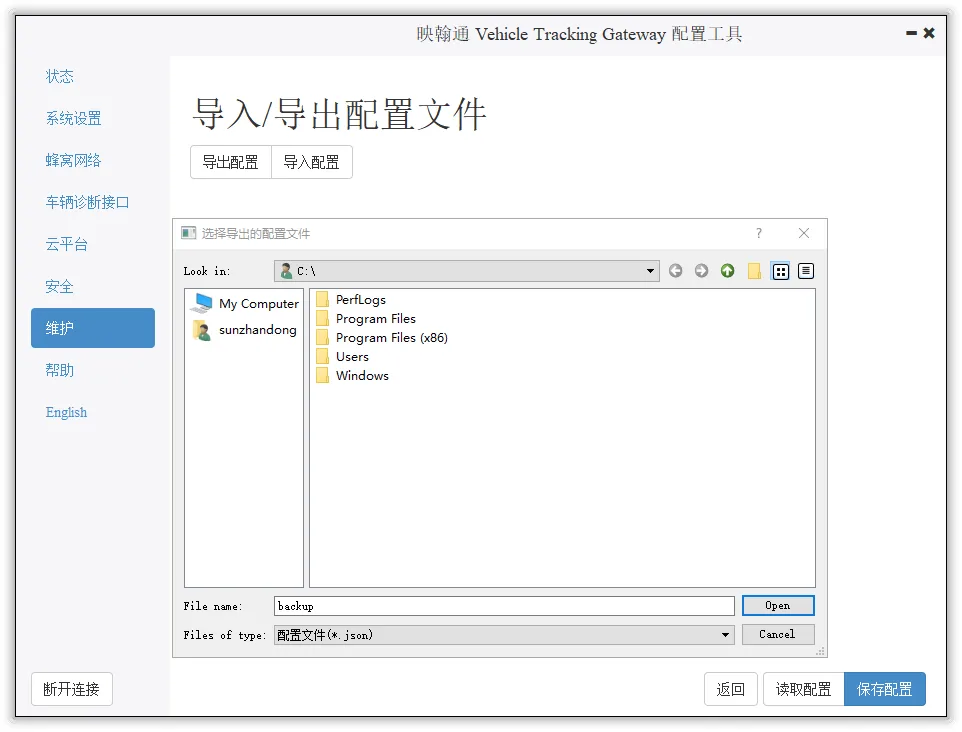</p>

<p align="center"><strong>图 4-6 导出配置文件存储窗口</strong></p>

**导入配置**：

点击"导入配置"并选择之前备份的配置文件即可恢复设备配置。

> **注意**：导出的配置文件默认不包含用户名和密码。若需要在新设备中导入修改后的用户名密码，可在导出的 JSON 配置文件中手动添加：在 `"user":""` 的引号内填入管理员账户，在 `"passwd":""` 的引号内填入管理员密码。修改保存后导入新设备，设备重启后使用新的管理员账号和密码登录。

<p align="center">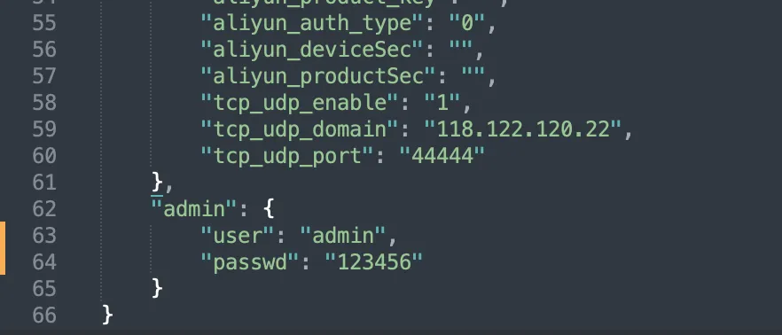</p>

<p align="center"><strong>图 4-7 配置文件中添加用户名密码</strong></p>


### 4.2 日志获取（CLI模式）

VT200 支持通过 CLI（命令行接口）模式获取设备运行日志，便于故障排查与状态分析。用户需通过 USB 转串口配置线将设备与电脑相连，并借助串口调试软件完成操作。

#### 4.2.1 连接设备与配置终端

使用 USB 转串口配置线将电脑与 VT200 连接。在电脑上打开一款串口调试软件（例如可从 Microsoft Store 下载的串口调试工具）。

<p align="center"></p>

<p align="center"><strong>图 4-8 串口调试软件</strong></p>

#### 4.2.2 配置串口参数并打开串口

1. 打开串口调试软件，选择对应的串口端口。串口默认参数为 **115200/8/N/1**。
2. 将字符编码模式（Character encoding）设置为 **ASCII**，断行模式（Line break）设置为 **\n(LF)**。
3. 点击 **Open serial port** 打开串口连接。

<p align="center">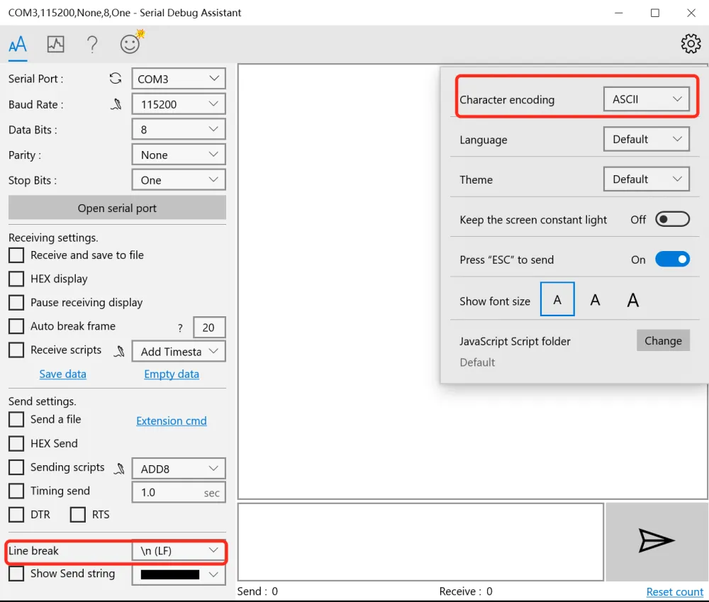</p>

<p align="center"><strong>图 4-9 串口参数设置</strong></p>

#### 4.2.3 进入 CLI 模式

1. 在发送文本框中输入 `+++`，点击发送，以激活 CLI 模式。

<p align="center"></p>

<p align="center"><strong>图 4-10 激活 CLI 模式</strong></p>

2. 输入用户名 `admin`（按回车键），点击发送。
3. 输入密码 `123456`（按回车键），点击发送。认证通过后即进入命令行模式。

<p align="center"></p>

<p align="center"><strong>图 4-11 输入用户名</strong></p>

<p align="center"></p>

<p align="center"><strong>图 4-12 输入密码进入命令行</strong></p>

#### 4.2.4 开启日志输出

在发送文本框中输入以下命令并按回车，点击发送：

```
log console enable
```

执行成功后，接收窗口将持续显示设备的实时日志信息。

<p align="center"></p>

<p align="center"><strong>图 4-13 开启日志输出</strong></p>

#### 4.2.5 关闭日志输出

在发送文本框中输入以下命令并按回车，点击发送：

```
log console disable
```

执行后，接收窗口将停止显示日志信息。

<p align="center"></p>

<p align="center"><strong>图 4-14 关闭日志输出</strong></p>

#### 4.2.6 退出 CLI 模式

日志获取完成后，若需退出 CLI 模式以恢复配置工具的串口连接，可在发送文本框中输入以下命令并按回车，点击发送：

```
exit
```

随后关闭串口。若未手动退出，设备将在 **180 秒**后自动退出 CLI 模式。

---

## 附录 故障处理

### 1 网络连接问题

| 现象 | 可能原因 | 排查步骤 | 对应章节 |
|------|----------|----------|----------|
| 无法连接蜂窝网络 | SIM卡未插入或接触不良 | 1. 检查SIM卡是否正确插入<br>2. 确认Micro-SIM卡截止角指向插槽内侧<br>3. 重新插拔SIM卡 | [安装与首次使用](#第2章-安装与首次使用) |
| 无法连接蜂窝网络 | APN参数配置错误 | 1. 核对APN参数是否与运营商提供的一致<br>2. 检查认证模式选择是否正确<br>3. 联系运营商确认参数 | [场景3：配置蜂窝网络](#场景3配置蜂窝网络) |
| 无法连接蜂窝网络 | 天线未连接或信号弱 | 1. 检查4G天线是否连接至ANT接口<br>2. 检查Cellular指示灯状态<br>3. 调整设备或天线位置 | [安装与首次使用](#第2章-安装与首次使用) |

### 2 设备启动问题

| 现象 | 可能原因 | 排查步骤 | 对应章节 |
|------|----------|----------|----------|
| 设备无法启动 | 设备处于运输模式 | 1. 确认已通过外部电源或车辆诊断接口激活设备<br>2. 检查电源线连接是否正确（PIN20负极、PIN10正极） | [安装与首次使用](#第2章-安装与首次使用) |
| 设备无法启动 | 电源供电异常 | 1. 检查电源适配器是否正常工作<br>2. 确认V+和IGT均连接到电源正极侧 | [安装与首次使用](#第2章-安装与首次使用) |
| 指示灯全部熄灭 | 设备未上电或供电不足 | 1. 检查20PIN接口连接是否牢固<br>2. 更换电源适配器测试 | [指示灯说明](#指示灯说明) |

### 3 云平台连接问题

| 现象 | 可能原因 | 排查步骤 | 对应章节 |
|------|----------|----------|----------|
| 云平台连接状态显示"未链接" | 蜂窝网络未连通 | 1. 确认蜂窝网络已配置且拨号成功<br>2. 检查Cellular指示灯是否为快速闪烁状态 | [场景3：配置蜂窝网络](#场景3配置蜂窝网络) |
| 云平台连接状态显示"未链接" | 平台参数配置错误 | 1. 核对平台类型、域名、端口等参数<br>2. 确认已勾选"开启"<br>3. 保存配置后重启设备 | [场景5～10](#场景5smartfleet云平台接入) |
| 云平台连接状态显示"未链接" | 证书文件未导入（AWS IoT） | 1. 确认已正确导入数字证书和私钥文件<br>2. 确认证书已在平台端激活 | [场景8：AWS IoT平台接入](#场景8aws-iot平台接入) |

### 4 配置工具连接问题

| 现象 | 可能原因 | 排查步骤 | 对应章节 |
|------|----------|----------|----------|
| 配置工具无法连接设备 | COM端口选择错误 | 1. 在设备管理器中确认正确的COM端口号<br>2. 重新选择端口并连接 | [安装与首次使用](#第2章-安装与首次使用) |
| 配置工具无法连接设备 | 设备处于CLI模式 | 1. 等待180秒自动退出CLI模式<br>2. 或在串口中输入exit命令退出 | [4.2 日志获取](#42-日志获取cli模式) |
| 配置工具报错 | 权限不足 | 1. 右键选择"以管理员身份运行"打开配置工具 | [安装与首次使用](#第2章-安装与首次使用) |

---

## 附录 命令行/高级参考

### OBD协议已适配车型

VT200 的 OBD 诊断接口已对市场上多款主流重型及商用车辆进行适配。以下为部分已适配车型：

- 东风天龙
   - 北汽欧曼（BJ4259SNHKB-AA）
   - 依维柯（NJ1045EFCS）
- 东风天锦
   - 依维柯（NJ6725DC）
   - 依维柯（NJ6605DC）
- 中国重汽豪沃
   - 宇通重工
   - 北汽福田

### 车载诊断协议介绍

#### J1939 协议

J1939 是专门针对重型车辆（卡车和客车）开发的一种 SAE 规范。该协议旨在推广用于带微控制器的模块之间通信的标准，以更经济的方式在设备之间进行数据传送。J1939 主要定义了物理层，常见的运行在其上的高层协议包括 SAE J1587（TMC/SAE 联合的供电子数据交换的微机系统在重型车）和 SAE J1922（用于中型和重型公路用柴油车电控传动接口）。

#### J1708 协议

J1708 是专门针对重型车辆（卡车和客车）开发的一种 SAE 规范。该协议旨在推广用于带微控制器的模块之间通信的标准，以更经济的方式在设备之间进行数据传送。J1708 主要定义了物理层，常见的运行在 J1708 之上的高层协议包括 SAE J1587（TMC/SAE 联合的供电子数据交换的微机系统在重型车）和 SAE J1922（用于中型和重型公路用柴油车电控传动接口）。

