# 车载追踪网关VT300系列用户手册

## 声明

首先非常感谢您选择本公司产品！在使用前，请您仔细阅读本用户手册，遵守以下声明，将有助于维护知识产权和法律合规性，以确保您的使用体验与产品的最新信息相一致。如有任何疑问或需要获取书面许可，请随时联系我们的技术支持团队。

- 版权声明

本用户手册包含受版权保护的内容，版权归北京映翰通网络技术股份有限公司及其许可者所有。未经书面许可，任何单位和个人不得擅自摘抄、复制本手册的部分或全部内容，且不得以任何形式传播。

- 免责声明

由于产品技术和规格不断更新，本公司不能承诺用户手册中的资料与实际产品完全一致。因此，不承担由于实际技术参数与用户手册不符而引起的任何争议。任何关于产品的改动恕不提前通知，本公司保留最终更改权和解释权。

- 版权信息

本用户手册内容受版权法律保护，版权归北京映翰通网络技术股份有限公司及其许可者所有，保留一切权利。未经书面许可，不得擅自使用、复制或传播本手册的内容。

## 图形界面约定

| 符号 | 含义 | 示例 |
|------|------|------|
| `< >` | 表示按钮名称，需替换为实际值 | 点击`<确定>`按钮 |
| `" "` | 表示窗口名、菜单名等界面上的文字标签 | 弹出"新建用户"窗口 |
| `→` | 表示菜单层级或操作顺序 | 【网络】→【蜂窝】 |
| `【 】` | 表示菜单或页面名称 | 进入【系统设置】页面 |
| `>>` | 表示多级菜单路径 | "文件>>新建>>文件夹"表示"文件"菜单下的"新建"子菜单下的"文件夹"菜单项 |
|  | 提醒操作中应注意的事项，不当的操作可能会导致数据丢失或者设备损坏。 | - |
|  | 对操作内容的描述进行必要的补充和说明。 | - |

## 技术支持

**北京映翰通网络技术股份有限公司（总部）**

电话：010-8417 0010

地址：北京市朝阳区紫月路18号院3号楼5层

**成都办事处**

电话：028-8679 8244

地址：四川省成都市武侯区天府大道北段1777号中国太平金融大厦14层

**广州办事处**

电话：020-8562 9571

地址：广州市天河区棠东东路5号远洋新三板创意园B-130单元

**武汉办事处**

电话：027-8716 3566

地址：湖北省武汉市洪山区珞瑜东路2号巴黎豪庭11栋2001室

**上海办事处**

电话：021-5480 8501

地址：上海市普陀区顺义路18号1103室

## 如何使用本手册

### 对号入座

- 首次使用用户：建议按顺序阅读「认识设备」→「安装与首次使用」→「常用场景配置」→「功能说明与参数参考」
- 已有设备用户：可直接查阅「功能说明与参数参考」或「附录 故障处理」
- 云平台管理用户：可查阅「常用场景配置」中的设备远程管理平台（如适用）

### 按任务快速跳转

| 任务 | 对应章节 | 预计用时 |
|------|----------|----------|
| 了解设备接口及指示灯状态 | [第1章 认识设备](#第1章-认识设备) | 约5分钟 |
| 插入SIM卡、连线并启动设备 | [第2章 安装与首次使用](#第2章-安装与首次使用) | 约10分钟 |
| 配置蜂窝网络、车载诊断接口或连接云平台 | [第3章 常用场景配置](#第3章-常用场景配置) | 按需 |
| 修改设备参数及日常维护操作 | [第4章 功能说明与参数参考](#第4章-功能说明与参数参考) | 按需 |

# 第1章 认识设备

## 1.1 概述

VT300系列车载追踪网关是一款面向物流运输、工程车辆监控等行业的资产追踪产品，具备接口丰富、性能稳定的特点。该设备支持GNSS（全球导航卫星系统，可以理解为：提供高精度定位和授时服务的卫星系统）精准定位，可实现车辆与驾驶人员状态追踪监控、历史轨迹记录、电子围栏及异常报警等功能。设备提供支持LTE CatM1、Cat1、Cat4等多种速率的无线网络接入子型号。搭配车联网云平台，可实现远程车辆管理、资产追踪及预防式维护，有助于车队运营者降低成本、提升运营效率。

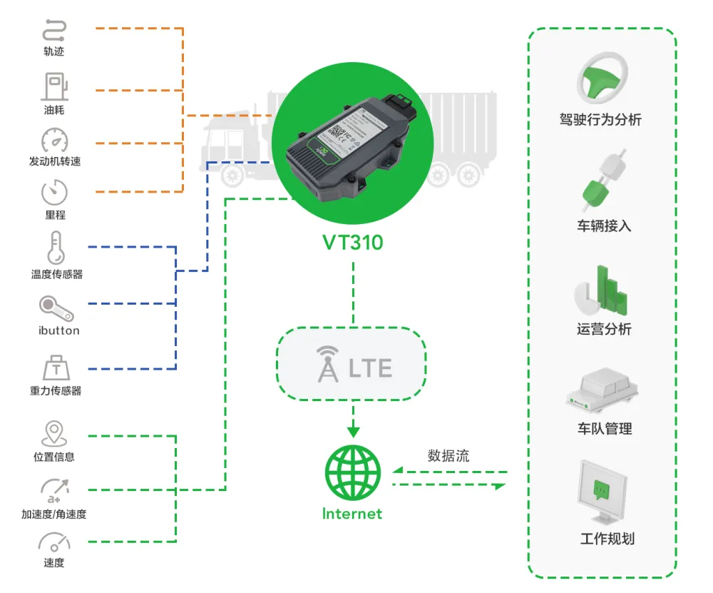

<strong>图 1-1 VT300系列车载追踪网关</strong>

## 1.2 包装清单

### 标配装箱清单

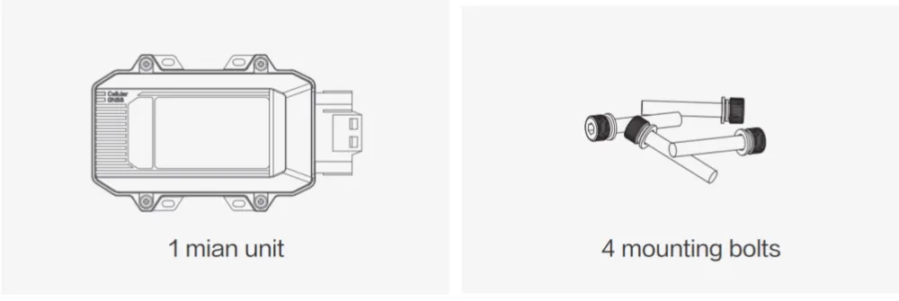

<strong>图 1-2 标配装箱清单</strong>

### 选配配件

选配配件不在默认设备套装内，需根据实际情况选择。

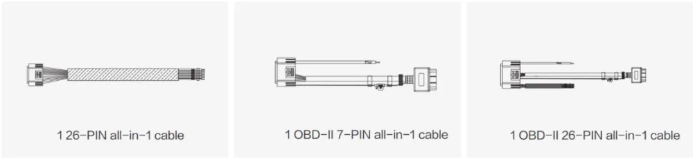

<strong>图 1-3 选配配件</strong>

| 物品 | 订货号 | 规格 |
| :--- | :--- | :--- |
| 26PIN 多合一测试线缆 | SCAB000229 | 线缆分P1-P2端，P1端为26PIN母头接VT310，P2为裸线端，需自备9-48V适配器使用。适用于工程环境或室内测试 |
| OBD-II 7PIN多合一线缆 | SCAB000231 | 线缆分P1-P3端，P1端为26PIN母头接VT310，P2端为OBD-II公头连接车辆，P3为点火信号端子接车辆点火开关。适用于带有OBD-II车辆诊断接口的重型卡车，通过接口为VT310供电 |
| OBD-II 26PIN 多合一线缆 | SCAB000232 | 线缆分P1-P4端，P1端为26PIN母头接VT310，P2端为OBD-II公头连接车辆，P3为裸线端包含I/O、RS232、1-Wire等接口线，P4为点火信号端子接车辆点火开关。适用于带有OBD-II车辆诊断接口的重型卡车，通过接口为VT310供电。需要接入DI、DO、AI、1-Wire设备或车载控制器时建议选择此线缆 |

## 1.3 外观与接口

### VT310系列产品外观

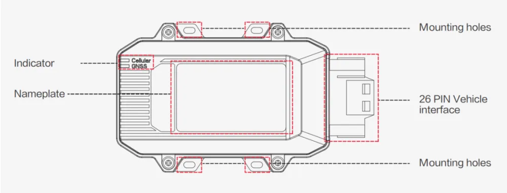

<strong>图 1-4 VT310系列产品外观（正面）</strong>

<strong>图 1-5 VT310系列产品外观（背面）</strong>

## 1.4 指示灯说明

设备出厂状态下处于运输模式，需外接电源或通过车辆诊断接口供电激活VT310后，方可通过状态灯判断设备运行情况。

| 指示灯 | 状态 | 含义 |
|--------|------|------|
| GNSS | 长灭 | 设备未启动或GNSS功能关闭 |
|  | 慢闪（频率1Hz） | GNSS功能开启 |
|  | 快闪（频率0.5Hz） | GNSS授时成功 |
|  | 长亮 | 定位成功 |
| Cellular（蜂窝网络，可以理解为：通过运营商基站提供无线数据连接的移动通信网络） | 长灭 | 设备未启动或拨号功能关闭 |
|  | 慢闪（频率1Hz） | 拨号功能开启 |
|  | 快闪（频率0.5Hz） | 拨号成功 |

## 1.5 恢复出厂设置

由于配置中可能包含设备证书文件，通过硬件方式恢复出厂设置时，仅恢复用户名和密码为默认值（admin / 123456）。

**操作步骤**：

1. 找到设备上的 Reset 按键。
2. 使用螺丝刀或其他工具按住 Reset 按键，持续超过 8 秒。
3. 松开按键，设备将恢复默认账号密码。

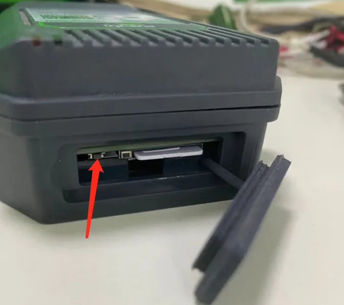

<strong>图 1-6 Reset 按键位置</strong>

> **注意**：双击 Reset 按键可在设备运行出错时重启设备。

## 1.6 默认设置

| 参数 | 默认值 |
| :--- | :--- |
| 管理员账户 | admin |
| 管理员密码 | 123456 |

# 第2章 安装与首次使用

## 2.1 安装前准备

在安装 VT310 设备之前，需准备以下物品和工具：

- 已激活的 SIM 卡（用于蜂窝拨号上网）
- 匹配的线缆（根据应用场景选择，详见 [2.3 线缆连接](#23-线缆连接)）
- 安装螺栓（用于将设备固定在车辆上）
- 9-48V 直流电源适配器（办公室测试场景）
- RS232 转 USB 线缆（用于串口调试和登录设备）

> **注意**：安装前需确认供电电压在 9-48V 直流范围内，超出范围可能导致设备损坏。安装位置应便于接收 GPS 信号，推荐安装在车辆前挡风玻璃下方。

> **注意**：连接线缆时需区分电源正极（V+）与负极（V-），接反可能造成设备损坏。

## 2.2 安装指南

### 2.2.1 安装 SIM 卡

使用蜂窝拨号上网时，需安装 SIM 卡。设备上电启动后将自动进行拨号连接。

安装步骤：
1. 打开 VT310 侧面的防水挡板。
2. 按照下图所示方向将 SIM 卡插入卡槽。

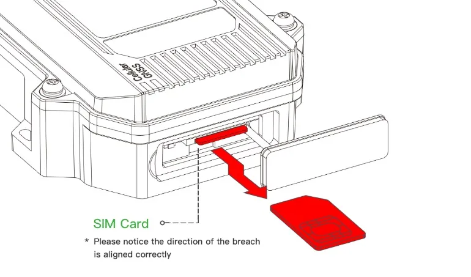

<strong>图 2-1 SIM 卡安装方向</strong>

### 2.2.2 固定设备

可使用安装螺栓将 VT310 固定在车辆上。推荐安装位置为车辆前挡风玻璃下方，该位置有利于接收 GPS 信号，同时便于连接车辆 OBD-II（可以理解为：车载自动诊断系统接口）诊断接口。

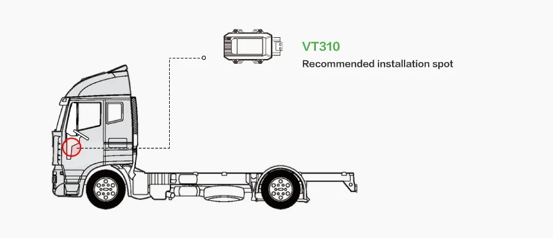

<strong>图 2-2 设备推荐安装位置</strong>

### 2.2.3 线缆连接

VT310 提供三种线缆以适配不同应用场景，以下分别介绍各线缆的接线方式。

**26PIN 多合一测试线缆**

该线缆适用于办公室测试与设备登录场景。配套测试套件包括：9-48V 适配器（或交流转直流 9-48V 供电电源）、RS232 转 USB 线缆等。

**测试套件清单**

| Product Name | 订货号 | 外观 |
| :--- | :--- | :--- |
| DC 5.5*2.1mm Female Connector | ECON000047 |  |
| Power adapter 12V/2A | APWR000122/121 |  |
| USB to 485 / 232 connector | ASER010009 | 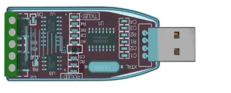 |
| 26PIN All-in-one Test Cable | SCAB000229 | 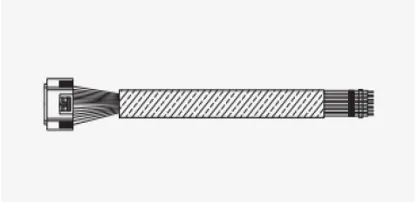 |

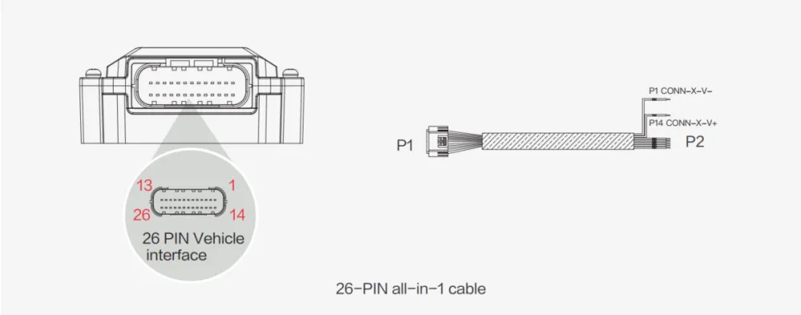

<strong>图 2-3 26PIN 多合一测试线缆连接示意</strong>

**连接步骤**：

1. 将 P1 端 26PIN 母头插入 VT310 接口。
2. 将 P2 裸线端中的 P1 CONN-X-V-（负极）以及 P14 CONN-X-V+（正极）分别接到电源适配器的负极与正极；将 P15 CONN-X-IGT 与 V+ 共同连接至电源正极。

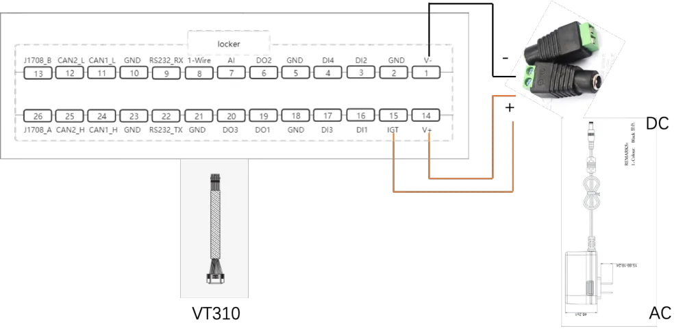

<strong>图 2-4 电源接线示意</strong>

3. 将线缆的 CONN-RS232-RX1、CONN-RS232-TX1 以及 GND（任意一根）接到 DB9 接头的 TXD、RXD 以及 GND 孔中，再通过 USB 转 DB9 数据线缆连接至 PC。

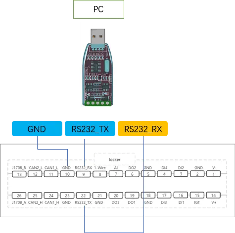

<strong>图 2-5 RS232 串口接线示意</strong>

**OBD-II 7PIN 多合一测试线缆**

该线缆适用于带有 OBD-II 诊断接口的重型卡车。VT310 设备由诊断接口供电，因此使用时需启动车辆。

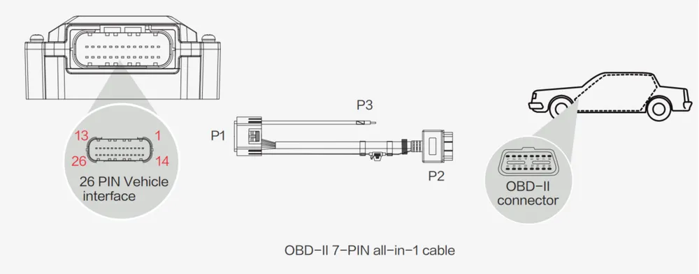

<strong>图 2-6 OBD-II 7PIN 多合一测试线缆连接示意</strong>

**连接步骤**：

1. 将线缆 P1 端 26PIN 母头插入 VT310 接口。
2. 将 P2 接在车辆的 OBD-II 诊断接口上。
3. 如需检测车辆是否点火，可将 P3 与车辆点火开关相连。

**OBD-II 26PIN 多合一测试线缆**

该线缆同样适用于带有 OBD-II 诊断接口的重型卡车，VT310 设备由诊断接口供电，使用时需启动车辆。相比 OBD-II 7PIN 多合一测试线缆，该线缆增加了 19PIN I/O 裸线端，适用于有 I/O 或 1-Wire（单总线通信协议）硬件接入需求的场景。

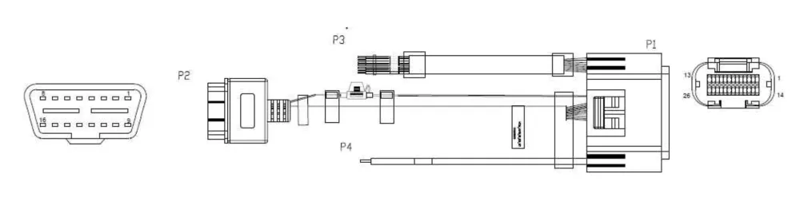

<strong>图 2-7 OBD-II 26PIN 多合一测试线缆连接示意</strong>

**连接步骤**：

1. 将线缆 P1 端 26PIN 母头插入 VT310 接口。
2. 将 P2 接在车辆的 OBD-II 诊断接口上。
3. 如需检测车辆是否点火，可将 P4 与车辆点火开关相连。
4. P3 裸线端可根据需求接入 I/O 设备（详见 [2.2.4 连接 I/O 接口](#224-连接-io-接口)）。

### 2.2.4 连接 I/O 接口

I/O 接口集成在 26PIN 车载接口中，提供以下资源：

- 3 路 DO（Digital Output，数字输出，可以理解为：控制外部设备开关状态的输出），最大电流 300mA
- 4 路 DI（Digital Input，数字输入，可以理解为：检测开关状态的传感器）
- 1 路 AI（Analog Input，模拟输入，可以理解为：测量连续变化的模拟量信号）
- 1 路 1-Wire
- 1 路 RS232 串口
- 1 路点火信号

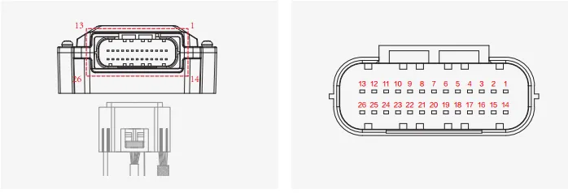

<strong>图 2-8 I/O 接口连接示意</strong>

**26PIN 车载接口 PIN 定义**

| PIN | 端子名称 | PIN | 端子名称 | PIN | 端子名称 | PIN | 端子名称 |
| :--- | :--- | :--- | :--- | :--- | :--- | :--- | :--- |
| 1 | V- | 8 | 1-Wire | 14 | V+ | 21 | GND |
| 2 | GND | 9 | RS232_RX | 15 | IGT | 22 | RS232_TX |
| 3 | DI2 | 10 | GND | 16 | DI1 | 23 | GND |
| 4 | DI4 | 11 | CAN_1L | 17 | DI3 | 24 | CAN_1H |
| 5 | GND | 12 | CAN_2L | 18 | GND | 25 | CAN_2H |
| 6 | DO2 | 13 | J1708_B | 19 | DO1 | 26 | J1708_A |
| 7 | AI | | | 20 | DO3 | | |

**RS232 串口**

RS232 串口用于调试。使用前需将 VT310 的 RS232_RX、RS232_TX、GND 分别与 DB-9 串口免焊头的 TXD、RXD、GND 相连，再通过 RS232 转 USB 线与 DB-9 串口免焊头连接。

**DI、DO、AI**

**数字输入（DI）**

DI 用于检测开关量，例如按钮的按下/弹起、开关的打开/关闭状态。VT310 提供可配置的上拉功能，DI 默认有 10kΩ 电阻下拉到 GND；配置上拉时，有 20kΩ 电阻上拉到电源电压。使用 DI 时需区分上拉和未上拉两种情况。

DI 未上拉时，外部电路连接方法如下：

<strong>图 2-9 DI 未上拉时外部电路连接</strong>

DI 上拉时，外部电路连接方法如下：

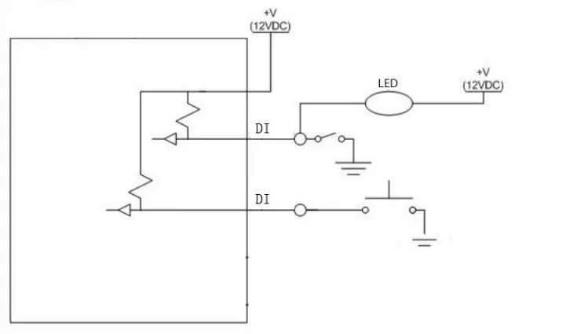

<strong>图 2-10 DI 上拉时外部电路连接</strong>

**数字输出（DO）**

DO 为开漏输出，分为高阻态和导通态，通常配合继电器使用。

<strong>图 2-11 DO 外部电路连接</strong>

**模拟输入（AI）**

AI 可检测直流电压，可直接接入电压模拟量。外部电路连接方法如下：

<strong>图 2-12 AI 外部电路连接</strong>

- AI 输入电压范围与电源电压宽度相同，检测精度：±0.015V，最小工作电流：2μA。

**1-Wire 接口**

1-Wire 通常用于连接小型通讯设备，例如数字温度计、iButton 设备。连接前需将 1-Wire 设备的 DQ 引脚（信号线）与 VT310 PIN8 连接，将 1-Wire 设备的 VDD 和 GND 引脚与 VT310 的 GND 相连。传感器类型为 DS18B20 型。下图为 DS18B20 数字温度传感器探头水温探测线。

<strong>图 2-13 DS18B20 数字温度传感器探头</strong>

<strong>图 2-14 1-Wire 接线示意</strong>

**点火线**

点火线 IGT（Ignition sense，也称 ACC）用于与车辆的点火开关相连。VT310 可通过该接口检测接入车辆是否已点火启动。使用 20PIN 线缆测试时，需将 IGT 线与 V+ 两条线路连接至直流供电电源。

### 2.2.5 登录设备

**下载配置工具**

进入映翰通官网下载中心（https://www.inhand.com.cn），在 支持中心 >> 资源中心 >> 车辆与运输 >> VT车载网 >> VT200 栏目下载 VTConfig Tool Setup 2.1.2.exe 或相关版本。在产品文档处下载配置工具安装包，选择默认路径完成安装。

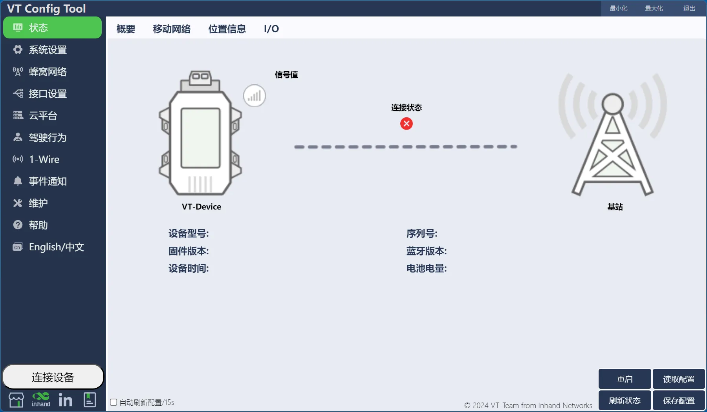

<strong>图 2-15 配置工具下载页面</strong>

**查找 COM 端口号**

通过 26PIN 多合一测试线缆外接适配器为 VT310 供电，使用 USB 转串口线将设备与电脑连接。当观察到 GNSS 或 Cellular 指示灯闪烁时，表明设备已启动成功。

进入电脑的设备管理页面，在"设备管理器" >> "端口（COM和LPT）"中查看 COM 口号。

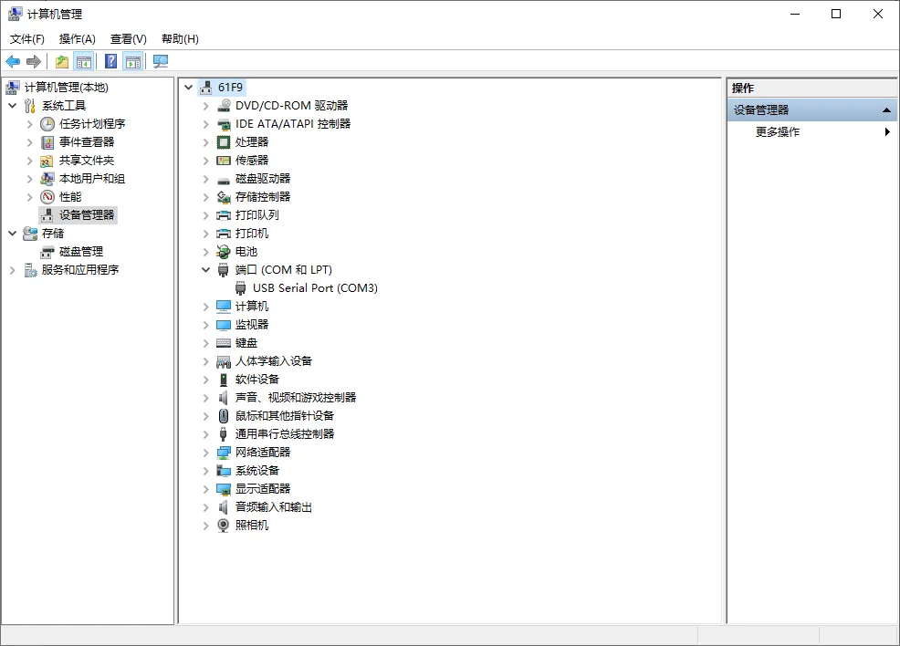

<strong>图 2-16 查看 COM 端口号</strong>

**串口连接登录**

打开  VT Config Tool。如出现错误提示，需以管理员方式运行该工具。

打开后可点击"English"切换为英文界面。

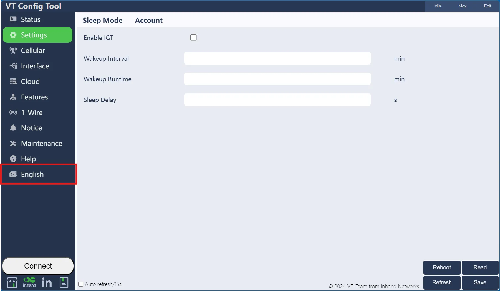

<strong>图 2-17 VT Config Tool 界面（切换英文）</strong>

**串口连接步骤**：

1. 点击"连接设备"。
2. 输入用户名和密码（默认为 admin / 123456）。
3. 选择已记录的串口号，波特率保持默认值 115200。
4. 点击"连接"。

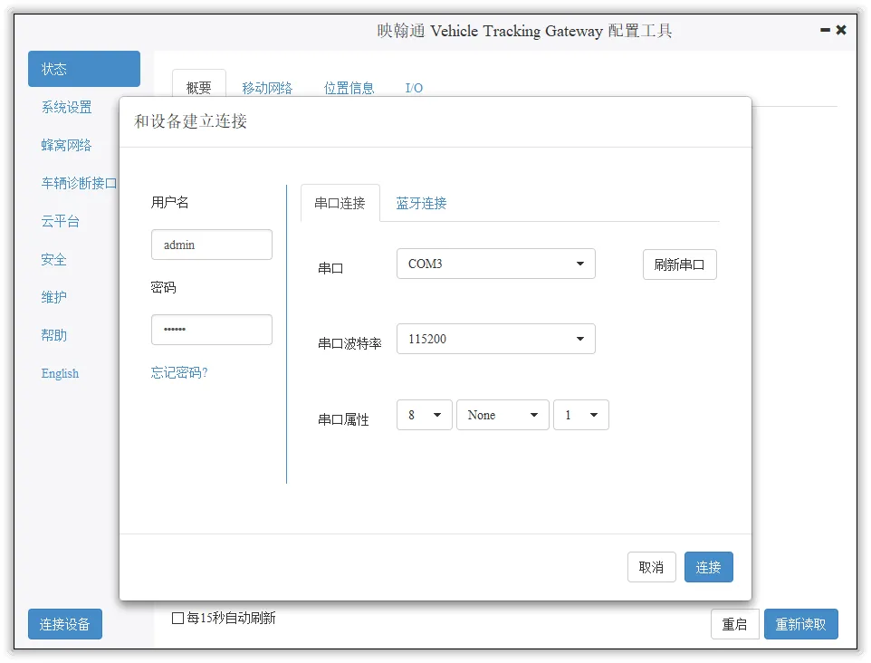

<strong>图 2-18 串口连接登录</strong>

**蓝牙连接登录**

也可通过电脑蓝牙（需 4.2 及以上版本）连接设备。

**蓝牙连接步骤**：

1. 点击"连接设备"。
2. 输入用户名和密码（默认为 admin / 123456）。
3. 选择与设备 SN 名称相同的蓝牙设备（SN 可在设备铭牌上找到）。
4. 点击"连接"。

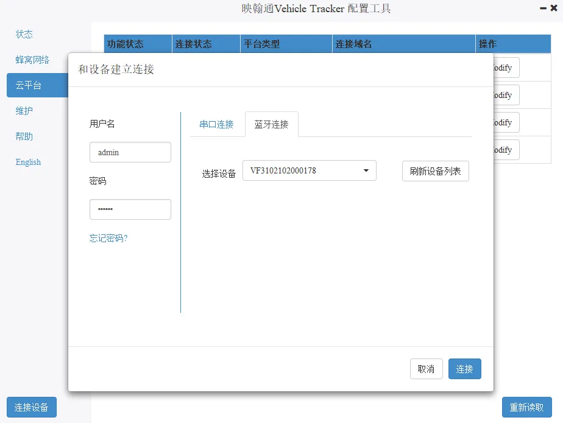

<strong>图 2-19 蓝牙连接登录</strong>

连接成功后，弹出提示"现在可以查看设备状态，并对设备进行操作"，此时可预览或修改配置。

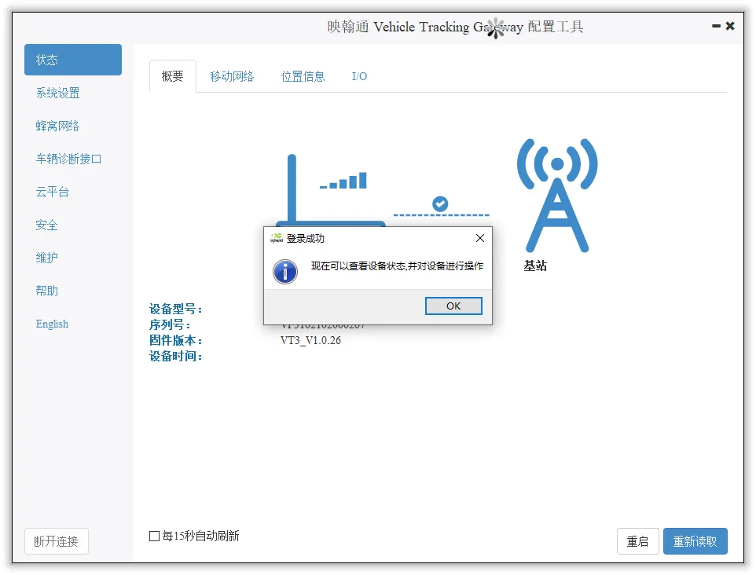

<strong>图 2-20 登录成功</strong>

# 第3章 常用场景配置

## 场景1：蜂窝网络配置

**目标**：通过配置蜂窝网络参数，使设备能够接入移动运营商的网络并连接互联网。

**前提**：已完成SIM卡安装并登录设备Web管理页面。

**预计用时**：约5分钟。

**操作步骤**：

1. 在导航菜单中点击 **蜂窝网络**，进入蜂窝网络配置页面。

2. 根据运营商提供的信息，填写以下基本参数：

   | 参数 | 参数说明 |
   | :--- | :--- |
   | 网络接入点名称（APN） | APN（Access Point Name，可以理解为：运营商网络的"门牌号"）。专网接入移动网络时需要运营商提供此参数。大部分公网业务的SIM卡拨号时不对APN进行认证。 |
   | 网络拨号用户名 | 默认参数"gprs"，专网AAA认证时，移动网络运营商需要提供此参数。 |
   | 网络拨号密码 | 默认参数"gprs"，专网AAA认证时，移动网络运营商需要提供此参数。 |
   | 认证模式 | 自动/CHAP/PAP，专网AAA认证时，运营商需要提供此参数。**自动**：轮流使用 PAP 和 CHAP 认证方式来拨号（上电第一次使用 PAP 认证，如果拨号失败，再次拨号时使用 CHAP 认证，再下一次拨号又使用 PAP 认证，以此类推）。如果认证模式选择 **PAP** 或 **CHAP**，则仅使用对应的认证方式进行拨号。 |

3. 如果使用场景有特殊需求，可点击 **显示高级选项** 展开隐藏配置项，根据运营商提供的信息填写以下高级参数：

   | 参数 | 参数说明 |
   | :--- | :--- |
   | 网络拨号号码 | 默认参数"\*99\*\*\*1#"，移动网络运营商需要提供此参数。 |
   | PIN | PIN（Personal Identification Number）是指SIM卡的个人识别密码。当SIM卡开启PIN验证时，需填入对应的PIN码。移动网络运营商需要提供此参数。 |
   | 默认承载APN | 运营商提供此参数。 |

   > **注意**：默认承载设置是针对某些运营商的网络数据传输特殊情况设置的功能，一般情况下无需配置。如需配置，请向运营商咨询默认承载的相关参数。

   

   
<strong>图 3-1 蜂窝网络配置页面</strong>

4. 参数填写完成后，点击 **保存配置**。设备重启后，配置生效。

## 场景2：车载诊断接口配置

**目标**：完成车载追踪器南向诊断接口（OBD 接口和 CAN1 接口）的协议配置，使设备能够通过对应物理接口与车辆总线正常通讯。

**前提**：已通过配置工具连接至 VT300 设备，设备处于可配置状态。

**预计用时**：约5分钟。

**操作步骤**：

1. 在配置工具中，将诊断协议选择为 **OBD**。OBD 协议对应车载追踪器的 CAN2 接口和 J1708 接口，可选参数如下表所示：

| 参数 | 参数说明 | 其他 |
| :--- | :--- | --- |
| J1939/J1979 | CAN2 接口协议，对应物理层PIN CAN_2L(PIN 12)和CAN_2H(PIN25) | OBD 默认配置 |
| J1939 | CAN2 接口协议，对应物理层PIN CAN_2L(PIN 12)和CAN_2H(PIN25) |  |
| J1939 | CAN2 接口协议，对应物理层PIN CAN_2L(PIN 12)和CAN_2H(PIN25) |  |
| J1708 | J1708 接口协议，对应物理层PIN J1708_B（PIN13）和J1708_A (PIN 26) | |
| Auto | 当设置为Auto模式时，车载追踪器会进行轮询链接，自动轮询发送以上4个选项的协议数据，进行链接测试。当收到对应协议的数据包时，车载追踪器会选择该协议进行通讯。 | 使用Auto模式时，CAN1接口和J1708接口同时被打开。 |
| Disable | 关闭CAN2接口和J1708接口 |  |

2. 根据实际车辆总线类型，选择对应的协议参数并完成配置。配置界面如下图所示：

<strong>图 3-2 OBD 接口配置</strong>

3. 若需同时配置 CAN1 接口，在配置工具中将诊断协议选择为 **CAN1**。CAN1 接口可选参数如下表所示：

| 参数 | 说明 | |
| :--- | :--- | --- |
| J1939/J1979 | CAN1 接口协议，对应物理层PIN CAN_1L(PIN 11)和CAN_1H(PIN24) | CAN1 默认配置 |
| J1939 | CAN1 接口协议，对应物理层PIN CAN_1L(PIN 11)和CAN_1H(PIN24) |  |
| J1939 | CAN1 接口协议，对应物理层PIN CAN_1L(PIN 11)和CAN_1H(PIN24) |  |
| Disable | 关闭CAN1接口 |  |

4. 选择所需的 CAN1 协议参数并完成配置。配置界面如下图所示：

<strong>图 3-3 CAN1 接口配置</strong>

> **说明**：CAN1 的功能可以与 OBD 功能同时打开，两者互不冲突。

## 场景3：连接SmartFleet平台

**目标**：将VT300系列车载追踪网关接入北京映翰通SmartFleet车联网平台，实现远程车辆管理和监视。

**前提**：设备已完成基本网络连接（参考场景1），并已在SmartFleet平台（[https://che.inhandiot.com](https://che.inhandiot.com)）注册账户。

**预计用时**：约5分钟。

**操作步骤**：

1. 在设备Web管理页面中，点击 **云平台** 进入云平台配置页面，再点击 **Modify** 进入编辑模式。

<strong>图 3-4 云平台配置入口</strong>

2. 按照以下参数配置SmartFleet平台连接：
   - **平台类型**：选择 **SmartFleet**。
   - 勾选 **开启**。
   - **平台域名**：选择 `che.inhand.com`（中国用户地址）。
   - **注册账户**：填写在SmartFleet平台注册的账户。
   - **车牌号码**：填写对应的车牌号码。

3. 如需调整上报参数，点击 **显示高级选项**，根据需求配置以下参数（单位：秒）：
   - **LBS上报间隔**
   - **流量上报间隔**
   - **心跳上报间隔**

4. 点击 **保存配置**，然后 **重启** 设备使配置生效。

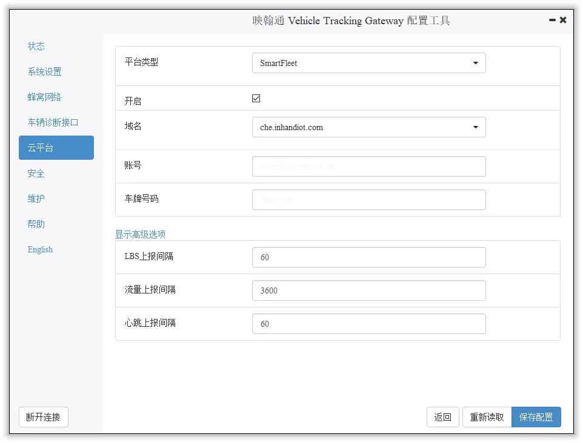

<strong>图 3-5 SmartFleet平台配置参数</strong>

**验证方法**：

1. 设备重启后，返回云平台配置页面，确认连接状态显示为 **已连接**。

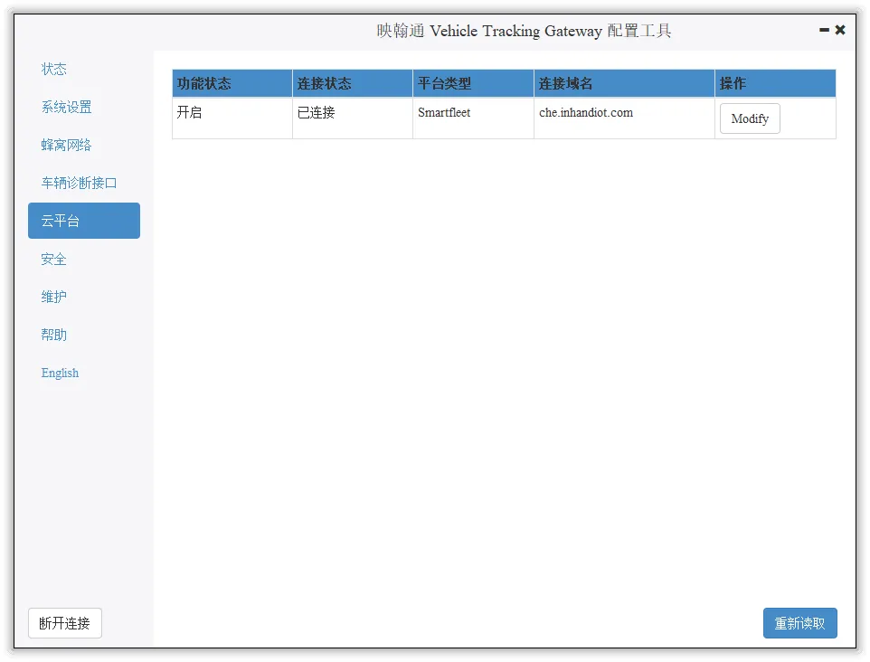

<strong>图 3-6 设备云平台连接状态</strong>

2. 登录SmartFleet平台（[https://che.inhandiot.com](https://che.inhandiot.com)），导航至 **网关 >> 网关列表**，确认该车载追踪网关已上线。

<strong>图 3-7 SmartFleet平台网关在线状态</strong>

## 场景4：连接Wialon平台

**目标**：将VT300设备接入Wialon GPS车辆跟踪平台，实现车辆位置数据上报与监控。

**前提**：
- 设备已完成基础网络配置并可正常联网。
- 已获取Wialon平台账号（平台登录地址：[https://hosting.wialon.com](https://hosting.wialon.com)）。
- 已知设备序列号（可通过设备标签或配置工具的状态页面查看）。

**预计用时**：约5分钟。

**操作步骤**：

1. 登录设备配置页面，进入 **云平台** 页面，将 **平台类型** 选择为 **Wialon**。

2. 勾选 **开启**，在域名下拉菜单中选择 **nl.gpsgsm.org**，端口号填写 **21000**。若需调整数据上报频率，可点击"显示高级选项"，配置"上报间隔"（单位：秒）。完成后点击 **保存配置** 并 **重启** 设备。

<strong>图 3-8 Wialon平台配置（使用默认域名）</strong>

3. 若用户已获得Wialon提供的独立域名，则在自定义域名栏中填入该域名及对应端口号。

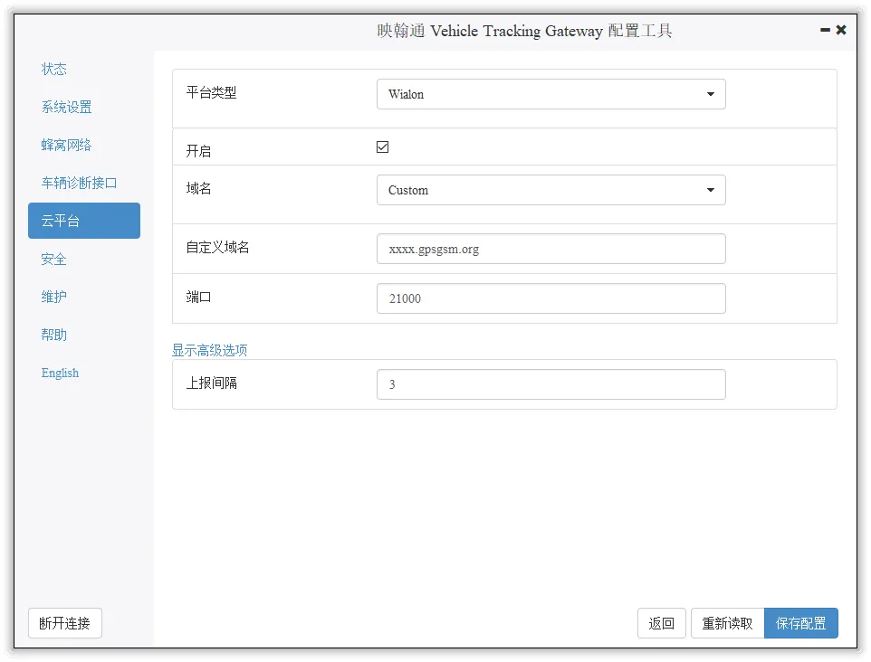

<strong>图 3-9 Wialon平台配置（使用自定义域名）</strong>

4. 登录Wialon平台（[https://hosting.wialon.com](https://hosting.wialon.com)），新增设备。

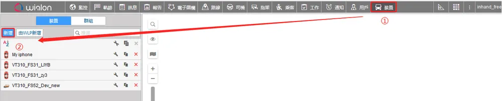

<strong>图 3-10 Wialon平台新增设备</strong>

5. 填写设备添加信息：
   - **名称**：自定义填写。
   - **装置类型**：选择 **Wialon Combine**。
   - **特制ID**：填写设备的序列号。序列号可通过查看设备标签或配置工具状态页面获取。

<strong>图 3-11 设备添加信息示例</strong>

**验证方法**：

在Wialon平台中查看设备上传的数据，确认设备已成功连接并上报信息。操作如下：

1. 在Wialon平台中选择 **Message**。
2. 选择待查看的目标装置名称。
3. 选择感兴趣的时间区间。
4. 选择数据类型（IO数据通过 **Raw data** 显示）。
5. 点击 **Execute** 按钮，即可查看目标装置的上报信息。

<strong>图 3-12 查看设备上传数据</strong>

> **提示**：可通过点击数据展示区域的配置按钮，自主选择需要展示的信息字段。

<strong>图 3-13 数据展示字段配置</strong>

## 场景5：连接Azure IoT Hub

**目标**：将VT300设备连接至Azure IoT中心，以实现物联网设备管理与双向通信。

**前提**：已拥有Azure IoT Hub账户并具备IoT中心的管理权限；设备已完成基本网络配置并可正常联网。

**预计用时**：约5分钟。

**操作步骤**：

1. 登录Azure IoT平台，在IoT中心导航菜单中打开 **IoT 设备**，然后选择 **新建**（+New）以添加设备。

<strong>图 3-14 Azure IoT平台新建设备</strong>

2. 在 **创建设备** 页面中，输入新设备的名称（例如 myDeviceId），然后选择 **保存**。此操作将为IoT中心创建一个设备标识。

<strong>图 3-15 创建设备标识</strong>

3. 设备创建完成后，在 **IoT 设备** 列表中打开该设备，复制 **主连接字符串**（Primary Connection String）以供后续配置使用。

<strong>图 3-16 复制主连接字符串</strong>

4. 在VT300配置工具中，进入 **云平台** 页面，将 **平台类型** 设置为 **Azure IoT**。在 **连接字符串** 字段中粘贴上一步复制的主连接字符串，然后依次点击 **保存配置** 和 **重启**。

<strong>图 3-17 配置Azure IoT连接字符串</strong>

5. 若需要在上报数据中包含无效数据，可点击 **显示高级选项** 展开隐藏配置项，勾选 **显示无效数据** 即可。

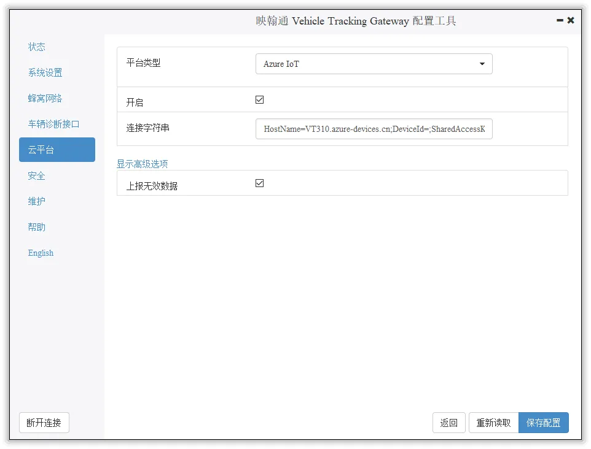

<strong>图 3-18 显示无效数据选项</strong>

> 更多关于Azure IoT Hub的信息，请访问：[https://azure.microsoft.com/zh-cn/services/iot-hub](https://azure.microsoft.com/zh-cn/services/iot-hub)

## 场景6：连接AWS IoT平台

**目标**：将VT300系列车载追踪网关连接至AWS IoT Core云平台，实现设备数据上云及消息订阅与发布。

**前提**：
- 已注册AWS账号并可访问AWS IoT控制台。
- 已在AWS IoT控制台完成"物品"（Thing）创建，或已创建预置模板（Fleet Provisioning Template）。
- 已获取相关数字证书（\*.cert.pem）和私钥文件（\*.private.key）。

**预计用时**：约15分钟。

AWS IoT Core支持将IoT设备连接至AWS云，无需自行配置或管理服务器，可支持海量设备和消息的安全可靠路由。更多信息请访问 [https://aws.amazon.com/cn/iot-core](https://aws.amazon.com/cn/iot-core/)。

以下提供两种配置方式，用户可根据实际需求选择其一。

---

### 配置方式一：通过AWS创建物品方式连接

**操作步骤**：

1. 在AWS IoT控制台创建物品（Thing）。进入 **Amazon IoT >> Things** 页面，点击 **Create** 创建物品。

<strong>图 3-19 AWS IoT Things页面</strong>

2. 选择 **Create a single thing**，进入物品创建流程。

<strong>图 3-20 创建单个物品</strong>

3. 在 **Add your device to the thing registry >> Add certificate** 页面，为刚创建的物品创建证书。

<strong>图 3-21 为物品添加证书</strong>

4. 下载证书文件：
   - 点击 **A certificate for the thing >> Download**，下载数字证书文件（格式为 \*.cert.pem）。
   - 点击 **A private key >> Download**，下载私钥文件（格式为 \*.private.key）。
   - VT300系列设备已内置AWS的CA文件，通常无需下载。如需更新CA文件，可点击页面中的 **A root CA for Amazon IoT Download**。
   - 点击 **Activate** 激活证书。
   - 点击 **Attach a policy**，进入附加策略页面。

<strong>图 3-22 下载证书并激活</strong>

5. 在附加策略页面勾选该证书的附加策略，然后点击 **Register Thing** 注册该物品。

<strong>图 3-23 附加策略并注册物品</strong>

6. 通过配置工具将证书文件导入车载追踪器：
   - 进入 **安全 >> 导入数字证书 >> 选择证书**，在弹出对话框中选择已下载的数字证书文件（\*.cert.pem），然后点击 **导入证书**。
   - 进入 **安全 >> 导入私钥证书 >> 选择文件**，在弹出对话框中选择已下载的私钥文件（\*.private.key），然后点击 **导入文件**。
   - 如需更新CA证书，进入 **安全 >> 导入CA证书 >> 选择文件**，选择对应的CA证书文件后点击 **导入证书**。

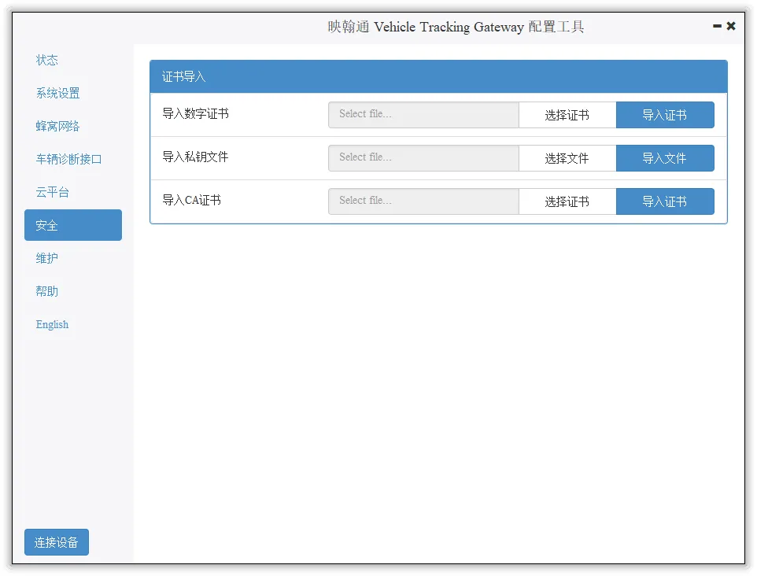

<strong>图 3-24 导入证书文件至设备</strong>

7. 启用AWS IoT平台连接。进入 **云平台** 页面，平台类型选择 **AWS IoT**，勾选 **开启**，填写域名。

<strong>图 3-25 启用AWS IoT连接</strong>

8. 获取域名地址。在AWS IoT控制台进入 **Things >> 选择已创建的物品 >> Interact**，复制该页面中的终端节点地址，填入配置工具中AWS IoT页面的域名字段。

<strong>图 3-26 获取AWS IoT终端节点地址</strong>

9. 保存配置并重启设备，在 **Cloud Platform（云平台）** 页面观察连接状态。

<strong>图 3-27 查看连接状态</strong>

> **提示**：默认情况下，设备不上报不存在的数据。如需上报，可在 **显示高级选项** 中勾选 **上报无效数据**，勾选后不存在的数据值将上报为NULL。

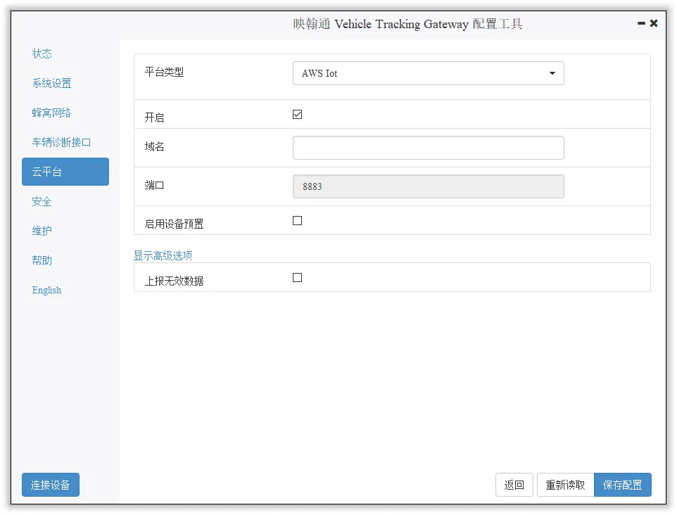

<strong>图 3-28 上报无效数据选项</strong>

---

### 配置方式二：通过AWS创建预置模板连接

**操作步骤**：

1. 创建预置模板。在AWS IoT控制台进入 **Fleet provisioning templates** 页面，点击 **Create** 创建预置模板。

<strong>图 3-29 创建预置模板</strong>

2. 创建证书。进入 **Amazon IoT >> Certificates** 页面。

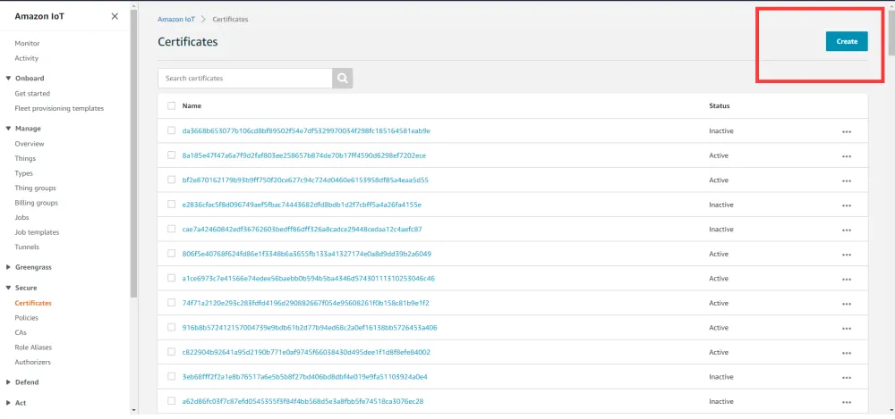

<strong>图 3-30 证书页面</strong>

3. 在 **Add your device to the thing registry >> Add certificate** 页面，为物品创建证书。

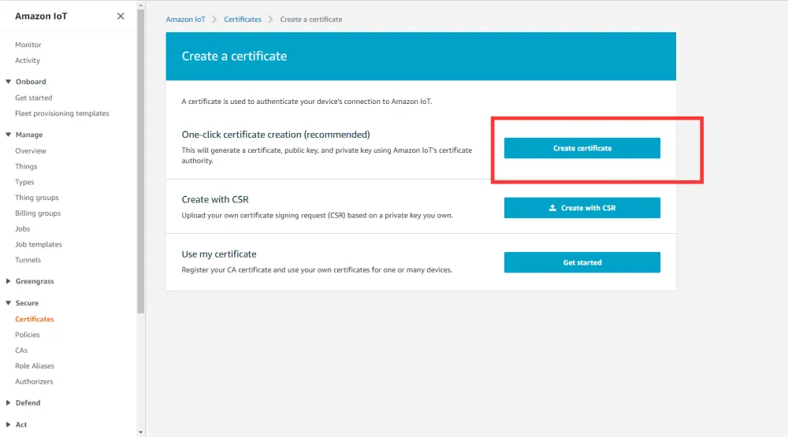

<strong>图 3-31 为预置模板创建证书</strong>

4. 下载证书文件：
   - 点击 **A certificate for the thing >> Download**，下载数字证书文件（格式为 \*.cert.pem）。
   - 点击 **A private key >> Download**，下载私钥文件（格式为 \*.private.key）。
   - VT300系列设备已内置AWS的CA文件，通常无需下载。如需更新，可点击 **A root CA for Amazon IoT Download**。
   - 点击 **Activate** 激活证书。
   - 点击 **Attach a policy**，进入附加策略页面。

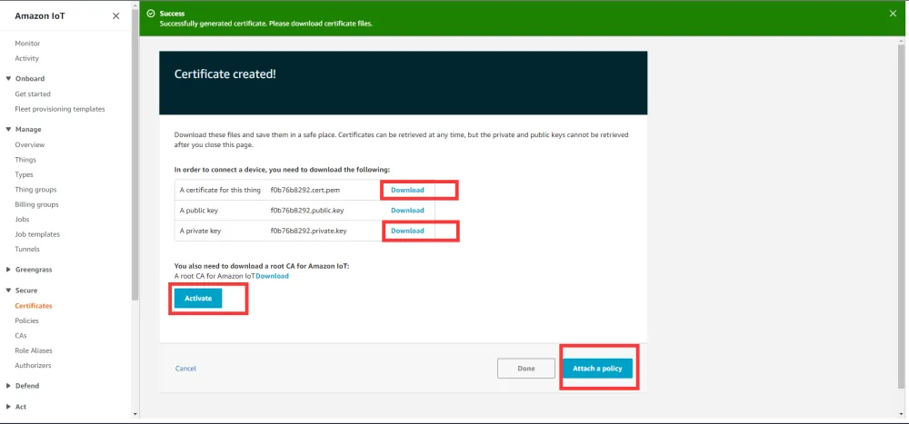

<strong>图 3-32 下载证书并激活</strong>

5. 在证书列表中完成认证确认。

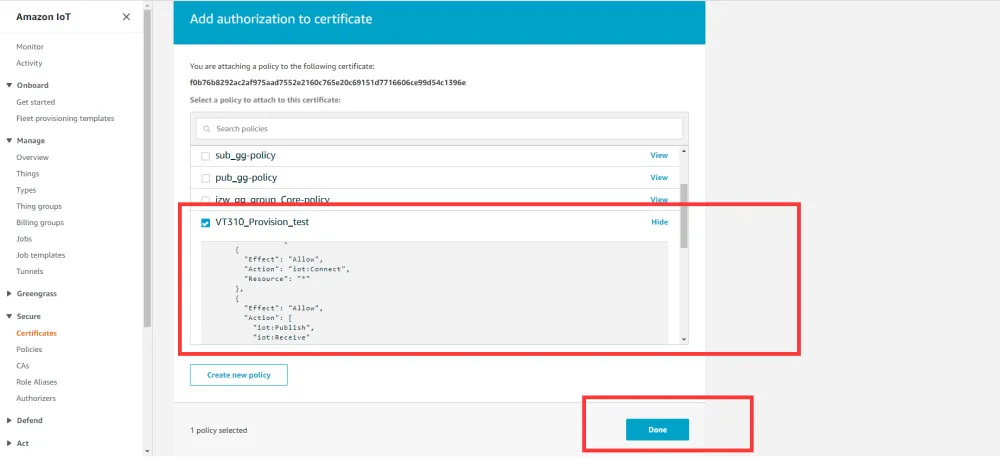

<strong>图 3-33 证书认证确认</strong>

6. 进入 **Amazon IoT >> Policy** 列表，完成策略添加。

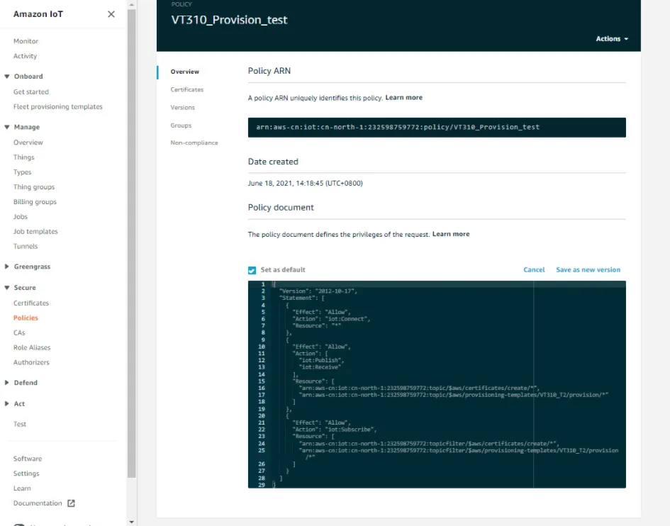

<strong>图 3-34 添加策略</strong>

7. 通过配置工具将证书文件导入车载追踪器：
   - 进入 **安全 >> 导入数字证书 >> 选择证书**，在弹出对话框中选择已下载的数字证书文件（\*.cert.pem），然后点击 **导入证书**。
   - 进入 **安全 >> 导入私钥证书 >> 选择文件**，在弹出对话框中选择已下载的私钥文件（\*.private.key），然后点击 **导入文件**。
   - 如需更新CA证书，进入 **安全 >> 导入CA证书 >> 选择文件**，选择对应的CA证书文件后点击 **导入证书**。

<strong>图 3-35 导入证书文件至设备</strong>

8. 启用AWS IoT平台连接。进入 **云平台** 页面，平台类型选择 **AWS IoT**，勾选 **开启**，填写域名。

<strong>图 3-36 启用AWS IoT连接</strong>

> **注意**：当在AWS平台创建的是预置模板时，需在配置工具中启用 **设备预置**，勾选 **开启**，并填入预置模板名称。预置模板名称可在AWS IoT控制台的 **Fleet provisioning templates** 页面获取。

9. 获取域名地址。在AWS IoT控制台进入 **Things >> 选择已创建的物品 >> Interact**，复制终端节点地址，填入配置工具中AWS IoT页面的域名字段。

<strong>图 3-37 获取终端节点地址</strong>

10. 保存配置并重启设备，在 **Cloud Platform（云平台）** 页面观察连接状态。

<strong>图 3-38 查看连接状态</strong>

---

### AWS订阅与发布

完成AWS IoT平台连接后，可通过AWS IoT控制台的测试功能订阅设备上报消息及向设备发布消息。

**操作步骤**：

1. 进入 **Amazon IoT >> Test** 页面。

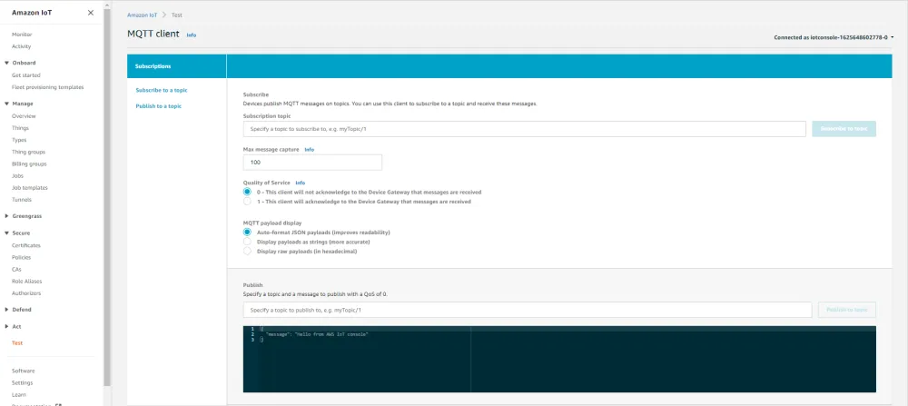

<strong>图 3-39 AWS IoT Test页面</strong>

2. 在 **Subscription topic** 文本框中填入需要订阅的Topic。例如：`v1/VT310 SN/motion/info`。

<strong>图 3-40 填入订阅Topic</strong>

3. VT300系列设备默认上报GNSS、Sysinfo、Motion、Cellular1、IO、OBD等保留组的消息，订阅对应Topic即可接收。

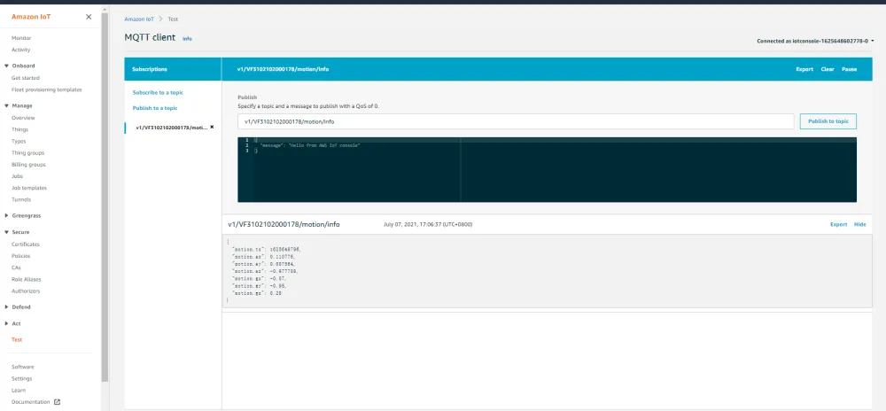

<strong>图 3-41 接收设备上报消息</strong>

更多参数说明请参考API文档《FlexAPI_over_MQTT_Reference_for_3rd_party_platform_VT310.pdf》。

---

**验证方法**：
- 在配置工具的 **Cloud Platform（云平台）** 页面，确认连接状态显示为已连接。
- 在AWS IoT控制台的 **Test** 页面订阅设备Topic，确认能接收到设备上报的消息数据。

## 场景7：连接Aliyun IoT平台

**目标**：将设备接入阿里云企业物联网平台，实现设备数据的云端管理与分析。

**前提**：
- 已注册阿里云账号并开通物联网平台服务。
- 已在阿里云物联网平台创建产品和设备。
- 设备已通过配置工具连接至计算机。

**预计用时**：约10分钟。

阿里云企业物联网平台提供全托管的实例服务，无需自建物联网基础设施即可便捷地接入和管理设备，具有低成本、高可靠、高性能、易运维的优势。强大的数据处理能力可以更好地对设备数据进行分析和可视化展示，实时的安全威胁检测可以保证每个实例安全可靠。了解更多请访问阿里云产品页面：[https://www.aliyun.com/product/iot](https://www.aliyun.com/product/iot)。

**操作步骤**：

VT300 支持两种安全认证模式接入阿里云物联网平台：**一机一密** 和 **一型一密**。用户可根据实际需求选择其中一种方式进行配置。

---

### 方式一：一机一密

详细使用方式可参考阿里云官方文档：[https://help.aliyun.com/document_detail/74006.html](https://help.aliyun.com/document_detail/74006.html)

<strong>图 3-42 一机一密方式概览</strong>

**步骤1**：在阿里云控制台创建设备并获取设备证书。

登录阿里云控制台，进入 **IoT Platform >> Device >> Devices >> Device Details**，创建设备并查看设备的 DeviceSecret。

<strong>图 3-43 查看设备DeviceSecret</strong>

复制设备的 Device Certificate，包括以下三个参数：**ProductKey**、**DeviceName**、**DeviceSecret**。

<strong>图 3-44 设备证书参数</strong>

**步骤2**：在配置工具中填写参数。

打开配置工具，进入 **云平台 >> 平台类型 >> Aliyun IoT**，勾选"开启"，安全认证模式选择 **一机一密**。

将从阿里云获得的三个参数 **ProductKey**、**DeviceName**、**DeviceSecret** 分别填入配置工具中的对应字段。在物联网平台控制台左上角查看服务所在的地域，Region ID 的取值请参见阿里云"地域和可用区"文档。

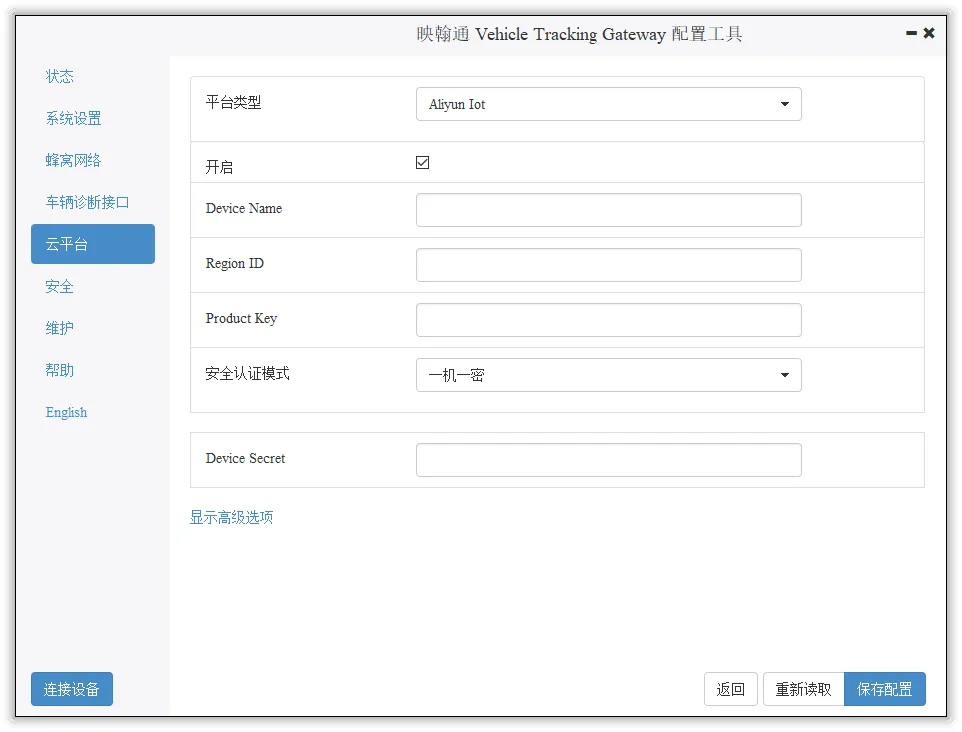

<strong>图 3-45 一机一密配置工具界面</strong>

---

### 方式二：一型一密

详细使用方式可参考阿里云官方文档：[https://help.aliyun.com/document_detail/74006.html](https://help.aliyun.com/document_detail/74006.html)

**步骤1**：在阿里云控制台获取产品证书。

登录阿里云控制台，进入 **IoT Platform >> Devices >> Product Details**，创建设备并查看产品的 ProductSecret。

<strong>图 3-46 查看ProductSecret</strong>

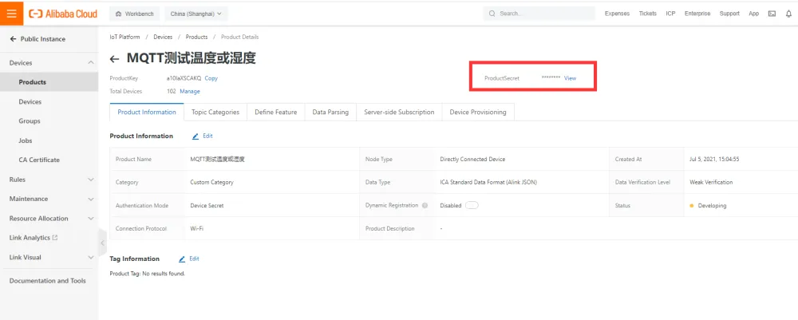

<strong>图 3-47 产品详情页面</strong>

复制 Product Certificate，包括 **ProductSecret** 和 **ProductKey** 两个参数。

<strong>图 3-48 产品证书参数</strong>

**步骤2**：在配置工具中填写参数。

打开配置工具，进入 **云平台 >> 平台类型 >> Aliyun IoT**，勾选"开启"，安全认证模式选择 **一型一密**。

若使用一型一密预注册认证方式接入设备，需在已创建的产品下添加设备（支持批量添加或单个添加）。由于设备激活时会校验 DeviceName，建议采用可直接从设备中读取的 ID（如设备的 MAC 地址、IMEI 或 SN 码等）作为 DeviceName。添加设备成功后，物联网平台为设备颁发 DeviceSecret，设备初始状态为 **未激活**。

将从阿里云获得的 **DeviceName**、**ProductSecret** 和 **ProductKey** 分别填入配置工具中的对应字段。在物联网平台控制台左上角查看服务所在的地域，Region ID 的取值请参见阿里云"地域和可用区"文档。

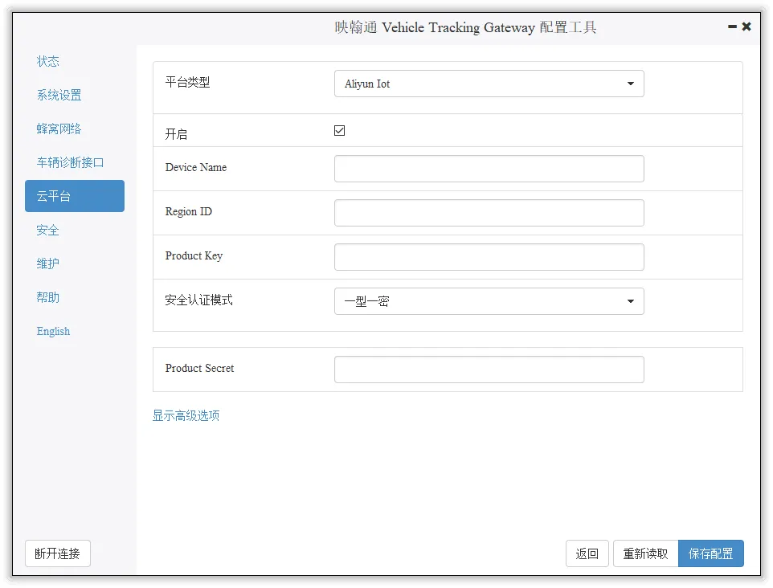

<strong>图 3-49 一型一密配置工具界面</strong>

## 场景8：连接MQTT协议平台

**目标**：使用MQTT（遥测传输，可以理解为：一种轻量级的物联网消息传输协议）将VT300设备连接至第三方或开源IoT平台（如ThingsBoard、EMQ等）。

**前提**：已完成设备的基本网络配置，设备可正常访问互联网；已获取目标MQTT平台的连接参数（域名、端口、用户名、密码等）。

**预计用时**：约5分钟。

**操作步骤**：

MQTT是一种轻量级、基于发布/订阅模式的消息传输协议，具有开放、简单、易于实现的特点，适用于带宽有限或网络不稳定的受限环境。该协议使用TCP/IP提供网络连接，支持一对多的消息发布，并对负载内容进行屏蔽传输。ThingsBoard、EMQ等开源软件均支持MQTT协议，用户可基于这些软件搭建物联网平台。

### 方式一：连接MQTT Broker平台

1. 在配置工具中，将"平台类型"选择为 **Mqtt Broker**，勾选"开启"。
2. 填写目标平台的"域名"、"端口"、"用户名"和"密码"。
3. 点击"保存配置"并"重启"设备，使配置生效。

<strong>图 3-50 MQTT Broker配置界面</strong>

4. 如需显示无效数据，可点击"显示高级选项"展开隐藏配置项，勾选"显示无效数据"。

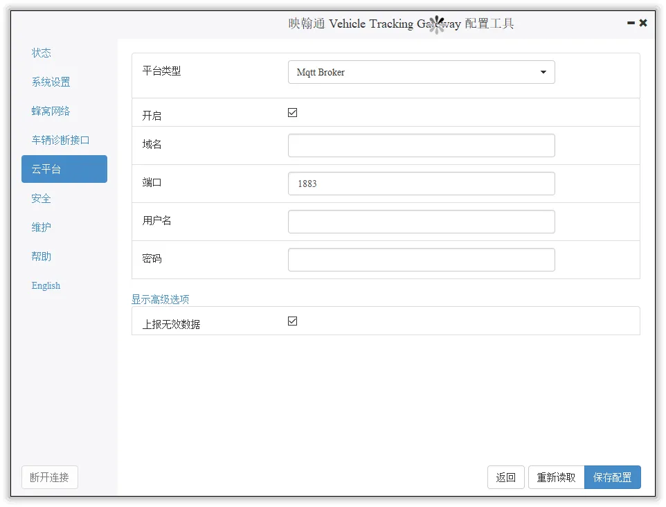

<strong>图 3-51 显示无效数据选项</strong>

### 方式二：连接ThingsBoard开源IoT平台

ThingsBoard是一个开源物联网平台，支持物联网项目的快速开发、管理和扩展，提供数据收集、处理、可视化及设备管理功能。该平台通过MQTT、CoAP和HTTP等行业标准协议实现设备连接，并支持云端和本地部署。更多信息可访问 [https://thingsboard.io](https://thingsboard.io/)。

<strong>图 3-52 ThingsBoard架构</strong>

1. 在ThingsBoard平台注册账号并添加设备。添加设备后，打开设备详情，进入 **Device Credentials >> MQTT Basic**，获取 Client ID、User Name、Password 参数。更多配置信息请访问：[https://thingsboard.io/docs/getting-started-guides](https://thingsboard.io/docs/getting-started-guides)。

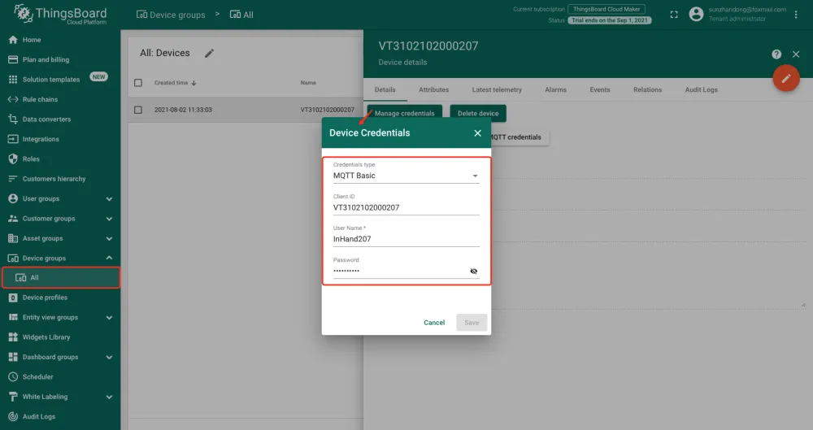

<strong>图 3-53 ThingsBoard平台设备参数</strong>

2. 在VT300配置工具中，填入从平台获取的设备参数：域名填写 `thingsboard.cloud`，端口号填写 `1883`，用户名和密码分别填写平台提供的 User Name 和 Password。点击"保存配置"并"重启"设备。

<strong>图 3-54 VT300配置工具填写ThingsBoard参数</strong>

# 第4章 功能说明与参数参考

## 4.1 状态信息查询

VT300 系列车载追踪网关提供多个状态信息页面，用户可通过 Web 管理界面实时查看设备的网络连接状态、移动网络参数、位置信息以及 I/O 状态。以下各小节分别对这些页面进行说明。

### 4.1.1 概要页面

概要页面用于显示设备的基本信息及网络连接状态。页面中央以图示方式展示 VT310 与基站之间的连接情况：当网络连接正常时，链路图标显示为"√"；当连接异常时，链路图标显示为"×"。

用户可勾选页面上的自动刷新选项，开启后系统将每 15 秒自动刷新所有显示信息。概要页面中展示的设备基础参数（如型号、序列号等）应与设备铭牌上的信息保持一致，用户可据此进行核对。

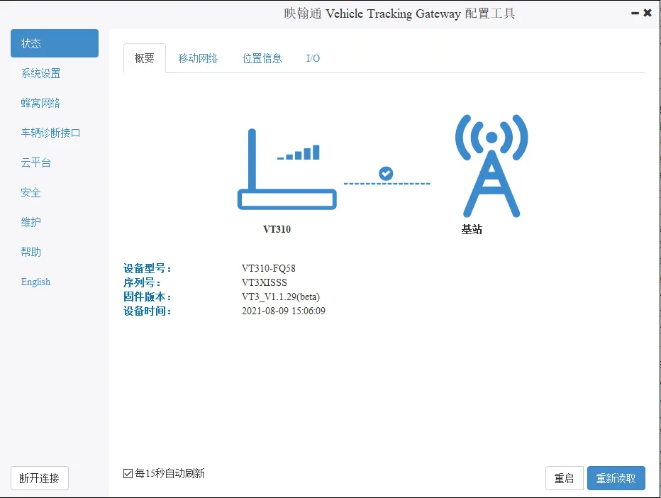

<strong>图 4-1 设备概要信息</strong>

### 4.1.2 移动网络参数

移动网络参数页面用于显示蜂窝网络的连接参数，用户可通过查看各项参数判断无线网络连接是否正常。在未插入 SIM 卡的情况下，页面中读取到的参数均为默认值。当设备通过 SIM 卡成功完成拨号联网后，将获得运营商分配的 IP 地址，从而具备数据传输能力。有关移动网络的具体配置方法，请参阅蜂窝网络配置相关章节。

下表列出了移动网络参数页面中各参数的含义：

| 参数名称 | 参数说明 |
| --- | --- |
| 信号值 | 表示无线网络的信号强度，取值范围为 0～31，数值越大表示信号越强 |
| MCC/MNC | MCC（Mobile Country Code，移动国家代码）与 MNC（Mobile Network Code，移动网络代码）的组合，用于标识运营商所属的国家和网络，该参数从 SIM 卡中读取 |
| SIM 卡状态 | 显示 SIM 卡的识别情况，取值为"正常"或"未识别" |
| IMEI | International Mobile Equipment Identity（国际移动设备识别码），可以理解为设备的全球唯一序列号，为车载网关内置拨号模组的标识代码 |
| 注册状态 | 表示设备在运营商网络中的注册情况，取值为"已注册"或"未注册" |
| LAC | Location Area Code（位置区码），用于标识设备所在的位置区域，拨号成功后从基站获取该参数 |
| IMSI | International Mobile Subscriber Identity（国际移动用户识别码），用于唯一标识 SIM 卡对应的移动用户，该参数从 SIM 卡中读取 |
| CELL ID | 小区号，用于标识设备当前接入的基站小区，拨号成功后从基站获取该参数 |
| ICCID | Integrate Circuit Card Identity（集成电路卡识别码），即 SIM 卡卡号，用于唯一标识一张 SIM 卡，该参数从 SIM 卡中读取 |
| IP 地址 | 拨号成功后，由运营商分配的网络接入 IP 地址 |
| 蜂窝状态 | 表示蜂窝网络的连接情况，取值为"已连接"或"未连接" |
| 认证方式 | 拨号认证协议类型，取值为 CHAP 或 PAP |

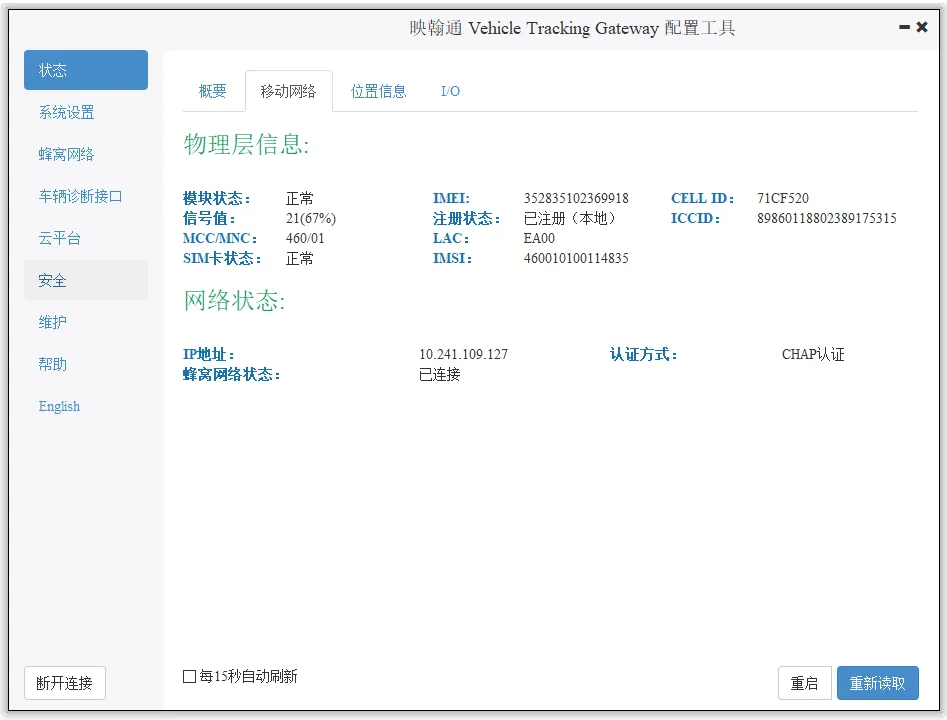

<strong>图 4-2 查看网络连接参数</strong>

### 4.1.3 位置信息

位置信息页面用于显示 GNSS（Global Navigation Satellite System，全球导航卫星系统）模组获取的最新定位数据。页面内容包括经纬度、海拔等位置信息，以及惯性传感器（用于辅助检测设备运动状态）的相关参数。

<strong>图 4-3 位置信息</strong>

### 4.1.4 I/O 信息

I/O 信息页面用于显示设备各输入/输出接口的当前状态。用户可通过该页面实时查看各 I/O 端口的状态值。

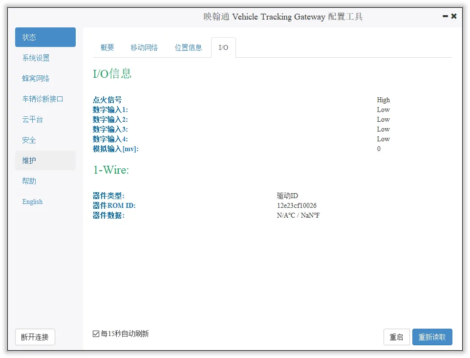

<strong>图 4-4 I/O 信息</strong>

## 4.2 系统设置

### 4.2.1 休眠模式

休眠模式用于在车辆熄火后维持设备续航能力，为特殊应用环境提供持续运行保障。其状态机如下所示：

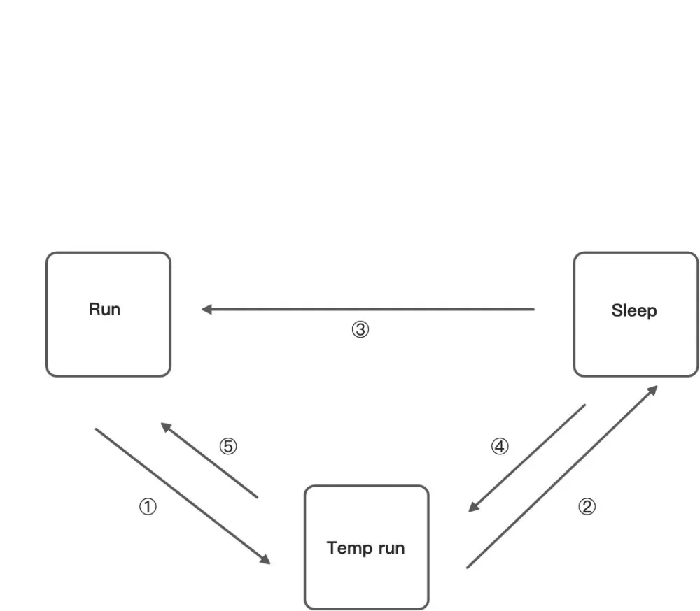

<strong>图 4-5 休眠模式状态机</strong>

**状态机说明**

Run、Sleep、Temp run 分别代表正常运行状态、休眠状态和临时运行状态。

- **状态转换 1（Run → Temp run）**：当设备没有外接电源（电源电压小于休眠电压）或 IGT 为 OFF（需在配置中使能 IGT）时，设备从 Run 进入 Temp run。首次进入休眠时，设备默认持续 10 秒的延时休眠时间（用于上报信息），随后进入 Sleep。
- **状态转换 2（Temp run → Sleep）**：设备在 Temp run 状态下运行满一个唤醒运行时间周期后，或从 Run 状态运行 15 秒进入 Temp run 后，将进入 Sleep。
- **状态转换 3（Sleep → Run）**：当外接电源恢复（电源电压大于休眠电压）且 IGT 为 ON（需在配置中使能 IGT）时，设备从 Sleep 恢复至 Run。
- **状态转换 4（Sleep → Temp run）**：设备在 Sleep 状态下运行满一个唤醒间隔周期后，将自动进入 Temp run。
- **状态转换 5（Temp run → Run）**：当外接电源恢复（电源电压大于休眠电压）且 IGT 为 ON（需在配置中使能 IGT）时，设备从 Temp run 恢复至 Run。

**配置休眠模式**

| 参数 | 参数说明 |
| :--- | :--- |
| 使能IGT | 使能 IGT 后，设备将 IGT 状态作为进入和退出休眠的条件，默认不勾选 |
| 唤醒间隔 | 进入休眠后，设备自动唤醒的时间间隔，默认 120 分钟 |
| 唤醒运行时间 | 休眠唤醒后，设备进入下一次休眠的时间间隔，默认 5 分钟 |
| 延时休眠时间 | 进入休眠后，用于上报数据的等待时间 |

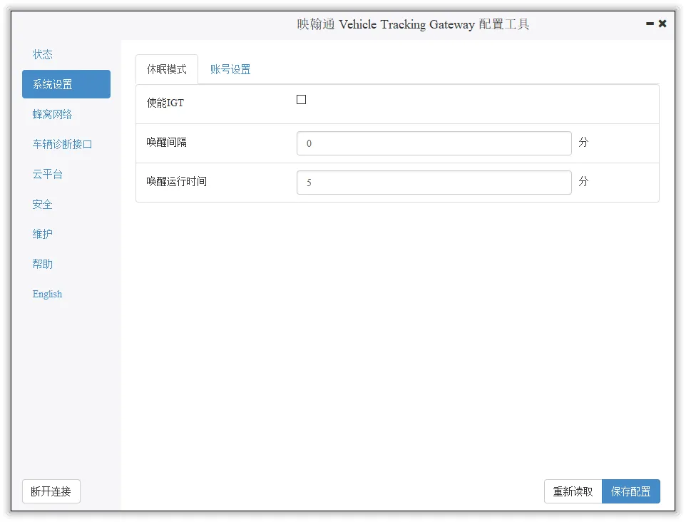

<strong>图 4-6 休眠模式配置界面</strong>

### 4.2.2 账号设置

账号设置功能用于修改设备管理员的登录信息。设备默认管理员账户为 `admin`，默认管理员密码为 `123456`。

设备管理员可根据实际需要对管理员账号和密码进行修改。修改完成后，设备将提示重启；确认重启后，需使用修改后的管理员账号与密码登录设备。配置界面如下所示：

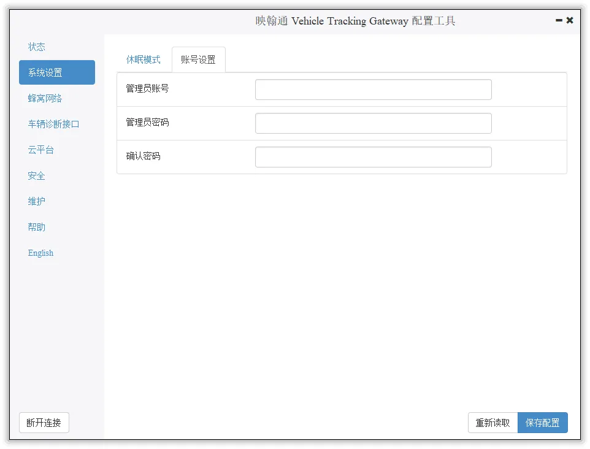

<strong>图 4-7 账号设置配置界面</strong>

## 4.3 维护

VT300系列设备支持多种维护操作，包括固件升级、FlexAPI恢复出厂设置以及配置文件的导入与导出。固件升级可通过本地配置工具、串口连接（xshell）、OTA（阿里云标准OTA、Smartfleet平台OTA）以及FlexAPI批量升级等方式进行。本节主要介绍通过本地配置工具进行升级的方法。如需了解其他升级方式，请咨询映翰通技术支持人员。

### 4.3.1 固件升级

**步骤1**：点击"维护"进入维护功能页面，选择 **维护 >> InTracker固件升级** 进入升级页面。

**步骤2**：点击"浏览文件"选择固件文件，然后点击"升级"按钮，等待固件安装完成。

当弹出提示框"将在重启InTrackerVT310后切换到最新版本"时，表示新固件已导入成功。此时需点击"重启"按钮以完成固件升级。

> **注意**：设备升级完成后，需重启设备后再进行配置使用。

### 4.3.2 FlexAPI恢复出厂设置

通过 **维护 >> FlexAPI恢复出厂设置**，可将FlexAPI相关设置重置为出厂默认值。

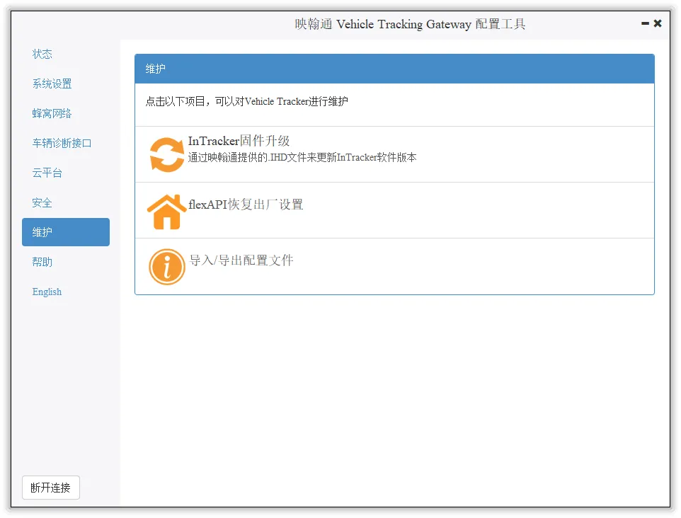

### 4.3.3 导入/导出配置

设备支持配置文件的备份与恢复功能。通过 **维护 >> 导入/配置文件** 页面，用户可导出当前配置进行备份，或导入已有配置文件进行恢复。

- 备份配置：点击"导出配置"按钮。
- 恢复配置：点击"导入配置"按钮。

**导出配置操作**：点击"导出配置"后，配置工具将读取设备当前配置并弹出文件存储窗口。在"File name"文本框中输入备份文件名称，然后点击"Open"按钮完成导出。

> **注意**：导出的配置文件中不包含用户名和密码信息。若需在新设备中导入自定义的用户名和密码，可在导出的配置文件中手动添加：在 `"user":""` 的引号内填入管理员账户名，在 `"passwd":""` 的引号内填入管理员账号密码。修改并保存配置文件后，将其导入新设备，设备重启后即可使用新的管理员账号和密码登录。

## 4.4 日志获取

设备支持通过串口获取运行日志。操作步骤如下：

1. 使用 USB 转串口配置线将电脑与 VT310 相连接，打开串口调试软件（可在 Microsoft Store 中下载）。

2. 打开串口调试软件，选择连接串口，串口默认波特率为 115200/8/N/1。点击 **Open serial port** 打开串口。字符编码模式（Character encoding）选择 **ASCII**，断行模式（Line break）选择 **\n(LF)**。

3. 在发送文本框中输入 `+++`，激活 CLI 模式。

4. 输入用户名 `admin`（回车），点击发送；输入密码 `123456`（回车），点击发送，即可进入命令行模式。

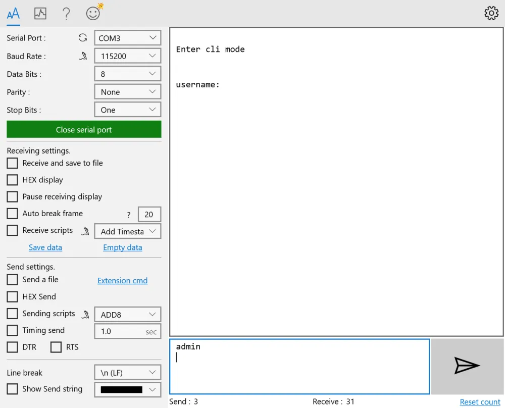

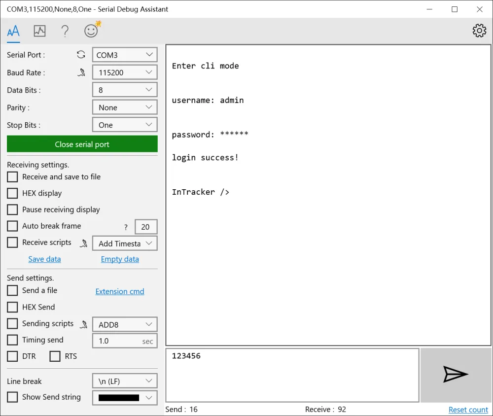

5. 开启日志功能：在发送文本框中输入 `log console enable`（回车），点击发送。接收窗口将显示日志信息。

6. 关闭日志功能：在发送文本框中输入 `log console disable`（回车），点击发送。接收窗口将停止接收日志。

7. 若需要在退出串口后连接配置工具，在发送文本框中输入 `exit`（回车），点击发送以退出 CLI 模式，然后关闭串口。若未手动退出，设备将在 180 秒后自动退出 CLI 模式。

## 附录 其他参考信息

### ODB协议已适配车型列表

以下为已完成ODB协议适配的车型列表：

- 东风天龙
   - 北汽欧曼（BJ4259SNHKB-AA）
   - 依维柯（NJ1045EFCS）
- 东风天锦
   - 依维柯（NJ6725DC）
   - 依维柯（NJ6605DC）
- 中国重汽豪沃
   - 宇通重工
   - 北汽福田

### J1939 协议介绍

J1708是专门针对重型车辆（卡车和客车）开发的一种SAE规范。协议旨在推广用于带微控制器的模块之间通信的标准。标准规范以更经济的方式在设备之间进行数据传送。J1708主要定义了物理层，常见的运行在J1708之上的高层协议是SAE J1587（TMC/SAE 联合的供电子数据交换的微机系统在重型车）和SAE J1922（用于中型和重型公路用柴油车电控传动接口）。

### J1708 协议介绍

J1708是专门针对重型车辆（卡车和客车）开发的一种SAE规范。协议旨在推广用于带微控制器的模块之间通信的标准。标准规范以更经济的方式在设备之间进行数据传送。J1708主要定义了物理层，常见的运行在J1708之上的高层协议是SAE J1587（TMC/SAE 联合的供电子数据交换的微机系统在重型车）和SAE J1922（用于中型和重型公路用柴油车电控传动接口）。
