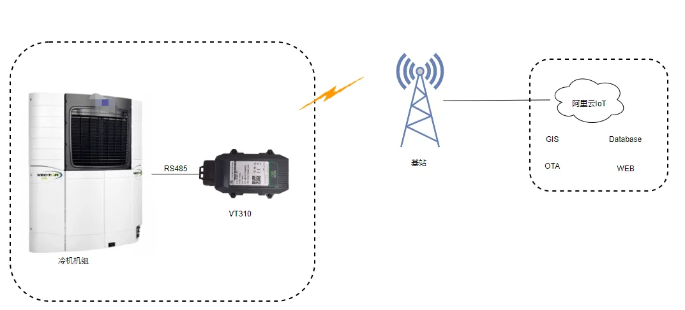

# 运输冷机联网监控解决方案

## 一、方案概述

### 1.1 项目背景

某冷链运输设备企业专注于运输制冷设备的研发制造，为客户提供冷藏运输解决方案。冷链运输对温度控制要求严格，需要实现全程监控和追溯。

### 1.2 建设目标

- 实现运输冷机的远程监控
- 实时监测冷藏车厢温度
- 确保冷链运输品质
- 提升车队管理效率

### 1.3 适用场景

- 冷藏车监控
- 冷链物流管理
- 运输温度追溯
- 车队运营管理

## 二、需求分析

### 2.1 设备现状

- 设备类型：运输冷机、温度传感器、GPS定位器
- 通信接口：4G、GPS
- 通信协议：多种通信协议
- 部署环境：冷藏运输车辆
- 数量规模：多辆冷藏车

### 2.2 核心需求

1. **温度监控需求**：实时监测冷藏车厢温度
2. **远程控制需求**：远程控制冷机启停和温度设定
3. **位置追踪需求**：实时定位车辆位置
4. **报警预警需求**：温度异常及时报警
5. **数据记录需求**：全程温度数据记录和追溯

## 三、总体架构设计

本方案采用车载冷机+4G通信+云平台的架构，实现冷链运输的全程监控。

### 3.1 四层架构

1. **感知层**：冷机控制器、温度传感器、GPS
2. **网络层**：4G车载网关
3. **平台层**：冷链管理平台、云平台
4. **应用层**：温度监控、车辆追踪、报警管理

### 3.2 数据流

冷机/温度传感器 → 4G网关 → 云平台 → 冷链运输管理中心

## 四、网络与接入方案

### 4.1 联网方式选型

采用4G全网通接入，确保运输途中的网络覆盖。

### 4.2 边缘网关选型要点

- 支持4G全网通
- 支持温度传感器接入
- 支持GPS定位
- 支持冷机控制

## 五、协议与数据采集方案

### 5.1 支持协议

- **设备协议**：冷机控制协议
- **物联网协议**：MQTT
- **网络协议**：4G、GPS

### 5.2 北向协议支持

- 支持冷链管理平台接入
- 支持温度数据上报

## 六、方案亮点总结

1. **全程监控**：冷链运输全程温度监控

2. **实时预警**：温度异常实时报警，确保货物品质

3. **远程控制**：远程控制冷机，灵活调整温度

4. **全程追溯**：完整的温度数据记录，支持追溯

5. **车队管理**：车辆定位和运营管理，提升效率
