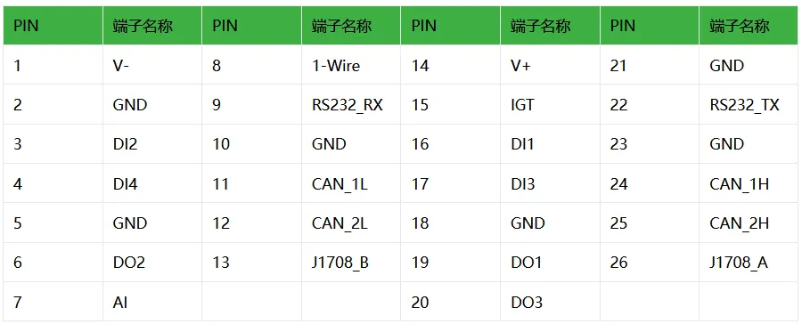
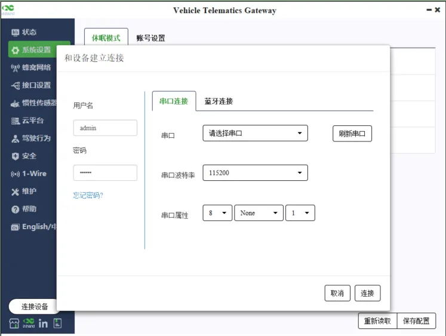
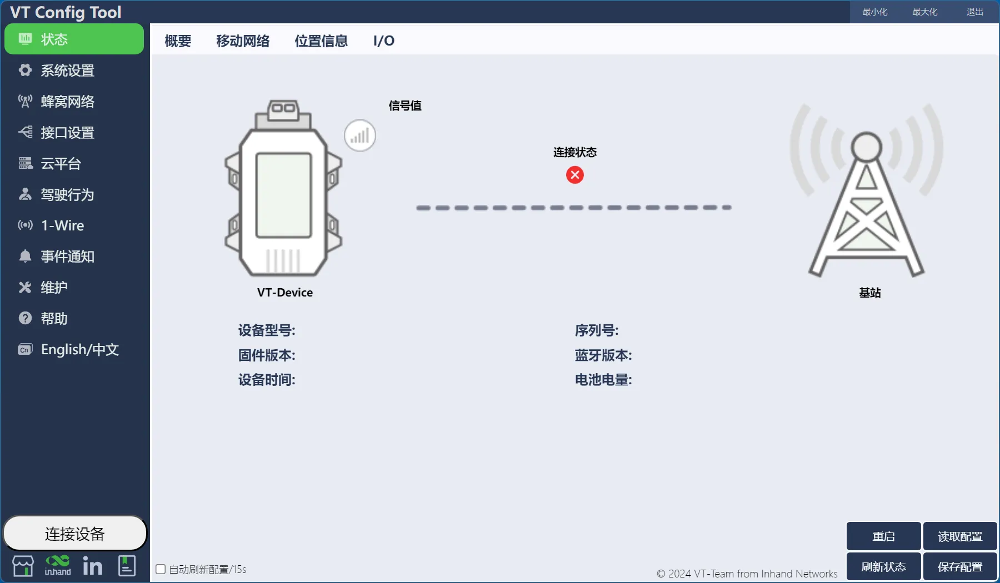
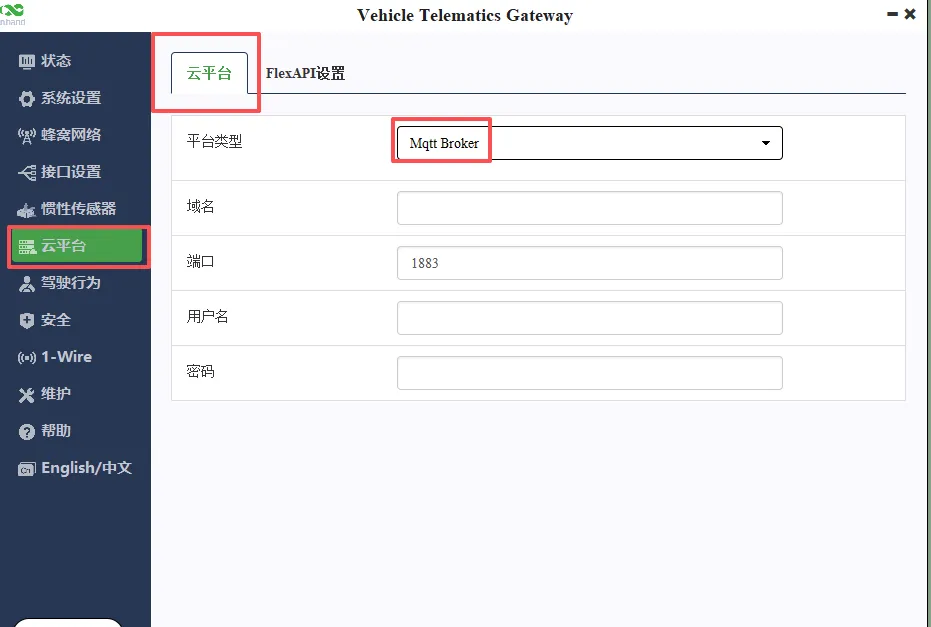
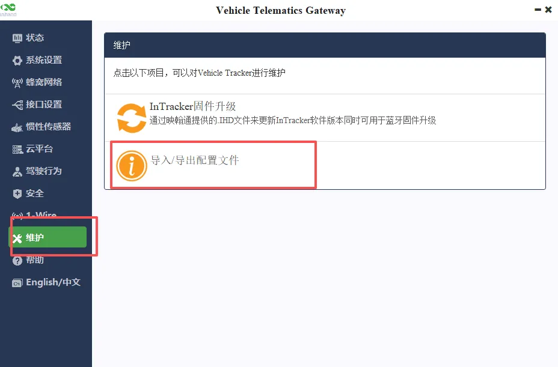
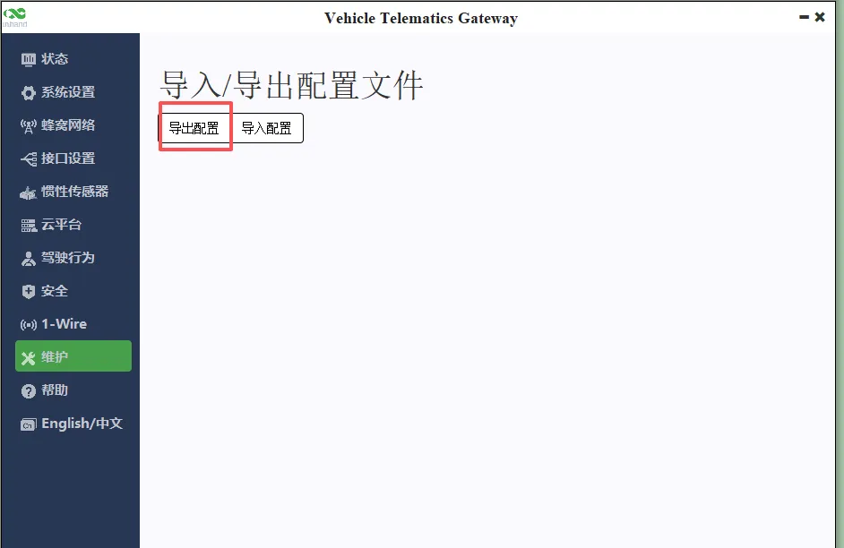
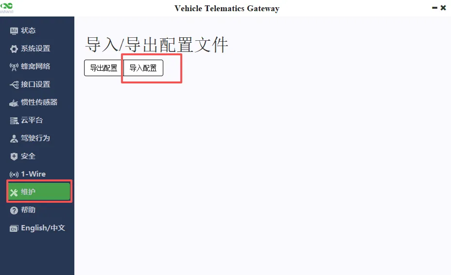

# 车载冷机监控

## 一、文档信息

- **文档名称**：车载冷机监控配置手册
- **产品型号**：VT310
- **固件版本**：V1.1.64
- **适用场景**：物流，商用车辆联网，政务车辆，工程机械
- **编写日期**：2026年4月15日

## 二、VT310车载冷机监控概述

### 2.1 产品简介

VT310 是⼀款可靠耐⽤、功能丰富，性能强劲的⻋载追踪器。VT310 具有 IP66 ⾼等级防护、独特的低功耗设计，可在恶劣环境中稳定⼯作，在⻋辆熄⽕后也能⻓时间运⾏。这款追踪器集成了 LTE、GNSS、陀螺仪和惯性传感器，并具有强劲的处理计算能⼒和多线程操作系统，实时精准定位⻋辆位置，统计⻋辆⾥程，实时监测紧急制动、加速、撞击等突发事件，维护运输货物安全，并记录分析驾驶员⾏为；丰富的 I/O 接⼝，可远程监控多种⻋载外设，例如：报警器，传感器，开关，点⽕状态，控制器等；⽀持标准的OBD-II, J1939, J1708 等⻋辆诊断协议，追踪⻋辆运⾏状态，实现预防式维护。

### 2.2 主要功能

- VT310支持LTE CAT M1、CAT 1和CAT 4
- 内置GNSS模块
- ⽀持Docker容器技术
- 集成了惯性导航系统
- 集成陀螺仪

### 2.3 典型应用拓扑

## 三、硬件说明

## 3.1 外观与接口

## 3.2 接线说明

接口编号位置

接口针脚定义

### 3.2.1 电源接线

- 正极：V+
- 负极：V-
- IGT：点火信号

点火线IGT（Ignition sense，后续简称IGT，也称ACC）：IGT用于与车辆的点火开关相连。VT310可以检测接入车辆是否点火启动。使用20PIN 线缆测试时，将IGT线与V+两条线路链接直流供电电源。

***注意：如果不接点火信号线，设备无法启动***

## 四、出厂默认参数

- 波特率：115200bps
- 用户名：admin
- 密码：123456，如果是随机密码，需对应设备铭牌

## 五、前期准备

1. 电脑安装VT310配置工具

2. 串口线连接电脑与VT310
3. VT310上电，等待设备正常运行
4. 打开软件选择电脑对应的串口，输入正确的参数点连接设备。

## 六、参数配置

### 6.1平台参数设置

平台类型：MQTT Broker
域名：XXXX.XXX.com
端口号：1883
用户名：XXXX
密码：XXX

## 七、导入导出配置文件

### 7.1 导出配置文件

选择维护-导入/导出配置文件-导出配置

### 7.2 导入配置文件

选择维护-导入配置文件-导入文件选择导入配置保存重启生效
