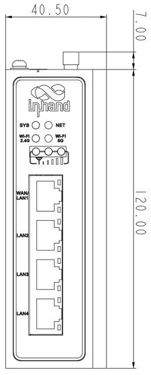
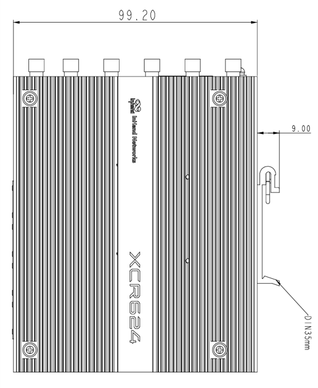
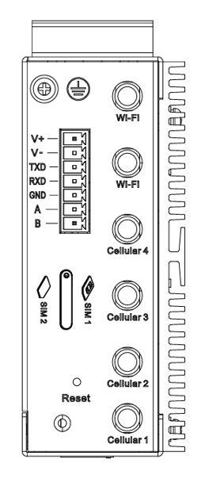

  

    

      
    

    

      信创筑牢可信底座，5G 赋能行业数字化
    

  

  

    

      XCR624 工业级信创路由器
    

    

      

        
· 5G

        
· Wi-Fi 6

      

      

        
· 安全可信

        
· 云管理

      

    

  

# 1. 产品概述

XCR624 系列产品是映翰通面向工业物联网场景自主研发的高性能5G信创路由器。产品基于国产化硬件平台打造，搭载国产CPU、国产基带芯片平台5G模组以及自主安全操作系统，实现芯片、模组、系统软件全链路自主可控，规避供应链断供、恶意后门植入等安全风险。设备支持国密算法加密传输，适用于党政、金融、能源、交通、医疗等关键信息基础设施领域，支撑网络设备国产化替代与信创改造，化解进口设备带来的合规与供应链风险。 

XCR624已具备中国信息通信研究院（中国泰尔实验室）委托检测报告，由权威第三方实验室对送检样机完成硬件元器件拆机核验、国密加密、业务功能等项目实测验证，为产品国产化能力、安全业务能力提供权威第三方佐证，可支撑党政、能源、交通、医疗等信创改造项目的国产化替代能力验证。

## 核心特性

- **全栈自主可控**：国产 CPU + 国产 5G 模组+ 自主安全操作系统，具备中国信息通信研究院（中国泰尔实验室）委托检测报告
- **5G 高速接入**：支持 5G SA/NSA 双模，3GPP Rel.15/16，SA 下行 2 Gbps / 上行 1 Gbps，NSA 下行 2.2 Gbps / 上行 575 Mbps
- **Wi-Fi 6**：802.11ax 双频并发，AX1500，最多支持 128 个终端同时接入（仅限 Wi-Fi 型号）
- **稳定在线**：接口备份、双 SIM 链路切换与智能回切策略、心跳检测与硬件看门狗保障通信连续性
- **安全可信**：集成 IPSec/L2TP/OpenVPN 等多种 VPN、国密算法、状态防火墙、WPA3 加密等多层次安全策略
- **工业级可靠性**：金属机身、宽温工作（-40~70 ℃）、3 级 EMC 电磁兼容防护，适应严苛工业现场
- **云管云维**：接入 DeviceLive 设备云平台，实现批量远程管理与运维

## 典型应用场景

### 党政与公共安全边缘点位

- **公共安全与应急**：公安视频专网、应急通信保障、雪亮工程联网 
- **政务物联感知**：户外感知终端、边境巡检采集点位

### 智慧能源

- **电力行业**：配网自动化站点、变电站边缘接入、光伏 / 风电电站监控
- **油气行业**：油气管道监测站点、野外阀室数据采集回传

### 智慧医疗

- **医院信息联网**：HIS/PACS 数据加密回传、分院间专网互联
- **远程医疗**：远程会诊、远程手术指导高清视频传输
- **公共卫生**：疾控数据采集上报、应急医疗通信

### 工业物联网

- **智能制造**：PLC/CNC 设备联网、MES 数据采集、AGV 调度通信
- **能源行业**：电力配网自动化、光伏电站监控、油气管道监测
- **智慧矿山**：矿井安全监控数据回传、井下设备远程控制

### 智慧交通

- **智慧高速**：ETC 门架通信、路侧单元联网
- **轨道交通**：地铁 PIS 系统、信号设备监控
- **港口场站 / 智能网联车**：场站设备联网、车载视频监控与车辆调度管理。

## 产品尺寸

    
    
正视图

  

  

    
    
侧视图

  

  

    
    
俯视图

  

  

    
<strong>注意事项：</strong>

    
1. 所有尺寸单位为毫米（mm）。

    
2. 所有尺寸为近似值，仅供参考。

    
3. 图纸不得用于生产制造。

    
4. 尺寸可能因部件和制造公差而有所变化。

    
5. 规格如有变更，恕不另行通知。

  

# 2. 产品亮点

## 亮点一：全栈国产化软硬件，具备权威检测报告，支撑信创项目验收

XCR624 采用全栈国产化设计，从芯片到系统实现自主可控：

- **国产 CPU**：采用国产自主 RISC-V 架构四核网关处理器，摆脱对境外芯片的依赖
- **国产 5G 模组**：国产基带芯片平台5G模组，3GPP Rel.15/16
- **自主安全操作系统**：搭载自主安全网络操作系统，支持国密算法
- **第三方委托检测**：已具备中国信息通信研究院（中国泰尔实验室）委托检测报告，可安全应用于政务、金融、能源等关键基础设施领域

> 核心价值：从芯片到操作系统全链路国产可控，带第三方权威检测报告，信创项目验收有据可依。
## 亮点二：多网融合接入，简化现场组网部署

XCR624 集成 5G、Wi‑Fi 6、4 口千兆以太网，多链路合一，一套设备满足多种接入场景，简化现场组网。

- **5G 高速蜂窝**：支持 SA/NSA 双模，SA 下行 2Gbps，NSA 下行 2.2Gbps，Sub‑6G 主流频段全覆盖，无有线环境也可快速开通业务；
- **Wi‑Fi 6 AX1500 双频**，最多支持 128 台终端同时接入，可做 AP 实现本地无线终端联网，支持快速漫游；
- **4 路千兆自适应网口**，端口可自由切换 WAN/LAN，支持 VLAN、Trunk，可做 WAN 外网接入，也可接本地 PLC、摄像头、终端设备；
- 支持静态 IP、DHCP、PPPoE、多 APN、IPv4/IPv6，有线、无线、蜂窝多种入网方式按需选择，减少外接配件。

> 核心价值：5G+Wi‑Fi6 + 千兆多网合一，有线无线灵活接入，简化现场组网，设备入网部署更便捷。

## 亮点三：工业级硬件平台，完备本地接口，适配严苛无人值守现场

XCR624 面向工业严苛工况整机设计，硬件层面筑牢稳定底座，同时配备4路以太网口和两路串口，适配无人值守野外、机柜、车间等各类部署环境。

- 金属机身无风扇被动散热，消除风扇机械故障点；IP30 防护，支持导轨、壁挂两种工业安装方式；
- 宽温工作‑40℃~70℃，满足北方严寒户外、夏季密闭机柜高温环境稳定工作；
- EMC 3 级电磁兼容防护，抗静电、浪涌、辐射干扰，适配电力、工厂强电磁现场；
- DC 9‑48V 宽压供电，具备防反接、过流保护；
- 内置硬件看门狗，系统异常自动自恢复，降低宕机风险；
- 配备1 路 RS232 + 1 路 RS485 工业串口，15KV 静电防护，支持 DTU 透传、Modbus 协议转换，可直连 PLC、传感器等工业现场设备。

> 核心价值：宽温、高抗干扰工业硬件，搭配工业串口接口，恶劣工况长期稳定不死机，直连工业现场设备。

## 亮点四：多层次业务连续保障，抵御业务中断风险

XCR624 构建一整套软硬结合的业务连续保障体系，降低现场断网风险。

- **多接口互为备份**：千兆有线 WAN 与 5G 蜂窝链路互相备份，有线中断自动切蜂窝，蜂窝故障切回有线；
- **双 SIM 智能策略切换**：支持主备卡优先级配置，拨号超时、链路探测失败自动切换备卡；支持基于流量、运行时长、指定周期日期智能回切主卡，兼顾业务稳定与流量成本，适配银行结算、电力调度等关键业务窗口；
- **多层链路探测机制**：心跳包保活，ICMP/DNS/TCP 多模式链路检测，不只看拨号是否成功，真实校验业务通路可用性；
- **硬件级故障自愈**：硬件看门狗守护整机运行，设备死机异常自动重启恢复；链路断线自动重连，减少人工现场干预；
- **链路质量联动预警**：结合 LQM 链路质量监测，链路质量劣化即可提前告警，不等完全断网再触发切换。

> 核心价值：有线 / 蜂窝多接口互备、智能双卡策略、多层链路探测、硬件故障自愈整套能力，全方位保障业务在线，降低现场断网风险。

## 亮点五：端到端安全防护体系，加密‑管控‑审计一体化

XCR624 构建从传输加密、边界防护、设备访问控制到运维审计的完整安全闭环，适配信创关键基础设施安全建设要求。

- **国密加密传输**：支持 SM4 国密算法、国密证书链认证，支持国密 OpenVPN 加密隧道，满足国家密码管理局相关合规要求；同时兼容 IPSec/L2TP/WireGuard 多种 VPN 隧道，满足分支机构加密互联需求；
- **边界防火墙与接入防护**：状态检测防火墙，精细化出入站访问策略；支持 MAC 地址、URL 域名黑白名单过滤；支持 802.1X 端口接入认证；可关闭 WAN 侧 Ping 响应，收敛网络攻击面；
- **设备管理权限加固**：HTTP/HTTPS/SSH/Telnet 管理服务可独立开关、自定义端口，支持绑定可信源 IP；SNMP v3 采用 SHA 认证 + AES 加密，规避传统网管协议明文泄露风险；
- **完整运维审计闭环**：支持远程 Syslog 日志外发、SMTP‑TLS 加密邮件告警；登录、配置变更、链路状态等全量事件记录留存，操作行为可追溯；
- **无线安全加固**：Wi‑Fi 支持 WPA3 企业级加密，提升无线接入安全等级。

> 核心价值：国密加密、边界防护、权限管控、日志审计一体化，降低关键基础设施项目安全整改成本。

## 亮点六：云‑本地双运维模式，灵活适配集中运维与隔离部署场景

XCR624 兼容两种运维模式：可对接 DeviceLive 设备云平台实现集中管理，也可完全本地 Web/CLI 独立配置使用，方案选择更加灵活。

- **云端集中运维能力**：接入 DeviceLive 云平台，支持设备状态监控、批量配置下发、远程固件升级、流量与信号统计；
- **远程故障诊断**：支持远程 Ping、Traceroute、抓包、测速，远程定位网络问题，减少现场出差；
- **告警通知**：链路异常、信号异常可配置邮件告警，及时掌握设备运行状态；
- **云平台权限安全管控**：支持多角色分级权限管理，操作日志留痕；
- **本地独立运行**：不依赖云平台，通过 Web 界面、SSH/CLI 命令行完成全部设备配置管理，满足隔离网、涉密等不允许上云的项目场景。

> 核心价值：云管 / 本地双模式可选，具备完善远程运维手段，兼顾分布式集中运维与隔离场景本地部署。

# 3. 硬件规格

| 项目 | 规格 |
| ------------- | --------------------------------------- |
| **处理器** | 国产自主 RISC-V 架构四核网关处理器 |
| **内存** | 256 MB DDR3 |
| **存储** | 128 MB SPI NAND Flash |
| **5G 模组** | 国产展锐平台模组，3GPP Release 15/16 |
| **SIM 卡槽** | 抽屉式卡座，支持2 × Nano-SIM |
| **以太网端口** | 4 × 10/100/1000 Mbps RJ45 独立管理交换端口，支持 WAN/LAN/VLAN，1.5KV 网络隔离变压保护；每端口独立配置速率（Auto/10/100/1000）、模式（Access/Trunk）、PVID/VID |
| **串口** | 1 × RS232 + 1 × RS485（静电放电防护 15KV）|
| **Wi-Fi** | Wi‑Fi 6 (802.11ax) ，双频AX1500，2.4G 20dBm / 5G 20dBm |
| **蜂窝天线** | 4 × SMA 接头（5G 蜂窝天线） |
| **Wi‑Fi 天线** | 2 × RP-SMA 接头 |
| **供电** | DC 9~48V，2-PIN 工业端子，防过流、防反接 |
| **功耗** | 待机 370~480 mA@12V，工作 415~530 mA@12V，峰值 530 mA@12V |
| **复位按钮** | 1 × 针孔式复位按键 |
| **接地端子** | 支持 |
| **LED指示灯** | SYS（系统状态）x1、NET（联网状态）x1、2.4G Wi-Fi x1、5G Wi-Fi x1、信号强度指示灯 x3 |
| **散热** | 金属外壳无风扇被动散热 |
| **防护等级** | IP30 |
| **外壳材质** | 金属机身 |
| **颜色** | 黑色 |
| **尺寸（W × D × H）** | 127 × 108.2 × 40.5 mm |
| **重量** | 544g |
| **安装方式** | 导轨安装、壁挂安装 |
| **工作温度** | -40 ~ 70 ℃ |
| **存储温度** | -40 ~ 85 ℃ |
| **相对湿度** | 5% ~ 95%（无凝霜）|

# 4. 网络连接

## 4.1 5G/4G 蜂窝网络

- **网络制式：**
  - 5G：NR SA/NSA，Sub-6 GHz，3GPP Release 15/16
  - 4G：LTE FDD / LTE TDD
  - 3G：WCDMA
- **速率规格：**
  - SA：下行最高 2 Gbps / 上行最高 1 Gbps
  - NSA：下行最高 2.2 Gbps / 上行最高 575 Mbps
- **高级蜂窝功能：**
  - **5G 模式选择**：支持 SA/NSA/SA-NSA 双模切换
  - **频段锁定**：支持 LTE 和 NR 频段手动锁定与过滤
  - **多 APN 配置**：支持 4 个独立 APN 配置文件，分别配置接入点、认证（auto/PAP/CHAP）、用户名/密码
  - **PDP 类型**：IPv4/IPv6 可选
  - **SIM 卡 PIN 码**：支持 SIM 卡 PIN 码保护
  - **IMS 配置**：支持 VoLTE IMS 开启/关闭
  - **连接模式**：always-online（始终在线）
  - **流量套餐管理**：支持 SIM1/SIM2 分别配置月度流量套餐阈值告警（GB 级可配），超限策略支持告警通知

| 网络类型 | 支持频段 |
| ---------- | ------------------------------------------------------------ |
| **5G NR** | n1/n3/n5/n8/n28A/n41/n77/n78/n79 |
| **LTE FDD** | B1/B3/B5/B8 |
| **LTE TDD** | B34/B38/B39/B40/B41 |
| **WCDMA** | B1/B5/B8 |

## 4.2 SIM 卡管理

- **双 SIM 卡设计**：2 × Nano-SIM 抽屉式卡座
- **智能切换：**
  - 拨号失败自动切换
  - 链路探测失败自动切换
  - 可配置切换策略
- **双卡策略备份（Dual SIM Backup）：**
  - 支持指定主卡，主/备卡优先级可调
  - 拨号超时时长可配置（默认 120 秒）
  - **基于时长的回切策略**：备卡运行指定时长后回切主卡
  - **基于流量的回切策略**：备卡运行消耗指定流量后回切主卡
  - **回切日期可配置**：按天周期回切

## 4.3 有线网络

- **WAN 口**：4 × 10/100/1000 Mbps RJ45，支持 WAN/LAN 可配；每个端口独立配置速率（Auto/10/100/1000）、模式（Access/Trunk）、PVID/VID
- **VLAN 支持**：基于端口的 VLAN 划分，支持 Access/Trunk 端口模式
- **IPv6 支持**：完整 IPv6 功能
- **链路聚合**：支持多 WAN 接口备份与负载均衡

## 4.4 Wi-Fi 6 无线接入

- **标准**：IEEE 802.11ax (Wi‑Fi 6)，向下兼容 802.11a/b/g/n/ac/ac Wave2
- **频段**：2.4 GHz + 5 GHz 双频并发
- **无线规格**：AX1500
- **最大连接终端数**：128
- **工作模式**：AP / Client，支持 Wi‑Fi Portal
- **安全**：WPA3-PSK / WPA2-PSK / WPA3-Enterprise / WPA2-Enterprise
- **漫游**：支持 802.11k/v/r 快速漫游

# 5. 链路管理与备份

## 5.1 智能链路备份

- **备份模式**：主备模式、接口备份
- **探测方式**：心跳包检测，断线自动重连
- **切换策略**：
  - 链路故障时实时切换
  - 双 SIM 链路自动切换

## 5.2 链路质量监控

- **实时监控**：实时显示链路状态、时延、抖动、丢包率和吞吐率
- **蜂窝信号监控**：实时查看 RSRP、RSRQ、RSSI、SINR 等关键信号指标
- **健康检查**：自动化链路健康评估
- **告警通知**：链路异常即时邮件告警
- **链路质量检测**（Link Quality Monitor）：支持告警阈值配置，链路异常时可触发邮件告警
  - **时延检测**：时延超标阈值及持续周期可配置
  - **抖动检测**：抖动超标阈值及持续周期可配置
  - **丢包率检测**：丢包率超标阈值及持续周期可配置
  - **信号强度检测**：信号强度超标阈值及持续周期可配置
  - **检测模式**：支持 ICMP、DNS 解析、TCP 连接三种链路检测模式

# 6. 安全特性

## 6.1 国密算法

- **国密支持**：支持 SM4 国密算法，满足国家密码管理局合规要求
- **国密 VPN**：支持基于国密算法的OpenVPN 加密传输
- **数字证书**：支持国密证书链认证

## 6.2 防火墙

- **状态检测**：基于连接状态的数据包检测
- **入站规则**：精细化入站访问控制，支持默认策略（允许/拒绝）
- **出站规则**：出站流量策略管理，支持默认策略（允许/拒绝）
- **端口转发**：端口映射和 NAT 穿透支持
- **NAT**：网络地址转换（NAT），支持 SNAT/DNAT，支持 NAT 规则自定义
- **MAC 过滤**：基于 MAC 地址的访问控制（黑/白名单模式）
- **域名过滤**：基于域名的 URL 级别访问控制（黑/白名单模式）
- **协议过滤**：基于 IP/端口/协议过滤
- **802.1X**：基于端口的网络访问控制

## 6.3 VPN 支持

- IPSec VPN
- L2TP VPN
- OpenVPN
- WireGuard VPN

# 7. 本地网络服务

## 7.1 接口管理

- **接口配置**：支持端口模式切换（WAN/LAN）、VLAN 配置
- **接口状态**：实时显示 UP/DOWN 状态

## 7.2 WAN 接入

- **接入协议**：静态 IP、DHCP、PPPoE
- **接入认证**：APN、VPDN、CHAP/PAP

## 7.3 DHCP 服务

- **DHCP 服务器**：多地址池配置
- **DHCP 中继**：跨子网 DHCP 服务
- **租约管理**：灵活的 IP 租约配置

## 7.4 DNS 服务

- **DNS 代理**：本地 DNS 缓存和转发
- **DDNS**：支持动态域名解析
- **自定义 DNS**：多 DNS 服务器配置

## 7.5 静态地址分配

- **IP-MAC 绑定**：静态地址分配
- **冲突检测**：自动 IP 地址冲突检测

## 7.6 流量整形

- **带宽限制**：接口级带宽控制
- **流量整形**：基于队列的精细化流量管理
- **QoS 保证**：关键业务流量优先保障

## 7.7 路由协议

- **静态路由**：多条静态路由配置，灵活的路由优先级设置
- **动态路由**：支持 BGP、OSPF 动态路由协议

## 7.8 策略路由

- **智能流量引导**：基于源/目的地址、端口和协议的策略路由
- **强制路由**：指定流量强制走特定出接口

## 7.9 IP 透传 (IP Passthrough)

- **桥接模式**：蜂窝网络 IP 透传
- **灵活配置**：支持多种透传模式

## 7.10 IP 应用

TCP、UDP、IPv4/IPv6、ICMP、NTP、DNS、HTTP/HTTPS、SSL/TLS、PPP、SSH、Telnet

## 7.11 DTU / 协议转换

- **DTU 功能**：支持 TCP/UDP 透明传输
  - 支持长连接/短连接模式，心跳保活、断线重连
  - 并发服务器连接，数据缓冲区与拆包策略可配
  - 本地 IP 绑定、设备标识
- **协议转换**：支持 Modbus RTU 转 Modbus TCP，满足工业自动化设备联网需求
  - 支持 Modbus 网关 Server/Client 模式
  - 本地端口可配，传输间隔与超时时长可配置

## 7.12 AT 指令代理（AT Agent）

- **AT Server**：通过 TCP 网络远程发送 AT 指令给蜂窝模组，端口与空闲超时可配
- **AT 透传**：通过串口（RS232/RS485）直接发送 AT 指令给蜂窝模组，串口参数可配置

## 7.13 访客网络（Guest Network）

- **独立访客 VLAN**：与主网络逻辑隔离
- **上行链路策略**：访客流量可指定出接口（任意/指定接口）
- **接入时长控制**：访客网络接入时长可配置

# 8. 云端管理与运维

XCR624 由 InHand DeviceLive 云管理平台驱动，实现设备全生命周期远程管理。

## 8.1 集中管理能力

- **设备监控**：实时监控设备状态，仪表盘展示设备信息、接口状态、精细化流量统计
- **远程配置**：通过云端远程配置网络参数，批量部署
- **固件升级**：远程批量固件升级，降低人为错误风险
- **故障诊断**：远程运行诊断命令，即时获取结果
- **告警管理**：链路告警、信号告警等异常事件记录与通知
- **MQTT 连接**：设备端 MQTT keepalive 可配置，支持指定云连接出接口

## 8.2 远程维护工具

- **状态查询**：仪表盘-设备信息、接口状态、精细化流量统计
- **链路监控**：链路时延、抖动、丢包、吞吐率监控
- **信号监控**：实时查看蜂窝信号强度、RSSI、RSRP、RSRQ、SINR
- **远程诊断**：Ping、Traceroute、抓包、测速

## 8.3 邮件告警

- **SMTP 邮件告警**：支持配置 SMTP 服务器，TLS 加密传输
- **多接收人**：支持多个告警接收邮箱
- **告警事件**：链路状态变化、信号异常、设备重启等事件邮件通知

# 9. 系统管理与维护

## 9.1 设备管理

- **Web 管理**：直观的 Web 配置界面（HTTPS 本地/远程访问）
- **CLI 管理**：命令行配置（SSH/Telnet 远程访问）
- **管理访问控制**：HTTP/HTTPS/SSH/Telnet 各自独立启用、端口可配、支持绑定受信任源 IP 地址
- **Ping 响应控制**：支持 WAN 侧 Ping 响应开启/关闭
- **配置导入/导出**：配置文件备份和恢复
- **恢复出厂设置**：通过复位按键一键恢复
- **固件升级**：Web / 云端多模式升级
- **定时重启（Schedule Reboot）**：支持按从不/每天/每周/每月策略定时重启设备
- **Web 会话超时**：Web 管理会话超时时长可配置

## 9.2 日志与诊断

- **系统日志**：详细的系统运行日志和诊断日志，支持本地查看
- **远程 Syslog**：支持将系统日志发送至远程 Syslog 服务器（支持配置 2 个独立服务器地址及端口 514）
- **事件记录**：设备事件（登录、连接、重启等）记录与查询
- **诊断工具**：Ping、Traceroute、网络抓包、Iperf 测速

## 9.3 告警管理

- **告警类型**：链路告警、信号告警等
- **告警通知**：邮件告警通知

## 9.4 SNMP 网络管理

- **SNMP v1/v2c**：支持只读/读写 Community 配置
- **SNMP v3**：支持用户级认证与加密，认证协议 SHA/MD5，加密协议 AES/DES

## 9.5 系统特性

- **工作模式**：支持路由模式（fat_routing）、桥接模式（bridge）切换
- **SFE 快速转发**：硬件快速转发加速引擎，提升 NAT 转发性能
- **SIP ALG**：SIP 应用层网关，确保 VoIP 语音流量穿越 NAT
- **环路检测**：自动检测网络环路，防止广播风暴
- **NTP 服务**：支持 NTP 时间同步，可配置多个 NTP 服务器地址

## 9.6 可靠性保障

- **硬件看门狗**：内嵌硬件看门狗，运行故障自修复
- **双卡切换**：双 SIM 链路故障自动切换
- **接口备份**：有线/蜂窝接口相互备份
- **断线重连**：心跳包检测，断线自动重连

# 10. 订购信息

## 10.1 型号说明

**Model code:** XCR624-\<WMNN\>-\<WLAN/NA\>-S

- \<WMNN\>：无线通讯类型
- \<WLAN/NA\>：WLAN 表示支持 Wi‑Fi 6，NA 表示不支持 Wi‑Fi
- S：表示支持串口（1×RS232 + 1×RS485）

| 型号 | 区域 | 蜂窝制式与频段 | WLAN/NA                      | S |
| -------- | ----------- | -------------- | ----- | ---- |
| XCR624-CNNR-\<WLAN/NA\>-S | 中国 | 5G NR：n1/n3/n5/n8/n28A/n41/n77/n78/n79 LTE FDD：B1/B3/B5/B8 LTE TDD：B34/B38/B39/B40/B41 WCDMA：B1/B5/B8 | WLAN: Wi-Fi6 NA: 无Wi-Fi | S：1×RS232+1×RS485 |

## 10.2 包装清单

- XCR624 路由器 × 1
- 12V/2A 电源适配器 × 1
- 1.5 m RJ45 网线 × 1
- 取卡针 x 1
- 天线（按型号附带）

# 11. 可靠性标准与认证

## 11.1 防护等级

- **IP 等级**：IP30

## 11.2 机械可靠性

- **振动**：整机振动测试；符合 IEC 60068-2-6
- **冲击**：符合 IEC 60068-2-27
- **自由跌落**：含包装 75 cm；外箱 1 m；符合 IEC 60068-2-32

## 11.3 EMC 电磁兼容

| 标准 | 等级 | 测试项目 |
|------|------|----------|
| EN61000-4-2 | Level 3 | 静电放电抗扰度 |
| EN61000-4-3 | Level 3 | 辐射电场抗扰度 |
| EN61000-4-4 | Level 3 | 脉冲电场抗扰度 |
| EN61000-4-5 | Level 3 | 浪涌抗扰度 |
| EN61000-4-6 | Level 3 | 传导骚扰抗扰度 |
| EN61000-4-8 | >Level 3 | 工频磁场抗扰度（水平/垂直 400A/m）|
| EN61000-4-12 | Level 3 | 震荡波抗扰度 |

## 11.4 认证与合规

| 认证类型 | 规格 |
|----------|------|
| **合规认证** | SRRC\*、CTA\* |
| **环保认证** | RoHS/Reach |

注：*表示暂未获得。

# 12. 技术支持

- **官网**：[映翰通官网](https://www.inhand.com.cn)
- **版权声明**：©映翰通网络 保留所有权利
