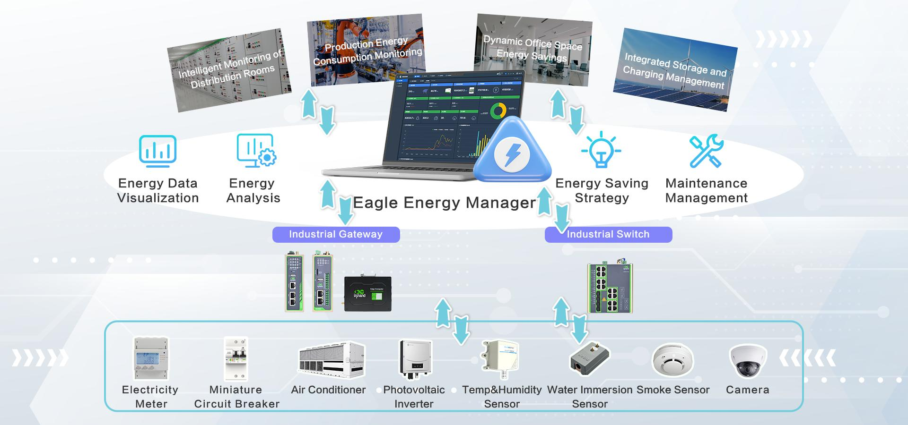
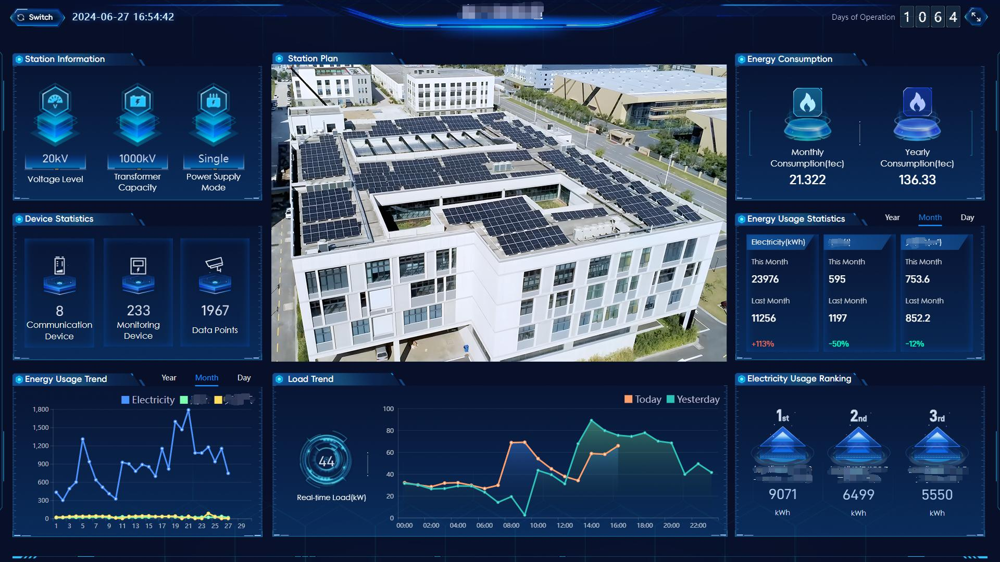
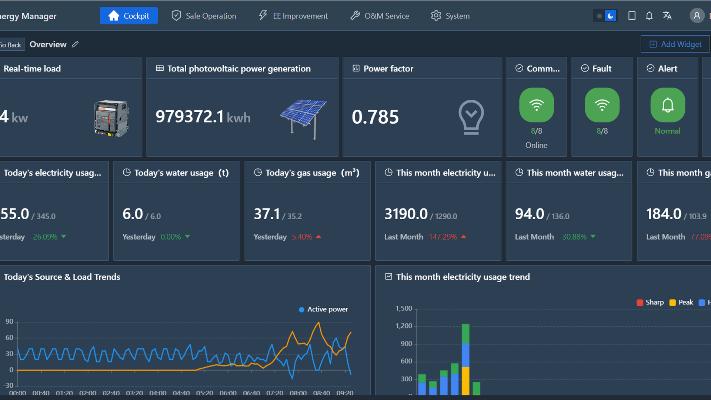
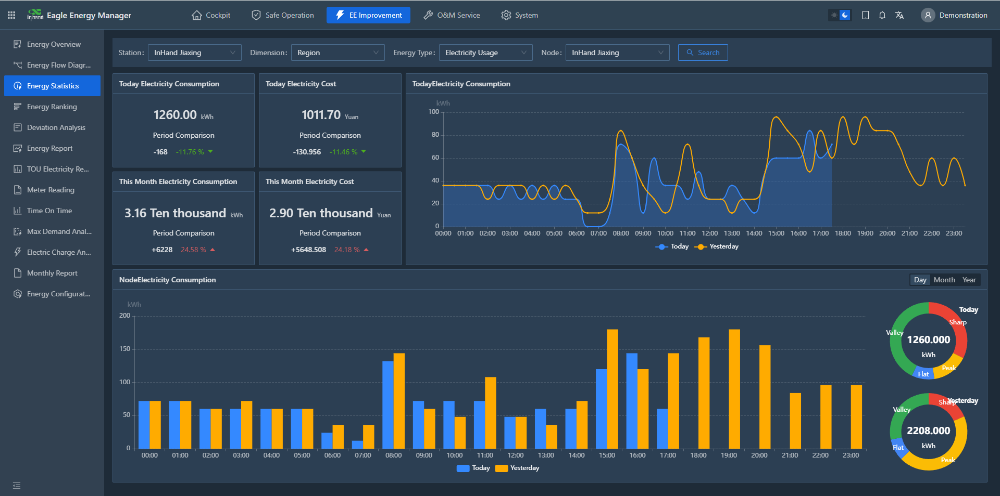
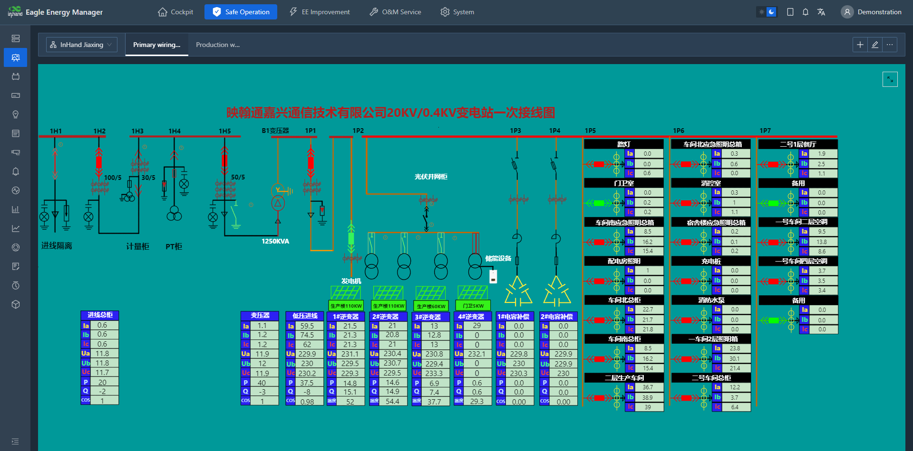
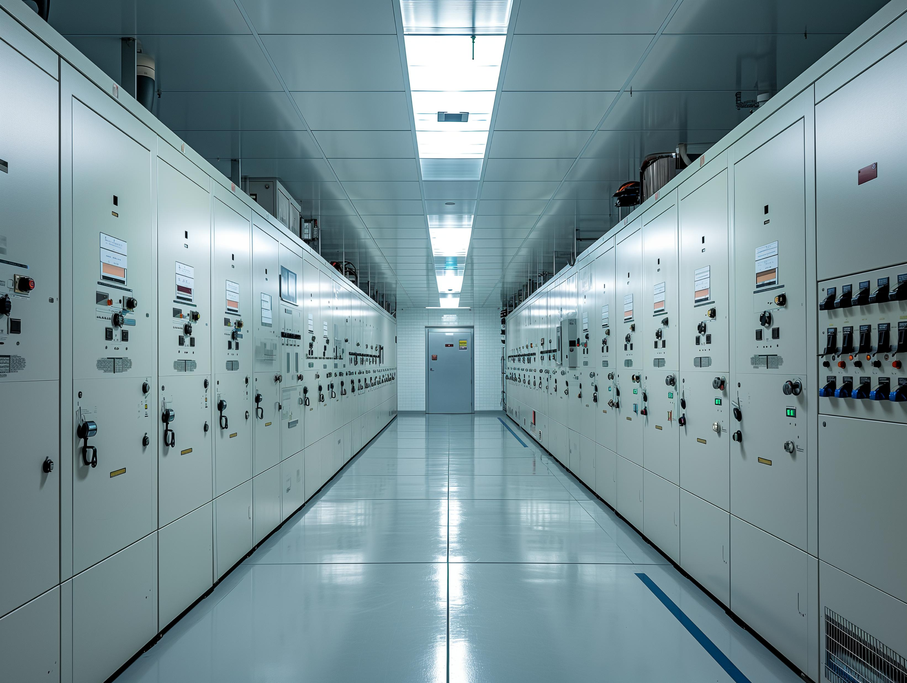
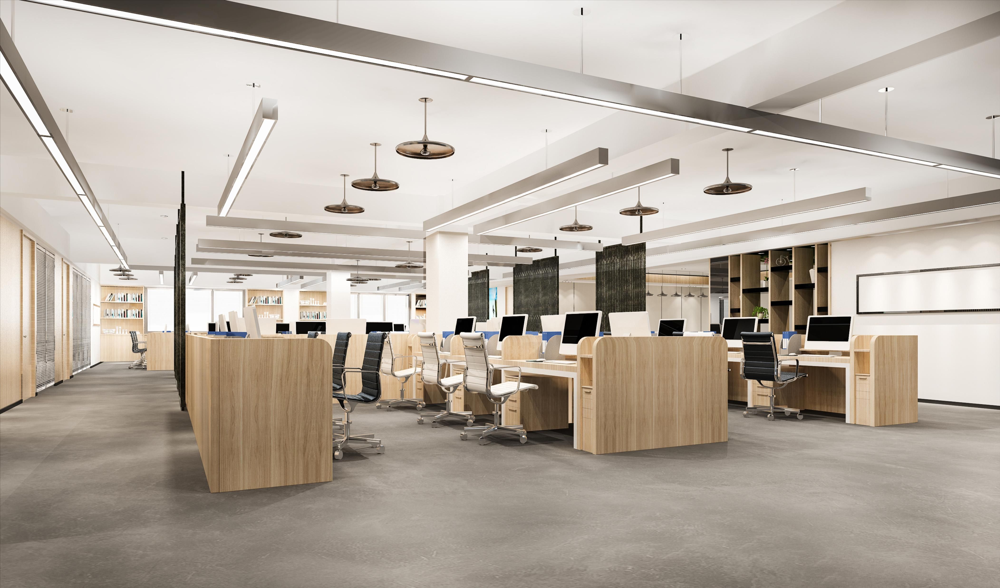
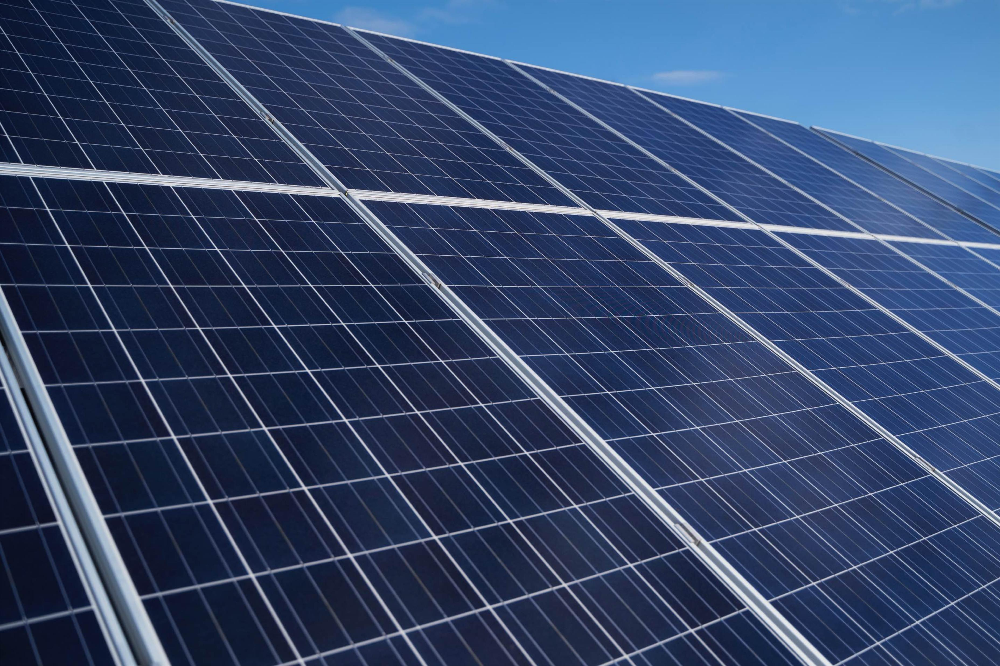

  

    

      
    

    

      监测 · 分析 · 节能 · 减碳
    

  

  

    

      白鹰能源管家
    

    

      

        
· 实时监控

        
· 能效分析

      

      

        
· 云端平台

        
· 节能减排

      

    

  

# 1. 产品概述

## 简介

全球能源供应面临多重挑战。随着气候变化与环境污染加剧，节能减碳已成为国际共识。为有效应对这些挑战，亟需高效的节能减碳解决方案。

**白鹰能源管家（xEnergy）** 提供云到端的一体化方案，帮助企业快速实现能源监测与分析，支撑节能降耗、减排目标，并保障设备安全可靠运行。

## 方案架构（白鹰能源管家）

架构自上而下包括：

- **应用场景**：配电房智能监控 · 生产能耗监测 · 办公空间动态节能 · 光储充一体化管理
- **白鹰能源管家（云平台）**：能源数据可视化 · 能效分析 · 节能策略 · 运维管理
- **边缘层**：工业网关 · 工业交换机
- **现场设备**：电表 · 微型断路器 · 空调 · 光伏逆变器 · 温湿度传感器 · 水浸传感器 · 烟雾传感器 · 摄像机

### 方案价值

|   | 价值 | 说明 |
|---|---|---|
| 1 | **实时监控** | 直观掌握设备运行状态，及时响应故障告警。 |
| 2 | **能耗分析** | 全面了解水电等能源使用情况，优化用能并降低能源成本。 |
| 3 | **运营分析** | 快速洞察运营状况，提升运营效率。 |
| 4 | **节能降耗** | 通过节能策略优化用能，减少碳排放。 |
| 5 | **在线运维** | 提升运维效率，规范运维流程，增强过程透明度。 |
| 6 | **用电安全监测** | 多维度分析电能质量，保障设备与人员安全。 |

# 2. 方案特点

### 软件特点

**实时监控**
- 设备状态统一监控
- 基于 Web 的设备状态可视化
- 设备告警通知
- 设备运行趋势
- 视频监控

**能效分析与优化**
- 能源成本跟踪
- 能耗报表
- 月度分析报告
- 定制化分析看板
- 可配置节能策略

**运维管理**
- 在线抄表
- 设备巡检计划管理
- 运维工单管理

### 硬件特点

**丰富的硬件接口** — 支持蜂窝、以太网、Wi-Fi 等多种联网方式；提供串口、LoRa、IO 等接口，可灵活扩展。

**丰富的产品选型** — 能源网关、交换机、智能电表及各类传感器可选，轻松满足不同需求。

**多协议支持** — 支持多种工业协议，适配不同场景的数据采集需求。

### 平台界面示意

  

    

      
    

    
场站 / 光伏大屏

  

  

    

      
    

    
白鹰能源管家驾驶舱

  

  

    

      
    

    
能耗统计分析

  

  

    

      
    

    
自定义 Web 组态

  

# 3. 功能清单

| 类别 | 功能 | 说明 |
|---|---|---|
| **大屏与看板** | 场站/光伏大屏 | 提供科技感强的场站能耗与光伏发电展示大屏。 |
| | 定制化看板 | 按企业实际情况自定义关键数据可视化展示。 |
| **实时监控** | 设备状态监控 | 支持各类设备的实时数据、历史数据及告警状态监控。 |
| | 自定义 Web 组态 | 直观定制基于 Web 的可视化界面。 |
| | 节能策略 | 依据企业排班、环境温度等，对空调、照明等实施节能策略。 |
| | 告警管理 | 支持自定义告警触发条件，并通过 Web、短信、手机 APP 等多种方式推送。 |
| | 定时控制 | 按业务需要统一对设备进行定时控制。 |
| **能效分析** | 能流图 | 可视化展示能源分配路径，识别潜在浪费点，优化用能效率。 |
| | 能耗统计 | 支持能耗与成本的统计分析，识别异常用能。 |
| | 同比与环比 | 支持相邻周期或不同年份同期数据对比。 |
| | 自定义报表 | 按实际业务需要配置所需报表数据。 |
| | 偏差分析 | 将实际能耗与基线或预期值对比，识别能耗异常。 |
| | 用能排名 | 支持按不同管理维度及能源类型进行排名分析。 |
| | 能耗报告 | 提供日/月/年能耗与成本报告，便于分析企业经营情况。 |
| | 分时电价报告 | 分析企业用电规律，优化设备排程，降低用电成本。 |
| | 在线抄表 | 支持在线抄表功能。 |
| | 月度报告 | 准确评估设备健康与用电合理性，提供实用节费建议，保障设备可靠运行。 |
| **运维管理** | 运维管理 | 通过在线管理应对关键挑战：规范内容、提升流程透明度。 |
| **系统管理** | 组织管理 | 按组织架构灵活分配数据权限。 |
| | 角色管理 | 自定义用户功能权限，精细控制页面访问，满足多样化授权需求。 |
| **移动 APP** | 设备状态监控 | 在手机端监控设备状态与历史趋势。 |
| | 告警通知 | 在移动端实时接收告警，及时响应运行异常。 |
| | 运维管理 | 在手机端直接管理运维工单。 |

> 平台地址：[xenergy.inhandcloud.cn](https://xenergy.inhandcloud.cn)

# 4. 应用场景

  

    
配电房智能监控

    

      
    

    
实时监测配电房电力设备与环境状况，保障电力系统安全高效运行与用能效率。

  

  

    
生产能耗监测

    

      
    

    
帮助企业掌握生产线能耗，优化用能，提升生产效率。

  

  

    
办公空间动态节能

    

      
    

    
帮助管理者了解用能情况，为节能目标提供数据支撑；通过自动化节能措施提升用能效率、降低能源成本。

  

  

    
光储充一体化管理

    

      
    

    
监控管理光伏发电、储能与充电设备，实现电能存储、调度与充电管理，提升用能效率与系统稳定性。

  

# 5. 联系我们

映翰通网络是领先的物联网解决方案提供商，成立于 2001 年，致力于推动各行业数字化转型，助力客户释放潜力、实现加速增长。

我们专注于为企业网络、工业与楼宇物联网、数字能源、智慧商业及车联网等多元领域提供工业级连接方案。产品与服务覆盖智能工厂、智能电网、智能交通、智慧城市等全球应用场景，业务遍及 60 多个国家与地区。

- **官网：** [映翰通官网](https://www.inhand.com.cn)
- **平台：** [xenergy.inhandcloud.cn](https://xenergy.inhandcloud.cn)
- **版权声明：** © 映翰通网络 保留所有权利
